# Arch

### ARM Architecture

#### Architecture,Core,CPU,SOC

##### 基础概念

###### ARM architecture

ARM architecture，是指 ARM 公司开发的、基于精简指令集架构(RISC, Reduced Instruction Set Computing architecture)的指令集架构(Instruction set architecture)。常说的 ARMv7、ARMv8、ARMv8-A，就是指 ARM architecture。类似的基于 RISC 的 architecture 也有很多，例如 MIPS、AVR、Blackfin 等等，都是这个概念。

###### ARM core

ARM core 是基于 ARM architecture 开发出来的 IP core，它是介于 architecture 和最终的 CPU(MCU) 之间的中间产品，这也是 ARM 商业模式的独特之处。有两种类型的 ARM core：一种是 ARM 公司自己发布的，如 ARM7、ARM9、ARM Cortex M3、ARM Cortex A57 等等；另一种是 ARM 授权其它公司开发的 Core，如苹果的 A6/A6X 等等。

###### ARM CPU(MCU)

其它的芯片厂商，如 Phillips、ST、TI 等，会基于 ARM 公司发布的 Core，开发自己的 ARM 处理器，这称作 ARM CPU(也可称为 MCU)。如 LPCxxxx、STM32xxx、OMAPxxxx、S3Cxxxx 等等。

###### ARM Soc

对于一些比较专业的应用场景，如视频、音频等，为了追求更小的 size、更低的功耗，厂商会在芯片上，集成除处理器之外的东西，如视频编解码器、DSP 等。这些集成了其它功能的芯片，称作片上系统(SOC)，如 TI 的 DM37x Video SOC。


#### WFI/WFE

WFI(Wait for interrupt) 和 WFE(Wait for event) 是两个让 ARM 核进入 low-power standby 模式的指令，由 ARM architecture 定义，由 ARM core 实现。

##### 共同点

WFI 和 WFE 的功能非常类似，以 ARMv8-A 为例，主要是将 ARMv8-A PE(Processing Element, 处理单元)设置为 low-power standby state。需要说明的是，ARM architecture 并没有规定 low-power standby state 的具体形式，因而可以由 ARM core 自行发挥，根据 ARM 的建议，一般可以实现为 standby(关闭 clock、保持供电)、dormant、shutdown 等等。但有个原则，不能造成内存一致性的问题。以 Cortex-A57 ARM core为例，它把 WFI 和 WFE 实现为 put the core in a low-power state by disabling the clocks in the core while keeping the core powered up，即通常所说的 standby 模式，保持供电，关闭 clock。

##### 不同点

它们的区别体现在进入和退出的方式上。对 WFI 来说，执行 WFI 指令后，ARM core 会立即进入 low-power standby state，直到有 WFI Wakeup events 发生。而 WFE 则稍微不同，执行 WFE 指令后，根据 Event Register(一个单 bit 的寄存器，每个 PE 一个)的状态，有两种情况：如果 Event Register 为 1，该指令会把它清零，然后执行完成(不会 standby)；如果 Event Register 为 0，和 WFI 类似，进入 low-power standby state，直到有 WFE Wakeup events 发生。

WFI wakeup event 和 WFE wakeup event 可以分别让 Core 从 WFI 和 WFE 状态唤醒，这两类 Event 大部分相同，如任何的 IRQ 中断、FIQ 中断等等。而最大的不同是，WFE 可以被任何 PE 上执行的 SEV 指令唤醒。所谓的 SEV 指令，就是一个用来改变 Event Register 的指令，有两个：SEV 会修改所有 PE 上的寄存器；SEVL，只修改本 PE 的寄存器值。

##### 使用场景

WFI 一般用于 cpuidle。WFE 的一个典型使用场景，是用在 spinlock 中(可参考 arch_spin_lock)。spinlock 的功能，是在不同 CPU core 之间，保护共享资源。使用WFE的流程是：

1. 资源空闲
2. Core1 访问资源，acquire lock，获得资源
3. Core2 访问资源，此时资源不空闲，执行 WFE 指令，让 core 进入 low-power state
4. Core1 释放资源，release lock，释放资源，同时执行 SEV 指令，唤醒 Core2
5. Core2 获得资源

以往的 spinlock，在获得不到资源时，让 Core 进入 busy loop，而通过插入 WFE 指令，可以节省功耗，也算是因祸(损失了性能)得福(降低了功耗)吧。


#### ARMv8-A 架构简介

ARMv8(当前只有 A 系列，即 ARMv8-A)架构，是 ARM 公司为满足新需求而重新设计的一个架构，是近 20 年来，ARM 架构变动最大的一次。它引入的 Execution State、Exception Level、Security State 等新特性。

##### 背景

最初的 ARMv4(ARM7 系列)，到最近的 ARMv7(Cortex-A,-M,-R 系列)，都是针对功耗比较敏感的移动设备的，就性能而言，基于 ARM 处理器的设备，始终无法和 PC 相提并论。但从 ARMv7 开始，情况开始有些转变，ARM 的市场开始扩展到移动设备之外的其它领域，这也是 ARMv7 划分为 A(Application)、R(Real-time)和 M(Microcontroller)三个系列的原因，其实质就是三个细分市场，其中的 A 系列，就是针对性能要求较高的应用。特别是在 Cortex-A9 之后，ARM 的处理性能有很大的提高，渐渐的吸引了一些 PC 用户。因此基于 ARM 的类 PC 产品，如平板电脑，开始大量涌现。此时，ARM 的处理能力，已经有机会应用于其它领域了，如企业设备、服务器等，当然，其优势依然是低功耗。与此同时，新的趋势正在酝酿，主要包括大内存(Large Memory)、虚拟化(Virtualization)和安全(Security)。Virtualization 在 ARMv7 上已经有简单的硬件实现，Security 也有可能基于当前架构扩展，唯有 Large memory 的需求，有点棘手。由于处理器性能越来越强，运行于其上的软件也来越复杂，复杂到单一应用对内存的需求可能超出 32-bit 架构所能支持的最大内存(4G)，这就是 Large memory 需求的起因。不过，后来的 Cortex-A15(ARMv7 架构)通过 Large Physical Address Extensions (LPAE)  技术，可以支持高达 40bits 的物理地址空间。但受限于 32-bit 的指令集，虚拟地址空间依旧只有 32bits(4G)，如果有应用需要更大的虚拟内存，怎么办？只能定义一个新的架构，使用 64-bit 的指令集(也即ARM64)。毫无疑问，在现阶段，需要超过 4G 虚拟内存的应用场景，是非常少的。但 ARM 还是定义了一个新的架构 ARMv8。当然，ARMv8 并不仅仅是为了解决虚拟地址的问题，它也要解决现有架构的一些问题。

##### 架构介绍

ARMv8-A 架构的主要特性包括：

1. 新增一套 64-bit 的指令集，称作 A64。
2. 由于需要向前兼容 ARMv7，所以同时支持现存的 32-bit 指令集，称作 A32 和 T32(即 ARM 和 Thumb指 令集)。
3. 定义 AArch64 和 AArch32 两套运行环境(称作 Execution state)，分别执行 64-bit 和 32-bit 指令集。软件可以在需要的时候，切换 Execution state。
4. AArch64 最大的改动，使用新的概念(exception level)，重新解释了 processor mode、privilege level 等概念。
5. 在 ARMv7 security extension 的基础上，新增 security model，支持安全相关的应用需求。
6. 在 ARMv7 virtualization extension 的基础上，提供完整的 virtualization 框架，从硬件上支持虚拟化。

#####  AArch64 Exception level

Exception level，是 ARMv8-A 引入的一个新概念，用于整合之前架构中 processor mode 和 privilege level 相关的功能。

###### ARMv7 之前的实现

以前的 ARM 架构，处理器可以工作在多种模式(称作 processor mode)下，包括 User、FIQ、IRQ、Abort、Undefined、System 等，之所以存在不同的模式，主要有 2 个方面的考虑：

1. 不同的处理器模式，有不同的硬件访问权限，称作 privilege level。主要有 2 个 level，privilege 和 non-privilege。其中只有 User 模式属于 non-privilege level，其它均是 privilege level。安全起见，大多数时候，软件都运行在 User mode。一旦需要其它操作，则需要切换到相应的 privilege 模式下。
2. 这些处理器模式，除 User 模式外，其它模式基本上和各类异常一一对应。而不同的模式，都有一些自己独有的寄存器，例如 R13(SP)、R14(LR) 等等，可以使模式切换过程(也是异常处理过程)更为高效、便利。

###### ARMv7-A 的实现

ARMv7-A 基本保留了之前的设计，不同之处，将 privilege level 命名了，称作 PL0 和 PL1(后来出现了PL2，用于虚拟化扩展(Virtualization Extension)。另外，增加了两个模式：Monitor 和 Supervisor，分别用于 security 扩展和 virtualization 扩展。

###### ARMv8-A 的实现

可能 ARMv8-A 的设计者觉得之前的设计有些冗余，就把 processor mode 的概念去掉(或者说淡化)了，取而代之的是 4 个固定的 Exception level，简称 EL0-EL3。同时，也淡化了 privilege level 的概念。Exception level 本身就已经包好了 privilege 的信息，即 ELn 的 privilege 随着 n 的增大而增大。类似地，可以将 EL0 归属于 non-privilege level，EL1/2/3 属于 privilege level。这些 Exception level 的现实意义是：

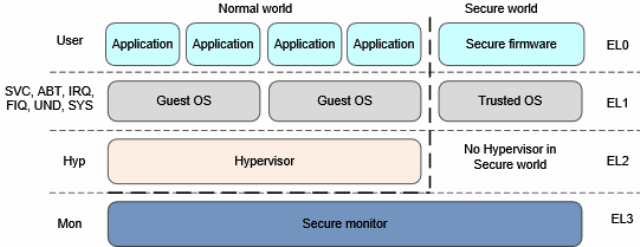

ARMv8-A Exception level 有关的说明如下：

1. 首先需要注意的是，AArch64 中，已经没有 User、SVC、ABT 等处理器模式的概念，但 ARMv8 需要向前兼容，在 AArch32 中，就把这些处理器模式 map 到了 4 个 Exception level。
2. Application 位于特权等级最低的 EL0，Guest OS(Linux kernel、window 等)位于 EL1，提供虚拟化支持的 Hypervisor 位于 EL2(可以不实现)，提供 Security 支持的 Security Monitor 位于 EL3(可以不实现)。
3. 只有在异常发生时(或者异常处理返回时)，才能切换 Exception level(这也是 Exception level 的命名原因，为了处理异常)。当异常发生时，有两种选择，停留在当前的 EL，或者跳转到更高的 EL，EL 不能降级。同样，异常处理返回时，也有两种选择，停留在当前 EL，或者调到更低的 EL。

###### security model

ARMv8-A 的 security 模型基本沿用了 ARMv7 security extension 的思路，主要目的保护一些安全应用的数据，例如支付等。它不同于 privilege level 等软件逻辑上的保护，而是一种物理上的区隔，即不同 security 状态下，可以访问的物理内存是不同的。ARMv8-A 架构有两个 security state(参考上面图片)，Security 和 non-Security。主要的功效是物理地址的区隔，以及一些 system control 寄存器的访问控制：

1. 在 Security 状态下，处理器可以访问所有的 Secure physical address space 以及 Non-secure physical address space；
2. 在 Non-security 状态下，只能访问 Non-secure physical address space，且不能访问 Secure system control resources。

###### virtualization

硬件虚拟化包括指令集虚拟化、异常处理虚拟化、MMU 虚拟化、IO 虚拟化等多个议题。


### ARM64 启动过程

在 Kernel 之前 bootloader 会执行若干的动作，然后把控制权转移给 Linux kernel。需要特别说明的是：这里 bootloader 是一个宽泛的概念，其实就是为 Kernel 准备好执行环境的那些软件，可能是传统意义的 bootloader(例如 Uboot)，也可能是 Hypervisor 或者是secure monitor。具体 bootloader 需要执行的动作包括：

1. 初始化系统中的 RAM 并将 RAM 的信息告知 Kernel
2. 准备好device tree blob 的信息并将 dtb 的首地址告知 Kernel
3. 解压内核(可选)
4. 将控制权转交给内核。当然，bootloader 和 Kernel 的交互的时候需求如下：

```c
MMU = off, D-cache = off, I-cache = on or off
 x0 = physical address to the FDT blob
```

- 具体实现中的 ARMv8 处理器的 cache 是形成若干个 level，一般而言，可能 L1 是分成了 data cache 和 instruction cache，而其他 level 的 cache 都是 unified cache。上面定义的 D-cache off 并不是说仅仅 disable L1 的 data cache，实际上是 disable 了各个 level 的 data cache 和 unified cache。同理，对于 instruction cache 亦然。
- 此外，在 on/off 控制上，MMU 和 data cache 是有一定关联的。在 ARM64 中，SCTLR, System Control Register 用来控制 MMU icache 和 dcache，虽然这几个控制 bit 是分开的，但是并不意味着 MMU、data cache、instruction cache 的 on/off 控制是彼此独立的。一般而言，这里 MMU 和 data cache 是绑定的，即如果 MMU 是 off 的，那么 data cache 也必须要 off。因为如果打开 data cache，那么要设定 memory type、share ability attribute、cache ability attribute 等，而这些信息是保存在页表(Translation Table)的描述符中，因此，如果不打开 MMU，如果没有页表翻译过程，那么根本不知道怎么来应用 data cache。
- 当然，是不是说 HW 根本不允许这样设定呢？也不是了，在 MMU OFF 而 data cache 是 ON 的时候，所有的 memory type 和 attribute 是固定的，即 memory type 都是 normal Non-shareable 的，对于 inner cache 和 outer cache，其策略都是 Write-Back，Read-Write Allocate 的。

#### 参数的保存和校验

最开始的 ARM64 启动代码位于 arch/arm64/kernel/head.S 文件中，代码如下：

```assembly
ENTRY(stext)
    bl    preserve_boot_args
    bl    el2_setup            // Drop to EL1, w20=cpu_boot_mode
    adrp    x24, __PHYS_OFFSET
    bl    set_cpu_boot_mode_flag

    bl    __vet_fdt 
    ……
ENDPROC(stext)

preserve_boot_args:
    mov    x21, x0 // 将 dtb 的地址暂存在 x21 寄存器中，释放出 x0 以便后续做临时变量使用

    adr_l    x0, boot_args // x0 保存了 boot_args 变量的地址
    stp    x21, x1, [x0] // 保存 x0 和 x1 的值到 boot_args[0] 和 boot_args[1]
    stp    x2, x3, [x0, #16] // 保存 x2 和 x3 的值到 boot_args[2] 和 boot_args[3]

    dmb    sy // full system data memory barrier

    add    x1, x0, #0x20 // x0 和 x1 是传递给 __inval_cache_range 的参数
    b    __inval_cache_range
ENDPROC(preserve_boot_args)
```

- 由于 MMU = off, D-cache = off，因此写入 boot_args 变量的操作都是略过 data cache 的，直接写入了 RAM 中(这里的 D-cache 并不是特指 L1 的 data cache，而是各个 level 的 data cache 和 unified cache)，为了安全起见(也许 bootloader 中打开了 D-cache 并操作了 boot_args 这段 memory，从而在各个 level 的 data cache 和 unified cache 有了一些旧的，没有意义的数据)，需要将 boot_args 变量对应的 cache line 进行清除并设置无效。在调用 `__inval_cache_range` 之前，x0 是 boot_args 这段 memory 的首地址，x1 是末尾的地址(boot_args 变量长度是 4 x 8byte ＝ 32byte，也就是 0x20 了)。为何要保存 x0～x3 这四个寄存器呢？因为 ARM64 boot protocol 对启动时候的 x0～x3 这四个寄存器有严格的限制：x0 是 dtb 的物理地址，x1～x3 必须是 0(非零值是保留将来使用)。在后续 `setup_arch` 函数执行的时候会访问 boot_args 并进行校验。

- 还有一个小细节是如何访问 boot_args 这个符号的，这个符号是一个虚拟地址，但是，现在没有建立好页表，也没有打开 MMU，如何访问它呢？这是通过 adr_l 这个宏来完成的。这个宏实际上是通过 adrp 这个汇编指令完成，通过该指令可以将符号地址变成运行时地址(通过 PC relative offset 形式)，因此，当运行的 MMU off mode 下，通过 adrp 指令可以获取符号的物理地址。不过 adrp 是 page 对齐的(adrp 中的 p 就是 page 的意思)，boot_args 这个符号当然不会是 page size 对齐的，因此不能直接使用 adrp，而是使用 adr_l 这个宏进行处理。

- `dmb sy` 这一条指令。在 ARM 文档中，有关于数据访问指令和 data cache 指令之间操作顺序的约定，原文如下：

  > All data cache instructions, other than DC ZVA, that specify an address can execute in any order relative to loads or stores that access any address with the Device memory attribute, or with Normal memory with Inner Non-cacheable attribute unless a DMB or DSB is executed between the instructions.

  因此，在 Non-cacheable 的情况下，必须要使用 DMB 来保证 stp 指令在 dc ivac 指令之前执行完成。

程序执行至此，CPU 处于哪一个 exception level 呢？根据 ARM64 boot protocol，CPU 要么处于 EL2(推荐)或者 non-secure EL1。如果在 EL1，情形类似 ARM 处理器，处于 EL2 稍微复杂一些，需要对 virtualization extensions 进行基本的设定，然后将 CPU 退回到EL1。

```assembly
ENTRY(el2_setup)
	/* 当前的 exception level 保存在 PSTATE 中，程序可以通过 MRS 或者 MSR 来访问 PSTATE，当然需要传递一个
	 * special-purpose register 做为参数，CurrentEL 就是获取 PSTATE 中 current exception level 域的特殊寄存器。
     */
    mrs    x0, CurrentEL
    cmp    x0, #CurrentEL_EL2 // 判断是否处于 EL2
    b.ne    1f // 不是的话，跳到 1f
    /* sctlr_el2 也是一个可以通过 MRS/MSR 指令访问的寄存器，当 CPU 处于 EL2 状态的时候，该寄存器可以控制整个系统的行为。当
     * 然，这里仅仅是设定 EL2 下的数据访问和地址翻译过程中的 endianess 配置，也就是 EE bit[25]。根据配置，CPU_BE 和 
     * CPU_LE 包围的指令只会保留一行。对于 little endian 而言，实际上就是将 sctlr_el2 寄存器的 EE(bit 25)设定为 0。顺
     * 便说一下，这个 bit 不仅仅控制 EL2 数据访问的 endianess 以及 EL2 stage 1 的地址翻译过程中的 endianess(当然，EL2
     * 只有 stage 1)，还可以控制 EL1 和 EL0 stage 2 地址翻译的过程的 endianess(这时候有两个 stage 的地址翻译过程)。
     */
    mrs    x0, sctlr_el2
CPU_BE(    orr    x0, x0, #(1 << 25)    )    // Set the EE bit for EL2
CPU_LE(    bic    x0, x0, #(1 << 25)    )    // Clear the EE bit for EL2
    msr    sctlr_el2, x0 // 写回 sctlr_el2 寄存器
    b    2f
1:
	/* 执行到这里说明 CPU 处于 EL1，这种状态下没有权限访问 sctlr_el2，只能是访问 sctlr_el1。sctlr_el1 可以通过 EE 和
	 * E0E 来控制 EL1 和 EL0 状态下是 little endian 还是 big endian。EE bit 控制了 EL1 下的数据访问以及 EL1 和 EL0 
	 * stage 1 地址翻译的过程的 endianess。E0E bit 用来控制 EL0 状态下的数据访问的 endianess。此外，需要注意的是：由于修
	 * 改了 system control register(设定 endianess 状态)，因此需要一个 isb 来同步(具体包括两部分的内容，一是确认硬件已
	 * 经执行完毕了 isb 之前的所有指令，包括修改 system control 寄存器的那一条指令，另外一点是确保 isb 之后的指令从新来过，
	 * 例如取指，校验权限等)。
	 */
	mrs    x0, sctlr_el1
CPU_BE(    orr    x0, x0, #(3 << 24)    )    // Set the EE and E0E bits for EL1
CPU_LE(    bic    x0, x0, #(3 << 24)    )    // Clear the EE and E0E bits for EL1
    msr    sctlr_el1, x0
    mov    w20, #BOOT_CPU_MODE_EL1 // w20 寄存器保存了 CPU 启动时候的 Eexception level
    isb // instruction memory barrier
    ret

2:  
	/* 执行到这里说明 CPU 处于 EL2，首先设定的是 hcr_el2 寄存器，Hypervisor Configuration Register。该寄存器的大部分
	 * bit 值在 reset 状态的时候就是 0 值，只不过 bit 31(Register Width Control)是 implementation defined，因此这
	 * 里set 31 为 1，确保 Low level 的 EL1 也是 AArch64 的
	 */
	mov    x0, #(1 << 31)
    msr    hcr_el2, x0

	/* 这一段代码是对 Generic timers 进行配置。ARMv8 上有一个全局范围的 system counter、各个 PE 上自己专属的 local
	 * timer 以及连接这些组件之间的 bus 或者信息传递机制组成了 Generic Timer。对于 PE 而言，通过寄存器访问，它能看到的是
	 * physical counter(实际的 system counter 计数)、virtual counter(physical counter 基础上的 offset)、
	 * physical timer、virtual timer 等。CTHCTL_EL2，Counter-Timer Hypervisor Control register，用来控制系统中的
	 * physical counter 和 virutal counter 如何产生 event stream 以及在 EL1 和 EL0 状态访问 physical counter 和
	 * timer 的硬件行为的。在 EL1(EL0)状态的时候访问 physical counter 和 timer 有两种配置，一种是允许其访问，另外一种就
	 * 是 trap to EL2。这里的设定是：不陷入 EL2(对应的 bit 设置为 1)。cntvoff_el2 是 virtual counter offset，所谓
	 * virtual counter，其值就是 physical counter 的值减去一个 offset 的值(也就是 cntvoff_el2 的值了)，这里把
	 * offset 值清零，因此 virtual counter 的计数和 physical counter 的计数是一样的。
	 */
    mrs    x0, cnthctl_el2
    orr    x0, x0, #3                 // Enable EL1 physical timers
    msr    cnthctl_el2, x0
    msr    cntvoff_el2, xzr        // Clear virtual offset

	/* 这一段代码是对 GICV3 进行配置。ID_AA64PFR0_EL1，AArch64 Processor Feature Register 0，该寄存器描述了 PE 实现
	 * 的 feature。GIC bits [27:24] 描述了该 PE 是否实现了 system register 来访问 GIC，如果没有(GIC bits 等于 0)那
	 * 么就略过 GICV3 的设定。ICC_SRE_EL2，Interrupt Controller System Register Enable register (EL2)，该寄存器用
	 * 来(在 EL2 状态时候)控制如何访问 GIC CPU interface 模块的，可以通过 memory mapped 方式，也可以通过 system
	 * register 的方式。将 SRE bit 设定为 1 确保通过 system register 方式进行 GIC interface CPU 寄存器的访问。将
	 * enable bit 设定为 1 确保在 EL1 状态的时候可以通过 ICC_SRE_EL1 寄存器对 GIC 进行配置而不是陷入 EL2。
	 */
    mrs    x0, id_aa64pfr0_el1
    ubfx    x0, x0, #24, #4 // 取出 24 bit 开始的 4 个 bit 的值并将该值赋给 x0
    cmp    x0, #1
    b.ne    3f // 不支持 system register 接口

    mrs_s    x0, ICC_SRE_EL2
    orr    x0, x0, #ICC_SRE_EL2_SRE    // Set ICC_SRE_EL2.SRE==1
    orr    x0, x0, #ICC_SRE_EL2_ENABLE    // Set ICC_SRE_EL2.Enable==1
    msr_s    ICC_SRE_EL2, x0
    isb                    // Make sure SRE is now set
    msr_s    ICH_HCR_EL2, xzr        // Reset ICC_HCR_EL2 to defaults

3:
	/* midr_el1 和 mpidr_el1 都属于标识该 PE 信息的 read only 寄存器。MIDR_EL1，Main ID Register 主要给出了该 PE 的
	 * architecture 信息，Implementer 是谁等等信息。MPIDR_EL1，Multiprocessor Affinity Register，该寄存器保存了
	 * processor ID。vpidr_el2 和 vmpidr_el2 是上面的两个寄存器是对应的，只不过是 for virtual processor 的。
	 */
	mrs    x0, midr_el1
    mrs    x1, mpidr_el1
    msr    vpidr_el2, x0
    msr    vmpidr_el2, x1

	/* 这段代码实际上是将 0x33d00800(BE)或者 0x30d00800(LE)写入 sctlr_el1 寄存器。BE 和 LE 的设定和上面第一段代码中
	 * 的描述是类似的。
	 */
    mov    x0, #0x0800            // Set/clear RES{1,0} bits
CPU_BE(    movk    x0, #0x33d0, lsl #16    )    // Set EE and E0E on BE systems
CPU_LE(    movk    x0, #0x30d0, lsl #16    )    // Clear EE and E0E on LE systems
    msr    sctlr_el1, x0

    mov    x0, #0x33ff // Disable Coprocessor traps to EL2
    msr    cptr_el2, x0            // Disable copro. traps to EL2

#ifdef CONFIG_COMPAT // 是否支持 64 bit kernel 上运行 32bit 的 application
    msr    hstr_el2, xzr            // Disable CP15 traps to EL2
#endif

	/* PMCR_EL0，Performance Monitors Control Register，该寄存器的 [15:11] 标识了支持的 Performance Monitors
	 * counter 的数目，并将其设定到 MDCR_EL2(Monitor Debug Configuration Register (EL2))中。MDCR_EL2 中其他的 bit
	 * 都设定为 0，其结果就是允许 EL0 和 EL1 进行 debug 的操作(而不是 trap to EL2)，允许 EL1 访问 Performance
	 * Monitors counter(而不是 trap to EL2)。
	 */
    mrs    x0, pmcr_el0
    ubfx    x0, x0, #11, #5            // to EL2 and allow access to
    msr    mdcr_el2, x0            // all PMU counters from EL1 
    msr    vttbr_el2, xzr // 清除 Stage-2 translation table base address register

    adrp    x0, __hyp_stub_vectors
    add    x0, x0, #:lo12:__hyp_stub_vectors
    msr    vbar_el2, x0 // 设定 EL2 的异常向量表的基地址

    mov    x0, #(PSR_F_BIT | PSR_I_BIT | PSR_A_BIT | PSR_D_BIT |\
              PSR_MODE_EL1h)
    /* 当系统发生了异常并进入 EL2，SPSR_EL2，Saved Program Status Register (EL2) 会保存处理器状态，ELR_EL2，
     * Exception Link Register (EL2)会保存返回发生 exception 的现场的返回地址。这里是设定 SPSR_EL2 和 ELR_EL2 的初始
     * 值。w20 寄存器保存了 CPU 启动时候的 Exception level ，因此 w20 被设定为 BOOT_CPU_MODE_EL2。
     */
    msr    spsr_el2, x0
    msr    elr_el2, lr
    mov    w20, #BOOT_CPU_MODE_EL2        // This CPU booted in EL2
    /* eret 指令是用来返回发生 exception 的现场。实际上，这个指令仅仅是模拟了一次异常返回而已，SPSR_EL2 和 ELR_EL2 都已经
     * 设定完成，执行该指令会使得 CPU 返回 EL1 状态，并且将 SPSR_EL2 的值赋给 PSTATE，ELR_ELR 就是返回地址（实际上也恰好是
     * 函数的返回地址）。
     */
    eret
ENDPROC(el2_setup)
```

为什么没有 `el3_setup`？当一个 SOC 的实现在包括了 EL3 的支持，那么 CPU core 缺省应该进入 EL3 状态，为何这里只是判断 EL2 还是 EL1？实际上，即便是由于 SOC 支持 TrustZone 而导致 CPU core 上电后进入 EL3，这时候，接管 CPU 控制的一定不是 Linux Kernel（至少目前来看 Linux Kernel不会做 Secure monitor），而是 Secure Platform Firmware（也就是传说中的 secure monitor），它会进行硬件平台的初始化，loading trusted OS 等等，等到完成了 secure world 的构建之后，把控制权转交给 non-secure world，这时候，CPU core 多半处于 EL2（如果支持虚拟化）或者 EL1（不支持虚拟化）。因此，对于 Linux Kernel 而言，它感知不到 secure world（Linux Kernel 一般也不会做 Trusted OS），仅仅是在 non-secure world 中，可以是 Hypervisor 或者 rich OS。

```assembly
// w20 寄存器保存了 CPU 启动时候的 Exception level
ENTRY(set_cpu_boot_mode_flag)
    adr_l    x1, __boot_cpu_mode
    cmp    w20, #BOOT_CPU_MODE_EL2
    b.ne    1f
    add    x1, x1, #4
1:    str    w20, [x1]            // This CPU has booted in EL1
    dmb    sy
    dc    ivac, x1            // Invalidate potentially stale cache line
    ret
ENDPROC(set_cpu_boot_mode_flag)
```

由于系统启动之后仍然需要了解 CPU 启动时候的 Exception level（例如判断是否启用 hyp mode），因此，有一个全局变量`__boot_cpu_mode` 用来保存启动时候的 CPU mode。有几点说明：

1. 本质上希望系统中所有的 CPU 在初始化的时候处于同样的 mode，要么都是 EL2，要么都是 EL1，有些 EL2，有些 EL1 是不被允许的。

2. 所有的 CPU core 在启动的时候都处于 EL2 mode 表示系统支持虚拟化，只有在这种情况下，kvm 模块可以顺利启动。

3. `set_cpu_boot_mode_flag` 和 `el2_setup` 这两个函数会在各个 CPU 上执行。

4. 变量 `__boot_cpu_mode` 定义如下：

   ```assembly
   ENTRY(__boot_cpu_mode)
       .long    BOOT_CPU_MODE_EL2 // A
       .long    BOOT_CPU_MODE_EL1 // B
   ```

   如果 CPU 启动的时候是 EL1 mode，会修改变量 `__boot_cpu_mode` A域，将其修改为 BOOT_CPU_MODE_EL1。如果 CPU 启动的时候是 EL2 mode，会修改变量 `__boot_cpu_mode` B域，将其修改为 BOOT_CPU_MODE_EL2。

```assembly
__vet_fdt:
    tst    x21, #0x7 // 是否是 8 字节对齐的
    b.ne    1f
    cmp    x21, x24 // 是否在小于 kernel space 的首地址
    b.lt    1f
    mov    x0, #(1 << 29)
    add    x0, x0, x24
    cmp    x21, x0
    b.ge    1f// 是否大于 kernel space 的首地址 ＋ 512M
    ret
1:
    mov    x21, #0 // 传递的 fdt 地址有误，清零
    ret
ENDPROC(__vet_fdt)
```

x21 和 x24 都被设定成了指定的值。x21 被设定为 fdt 在 RAM 中的物理地址（参考 `preserve_boot_args` 函数），x24 被设定为`__PHYS_OFFSET`，定义为：

```c
#define __PHYS_OFFSET    (KERNEL_START - TEXT_OFFSET)
#define KERNEL_START    _text
```

`KERNEL_START` 是 kernel 开始运行的虚拟地址，更确切的说是内核正文段开始的虚拟地址。 在链接脚本文件中（参考arch/arm64/kernel 下的 vmlinux.lds.S），`KERNEL_START` 被设定为：

```assembly
. = PAGE_OFFSET + TEXT_OFFSET;

.head.text : {
    _text = .;
    HEAD_TEXT
}
```

因此，`KERNEL_START` 的值和 `PAGE_OFFSET` 以及 `TEXT_OFFSET` 这两个 offset 的设定有关。`TEXT_OFFSET` 标识了内核正文段的 offset，其实如果该宏被定义为 `KERNEL_TEXT_OFFSET` 会更好理解。假设内核空间的首地址是 x（一般也是 RAM 的首地址），那么是否让 Kernel 运行在 x 地址呢？对于 ARM，在内核空间的开始有 32KB（0x00008000）的空间用于保存内核的页表（也就是进程 0 的 PGD）以及 bootloader 和 Kernel 之间参数的传递，对于 ARM64，在其 Makefile 中定义了这个 offset 是 512KB（0x00080000）。

```assembly
ifeq ($(CONFIG_ARM64_RANDOMIZE_TEXT_OFFSET), y)
TEXT_OFFSET := $(shell awk 'BEGIN {srand(); printf "0x%03x000\n", int(512 * rand())}')
else
TEXT_OFFSET := 0x00080000
endif
```

kernel image 的开始部分包括了一个 ARM64 image header 的内容，这个 header 定义了 bootloader 如何来 copy kernel image。ARM64 image header 中有一个域（text_offset）就是告知 bootloader，它应该按照多大的偏移来 copy kernel image。对于 ARM64 平台，一直都是固定为 0x80000，因此，bootloader 也没有必要来修改支持这个特性。虽然目前 ARM64 的 kernel 的 `TEXT_OFFSET` 就是固定为 0x80000，但是也许将来内核会修改这个 offset。在这种情况下，内核的开发者提供了一个 `CONFIG_ARM64_RANDOMIZE_TEXT_OFFSET` 选项，在编译内核的时候可以 randomize 内核的 `TEXT_OFFSET` 值，以此来测试 bootloader是否能够正确的 copy kernel image 到正确的内存偏移位置上去。通过这样一个配置项，可以尽快的暴露问题，确保了整个系统（bootloader ＋ kernel）稳定的运行。

```c
#define VA_BITS            (CONFIG_ARM64_VA_BITS)
#define PAGE_OFFSET        (UL(0xffffffffffffffff) << (VA_BITS - 1))
```

`VA_BITS` 定义了虚拟地址空间的 bit 数（该值也就是定义了用户态程序或者内核能够访问的虚拟地址空间的 size），假设 `VA_BITS` 被设定为 39 个 bit，那么 `PAGE_OFFSET` 就是 0xffffffc0-00000000。`PAGE_OFFSET` 定义了将 kernel image 安放在虚拟地址空间的哪个位置上。

`__PHYS_OFFSET` 实际上就是 kernel image 的首地址（并不是 `__PHYS_OFFSET` 的位置开始就是真实的 kernel image，实际上从`__PHYS_OFFSET` 开始，首先是 `TEXT_OFFSET` 的保留区域，然后才是真正的 kernel image）。实际上，`__PHYS_OFFSET` 定义的是一个虚拟地址而不是物理地址，这里的 PHYS 严重影响了该符号的含义，实际上 adrp 这条指令可以将一个虚拟地址转换成物理地址（在没有打开 MMU 的时候）。而函数 `__vet_fdt` 主要是对这个 bootloader 传递给 kernel 的 fdt 参数进行验证，验证的内容包括：

1. 是否是 8 字节对齐的
2. 是否在 kernel space 的前 512M 内

#### 创建启动阶段的页表

从 bootloader 到 kernel 的时候，MMU 是 off 的（顺带的负作用是无法打开 data cache），为了提高性能，加快初始化速度，必须某个阶段（越早越好）打开 MMU 和 cache，而在此之前，必须要设定好页表。在初始化阶段，要 mapping 三段地址，一段是 identity mapping，其实就是把物理地址 mapping 到物理地址上去，在打开 MMU 的时候需要这样的 mapping（ARM ARCH 强烈推荐这么做的）。第二段是 kernel image mapping，内核代码执行当然需要将 kernel running 需要的地址（kernel txt、kernel rodata、data、bss 等等）进行映射了，第三段是 blob memory 对应的 mapping。

##### 基础知识

在 32-bit 的 ARM 时代，每一个进程都有 4G 的独立的虚拟地址空间（0x0～0xffffffff）。对于 ARM64 而言，进程需要完全使用 2^64 那么多的虚拟地址空间吗？如果需要，那么 CPU 的 MMU 单元需要能接受来自处理器发出的 64 根地址线的输入信号，并对其进行翻译，这也就意味着 MMU 需要更多的晶体管来支持 64 根地址线的输入，而 CPU 也需要驱动更多的地址线，但是实际上，在短期内，没有看出有 2^64 那么多的虚拟地址空间的需求，因此，ARMv8 实际上提供了 TCR_ELx （Translation Control Register (ELx)可以对 MMU 的输入地址（也就是虚拟地址）进行配置。为了不把问题复杂化，先不考虑 TCR_EL2 和 TCR_EL3 这两个寄存器。通过 TCR_EL1 寄存器中的 TxSZ 域可以控制虚拟地址空间的 size。对于 ARM64（是指处于 AArch64 状态的处理器）而言，最大的虚拟地址的宽度是 48 bit，因此虚拟地址空间的范围是 0x0000_0000_0000_0000 ～ 0x0000_FFFF_FFFF_FFFF，总共 256TB。 当然，具体实现的时候可以选择如下的地址线数目：

```c
config ARM64_VA_BITS
    int
    default 36 if ARM64_VA_BITS_36
    default 39 if ARM64_VA_BITS_39
    default 42 if ARM64_VA_BITS_42
    default 47 if ARM64_VA_BITS_47
    default 48 if ARM64_VA_BITS_48
```

符合 ARMv8 的 PE 最大支持的物理地址宽度也是 48 个 bit，当然，具体的实现可以自己定义（不能超过 48 个 bit），具体的配置可以通过 `ID_AA64MMFR0_EL1` （AArch64 Memory Model Feature Register 0）这个RO寄存器获取。

| 宏定义符号  | 描述                                                         |
| ----------- | ------------------------------------------------------------ |
| VA_START    | 内核地址空间的起始地址                                       |
| TEXT_OFFSET | bootloader 会把 kernel image 从外设 copy 到 RAM 中，那么具体 copy 到什么位置呢？从 RAM 的起始地址开始吗？实际上是从 TEXT_OFFSET 开始的，偏移这么一小段内存是为了 bootloader 和 kernel 之间传递一些信息。所以，这里 TEXT 是指 kernel text segment，而 OFFSET 是相对于 RAM 的首地址而言的。 TEXT_OFFSET 必须要 4K 对齐并且 TEXT_OFFSET 的 size 不能大于 2M。 |
| PAGE_OFFSET | kernel image 的起始虚拟地址，一般而言也就是系统中 RAM 的首地址，在该地址 TEXT_OFFSET 之后保存了 kernel image。 PAGE_OFFSET 必须要 2M 对齐 |
| TASK_SIZE   | 一般而言，用户地址空间从 0 开始，大小就是 TASK_SIZE，因此，这个宏定义的全称应该是 task userspace size。对于 ARM64 的用户空间进程而言，有两种，一种是运行在 AArch64 状态下，另外一种是运行在 AArch32 状态，因此，实际上代码中又定义了 TASK_SIZE_32 和 TASK_SIZE_64 两个宏定义。 |
| PHYS_OFFSET | 系统内存的起始物理地址。在系统初始化的过程中，会把 PHYS_OFFSET 开始的物理内存映射到 PAGE_OFFSET 的虚拟内存上去。 |

MMU 主要负责从 VA（virutal address）到 PA（Physical address）的翻译、memory 的访问控制以及 memory attribute 的控制。不同的 Exception Level 和 Security State 有自己独立的地址翻译过程，在这种状态下，地址翻译可以分成两个 stage，不过两个 stage 是为虚拟化考虑的，因此，为了简化问题，先只考虑一个stage。

虚拟地址空间（针对ARM32而言）被分成了两个 VA subrange：

> Lower VA subrange ： 从 0x0000_0000_0000_0000 到 (2^(64-T0SZ) - 1)
> Upper VA subrange ： 从 (2^64 - 2^(64-T1SZ)) 到 0xFFFF_FFFF_FFFF_FFFF

当进程切换地址空间的时候，实际上切换了内核地址空间+用户地址空间（total 4G 地址空间），而实际上，每次进程切换的时候，内核地址空间都是不变的，实际变化的只有 userspace 而已。如果硬件支持了 VA subrange，那么可以这样使用：

> Lower VA subrange ： process-specific 地址空间
> Upper VA subrange ： kernel 地址空间

地址映射的粒度怎么配置呢？地址映射的粒度用通俗的语言讲就是 page size（也可能是 block size），传统的 page size 都是 4K，ARM64 的 MMU 支持 4K、16K 和 64K 的 page size。除了地址映射的粒度还有一个地址映射的 level 的概念，在 ARM32 的时代，2 level 或者3 level 是比较常见的配置，对于 ARM64，这和 page size、物理地址和虚拟地址的宽度都是有关系的。page size 是 4K，并且 VA 宽度是 48个bit，在这种情况下，虚拟地址空间的布局如下：

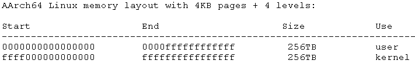

具体的映射过程如下：

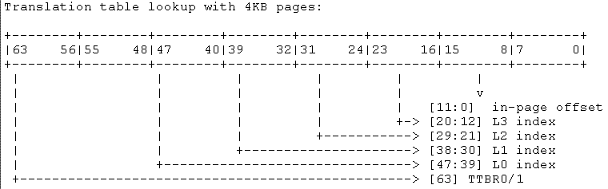

整个地址翻译的过程是这样的：首先通过虚拟地址的高位可以知道是属于 userspace 还是 kernel spce，从而分别选择 TTBR0_EL1（Translation Table Base Register 0 (EL1)）或者 TTBR1_EL1（Translation Table Base Register 1 (EL1)）。这个寄存器中保存了 PGD 的基地址，该地址指向了一个 lookup table，每一个 entry 都是描述符，可能是 Table descriptor、block descriptor 或者是 page descriptor。如果命中了一个 block descriptor，那么地址翻译过程就结束了，当然对于 4-level 的地址翻译过程，PGD 中当然保存的是Table descriptor，从而指向了下一节的 Translation table，在 kernel 中称之为 PUD。随后的地址翻译概念类似，是一个 PMD 过程，最后一个 level 是 PTE，也就是 page table entry 了 ，到了最后的地址翻译阶段。这时候 PTE 中都是一个个的 page descriptor，完成最后的地址翻译过程。

##### `__create_page_tables` 代码分析

initial translation tables 定义在链接脚本文件中（参考 arch/arm64/kernel 下的 vmlinux.lds.S），如下：

```assembly
. = ALIGN(PAGE_SIZE);
idmap_pg_dir = .;
. += IDMAP_DIR_SIZE;
swapper_pg_dir = .;
. += SWAPPER_DIR_SIZE;
```

ARM32 的时候，kernel image 在 RAM 开始的位置让出了 32KB 的 memory 保存了 bootloader 到 kernel 传递的 tag 参数以及内核空间的页表。在刚开始的时候，ARM64 沿用了 ARM32 的做法，将这些初始页表放到了 `PHYS_OFFSET` 和 `PHYS_OFFSET + TEXT_OFFSET` 之间（size 是 0x80000）。但是，其实这段内存是有可能被 bootloader 使用的，而且，这个时候，memory block 模块（确定内核需要管理的 memory block）没有 ready，想要标记 reservation memory 也是不可能的。在这种情况下，假设 bootloader 在这段 memory 放了些数据，试图传递给 kernel，但是 kernel 如果在这段 memory 上建立页表，那么就把有用数据给覆盖了。最后，initial translation tables 被放到了 kernel image 的后面，位于 bss 段之后，从而解决了这个问题。

```c
#if ARM64_SWAPPER_USES_SECTION_MAPS
#define SWAPPER_PGTABLE_LEVELS    (CONFIG_PGTABLE_LEVELS - 1)
#define IDMAP_PGTABLE_LEVELS    (ARM64_HW_PGTABLE_LEVELS(PHYS_MASK_SHIFT) - 1)
#else
#define SWAPPER_PGTABLE_LEVELS    (CONFIG_PGTABLE_LEVELS)
#define IDMAP_PGTABLE_LEVELS    (ARM64_HW_PGTABLE_LEVELS(PHYS_MASK_SHIFT))
#endif

#define SWAPPER_DIR_SIZE    (SWAPPER_PGTABLE_LEVELS * PAGE_SIZE)
#define IDMAP_DIR_SIZE        (IDMAP_PGTABLE_LEVELS * PAGE_SIZE)
```

`ARM64_SWAPPER_USES_SECTION_MAPS` 这个宏定义是说明了 swapper/idmap 的映射是否使用 section map。什么是 section map 呢？用一个实际的例子来描述。假设 VA 是 48 bit，page size 是 4K，那么，在地址映射过程中，地址被分成 9（level 0） ＋ 9（level 1） ＋ 9（level 2） ＋ 9（level 3） ＋ 12（page offset），对于 kernel image 这样的 big block memory region，使用 4K 的 page 来 mapping 有点得不偿失，在这种情况下，可以考虑让 level 2 的 Translation table entry 指向一个 2M 的 memory region，而不是下一级的 Translation table。所谓的 section map 就是指使用 2M 的为单位进行映射。当然，不是什么情况都是可以使用 section map，对于 kernel image，其起始地址是 2M 对齐的，因此 block size 是 2M 的情况下才可行，对于 PAGE SIZE 是 16K，其 Block descriptor 指向了一个 32M 的内存块，PAGE SIZE 是 64K 的时候，Block descriptor 指向了一个 512M 的内存块，因此，只有 4K page size 的情况下，才可以启用 section map。

回到具体的初始阶段页表大小这个问题上。原来 ARM32 的时候，一个 page 就可以了，对于 ARM64，由于虚拟地址空间变大了，因此需要更多的 page 来完成启动阶段的 initial translation tables 的构建。仍然用 VA 是 48 bit，page size 是 4K为例子进行说明。根据前面的描述，内核空间的地址大小是 256T，48 bit 的地址被分成 9 ＋ 9 ＋ 9 ＋ 9 ＋ 12，因此 PGD（Level 0）、PUD（Level 1）、PMD（Level 2）、PT（Level 3）的 translation table 中的 entry 都是 512 项，每个描述符是 8 个 byte，因此这些 translation table 都是4KB，恰好是一个 page size。根据链接脚本中的定义，idmap 和 swapper page tables （或者叫做 translation table）分别保留了 3 个 page 的页面。3 个 page 分别是 3 个 level 的 translation table。为何这里只有 3 个 level？实际上，3 级映射是 PGD/PUM/PMD（每个 table 占据一个 page），只不过 PMD 的内容不是下一级的 table descriptor，而是基于 2M block 的 mapping（或者说 PMD 中的描述符是 block descriptor）。


### Trusted Execution Environment

#### TEE 软件交互基础组件简介


- TEE 系统软件从整体上包含 REE 和 TEE 两部分，各自对应的基础组件如上图所示。

- REE 部分 Client Applications(CA) 一般是指指纹录入，支付应用等上层应用，其通过调用 TEE Client API 接口来与 TEE 环境的 Trusted OS 进行交互，这里的 TEE Client API 包括 TEE 厂商自定义的一些接口或 GlobalPlatform(GP) 全球组织定义的通用 API，其目的是制定一套标准的编程接口，方便开发者在不同软硬件平台下使用同一套代码实现其功能。
- TEE Client API 通过 ioctl 系统调用对 TEE Driver 进行操作，TEE Driver 是沟通 REE 和 TEE 的桥梁，其通过 SMC 指令，实现将上层的 OpenSession，InvokeCommand，CloseSession 等标准调用的请求转发到 TEE 环境，同时其也会处理来自 TEE 的请求，将请求转发到 TEE Helper Daemon 让其处理。
- TEE Helper Daemon 是一个辅助进程，用于 TEE 请求 REE 的资源。 一般来说，TEE 需要获得存储在 EMMC 的数据文件(例如安全加密文件，TA 可执行镜像文件等)，而读写 EMMC 操作需要复杂的内核驱动的支持，显然如果把读写 EMMC 的驱动放到 TEE 侧运行会使软件复杂度会变得很高，因此 REE 需要一个可以访问这些资源的辅助进程支持，这就是 TEE Helper Daemon 的基本功能。TEE Helper Daemon 在软件逻辑实现上比较简单，以 OP-TEE 的 tee-supplicant 辅助进程为例，整体上是一个循环流程: 其首先通过 ioctl 接口查询是否有来自 TEE 的请求，如果没有，则进入睡眠等待状态，等待 TEE Driver 的唤醒信号，当 TEE Driver 收到来自 TEE 的请求后，会唤醒 tee-supplicant 辅助进程，然后根据请求号进行相应处理(读写数据文件，读写 EMMC 设备分区等)，最后返回结果到 TEE Driver，完成一次循环。
  - TEE 侧的 Secure Monitor 的主要作用是实现 REE 和 TEE 环境的切换，转发请求到 Trusted OS。当 Secure Monitor 收到 TEE Driver 的 SMC 请求后，会将 CPU 切换到 Secure 状态，然后转发请求到 Trusted OS 来处理，Trusted OS 会找到请求对应的 Trusted App(TA) 去处理请求，具体逻辑流程会在下一节中详细说明。 另外 Secure Monitor 还用于开机时候 Trusted OS 的引导工作。
  - Trusted OS 是运行在 TEE 侧的小型操作系统，简单来说，其作用是:
    - 构建满足 TA 运行的安全运行环境
    - 提供安全外设(SPI，I2C，Timer 等)的驱动程序
    - 根据 REE 的请求，调度相应 TA 处理请求
    - 提供 TA 运行所需要的加解密，随机数生成，证书生成校验等通用函数库
  - GlobalPlatform(GP) 全球组织定义的通用 API，TEE Client API 供 REE 侧的 CA 使用，TEE Internal API 则是供 TA 调用 Trusted OS 资源的标准 API，同样是用于方便 TA 开发者在不同软硬件平台进行开发。

#### TEE 软件交互流程

上文对 REE 调用 TEE 软件交互所需要的基础组件及其基本作用进行了介绍，下面将对各个组件的交互流程进行介绍。

在 GP 标准中，CA 要与 TA 进行通信，需要建立如图2所示的软件逻辑流程:

1. 首先 CA 需要与 Trusted OS 之间建立一个 Context(InitializeContext)，以后此 CA 与 TEE 环境的所有通信均基于此 Context。
2. 然后 CA 会向 Trusted OS 申请与请求的 TA 建立一个 Session(OpenSession)。
3. CA 与 TA 之间的 Session 建立完成后，CA 就可以向 TA 发送 Command(InvokeCommand)。
4. Command 及其参数会通过共享内存的方式传递，TA 从共享内存中获取到 CA 的请求以及请求参数。
5. TA 在 TEE 环境下执行处理，得到的处理结果重新填充到共享内存中，CA 通过共享内存就可以获取到处理结果。
6. 获得处理结果后，如不需要进一步请求，则由 CA 发起关闭 Session 的请求(CloseSession)，Trusted OS 回收 TA 相关资源，最后 CA 发起销毁 Context 的请求(FinalizeContext)，完成一次完整交互。


从以上流程可以看到，整个交互流程主要涉及 InitializeContext，OpenSession，InvokeCommand，CloseSession 和 FinalizeContext 5个操作。InitializeContext 用于 Trusted OS 分配 TA 运行需要的安全内存，FinalizeContext 则是销毁相应内存，具体流程分别与 OpenSession 和 CloseSession 类似。下面看看 OpenSession，InvokeCommand 和 CloseSession 这几个操作下，各个基础组件的交互时序。OpenSession 时序如下图所示，操作步骤如下:


1. CA 经过 TEE Client API 向 TEE Driver 发送 OpenSession 请求。
2. TEE Driver 发送 OpenSession SMC 请求到 Trusted OS，此请求中包含要请求 TA 的唯一标识号(UUID)。
3. Trusted OS 会根据 TA 的 UUID 查找 TA 是否已经加载了，如果已经加载了，则执行步骤6，否则执行步骤4。
4. 若请求的 TA 未加载，则 Trusted OS 会向 TEE Helper Daemon 进程发送 Load TA 命令请求，TEE Helper Daemon 收到请求后，会根据要加载的 TA 的 UUID，从文件系统指定路径下找到 TA 镜像文件，并将其加载到预先分配的共享内存中，最后将共享内存的地址回传给 Trusted OS(这次地址回传实际需要经过 TEE Driver 进行虚拟地址与物理地址转换)。
5. Trusted OS 从回传的共享地址拷贝 TA 镜像到安全内存中，然后对安全内存中的 TA 镜像的 ELF 格式头，签名信息进行校验，校验通过则加载成功，否则返回错误信息给 CA。
6. TA 加载成功后，Trusted OS 分配一个 Session 操作句柄，并定位到已加载镜像的 `TA_OpenSessionEntryPoint` 函数入口执行。
7. 最后，Trusted OS 将分配的 Session 句柄逐级返回，最终 CA 拿到 Session 句柄，以后的 InvokeCommand 将需要依赖此句柄进行调用。

InvokeCommand 和 CloseSession 的流程与 OpenSession 流程相似，差别在于少了 load TA 的流程，时序图如下图所示。


### ARM Trusted Firmware

Trusted Firmware-A（ATF）是一款轻量级的开源固件，用于为 ARMv8-A SoC 平台提供安全启动和运行时环境。它由 ARM 公司和全球范围内的合作伙伴共同开发和维护，旨在提供一个安全、可靠和可定制的基础固件，以支持 ARMv8-A SoC 平台的安全引导和操作。它实现了不同的 ARM 接口标准，如下：

- 电源状态控制接口（Power State Coordination Interface， PSCI）

- 安全启动需求（Trusted Board Boot Requirements CLIENT，TBBR-CLIENT）
- 安全监控模式调用约定（SMC Calling Convention）
- 系统控制和管理接口（System Control and Management Interface，SCMI）
- 软件委托异常接口（Software Delegated Exception Interface，SDEI）
- PSA固件更新规范（PSA FW update specification）

| **名称**  | **寄存器**         | **功能**                                                     |
| --------- | ------------------ | ------------------------------------------------------------ |
| SP_ELx    | 栈针寄存器         | ARMv8 包含四个异常等级，对应有四个 SP 栈针寄存器 SP_EL0~SP_EL3，SP_EL0 可以被任何异常等级使用，其他异常等级会使用对应的 SP_ELx 寄存器 |
| PSTATE    | 处理器状态寄存器   | 表示处理器状态，包含条件标志位，执行状态控制，异常掩码标志位，访问权限 |
| SPSR      | 备份程序状态寄存器 | 用于保存程序在异常处理过程中的状态。在发生异常时，CPU 会将 PSTATE 寄存器值保存到 SPSR 寄存器中，然后切换到异常处理程序；处理完成后恢复 SPSR 的值到 PSTATE 寄存器中 |
| SCR_EL3   | 安全配置寄存器     | 设置安全相关的属性，只有 EL3 等级可以配置                    |
| SCTLR_EL3 | 系统控制器         | 设置 EL3 等级下的状态控制信息，包括 MMU，对齐检查，cache 控制，内存权限，数据大小端 |
| ELR_ELx   | 异常链接寄存器     | 存放异常返回的地址，在异常处理完成后恢复到 PC 中             |

ARM 将 ATF 作为底层固件并且开源出来，目的在于将 ARM底 层的操作统一，以使代码能够重用和便于移植。ATF 主要实现了以下功能：

- 安全引导功能：提供了安全启动功能，可以验证和加载下一级固件，包括 UEFI、Linux Kernel 等，以保护系统免受恶意软件和攻击的威胁。

- 安全运行时环境：支持 TrustZone 技术，提供了安全运行时环境，以实现安全保护和隔离。在 TF-A 中，TrustZone 技术分为两个安全状态：安全状态（Secure state）和非安全状态（Non-secure state），并提供了相应的 API 和服务。
- 异常处理：支持异常处理，可以处理系统中的各种异常，包括中断、系统调用、指令异常、数据异常等。
- 调试支持：提供了调试支持，可以通过 JTAG 或者其他调试接口，对系统进行调试和分析。
- 硬件访问：提供了硬件访问接口，可以与硬件设备进行交互，以提供各种系统服务。
- 虚拟化支持：支持虚拟化，可以与 EL2 和 EL1 异常级别进行交互，以支持虚拟化和操作系统的启动和管理。
- 系统初始化：提供了系统初始化功能，可以初始化系统的各种硬件设备，并准备好系统的各种环境，以便启动下一级固件。

#### 启动流程

ATF 将整个启动过程如下图所示：

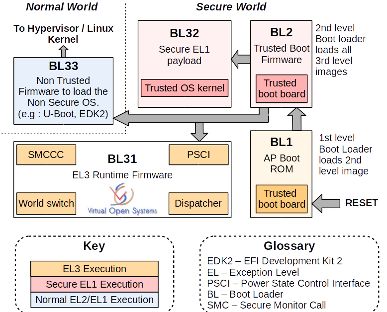

ATF 的加载流程划分为多个阶段，用 BLx 来表示，典型的有 BL1、BL2、BL31、BL32、BL33 等，典型的加载流程如下：

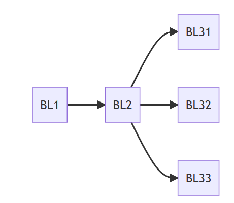

- BL1：BL1 是芯片上电后的第一阶段，一般这部分代码称为 Boot ROM，其是固化在芯片的内部，不能修改和升级。其负责初始化设备内部的一些重要寄存器、存储器等硬件资源，并加载和跳转到下一阶段 BL2。对于安全启动，是将 Boot ROM 作为启动时的信任根。
- BL2：BL2 完成相关的初始化操作， 主要是内存、 MMU、 串口以及 EL3 软件运行环境的设置；从存储介质中加载 BL3x 等镜像，并验证镜像的完整性和真实性；将控制权传递给 BL31，跳转到下一阶段 BL31。
- BL31：包含两部分功能，在启动时作为启动流程的一部分，执行软硬件初始化以及启动 BL32 和 BL33 镜像。在系统启动完成后，将继续驻留于系统中，并处理来自其它异常等级的 smc 异常，以及其它需要路由到 EL3 处理的中断等。
- BL32：Bl32 主要用于运行 Trusted OS，如 optee，它主要用来保护用户的敏感数据（如密码、指纹、人脸等），以及与其相关的功能模块，如加解密算法，ta 的加载与执行，secure storage 等。。
- BL33：BL33 一般是非安全世界的 BootLoader，如 u-boot，其用于启动最终的操作系统内核 kernel。

ARMv8 架构提出了不同的异常级别，每个阶段运行在不同的异常等级，其典型的启动流程如下：

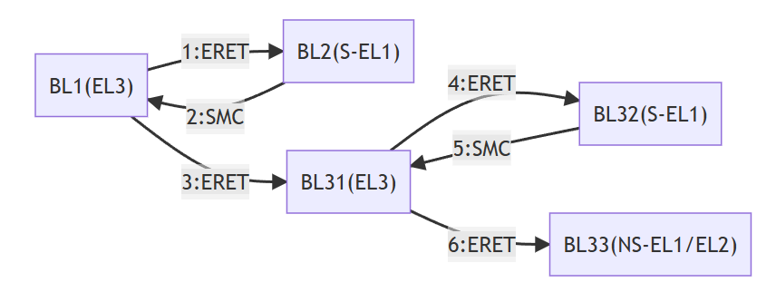

- 复位后 BL1 运行在 EL3，它执行完成后会通过异常返回 ERET 的方式跳转到 BL2

- BL2 执行完成后需要跳转到 BL31，由于 BL31 运行在 EL3 异常等级，只能通过 SMC 异常触发进入 EL3 异常等级

- BL1 捕获 SMC 异常，根据 BL2 传入的参数设置 BL31 的入口地址和系统初始状态，通过 ERET 跳转到 BL31 的入口地址处执行

- BL31 根据其镜像加载信息设置入口地址以及其它状态，并完成跳转 BL32

- BL32 加载完成后将通过 SMC 返回到 BL31

- BL31 跳转到 non secure EL1 或 non secure EL2 以执行 BL33


| **阶段** | 异常等级   | 功能                              | 描述                       |
| -------- | ---------- | --------------------------------- | -------------------------- |
| BL1      | EL3        | AP Boot ROM                       | 加载 bl2                   |
| BL2      | Secure EL1 | Trusted Boot Firmware             | 加载 bl3x                  |
| BL31     | EL3        | EL3 Runtime Firmware              | 启动 TEE-OS；启动 REE 镜像 |
| BL32     | Secure EL1 | TEE-OS（如 OP-TEE）               | 运行 Trusted-OS            |
| BL33     | NS-EL1/EL2 | Non-Trusted Firmware（如 U-Boot） | 加载 kernel                |

#### BL1

BL1 是启动的第一阶段，复位的入口函数为 `bl1_entrypoint`，这可以从 bl1.ld.S 链接脚本中 ENTRY 标号定义看出，即ENTRY(bl1_entrypoint)。其主要执行 BL1 初始化，平台初始化，加载下一阶段镜像，以及跳转到下一阶段执行，大致的函数执行流程如下。

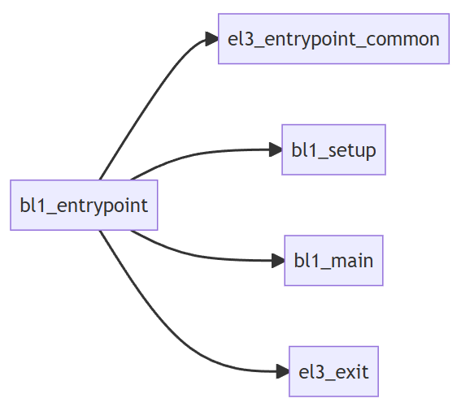

`el3_entrypoint_common` 是定义的一个宏，它是 EL3 等级下执行的入口通用函数，其实现位于 el3_common_macros.S，主要完成 C 语言运行环境的搭建，异常向量表的注册，BL1 镜像文件的复制，CPU 安全运行环境的设定。

```assembly
el3_entrypoint_common					\
    _init_sctlr=1					\
    _warm_boot_mailbox=!PROGRAMMABLE_RESET_ADDRESS	\
    _secondary_cold_boot=!COLD_BOOT_SINGLE_CPU	\
    _init_memory=1					\
    _init_c_runtime=1				\
    _exception_vectors=bl1_exceptions		\
    _pie_fixup_size=0
```

- _init_sctlr：初始化 EL3 异常等级下的系统控制器，包括设置系统小端，禁止可写内存的执行权限，启用栈对齐检查，对齐错误检查等。

- _warm_boot_mailbox：冷热启动处理，如果 `plat_get_my_entrypoint` 函数返回非 0 地址，执行热启动直接跳转到该地址，否则执行冷启动。
- _secondary_cold_boot：判断冷启动当前 CPU 是 primary 还是 secondary，若为 primary cpu，执行冷启动流程，否则为 secondary cpu，执行平台定义的 secondary cpu 启动设置。
- _init_memory：内存初始化，调用 `platform_mem_init` 函数。
- _init_c_runtime：C 运行环境初始化，将 ROM 中的数据段重定位到 RAM 和清零 BSS 段。
- _exception_vectors：设置异常向量表到 EL3 的向量表基地址寄存器中，bl1 的向量表位于 bl1_exceptions.S 中，可以看出只支持 SMC 异常的处理 `smc_handler64`，其他都会 panic。
- _pie_fixup_size：地址无关可执行文件(PIE)，即加载地址和链接地址不一样，程序也可以寻址执行。

`bl1_setup` 是 BL1 建立初始化：

```c
void bl1_setup(void)
{
	/* Enable early console if EARLY_CONSOLE flag is enabled */
	plat_setup_early_console();

	/* Perform early platform-specific setup */
	bl1_early_platform_setup();

	/* Perform late platform-specific setup */
	bl1_plat_arch_setup();

#if CTX_INCLUDE_PAUTH_REGS
	/*
	 * Assert that the ARMv8.3-PAuth registers are present or an access
	 * fault will be triggered when they are being saved or restored.
	 */
	assert(is_armv8_3_pauth_present());
#endif /* CTX_INCLUDE_PAUTH_REGS */
}

void bl1_early_platform_setup(void)
{
	/* 使能看门狗，初始化 console，初始化 memory */
	arm_bl1_early_platform_setup();
 
	/*
	 * Initialize Interconnect for this cluster during cold boot.
	 * No need for locks as no other CPU is active.
	 */
	plat_arm_interconnect_init(); // 初始化外围设备
	/*
	 * Enable Interconnect coherency for the primary CPU's cluster.
	 */
	plat_arm_interconnect_enter_coherency(); // 使能外围设备
}

void arm_bl1_plat_arch_setup(void)
{
#if USE_COHERENT_MEM
	/* Ensure ARM platforms don't use coherent memory in BL1. */
	assert((BL_COHERENT_RAM_END - BL_COHERENT_RAM_BASE) == 0U);
#endif

	const mmap_region_t bl_regions[] = {
		MAP_BL1_TOTAL,
		MAP_BL1_RO,
#if USE_ROMLIB
		ARM_MAP_ROMLIB_CODE,
		ARM_MAP_ROMLIB_DATA,
#endif
		{0}
	};

	setup_page_tables(bl_regions, plat_arm_get_mmap()); // 创建页表
#ifdef __aarch64__
	enable_mmu_el3(0); // 使能 MMU
#else
	enable_mmu_svc_mon(0);
#endif /* __aarch64__ */

	arm_setup_romlib();
}

void bl1_plat_arch_setup(void)
{
	arm_bl1_plat_arch_setup();
}
```

`bl1_main` 函数主要完成 BL2 镜像的加载及其运行环境的配置，如果启用安全启动，还需要对 BL2 镜像进行验签操作。

```c
void bl1_main(void)
{
	unsigned int image_id;

	/* Announce our arrival */
	NOTICE(FIRMWARE_WELCOME_STR); // 打印欢迎词，版本信息和编译时间
	NOTICE("BL1: %s\n", version_string);
	NOTICE("BL1: %s\n", build_message);

	INFO("BL1: RAM %p - %p\n", (void *)BL1_RAM_BASE, (void *)BL1_RAM_LIMIT);

	print_errata_status();

	/* Perform remaining generic architectural setup from EL3 */
	bl1_arch_setup(); // 实际调用 write_scr_el3(read_scr_el3() | SCR_RW_BIT); 将下一异常等级设置为 AArch64

	crypto_mod_init(); // 初始化安全启动需要密码库，这里使用的 mbedtls

	/* Initialize authentication module */
    // 这里调用 img_parser_init 初始化镜像解析模块，镜像完整性检查是通过 X509v3 证书来实现，其会存储镜像哈希和公钥。
	auth_mod_init();

	/* Initialize the measured boot */
	bl1_plat_mboot_init(); // 其是对各个软件组件的度量和验证

	/* Perform platform setup in BL1. */
	bl1_platform_setup(); //平台相关设置，主要是 IO 的设置

	/* Get the image id of next image to load and run. */
	image_id = bl1_plat_get_next_image_id();

	/*
	 * We currently interpret any image id other than
	 * BL2_IMAGE_ID as the start of firmware update.
	 */
	if (image_id == BL2_IMAGE_ID)
		bl1_load_bl2();
	else
		NOTICE("BL1-FWU: *******FWU Process Started*******\n");

	/* Teardown the measured boot driver */
	bl1_plat_mboot_finish();

	bl1_prepare_next_image(image_id);

	console_flush(); // 退出 BL1 前，刷新串口中的所有数据
}
```

- `bl1_load_bl2`：加载 BL2 镜像，包括加载镜像和验证镜像。

  ```c
  static void bl1_load_bl2(void)
  {
  	image_desc_t *desc;
  	image_info_t *info;
  	int err;
  
  	/* Get the image descriptor */
  	desc = bl1_plat_get_image_desc(BL2_IMAGE_ID);
  	assert(desc != NULL);
  
  	/* Get the image info */
  	info = &desc->image_info;
  	INFO("BL1: Loading BL2\n");
  
  	err = bl1_plat_handle_pre_image_load(BL2_IMAGE_ID); // 加载之前的镜像预处理
  	if (err != 0) {
  		ERROR("Failure in pre image load handling of BL2 (%d)\n", err);
  		plat_error_handler(err);
  	}
  
  	err = load_auth_image(BL2_IMAGE_ID, info);
  	if (err != 0) {
  		ERROR("Failed to load BL2 firmware.\n");
  		plat_error_handler(err);
  	}
  
  	/* Allow platform to handle image information. */
      /* 镜像平台后处理：获取 BL2 镜像描述符，获取跳转入口信息，计算 BL2 的可用内存，其等于总的内存减去 BL1 已使用的 sram 
       * 内存，最后将 BL2 的内存信息通过 arg1 参数传递给 BL2。
       */
  	err = bl1_plat_handle_post_image_load(BL2_IMAGE_ID);
  	if (err != 0) {
  		ERROR("Failure in post image load handling of BL2 (%d)\n", err);
  		plat_error_handler(err);
  	}
  
  	NOTICE("BL1: Booting BL2\n");
  }
  ```

  - `bl1_plat_get_image_desc`：获取 BL2 镜像描述信息，主要定义 BL2 镜像地址、镜像最大大小、镜像是安全状态并且需要执行，具体如下

    ```c
    #define BL2_IMAGE_DESC {				\
    	.image_id = BL2_IMAGE_ID,			\
    	SET_STATIC_PARAM_HEAD(image_info, PARAM_EP,	\
    		VERSION_2, image_info_t, 0),		\
    	.image_info.image_base = BL2_BASE,		\
    	.image_info.image_max_size = BL2_LIMIT - BL2_BASE,\
    	SET_STATIC_PARAM_HEAD(ep_info, PARAM_EP,	\
    		VERSION_2, entry_point_info_t, SECURE | EXECUTABLE),\
    	.ep_info.pc = BL2_BASE,				\
    }
    // 展开如下
    image_desc_t bl2_img_desc = {
        .image_id = BL2_IMAGE_ID,							// 镜像ID
        .image_info.h.type = PARAM_EP,						// 镜像信息类型
        .image_info.h.version = VERSION_2,					// 镜像信息版本
        .image_info.h.size = sizeof(image_info_t),			// 镜像信息大小
        .image_info.h.attr = 0,								// 镜像属性
        .image_info.image_base = BL2_BASE,					// 镜像地址
        .image_info.image_max_size = BL2_LIMIT - BL2_BASE,	// 镜像大小
        .ep_info.h.type = PARAM_EP,							// 跳转信息类型
        .ep_info.h.version = VERSION_2,						// 跳转信息版本
        .ep_info.h.size = sizeof(entry_point_info_t),		// 跳转信息大小
        .ep_info.h.attr = SECURE | EXECUTABLE,   			// 跳转信息属性：镜像是安全状态并且可执行
    }
    ```

  - `load_auth_image`：加载并认证镜像，主要是调用 `load_auth_image_internal` 这个函数，对于安全启动会递归加载并认证镜像，否则直接加载镜像。

    ```c
    static int load_auth_image_internal(unsigned int image_id,
    				    image_info_t *image_data)
    {
    #if TRUSTED_BOARD_BOOT
    	if (dyn_is_auth_disabled() == 0) {
            /* 安全启动加载镜像，这里首先会获取 BL2 镜像的父镜像，即可信启动证书镜像，加载完证书镜像并对证书进行签名认证，
             * 然后才加载 BL2 镜像，最后对 BL2 镜像进行认证。
             */
    		return load_auth_image_recursive(image_id, image_data, 0);
    	}
    #endif
    
        // 普通启动加载镜像。首先获取镜像源，然后通过一些列 IO 操作完成对 BL2 镜像的加载。
    	return load_image(image_id, image_data);
    }
    ```

- `bl1_prepare_next_image`：下一阶段镜像启动准备，主要是准备安全世界和普通世界镜像的上下文，普通世界如果支持 EL2，则镜像跳转到 EL2，否则跳转到 EL1

  ```c
  void bl1_prepare_next_image(unsigned int image_id)
  {
  	/*
  	 * Following array will be used for context management.
  	 * There are 2 instances, for the Secure and Non-Secure contexts.
  	 */
      // 定义上下文管理的数组，bl1_cpu_context[0] 为安全上下文，bl1_cpu_context[1] 为非安全上下文
  	static cpu_context_t bl1_cpu_context[2];
  
  	unsigned int security_state, mode = MODE_EL1;
  	image_desc_t *desc;
  	entry_point_info_t *next_bl_ep;
  
  	/* Get the image descriptor. */
  	desc = bl1_plat_get_image_desc(image_id);
  	assert(desc != NULL);
  
  	/* Get the entry point info. */
  	next_bl_ep = &desc->ep_info; // BL2 image 入口地址
  
  	/* Get the image security state. */
  	security_state = GET_SECURITY_STATE(next_bl_ep->h.attr); // 这里 BL2 镜像是安全状态
  
  	/* Setup the Secure/Non-Secure context if not done already. */
  	if (cm_get_context(security_state) == NULL) // 查看安全或者非安全上下文是否准备好，如果没有准备好就分配
  		cm_set_context(&bl1_cpu_context[security_state], security_state);
  
  	/* Prepare the SPSR for the next BL image. */
  	if ((security_state != SECURE) && (el_implemented(2) != EL_IMPL_NONE)) {
  		mode = MODE_EL2;
  	}
      /* 准备 SPSR 寄存器，SPSR 是程序保存状态寄存器，用于保存程序在异常处理过程中的状态。这里先判断是否支持 EL2，若支持，则
       * 下一异常等级为 EL2，否则下一等级为 Secure_EL1。然后设置 SPSR 的异常等级、栈指针 SP_ELx 和关闭所有 DAIF 异常
       */
  	next_bl_ep->spsr = (uint32_t)SPSR_64((uint64_t) mode,
  		(uint64_t)MODE_SP_ELX, DISABLE_ALL_EXCEPTIONS);
  
  	/* Allow platform to make change */
  	bl1_plat_set_ep_info(image_id, next_bl_ep);
  
  	/* Prepare the context for the next BL image. */
  	cm_init_my_context(next_bl_ep); // 使用获取到的 BL2 image 的 entrypoint info 数据来初始化 cpu context
  	cm_prepare_el3_exit(security_state); // 为进入到下个 EL 级别做准备
  
  	/* Indicate that image is in execution state. */
  	desc->state = IMAGE_STATE_EXECUTED;
  
  	print_entry_point_info(next_bl_ep); // 打印 BL2 image 的入口信息
  }
  ```

`el3_exit` 位于 `context.S `文件，执行实际的异常等级切换流程。

```assembly
func el3_exit
	/* ----------------------------------------------------------
	 * Save the current SP_EL0 i.e. the EL3 runtime stack which
	 * will be used for handling the next SMC.
	 * Then switch to SP_EL3.
	 * ----------------------------------------------------------
	 */
	mov	x17, sp /* 将当前 SP_EL0（EL3 的运行栈）保存到 X17 寄存器中 */
	msr	spsel, #MODE_SP_ELX
	str	x17, [sp, #CTX_EL3STATE_OFFSET + CTX_RUNTIME_SP] /* 将 SP_EL0 的值保存到 EL3 的上下文中 */

	/* ----------------------------------------------------------
	 * Restore SPSR_EL3, ELR_EL3 and SCR_EL3 prior to ERET
	 * ----------------------------------------------------------
	 */
	/* 从 EL3 上下文恢复之前保存的 SCR_EL3、SPSR_EL3 和 ELR_EL3，设置 SCR_EL3、SPSR_EL3 和 ELR_EL3 寄存器 */
	ldr	x18, [sp, #CTX_EL3STATE_OFFSET + CTX_SCR_EL3]
	ldp	x16, x17, [sp, #CTX_EL3STATE_OFFSET + CTX_SPSR_EL3]
	msr	scr_el3, x18
	msr	spsr_el3, x16
	msr	elr_el3, x17

	restore_ptw_el1_sys_regs

	/* ----------------------------------------------------------
	 * Restore general purpose (including x30), PMCR_EL0 and
	 * ARMv8.3-PAuth registers.
	 * Exit EL3 via ERET to a lower exception level.
 	 * ----------------------------------------------------------
 	 */
	bl	restore_gp_pmcr_pauth_regs
	ldr	x30, [sp, #CTX_GPREGS_OFFSET + CTX_GPREG_LR]

	exception_return /* 执行 ERET 指令，跳转到 BL2 的入口地址 */

endfunc el3_exit
```

#### BL2

BL2 是启动的第二阶段，同理复位的入口函数为 `bl2_entrypoint` 。BL2 的加载流程同 BL1 类似，只是需要加载更多的镜像，如 BL31、BL32 或者 BL33 等，大致的函数执行流程如下：

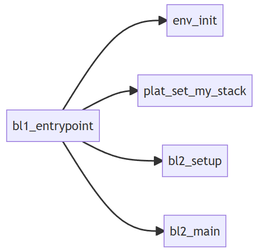

```assembly
func bl2_entrypoint
	/*---------------------------------------------
	 * Save arguments x0 - x3 from BL1 for future
	 * use.
	 * ---------------------------------------------
	 */
	/* 保存 BL1 传递过来的 x0-x3 参数，BL1 通过 x0-x3 寄存器向 BL2 传递参数，
	 * 当前 BL1 只通过 x1 传递过来 BL2 可用的安全内存区域。
	 */
	mov	x20, x0
	mov	x21, x1
	mov	x22, x2
	mov	x23, x3

	/* ---------------------------------------------
	 * Set the exception vector to something sane.
	 * ---------------------------------------------
	 */
	/* 设定异常向量：将 EL1 异常向量表基地址设置到 VBAR 寄存器，向量表定义位于 early_exceptions.S，可以看出 BL2 捕获异常后
	 * 不会做处理，只是打印异常相关的信息，然后直接进入 panic。
	 */
	adr	x0, early_exceptions
	msr	vbar_el1, x0
	isb

	/* ---------------------------------------------
	 * Enable the SError interrupt now that the
	 * exception vectors have been setup.
	 * ---------------------------------------------
	 */
	/* 使能 SError 中断，用来屏蔽系统错误 */
	msr	daifclr, #DAIF_ABT_BIT

	/* ---------------------------------------------
	 * Enable the instruction cache, stack pointer
	 * and data access alignment checks and disable
	 * speculative loads.
	 * ---------------------------------------------
	 */
	/* EL1 等级下，使能 ICACHE 和栈对齐、数据对齐检查，关闭预取 */
	mov	x1, #(SCTLR_I_BIT | SCTLR_A_BIT | SCTLR_SA_BIT)
	mrs	x0, sctlr_el1
	orr	x0, x0, x1
	bic	x0, x0, #SCTLR_DSSBS_BIT
	msr	sctlr_el1, x0
	isb

	/* ---------------------------------------------
	 * Invalidate the RW memory used by the BL2
	 * image. This includes the data and NOBITS
	 * sections. This is done to safeguard against
	 * possible corruption of this memory by dirty
	 * cache lines in a system cache as a result of
	 * use by an earlier boot loader stage.
	 * ---------------------------------------------
	 */
	/* C 运行环境初始化，将 ROM 中的数据段重定位到 RAM 和清零 BSS 段 */
	adr	x0, __RW_START__
	adr	x1, __RW_END__
	sub	x1, x1, x0
	bl	inv_dcache_range

	/* ---------------------------------------------
	 * Zero out NOBITS sections. There are 2 of them:
	 *   - the .bss section;
	 *   - the coherent memory section.
	 * ---------------------------------------------
	 */
	adrp	x0, __BSS_START__
	add	x0, x0, :lo12:__BSS_START__
	adrp	x1, __BSS_END__
	add	x1, x1, :lo12:__BSS_END__
	sub	x1, x1, x0
	bl	zeromem

#if USE_COHERENT_MEM
	adrp	x0, __COHERENT_RAM_START__
	add	x0, x0, :lo12:__COHERENT_RAM_START__
	adrp	x1, __COHERENT_RAM_END_UNALIGNED__
	add	x1, x1, :lo12:__COHERENT_RAM_END_UNALIGNED__
	sub	x1, x1, x0
	bl	zeromem
#endif

	/* --------------------------------------------
	 * Allocate a stack whose memory will be marked
	 * as Normal-IS-WBWA when the MMU is enabled.
	 * There is no risk of reading stale stack
	 * memory after enabling the MMU as only the
	 * primary cpu is running at the moment.
	 * --------------------------------------------
	 */
	bl	plat_set_my_stack /* 分配 BL2 运行时栈 */

	/* ---------------------------------------------
	 * Initialize the stack protector canary before
	 * any C code is called.
	 * ---------------------------------------------
	 */
#if STACK_PROTECTOR_ENABLED
	bl	update_stack_protector_canary
#endif

	/* ---------------------------------------------
	 * Perform BL2 setup
	 * ---------------------------------------------
	 */
	mov	x0, x20
	mov	x1, x21
	mov	x2, x22
	mov	x3, x23
	bl	bl2_setup

#if ENABLE_PAUTH
	/* ---------------------------------------------
	 * Program APIAKey_EL1
	 * and enable pointer authentication.
	 * ---------------------------------------------
	 */
	bl	pauth_init_enable_el1
#endif /* ENABLE_PAUTH */

	/* ---------------------------------------------
	 * Jump to main function.
	 * ---------------------------------------------
	 */
	bl	bl2_main

	/* ---------------------------------------------
	 * Should never reach this point.
	 * ---------------------------------------------
	 */
	no_ret	plat_panic_handler

endfunc bl2_entrypoint
```

`bl2_setup ` 是 BL2 初始化：

```c
void bl2_setup(u_register_t arg0, u_register_t arg1, u_register_t arg2,
	       u_register_t arg3)
{
	/* Enable early console if EARLY_CONSOLE flag is enabled */
	plat_setup_early_console();

	/* Perform early platform-specific setup */
	bl2_early_platform_setup2(arg0, arg1, arg2, arg3);

	/* Perform late platform-specific setup */
	bl2_plat_arch_setup();

#if CTX_INCLUDE_PAUTH_REGS
	/*
	 * Assert that the ARMv8.3-PAuth registers are present or an access
	 * fault will be triggered when they are being saved or restored.
	 */
	assert(is_armv8_3_pauth_present());
#endif /* CTX_INCLUDE_PAUTH_REGS */
}
```

`bl2_main` 主要完成了 BL2 阶段的主要操作， 包括对下一个阶段镜像文件的解析、 获取入口地址和镜像文件大小等信息， 然后对镜像文件进行验签和加载操作。 将 BL31 加载到内存中后会触发安全监控模式调用（SMC） 将 CPU 权限转交给 BL31。

```c
void bl2_main(void)
{
	entry_point_info_t *next_bl_ep_info;

#if ENABLE_RUNTIME_INSTRUMENTATION
	PMF_CAPTURE_TIMESTAMP(bl_svc, BL2_ENTRY, PMF_CACHE_MAINT);
#endif

	NOTICE("BL2: %s\n", build_version_string);
	NOTICE("BL2: %s\n", build_message);

	/* Perform remaining generic architectural setup in S-EL1 */
	bl2_arch_setup(); // 开启 FP/SIMD 寄存器访问权限。

#if PSA_FWU_SUPPORT
	fwu_init();
#endif /* PSA_FWU_SUPPORT */

	crypto_mod_init(); // 初始化安全启动需要密码库，与 BL1 相同。

	/* Initialize authentication module */
	auth_mod_init(); // 认证模块初始化，与 BL1 相同。

	/* Initialize the Measured Boot backend */
	bl2_plat_mboot_init(); // measured boot 初始化，与 BL1相同。

	/* Initialize boot source */
	bl2_plat_preload_setup();

	/* Load the subsequent bootloader images. */
	next_bl_ep_info = bl2_load_images(); // 加载 BL3x 镜像，并返回 BL31 的入口地址。

	/* Teardown the Measured Boot backend */
	bl2_plat_mboot_finish(); // 卸载 mesured boot 驱动

#if !BL2_RUNS_AT_EL3
#ifndef __aarch64__
	/*
	 * For AArch32 state BL1 and BL2 share the MMU setup.
	 * Given that BL2 does not map BL1 regions, MMU needs
	 * to be disabled in order to go back to BL1.
	 */
	disable_mmu_icache_secure();
#endif /* !__aarch64__ */

#if ENABLE_PAUTH
	/*
	 * Disable pointer authentication before running next boot image
	 */
	pauth_disable_el1();
#endif /* ENABLE_PAUTH */

#if ENABLE_RUNTIME_INSTRUMENTATION
	PMF_CAPTURE_TIMESTAMP(bl_svc, BL2_EXIT, PMF_CACHE_MAINT);
#endif

	console_flush(); // 出 BL2 前，刷新串口中的所有数据

	/*
	 * Run next BL image via an SMC to BL1. Information on how to pass
	 * control to the BL32 (if present) and BL33 software images will
	 * be passed to next BL image as an argument.
	 */
    /* 通过 SMC 跳转到下一镜像，由于 BL2 运行在 S-EL1 下，需要通过 SMC 异常再次进入 BL1，由 BL1 的 SMC 处理函数来执行实际
     * 的镜像切换流程。这里触发了一个类型为 BL1_SMC_RUN_IMAGE 的安全监控模式调用，第二个参数为下一阶段的入口跳转信息
     */
	smc(BL1_SMC_RUN_IMAGE, (unsigned long)next_bl_ep_info, 0, 0, 0, 0, 0, 0);
#else /* if BL2_RUNS_AT_EL3 */

	NOTICE("BL2: Booting " NEXT_IMAGE "\n");
	print_entry_point_info(next_bl_ep_info);
#if ENABLE_RUNTIME_INSTRUMENTATION
	PMF_CAPTURE_TIMESTAMP(bl_svc, BL2_EXIT, PMF_CACHE_MAINT);
#endif
	console_flush();

#if ENABLE_PAUTH
	/*
	 * Disable pointer authentication before running next boot image
	 */
	pauth_disable_el3();
#endif /* ENABLE_PAUTH */

	bl2_run_next_image(next_bl_ep_info);
#endif /* BL2_RUNS_AT_EL3 */
}
```

- 加载 BL3x 镜像，并返回 BL31 的入口地址。

  ```c
  struct entry_point_info *bl2_load_images(void)
  {
  	bl_params_t *bl2_to_next_bl_params;
  	bl_load_info_t *bl2_load_info;
  	const bl_load_info_node_t *bl2_node_info;
  	int plat_setup_done = 0;
  	int err;
  
  	/*
  	 * Get information about the images to load.
  	 */
  	bl2_load_info = plat_get_bl_image_load_info();
  	assert(bl2_load_info != NULL);
  	assert(bl2_load_info->head != NULL);
  	assert(bl2_load_info->h.type == PARAM_BL_LOAD_INFO);
  	assert(bl2_load_info->h.version >= VERSION_2);
  	bl2_node_info = bl2_load_info->head;
  
  	while (bl2_node_info != NULL) {
  		/*
  		 * Perform platform setup before loading the image,
  		 * if indicated in the image attributes AND if NOT
  		 * already done before.
  		 */
  		if ((bl2_node_info->image_info->h.attr &
  		    IMAGE_ATTRIB_PLAT_SETUP) != 0U) {
  			if (plat_setup_done != 0) {
  				WARN("BL2: Platform setup already done!!\n");
  			} else {
                  // 进入循环遍历节点加载镜像，首先判断加载镜像之前是否需要执行平台初始化
  				INFO("BL2: Doing platform setup\n");
  				bl2_platform_setup();
  				plat_setup_done = 1;
  			}
  		}
  
          // 镜像加载前可以进行一些预处理操作
  		err = bl2_plat_handle_pre_image_load(bl2_node_info->image_id);
  		if (err != 0) {
  			ERROR("BL2: Failure in pre image load handling (%i)\n", err);
  			plat_error_handler(err);
  		}
  
  		if ((bl2_node_info->image_info->h.attr &
  		    IMAGE_ATTRIB_SKIP_LOADING) == 0U) {
  			INFO("BL2: Loading image id %u\n", bl2_node_info->image_id);
  			err = load_auth_image(bl2_node_info->image_id, // 加载并认证镜像，与 BL1 的加载流程完全一致。
  				bl2_node_info->image_info);
  			if (err != 0) {
  				ERROR("BL2: Failed to load image id %u (%i)\n",
  				      bl2_node_info->image_id, err);
  				plat_error_handler(err);
  			}
  		} else {
  			INFO("BL2: Skip loading image id %u\n", bl2_node_info->image_id);
  		}
  
  		/* Allow platform to handle image information. */
          // 平台镜像加载后处理，可以根据实际需要更改，通过给定image ID来更改image的加载信息
  		err = bl2_plat_handle_post_image_load(bl2_node_info->image_id);
  		if (err != 0) {
  			ERROR("BL2: Failure in post image load handling (%i)\n", err);
  			plat_error_handler(err);
  		}
  
  		/* Go to next image */
  		bl2_node_info = bl2_node_info->next_load_info;
  	}
  
  	/*
  	 * Get information to pass to the next image.
  	 */
      /* 获取传递给下一个镜像的信息。会调用 get_next_bl_params_from_mem_params_desc，该函数会创建待执行镜像的链表。首先寻找
       * 第一个需要执行的镜像，在 bl2_mem_params_descs 中定义的是 BL31，放入 next_bl_params 链表头，然后可执行镜像的参数节
       * 点添加到参数列表中。
       */
  	bl2_to_next_bl_params = plat_get_next_bl_params();
  	assert(bl2_to_next_bl_params != NULL);
  	assert(bl2_to_next_bl_params->head != NULL);
  	assert(bl2_to_next_bl_params->h.type == PARAM_BL_PARAMS);
  	assert(bl2_to_next_bl_params->h.version >= VERSION_2);
  	assert(bl2_to_next_bl_params->head->ep_info != NULL);
  
  	/* Populate arg0 for the next BL image if not already provided */
  	if (bl2_to_next_bl_params->head->ep_info->args.arg0 == (u_register_t)0)
  		bl2_to_next_bl_params->head->ep_info->args.arg0 =
  					(u_register_t)bl2_to_next_bl_params;
  
  	/* Flush the parameters to be passed to next image */
      // 刷新参数给下一个镜像，由于 BL2 开启了 dcache，在跳转之前，需要将参数数据从 cache 刷新到 SRAM 中。
  	plat_flush_next_bl_params();
  
  	return bl2_to_next_bl_params->head->ep_info;
  }
  ```

  - `plat_get_bl_image_load_info`：获取加载所有镜像的信息，这里会调用到 `get_bl_load_info_from_mem_params_desc`，该函数会创建待加载镜像的链表。

    ```c
    bl_load_info_t *get_bl_load_info_from_mem_params_desc(void)
    {
    	unsigned int index = 0;
    
    	/* If there is no image to start with, return NULL */
    	if (bl_mem_params_desc_num == 0U)
    		return NULL;
    
    	/* Assign initial data structures */
    	bl_load_info_node_t *bl_node_info =
    		&bl_mem_params_desc_ptr[index].load_node_mem;
    	bl_load_info.head = bl_node_info;
    	SET_PARAM_HEAD(&bl_load_info, PARAM_BL_LOAD_INFO, VERSION_2, 0U);
    
    	/* Go through the image descriptor array and create the list */
    	for (; index < bl_mem_params_desc_num; index++) {
    
    		/* Populate the image information */
    		bl_node_info->image_id = bl_mem_params_desc_ptr[index].image_id;
    		bl_node_info->image_info = &bl_mem_params_desc_ptr[index].image_info;
    
    		/* Link next image if present */
    		if ((index + 1U) < bl_mem_params_desc_num) {
    			/* Get the memory and link the next node */
    			bl_node_info->next_load_info =
    				&bl_mem_params_desc_ptr[index + 1U].load_node_mem;
    			bl_node_info = bl_node_info->next_load_info;
    		}
    	}
    
    	return &bl_load_info;
    }
    ```

    待加载镜像的描述信息是由 `bl_mem_params_desc_ptr` 提供，其是 `REGISTER_BL_IMAGE_DESCS(bl2_mem_params_descs)` 注册到系统中的。镜像文件描述信息是由 `bl_mem_params_node_t` 结构体定义的。

    ```c
    /* Following structure is used to store BL ep/image info. */
    typedef struct bl_mem_params_node {
    	unsigned int image_id; // 镜像 ID
    	image_info_t image_info; // 镜像信息
    	entry_point_info_t ep_info; // 跳转信息
    	unsigned int next_handoff_image_id; // 交接的下一个镜像 ID
    	bl_load_info_node_t load_node_mem; // 镜像加载流程节点
    	bl_params_node_t params_node_mem; // 镜像执行流程节点
    } bl_mem_params_node_t;
    ```

- 通过SMC调用会进入到 bl1_exceptions.S 中 `smc_handler64`，如下：

  ```assembly
  func smc_handler64
  
  	/* ----------------------------------------------
  	 * Detect if this is a RUN_IMAGE or other SMC.
  	 * ----------------------------------------------
  	 */
  	/* 判断是不是 BL1_SMC_RUN_IMAGE，若是继续镜像切换，否则认为是普通类型的异常，进入 smc_handler */
  	mov	x30, #BL1_SMC_RUN_IMAGE
  	cmp	x30, x0
  	b.ne	smc_handler
  
  	/* ------------------------------------------------
  	 * Make sure only Secure world reaches here.
  	 * ------------------------------------------------
  	 */
  	/* 判断是否是安全世界执行到此，如果不是则认为不合法，产生异常 */
  	mrs	x30, scr_el3
  	tst	x30, #SCR_NS_BIT
  	b.ne	unexpected_sync_exception
  
  	/* ----------------------------------------------
  	 * Handling RUN_IMAGE SMC. First switch back to
  	 * SP_EL0 for the C runtime stack.
  	 * ----------------------------------------------
  	 */
  	/* 恢复 el3_exit 流程中保存的运行时栈的值，恢复到 SP_EL0 中 */
  	ldr	x30, [sp, #CTX_EL3STATE_OFFSET + CTX_RUNTIME_SP]
  	msr	spsel, #MODE_SP_EL0
  	mov	sp, x30
  
  	/* ---------------------------------------------------------------------
  	 * Pass EL3 control to next BL image.
  	 * Here it expects X1 with the address of a entry_point_info_t
  	 * structure describing the next BL image entrypoint.
  	 * ---------------------------------------------------------------------
  	 */
  	mov	x20, x1
  
  	mov	x0, x20
  	bl	bl1_print_next_bl_ep_info /* 打印 BL3x 参数信息 */
  
  	/* 从 next_bl_ep_info 参数中获取设置 ELR_EL3 和 SPSR_EL3 寄存器 */
  	ldp	x0, x1, [x20, #ENTRY_POINT_INFO_PC_OFFSET]
  	msr	elr_el3, x0
  	msr	spsr_el3, x1
  	/* 判断下一镜像是否是 EL3，如果不是则报异常 */
  	ubfx	x0, x1, #MODE_EL_SHIFT, #2
  	cmp	x0, #MODE_EL3
  	b.ne	unexpected_sync_exception
  
  	bl	disable_mmu_icache_el3
  	tlbi	alle3
  	dsb	ish /* ERET implies ISB, so it is not needed here */
  
  	mov	x0, x20
  	bl	bl1_plat_prepare_exit /* 退出 BL1 前的操作，默认为空操作 */
  	/* 设置 x0-x7 跳转参数，这里是 next_bl_ep_info 的 arg0 出栈传递给 x0，arg1 即 bl_params 指针出栈传递给 x1 */
  	ldp	x6, x7, [x20, #(ENTRY_POINT_INFO_ARGS_OFFSET + 0x30)]
  	ldp	x4, x5, [x20, #(ENTRY_POINT_INFO_ARGS_OFFSET + 0x20)]
  	ldp	x2, x3, [x20, #(ENTRY_POINT_INFO_ARGS_OFFSET + 0x10)]
  	ldp	x0, x1, [x20, #(ENTRY_POINT_INFO_ARGS_OFFSET + 0x0)]
  	exception_return /* 最后通过 ERET 跳转到下一阶段镜像 */
  endfunc smc_handler64
  ```

#### BL31

在 BL2 中触发 SMC 后会跳转到 BL31 中执行，同理复位的入口函数为 `bl31_entrypoint`。BL31 最主要的两个功能：作为启动流程，初始化硬件和加载 BL32、BL33 等；启动完成后常驻内存，处理各种 SMC 异常和路由到 EL3 中断。启动大致的函数执行流程如下：

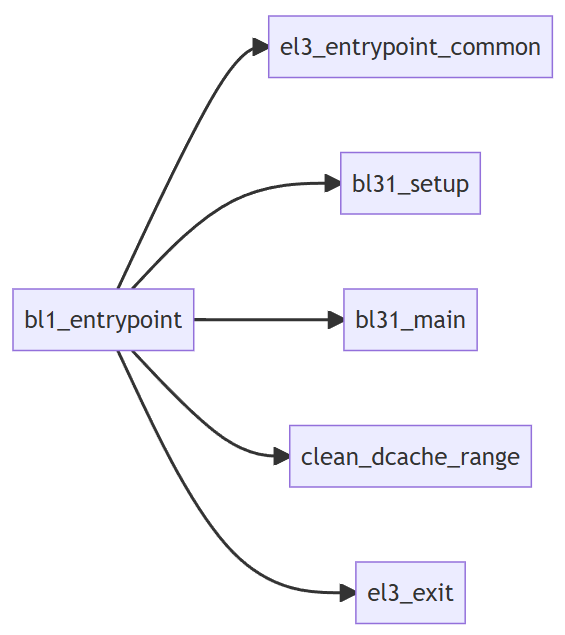

```assembly
func bl31_entrypoint
	/* ---------------------------------------------------------------
	 * Stash the previous bootloader arguments x0 - x3 for later use.
	 * ---------------------------------------------------------------
	 */
	/* 同 BL2，现将前面阶段传递过来的 x0-x3 参数保存起来 */
	mov	x20, x0
	mov	x21, x1
	mov	x22, x2
	mov	x23, x3

	/* RESET_TO_BL31 = 0：复位后不是从 BL31 开始启动，即会按照 TF-A 的标准启动方式，从 BL1，BL2，到 BL31 启动，由于系统
	 * 的基本配置已经设置完成，只需要设置C运行环境，异常向量表，地址无关大小。
	 * RESET_TO_BL31 = 1：复位后直接从 BL31 开始启动，同 BL1 一样，需要初始化系统控制器，冷热启动处理，初始化内存，初始化C
	 * 运行环境，异常向量表，地址无关大小。最后把 x20-x23 清零以便后续使用。
	 */
#if !RESET_TO_BL31
	/* ---------------------------------------------------------------------
	 * For !RESET_TO_BL31 systems, only the primary CPU ever reaches
	 * bl31_entrypoint() during the cold boot flow, so the cold/warm boot
	 * and primary/secondary CPU logic should not be executed in this case.
	 *
	 * Also, assume that the previous bootloader has already initialised the
	 * SCTLR_EL3, including the endianness, and has initialised the memory.
	 * ---------------------------------------------------------------------
	 */
	el3_entrypoint_common					\
		_init_sctlr=0					\
		_warm_boot_mailbox=0				\
		_secondary_cold_boot=0				\
		_init_memory=0					\
		_init_c_runtime=1				\
		_exception_vectors=runtime_exceptions		\
		_pie_fixup_size=BL31_LIMIT - BL31_BASE
#else

	/* ---------------------------------------------------------------------
	 * For RESET_TO_BL31 systems which have a programmable reset address,
	 * bl31_entrypoint() is executed only on the cold boot path so we can
	 * skip the warm boot mailbox mechanism.
	 * ---------------------------------------------------------------------
	 */
	el3_entrypoint_common					\
		_init_sctlr=1					\
		_warm_boot_mailbox=!PROGRAMMABLE_RESET_ADDRESS	\
		_secondary_cold_boot=!COLD_BOOT_SINGLE_CPU	\
		_init_memory=1					\
		_init_c_runtime=1				\
		_exception_vectors=runtime_exceptions		\
		_pie_fixup_size=BL31_LIMIT - BL31_BASE
#endif /* RESET_TO_BL31 */

	/* --------------------------------------------------------------------
	 * Perform BL31 setup
	 * --------------------------------------------------------------------
	 */
	mov	x0, x20
	mov	x1, x21
	mov	x2, x22
	mov	x3, x23
	bl	bl31_setup

#if ENABLE_PAUTH
	/* --------------------------------------------------------------------
	 * Program APIAKey_EL1 and enable pointer authentication
	 * --------------------------------------------------------------------
	 */
	bl	pauth_init_enable_el3
#endif /* ENABLE_PAUTH */

	/* --------------------------------------------------------------------
	 * Jump to main function
	 * --------------------------------------------------------------------
	 */
	bl	bl31_main

	/* --------------------------------------------------------------------
	 * Clean the .data & .bss sections to main memory. This ensures
	 * that any global data which was initialised by the primary CPU
	 * is visible to secondary CPUs before they enable their data
	 * caches and participate in coherency.
	 * --------------------------------------------------------------------
	 */
	/* 清零 data 和 bss 段 */
	adrp	x0, __DATA_START__
	add	x0, x0, :lo12:__DATA_START__
	adrp	x1, __DATA_END__
	add	x1, x1, :lo12:__DATA_END__
	sub	x1, x1, x0
	bl	clean_dcache_range

	adrp	x0, __BSS_START__
	add	x0, x0, :lo12:__BSS_START__
	adrp	x1, __BSS_END__
	add	x1, x1, :lo12:__BSS_END__
	sub	x1, x1, x0
	bl	clean_dcache_range

	/* 进入到 BL33 阶段。至此 TF-A 启动流程全部执行完毕，进入到 uboot 或者直接运行 kernel。 */
	b	el3_exit
endfunc bl31_entrypoint
```

`bl31_setup` 同 BL2 一样，`bl31_setup` 是 BL31 建立初始化：

```c
void bl31_setup(u_register_t arg0, u_register_t arg1, u_register_t arg2,
		u_register_t arg3)
{
	/* Enable early console if EARLY_CONSOLE flag is enabled */
	plat_setup_early_console();

	/* Perform early platform-specific setup */
	bl31_early_platform_setup2(arg0, arg1, arg2, arg3); // 查找 BL32，BL33 的跳转信息

	/* Perform late platform-specific setup */
	bl31_plat_arch_setup(); // 创建页表，使能 MMU

#if CTX_INCLUDE_PAUTH_REGS
	/*
	 * Assert that the ARMv8.3-PAuth registers are present or an access
	 * fault will be triggered when they are being saved or restored.
	 */
	assert(is_armv8_3_pauth_present());
#endif /* CTX_INCLUDE_PAUTH_REGS */

	/* Prints context_memory allocated for all the security states */
	report_ctx_memory_usage();
}
```

`bl31_main` 主要执行平台初始化，运行时服务初始化，启动 BL32 和 BL33 镜像。

```c
void bl31_main(void)
{
	NOTICE("BL31: %s\n", version_string);
	NOTICE("BL31: %s\n", build_message);

	/* Perform platform setup in BL31 */
	bl31_platform_setup(); // 初始化 gic 驱动，cpu & distributor interfaces

	/* Initialise helper libraries */
	bl31_lib_init(); // 初始化帮助库，调用了 cm_init 上下文管理初始化，但是里面是空函数

#if EL3_EXCEPTION_HANDLING
	INFO("BL31: Initialising Exception Handling Framework\n");
    // 初始化异常处理框架。首先设置非安全路由到 EL3 的中断标志，然后设置 BL31 顶级中断处理函数
	ehf_init();
#endif

	/* Initialize the runtime services e.g. psci. */
	INFO("BL31: Initializing runtime services\n");
	runtime_svc_init();

	/*
	 * All the cold boot actions on the primary cpu are done. We now need to
	 * decide which is the next image and how to execute it.
	 * If the SPD runtime service is present, it would want to pass control
	 * to BL32 first in S-EL1. In that case, SPD would have registered a
	 * function to initialize bl32 where it takes responsibility of entering
	 * S-EL1 and returning control back to bl31_main. Similarly, if RME is
	 * enabled and a function is registered to initialize RMM, control is
	 * transferred to RMM in R-EL2. After RMM initialization, control is
	 * returned back to bl31_main. Once this is done we can prepare entry
	 * into BL33 as normal.
	 */

	/*
	 * If SPD had registered an init hook, invoke it.
	 */
	if (bl32_init != NULL) {
		INFO("BL31: Initializing BL32\n");

		int32_t rc = (*bl32_init)();

		if (rc == 0) {
			WARN("BL31: BL32 initialization failed\n");
		}
	}

	/*
	 * We are ready to enter the next EL. Prepare entry into the image
	 * corresponding to the desired security state after the next ERET.
	 */
	bl31_prepare_next_image_entry();

	console_flush(); // 刷新串口终端数据

	/*
	 * Perform any platform specific runtime setup prior to cold boot exit
	 * from BL31
	 */
	bl31_plat_runtime_setup(); // 在退出 BL31之前执行平台 runtime 建立，配置切换了 console 的状态
}
```

- `runtime_svc_init()`：运行时服务初始化，BL31 启动完成后会常驻内存，处理来自低异常等级的 SMC 异常，这些异常处理流程就是运行时服务，不同的服务 SMC 在调用之前需要先注册到 BL31 中，以 optee 服务为例，看下注册流程，在 opteed_main.c 通过 `DECLARE_RT_SVC` 定义了两个服务的 SMC Call：一个用于快速 SMC 调用，其不需要执行完整的调度过程就能返回；另一个用于 yielding SMC 调用，其是阻塞的，需要完整的调度过程才能返回，处理速度较第一种慢。这样 optee 可以根据不同的场景选择合适的 SMC 类型来提供服务。

  ```c
  /*
   * Convenience macros to declare a service descriptor
   */
  #define DECLARE_RT_SVC(_name, _start, _end, _type, _setup, _smch)	\
  	static const rt_svc_desc_t __svc_desc_ ## _name			\
  		__section("rt_svc_descs") __used = {			\
  			.start_oen = (_start),				\
  			.end_oen = (_end),				\
  			.call_type = (_type),				\
  			.name = #_name,					\
  			.init = (_setup),				\
  			.handle = (_smch)				\
  		}
  ```

  `DECLARE_RT_SVC` 宏定义被编译到镜像文件中的 `rt_svc_descs` 段中，这个段在链接脚本 `bl_common.ld.h` 中，如下。

  ```c
  #define RT_SVC_DESCS					\
  	. = ALIGN(STRUCT_ALIGN);			\
  	__RT_SVC_DESCS_START__ = .;			\
  	KEEP(*(rt_svc_descs))				\
  	__RT_SVC_DESCS_END__ = .;
  ```

  DECLARE_RT_SVC 宏定义的参数说明如下：

  - start_oen：服务的起始内部编号
  - end_oen：服务的末尾编号
  - call_type：调用的 SMC 的类型，包括上面的两种类型 `SMC_TYPE_FAST` 和 `SMC_TYPE_YIELD`
  - name：服务的名字
  - init：服务在执行之前需要被执行的初始化操作函数
  - handle：当触发 SMC 的调用时的请求处理函数

  ```c
  /* Define an OPTEED runtime service descriptor for fast SMC calls */
  DECLARE_RT_SVC(
  	opteed_fast,
  
  	OEN_TOS_START,
  	OEN_TOS_END,
  	SMC_TYPE_FAST,
  	opteed_setup,
  	opteed_smc_handler
  );
  
  /* Define an OPTEED runtime service descriptor for yielding SMC calls */
  DECLARE_RT_SVC(
  	opteed_std,
  
  	OEN_TOS_START,
  	OEN_TOS_END,
  	SMC_TYPE_YIELD,
  	NULL,
  	opteed_smc_handler
  );
  ```

  `runtime_svc_init` 完成对上面定义的各种服务初始化。通过遍历 `rt_svc_descs` 段，首先检验服务的有效性，然后调用对应服务的初始化函数，如 optee 服务即上面的 `opteed_setup` 函数，最后对于每个服务计算描述符索引，存储在 `rt_svc_descs_indices` 数组中，用于在处理服务时通过该索引获取到对应的服务。

  ```c
  void __init runtime_svc_init(void)
  {
  	int rc = 0;
  	uint8_t index, start_idx, end_idx;
  	rt_svc_desc_t *rt_svc_descs;
  
  	/* Assert the number of descriptors detected are less than maximum indices */
      // 判定 rt_svc_descs 段中的是否超出 MAX_RT_SVCS 条
  	assert((RT_SVC_DESCS_END >= RT_SVC_DESCS_START) &&
  			(RT_SVC_DECS_NUM < MAX_RT_SVCS));
  
  	/* If no runtime services are implemented then simply bail out */
  	if (RT_SVC_DECS_NUM == 0U)
  		return;
  
  	/* Initialise internal variables to invalid state */
      // 初始化 rt_svc_descs_indices 数组中的数据成 -1，表示当前所有的 service 无效
  	(void)memset(rt_svc_descs_indices, -1, sizeof(rt_svc_descs_indices));
  	// 获取第一条 EL3 service 在 RAM 中的起始地址，通过获取 RT_SVC_DESCS_START 的值来确定，该值在链接文件中有定义
  	rt_svc_descs = (rt_svc_desc_t *) RT_SVC_DESCS_START;
      // 遍历整个 rt_svc_des 段，将其 call type 与 rt_svc_descs_indices 中的 index 建立对应关系
  	for (index = 0U; index < RT_SVC_DECS_NUM; index++) {
  		rt_svc_desc_t *service = &rt_svc_descs[index];
  
  		/*
  		 * An invalid descriptor is an error condition since it is
  		 * difficult to predict the system behaviour in the absence
  		 * of this service.
  		 */
          // 判定在编译的时候注册的 service 是否有效
  		rc = validate_rt_svc_desc(service);
  		if (rc != 0) {
  			ERROR("Invalid runtime service descriptor %p\n",
  				(void *) service);
  			panic();
  		}
  
  		/*
  		 * The runtime service may have separate rt_svc_desc_t
  		 * for its fast smc and yielding smc. Since the service itself
  		 * need to be initialized only once, only one of them will have
  		 * an initialisation routine defined. Call the initialisation
  		 * routine for this runtime service, if it is defined.
  		 */
          // 执行当前 service 的 init 的操作
  		if (service->init != NULL) {
  			rc = service->init();
  			if (rc != 0) {
  				ERROR("Error initializing runtime service %s\n",
  						service->name);
  				continue;
  			}
  		}
  
  		/*
  		 * Fill the indices corresponding to the start and end
  		 * owning entity numbers with the index of the
  		 * descriptor which will handle the SMCs for this owning
  		 * entity range.
  		 */
          /* 根据该 service 的 call type 以及 start oen 来确定一个唯一的 index,并且将该 service 中支持的所有的
           * call type 生成的唯一表示映射到同一个 index 中
           */
  		start_idx = (uint8_t)get_unique_oen(service->start_oen,
  						    service->call_type);
  		end_idx = (uint8_t)get_unique_oen(service->end_oen,
  						  service->call_type);
  		assert(start_idx <= end_idx);
  		assert(end_idx < MAX_RT_SVCS);
  		for (; start_idx <= end_idx; start_idx++)
  			rt_svc_descs_indices[start_idx] = index;
  	}
  }
  ```

  看一下 optee 快速 SMC 服务的初始化，`service->init()` 其会调用 `opteed_setup`，该函数是启动 optee 的入口函数。

  ```c
  static int32_t opteed_setup(void)
  {
  	entry_point_info_t *optee_ep_info;
  	uint32_t linear_id;
  	uint64_t opteed_pageable_part;
  	uint64_t opteed_mem_limit;
  	uint64_t dt_addr;
  
  	linear_id = plat_my_core_pos(); // 获取当前 core 的 ID
  
  	/*
  	 * Get information about the Secure Payload (BL32) image. Its
  	 * absence is a critical failure.  TODO: Add support to
  	 * conditionally include the SPD service
  	 */
     	// 获取 BL32(OP-TEE) 镜像的描述信息，如果返回 NULL，说明 BL2 没有启动 BL32，那么对于 OPTEE 的 SMC 将会报错误
  	optee_ep_info = bl31_plat_get_next_image_ep_info(SECURE);
  	if (!optee_ep_info) {
  		WARN("No OPTEE provided by BL2 boot loader, Booting device"
  			" without OPTEE initialization. SMC`s destined for OPTEE"
  			" will return SMC_UNK\n");
  		return 1;
  	}
  
  	/*
  	 * If there's no valid entry point for SP, we return a non-zero value
  	 * signalling failure initializing the service. We bail out without
  	 * registering any handlers
  	 */
  	if (!optee_ep_info->pc) // 判断 BL32 镜像的 PC 地址是否有效
  		return 1;
  
  	opteed_rw = optee_ep_info->args.arg0;
  	opteed_pageable_part = optee_ep_info->args.arg1;
  	opteed_mem_limit = optee_ep_info->args.arg2;
  	dt_addr = optee_ep_info->args.arg3;
  
  	opteed_init_optee_ep_state(optee_ep_info, // 初始化 optee 上下文和入口信息
  				opteed_rw,
  				optee_ep_info->pc,
  				opteed_pageable_part,
  				opteed_mem_limit,
  				dt_addr,
  				&opteed_sp_context[linear_id]);
  
  	/*
  	 * All OPTEED initialization done. Now register our init function with
  	 * BL31 for deferred invocation
  	 */
  	bl31_register_bl32_init(&opteed_init); // 注册 opteed_init 初始化函数给 bl32_init 变量，以备 BL31 调用
  
  	return 0;
  }
  ```

- `(*bl32_init)()`：初始化 BL32，即调用 `opteed_init`，完成 optee 的设置。

  ```c
  static int32_t opteed_init(void)
  {
  	uint32_t linear_id = plat_my_core_pos(); // 获取当前 core 的 ID
  	optee_context_t *optee_ctx = &opteed_sp_context[linear_id]; // 获取执行的上下文
  	entry_point_info_t *optee_entry_point;
  	uint64_t rc;
  
  	/*
  	 * Get information about the OPTEE (BL32) image. Its
  	 * absence is a critical failure.
  	 */
  	optee_entry_point = bl31_plat_get_next_image_ep_info(SECURE); // 获取 BL32(OP-TEE) 镜像的描述信息
  	assert(optee_entry_point);
  
  	cm_init_my_context(optee_entry_point); // 初始化 CPU 的上下文
  
  	/*
  	 * Arrange for an entry into OPTEE. It will be returned via
  	 * OPTEE_ENTRY_DONE case
  	 */
      // 同步进入跳转到 optee 执行。首先应用 Seucre-EL1 系统寄存器，然后调用 opteed_enter_sp 进入到 optee。
  	rc = opteed_synchronous_sp_entry(optee_ctx);
  	assert(rc != 0);
  
  	return rc;
  }
  
  uint64_t opteed_synchronous_sp_entry(optee_context_t *optee_ctx)
  {
  	uint64_t rc;
  
  	assert(optee_ctx != NULL);
  	assert(optee_ctx->c_rt_ctx == 0);
  
  	/* Apply the Secure EL1 system register context and switch to it */
  	assert(cm_get_context(SECURE) == &optee_ctx->cpu_ctx);
  	cm_el1_sysregs_context_restore(SECURE);
  	cm_set_next_eret_context(SECURE);
  
  	rc = opteed_enter_sp(&optee_ctx->c_rt_ctx);
      
  	return rc;
  }
  ```

  由于 BL31 除了启动 BL32，还要启动 BL33，因此在跳转到 BL32 之前，需要保存当前上下文，用以返回到断点处继续执行。首先暂存 EL3 callee-saved 寄存器，然后调用 el3_exit 进入 OPTEE 执行。

  ```assembly
  func opteed_enter_sp
  	/* Make space for the registers that we're going to save */
  	mov	x3, sp
  	str	x3, [x0, #0]
  	sub	sp, sp, #OPTEED_C_RT_CTX_SIZE
  
  	/* Save callee-saved registers on to the stack */
  	stp	x19, x20, [sp, #OPTEED_C_RT_CTX_X19]
  	stp	x21, x22, [sp, #OPTEED_C_RT_CTX_X21]
  	stp	x23, x24, [sp, #OPTEED_C_RT_CTX_X23]
  	stp	x25, x26, [sp, #OPTEED_C_RT_CTX_X25]
  	stp	x27, x28, [sp, #OPTEED_C_RT_CTX_X27]
  	stp	x29, x30, [sp, #OPTEED_C_RT_CTX_X29]
  
  	/* ---------------------------------------------
  	 * Everything is setup now. el3_exit() will
  	 * use the secure context to restore to the
  	 * general purpose and EL3 system registers to
  	 * ERET into OPTEE.
  	 * ---------------------------------------------
  	 */
  	b	el3_exit
  endfunc opteed_enter_sp
  ```

  当 optee 初始化完成后，由于其在 Secure EL1 下运行，其需要通过 SMC 方式重新进入到 BL31，即通过`TEESMC_OPTEED_RETURN_ENTRY_DONE` 进入到 SMC 处理流程，如下。`opteed_smc_handler` 负责处理来自非安全状态的 SMC 调用的函数，它负责与安全负载进行通信，委派工作并将结果返回给非安全状态。这里会执行 `TEESMC_OPTEED_RETURN_ENTRY_DONE` 的分支，表明该 SMC 是从 BL32 执行完成的返回，然后调用 `opteed_synchronous_sp_exit` 恢复之前进入 BL32 之前保存的上下文，返回进行执行。

  ```c
  static uintptr_t opteed_smc_handler(uint32_t smc_fid,
  			 u_register_t x1,
  			 u_register_t x2,
  			 u_register_t x3,
  			 u_register_t x4,
  			 void *cookie,
  			 void *handle,
  			 u_register_t flags)
  {
  	cpu_context_t *ns_cpu_context;
  	uint32_t linear_id = plat_my_core_pos();
  	optee_context_t *optee_ctx = &opteed_sp_context[linear_id];
  	uint64_t rc;
  	/*.....*/
  	/*
  	 * Returning from OPTEE
  	 */
  
  	switch (smc_fid) {
  	/*
  	 * OPTEE has finished initialising itself after a cold boot
  	 */
  	case TEESMC_OPTEED_RETURN_ENTRY_DONE:
  		/*
  		 * Stash the OPTEE entry points information. This is done
  		 * only once on the primary cpu
  		 */
  		assert(optee_vector_table == NULL);
  		optee_vector_table = (optee_vectors_t *) x1;
  
  		if (optee_vector_table) {
  			set_optee_pstate(optee_ctx->state, OPTEE_PSTATE_ON);
  
  			/*
  			 * OPTEE has been successfully initialized.
  			 * Register power management hooks with PSCI
  			 */
  			psci_register_spd_pm_hook(&opteed_pm);
  
  			/*
  			 * Register an interrupt handler for S-EL1 interrupts
  			 * when generated during code executing in the
  			 * non-secure state.
  			 */
  			flags = 0;
  			set_interrupt_rm_flag(flags, NON_SECURE);
  			rc = register_interrupt_type_handler(INTR_TYPE_S_EL1,
  						opteed_sel1_interrupt_handler,
  						flags);
  			if (rc)
  				panic();
  		}
  
  		/*
  		 * OPTEE reports completion. The OPTEED must have initiated
  		 * the original request through a synchronous entry into
  		 * OPTEE. Jump back to the original C runtime context.
  		 */
  		opteed_synchronous_sp_exit(optee_ctx, x1);
  		break;
  
  
  	/*
  	 * These function IDs is used only by OP-TEE to indicate it has
  	 * finished:
  	 * 1. turning itself on in response to an earlier psci
  	 *    cpu_on request
  	 * 2. resuming itself after an earlier psci cpu_suspend
  	 *    request.
  	 */
  	case TEESMC_OPTEED_RETURN_ON_DONE:
  	case TEESMC_OPTEED_RETURN_RESUME_DONE:
  	/* .... */
  	default:
  		panic();
  	}
  }
  ```

  首先恢复以前保存在 x0 的栈，然后恢复栈上的 callee-saved 寄存器，最后将 x1 作为 x0，返回到断点处继续执行，即返回到 `bl32_init` 处。

  ```assembly
  	/* ---------------------------------------------
  	 * This function is called 'x0' pointing to a C
  	 * runtime context saved in opteed_enter_sp().  It
  	 * restores the saved registers and jumps to
  	 * that runtime with 'x0' as the new sp. This
  	 * destroys the C runtime context that had been
  	 * built on the stack below the saved context by
  	 * the caller. Later the second parameter 'x1'
  	 * is passed as return value to the caller
  	 * ---------------------------------------------
  	 */
  	.global opteed_exit_sp
  func opteed_exit_sp
  	/* Restore the previous stack */
  	mov	sp, x0
  
  	/* Restore callee-saved registers on to the stack */
  	ldp	x19, x20, [x0, #(OPTEED_C_RT_CTX_X19 - OPTEED_C_RT_CTX_SIZE)]
  	ldp	x21, x22, [x0, #(OPTEED_C_RT_CTX_X21 - OPTEED_C_RT_CTX_SIZE)]
  	ldp	x23, x24, [x0, #(OPTEED_C_RT_CTX_X23 - OPTEED_C_RT_CTX_SIZE)]
  	ldp	x25, x26, [x0, #(OPTEED_C_RT_CTX_X25 - OPTEED_C_RT_CTX_SIZE)]
  	ldp	x27, x28, [x0, #(OPTEED_C_RT_CTX_X27 - OPTEED_C_RT_CTX_SIZE)]
  	ldp	x29, x30, [x0, #(OPTEED_C_RT_CTX_X29 - OPTEED_C_RT_CTX_SIZE)]
  
  	/* ---------------------------------------------
  	 * This should take us back to the instruction
  	 * after the call to the last opteed_enter_sp().
  	 * Place the second parameter to x0 so that the
  	 * caller will see it as a return value from the
  	 * original entry call
  	 * ---------------------------------------------
  	 */
  	mov	x0, x1
  	ret
  endfunc opteed_exit_sp
  ```

- `bl31_prepare_next_image_entry`：获取下一阶段需要被加载的镜像文件，配置运行环境。

  ```c
  void __init bl31_prepare_next_image_entry(void)
  {
  	entry_point_info_t *next_image_info;
  	uint32_t image_type;
  
  	/* Determine which image to execute next */
      // BL31 进入下一阶段执行的镜像类型，即下一阶段 BL33 是非安全 NON_SECURE 的
  	image_type = bl31_get_next_image_type();
  
  	/* Program EL3 registers to enable entry into the next EL */
      // 获取镜像跳转信息，即 bl33_image_ep_info
  	next_image_info = bl31_plat_get_next_image_ep_info(image_type);
  	assert(next_image_info != NULL);
  	assert(image_type == GET_SECURITY_STATE(next_image_info->h.attr));
  
  	INFO("BL31: Preparing for EL3 exit to %s world\n",
  		(image_type == SECURE) ? "secure" : "normal");
  	print_entry_point_info(next_image_info);
  	cm_init_my_context(next_image_info); // 初始化 CPU 上下文
  
  	/*
  	* If we are entering the Non-secure world, use
  	* 'cm_prepare_el3_exit_ns' to exit.
  	*/
  	if (image_type == NON_SECURE) {
  		cm_prepare_el3_exit_ns(); // 准备进入到非安全世界
  	} else {
  		cm_prepare_el3_exit(image_type);
  	}
  }
  ```

#### 中断管理框架

中断管理框架负责管理路由到 EL3 的中断，还允许 EL3 软件配置中断的路由行为。其主要实现两个要求：

- 当软件在非安全状态（normal world）执行时，该框架需要将由安全软件处理的中断（Secure interrupts）路由到 EL3。然后框改架应根据软件配置和 GIC 实现，将中断控制权交给 EL3 或 Secure-EL1。这确保安全中断在处理过程中处于安全软件的控制之下，而不能受到非安全软件的干预。

- 当软件在低于 EL3 异常等级的安全世界中执行时，框架应该可以将打算由非安全软件（Non-secure interrupts）处理的中断路由到非安全世界中最后运行的异常等级。无论软件在 Secure-EL1 还是 Secure-EL0 中执行，应该都能完成此操作，如何选择应由安全软件控制。此要求确保非安全软件能够与安全软件一起执行，而不会将其覆盖。

##### 中断类型

根据处理中断的异常等级，中断管理框架将中断分为几类：

- Secure EL1 中断。根据当前执行上下文的安全状态，该中断可以路由到 EL3 或 Secure-EL1，但它始终在 Secure-EL1 中处理。

- Non-secure 中断。根据当前执行上下文的安全状态，该中断可以路由到 EL3、Secure-EL1、Non-secure-EL1 或 EL2，但它始终在 Non-secure EL1 或 EL2 中处理。
- EL3 中断。根据当前执行上下文的安全状态，该中断可以路由到 EL3 或 Secure-EL1，但它总是在 EL3 中处理。

下面定义了框架实现的各种中断类型：

```c
#define INTR_TYPE_S_EL1      0
#define INTR_TYPE_EL3        1
#define INTR_TYPE_NS         2
```

##### 路由模型

中断可以作为 FIQ 或 IRQ 生成。中断的目标异常等级是 EL3 Secure Configuration Register（安全配置寄存器 SCR）中的 FIQ 和 IRQ 位（SCR_EL3.FIQ 和 SCR_EL3.IRQ 位）进行配置的。

- 当 SCR_EL3.FIQ = 1 时，FIQ 被路由到 EL3，否则路由到能够处理中断的 First Exception Level (FEL)
- 当 SCR_EL3.IRQ = 1 时，IRQ 将路由到 EL3，否则路由至 FEL

在进入较低异常等级之前， EL3 软件已经配置了每个安全状态的SCR。中断（ FIQ 或 IRQ）的路由模型定义为每个安全状态的目标异常等级。对于每个安全状态，它由一个位表示，0 表示中断应路由至 FEL，而 1 表示中断应路由至 EL3。仅当不在 EL3 执行时，路由模型才适用。中断的默认路由模型是将其路由到任一安全状态下的 FEL。

###### 有效路由模型

中断管理框架认为中断的某些路由模型是不正确的，因为它们与上面提到的要求相冲突。下面介绍了哪些路由模型是有效的，哪些是无效的。目前只有 GIC 版本 3.0 (Arm GICv3) 支持 EL3 中断，GIC 版本 2.0 (Arm GICv2) 仅支持 Secure-EL1 和 Non-secure 中断。下面是定义的一些术语：

- CSS：Current Security State（当前安全状态），0表示安全，1表示非安全

- TEL3：目标异常等级3（Target Exception Level 3），0 表示目标异常等级为 FEL，1 表示目标异常等级为 EL3

注意：异常等级和安全状态要区分开，不能混淆，Armv8-A 包括两种安全状态和四个异常等级。

###### Secure-EL1 中断

- CSS=0，TEL3=0。当在安全状态执行时，中断将路由至 FEL。这是一个有效的路由模型，因为安全软件控制着安全中断的处理。
- CSS=0，TEL3=1。当在安全状态执行时，中断被路由到 EL3。这是一个有效的路由模型，因为 EL3 中的安全软件可以将中断移交给 Secure-EL1 进行处理。
- CSS=1，TEL3=0。当在非安全状态执行时，中断将路由至 FEL。这是一个无效的路由模型，因为这个安全中断对于安全侧软件来说是不可见的，这违反了 Arm Security Extensions 的设计思想。
- CSS=1，TEL3=1。当在非安全状态执行时，中断被路由到 EL3。这是一个有效的路由模型，因为 EL3 中的安全软件可以将中断移交给 Secure-EL1 进行处理。

###### Non-secure 中断

- CSS=0，TEL3=0。当在安全状态执行时，中断将路由至 FEL。这允许安全软件捕获非安全中断、执行 book-keeping，并通过 EL3 将中断交给非安全软件。这是一种有效的路由模型，因为安全软件决定如何被非安全中断抢占。
- CSS=0，TEL3=1。当在安全状态执行时，中断被路由到 EL3。这是一种有效的路由模型，因为 EL3 软件在将中断交给非安全软件之前，其可以保存 Secure-EL1/Secure-EL0 中的软件状态。该模型需要 Secure-EL1 和 EL3 软件进行协调，以确保保存了正确的状态。
- CSS=1，TEL3=0。当在非安全状态执行时，中断将路由至 FEL。这是一种有效的路由模型，因为非安全中断由非安全软件处理。
- CSS=1，TEL3=1。当在非安全状态执行时，中断被路由到 EL3。这是无效的路由模型，因为没有正当理由将中断路由到 EL3 软件，然后将其交还给非安全软件进行处理。

###### EL3 中断

- CSS=0，TEL3=0。当在 Secure-EL1/Secure-EL0 中执行时，中断将路由至 FEL。这是一个有效的路由模型，因为 Secure-EL1/Secure-EL0 中运行的软件决定其如何被 EL3 中断抢占，并且可以将中断移交给 EL3 进行处理。但是，当EL3_EXCEPTION_HANDLING 为 1 时，此路由模型无效，因为 EL3 中断将无条件路由到 EL3，并且 EL3 中断将始终抢占 Secure EL1/EL0 执行。
- CSS=0，TEL3=1。当在 Secure-EL1/Secure-EL0 中执行时，中断将路由至 EL3。这是一个有效的路由模型，因为 EL3 中的安全软件可以处理中断。
- CSS=1，TEL3=0。当执行处于非安全状态时，中断将路由至 FEL。这是一个无效的路由模型，因为这个安全中断对于安全侧软件来说是不可见的，这违反了 Arm Security Extensions 的设计思想。
- CSS=1，TEL3=1。当执行处于非安全状态时，中断被路由到 EL3。这是一个有效的路由模型，因为 EL3 中的安全软件可以处理中断。

###### 示例

CPU有三种执行环境(Runtime)：

- CPU 执行在 ATF
- CPU 执行在 REE
- CPU 执行在 TEE

而对于中断，有3种分类：

- NS-Group 1 ：想给 REE 处理的中断
- S-Group 1 ：想给 TEE 处理的中断
- Group 0：想给 ATF 处理的中断

所以就出现 9 种情况：

1. CPU 执行在 REE 时，来了一个 NS-Group 1 中断，想给 REE 处理的中断

   在 REE 执行过程中，当发生一个来自 NS-Group 1 的中断时，旨在传递给 REE 处理。鉴于当前 CPU 处于非安全状态且中断类型为 NS-Group 1，因此该中断被标记为 IRQ。此时，由于 SCR_EL3.IRQ 的值为 0，所以此 IRQ 将会被路由至 EL1。这一路由机制十分简洁明了，直接将 IRQ 传递，使得 CPU 会进入 Linux Kernel 的异常向量表中的 IRQ 向量，从而进行处理。

   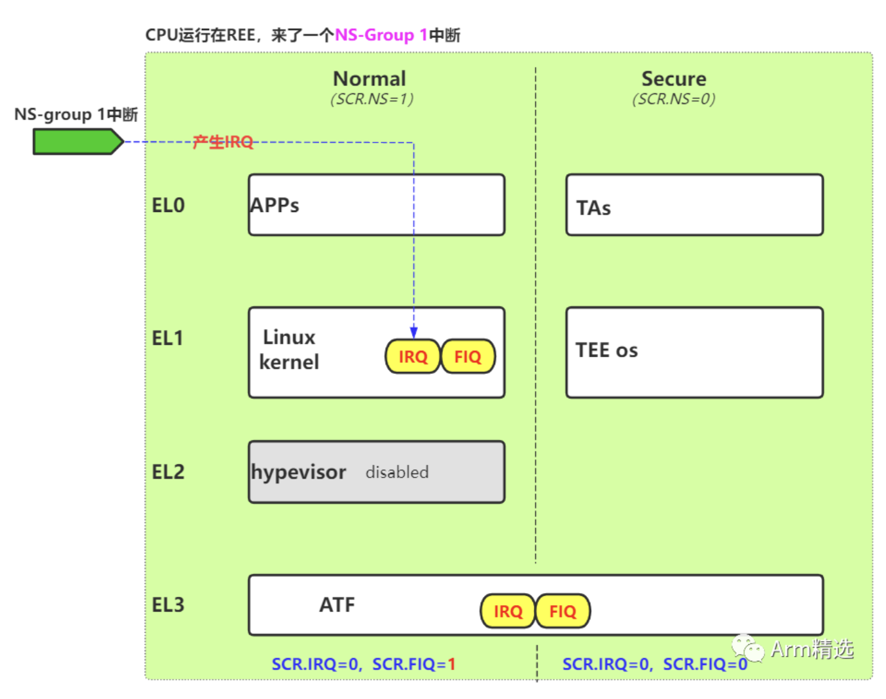

2. CPU 执行在 ATF 时，来了一个 NS-Group 1 中断，想给 REE 处理的中断

   可以理解这是一种想给 REE 处理的中断，因此最终目标是将 CPU 重新路由回 REE，使其能够正确处理此中断。当 CPU 处于 ATF 执行状态时，PSTATE.I 和 PSTATE.F 都被屏蔽（MASK），因此，此时 CPU 不会响应任何中断，所有产生的中断都将保持在待处理状态。只有在 CPU 从 EL3 切换回 EL3 以下状态时，且 PSTATE.F/I 解除屏蔽（unmasked）时，待处理的中断才会被 taken。

   考虑到 CPU 从 EL3 切换到 EL3 以下状态有两种路径，因此需要对此进行分组讨论：

   - 当 CPU 从 EL3 返回到 REE 端时，情况等同于 "CPU 处于 REE 执行状态，此时发生一个 NS-Group 1 中断"，这会直接触发将中断传递到 Linux 内核中的 IRQ，使 Linux 内核能够继续处理此中断。
   - 当 CPU 从 EL3 返回到 TEE 端时，情况等同于"CPU 处于 TEE 执行状态，此时发生一个 NS-Group 1 中断"，这时将会重复执行第 3 种情况所述的中断路由步骤。

   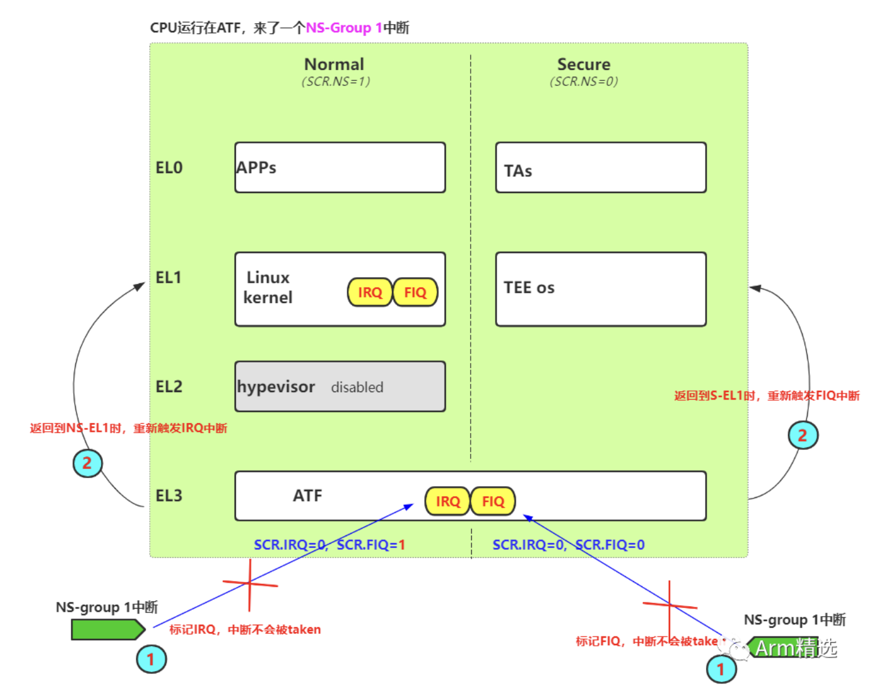

3. CPU 执行在 TEE 时，来了一个 NS-Group 1 中断，想给 REE 处理的中断

   可以理解这是一种想给 REE 处理的中断。因此最终目标是将 CPU 拉回到 REE，让 REE 处理这个中断。当前 CPU 运行在安全状态，中断类型为 NS-Group 1，因此中断被标记为 FIQ。然而，考虑到此刻的 SCR_EL3.IRQ=0，所以这个 FIQ 将会被路由至 EL1。CPU 进入 TEE OS 的异常向量的 FIQ 向量，在 `fiq_handler` 的实现中，未读取中断 IAR 就调用了 smc。这采用了一种主动的软件调用方式，将 CPU 切回了 ATF。ATF 察觉到这是一个中断转换过来的情况，因此继续将 CPU 切换回 REE。在此过程中，该中断一直保持为挂起状态。当 CPU 被重新引导回 REE 后，由于此时 CPU 运行在非安全状态，中断类型仍为 NS-Group 1，所以该中断被重新标记为 IRQ。随之而来的是重新触发中断，该中断被 target 至 EL1，与下图中的步骤 4 对应。在中断处理完成后，依次将 CPU 拉回 TEE，使其回到被打断的位置。

   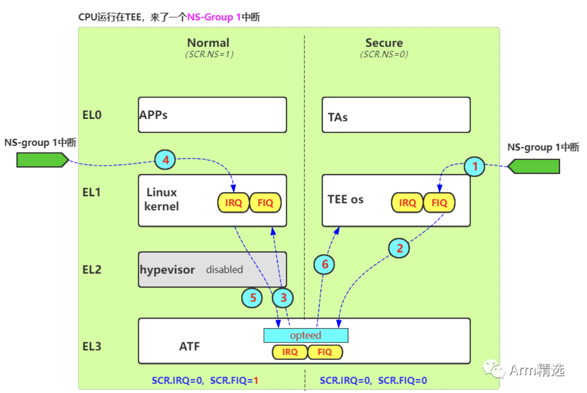

4. CPU 执行在 TEE 时，来了一个 S-Group 1 中断，想给 TEE 处理的中断

   由于当前 CPU 运行在 Secure Security State、中断类型为 S-Group 1 中断，所以该中断被标记为 IRQ，由于此时 SCR_EL3.IRQ=0，所以该中断被标记为 IRQ，并被 target 到 EL1。让 CPU 进入 TEE OS 的异常向量表的 IRQ 向量去处理。

   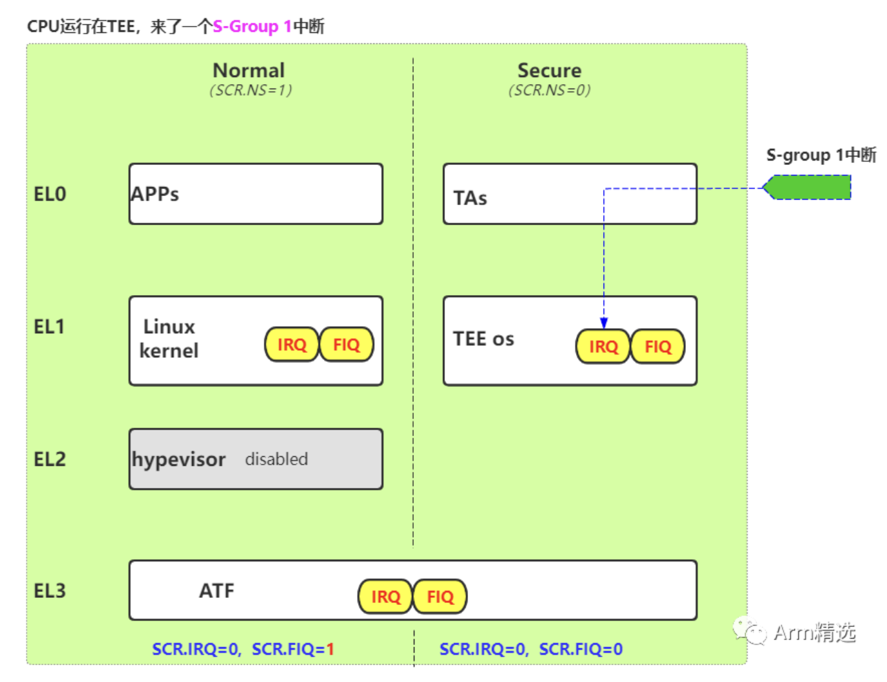

5. CPU 执行在 ATF 时，来了一个 S-Group 1 中断，想给 TEE 处理的中断

   这是想给 TEE 处理的中断，所以最终的结果，一定是要把 CPU 拉回到 TEE，让 TEE 去处理这个中断。当 CPU 执行在 ATF 的时候，此时 PSTATE.I 和 PSTATE.F 都是 MASK 的，所以此时不会 taken 任何中断，一切产生的中断将处于 pending 状态。当 CPU 从 EL3 切回 EL3 以下的时候，PSTATE.F/I unmasked 的时候，此时 pending 的中断才会被 taken。由于 CPU 从 EL3 切换 EL3 以下有两条路径，所以需要分组讨论一下：

   - 当 CPU 从 EL3 往 REE 侧返回后，此时条件等同于"CPU 执行在 REE 时，来了一个 S-Group 1 中断"，此时会将第 6 种情况的中断路由步骤全部再走一遍。
   - 当 CPU 从 EL3 往 TEE 侧返回后，此时条件等同于"CPU 执行在 TEE 时，来了一个 S-Group 1 中断"，也就是将直接产生 target 到 TEE OS 中的 IRQ，让 TEE 继续处理这个中断。

   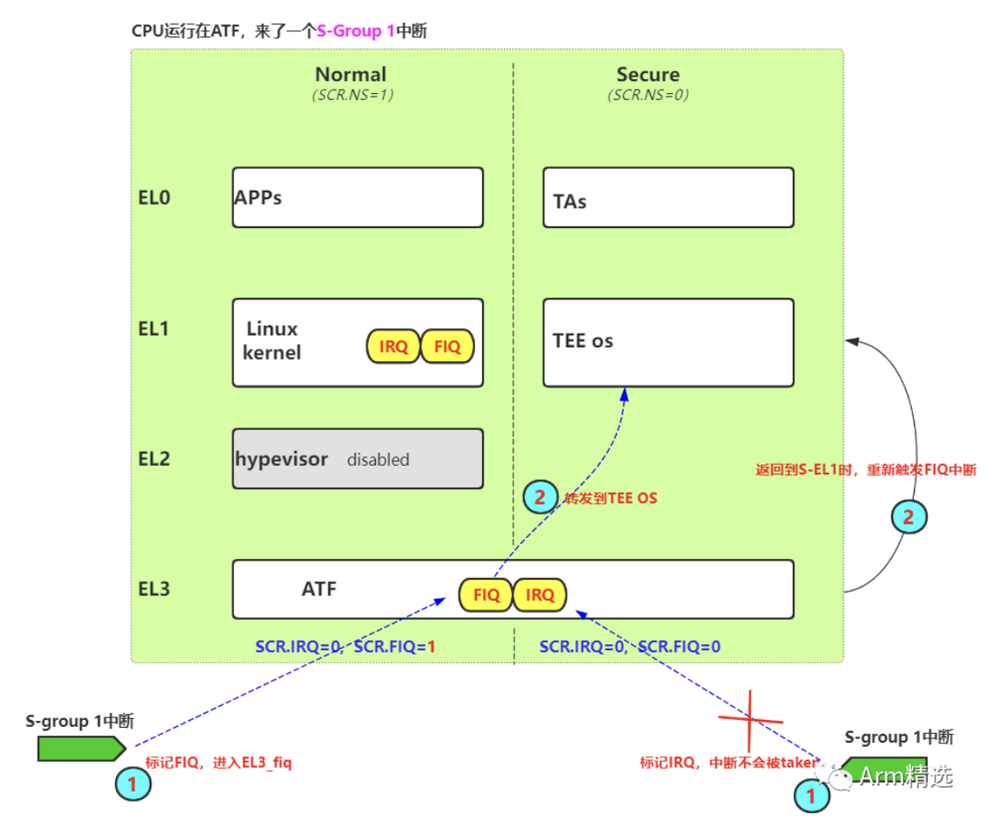

6. CPU 执行在 REE 时，来了一个 S-Group 1 中断，想给 TEE 处理的中断

   这是想给 TEE 处理的中断，所以最终的结果，一定是要把 CPU 拉回到 TEE，让 TEE 去处理这个中断。由于当前 CPU 运行在 Non Secure Security State、中断类型为 S-Group 1 中断，所以该中断被标记为 FIQ，由于此时 SCR_EL3.IRQ=1，所以该 FIQ 将被 target到 EL3。CPU 进入 ATF 的异常向量的 FIQ 向量，在 ATF 的 `fiq_handler` 实现中，它会继续进行中断转发，转发到 TEE OS 中特定的入口（这里与 TEE OS 厂商的设计相关，不同厂商有不同的实现），进入 TEE OS 后，真正处理这个中断，处理完毕后，再依次返回。

   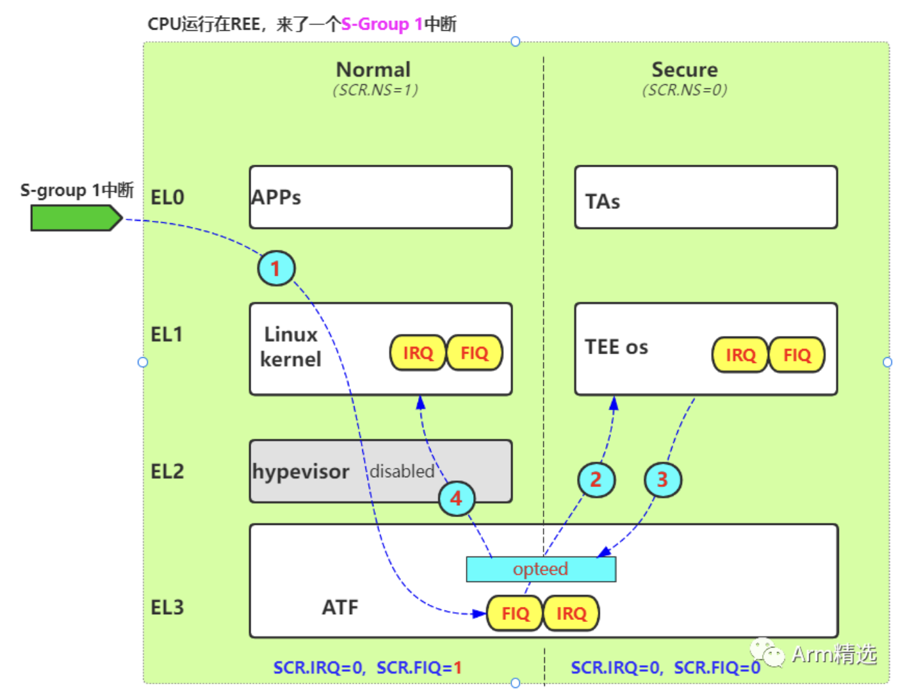

7. CPU 执行在 ATF 时，来了一个 Group 0 中断，想给 ATF 处理的中断

   CPU 执行在 ATF 的时候，此时 PSTATE.I 和 PSTATE.F 都是 MASK 的，所以此时不会 taken 任何中断，一切产生的中断将处于 pending 状态。当 CPU 从 EL3 切回 EL3 以下的时候，PSTATE.F/I unmasked 的时候，此时 pending 的中断才会被 taken。由于 CPU 从 EL3 切换 EL3 以下有两条路径，所以需要分组讨论一下：

   - 当 CPU 从 EL3 往 REE 侧返回后，此时条件等同于"CPU 执行在 REE 时，来了一个 Group 0 中断"，此时会将第 9 种情况的中断路由步骤全部再走一遍。
   - 当 CPU 从 EL3 往 TEE 侧返回后，此时条件等同于"CPU 执行在 TEE 时，来了一个 Group 0 中断"，此时会将第 8 种情况的中断路由步骤全部再走一遍。

   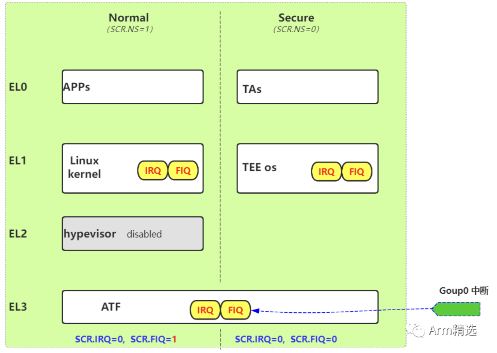

8. CPU 执行在 TEE 时，来了一个 Group 0 中断，想给 ATF 处理的中断

   此时根据中断类型为 Group 0，该中断将被标记为 FIQ，根据 SCR_EL3.FIQ=0，该 FIQ 将直接被 target 到 EL1，在 TEE 中的 `fiq_handler` 中，将采取软件主动方式将 CPU 切回 ATF，进入 ATF 后，该中断仍不会被 taken，因为此时 PSTATE.I/R 都是 masked 的。直至 CPU 再返回 REE 端的时候，将重新产生 target 到 EL3 的 FIQ，那时中断才会被处理。

   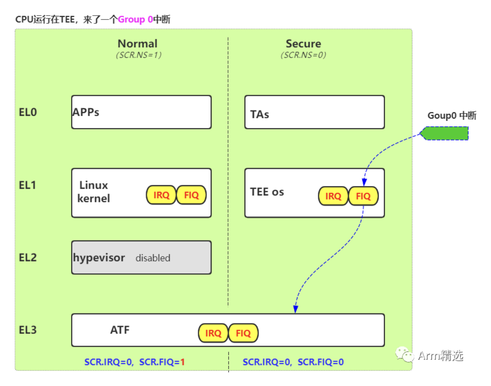

9. CPU 执行在 REE 时，来了一个 Group 0 中断，想给 ATF 处理的中断

   由于是 Group0 中断，中断将被标记为 FIQ，又由于 SCR_EL3.FIQ=1，FIQ 将被直接 target 到 EL3，进入 ATF 的异常向量表的 FIQ 向量进行处理。

   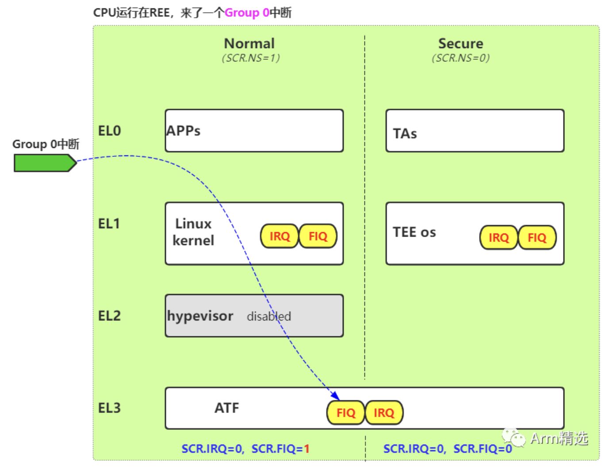

中断管理框架是在实现的中断控制器下使用。中断控制器可以根据当前的安全状态生成一种中断类型，向 CPU 发送 FIQ 或 IRQ 信号。中断类型和信号之间的映射关系由平台实现确定，这些信息用于是否配置 SCR_EL3 中的 IRQ 或 FIQ 位。平台通过 `plat_interrupt_type_to_line()` API 提供此信息。例如，在 FVP 平台上，当使用 ARM GICv2 中断控制器时，Secure-EL1 中断发出 FIQ 信号，而 Non-secure 中断发出 IRQ 信号，这些运用在任意安全状态。

应当注意，如果将多种中断类型映射到一个中断信号，并且其中任一中断设置 TEL3＝1，则该中断信号将路由到 EL3。这意味着使用相同中断信号的其他类型中断将强制使用相同的路由模型，在选择路由模型时应牢记这一点。例如，在 Arm GICv3 中，当执行上下文为 Secure-EL1/Secure-EL0 时，EL3 和非安全中断类型都会映射成 FIQ 信号。因此，如果其中任一中断采用此路由模型，即配置 CSS=0 和 TEL3=1 ，则在 Secure-EL1/Secure-EL0 中执行时，FIQ 位将被配置，使 FIQ 信号路由到 EL3，这会导致其他中断也会路由到 EL3。

中断管理框架做出以下假设以简化其实现：

- 尽管该框架支持两种类型的安全中断（EL3 和 Secure-EL1 中断），但只有像 Arm GICv3 这样的中断控制器架构才支持 EL3 中断（Group 0 中断）。在 Arm GICv2 中，假定所有安全中断都在 Secure-EL1 中处理，它们可以通过 EL3 传给 Secure-EL1，但不能在 EL3 中处理。
- 中断异常（PSTATE.I 和 F 位）在 EL3 执行期间被屏蔽。
- 中断管理：下面描述了中断处理框架如何管理中断，这需要：
  - 提供接口用于注册中断处理程序并指定路由模型
  - 当产生中断时，支持将中断的控制权交给其注册的处理程序

中断管理涉及从 EL3 到 Secure-EL1 安全软件栈中的各个组件，该框架使用以下结构存储中断的相关信息：

```c
typedef struct intr_type_desc {
        interrupt_type_handler_t handler;
        uint32_t flags;
        uint32_t scr_el3[2];
} intr_type_desc_t;
```

- `flags` 字段的低两位存储中断的路由模型。Bit[0] 存储处于安全状态时的路由模型，Bit[1] 存储处于非安全状态时的路由模型。0 意味着中断路由到 FEL ，1 意味着中断路由到 EL3，其余位保留为 SBZ。`set_interrupt_rm_flag()` 宏用于配置 `flags` 字段。
- `scr_el3[2]` 字段也存储路由模型，但作为 `flags` 字段（两种安全状态）到 SCR_EL3 位（FIQ 或者 IRQ 位）的映射，即如从 NS 和 Secure 路由到 EL3，NS 路由到 EL1/EL2，Secure 路由到 S-EL1等等。

- 该框架还依赖于平台来配置中断控制器，用以区分安全和非安全中断。平台必须知道系统中的安全设备及其关联的中断号。平台应该配置中断控制器以启用安全中断，确保安全中断优先级始终高于非安全中断，并将其路由到主 CPU。平台还应该导出移植指南中关于中断处理的接口。


中断管理组件在 EL3 和 Secure-EL1 中功能不同：

- EL3 Runtime Firmware。该组件对于所有平台移植 TF-A 是通用的。
- Secure Payload Dispatcher (SPD) 服务。该服务与在 Secure-EL1/Secure-EL0 中运行的 Secure Payload (SP) 软件进行通信，负责安全与非安全状态的切换。切换通过 Secure Monitor Call 触发，其通过上下文管理库导出的 API 来实现。在两种安全状态之间切换执行也是中断管理的要求，这导致严重依赖 SPD 服务。TF-A 实现了一个示例 Test Secure Payload Dispatcher (TSPD) 服务。一个 SPD 服务是集成到 EL3 runtime firmware 中，并且可以与某些平台移植 TF-A 是通用的。
- Secure Payload (SP)。Secure Payload 对应于在 Secure-EL1/Secure-EL0 中运行的 Secure OS。它与 SPD 服务交互，管理与非安全软件间的通信。TF-A 实现了一个 Test Secure Payload 示例，其仅在 Secure-EL1 中运行。Secure Payload 对于某些平台移植 TF-A 是通用的，就像 SPD 服务一样。

##### 中断注册

###### EL3 runtime firmware

```c
typedef uint64_t (*interrupt_type_handler_t)(uint32_t id,
                                             uint32_t flags,
                                             void *handle,
                                             void *cookie);
```

- 其中 `id` 参数是保留的，未来用于传递最高挂起中断 `id`，目前值为 `INTR_ID_UNAVAILABLE`。

- `flags` 参数含义如下：
  - Security，bits[0]：该位表示中断生成时较低异常等级的安全状态。1 表示处于非安全状态，0 表示它处于安全状态。中断处理程序使用此位进行中断路由。
  - Reserved，bits[31:1]：其余位保留。
- `handle` 参数指向当前安全状态的 `cpu_context` 上下文。
- 一旦中断处理程序执行完成，将返回到安全或非安全状态。中断处理程序必须返回指向目标安全状态的 `cpu_context` 指针。在 AArch64 上，调用者目前会忽略此返回值，因为处理程序应当通过上下文管理库 API 设置相应的值，移植中断处理程序必须设置目标上下文结构。中断处理程序应将所有错误条件视为严重错误，并采取适当的操作，例如使用断言失败。


Runtime firmware 提供以下 API，用于注册中断的处理程序。Secure Payload Dispatcher 服务应使用此 API 来注册 Secure-EL1 的处理程序，并可选择用于非安全中断，该 API 还要求调用者指定中断的路由模型。

```c
int32_t register_interrupt_type_handler(uint32_t type,
                                        interrupt_type_handler handler,
                                        uint64_t flags);
```

- `type` 参数可以是上面列出的三种中断类型，即 `INTR_TYPE_S_EL1`，`INTR_TYPE_NS` 和 `INTR_TYPE_EL3`。
- 注册成功后该函数将返回 0，如果中断处理程序已经注册，它将返回 `-EALREADY`。如果 `type` 无法识别或 `flags` 或 `handler` 无效，则会返回 `-EINVAL`。


在任一安全状态下，SCR_EL3.FIQ/IRQ 位控制中断路由，即路由到当前异常等级还是 EL3。上下文管理库为每个 CPU 的安全状态维护了一个 SCR_EL3 系统寄存器副本。 EL3 运行时固件可以使用下面 API，检索当前 CPU 每个安全状态的路由模型。在从 EL3 执行异常返回时，`el3_exit()` 函数利用 `cpu_context` 保存的 SCR_EL3 值来配置 SCR_EL3 寄存器 。

```c
uint32_t cm_get_scr_el3(uint32_t security_state);
void cm_write_scr_el3_bit(uint32_t security_state,
                          uint32_t bit_pos,
                          uint32_t value);
```

`cm_get_scr_el3()` 返回当前 CPU 安全状态的 SCR_EL3 寄存器值。`cm_write_scr_el3_bit()` 将 0 or 1 写入位 `bit_pos`，即 SCR_EL3 寄存器中的相应位。函数 `register_interrupt_type_handler()` 调用 `set_routing_model()` API，配置 SCR_EL3 寄存器，完成路由模型的设置。值得注意的是，在当前框架的实现中，EL3 Runtime Firmware 负责配置路由模型，SPD 负责确保在收到中断时遵守此路由模型。

###### Secure payload dispatcher

SPD 服务负责确定和维护其自身和 Secure Payload 支持的中断路由模型，它还根据路由模型在安全和非安全软件之间传送中断，可以在构建时或运行时确定路由模型。它必须使用这些信息来注册中断处理程序，使用 `register_interrupt_type_handler()` API。如果 SPD 服务在构建时不知道路由模型，则 SP 初始化完成后必须提供。SPD 应该在 SP 初始化完成之后对路由模型进行配置，例如在初始化函数 `bl32_init` 中。SPD 应在收到来自 EL3 runtime firmware 的中断后将控制权传递给 Secure Payload，该信息可以在编译时提供给 SPD 服务，也可以由 SP 在运行时提供。
