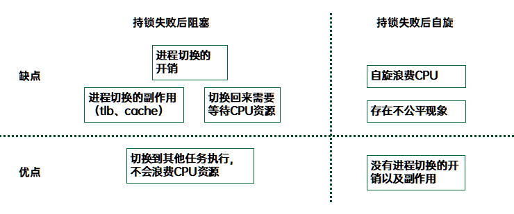
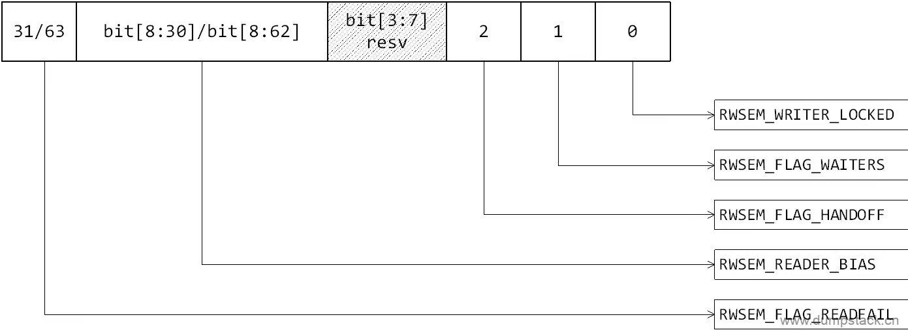
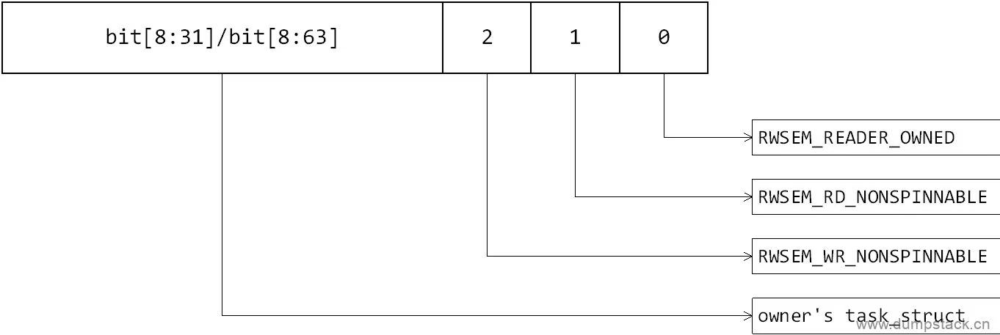
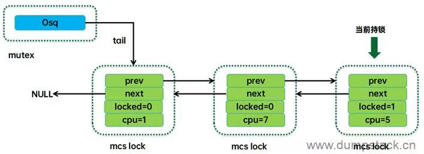

# Concurrency

## Read/Write Semaphore

rwsem特性：
1. 允许多个 reader 同时进入临界区；
2. 只允许一个 writer 同时进入临界区；
3. 当临界区是 reader 时，其他 reader 可以进入临界区，但是 writer 必须等待；
4. 当临界区是 writer 时，其他任何线程，不管是 reader 还是 writer，都必须等待；

基于 linux 5.10.61 & 5.15.81 简析 rwsem

### Data Structure


一个rwsem对象需要记录两种数据：
1. 读写锁的状态信息
2. 该读写锁相关的任务信息

读写锁状态分为读锁和写锁的状态：由于多个 reader 可以同时处于临界区，所以对于 reader-owned 的场景，读锁状态变成了一个 counter，来记录临界区内 reader 的数量，counter 等于 0 表示读锁为空锁状态。对于 writer，其行为和互斥锁一致，因此其写锁状态和 mutex 一样，仍然使用一个 bit 表示。

和读写相关的任务有两类，一类是已经持锁的线程（即在临界区的线程），另外一类是无法持锁而需要等待的任务。对于 writer 持锁情况，由于排他性，可以很清楚的知道是哪个 task 持锁，那么一个 task struct 指针就足够了记录 owner 了。然而对于读侧可以多个 reader 进入临界区，那么 owner 们需要组成一个队列才可以记录每一个临界区的 reader。不过在实际的 rwsem 实现中，由于跟踪 owner 们开销比较大，因此也是用一个 task struct 指针指向其一。具体是这样处理的：reader 进入的时候会设置 owner task，但是离开读临界区并不会清除 task 指针。这样，实际上对于读，owner task 应该表示该 task 曾经拥有该锁，并不表示是目前持锁的 owner task，也有可能已经离开临界区，甚至该 task 已经销毁。

如果持锁失败，无法进入临界区，有两种选择：
1. 乐观自旋
2. 挂入等待队列

两种选择各有优点和缺点，总结如下：



在 5.15 的内核中，只有在 writer 持锁路径上有乐观自旋的操作，reader 路径没有，只有偷锁的操作。当乐观自旋失败后就会挂入等待队列，阻塞当前线程。（乐观自旋功能有一个很有意思的发展过程，从开始支持 writer 的乐观自旋，到支持全场景的乐观自旋，然后又回到最初）

count 成员不同 bit 含义如下：



owner 成员不同 bit 含义如下：



```c
/*
 * For an uncontended rwsem, count and owner are the only fields a task
 * needs to touch when acquiring the rwsem. So they are put next to each
 * other to increase the chance that they will share the same cacheline.
 *
 * In a contended rwsem, the owner is likely the most frequently accessed
 * field in the structure as the optimistic waiter that holds the osq lock
 * will spin on owner. For an embedded rwsem, other hot fields in the
 * containing structure should be moved further away from the rwsem to
 * reduce the chance that they will share the same cacheline causing
 * cacheline bouncing problem.
 */
/*
 * 1) 对于无竞争的 rwsem，count 和 owner 是一个 task 在获取 rwsem 时需要访问的唯一字段，因此，将它们彼此
 * 相邻放置，可以增加它们共享 cacheline 的机会
 * 2) 在竞争 rwsem 中，owner 可能是此结构中最常访问的字段，因为持有 osq 锁的乐观等待者将在 owner 上自旋。
 * 对于嵌入的 rwsem，上层结构中的其它热字段应远离 rwsem，以减少它们共享相同 cacheline 导致 cacheline 
 * 抖动问题的机会
 */
struct rw_semaphore {
    /* 
     * Bit 0 - 标记当前是 writer 持锁  RWSEM_WRITER_LOCKED
     * Bit 1 - 标记当前 wait_list 链表上有阻塞的线程  RWSEM_FLAG_WAITERS
     * Bit 2 - handoff 表示禁止自旋"偷锁"，下一次将锁交给 wait_list 最前面的 waiter RWSEM_FLAG_HANDOFF
     * Bits 3-7 - reserved
     * Bits 8-62 - 55-bit reader counter（读锁 counter） RWSEM_READER_BIAS
     * Bit 63 - read fail bit，溢出检查 bit  RWSEM_FLAG_READFAIL
     * 为了能够检测 reader 数量溢出问题，在 MSB 设置了保护位，程序本身并不设置它，但是如果太多的 reader
     * 进入临界区，会导致该 bit 变成 1。当然，正常情况下，这个 guard bit 永远不会被设置，一旦被设置，
     * 作为保护措施，这时候 reader 也会被禁止进入临界区。
     */
    atomic_long_t count;
    /*
     * Write owner or one of the read owners as well flags regarding
     * the current state of the rwsem. Can be used as a speculative
     * check to see if the write owner is running on the cpu.
     */
    /*
     * owner 这个成员有两个作用：
     * 1、记录该 rwsem 对象被哪一个 task 持有（仅 writer 有效，对 reader 仅仅是 debug 的时候提供信息而已）。
     * 如果等于 NULL 表示还没有被任何一个 task 持有。
     * 2、由于 task struct 地址是 L1_CACHE_BYTES 对齐的，因此这个成员（实际是 task struct 指针）有若干的
     * LSB 可以被用于标记状态（在 ARM64 平台上，L1_CACHE_BYTES 是 64 字节，因此 LSB 6-bit 可用于保存
     * rwsem 状态信息。具体的状态包括：
     * RWSEM_READER_OWNED：说明当前 rwsem 被一个或者一组 reader 所持有
     * RWSEM_RD_NONSPINNABLE: 是否允许 reader 执行乐观自旋逻辑，还是直接进阻塞状态
     * RWSEM_WR_NONSPINNABLE: 是否允许 writer 执行乐观自旋逻辑，还是直接进阻塞状态
     */
    atomic_long_t owner;
#ifdef CONFIG_RWSEM_SPIN_ON_OWNER
    /*
     * 在配置了 CONFIG_RWSEM_SPIN_ON_OWNER 的时候，rwsem 支持乐观自旋机制，osq 成员就是乐观自旋需要持
     * 有的 MCS 锁。
     */
    struct optimistic_spin_queue osq; /* spinner MCS lock */
#endif
    // 用于保护等待链表操作 wait_list 的自旋锁
    raw_spinlock_t wait_lock;
    // 等待队列。该队列上的任务都是处于阻塞状态，等待临界区清空后唤醒队列上的任务
    struct list_head wait_list;
#ifdef CONFIG_DEBUG_RWSEMS
    /*
     * 和debug相关的成员。如果开启了 CONFIG_DEBUG_RWSEMS 配置项，初始化的时候 magic 会被设置为 rwsem
     * 的地址，用来防止操作未初始化的 rwsem。
     */
    void *magic;
#endif
#ifdef CONFIG_DEBUG_LOCK_ALLOC
    // 和 debug 相关的成员
    struct lockdep_map    dep_map;
#endif
};

struct rwsem_waiter {
    // 挂入 rwsem 等待队列（wait_list 成员）的节点
    struct list_head list;
    // 等待该 rwsem 的任务
    struct task_struct *task;
    // 是 reader 还是 writer
    enum rwsem_waiter_type type;
    // 在队列中等待超时时间，目前设置为 4ms
    unsigned long timeout;
    // 记录在自旋或睡眠前，也就是申请锁的时候锁的 owner
    unsigned long last_rowner;
};

enum rwsem_waiter_type {
    // 当前线程是一个 writer
    RWSEM_WAITING_FOR_WRITE,
    // 当前线程是一个 reader
    RWSEM_WAITING_FOR_READ
};
```

### Optimistic Spin

#### Concept

通常认为持有锁的线程 A 若是在运行的情况下，会很快的退出临界区并释放锁，那么等锁的线程 B 去睡眠是不必要的，毕竟睡眠和唤醒也是有代价的，完全可以多等一会。那么当开启乐观自旋的机制后，若 B 拿不到锁，且发现锁的持有者 A 仍占用着 CPU 运行时，则不再去睡眠，而是像自旋锁一样进行自旋等待（实际是个 for 循环），直到 A 释放锁，但期间若 A 失去 CPU（即 p->on_cpu == 0，可能是进入 runnable 状态或者进入睡眠状态），那么 B 将不会继续自旋等待，而是进入睡眠

#### 偷锁

当锁支持乐观自旋机制时，会存在这样的情况：wait_list 中有一些线程在睡眠并等待被唤醒拿锁，同时还有一些线程不在 wait_list 中且不断的通过乐观自旋等锁，那么 wait_list 上的线程大概率是抢不过自旋拿锁的进程的。这是因为调度延时的存在，当 wait_list 上的线程被唤醒到真正获得 CPU 运行，这期间可能已经过去很长时间，锁早就被自旋等锁的线程给"偷走"了。

既然"偷锁"有可能导致 wait_list 上的进程饥饿，那么为什么还要允许"偷锁"的发生呢？其实允许"偷锁"的行为可以算是对锁的一种性能优化，若是不允许"偷锁"那么下次拿锁的就一定是唤醒的 wait_list 上的等锁进程，但是从进程被唤醒到该进程真正获得 CPU 运行，这中间会存在一个时间差，即调度延时。且在这段时间内若还有其他进程一直在 trylock 尝试偷锁那么将不会偷成功，这些进程都会因此 block 住。由于调度延时某些场景下会比较久（例如整机高负载时，runqueue 上的进程很多），所以还不如先将锁交给正在 trylock 的进程，也就是允许发生一次"偷锁"。

#### handoff

因为乐观自旋"偷锁"逻辑的存在，导致正在乐观自旋的申请者很容易就能获得锁，而 wait_list 链表最前面的线程迟迟得不到锁，所以"偷锁"在一定程度的造成 wait_list 的等待者长时间"饥饿"，如果任由"偷锁"下去，那么 wait_list 最前面的线程就会被饿死，严重时直接导致系统 crash，所以"偷锁"要有个度，这个度就是：当 wait_list 最前面的线程阻塞时间超过一定的阈值（4ms），就将锁打上 RWSEM_FLAG_HANDOFF 标记，禁止乐观自旋"偷锁"，这样在下一次锁交换时，就一定能够将锁交给 wait_list 链表最前面的线程

#### Optimistic Spin Queue

osq（Optimistic spin queue），即乐观自旋队列，其工作原理示意图如下：



osq 就是乐观自旋队列，即一组处于自旋状态的任务队列。这个队列中的任务都是当前正在执行的任务。osq 并没有直接将这些任务的 task struct 形成队列结构，而是把 per-CPU 的 mcs lock 对象串联形成队列。mcs lock 中有 CPU number，通过这些 CPU number 可以定位到指定 CPU 上的 current thread，也就定位到了自旋的任务。

虽然都是自旋，但是自旋方式并不一样。osq 队列中的头部节点是持有 osq 锁的，只有该任务处于对 rwsem owner 进行乐观自旋的状态（称之为 rwsem 乐观自旋）。osq 队列中的其他节点都是自旋在自己的 mcs lock 上（称之为 mcs 乐观自旋）。当头部的 mcs lock 释放掉后（结束 rwsem 乐观自旋，持有了 rwsem 锁），它会将 mcs lock 传递给下一个节点，从而让 spinner 队列上的任务一个个的按顺序进入 rwsem 的乐观自旋，从而避免了 cache-line bouncing 带来的性能开销。

#### osq in rwsem

是否允许自旋是可以通过 CONFIG_RWSEM_SPIN_ON_OWNER 宏控制的，当开启该宏时，下面场景不允许自旋：
1. 如果申请锁的人在下一个调度时机就会被调度出去，那么就没必要自旋了
2. 如果锁已经被打上 nonspinable 标签（禁止自旋"偷锁"），也没必要自旋，直接挂入链表进阻塞状态
3. 如果是 writer 在临界区，但是这个 writer 拿锁不干活，即当前不是正在运行的状态，可能是 runnable 或者已经进入阻塞状态，但是不管是哪种，都表示这个 writer 短时间内是完不成了，此时也不用自旋

情景分析：如果当前 reader 或者 writer 在申请锁，并且锁未被打上 nonspinable 标签，则有：
1. 如果临界区为空，则自旋
2. 如果 reader 在临界区，则自旋，因为 reader 一般都是很快就会退出临界区
3. 如果 writer 在临界区，并且正在 running，则自旋
4. 如果 writer 在临界区，但是当前 writer 是处于 runnable 状态，则不可以自旋

传入的 nonspinable 参数取决于锁的申请者是 reader 还是 writer：
1. 如果是 reader，则从 rwsem_down_read_slowpath 中传入 RWSEM_RD_NONSPINNABLE
2. 如果是 writer，则从 rwsem_down_write_slowpath 中传入 RWSEM_WR_NONSPINNABLE

注意：这里判断是否可以自旋时，并不知道调用者是 reader 还是 writer，也就是说所有读或者写都是有可能自旋的

```c
static inline bool rwsem_can_spin_on_owner(struct rw_semaphore *sem,
                       unsigned long nonspinnable)
{
    struct task_struct *owner;
    unsigned long flags;
    bool ret = true;

    // 如果正在申请锁的线程 current 在下一个调度时机即将调度出去，那么也没有必要自旋了
    if (need_resched()) {
        lockevent_inc(rwsem_opt_fail);
        return false;
    }

    preempt_disable();
    rcu_read_lock();
    /*
     * 是否需要自旋等待取决于当前正在持锁的这个线程。剥离 owner 的 flags 和 task_struct 字段，分别保存在
     * flags 和 owner 变量中
     */
    owner = rwsem_owner_flags(sem, &flags);
    /*
     * Don't check the read-owner as the entry may be stale.
     */
    /*
     * 下面场景不允许自旋:
     * 1) 锁已经被打上 nonspinnable 标签（已经禁止自旋"偷锁"）
     * 2) 锁已经被 writer 持有，但是 writer 当前不是处于 running 状态
     * 注意：当锁没有被打上 nonspinnable 标签时，并且满足下面两种情况允许自旋:
     * 1) 如果 reader 在临界区，后来的不管是 reader 还是 writer，都可以自旋一会。主要考虑 reader 很快就能
     * 结束，自旋一会可能很快就能拿到锁
     * 2) 如果 writer 在临界区，并且这个 writer 当前正在 running 那么也会自旋
     */
    if ((flags & nonspinnable) ||
        (owner && !(flags & RWSEM_READER_OWNED) && !owner_on_cpu(owner)))
        ret = false;
    rcu_read_unlock();
    preempt_enable();

    lockevent_cond_inc(rwsem_opt_fail, !ret);
    return ret;
}

static bool rwsem_optimistic_spin(struct rw_semaphore *sem, bool wlock)
{
    bool taken = false;
    int prev_owner_state = OWNER_NULL;
    int loop = 0;
    u64 rspin_threshold = 0;
    // wlock 标记申请锁的线程是想以读的身份还是写的身份进入临界区，读者传 false，写者传 true
    unsigned long nonspinnable = wlock ? RWSEM_WR_NONSPINNABLE
                       : RWSEM_RD_NONSPINNABLE;

    preempt_disable();

    /* sem->wait_lock should not be held when doing optimistic spinning */
    // 标记乐观自旋开始
    if (!osq_lock(&sem->osq))
        goto done;

    /*
     * Optimistically spin on the owner field and attempt to acquire the
     * lock whenever the owner changes. Spinning will be stopped when:
     *  1) the owning writer isn't running; or
     *  2) readers own the lock and spinning time has exceeded limit.
     */
    /*
     * 乐观自旋外循环，当出现下面情况时，退出自旋
     * 1) writer 持锁，但是 writer 并没有在运行，而是已经进入阻塞状态
     * 2) reader 持锁，但是申请锁的线程是 writer，并且这个 writer 已经自旋超时
     * 注意：只要没有超时，当 reader 在临界区时，后来申请锁的线程就可以一直等下去
     */
    for (;;) {
        enum owner_state owner_state;
        /* 
         * 内循环，直到 owner 或者 flags 发生变化才会退出小循环，实际上，当 rwsem_spin_on_owner 围着
         *  owner 转时，这个 owner 一定是 writer，其他情况该函数直接返回。函数返回值可为：
         * 1) OWNER_NULL: 临界区为空
         * 2) OWNER_WRITER: writer 在临界区
         * 3) OWNER_READER: reader 在临界区
         * 4) OWNER_NONSPINNABLE: 锁已经被打上 nonspin 标记
         * OWNER_SPINNABLE 定义为(OWNER_NULL | OWNER_WRITER | OWNER_READER)。即当临界区为空、writer 在
         * 临界区、reader 在临界区时，都是有可能自旋的。下面的逻辑表示，一旦发现锁已经被打上 nonspin 标记
         * （禁止自旋），就直接退出大循环，并返回 false，自旋拿锁失败，后面将会进入睡眠状态
         */
        owner_state = rwsem_spin_on_owner(sem, nonspinnable);
        if (!(owner_state & OWNER_SPINNABLE))
            break;

        /*
         * Try to acquire the lock
         */
        /*
         * 执行"偷锁"逻辑，从上面小循环中返回，代码走到这里有下面三种情况
         * 1) OWNER_NULL: 临界区为空，那么可以在这里尝试获取锁
         * 2) OWNER_READER: reader 在临界区，此时如果申请锁的也是 reader 的话，那么可以直接进入临界区
         * 3) OWNER_WRITER: writer 在临界区，经过 rwsem_spin_on_owner 返回后，表示有可能 owner
         * 或者 owner 的 flags 发生了变化
         * 注意：
         * 1）如果 wait_list 链表上有线程阻塞着，则这些阻塞的线程肯定是比这里正在自旋的
         * 申请者要先申请锁，但是在这里，后来的申请者却通过自旋的方式却先拿到了锁，这就是"偷锁"
         * 2）当一个 reader 在申请锁的时候，不管临界区时 reader 还是 writer，即使这把锁被打上了
         * RWSEM_FLAG_HANDOFF 标记，如果 reader 在这里"偷锁"失败，reader 也会继续自旋下去，直到在
         * rwsem_spin_on_owner 中发现这把锁已经被打上 nonspinable 标记时（临界区 reader 已经撑爆，
         * 或者有一个 writer 已经自旋超时了），才会结束自旋
         */
        taken = wlock ? rwsem_try_write_lock_unqueued(sem)
                  : rwsem_try_read_lock_unqueued(sem);

        if (taken)
            break;

        /*
         * Time-based reader-owned rwsem optimistic spinning
         */
        /*
         * 当前是 writer 在自旋申请锁，但是当前是 reader 在临界区，因为认为 reader 一般很快会退出临界区，
         * 所以此时 writer 会再等一会，但是需要注意的是，由 rwsem_try_read_lock_unqueued 的分析可知，
         * 在 writer 等待期间，当 reader 在临界区并且锁没有被打上 RWSEM_FLAG_HANDOFF 标记时，那么后来的
         * reader 会通过自旋"偷锁"的方式源源不断的进入临界区，也就是说在 writer 自旋期间，可能会不断的有
         * reader 插队，为了确保 writer 不被饿死，解决办法就是禁止 reader 自旋。
         * 注意：
         * 这里将锁的 RWSEM_RD_NONSPINNABLE 和 RWSEM_WR_NONSPINNABLE 位全部置位，因为此时 writer 已经
         * 长时间自旋都没有拿到锁了，全部置位主要有两个原因：
         * 1) 设置 RWSEM_WR_NONSPINNABLE，告诉后来的 writer 不要做无意义的尝试，直接进 sleep 状态
         * 2) 设置 RWSEM_RD_NONSPINNABLE，后来的 reader 也不不会再执行自旋的逻辑，也就不会再出现 reader
         * 源源不断进入临界区的情况，从源头上防止 reader 的临界区越来越大
         */
        if (wlock && (owner_state == OWNER_READER)) {
            /*
             * Re-initialize rspin_threshold every time when
             * the owner state changes from non-reader to reader.
             * This allows a writer to steal the lock in between
             * 2 reader phases and have the threshold reset at
             * the beginning of the 2nd reader phase.
             */
            /*
             * 在 reader 刚进临界区的时候计算 writer 自旋的阈值（这个 writer 在上一次循环时，临界区还不是
             * reader（可能为空，也可能是 writer 在临界区），但是这次循环却发现当前临界区已经是 reader 了，
             * 说明这些 reader 是刚被放进来的）
             */
            if (prev_owner_state != OWNER_READER) {
                /*
                 * 在重新设置阈值之前，再次检查锁是否被打上了 nospinnable 标记，如果已经被打上了
                 * nonspinnable 标记，则表示已经禁止 writer 自旋，此时直接结束自旋，（注意：此时
                 * nonspinnable 为 RWSEM_WR_NONSPINNABLE）
                 * reader 在临界区时，被打上 nonspin 标记有两种可能
                 * 1) 临界区已经有很多 reader 了，已经溢出了
                 * 2) 有一个 writer 已经自旋等了很长时间，再等就饿死了
                 */
                if (rwsem_test_oflags(sem, nonspinnable))
                    break;
                // 重新计算自旋的时间
                rspin_threshold = rwsem_rspin_threshold(sem);
                loop = 0;
            }

            /*
             * Check time threshold once every 16 iterations to
             * avoid calling sched_clock() too frequently so
             * as to reduce the average latency between the times
             * when the lock becomes free and when the spinner
             * is ready to do a trylock.
             */
            /*
             * 代码走到这个分支，则表示这个 writer 在上一次循环时发现临界区是 reader，这次循环发现临界区
             * 还是 reader，因为当 reader 在临界区时，后续申请锁的 reader 是可以直接进入临界区的（只要临界
             * 区的 reader 没有被撑爆，并且锁没有被置上 RWSEM_FLAG_HANDOFF 标记），也就是说，当这个 writer
             * 自旋时，可能会源源不断的有新的 reader 进入临界区，如此下去的话，writer 会一直拿不到锁，
             * 这显然不合理，所以在这里设置了一个阈值，当 writer 自旋一段时间后没有拿到锁，就设置 nonspin
             * 标志并结束自旋，后续的申请者也不会自旋而是直接在 wait_list 上排队并进入休眠态。每循环 16 次
             * 检查一次自旋时间是否已经超过阈值，这主要是为了防止频繁的调用 sched_clock
             */
            else if (!(++loop & 0xf) && (sched_clock() > rspin_threshold)) {
                rwsem_set_nonspinnable(sem);
                lockevent_inc(rwsem_opt_nospin);
                break;
            }
        }

        /*
         * An RT task cannot do optimistic spinning if it cannot
         * be sure the lock holder is running or live-lock may
         * happen if the current task and the lock holder happen
         * to run in the same CPU. However, aborting optimistic
         * spinning while a NULL owner is detected may miss some
         * opportunity where spinning can continue without causing
         * problem.
         *
         * There are 2 possible cases where an RT task may be able
         * to continue spinning.
         *
         * 1) The lock owner is in the process of releasing the
         *    lock, sem->owner is cleared but the lock has not
         *    been released yet.
         * 2) The lock was free and owner cleared, but another
         *    task just comes in and acquire the lock before
         *    we try to get it. The new owner may be a spinnable
         *    writer.
         *
         * To take advantage of two scenarios listed above, the RT
         * task is made to retry one more time to see if it can
         * acquire the lock or continue spinning on the new owning
         * writer. Of course, if the time lag is long enough or the
         * new owner is not a writer or spinnable, the RT task will
         * quit spinning.
         *
         * If the owner is a writer, the need_resched() check is
         * done inside rwsem_spin_on_owner(). If the owner is not
         * a writer, need_resched() check needs to be done here.
         */
        /*
         * 当 rt 线程和持锁的 cfs 线程运行在同一个 CPU 上时，可能会产生 live-lock。因为只要 rt 线程在自旋，
         * 那么 cfs 线程就永远得不到运行，也就永远无法释放锁。
         * rt线程还是没抢到锁，有 2 个可能
         * 1) owner_state 为 OWNER_NULL 的第一种情况：当前持锁者正在释放锁，sem->owner 已经被设置为 NULL
         * （注意：只有 up_writer 中才会调用 rwsem_clear_owner 接口将 owner 设置为 NULL，reader 退出临界
         * 区时并不会设置 owner），rwsem_spin_on_owner 中返回的是 OWNER_NULL，但锁还没有完全被释放（是指在
         * up_writer 释放锁的时候，锁的 RWSEM_FLAG_HANDOFF 标记并没有清除，所以下一个会将锁交给 wait_list
         * 最前面的那个线程，"偷锁"的逻辑不生效）
         * 2) owner_state 为 OWNER_NULL 的另一种情况：虽然锁已经被完全释放了，sem->owner 已经被设置为 NULL，
         * 并且 RWSEM_FLAG_HANDOFF 标记也已经被清除了，但是因为当前在其他 CPU 上还可能存在其他线程也在自旋
         * 抢这把锁，因为"偷锁"逻辑本质上也是原子操作，所以在"偷锁"逻辑中，很可能这个 rt 线程没有抢过其他
         * CPU 上的线程（即使其他 CPU 上的线程是 cfs 线程）
         */
        if (owner_state != OWNER_WRITER) {
            if (need_resched())
                break;
            // rt 自旋两次，owner_state 都没有发生变化，则停止自旋
            if (rt_task(current) &&
               (prev_owner_state != OWNER_WRITER))
                break;
        }
        prev_owner_state = owner_state;

        /*
         * The cpu_relax() call is a compiler barrier which forces
         * everything in this loop to be re-loaded. We don't need
         * memory barriers as we'll eventually observe the right
         * values at the cost of a few extra spins.
         */
        cpu_relax();
    }
    osq_unlock(&sem->osq);
done:
    preempt_enable();
    lockevent_cond_inc(rwsem_opt_fail, !taken);
    return taken;
}

/*
 * Try to acquire read lock before the reader is put on wait queue.
 * Lock acquisition isn't allowed if the rwsem is locked or a writer handoff
 * is ongoing.
 */
// reader 尝试"偷锁"
static inline bool rwsem_try_read_lock_unqueued(struct rw_semaphore *sem)
{
    long count = atomic_long_read(&sem->count);

    /*
     * 两种场景 reader 是"偷"不到锁的
     * 1) 有一个writer在临界区
     * 2) 锁已经被打上 RWSEM_FLAG_HANDOFF 标记，禁止"偷锁"
     */
    if (count & (RWSEM_WRITER_MASK | RWSEM_FLAG_HANDOFF))
        return false;

    /*
     * 临界区可能为空或是 reader，并且当前是允许"偷锁"的。rwsem 允许多个 reader 同时进入临界区，count 字段
     * 记录的当前有多少个 reader 在临界区，下面对 count 执行加 1 标记拿锁。但是在这个原子操作的过程中，这把
     * 锁还是有可能被其他 CPU 上的其他线程拿走的，所以这里要判断下面原子操作的返回值是加之前的值，所以这里需
     * 要注意，即使原子加完之后，这个 reader 也是有可能拿不到锁的，此时函数返回 false
     */
    count = atomic_long_fetch_add_acquire(RWSEM_READER_BIAS, &sem->count);
    if (!(count & (RWSEM_WRITER_MASK | RWSEM_FLAG_HANDOFF))) {
        rwsem_set_reader_owned(sem);
        lockevent_inc(rwsem_opt_rlock);
        return true;
    }

    /* Back out the change */
    /*
     * 拿锁失败，说明在执行原子操作期间，存在下面两种情况导致拿锁失败，此时需要将 count 重新减回去
     * 1) 原子操作期间，锁被另一个 CPU 上的一个 writer 给抢了
     * 2) 原子操作期间，锁突然被打上 RWSEM_FLAG_HANDOFF 标记，禁止偷锁
     */
    atomic_long_add(-RWSEM_READER_BIAS, &sem->count);
    return false;
}

/*
 * Try to acquire write lock before the writer has been put on wait queue.
 */
// writer 尝试"偷锁"
static inline bool rwsem_try_write_lock_unqueued(struct rw_semaphore *sem)
{
    long count = atomic_long_read(&sem->count);

    /*
     * 下面任一条件，writer 在这里都会"偷锁"失败
     * 1) 临界区有人（RWSEM_LOCK_MASK 标记被置位），因为对于 writer 来说，只要临界区非空，writer 都不能进入临界区
     * 2) 锁已经被打上 RWSEM_FLAG_HANDOFF 标记，禁止"偷锁"
     */
    while (!(count & (RWSEM_LOCK_MASK|RWSEM_FLAG_HANDOFF))) {
        /*
         * 进入该循环表示当前临界区为空，并且是允许"偷锁"的。writer 拿锁就是通过原子操作将 count 的 RWSEM_WRITER_LOCKED
         * 标记置位。当然，原子操作拿锁的过程，也有可能其他 CPU 上的线程拿走。原子操作返回 true 表示 xchg 操作成功，
         * writer 已经拿到锁了；原子操作返回 false，则表示锁被其他 CPU 上的其他线程拿走了，此时继续 while 循环判断，
         * 如果真的是锁被其他线程拿走了，就返回 false 拿锁失败
         */
        if (atomic_long_try_cmpxchg_acquire(&sem->count, &count,
                    count | RWSEM_WRITER_LOCKED)) {
            rwsem_set_owner(sem);
            lockevent_inc(rwsem_opt_wlock);
            return true;
        }
    }
    return false;
}
```

##### writer 自旋

当 writer 申请锁的时候，如果发现临界区是 reader，writer 就会自旋等待，但是因为当前是 reader 在临界区，可能会有其他的 reader 源源不断的进入临界区（如果临界区的 reader 没有被撑爆，并且锁没有被置为 RWSEM_FLAG_HANDOFF 标记，后来的 reader 可以直接进入临界区的），这将导致 reader 的临界区不断扩大，但是 writer 不能一直自旋下去吧，所以 writer 自旋的时间超过一定的阈值时，就会做下面两件事：

- writer 结束自旋，之后便会进入睡眠状态

- 顺便将锁的 RWSEM_RD_NONSPINNABLE 和 RWSEM_WR_NONSPINNABLE 位全部置位，因为此时 writer 已经长时间自旋都没有拿到锁了，这么做主要有两个原因：

    - 设置 RWSEM_WR_NONSPINNABLE，告诉后来的 writer 不要做无意义的尝试了，不要自旋了，直接进 sleep 状态

    - 设置 RWSEM_RD_NONSPINNABLE，后来的 reader 也不不会再执行自旋的逻辑，也就不会再出现 reader 源源不断进入临界区的情况，从源头上防止 reader 的临界区越来越大

```c
/*
 * Calculate reader-owned rwsem spinning threshold for writer
 *
 * The more readers own the rwsem, the longer it will take for them to
 * wind down and free the rwsem. So the empirical formula used to
 * determine the actual spinning time limit here is:
 *
 *   Spinning threshold = (10 + nr_readers/2)us
 *
 * The limit is capped to a maximum of 25us (30 readers). This is just
 * a heuristic and is subjected to change in the future.
 */
static inline u64 rwsem_rspin_threshold(struct rw_semaphore *sem)
{
    long count = atomic_long_read(&sem->count);
    int readers = count >> RWSEM_READER_SHIFT;
    u64 delta;

    if (readers > 30)
        readers = 30;
    delta = (20 + readers) * NSEC_PER_USEC / 2;

    return sched_clock() + delta;
}

static noinline enum owner_state
rwsem_spin_on_owner(struct rw_semaphore *sem, unsigned long nonspinnable)
{
    struct task_struct *new, *owner;
    unsigned long flags, new_flags;
    enum owner_state state;

    /*
     * 当返回的 state 不为 OWNER_WRITER 时，有下面几种可能:
     * 1) 临界区为空，后来的申请者不需要自旋就能拿到锁，直接 return 在 rwsem_optimistic_spin 中尝试拿锁
     * 2) reader 在临界区，因为多个 reader 可以直接进入临界区，直接 return 在 rwsem_optimistic_spin 中尝试拿锁
     * 3) 锁被打上了 nonspinable 标记，直接结束自旋
     */
    owner = rwsem_owner_flags(sem, &flags);
    state = rwsem_owner_state(owner, flags, nonspinnable);
    if (state != OWNER_WRITER)
        return state;

    // 走到这里说明 writer 持锁，下面这个循环是在等锁切换 writer，当 writer 发生切换时退出
    rcu_read_lock();
    for (;;) {
        /*
         * When a waiting writer set the handoff flag, it may spin
         * on the owner as well. Once that writer acquires the lock,
         * we can spin on it. So we don't need to quit even when the
         * handoff bit is set.
         */
        /*
         * 下面两种情况都会被认为是切换了 writer，退出循环
         * 1) 持锁的 task 发生变化
         * 2) 持锁的 task 没有变，但是 flag 发生了变化，例如 nonspinable 标记发生了变化
         * 注意: 这里只是返回，并不是已经拿到到锁了，是否需要继续自旋由新的持锁者决定
         */
        new = rwsem_owner_flags(sem, &new_flags);
        if ((new != owner) || (new_flags != flags)) {
            state = rwsem_owner_state(new, new_flags, nonspinnable);
            break;
        }

        /*
         * Ensure we emit the owner->on_cpu, dereference _after_
         * checking sem->owner still matches owner, if that fails,
         * owner might point to free()d memory, if it still matches,
         * the rcu_read_lock() ensures the memory stays valid.
         */
        barrier();

        /*
         * 代码走到这里说明持锁的 writer 还没有释放锁，状态也没变，但是满足下面条件，也不需要继续自旋了
         * 1) 锁的申请者即将调度出去
         * 2) 或者当前持锁的 writer 不是正在 running，可能是处于 runnable 状态，或者是进入 D 状态
         */
        if (need_resched() || !owner_on_cpu(owner)) {
            state = OWNER_NONSPINNABLE;
            break;
        }
        // owner writer 还没有从临界区出来，并且当前还在运行，再自旋等待下
        cpu_relax();
    }
    rcu_read_unlock();

    return state;
}

/*
 * The rwsem_spin_on_owner() function returns the folowing 4 values
 * depending on the lock owner state.
 *   OWNER_NULL  : owner is currently NULL
 *   OWNER_WRITER: when owner changes and is a writer
 *   OWNER_READER: when owner changes and the new owner may be a reader.
 *   OWNER_NONSPINNABLE:
 *           when optimistic spinning has to stop because either the
 *           owner stops running, is unknown, or its timeslice has
 *           been used up.
 */
enum owner_state {
    OWNER_NULL          = 1 << 0, // 临界区为空
    OWNER_WRITER        = 1 << 1, // 写者在临界区
    OWNER_READER        = 1 << 2, // 读者在临界区
    OWNER_NONSPINNABLE  = 1 << 3, // 不允许自旋
};
#define OWNER_SPINNABLE        (OWNER_NULL | OWNER_WRITER | OWNER_READER)

static inline enum owner_state
rwsem_owner_state(struct task_struct *owner, unsigned long flags, unsigned long nonspinnable)
{
    /*
     * 判断临界区是否允许 reader/writer 自旋。传入的 nonspinnable 可为 RWSEM_WR_NONSPINNABLE/RWSEM_RD_NONSPINNABLE。
     * 该字段由申请者传入，如果申请者是 reader，则传入 RWSEM_RD_NONSPINNABLE，表示判断临界区是否允许读者自旋；如果申请者
     * 是 writer，则传入 RWSEM_WR_NONSPINNABLE，表示判断临界区是否允许写者自旋
     */
    if (flags & nonspinnable)
        return OWNER_NONSPINNABLE;
    // reader 在临界区
    if (flags & RWSEM_READER_OWNED)
        return OWNER_READER;
    // 剩余两种情况也是可能产生自旋的：1) 写持锁；2) 临界区为空
    return owner ? OWNER_WRITER : OWNER_NULL;
}
```

### wake up

```c
/*
 * handle the lock release when processes blocked on it that can now run
 * - if we come here from up_xxxx(), then the RWSEM_FLAG_WAITERS bit must
 *   have been set.
 * - there must be someone on the queue
 * - the wait_lock must be held by the caller
 * - tasks are marked for wakeup, the caller must later invoke wake_up_q()
 *   to actually wakeup the blocked task(s) and drop the reference count,
 *   preferably when the wait_lock is released
 * - woken process blocks are discarded from the list after having task zeroed
 * - writers are only marked woken if downgrading is false
 */
static void rwsem_mark_wake(struct rw_semaphore *sem,
                enum rwsem_wake_type wake_type,
                struct wake_q_head *wake_q)
{
    struct rwsem_waiter *waiter, *tmp;
    long oldcount, woken = 0, adjustment = 0;
    struct list_head wlist;

    lockdep_assert_held(&sem->wait_lock);

    /*
     * Take a peek at the queue head waiter such that we can determine
     * the wakeup(s) to perform.
     */
    // 获取 wait_list 最前面的 task，队列最前面的 task 是等待最久的
    waiter = rwsem_first_waiter(sem);

    /*
     * 如果 wait_list 链表最前面是 writer，则不会跳过这个 writer 去唤醒 reader
     * 1) 如果唤醒类型是 RWSEM_WAKE_ANY，那么直接唤醒
     * 2) 如果唤醒类型不是 RWSEM_WAKE_ANY，那么 wake_type 只能是 RWSEM_WAKE_READERS/RWSEM_WAKE_READ_OWNED，直接 return
     * 如果真的去唤醒 reader 的话，那么 writer 就要再多等一会，所以为了防止 writer 饿死，这个时候不去唤醒任何 reader
     *
     * RWSEM_WAKE_ANY 的原则是，防止 writer 饿死
     * 1）如果链表最前面的是 reader，那么本次会唤醒链表上最前面的 256 个 reader 一起进入临界区；
     * 2）如果链表最前面的是 writer，那么本次只会唤醒链表最前面的 writer进 入临界区；
     * 
     * wake_type 可取的值还可能是 RWSEM_WAKE_READERS/RWSEM_WAKE_READ_OWNED，这两个 type 都是表示要唤醒 reader
     * RWSEM_WAKE_READERS : 唤醒链表上的 reader
     * RWSEM_WAKE_READ_OWNED: 用于标记 waker 已经拿到了读锁，并会带领 wait_list 链表上的其他 reader 一起进入临界区
     */
    if (waiter->type == RWSEM_WAITING_FOR_WRITE) {
        if (wake_type == RWSEM_WAKE_ANY) {
            /*
             * Mark writer at the front of the queue for wakeup.
             * Until the task is actually later awoken later by
             * the caller, other writers are able to steal it.
             * Readers, on the other hand, will block as they
             * will notice the queued writer.
             */
            wake_q_add(wake_q, waiter->task);
            lockevent_inc(rwsem_wake_writer);
        }

        return;
    }

    /*
     * No reader wakeup if there are too many of them already.
     */
    // reader 数量溢出 RWSEM_FLAG_READFAIL 被置位，则退出
    if (unlikely(atomic_long_read(&sem->count) < 0))
        return;

    /*
     * Writers might steal the lock before we grant it to the next reader.
     * We prefer to do the first reader grant before counting readers
     * so we can bail out early if a writer stole the lock.
     */
    // wake_type 不是 RWSEM_WAKE_READ_OWNED，表示当前的 waker 还没有拿到 reader 锁，唤醒的 reader 是第一次进入临界区
    if (wake_type != RWSEM_WAKE_READ_OWNED) {
        struct task_struct *owner;

        // 如果 writer 偷了 reader 的锁，并且最前面的 reader 阻塞超时，则设置 HANDOFF 标记，禁止偷锁
        adjustment = RWSEM_READER_BIAS;
        oldcount = atomic_long_fetch_add(adjustment, &sem->count);
        if (unlikely(oldcount & RWSEM_WRITER_MASK)) {
            /*
             * When we've been waiting "too" long (for writers
             * to give up the lock), request a HANDOFF to
             * force the issue.
             */
            if (!(oldcount & RWSEM_FLAG_HANDOFF) &&
                time_after(jiffies, waiter->timeout)) {
                adjustment -= RWSEM_FLAG_HANDOFF;
                lockevent_inc(rwsem_rlock_handoff);
            }

            atomic_long_add(-adjustment, &sem->count);
            return;
        }
        /*
         * Set it to reader-owned to give spinners an early
         * indication that readers now have the lock.
         * The reader nonspinnable bit seen at slowpath entry of
         * the reader is copied over.
         */
        // wait_list 链表最前面的 reader 已经成功拿到了锁，设置锁的 owner。继承 last_rowner 的 nonspin 标记？
        owner = waiter->task;
        if (waiter->last_rowner & RWSEM_RD_NONSPINNABLE) {
            owner = (void *)((unsigned long)owner | RWSEM_RD_NONSPINNABLE);
            lockevent_inc(rwsem_opt_norspin);
        }
        __rwsem_set_reader_owned(sem, owner);
    }

    /*
     * Grant up to MAX_READERS_WAKEUP read locks to all the readers in the
     * queue. We know that the woken will be at least 1 as we accounted
     * for above. Note we increment the 'active part' of the count by the
     * number of readers before waking any processes up.
     *
     * This is an adaptation of the phase-fair R/W locks where at the
     * reader phase (first waiter is a reader), all readers are eligible
     * to acquire the lock at the same time irrespective of their order
     * in the queue. The writers acquire the lock according to their
     * order in the queue.
     *
     * We have to do wakeup in 2 passes to prevent the possibility that
     * the reader count may be decremented before it is incremented. It
     * is because the to-be-woken waiter may not have slept yet. So it
     * may see waiter->task got cleared, finish its critical section and
     * do an unlock before the reader count increment.
     *
     * 1) Collect the read-waiters in a separate list, count them and
     *    fully increment the reader count in rwsem.
     * 2) For each waiters in the new list, clear waiter->task and
     *    put them into wake_q to be woken up later.
     */
    /*
     * rwsem 允许多个 reader 同时进入临界区，接下来需要唤醒 wait_list 链表上的其他 reader，一起进入临界区，一次最多唤醒
     * 256 个 reader。所以对于 reader，rwsem 是一个相对公平的锁，排队顺序不影响进入临界区。但是对于 writer，是有顺序之分
     * 收集要唤醒的 reader 的工作分两步：
     * 1) 先将 reader 收集在一个单独的链表上，完成计数，并将计数的值先加到 sem->count 上。需要注意的是，这时候这些
     * reader 还没有真正的被唤醒
     * 2) 对链表上收集到的每一个 reader，清空 waiter->task 成员，并将这些 task 加到 wake_q 上，以便稍后唤醒
     * 这样做的目的是防止 rwsem->count 成员，在增加之前被减少的可能。因为可能存在一种情况：即将被唤醒的 waiter 可能根本就
     * 没有睡眠（参见 rwsem_down_read_slowpath 的实现），所以在慢速路径中这个 waiter 可能会看到 waiter->task 成员被清空，
     * 于是就结束临界区，并且执行 unlock 操作，而在 unlock 中会将 rwsem->count 减 1，但是这时候 rwsem->count 还没有执行
     * 加操作，先减的话可能会出问题
     */
    INIT_LIST_HEAD(&wlist);
    list_for_each_entry_safe(waiter, tmp, &sem->wait_list, list) {
        if (waiter->type == RWSEM_WAITING_FOR_WRITE)
            continue;

        woken++;
        list_move_tail(&waiter->list, &wlist);

        /*
         * Limit # of readers that can be woken up per wakeup call.
         */
        if (woken >= MAX_READERS_WAKEUP)
            break;
    }

    // 计算唤醒的 reader 数量
    adjustment = woken * RWSEM_READER_BIAS - adjustment;
    lockevent_cond_inc(rwsem_wake_reader, woken);
    // 如果此时 wait_list 为空的话，则取消 RWSEM_FLAG_WAITERS 标记，表示链表上已经没有 waiter 了
    if (list_empty(&sem->wait_list)) {
        /* hit end of list above */
        adjustment -= RWSEM_FLAG_WAITERS;
    }

    /*
     * When we've woken a reader, we no longer need to force writers
     * to give up the lock and we can clear HANDOFF.
     */
    // 取消 handoff 标记（防止 writer 偷 reader 锁），重新允许乐观自旋偷锁
    if (woken && (atomic_long_read(&sem->count) & RWSEM_FLAG_HANDOFF))
        adjustment -= RWSEM_FLAG_HANDOFF;

    if (adjustment)
        atomic_long_add(adjustment, &sem->count);

    /* 2nd pass */
    // 将临时链表 wlist 上的添加进唤醒队列 wake_q 中去，以便后面唤醒
    list_for_each_entry_safe(waiter, tmp, &wlist, list) {
        struct task_struct *tsk;

        tsk = waiter->task;
        get_task_struct(tsk);

        /*
         * Ensure calling get_task_struct() before setting the reader
         * waiter to nil such that rwsem_down_read_slowpath() cannot
         * race with do_exit() by always holding a reference count
         * to the task to wakeup.
         */
        /*
         * 在线程被唤醒时，会先判断 waiter->task 成员，如果该成员被清空，则表示其被真正的唤醒了，退出循环，详见
         * rwsem_down_read_slowpath 实现
         */
        smp_store_release(&waiter->task, NULL);
        /*
         * Ensure issuing the wakeup (either by us or someone else)
         * after setting the reader waiter to nil.
         */
        wake_q_add_safe(wake_q, tsk);
    }
}

enum rwsem_wake_type {
    RWSEM_WAKE_ANY,        /* Wake whatever's at head of wait list */
    RWSEM_WAKE_READERS,    /* Wake readers only */
    RWSEM_WAKE_READ_OWNED  /* Waker thread holds the read lock */
};

/*
 * handle waking up a waiter on the semaphore
 * - up_read/up_write has decremented the active part of count if we come here
 */
static struct rw_semaphore *rwsem_wake(struct rw_semaphore *sem, long count)
{
    unsigned long flags;
    DEFINE_WAKE_Q(wake_q);

    raw_spin_lock_irqsave(&sem->wait_lock, flags);

    if (!list_empty(&sem->wait_list))
        rwsem_mark_wake(sem, RWSEM_WAKE_ANY, &wake_q);

    raw_spin_unlock_irqrestore(&sem->wait_lock, flags);
    wake_up_q(&wake_q);

    return sem;
}
```

### reader operation

```c
/*
 * lock for reading
 */
void __sched down_read(struct rw_semaphore *sem)
{
    might_sleep();
    rwsem_acquire_read(&sem->dep_map, 0, 0, _RET_IP_);

    LOCK_CONTENDED(sem, __down_read_trylock, __down_read);
}

static inline int __down_read_trylock(struct rw_semaphore *sem)
{
    long tmp;

    DEBUG_RWSEMS_WARN_ON(sem->magic != sem, sem);

    /*
     * Optimize for the case when the rwsem is not locked at all.
     */
    tmp = RWSEM_UNLOCKED_VALUE;
    do {
        /*
         * tmp 的初始值设定为 RWSEM_UNLOCKED_VALUE(0)，因此第一次循环是为当前是空锁而做的优化：如果当前的
         * sem->count = 0，那么给 sem->count 赋值 RWSEM_READER_BIAS，标记持锁成功，然后设定 owner 返回 1
         */
        if (atomic_long_try_cmpxchg_acquire(&sem->count, &tmp,
                    tmp + RWSEM_READER_BIAS)) {
            rwsem_set_reader_owned(sem);
            return 1;
        }
        /*
         * 如果快速获取空锁不成功，这时候 tmp 已经赋值（等于 sem->count），不再是 0。通过对当前 sem->count 的值可以判断
         * 是否是可以进入临界区。持读锁失败的情况包括：
         * RWSEM_WRITER_MASK     writer 持锁
         * RWSEM_FLAG_WAITERS    有 writer 或者 reader 在等待队列中了
         * RWSEM_FLAG_HANDOFF    锁在转交过程中（即已经有了预定锁的 owner）
         * RWSEM_FLAG_READFAIL   有太多的 reader 在临界区，应该是异常状态
         * 如果判断可以进入读临界区（临界区仅有 reader 并且没有 writer 等待的场景），那么重新进入循环，
         * 如果 sem->count 保持不变，那么可以持锁成功，给进入临界区的 reader 数目加 1，并设置 owner task
         * 和 reader 持锁标记（non-spinnable 比特保持不变）。如果这期间有其他线程插入修改了 count 值，
         * 那么需要再次判断是否能持读锁，重复上面的循环。如果判断不可以进入临界区，退出循环，持锁失败。
         */
    } while (!(tmp & RWSEM_READ_FAILED_MASK));
    return 0;
}

/*
 * lock for reading
 */
static inline void __down_read(struct rw_semaphore *sem)
{
    if (!rwsem_read_trylock(sem)) {
        rwsem_down_read_slowpath(sem, TASK_UNINTERRUPTIBLE);
        DEBUG_RWSEMS_WARN_ON(!is_rwsem_reader_owned(sem), sem);
    } else {
        rwsem_set_reader_owned(sem);
    }
}

static inline bool rwsem_read_trylock(struct rw_semaphore *sem, long *cntp)
{
    /*
     * reader 直接会给 sem->count 加 RWSEM_READER_BIAS 来增加读临界区的线程个数，当然这有可能失败，那么就
     * 进入慢速路径（需要回退错误增加的读临界区线程数量）。如果恰好能够进入临界区，那么就直接设定 owner 返回即可
     */
    *cntp = atomic_long_add_return_acquire(RWSEM_READER_BIAS, &sem->count);

    if (WARN_ON_ONCE(*cntp < 0))
        // 当 reader 的数量过多（以至于都溢出了）的时候，需要禁止乐观自旋
        rwsem_set_nonspinnable(sem);

    if (!(*cntp & RWSEM_READ_FAILED_MASK)) {
        rwsem_set_reader_owned(sem);
        // 持锁成功
        return true;
    }
    // 持锁失败
    return false;
}

/*
 * Set the RWSEM_NONSPINNABLE bits if the RWSEM_READER_OWNED flag
 * remains set. Otherwise, the operation will be aborted.
 */
static inline void rwsem_set_nonspinnable(struct rw_semaphore *sem)
{
    unsigned long owner = atomic_long_read(&sem->owner);

    do {
        // 用于限制临界区 reader 溢出 or 占用时间过长导致 writer 饿死的场景，不是 reader 持锁无需考虑
        if (!(owner & RWSEM_READER_OWNED))
            break;
        if (owner & RWSEM_NONSPINNABLE)
            break;
    } while (!atomic_long_try_cmpxchg(&sem->owner, &owner,
                      owner | RWSEM_NONSPINNABLE));
}

/*
 * The task_struct pointer of the last owning reader will be left in
 * the owner field.
 *
 * Note that the owner value just indicates the task has owned the rwsem
 * previously, it may not be the real owner or one of the real owners
 * anymore when that field is examined, so take it with a grain of salt.
 *
 * The reader non-spinnable bit is preserved.
 */
static inline void __rwsem_set_reader_owned(struct rw_semaphore *sem,
                        struct task_struct *owner)
{
    /* 
     * 由于 reader 进入临界区，因此 RWSEM_READER_OWNED 也需要设定。RWSEM_RD_NONSPINNABLE 标记保持不变。
     * RWSEM_WR_NONSPINNABLE 位被清零，也就是说，当 reader 在临界区时，默认 reader 很快就会退出临界区，writer 应该再
     * 自旋等一下，不用直接进 D 状态
     */
    unsigned long val = (unsigned long)owner | RWSEM_READER_OWNED |
        (atomic_long_read(&sem->owner) & RWSEM_RD_NONSPINNABLE);

    atomic_long_set(&sem->owner, val);
}

static inline void rwsem_set_reader_owned(struct rw_semaphore *sem)
{
    __rwsem_set_reader_owned(sem, current);
}

/*
 * Wait for the read lock to be granted
 */
static struct rw_semaphore __sched *
rwsem_down_read_slowpath(struct rw_semaphore *sem, int state)
{
    // 减掉 try lock 中增加的 bias
    long count, adjustment = -RWSEM_READER_BIAS;
    struct rwsem_waiter waiter;
    DEFINE_WAKE_Q(wake_q);
    bool wake = false;

    /*
     * Save the current read-owner of rwsem, if available, and the
     * reader nonspinnable bit.
     */
    // 备份 current owner，读锁则是最后一个进入临界区的 task，且未必还在临界区；写锁则是唯一的 task，且是 lock owner
    waiter.last_rowner = atomic_long_read(&sem->owner);
    /*
     * 如果当前是 writer 在临界区，则只保留 RWSEM_RD_NONSPINNABLE 标记。原因就是方便在后面 rwsem_reader_phase_trylock
     * 中判断锁的持有者是否被更换了。 主要考虑这种情况：同一个 task，可能会在 reader/writer 之间来回切换，这种情况下也会
     * 被看做是不同的 owner 持了锁，但 owner 的 task_struct字段却是一样的，这样在 rwsem_reader_phase_trylock 中通过
     * owner ^ last_rowner 的方式判断是否切换过 owner 就会失败，所以如果是 writer 在临界区，会将 task_struct 字段清空
     */
    if (!(waiter.last_rowner & RWSEM_READER_OWNED))
        waiter.last_rowner &= RWSEM_RD_NONSPINNABLE;
    // 判断 reader 是否满足乐观自旋的条件
    if (!rwsem_can_spin_on_owner(sem, RWSEM_RD_NONSPINNABLE))
        goto queue;

    /*
     * Undo read bias from down_read() and do optimistic spinning.
     */
    // 减掉 try lock 中增加的 bias
    atomic_long_add(-RWSEM_READER_BIAS, &sem->count);
    adjustment = 0;
    if (rwsem_optimistic_spin(sem, false)) {
        /* rwsem_optimistic_spin() implies ACQUIRE on success */
        /*
         * Wake up other readers in the wait list if the front
         * waiter is a reader.
         */
        /*
         * reader 通过乐观自旋已经拿到锁，唤醒 wait_list 链表上阻塞的 reader，一起进入临界区。具体做法是先将这些
         * reader 添加进临时的等待队列 wake_q，然后一起唤醒
         */
        if ((atomic_long_read(&sem->count) & RWSEM_FLAG_WAITERS)) {
            raw_spin_lock_irq(&sem->wait_lock);
            if (!list_empty(&sem->wait_list))
                rwsem_mark_wake(sem, RWSEM_WAKE_READ_OWNED,
                        &wake_q);
            raw_spin_unlock_irq(&sem->wait_lock);
            wake_up_q(&wake_q);
        }
        return sem;
    // 乐观自旋失败，再尝试一次
    } else if (rwsem_reader_phase_trylock(sem, waiter.last_rowner)) {
        /* rwsem_reader_phase_trylock() implies ACQUIRE on success */
        return sem;
    }

queue:
    /*
     * 将 reader 挂到 wait_list 上。初始化 rwsem_waiter 结构，阻塞超时时间是 4ms。超过 4ms 设置 HANDOFF 标记，
     * 防止饿死，禁止后来的申请者在自旋过程中拿到锁
     */
    waiter.task = current;
    waiter.type = RWSEM_WAITING_FOR_READ;
    waiter.timeout = jiffies + RWSEM_WAIT_TIMEOUT;

    raw_spin_lock_irq(&sem->wait_lock);
    // 第一次有线程被加到 wait_list 上，需要设置 RWSEM_FLAG_WAITERS 标记
    if (list_empty(&sem->wait_list)) {
        /*
         * In case the wait queue is empty and the lock isn't owned
         * by a writer or has the handoff bit set, this reader can
         * exit the slowpath and return immediately as its
         * RWSEM_READER_BIAS has already been set in the count.
         */
        /*
         * 尝试"偷锁"，这里实际上是偷了正在自旋的 writer 的锁
         * 1) 如果 adjustment = 0，则表示 reader 在此之前尝试乐观自旋失败，只能加入 wait_list
         * 2) 如果 adjustment != 0，则表示 reader 不满足自旋的条件，即没有乐观自旋过，如果同时满足下面两个条件，
         * 则在这里偷锁：
         * 1) 当前临界区为空或者是 reader
         * 2) 并且锁没有被加上 HANDOFF 标记，也就是说还是允许"偷锁"
         */
        if (adjustment && !(atomic_long_read(&sem->count) &
             (RWSEM_WRITER_MASK | RWSEM_FLAG_HANDOFF))) {
            /* Provide lock ACQUIRE */
            smp_acquire__after_ctrl_dep();
            raw_spin_unlock_irq(&sem->wait_lock);
            rwsem_set_reader_owned(sem);
            lockevent_inc(rwsem_rlock_fast);
            return sem;
        }
        adjustment += RWSEM_FLAG_WAITERS;
    }
    list_add_tail(&waiter.list, &sem->wait_list);

    /* we're now waiting on the lock, but no longer actively locking */
    if (adjustment)
        count = atomic_long_add_return(adjustment, &sem->count);
    else
        count = atomic_long_read(&sem->count);

    /*
     * If there are no active locks, wake the front queued process(es).
     *
     * If there are no writers and we are first in the queue,
     * wake our own waiter to join the existing active readers !
     */
    /*
     * 当同时满足下面两个条件时，即使临界区是空的，后来的 reader 也不能进入临界区
     * 1) 如果 wait_list 上已经有 writer 阻塞，则后来的 reader 则在慢速路径中首先不会自旋
     * 2) 如果链表最前面的 writer 已经阻塞超时了，并且已经设置 了RWSEM_FLAG_HANDOFF 标记，则在上面也是有可能拿到锁的
     * 下面的操作：
     * 1) 清除 RWSEM_WR_NONSPINNABLE 标记，后来的 writer 在申请锁的时候又可以乐观自旋
     * 2) 将 wake 标记为 true，因为临界区为空，可以从 wait_list 链表上重新唤醒一波进入临界区
     */
    if (!(count & RWSEM_LOCK_MASK)) {
        clear_wr_nonspinnable(sem);
        wake = true;
    }
    /*
     * 满足下面任意一个条件，去 wait_list 上唤醒一波
     * 1) 如果当前临界区里已经为空；
     * 2) 或者是 reader 在临界区，并且本 reader 也刚刚被加入 wait_list
     */
    if (wake || (!(count & RWSEM_WRITER_MASK) &&
            (adjustment & RWSEM_FLAG_WAITERS)))
        rwsem_mark_wake(sem, RWSEM_WAKE_ANY, &wake_q);

    raw_spin_unlock_irq(&sem->wait_lock);
    wake_up_q(&wake_q);

    /* wait to be given the lock */
    for (;;) {
        set_current_state(state);
        /*
         * waiter 可能都还没有真正的睡眠就被唤醒了，也就是刚被加到队列中，就在 rwsem_mark_wake 中被唤醒了。也正是因为
         * 在这里是判断 waiter.task 是否为空，所以在 rwsem_mark_wake 时需要分两步唤醒
         */
        if (!smp_load_acquire(&waiter.task)) {
            /* Matches rwsem_mark_wake()'s smp_store_release(). */
            break;
        }
        if (signal_pending_state(state, current)) {
            raw_spin_lock_irq(&sem->wait_lock);
            // 被信号唤醒后先判断一下，是否拿到锁了
            if (waiter.task)
                goto out_nolock;
            raw_spin_unlock_irq(&sem->wait_lock);
            /* Ordered by sem->wait_lock against rwsem_mark_wake(). */
            break;
        }
        schedule();
        lockevent_inc(rwsem_sleep_reader);
    }

    __set_current_state(TASK_RUNNING);
    lockevent_inc(rwsem_rlock);
    return sem;

out_nolock:
    list_del(&waiter.list);
    if (list_empty(&sem->wait_list)) {
        atomic_long_andnot(RWSEM_FLAG_WAITERS|RWSEM_FLAG_HANDOFF,
                   &sem->count);
    }
    raw_spin_unlock_irq(&sem->wait_lock);
    __set_current_state(TASK_RUNNING);
    lockevent_inc(rwsem_rlock_fail);
    return ERR_PTR(-EINTR);
}

/*
 * This function is called when the reader fails to acquire the lock via
 * optimistic spinning. In this case we will still attempt to do a trylock
 * when comparing the rwsem state right now with the state when entering
 * the slowpath indicates that the reader is still in a valid reader phase.
 * This happens when the following conditions are true:
 *
 * 1) The lock is currently reader owned, and
 * 2) The lock is previously not reader-owned or the last read owner changes.
 *
 * In the former case, we have transitioned from a writer phase to a
 * reader-phase while spinning. In the latter case, it means the reader
 * phase hasn't ended when we entered the optimistic spinning loop. In
 * both cases, the reader is eligible to acquire the lock. This is the
 * secondary path where a read lock is acquired optimistically.
 *
 * The reader non-spinnable bit wasn't set at time of entry or it will
 * not be here at all.
 */
static inline bool rwsem_reader_phase_trylock(struct rw_semaphore *sem,
                          unsigned long last_rowner)
{
    unsigned long owner = atomic_long_read(&sem->owner);

    // 经历一段时间的乐观自旋后，新的持有者是一个 writer，那么 reader 是注定在短时间内拿不到锁了，这时候返回 false
    if (!(owner & RWSEM_READER_OWNED))
        return false;

    /*
     * reader 在临界区的情况下，此时的 rwsem->owner 记录的是最后一个进入临界区的 reader，owner ^ last_rowner 表示如果
     * 乐观自旋前后的 owner 不一样，则说明临界区里有新的 reader 进入，此时可以再次尝试一下获取锁
     */
    if (((owner ^ last_rowner) & ~RWSEM_OWNER_FLAGS_MASK) &&
        rwsem_try_read_lock_unqueued(sem)) {
        lockevent_inc(rwsem_opt_rlock2);
        lockevent_add(rwsem_opt_fail, -1);
        return true;
    }
    return false;
}

/*
 * unlock after reading
 */
static inline void __up_read(struct rw_semaphore *sem)
{
    long tmp;

    DEBUG_RWSEMS_WARN_ON(sem->magic != sem, sem);
    DEBUG_RWSEMS_WARN_ON(!is_rwsem_reader_owned(sem), sem);

    rwsem_clear_reader_owned(sem);
    tmp = atomic_long_add_return_release(-RWSEM_READER_BIAS, &sem->count);
    DEBUG_RWSEMS_WARN_ON(tmp < 0, sem);
    /*
     * 所有 reader 退出临界区时，唤醒 wait_list 链表上阻塞的线程进入临界区。条件表示临界区已为空，但是 wait_list
     * 上还有阻塞着的线程，此时从 wait_list 链表上唤醒新的任务进入临界区。一次性唤醒一个 writer 或最多 256 个 reader。
     * 如果不满足上述两个条件就唤醒会导致两个问题：
     * 1）频繁的遍历 wait_list 挑选要唤醒的线程，带来额外的开销；
     * 2）reader 在临界区，rwsem_wake 只会唤醒 reader。反复唤醒 reader 会导致 writer 饿死。
     * 只清除 RWSEM_WR_NONSPINNABLE 的原因是，reader 已经占用临界区很久了，如果清理 RWSEM_RD_NONSPINNABLE 允许 reader
     * 自旋，临界区可能又被 reader 占用，导致 writer 饿死
     */
    if (unlikely((tmp & (RWSEM_LOCK_MASK|RWSEM_FLAG_WAITERS)) ==
              RWSEM_FLAG_WAITERS)) {
        clear_wr_nonspinnable(sem);
        rwsem_wake(sem, tmp);
    }
}

/*
 * Clear the owner's RWSEM_WR_NONSPINNABLE bit if it is set. This should
 * only be called when the reader count reaches 0.
 *
 * This give writers better chance to acquire the rwsem first before
 * readers when the rwsem was being held by readers for a relatively long
 * period of time. Race can happen that an optimistic spinner may have
 * just stolen the rwsem and set the owner, but just clearing the
 * RWSEM_WR_NONSPINNABLE bit will do no harm anyway.
 */
static inline void clear_wr_nonspinnable(struct rw_semaphore *sem)
{
    if (rwsem_test_oflags(sem, RWSEM_WR_NONSPINNABLE))
        atomic_long_andnot(RWSEM_WR_NONSPINNABLE, &sem->owner);
}

/*
 * Test the flags in the owner field.
 */
static inline bool rwsem_test_oflags(struct rw_semaphore *sem, long flags)
{
    return atomic_long_read(&sem->owner) & flags;
}
```

### writer operation

```c
/*
 * lock for writing
 */
void __sched down_write(struct rw_semaphore *sem)
{
    might_sleep();
    rwsem_acquire(&sem->dep_map, 0, 0, _RET_IP_);
    LOCK_CONTENDED(sem, __down_write_trylock, __down_write);
}

static inline int __down_write_trylock(struct rw_semaphore *sem)
{
    long tmp;

    DEBUG_RWSEMS_WARN_ON(sem->magic != sem, sem);

    tmp  = RWSEM_UNLOCKED_VALUE;
    if (atomic_long_try_cmpxchg_acquire(&sem->count, &tmp,
                        RWSEM_WRITER_LOCKED)) {
        rwsem_set_owner(sem);
        return true;
    }
    return false;
}

/*
 * lock for writing
 */
static inline void __down_write(struct rw_semaphore *sem)
{
    long tmp = RWSEM_UNLOCKED_VALUE;

    if (unlikely(!atomic_long_try_cmpxchg_acquire(&sem->count, &tmp,
                              RWSEM_WRITER_LOCKED)))
        rwsem_down_write_slowpath(sem, TASK_UNINTERRUPTIBLE);
    else
        rwsem_set_owner(sem);
}

/*
 * Wait until we successfully acquire the write lock
 */
static struct rw_semaphore *
rwsem_down_write_slowpath(struct rw_semaphore *sem, int state)
{
    long count;
    bool disable_rspin;
    // RWSEM_FLAG_HANDOFF 和 WRITER_HANDOFF 的区别：前者针对整个锁，后者针对本 writer
    enum writer_wait_state wstate;
    struct rwsem_waiter waiter;
    struct rw_semaphore *ret = sem;
    DEFINE_WAKE_Q(wake_q);

    /* do optimistic spinning and steal lock if possible */
    if (rwsem_can_spin_on_owner(sem, RWSEM_WR_NONSPINNABLE) &&
        rwsem_optimistic_spin(sem, true)) {
        /* rwsem_optimistic_spin() implies ACQUIRE on success */
        return sem;
    }

    /*
     * Disable reader optimistic spinning for this rwsem after
     * acquiring the write lock when the setting of the nonspinnable
     * bits are observed.
     */
    disable_rspin = atomic_long_read(&sem->owner) & RWSEM_NONSPINNABLE;

    /*
     * Optimistic spinning failed, proceed to the slowpath
     * and block until we can acquire the sem.
     */
    waiter.task = current;
    waiter.type = RWSEM_WAITING_FOR_WRITE;
    // 阻塞超过 4ms 后设置 RWSEM_FLAG_HANDOFF
    waiter.timeout = jiffies + RWSEM_WAIT_TIMEOUT;

    raw_spin_lock_irq(&sem->wait_lock);

    /* account for this before adding a new element to the list */
    wstate = list_empty(&sem->wait_list) ? WRITER_FIRST : WRITER_NOT_FIRST;

    list_add_tail(&waiter.list, &sem->wait_list);

    /* we're now waiting on the lock */
    // 为了缩短在 wait_list 上的阻塞时间，唤醒在本 writer 前面的线程
    if (wstate == WRITER_NOT_FIRST) {
        count = atomic_long_read(&sem->count);

        /*
         * If there were already threads queued before us and:
         *  1) there are no no active locks, wake the front
         *     queued process(es) as the handoff bit might be set.
         *  2) there are no active writers and some readers, the lock
         *     must be read owned; so we try to wake any read lock
         *     waiters that were queued ahead of us.
         */
        if (count & RWSEM_WRITER_MASK)
            goto wait;
        // 临界区为空或是 reader，唤醒一波线程
        rwsem_mark_wake(sem, (count & RWSEM_READER_MASK)
                    ? RWSEM_WAKE_READERS
                    : RWSEM_WAKE_ANY, &wake_q);

        if (!wake_q_empty(&wake_q)) {
            /*
             * We want to minimize wait_lock hold time especially
             * when a large number of readers are to be woken up.
             */
            raw_spin_unlock_irq(&sem->wait_lock);
            wake_up_q(&wake_q);
            wake_q_init(&wake_q);    /* Used again, reinit */
            raw_spin_lock_irq(&sem->wait_lock);
        }
    } else {
        // 在 writer 插链表之前，链表上是空的。第一次有 waiter 设置 RWSEM_FLAG_WAITERS 标记
        atomic_long_or(RWSEM_FLAG_WAITERS, &sem->count);
    }

wait:
    /* wait until we successfully acquire the lock */
    set_current_state(state);
    for (;;) {
        if (rwsem_try_write_lock(sem, wstate)) {
            /* rwsem_try_write_lock() implies ACQUIRE on success */
            break;
        }

        raw_spin_unlock_irq(&sem->wait_lock);

        /*
         * After setting the handoff bit and failing to acquire
         * the lock, attempt to spin on owner to accelerate lock
         * transfer. If the previous owner is a on-cpu writer and it
         * has just released the lock, OWNER_NULL will be returned.
         * In this case, we attempt to acquire the lock again
         * without sleeping.
         */
        /*
         * 如果刚刚被唤醒的 writer 被打上 WRITER_HANDOFF 标记，则说明这个 writer 已经很急迫了（此时他一定是 wait_list
         * 链表上第一个线程）。此时如果临界区为空，就不要再睡眠了，直接跳转到 trylock_again 再次尝试获取锁，直到这把锁已经
         * 被别人拿走，才会重新进入睡眠状态
         */
        if (wstate == WRITER_HANDOFF &&
            rwsem_spin_on_owner(sem, RWSEM_NONSPINNABLE) == OWNER_NULL)
            goto trylock_again;

        /* Block until there are no active lockers. */
        for (;;) {
            if (signal_pending_state(state, current))
                goto out_nolock;

            schedule();
            lockevent_inc(rwsem_sleep_writer);
            set_current_state(state);
            /*
             * If HANDOFF bit is set, unconditionally do
             * a trylock.
             */
            /*
             * 如果设置了 WRITER_HANDOFF 标记，则表示当前这个 writer 已经是链表最前面的线程，并且已经很急迫了，此时无条
             * 件的退出内循环，在外循环中重新尝试拿锁
             */
            if (wstate == WRITER_HANDOFF)
                break;

            /*
             * writer 睡了一段时间后被唤醒，wait_list 前面可能有线程进入临界区，writer 在 wait_list 链表上的位置
             * 可能已经发生了变化，此时重新判断本 writer 是不是链表最前面的线程，如果是，则设置 WRITER_FIRST 标记
             * 注意：临界区为空而被唤醒的场景，writer 是 wait_list 的第一个；被信号唤醒的场景，writer 不一定是
             * wait_list 的第一个，但此时是有可能拿到锁的
             */
            if ((wstate == WRITER_NOT_FIRST) &&
                (rwsem_first_waiter(sem) == &waiter))
                wstate = WRITER_FIRST;
            // 如果当前临界区为空，则退出内循环，尝试在外循环中拿锁。
            count = atomic_long_read(&sem->count);
            if (!(count & RWSEM_LOCK_MASK))
                break;

            /*
             * The setting of the handoff bit is deferred
             * until rwsem_try_write_lock() is called.
             */
            /*
             * 临界区不为空（可能被信号唤醒，或被偷锁），writer 长时间（超过 4ms）获取不到锁或者是 rt 线程，会设置、
             * WRITER_HANDOFF 标记，（在 rwsem_try_write_lock 中会根据 WRITER_HANDOFF 标记对锁打上
             * RWSEM_FLAG_HANDOFF 标记），禁止其他线程通过自旋的方式偷锁
             */
            if ((wstate == WRITER_FIRST) && (rt_task(current) ||
                time_after(jiffies, waiter.timeout))) {
                wstate = WRITER_HANDOFF;
                lockevent_inc(rwsem_wlock_handoff);
                break;
            }
        }
trylock_again:
        raw_spin_lock_irq(&sem->wait_lock);
    }
    __set_current_state(TASK_RUNNING);
    list_del(&waiter.list);
    rwsem_disable_reader_optspin(sem, disable_rspin);
    raw_spin_unlock_irq(&sem->wait_lock);
    lockevent_inc(rwsem_wlock);

    return ret;

out_nolock:
    __set_current_state(TASK_RUNNING);
    raw_spin_lock_irq(&sem->wait_lock);
    list_del(&waiter.list);

    /*
     * 取消 RWSEM_FLAG_HANDOFF 标记，只要这个线程被设置了 WRITER_HANDOFF，那么其一定是链表最前面的线程了，如果被 kill
     * 掉的话，不应该把 RWSEM_FLAG_HANDOFF 标记继续保留着，因为 RWSEM_FLAG_HANDOFF 是针对全局的
     */
    if (unlikely(wstate == WRITER_HANDOFF))
        atomic_long_add(-RWSEM_FLAG_HANDOFF,  &sem->count);
    // 如果链表为空，则清除 RWSEM_FLAG_WAITERS 标记，否则继续唤醒线程
    if (list_empty(&sem->wait_list))
        atomic_long_andnot(RWSEM_FLAG_WAITERS, &sem->count);
    else
        rwsem_mark_wake(sem, RWSEM_WAKE_ANY, &wake_q);
    raw_spin_unlock_irq(&sem->wait_lock);
    wake_up_q(&wake_q);
    lockevent_inc(rwsem_wlock_fail);

    return ERR_PTR(-EINTR);
}

enum writer_wait_state {
    WRITER_NOT_FIRST,    /* Writer is not first in wait list */
    WRITER_FIRST,        /* Writer is first in wait list     */
    WRITER_HANDOFF       /* Writer is first & handoff needed */
};

/*
 * This function must be called with the sem->wait_lock held to prevent
 * race conditions between checking the rwsem wait list and setting the
 * sem->count accordingly.
 *
 * If wstate is WRITER_HANDOFF, it will make sure that either the handoff
 * bit is set or the lock is acquired with handoff bit cleared.
 */
// 要么成功拿到锁，要么设置 RWSEM_FLAG_HANDOFF 标记
static inline bool rwsem_try_write_lock(struct rw_semaphore *sem,
                    enum writer_wait_state wstate)
{
    long count, new;

    lockdep_assert_held(&sem->wait_lock);

    count = atomic_long_read(&sem->count);
    do {
        // 记录这把锁是否设置了 RWSEM_FLAG_HANDOFF 标记
        bool has_handoff = !!(count & RWSEM_FLAG_HANDOFF);
        // 如果已经被标记 handoff 且当前 writer 不是队列第一个，直接返回
        if (has_handoff && wstate == WRITER_NOT_FIRST)
            return false;

        new = count;
        // 临界区不为空
        if (count & RWSEM_LOCK_MASK) {
            // 已经设置 handoff 或 wstate 没有 WRITER_HANDOFF 说明阻塞时长没到 4ms，直接返回
            if (has_handoff || (wstate != WRITER_HANDOFF))
                return false;
            /*
             * 锁没有被标记 RWSEM_FLAG_HANDOFF，但已经打上 WRITER_HANDOFF 标记（writer 是 wait_list 第一个且已经阻塞
             * 超过 4ms），要对这把锁标记 RWSEM_FLAG_HANDOFF
             */
            new |= RWSEM_FLAG_HANDOFF;
        } else {
            // 当前临界区为空，打上 writer 持锁标记，清理 handoff
            new |= RWSEM_WRITER_LOCKED;
            new &= ~RWSEM_FLAG_HANDOFF;
            // 如果链表上只有本 writer 一个线程在等锁，那么成功拿锁后将 RWSEM_FLAG_WAITERS 清除
            if (list_is_singular(&sem->wait_list))
                new &= ~RWSEM_FLAG_WAITERS;
        }
    } while (!atomic_long_try_cmpxchg_acquire(&sem->count, &count, new));

    /*
     * We have either acquired the lock with handoff bit cleared or
     * set the handoff bit.
     */
    /*
     * 有两种情况：
     * 1) 已经拿到了锁，并且将 RWSEM_FLAG_HANDOFF 标记清除
     * 2) 没有拿到锁，但是已经设置了 RWSEM_FLAG_HANDOFF 标记
     */
    if (new & RWSEM_FLAG_HANDOFF)
        return false;

    rwsem_set_owner(sem);
    return true;
}

/*
 * release a write lock
 */
void up_write(struct rw_semaphore *sem)
{
    rwsem_release(&sem->dep_map, _RET_IP_);
    __up_write(sem);
}

/*
 * unlock after writing
 */
static inline void __up_write(struct rw_semaphore *sem)
{
    long tmp;

    DEBUG_RWSEMS_WARN_ON(sem->magic != sem, sem);
    /*
     * sem->owner may differ from current if the ownership is transferred
     * to an anonymous writer by setting the RWSEM_NONSPINNABLE bits.
     */
    DEBUG_RWSEMS_WARN_ON((rwsem_owner(sem) != current) &&
                !rwsem_test_oflags(sem, RWSEM_NONSPINNABLE), sem);
    // 当 writer 退出临界区时，会直接将 sem->owner 设置为 0，不仅清除了 task_struct 字段，还清除了 nonspin 标记
    rwsem_clear_owner(sem);
    // count 字段将 RWSEM_WRITER_LOCKED 标记清零，表示当前不是 writer 在临界区
    tmp = atomic_long_fetch_add_release(-RWSEM_WRITER_LOCKED, &sem->count);
    // 如果链表中还有其他线程在等这把锁，则唤醒链表最前面的线程
    if (unlikely(tmp & RWSEM_FLAG_WAITERS))
        rwsem_wake(sem, tmp);
}

static inline void rwsem_clear_owner(struct rw_semaphore *sem)
{
    atomic_long_set(&sem->owner, 0);
}
```

### Summary

- 当 reader 在临界区时，owner 的 task_struct 字段指向的线程并不一定在临界区

- 当 reader 在临界区时，后来的 reader 能否进入临界区？
    - 满足如下条件，则会走慢速路径（乐观自旋或睡眠等待）
        - RWSEM_FLAG_WAITERS: 有人阻塞在 wait_list 上
        - RWSEM_FLAG_HANDOFF: 锁已经被打上 HANDOFF 标记，禁止自旋偷锁
        - RWSEM_FLAG_READFAIL: 临界区的 reader 已经撑爆了

    - 但是在慢速路径中，如果是 reader 在临界区，后来的 reader 是有可能"偷"到锁进入临界区的，除非 wait_list 最前面的线程已经很紧急，锁已经被打上 RWSEM_FLAG_HANDOFF

    - 如果临界区的 reader 数量没有溢出，并且锁没有被置为 RWSEM_FLAG_HANDOFF 标记，后来的 reader 可以直接进入临界区的

- 什么时候禁止自旋（设置 nonspinable 标记）
    - 当临界区的 reader 数量溢出时，会同时设置 RWSEM_RD_NONSPINNABLE 和 RWSEM_WR_NONSPINNABLE 标记
    - 当一个 writer 处于自旋状态等临界区的 reader，并且已经超时了，会同时设置 RWSEM_RD_NONSPINNABLE 和 RWSEM_WR_NONSPINNABLE 标记

- 什么时候允许自旋（清除 nonspinable 标记）
    - 当 writer 退出临界区时，会同时清除 RWSEM_WR_NONSPINNABLE 和 RWSEM_RD_NONSPINNABLE 标记
    - 当 writer 进入临界区时，会将 nonspinable 清除

- 什么时候清除 RWSEM_WR_NONSPINNABLE，允许 writer 自旋
    - 每当有新的 reader 进入临界区的时候，RWSEM_WR_NONSPINNABLE 位就会一直处于 0 的状态，后来的 writer 都可以尝试自旋等锁
    - 在 rwsem_down_read_slowpath 中，当判断当前临界区为空时，将清除 RWSEM_WR_NONSPINNABLE 标记，表示 writer 可以自旋

- 什么时候设置 handoff
    - wait_list 最前面的线程已经阻塞超时，会将锁打上 RWSEM_FLAG_HANDOFF