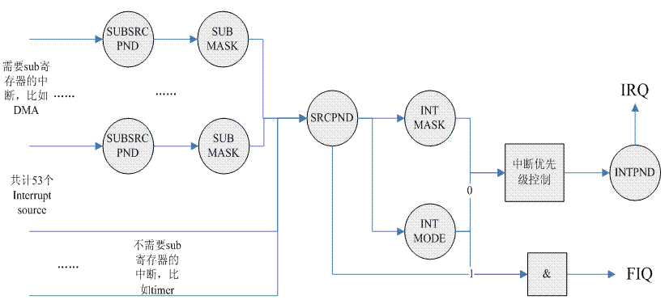

# Drivers

### Misc Device

Linux 内核中的杂项设备（Miscellaneous Devices）是一种通用的设备类型，用于表示那些不适合其他设备类型的设备。这些设备通常是不规则的，没有标准的通信协议或接口。杂项设备提供了一种灵活的机制，允许我们将不同类型的设备注册为杂项设备，并通过统一的接口在用户空间访问它们。所有的misc类设备都是字符设备，也就是misc类设备(主设备号为10）其实是字符设备中分出来的一个小类。

misc类设备在应用层的操作接口：/dev/xxxx，设备类对应在 /sys/class/misc。misc类设备有自己的一套驱动框架，所以写一个misc设备的驱动直接利用的是内核中提供的驱动框架来实现的（linux/drivers/char/misc.c）。misc驱动框架是对内核提供的原始的字符设备。在内核中，misc驱动框架的源码实现在： driver/char/misc.c  相应的头文件在：include/linux/miscdevice.h

### Device Tree

简单的说，如果要使用 Device Tree，首先用户要了解自己的硬件配置和系统运行参数，并把这些信息组织成 Device Tree source file。通过 DTC（Device Tree Compiler），可以将这些适合人类阅读的 Device Tree source file 变成适合机器处理的 Device Tree binary file（有一个更好听的名字，DTB，device tree blob）。在系统启动的时候，boot program（例如：firmware、bootloader）可以将保存在 flash 中的 DTB copy 到内存（当然也可以通过其他方式，例如可以通过 bootloader 的交互式命令加载 DTB，或者 firmware 可以探测到 device 的信息，组织成 DTB 保存在内存中），并把 DTB 的起始地址传递给 client program（例如 OS kernel，bootloader 或者其他特殊功能的程序）。对于计算机系统（computer system），一般是 firmware->bootloader->OS，对于嵌入式系统，一般是 bootloader->OS。

##### Device Tree的结构

在描述 Device Tree 的结构之前，先考虑一个基础问题：是否 Device Tree 要描述系统中的所有硬件信息？答案是否定的。基本上，那些可以动态探测到的设备是不需要描述的，例如 USB device。不过对于 SOC 上的 usb host controller，它是无法动态识别的，需要在 Device Tree 中描述。同样的道理，在 computer system中，PCI device 可以被动态探测到，不需要在 Device Tree 中描述，但是 PCI bridge 如果不能被探测，那么就需要描述之。

```c
/ o device-tree
      |- name = "device-tree"
      |- model = "MyBoardName"
      |- compatible = "MyBoardFamilyName"
      |- #address-cells = <2>
      |- #size-cells = <2>
      |- linux,phandle = <0>
      |
      o cpus
      | | - name = "cpus"
      | | - linux,phandle = <1>
      | | - #address-cells = <1>
      | | - #size-cells = <0>
      | |
      | o PowerPC,970@0
      |   |- name = "PowerPC,970"
      |   |- device_type = "cpu"
      |   |- reg = <0>
      |   |- clock-frequency = <0x5f5e1000>
      |   |- 64-bit
      |   |- linux,phandle = <2>
      |
      o memory@0
      | |- name = "memory"
      | |- device_type = "memory"
      | |- reg = <0x00000000 0x00000000 0x00000000 0x20000000>
      | |- linux,phandle = <3>
      |
      o chosen
        |- name = "chosen"
        |- bootargs = "root=/dev/sda2"
        |- linux,phandle = <4>
```

Device Tree 的基本单元是 node。这些 node 被组织成树状结构，除了 root node，每个 node 都只有一个 parent。一个 device tree 文件中只能有一个 root node。每个 node 中包含了若干的 property/value 来描述该node的一些特性。每个 node 用节点名字（node name）标识，节点名字的格式是 node-name@unit-address。如果该 node 没有 reg 属性，那么该节点名字中不能包括 @ 和 unit-address。unit-address 的具体格式是和设备挂在哪个 bus 上相关。例如对于 CPU，其 unit-address 就是从0开始编址，以此加一。而具体的设备，例如以太网控制器，其 unit-address 就是寄存器地址。root node 的 node name 是确定的，必须是“/”。

在一个树状结构的 device tree 中，如何引用一个 node 呢？要想唯一指定一个 node 必须使用 full path，例如 /node-name-1/node-name-2/node-name-N。在上面的例子中，cpu node 我们可以通过 /cpus/PowerPC,970@0 访问。

属性（property）值标识了设备的特性，它的值（value）是多种多样的：

1. 可能是空，也就是没有值的定义。例如上图中的64-bit ，这个属性没有赋值。
2. 可能是一个u32、u64的数值（值得一提的是cell这个术语，在Device Tree表示32bit的信息单位）。例如#address-cells = <1> 。当然，可能是一个数组。例如<0x00000000 0x00000000 0x00000000 0x20000000>
3. 可能是一个字符串。例如 device_type = "memory" ，当然也可能是一个 string list。例如 "PowerPC,970"


#### Device Tree source file语法介绍

在 linux kernel 中，扩展名是 dts 的文件就是描述硬件信息的 device tree source file，在 dts 文件中，一个 node 被定义成：

```c
[label:] node-name[@unit-address] {
   [properties definitions]
   [child nodes]
}
```

“[]” 表示 option，因此可以定义一个只有 node name 的空节点。label 方便在 dts 文件中引用，具体后面会描述。child node 的格式和 node 是完全一样的，因此，一个 dts 文件中就是若干嵌套组成的 node，property 以及 child note、child note property 描述。

用实例来讲解 Device Tree Source file 的数据格式。假设要制作了一个 S3C2416 的开发板，把该 development board 命名为 snail，那么需要撰写一个 s3c2416-snail.dts 的文件。如果把所有的开发板的硬件信息（SOC 以及外设）都描述在一个文件中是不合理的，因此有可能其他公司也使用 S3C2416 搭建自己的开发板并命令 pig、cow 什么的，如果大家都用自己的 dts 文件描述硬件，那么其中大部分是重复的，因此可以把和 S3C2416 相关的硬件描述保存成一个单独的 dts 文件可以供使用 S3C2416 的 target board 来引用并将文件的扩展名变成 dtsi（i表示include）。同理，三星公司的 S3C24xx 系列是一个 SOC family，这些 SOCs（2410、2416、2450等）也有相同的内容，因此同样的道理，可以将公共部分抽取出来，变成 s3c24xx.dtsi，方便大家 include。同样的道理，各家 ARM vendor 也会共用一些硬件定义信息，这个文件就是 skeleton.dtsi。下面自下而上（类似C＋＋中的从基类到顶层的派生类）逐个进行分析。

##### skeleton.dtsi

位于 linux-3.14\arch\arm\boot\dts 目录下，具体该文件的内容如下：

```c
/ {
    #address-cells = <1>;
    #size-cells = <1>;
    chosen { };
    aliases { };
    memory { device_type = "memory"; reg = <0 0>; };
};
```

device tree 顾名思义是一个树状的结构，既然是树，必然有根。“/”是根节点的 node name。“{” 和 “}” 之间的内容是该节点的具体的定义，其内容包括各种属性的定义以及 child node 的定义。chosen、aliases 和 memory 都是 sub node，sub node 的结构和 root node 是完全一样的，因此，sub node 也有自己的属性和它自己的 sub node，最终形成了一个树状的 device tree。属性的定义采用 property ＝ value 的形式。例如 #address-cells 和 #size-cells 就是 property，而 <1> 就是 value。value 有三种情况：

1. 属性值是 text string 或者 string list，用双引号表示。例如 device_type = "memory"
2. 属性值是 32bit unsigned integers，用尖括号表示。例如 #size-cells = <1>
3. 属性值是 binary data，用方括号表示。例如`binary-property = [0x01 0x23 0x45 0x67]`

如果一个 device node 中包含了有寻址需求（要定义 reg property）的 sub node（后文也许会用 child node，和 sub node 是一样的意思），那么就必须要定义这两个属性。“#” 是 number 的意思，#address-cells 这个属性是用来描述 sub node 中的 reg 属性的地址域特性的，也就是说需要用多少个 u32 的 cell 来描述该地址域。同理可以推断 #size-cells 的含义，下面对 reg 的描述中会给出更详细的信息。

chosen node 主要用来描述由系统 firmware 指定的 runtime parameter。如果存在 chosen 这个 node，其 parent node 必须是名字是 “/” 的根节点。原来通过tag list 传递的一些 linux kernel 的运行时参数可以通过 Device Tree 传递。例如 command line 可以通过 bootargs 这个 property 这个属性传递；initrd 的开始地址也可以通过 linux,initrd-start 这个 property 这个属性传递。在本例中，chosen 节点是空的，在实际中，建议增加一个 bootargs 的属性，例如：

```c
"root=/dev/nfs nfsroot=1.1.1.1:/nfsboot ip=1.1.1.2:1.1.1.1:1.1.1.1:255.255.255.0::usbd0:off console=ttyS0,115200 mem=64M@0x30000000"
```

通过该 command line 可以控制内核从 usbnet 启动，当然，具体项目要相应修改 command line 以便适应不同的需求。device tree 用于 HW platform 识别，runtime parameter 传递以及硬件设备描述。chosen 节点并没有描述任何硬件设备节点的信息，它只是传递了 runtime parameter。

aliases 节点定义了一些别名。为何要定义这个 node 呢？因为 device tree 是树状结构，当要引用一个 node 的时候要指明相对于 root node 的 full path，例如 /node-name-1/node-name-2/node-name-N。如果多次引用，每次都要写这么复杂的字符串多少是有些麻烦，因此可以在 aliases 节点定义一些设备节点 full path 的缩写。

memory device node 是所有设备树文件的必备节点，它定义了系统物理内存的 layout。device_type 属性定义了该 node 的设备类型，例如 cpu、serial 等。对于 memory node，其 device_type 必须等于 memory。reg 属性定义了访问该 device node 的地址信息，该属性的值被解析成任意长度的（address，size）数组，具体用多长的数据来表示 address 和 size 是在其 parent node 中定义（#address-cells 和 #size-cells）。对于 device node，reg 描述了 memory-mapped IO register 的 offset 和 length。对于 memory node，定义了该 memory 的起始地址和长度。

本例中的物理内存的布局并没有通过 memory node 传递，其实可以使用 command line 传递，command line 中的参数 `mem=64M@0x30000000` 已经给出了具体的信息。再用另外一个例子来加深对本节描述的各个属性以及 memory node 的理解。假设系统是 64bit 的，physical memory 分成两段，定义如下：

RAM: starting address 0x0, length 0x80000000 (2GB)
RAM: starting address 0x100000000, length 0x100000000 (4GB)

对于这样的系统，可以将 root node 中的 #address-cells 和 #size-cells 这两个属性值设定为 2，可以用下面两种方法来描述物理内存：

```c
// 方法1：
memory@0 {
    device_type = "memory";
    reg = <0x000000000 0x00000000 0x00000000 0x80000000
           0x000000001 0x00000000 0x00000001 0x00000000>;
};

// 方法2：
memory@0 {
    device_type = "memory";
    reg = <0x000000000 0x00000000 0x00000000 0x80000000>;
};

memory@100000000 {
    device_type = "memory";
    reg = <0x000000001 0x00000000 0x00000001 0x00000000>;
};
```

##### s3c24xx.dtsi

位于 linux-3.14\arch\arm\boot\dts 目录下，具体该文件的内容如下：

```c
#include "skeleton.dtsi"

/ {
    compatible = "samsung,s3c24xx"; －－－－－－－－－－－－－－－－－－－(A)
    interrupt-parent = <&intc>; －－－－－－－－－－－－－－－－－－－－－－(B)

    aliases {
        pinctrl0 = &pinctrl_0; －－－－－－－－－－－－－－－－－－－－－－－－(C)
    };

    intc:interrupt-controller@4a000000 { －－－－－－－－－－－－－－－－－－(D)
        compatible = "samsung,s3c2410-irq";
        reg = <0x4a000000 0x100>;
        interrupt-controller;
        #interrupt-cells = <4>;
    };

    serial@50000000 { －－－－－－－－－－－－－－－－－－－－－－(E)
        compatible = "samsung,s3c2410-uart";
        reg = <0x50000000 0x4000>;
        interrupts = <1 0 4 28>, <1 1 4 28>;
        status = "disabled";
    };

    pinctrl_0: pinctrl@56000000 {－－－－－－－－－－－－－－－－－－(F)
        reg = <0x56000000 0x1000>;

        wakeup-interrupt-controller {
            compatible = "samsung,s3c2410-wakeup-eint";
            interrupts = <0 0 0 3>,
              	         <0 0 1 3>,
                  	     <0 0 2 3>,
                         <0 0 3 3>,
                         <0 0 4 4>,
                         <0 0 5 4>;
        };
    };

……
};
```

这个文件描述了三星公司的 S3C24xx 系列 SOC family 共同的硬件 block 信息。首先提出的问题就是：为何定义了两个根节点？按理说 Device Tree 只能有一个根节点，所有其他的节点都是派生于根节点的。猜测是这样的：Device Tree Compiler 会对 DTS 的 node进行合并，最终生成的 DTB 只有一个 root node。

（A）在描述 compatible 属性之前要先描述 model 属性。model 属性指明了该设备属于哪个设备生产商的哪一个 model。一般而言，我们会给 model 赋值“manufacturer,model”。例如 `model = "samsung,s3c24xx"`。`samsung` 是生产商，`s3c24xx` 是 model 类型，指明了具体的是哪一个系列的 SOC。compatible 属性的值是 string list，定义了一系列的 model（每个string是一个model）。这些字符串列表被操作系统用来选择用哪一个 driver 来驱动该设备。假设定义该属性：`compatible = “aaaaaa”, “bbbbb"`。那么操作操作系统可能首先使用 `aaaaaa` 来匹配适合的 driver，如果没有匹配到，那么使用字符串 `bbbbb` 来继续寻找适合的 driver，对于本例，`compatible = "samsung,s3c24xx"`，这里只定义了一个 model 而不是一个 list。对于 root node，compatible 属性是用来匹配 machine type 的。对于普通的 HW block 的节点，例如 interrupt-controller，compatible 属性是用来匹配适合的 driver 的。

（B）具体各个 HW block 的 interrupt source 是如何物理的连接到 interrupt controller 的呢？在 dts 文件中是用 interrupt-parent 这个属性来标识的。这里定义 interrupt-parent 属性的是 root node，难道 root node 会产生中断到 interrupt controller吗？当然不会，只不过如果一个能够产生中断的 device node 没有定义 interrupt-parent 的话，其 interrupt-parent 属性就是跟随 parent node。因此，与其在所有的下游设备中定义 interrupt-parent，不如统一在 root node 中定义了。

`intc` 是一个 label，标识了一个 device node（在本例中是标识了 `interrupt-controller@4a000000` 这个 device node）。实际上，interrupt-parent 属性值应该是是一个 u32 的整数值（这个整数值在 Device Tree 的范围内唯一识别了一个 device node，也就是 `phandle`），不过在 dts 文件中，可以使用类似 c 语言的 Labels and References 机制。定义一个 label，唯一标识一个 node 或者 property，后续可以使用&来引用这个label。DTC 会将 label 转换成 u32 的整数值放入到 DTB 中，用户层面就不再关心具体转换的整数值了。

关于 interrupt 值得进一步描述。在 Device Tree 中，有一个概念叫做 interrupt tree，也就是说 interrupt 也是一个树状结构。以下图为例


系统中有一个 interrupt tree 的根节点，`device1`、`device2` 以及 PCI host bridge 的 interrupt line 都是连接到 root interrupt controller 的。PCI host bridge设备中有一些下游的设备，也会产生中断，但是他们的中断都是连接到 PCI host bridge 上的 interrupt controller（术语叫做 interrupt nexus），然后报告到root interrupt controller 的。每个能产生中断的设备都可以产生一个或者多个 interrupt，每个 interrupt source（另外一个术语叫做 interrupt specifier，描述了 interrupt source 的信息）都是限定在其所属的 interrupt domain 中。

在了解了上述的概念后，回头再看看 interrupt-parent 这个属性。其实这个属性是建立 interrupt tree 的关键属性。它指明了设备树中的各个 device node 如何路由 interrupt event。另外，需要提醒的是 interrupt controller 也是可以级联的，上图中没有表示出来。那么在这种情况下如何定义 interrupt tree 的 root 呢？那个没有定义 interrupt-parent 的 interrupt controller 就是 root。

（C）`pinctrl0` 是一个缩写，他是 `/pinctrl@56000000` 的别名。这里同样也是使用了 Labels and References 机制。

（D）`intc`（node name 是 `interrupt-controller@4a000000` ，这里直接使用 label）是描述 interrupt controller 的 device node。根据 S3C24xx 的 data sheet，interrupt controller 的寄存器地址从 `0x4a000000` 开始，长度为 `0x100`（实际 S3C2451 的 interrupt 的寄存器地址空间没有那么长，`0x4a000074` 是最后一个寄存器），也就是 reg 属性定义的内容。interrupt-controller 属性为空，只是用来标识该 node 是一个 interrupt controller 而不是 interrupt nexus（interrupt nexus 需要在不同的 interrupt domains 之间进行翻译，需要定义 interrupt-map 的属性）。#interrupt-cells 和 #address-cells 概念是类似的，也就是说，用多少个u32来标识一个 interrupt source。可以看到，在具体 HW block 的 interrupt 定义中都是用了4个u32来表示，例如串口的中断是这样定义的：

```c
interrupts = <1 0 4 28>, <1 1 4 28>;
```

（E） 从 reg 属性可以 serial controller 寄存器地址从 `0x50000000` 开始，长度为 `0x4000`。对于一个能产生中断的设备，必须定义 interrupts 这个属性。也可以定义 interrupt-parent 这个属性，如果不定义，则继承其 parent node 的 interrupt-parent 属性。 对于 interrupt 属性值，各个 interrupt controller 定义是不一样的，有的用3个u32表示，有的用4个。具体上面的各个数字的解释权归相关的 interrupt controller 所有。

（F）这个 node 是描述 GPIO 控制的。这个节点定义了一个 wakeup-interrupt-controller 的子节点，用来描述有唤醒功能的中断源。

##### s3c2416.dtsi

位于linux-3.14\arch\arm\boot\dts目录下，具体该文件的内容如下：

```c
#include "s3c24xx.dtsi"
#include "s3c2416-pinctrl.dtsi"

/ {
    model = "Samsung S3C2416 SoC"; 
    compatible = "samsung,s3c2416"; －－－－－－－－－－－－－－－(A)

    cpus { －－－－－－－－－－－－－－－－－－－－－－－－－－－－(B)
        #address-cells = <1>;
        #size-cells = <0>;

        cpu {
            compatible = "arm,arm926ejs";
        };
    };

    interrupt-controller@4a000000 { －－－－－－－－－－－－－－－－－(C)
        compatible = "samsung,s3c2416-irq";
    };

……

};
```

（A）在 s3c24xx.dtsi 文件中已经定义了 compatible 这个属性，在 s3c2416.dtsi 中重复定义了这个属性，一个 node 不可能有相同名字的属性，具体如何处理就交给 DTC 了。经过反编译，可以看出，DTC 是丢弃掉了前一个定义。因此，到目前为止，`compatible ＝ samsung,s3c2416`。在 s3c24xx.dtsi 文件中定义了compatible 的属性值被覆盖了。

（B）对于根节点，必须有一个 `cpus` 的 child node 来描述系统中的 CPU 信息。对于 CPU 的编址用一个u32整数就可以描述了，因此，对于 `cpus` node，#address-cells 是1，而 #size-cells 是0。其实 CPU 的 node 可以定义很多属性，例如 TLB，cache、频率信息什么的，不过对于ARM，这里只是定义了compatible 属性就OK了，`arm926ejs` 包括了所有的 processor 相关的信息。

（C）s3c24xx.dtsi 文件和 s3c2416.dtsi 中都有 `interrupt-controller@4a000000` 这个node，DTC 会对这两个 node进行合并，最终编译的结果如下：

```c
interrupt-controller@4a000000 {
        compatible = "samsung,s3c2416-irq";
        reg = <0x4a000000 0x100>;
        interrupt-controller;
        #interrupt-cells = <0x4>;
        linux,phandle = <0x1>;
        phandle = <0x1>;
    };
```

##### s3c2416-pinctrl.dtsi

 这个文件定义了 `pinctrl@56000000` 这个节点的若干 child node，主要用来描述 GPIO 的 bank 信息。

##### s3c2416-snail.dts

 这个文件应该定义一些 SOC 之外的 peripherals 的定义。


#### Device Tree binary格式

##### DTB整体结构

经过 Device Tree Compiler 编译，Device Tree source file 变成了 Device Tree Blob（又称作 flattened device tree）的格式。Device Tree Blob 的数据组织如下图所示：


##### DTB header

| header field name | description                                                  |
| ----------------- | ------------------------------------------------------------ |
| magic             | 用来识别 DTB 的。通过这个 magic，kernel 可以确定 bootloader 传递的参数 block 是一个 DTB 还是 tag list。 |
| totalsize         | DTB 的 total size                                            |
| off_dt_struct     | device tree structure block 的 offset                        |
| off_dt_strings    | device tree strings block 的 offset                          |
| off_mem_rsvmap    | offset to memory reserve map。有些系统，也许会保留一些 memory 有特殊用途（例如 DTB 或者 initrd image），或者在有些 DSP + ARM 的 SOC platform 上，有写 memory 被保留用于 ARM 和 DSP 进行信息交互。这些保留内存不会进入内存管理系统。 |
| version           | 该 DTB 的版本。                                              |
| last_comp_version | 兼容版本信息                                                 |
| boot_cpuid_phys   | 在哪一个 CPU（用ID标识）上 booting                           |
| dt_strings_size   | device tree strings block 的 size。和 off_dt_strings 一起确定了 strings block 在内存中的位置 |
| dt_struct_size    | device tree structure block 的 size。和 off_dt_struct 一起确定了 device tree structure block 在内存中的位置 |

##### memory reserve map 的格式描述

这个区域包括了若干的 reserve memory 描述符。每个 reserve memory 描述符是由 address 和 size 组成。其中 address 和 size 都是用U64来描述。

##### device tree structure block 的格式描述

device tree structure block 区域是由若干的分片组成，每个分片开始位置都是保存了 token，以此来描述该分片的属性和内容。共计有5种 token：

（1）FDT_BEGIN_NODE (0x00000001)。该 token 描述了一个 node 的开始位置，紧挨着该 token 的就是 node name（包括 unit address）

（2）FDT_END_NODE (0x00000002)。该 token 描述了一个 node 的结束位置。

（3）FDT_PROP (0x00000003)。该 token 描述了一个 property 的开始位置，该 token 之后是两个u32的数据，分别是 length 和 name offset。length 表示该property value data 的 size。name offset 表示该属性字符串在 device tree strings block 的偏移值。length 和 name offset 之后就是长度为 length 具体的属性值数据。

（4）FDT_NOP (0x00000004)。

（5）FDT_END (0x00000009)。该 token 标识了一个 DTB 的结束位置。

一个可能的 DTB 的结构如下：

（1）若干个 FDT_NOP（可选）

（2）FDT_BEGIN_NODE

​          node name

​          paddings

（3）若干属性定义。

（4）若干子节点定义。（被 FDT_BEGIN_NODE 和 FDT_END_NODE 包围）

（5）若干个 FDT_NOP（可选）

（6）FDT_END_NODE

（7）FDT_END

##### device tree strings block 的格式描述

device tree strings bloc 定义了各个 node 中使用的属性的字符串表。由于很多属性会出现在多个 node 中，因此，所有的属性字符串组成了一个 string block。这样可以压缩 DTB 的 size。


#### Device Tree 代码分析

##### 运行时参数传递以及 platform 的识别

`linux/arch/arm/kernel/head.S` 文件定义了 bootloader 和 kernel 的参数传递要求：

```c
MMU = off, D-cache = off, I-cache = dont care, r0 = 0, r1 = machine nr, r2 = atags or dtb pointer.
```

目前的 kernel 支持旧的 tag list 的方式，同时也支持 device tree 的方式。`r2` 可能是 device tree binary file 的指针（bootloader 要传递给内核之前要 copy 到memory 中），也可以能是 tag list 的指针。在 ARM 的汇编部分的启动代码中（主要是 `head.S` 和 `head-common.S`），machine type ID 和指向 DTB 或者 `atags` 的指针被保存在变量 `__machine_arch_type` 和 `__atags_pointer` 中，这么做是为了后续 c 代码进行处理。

具体的 c 代码都是在 `setup_arch` 中处理，这个函数是一个总的入口点。具体代码如下（删除了部分无关代码）：

```c
void __init setup_arch(char **cmdline_p)
{
    const struct machine_desc *mdesc;

……

    mdesc = setup_machine_fdt(__atags_pointer);
    if (!mdesc)
        mdesc = setup_machine_tags(__atags_pointer, __machine_arch_type);
    machine_desc = mdesc;
    machine_name = mdesc->name;

……
}
```

对于如何确定 HW platform 这个问题，旧的方法是静态定义若干的 machine 描述符（`struct machine_desc` ），在启动过程中，通过 machine type ID 作为索引，在这些静态定义的 machine 描述符中扫描，找到那个 ID 匹配的描述符。在新的内核中，首先使用 `setup_machine_fdt` 来 setup machine 描述符，如果返回 NULL，才使用传统的方法 `setup_machine_tags` 来 setup machine 描述符。传统的方法需要给出 `__machine_arch_type`（bootloader 通过 `r1` 寄存器传递给 kernel 的）和 tag list 的地址（用来进行 tag parse）。`__machine_arch_type` 用来寻找 machine 描述符；tag list 用于运行时参数的传递。随着内核的不断发展，相信有一天 linux kernel 会完全抛弃 tag list 的机制。

`setup_machine_fdt` 函数的功能就是根据 Device Tree 的信息，找到最适合的 machine 描述符。具体代码如下：

```c
const struct machine_desc * __init setup_machine_fdt(unsigned int dt_phys)
{
    const struct machine_desc *mdesc, *mdesc_best = NULL;

    if (!dt_phys || !early_init_dt_scan(phys_to_virt(dt_phys)))
        return NULL;

    mdesc = of_flat_dt_match_machine(mdesc_best, arch_get_next_mach);

    if (!mdesc) { 
        /* 出错处理 */
    }

    /* Change machine number to match the mdesc we're using */
    __machine_arch_type = mdesc->nr;

    return mdesc;
}
```

`early_init_dt_scan` 函数有两个功能，一个是为后续的 DTB scan 进行准备工作，另外一个是运行时参数传递。`of_flat_dt_match_machine` 是在 machine 描述符的列表中 scan，找到最合适的那个 machine 描述符。首先看如何组成 machine 描述符的列表。和传统的方法类似，也是静态定义的。`DT_MACHINE_START` 和 `MACHINE_END` 用来定义一个 machine 描述符。编译的时候，compiler 会把这些 machine descriptor 放到一个特殊的段中（`.arch.info.init`），形成 machine 描述符的列表。machine 描述符用下面的数据结构来标识：

```c
struct machine_desc {
    unsigned int        nr;            /* architecture number */
    const char *const   *dt_compat;    /* array of device tree 'compatible' strings */
……
   };
```

`nr` 成员就是过去使用的 machine type ID。内核 machine 描述符的 table 有若干个 entry，每个都有自己的 ID。bootloader 传递了 machine type ID，指明使用哪一个 machine 描述符。目前匹配 machine 描述符使用 compatible strings，也就是 `dt_compat` 成员，这是一个 string list，定义了这个 machine 所支持的列表。在扫描 machine 描述符列表的时候需要不断的获取下一个 machine 描述符的 compatible 字符串的信息，具体的代码如下：

```c
static const void * __init arch_get_next_mach(const char *const **match)
{
    static const struct machine_desc *mdesc = __arch_info_begin;
    const struct machine_desc *m = mdesc;

    if (m >= __arch_info_end)
        return NULL;

    mdesc++;
    *match = m->dt_compat;
    return m;
}
```

`__arch_info_begin` 指向 machine 描述符列表第一个 entry。通过 `mdesc++` 不断的移动 machine 描述符指针（Note：`mdesc` 是 static 的）。`match` 返回了该machine 描述符的 compatible string list。具体匹配的算法倒是很简单，就是比较字符串而已，一个是 root node 的 `compatible` 字符串列表，一个是 machine 描述符的 `compatible` 字符串列表，得分最低的（最匹配的）就是最终选定的 machine type。

运行时参数是在扫描 DTB 的 chosen node 时候完成的，具体的动作就是获取 chosen node 的 bootargs、initrd 等属性的 value，并将其保存在全局变量（boot_command_line，initrd_start、initrd_end）中。使用 tag list 方法是类似的，通过分析 tag list，获取相关信息，保存在同样的全局变量中。具体代码位于`early_init_dt_scan` 函数中：

```c
bool __init early_init_dt_scan(void *params)
{
    if (!params)
        return false;

    /* 全局变量initial_boot_params指向了DTB的header*/
    initial_boot_params = params;

    /* 检查DTB的magic，确认是一个有效的DTB */
    if (be32_to_cpu(initial_boot_params->magic) != OF_DT_HEADER) {
        initial_boot_params = NULL;
        return false;
    }

    /* 扫描 /chosen node，保存运行时参数（bootargs）到boot_command_line，此外，还处理initrd相关的property，并保存在initrd_start和initrd_end这两个全局变量中 */
    of_scan_flat_dt(early_init_dt_scan_chosen, boot_command_line);

    /* 扫描根节点，获取 {size,address}-cells信息，并保存在dt_root_size_cells和dt_root_addr_cells全局变量中 */
    of_scan_flat_dt(early_init_dt_scan_root, NULL);

    /* 扫描DTB中的memory node，并把相关信息保存在meminfo中，全局变量meminfo保存了系统内存相关的信息。*/
    of_scan_flat_dt(early_init_dt_scan_memory, NULL);

    return true;
}
```

设定 `meminfo`（该全局变量确定了物理内存的布局）有若干种途径：

1. 通过 tag list（tag 是 `ATAG_MEM`）传递 memory bank 的信息。
2. 通过 command line（可以用 tag list，也可以通过 DTB）传递 memory bank 的信息。
3. 通过 DTB 的 memory node 传递 memory bank 的信息。

目前当然是推荐使用 Device Tree 的方式来传递物理内存布局信息。

##### 初始化流程

在系统初始化的过程中，将 DTB 转换成节点是 device_node 的树状结构，以便后续方便操作。具体的代码位于 `setup_arch->unflatten_device_tree` 中。

```c
void __init unflatten_device_tree(void)
{
    __unflatten_device_tree(initial_boot_params, &of_allnodes,
                early_init_dt_alloc_memory_arch);

    /* Get pointer to "/chosen" and "/aliases" nodes for use everywhere */
    of_alias_scan(early_init_dt_alloc_memory_arch);
}

struct device_node {
    const char *name; // device node name
    const char *type; // 对应device_type的属性
    phandle phandle; // 对应该节点的phandle属性
    const char *full_name; // 从“/”开始的，表示该node的full path

    struct    property *properties; // 该节点的属性列表
    struct    property *deadprops;  // 如果需要删除某些属性，kernel并非真的删除，而是挂入到deadprops的列表
    struct    device_node *parent; // parent、child以及sibling将所有的device node连接起来
    struct    device_node *child;
    struct    device_node *sibling;
    struct    device_node *next; // 通过该指针可以获取相同类型的下一个node
    struct    device_node *allnext; // 通过该指针可以获取node global list下一个node
    struct    proc_dir_entry *pde; // 开放到userspace的proc接口信息
    struct    kref kref; // 该node的reference count
    unsigned long _flags;
    void    *data;
};
```

`unflatten_device_tree` 函数的主要功能就是扫描 DTB，将 device node 被组织成：

1、global list。全局变量 `struct device_node *of_allnodes` 就是指向设备树的 global list

2、tree。

这些功能主要是在 `__unflatten_device_tree` 函数中实现，具体代码如下：

```c
static void __unflatten_device_tree(struct boot_param_header *blob, // 需要扫描的DTB
                 					struct device_node **mynodes, // global list指针
                 					void * (*dt_alloc)(u64 size, u64 align)) // 内存分配函数
{
    unsigned long size;
    void *start, *mem;
    struct device_node **allnextp = mynodes;

    /* 此处删除了health check代码，例如检查DTB header的magic，确认blob的确指向一个DTB。 */

    /* scan过程分成两轮，第一轮主要是确定device-tree structure的长度，保存在size变量中 */
    start = ((void *)blob) + be32_to_cpu(blob->off_dt_struct);
    size = (unsigned long)unflatten_dt_node(blob, 0, &start, NULL, NULL, 0);
    size = ALIGN(size, 4);

    /* 初始化的时候，并不是扫描到一个node或者property就分配相应的内存，实际上内核是一次性的分配了一大片内存，这些内存包括了所有的struct device_node、node name、struct property所需要的内存。*/
    mem = dt_alloc(size + 4, __alignof__(struct device_node));
    memset(mem, 0, size);

    *(__be32 *)(mem + size) = cpu_to_be32(0xdeadbeef);   //用来检验后面unflattening是否溢出

    /* 这是第二轮的scan，第一次scan是为了得到保存所有node和property所需要的内存size，第二次就是实打实的要构建device node tree了 */
    start = ((void *)blob) + be32_to_cpu(blob->off_dt_struct);
    unflatten_dt_node(blob, mem, &start, NULL, &allnextp, 0); 
   

    /* 此处略去校验溢出和校验OF_DT_END。 */
}
```

##### 并入 linux kernel 的设备驱动模型

在 linux kernel 引入统一设备模型之后，bus、driver 和 device 形成了设备模型中的铁三角。在驱动初始化的时候会将代表该 driver 的一个数据结构（一般是`xxx_driver`）挂入 bus 上的 driver 链表。device 挂入链表分成两种情况，一种是即插即用类型的 bus，在插入一个设备后，总线可以检测到这个行为并动态分配一个 device 数据结构（一般是 `xxx_device`，例如 `usb_device`），之后，将该数据结构挂入 bus 上的 device 链表。bus 上挂满了 driver 和 device，那么如何让 device 遇到“对”的那个 driver 呢？那么就要靠 bus 的 match 函数。

回到 Device Tree。导致 Device Tree 的引入 ARM 体系结构的代码其中一个最重要的原因的太多的静态定义的表格。例如：一般代码中会定义一个 `static struct platform_device *xxx_devices` 的静态数组，在初始化的时候调用 `platform_add_devices`。这些静态定义的 `platform_device` 往往又需要静态定义各种 resource，这导致静态表格进一步增大。如果 ARM linux 中不再定义这些表格，那么一定需要一个转换的过程，也就是说，系统应该会根据 device tree 来动态的增加系统中的 `platform_device`。当然，这个过程并非只是发生在 platform bus 上，也可能发生在其他的非即插即用的 bus 上，例如 AMBA 总线、PCI 总线。一言以蔽之，如果要并入 linux kernel 的设备驱动模型，那么就需要根据 device_node 的树状结构（root 是 `of_allnodes`）将一个个的 device node 挂入到相应的总线 device 链表中。只要做到这一点，总线机制就会安排 device 和 driver 的约会。当然，也不是所有的 device node 都会挂入 bus 上的设备链表，比如 cpus node，memory node，chosen node 等。

```c
/* cpus node 的处理 */
void __init arm_dt_init_cpu_maps(void)
{
    /* scan device node global list，寻找 full path 是 “/cpus” 的那个 device node。cpus 这个 device node 只是一个容器，
     * 其中包括了各个 cpu node 的定义以及所有 cpu node 共享的 property。
     */
    cpus = of_find_node_by_path("/cpus");

    for_each_child_of_node(cpus, cpu) {           // 遍历 cpus 的所有的 child node
        u32 hwid;

        if (of_node_cmp(cpu->type, "cpu"))        // 只关心那些 device_type 是 cpu 的 node
            continue;

        if (of_property_read_u32(cpu, "reg", &hwid)) {    // 读取 reg 属性的值并赋值给 hwid
            return;
        }

        /* reg 的属性值的 8 MSBs 必须设置为0，这是 ARM CPU binding 定义的。 */
        if (hwid & ~MPIDR_HWID_BITMASK)  
            return;

        /* 不允许重复的 CPU id，那是一个灾难性的设定 */
        for (j = 0; j < cpuidx; j++)
            if (WARN(tmp_map[j] == hwid, "Duplicate /cpu reg "
                             "properties in the DT\n"))
                return;

	/* 数组 tmp_map 保存了系统中所有 CPU 的 MPIDR 值（CPU ID值），具体的 index 的编码规则是： tmp_map[0] 保存了 booting CPU 的 id 值，
	 * 其余的 CPU 的 ID 值保存在 1～NR_CPUS 的位置。
	 */
        if (hwid == mpidr) {
            i = 0;
            bootcpu_valid = true;
        } else {
            i = cpuidx++;
        }

        tmp_map[i] = hwid;
    }

	/* 根据 DTB 中的信息设定 cpu logical map 数组。*/
    for (i = 0; i < cpuidx; i++) {
        set_cpu_possible(i, true);
        cpu_logical_map(i) = tmp_map[i];
    }
}

/* memory 的处理 */
int __init early_init_dt_scan_memory(unsigned long node, const char *uname, int depth, void *data)
{
    char *type = of_get_flat_dt_prop(node, "device_type", NULL); 获取device_type属性值
    __be32 *reg, *endp;
    unsigned long l;

    /* 在初始化的时候，会对每一个 device node 都要调用该 callback 函数，因此，要过滤掉那些和 memory block 定义无关的 node。
     * 和 memory block 定义有的节点有两种，一种是 node name 是 memory@ 形态的，另外一种是 node 中定义了 device_type 属性并且其值是 memory。
     */
    if (type == NULL) {
        if (depth != 1 || strcmp(uname, "memory@0") != 0)
            return 0;
    } else if (strcmp(type, "memory") != 0)
        return 0;

    /* 获取 memory 的起始地址和 length 的信息。有两种属性和该信息有关，一个是 linux,usable-memory，不过最新的方式还是使用 reg 属性。*/
	reg = of_get_flat_dt_prop(node, "linux,usable-memory", &l);
    if (reg == NULL)
        reg = of_get_flat_dt_prop(node, "reg", &l);
    if (reg == NULL)
        return 0;

    endp = reg + (l / sizeof(__be32));

	/* reg 属性的值是 address，size 数组，那么如何来取出一个个的 address/size 呢？由于 memory node 一定是 root node 的 child，
	 * 因此 dt_root_addr_cells（root node 的 #address-cells 属性值）和 dt_root_size_cells（root node 的 #size-cells 属性值）
	 * 之和就是 address，size 数组的 entry size。*/

    while ((endp - reg) >= (dt_root_addr_cells + dt_root_size_cells)) {
        u64 base, size;

        base = dt_mem_next_cell(dt_root_addr_cells, ®);
        size = dt_mem_next_cell(dt_root_size_cells, ®);

        early_init_dt_add_memory_arch(base, size);  // 将具体的memory block信息加入到内核中。
    }

    return 0;
}

/* interrupt controller 的处理 */
/* 初始化是通过 start_kernel->init_IRQ->machine_desc->init_irq() 实现的。用 S3C2416 为例来描述 interrupt controller 的处理过程。
 * 下面是machine描述符的定义。
 */
DT_MACHINE_START(S3C2416_DT, "Samsung S3C2416 (Flattened Device Tree)")
    ……
    .init_irq    = irqchip_init,
……
    MACHINE_END

/* 在 driver/irqchip/irq-s3c24xx.c 文件中定义了两个 interrupt controller */
IRQCHIP_DECLARE(s3c2416_irq, "samsung,s3c2416-irq", s3c2416_init_intc_of);
IRQCHIP_DECLARE(s3c2410_irq, "samsung,s3c2410-irq", s3c2410_init_intc_of);

/* 系统中可以定义更多的 irqchip，不过具体用哪一个是根据 DTB 中的 interrupt controller node 中的 compatible 属性确定的。
 * 在 driver/irqchip/irqchip.c 文件中定义了 irqchip_init 函数 */
void __init irqchip_init(void)
{
    of_irq_init(__irqchip_begin);
}
	
/* __irqchip_begin 就是所有的 irqchip的一个列表，of_irq_init 函数是遍历 Device Tree，找到匹配的 irqchip。 */
void __init of_irq_init(const struct of_device_id *matches)
{
    struct device_node *np, *parent = NULL;
    struct intc_desc *desc, *temp_desc;
    struct list_head intc_desc_list, intc_parent_list;

    INIT_LIST_HEAD(&intc_desc_list);
    INIT_LIST_HEAD(&intc_parent_list);

    /* 遍历所有的 node，寻找定义了 interrupt-controller 属性的 node，如果定义了 interrupt-controller 属性则说明该 node 就是一个中断控制器。 */
    for_each_matching_node(np, matches) {
        if (!of_find_property(np, "interrupt-controller", NULL) ||
                !of_device_is_available(np))
            continue;
       

		/* 分配内存并挂入链表，当然还有根据 interrupt-parent 建立 controller 之间的父子关系。
		 * 对于 interrupt controller，它也可能是一个树状的结构。
		 */
        desc = kzalloc(sizeof(*desc), GFP_KERNEL);
        if (WARN_ON(!desc))
            goto err;

        desc->dev = np;
        desc->interrupt_parent = of_irq_find_parent(np);
        if (desc->interrupt_parent == np)
            desc->interrupt_parent = NULL;
        list_add_tail(&desc->list, &intc_desc_list);
    }

    /* 正因为 interrupt controller 被组织成树状的结构，因此初始化的顺序就需要控制，应该从根节点开始，
     * 依次递进到下一个 level 的 interrupt controller。intc_desc_list 链表中的节点会被一个个的处理，
     * 每处理完一个节点就会将该节点删除，当所有的节点被删除，整个处理过程也就是结束了。
     */
    while (!list_empty(&intc_desc_list)) {  
        list_for_each_entry_safe(desc, temp_desc, &intc_desc_list, list) {
            const struct of_device_id *match;
            int ret;
            of_irq_init_cb_t irq_init_cb;

            /* 最开始的时候 parent 变量是 NULL，确保第一个被处理的是 root interrupt controller。在处理完 root node 之后，
             * parent 变量被设定为 root interrupt controller，因此，第二个循环中处理的是所有 parent 是 root interrupt controller 的
             * child interrupt controller。也就是 level 1（如果 root 是 level 0 的话）的节点。
             */
            if (desc->interrupt_parent != parent)
                continue;

            list_del(&desc->list); // 从链表中删除
            match = of_match_node(matches, desc->dev); // 匹配并初始化
            if (WARN(!match->data, // match->data 是初始化函数
                "of_irq_init: no init function for %s\n",
                match->compatible)) {
                kfree(desc);
                continue;
            }

            irq_init_cb = (of_irq_init_cb_t)match->data;
            ret = irq_init_cb(desc->dev, desc->interrupt_parent); // 执行初始化函数
            if (ret) {
                kfree(desc);
                continue;
            }

           	/* 处理完的节点放入 intc_parent_list 链表，后面会用到 */
            list_add_tail(&desc->list, &intc_parent_list);
        }

        /* 对于 level 0，只有一个 root interrupt controller，对于 level 1，可能有若干个 interrupt controller，
         * 因此要遍历这些 parent interrupt controller，以便处理下一个 level 的 child node。*/
        desc = list_first_entry_or_null(&intc_parent_list,
                        typeof(*desc), list);
        if (!desc) {
            pr_err("of_irq_init: children remain, but no parents\n");
            break;
        }
        list_del(&desc->list);
        parent = desc->dev;
        kfree(desc);
    }

    list_for_each_entry_safe(desc, temp_desc, &intc_parent_list, list) {
        list_del(&desc->list);
        kfree(desc);
    }
err:
    list_for_each_entry_safe(desc, temp_desc, &intc_desc_list, list) {
        list_del(&desc->list);
        kfree(desc);
    }
}
```

只有该 node 中有 interrupt-controller 这个属性定义，那么 linux kernel 就会分配一个 interrupt controller 的描述符（`struct intc_desc`）并挂入队列。通过interrupt-parent 属性，可以确定各个 interrupt controller 的层次关系。在 scan 了所有的 Device Tree 中的 interrupt controller 的定义之后，系统开始匹配过程。一旦匹配到了 interrupt chip 列表中的项次后，就会调用相应的初始化函数。如果 CPU 是 S3C2416 的话，匹配到的是 `irqchip` 的初始化函数是`s3c2416_init_intc_of`。

已经通过 compatible 属性找到了适合的 interrupt controller，那么如何解析 reg 属性呢？对于 S3c2416 的 interrupt controller 而言，其 #interrupt-cells 的属性值是4，定义为。每个域的解释如下：

（1）`ctrl_num` 表示使用哪一种类型的 interrupt controller，其值的解释如下：

   \- 0 ... main controller
   \- 1 ... sub controller
   \- 2 ... second main controller

（2）`parent_irq`。对于 sub controller，`parent_irq` 标识了其在 main controller 的 bit position。

（3）`ctrl_irq` 标识了在 controller 中的 bit 位置。

（4）type 标识了该中断的 trigger type，例如：上升沿触发还是电平触发。

简单的介绍2416的中断控制器，其block diagram如下：



53个 `Samsung2416` 的中断源被分成两种类型，一种是需要 sub 寄存器进行控制的，例如 DMA，系统中的8个 DMA 中断是通过两级识别的，先在 `SRCPND` 寄存器中得到是 DMA 中断的信息，具体是哪一个 channel 的 DMA 中断需要继续查询 `SUBSRC` 寄存器。那些不需要 sub 寄存器进行控制的，例如 timer，5个timer 的中断可以直接从 `SRCPND` 中得到。

中断 MASK 寄存器可以控制产生的中断是否要报告给 CPU，当一个中断被 mask 的时候，虽然 `SRCPND` 寄存器中，硬件会 set 该 bit，但是不会影响到 `INTPND` 寄存器，从而不会向 CPU 报告该中断。对于 `SUBMASK` 寄存器，如果该 bit 被 set，也就是该 sub 中断被 mask 了，那么即便产生了对应的 sub 中断，也不会修改 `SRCPND` 寄存器的内容，只是修改 `SUBSRCPND` 中寄存器的内容。

不过随着硬件的演化，更多的 HW block 加入到 SOC 中，这使得中断源不够用了，因此中断寄存器又被分成两个 group，一个是 group 1（开始地址是`0X4A000000`，也就是 main controller 了），另外一个是 group 2（开始地址是 `0X4A000040`，叫做 second main controller）。group 1中的 sub 寄存器的起始地址是 `0X4A000018`（也就是 sub controller）。

```c
static struct s3c24xx_irq_of_ctrl s3c2416_ctrl[] = {
    {
        .name = "intc", // main controller
        .offset = 0,
    }, {
        .name = "subintc", // sub controller
        .offset = 0x18,
        .parent = &s3c_intc[0],
    }, {
        .name = "intc2", // second main controller
        .offset = 0x40,
    }
};
```

对于 s3c2416 而言，`irqchip` 的初始化函数是 `s3c2416_init_intc_of`，`s3c2416_ctrl` 作为参数传递给了 `s3c_init_intc_of`，大部分的处理都是在`s3c_init_intc_of` 函数中完成的。

```c
/* machine 初始化 */
static int __init customize_machine(void)
{

    if (machine_desc->init_machine)
        machine_desc->init_machine();
    else
        of_platform_populate(NULL, of_default_bus_match_table, NULL, NULL);

    return 0;
}
arch_initcall(customize_machine);
```

在这个函数中，一般会调用 machine 描述符中的 `init_machine callback` 函数来把各种 Device Tree 中定义的 platform device 设备节点加入到系统（即platform bus 的所有的子节点，对于 device tree 中其他的设备节点，需要在各自 bus controller 初始化的时候自行处理）。如果 machine 描述符中没有定义`init_machine` ，那么直接调用 `of_platform_populate` 把所有的 platform device 加入到 kernel 中。对于 s3c2416，其 machine 描述符中的 `init_machine callback` 函数就是 `s3c2416_dt_machine_init`。

```c
static void __init s3c2416_dt_machine_init(void)
{
    of_platform_populate(NULL, of_default_bus_match_table, s3c2416_auxdata_lookup, NULL);  // 传入NULL参数表示从root node开始scan
    s3c_pm_init(); // power management相关的初始化
}
```

由此可见，最终生成 platform device 的代码来自 `of_platform_populate` 函数。该函数的逻辑比较简单，遍历 device node global list 中所有的 node，并调用`of_platform_bus_create` 处理。

```c
static int of_platform_bus_create(struct device_node *bus, // 要创建的那个 device node
                  				  const struct of_device_id *matches, // 要匹配的 list
                				  const struct of_dev_auxdata *lookup, // 附属数据
        				          struct device *parent, bool strict) // parent 指向父节点。strict 是否要求完全匹配
{
    const struct of_dev_auxdata *auxdata;
    struct device_node *child;
    struct platform_device *dev;
    const char *bus_id = NULL;
    void *platform_data = NULL;
    int rc = 0;

	// 省略确保 device node 有 compatible 属性的代码。

    auxdata = of_dev_lookup(lookup, bus);  // 在传入的 lookup table 寻找和该 device node 匹配的附加数据
    if (auxdata) {
        bus_id = auxdata->name; // 如果找到，那么就用附加数据中的静态定义的内容
        platform_data = auxdata->platform_data;
    }

	/* ARM 公司提供了 CPU core，除此之外，它设计了 AMBA 的总线来连接 SOC 内的各个 block。
	 * 符合这个总线标准的 SOC 上的外设叫做 ARM Primecell Peripherals。如果一个 device node 的 compatible 属性值是 arm,primecell 的话，
	 * 可以调用 of_amba_device_create 来向 amba 总线上增加一个 amba device。
	 */
    if (of_device_is_compatible(bus, "arm,primecell")) {
        of_amba_device_create(bus, bus_id, platform_data, parent);
        return 0;
    }

    /* 如果不是 ARM Primecell Peripherals，那么就需要向 platform bus 上增加一个 platform device。 */
    dev = of_platform_device_create_pdata(bus, bus_id, platform_data, parent);
    if (!dev || !of_match_node(matches, bus))
        return 0;

    /* 一个 device node 可能是一个桥设备，因此要重复调用 of_platform_bus_create 来把所有的 device node 处理掉。 */
    for_each_child_of_node(bus, child) {
        pr_debug("   create child: %s\n", child->full_name);
        rc = of_platform_bus_create(child, matches, lookup, &dev->dev, strict);
        if (rc) {
            of_node_put(child);
            break;
        }
    }
    return rc;
}

static struct platform_device *of_platform_device_create_pdata(struct device_node *np,
                    										   const char *bus_id,
                    										   void *platform_data,
                    										   struct device *parent)
{
    struct platform_device *dev;

    if (!of_device_is_available(np)) // check status 属性，确保是 enable 或者 OK 的。
        return NULL;

    /* of_device_alloc 除了分配 struct platform_device 的内存，还分配了该 platform device 需要的 resource 的内存。
     * 当然，这就需要解析该 device node 的 interrupt 资源以及 memory address 资源。 */
    dev = of_device_alloc(np, bus_id, parent);
    if (!dev)
        return NULL;

	/* 设定 platform_device 中的其他成员 */
    dev->dev.coherent_dma_mask = DMA_BIT_MASK(32);
    if (!dev->dev.dma_mask)
        dev->dev.dma_mask = &dev->dev.coherent_dma_mask;
    dev->dev.bus = &platform_bus_type;
    dev->dev.platform_data = platform_data;

    if (of_device_add(dev) != 0) { // 把这个 platform device 加入统一设备模型系统中
        platform_device_put(dev);
        return NULL;
    }

    return dev;
}
```

