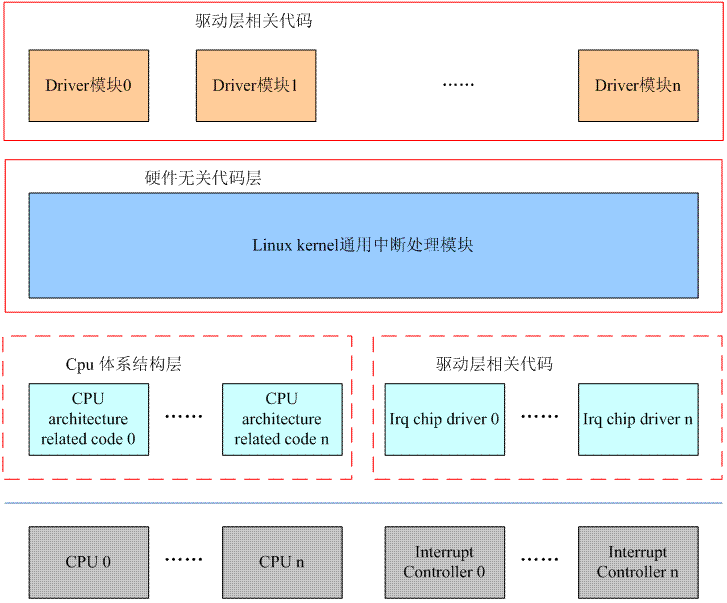

# Interrupt

### 综述

#### 中断系统相关硬件描述

硬件中断系统主要有三种器件参与，各个外设、中断控制器和 CPU。各个外设提供 irq request line，在发生中断事件的时候，通过 irq request line 上的电气信号向 CPU 系统请求处理。外设的 irq request line 太多，CPU 需要一个小伙伴帮他，这就是 interrupt controller。interrupt controller 是连接外设中断系统和 CPU 系统的桥梁。根据外设 irq request line 的多少，interrupt controller 可以级联。CPU 的主要功能是运算，因此 CPU 并不处理中断优先级，那是 interrupt controller 的事情。对于 CPU 而言，一般有两种中断请求，例如：对于 ARM，是 IRQ 和 FIQ 信号线，分别让 ARM 进入 IRQ mode 和 FIQ mode。对于X86，有可屏蔽中断和不可屏蔽中断。而 CPU HW block 是指 ARM core 或者 X86 这样的实际硬件 block 的一个逻辑描述，实际中，可能是任何可能的 CPU block。HW 中断系统之逻辑 block diagram 如下图所示：


系统中有若干个 CPU block 用来接收中断事件并进行处理，若干个 interrupt controller 形成树状的结构，汇集系统中所有外设的 irq request line，并将中断事件分发给某一个 CPU block 进行处理。从接口层面看，主要有两类接口，一种是中断接口。有的实现中，具体中断接口的形态就是一个硬件的信号线，通过电平信号传递中断事件（ARM 以及 GIC 组成的中断系统就是这么设计的）。有些系统采用了其他的方法来传递中断事件，比如 x86＋APIC（Advanced Programmable interrupt controller）组成的系统，每个 x86 的核有一个 Local APIC，这些 Local APIC 们通过 ICC（interrupt controller Communication）bus 连接到 IO APIC 上。IO APIC 收集各个外设的中断，并翻译成总线上的 message，传递给某个 CPU 上的 Local APIC。因此，上面的红色线条也是逻辑层面的中断信号，可能是实际的 PCB 上的铜线（或者 SOC 内部的铜线），也可能是一个 message 而已。除了中断接口，CPU 和 interrupt controller 之间还需要有控制信息的交流。interrupt controller 会开放一些寄存器让 CPU 访问、控制。

##### interrupt controller 拓扑结构

interrupt controller 有的是支持多个 CPU core 的（例如 GIC、APIC 等），有的不支持（例如 S3C2410 的中断控制器，X86 平台的 PIC 等）。如果硬件平台中只有一个 GIC 的话，那么通过控制该 GIC 的寄存器可以将所有的外设中断，分发给连接在该 interrupt controller 上的 CPU。如果有多个 GIC 呢（或者级联的interrupt controller 都支持 Multi CPU Core）？假设要设计一个非常复杂的系统，系统中有 8 个 CPU，有 2000 个外设中断要处理，这时候如何设计系统中的interrupt controller？如果使用 GIC 的话，需要两个 GIC（一个 GIC 最多支持 1024 个中断源），一个是 root GIC，另外一个是 secondary GIC。这时候有两种方案：

1. 把 8 个 CPU 都连接到 root GIC 上，secondary GIC 不接 CPU。这时候原本挂接在 secondary GIC 的外设中断会输出到某个 CPU，现在只能是（通过某个 CPU interface 的 irq signal）输到 root GIC 的某个 SPI 上。对于软件而言，这是一个比较简单的设计，secondary GIC 的 CPU interface 的设定是固定不变的，永远是从一个固定的 CPU interface 输出到 root GIC。这种方案的坏处是：这时候 secondary GIC 的 PPI 和 SGI 都是没有用的了。此外，在这种设定下，所有连接在 secondary GIC 上的外设中断要送达的 target CPU 是统一处理的，要么送去 CPU0，要么 CPU5，不能单独控制。
2. 也可以让每个 GIC 分别连接 4 个 CPU core，root GIC 连接 CPU0~CPU3，secondary GIC 连接 CPU4~CPU7。这种状态下，连接在 root GIC 的中断可以由 CPU0~CPU3 分担处理，连接在 secondary GIC 的中断可以由 CPU4~CPU7 分担处理。但这样，在中断处理方面看起来就体现不出 8 核的威力了。

注：上一节中的逻辑block示意图采用的就是方案一。

##### interrupt controller 选核

毫无疑问，只有支持 Multi CPU Core 的中断控制器才有这种幸福的烦恼。一般而言，中断控制器可以把中断事件上报给一个 CPU 或者一组 CPU（包括广播到所有的 CPU 上去）。对于外设类型的中断，当然是送到一个 CPU 上就行了，看不出来要把这样的中断送给多个 CPU 进行处理的必要性。如果送达了多个 CPU ，实际上，也应该只有一个 handler 实际和外设进行交互，另外一个 CPU 上的 handler 的动作应该是这样的：发现该 irq number 对应的中断已经被另外一个 CPU 处理了，直接退出 handler，返回中断现场。IPI 的中断不存在这个限制，IPI 更像一个 CPU 之间通信的机制，对这种中断广播应该是毫无压力。实际上，从用户的角度看，其需求是相当复杂的，目标可能包括：

1. 让某个 irq number 的中断由某个特定的 CPU 处理
2. 让某个特定的中断由几个 CPU 轮流处理

……

当然，具体的需求可能更加复杂，但是如何区分软件和硬件的分工呢？让硬件处理那么复杂的策略其实是不合理的，复杂的逻辑如果由硬件实现，那么就意味着更多的晶体管，更多的功耗。因此，最普通的做法就是为 interrupt controller 支持的每一个中断设定一个 target CPU 的控制接口（当然应该是以寄存器形式出现，对于 GIC，这个寄存器就是 Interrupt Processor Target Register）。系统有多个 CPU，这个控制接口就有多少个 bit，每个 bit 代表一个 CPU。如果该 bit 设定为1，那么该 Interrupt 就上报给该 CPU，如果为 0，则不上报给该 CPU。这样的硬件逻辑比较简单，剩余的控制内容就交给软件好了。例如如果系统有两个 CPU core，某中断想轮流由两个 CPU 处理。那么当 CPU0 相应该中断进入 Interrupt handler 的时候，可以将 Interrupt Processor Target Register 中本 CPU 对应的 bit 设定为 0，另外一个 CPU 的 bit 设定为 1。这样，在下次中断发生的时候，Interupt Controller 就把中断送给了 CPU1。对于 CPU1 而言，在执行该中断的 handler 的时候，将 Interrupt Processor Target Register 中 CPU0 的 bit 为设置为1，disable 本 CPU 的比特位，这样在下次中断发生的时候，Interupt Controller 就把中断送给了 CPU0。这样软件控制的结果就是实现了特定中断由 2 个 CPU 轮流处理的算法。

面对这个HW中断系统之逻辑 block diagram，其实可以提出更多的问题：

1. 中断控制器发送给 CPU 的中断是否可以收回？重新分发给另外一个 CPU ？
2. 系统中的中断如何分发才能获得更好的性能呢？
3. 中断分发的策略需要考虑哪些因素呢？

……

#### 中断子系统软件框架

Linux Kernel 的中断子系统相关的软件框架图如下所示：



由上面的block图，可知 Linux Kernel 的中断子系统分成4个部分：

1. 硬件无关的代码，称之 Linux Kernel 通用中断处理模块。无论是哪种 CPU，哪种 Controller，其中断处理的过程都有一些相同的内容，这些相同的内容被抽象出来，和 HW 无关。此外，各个外设的驱动代码中，也希望能用一个统一的接口实现 irq 相关的管理（不和具体的中断硬件系统以及 CPU 体系结构相关）这些通用的代码组成了 Linux Kernel Interrupt Subsystem 的核心部分。
2. CPU Architecture 相关的中断处理。和系统使用的具体的 CPU Architecture 相关。
3. interrupt controller 驱动代码 。和系统使用的 interrupt controller 相关。
4. 普通外设的驱动。这些驱动将使用 Linux Kernel 通用中断处理模块的 API 来实现自己的驱动逻辑。


### irq domain

#### 概述

在 Linux Kernel中，使用下面两个 ID 来标识一个来自外设的中断：

1. irq number。CPU 需要为每一个外设中断编号，称之 irq number。这个 irq number 是一个虚拟的 Interrupt ID，和硬件无关，仅仅是被 CPU 用来标识一个外设中断。
2. HW interrupt ID。对于 interrupt controller 而言，它收集了多个外设的 interrupt request line 并向上传递，因此，interrupt controller 需要对外设中断进行编码。interrupt controller 用 HW interrupt ID 来标识外设的中断。在 interrupt controller 级联的情况下，仅仅用 HW interrupt ID 已经不能唯一标识一个外设中断，还需要知道该 HW interrupt ID 所属的 interrupt controller（HW interrupt ID 在不同的 interrupt controller 上是会重复编码的）。

这样，CPU 和 interrupt controller 在标识中断上就有了一些不同的概念，但是，驱动工程师和 CPU 视角是一样的，只希望得到一个 irq number，而不关系具体是哪个 interrupt controller 上的哪个 HW interrupt ID。这样一个好处是在中断相关的硬件发生变化的时候，驱动软件不需要修改。因此，Linux Kernel 中的中断子系统需要提供一个将 HW interrupt ID 映射到 irq number 上来的机制。

#### 历史

关于 HW interrupt ID 映射到 irq number 上这事，在过去系统只有一个 interrupt controller 的时候还是很简单的，中断控制器上实际的 HW Interrupt Line 的编号可以直接变成 irq number。例如 SOC 内嵌的 interrupt controller，这种 Controller 多半有中断状态寄存器，这个寄存器可能有 64 个 bit（也可能更多），每个 bit 就是一个 irq number，可以直接进行映射。这时候，GPIO 的中断在中断控制器的状态寄存器中只有一个 bit，因此所有的 GPIO 中断只有一个 irq number，在该通用 GPIO 中断的 irq handler 中进行 deduplex，将各个具体的 GPIO 中断映射到其相应的 irq number 上。

随着 Linux Kernel 的发展，将 interrupt controller 抽象成 irqchip 这个概念越来越流行，甚至 GPIO Controller 也可以被看出一个 interrupt controller Chip，这样，系统中至少有两个中断控制器了，一个传统意义的中断控制器，一个是 GPIO Controller type 的中断控制器。随着系统复杂度加大，外设中断数据增加，实际上系统可以需要多个中断控制器进行级联，面对这样的趋势，Linux Kernel工程师如何应对？答案就是 irq domain 这个概念。

内核里有很多 domain，power domain，clock domain 等等，所谓 domain，就是领域，范围的意思，也就是说，任何的定义出了这个范围就没有意义了。系统中所有的 interrupt controller 会形成树状结构，对于每个 interrupt controller 都可以连接若干个外设的中断请求（称之 Interrupt Source），interrupt controller 会对连接其上的 Interrupt Source（根据其在 interrupt controller 中物理特性）进行编号（也就是 HW interrupt ID 了）。但这个编号仅仅限制在本 interrupt controller 范围内。

#### 接口

##### irq domain 注册

具体如何进行映射是 interrupt controller 自己的事情，不过，有软件架构思想的工程师更愿意对形形色色的 interrupt controller 进行抽象，对如何进行 HW interrupt ID 到 irq number 映射关系上进行进一步的抽象。因此，通用中断处理模块中有一个 irq domain 的子模块，该模块将这种映射关系分成了三类：

1. 线性映射。其实就是一个 lookup table，HW interrupt ID 作为 index，通过查表可以获取对应的 irq number。对于 Linear map 而言，interrupt controller 对其 HW interrupt ID 进行编码的时候要满足一定的条件：HW ID 不能过大，而且 ID 排列最好是紧密的。对于线性映射，其接口 API 如下：

   ```c
   static inline struct irq_domain *irq_domain_add_linear(struct device_node *of_node,
              unsigned int size, // 该 Interrupt domain 支持多少 irq
              const struct irq_domain_ops *ops, // callback 函数
              void *host_data) // driver 私有数据
   {
       return __irq_domain_add(of_node, size, size, 0, ops, host_data);
   }
   ```

2. radix tree map。建立一个 radix tree 来维护 HW interrupt ID 到 irq number 映射关系。HW interrupt ID 作为 lookup key，在 radix tree 检索到 irq number。如果的确不能满足线性映射的条件，可以考虑 radix tree map。实际上，内核中使用 radix tree map 的只有 powerPC 和 MIPS 的硬件平台。对于 radix tree map，其接口 API 如下：

   ```c
   static inline struct irq_domain *irq_domain_add_tree(struct device_node *of_node,
                        const struct irq_domain_ops *ops,
                        void *host_data)
   {
       return __irq_domain_add(of_node, 0, ~0, 0, ops, host_data);
   }
   ```

3. no map。有些中断控制器很强，可以通过寄存器配置 HW interrupt ID 而不是由物理连接决定的。例如 PowerPC 系统使用的 MPIC (Multi-Processor interrupt controller)。在这种情况下，不需要进行映射，直接把 irq number 写入 HW interrupt ID 配置寄存器就行了，这时候，生成的 HW interrupt ID 就是 irq number，也就不需要进行 mapping 了。对于这种类型的映射，其接口 API 如下：

   ```c
   static inline struct irq_domain *irq_domain_add_nomap(struct device_node *of_node,
                        unsigned int max_irq,
                        const struct irq_domain_ops *ops,
                        void *host_data)
   {
       return __irq_domain_add(of_node, 0, max_irq, max_irq, ops, host_data);
   }
   ```

这类接口的逻辑很简单，根据自己的映射类型，初始化 `struct irq_domain` 中的各个成员，调用 `__irq_domain_add` 将该 irq domain 挂入 `irq_domain_list` 的全局列表。

##### irq domain 创建映射

向系统注册完一个 irq domain 后，具体 HW interrupt ID 和 irq number 的映射关系都是空的，因此，具体各个 irq domain 如何管理映射所需要的 database 还是需要建立的。例如：对于线性映射的 irq domain，需要建立线性映射的 lookup table，对于 radix tree map，要把 irq number 和 HW interrupt ID 的 radix tree 建立起来。创建映射有四个接口函数：

1. 调用 `irq_create_mapping` 函数建立 HW interrupt ID 和 irq number 的映射关系。该接口函数以 irq domain 和 HW interrupt ID 为参数，返回 irq number（这个 irq number 是动态分配的）。该函数的原型定义如下：

   ```c
   extern unsigned int irq_create_mapping(struct irq_domain *host,
                          irq_hw_number_t hwirq);
   ```

   驱动调用该函数的时候必须提供 HW interrupt ID，也就是意味着驱动知道自己使用的 HW interrupt ID，而一般情况下，HW interrupt ID 其实对具体的驱动应该是不可见的，不过有些场景比较特殊，例如 GPIO 类型的中断，它的 HW interrupt ID 和 GPIO 有着特定的关系，驱动知道自己使用哪个 GPIO，也就是知道使用哪一个 HW interrupt ID 了。

2. `irq_create_strict_mappings`。这个接口函数用来为一组 HW interrupt ID 建立映射。具体函数的原型定义如下：

   ```c
   extern int irq_create_strict_mappings(struct irq_domain *domain,
                         unsigned int irq_base,
                         irq_hw_number_t hwirq_base, int count);
   ```

3. `irq_create_of_mapping`。看到函数名字中的 of（open firmware），就知道这个接口是利用 Device Tree 进行映射关系的建立。具体函数的原型定义如下：

   ```c
   extern unsigned int irq_create_of_mapping(struct of_phandle_args *irq_data);
   ```

   通常，一个普通设备的 Device Tree node 已经描述了足够的中断信息，在这种情况下，该设备的驱动在初始化的时候可以调用 `irq_of_parse_and_map` 这个接口函数进行该 device node 中和中断相关的内容（interrupts 和 Interrupt-parent 属性）进行分析，并建立映射关系，具体代码如下：

   ```c
   unsigned int irq_of_parse_and_map(struct device_node *dev, int index)
   {
       struct of_phandle_args oirq;
   
       if (of_irq_parse_one(dev, index, &oirq)) // 分析 device node 中的 interrupt 相关属性
           return 0;
   
       return irq_create_of_mapping(&oirq); // 创建映射，并返回对应的 irq number
   }
   ```

   对于一个使用 Device Tree 的普通驱动程序（推荐这样做），基本上初始化需要调用 `irq_of_parse_and_map` 获取 irq number，然后调用 `request_threaded_irq`  申请中断 handler。

4. `irq_create_direct_mapping`。这是给 no map 那种类型的 interrupt controller 使用的。

#### 数据结构描述

##### irq domain callback

`struct irq_domain_ops` 抽象了一个 irq domain 的 callback 函数，定义如下：

```c
struct irq_domain_ops {
    int (*match)(struct irq_domain *d, struct device_node *node);
    int (*map)(struct irq_domain *d, unsigned int virq, irq_hw_number_t hw);
    void (*unmap)(struct irq_domain *d, unsigned int virq);
    int (*xlate)(struct irq_domain *d, struct device_node *node,
             const u32 *intspec, unsigned int intsize,
             unsigned long *out_hwirq, unsigned int *out_type);
};
```

- xlate 函数，语义是翻译（translate）的意思，那么到底翻译什么呢？在 DTS 文件中，各个使用中断的 device node 会通过一些属性（例如 interrupts 和 interrupt-parent 属性）来提供中断信息给 Kernel 以便可以正确的进行驱动的初始化动作。这里，interrupts 属性所表示的 interrupt specifier 只能由具体的interrupt controller（也就是 irq domain）来解析。而 xlate 函数就是将指定的设备（node 参数）上若干个（intsize 参数）中断属性（intspec 参数）翻译成HW interrupt ID（out_hwirq 参数）和 trigger 类型（out_type）。
- match 是判断一个指定的 interrupt controller（node 参数）是否和一个 irq domain 匹配（d 参数），如果匹配的话，返回1。实际上，内核中很少定义这个 callback 函数，实际上 `struct irq_domain` 中有一个 of_node 指向了对应的 interrupt controller 的 device node，因此，如果不提供该函数，那么default 的匹配函数其实就是判断 irq domain 的 of_node 成员是否等于传入的 node 参数。
- map 和 unmap 是操作相反的函数，调用 map 函数的时机是在创建（或者更新）HW interrupt ID（hw 参数）和 irq number（virq 参数）关系的时候。其实，从发生一个中断到调用该中断的 handler 仅仅调用一个 `request_threaded_irq` 是不够的，还需要针对该 irq number 设定：
  - 设定该 irq number 对应的中断描述符（`struct irq_desc`）的 irq chip
  - 设定该 irq number 对应的中断描述符的 highlevel irq-events handler
  - 设定该 irq number 对应的中断描述符的 irq chip data

这些设定不适合由具体的硬件驱动来设定，因此在 interrupt controller，也就是 irq domain 的 callback 函数中设定。

##### irq domain

```c
struct irq_domain {
    struct list_head link;
    const char *name;
    const struct irq_domain_ops *ops; // callback 函数
    void *host_data;

    /* Optional data */
    struct device_node *of_node; // 该 irq domain 对应的 interrupt controller 的 device node
    struct irq_domain_chip_generic *gc; // generic irq chip 的概念

    /* reverse map data. The linear map gets appended to the irq_domain */
    irq_hw_number_t hwirq_max; // domain 中最大的 HW interrupt ID
    unsigned int revmap_direct_max_irq;
    unsigned int revmap_size; // 线性映射的 size，for radix tree map 和 no map，该值等于0
    struct radix_tree_root revmap_tree; // radix tree map 使用到的 radix tree root node
    unsigned int linear_revmap[]; // 线性映射使用的 lookup table
};

// 所有的 irq domain 被挂入一个全局链表，链表头定义如下：
static LIST_HEAD(irq_domain_list);
```

`struct irq_domain` 中的 `link` 成员就是挂入这个队列的节点。通过 `irq_domain_list` 这个指针，可以获取整个系统中 HW interrupt ID 和 irq number 的 mapping。`host_data` 定义了底层 interrupt controller 使用的私有数据，和具体的 interrupt controller 相关（对于 GIC，该指针指向一个 `struct gic_chip_data` 数据结构）。

对于线性映射：

1. `linear_revmap` 保存了一个线性的 lookup table，index 是 HW interrupt ID，table 中保存了 irq number 值
2. `revmap_size` 等于线性的 lookup table 的 size。
3. `hwirq_max` 保存了最大的 HW interrupt ID
4. `revmap_direct_max_irq` 没有用，设定为 0。`revmap_tree` 没有用。

对于 radix tree map：

1. `linear_revmap` 没有用，`revmap_size` 等于 0。
2. `hwirq_max` 没有用，设定为一个最大值。
3. `revmap_direct_max_irq` 没有用，设定为0。
4. `revmap_tree` 指向 radix tree 的 root node。

#### 中断相关的 Device Tree 要点

想要进行映射，首先要了解 interrupt controller 的拓扑结构。系统中的 interrupt controller 的拓扑结构以及其 interrupt request line 的分配情况（分配给哪一个具体的外设）都在 Device Tree Source 文件中通过下面的属性给出了描述。简单总结一下：

1. 对于那些产生中断的外设，需要定义 interrupt-parent 和 interrupts 属性：
   1. interrupt-parent：表明该外设的 interrupt request line 物理的连接到了哪一个中断控制器上。
   2. interrupts：这个属性描述了具体该外设产生的 interrupt 的细节信息（也就是传说中的 interrupt specifier）。例如：HW interrupt ID（由该外设的device node 中的 interrupt-parent 指向的 interrupt controller 解析）、interrupt 触发类型等。
2. 对于 interrupt controller，需要定义 interrupt-controller 和 #interrupt-cells 属性：
   1. interrupt-controller：表明该 device node 就是一个中断控制器。
   2. #interrupt-cells：该中断控制器用多少个 cell（一个 cell 就是一个 32-bit 的单元）描述一个外设的 interrupt request line。具体每个 cell 表示什么样的含义由 interrupt controller 自己定义。
   3. interrupts 和 interrupt-parent：对于那些不是 root 的 interrupt controller，其本身也是作为一个产生中断的外设连接到其他的 interrupt controller 上，因此也需要定义 interrupts 和 interrupt-parent 属性。

#### Mapping 的建立

系统中 HW interrupt ID 和 irq number 的 mapping 是在整个系统初始化的过程中建立起来的，过程如下：

1. DTS 文件描述了系统中的 interrupt controller 以及外设 irq 的拓扑结构，在 Linux Kernel 启动的时候，由 bootloader 传递给 Kernel（实际传递的是DTB）。
2. 在 Device Tree 初始化的时候，形成了系统内所有的 device node 的树状结构，当然其中包括所有和中断拓扑相关的数据结构（所有的 interrupt controller 的 node 和使用中断的外设 node）
3. 在 machine driver 初始化的时候会调用 `of_irq_init` 函数，在该函数中会扫描所有 interrupt controller 的节点，并调用适合的 interrupt controller 驱动进行初始化。毫无疑问，初始化需要注意顺序，首先初始化 root，然后 first level，second level，最后是 leaf node。在初始化的过程中，一般会调用上节中的接口函数向系统增加 irq domain。有些 interrupt controller 会在其驱动初始化的过程中创建映射。
4. 在各个驱动初始化的过程中，创建映射

```c
// drivers/irqchip/irq-gic.c
static int gic_init_bases(struct gic_chip_data *gic,
			  struct fwnode_handle *handle)
{
    int gic_irqs, ret;

    ......
    /* 对于root GIC，gic_irqs = 系统支持的所有的中断数目 － 16。
     * 之所以减去 16 主要是因为 root GIC 的 0～15 号 HW Interrupt 是 IPI 的，因此要去掉。也正因为如此 hwirq_base 从 16 开始
     */

    // 申请 gic_irqs 个 irq 资源，从 16 号开始搜索 irq number。由于是 root GIC，申请的 irq 基本上会从 16 号开始
    irq_base = irq_alloc_descs(16, 16, gic_irqs, numa_node_id());
    
    // 向系统注册irq domain并创建映射
    gic->domain = irq_domain_add_legacy(NULL, gic_irqs, irq_base,
          16, &gic_irq_domain_ops, gic);
	......
}
```

在 GIC 的代码中没有调用标准的注册 irq domain 的接口函数。要了解其背后的原因，需要回到过去。在旧的 Linux Kernel中，ARM 体系结构的代码不甚理想。在 arch/arm 目录充斥了很多 board specific 的代码，其中定义了很多具体设备相关的静态表格，这些表格规定了各个 device 使用的资源，当然，其中包括 irq 资源。在这种情况下，各个外设的 irq 是固定的（所以会有很长篇幅的针对irq number的宏定义），也就是说，HW interrupt ID 和 irq number 的关系是固定的。一旦关系固定，就可以在 Interupt Controller 的代码中创建这些映射关系。具体代码如下：

```c
struct irq_domain *irq_domain_add_legacy(struct device_node *of_node,
           unsigned int size,
           unsigned int first_irq,
           irq_hw_number_t first_hwirq,
           const struct irq_domain_ops *ops,
           void *host_data)
{
    struct irq_domain *domain;

    // 注册 irq domain
	domain = __irq_domain_add(of_node_to_fwnode(of_node), first_hwirq + size,
				  first_hwirq + size, 0, ops, host_data);
	if (domain)
        // 创建映射
		irq_domain_associate_many(domain, first_irq, first_hwirq, size);

	return domain;
}
```

这时候，对于这个版本的 GIC driver 而言，初始化之后，HW interrupt ID 和 irq number 的映射关系已经建立，保存在线性 lookup table 中，size 等于 GIC 支持的中断数目，具体如下：

- index 0～15 对应的 irq 无效
- 16 号 irq 对应 16号 HW interrupt ID
- 17 号 irq 对应 17号 HW interrupt ID
- ......

设备的驱动在初始化的时候可以调用 `irq_of_parse_and_map` 这个接口函数进行该 device node 中和中断相关的内容（interrupts 和 interrupt-parent 属性）进行分析，并建立映射关系，具体代码如下：

```c
unsigned int irq_of_parse_and_map(struct device_node *dev, int index)
{
    struct of_phandle_args oirq;

    // 解析 device node 中的 interrupt 相关属性
    if (of_irq_parse_one(dev, index, &oirq))
        return 0;

    // 创建映射
    return irq_create_of_mapping(&oirq);
}

unsigned int irq_create_of_mapping(struct of_phandle_args *irq_data)
{
	struct irq_fwspec fwspec;

	of_phandle_args_to_fwspec(irq_data->np, irq_data->args,
				  irq_data->args_count, &fwspec);

	return irq_create_fwspec_mapping(&fwspec);
}

unsigned int irq_create_fwspec_mapping(struct irq_fwspec *fwspec)
{
	struct irq_domain *domain;
	struct irq_data *irq_data;
	irq_hw_number_t hwirq;
	unsigned int type = IRQ_TYPE_NONE;
	int virq;

    // 查找 irq domain
	if (fwspec->fwnode) {
		domain = irq_find_matching_fwspec(fwspec, DOMAIN_BUS_WIRED);
		if (!domain)
			domain = irq_find_matching_fwspec(fwspec, DOMAIN_BUS_ANY);
	} else {
		domain = irq_default_domain;
	}

	if (!domain) {
		pr_warn("no irq domain found for %s !\n",
			of_node_full_name(to_of_node(fwspec->fwnode)));
		return 0;
	}

	if (irq_domain_translate(domain, fwspec, &hwirq, &type))
		return 0;

	/*
	 * WARN if the irqchip returns a type with bits
	 * outside the sense mask set and clear these bits.
	 */
	if (WARN_ON(type & ~IRQ_TYPE_SENSE_MASK))
		type &= IRQ_TYPE_SENSE_MASK;

	/*
	 * If we've already configured this interrupt,
	 * don't do it again, or hell will break loose.
	 */
	virq = irq_find_mapping(domain, hwirq);
	if (virq) {
		/*
		 * If the trigger type is not specified or matches the
		 * current trigger type then we are done so return the
		 * interrupt number.
		 */
		if (type == IRQ_TYPE_NONE || type == irq_get_trigger_type(virq))
			return virq;

		/*
		 * If the trigger type has not been set yet, then set
		 * it now and return the interrupt number.
		 */
		if (irq_get_trigger_type(virq) == IRQ_TYPE_NONE) {
			irq_data = irq_get_irq_data(virq);
			if (!irq_data)
				return 0;

			irqd_set_trigger_type(irq_data, type);
			return virq;
		}

		pr_warn("type mismatch, failed to map hwirq-%lu for %s!\n",
			hwirq, of_node_full_name(to_of_node(fwspec->fwnode)));
		return 0;
	}

	if (irq_domain_is_hierarchy(domain)) {
		virq = irq_domain_alloc_irqs(domain, 1, NUMA_NO_NODE, fwspec);
		if (virq <= 0)
			return 0;
	} else {
		/* Create mapping */
        // 创建 HW interrupt ID 和 irq number的映射关系。
		virq = irq_create_mapping(domain, hwirq);
		if (!virq)
			return virq;
	}

	irq_data = irq_get_irq_data(virq);
	if (!irq_data) {
		if (irq_domain_is_hierarchy(domain))
			irq_domain_free_irqs(virq, 1);
		else
			irq_dispose_mapping(virq);
		return 0;
	}

	/* Store trigger type */
	irqd_set_trigger_type(irq_data, type);

	return virq;
}

static int irq_domain_translate(struct irq_domain *d,
				struct irq_fwspec *fwspec,
				irq_hw_number_t *hwirq, unsigned int *type)
{
#ifdef CONFIG_IRQ_DOMAIN_HIERARCHY
	if (d->ops->translate)
		return d->ops->translate(d, fwspec, hwirq, type);
#endif
	if (d->ops->xlate)
        /* interrupts 属性最好由 interrupt controller（也就是 irq domain）解析。如果 xlate 函数能够完成属性解析，
         * 那么将输出参数 hwirq 和 type，分别表示 HW interrupt ID 和 interrupt type（触发方式等）。
		 */
        return d->ops->xlate(d, to_of_node(fwspec->fwnode),
				     fwspec->param, fwspec->param_count,
				     hwirq, type);

	/* If domain has no translation, then we assume interrupt line */
    // 如果没有定义 xlate 函数，那么取 interrupts 属性的第一个 cell 作为 HW interrupt ID
	*hwirq = fwspec->param[0];
	return 0;
}

static inline unsigned int irq_create_mapping(struct irq_domain *host,
					      irq_hw_number_t hwirq)
{
	return irq_create_mapping_affinity(host, hwirq, NULL);
}

unsigned int irq_create_mapping_affinity(struct irq_domain *domain,
				       irq_hw_number_t hwirq,
				       const struct irq_affinity_desc *affinity)
{
	struct device_node *of_node;
	int virq;

	pr_debug("irq_create_mapping(0x%p, 0x%lx)\n", domain, hwirq);

	/* Look for default domain if nececssary */
	if (domain == NULL)
		domain = irq_default_domain;
	if (domain == NULL) {
		WARN(1, "%s(, %lx) called with NULL domain\n", __func__, hwirq);
		return 0;
	}
	pr_debug("-> using domain @%p\n", domain);

	of_node = irq_domain_get_of_node(domain);

	/* Check if mapping already exists */
    // 如果映射已经存在，那么不需要映射，直接返回
	virq = irq_find_mapping(domain, hwirq);
	if (virq) {
		pr_debug("-> existing mapping on virq %d\n", virq);
		return virq;
	}

	/* Allocate a virtual interrupt number */
	virq = irq_domain_alloc_descs(-1, 1, hwirq, of_node_to_nid(of_node),
				      affinity);
	if (virq <= 0) {
		pr_debug("-> virq allocation failed\n");
		return 0;
	}

    // 建立 mapping
	if (irq_domain_associate(domain, virq, hwirq)) {
		irq_free_desc(virq);
		return 0;
	}

	pr_debug("irq %lu on domain %s mapped to virtual irq %u\n",
		hwirq, of_node_full_name(of_node), virq);

	return virq;
}

int irq_domain_alloc_descs(int virq, unsigned int cnt, irq_hw_number_t hwirq,
			   int node, const struct irq_affinity_desc *affinity)
{
	unsigned int hint;

	if (virq >= 0) {
		virq = __irq_alloc_descs(virq, virq, cnt, node, THIS_MODULE,
					 affinity);
	} else {
        // 分配一个 irq 描述符以及对应的 irq number
		hint = hwirq % nr_irqs;
		if (hint == 0)
			hint++;
		virq = __irq_alloc_descs(-1, hint, cnt, node, THIS_MODULE,
					 affinity);
		if (virq <= 0 && hint > 1) {
			virq = __irq_alloc_descs(-1, 1, cnt, node, THIS_MODULE,
						 affinity);
		}
	}

	return virq;
}

int irq_domain_associate(struct irq_domain *domain, unsigned int virq,
			 irq_hw_number_t hwirq)
{
	struct irq_data *irq_data = irq_get_irq_data(virq);
	int ret;

	if (WARN(hwirq >= domain->hwirq_max,
		 "error: hwirq 0x%x is too large for %s\n", (int)hwirq, domain->name))
		return -EINVAL;
	if (WARN(!irq_data, "error: virq%i is not allocated", virq))
		return -EINVAL;
	if (WARN(irq_data->domain, "error: virq%i is already associated", virq))
		return -EINVAL;

	mutex_lock(&irq_domain_mutex);
	irq_data->hwirq = hwirq;
	irq_data->domain = domain;
	if (domain->ops->map) {
		ret = domain->ops->map(domain, virq, hwirq);
		if (ret != 0) {
			/*
			 * If map() returns -EPERM, this interrupt is protected
			 * by the firmware or some other service and shall not
			 * be mapped. Don't bother telling the user about it.
			 */
			if (ret != -EPERM) {
				pr_info("%s didn't like hwirq-0x%lx to VIRQ%i mapping (rc=%d)\n",
				       domain->name, hwirq, virq, ret);
			}
			irq_data->domain = NULL;
			irq_data->hwirq = 0;
			mutex_unlock(&irq_domain_mutex);
			return ret;
		}

		/* If not already assigned, give the domain the chip's name */
		if (!domain->name && irq_data->chip)
			domain->name = irq_data->chip->name;
	}

	domain->mapcount++;
	irq_domain_set_mapping(domain, hwirq, irq_data);
	mutex_unlock(&irq_domain_mutex);

	irq_clear_status_flags(virq, IRQ_NOREQUEST);

	return 0;
}

static void irq_domain_set_mapping(struct irq_domain *domain,
				   irq_hw_number_t hwirq,
				   struct irq_data *irq_data)
{
	if (hwirq < domain->revmap_size) {
        // 填写线性映射 lookup table 的数据
		domain->linear_revmap[hwirq] = irq_data->irq;
	} else {
		mutex_lock(&domain->revmap_tree_mutex);
        // 向 radix tree 插入一个 node
		radix_tree_insert(&domain->revmap_tree, hwirq, irq_data);
		mutex_unlock(&domain->revmap_tree_mutex);
	}
}
```

#### HW interrupt ID 转成 irq number

在系统的启动过程中，经过了各个 interrupt controller 以及各个外设驱动的努力，整个中断系统的 database 已经建立。一旦发生硬件中断，经过 CPU Architecture相关的中断代码之后，会调用 irq handler，该函数的一般过程如下：

1. 首先找到 root interrupt controller 对应的 irq domain
2. 根据 HW 寄存器信息和 irq domain 信息获取 HW interrupt ID
3. 调用 `irq_find_mapping` 找到 HW interrupt ID 对应的 irq number
4. 调用 handle_IRQ（对于ARM平台）来处理该 irq number

对于级联的情况，过程类似上面的描述，但是需要注意的是在步骤4中不是直接调用该 irq 的 hander 来处理该 irq number。因为这个 irq 需要各个 interrupt controller Level 上的解析。举一个简单的二阶级联情况：假设系统中有两个 interrupt controller，A 和 B，A 是 root interrupt controller，B 连接到 A 的 13 号 HW interrupt ID 上。在 B interrupt controller 初始化的时候，除了初始化它作为 interrupt controller 的那部分内容，还有初始化它作为 root interrupt controller A 上的一个普通外设这部分的内容。最重要的是调用 `irq_set_chained_handler` 设定 handler。这样，在上面的步骤4的时候，就会调用 13 号 HW interrupt ID 对应的 handler（也就是 B 的 handler），在该 handler 中，会重复上面的 1～4。


### irq number 和中断描述符

#### 基本概念


在 Linux Kernel 中，对于每一个外设的 irq 都用 `struct irq_desc` 来描述，称之中断描述符。Linux Kernel 中会有一个数据结构保存了关于所有 irq 的中断描述符信息（上图中红色框图内）。当发生中断后，首先获取触发中断的 HW interupt ID，然后通过 irq domain 翻译成 irq number，然后通过 irq number 就可以获取对应的中断描述符。调用中断描述符中的 highlevel irq-events handler 来进行中断处理就可以了。而 highlevel irq-events handler 主要进行下面两个操作：

1. 调用中断描述符的底层 irq chip driver 进行 mask，ack 等 callback 函数，进行 interrupt flow control。
2. 调用该中断描述符上的 action list 中的 specific handler（这个术语来区分具体中断 handler 和 high level 的 handler）。这个步骤不一定会执行，这是和中断描述符的当前状态相关，实际上，interrupt flow control 是软件（设定一些标志位，软件根据标志位进行处理）和硬件（ mask 或者 unmask interrupt controller 等）一起控制完成的。

#### 中断的打开和关闭

开关中断有两种：

1. 开关 local CPU 的中断。对于UP，关闭 CPU 中断就关闭了一切，永远不会被抢占。对于SMP，实际上，没有关全局中断这一说，只能关闭 local CPU（代码运行的那个 CPU）
2. 控制 interrupt controller，关闭某个 irq number 对应的中断。更准确的术语是 mask 或者 unmask 一个 irq。

当进入 high level handler 的时候，CPU 的中断是关闭的（硬件在进入irq Processor Mode 的时候设定的）。对于外设的 specific handler，旧的内核（2.6.35 版本之前）认为有两种：slow handler 和 fast handler。在 request irq 的时候，对于 fast handler，需要传递 IRQF_DISABLED 的参数，确保其中断处理过程中是关闭 CPU 的中断，因为是 fast handler，执行很快，即便是关闭 CPU 中断不会影响系统的性能。但是，并不是每一种外设中断的 handler 都是那么快（例如磁盘），因此就有 slow handler 的概念，说明其在中断处理过程中会耗时比较长。对于这种情况，如果在整个 specific handler 中关闭 CPU 中断，对系统的性能会有影响。因此，对于 slow handler，在从 high level handler 转入 specific handler 中间会根据 IRQF_DISABLED 这个 flag 来决定是否打开中断，具体代码如下（来自2.6.23内核）：

```c
irqreturn_t handle_IRQ_event(unsigned int irq, struct irqaction *action)
{
    ……
    if (!(action->flags & IRQF_DISABLED))
        local_irq_enable_in_hardirq();
    ……
}
```

如果没有设定 IRQF_DISABLED（slow handler），则打开本 CPU 的中断。然而，随着软硬件技术的发展：

1. 硬件方面，CPU 越来越快，原来 slow handler 也可以很快执行完毕
2. 软件方面，Linux Kernel 提供了更多更好的 bottom half 的机制

因此，在新的内核中，比如3.14，IRQF_DISABLED 被废弃了。可以考虑下为何要有 slow handler？每一个 handler 不都是应该迅速执行完毕，返回中断现场吗？此外，任意中断可以打断 slow handler 执行，从而导致中断嵌套加深，对内核栈也是考验。因此，新的内核中在 interrupt specific handler 中是全程关闭 CPU 中断的。

#### irq number

通用中断处理模块不关心外部 interrupt controller 的组织细节（电源管理模块当然要关注具体的设备（interrupt controller 也是设备）的拓扑结构），可以用一个线性的 table 来管理一个个的外部中断，这个表的每个元素就是一个 irq 描述符，定义如下：

```c
struct irq_desc irq_desc[NR_IRQS] __cacheline_aligned_in_smp = {
    [0 ... NR_IRQS-1] = {
        .handle_irq    = handle_bad_irq,
        .depth        = 1,
        .lock        = __RAW_SPIN_LOCK_UNLOCKED(irq_desc->lock),
    }
};
```

系统中每一个连接外设的中断线（irq request line）用一个中断描述符来描述，每一个外设的 interrupt request line 分配一个中断号（irq number），系统中有多少个中断线（或者叫做中断源）就有多少个中断描述符（`struct irq_desc`）。`NR_IRQS` 定义了该硬件平台 irq 的最大数目。总之，一个静态定义的表格，irq number 作为 index，每个描述符都是紧密的排在一起，一切看起来很美好，但是现实很残酷的。有些系统可能会定义一个很大的 NR_IRQS，但是只是想用其中的若干个，换句话说，这个静态定义的表格不是每个 entry 都是有效的，有空洞，如果使用静态定义的表格就会导致了内存很大的浪费。为什么会有这种需求？和各个 interrupt controller 硬件的 Interrupt ID 映射到 irq number 的算法有关。在这种情况下，静态表格不适合了，改用一个 radix tree 来保存中断描述符（HW Interrupt 作为索引）。这时候，每一个中断描述符都是动态分配，然后插入到 radix tree 中。如果系统采用这种策略，那么需要打开 CONFIG_SPARSE_IRQ 选项。上面的示意图描述的是静态表格的中断描述符，如果打开 CONFIG_SPARSE_IRQ 选项，系统使用 radix tree 来保存中断描述符，不过概念和静态表格是类似的。此外，需要注意的是，在旧内核中，irq number 和硬件的连接有一定的关系，但是，在引入 irq domain 后，irq number 已经变成一个单纯的 number，和硬件没有任何关系。

#### 中断描述符数据结构

##### irq chip相关的数据结构

中断描述符中应该会包括底层 irq chip 相关的数据结构，Linux Kernel 中把这些数据组织在一起，形成 `struct irq_data`，具体代码如下：

```c
struct irq_data {
    u32                 mask;
    unsigned int        irq; // irq number
    unsigned long       hwirq; // HW interrupt ID
    unsigned int        node; // NUMA node index
    unsigned int        state_use_accessors; // 底层状态，参考IRQD_xxxx
    struct irq_chip     *chip; // 该中断描述符对应的 irq chip 数据结构
    struct irq_domain   *domain; // 该中断描述符对应的 irq domain 数据结构
    void                *handler_data; // 和外设 specific handler 相关的私有数据
    void                *chip_data; // 和中断控制器相关的私有数据
    struct msi_desc     *msi_desc;
    cpumask_var_t       affinity; // 和irq affinity相关
};
```

中断有两种形态，一种就是直接通过 signal 相连，用电平或者边缘触发。另外一种是基于消息的，被称为 MSI (Message Signaled Interrupts)。`msi_desc` 是 MSI 类型的中断相关。node 成员用来保存中断描述符的内存位于哪一个 memory node 上。 对于支持 NUMA（Non Uniform Memory Access Architecture）的系统，其内存空间并不是均一的，而是被划分成不同的 node，对于不同的 memory node，CPU 其访问速度是不一样的。如果一个 IRQ 大部分（或者固定）由某一个 CPU 处理，那么在动态分配中断描述符的时候，应该考虑将内存分配在该 CPU 访问速度比较快的 memory node 上。

##### irq chip数据结构

`struct irq_chip` 包括了若干和具体 interrupt controller 相关的 callback 函数：

| name                                   | 该中断控制器的名字，用于 /proc/interrupts 中的显示           |
| -------------------------------------- | ------------------------------------------------------------ |
| irq_startup                            | start up 指定的 irq domain 上的 HW interrupt ID。如果不设定的话，default 会被设定为 enable 函数 |
| irq_shutdown                           | shutdown 指定的 irq domain 上的 HW interrupt ID。如果不设定的话，default 会被设定为 disable 函数 |
| irq_enable                             | enable 指定的 irq domain 上的 HW interrupt ID。如果不设定的话，default 会被设定为 unmask 函数 |
| irq_disable                            | disable 指定的 irq domain 上的 HW interrupt ID               |
| irq_ack                                | 和具体的硬件相关，有些中断控制器必须在 ack 之后（清除 pending 的状态）才能接受到新的中断 |
| irq_mask                               | mask 指定的 irq domain 上的 HW interrupt ID                  |
| irq_mask_ack                           | mask 并 ack 指定的 irq domain 上的 HW interrupt ID           |
| irq_unmask                             | unmask 指定的 irq domain 上的 HW interrupt ID                |
| irq_eoi                                | 有些 interrupt controller（例如 GIC）提供了这样的寄存器接口，让 CPU 可以通知 interrupt controller，它已经处理完一个中断 |
| irq_set_affinity                       | 在 SMP 的情况下，可以通过该 callback 函数设定 CPU affinity   |
| irq_retrigger                          | 重新触发一次中断，一般用在中断丢失的场景下。如果硬件不支持 retrigger，可以使用软件的方法 |
| irq_set_type                           | 设定指定的 irq domain 上的 HW interrupt ID 的触发方式，电平触发还是边缘触发 |
| irq_set_wake                           | 和电源管理相关，用来 enable/disable 指定的 interrupt source 作为唤醒的条件 |
| irq_bus_lock                           | 有些 interrupt controller 是连接到慢速总线上（例如一个 i2c 接口的 IO expander 芯片），在访问这些芯片的时候需要 lock 住那个慢速 bus（只能有一个 client 在使用 I2C bus） |
| irq_bus_sync_unlock                    | unlock慢速总线                                               |
| irq_suspend irq_resume irq_pm_shutdown | 电源管理相关的 callback 函数                                 |
| irq_print_chip                         | /proc/interrupts 中的信息显示                                |

##### 中断描述符

```c
struct irq_desc {
    struct irq_data        irq_data;
    unsigned int __percpu    *kstat_irqs; // IRQ 的统计信息
    /* handle_irq 就是 highlevel irq-events handler，high level 是和 specific 相对，specific handler 处理具体的事务，
     * 例如处理一个按键中断、处理一个磁盘中断。而 high level 则是对处理各种中断交互过程的一个抽象，根据下列硬件的不同：
     * 1) 中断控制器
     * 2) IRQ trigger type
     * highlevel irq-events handler 可以分成：
     * 1）处理电平触发类型的中断 handler（handle_level_irq）
     * 2）处理边缘触发类型的中断 handler（handle_edge_irq）
     * 3）处理简单类型的中断 handler（handle_simple_irq）
     * 4）处理 EOI 类型的中断 handler（handle_fasteoi_irq）
     */
    irq_flow_handler_t    handle_irq;
    // action 指向一个 struct irqaction 的链表。如果一个 interrupt request line 允许共享，那么该链表中的成员可以是多个，否则该链表只有一个节点
    struct irqaction    *action;
    // 中断描述符的状态，参考IRQ_xxxx
    unsigned int        status_use_accessors;
    /* 在具体使用的时候被被简化成 istate，表示 internal state。就像这个名字定义的那样，最好不要直接修改它
     * #define istate core_internal_state__do_not_mess_with_it
     */
    unsigned int        core_internal_state__do_not_mess_with_it;
    /* 可以通过 enable 和 disable 一个指定的 IRQ 来控制内核的并发，从而保护临界区的数据。
     * 对一个 IRQ 进行 enable 和 disable 的操作可以嵌套（当然一定要成对使用），depth 是描述嵌套深度的信息
     */
    unsigned int        depth;
    /* wake_depth 是和电源管理中的 wake up source 相关。通过 irq_set_irq_wake 接口可以 enable 或者 disable 一个 IRQ 中断是否可以把系统从 
     * suspend 状态唤醒。同样的，对一个 IRQ 进行 wakeup source 的 enable 和 disable 的操作可以嵌套（当然一定要成对使用），
     * wake_depth 是描述嵌套深度的信息
     */
    unsigned int        wake_depth;
    /* irq_count、last_unhandled 和 irqs_unhandled 用于处理 broken IRQ 的处理。所谓 broken IRQ 就是由于种种原因（例如错误 firmware），
     * IRQ handler 没有定向到指定的 IRQ 上，当一个 IRQ 没有被处理的时候，Kernel 可以为这个没有被处理的 handler 启动 scan 过程，
     * 让系统中所有的 handler 来认领该 IRQ
     */
    unsigned int        irq_count;
    unsigned long        last_unhandled;  
    unsigned int        irqs_unhandled;
    raw_spinlock_t        lock;
    /* 一个中断描述符可能会有两种情况，一种是该 IRQ 是 global，一旦 disable 了该 irq，那么对于所有的 CPU 而言都是 disable 的。还有一种情况，
     * 就是该 IRQ 是 per CPU 的，也就是说，在某个 CPU 上 disable 了该 irq 只是 disable 了本 CPU 的 IRQ 而已，其他的 CPU 仍然是 enable 的。
     * percpu_enabled 是一个描述该 IRQ 在各个 CPU 上是否 enable 成员
     */
    struct cpumask        *percpu_enabled;
#ifdef CONFIG_SMP
    const struct cpumask    *affinity_hint; // 和irq affinity相关
    struct irq_affinity_notify *affinity_notify;
#ifdef CONFIG_GENERIC_PENDING_IRQ
    cpumask_var_t        pending_mask;
#endif
#endif
    unsigned long        threads_oneshot;
    atomic_t        threads_active;
    wait_queue_head_t       wait_for_threads;
#ifdef CONFIG_PROC_FS
    struct proc_dir_entry    *dir; // 该 IRQ 对应的 proc 接口
#endif
    int            parent_irq;
    struct module        *owner;
    const char        *name;
} ____cacheline_internodealigned_in_smp
```


#### 初始化相关的中断描述符的接口

##### 静态定义的中断描述符初始化

```c
int __init early_irq_init(void)
{
    int count, i, node = first_online_node;
    struct irq_desc *desc;

    init_irq_default_affinity();

    printk(KERN_INFO "NR_IRQS: %d\n", NR_IRQS);

    desc = irq_desc;
    count = ARRAY_SIZE(irq_desc);

    // 遍历整个 lookup table，对每一个 entry 进行初始化
    for (i = 0; i < count; i++) {
        // 分配 per CPU 的 irq 统计信息需要的内存
        desc[i].kstat_irqs = alloc_percpu(unsigned int);
        // 分配中断描述符中需要的 cpu mask 内存
        alloc_masks(&desc[i], GFP_KERNEL, node);
        raw_spin_lock_init(&desc[i].lock);
        lockdep_set_class(&desc[i].lock, &irq_desc_lock_class);
        desc_set_defaults(i, &desc[i], node, NULL);
    }
    return arch_early_irq_init();－－－调用arch相关的初始化函数
}
```

##### 使用 radix tree 的中断描述符初始化

```c
int __init early_irq_init(void)
{
	......
    // 体系结构相关的代码来决定预先分配的中断描述符的个数
    initcnt = arch_probe_nr_irqs();

    // initcnt 是需要在初始化的时候预分配的 IRQ 的个数，nr_irqs 是当前系统中 IRQ number 的最大值
    if (initcnt > nr_irqs)
        nr_irqs = initcnt;

    // 预先分配 initcnt 个中断描述符
    for (i = 0; i < initcnt; i++) {
        // 分配中断描述符
        desc = alloc_desc(i, node, NULL);
        // 设定已经 alloc 的 flag
        set_bit(i, allocated_irqs);
        // 插入 radix tree
        irq_insert_desc(i, desc);
    }
    ......
}
```

即便是配置了 CONFIG_SPARSE_IRQ 选项，在中断描述符初始化的时候，也有机会预先分配一定数量的 IRQ。这个数量由 `arch_probe_nr_irqs` 决定，对于 ARM 而言，其 `arch_probe_nr_irqs` 定义如下：

```c
int __init arch_probe_nr_irqs(void)
{
    nr_irqs = machine_desc->nr_irqs ? machine_desc->nr_irqs : NR_IRQS;
    return nr_irqs;
}
```

##### 分配和释放中断描述符

对于使用 radix tree 来保存中断描述符的 Linux Kernel，其中断描述符是动态分配的，可以使用 `irq_alloc_descs` 和 `irq_free_descs` 来分配和释放中断描述符。`alloc_desc` 函数也会对中断描述符进行初始化，初始化的内容和静态定义的中断描述符初始化过程是一样的。最大可以分配的 ID 是 IRQ_BITMAP_BITS，定义如下：

```c
#ifdef CONFIG_SPARSE_IRQ
# define IRQ_BITMAP_BITS    (NR_IRQS + 8196) // 对于 radix tree，除了预分配的，还可以动态分配 8196 个中断描述符
#else                                                                             
# define IRQ_BITMAP_BITS    NR_IRQS // 对于静态定义的，IRQ 最大值就是 NR_IRQS
#endif
```

#### 和中断控制器相关的中断描述符的接口

这部分的接口主要有两类，`irq_desc_get_xxx` 和 `irq_set_xxx`，由于 get 接口 API 非常简单，这里不再描述，主要描述 set 类别的接口 API。此外，还有一些 locked 版本的 set 接口 API，定义为 `__irq_set_xxx`，这些 API 的调用者应该已经持有保护 irq desc 的 spinlock，因此，这些 locked 版本的接口没有对中断描述符的 spinlock 进行操作。这些接口有自己特定的使用场合，这里也不详细描述了。

##### 接口调用时机

Kernel 提供了若干的接口 API 可以让内核其他模块可以操作指定 irq number 的描述符结构。中断描述符中有很多的成员是和底层的中断控制器相关，例如：

1. 该中断描述符对应的 irq chip
2. 该中断描述符对应的 irq trigger type
3. high level handler

在过去，系统中各个 irq number 是固定分配的，各个 IRQ 对应的中断控制器、触发类型等也都是清楚的，因此，一般都是在 machine driver 初始化的时候一次性的进行设定。machine driver 的初始化过程会包括中断系统的初始化，在 machine driver 的中断初始化函数中，会调用本文定义的这些接口对各个 irq number 对应的中断描述符进行 irq chip、触发类型的设定。在引入了 device tree、动态分配 irq number 以及 irq domain 这些概念之后，这些接口的调用时机移到各个中断控制器的初始化以及各个具体硬件驱动初始化过程中，具体如下：

1. 各个中断控制器定义好自己的 `struct irq_domain_ops callback` 函数，主要是 map 和 translate 函数。
2. 在各个具体的硬件驱动初始化过程中，通过 device tree 系统可以知道自己的中断信息（连接到哪一个 interrupt controller、使用该 interrupt controller 的那个 HW interrupt ID，trigger type 为何），调用对应的 irq domain 的 translate 进行翻译、解析。之后可以动态申请一个 irq number 并和该硬件外设的 HW interrupt ID 进行映射，调用 irq domain 对应的 map 函数。在 map 函数中，可以调用本节定义的接口进行中断描述符底层 interrupt controller 相关信息的设定。

##### irq_set_chip

用来设定中断描述符中 `desc->irq_data.chip` 成员，具体代码如下：

```c
int irq_set_chip(unsigned int irq, struct irq_chip *chip)
{
    unsigned long flags;
    struct irq_desc *desc = irq_get_desc_lock(irq, &flags, 0);

    desc->irq_data.chip = chip;
    irq_put_desc_unlock(desc, flags);

    /* irq number 有静态表格定义的，也有 radix tree 类型的。对于静态定义的中断描述符，没有 alloc 的概念。但是对于 radix tree 类型，
     * 需要首先 irq_alloc_desc 或者 irq_alloc_descs 来分配一个或者一组 irq number，得到的 IRQ 都会被标识已分配。
     * 对于静态表格而言，其 IRQ 没有分配，因此，这里通过 irq_reserve_irq 函数标识该 IRQ 已经分配，虽然对于 CONFIG_SPARSE_IRQ（使用 radix tree）
     * 的配置而言，这个操作重复了（在 alloc 的时候已经设定了）。
     */
    irq_reserve_irq(irq);
    return 0;
}
```

##### irq_set_irq_type

用来设定 irq number 的 trigger type

```c
int irq_set_irq_type(unsigned int irq, unsigned int type)
{
    unsigned long flags;
    struct irq_desc *desc = irq_get_desc_buslock(irq, &flags, IRQ_GET_DESC_CHECK_GLOBAL);
    int ret = 0;

    type &= IRQ_TYPE_SENSE_MASK;
    ret = __irq_set_trigger(desc, irq, type);
    irq_put_desc_busunlock(desc, flags);
    return ret;
}
```

`irq_set_irq_type` 为何需要 `irq_get_desc_buslock` 呢？因为 `irq_set_irq_type` 设定一个 IRQ 的 trigger type 最终要调用 `desc->irq_data.chip->irq_set_type` 函数对底层的 interrupt controller 进行设定。对于嵌入 SOC 内部的 interrupt controller，当然没有问题，因为访问这些中断控制器的寄存器memory map 到了 CPU 的地址空间，访问非常的快，因此关闭中断＋spinlock 来保护中断描述符当然没有问题。但是，如果该 interrupt controller 是一个 I2C 接口的 IO expander芯片（这类芯片是扩展的 IO，也可以提供中断功能），让其他 CPU 进行 spin 操作太浪费 CPU 时间了（bus 操作太慢了，会 spin很久）。就只能是用其他方法 lock 住 bus 了（例如 mutex，具体实现是和 irq chip 中的 `irq_bus_lock` 实现相关）。一旦 lock 住了 slow bus，然后就可以关闭中断了（中断状态保存在 flags 中）。

为何在 `irq_set_irq_type` 函数中要设定 IRQ_GET_DESC_CHECK_GLOBAL 呢？和 global 对应的不是 local 而是 per CPU，内核中的宏定义是：IRQ_GET_DESC_CHECK_PERCPU。SMP情况下，从系统角度看，中断有两种形态（或者叫 mode）：

1. 1-N mode。只有 1 个 processor 处理中断
2. N-N mode。所有的 processor 都是独立的收到中断，如果有 N 个 processor 收到中断，那么就有 N 个处理器来处理该中断。

在 GIC 中，SPI 使用 1-N 模型，而 PPI 和 SGI 使用 N-N 模型。对于 SPI，由于采用了 1-N 模型，系统（硬件加上软件）必须保证一个中断被一个 CPU 处理。对于 GIC，一个 SPI 的中断可以 trigger 多个 CPU 的 interrupt line（如果 Distributor 中的 Interrupt Processor Targets Registers 有多个 bit 被设定），但是，该 interrupt source 和 CPU 的接口寄存器（例如 ack register）只有一套，也就是说，这些寄存器接口是全局的，是 global 的，一旦一个 CPU ack（读 Interrupt Acknowledge Register，获取 interrupt ID）了该中断，那么其他的 CPU 看到的该 interupt source 的状态也是已经 ack 的状态。在这种情况下，如果第二个 CPU ack 该中断的时候，将获取一个 spurious interrupt ID。对于 PPI 或者 SGI，使用 N-N mode，其 interrupt source 的寄存器是 per CPU 的，也就是每个 CPU 都有自己的、针对该 interrupt source 的寄存器接口（这些寄存器叫做 banked register）。一个 CPU 清除了该 interrupt source 的 pending 状态，其他的 CPU 感知不到这个变化，它们仍然认为该中断是 pending 的。对于 `irq_set_irq_type` 这个接口函数，是给 1-N mode 的 interrupt source 使用的。如果底层设定该 interrupt 是 per CPU 的，那么 `irq_set_irq_type` 要返回错误。

##### irq_set_chip_data

```c
int irq_set_chip_data(unsigned int irq, void *data)
{
    unsigned long flags;
    struct irq_desc *desc = irq_get_desc_lock(irq, &flags, 0); 
    desc->irq_data.chip_data = data;
    irq_put_desc_unlock(desc, flags);
    return 0;
}
```

##### 设定 high level handler

这是中断处理的核心内容，`__irq_set_handler` 就是设定 high level handler 的接口函数，不过一般不会直接调用，而是通过 `irq_set_chip_and_handler_name` 或者 `irq_set_chip_and_handler` 来进行设定。具体代码如下：

```c
void __irq_set_handler(unsigned int irq, irq_flow_handler_t handle, int is_chained, const char *name)
{
    unsigned long flags;
    struct irq_desc *desc = irq_get_desc_buslock(irq, &flags, 0);

	......

    desc->handle_irq = handle;
    desc->name = name;

    if (handle != handle_bad_irq && is_chained) {
        irq_settings_set_noprobe(desc);
        irq_settings_set_norequest(desc);
        irq_settings_set_nothread(desc);
        irq_startup(desc, true);
    }
out:
    irq_put_desc_busunlock(desc, flags);
}
```

理解这个函数的关键是在 is_chained 这个参数。这个参数是用在 interrupt 级联的情况下。例如中断控制器 B 级联到中断控制器 A 的第 x 个 interrupt source 上。那么对于 A 上的 x 这个 interrupt 而言，在设定其 IRQ handler 参数的时候要设定 is_chained 参数等于 1，由于这个 interrupt source 用于级联，因此不能 probe、不能被 request（已经被中断控制器 B 使用了），不能被 threaded。


### High level irq event handler

当外设触发一次中断后，一个大概的处理过程是：

1. 具体 CPU Architecture 相关的模块会进行现场保护，然后调用 machine driver 对应的中断处理 handler
2. machine driver 对应的中断处理 handler 中会根据硬件的信息获取 HW interrupt ID，并且通过 irq domain 模块翻译成 irq number
3. 调用该 irq number 对应的 high level irq event handler，在这个 high level 的 handler 中，会通过和 interupt controller 交互，进行中断处理的 flow control（处理中断的嵌套、抢占等），当然最终会遍历该中断描述符的 irq action list，调用外设的 specific handler 来处理该中断
4. 具体 CPU Architecture 相关的模块会进行现场恢复。

#### 如何进入 high level irq event handler

##### 从具体 CPU Architecture 的中断处理到 machine 相关的处理模块

以 ARM 为例：

```c
    .macro    irq_handler
#ifdef CONFIG_MULTI_IRQ_HANDLER
    ldr    r1, =handle_arch_irq
    mov    r0, sp
    adr    lr, BSYM(9997f)
    ldr    pc, [r1]
#else
    arch_irq_handler_default
#endif
9997:
    .endm
```

其实，直接从 CPU 的中断处理跳转到通用中断处理模块是不可能的，中断处理不可能越过 interrupt controller 这个层次。一般而言，通用中断处理模块会提供一些通用的中断代码处理库，然后由 interrupt controller 这个层次的代码调用这些通用中断处理的完成整个的中断处理过程。interrupt controller 这个层次的代码是和硬件中断系统设计相关的，例如：系统中有多少个 interrupt contrller，每个 interrupt controller 是如何控制的？它们是如何级联的？这些相关的驱动模块被称为 machine interrupt driver。

在上面的代码中，如果配置了 MULTI_IRQ_HANDLER 的话，ARM 中断处理则直接跳转到一个叫做 `handle_arch_irq` 函数，如果系统中只有一个类型的 interrupt controller（可能是多个 interrupt controller，例如使用两个级联的 GIC），那么 `handle_arch_irq` 可以在 interrupt controller 初始化的时候设定。代码如下：

```
...
if (gic_nr == 0) {
        set_handle_irq(gic_handle_irq);
}
...
```

gic_nr 是 GIC 的编号，Linux Kernel 初始化过程中，每发现一个 GIC，都是会执行 GIC driver 的初始化函数的，不过对于第一个 GIC，gic_nr 等于 0，对于第二个 GIC，gic_nr 等于 1。当然 `handle_arch_irq` 这个函数指针不是 per CPU 的变量，是全部 CPU 共享的，因此初始化一次。

当使用多种类型的 interrupt controller 的时候（例如 HW 系统使用了 S3C2451 这样的 SOC，这时候，系统有两种 interrupt controller，一种是 GPIO type，另外一种是 SOC 上的 interrupt controller），则不适合在 interrupt controller 中进行设定，这时候，可以考虑在 machine driver中设定。在这种情况下，`handle_arch_irq` 这个函数是在 `setup_arch` 函数中根据 machine driver 设定，具体如下：

```c
handle_arch_irq = mdesc->handle_irq;
```

关于 MULTI_IRQ_HANDLER 这个配置项，顾名思义，系统中有多个 irq handler，可以在 run time 的时候指定。为何要 run time 的时候，从多个 handler 中选择一个呢？HW interrupt block 难道不是固定的吗？可能是：一个 Kernel 的 image 支持多个 HW platform，对于不同的 HW platform，在运行时检查 HW platform 的类型，设定不同的 irq handler。

##### interrupt controller 相关的代码

以 2 个级联的 GIC 为例来描述 interrupt controller 相关的代码。代码如下：

```c
static asmlinkage void __exception_irq_entry gic_handle_irq(struct pt_regs *regs)
{
    u32 irqstat, irqnr;
    // 获取 root GIC 的硬件描述符
    struct gic_chip_data *gic = &gic_data[0];
    // 获取 root GIC mapping 到 CPU 地址空间的信息
    void __iomem *cpu_base = gic_data_cpu_base(gic);

    do {
        // 获取 HW interrupt ID
        irqstat = readl_relaxed(cpu_base + GIC_CPU_INTACK);
        irqnr = irqstat & ~0x1c00;

        // SPI 和 PPI 的处理
        if (likely(irqnr > 15 && irqnr < 1021)) {
            // 将 HW interrupt ID 转成 irq number
            irqnr = irq_find_mapping(gic->domain, irqnr);
            // 处理该 irq number
            handle_IRQ(irqnr, regs);
            continue;
        }
        // IPI 类型的中断处理
        if (irqnr < 16) {
            writel_relaxed(irqstat, cpu_base + GIC_CPU_EOI);
#ifdef CONFIG_SMP
            handle_IPI(irqnr, regs);
#endif
            continue;
        }
        break;
    } while (1);
}

void handle_IRQ(unsigned int irq, struct pt_regs *regs)
{
	......
    generic_handle_irq(irq);
	......
}
```

##### 调用 high level handler

```c
int generic_handle_irq(unsigned int irq)
{
    // 通过 irq number 获取该 irq 的描述符
    struct irq_desc *desc = irq_to_desc(irq);

    if (!desc)
        return -EINVAL;
    // 调用 high level 的 irq handler 来处理该 IRQ
    generic_handle_irq_desc(irq, desc);
    return 0;
}

static inline void generic_handle_irq_desc(unsigned int irq, struct irq_desc *desc)
{
    desc->handle_irq(irq, desc);
}
```

#### high level irq event handler 基础

##### 自动探测 IRQ

一个硬件驱动可以通过下面的方法进行自动探测它使用的 IRQ：

```c
unsigned long irqs;
int irq;

// 启动 IRQ 自动探测
irqs = probe_irq_on();

// 驱动打算自动探测 IRQ 的硬件产生中断

// 结束IRQ自动探测
irq = probe_irq_off(irqs);
```

如果能够自动探测到 IRQ，上面程序中的 irq（`probe_irq_off` 的返回值）就是自动探测的结果。后续程序可以通过 `request_threaded_irq` 申请该 IRQ。`probe_irq_on` 函数主要的目的是返回一个 32 bit 的掩码，通过该掩码可以知道可能使用的 irq number 有哪些，具体代码如下：

```c
unsigned long probe_irq_on(void)
{
	......
    // scan 从 nr_irqs - 1 到 0 的中断描述符
    for_each_irq_desc_reverse(i, desc) {
        raw_spin_lock_irq(&desc->lock);
        /* 能自动探测 IRQ 的中断描述符需要具体两个条件：
         * 该中断描述符还没有通过 request_threaded_irq 或者其他方式申请该 IRQ 的 specific handler（也就是 irqaction 数据结构）
         * 该中断描述符允许自动探测（不能设定 IRQ_NOPROBE）
         */
        if (!desc->action && irq_settings_can_probe(desc)) {
            /* 如果满足上面的条件，那么该中断描述符属于备选描述符。设定其 internal state 为 IRQS_AUTODETECT | IRQS_WAITING。
             * IRQS_AUTODETECT 表示本 IRQ 正处于自动探测中。
             */
            desc->istate |= IRQS_AUTODETECT | IRQS_WAITING;
            if (irq_startup(desc, false))
                desc->istate |= IRQS_PENDING;
        }
        raw_spin_unlock_irq(&desc->lock);
    }
    /* 在等待过程中，系统仍然允许各种中断触发。在各种 high level irq event handler 中，总会有如下的代码：
     * desc->istate &= ~(IRQS_REPLAY | IRQS_WAITING);
     */
    msleep(100);


    for_each_irq_desc(i, desc) {
        raw_spin_lock_irq(&desc->lock);

        /* 这时还没有控制那个想要自动探测 IRQ 的硬件产生中断，因此处于自动探测中，并且 IRQS_WAITING 清除的不一定是期待的IRQ
         * （可能是 spurious interrupts 导致的），这时候，clear IRQS_AUTODETECT，shutdown 该 IRQ。
         */
        if (desc->istate & IRQS_AUTODETECT) {
            if (!(desc->istate & IRQS_WAITING)) {
                desc->istate &= ~IRQS_AUTODETECT;
                irq_shutdown(desc);
            } else
                // 最大探测的 IRQ 是 31（mask 是一个 32 bit 的 value），mask 返回的是可能的 irq 掩码。
                if (i < 32)
                    mask |= 1 << i;
        }
        raw_spin_unlock_irq(&desc->lock);
    }

    return mask;
}

int probe_irq_off(unsigned long val)
{
    int i, irq_found = 0, nr_of_irqs = 0;
    struct irq_desc *desc;

    for_each_irq_desc(i, desc) {
        raw_spin_lock_irq(&desc->lock);

        // 只有处于 IRQ 自动探测中的描述符才会被处理
        if (desc->istate & IRQS_AUTODETECT) {
            // 找到一个潜在的中断描述符
            if (!(desc->istate & IRQS_WAITING)) {
                if (!nr_of_irqs)
                    irq_found = i;
                nr_of_irqs++;
            }
            // IRQS_WAITING 没有被清除，说明该描述符不是自动探测的那个，故 shutdown
            desc->istate &= ~IRQS_AUTODETECT;
            irq_shutdown(desc);                                     
        }
        raw_spin_unlock_irq(&desc->lock);
    }
    mutex_unlock(&probing_active);

    // 如果找到多于 1 个的 IRQ，说明探测失败，返回负的 IRQ 个数信息
    if (nr_of_irqs > 1)
        irq_found = -irq_found;

    return irq_found;
}
```

因为在调用 `probe_irq_off` 已经触发了自动探测 IRQ 的那个硬件中断，因此在该中断的 high level handler 的执行过程中，该硬件对应的中断描述符的 IRQS_WAITING 标致应该已经被清除，因此 `probe_irq_off` 函数 scan 中断描述符，找到处于 auto probe 中，且 IRQS_WAITING 标致被清除的那个 IRQ。如果找到一个，那么探测成功，返回该 irq number，如果找到多个，说明探测失败，返回负的 IRQ 个数信息，没有找到的话，返回0。

##### resend 一个中断

一个 ARM SOC 总是有很多的 GPIO，有些 GPIO 可以提供中断功能，这些 GPIO 的中断可以配置成 level trigger 或者 edge trigger。一般而言，大家都更喜欢用 level trigger 的中断。有的 SOC 只能是有限个数的 GPIO 可以配置成电平中断，因此，在项目初期进行 pin define 的时候，大家都在争抢电平触发的 GPIO。电平触发的中断有什么好处呢？电平触发的中断很简单、直接，只要硬件检测到硬件事件（例如有数据到来），其 assert 指定的电平信号，CPU ack 该中断后，电平信号消失。但是对于边缘触发的中断，它是用一个上升沿或者下降沿告知硬件的状态，这个状态不是一个持续的状态，如果软件处理不好，容易丢失中断。

什么时候会 resend 一个中断呢？考虑一个简单的例子：

1. CPU A 上正在处理 x 外设的中断
2. x 外设的中断再次到来（CPU A 已经 ack 该 IRQ，因此 x 外设的中断可以再次触发），这时候其他 CPU 会处理它（mask and ack），并设置该中断描述符是pending 状态，并委托 CPU A 处理该 pending 状态的中断。需要注意的是 CPU 已经 ack 了该中断，因此该中断的硬件状态已经不是 pending 状态，无法触发中断了，这里的 pending 状态是指中断描述符的软件状态。
3. CPU B 上由于同步的需求，disable 了 x 外设的 IRQ，这时候，CPU A 没有处理 pending 状态的 x 外设中断就离开了中断处理过程。
4. 当 enable x 外设的 IRQ 的时候，需要检测 pending 状态以便 resend 该中断，否则，该中断会丢失的。

```c
void check_irq_resend(struct irq_desc *desc, unsigned int irq)
{

    // 电平中断不存在 resend 的问题
    if (irq_settings_is_level(desc)) {
        desc->istate &= ~IRQS_PENDING;
        return;
    }
    // 如果已经设定 resend 的 flag，直接退出，这个应该和 irq 的 enable disable 能多层嵌套相关
    if (desc->istate & IRQS_REPLAY)
        return;
    // 如果有 pending 的 flag 则进行处理
    if (desc->istate & IRQS_PENDING) {
        desc->istate &= ~IRQS_PENDING;
        // 设置 retrigger 标志
        desc->istate |= IRQS_REPLAY;
		
        // 调用底层 irq chip 的 callback
        if (!desc->irq_data.chip->irq_retrigger ||
            !desc->irq_data.chip->irq_retrigger(&desc->irq_data)) {
    #ifdef CONFIG_IRQ_DOMAIN_HIERARCHY
            // 也可以使用软件手段来完成 resend 一个中断
			irq_chip_retrigger_hierarchy(&desc->irq_data);
    #endif
        }
    }
}
```

在各种 high level irq event handler 中，总会有如下的代码：

```c
desc->istate &= ~(IRQS_REPLAY | IRQS_WAITING);
```

这里会清除 IRQS_REPLAY 状态，表示该中断已经被 retrigger，一次 resend interrupt 的过程结束。

##### unhandled interrupt 和 spurious interrupt

在中断处理的最后，总会有一段代码如下：

```c
irqreturn_t
handle_irq_event_percpu(struct irq_desc *desc, struct irqaction *action)
{

	......

    if (!noirqdebug)
        note_interrupt(irq, desc, retval);
    return retval;
}
```

`note_interrupt` 就是进行 `unhandled interrupt` 和 `spurious interrupt` 处理的。对于这类中断，Linux Kernel有一套复杂的机制来处理，可以通过command line参数（noirqdebug）来控制开关该功能。当发生了一个中断，但是没有被处理（有两种可能，一种是根本没有注册的 specific handler，第二种是有 handler，但是 handler 否认是自己对应的设备触发的中断）。毫无疑问这是一个异常状况，那么 Kernel 是否要立刻采取措施将该 IRQ disable 呢？也不太合适，毕竟 interrupt request 信号线是允许共享的，直接 disable 该 IRQ 有可能会下手太狠，Kernel 采取了这样的策略：如果该 IRQ 触发了 100,000 次，但是 99,900 次没有处理，在这种条件下，就是 disable 这个 interrupt request line。相关的控制数据在中断描述符中，如下：

```c
struct irq_desc {
	......
    // 记录发生的中断的次数，每 100,000 则回滚
    unsigned int        irq_count;
    // 上一次没有处理的 IRQ 的时间点
    unsigned long       last_unhandled;
    // 没有处理的次数
    unsigned int        irqs_unhandled;
	......
}

void note_interrupt(unsigned int irq, struct irq_desc *desc,  irqreturn_t action_ret)
{
    if (desc->istate & IRQS_POLL_INPROGRESS ||  irq_settings_is_polled(desc))
        return;


    // handler 返回 IRQ_WAKE_THREAD 是正常情况
    if (action_ret == IRQ_WAKE_THREAD)
        return;

    // 报告错误，这些是由于 specific handler 的返回错误导致的
    if (bad_action_ret(action_ret)) {
        report_bad_irq(irq, desc, action_ret);
        return;
    }

    // 是 unhandled interrupt
    if (unlikely(action_ret == IRQ_NONE)) {
        /* 是否是一次有效的 unhandled interrupt 还要根据时间来判断。一般而言，当硬件处于异常状态的时候往往是极短的时间触发多次的中断，
         * 如果距离上次 unhandled interrupt 的时间超过了 10 个 jiffies（如果 HZ＝100，那么时间就是 100ms），那么要把 irqs_unhandled 重新计数。
         * 如果不这么处理的话，随着时间的累计，最终 irqs_unhandled 可能会达到 99900 次的，从而把这个 IRQ 错误的推上了审判台。
         */
        if (time_after(jiffies, desc->last_unhandled + HZ/10))
            // 重新开始计数
            desc->irqs_unhandled = 1;
        else
            // 判定为 unhandled interrupt，计数加一
            desc->irqs_unhandled++;
        // 保存本次 unhandled interrupt 对应的 jiffies 时间
        desc->last_unhandled = jiffies;
    }

    // 是否启动 Misrouted IRQ fixup
    if (unlikely(try_misrouted_irq(irq, desc, action_ret))) {
        int ok = misrouted_irq(irq);
        if (action_ret == IRQ_NONE)
            desc->irqs_unhandled -= ok;
    }

    desc->irq_count++;
    /* irq_count 每次都会加一，记录 IRQ 被触发的次数。但只要大于 100000 才启动检查。一旦启动检查，irq_count 会清零，
     * irqs_unhandled也会清零，进入下一个检查周期。
     */
    if (likely(desc->irq_count < 100000))
        return;

    desc->irq_count = 0;
    // 如果满足条件（IRQ 触发了 100,000 次，但是 99,900 次没有处理），disable 该 IRQ。
    if (unlikely(desc->irqs_unhandled > 99900)) {
		// 报告错误
        __report_bad_irq(irq, desc, action_ret);

        desc->istate |= IRQS_SPURIOUS_DISABLED;
        desc->depth++;
        irq_disable(desc);

        // 启动 timer，轮询整个系统中的 handler 来处理这个中断
        mod_timer(&poll_spurious_irq_timer,
              jiffies + POLL_SPURIOUS_IRQ_INTERVAL);
    }
    desc->irqs_unhandled = 0;
}

// 轮询定时器 callback
static void 
    (unsigned long dummy)
{
    struct irq_desc *desc;
    int i;

    // 确保系统中只有一个 excuting thread 进入临界区
    if (atomic_inc_return(&irq_poll_active) != 1)
        goto out;
    // 记录当前正在 polling 的 CPU
    irq_poll_cpu = smp_processor_id();

    // 遍历所有的中断描述符
    for_each_irq_desc(i, desc) {
        unsigned int state;

        // 越过 0 号中断描述符。对于 X86，这是 timer 的中断
        if (!i)
             continue;

        /* Racy but it doesn't matter */
        state = desc->istate;
        barrier();
        if (!(state & IRQS_SPURIOUS_DISABLED))
            continue;

        local_irq_disable();
        try_one_irq(i, desc, true);
        local_irq_enable();
    }
out:
    atomic_dec(&irq_poll_active);
    mod_timer(&poll_spurious_irq_timer,
          jiffies + POLL_SPURIOUS_IRQ_INTERVAL);
}
```

#### high level irq event handler 硬件描述

##### CPU layer 和 interrupt controller 之间的接口

从逻辑层面上看，CPU和 interrupt controller 之间的接口包括：

1. 触发中断的 signal。一般而言，这个（些）信号是电平触发的。对于 ARM CPU，它是 nIRQ 和 nFIQ 信号线，对于 X86，它是 INT 和 NMI 信号线，对于 PowerPC，这些信号线包括 MC（machine check）、CRIT（critical interrupt）和 NON-CRIT（Non critical interrupt）。对于 Linux Kernel 的中断子系统，只使用其中一个信号线（例如对于 ARM 而言，只使用 nIRQ 这个信号线）。这样，从 CPU 层面看，其逻辑动作非常的简单，不区分优先级，触发中断的那个信号线一旦 assert，并且 CPU 没有 mask 中断，那么软件就会转到一个异常向量执行，完毕后返回现场。
2. ack 中断的 signal。这个 signal 可能是物理上的一个连接 CPU 和 interrupt controller 的铜线，也可能不是。对于 X86＋8259 这样的结构，ack 中断的 signal 就是 nINTA 信号线，对于 ARM＋GIC 而言，这个信号就是总线上的一次访问（读 Interrupt Acknowledge Register 寄存器）。CPU ack 中断标识 CPU 开启启动中断服务程序（specific handler）去处理该中断。对于 X86 而言，ack 中断可以让 8259 将 interrupt vector 数据送到数据总线上，从而让 CPU 获取了足够的处理该中断的信息。对于 ARM 而言，ack 中断的同时也就是获取了发生中断的 HW interrupt ID，总而言之，ack 中断后，CPU 获取了足够开启执行中断处理的信息。
3. 结束中断（EOI，end of interrupt）的 signal。这个 signal 用来标识 CPU 已经完成了对该中断的处理（specific handler 或者 ISR，interrupt serivce routine执行完毕）。实际的物理形态这里就不描述了，和 ack 中断 signal 是类似的。
4. 控制总线和数据总线接口。通过这些接口，CPU 可以访问（读写）interrupt controller 的寄存器。

##### interrupt controller 和 peripheral device 之间的接口

所有的系统中，interrupt controller 和 peripheral device 之间的接口都是一个 interrupt request 信号线。外设通过这个信号线上的电平或者边缘向 CPU（实际上是通过 interrupt controller ）申请中断服务。


#### 典型的 high level irq event handler

在进行 high level irq event handler 的设定的时候需要注意，外设不使用电平触发就选用 `handle_level_irq`，选用什么样的 high level irq event handler 是和 interrupt controller 的行为以及外设电平触发方式决定的。先简单描述 handler 要求的硬件行为，如果该外设的中断系统符合这个硬件行为，那么可以选择该 handler 为该中断的 high level irq event handler。

##### 边缘触发的 handler

使用 `handle_edge_irq` 这个 handler 的硬件中断系统行为如下：


以上升沿为例描述边缘中断的处理过程（下降沿的触发是类似的）。当 interrupt controller 检测到了上升沿信号，会将该上升沿状态（pending）锁存在寄存器中，并通过中断的 signal 向 CPU 触发中断。需要注意：这时候外设和 interrupt controller 之间的 interrupt request 信号线会保持高电平，这也就意味着 interrupt controller 不可能检测到新的中断信号（本身是高电平，无法形成上升沿）。这个高电平信号会一直保持到软件 ack 该中断（调用 irq chip 的 irq_ack callback 函数）。ack 之后，中断控制器才有可能继续探测上升沿，触发下一次中断。

ARM＋GIC 组成的系统不符合这个类型。虽然 GIC 提供了 IAR（Interrupt Acknowledge Register）寄存器来让 ARM 来 ack 中断，但是在调用 high level handler 之前，中断处理程序需要通过读取 IAR 寄存器获得 HW interrupt ID 并转换成 irq number，因此实际上，对于 GIC 的 irq chip，它是无法提供本场景中的 irq_ack 函数的。很多 GPIO type 的 interrupt controller 符合上面的条件，它们会提供 pending 状态寄存器，读可以获取 pending 状态，而向 pending 状态寄存器写 1 可以 ack 该中断，让 interrupt controller 可以继续触发下一次中断。

```c
void handle_edge_irq(unsigned int irq, struct irq_desc *desc)
{
    raw_spin_lock(&desc->lock);

    desc->istate &= ~(IRQS_REPLAY | IRQS_WAITING);

    /* 判断是否需要执行下面的 action list 的处理。这里分成几种情况：
     * 1) 该中断事件已经被其他的 CPU 处理了
     * 2) 该中断被其他的 CPU disable 了
     * 3) 该中断描述符没有注册 specific handler。如果没有 irqaction，根本没有必要调用 action list 的处理
     * 如果该中断事件已经被其他的 CPU 处理了，那么仅仅设置 pending 状态（为了委托正在处理的该中断的那个 CPU 进行处理），
     * mask_ack_irq 该中断并退出就可以了，并不做具体的处理。另外正在处理该中断的 CPU 会检查 pending 状态并进行处理。
     * 同样的，如果该中断被其他的 CPU disable 了，本就不应该继续执行该中断的 specific handler，也是设置 pending 状态，
     * mask and ack 中断就退出了。当其他 CPU 的代码离开临界区，enable 该中断的时候，软件会检测 pending 状态并 resend 该中断。
     * 使用 mask and ack 而非 ack，是因为如果仅仅 ack，中断还是会可能触发并走到这个分支里，形成 pending 嵌套的情况。
     * 直接设置 pending 委托其他 CPU 处理，且不让该中断重复触发才是最优解。
     */
    if (unlikely(irqd_irq_disabled(&desc->irq_data) ||
             irqd_irq_inprogress(&desc->irq_data) || !desc->action)) {
        if (!irq_check_poll(desc)) {
            desc->istate |= IRQS_PENDING;
            mask_ack_irq(desc);
            goto out_unlock;
        }
    }
    // 更新该 IRQ 统计信息
    kstat_incr_irqs_this_cpu(irq, desc);


    // ack 该中断。对于中断控制器，一旦被 ack，表示该外设的中断被 enable，硬件上已经准备好触发下一次中断了，再次触发的中断会被调度到其他的 CPU 上。
    desc->irq_data.chip->irq_ack(&desc->irq_data);

    do {
        /* 在调用 specific handler 处理具体的中断的时候，由于不持有中断描述符的 spinlock，因此其他 CPU 上有可能会注销其 specific handler，
         * 因此 do while 循环之后，desc->action 有可能是 NULL，如果是这样，那么 mask irq，然后退出即可
         */
        if (unlikely(!desc->action)) {
            mask_irq(desc);
            goto out_unlock;
        }

		/* 如果中断描述符处于 pending 状态，那么一定是其他 CPU 上又触发了该 interrupt source 的中断，并设定了 pending 状态，委托本 CPU 进行处理，
		 * 这时候，需要把之前 mask 住的中断进行 unmask 的操作。一旦 unmask 了该 interrupt source，后续的中断可以继续触发，由其他的 CPU 处理
		 *（仍然是设定中断描述符的 pending 状态，委托当前正在处理该中断请求的那个 CPU 进行处理）。
		 */
        if (unlikely(desc->istate & IRQS_PENDING)) {
            if (!irqd_irq_disabled(&desc->irq_data) &&
                irqd_irq_masked(&desc->irq_data))
                unmask_irq(desc);
        }

        handle_irq_event(desc);
	// 只要有 pending 标记，就说明该中断还在 pending 状态，需要继续处理。如果有其他的 CPU disable 了该 interrupt source，那么本次中断结束处理。
    } while ((desc->istate & IRQS_PENDING) &&
         !irqd_irq_disabled(&desc->irq_data));

out_unlock:
    raw_spin_unlock(&desc->lock);
}

static bool irq_check_poll(struct irq_desc *desc)
{
    /* IRQS_POLL_INPROGRESS 标识了该 IRQ 正在被 polling，如果没有被轮询，那么返回 false，进行正常的设定 pending 标记、
     * mask and ack 中断。如果正在被轮询，那么需要等待 poll 结束。
     */
    if (!(desc->istate & IRQS_POLL_INPROGRESS))
        return false;
    return irq_wait_for_poll(desc);
}

irqreturn_t handle_irq_event(struct irq_desc *desc)
{
    struct irqaction *action = desc->action;
    irqreturn_t ret;

    // CPU 已经准备处理该中断了，因此，清除 pending 状态
    desc->istate &= ~IRQS_PENDING;
    // 设定 INPROGRESS 的 flag
    irqd_set(&desc->irq_data, IRQD_IRQ_INPROGRESS);
    raw_spin_unlock(&desc->lock);

    // 遍历 action list，调用 specific handler
    ret = handle_irq_event_percpu(desc, action);

    raw_spin_lock(&desc->lock);
    // 处理完成，清除 INPROGRESS 标记
    irqd_clear(&desc->irq_data, IRQD_IRQ_INPROGRESS);
    return ret;
}
```

##### 电平触发的 handler

使用 `handle_level_irq` 这个 handler 的硬件中断系统行为如下：


以高电平触发为例。当 interrupt controller 检测到了高电平信号，并通过中断的 signal 向 CPU 触发中断。这时候，对中断控制器进行 ack 并不能改变 interrupt request signal 上的电平状态，一直要等到执行具体的中断服务程序（specific handler），对外设进行 ack 的时候，电平信号才会恢复成低电平。在对外设 ack 之前，中断状态一直是 pending 的，如果没有 mask 中断，那么中断控制器就会 assert CPU。

```c
void handle_level_irq(unsigned int irq, struct irq_desc *desc)
{
    raw_spin_lock(&desc->lock);
    /* 考虑 CPU<------>interrupt controller<------>device 这样的连接方式中，high level handler 主要是和 interrupt controller 交互，
     * 而 specific handler（request_irq 注册的那个）是和 device 进行交互。level 类型的中断的特点就是只要外设 interrupt request line
     * 的电平状态是有效状态，对于 interrupt controller，该外设的 interrupt 总是 active 的。由于外设检测到了事件（比如数据到来了），
     * 因此 assert 了指定的电平信号，这个电平信号会一直保持，直到软件清除了外设的状态寄存器。但是，high level irq event handler 这个层面只能操作
     * interrupt controller，不能操作具体外设的寄存器（那应该属于具体外设的 specific interrupt handler 处理内容，该 handler 会挂入中断描述符中的
     * irq action list）。直到在具体的中断服务程序（specific handler中）操作具体外设的寄存器，才能让这个asserted电平信号消息。
     *
	 * 正是因为 level trigger 的这个特点，因此，在 high level handler 中首先 mask 并 ack 该 IRQ。这一点和边缘触发的 high level handler
	 * 有显著的不同，在 handle_edge_irq 中，仅仅是 ack 了中断，并没有 mask，因为边缘触发的中断稍纵即逝，一旦 mask 了该中断，容易造成中断丢失。
	 * 而对于电平中断，不得不 mask 住该中断，如果不 mask 住，只要 CPU ack 中断，中断控制器将持续的 assert CPU 中断（因为有效电平状态一直保持）。
	 * 如果 mask 住该中断，中断控制器将不再转发该 interrupt source 来的中断，因此，所有的 CPU 都不会感知到该中断，直到软件 unmask。
	 * 这里的 ack 是针对 interrupt controller 的 ack，本身 ack 就是为了 clear interrupt controller 对该 IRQ 的状态寄存器，
	 * 不过由于外部的电平仍然是有效信号，其实未必能清除 interrupt controller 的中断状态，不过这是和中断控制器硬件实现相关的。
     */
    mask_ack_irq(desc);

    /* 对于电平触发的 high level handler，一开始就 mask 并 ack 了中断，因此后续 specific handler 因该是串行化执行的，
     * 为何要判断 in progress 标记呢？不要忘记 spurious interrupt，那里会直接调用 handler 来处理 spurious interrupt。
     */
    if (unlikely(irqd_irq_inprogress(&desc->irq_data)))
        if (!irq_check_poll(desc))
            goto out_unlock;

    // 和 retrigger 中断以及自动探测 IRQ 相关
    desc->istate &= ~(IRQS_REPLAY | IRQS_WAITING);
    kstat_incr_irqs_this_cpu(irq, desc);

	/* 这里有两个场景:
	 * 1）没有注册 specific handler。如果没有注册 handler，那么保持 mask 并设定 pending 标记。(可能为了注册后直接执行)
	 * 2）该中断被其他的 CPU disable 了。如果该中断被其他的 CPU disable 了，本就不应该继续执行该中断的 specific handler，
	 * 故设置 pending状态，mask and ack 中断就退出了。当其他 CPU 的代码离开临界区，enable 该中断的时候，软件会检测 pending 状态 并resend 该中断。
	 */
    if (unlikely(!desc->action || irqd_irq_disabled(&desc->irq_data))) {
        desc->istate |= IRQS_PENDING;
        goto out_unlock;
    }

    handle_irq_event(desc);

    /* 为何是有条件的 unmask 该 IRQ？正常的话当然是 umask 即可，不过有些 threaded interrupt 要求是 one shot 的（首次中断，
     * 唤醒 irq handler thread，如果允许中断嵌套，就不是 one shot 了。
     */
    cond_unmask_irq(desc);

out_unlock:
    raw_spin_unlock(&desc->lock);
}
```


### 驱动申请中断 API

#### Linux 中断实时性分析以及中断线程化的背景介绍

##### 非抢占式 Linux 内核的实时性

Linux 2.4 之前的内核是不支持抢占特性的，具体可以参考下图：


- 事情的开始源自高优先级任务（橙色 block）由于要等待外部事件（例如网络数据）而进入睡眠，调度器调度了某个低优先级的任务（紫色 block）执行。该低优先级任务一直执行，直到触发了一次系统调用（例如通过 read() 文件接口读取磁盘上的文件等）而进入了内核态。低优先级任务正在执行不会变化，只不过从 user space 切换到了 kernel space。T0 时刻，高优先级任务等待的那个中断事件发生了。
- 中断虽然发生了，但软件不一定立刻响应，可能由于在内核态执行的某些操作不希望被外部事件打断而主动关闭了中断（或是关闭了 CPU 的中断，或者 MASK 了该 irq number），这时候，中断信号没有立刻得到响应，软件仍然在内核态执行低优先级任务系统调用的代码。在 T1 时刻，内核态代码由于退出临界区而打开中断（注意：上图中的比例是不协调的，一般而言，Linux kernel不会有那么长的关中断时间，上面主要是为了表示清楚，同理，从中断触发到具体中断服务程序的执行也没有那么长，都是为了表述清楚），中断一旦打开，立刻跳转到了异常向量地址，interrupt handler 抢占了低优先级任务的执行，进入中断上下文（虽然这时候的 current task 是低优先级任务，但是中断上下文和它没有任何关系）。
- 从 CPU 开始处理中断到具体中断服务程序被执行还有一个分发的过程。这个期间系统要做的主要操作包括确定 HW interrupt ID，确定 irq number，ack 或者 mask 中断，调用中断服务程序等。T0 到 T2 之间的 delay 被称为中断延迟（Interrupt Latency），主要包括两部分，一部分是 HW 造成的 delay（硬件的中断系统识别外部的中断事件并 signal 到 CPU），另外一部分是软件原因（内核代码中由于要保护临界区而关闭中断引起的）。
- 该中断的服务程序执行完毕（在其执行过程中，T3 时刻，会唤醒高优先级任务，让它从 sleep 状态进入 runable 状态），返回低优先级任务的系统调用现场，这时候并不存在一个抢占点，低优先级任务要完成系统调用之后，在返回用户空间的时候才出现抢占点。漫长的等待之后，T4 时刻，调度器调度高优先级任务执行。有一个术语叫做任务响应时间（Task Response Time）用来描述 T3 到 T4 之间的 delay。

##### 抢占式 Linux 内核的实时性

2.6 内核和 2.4 内核显著的不同是提供了一个 CONFIG_PREEMPT 的选项，打开该选项后，Linux kernel 就支持了内核代码的抢占（当然不能在临界区），其行为如下：


- T0 到 T3 的操作和非抢占式一样，不同的地方是在 T4。对于 2.4 内核，只有返回用户空间的时候才有抢占点出现，但是对于抢占式内核而言，即便是从中断上下文返回内核空间的进程上下文，只要内核代码不在临界区内，就可以发生调度，让最高优先级的任务调度执行。
- 在非抢占式 Linux 内核中，一个任务的内核态是不可以被其他进程抢占的。这里并不是说 kernel space 不可以被抢占，只是说进程通过系统调用陷入到内核的时候，不可以被其他的进程抢占。实际上，中断上下文当然可以抢占进程上下文（无论是内核态还是用户态），更进一步，中断上下文是拥有至高无上的权限，它甚至可以抢占其他的中断上下文。引入抢占式内核后，系统的平均任务响应时间会缩短，但是，实时性更关注的是：无论在任何的负载情况下，任务响应时间是确定的。因此，更需要关注的是 worst-case 的任务响应时间。这里有两个因素会影响 worst case latency：
  - 为了同步，内核中总有些代码需要持有自旋锁资源，或者显式的调用 preempt_disable 来禁止抢占，这时候不允许抢占
  - 中断上下文（并非只是中断 handler，还包括 softirq、timer、tasklet）总是可以抢占进程上下文
- 因此，即便是打开了 PREEMPT 的选项，实际上 Linux 系统的任务响应时间仍然是不确定的。一方面内核代码的临界区非常多，系统中很多持有锁，或者禁止抢占的时间段。另外一方面，在上图的 T4 中，能顺利的调度高优先级任务并非易事，这时候可能有触发的软中断，也可能有新来的中断，也可能某些驱动的 tasklet 要执行，只有在没有任何 bottom half 的任务要执行的时候，调度器才会启动调度。

##### 进一步提高 Linux 内核的实时性

在 Linux Kernel 中，一个外设的中断处理被分成 top half 和 bottom half，top half 进行最关键，最基本的处理，而比较耗时的操作被放到 bottom half（softirq、tasklet）中延迟执行。虽然 bottom half 被延迟执行，但始终都是先于进程执行的。为何不让这些耗时的 bottom half 和普通进程公平竞争呢？因此，Linux Kernel 借鉴了 RTOS 的某些特性，对那些耗时的驱动 interrupt handler 进行线程化处理，在内核的抢占点上，让线程（无论是内核线程还是用户空间创建的线程，还是驱动的 interrupt thread）在一个舞台上竞争 CPU。

#### `request_threaded_irq` 接口规格

| 输入参数  | 描述                                                         |
| --------- | ------------------------------------------------------------ |
| irq       | 要注册 handler 的 irq number。这里要注册的 handler 包括两个，一个是传统意义的中断 handler，称之 primary handler，另外一个是 threaded interrupt handler |
| handler   | primary handler。需要注意的是 primary handler 和 threaded interrupt handler 不能同时为空，否则会出错 |
| thread_fn | threaded interrupt handler。如果该参数不是 NULL，那么系统会创建一个 kernel thread，调用的 function 就是 thread_fn |
| irqflags  |                                                              |
| devname   | 设备名                                                       |
| dev_id    | 设备ID                                                       |

##### interrupt type flags

| flag定义          | 描述                                                         |
| ----------------- | ------------------------------------------------------------ |
| IRQF_TRIGGER_XXX  | 描述该 interrupt line 触发类型的 flag                        |
| IRQF_DISABLED     | 首先要说明的是这是一个废弃的 flag，在新的内核中，该 flag 没有任何的作用了。旧的内核（2.6.35 版本之前）认为有两种 interrupt handler：slow handler 和 fast handle。在 request irq 的时候，对于 fast handler，需要传递 IRQF_DISABLED 的参数，确保其中断处理过程中是关闭 CPU 的中断，因为是 fast handler，执行很快，即便是关闭 CPU 中断不会影响系统的性能。但是，并不是每一种外设中断的 handler 都是那么快（例如磁盘），因此就有 slow handler 的概念，说明其在中断处理过程中会耗时比较长。对于这种情况，在执行 interrupt handler 的时候不能关闭 CPU 中断，否则对系统的性能会有影响。 新的内核已经不区分 slow handler 和 fast handler，都是 fast handler，都是需要关闭 CPU 中断的，那些需要后续处理的内容推到 threaded interrupt handler 中去执行。 |
| IRQF_SHARED       | 用来描述一个 interrupt line 是否允许在多个设备中共享。如果中断控制器可以支持足够多的 interrupt source，那么在两个外设间共享一个 interrupt request line 是不推荐的，毕竟有一些额外的开销（发生中断的时候要逐个查询是不是某个设备的中断，软件上就是遍历 action list），因此外设的 irq handler 中最好是一开始就启动判断，看看是否是自己的中断，如果不是，返回 IRQ_NONE，表示这个中断不归当前设备管。 早期 PC 时代，使用 8259 中断控制器，级联的 8259 最多支持 15 个外部中断，但是 PC 外设那么多，因此需要 irq share。现在，ARM 平台上的系统设计很少会采用外设共享 IRQ 方式，毕竟一般 ARM SOC 提供的有中断功能的 GPIO 非常的多，足够用的。 当然，如果确实需要两个外设共享 IRQ，那也只能如此设计了。对于 HW，中断控制器的一个 interrupt source 的引脚要接到两个外设的 interrupt request line 上，怎么接？直接连接可以吗？当然不行，对于低电平触发的情况，可以考虑用与门连接中断控制器和外设。 |
| IRQF_PROBE_SHARED | IRQF_SHARED 用来表示该 interrupt action descriptor 是允许和其他 device 共享一个 interrupt line（irq number），但是实际上是否能够 share 还是需要其他条件：例如触发方式必须相同。有些驱动程序可能有这样的调用场景：只是想 scan 一个 irq table，看看哪一个是 OK 的，这时候，如果即便是不能和其他的驱动程序 share 这个 interrupt line，也没有关系。这时候，caller 其实可以预见 sharing mismatch 的发生，因此，不需要内核打印 "Flags mismatch irq......" 这样冗余的信息 |
| IRQF_PERCPU       | 在 SMP 的架构下，中断有两种 mode，一种中断是在所有 processor 之间共享的，也就是 global 的，一旦中断产生，interrupt controller 可以把这个中断送达多个处理器。当然，在具体实现的时候不会同时将中断送达多个 CPU，一般是软件和硬件协同处理，将中断送达一个 CPU 处理。但是一段时间内产生的中断可以平均（或者按照既定的策略）分配到一组CPU上。这种 interrupt mode 下，interrupt controller 针对该中断的 operational register 是 global 的，所有的 CPU 看到的都是一套寄存器，一旦一个 CPU ack 了该中断，那么其他的 CPU 看到的该 interrupt source 的状态也是已经 ack 的状态。 和 global 对应的就是 per CPU interrupt了，对于这种 interrupt，不是 processor 之间共享的，而是特定属于一个 CPU 的。例如 GIC 中 interrupt ID 等于 30 的中断就是 per CPU 的（这个中断 event 被用于各个 CPU 的 local timer），这个中断号虽然只有一个，但是，实际上控制该 interrupt ID 的寄存器有 n 组（如果系统中有 n 个 processor），每个 CPU 看到的是不同的控制寄存器。在具体实现中，这些寄存器组有两种形态，一种是 banked，所有 CPU 操作同样的寄存器地址，硬件系统会根据访问的 CPU 定向到不同的寄存器，另外一种是 non banked，也就是说，对于该 interrupt source，每个 CPU 都有自己独特的访问地址。 |
| IRQF_NOBALANCING  | 这也是和 multi-processor 相关的一个 flag。对于那些可以在多个 CPU 之间共享的中断，具体送达哪一个 processor 是有策略的，可以在多个 CPU 之间进行平衡。如果不想让中断参与到 irq balancing 的过程中那么就设定这个 flag |
| IRQF_IRQPOLL      | Interrupt is used for polling (only the interrupt that is registered first in a shared interrupt is considered for performance reasons) |
| IRQF_ONESHOT      | one shot本身的意思的只有一次的，结合到中断这个场景，则表示中断是一次性触发的，不能嵌套。对于primary handler，当然是不会嵌套，但是对于threaded interrupt handler，我们有两种选择，一种是mask该interrupt source，另外一种是unmask该interrupt source。一旦mask住该interrupt source，那么该interrupt source的中断在整个threaded interrupt handler处理过程中都是不会再次触发的，也就是one shot了。这种handler不需要考虑重入问题。 具体是否要设定one shot的flag是和硬件系统有关的，我们举一个例子，比如电池驱动，电池里面有一个电量计，是使用HDQ协议进行通信的，电池驱动会注册一个threaded interrupt handler，在这个handler中，会通过HDQ协议和电量计进行通信。对于这个handler，通过HDQ进行通信是需要一个完整的HDQ交互过程，如果中间被打断，整个通信过程会出问题，因此，这个handler就必须是one shot的。 |
| IRQF_NO_SUSPEND   | 这个flag比较好理解，就是说在系统suspend的时候，不用disable这个中断，如果disable，可能会导致系统不能正常的resume。 |
| IRQF_FORCE_RESUME | 在系统resume的过程中，强制必须进行enable的动作，即便是设定了IRQF_NO_SUSPEND这个flag。这是和特定的硬件行为相关的。 |
| IRQF_NO_THREAD    | 有些low level的interrupt是不能线程化的（例如系统timer的中断），这个flag就是起这个作用的。另外，有些级联的interrupt controller对应的IRQ也是不能线程化的（例如secondary GIC对应的IRQ），它的线程化可能会影响一大批附属于该interrupt controller的外设的中断响应延迟。 |
| IRQF_EARLY_RESUME | Resume IRQ early during syscore instead of at device resume time. |
| IRQF_TIMER        | Flag to mark this interrupt as timer interrupt               |

#### `request_threaded_irq` 代码分析

##### 主流程

```c
int request_threaded_irq(unsigned int irq, irq_handler_t handler,
             irq_handler_t thread_fn, unsigned long irqflags,
             const char *devname, void *dev_id)
{
    /* 对于那些需要共享的中断，在 request irq 的时候需要给出 dev_id，否则会出错退出。在共享的情况下，
     * 一个 irq number 对应若干个 irqaction，当操作 irqaction 的时候，仅仅给出 irq number 就不是非常的足够了，
     * 这时候，需要一个 ID 表示具体的 irqaction，这里就是 dev_id 的作用了，free_irq 入参同样包含 dev_id。
     * 。
     */
    if ((irqflags & IRQF_SHARED) && !dev_id)
        return -EINVAL;

    /* 通过 irq number 获取对应的中断描述符。在引入 CONFIG_SPARSE_IRQ 选项后，这个转换变得不是那么简单了。
     * linear mode 下会以 irq number 为 index，从 irq_desc 这个全局数组中直接获取中断描述符。如果配置
     * CONFIG_SPARSE_IRQ 选项，则需要从 radix tree 中搜索。
     */
    desc = irq_to_desc(irq);
    if (!desc)
        return -EINVAL;

    /* 并非系统中所有的 irq number 都可以 request，有些中断描述符被标记为 IRQ_NOREQUEST，标识该 irq number不能被其他的驱
     * 动request。一般而言，这些 irq number 有特殊的作用，例如用于级联的那个 irq number 是不能 request。
     * irq_settings_can_request 函数就是判断一个 IRQ 是否可以被 request。
	 *
	 * irq_settings_is_per_cpu_devid 函数用来判断一个中断描述符是否需要传递 per CPU 的 device ID。如果一个中断描述符对
	 * 应的中断 ID 是 per CPU 的，那么在申请其 handler 的时候就有两种情况，一种是传递统一的 dev_id 参数（传入
	 * request_threaded_irq 的最后一个参数），另外一种情况是针对每个 CPU，传递不同的 dev_id 参数。在这种情况下，需要调用
	 * request_percpu_irq 接口函数而不是 request_threaded_irq。
     */
    if (!irq_settings_can_request(desc) ||
        WARN_ON(irq_settings_is_per_cpu_devid(desc)))
        return -EINVAL;

    if (!handler) {
        if (!thread_fn)
            return -EINVAL;
        handler = irq_default_primary_handler;
    }

    action = kzalloc(sizeof(struct irqaction), GFP_KERNEL);

    action->handler = handler;
    action->thread_fn = thread_fn;
    action->flags = irqflags;
    action->name = devname;
    action->dev_id = dev_id;

    /* 在内核中，有很多函数，有的是需要调用者自己加锁保护的，有些是不需要加锁保护的。对于这些场景，Linux Kernel采取了统一的策
     * 略：基本函数名字是一样的，只不过需要调用者自己加锁保护的那个函数需要增加__的前缀，例如内核有有下面两个函数：setup_irq 
     * 和 __setup_irq。这里，在 setup_irq 的时候已经调用chip_bus_lock进行保护，因此使用 lock free 的版本 __setup_irq
     */
    chip_bus_lock(desc);
    retval = __setup_irq(irq, desc, action);
    chip_bus_sync_unlock(desc);
}

irqreturn_t handle_irq_event_percpu(struct irq_desc *desc, struct irqaction *action)
{
	......
    do {
        irqreturn_t res;
        /* linux interrupt framework 虽然支持中断共享，但是它并不会协助解决识别问题，它只会遍历该 irq number上注册的
         * irqaction 的 callback 函数，这样虽然只是一个外设产生的中断，Linux Kernel 还是把所有共享的那些中断 handler
         * 都逐个调用执行。为了让系统的性能不受影响，irqaction 的 callback 函数必须在函数的最开始进行判断，是否是自己的硬件
         * 设备产生了中断（读取硬件的寄存器），如果不是，尽快的退出。
         */
        res = action->handler(irq, action->dev_id);

		......
        action = action->next;
    } while (action);
	......
}

/* 大部分的 interrupt controller 并没有定义 irq_bus_lock 这 个callback 函数，因此 chip_bus_lock 这个函数对大多数的中
 * 断控制器而言是没有实际意义的。但是，有些 interrupt controller 是连接到慢速总线上的，例如一个 i2c 接口的 IO expander 芯
 * 片（这种芯片往往也提供若干有中断功能的 GPIO，因此也是一个 interrupt controller），在访问这种 interrupt controller 的
 * 时候需要 lock 住那个慢速 bus（只能有一个 client 在使用 I2C bus）。
 */
static inline void chip_bus_lock(struct irq_desc *desc)
{
    if (unlikely(desc->irq_data.chip->irq_bus_lock))
        desc->irq_data.chip->irq_bus_lock(&desc->irq_data);
}
```

传入 `request_threaded_irq` 的 primary handler 和 threaded handler 参数有下面四种组合：

| primary handler | threaded handler | 描述                                                         |
| --------------- | ---------------- | ------------------------------------------------------------ |
| NULL            | NULL             | 函数出错，返回 -EINVAL                                       |
| 设定            | 设定             | 正常流程。中断处理被合理的分配到 primary handler 和 threaded handler 中。 |
| 设定            | NULL             | 中断处理都是在 primary handler 中完成                        |
| NULL            | 设定             | 这种情况下，系统会帮忙设定一个 default 的 primary handler：irq_default_primary_handler，协助唤醒t hreaded handler 线程 |

##### 注册 irqaction

###### nested IRQ的处理代码

首先要理解什么是 nested IRQ。nested IRQ 不是 cascade IRQ，主要用在 interrupt controller 级联的情况下。具体的 HW block 请参考下图：


上图是一个两个 GIC 级联的例子，所有的 HW block 封装在了一个 SOC chip 中。为了方便描述，先进行编号：Secondary GIC 的 irq number 是 A，外设 1 的 irq number是 B，外设 2 的 irq number 是 C。对于上面的硬件，Linux Kernel 处理如下：

1. IRQ A 的中断描述符被设定为不能注册 irqaction（不能注册 specific interrupt handler，或者叫中断服务程序）
2. IRQ A 的 highlevel irq-events handler（处理 interrupt flow control）负责进行 irq number 的映射，在其 irq domain 上翻译出具体外设的 irq number，并重新定向到外设 irq number对应的 highlevel irq-events handler。
3. 所有外设驱动的中断正常 request irq，可以任意选择线程化的 handler，或者只注册 primary handler。

需要注意的是，对 root GIC 和 Secondary GIC 寄存器的访问非常快，因此 ack、mask、EOI 等操作也非常快。再看看另外一个 interrupt controller 级联的情况：


IO expander HW block 提供了有中断功能的 GPIO，因此它也是一个 interrupt controller，有它自己的 irq domain 和 irq chip。上图中外设 1 和外设 2 使用了 IO expander 上有中断功能的 GPIO，它们有属于自己的 irq number 以及中断描述符。IO expander HW block 的 irq line连接到 SOC 内部的 interrupt controller 上，因此，这也是一个 interrupt controller 级联的情况，对于这种情况，是否可以采用和上面GIC级联的处理方式呢？

不行，对于 GIC 级联的情况，如果 secondary GIC 上的外设 1 产生了中断，整个关中断的时间是 IRQ A 的中断描述符的 highlevel irq-events handler 处理时间＋IRQ B 的中断描述符的 highlevel irq-events handler 处理时间＋外设 1 的 primary handler 的处理时间。所幸对 root GIC 和 Secondary GIC 寄存器的访问非常快，因此整个关中断的时间也不是非常的长。但是如果是 IO expander 这个情况，如果采取和上面 GIC 级联的处理方式一样的话，关中断的时间非常长。还是用外设 1 产生的中断为例子。这时候，由于 IRQ B 的的中断描述符的 highlevel irq-events handler 处理涉及 I2C 的操作，因此时间非常的长，这时候，对于整个系统的实时性而言是致命的打击。对这种硬件情况，Linux Kernel处理如下：

1. IRQ A 的中断描述符的 highlevel irq-events handler 根据实际情况进行设定，并且允许注册 irqaction。对于连接到 IO expander 上的外设，它是没有 real time 的要求的（否则也不会接到 IO expander 上），因此一般会进行线程化处理。由于 threaded handler 中涉及 I2C 操作，因此要设定 IRQF_ONESHOT 的 flag。
2. 在 IRQ A 的中断描述符的 threaded interrupt handler 中进行进行 irq number 的映射，在 IO expander irq domain 上翻译出具体外设的 irq number，并直接调用 handle_nested_irq 函数处理该 IRQ。
3. 外设对应的中断描述符设定 IRQ_NESTED_THREAD 的 flag，表明这是一个 nested IRQ。nested IRQ 没有 highlevel irq-events handler，也没有 primary handler，它的 threaded interrupt handler 是附着在其 parent IRQ 的 threaded handler 上的。

具体的 nested IRQ 的处理代码如下：

```c
static int __setup_irq(unsigned int irq, struct irq_desc *desc, struct irqaction *new)
{
	......
    nested = irq_settings_is_nested_thread(desc);
    if (nested) {
        if (!new->thread_fn) {
            ret = -EINVAL;
            goto out_mput;
        }
        new->handler = irq_nested_primary_handler;
    } else { 
	......
    }
	......
}
```

如果一个中断描述符是 nested thread type 的，说明这个中断描述符应该设定 threaded interrupt handler（当然，内核是不会单独创建一个 thread 的，它是借着其 parent IRQ 的 interrupt thread 执行），否则就会出错返回。对于 primary handler，它应该没有机会被调用到，当然为了调试，Kernel 将其设定为 `irq_nested_primary_handler`，以便在调用的时候打印一些信息。

###### forced irq threading 处理

```c
static int __setup_irq(unsigned int irq, struct irq_desc *desc, struct irqaction *new)
{
	......
    nested = irq_settings_is_nested_thread(desc);
    if (nested) { 
	......
    } else {
        if (irq_settings_can_thread(desc))
            irq_setup_forced_threading(new);
    }
	......
}
```

forced irq threading 其实就是将系统中所有可以被线程化的中断 handler 全部线程化，即便在 request irq 的时候，设定的是 primary handler，而不是 threaded handler。当然那些不能被线程化的中断（标注了 IRQF_NO_THREAD 的中断，例如系统 timer）还是排除在外的。`irq_settings_can_thread` 函数就是判断一个中断是否可以被线程化，如果可以的话，则调用 `irq_setup_forced_threading` 在 set irq 的时候强制进行线程化。具体代码如下：

```c
static void irq_setup_forced_threading(struct irqaction *new)
{
    /* 系统中有一个强制线程化的选项：CONFIG_IRQ_FORCED_THREADING，如果没有打开该选项，force_irqthreads 总是 0，因此
     * irq_setup_forced_threading 也就没有什么作用，直接 return 了。如果打开了 CONFIG_IRQ_FORCED_THREADING，说明系统
     * 支持强制线程化，但是具体是否对所有的中断进行强制线程化处理还是要看命令行参数 threadirqs。如果 Kernel 启动的时候没有传
     * 入该参数，那么同样的，irq_setup_forced_threading 也就没有什么作用，直接 return 了。只有 bootloader 向内核传入
     * threadirqs 这个命令行参数，内核才真正在启动过程中，进行各个中断的强制线程化的操作。
     */
    if (!force_irqthreads)
        return;
    /* 一个中断是否可以进行线程化可以从两个层面看：一个是从底层看，也就是从中断描述符、从实际的中断硬件拓扑等方面看。另外一个是从
     * 中断子系统的用户层面看，也就是各个外设在注册自己的 handler 的时候是否想进行线程化处理。所有的 IRQF_XXX 都是从用户层面
     * 看的 flag，因此如果用户通过 IRQF_NO_THREAD 这个 flag 告知 Kernel，该 interrupt 不能被线程化，那么强制线程化的机制
     * 还是尊重用户的选择的。PER CPU 的中断都是一些较为特殊的中断，不是一般意义上的外设中断，因此对 PER CPU 的中断不强制进行
     * 线程化。IRQF_ONESHOT 选项说明该中断已经被线程化了（而且是特殊的 one shot 类型的），因此也是直接返回了。
     */
    if (new->flags & (IRQF_NO_THREAD | IRQF_PERCPU | IRQF_ONESHOT))
        return;

    /* 强制线程化是一个和实时性相关的选项，引入这个机制可能跟一些旧的驱动代码维护相关的。Linux Kernel 中的中断子系统的 API 的
     * 修改会引起非常大适配工作，所以依然保留了原来的 request_irq 接口。内核为那些被强制线程化的中断 handler 设定了
     * IRQF_ONESHOT 的标识。这是因为在旧的中断处理机制中，top half 是不可重入的，强制线程化之后，强制设定 IRQF_ONESHOT 可
     * 以保证 threaded handler 是不会重入的。在那些被强制线程化的中断线程中，disable bottom half 的处理。这是因为在旧的中
     * 断处理机制中，botton half 是不可能抢占 top half的执行，强制线程化之后，应该保持这一点。
     */
    new->flags |= IRQF_ONESHOT;

    /* 强制线程化只对那些没有设定 thread_fn 的中断进行处理，这种中断将全部的处理放在了 primary interrupt handler 中（当
     * 然，如果中断处理比较耗时，那么也可能会采用 bottom half 的机制），由于 primary interrupt handler 是全程关闭 CPU 中
     * 断的，因此可能对系统的实时性造成影响，因此考虑将其强制线程化。struct irqaction 中的 thread_flags 是和线程相关的
     * flag，给它打上 IRQTF_FORCED_THREAD 的标签，表明该 threaded handler 是被强制 threaded 的。
     * new->thread_fn = new->handler 这段代码表示将原来 primary handler 中的内容全部放到 threaded handler 中处理，新
     * 的 primary handler 被设定为 default handler。
     */
    if (!new->thread_fn) {
        set_bit(IRQTF_FORCED_THREAD, &new->thread_flags);
        new->thread_fn = new->handler;
        new->handler = irq_default_primary_handler;
    }
}
```

###### 创建 interrupt 线程

```c
static int
__setup_irq(unsigned int irq, struct irq_desc *desc, struct irqaction *new)
{
	......
	if (new->thread_fn && !nested) {
        struct task_struct *t;
        static const struct sched_param param = {
            .sched_priority = MAX_USER_RT_PRIO/2,
        };

        t = kthread_create(irq_thread, new, "irq/%d-%s", irq,
                   new->name);

        sched_setscheduler_nocheck(t, SCHED_FIFO, &param);

		/* 调用 get_task_struct 可以为这个 threaded handler 的 task struct 增加一次 reference count，这样，即便是该
		 * thread 异常退出也可以保证它的 task struct 不会被释放掉。这可以保证中断系统的代码不会访问到一些被释放的内存。
		 * irqaction 的 thread 成员被设定为刚刚创建的 task，这样，primary handler 就知道唤醒哪一个中断线程了。
		 */
        get_task_struct(t);
        new->thread = t;

        // 设定IRQTF_AFFINITY的标志，在 threaded handler 中会检查该标志并进行 IRQ affinity 的设定。
    	set_bit(IRQTF_AFFINITY, &new->thread_flags);
    }
	
    ......

    /* 有些 interrupt controller（例如 MSI based interrupt）本质上就是就是 one shot 的（通过 IRQCHIP_ONESHOT_SAFE
    * 标记），因此设定的 IRQF_ONESHOT 其实是画蛇添足，因此可以去掉。
     */
    if (desc->irq_data.chip->flags & IRQCHIP_ONESHOT_SAFE)
        new->flags &= ~IRQF_ONESHOT;
	......
}
```

###### 共享中断的检查

```c
static int
__setup_irq(unsigned int irq, struct irq_desc *desc, struct irqaction *new)
{
	......
    old_ptr = &desc->action;
    old = *old_ptr;

    if (old) {
        /* old 指向注册之前的 action list，如果不是 NULL，那么说明需要共享 interrupt line。但是如果要共享，需要每一个
         * irqaction 都同意共享（IRQF_SHARED），每一个 irqaction 的触发方式相同（都是 level trigger 或者都是
         * edge trigger），相同的 oneshot 类型的中断（都是 one shot 或者都不是），per CPU 类型的相同中断（都是per CPU的
         * 中断或者都不是）。
         */
        if (!((old->flags & new->flags) & IRQF_SHARED) ||
            ((old->flags ^ new->flags) & IRQF_TRIGGER_MASK) ||
            ((old->flags ^ new->flags) & IRQF_ONESHOT))
            goto mismatch;

        /* All handlers must agree on per-cpuness */
        if ((old->flags & IRQF_PERCPU) != (new->flags & IRQF_PERCPU))
            goto mismatch;

        /* add new interrupt at end of irq queue */
        do {
            thread_mask |= old->thread_mask;
            old_ptr = &old->next;
            old = *old_ptr;
        } while (old);
        shared = 1;
    }
	......
}
```

###### thread mask 的设定

对于 one shot 类型的中断，还需要设定 thread mask。如果一个 one shot 类型的中断只有一个 threaded handler（不支持共享），那么事情就很简单（临时变量 thread_mask 等于 0），该 irqaction 的 thread_mask 成员总是使用第一个 bit 来标识该 irqaction。但是，如果支持共享的话，事情变得有点复杂。假设这个 one shot 类型的 IRQ 上有 A，B 和 C 三个 irqaction，那么 A，B 和 C 三个 irqaction 的 thread_mask 成员会有不同的 bit 来标识自己。例如 A 的 thread_mask 成员是 0x01，B 的是 0x02，C 的是 0x04，如果有更多共享的 irqaction（必须是 oneshot 类型），那么其 thread_mask 成员会依次设定为 0x08，0x10……

```c
static int
__setup_irq(unsigned int irq, struct irq_desc *desc, struct irqaction *new)
{
	......
	if (new->flags & IRQF_ONESHOT) {
        /* thread_mask 变量保存了所有的属于该 interrupt line 的 thread_mask，这时候，如果 thread_mask 变量如果是全 
         * 1，那么说明 irqaction list 上已经有了太多的 irq action（大于 32 或者 64，和具体系统和编译器相关）。如果没有
         * 满，那么通过 ffz 函数找到第一个为 0 的 bit 作为该 irq action 的 thread bit mask。
         */
        if (thread_mask == ~0UL) {
            ret = -EBUSY;
            goto out_mask;
        }
        new->thread_mask = 1 << ffz(thread_mask);

    /* 使用 irq_default_primary_handler 虽然简单，但是有一个风险：如果是电平触发的中断，需要操作外设的寄存器才可以让
     * asserted 的电平信号消失，否则它会一直持续。一般都是直接在 primary 中操作外设寄存器（slow bus 类型的 interrupt 
     * controller 不行），尽早的 clear interrupt，但是对于 irq_default_primary_handler，它仅仅是 wakeup 了 
     * threaded interrupt handler，并没有 clear interrupt，这样，执行完了 primary handler，外设中断仍然是 
     * asserted，一旦打开 CPU 中断，立刻触发下一次的中断，然后不断的循环。因此，如果注册中断的时候没有指定 primary 
     * interrupt handler，并且没有设定 IRQF_ONESHOT，那么系统是会报错的。当然，有一种情况可以豁免，当底层的 irq chip 是
     * one shot safe 的（IRQCHIP_ONESHOT_SAFE）。
     */
    } else if (new->handler == irq_default_primary_handler &&
           !(desc->irq_data.chip->flags & IRQCHIP_ONESHOT_SAFE)) {
        ret = -EINVAL;
        goto out_mask;
    }
	......
}

static irqreturn_t irq_default_primary_handler(int irq, void *dev_id)
{
    return IRQ_WAKE_THREAD;
}
```


### GIC 代码分析

GIC（Generic Interrupt Controller）是 ARM 公司提供的一个通用的中断控制器，其 architecture specification 目前有四个版本，V1～V4(V2 最多支持 8 个 ARM core，V3/V4 支持更多的 ARM core，主要用于 ARM64 服务器系统结构）。具体 GIC 硬件的实现形态有两种，一种是在 ARM vensor 研发自己的 SOC 的时候，会向 ARM 公司购买 GIC 的 IP，这些 IP 包括的型号有：PL390，GIC-400，GIC-500。其中 GIC-500 最多支持 128 个 CPU core，它要求 ARM core 必须是 ARMV8 指令集的（例如 Cortex-A57），符合 GIC architecture specification version 3。另外一种形态是 ARM vensor 直接购买 ARM 公司的 Cortex A9 或者 A15 的 IP，Cortex A9 或者 A15 中会包括了 GIC 的实现，当然，这些实现也是符合 GIC V2 的规格。Linux Kernel 中 GIC 中断控制器的驱动代码（位于 drivers/irqchip/irq-gic.c 和 irq-gic-common.c）。 irq-gic-common.c 中是 GIC V2 和 V3 的通用代码，而 irq-gic.c 是 V2 specific 的代码，irq-gic-v3.c 是 V3 specific 的代码。

#### GIC-V2 的硬件描述

##### GIC-V2 的输入和输出信号

###### GIC-V2 的输入和输出信号示意图

要想理解一个 building block（无论软件还是硬件），都可以先把它当成黑盒子，只是研究其 input，output。GIC-V2 的输入和输出信号的示意图如下（注：以 GIC-400 为例，同时省略了 clock，config 等信号）：


###### 输入信号

上图中左边就是来自外设的 interrupt source 输入信号。分成两种类型，分别是 PPI（Private Peripheral Interrupt）和 SPI（Shared Peripheral Interrupt）。其实从名字就可以看出来两种类型中断信号的特点，PPI 中断信号是 CPU 私有的，每个 CPU 都有其特定的 PPI 信号线。而 SPI 是所有 CPU 之间共享的。通过寄存器 GICD_TYPER 可以配置 SPI 的个数（最多 480 个）。GIC-400 支持多少个 SPI 中断，其输入信号线就有多少个 SPI interrupt request signal。同样的，通过寄存器 GICD_TYPER 也可以配置 CPU interface 的个数（最多 8 个），GIC-400 支持多少个 CPU interface，其输入信号线就提供多少组 PPI 中断信号线。一组 PPI 中断信号线包括 6 个实际的 signal：

1. nLEGACYIRQ 信号线。对应 interrupt ID 31，在 bypass mode 下（这里的 bypass 是指 bypass GIC functionality，直接连接到某个 processor 上），nLEGACYIRQ 可以直接连到对应 CPU 的 nIRQCPU 信号线上。在这样的设置下，该 CPU 不参与其他属于该 CPU 的 PPI 以及 SPI 中断的响应，而是特别为这一根中断线服务。
2. nCNTPNSIRQ 信号线。来自 Non-secure physical timer 的中断事件，对应 interrupt ID 30。
3. nCNTPSIRQ 信号线。来自 secure physical timer 的中断事件，对应 interrupt ID 29。
4. nLEGACYFIQ 信号线。对应 interrupt ID 28。概念同 nLEGACYIRQ 信号线。
5. nCNTVIRQ 信号线。对应 interrupt ID 27。Virtual Timer Event，和虚拟化相关。
6. nCNTHPIRQ 信号线。对应 interrupt ID 26。Hypervisor Timer Event，和虚拟化相关。

对于 Cortex A15 的 GIC 实现，其 PPI 中断信号线除了上面的 6 个，还有一个叫做 Virtual Maintenance Interrupt，对应 interrupt ID 25。

对于 Cortex A9 的 GIC 实现，其 PPI 中断信号线包括 5 根：

1. nLEGACYIRQ 信号线和 nLEGACYFIQ 信号线。对应 interrupt ID 31 和 interrupt ID 28
2. 由于 Cortext A9 的每个处理器都有自己的 Private timer 和 watch dog timer，这两个 HW block 分别使用了 ID 29 和 ID 30
3. Cortext A9 内嵌一个 global timer 为系统内的所有 processor 共享，对应 interrupt ID 27

###### 输出信号

所谓输出信号，其实就是 GIC 和各个 CPU 直接的接口，这些接口包括：

1. 触发 CPU 中断的信号。nIRQCPU 和 nFIQCPU 信号线，主要用来触发 ARM CPU 进入 IRQ mode 和 FIQ mode。
2. wake up 信号。nFIQOUT 和 nIRQOUT 信号线，去 ARM CPU 的电源管理模块，用来唤醒 CPU
3. AXI slave interface signals。AXI（Advanced eXtensible Interface）是一种总线协议，属于 AMBA 规范的一部分。通过这些信号线，ARM CPU 可以和 GIC 硬件 block 进行通信（例如寄存器访问）。

######  中断号的分配

GIC-V2 支持的中断类型有下面几种：

1. 外设中断（Peripheral interrupt）。有实际物理 interrupt request signal 的那些中断。
2. 软件触发的中断（SGI，Software-generated interrupt）。软件可以通过写 GICD_SGIR 寄存器来触发一个中断事件，这样的中断，可以用于 processor 之间的通信。
3. 虚拟中断（Virtual interrupt）和 Maintenance interrupt。

为了标识这些 interrupt source，要对它们进行编码，具体的ID分配情况如下：

1. ID0~ID31 是用于分发到一个特定的 process 的 interrupt。标识这些 interrupt 不能仅仅依靠 ID，因为各个 interrupt source 都用同样的 ID0~ID31 来标识，因此识别这些 interrupt 需要 interrupt ID ＋ CPU interface number。ID0~ID15 用于 SGI，ID16~ID31 用于 PPI。PPI 类型的中断会送到其私有的 process 上，和其他的 process 无关。SGI 是通过写 GICD_SGIR 寄存器而触发的中断。Distributor 通过 processor source ID、中断 ID 和 target processor ID 来唯一识别一个 SGI。
2. ID32~ID1019 用于 SPI。 这是 GIC 规范的最大 size，实际上 GIC-400 最大支持 480 个 SPI，Cortex-A15 和 A9 上的 GIC 最多支持 224 个 SPI。

##### GIC-V2 的内部逻辑

###### GIC 的 block diagram

GIC 的 block diagram 如下图所示：


GIC 可以清晰的划分成两个 block，一个 block 是 Distributor（上图的左边的 block），一个是 CPU interface。CPU interface 有两种，一种就是和普通 processor 接口，另外一种是和虚拟机接口的 Virtual CPU interface。

###### Distributor 概述

Distributor 的主要的作用是检测各个 interrupt source 的状态，控制各个 interrupt source 的行为，分发各个 interrupt source 产生的中断事件分发到指定的一个或者多个 CPU interface 上。虽然 Distributor 可以管理多个 interrupt source，但是它总是把优先级最高的那个 interrupt 请求送往 CPU interface。Distributor 对中断的控制包括：

1. 中断 enable 或者 disable 的控制。Distributor 对中断的控制分成两个级别。一个是全局中断的控制（GIC_DIST_CTRL）。一旦 disable 了全局的中断，那么任何的 interrupt source 产生的 interrupt event 都不会被传递到 CPU interface。另外一个级别是对针对各个 interrupt source 进行控制（GIC_DIST_ENABLE_CLEAR），disable 某一个 interrupt source 会导致该 interrupt event 不会分发到 CPU interface，但不影响其他 interrupt source 产生 interrupt event 的分发。
2. 控制将当前优先级最高的中断事件分发到一个或者一组 CPU interface。当一个中断事件分发到多个 CPU interface 的时候，GIC 的内部逻辑应该保证只 assert 一个 CPU。
3. 优先级控制。
4. interrupt 属性设定。例如是 level-sensitive 还是 edge-triggered
5. interrupt group 的设定

Distributor 可以管理若干个 interrupt source，这些 interrupt source 用 ID 来标识，称之为 interrupt ID。

###### CPU interface

CPU interface 这个 block 主要用于和 process 进行接口。该 block 的主要功能包括：

1. enable 或者 disable CPU interface 向连接的 CPU assert 中断事件。对于ARM，CPU interface block 和 CPU 之间的中断信号线是 nIRQCPU 和 nFIQCPU。如果 disable 了中断，那么即便是 Distributor 分发了一个中断事件到 CPU interface，但是也不会 assert 指定的 nIRQ 或者 nFIQ 通知 processor。
2. ackowledging 中断。processor 会向 CPU interface block 应答中断（应答当前优先级最高的那个中断），中断一旦被应答，Distributor 就会把该中断的状态从 pending 状态修改成 active 或者 pending and active（这是和该 interrupt source 的信号有关，例如如果是电平中断并且保持了该 asserted 电平，那么就是 pending and active）。processor ack 了中断之后，CPU interface 就会 deassert nIRQCPU 和 nFIQCPU 信号线。
3. 中断处理完毕的通知。当 interrupt handler 处理完了一个中断的时候，会向写 CPU interface 的寄存器从而通知 GIC CPU 已经处理完该中断。做这个动作一方面是通知 Distributor 将中断状态修改为 deactive，另外一方面，CPU interface 会 priority drop，从而允许其他的 pending 的 interrupt 向 CPU 提交。
4. 设定 priority mask。通过 priority mask，可以 mask 掉一些优先级比较低的中断，这些中断不会通知到 CPU。
5. 设定 preemption 的策略
6. 在多个中断事件同时到来的时候，选择一个优先级最高的通知 processor

###### 实例

用一个实际的例子来描述 GIC 和 CPU 接口上的交互过程，具体过程如下：


首先给出前提条件：

1. N 和 M 用来标识两个外设中断，N 的优先级大于 M
2. 两个中断都是 SPI 类型，level trigger，active-high
3. 两个中断被配置为去同一个 CPU
4. 都被配置成 group 0，通过 FIQ 触发中断

下面的表格按照时间轴来描述交互过程：

| 时间      | 交互动作的描述                                               |
| --------- | ------------------------------------------------------------ |
| T1 时刻   | Distributor 检测到 M 这个 interrupt source 的有效触发电平    |
| T2 时刻   | Distributor 将 M 这个 interrupt source 的状态设定为 pending  |
| T17 时刻  | 大约 15 个 clock 之后，CPU interface 拉低 nFIQCPU 信号线，向 CPU 报告 M 外设的中断请求。这时候，CPU interface 的 ack 寄存器（GICC_IAR）的内容会修改成 M interrupt source 对应的 ID |
| T42 时刻  | Distributor 检测到 N 这个优先级更高的 interrupt source 的触发事件 |
| T43 时刻  | Distributor 将 N 这个 interrupt source 的状态设定为 pending。同时，由于 N 的优先级更高，因此 Distributor 会标记当前优先级最高的中断 |
| T58 时刻  | 大约 15 个 clock 之后，CPU interface 拉低 nFIQCPU 信号线，向 CPU 报告 N 外设的中断请求。当然，由于 T17 时刻已经 assert CPU 了，因此实际的电平信号仍然保持 asserted。这时候，CPU interface 的 ack 寄存器（GICC_IAR）的内容会被更新成 N interrupt source 的 ID |
| T61 时刻  | 软件通过读取 ack 寄存器的内容，获取了当前优先级最高的，并且状态是 pending 的 interrupt ID（也就是 N interrupt source 对应的 ID），通过读该寄存器，CPU 也就 ack 了该 interrupt source N。这时候，Distributor 将 N 这个 interrupt source 的状态设定为 pending and active（因为是电平触发，只要外部仍然有 asserted 的电平信号，那么一定就是 pending 的，而该中断是正在被 CPU 处理的中断，因此状态是 pending and active） 注意：T61 标识 CPU 开始服务该中断 |
| T64 时刻  | 3 个 clock 之后，由于 CPU 已经 ack 了中断，因此 GIC 中 CPU interface 模块 deassert nFIQCPU 信号线，解除发向该 CPU 的中断请求 |
| T126 时刻 | 由于中断服务程序操作了 N 外设的控制寄存器（ack 外设的中断），因此 N 外设deassert 了其 interrupt request signal |
| T128 时刻 | Distributor 解除 N 外设的 pending 状态，因此 N 这个 interrupt source 的状态设定为 active |
| T131 时刻 | 软件操作 End of Interrupt 寄存器（向 GICC_EOIR 寄存器写入 N 对应的 interrupt ID），标识中断处理结束。Distributor 将 N 这个 interrupt source 的状态修改为 idle 注意：T61～T131 是 CPU 服务 N 外设中断的的时间区域，这个期间，如果有高优先级的中断 pending，会发生中断的抢占（硬件意义的），这时候 CPU interface 会向 CPU assert 新的中断。 |
| T146 时刻 | 大约 15 个 clock 之后，Distributor 向 CPU interface 报告当前 pending 且优先级最高的 interrupt source，也就是 M 了。CPU interface 拉低 nFIQCPU 信号线，向 CPU 报告 M 外设的中断请求。这时候，CPU interface 的 ack 寄存器（GICC_IAR）的内容会修改成 M interrupt source 对应的 ID |
| T211 时刻 | CPU ack M 中断（通过读 GICC_IAR 寄存器），开始处理低优先级的中断。 |

#### GIC-V2 irq chip driver 的初始化过程

##### GIC 的 device node 和 GIC irq chip driver 的匹配过程

###### irq chip driver 中的声明

在 Linux-3.17-rc3\drivers\irqchip 目录下的 irqchip.h 文件中定义了 `IRQCHIP_DECLARE` 宏如下：

```c
#define IRQCHIP_DECLARE(name, compat, fn) OF_DECLARE_2(irqchip, name, compat, fn)

#define OF_DECLARE_2(table, name, compat, fn) \
        _OF_DECLARE(table, name, compat, fn, of_init_fn_2)

#define _OF_DECLARE(table, name, compat, fn, fn_type)            \
    static const struct of_device_id __of_table_##name        \
        __used __section(__##table##_of_table)            \
         = { .compatible = compat,                \
             .data = (fn == (fn_type)NULL) ? fn : fn  }
```

这个宏其实就是初始化了一个 `struct of_device_id` 的静态常量，并放置在 `__irqchip_of_table` section 中。irq-gic.c 文件中使用`IRQCHIP_DECLARE` 来定义了若干个静态的 `struct of_device_id` 常量，如下：

```c
IRQCHIP_DECLARE(gic_400, "arm,gic-400", gic_of_init);
IRQCHIP_DECLARE(cortex_a15_gic, "arm,cortex-a15-gic", gic_of_init);
IRQCHIP_DECLARE(cortex_a9_gic, "arm,cortex-a9-gic", gic_of_init);
IRQCHIP_DECLARE(cortex_a7_gic, "arm,cortex-a7-gic", gic_of_init);
IRQCHIP_DECLARE(msm_8660_qgic, "qcom,msm-8660-qgic", gic_of_init);
IRQCHIP_DECLARE(msm_qgic2, "qcom,msm-qgic2", gic_of_init);
```

兼容 GIC-V2 的 GIC 实现有很多，不过其初始化函数都是一个。在 Linux Kernel 编译的时候，可以配置多个 irq chip 进入内核，编译系统会把所有的 `IRQCHIP_DECLARE` 宏定义的数据放入到一个特殊的 section 中（section name 是 `__irqchip_of_table`），称这个特殊的 section 叫做 irq chip table。这个 table 也就保存了 Kernel 支持的所有的中断控制器的 ID 信息（最重要的是驱动代码初始化函数和 DT compatible string）。看看 `struct of_device_id` 的定义：

```c
struct of_device_id
{
    char    name[32]; // 要匹配的 device node 的名字
    char    type[32]; // 要匹配的 device node 的类型
    char    compatible[128]; // 匹配字符串（DT compatible string），用来匹配适合的 device node
    const void *data; // 对于 GIC，这里是初始化函数指针
};
```

这个数据结构主要被用来进行 device node 和 driver 模块进行匹配用的。从该数据结构的定义可以看出，在匹配过程中，device name、device type 和 DT compatible string 都是考虑的因素。

###### device node

不同的 GIC-V2 的实现总会有一些不同，这些信息可以通过 Device Tree 的机制来传递。device node 中定义了各种属性，其中就包括了 memory 资源，IRQ 描述等信息，这些信息需要在初始化的时候传递给具体的驱动，因此需要一个 device node 和 driver 模块的匹配过程。在 Device Tree 模块中会包括系统中所有的 device node，如果我们的系统使用了GIC-400，那么系统的 device node 数据库中会有一个 node 是 GIC-400 的，一个示例性的 GIC-400 的 device node（以瑞芯微的 RK3288 处理器为例）定义如下：

```c
gic: interrupt-controller@ffc01000 {
    compatible = "arm,gic-400";
    interrupt-controller;
    #interrupt-cells = <3>;
    #address-cells = <0>;

    reg = <0xffc01000 0x1000="">, // Distributor address range
          <0xffc02000 0x1000="">, // CPU interface address range
          <0xffc04000 0x2000="">, // Virtual interface control block
          <0xffc06000 0x2000="">; // Virtual CPU interfaces
    interrupts = ;
};
```

###### device node 和 irq chip driver 的匹配

在 machine driver 初始化的时候会调用 `irqchip_init` 函数进行 irq chip driver 的初始化。在 driver/irqchip/irqchip.c 文件中定义了 `irqchip_init` 函数，如下：

```c
void __init irqchip_init(void)
{
    of_irq_init(__irqchip_begin);
}
```

`__irqchip_begin` 就是内核 irq chip table 的首地址，这个 table 也就保存了 Kernel 支持的所有的中断控制器的ID信息（用于和 device node 的匹配）。`of_irq_init` 函数执行之前，系统已经完成了 device tree 的初始化，因此系统中的所有的设备节点都已经形成了一个树状结构，每个节点代表一个设备的 device node。`of_irq_init` 是在所有的 device node 中寻找中断控制器节点，形成树状结构（系统可以有多个 interrupt controller，之所以形成中断控制器的树状结构，是为了让系统中所有的中断控制器驱动按照一定的顺序进行初始化）。之后，从 root interrupt controller 节点开始，对于每一个 interrupt controller 的 device node，扫描 irq chip table，进行匹配，一旦匹配到，就调用该 interrupt controller 的初始化函数，并把该中断控制器的 device node 以及 parent 中断控制器的 device node 作为参数传递给 irq chip driver。

##### GIC driver 初始化代码分析

```c
int __init gic_of_init(struct device_node *node, struct device_node *parent)
{
    void __iomem *cpu_base;
    void __iomem *dist_base;
    u32 percpu_offset;
    int irq;

    // 映射 GIC Distributor 的寄存器地址空间
    dist_base = of_iomap(node, 0);

    // 映射 GIC CPU interface 的寄存器地址空间
    cpu_base = of_iomap(node, 1);

    // 处理 cpu-offset 属性。
    if (of_property_read_u32(node, "cpu-offset", &percpu_offset))
        percpu_offset = 0;

    gic_init_bases(gic_cnt, -1, dist_base, cpu_base, percpu_offset, node);))
    if (!gic_cnt)
        // 对于不支持 big.LITTLE switcher（CONFIG_BL_SWITCHER）的系统，该函数为空。
        gic_init_physaddr(node);

    if (parent) {
        // 处理interrupt级联，解析 second GIC 的 interrupts 属性，并进行 mapping，返回 irq number
        irq = irq_of_parse_and_map(node, 0);
        gic_cascade_irq(gic_cnt, irq);
    }
    gic_cnt++;
    return 0;
}
```

- node 参数代表需要初始化的那个 interrupt controller 的 device node，parent 参数指向其 parent。在映射 GIC-400 的 memory map I/O space 的时候，只是映射了 Distributor 和 CPU interface 的寄存器地址空间，和虚拟化处理相关的寄存器没有映射，因此这个版本的 GIC driver 应该是不支持虚拟化的（最先支持虚拟化的应该是 ARM64+GICV3/4 这样的平台）。
- 要了解 cpu-offset 属性，首先要了解什么是 banked register。所谓 banked register 就是在一个地址上提供多个寄存器副本。比如说系统中有四个 CPU，这些 CPU 访问某个寄存器的时候地址是一样的，但是对于 banked register，实际上，不同的 CPU 访问的是不同的寄存器，虽然它们的地址是一样的。如果 GIC 没有 banked register，那么需要提供根据 CPU index 给出一系列地址偏移，而地址偏移 `= cpu-offset * cpu-nr`。
- interrupt controller 可以级联。对于 root GIC，其传入的 parent 是 NULL，因此不会执行级联部分的代码。对于 second GIC，它是作为其 parent（root GIC）的一个普通的 irq source，因此，也需要注册该 IRQ 的 handler。由此可见，非 root 的 GIC 的初始化分成了两个部分：一部分是作为一个 interrupt controller，执行和 root GIC 一样的初始化代码。另外一方面，GIC 又作为一个普通的 interrupt generating device，需要象一个普通的设备驱动一样，注册其中断 handler。

```c
void __init gic_init_bases(unsigned int gic_nr, int irq_start,
               void __iomem *dist_base, void __iomem *cpu_base,
               u32 percpu_offset, struct device_node *node)
{
    irq_hw_number_t hwirq_base;
    struct gic_chip_data *gic;
    int gic_irqs, irq_base, i;

    gic = &gic_data[gic_nr]; 
    gic->dist_base.common_base = dist_base; // 省略了 non banked 的情况
    gic->cpu_base.common_base = cpu_base; 
    gic_set_base_accessor(gic, gic_get_common_base);


    for (i = 0; i < NR_GIC_CPU_IF; i++)
        gic_cpu_map[i] = 0xff;


    /* gic_nr 标识 GIC number，等于 0 就是 root GIC。hwirq 的意思就是 GIC 上的 HW interrupt ID，并不是 GIC 上的每个
     * interrupt ID 都有 map 到 linux IRQ framework 中的一个 irq number，对于 SGI，是属于软件中断，用于 CPU 之间通
     * 信，没有必要进行 HW interrupt ID 到 irq number 的 mapping。变量 hwirq_base 表示该 GIC 上要进行 map 的
     * base ID，hwirq_base = 16 也就意味着忽略掉 16 个 SGI。对于系统中其他的 GIC，其 PPI 也没有必要 mapping，因此
     * hwirq_base = 32。irq_start ＝ -1，表示不指定 irq number。有些场景会指定 irq number，这时候，需要对 irq number
     * 进行一个对齐的操作。
     */
    if (gic_nr == 0 && (irq_start & 31) > 0) {
        hwirq_base = 16;
        if (irq_start != -1)
            irq_start = (irq_start & ~31) + 16;
    } else {
        hwirq_base = 32;
    }


    /* 变量 gic_irqs 保存了该 GIC 支持的最大的中断数目。该信息是从 GIC_DIST_CTR 寄存器（这是 V1 版本的寄存器名字，V2 中是
     * GICD_TYPER，Interrupt Controller Type Register）的低五位 ITLinesNumber 获取的。如果 ITLinesNumber 等于 N，
     * 那么最大支持的中断数目是 32(N+1)。此外，GIC 规范规定最大的中断数目不能超过 1020，1020-1023 是有特别用户的 
     * interrupt ID。
     */
    gic_irqs = readl_relaxed(gic_data_dist_base(gic) + GIC_DIST_CTR) & 0x1f;
    gic_irqs = (gic_irqs + 1) * 32;
    if (gic_irqs > 1020)
        gic_irqs = 1020;
    gic->gic_irqs = gic_irqs;

    // 减去不需要 map（不需要分配 IRQ）的那些 interrupt ID
    gic_irqs -= hwirq_base;
   

    /* 将 arm,routable-irqs 的属性值读出到 nr_routable_irqs 变量中，如果正确返回 0。在有些 SOC 的设计中，外设的中断请求
     * 信号线不是直接接到 GIC，而是通过 crossbar/multiplexer 这个的 HW block 连接到 GIC 上。arm,routable-irqs 这个属
     * 性用来定义那些不直接连接到 GIC 的中断请求数目。
     */
    if (of_property_read_u32(node, "arm,routable-irqs",
                 &nr_routable_irqs)) {
        /* 对于那些直接连接到 GIC 的情况，需要通过调用 irq_alloc_descs 分配中断描述符。如果 irq_start 大于 0，那么说明是
         * 指定 irq number 的分配，irq_start 等于 -1，不指定 IRQ 号。如果不指定 irq number，就需要搜索，第二个参数 16
         * 就是起始搜索的 irq number。gic_irqs 指明要分配的 irq number 的数目。如果没有正确的分配到中断描述符，程序会认为
         * 可能是之前已经准备好了。
         */
        irq_base = irq_alloc_descs(irq_start, 16, gic_irqs,  numa_node_id());
        if (IS_ERR_VALUE(irq_base)) {
            WARN(1, "Cannot allocate irq_descs @ IRQ%d, assuming pre-allocated\n",
                 irq_start);
            irq_base = irq_start;
        }

        gic->domain = irq_domain_add_legacy(node, gic_irqs, irq_base, －－－－－－－（f）
                    hwirq_base, &gic_irq_domain_ops, gic);
    } else {
        gic->domain = irq_domain_add_linear(node, nr_routable_irqs, －－－－－－－－（f）
                            &gic_irq_domain_ops,
                            gic);
    }

    // 只对 root GIC 操作，因为设定 callback、注册 Notifier 只需要一次即可
    if (gic_nr == 0) {
#ifdef CONFIG_SMP
        set_smp_cross_call(gic_raise_softirq);
        /* 在 multi processor 环境下，当 processor 状态发送变化的时候（例如 online，offline），需要把这些事件通知到
         * GIC。而 GIC driver 在收到来自 CPU 的事件后会对 cpu interface 进行相应的设定。
         */
        register_cpu_notifier(&gic_cpu_notifier);
#endif
        // // 设定 arch 相关的 irq handler
        set_handle_irq(gic_handle_irq);
    }

    gic_chip.flags |= gic_arch_extn.flags;
    gic_dist_init(gic);
    gic_cpu_init(gic);
    gic_pm_init(gic);
}
```

Linux Kernel 的角度来看，任何外部的设备的中断都是一个异步事件，Kernel 都需要识别这个事件。在内核中，用 irq number 来标识某一个设备的某个 interrupt request。有了 irq number 就可以定位到该中断的描述符（`struct irq_desc`）。但是，对于中断控制器而言，它不并知道 irq number，它只是知道 HW interrupt number（中断控制器会为其支持的 interrupt source 进行编码，这个编码被称为 Hardware interrupt number ）。不同的软件模块用不同的 ID 来识别 interrupt source，这样就需要映射了。如何将 Hardware interrupt number 映射到 irq number 呢？这需要一个 translation object，内核定义为 `struct irq_domain`。每个 interrupt controller 都会形成一个 irq domain，负责解析其下游的 interrupt source。如果 interrupt controller 有级联的情况，那么一个非 root interrupt controller 的中断控制器也是其 parent irq domain 的一个普通的 interrupt source。`struct irq_domain` 定义如下：

```c
struct irq_domain {
	......
    const struct irq_domain_ops *ops;
    /* host_data 成员是底层 interrupt controller 的私有数据，对于 GIC 而言，host_data 成员指向一个
     * struct gic_chip_data 的数据结构
     */
    void *host_data;
	......
};

struct gic_chip_data {
    union gic_base dist_base; // GIC Distributor 的基地址空间
    union gic_base cpu_base; // GIC CPU interface 的基地址空间
#ifdef CONFIG_CPU_PM // GIC 电源管理相关的成员
    u32 saved_spi_enable[DIV_ROUND_UP(1020, 32)];
    u32 saved_spi_conf[DIV_ROUND_UP(1020, 16)];
    u32 saved_spi_target[DIV_ROUND_UP(1020, 4)];
    u32 __percpu *saved_ppi_enable;
    u32 __percpu *saved_ppi_conf;
#endif
    struct irq_domain *domain; // 该 GIC 对应的 irq domain 数据结构
    unsigned int gic_irqs; // GIC 支持的 IRQ 的数目
#ifdef CONFIG_GIC_NON_BANKED
    void __iomem *(*get_base)(union gic_base *);
#endif
};
```

实际上并非 GIC 支持多少个 HW interrupt ID，其就支持多少个 IRQ。对于 SGI，其处理比较特别，并不归入 irq number 中。因此，对于 GIC 而言，其 SGI（从 0 到 15 的那些 HW interrupt ID）不需要 irq domain 进行映射处理，也就是说 SGI 没有对应的 irq number。如果系统越来越复杂，一个 GIC 不能支持所有的 interrupt source（目前 GIC 支持 1020 个中断源，这个数目已经非常的大了），那么系统还需要引入 secondary GIC，这个 GIC 主要负责扩展外设相关的 interrupt source，也就是说，secondary GIC 的 SGI 和 PPI 都变得冗余了（这些功能，primary GIC 已经提供了）。这些信息可以协助理解代码中的 hwirq_base 的设定。

在注册 GIC 的 irq domain 的时候还有一个重要的数据结构 `gic_irq_domain_ops`，其类型是 `struct irq_domain_ops `，对于 GIC，其 irq domain 的操作函数是 `gic_irq_domain_ops`，定义如下：

```c
static const struct irq_domain_ops gic_irq_domain_ops = {
    .map = gic_irq_domain_map,
    .unmap = gic_irq_domain_unmap,
    .xlate = gic_irq_domain_xlate,
};
```

##### GIC 硬件初始化

###### Distributor 初始化

```c
static void __init gic_dist_init(struct gic_chip_data *gic)
{
    unsigned int i;
    u32 cpumask;
    // 获取该 GIC 支持的 IRQ 的数目
    unsigned int gic_irqs = gic->gic_irqs;
    // 获取该 GIC 对应的 Distributor 基地址
    void __iomem *base = gic_data_dist_base(gic);

    /* Distributor Control Register 用来控制全局的中断 forward 情况。写入 0 表示 Distributor 不向 CPU interface 发
     * 送中断请求信号，也就 disable 了全部的中断请求（group 0 和 group 1），CPU interface 再也收不到中断请求信号了。在初
     * 始化的最后会进行 enable 的动作（这里只是 enable 了 group 0 的中断）。在初始化代码中，并没有设定
     * interrupt source 的 group（寄存器是 GIC_DIST_IGROUP），缺省值就是设定为 group 0 的。
     */
    writel_relaxed(0, base + GIC_DIST_CTRL);


    cpumask = gic_get_cpumask(gic);
    /* 获取了 8bit 的 cpu mask 值，通过简单的 copy，扩充为 32bit，每 8bit 都是 cpu mask 的值，这么做是为了下一步设定所有
     * IRQ（对于 GIC 而言就是 SPI 类型的中断）的 CPU mask。
     */
    cpumask |= cpumask << 8;
    cpumask |= cpumask << 16;
    for (i = 32; i < gic_irqs; i += 4)
        // 设定每个 SPI 类型的中断都是只送达该 CPU。
        writel_relaxed(cpumask, base + GIC_DIST_TARGET + i * 4 / 4);

    gic_dist_config(base, gic_irqs, NULL);

    writel_relaxed(1, base + GIC_DIST_CTRL);
}

static u8 gic_get_cpumask(struct gic_chip_data *gic)
{
    void __iomem *base = gic_data_dist_base(gic);
    u32 mask, i;

    for (i = mask = 0; i < 32; i += 4) {
        mask = readl_relaxed(base + GIC_DIST_TARGET + i);
        // 先右移 16bit，再右移 8bit，就像是对折一样
        mask |= mask >> 16;
        mask |= mask >> 8;
        if (mask)
            break;
    }

    return mask;
}
```

这里操作的寄存器是 Interrupt Processor Targets Registers，该寄存器组中，每个 GIC 上的 interrupt ID 都有 8 个 bit 来控制送达的 target CPU。


GIC_DIST_TARGETn（Interrupt Processor Targets Registers）位于 Distributor HW block 中，能控制送达的 CPU interface，并不是具体的 CPU，如果具体的实现中 CPU interface 和 CPU 是严格按照上图中那样一一对应，那么 GIC_DIST_TARGET 送达了 CPU Interface n，也就是送达了 CPU n。当然现实未必如此，那么怎样来获取这个 CPU 的 mask 呢？SGI 和 PPI 不需要使用 GIC_DIST_TARGET 控制 target CPU。SGI 送达目标 CPU 有自己特有的寄存器来控制（Software Generated Interrupt Register），对于 PPI，其是 CPU 私有的，因此不需要控制 target CPU。GIC_DIST_TARGET0～GIC_DIST_TARGET7 是控制 0～31 这 32 个 interrupt ID（SGI 和 PPI）的 target CPU 的，但是实际上 SGI 和 PPI 是不需要控制 target CPU 的，因此，这些寄存器是 read only 的，读取这些寄存器返回的就是cpu mask 值。假设 CPU0 接在 CPU interface 4 上，那么运行在 CPU 0 上的程序在读 GIC_DIST_TARGET0～GIC_DIST_TARGET7 的时候，返回的就是 0b00010000。当然，由于 GIC-400 只支持 8 个 CPU，因此 CPU mask 值只需要 8bit，但是寄存器 GIC_DIST_TARGETn 返回 32 个 bit 的值，怎么对应？很简单，cpu mask 重复四次就行了。

配置 GIC distributor 的其他寄存器。这里设定的都是缺省值，实际上，在各种驱动的初始化过程中，还是有可能改动这些设置的（例如触发方式）。

```c
void __init gic_dist_config(void __iomem *base, int gic_irqs,  void (*sync_access)(void))
{
    unsigned int i;

    /* Set all global interrupts to be level triggered, active low.    */
    for (i = 32; i < gic_irqs; i += 16)
        writel_relaxed(0, base + GIC_DIST_CONFIG + i / 4);

    /* Set priority on all global interrupts.   */
    for (i = 32; i < gic_irqs; i += 4)
        writel_relaxed(0xa0a0a0a0, base + GIC_DIST_PRI + i);

    /* Disable all interrupts.  Leave the PPI and SGIs alone as they are enabled by redistributor registers.    */
    for (i = 32; i < gic_irqs; i += 32)
        writel_relaxed(0xffffffff, base + GIC_DIST_ENABLE_CLEAR + i / 8);

    if (sync_access)
        sync_access();
}
```

###### CPU interface 初始化

```c
static void gic_cpu_init(struct gic_chip_data *gic)
{
    // Distributor 的基地址空间
    void __iomem *dist_base = gic_data_dist_base(gic);
    // CPU interface 的基地址空间
    void __iomem *base = gic_data_cpu_base(gic);
    // 获取 CPU 的逻辑 ID
    unsigned int cpu_mask, cpu = smp_processor_id();
    int i;

    /* 系统软件实际上是使用 CPU 逻辑 ID 这个概念的，通过 smp_processor_id 可以获得本 CPU 的逻辑 ID。gic_cpu_map 这个全
     * 部 lookup table 就是用 CPU 逻辑 ID 作为索引，去寻找其 cpu mask，后续通过 cpu mask 值来控制中断是否送达该 CPU。在
     * gic_init_bases 函数中，将该 lookup table 中的值都初始化为 0xff，也就是说不进行 mask，送达所有的 CPU。这里重新修正
     */
    cpu_mask = gic_get_cpumask(gic);
    gic_cpu_map[cpu] = cpu_mask;


    for (i = 0; i < NR_GIC_CPU_IF; i++)
        if (i != cpu)
            // 清除 lookup table 中其他 entry 中本 cpu mask 的那个 bit。
            gic_cpu_map[i] &= ~cpu_mask;

    // 设定 SGI 和 PPI 的初始值
    gic_cpu_config(dist_base, NULL);

    /* 通过 Distributor 中的寄存器可以控制送达 CPU interface，中断来到了 GIC 的 CPU interface 是否可以真正送达 CPU
     * 呢？也不一定，还有一道关卡，也就是 CPU interface 中的 Interrupt Priority Mask Register。这个寄存器设定了一个中断
     * 优先级的值，只有中断优先级高过该值的中断请求才会被送到 CPU 上去。在初始化的时候，给每个 interrupt ID 设定的缺省优先级
     * 是 0xa0，这里设定的 priority filter 的优先级值是 0xf0。数值越小，优先级越高。因此，这样的设定就是让所有的
     * interrupt source 都可以送达 CPU，在 CPU interface 这里不做控制了。
     */
    writel_relaxed(0xf0, base + GIC_CPU_PRIMASK);
    /* 设定 CPU interface 的 control register。enable 了 group 0 的中断，disable 了 group 1 的中断，group 0 的
     * interrupt source 触发 IRQ 中断（而不是 FIQ 中断）。
     */
    writel_relaxed(1, base + GIC_CPU_CTRL);
}

void gic_cpu_config(void __iomem *base, void (*sync_access)(void))
{
    int i;

    /* Deal with the banked PPI and SGI interrupts - disable all
     * PPI interrupts, ensure all SGI interrupts are enabled.     */
    writel_relaxed(0xffff0000, base + GIC_DIST_ENABLE_CLEAR);
    writel_relaxed(0x0000ffff, base + GIC_DIST_ENABLE_SET);

    /* Set priority on PPI and SGI interrupts    */
    for (i = 0; i < 32; i += 4)
        writel_relaxed(0xa0a0a0a0, base + GIC_DIST_PRI + i * 4 / 4);

    if (sync_access)
        sync_access();
}
```

###### GIC 电源管理初始化

```c
static void __init gic_pm_init(struct gic_chip_data *gic)
{
    gic->saved_ppi_enable = __alloc_percpu(DIV_ROUND_UP(32, 32) * 4, sizeof(u32));

    gic->saved_ppi_conf = __alloc_percpu(DIV_ROUND_UP(32, 16) * 4,  sizeof(u32));

    if (gic == &gic_data[0])
        cpu_pm_register_notifier(&gic_notifier_block);
}
```

这段代码前面主要是分配两个 per cpu 的内存。这些内存在系统进入 sleep 状态的时候保存 PPI 的寄存器状态信息，在 resume 的时候，写回寄存器。对于 root GIC，需要注册一个和电源管理的事件通知 callback 函数。

#### GIC callback 函数分析

##### irq domain 相关 callback 函数分析

`gic_irq_domain_map`：创建 irq number 和 GIC hw interrupt ID 之间映射关系

```c
static int gic_irq_domain_map(struct irq_domain *d, unsigned int irq, irq_hw_number_t hw)
{
    if (hw < 32) { // SGI 或者 PPI
        // SGI 或者 PPI 是 per cpu 的，因此需要分配 per cpu 的内存，设定一些 per cpu 的 flag。
        irq_set_percpu_devid(irq);
        // 设定该中断描述符的 irq chip 和 high level 的 handler
        irq_set_chip_and_handler(irq, &gic_chip, handle_percpu_devid_irq);
        // 设定 irq flag 是有效的（因为已经设定好了 chip 和 handler 了），并且 request 后不是 auto enable 的。
        set_irq_flags(irq, IRQF_VALID | IRQF_NOAUTOEN)
    } else {
        /* 对于 SPI，设定的 high level irq event handler 是 handle_fasteoi_irq。对于 SPI，是可以 probe，并且
         * request 后是 auto enable 的。
         */
        irq_set_chip_and_handler(irq, &gic_chip, handle_fasteoi_irq);
        set_irq_flags(irq, IRQF_VALID | IRQF_PROBE);

        // 有些 SOC 会在各种外设中断和 GIC 之间增加 cross bar（例如 TI 的 OMAP 芯片），这里是为那些 ARM SOC 准备的
        gic_routable_irq_domain_ops->map(d, irq, hw);
    }
    irq_set_chip_data(irq, d->host_data); // 设定 irq chip 的私有数据
    return 0;
}
```

`gic_irq_domain_unmap` 是 `gic_irq_domain_map` 的逆过程也就是解除 irq number 和 GIC hw interrupt ID 之间映射关系。

`gic_irq_domain_xlate`：除了标准的属性之外，各个具体的 interrupt controller 可以定义自己的 device binding。这些 device bindings 都需在 irq chip driver 这个层面进行解析。要给定某个外设的 device tree node 和 interrupt specifier，该函数可以解码出该设备使用的 hw interrupt ID 和 linux irq type value 。

```c
static int gic_irq_domain_xlate(struct irq_domain *d,
                struct device_node *controller,
                const u32 *intspec, unsigned int intsize,
                unsigned long *out_hwirq, unsigned int *out_type)
{
    unsigned long ret = 0; 
    /* 根据 gic binding 文档的描述，其 interrupt specifier 包括 3 个 cell，分别是 interrupt type（0 表示 SPI，1 表示
     * PPI），interrupt number（对于 PPI，范围是 [0-15]，对于 SPI，范围是 [0-987]），interrupt flag（触发方式）。GIC
     * interrupt specifier 中的 interrupt number 需要加上 16（也就是加上 SGI 的那些 ID 号），才能转换成 GIC 的 HW 
     * interrupt ID。
     */
    *out_hwirq = intspec[1] + 16;

    // 取出 bits[3:0] 的信息，这些 bits 保存了触发方式
    *out_type = intspec[2] & IRQ_TYPE_SENSE_MASK;

    return ret;
}
```

##### irq chip 回调函数分析

###### `gic_mask_irq`

这个函数用来 mask 一个 interrupt source

```c
static void gic_mask_irq(struct irq_data *d)
{
    u32 mask = 1 << (gic_irq(d) % 32);

    raw_spin_lock(&irq_controller_lock);
    writel_relaxed(mask, gic_dist_base(d) + GIC_DIST_ENABLE_CLEAR + (gic_irq(d) / 32) * 4);
    if (gic_arch_extn.irq_mask)
        gic_arch_extn.irq_mask(d);
    raw_spin_unlock(&irq_controller_lock);
}
```

GIC 有若干个叫做 Interrupt Clear-Enable Registers（具体数目是和 GIC 支持的 hw interrupt 数目相关，GIC 是一个高度可配置的 interrupt controller）。这些 Interrupt Clear-Enable Registers 寄存器的每个 bit 可以控制一个 interrupt source 是否 forward 到 CPU interface，写入 1 表示 Distributor 不再 forward 该 interrupt，因此 CPU 也就感知不到该中断，也就是 mask 了该中断。特别需要注意的是：写入 0 无效，而不是 unmask 的操作。由于不同的 SOC 厂商在集成 GIC 的时候可能会修改，也就是说，也有可能 mask 的代码要微调。

###### `gic_unmask_irq`

这个函数用来 unmask 一个 interrupt source

```c
static void gic_unmask_irq(struct irq_data *d)
{
    u32 mask = 1 << (gic_irq(d) % 32);

    raw_spin_lock(&irq_controller_lock);
    if (gic_arch_extn.irq_unmask)
        gic_arch_extn.irq_unmask(d);
    writel_relaxed(mask, gic_dist_base(d) + GIC_DIST_ENABLE_SET + (gic_irq(d) / 32) * 4);
    raw_spin_unlock(&irq_controller_lock);
}
```

GIC 有若干个叫做 Interrupt Set-Enable Registers 的寄存器。这些寄存器的每个 bit 可以控制一个 interrupt source。当写入 1 的时候，表示 Distributor 会 forward 该 interrupt 到 CPU interface，也就是意味这 unmask 了该中断。特别需要注意的是：写入 0 无效，而不是 mask 的操作。

###### `gic_eoi_irq`

当 processor 处理中断的时候就会调用这个函数用来结束中断处理

```c
static void gic_eoi_irq(struct irq_data *d)
{
    if (gic_arch_extn.irq_eoi) {
        raw_spin_lock(&irq_controller_lock);
        gic_arch_extn.irq_eoi(d);
        raw_spin_unlock(&irq_controller_lock);
    }

    writel_relaxed(gic_irq(d), gic_cpu_base(d) + GIC_CPU_EOI);
}
```

对于 GIC 而言，其中断状态有四种：

| 中断状态           | 描述                                                         |
| ------------------ | ------------------------------------------------------------ |
| Inactive           | 中断未触发状态，该中断即没有 Pending 也没有 Active           |
| Pending            | 由于外设硬件产生了中断事件（或者软件触发）该中断事件已经通过硬件信号通知到 GIC，等待 GIC 分配的那个 CPU 进行处理 |
| Active             | CPU 已经应答（acknowledge）了该 interrupt 请求，并且正在处理中 |
| Active and Pending | 当一个中断源处于 Active 状态的时候，同一中断源又触发了中断，进入 Pending 状态 |

processor ack 了一个中断后，该中断会被设定为 active。当处理完成后，仍然要通知 GIC，中断已经处理完毕了。这时候，如果没有 pending 的中断，GIC 就会将该 interrupt 设定为 inactive状态。操作 GIC 中的 End of Interrupt Register 可以完成 end of interrupt 事件通知。

###### `gic_set_type`

这个函数用来设定一个 interrupt source 的 type，例如是 level sensitive 还是 edge triggered

```c
static int gic_set_type(struct irq_data *d, unsigned int type)
{
    void __iomem *base = gic_dist_base(d);
    unsigned int gicirq = gic_irq(d);
    u32 enablemask = 1 << (gicirq % 32);
    u32 enableoff = (gicirq / 32) * 4;
    u32 confmask = 0x2 << ((gicirq % 16) * 2);
    u32 confoff = (gicirq / 16) * 4;
    bool enabled = false;
    u32 val;

    /* Interrupt configuration for SGIs can't be changed */
    if (gicirq < 16)
        return -EINVAL;

    if (type != IRQ_TYPE_LEVEL_HIGH && type != IRQ_TYPE_EDGE_RISING)
        return -EINVAL;

    raw_spin_lock(&irq_controller_lock);

    if (gic_arch_extn.irq_set_type)
        gic_arch_extn.irq_set_type(d, type);

    val = readl_relaxed(base + GIC_DIST_CONFIG + confoff);
    if (type == IRQ_TYPE_LEVEL_HIGH)
        val &= ~confmask;
    else if (type == IRQ_TYPE_EDGE_RISING)
        val |= confmask;

    /*
     * As recommended by the spec, disable the interrupt before changing
     * the configuration
     */
    if (readl_relaxed(base + GIC_DIST_ENABLE_SET + enableoff) & enablemask) {
        writel_relaxed(enablemask, base + GIC_DIST_ENABLE_CLEAR + enableoff);
        enabled = true;
    }

    writel_relaxed(val, base + GIC_DIST_CONFIG + confoff);

    if (enabled)
        writel_relaxed(enablemask, base + GIC_DIST_ENABLE_SET + enableoff);

    raw_spin_unlock(&irq_controller_lock);

    return 0;
}
```

对于 SGI 类型的 interrupt，是不能修改其 type 的，因为 GIC 中 SGI 固定就是 edge-triggered。对于 GIC，其 type 只支持高电平触发（IRQ_TYPE_LEVEL_HIGH）和上升沿触发（IRQ_TYPE_EDGE_RISING）的中断。另外需要注意的是，在更改其 type 的时候，先 disable，然后修改 type，然后再 enable。

###### `gic_retrigger`

这个接口用来 resend 一个 IRQ 到 CPU

```c
static int gic_retrigger(struct irq_data *d)
{
    if (gic_arch_extn.irq_retrigger)
        return gic_arch_extn.irq_retrigger(d);

    /* the genirq layer expects 0 if we can't retrigger in hardware */
    return 0;
}
```

看起来这是功能不是通用 GIC 拥有的功能，各个厂家在集成 GIC 的时候，有可能进行功能扩展。

###### `gic_set_affinity`

在多处理器的环境下，外部设备产生了一个中断就需要送到一个或者多个处理器去，通过设定处理器的 affinity 来完成 

```c
static int gic_set_affinity(struct irq_data *d, const struct cpumask *mask_val,    bool force)
{
    void __iomem *reg = gic_dist_base(d) + GIC_DIST_TARGET + (gic_irq(d) & ~3);
    unsigned int cpu, shift = (gic_irq(d) % 4) * 8;
    u32 val, mask, bit;

    if (!force)
        cpu = cpumask_any_and(mask_val, cpu_online_mask); // 随机选取一个 online 的 cpu
    else
        cpu = cpumask_first(mask_val); // 选取 mask 中的第一个 cpu，不管是否 online

    raw_spin_lock(&irq_controller_lock);
    mask = 0xff << shift;
    bit = gic_cpu_map[cpu] << shift; // 将 CPU 的逻辑 ID 转换成要设定的 cpu mask
    val = readl_relaxed(reg) & ~mask;
    writel_relaxed(val | bit, reg);
    raw_spin_unlock(&irq_controller_lock);

    return IRQ_SET_MASK_OK;
}
```

GIC Distributor 中有一个寄存器叫做 Interrupt Processor Targets Registers，这个寄存器用来设定制定的中断送到哪个 process 去。由于 GIC 最大支持 8 个 process，因此每个 hw interrupt ID 需要 8 个 bit 来表示送达的 process。每一个 Interrupt Processor Targets Registers 由 32 个 bit 组成，因此每个 Interrupt Processor Targets Registers 可以表示 4 个 HW interrupt ID 的 affinity，因此上面的代码中的 shift 就是计算该 HW interrupt ID 在寄存器中的偏移。

###### `gic_set_wake`

这个接口用来设定唤醒 CPU 的 interrupt source

```c
static int gic_set_wake(struct irq_data *d, unsigned int on)
{
    int ret = -ENXIO;

    if (gic_arch_extn.irq_set_wake)
        ret = gic_arch_extn.irq_set_wake(d, on);

    return ret;
}
```

##### BSP（bootstrap processor）之外，其他 CPU 的 callback 函数

对于 multi processor 系统，不可能初始化代码在所有的 processor 上都执行一遍，实际上，系统的硬件会选取一个 processor 作为引导处理器，称之为 BSP。这个 processor 会首先执行，其他的 CPU 都是处于 reset 状态，等到 BSP 初始化完成之后，release 所有的 non-BSP，这时候，系统中的各种外设硬件条件和软件条件（例如 per CPU 变量）都准备好了，各个 non-BSP 执行自己 CPU specific 的初始化即可。中断子系统的 BSP 的初始化过程具体包括

```c
gic_dist_init(gic); // 初始化 GIC的 Distributor
gic_cpu_init(gic); // 初始化 BSP 的CPU interface
gic_pm_init(gic); // 初始化 GIC 的 Power management
```

对于 GIC 的 Distributor 和 Power management，这两部分是全局性的，BSP 执行初始化一次即可。对于 CPU interface，每个 processor 负责初始化自己的连接的那个 CPU interface HW block。用下面这个图片来描述这个过程：


假设 CPUx 被选定为 BSP，那么初始化过程在该 CPU 上执行。这时候，被初始化的 GIC 硬件包括：root GIC 的 Distributor、root GIC CPU Interface x（连接 BSP 的那个 CPU interface）以及其他的级联的非 root GIC。non-BSP 通过 BSP 发送的 smp call 来执行 CPU interface 的初始化。

