# Memory

### 虚拟地址空间

#### 用户态空间


- 二进制文件中的机器指令的代码段
- 二进制文件中定义的全局变量和静态变量的数据段和 BSS 段。
- 程序运行过程中动态申请内存的堆。
- 动态链接库以及内存映射区域的文件映射与匿名映射区。
- 函数调用过程中的局部变量和函数参数的栈。

###### 32 位机器上进程虚拟内存空间分布


###### 64 位机器上进程虚拟内存空间分布


###### mm_struct


```c
struct mm_struct {
    unsigned long task_size;    /* size of task vm space */
    /* start_code 和 end_code 定义代码段的起始和结束位置，程序编译后的二进制文件中的机器码被加载进内存之后就存放在这里。
     * start_data 和 end_data 定义数据段的起始和结束位置，二进制文件中存放的全局变量和静态变量被加载进内存中就存放在这里。
     * BSS 段在加载进内存时会生成一段 0 填充的内存区域， BSS 段的大小是固定的，不会扩展，无需记录。
     */
    unsigned long start_code, end_code, start_data, end_data;
    /* start_brk 定义堆的起始位置，brk 定义堆当前的结束位置。start_stack 是栈的起始位置在 RBP 寄存器中存储，
     * 栈的结束位置也就是栈顶指针 stack pointer 在 RSP 寄存器中存储。在栈中内存地址的增长方向也是由高地址向低地址增长。
	 */
    unsigned long start_brk, brk, start_stack;
    /* arg_start 和 arg_end 是参数列表的位置， env_start 和 env_end 是环境变量的位置。它们都位于栈中的最高地址处。*/
    unsigned long arg_start, arg_end, env_start, env_end;
    /* 内存映射区内存地址的增长方向是由高地址向低地址增长，mmap_base 定义内存映射区的起始地址。
     * 进程运行时所依赖的动态链接库中的代码段，数据段，BSS 段以及我们调用 mmap 映射出来的一段虚拟内存空间就保存在这个区域。
     */
    unsigned long mmap_base;  /* base of mmap area */
    /* total_vm 表示在进程虚拟内存空间中总共与物理内存映射的页的总数。*/
    unsigned long total_vm;    /* Total pages mapped */
    /* 当内存吃紧的时候，有些页可以换出到硬盘上，而有些页因为比较重要，不能换出。locked_vm 就是被锁定不能换出的内存页总数。*/
    unsigned long locked_vm;  /* Pages that have PG_mlocked set */
    /* pinned_vm  表示既不能换出，也不能移动的内存页总数。*/
    unsigned long pinned_vm;  /* Refcount permanently increased */
    /* data_vm 表示数据段中映射的内存页数目 */
    unsigned long data_vm;    /* VM_WRITE & ~VM_SHARED & ~VM_STACK */
    /* exec_vm 是代码段中存放可执行文件的内存页数目 */
    unsigned long exec_vm;    /* VM_EXEC & ~VM_WRITE & ~VM_STACK */
    /* stack_vm 是栈中所映射的内存页数目 */
    unsigned long stack_vm;    /* VM_STACK */
    /* struct vm_area_struct 双向链表的头指针 */
    struct vm_area_struct *mmap;  /* list of VMAs */
    /* struct vm_area_struct 红黑树的根节点 */
    struct rb_root mm_rb;
	......
}
```


###### vm_area_struct

每个 `vm_area_struct` 结构对应于虚拟内存空间中的唯一虚拟内存区域 VMA，`vm_start` 指向了这块虚拟内存区域的起始地址（最低地址），`vm_start` 本身包含在这块虚拟内存区域内。`vm_end` 指向了这块虚拟内存区域的结束地址（最高地址），而 `vm_end` 本身包含在这块虚拟内存区域之外，所以 `vm_area_struct` 结构描述的是 `[vm_start，vm_end)` 这样一段左闭右开的虚拟内存区域。

```c
struct vm_area_struct {
    /*  vm_next ，vm_prev 指针分别指向 VMA 节点所在双向链表中的后继节点和前驱节点，内核中的这个 VMA 双向链表是有顺序的，
     * 所有 VMA 节点按照低地址到高地址的增长方向排序。可以通过 cat /proc/pid/maps 或者 pmap pid 查看进程的虚拟内存空间布局
     * 以及其中包含的所有内存区域。这两个命令背后的实现原理就是通过遍历内核中的 vm_area_struct 双向链表获取的。
     */
    struct vm_area_struct *vm_next, *vm_prev;
    /* 红黑树节点 */
 	struct rb_node vm_rb;
    struct list_head anon_vma_chain; 
    /* 指向了所属的虚拟内存空间 mm_struct。 */
 	struct mm_struct *vm_mm; /* The address space we belong to. */
    
    unsigned long vm_start;  /* Our start address within vm_mm. */
    unsigned long vm_end;  /* The first byte after our end address within vm_mm. */
    /*
  	* Access permissions of this VMA.
  	*/
    pgprot_t vm_page_prot;
    unsigned long vm_flags; 

    /*  mmap 在上图虚拟内存空间中的文件映射与匿名映射区创建出一块 VMA 内存区域（这里是匿名映射）*/
    struct anon_vma *anon_vma; /* Serialized by page_table_lock */
    /* 关联文件映射中被映射的文件，匿名映射 vm_file 为空 */
    struct file * vm_file;  /* File we map to (can be NULL). */
    /* 表示文件映射进虚拟内存中的文件内容，在文件中的偏移。 */
    unsigned long vm_pgoff;  /* Offset (within vm_file) in PAGE_SIZE units */ 
    /* 用于存储 VMA 中的私有数据。具体的存储内容和内存映射的类型有关 */
    void * vm_private_data;  /* was vm_pte (shared mem) */
    /* Function pointers to deal with this struct. */
    const struct vm_operations_struct *vm_ops;
}

struct vm_operations_struct {
    /* 当指定的虚拟内存区域被加入到进程虚拟内存空间中时，open 函数会被调用 */
	void (*open)(struct vm_area_struct * area);
    /* 当虚拟内存区域 VMA 从进程虚拟内存空间中被删除时，close 函数会被调用 */
	void (*close)(struct vm_area_struct * area);
    /* 当进程访问虚拟内存时，访问的页面不在物理内存中，可能是未分配物理内存也可能是被置换到磁盘中，
     * 这时就会产生缺页异常，fault 函数就会被调用。
     */
    vm_fault_t (*fault)(struct vm_fault *vmf);
    /* 当一个只读的页面将要变为可写时，page_mkwrite 函数会被调用。 */
    vm_fault_t (*page_mkwrite)(struct vm_fault *vmf);

    ......
}
```

`vm_page_prot` 偏向于定义底层内存管理架构中页这一级别的访问控制权限，它可以直接应用在底层页表中。虚拟内存区域 VMA 由许多的虚拟页 (page) 组成，每个虚拟页需要经过页表的转换才能找到对应的物理页面。页表中关于内存页的访问权限就是由 `vm_page_prot` 决定的。

`vm_flags` 则偏向于定于整个虚拟内存区域的访问权限以及行为规范。描述的是虚拟内存区域中的整体信息，而不是虚拟内存区域中具体的某个独立页面。它是一个抽象的概念。可以通过 `vma->vm_page_prot = vm_get_page_prot(vma->vm_flags)` 实现到具体页面访问权限 `vm_page_prot` 的转换。下表是一些常用的 `vm_flags`

|   vm_flags   |        访问权限        |
| :----------: | :--------------------: |
|   VM_READ    |          可读          |
|   VM_WRITE   |          可写          |
|   VM_EXEC    |         可执行         |
|   VM_SHARD   |    可多进程之间共享    |
|    VM_IO     |  可映射至设备 IO 空间  |
| VM_RESERVED  |   内存区域不可被换出   |
| VM_SEQ_READ  | 内存区域可能被顺序访问 |
| VM_RAND_READ | 内存区域可能被随机访问 |


###### 其他 file_operations

针对 socket 文件类型，这里的 `file_operations` 指向的是 `socket_file_ops`。


socket 相关的操作接口定义在 `inet_stream_ops` 函数集合中，负责对上给用户提供接口。而 socket 与内核协议栈之间的操作接口定义在 `struct sock` 中的 `sk_prot` 指针上，这里指向 `tcp_prot` 协议操作函数集合。

对 socket 发起的系统 IO 调用时，在内核中首先会调用 socket 的文件结构 `struct file` 中的 `file_operations` 文件操作集合，然后调用 `struct socket` 中的 `ops` 指向的 `inet_stream_ops` socket 操作函数，最终调用到 `struct sock` 中 `sk_prot` 指针指向的 `tcp_prot` 内核协议栈操作函数接口集合。


在 ext4 文件系统中管理的文件对应的 `file_operations` 指向 `ext4_file_operations`，专门用于操作 ext4 文件系统中的文件。还有针对 page cache 页高速缓存相关操作定义的 `address_space_operations` 。


###### 二进制文件映射到虚拟内存空间

ELF 格式的二进制文件中包含了程序运行时所需要的元信息，比如程序的机器码，程序中的全局变量以及静态变量等。ELF 格式的二进制文件中的布局也是一段一段的，每一段包含了不同的元数据。磁盘文件中的段叫做 Section，内存中的段叫做 Segment，也就是内存区域。磁盘文件中的这些 Section 会在进程运行之前加载到内存中并映射到内存中的 Segment。通常是多个 Section 映射到一个 Segment。比如磁盘文件中的 .text，.rodata 等一些只读的 Section，会被映射到内存的一个只读可执行的 Segment 里（代码段）。而 .data，.bss 等一些可读写的 Section，则会被映射到内存的一个具有读写权限的 Segment 里（数据段，BSS 段）。

内核中完成这个映射过程的函数是 `load_elf_binary` ，这个函数的作用很大，加载内核的是它，启动第一个用户态进程 init 的是它，fork 完了以后，调用 exec 运行一个二进制程序的也是它。当 exec 运行一个二进制程序的时候，除了解析 ELF 的格式之外，另外一个重要的事情就是建立上述提到的内存映射。

```c
static int load_elf_binary(struct linux_binprm *bprm)
{
      ......
  /* 设置虚拟内存空间中的内存映射区域起始地址 mmap_base */
  setup_new_exec(bprm);

     .....
  /* 创建并初始化栈对应的 vm_area_struct 结构。
   * 设置 mm->start_stack 就是栈的起始地址也就是栈底，并将 mm->arg_start 是指向栈底的。
   */
  retval = setup_arg_pages(bprm, randomize_stack_top(STACK_TOP),
         executable_stack);

     ......
  /* 将二进制文件中的代码部分映射到虚拟内存空间中 */
  error = elf_map(bprm->file, load_bias + vaddr, elf_ppnt,
        elf_prot, elf_flags, total_size);

     ......
  /* 创建并初始化堆对应的的 vm_area_struct 结构，设置 current->mm->start_brk = current->mm->brk，
   * 设置堆的起始地址 start_brk，结束地址 brk。 起初两者相等表示堆是空的
   */
  retval = set_brk(elf_bss, elf_brk, bss_prot);

     ......
  /* 将进程依赖的动态链接库 .so 文件映射到虚拟内存空间中的内存映射区域 */
  elf_entry = load_elf_interp(&loc->interp_elf_ex,
              interpreter,
              &interp_map_addr,
              load_bias, interp_elf_phdata);

     ......
  /* 初始化内存描述符 mm_struct */
  current->mm->end_code = end_code;
  current->mm->start_code = start_code;
  current->mm->start_data = start_data;
  current->mm->end_data = end_data;
  current->mm->start_stack = bprm->p;

     ......
}
```


### 32 位体系内核虚拟内存空间布局

###### 直接映射区域

假定物理内存大小为 4G，在总共大小 1G 的内核虚拟内存空间中，位于最前边有一块 896M 大小的区域，称之为直接映射区或者线性映射区，地址范围为 3G -- 3G + 896m 。之所以这块 896M 大小的区域称为直接映射区或者线性映射区，是因为这块连续的虚拟内存地址会映射到 0 - 896M 这块连续的物理内存上。也就是说 3G -- 3G + 896m 这块 896M 大小的虚拟内存会直接映射到 0 - 896M 这块 896M 大小的物理内存上，**这块区域中的虚拟内存地址直接减去 0xC000 0000 (3G) 就得到了物理内存地址**。所以称这块区域为直接映射区。


可以通过 `cat /proc/iomem` 命令查看具体物理内存布局情况。在这段 896M 大小的物理内存中，前 1M 已经在系统启动的时候被系统占用，1M 之后的物理内存存放的是内核代码段，数据段，BSS 段（这些信息起初存放在 ELF格式的二进制文件中，在系统启动的时候被加载进内存）。

使用 fork 系统调用创建进程的时候，内核会创建一系列进程相关的描述符，比如之前提到的进程的核心数据结构 `task_struct`，进程的内存空间描述符 `mm_struct`，以及虚拟内存区域描述符 `vm_area_struct` 等。这些进程相关的数据结构也会存放在物理内存前 896M 的这段区域中，当然也会被直接映射至内核态虚拟内存空间中的 3G -- 3G + 896m 这段直接映射区域中。

当进程被创建完毕之后，在内核运行的过程中，会涉及内核栈的分配，内核会为每个进程分配一个固定大小的内核栈（一般是两个页大小，依赖具体的体系结构），每个进程的整个调用链必须放在自己的内核栈中，内核栈也是分配在直接映射区。（内核栈容量小而且是固定的，不像用户态栈可以动态扩展）

###### ZONE_DMA

在 X86 体系结构下，ISA 总线的 DMA （直接内存存取）控制器，只能对内存的前16M 进行寻址，这就导致了 ISA 设备不能在整个 32 位地址空间中执行 DMA，只能使用物理内存的前 16M 进行 DMA 操作。因此直接映射区的前 16M 专门让内核用来为 DMA 分配内存，这块 16M 大小的内存区域我们称之为 ZONE_DMA。**用于 DMA 的内存必须从 ZONE_DMA 区域中分配。**

###### ZONE_NORMAL

直接映射区中剩下的部分也就是从 16M 到 896M（不包含 896M）这段区域，称之为 ZONE_NORMAL。ZONE_NORMAL 也是属于直接映射区的一部分，对应的物理内存 16M 到 896M 这段区域也是被直接映射至内核态虚拟内存空间中的 3G + 16M 到 3G + 896M 这段虚拟内存上。

###### ZONE_HIGHMEM

物理内存 896M 以上的区域被内核划分为 ZONE_HIGHMEM 区域，称之为高端内存。本例中的物理内存假设为 4G，高端内存区域为 4G - 896M = 3200M。由于内核虚拟内存空间中的前 896M 虚拟内存已经被直接映射区所占用，而在 32 体系结构下内核虚拟内存空间总共也就 1G 的大小，这样一来内核剩余可用的虚拟内存空间就变为了 1G - 896M = 128M。显然物理内存中 3200M 大小的 ZONE_HIGHMEM 区域无法继续通过直接映射的方式映射到这 128M 大小的虚拟内存空间中。这样一来物理内存中的 ZONE_HIGHMEM 区域就只能采用动态映射的方式映射到 128M 大小的内核虚拟内存空间中，也就是说只能动态的一部分一部分的分批映射，先映射正在使用的这部分，使用完毕解除映射，接着映射其他部分。


###### vmalloc 动态映射区

内核虚拟内存空间中的 3G + 896M 这块地址在内核中定义为 high_memory，high_memory 往上有一段 8M 大小的内存空洞。空洞范围为：high_memory 到  `VMALLOC_START` 。接下来 `VMALLOC_START` 到 `VMALLOC_END` 之间的这块区域成为动态映射区。采用动态映射的方式映射物理内存中的高端内存。

在这块动态映射区内核是使用 vmalloc 进行内存分配。由于之前介绍的动态映射的原因，vmalloc 分配的内存在虚拟内存上是连续的，但是物理内存是不连续的。通过页表来建立物理内存与虚拟内存之间的映射关系，从而可以将不连续的物理内存映射到连续的虚拟内存上。由于 vmalloc 获得的物理内存页是不连续的，因此它只能将这些物理内存页一个一个地进行映射，在性能开销上会比直接映射大得多。


###### 永久映射区

而在 `PKMAP_BASE` 到 `FIXADDR_START` 之间的这段空间称为永久映射区。在内核的这段虚拟地址空间中允许建立与物理高端内存的长期映射关系。比如内核通过 `alloc_pages()` 函数在物理内存的高端内存中申请获取到的物理内存页，这些物理内存页可以通过调用 `kmap` 映射到永久映射区中。


###### 固定映射区

内核虚拟内存空间中的下一个区域为固定映射区，区域范围为：`FIXADDR_START` 到 `FIXADDR_TOP`。

在固定映射区中的虚拟内存地址可以自由映射到物理内存的高端地址上，但是与动态映射区以及永久映射区不同的是，在固定映射区中虚拟地址是固定的，而被映射的物理地址是可以改变的。也就是说，有些虚拟地址在编译的时候就固定下来了，是在内核启动过程中被确定的，而这些虚拟地址对应的物理地址不是固定的。采用固定虚拟地址的好处是它相当于一个指针常量（常量的值在编译时确定），指向物理地址，如果虚拟地址不固定，则相当于一个指针变量。

那为什么会有固定映射这个概念呢 ?  比如：在内核的启动过程中，有些模块需要使用虚拟内存并映射到指定的物理地址上，而且这些模块也没有办法等待完整的内存管理模块初始化之后再进行地址映射。因此，内核固定分配了一些虚拟地址，这些地址有固定的用途，使用该地址的模块在初始化的时候，将这些固定分配的虚拟地址映射到指定的物理地址上去。


###### 临时映射区


临时映射是相对于永久映射来说的，永久映射的 `kmap()` 和 `kunmap()` 函数不能用于中断处理程序，因为它可能会睡眠。当必须创建一个映射而当前的上下文又不能睡眠时，内核提供了临时映射（也就是所谓的原子映射）。API 如下

```c
void *kmap_atomic(struct *page, enum kmtype type);
void kunmap_atomic(void *kvaddr, enum km_type type);
```


### 64 位体系内核虚拟内存空间布局

在 64 位体系下的内核虚拟内存空间与物理内存的映射就变得非常简单，由于虚拟内存空间足够的大，即便是内核要访问全部的物理内存，直接映射就可以了，不在需要用到高端内存那种动态映射方式。


64 位内核虚拟内存空间从 0xFFFF 8000 0000 0000 开始到 0xFFFF 8800 0000 0000 这段地址空间是一个 8T 大小的内存空洞区域。

紧着着 8T 大小的内存空洞下一个区域就是 64T 大小的直接映射区。这个区域中的虚拟内存地址减去 `PAGE_OFFSET` 就直接得到了物理内存地址。

`VMALLOC_START` 到 `VMALLOC_END` 的这段区域是 32T 大小的 vmalloc 映射区，这里类似用户空间中的堆，内核在这里使用 vmalloc 系统调用申请内存。

从 `VMEMMAP_START` 开始是 1T 大小的虚拟内存映射区，用于存放物理页面的描述符 `struct page` 结构用来表示物理内存页。

从` __START_KERNEL_map` 开始是大小为 512M 的区域用于存放内核代码段、全局变量、BSS 等。这里对应到物理内存开始的位置，减去 `__START_KERNEL_map` 就能得到物理内存的地址。这里和直接映射区有点像，但是不矛盾，因为直接映射区之前有 8T 的空洞区域，早就过了内核代码在物理内存中加载的位置。


### 物理内存

内存也叫随机访问存储器（ random-access memory ）也叫 RAM 。而 RAM 分为两类：

- 一类是静态 RAM（ `SRAM` ），这类 SRAM 用于 CPU 高速缓存 L1Cache，L2Cache，L3Cache。其特点是访问速度快，访问速度为 1 - 30 个时钟周期，但是容量小，造价高。

  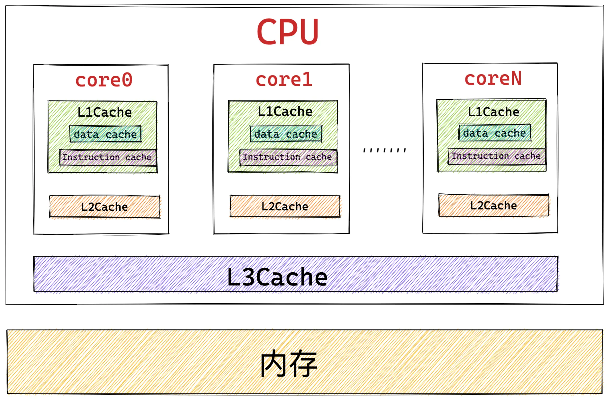

- 另一类则是动态 RAM ( `DRAM` )，这类 DRAM 用于常说的主存上，其特点的是访问速度慢（相对高速缓存），访问速度为 50 - 200 个时钟周期，但是容量大，造价便宜些（相对高速缓存）。

内存由一个一个的存储器模块（memory module）组成，它们插在主板的扩展槽上。常见的存储器模块通常以 64 位为单位（ 8 个字节）传输数据到存储控制器上或者从存储控制器传出数据。


如图所示内存条上黑色的元器件就是存储器模块（memory module）。多个存储器模块连接到存储控制器上，就聚合成了主存。


而 DRAM 芯片就包装在存储器模块中，每个存储器模块中包含 8 个 DRAM 芯片，依次编号为 0 - 7 。


而每一个 DRAM 芯片的存储结构是一个二维矩阵，二维矩阵中存储的元素称为超单元（supercell），每个 supercell 大小为一个字节（8 bit）。每个 supercell 都由一个坐标地址（i，j）。i 表示二维矩阵中的行地址，在计算机中行地址称为 RAS (row access strobe，行访问选通脉冲)。 j 表示二维矩阵中的列地址，在计算机中列地址称为 CAS (column access strobe，列访问选通脉冲)。下图中的 supercell 的 RAS = 2，CAS = 2。


DRAM 芯片中的信息通过引脚流入流出 DRAM 芯片。每个引脚携带 1 bit的信号。

图中 DRAM 芯片包含了两个地址引脚( `addr` )，因为要通过 RAS，CAS 来定位要获取的 supercell 。还有 8 个数据引脚（`data`），因为 DRAM 芯片的 IO 单位为一个字节（8 bit），所以需要 8 个 data 引脚从 DRAM 芯片传入传出数据。（注意这里只是为了解释地址引脚和数据引脚的概念，实际硬件中的引脚数量是不一定的。）

##### DRAM 芯片的访问


1. 首先存储控制器将行地址 RAS = 2 通过地址引脚发送给 DRAM 芯片。
2. DRAM 芯片根据 RAS = 2 将二维矩阵中的第二行的全部内容拷贝到内部行缓冲区中。
3. 接下来存储控制器会通过地址引脚发送 CAS = 2 到 DRAM 芯片中。
4. DRAM 芯片从内部行缓冲区中根据 CAS = 2 拷贝出第二列的 supercell 并通过数据引脚发送给存储控制器。

DRAM 芯片的 IO 单位为一个 supercell ，也就是一个字节(8 bit)。

##### CPU 如何读写主存


CPU 与内存之间的数据交互是通过总线（bus）完成的，而数据在总线上的传送是通过一系列的步骤完成的，这些步骤称为总线事务（bus transaction）。

其中数据从内存传送到 CPU 称之为读事务（read transaction），数据从 CPU 传送到内存称之为写事务（write transaction）。

总线上传输的信号包括：地址信号，数据信号，控制信号。其中控制总线上传输的控制信号可以同步事务，并能够标识出当前正在被执行的事务信息：

- 当前这个事务是到内存的？还是到磁盘的？或者是到其他 IO 设备的？
- 这个事务是读还是写？
- 总线上传输的地址信号（物理内存地址），还是数据信号（数据）？。

**总线上传输的地址均为物理内存地址**。比如：在 MESI 缓存一致性协议中当 CPU core0 修改字段 a 的值时，其他 CPU 核心会在总线上嗅探字段 a 的**物理内存地址**，如果嗅探到总线上出现字段 a 的**物理内存地址**，说明有人在修改字段 a，这样其他 CPU 核心就会失效字段 a 所在的 cache line 。

如上图所示，其中系统总线是连接 CPU 与 IO bridge 的，存储总线是来连接 IO bridge 和主存的。IO bridge 负责将系统总线上的电子信号转换成存储总线上的电子信号。IO bridge 也会将系统总线和存储总线连接到IO总线（磁盘等IO设备）上。这里 IO bridge 其实起的作用就是转换不同总线上的电子信号。

##### CPU 从内存读取数据过程

假设 CPU 现在需要将物理内存地址为 A 的内容加载到寄存器中进行运算。


首先 CPU 芯片中的总线接口会在总线上发起读事务（read transaction）。 该读事务分为以下步骤进行：

1. CPU 将物理内存地址 A 放到系统总线上。随后 IO bridge 将信号传递到存储总线上。
2. 主存感受到存储总线上的地址信号并通过存储控制器将存储总线上的物理内存地址 A 读取出来。
3. 存储控制器通过物理内存地址 A 定位到具体的存储器模块，从 DRAM 芯片中取出物理内存地址 A 对应的数据 X。
4. 存储控制器将读取到的数据 X 放到存储总线上，随后 IO bridge 将存储总线上的数据信号转换为系统总线上的数据信号，然后继续沿着系统总线传递。
5. CPU 芯片感受到系统总线上的数据信号，将数据从系统总线上读取出来并拷贝到寄存器中。

##### 根据物理内存地址从主存中读取数据

一个 supercell 存储了一个字节（ 8 bit ） 数据，从 DRAM0 到 DRAM7 依次读取到了 8 个 supercell 也就是 8 个字节，然后将这 8 个字节返回给存储控制器，由存储控制器将数据放到存储总线上。

CPU 总是以 word size 为单位从内存中读取数据，在 64 位处理器中的 word size 为 8 个字节。64 位的内存每次只能吞吐 8 个字节。CPU 每次会向内存读写一个 cache line 大小的数据（ 64 个字节），但是内存一次只能吞吐 8 个字节。

所以在物理内存地址对应的存储器模块中，DRAM0 芯片存储第一个低位字节（ supercell ），DRAM1 芯片存储第二个字节，......依次类推 DRAM7 芯片存储最后一个高位字节。


由于存储器模块中这种由 8 个 DRAM 芯片组成的物理存储结构的限制，内存读取数据只能是按照物理内存地址，8 个字节 8 个字节地顺序读取数据。所以说内存一次读取和写入的单位是 8 个字节。


而且所谓连续的物理内存地址实际上在物理上是不连续的。因为这连续的 8 个字节其实是存储于不同的 DRAM 芯片上的。每个 DRAM 芯片存储一个字节（supercell）

##### CPU 向内存写入数据过程

假设 CPU 要将寄存器中的数据 X 写到物理内存地址 A 中。同样的道理，CPU 芯片中的总线接口会向总线发起写事务（write transaction）。写事务步骤如下：

1. CPU 将要写入的物理内存地址 A 放入系统总线上。
2. 通过 IO bridge 的信号转换，将物理内存地址 A 传递到存储总线上。
3. 存储控制器感受到存储总线上的地址信号，将物理内存地址 A 从存储总线上读取出来，并等待数据的到达。
4. CPU 将寄存器中的数据拷贝到系统总线上，通过 IO bridge 的信号转换，将数据传递到存储总线上。
5. 存储控制器感受到存储总线上的数据信号，将数据从存储总线上读取出来。
6. 存储控制器通过内存地址 A 定位到具体的存储器模块，最后将数据写入存储器模块中的 8 个 DRAM 芯片中。

#### 物理内存模型

为了快速索引到具体的物理内存页，内核为每个物理页 `struct page` 结构体定义了一个索引编号：PFN（Page Frame Number）。PFN 与 `struct page` 是一一对应的关系。内核提供了两个宏来完成 PFN 与 物理页结构体 `struct page` 之间的相互转换。它们分别是 `page_to_pfn` 与 `pfn_to_page`。内核中如何组织管理这些物理内存页 `struct page` 的方式我们称之为做物理内存模型，不同的物理内存模型，应对的场景以及 `page_to_pfn` 与 `pfn_to_page` 的计算逻辑都是不一样的。

##### FLATMEM 平坦内存模型

先把物理内存想象成一片地址连续的存储空间，在这一大片地址连续的内存空间中，内核将这块内存空间分为一页一页的内存块 `struct page` 。由于这块物理内存是连续的，物理地址也是连续的，划分出来的这一页一页的物理页必然也是连续的，并且每页的大小都是固定的，所以很容易想到用一个数组来组织这些连续的物理内存页 `struct page` 结构，其在数组中对应的下标即为 PFN 。这种内存模型就叫做平坦内存模型 FLATMEM 。


内核中使用了一个 `mem_map` 的全局数组用来组织所有划分出来的物理内存页。`mem_map` 全局数组的下标就是相应物理页对应的 PFN 。在平坦内存模型下 ，`page_to_pfn` 与 `pfn_to_page` 的计算逻辑就非常简单，本质就是基于 `mem_map` 数组进行偏移操作。

```c
#if defined(CONFIG_FLATMEM)
#define __pfn_to_page(pfn) (mem_map + ((pfn)-ARCH_PFN_OFFSET)) /* ARCH_PFN_OFFSET 是 PFN 的起始偏移量。 */
#define __page_to_pfn(page) ((unsigned long)((page)-mem_map) + ARCH_PFN_OFFSET)
#endif
```

FLATMEM 平坦内存模型只适合管理一整块连续的物理内存，而对于多块非连续的物理内存来说使用 FLATMEM 平坦内存模型进行管理则会造成很大的内存空间浪费。因为底层数据结构是 `mem_map` 数组，数组的特性又要求这些物理页是连续的，所以只能为这些内存地址空洞也分配 `struct page` 结构用来填充数组使其连续。而每个 `struct page` 结构大部分情况下需要占用 40 字节（`struct page` 结构在不同场景下内存占用会有所不同），如果物理内存中存在的大块的地址空洞，那么为这些空洞而分配的 `struct page` 将会占用大量的内存空间，导致巨大的浪费。


##### DISCONTIGMEM 非连续内存模型

为了组织和管理不连续的物理内存，内核引入了 DISCONTIGMEM 非连续内存模型，用来消除这些不连续的内存地址空洞对 mem_map 的空间浪费。在 DISCONTIGMEM 非连续内存模型中，内核将物理内存从宏观上划分成了一个一个的节点 node （微观上还是一页一页的物理页），每个 node 节点管理一块连续的物理内存。这样一来这些连续的物理内存页均被划归到了对应的 node 节点中管理，就避免了内存空洞造成的空间浪费。


内核中使用 `struct pglist_data` 表示用于管理连续物理内存的 node 节点（内核假设 node 中的物理内存是连续的），既然每个 node 节点中的物理内存是连续的，于是在每个 node 节点中还是采用 FLATMEM 平坦内存模型的方式来组织管理物理内存页。每个 node 节点中包含一个  `struct page *node_mem_map` 数组，用来组织管理 node 中的连续物理内存页。

```c
typedef struct pglist_data {
   #ifdef CONFIG_FLATMEM
   struct page *node_mem_map;
   #endif
}
```

可以看出 DISCONTIGMEM 非连续内存模型其实就是 FLATMEM 平坦内存模型的一种扩展，在面对大块不连续的物理内存管理时，通过将每段连续的物理内存区间划归到 node 节点中进行管理，避免了为内存地址空洞分配 `struct page` 结构，从而节省了内存资源的开销。

由于引入了 node 节点这个概念，所以在 DISCONTIGMEM 非连续内存模型下 `page_to_pfn` 与 `pfn_to_page` 的计算逻辑就比 FLATMEM 内存模型下的计算逻辑多了一步定位 page 所在 node 的操作。

- 通过 `arch_pfn_to_nid` 可以根据物理页的 PFN 定位到物理页所在 node。
- 通过 `page_to_nid` 可以根据物理页结构 `struct page` 定义到 page 所在 node。

当定位到物理页 `struct page` 所在 node 之后，剩下的逻辑就和 FLATMEM 内存模型一模一样了。

```c
#if defined(CONFIG_DISCONTIGMEM)

#define __pfn_to_page(pfn)   \
({ unsigned long __pfn = (pfn);  \
 unsigned long __nid = arch_pfn_to_nid(__pfn);  \
 NODE_DATA(__nid)->node_mem_map + arch_local_page_offset(__pfn, __nid);\
})

#define __page_to_pfn(pg)      \
({ const struct page *__pg = (pg);     \
 struct pglist_data *__pgdat = NODE_DATA(page_to_nid(__pg)); \
 (unsigned long)(__pg - __pgdat->node_mem_map) +   \
  __pgdat->node_start_pfn;     \
})
```

##### SPARSEMEM 稀疏内存模型

随着内存技术的发展，内核可以支持物理内存的热插拔了，这样一来物理内存的不连续就变为常态。在 DISCONTIGMEM 内存模型中，其实每个 node 中的物理内存也不一定都是连续的。


而且每个 node 中都有一套完整的内存管理系统，如果 node 数目多的话，那这个开销就大了，于是就有了对连续物理内存更细粒度的管理需求，为了能够更灵活地管理粒度更小的连续物理内存，SPARSEMEM 稀疏内存模型就此登场了。SPARSEMEM 稀疏内存模型的核心思想就是对粒度更小的连续内存块进行精细的管理，用于管理连续内存块的单元被称作 section 。物理页大小为 4k 的情况下， section 的大小为 128M ，物理页大小为 16k 的情况下， section 的大小为 512M。在内核中用 `struct mem_section` 结构体表示 SPARSEMEM 模型中的 section。

```c
struct mem_section {
	unsigned long section_mem_map;
        ...
}
```

由于 section 被用作管理小粒度的连续内存块，这些小的连续物理内存在 section 中也是通过数组的方式被组织管理，每个 `struct mem_section` 结构体中有一个 `section_mem_map` 指针用于指向 section 中管理连续内存的 page 数组。SPARSEMEM 内存模型中的这些所有的 `mem_section` 会被存放在一个全局的数组中，并且每个 `mem_section` 都可以在系统运行时改变 offline / online （下线 / 上线）状态，以便支持内存的热插拔（hotplug）功能。

```c
#ifdef CONFIG_SPARSEMEM_EXTREME
extern struct mem_section *mem_section[NR_SECTION_ROOTS];
...
#endif
```


在 SPARSEMEM 稀疏内存模型下 `page_to_pfn` 与 `pfn_to_page` 的计算逻辑又发生了变化。

- 在 `page_to_pfn` 的转换中，首先需要通过 `page_to_section` 根据 `struct page` 结构定位到 `mem_section` 数组中具体的 section 结构。然后在通过 `section_mem_map` 定位到具体的 PFN。

  在 `struct page` 结构中有一个 `unsigned long flags` 属性，在 flag 的高位 bit 中存储着 page 所在 `mem_section` 数组中的索引，从而可以定位到所属 section。

- 在 `pfn_to_page` 的转换中，首先需要通过 `__pfn_to_section` 根据 PFN 定位到 `mem_section` 数组中具体的 section 结构。然后在通过 PFN 在 `section_mem_map` 数组中定位到具体的物理页 Page 。

  PFN  的高位 bit 存储的是全局数组 `mem_section` 中的 section 索引，PFN 的低位 bit 存储的是 `section_mem_map` 数组中具体物理页 page 的索引。

```c
#if defined(CONFIG_SPARSEMEM)
/*
 * Note: section's mem_map is encoded to reflect its start_pfn.
 * section[i].section_mem_map == mem_map's address - start_pfn;
 */
#define __page_to_pfn(pg)     \
({ const struct page *__pg = (pg);    \
 int __sec = page_to_section(__pg);   \
 (unsigned long)(__pg - __section_mem_map_addr(__nr_to_section(__sec))); \
})

#define __pfn_to_page(pfn)    \
({ unsigned long __pfn = (pfn);   \
 struct mem_section *__sec = __pfn_to_section(__pfn); \
 __section_mem_map_addr(__sec) + __pfn;  \
})
#endif
```

SPARSEMEM 稀疏内存模型已经完全覆盖了前两个内存模型的所有功能，因此稀疏内存模型可被用于所有内存布局的情况。

##### 物理内存热插拔

在大规模的集群中，尤其是现在处于云原生的时代，为了实现集群资源的动态均衡，可以通过物理内存热插拔的功能实现集群机器物理内存容量的动态增减。集群的规模一大，那么物理内存出故障的几率也会大大增加，物理内存的热插拔对提供集群高可用性也是至关重要的。

从总体上来讲，内存的热插拔分为两个阶段：

- 物理热插拔阶段：这个阶段主要是从物理上将内存硬件插入（hot-add），拔出（hot-remove）主板的过程，其中涉及到硬件和内核的支持。
- 逻辑热插拔阶段：这一阶段主要是由内核中的内存管理子系统来负责，涉及到的主要工作为：如何动态的上线启用（online）刚刚 hot-add 的内存，如何动态下线（offline）刚刚 hot-remove 的内存。

物理内存拔出的过程需要关注的事情比插入的过程要多的多，实现起来也更加的困难。因为即将要被拔出的物理内存中可能已经为进程分配了物理页，如何妥善安置这些已经被分配的物理页是一个棘手的问题。在 SPARSEMEM 内存模型中，每个 `mem_section` 都可以在系统运行时改变 offline ，online 状态，以便支持内存的热插拔（hotplug）功能。 当 `mem_section` offline 时, 内核会把这部分内存隔离开, 使得该部分内存不可再被使用, 然后再把 `mem_section` 中已经分配的内存页迁移到其他 `mem_section` 的内存上。


但是这里会有一个问题，就是并非所有的物理页都可以迁移，因为迁移意味着物理内存地址的变化，而内存的热插拔应该对进程来说是透明的，所以这些迁移后的物理页映射的虚拟内存地址是不能变化的。这一点在进程的用户空间是没有问题的，因为进程在用户空间访问内存都是根据虚拟内存地址通过页表找到对应的物理内存地址，这些迁移之后的物理页，虽然物理内存地址发生变化，但是内核通过修改相应页表中虚拟内存地址与物理内存地址之间的映射关系，可以保证虚拟内存地址不会改变。

但是在内核态的虚拟地址空间中，有一段直接映射区，在这段虚拟内存区域中虚拟地址与物理地址是直接映射的关系，虚拟内存地址直接减去一个固定的偏移量（32位为0xC000 0000） 就得到了物理内存地址。直接映射区中的物理页的虚拟地址会随着物理内存地址变动而变动，因此这部分物理页是无法轻易迁移的，然而不可迁移的页会导致内存无法被拔除，因为无法妥善安置被拔出内存中已经为进程分配的物理页。

既然是这些不可迁移的物理页导致内存无法拔出，那么可以把内存分一下类，将内存按照物理页是否可迁移，划分为不可迁移页，可回收页，可迁移页。内核会根据分类，在可能会被拔出的内存中只分配那些可迁移的内存页，这些信息会在内存初始化的时候被设置，这样一来那些不可迁移的页就不会包含在可能会拔出的内存中。当需要将这块内存热拔出时，因为里边的内存页全部是可迁移的，从而使内存可以被拔除。

#### **物理内存架构**

##### 一致性内存访问 UMA 架构

在 UMA 架构下，多核服务器中的多个 CPU 位于总线的一侧，所有的内存条组成一大片内存位于总线的另一侧，所有的 CPU 访问内存都要过总线，而且距离都是一样的，由于所有 CPU 对内存的访问距离都是一样的，所以在 UMA 架构下所有 CPU 访问内存的速度都是一样的。这种访问模式称为 SMP（Symmetric multiprocessing），即对称多处理器。这里的一致性是指同一个 CPU 对所有内存的访问的速度是一样的。即一致性内存访问 UMA（Uniform Memory Access）。

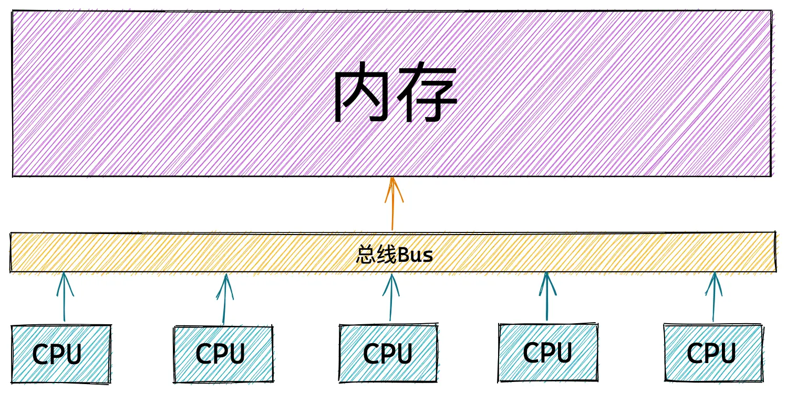

但是随着多核技术的发展，服务器上的 CPU 个数会越来越多，而 UMA 架构下所有 CPU 都是需要通过总线来访问内存的，这样总线很快就会成为性能瓶颈，主要体现在以下两个方面：

1. 总线的带宽压力会越来越大，随着 CPU 个数的增多导致每个 CPU 可用带宽会减少
2. 总线的长度也会因此而增加，进而增加访问延迟

UMA 架构的优点很明显就是结构简单，所有的 CPU 访问内存速度都是一致的，都必须经过总线。可以考虑扩宽总线，然而成本十分高昂，未来可能仍然面临带宽压力。为了解决以上问题，提高 CPU 访问内存的性能和扩展性，于是引入了一种新的架构：非一致性内存访问 NUMA（Non-uniform memory access）。

##### 非一致性内存访问 NUMA 架构

在 NUMA 架构下，内存就不是一整片的了，而是被划分成了一个一个的内存节点 （NUMA 节点），每个 CPU 都有属于自己的本地内存节点，CPU 访问自己的本地内存不需要经过总线，因此访问速度是最快的。当 CPU 自己的本地内存不足时，CPU 就需要跨节点去访问其他内存节点，这种情况下 CPU 访问内存就会慢很多。这就导致了 CPU 访问内存的速度不一致，所以叫做非一致性内存访问架构。


如上图所示，CPU 和它的本地内存组成了 NUMA 节点，CPU 与 CPU 之间通过 QPI（Intel QuickPath Interconnect）点对点完成互联，在 CPU  的本地内存不足的情况下，CPU 需要通过 QPI 访问远程 NUMA 节点上的内存控制器从而在远程内存节点上分配内存，这就导致了远程访问比本地访问多了额外的延迟开销（需要通过 QPI 遍历远程 NUMA 节点）。在 NUMA 架构下，只有 DISCONTIGMEM 非连续内存模型和 SPARSEMEM 稀疏内存模型是可用的。而 UMA 架构下，前面介绍的三种内存模型都可以配置使用。

#####  NUMA 的内存分配策略

|   内存分配策略    |                           策略描述                           |
| :---------------: | :----------------------------------------------------------: |
|     MPOL_BIND     |   必须在绑定的节点进行内存分配，如果内存不足，则进行 swap    |
|  MPOL_INTERLEAVE  |              本地节点和远程节点均可允许分配内存              |
|  MPOL_PREFERRED   | 优先在指定节点分配内存，当指定节点内存不足时，选择离指定节点最近的节点分配内存 |
| MPOL_LOCAL (默认) | 优先在本地节点分配，当本地节点内存不足时，可以在远程节点分配内存 |

```c
#include <numaif.h>

/* mode : 指定 NUMA 内存分配策略。
 * nodemask：指定 NUMA 节点 Id。
 * maxnode：指定最大 NUMA 节点 Id，用于遍历远程节点，实现跨 NUMA 节点分配内存。
 */
long set_mempolicy(int mode, const unsigned long *nodemask, unsigned long maxnode);
```

##### NUMA 的使用简介

```c
available: 4 nodes (0-3)
node 0 cpus: 0 1 2 3 4 5 6 7 8 9 10 11 12 13 14 15 
node 0 size: 64794 MB
node 0 free: 55404 MB

node 1 cpus: 16 17 18 19 20 21 22 23 24 25 26 27 28 29 30 31
node 1 size: 65404 MB
node 1 free: 58642 MB

node 2 cpus: 32 33 34 35 36 37 38 39 40 41 42 43 44 45 46 47
node 2 size: 65404 MB
node 2 free: 61181 MB

node 3 cpus:  48 49 50 51 52 53 54 55 56 57 58 59 60 61 62 63
node 3 size: 65402 MB
node 3 free: 55592 MB

node distances:
node   0   1   2   3
  0:  10  16  32  33
  1:  16  10  25  32
  2:  32  25  10  16
  3:  33  32  16  10
```

`numactl -H` 命令可以查看服务器的 NUMA 配置，上图中的服务器配置共包含 4 个 NUMA 节点（0 - 3），每个 NUMA 节点中包含 16个 CPU 核心，本地内存大小约为 64G。`node distances` 给出了不同 NUMA 节点之间的访问距离，对角线上的值均为本地节点的访问距离 10 。比如 [0,0] 表示 NUMA 节点 0 的本地内存访问距离。可以明显看到当出现跨 NUMA 节点访问的时候，访问距离就会明显增加，比如节点 0 访问节点 1 的距离 [0,1] 是16，节点 0 访问节点 3 的距离 [0,3] 是 33。距离越远，跨 NUMA 节点内存访问的延时越大。应用程序运行时应减少跨 NUMA 节点访问内存。

```c
/* 通过 numactl -s 可以查看 NUMA 的内存分配策略设置 */
policy: default
preferred node: current
    
/* 通过 numastat 可以查看各个 NUMA 节点的内存访问命中率 */
                           node0           node1            node2           node3
numa_hit              1296554257       918018444       1296574252       828018454
numa_miss                8541758        40297198          7544751        41267108
numa_foreign            40288595         8550361         41488585         8450375
interleave_hit             45651           45918            46654           49718
local_node            1231897031       835344122       1141898045       915354158
other_node              64657226        82674322        594657725        82675425 
```

- numa_hit ：内存分配在该节点中成功的次数。
- numa_miss : 内存分配在该节点中失败的次数。
- numa_foreign：表示其他 NUMA 节点本地内存分配失败，跨节点（numa_miss）来到本节点分配内存的次数。
- interleave_hit : 在 MPOL_INTERLEAVE 策略下，在本地节点分配内存的次数。
- local_node：进程在本地节点分配内存成功的次数。
- other_node：运行在本节点的进程跨节点在其他节点上分配内存的次数。

##### 绑定 NUMA 节点

```c
numactl --membind=nodes  --cpunodebind=nodes  command
```

- 通过 `--membind` 可以指定应用程序只能在哪些具体的 NUMA 节点上分配内存，如果这些节点内存不足，则分配失败。
- 通过 `--cpunodebind` 可以指定应用程序只能运行在哪些 NUMA 节点上。

```c
numactl --physcpubind=cpus  command
```

可以通过 `--physcpubind` 将应用程序绑定到具体的物理 CPU 上。这个选项后边指定的参数可以通过 `cat /proc/cpuinfo` 输出信息中的 processor 这一栏查看。例如：通过 `numactl --physcpubind= 0-15 ./numatest.out` 命令将进程 numatest 绑定到 0~15 CPU 上执行。

##### **管理 NUMA 节点**

内核使用了一个大小为 `MAX_NUMNODES` ，类型为 `struct pglist_data` 的全局数组 `node_data[]` 来管理所有的 NUMA 节点。


```c
/* /arch/arm64/include/asm/mmzone.h */
#ifdef CONFIG_NUMA
extern struct pglist_data *node_data[];
#define NODE_DATA(nid)  (node_data[(nid)])

/* /include/linux/numa.h */
#ifdef CONFIG_NODES_SHIFT
#define NODES_SHIFT     CONFIG_NODES_SHIFT
#else
#define NODES_SHIFT     0 // UMA  架构下 NODES_SHIFT 为 0 ，内核中只用一个 NUMA 节点来管理所有物理内存。
#endif
#define MAX_NUMNODES    (1 << NODES_SHIFT)

/* /include/linux/mmzone.h */
typedef struct pglist_data {
    // NUMA 节点id，可以通过 numactl -H 命令的输出结果查看节点 id。从 0 开始依次对 NUMA 节点进行编号。
    int node_id;
    // 指向 NUMA 节点内管理所有物理页 page 的数组
    struct page *node_mem_map;
    // NUMA 节点内第一个物理页的 pfn，系统中所有 NUMA 节点中的物理页都是依次编号的，每个物理页的 PFN 都是全局唯一的（不只是其所在 NUMA 节点内唯一）
    unsigned long node_start_pfn;
    // NUMA 节点内所有可用的物理页个数（不包含内存空洞）
    unsigned long node_present_pages;
    // NUMA 节点内所有的物理页个数（包含内存空洞）
    unsigned long node_spanned_pages; 
    // 保证多进程可以并发安全的访问 NUMA 节点
    spinlock_t node_size_lock;
    .............
}
```


##### NUMA  节点物理内存区域的划分

```c
/* /include/linux/mmzone.h */
enum zone_type {
#ifdef CONFIG_ZONE_DMA
 /* 用于那些无法对全部物理内存进行寻址的硬件设备，进行 DMA 时的内存分配。例如 ISA 设备只能对物理内存的前 16M 进行寻址。
  * 该区域的长度依赖于具体的处理器类型。
  */
 ZONE_DMA,
#endif
#ifdef CONFIG_ZONE_DMA32
 /* 与 ZONE_DMA 区域类似，该区域内的物理页面可用于执行 DMA 操作，不同之处在于该区域是提供给 32 位设备（只能寻址 4G 物理内存）执行 DMA 操作时使用的。
  * 该区域只在 64 位系统中起作用，因为只有在 64 位系统中才会专门为 32 位设备提供专门的 DMA 区域。 
  */
 ZONE_DMA32,
#endif
 /* 这个区域的物理页都可以直接映射到内核中的虚拟内存，由于是线性映射，内核可以直接进行访问。 */
 ZONE_NORMAL,
#ifdef CONFIG_HIGHMEM
 /* 这个区域包含的物理页就是高端内存，内核不能直接访问这些物理页，这些物理页需要动态映射进内核虚拟内存空间中（非线性映射）。
  * 该区域只在 32 位系统中才会存在，因为 64 位系统中的内核虚拟内存空间太大了（128T），都可以进行直接映射。
  */
 ZONE_HIGHMEM,
#endif
 /* 是内核定义的一个虚拟内存区域，该区域中的物理页可以来自于上面的四种真实的物理区域。
  * 该区域中的页全部都是可以迁移的，主要是为了防止内存碎片和支持内存的热插拔。
  */
 ZONE_MOVABLE,
#ifdef CONFIG_ZONE_DEVICE
 /* 是为支持热插拔设备而分配的非易失性内存（ Non Volatile Memory ），也可用于内核崩溃时保存相关的调试信息。 */
 ZONE_DEVICE,
#endif
    // 充当结束标记, 在内核中想要迭代系统中所有内存域时, 会用到该常量
 __MAX_NR_ZONES

};

typedef struct pglist_data {
    // NUMA 节点中的物理内存区域个数。不是每个 NUMA 节点都会包含所有物理内存区域，NUMA 节点之间所包含的物理内存区域个数是不一样的。
 	int nr_zones; 
  	// NUMA 节点中的物理内存区域
	struct zone node_zones[MAX_NR_ZONES];
  	/* NUMA 节点的备用列表。它包含了备用 NUMA 节点和这些备用节点中的物理内存区域。备用节点是按照访问距离的远近，依次排列在 node_zonelists 数组中，
     * 数组第一个备用节点是访问距离最近的，这样当本节点内存不足时，可以从备用 NUMA 节点中分配内存。
     */
 	struct zonelist node_zonelists[MAX_ZONELISTS];
} pg_data_t;
```

事实上只有第一个 NUMA 节点可以包含所有的物理内存区域，其它的节点并不能包含所有的区域类型，因为有些内存区域比如：ZONE_DMA，ZONE_DMA32 必须从物理内存的起点开始。这些在物理内存开始的区域可能已经被划分到第一个 NUMA 节点了，后面的物理内存才会被依次划分给接下来的 NUMA 节点。因此后面的 NUMA 节点并不会包含 ZONE_DMA，ZONE_DMA32 区域。ZONE_NORMAL、ZONE_HIGHMEM 和 ZONE_MOVABLE 是可以出现在所有 NUMA 节点上的。


##### NUMA 节点中的内存规整与回收

内核会为每个 NUMA 节点分配一个 kswapd 进程用于回收不经常使用的页面，还会为每个 NUMA 节点分配一个 kcompactd 进程用于内存的规整避免内存碎片。

```c
typedef struct pglist_data {
    .........
    // 页面回收进程
    struct task_struct *kswapd;
    // kswapd 进程周期性回收页面时使用到的等待队列
    wait_queue_head_t kswapd_wait;
    // 内存规整进程
    struct task_struct *kcompactd;
    // kcompactd 进程周期性规整内存时使用到的等待队列
    wait_queue_head_t kcompactd_wait;
	..........
} pg_data_t;
```


如上图所示，假如现在系统一共有 16 个物理内存页，当前系统只是分配了 3 个物理页，那么在当前系统中还剩余 13 个物理内存页的情况下，如果内核想要分配 8 个连续的物理页的话，就会由于内存碎片的存在导致分配失败。只能分配最多 4 个连续的物理页，内核中请求分配的物理页面数只能是 2 的次幂。如果这些物理页处于 ZONE_MOVABLE 区域，它们就可以被迁移，内核可以通过迁移页面来避免内存碎片的问题：


内核通过迁移页面来规整内存，这样就可以避免内存碎片，从而得到一大片连续的物理内存，以满足内核对大块连续内存分配的请求。**所以这就是内核需要根据物理页面是否能够迁移的特性，而划分出 ZONE_MOVABLE 区域的目的**。

##### NUMA 节点的状态 node_states

如果系统中的 NUMA 节点多于一个，内核会维护一个位图 node_states，用于维护各个 NUMA 节点的状态信息。如果系统中只有一个 NUMA  节点，则没有节点位图。

```c
/* /include/linux/nodemask.h */
typedef struct { DECLARE_BITMAP(bits, MAX_NUMNODES); } nodemask_t;
extern nodemask_t node_states[NR_NODE_STATES];

/* 节点状态掩码 */
enum node_states {
	N_POSSIBLE,  /* The node could become online at some point */
	N_ONLINE,  /* The node is online */
	N_NORMAL_MEMORY, /* The node has regular memory(regular means ZONE_NORMAL) */
#ifdef CONFIG_HIGHMEM
	N_HIGH_MEMORY,  /* The node has regular or high memory */
#else
	N_HIGH_MEMORY = N_NORMAL_MEMORY,
#endif
#ifdef CONFIG_MOVABLE_NODE
	N_MEMORY,  /* The node has memory(regular, high, movable) */
#else
	N_MEMORY = N_HIGH_MEMORY,
#endif
	N_CPU,  /* The node has one or more cpus */
	NR_NODE_STATES
};

/* 用于设置或者清除指定节点的特定状态 */
static inline void node_set_state(int node, enum node_states state);
static inline void node_clear_state(int node, enum node_states state);
```

可以通过 `cat /proc/zoneinfo | grep Node` 命令来查看 NUMA 节点中内存区域的分布情况（服务器是 64 位，所以不包含 ZONE_HIGHMEM 区域）


通过 `cat /proc/zoneinfo` 命令来查看系统中各个 NUMA 节点中的各个内存区域的内存使用情况


内核中用于描述和管理 NUMA 节点中的物理内存区域的结构体是 `struct zone`，上图中显示的 ZONE_NORMAL 区域中，物理内存使用统计的相关数据均来自于 struct zone 结构体

```c
struct zone {
    // 防止并发访问该内存区域
    spinlock_t      lock;
    // 内存区域名称：Normal，DMA，HighMem
    const char      *name;
    // 指向该内存区域所属的 NUMA 节点
    struct pglist_data  *zone_pgdat;
    // 属于该内存区域中的第一个物理页 PFN
    unsigned long       zone_start_pfn;
    // 该内存区域中所有的物理页个数（包含内存空洞）spanned_pages = zone_end_pfn - zone_start_pfn
    unsigned long       spanned_pages;
    // 该内存区域所有可用的物理页个数（不包含内存空洞）present_pages = spanned_pages - absent_pages(pages in holes)
    unsigned long       present_pages;
    // 被伙伴系统所管理的物理页数
    atomic_long_t       managed_pages;
    // 伙伴系统的核心数据结构
    struct free_area    free_area[MAX_ORDER];
    // 该内存区域内存使用的统计信息，cat /proc/zoneinfo 的来源
    atomic_long_t       vm_stat[NR_VM_ZONE_STAT_ITEMS];
} ____cacheline_internodealigned_in_smp;
```


物理内存在内核中管理的层级关系为：`Node -> Zone -> page`


##### 物理内存区域中的预留内存

内核中关于内存分配的场景无外乎有两种方式：

1. 当进程请求内核分配内存时，如果此时内存比较充裕，那么进程的请求会被立刻满足；如果此时内存已经比较紧张，内核就需要将一部分不经常使用的内存进行回收，从而腾出一部分内存满足进程的内存分配的请求，在这个回收内存的过程中，进程会一直阻塞等待。
2. 另一种内存分配场景，进程是不允许阻塞的，内存分配的请求必须马上得到满足，比如执行中断处理程序或者执行持有自旋锁等临界区内的代码时，进程就不允许睡眠，因为中断程序无法被重新调度。这时就需要内核提前为这些核心操作预留一部分内存，当内存紧张时，可以使用这部分预留的内存给这些操作分配。

```c
struct zone {
    ......
    /* 该内存区域内预留内存的大小，范围为 128 到 65536 KB 之间。 */
    unsigned long nr_reserved_highatomic;
    /* 规定每个内存区域必须为自己保留的物理页数量，防止更高位的内存区域对自己的内存空间进行过多的侵占挤压。 */
    long lowmem_reserve[MAX_NR_ZONES];
	......
}
```

根据物理内存地址的高低，低位内存区域到高位内存区域的顺序依次是：ZONE_DMA，ZONE_DMA32，ZONE_NORMAL，ZONE_HIGHMEM。用于常规用途的物理内存则可以从多个物理内存区域中进行分配，当 ZONE_HIGHMEM 区域中的内存不足时，内核可以从 ZONE_NORMAL 进行内存分配，ZONE_NORMAL 区域内存不足时可以进一步降级到 ZONE_DMA 区域进行分配。

而低位内存区域中的内存总是宝贵的，内核肯定希望这些用于常规用途的物理内存从常规内存区域中进行分配，这样能够节省 ZONE_DMA 区域中的物理内存保证 DMA 操作的内存使用需求，但是如果内存很紧张了，高位内存区域中的物理内存不够用了，那么内核就会去占用挤压其他内存区域中的物理内存从而满足内存分配的需求。但是内核又不会允许高位内存区域对低位内存区域的无限制挤压占用，因为毕竟低位内存区域有它特定的用途，所以每个内存区域会给自己预留一定的内存，防止被高位内存区域挤压占用。而每个内存区域为自己预留的这部分内存就存储在 `lowmem_reserve` 数组中。

每个内存区域是按照一定的比例来计算自己的预留内存的，这个比例可以通过 `cat /proc/sys/vm/lowmem_reserve_ratio` 命令查看。从左到右分别代表了 ZONE_DMA，ZONE_DMA32，ZONE_NORMAL，ZONE_MOVABLE，ZONE_DEVICE 物理内存区域的预留内存比例。（服务器是 64 位，所以没有 ZONE_HIGHMEM 区域）


以 ZONE_DMA，ZONE_NORMAL，ZONE_HIGHMEM 这三个物理内存区域举例，它们的 lowmem_reserve_ratio 分别为 256，32，0。它们的大小分别是：8M，64M，256M，按照每页大小 4K 计算它们区域里包含的物理页个数分别为：2048, 16384, 65536。

|              | lowmem_reserve_ratio | 内存区域大小 | 物理内存页个数 |
| :----------: | :------------------: | :----------: | -------------- |
|   ZONE_DMA   |         256          |      8M      | 2048           |
| ZONE_NORMAL  |          32          |     64M      | 16384          |
| ZONE_HIGHMEM |          0           |     256M     | 65536          |

- ZONE_DMA 为防止被 ZONE_NORMAL 挤压侵占而为自己预留的物理内存页为：`16384 / 256 = 64`。
- ZONE_DMA 为防止被 ZONE_HIGHMEM 挤压侵占而为自己预留的物理内存页为：`(65536 + 16384) / 256 = 320`。
- ZONE_NORMAL 为防止被 ZONE_HIGHMEM 挤压侵占而为自己预留的物理内存页为：`65536 / 32 = 2048`。

各个内存区域为防止被高位内存区域过度挤压占用，而为自己预留的内存大小，可以通过前边 `cat /proc/zoneinfo` 命令来查看，输出信息的 `protection：`则表示各个内存区域预留内存大小。

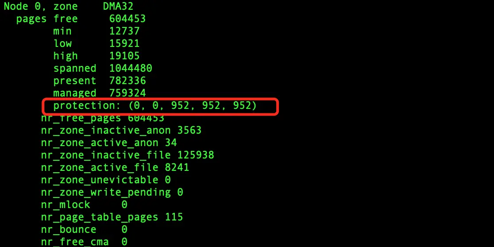

此外还可以通过 `sysctl `对内核参数 `lowmem_reserve_ratio` 进行动态调整，这样内核会根据新的 `lowmem_reserve_ratio` 动态重新计算各个内存区域的预留内存大小。物理内存区域内被伙伴系统所管理的物理页数量 `managed_pages` 的计算方式就通过 `present_pages` 减去这些预留的物理内存页 `reserved_pages` 得到的。

##### 物理内存区域中的水位线

内存资源是系统中最宝贵的系统资源，是有限的。当内存资源紧张的时候，系统的应对方法无非就是三种：

1. 产生 OOM，内核直接将系统中占用大量内存的进程，将 OOM 优先级最高的进程干掉，释放出这个进程占用的内存供其他更需要的进程分配使用。
2. 内存回收，将不经常使用到的内存回收，腾挪出来的内存供更需要的进程分配使用。
3. 内存规整，将可迁移的物理页面进行迁移规整，消除内存碎片。从而获得更大的一片连续物理内存空间供进程分配。

内存回收的单位也是按页来的。在内核中，物理内存页有两种类型，针对这两种类型的物理内存页，内核会有不同的回收机制。

第一种就是文件页，所谓文件页就是其物理内存页中的数据来自于磁盘中的文件，当进行文件读取的时候，内核会根据局部性原理将读取的磁盘数据缓存在 page cache 中，page cache 里存放的就是文件页。当进程再次读取读文件页中的数据时，内核直接会从 page cache 中获取并拷贝给进程，省去了读取磁盘的开销。对于文件页的回收通常会比较简单，因为文件页中的数据来自于磁盘，所以当回收文件页的时候直接回收就可以了，当进程再次读取文件页时，大不了再从磁盘中重新读取就是了。但是当进程已经对文件页进行修改过但还没来得及同步回磁盘，此时文件页就是脏页，不能直接进行回收，需要先将脏页回写到磁盘中才能进行回收。可以在进程中通过  `fsync()`  系统调用将指定文件的所有脏页同步回写到磁盘，同时内核也会根据一定的条件唤醒专门用于回写脏页的 `pflush` 内核线程。

另外一种物理页类型是匿名页，所谓匿名页就是它背后并没有一个磁盘中的文件作为数据来源，匿名页中的数据都是通过进程运行过程中产生的，比如应用程序中动态分配的堆内存。当内存资源紧张需要对不经常使用的那些匿名页进行回收时，因为匿名页的背后没有一个磁盘中的文件做依托，所以匿名页不能像文件页那样直接回收，无论匿名页是不是脏页，都需要先将匿名页中的数据先保存在磁盘空间中，然后在对匿名页进行回收。并把释放出来的这部分内存分配给更需要的进程使用，当进程再次访问这块内存时，在重新把之前匿名页中的数据从磁盘空间中读取到内存就可以了，而这块磁盘空间可以是单独的一片磁盘分区（Swap 分区）或者是一个特殊的文件（Swap 文件）。匿名页的回收机制就是 Swap 机制。所谓的页面换出就是在 Swap 机制下，当内存资源紧张时，内核就会把不经常使用的这些匿名页中的数据写入到 Swap 分区或者 Swap 文件中。从而释放这些数据所占用的内存空间。所谓的页面换入就是当进程再次访问那些被换出的数据时，内核会重新将这些数据从 Swap 分区或者 Swap 文件中读取到内存中来。

Linux 提供了一个 swappiness 的内核选项，可以通过 `cat /proc/sys/vm/swappiness` 命令查看，swappiness 选项的取值范围为 0 到 100，默认为 60。swappiness 用于表示 Swap 机制的积极程度，数值越大，Swap 的积极程度越高，内核越倾向于回收匿名页。数值越小，Swap 的积极程度越低。内核就越倾向于回收文件页。swappiness 只是表示 Swap 积极的程度，当内存非常紧张的时候，即使将 swappiness 设置为 0 ，也还是会发生 Swap 的。

```c
/* 内核会为每个 NUMA 节点中的每个物理内存区域定制三条用于指示内存容量的水位线，
 * 分别是：WMARK_MIN（页最小阈值）， WMARK_LOW （页低阈值），WMARK_HIGH（页高阈值）。 
 * /include/linux/mmzone.h
 */
enum zone_watermarks {
	WMARK_MIN,
	WMARK_LOW,
	WMARK_HIGH,
	NR_WMARK
};

#define min_wmark_pages(z) (z->_watermark[WMARK_MIN] + z->watermark_boost)
#define low_wmark_pages(z) (z->_watermark[WMARK_LOW] + z->watermark_boost)
#define high_wmark_pages(z) (z->_watermark[WMARK_HIGH] + z->watermark_boost)

struct zone {
    // 物理内存区域中的水位线
    unsigned long _watermark[NR_WMARK];
    // 优化内存碎片对内存分配的影响，可以动态改变内存区域的基准水位线。
    unsigned long watermark_boost;
} ____cacheline_internodealigned_in_smp;
```


- 当该物理内存区域的剩余内存容量高于 `_watermark[WMARK_HIGH]` 时，说明此时该物理内存区域中的内存容量非常充足，内存分配完全没有压力。
- 当剩余内存容量在 `_watermark[WMARK_LOW]` 与 `_watermark[WMARK_HIGH]` 之间时，说明此时内存有一定的消耗但是还可以接受，能够继续满足进程的内存分配需求。
- 当剩余内容容量在 `_watermark[WMARK_MIN]` 与 `_watermark[WMARK_LOW]`  之间时，说明此时内存容量已经有点危险了，内存分配面临一定的压力，但是还可以满足进程的内存分配要求，当给进程分配完内存之后，就会唤醒 kswapd 进程开始内存回收，直到剩余内存高于 `_watermark[WMARK_HIGH]` 为止。在这种情况下，进程的内存分配会触发内存回收，但请求进程本身不会被阻塞，由内核的 kswapd 进程异步回收内存。
- 当剩余内容容量低于 `_watermark[WMARK_MIN]` 时，说明此时的内容容量已经非常危险了，如果进程在这时请求内存分配，内核就会进行**直接内存回收**，这时请求进程会同步阻塞等待，直到内存回收完毕。位于 _watermark[WMARK_MIN] 以下的内存容量是预留给内核在紧急情况下使用的，这部分内存就是预留内存 `nr_reserved_highatomic`。

可以通过 `cat /proc/zoneinfo` 命令来查看不同 NUMA 节点中不同内存区域中的水位线

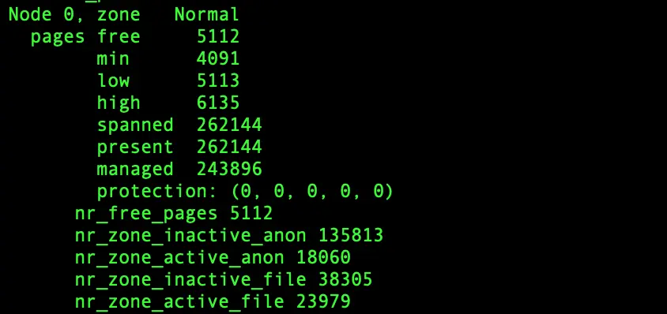

- free 就是该物理内存区域内剩余的内存页数，它的值和后面的 `nr_free_pages` 相同。
- min、low、high 就是上面提到的三条内存水位线：`_watermark[WMARK_MIN]`，`_watermark[WMARK_LOW]` ，`_watermark[WMARK_HIGH]`。
- `nr_zone_active_anon` 和 `nr_zone_inactive_anon` 分别是该内存区域内活跃和非活跃的匿名页数量。
- `nr_zone_active_file` 和 `nr_zone_inactive_file` 分别是该内存区域内活跃和非活跃的文件页数量。

##### 水位线的计算

`WMARK_MIN`，`WMARK_LOW` ，`WMARK_HIGH` 这三个水位线的数值是通过内核参数  `/proc/sys/vm/min_free_kbytes` 为基准分别计算出来的，用户也可以通过 `sysctl` 来动态设置这个内核参数。内核参数 `min_free_kbytes` 的单位为 KB 。


通常情况下 `WMARK_LOW` 的值是 `WMARK_MIN` 的 1.25 倍，`WMARK_HIGH` 的值是 `WMARK_LOW` 的 1.5 倍。而 `WMARK_MIN` 的数值就是由这个内核参数 `min_free_kbytes` 来决定的。

```c
/* 计算最小水位线 WMARK_MIN 的数值 min_free_kbytes （单位为 KB）。 水位线的单位是物理内存页的数量。 */
int __meminit init_per_zone_wmark_min(void)
{
	// 低位内存区域（除高端内存之外）的总和
	unsigned long lowmem_kbytes;
 	// 待计算的 min_free_kbytes
	int new_min_free_kbytes;

 	// 将低位内存区域内存容量总的页数转换为 KB
	lowmem_kbytes = nr_free_buffer_pages() * (PAGE_SIZE >> 10);
	// min_free_kbytes 计算逻辑：对 lowmem_kbytes * 16 进行开平方
	new_min_free_kbytes = int_sqrt(lowmem_kbytes * 16);
	// min_free_kbytes 的范围为 128 到 65536 KB 之间
	if (new_min_free_kbytes > user_min_free_kbytes) { // 用户设置的 /proc/sys/vm/min_free_kbytes
  		min_free_kbytes = new_min_free_kbytes;
  		if (min_free_kbytes < 128)
   			min_free_kbytes = 128;
  		if (min_free_kbytes > 65536)
   			min_free_kbytes = 65536;
	} else {
		pr_warn("min_free_kbytes is not updated to %d because user defined value %d is preferred\n",
    	new_min_free_kbytes, user_min_free_kbytes);
 	}
	// 计算内存区域内的三条水位线
	setup_per_zone_wmarks();
	// 计算内存区域的预留内存大小，防止被高位内存区域过度挤压占用
	setup_per_zone_lowmem_reserve();
    ......
	return 0;
}
core_initcall(init_per_zone_wmark_min)
    
/**
 * nr_free_zone_pages - count number of pages beyond high watermark
 * @offset: The zone index of the highest zone
 *
 * nr_free_zone_pages() counts the number of counts pages which are beyond the
 * high watermark within all zones at or below a given zone index.  For each
 * zone, the number of pages is calculated as:
 *     managed_pages - high_pages
 */
static unsigned long nr_free_zone_pages(int offset)
{
	struct zoneref *z;
 	struct zone *zone;

 	unsigned long sum = 0;
    // 获取当前 NUMA 节点中的所有物理内存区域 zone
 	struct zonelist *zonelist = node_zonelist(numa_node_id(), GFP_KERNEL);
    // 计算所有物理内存区域内 managed_pages - high_pages 的总和
 	for_each_zone_zonelist(zone, z, zonelist, offset) {
  		unsigned long size = zone->managed_pages;
  		unsigned long high = high_wmark_pages(zone);
  		if (size > high)
   			sum += size - high;
 	}
    // lowmem_kbytes 的值
 	return sum;
}
```

`nr_free_zone_pages` 方法的计算逻辑本意是给定一个 zone index （方法参数 offset），计算范围为：这个给定 zone 下面的所有低位内存区域。`nr_free_zone_pages` 方法会计算这些低位内存区域内在 high watermark 水位线之上的内存容量（ `managed_pages - high_pages` ）之和。作为该方法的返回值。但在初始化时，水位线还没有值，所以此时这个方法的语义就是计算低位内存区域内被伙伴系统所管理的内存容量（ `managed_pages` ）之和。也就是想要的 `lowmem_kbytes`。


```c
static void __setup_per_zone_wmarks(void)
{
	// 将 min_free_kbytes 转换为页
	unsigned long pages_min = min_free_kbytes >> (PAGE_SHIFT - 10);
  	// 所有低位内存区域 managed_pages 之和
 	unsigned long lowmem_pages = 0;
 	struct zone *zone;
 	unsigned long flags;

 	/* Calculate total number of !ZONE_HIGHMEM pages */
 	for_each_zone(zone) {
  		if (!is_highmem(zone))
   			lowmem_pages += zone->managed_pages;
 	}

  	// 循环计算各个内存区域中的水位线
 	for_each_zone(zone) {
  		u64 tmp;
  		tmp = (u64)pages_min * zone->managed_pages;
  		// 计算 WMARK_MIN 水位线的核心方法
  		do_div(tmp, lowmem_pages);
  		if (is_highmem(zone)) {
            ......
  		} else {
    		// WMARK_MIN水位线
   			zone->watermark[WMARK_MIN] = tmp;
  		}
  		/*
         * Set the kswapd watermarks distance according to the
         * scale factor in proportion to available memory, but
         * ensure a minimum size on small systems.
         */
        /* 通过内核参数 watermark_scale_factor 来调节水位线：WMARK_MIN，WMARK_LOW，WMARK_HIGH 之间的间距。
         * 水位线间距计算逻辑是：(WMARK_MIN / 4) 与 (zone_managed_pages * watermark_scale_factor / 10000) 之间较大的那个值。
         */
  		tmp = max_t(u64, tmp >> 2, mult_frac(zone->managed_pages, watermark_scale_factor, 10000));

  		zone->watermark[WMARK_LOW]  = min_wmark_pages(zone) + tmp;
  		zone->watermark[WMARK_HIGH] = min_wmark_pages(zone) + tmp * 2;
 	}
}
```

计算 `WMARK_MIN` 水位线的方法是，先计算每个 zone 内存容量之间的比例，然后根据这个比例去从 `min_free_kbytes` 中划分出对应 zone 的 `WMARK_MIN` 水位线来。比如：当前 NUMA 节点中有两个 zone ：`ZONE_DMA` 和 `ZONE_NORMAL`，内存容量大小分别是：100 M 和 800 M。那么 `ZONE_DMA` 与 `ZONE_NORMAL` 之间的比例就是 1 ：8。根据这个比例，`ZONE_DMA` 区域里的 `WMARK_MIN` 水位线就是：`min_free_kbytes  *  1 / 8` 。`ZONE_NORMAL` 区域里的 `WMARK_MIN` 水位线就是：`min_free_kbytes  *  7 / 8 `。

计算出了 `WMARK_MIN` 的值，那么接下来 `WMARK_LOW`， `WMARK_HIGH` 的值也就好办了，它们都是基于 `WMARK_MIN` 计算出来的。`WMARK_LOW` 的值是 `WMARK_MIN` 的 1.25 倍，`WMARK_HIGH` 的值是 `WMARK_LOW` 的 1.5 倍。

为了避免内核的直接内存回收 direct reclaim 阻塞进程影响系统的性能，所以需要尽量保持内存区域中的剩余内存容量尽量在 `WMARK_MIN` 水位线之上，但是有一些极端情况，比如突然遇到网络流量增大，需要短时间内申请大量的内存来存放网络请求数据，此时 `kswapd` 回收内存的速度可能赶不上内存分配的速度，从而造成直接内存回收 direct reclaim，影响系统性能。而为了应对这种突发的网络流量暴增，需要保证 `kswapd` 进程活动的范围大一些，这样内核就能够时刻进行内存回收使得剩余内存容量较长时间的保持在 `WMARK_HIGH` 水位线之上。这样一来就要求  `WMARK_MIN` 与 `WMARK_LOW` 水位线之间的间距不能太小，因为 `WMARK_LOW` 水位线之上就不会唤醒 `kswapd` 进程了。因此内核引入了 `/proc/sys/vm/watermark_scale_factor` 参数来调节水位线之间的间距。该内核参数默认值为 10，最大值为 3000。


用户可以通过 `sysctl` 来动态调整 `watermark_scale_factor` 参数，内核会动态重新计算水位线之间的间距，使得 `WMARK_MIN` 与 `WMARK_LOW` 之间留有足够的缓冲余地，使得 `kswapd` 能够有时间回收足够的内存，从而解决直接内存回收导致的性能抖动问题。

##### 物理内存区域中的冷热页

所谓的热页就是已经加载进 CPU 高速缓存中的物理内存页，所谓的冷页就是还未加载进 CPU 高速缓存中的物理内存页，冷页是热页的后备选项。

```c
struct zone {
	/* 集中管理系统中所有 CPU 高速缓存冷热页。热页放在列表的头部，冷页放在列表的尾部。*/
    struct per_cpu_pages __percpu *per_cpu_pageset;

 	int pageset_high;
 	int pageset_batch;

} ____cacheline_internodealigned_in_smp;


struct per_cpu_pages {
	int count;  /* number of pages in the list */
    // 如果集合中页面的数量 count 值超过了 high 的值，那么表示 list 中的页面太多了，内核会从高速缓存中释放 batch 个页面到物理内存区域中的伙伴系统中。
 	int high;  /* high watermark, emptying needed */
    // 每次批量向 CPU 高速缓存填充或者释放的物理页面个数。
 	int batch;  /* chunk size for buddy add/remove */ 
 	......
 	/* Lists of pages, one per migrate type stored on the pcp-lists */
 	struct list_head lists[NR_PCP_LISTS];
};
```

内核为了最大程度的防止内存碎片，将物理内存页面按照是否可迁移的特性分为了多种迁移类型：可迁移，可回收，不可迁移。在 `struct per_cpu_pages` 结构中，每一种迁移类型都会对应一个冷热页链表。

#### 物理内存页

物理页面的大小，Linux 规定必须是 2 的整数次幂，因为 2 的整数次幂可以将一些数学运算转换为移位操作，比如乘除运算可以通过移位操作来实现，这样效率更高。 使用 4KB 是因为在内存紧张的时候，内核会将不经常使用到的物理页面进行换入换出等操作，还有在内存与文件映射的场景下，都会涉及到与磁盘的交互。数据在磁盘中组织形式也是根据一个磁盘块一个磁盘块来管理的，4KB 和 4MB 都是磁盘块大小的整数倍，但在大多数情况下，内存与磁盘之间传输小块数据时会更加的高效，所以综上所述内核会采用 4KB 作为默认物理内存页大小。

```c
struct page {
    // 存储 page 的定位信息以及相关标志位
    unsigned long flags;        

    union {
        struct {    /* Page cache and anonymous pages */
            // 用来指向物理页 page 被放置在了哪个 lru 链表上
            struct list_head lru;
            // 如果 page 为文件页的话，低位为0，指向 page 所在的 page cache
            // 如果 page 为匿名页的话，低位为1，指向其对应虚拟地址空间的匿名映射区 anon_vma
            // address_space 类型的指针实现总是对齐至 sizeof(long)
            struct address_space *mapping;
            // 如果 page 为文件页的话，index 为 page 在 page cache 中的索引
            // 如果 page 为匿名页的话，表示匿名页在对应进程虚拟内存区域 VMA 中的偏移
            pgoff_t index;
            // 在不同场景下，private 指向的场景信息不同
            unsigned long private;
        };
        
        struct {    /* slab, slob and slub */
            union {
                /* slab 的管理结构中有众多用于管理 page 的链表，比如：完全空闲的 page 链表，完全分配的 page 链表，
                 * 部分分配的 page 链表，slab_list 用于指定当前 page 位于 slab 中的哪个具体链表上。
                 */
                struct list_head slab_list;
                struct {
                    // 当 page 位于 slab 结构中的某个管理链表上时，next 指针用于指向链表中的下一个 page
                    struct page *next;
#ifdef CONFIG_64BIT
                    // 表示 slab 中总共拥有的 page 个数
                    int pages;  
                    // 表示 slab 中拥有的特定类型的对象个数
                    int pobjects;   
#else
                    short int pages;
                    short int pobjects;
#endif
                };
            };
            // 用于指向当前 page 所属的 slab 管理结构，通过 slab_cache 将 page 和 slab 关联起来。
            struct kmem_cache *slab_cache; 
        
            /* 指向 page 中的第一个未分配出去的空闲对象，slab 向伙伴系统申请一个或者多个 page，并将一整页 page 划分出多个大小相等的内存块，
             * 用于存储特定类型的对象。
             */
            void *freelist;     
            union {
                // 指向 page 中的第一个对象
                void *s_mem;    
                struct {            /* SLUB */
                    /* 表示 slab 中已经被分配出去的对象个数，当该值为 0 时，表示 slab 中所管理的对象全都是空闲的，
                     * 当所有的空闲对象达到一定数目，该 slab 就会被伙伴系统回收掉。
                     */
                    unsigned inuse:16;
                    // slab 中所有的对象个数
                    unsigned objects:15;
                    // 当前内存页 page 被 slab 放置在 CPU 本地缓存列表中，frozen = 1，否则 frozen = 0
                    unsigned frozen:1;
                };
            };
        };
        struct {    /* 复合页 compound page 相关*/
            // 复合页的尾页指向首页
            unsigned long compound_head;    
            // 用于释放复合页的析构函数，保存在首页中
            unsigned char compound_dtor;
            // 该复合页有多少个 page 组成
            unsigned char compound_order;
            // 该复合页被多少个进程使用，内存页反向映射的概念，首页中保存
            atomic_t compound_mapcount;
            // 复合页使用计数，首页中保存
            atomic_t compound_pincount;
        };

        // 表示 slab 中需要释放回收的对象链表
        struct rcu_head rcu_head;
    };

    union {     /* This union is 4 bytes in size. */
        // 表示该 page 映射了多少个进程的虚拟内存空间，一个 page 可以被多个进程映射。比如：共享内存映射，父子进程的创建等。page 与 VMA 是一对多的关系。
        atomic_t _mapcount;

    };

    // 内核中引用该物理页的次数，表示该物理页的活跃程度。
    atomic_t _refcount;

#if defined(WANT_PAGE_VIRTUAL)
    void *virtual;  // 内存页对应的虚拟内存地址
#endif /* WANT_PAGE_VIRTUAL */

} _struct_page_alignment;
```

在内核中每个文件都会有一个属于自己的 page cache（页高速缓存），页高速缓存在内核中的结构体就是这个 `struct address_space`。它被文件的 `inode` 所持有。如果当前物理内存页 `struct page` 是一个文件页的话，那么 `mapping` 指针的最低位会被设置为 0 ，指向该内存页关联文件的 `struct address_space`（页高速缓存），`pgoff_t index` 字段表示该内存页 page 在页高速缓存 page cache 中的 index 索引。内核会利用这个 index 字段从 page cache 中查找该物理内存页，同时该 `pgoff_t index` 字段也表示该内存页中的文件数据在文件内部的偏移 offset。偏移单位为 page size。

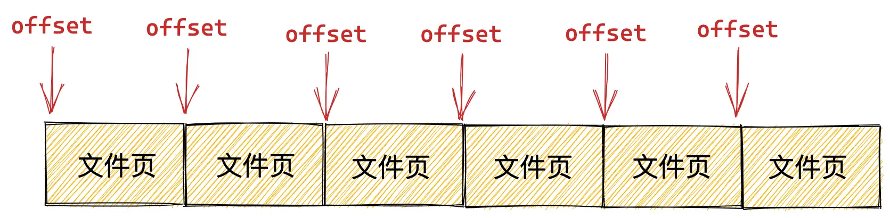

如果当前物理内存页 `struct page` 是一个匿名页的话，那么 `mapping` 指针的最低位会被设置为 1 ， 指向该匿名页在进程虚拟内存空间中的匿名映射区域 `struct anon_vma` 结构（每个匿名页对应唯一的 `anon_vma` 结构），用于物理内存到虚拟内存的反向映射。

##### 匿名页的反向映射

通常所说的内存映射是正向映射，即从虚拟内存到物理内存的映射。而反向映射则是从物理内存到虚拟内存的映射，用于当某个物理内存页需要进行回收或迁移时，此时需要去找到这个物理页被映射到了哪些进程的虚拟地址空间中，并断开它们之间的映射。在没有反向映射的机制前，需要去遍历所有进程的虚拟地址空间中的映射页表，这个效率显然是很低下的。有了反向映射机制之后内核就可以直接找到该物理内存页到所有进程映射的虚拟地址空间 VMA ，并从 VMA 使用的进程页表中取消映射。

```c
struct vm_area_struct {
    struct list_head anon_vma_chain;
    struct anon_vma *anon_vma;
}

struct anon_vma_chain {
    // 匿名页关联的进程虚拟内存空间（vma属于一个特定的进程，多个进程多个vma）
    struct vm_area_struct *vma;
    // 匿名页 page 指向的 anon_vma
    struct anon_vma *anon_vma;
    // 指向 vm_area_struct 中的 anon_vma_chain 列表
    struct list_head same_vma;
    // anon_vma 管理的红黑树中该 anon_vma_chain 对应的红黑树节点
    struct rb_node rb;         
    unsigned long rb_subtree_last;
#ifdef CONFIG_DEBUG_VM_RB
    unsigned long cached_vma_start, cached_vma_last;
#endif
};

struct anon_vma {
    struct anon_vma *root;      /* Root of this anon_vma tree */
    struct rw_semaphore rwsem; 
    atomic_t refcount;
    unsigned degree;
    struct anon_vma *parent;    /* Parent of this anon_vma */
    struct rb_root rb_root; /* Interval tree of private "related" vmas */
};
```

每个匿名页对应唯一的 `anon_vma` 结构，**但是一个匿名物理页可以映射到不同进程的虚拟内存空间中，每个进程的虚拟内存空间都是独立的，也就是说不同的进程就会有不同的 VMA**。不同的 VMA 意味着同一个匿名页 `anon_vma` 就会对应多个 `anon_vma_chain`。`struct anon_vma` 结构中管理了一颗红黑树，这颗红黑树上管理的全部都是与该 `anon_vma` 关联的 `anon_vma_chain`。可以通过 `struct page` 中的 `mapping` 指针找到 `anon_vma`，然后遍历 `anon_vma` 中的这颗红黑树 `rb_root` ，从而找到与其关联的所有 `anon_vma_chain`。物理内存页 page 到与其映射的进程虚拟内存空间 VMA，这样一种一对多的映射关系现在就算建立起来了。

`vm_area_struct` **表示的只是进程虚拟内存空间中的一段虚拟内存区域，这块虚拟内存区域中可能会包含多个匿名页，所以 VMA 与物理内存页 page 也是有一对多的映射关系存在**。 `struct anon_vma_chain` 结构中还有一个列表结构 `same_vma`，这个列表 `same_vma` 中存储的 `anon_vma_chain` 对应的 VMA 全都是一样的，而列表元素 `anon_vma_chain` 中的 `anon_vma` 却是不一样的。内核用这样一个链表结构 `same_vma` 存储了进程相应虚拟内存区域 VMA 中所包含的所有匿名页。`struct vm_area_struct` 结构中的 `struct list_head anon_vma_chain` 指向的也是这个列表 `same_vma`。


进程利用 `fork` 系统调用创建子进程的时候，内核会将父进程的虚拟内存空间相关的内容拷贝到子进程的虚拟内存空间中，此时子进程的虚拟内存空间和父进程的虚拟内存空间是一模一样的，其中虚拟内存空间中映射的物理内存页也是一样的，在内核中都是同一份，在父进程和子进程之间共享（包括 `anon_vma` 和 `anon_vma_chain`）。当进程在向内核申请内存的时候，内核首先会为进程申请的这块内存创建初始化一段虚拟内存区域 `struct vm_area_struct` 结构，但是并不会为其分配真正的物理内存。当进程开始访问这段虚拟内存时，内核会产生缺页中断，在缺页中断处理函数中才会去真正的分配物理内存（这时才会为子进程创建自己的 `anon_vma` 和 `anon_vma_chain`），并建立虚拟内存与物理内存之间的映射关系（正向映射）。

```c
static vm_fault_t handle_pte_fault(struct vm_fault *vmf)
{
	......
	if (!vmf->pte) {
        if (vma_is_anonymous(vmf->vma))
            // 处理匿名页缺页
            return do_anonymous_page(vmf);
        else
            // 处理文件页缺页
            return do_fault(vmf);
    }
	......
    if (vmf->flags & (FAULT_FLAG_WRITE|FAULT_FLAG_UNSHARE)) {
        if (!pte_write(entry))
            // 子进程缺页处理
            return do_wp_page(vmf);
    }
    ......
}

static vm_fault_t do_anonymous_page(struct vm_fault *vmf)
{
	struct vm_area_struct *vma = vmf->vma;
    struct page *page; 
    ......
    // 为匿名页创建 anon_vma 实例和 anon_vma_chain 实例，并建立它们之间的关联关系。
	if (unlikely(anon_vma_prepare(vma)))
  		goto oom;

    // 从伙伴系统中获取物理内存页 struct page
	page = alloc_zeroed_user_highpage_movable(vma, vmf->address);

	if (!page)
  		goto oom;
  	// 建立反向映射关系，完成 struct page 与 anon_vma 的关联
 	page_add_new_anon_rmap(page, vma, vmf->address);
	......
}

int __anon_vma_prepare(struct vm_area_struct *vma)
{
    // 获取进程虚拟内存空间
    struct mm_struct *mm = vma->vm_mm;
    // 准备为匿名页分配 anon_vma 以及 anon_vma_chain
    struct anon_vma *anon_vma, *allocated;
    struct anon_vma_chain *avc;
    // 分配 anon_vma_chain 实例
    avc = anon_vma_chain_alloc(GFP_KERNEL);
    if (!avc)
        goto out_enomem;
    // 在相邻的虚拟内存区域 VMA 中查找可复用的 anon_vma
    anon_vma = find_mergeable_anon_vma(vma);
    allocated = NULL;
 	if (!anon_vma) {
        // 没有可复用的 anon_vma 则创建一个新的实例
  		anon_vma = anon_vma_alloc();
  		if (unlikely(!anon_vma))
   			goto out_enomem_free_avc;
  		allocated = anon_vma;
 	}

 	anon_vma_lock_write(anon_vma);
 	/* page_table_lock to protect against threads */
 	spin_lock(&mm->page_table_lock);
 	if (likely(!vma->anon_vma)) {
        // VMA 中的 anon_vma 属性就是在这里赋值的
  		vma->anon_vma = anon_vma;
        // 建立反向映射关联
  		anon_vma_chain_link(vma, avc, anon_vma);
  		/* vma reference or self-parent link for new root */
  		anon_vma->degree++;
  		allocated = NULL;
  		avc = NULL;
 	}
    ......
}

static void anon_vma_chain_link(struct vm_area_struct *vma, struct anon_vma_chain *avc, struct anon_vma *anon_vma)
{
    // 通过 anon_vma_chain 关联 anon_vma 和对应的 vm_area_struct
	avc->vma = vma;
 	avc->anon_vma = anon_vma;
    // 将 vm_area_struct 中的 anon_vma_chain 链表加入到 anon_vma_chain 中的 same_vma 链表中
 	list_add(&avc->same_vma, &vma->anon_vma_chain);
    // 将初始化好的 anon_vma_chain 加入到 anon_vma 管理的红黑树 rb_root 中
 	anon_vma_interval_tree_insert(avc, &anon_vma->rb_root);
}

// page_add_new_anon_rmap 调用 __page_set_anon_rmap
static void __page_set_anon_rmap(struct page *page, struct vm_area_struct *vma, unsigned long address, int exclusive)
{
    struct anon_vma *anon_vma = vma->anon_vma;
    ......
    // 低位置 1，#define PAGE_MAPPING_ANON 0x1
    anon_vma = (void *) anon_vma + PAGE_MAPPING_ANON;
    // 转换为 address_space 指针赋值给 page 结构中的 mapping 字段，anon_vma = (struct anon_vma *) (mapping - PAGE_MAPPING_ANON)
    page->mapping = (struct address_space *) anon_vma;
    // page 结构中的 index 表示该匿名页在虚拟内存区域 vma 中的偏移
    page->index = linear_page_index(vma, address);
}

// 匿名页在对应进程虚拟内存区域 VMA 中的偏移
static inline pgoff_t linear_page_index(struct vm_area_struct *vma, unsigned long address)
{
    pgoff_t pgoff;
    if (unlikely(is_vm_hugetlb_page(vma)))
        return linear_hugepage_index(vma, address);
    pgoff = (address - vma->vm_start) >> PAGE_SHIFT;
    pgoff += vma->vm_pgoff;
    return pgoff;
}
```

##### 内存页回收

###### active 和 inactive 链表

内存回收的关键是如何实现一个高效的页面替换算法 PFRA (Page Frame Replacement Algorithm) ，最典型的页面替换算法就是  LRU (Least-Recently-Used) 算法。LRU 算法的核心思想就是那些最近最少使用的页面，在未来的一段时间内可能也不会再次被使用，所以在内存紧张的时候，会优先将这些最近最少使用的页面置换出去。在这种情况下其实一个 active 链表就可以满足我们的需求。但是这里会有一个严重的问题，LRU 算法更多的是在时间维度上的考量，突出最近最少使用，但是它并没有考量到使用频率的影响，假设有这样一种状况，就是一个页面被疯狂频繁的使用，毫无疑问它肯定是一个热页，但是这个页面最近的一次访问时间离现在稍微久了一点点，此时进来大量的页面，这些页面的特点是只会使用一两次，以后将再也不会用到。在这种情况下，根据 LRU 的语义这个之前频繁地被疯狂访问的页面就会被置换出去了（本来应该将这些大量一次性访问的页面置换出去的），当这个页面在不久之后要被访问时，此时已经不在内存中了，还需要在重新置换进来，造成性能的损耗。这种现象也叫 Page Thrashing（页面颠簸）。因此，内核为了将页面使用频率这个重要的考量因素加入进来，于是就引入了 active 链表和 inactive 链表。工作原理如下：

1. 首先 inactive 链表的尾部存放的是访问频率最低并且最少访问的页面，在内存紧张的时候，这些页面被置换出去的优先级是最大的。
2. 对于文件页来说，当它被第一次读取的时候，内核会将它放置在 inactive 链表的头部，如果它继续被访问，则会提升至 active 链表的尾部。如果它没有继续被访问，则会随着新文件页的进入，内核会将它慢慢的推到  inactive 链表的尾部，如果此时再次被访问则会直接被提升到 active 链表的头部。大家可以看出此时页面的使用频率这个因素已经被考量了进来。
3. 对于匿名页来说，当它被第一次读取的时候，内核会直接将它放置在 active 链表的尾部，注意不是 inactive 链表的头部，这里和文件页不同。因为匿名页的换出 Swap Out 成本会更大，内核会对匿名页更加优待。当匿名页再次被访问的时候就会被被提升到 active 链表的头部。
4. 当遇到内存紧张的情况需要换页时，内核会从 active 链表的尾部开始扫描，将一定量的页面降级到  inactive 链表头部，这样一来原来位于 inactive 链表尾部的页面就会被置换出去。

内核在回收内存的时候，这两个列表中的回收优先级为：inactive 链表尾部 > inactive 链表头部 > active 链表尾部 > active 链表头部。

###### **匿名页与文件页**

假设现在只有 active 链表和 inactive 链表，不对这两个链表进行匿名页和文件页的归类，在需要页面置换的时候，内核会先从 active 链表尾部开始扫描，当  swappiness 被设置为 0 时，内核只会置换文件页，不会置换匿名页。由于 active 链表和 inactive 链表没有进行物理页面类型的归类，所以链表中既会有匿名页也会有文件页，如果链表中有大量的匿名页的话，内核就会不断的跳过这些匿名页去寻找文件页，并将文件页替换出去，这样从性能上来说肯定是低效的。因此内核将 active 链表和 inactive 链表按照匿名页和文件页进行了归类，当  swappiness 被设置为 0 时，内核只需要去 `nr_zone_active_file` 和 `nr_zone_inactive_file `链表中扫描即可，提升了性能。

其实除了以上的四种 LRU 链表（匿名页的 active 链表，inactive 链表和文件页的active 链表， inactive 链表）之外，内核还有一种链表，比如进程可以通过 `mlock()` 等系统调用把内存页锁定在内存里，保证该内存页无论如何不会被置换出去，比如出于安全或者性能的考虑，页面中可能会包含一些敏感的信息不想被 swap 到磁盘上导致泄密，或者一些频繁访问的内存页必须一直贮存在内存中。当这些被锁定在内存中的页面很多时，内核在扫描 active 链表的时候也不得不跳过这些页面，所以内核又将这些被锁定的页面单独拎出来放在一个独立的链表中。

##### 物理内存页属性和状态的标志位 flag


```c
/* /include/linux/mm.h */
// page to mem_section
static inline unsigned long page_to_section(const struct page *page)
{
	return (page->flags >> SECTIONS_PGSHIFT) & SECTIONS_MASK;
}

// page to numa node
static inline pg_data_t *page_pgdat(const struct page *page)
{
	return NODE_DATA(page_to_nid(page));
}

// page to zone
static inline struct zone *page_zone(const struct page *page)
{
 	return &NODE_DATA(page_to_nid(page))->node_zones[page_zonenum(page)];
}

/* /include/linux/page-flags.h */
enum pageflags {
    /* 表示该物理页面已经被锁定，如果该标志位置位，说明有使用者正在操作该 page , 则内核的其他部分不允许访问该页， 这可以防止内存管理出现竞态条件，
     * 例如：在从硬盘读取数据到 page 时。
     */
	PG_locked,  /* Page is locked. Don't touch. */
    /* 表示该物理页面刚刚被访问过。 */
	PG_referenced,
    /* 表示该物理页的数据已经从块设备中读取到内存中，并且期间没有出错。 */
	PG_uptodate,
    /* 物理内存页的脏页标识，表示该物理内存页中的数据已经被进程修改，但还没有同步会磁盘中。 */
	PG_dirty,
    /* 表示该物理内存页现在被放置在哪个 lru 链表上，比如：是在 active list 链表中，还是在 inactive list 链表中。 */
	PG_lru,
    /* 表示该物理页位于 active list 链表中。PG_referenced 和 PG_active 共同控制了系统使用该内存页的活跃程度，在内存回收的时候这两个信息非常重要。 */
 	PG_active,
    /* 表示该物理内存页属于 slab 分配器所管理的一部分。 */
 	PG_slab,
 	PG_reserved,
    /* 表示物理内存页属于复合页的其中一部分。 */
    PG_compound,
    /* 标志被置位的时候表示该 struct page 结构中的 private 指针指向了具体的对象。不同场景指向的对象不同。 */
 	PG_private,
    /* 表示该物理内存页正在被内核的 pdflush 线程回写到磁盘中。 */
 	PG_writeback,
    /* 表示该物理内存页已经被内核选中即将要进行回收。 */
 	PG_reclaim,
#ifdef CONFIG_MMU
    /* 表示该物理内存页被进程通过 mlock 系统调用锁定常驻在内存中，不会被置换出去。 */
 	PG_mlocked,  /* Page is vma mlocked */
#endif
    /* 表示该物理内存页处于 swap cache 中。 struct page 中的 private 指针这时指向 swap_entry_t 。 */
 	PG_swapcache = PG_owner_priv_1,
    ......
};
```

- PG_readahead 当进程在顺序访问文件的时候，内核会预读若干相邻的文件页数据到 page 中，物理页 page 结构设置了该标志位，表示它是一个正在被内核预读的页。

- PG_highmem 表示该物理内存页是在高端内存中。
- PG_buddy 表示该物理内存页是空闲的并且被伙伴系统所管理。

内核定义了一些标准宏，用来检查某个物理内存页 page 是否设置了特定的标志位，以及对这些标志位的操作，这些宏在内核中的实现都是原子的，命名格式如下：

- PageXXX(page)：检查 page 是否设置了 PG_XXX 标志位
- SetPageXXX(page)：设置 page 的 PG_XXX 标志位
- ClearPageXXX(page)：清除 page 的 PG_XXX 标志位
- TestSetPageXXX(page)：设置 page 的 PG_XXX 标志位，并返回原值

```c
static inline void wait_on_page_locked(struct page *page)
static inline void wait_on_page_writeback(struct page *page)
```

- 当物理页面在锁定的状态下，进程调用了 `wait_on_page_locked` 函数，那么进程就会阻塞等待知道页面解锁。
- 当物理页面正在被内核回写到磁盘的过程中，进程调用了 `wait_on_page_writeback` 函数就会进入阻塞状态直到脏页数据被回写到磁盘之后被唤醒。

##### 复合页 compound_page 相关属性

大页就是通过两个或者多个物理上连续的内存页 page 组装成的一个比普通内存页 page 更大的页，这些大页要比普通的 4K 内存页要大很多，所以遇到缺页中断的情况就会相对减少，由于减少了缺页中断所以性能会更高。另外，由于大页比普通页要大，所以大页需要的页表项要比普通页要少，页表项里保存了虚拟内存地址与物理内存地址的映射关系，当 CPU 访问内存的时候需要频繁通过 MMU 访问页表项获取物理内存地址，由于要频繁访问，所以页表项一般会缓存在 TLB 中，因为大页需要的页表项较少，所以节约了 TLB 的空间同时降低了 TLB 缓存 MISS 的概率，从而加速了内存访问。还有一个使用大页受益场景就是，当一个内存占用很大的进程（比如 Redis）通过 fork 系统调用创建子进程的时候，会拷贝父进程的相关资源，其中就包括父进程的页表，由于大页使用的页表项少，所以拷贝的时候性能会提升不少。


组成复合页的第一个 page 我们称之为首页（Head Page），其余的均称之为尾页（Tail Page）。首页 page 中的 flags 会被设置为 PG_head 表示复合页的第一页。

#### 物理内存分配

物理内存分配接口全部是基于伙伴系统的，伙伴系统有一个特点就是它所分配的物理内存页全部都是物理上连续的，并且只能分配 2 的整数幂个页，这里的整数幂在内核中称之为分配阶。

```c
/* 返回申请到的第一个物理页 */
struct page *alloc_pages(gfp_t gfp, unsigned int order);

#define alloc_page(gfp_mask) alloc_pages(gfp_mask, 0)

/* 返回第一个物理页对应的虚拟地址 */
unsigned long __get_free_pages(gfp_t gfp_mask, unsigned int order)
{
	struct page *page;

    // 不能在高端内存中分配物理页，因为无法直接映射获取虚拟内存地址
	page = alloc_pages(gfp_mask & ~__GFP_HIGHMEM, order);
	if (!page)
		return 0;

    // 将直接映射区中的物理内存页转换为虚拟内存地址
	return (unsigned long) page_address(page);
}

#define __get_free_page(gfp_mask) __get_free_pages((gfp_mask), 0)

/* 将从伙伴系统中申请到内存页全部初始化填充为 0 */
unsigned long get_zeroed_page(gfp_t gfp_mask)
{
	return __get_free_pages(gfp_mask | __GFP_ZERO, 0);
}

/* 从 DMA 内存区域分配适用于 DMA 的物理内存页 */
#define __get_dma_pages(gfp_mask, order) __get_free_pages((gfp_mask) | GFP_DMA, (order))

/* 对应 alloc_pages，释放 2 的 order 次幂个内存页，释放的物理内存区域起始地址由该区域中的第一个 page 指针表示 */
void __free_pages(struct page *page, unsigned int order);
/* 对应 __get_free_pages，释放 2 的 order 次幂个内存页，释放的物理内存区域起始地址对应的虚拟地址 */
void free_pages(unsigned long addr, unsigned int order);

#define __free_page(page) __free_pages((page), 0)
#define free_page(addr) free_pages((addr), 0)
```

`page_address` 函数用于将给定的物理内存页 page 转换为它的虚拟内存地址，不过这里只适用于内核虚拟内存空间中的直接映射区，因为在直接映射区中虚拟内存地址到物理内存地址是直接映射的，虚拟内存地址减去一个固定的偏移就可以直接得到物理内存地址。如果物理内存页处于高端内存中，则不能这样直接进行转换，在通过 `alloc_pages` 函数获取物理内存页 page 之后，需要调用 `kmap` 映射将 page 映射到内核虚拟地址空间中。

在释放内存时需要非常谨慎小心，只能释放属于你自己的内存页，传递了错误的 `struct page` 指针或者错误的虚拟内存地址，或者传递错了 `order` 值，都可能会导致系统的崩溃。在内核空间中，内核是完全信赖的，这点和用户空间不同。

```c
#define ___GFP_DMA      0x01u
#define ___GFP_HIGHMEM  0x02u
#define ___GFP_DMA32    0x04u
#define ___GFP_MOVABLE  0x08u
```

如果不指定物理内存的分配区域，那么内核会默认从 `ZONE_NORMAL` 区域中分配内存

```c
/* linux 5.19 */
static inline enum zone_type gfp_zone(gfp_t flags)
{
	enum zone_type z;
	int bit = (__force int) (flags & GFP_ZONEMASK);

	z = (GFP_ZONE_TABLE >> (bit * GFP_ZONES_SHIFT)) &
					 ((1 << GFP_ZONES_SHIFT) - 1);
	VM_BUG_ON((GFP_ZONE_BAD >> bit) & 1);
	return z;
}

/* linux 2.6.24 */
static inline enum zone_type gfp_zone(gfp_t flags)
{
	int base = 0;

#ifdef CONFIG_NUMA
 	if (flags & __GFP_THISNODE)
  		base = MAX_NR_ZONES;
#endif

#ifdef CONFIG_ZONE_DMA
 	if (flags & __GFP_DMA)
  		return base + ZONE_DMA;
#endif
#ifdef CONFIG_ZONE_DMA32
 	if (flags & __GFP_DMA32)
  		return base + ZONE_DMA32;
#endif
 	if ((flags & (__GFP_HIGHMEM | __GFP_MOVABLE)) == (__GFP_HIGHMEM | __GFP_MOVABLE))
  		return base + ZONE_MOVABLE;
#ifdef CONFIG_HIGHMEM
 	if (flags & __GFP_HIGHMEM)
  		return base + ZONE_HIGHMEM;
#endif
    // 默认从 normal 区域中分配内存
 	return base + ZONE_NORMAL;
}
```

- 只要掩码 flags 中设置了 `__GFP_DMA`，则不管 `__GFP_HIGHMEM` 有没有设置，内存分配都只会在 `ZONE_DMA` 区域中分配。
- 如果掩码只设置了 `ZONE_HIGHMEM`，则在物理内存分配时，优先在 `ZONE_HIGHMEM` 区域中进行分配，如果容量不够则降级到 `ZONE_NORMAL` 中，如果还是不够则进一步降级至 `ZONE_DMA` 中分配。
- 如果掩码既没有设置 `ZONE_HIGHMEM` 也没有设置 `__GFP_DMA`，则走到最后的分支，默认优先从 `ZONE_NORMAL` 区域中进行内存分配，如果容量不够则降级至 `ZONE_DMA` 区域中分配。
- 单独设置 ` __GFP_MOVABLE` 其实并不会影响内核的分配策略，如果想要让内核在 `ZONE_MOVABLE` 区域中分配内存需要同时指定 `__GFP_MOVABLE` 和 `__GFP_HIGHMEM` 。

`ZONE_MOVABLE` 只是内核定义的一个虚拟内存区域，目的是避免内存碎片和支持内存热插拔。上述介绍的 `ZONE_HIGHMEM`，`ZONE_NORMAL`，`ZONE_DMA` 才是真正的物理内存区域，`ZONE_MOVABLE` 虚拟内存区域中的物理内存来自于上述三个物理内存区域。在 32 位系统中 `ZONE_MOVABLE` 虚拟内存区域中的物理内存页来自于 `ZONE_HIGHMEM`。在 64 位系统中 `ZONE_MOVABLE` 虚拟内存区域中的物理内存页来自于 `ZONE_NORMAL` 或者 `ZONE_DMA` 区域。

|          gfp_t 掩码           |                内存区域降级策略                |
| :---------------------------: | :--------------------------------------------: |
|        什么都没有设置         |          `ZONE_NORMAL` ->  `ZONE_DMA`          |
|          `__GFP_DMA`          |                   `ZONE_DMA`                   |
| `__GFP_DMA` & `__GFP_HIGHMEM` |                   `ZONE_DMA`                   |
|        `__GFP_HIGHMEM`        | `ZONE_HIGHMEM` -> `ZONE_NORMAL` ->  `ZONE_DMA` |

```c
/* 用于指定分配的页面是可以回收的 */
#define ___GFP_RECLAIMABLE 0x10u
/* 表示该内存分配请求是高优先级的，内核急切的需要内存，如果内存分配失败则会给系统带来非常严重的后果，设置该标志通常内存是不允许分配失败的，
 * 如果空闲内存不足，则会从紧急预留内存中分配。
 */
#define ___GFP_HIGH  0x20u
/* 表示内核在分配物理内存的时候可以发起磁盘 IO 操作。比如当内核在进行内存分配的时候，发现物理内存不足，
 * 这时需要将不经常使用的内存页置换到 SWAP 分区或者 SWAP 文件中，这时就涉及到了 IO 操作，如果设置了该标志，表示允许内核将不常用的内存页置换出去。
 */
#define ___GFP_IO  0x40u
/* 允许内核执行底层文件系统操作，在与 VFS 虚拟文件系统层相关联的内核子系统中必须禁用该标志，否则可能会引起文件系统操作的循环递归调用，
 * 因为在设置 ___GFP_FS 标志分配内存的情况下，可能会引起更多的文件系统操作，而这些文件系统的操作可能又会进一步产生内存分配行为，这样一直递归持续下去。
 */
#define ___GFP_FS  0x80u
/* 在内核分配内存成功之后，将内存页初始化填充字节 0 。 */
#define ___GFP_ZERO  0x100u
/* 该标志的设置表示内存在分配物理内存的时候不允许睡眠必须是原子性地进行内存分配。比如在中断处理程序中，就不能睡眠，因为中断程序不能被重新调度。
 * 同时也不能在持有自旋锁的进程上下文中睡眠，因为可能导致死锁。综上所述这个标志只能用在不能被重新安全调度的进程上下文中。
 */
#define ___GFP_ATOMIC  0x200u
/* 表示内核在进行内存分配的时候，可以进行直接内存回收。当剩余内存容量低于水位线 _watermark[WMARK_MIN] 时，说明此时的内存容量已经非常危险了，
 * 如果进程在这时请求内存分配，内核就会进行直接内存回收，直到内存水位线恢复到 _watermark[WMARK_HIGH] 之上。
 */
#define ___GFP_DIRECT_RECLAIM 0x400u
/* 表示内核在分配内存的时候，如果剩余内存容量在 _watermark[WMARK_MIN] 与 _watermark[WMARK_LOW] 之间时，
 * 内核就会唤醒 kswapd 进程开始异步内存回收，直到剩余内存高于 _watermark[WMARK_HIGH] 为止。
 */
#define ___GFP_KSWAPD_RECLAIM 0x800u
/* 表示当内核分配内存失败时，抑制内核的分配失败错误报告。 */
#define ___GFP_NOWARN  0x2000u
/* 在内核分配内存失败的时候，允许重试，但重试仍然可能失败，重试若干次后停止。 */
#define ___GFP_RETRY_MAYFAIL 0x4000u
/* 在内核分配失败时一直重试直到成功为止。 */
#define ___GFP_NOFAIL  0x8000u
/* 表示分配内存失败时不允许重试。 */
#define ___GFP_NORETRY  0x10000u
/* 该标志限制了内核分配内存的行为只能在当前进程分配到的 CPU 所关联的 NUMA 节点上进行分配，当进程可以运行的 CPU 受限时，该标志才会有意义，
 * 如果进程允许在所有 CPU 上运行则该标志没有意义。
 */
#define ___GFP_HARDWALL  0x100000u
/* 该标志限制了内核分配内存的行为只能在当前 NUMA 节点或者在指定 NUMA 节点中分配内存，如果内存分配失败不允许从其他备用 NUMA 节点中分配内存。 */
#define ___GFP_THISNODE  0x200000u
/* 允许内核在分配内存时可以从所有内存区域中获取内存，包括从紧急预留内存中获取。但使用该标示时需要保证进程在获得内存之后会很快的释放掉内存不会过长时间的占用，
 * 尤其要警惕避免过多的消耗紧急预留内存区域中的内存。
 */
#define ___GFP_MEMALLOC  0x20000u
/* 明确禁止内核从紧急预留内存中获取内存。___GFP_NOMEMALLOC 标识的优先级要高于 ___GFP_MEMALLOC */
#define ___GFP_NOMEMALLOC 0x80000u

/* 表示内存分配行为必须是原子的，是高优先级的。在任何情况下都不允许睡眠，如果空闲内存不够，则会从紧急预留内存中分配。
 * 该标志适用于中断程序，以及持有自旋锁的进程上下文中。
 */
#define GFP_ATOMIC (__GFP_HIGH|__GFP_ATOMIC|__GFP_KSWAPD_RECLAIM)
/* 内核的分配内存行为可能会阻塞睡眠，可以允许内核置换出一些不活跃的内存页到磁盘中。适用于可以重新安全调度的进程上下文中。 */
#define GFP_KERNEL (__GFP_RECLAIM | __GFP_IO | __GFP_FS)
#define GFP_NOWAIT (__GFP_KSWAPD_RECLAIM)
/* 禁止内核在分配内存时进行磁盘 IO 操作 */
#define GFP_NOIO (__GFP_RECLAIM)
/* 禁止内核在分配内存时进行 文件系统 IO 操作 */
#define GFP_NOFS (__GFP_RECLAIM | __GFP_IO)
/* 用于映射到用户空间的内存分配，通常这些内存可以被内核或者硬件直接访问，比如硬件设备会将 Buffer 直接映射到用户空间中 */
#define GFP_USER (__GFP_RECLAIM | __GFP_IO | __GFP_FS | __GFP_HARDWALL)
/* 表示需要从 ZONE_DMA 内存区域中获取适用于 DMA 的内存页 */
#define GFP_DMA  __GFP_DMA
/* 表示需要从 ZONE_DMA32 内存区域中获取适用于 DMA 的内存页 */
#define GFP_DMA32 __GFP_DMA32
/* 用于给用户空间分配高端内存，因为在用户虚拟内存空间中，都是通过页表来访问非直接映射的高端内存区域，所以用户空间一般使用的是高端内存区域 ZONE_HIGHMEM。 */
#define GFP_HIGHUSER (GFP_USER | __GFP_HIGHMEM)
```


```c
static inline struct page *alloc_pages(gfp_t gfp_mask, unsigned int order)
{
	return alloc_pages_node(numa_node_id(), gfp_mask, order);
}

static inline struct page *__alloc_pages_node(int nid, gfp_t gfp_mask, unsigned int order)
{
    // 校验指定的 NUMA 节点 ID 是否合法，不要越界
    VM_BUG_ON(nid < 0 || nid >= MAX_NUMNODES);
    // 指定节点必须是有效在线的
    VM_WARN_ON((gfp_mask & __GFP_THISNODE) && !node_online(nid));

    return __alloc_pages(gfp_mask, order, nid, NULL);
}

/* /mm/internal.h */
/* 当前物理内存区域 zone 中剩余内存页的数量至少要达到水位线 _watermark[WMARK_MIN]，才能进行内存的分配。 */
#define ALLOC_WMARK_MIN     WMARK_MIN
/* 当前物理内存区域 zone 中剩余内存页的数量至少要达到水位线 _watermark[WMARK_LOW]，才能进行内存的分配。 */
#define ALLOC_WMARK_LOW     WMARK_LOW
/* 表示在内存分配的时候，当前物理内存区域 zone 中剩余内存页的数量至少要达到 _watermark[WMARK_HIGH] 水位线，才能进行内存的分配。 */
#define ALLOC_WMARK_HIGH    WMARK_HIGH
/* 表示在内存分配过程中完全不会考虑上述三个水位线的影响 */
#define ALLOC_NO_WATERMARKS 0x04 /* don't check watermarks at all */
/* 表示在内存分配的时候，会放宽内存分配规则的限制，所谓的放宽规则就是降低 _watermark[WMARK_MIN] 水位线，努力使内存分配最大可能成功 */
#define ALLOC_HARDER        0x10 /* try to alloc harder */
/* 在 gfp_t 掩码中设置了 ___GFP_HIGH 时，ALLOC_HIGH 标识才起作用，该标识表示当前内存分配请求是高优先级的，内核急切的需要内存，
 * 如果内存分配失败则会给系统带来非常严重的后果，设置该标志通常内存是不允许分配失败的，如果空闲内存不足，则会从紧急预留内存中分配。
 */
#define ALLOC_HIGH          0x20 /* __GFP_HIGH set */
/* 表示内存只能在当前进程所允许运行的 CPU 所关联的 NUMA 节点中进行分配。比如使用 cgroup 限制进程只能在某些特定的 CPU 上运行，
 * 那么进程所发起的内存分配请求，只能在这些特定 CPU 所在的 NUMA 节点中进行。
 */
#define ALLOC_CPUSET        0x40 /* check for correct cpuset */
/* 表示允许唤醒 NUMA 节点中的 KSWAPD 进程，异步进行内存回收。 */
#define ALLOC_KSWAPD        0x800 /* allow waking of kswapd, __GFP_KSWAPD_RECLAIM set */

/*
 * This is the 'heart' of the zoned buddy allocator.
 */
struct page *__alloc_pages(gfp_t gfp, unsigned int order, int preferred_nid,
                           nodemask_t *nodemask)
{
    // 用于指向分配成功的内存
    struct page *page;
    // 内存区域中的剩余内存需要在 WMARK_LOW 水位线之上才能进行内存分配，否则失败（初次尝试快速内存分配）
    unsigned int alloc_flags = ALLOC_WMARK_LOW;
    // 之前小节中介绍的内存分配掩码集合
    gfp_t alloc_gfp; 
    // 用于在不同内存分配辅助函数中传递参数
    struct alloc_context ac = { };

    // 检查用于向伙伴系统申请内存容量的分配阶 order 的合法性，内核定义最大分配阶 MAX_ORDER -1 = 10，即一次最多只能从伙伴系统中申请 1024 个内存页。
    if (WARN_ON_ONCE_GFP(order >= MAX_ORDER, gfp))
        return NULL;
    // 表示在内存分配期间进程可以休眠阻塞
    gfp &= gfp_allowed_mask;

    alloc_gfp = gfp;
    // 初始化 alloc_context，并为接下来的快速内存分配设置相关 gfp
    if (!prepare_alloc_pages(gfp, order, preferred_nid, nodemask, &ac,
            &alloc_gfp, &alloc_flags))
        // 提前判断本次内存分配是否能够成功，如果不能则尽早失败
        return NULL;

    // 避免内存碎片化的相关分配标识设置
    alloc_flags |= alloc_flags_nofragment(ac.preferred_zoneref->zone, gfp);

    // 内存分配快速路径：第一次尝试从底层伙伴系统分配内存，注意此时是在 WMARK_LOW 水位线之上分配内存。
    page = get_page_from_freelist(alloc_gfp, order, alloc_flags, &ac);
    if (likely(page))
        // 如果内存分配成功则直接返回
        goto out;
    // 流程走到这里表示内存分配在快速路径下失败，这里需要恢复最初的内存分配标识设置，后续会尝试更加激进的内存分配策略
    alloc_gfp = gfp;
    // 恢复最初的 node mask 因为它可能在第一次内存分配的过程中被改变，本函数中 nodemask 起初被设置为 null
    ac.nodemask = nodemask;

    /* 在第一次快速内存分配失败之后，说明内存已经不足了，内核需要做更多的工作，比如通过 kswap 回收内存，
     * 或者直接内存回收等方式获取更多的空闲内存以满足内存分配的需求，所以下面的过程称之为慢速分配路径
     */
    page = __alloc_pages_slowpath(alloc_gfp, order, &ac);

out:
    // 内存分配成功，直接返回 page。否则返回 NULL
    return page;
}
```

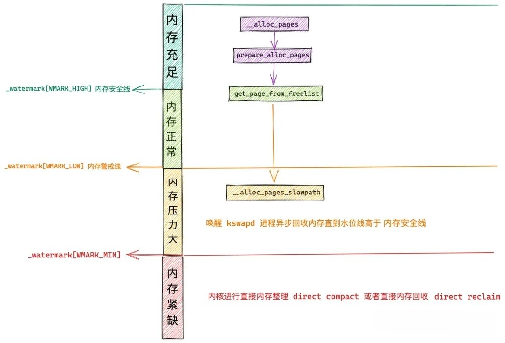

```c
struct alloc_context {
    // 运行进程 CPU 所在 NUMA  节点以及其所有备用 NUMA 节点中允许内存分配的内存区域
    struct zonelist *zonelist;
    // NUMA 节点状态掩码
    nodemask_t *nodemask;
    // 内存分配优先级最高的内存区域 zone
    struct zoneref *preferred_zoneref;
    // 物理内存页的迁移类型分为：不可迁移，可回收，可迁移类型，防止内存碎片
    int migratetype;

    // 内存分配最高优先级的内存区域 zone
    enum zone_type highest_zoneidx;
    // 是否允许当前 NUMA 节点中的脏页均衡扩散迁移至其他 NUMA 节点
    bool spread_dirty_pages;
};

static inline bool prepare_alloc_pages(gfp_t gfp_mask, unsigned int order,
        							   int preferred_nid, nodemask_t *nodemask,
        							   struct alloc_context *ac, gfp_t *alloc_gfp,
        							   unsigned int *alloc_flags)
{
    // 根据 gfp_mask 掩码中的内存区域修饰符获取内存分配最高优先级的内存区域 zone
    ac->highest_zoneidx = gfp_zone(gfp_mask);
    // 从 NUMA 节点的备用节点链表中一次性获取允许进行内存分配的所有内存区域
    ac->zonelist = node_zonelist(preferred_nid, gfp_mask);
    ac->nodemask = nodemask;
    // 从 gfp_mask 掩码中获取页面迁移属性，迁移属性分为：不可迁移，可回收，可迁移。
    ac->migratetype = gfp_migratetype(gfp_mask);

    // 如果使用 cgroup 将进程绑定限制在了某些 CPU 上，那么内存分配只能在这些绑定的 CPU 相关联的 NUMA 节点中进行
    if (cpusets_enabled()) {
        *alloc_gfp |= __GFP_HARDWALL;
        if (in_task() && !ac->nodemask)
            ac->nodemask = &cpuset_current_mems_allowed;
        else
            *alloc_flags |= ALLOC_CPUSET;
    }
      
    // 如果设置了允许直接内存回收，那么内存分配进程则可能会导致休眠被重新调度 
    might_sleep_if(gfp_mask & __GFP_DIRECT_RECLAIM);
    // 提前判断本次内存分配是否能够成功，如果不能则尽早失败
    if (should_fail_alloc_page(gfp_mask, order))
        return false;
    // 获取最高优先级的内存区域 zone，后续内存分配则首先会在该内存区域中进行分配
    ac->preferred_zoneref = first_zones_zonelist(ac->zonelist, ac->highest_zoneidx, ac->nodemask);

    return true;
}

static inline struct zonelist *node_zonelist(int nid, gfp_t flags)
{
	return NODE_DATA(nid)->node_zonelists + gfp_zonelist(flags);
}
```

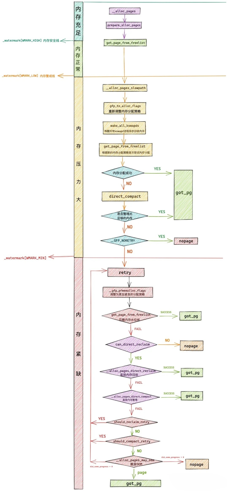

```c
static inline struct page *__alloc_pages_slowpath(gfp_t gfp_mask, unsigned int order, struct alloc_context *ac)
{
    // 在慢速内存分配路径中可能会导致内核进行直接内存回收，这里设置 __GFP_DIRECT_RECLAIM 表示允许内核进行直接内存回收
    bool can_direct_reclaim = gfp_mask & __GFP_DIRECT_RECLAIM;
    /* 本次内存分配是否是针对大量内存页的分配，内核定义 PAGE_ALLOC_COSTLY_ORDER = 3，也就是说内存请求内存页的数量大于 2 ^ 3 = 8 个内存页时，
     * costly_order = true，后续会影响是否进行 OOM
     */
    const bool costly_order = order > PAGE_ALLOC_COSTLY_ORDER;
    // 用于指向成功申请的内存
    struct page *page = NULL;
    // 内存分配标识，后续会根据不同标识进入到不同的内存分配逻辑处理分支
    unsigned int alloc_flags;
    // 后续用于记录直接内存回收了多少内存页，会影响是否需要进行内存分配重试
    unsigned long did_some_progress;
    // 关于内存整理相关参数
    enum compact_priority compact_priority;
    enum compact_result compact_result;
    int compaction_retries;
    // 记录重试的次数，超过一定的次数（MAX_RECLAIM_RETRIES = 16）则内存分配失败
    int no_progress_loops;
    unsigned int cpuset_mems_cookie;
    // 临时保存调整后的内存分配策略
    int reserve_flags;

    /* 流程现在来到了慢速内存分配这里，说明快速分配路径已经失败了。内核需要对 gfp_mask 分配行为掩码做一些修改，修改为一些更可能导致内存分配成功的标识。
     * 因为接下来的直接内存回收非常耗时可能会导致进程阻塞睡眠，不适用原子 __GFP_ATOMIC 内存分配的上下文。
     */
    if (WARN_ON_ONCE((gfp_mask & (__GFP_ATOMIC|__GFP_DIRECT_RECLAIM)) ==
                (__GFP_ATOMIC|__GFP_DIRECT_RECLAIM)))
        gfp_mask &= ~__GFP_ATOMIC;

retry_cpuset:

    /* 在之前的快速内存分配路径下设置的相关分配策略比较保守，不是很激进，用于在 WMARK_LOW 水位线之上进行快速内存分配。走到这里表示快速内存分配失败，
     * 此时空闲内存严重不足了。所以在慢速内存分配路径下需要重新设置更加激进的内存分配策略，采用更大的代价来分配内存。
     */
    alloc_flags = gfp_to_alloc_flags(gfp_mask);

    // 重新按照新的设置按照内存区域优先级计算 zonelist 的迭代起点（最高优先级的 zone），fast path 和 slow path 的设置不同所以这里需要重新计算
    ac->preferred_zoneref = first_zones_zonelist(ac->zonelist,
                    ac->highest_zoneidx, ac->nodemask);
    // 如果没有合适的内存分配区域，则跳转到 nopage , 内存分配失败
    if (!ac->preferred_zoneref->zone)
        goto nopage;
    // 唤醒所有的 kswapd 进程异步回收内存
    if (alloc_flags & ALLOC_KSWAPD)
        wake_all_kswapds(order, gfp_mask, ac);

    /* 此时所有的 kswapd 进程已经被唤醒，正在异步进行内存回收。之前已经在 gfp_to_alloc_flags 方法中重新调整了 alloc_flags
     * 换成了一套更加激进的内存分配策略，注意此时是在 WMARK_MIN 水位线之上进行内存分配。调整后的 alloc_flags 很可能会立即成功，因此这里先尝试一下。
     */
    page = get_page_from_freelist(gfp_mask, order, alloc_flags, ac);
    if (page)
        // 内存分配成功，跳转到 got_pg 直接返回 page
        goto got_pg;

    /* 对于分配大内存来说 costly_order = true (超过 8 个内存页)，需要首先进行内存整理，这样内核可以避免直接内存回收从而获取更多的连续空闲内存页
     * 对于需要分配不可移动的高阶内存的情况，也需要先进行内存整理，防止永久内存碎片
     */
    if (can_direct_reclaim &&
            (costly_order ||
               (order > 0 && ac->migratetype != MIGRATE_MOVABLE))
            && !gfp_pfmemalloc_allowed(gfp_mask)) {
        // 进行直接内存整理，获取更多的连续空闲内存防止内存碎片
        page = __alloc_pages_direct_compact(gfp_mask, order,
                        alloc_flags, ac,
                        INIT_COMPACT_PRIORITY,
                        &compact_result);
        if (page)
            goto got_pg;

        if (costly_order && (gfp_mask & __GFP_NORETRY)) {
            // 流程走到这里表示经过内存整理之后依然没有足够的内存供分配。但是设置了 NORETRY 标识不允许重试，那么就直接失败，跳转到 nopage
            if (compact_result == COMPACT_SKIPPED ||
                compact_result == COMPACT_DEFERRED)
                goto nopage;
            // 同步内存整理开销太大，后续开启异步内存整理
            compact_priority = INIT_COMPACT_PRIORITY;
        }
    }

retry:
    // 确保所有 kswapd 进程不要意外进入睡眠状态
    if (alloc_flags & ALLOC_KSWAPD)
        wake_all_kswapds(order, gfp_mask, ac);

    /* 流程走到这里，说明在 WMARK_MIN 水位线之上也分配内存失败了。并且经过内存整理之后，内存分配仍然失败，说明当前内存容量已经严重不足。
     * 接下来就需要使用更加激进的非常手段来尝试内存分配（忽略掉内存水位线），继续修改 alloc_flags 保存在 reserve_flags 中。
     */
    reserve_flags = __gfp_pfmemalloc_flags(gfp_mask);
    if (reserve_flags)
        alloc_flags = gfp_to_alloc_flags_cma(gfp_mask, reserve_flags);

    // 如果内存分配可以任意跨节点分配（忽略内存分配策略），这里需要重置 nodemask 以及 zonelist。
    if (!(alloc_flags & ALLOC_CPUSET) || reserve_flags) {
        // 这里的内存分配是高优先级系统级别的内存分配，不是面向用户的
        ac->nodemask = NULL;
        ac->preferred_zoneref = first_zones_zonelist(ac->zonelist,
                    ac->highest_zoneidx, ac->nodemask);
    }

    // 这里使用重新调整的 zonelist 和 alloc_flags 在尝试进行一次内存分配。注意此次的内存分配是忽略内存水位线的 ALLOC_NO_WATERMARKS
    page = get_page_from_freelist(gfp_mask, order, alloc_flags, ac);
    if (page)
        goto got_pg;

    // 在忽略内存水位线的情况下仍然分配失败，现在内核就需要进行直接内存回收了
    if (!can_direct_reclaim)
        // 如果进程不允许进行直接内存回收，则只能分配失败
        goto nopage;

    // 开始直接内存回收
    page = __alloc_pages_direct_reclaim(gfp_mask, order, alloc_flags, ac,
                            &did_some_progress);
    if (page)
        goto got_pg;

    // 直接内存回收之后仍然无法满足分配需求，则再次进行直接内存整理
    page = __alloc_pages_direct_compact(gfp_mask, order, alloc_flags, ac,
                    compact_priority, &compact_result);
    if (page)
        goto got_pg;

    // 在内存直接回收和整理全部失败之后，如果不允许重试，则只能失败
    if (gfp_mask & __GFP_NORETRY)
        goto nopage;

    /* 后续会触发 OOM 来释放更多的内存，这里需要判断本次内存分配是否需要分配大量的内存页（大于 8 ） costly_order = true
     * 如果是的话则内核认为即使执行 OOM 也未必会满足这么多的内存页分配需求。所以还是直接失败比较好，不再执行 OOM，除非设置 __GFP_RETRY_MAYFAIL
     */
    if (costly_order && !(gfp_mask & __GFP_RETRY_MAYFAIL))
        goto nopage;

    /* 流程走到这里说明已经尝试了所有措施内存依然分配失败了，此时内存已经非常危急了。
     * 进程允许内核进行重试流程，但在开始重试之前，内核需要判断是否应该进行重试,重试标准：
     * 1 如果内核已经重试了 MAX_RECLAIM_RETRIES (16) 次仍然失败，则放弃重试执行后续 OOM。
     * 2 如果内核将所有可选内存区域中的所有可回收页面全部回收之后，仍然无法满足内存的分配，那么放弃重试执行后续 OOM
     */
    if (should_reclaim_retry(gfp_mask, order, ac, alloc_flags,
                 did_some_progress > 0, &no_progress_loops))
        goto retry;

    /* 如果内核判断不应进行直接内存回收的重试，这里还需要判断下是否应该进行内存整理的重试。did_some_progress 表示上次直接内存回收具体回收了多少内存页。
     * 如果 did_some_progress = 0 则没有必要在进行内存整理重试了，因为内存整理的实现依赖于足够的空闲内存量
     */
    if (did_some_progress > 0 &&
            should_compact_retry(ac, order, alloc_flags,
                compact_result, &compact_priority,
                &compaction_retries))
        goto retry;


    // 根据 nodemask 中的内存分配策略判断是否应该在进程所允许运行的所有 CPU 关联的 NUMA 节点上重试
    if (check_retry_cpuset(cpuset_mems_cookie, ac))
        goto retry_cpuset;

    // 最后的杀手锏，进行 OOM，选择一个得分最高的进程，释放其占用的内存 
    page = __alloc_pages_may_oom(gfp_mask, order, ac, &did_some_progress);
    if (page)
        goto got_pg;

    // 只要 oom 产生了作用并释放了内存 did_some_progress > 0 就不断的进行重试
    if (did_some_progress) {
        no_progress_loops = 0;
        goto retry;
    }

nopage:
    /* 流程走到这里表明内核已经尝试了包括 OOM 在内的所有回收内存的动作。但是这些措施依然无法满足内存分配的需求，看上去内存分配到这里就应该失败了。
     * 但是如果设置了 __GFP_NOFAIL 表示不允许内存分配失败，那么接下来就会进入 if 分支进行处理
     */
    if (gfp_mask & __GFP_NOFAIL) {
        // 如果不允许进行直接内存回收，则跳转至 fail 分支宣告失败
        if (WARN_ON_ONCE_GFP(!can_direct_reclaim, gfp_mask))
            goto fail;

        // 此时内核已经无法通过回收内存来获取可供分配的空闲内存了。对于 PF_MEMALLOC 类型的内存分配请求，内核现在无能为力，只能不停的进行 retry 重试。
        WARN_ON_ONCE_GFP(current->flags & PF_MEMALLOC, gfp_mask);

        /* 对于需要分配 8 个内存页以上的大内存分配，并且设置了不可失败标识 __GFP_NOFAIL
         * 内核现在也无能为力，毕竟现实是已经没有空闲内存了，只是给出一些告警信息
         */
        WARN_ON_ONCE_GFP(order > PAGE_ALLOC_COSTLY_ORDER, gfp_mask);

        // 在 __GFP_NOFAIL 情况下，尝试进行跨 NUMA 节点内存分配
        page = __alloc_pages_cpuset_fallback(gfp_mask, order, ALLOC_HARDER, ac);
        if (page)
            goto got_pg;
        /* 在进行内存分配重试流程之前，需要让 CPU 重新调度到其他进程上。运行一会其他进程，因为毕竟此时内存已经严重不足
         * 立马重试的话只能浪费过多时间在搜索空闲内存上，导致其他进程处于饥饿状态。
         */
        cond_resched();
        // 跳转到 retry 分支，重试内存分配流程
        goto retry;
    }
fail:
    warn_alloc(gfp_mask, ac->nodemask,
            "page allocation failure: order:%u", order);
got_pg:
    return page;
}

static inline unsigned int gfp_to_alloc_flags(gfp_t gfp_mask)
{
    /* 在慢速内存分配路径中，会进一步放宽对内存分配的限制，将内存分配水位线调低到 WMARK_MIN，
     * 即内存区域中的剩余内存需要在 WMARK_MIN 水位线之上才可以进行内存分配
     */
    unsigned int alloc_flags = ALLOC_WMARK_MIN | ALLOC_CPUSET;
    
    // 如果内存分配请求无法运行直接内存回收，或者分配请求设置了 __GFP_HIGH，那么意味着内存分配会更多的使用紧急预留内存
    alloc_flags |= (__force int)
        (gfp_mask & (__GFP_HIGH | __GFP_KSWAPD_RECLAIM));

    if (gfp_mask & __GFP_ATOMIC) {
        //  ___GFP_NOMEMALLOC 标志用于明确禁止内核从紧急预留内存中获取内存。___GFP_NOMEMALLOC 标识的优先级要高于 ___GFP_MEMALLOC
        if (!(gfp_mask & __GFP_NOMEMALLOC))
           // 如果允许从紧急预留内存中分配，则需要进一步放宽内存分配限制。后续根据 ALLOC_HARDER 标识会降低 WMARK_LOW 水位线
            alloc_flags |= ALLOC_HARDER;
        /* 在这个分支中表示内存分配请求已经设置了  __GFP_ATOMIC （非常重要，不允许失败）
         * 这种情况下为了内存分配的成功，会去除掉 CPUSET 的限制，可以在所有 NUMA 节点上分配内存
         */
        alloc_flags &= ~ALLOC_CPUSET;
    } else if (unlikely(rt_task(current)) && in_task())
         // 如果当前进程不是 real time task 或者不在 task 上下文中。设置 HARDER 标识
        alloc_flags |= ALLOC_HARDER;

    return alloc_flags;
}

static inline int __gfp_pfmemalloc_flags(gfp_t gfp_mask)
{
    // 如果不允许从紧急预留内存中分配，则不改变 alloc_flags
    if (unlikely(gfp_mask & __GFP_NOMEMALLOC))
        return 0;
    // 如果允许从紧急预留内存中分配，则后面的内存分配会忽略内存水位线的限制
    if (gfp_mask & __GFP_MEMALLOC)
        return ALLOC_NO_WATERMARKS;
    // 当前进程处于软中断上下文并且进程设置了 PF_MEMALLOC 标识，则忽略内存水位线
    if (in_serving_softirq() && (current->flags & PF_MEMALLOC))
        return ALLOC_NO_WATERMARKS;
    // 当前进程不在任何中断上下文中
    if (!in_interrupt()) {
        if (current->flags & PF_MEMALLOC)
            // 忽略内存水位线
            return ALLOC_NO_WATERMARKS;
        else if (oom_reserves_allowed(current))
            // 当前进程允许进行 OOM
            return ALLOC_OOM;
    }
    // alloc_flags 不做任何修改
    return 0;
}
```

### 伙伴系统

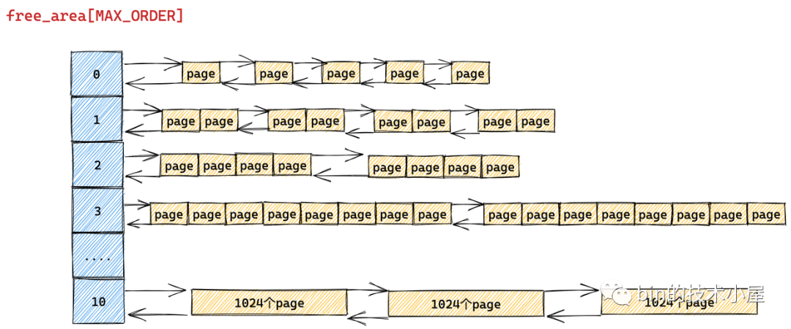

数组 `free_area[MAX_ORDER]` 中的索引表示的就是分配阶 order，用于指定对应双向链表组织管理的内存块包含多少个 page。可以通过 `cat /proc/buddyinfo` 命令来查看 NUMA 节点中不同内存区域 zone 的伙伴系统当前状态：

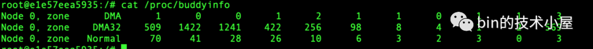

上图展示了不同内存区域伙伴系统的 `free_area[MAX_ORDER]` 数组中，不同分配阶对应的内存块个数，从左到右依次是 0 阶，1 阶， ........ ，10 阶对应的双向链表中包含的内存块个数。

```c
struct free_area {
	struct list_head	free_list[MIGRATE_TYPES];
	unsigned long		nr_free;
};
```

`struct free_area` 主要描述的就是相同尺寸的内存块在伙伴系统中的组织结构， `nr_free` 则表示的是该尺寸的内存块在当前伙伴系统中的个数，这个值会随着内存的分配而减少，随着内存的回收而增加。`nr_free` 表示的不是空闲内存页 page 的个数，而是**空闲内存块**的个数，对于 0 阶的内存块来说 `nr_free` 确实表示的是单个内存页 page 的个数，因为 0 阶内存块是由一个 page 组成的，但是对于 1 阶内存块来说，`nr_free` 则表示的是 2 个 page 集合的个数，以此类推对于 n 阶内存块来说，`nr_free` 表示的是 2 的 n 次方 page 集合的个数

`free_area` 是将相同尺寸的内存块组织起来，`free_list` 是在 `free_area` 的基础上近一步根据页面的迁移类型将这些相同尺寸的内存块划分到不同的双向链表中管理。内核会根据物理内存页的迁移类型 `MIGRATE_TYPES` 将这些相同尺寸的内存块近一步通过不同的双向链表重新组织起来。

```c
/* /include/linux/mmzone.h */
enum migratetype {
    // 不可移动的内存页类型，内核所需要的核心内存大多数是从 MIGRATE_UNMOVABLE 类型的页面中进行分配，这部分内存一般位于内核虚拟地址空间中的直接映射区。
	MIGRATE_UNMOVABLE,
    /* 可以移动的内存页类型，这种页面类型一般用于在进程用户空间中分配，因为在用户空间中虚拟内存与物理内存都是通过页表来动态映射的，物理页移动之后，
     * 只需要改变页表中的映射关系即可，而虚拟内存地址并不需要改变。一切对进程来说都是透明的。
     */
	MIGRATE_MOVABLE,
    /* 表示不能移动，但是可以直接回收的页面类型，比如前面提到的文件缓存页，它们就可以直接被回收掉，当再次需要的时候可以从磁盘中继续读取生成。
     * 或者一些生命周期比较短的内存页，比如 DMA 缓存区中的内存页也是可以被直接回收掉。
     */
	MIGRATE_RECLAIMABLE,
    // 表示 CPU 高速缓存中的页面类型，PCP 是 per_cpu_pageset 的缩写，每个 CPU 对应一个 per_cpu_pageset 结构，里面包含了高速缓存中的冷页和热页。
	MIGRATE_PCPTYPES,
	MIGRATE_HIGHATOMIC = MIGRATE_PCPTYPES, // 紧急内存
#ifdef CONFIG_CMA
	MIGRATE_CMA, // 预留的连续内存 CMA
#endif
#ifdef CONFIG_MEMORY_ISOLATION
    // 是一个虚拟区域，用于跨越 NUMA 节点移动物理内存页，内核可以将物理内存页移动到使用该页最频繁的 CPU 所在的 NUMA 节点中。
	MIGRATE_ISOLATE,	/* can't allocate from here */
#endif
	MIGRATE_TYPES // 不代表任何区域，只是单纯表示一共有多少个迁移类型
};
```

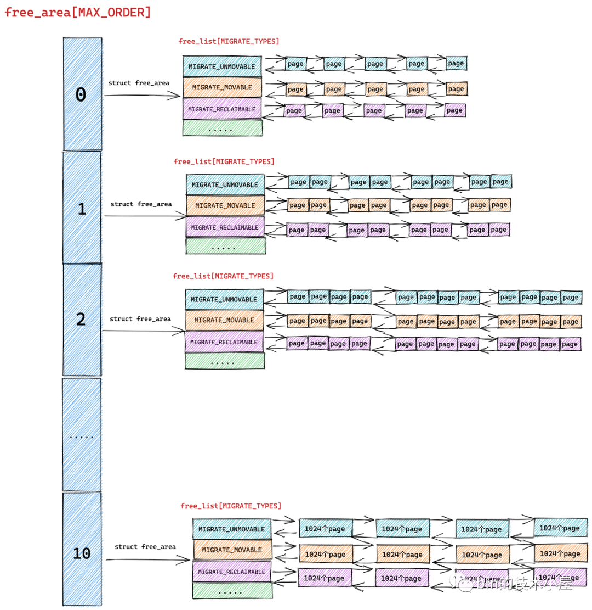

可以通过 `cat /proc/pagetypeinfo` 命令可以查看当前各个内存区域中的伙伴系统中不同页面迁移类型以及不同 order 尺寸的内存块个数。page block order 表示系统中支持的大页对应的分配阶，pages per block 表示大页中包含的 pages 个数。

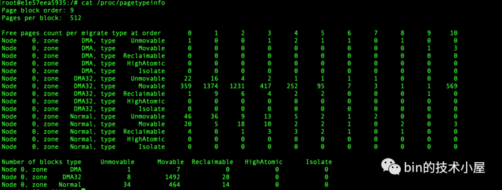

内核中的伙伴指的是大小相同并且在物理内存上是连续的两个或者多个 page。比如 `free_area[1]` 中组织的是分配阶 order = 1 的内存块，内存块中包含了两个连续的空闲 page。这两个空闲 page 就是伙伴。`free_area[10]` 中组织的是分配阶 order = 10 的内存块，内存块中包含了 1024 个连续的空闲 page。这 1024 个空闲 page 就是伙伴。

##### 内存分配

一个具体的例子来明伙伴系统的整个内存分配过程，暂时忽略 `MIGRATE_TYPES` 相关的组织结构：

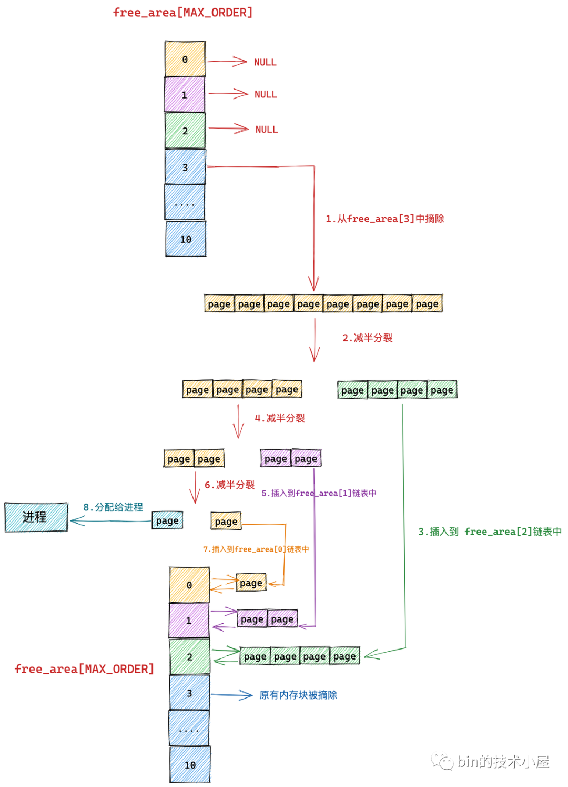	

现在加上了内存 `MIGRATE_TYPES` 的组织结构，其实分配流程还是和核心流程一样的，只不过上面提到的那些高阶 order 的减半分裂情形都发生在各个 `free_area[order]` 中固定的 `free_list[MIGRATE_TYPE]` 里罢了。比如要求分配的内存迁移属性要求是 `MIGRATE_MOVABLE` 类型，那么减半分裂流程分别发生在 `free_area[2]` ，`free_area[1]` ，`free_area[0]` 对应的 `free_list[MIGRATE_MOVABLE]` 中，多了一个 `free_list` 的维度，仅此而已。

下面考虑内存分配的一种异常情形，比如想要分配特定迁移类型的内存，但是当前伙伴系统所有 `free_area[order]` 里对应的 `free_list[MIGRATE_TYPE]` 均无法满足内存分配的需求（没有足够特定迁移类型的空闲内存块）。内核根据不同迁移类型定义了不同的 fallback 规则：

```c
/*
 * This array describes the order lists are fallen back to when
 * the free lists for the desirable migrate type are depleted
 *
 * The other migratetypes do not have fallbacks.
 */
static int fallbacks[MIGRATE_TYPES][3] = {
    /* MIGRATE_UNMOVABLE 类型的 free_list 内存不足时，内核会 fallback 到 MIGRATE_RECLAIMABLE 中去获取，如果还是不足，
     * 则再次降级到 MIGRATE_MOVABLE 中获取，如果仍然无法满足内存分配，才会失败退出。
     */
	[MIGRATE_UNMOVABLE]   = { MIGRATE_RECLAIMABLE, MIGRATE_MOVABLE,   MIGRATE_TYPES },
	[MIGRATE_MOVABLE]     = { MIGRATE_RECLAIMABLE, MIGRATE_UNMOVABLE, MIGRATE_TYPES },
	[MIGRATE_RECLAIMABLE] = { MIGRATE_UNMOVABLE,   MIGRATE_MOVABLE,   MIGRATE_TYPES },
};
```

正常的分配流程先是从低阶到高阶依次查找空闲内存块，然后将高阶中的内存块依次减半分裂到低阶 `free_list` 链表中。内存分配 fallback 流程则刚好是相反的，它是先从备用 fallback 类型的迁移列表中的**最高阶**开始查找，找到一块空闲内存块之后，先迁移到最初指定的 `free_list[MIGRATE_TYPE]` 链表中，然后在指定的 `free_list[MIGRATE_TYPE]` 链表执行减半分裂。即内核 fallback 策略是：如果无法避免分配迁移类型不同的内存块，那么就分配一个尽可能大的内存块（从最高阶开始查找），避免向其他链表引入内存碎片。

比如向伙伴系统申请 `MIGRATE_UNMOVABLE` 迁移类型的内存时，假设内核在伙伴系统中的 `free_area[0]` 到 `free_area[10]` 中的所有 `free_list[MIGRATE_UNMOVABLE]` 链表中均无法找到一个空闲的内存块。那么就会 fallback 到 `MIGRATE_RECLAIMABLE` 类型，从最高阶 `free_area[10]` 中的 `free_list[MIGRATE_RECLAIMABLE]` 链表开始查找，如果找到一个空闲的内存块，则首先会迁移到对应的 order 的 `free_list[MIGRATE_UNMOVABLE]` 链表，然后流程继续回到核心流程，在各个 `free_area[order]` 对应的 `free_list[MIGRATE_UNMOVABLE]` 链表中执行减半分裂。

##### 内存回收

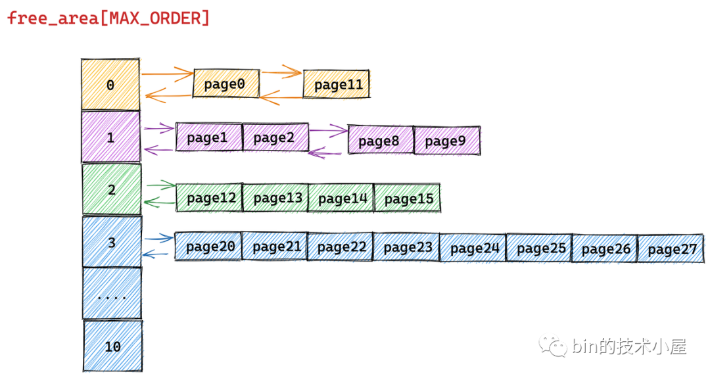


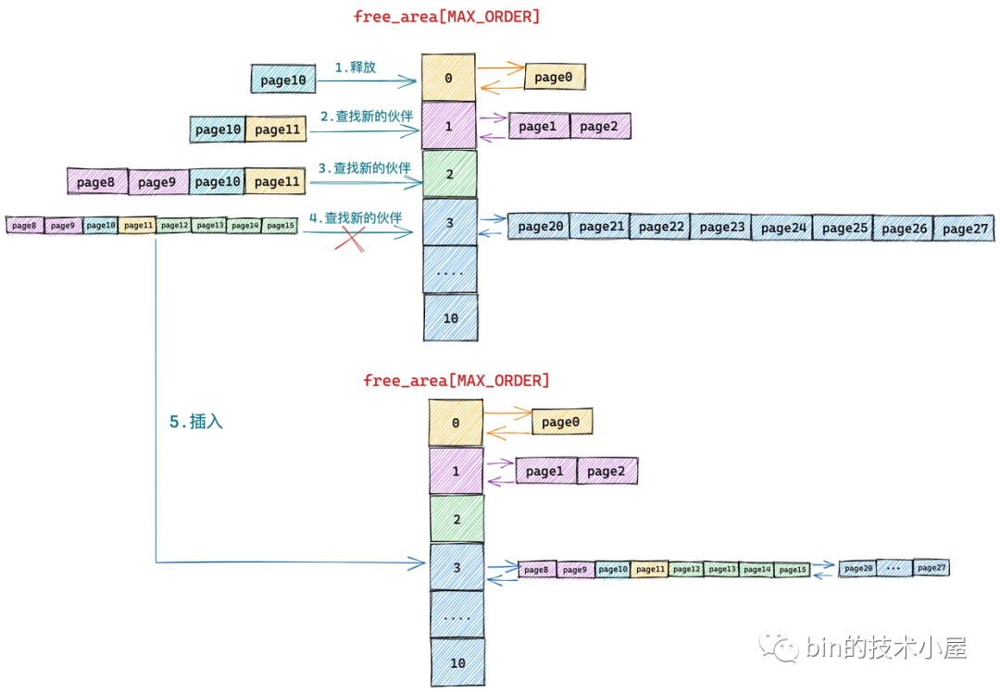

`get_page_from_freelist` 主干框架就是通过 `for_next_zone_zonelist_nodemask` 来遍历当前 NUMA 节点以及备用节点的所有内存区域（zonelist），然后逐个通过 `zone_watermark_fast` 检查这些内存区域 zone 中的剩余空闲内存容量是否在指定的水位线 mark 之上。如果满足水位线的要求则直接调用 `rmqueue `进入伙伴系统分配内存，分配成功之后通过 `prep_new_page` 初始化分配好的内存页 page。

如果当前正在遍历的 zone 中剩余空闲内存容量在指定的水位线 mark 之下，就需要通过 `node_reclaim` 触发内存回收，随后通过 `zone_watermark_ok` 检查经过内存回收之后，内核是否回收到了足够的内存以满足本次内存分配的需要。如果内存回收到了足够的内存则 `zone_watermark_ok = true` 随后跳转到 `try_this_zone` 分支在本内存区域 zone 中分配内存。否则继续遍历下一个 zone。

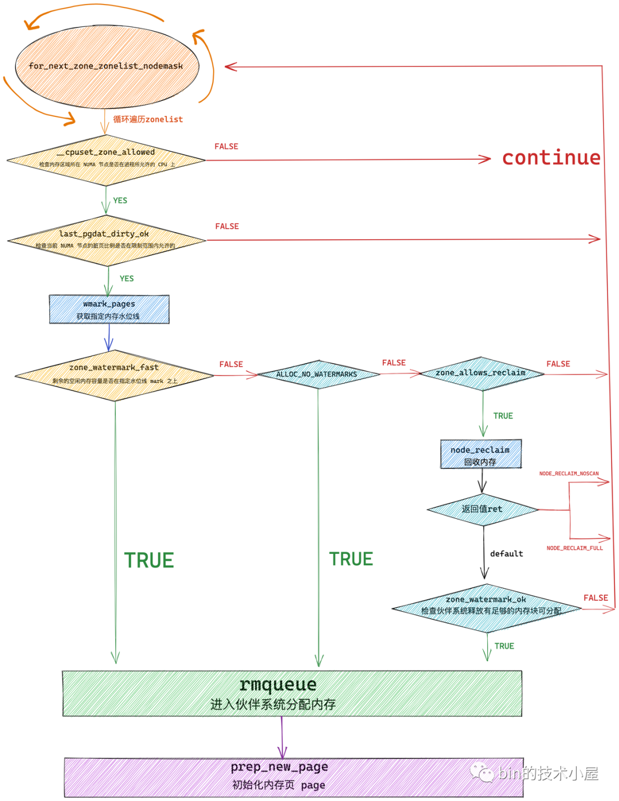

```c
/*
 * get_page_from_freelist goes through the zonelist trying to allocate
 * a page.
 */
static struct page *
get_page_from_freelist(gfp_t gfp_mask, unsigned int order, int alloc_flags,
                       const struct alloc_context *ac)
{
    struct zoneref *z;
    // 当前遍历到的内存区域 zone 引用
    struct zone *zone;
    // 最近遍历的NUMA节点
    struct pglist_data *last_pgdat = NULL;
    // 最近遍历的NUMA节点中包含的脏页数量是否在内核限制范围内
    bool last_pgdat_dirty_ok = false;
    // 如果需要避免内存碎片，则 no_fallback = true
    bool no_fallback;

retry:
    // 是否需要避免内存碎片
    no_fallback = alloc_flags & ALLOC_NOFRAGMENT;
    z = ac->preferred_zoneref;
    // 开始遍历 zonelist，查找可以满足本次内存分配的物理内存区域 zone
    for_next_zone_zonelist_nodemask(zone, z, ac->highest_zoneidx,
                    ac->nodemask) {
        // 指向分配成功之后的内存
        struct page *page;
        // 内存分配过程中设定的水位线
        unsigned long mark;
        // 检查内存区域所在 NUMA 节点是否在进程所允许的 CPU 上
        if (cpusets_enabled() &&
            (alloc_flags & ALLOC_CPUSET) &&
            !__cpuset_zone_allowed(zone, gfp_mask))
                continue;
        /* 每个 NUMA 节点中包含的脏页数量都有一定的限制。如果本次内存分配是为 page cache 分配的 page，用于写入数据（不久就会变成脏页）
         * 这里需要检查当前 NUMA 节点的脏页比例是否在限制范围内允许的。如果没有超过脏页限制则可以进行分配，如果已经超过 last_pgdat_dirty_ok = false
         */
        if (ac->spread_dirty_pages) {
            if (last_pgdat != zone->zone_pgdat) {
                last_pgdat = zone->zone_pgdat;
                last_pgdat_dirty_ok = node_dirty_ok(zone->zone_pgdat);
            }

            if (!last_pgdat_dirty_ok)
                continue;
        }

        // 如果内核设置了避免内存碎片标识，在本地节点无法满足内存分配的情况下(因为需要避免内存碎片)。这轮循环会遍历 remote 节点（跨NUMA节点）
        if (no_fallback && nr_online_nodes > 1 &&
            zone != ac->preferred_zoneref->zone) {
            int local_nid;
            // 如果本地节点分配内存失败是因为避免内存碎片的原因，那么会继续回到本地节点进行 retry 重试同时取消 ALLOC_NOFRAGMENT（允许引入碎片）
            local_nid = zone_to_nid(ac->preferred_zoneref->zone);
            if (zone_to_nid(zone) != local_nid) {
                // 内核认为保证本地的局部性会比避免内存碎片更加重要
                alloc_flags &= ~ALLOC_NOFRAGMENT;
                goto retry;
            }
        }
        // 获取本次内存分配需要考虑到的内存水位线，快速路径下是 WMARK_LOW, 慢速路径下是 WMARK_MIN
        mark = wmark_pages(zone, alloc_flags & ALLOC_WMARK_MASK);
        // 检查当前遍历到的 zone 里剩余的空闲内存容量是否在指定水位线 mark 之上。剩余内存容量在水位线之下返回 false
        if (!zone_watermark_fast(zone, order, mark,
                       ac->highest_zoneidx, alloc_flags,
                       gfp_mask)) {
            int ret;

            // 如果本次内存分配策略是忽略内存水位线，那么就在本次遍历到的zone里尝试分配内存
            if (alloc_flags & ALLOC_NO_WATERMARKS)
                goto try_this_zone;
            // 如果本次内存分配不能忽略内存水位线的限制，那么就会判断当前 zone 所属 NUMA 节点是否允许进行内存回收
            if (!node_reclaim_enabled() ||
                !zone_allows_reclaim(ac->preferred_zoneref->zone, zone))
                // 不允许进行内存回收则继续遍历下一个 NUMA 节点的内存区域
                continue;
            // 针对当前 zone 所在 NUMA 节点进行内存回收
            ret = node_reclaim(zone->zone_pgdat, gfp_mask, order);
            switch (ret) {
            case NODE_RECLAIM_NOSCAN:
                // 返回该值表示当前 NUMA 节点没有必要进行回收。比如快速分配路径下就不处理页面回收的问题
                continue;
            case NODE_RECLAIM_FULL:
                // 返回该值表示通过扫描之后发现当前 NUMA 节点并没有可以回收的内存页
                continue;
            default:
                // 该分支表示当前 NUMA 节点已经进行了内存回收操作，zone_watermark_ok 判断内存回收是否回收了足够的内存能否满足内存分配的需要
                if (zone_watermark_ok(zone, order, mark,
                    ac->highest_zoneidx, alloc_flags))
                    goto try_this_zone;

                continue;
            }
        }

try_this_zone:
        // 这里就是伙伴系统的入口，rmqueue 函数中封装的就是伙伴系统的核心逻辑，从伙伴系统中获取内存
        page = rmqueue(ac->preferred_zoneref->zone, zone, order,
                gfp_mask, alloc_flags, ac->migratetype);
        if (page) {
            // 分配内存成功，初始化内存页 page
            prep_new_page(page, order, gfp_mask, alloc_flags);
            return page;
        } else {
        	......
        }
    }
        
    // 内存分配失败
    return NULL;
}

#define wmark_pages(z, i) (z->_watermark[i] + z->watermark_boost)

static inline bool zone_watermark_fast(struct zone *z, unsigned int order,
                					   unsigned long mark, int highest_zoneidx,
                					   unsigned int alloc_flags, gfp_t gfp_mask)
{
    long free_pages;
    /* 获取当前内存区域中所有空闲的物理内存页。free_pages 表示的当前 zone 里剩余空闲内存页的一个总量，是一个全集的概念。
     * 其中还包括了内存区域的预留内存 lowmem_reserve 以及为 highatomic 预留的紧急内存。这些预留内存都有自己特定的用途，普通内存的申请不会用到预留内存。
     */
    free_pages = zone_page_state(z, NR_FREE_PAGES);

    // 快速检查分配阶 order = 0 情况下相关水位线，空闲内存需要刨除掉为 highatomic 预留的紧急内存
    if (!order) {
        long usable_free;
        long reserved;
        // 可供本次内存分配使用的符合要求的真实可用内存，初始为 free_pages，即空闲内存页的全集，其中也包括了不能为本次内存分配提供内存的空闲内存
        usable_free = free_pages;
        // 获取本次不能使用的空闲内存页数量。
        reserved = __zone_watermark_unusable_free(z, 0, alloc_flags);

        // 计算真正可供内存分配的空闲页数量：空闲内存页全集 - 不能使用的空闲页
        usable_free -= min(usable_free, reserved);
        // 如果可用的空闲内存页数量大于内存水位线与预留内存之和，那么表示物理内存区域中的可用空闲内存能够满足本次内存分配的需要
        if (usable_free > mark + z->lowmem_reserve[highest_zoneidx])
            return true;
    }
    // 近一步检查内存区域伙伴系统中是否有足够的 order 阶的内存块可供分配
    if (__zone_watermark_ok(z, order, mark, highest_zoneidx, alloc_flags,
                    free_pages))
        return true;

        ......

    // 水位线检查失败
    return false;
}

static inline long __zone_watermark_unusable_free(struct zone *z,
                unsigned int order, unsigned int alloc_flags)
{
    // ALLOC_HARDER 的设置表示可以使用 high-atomic 紧急预留内存
    const bool alloc_harder = (alloc_flags & (ALLOC_HARDER|ALLOC_OOM));
    long unusable_free = (1 << order) - 1;
    // 如果没有设置 ALLOC_HARDER 则不能使用  high_atomic 紧急预留内存
    if (likely(!alloc_harder))
        // 不可用内存的数量需要统计上 high-atomic 这部分内存
        unusable_free += z->nr_reserved_highatomic;

#ifdef CONFIG_CMA
    // 如果没有设置 ALLOC_CMA 则表示本次内存分配不能从 CMA 区域获取
    if (!(alloc_flags & ALLOC_CMA))
        // 不可用内存的数量需要统计上 CMA 区域中的空闲内存页
        unusable_free += zone_page_state(z, NR_FREE_CMA_PAGES);
#endif
    // 返回不可用内存的数量，表示本次内存分配不能使用的内存容量
    return unusable_free;
}

bool __zone_watermark_ok(struct zone *z, unsigned int order, unsigned long mark,
             int highest_zoneidx, unsigned int alloc_flags,
             long free_pages)
{
    // 保证内存分配顺利进行的最低水位线
    long min = mark;
    int o;
    const bool alloc_harder = (alloc_flags & (ALLOC_HARDER|ALLOC_OOM));

    // 获取真正可用的剩余空闲内存页数量
    free_pages -= __zone_watermark_unusable_free(z, order, alloc_flags);

    // 如果设置了 ALLOC_HIGH 则水位线降低二分之一，使内存分配更加努力激进一些
    if (alloc_flags & ALLOC_HIGH)
        min -= min / 2;

    if (unlikely(alloc_harder)) {
        // 在要进行 OOM 的情况下内存分配会比普通的 ALLOC_HARDER 策略更加努力激进一些，所以这里水位线会降低二分之一
        if (alloc_flags & ALLOC_OOM)
            min -= min / 2;
        else
            // ALLOC_HARDER 策略下水位线只会降低四分之一 
            min -= min / 4;
    }

    // 检查当前可用剩余内存是否在指定水位线之上。内存的分配必须保证可用剩余内存容量在指定水位线之上，否则不能进行内存分配
    if (free_pages <= min + z->lowmem_reserve[highest_zoneidx])
        return false;

    // 流程走到这里，对应内存分配阶 order = 0 的情况下就已经 OK 了。剩余空闲内存在水位线之上，那么肯定能够分配一页出来
    if (!order)
        return true;

    /* 但是对于 high-order 的内存分配，这里还需要近一步检查伙伴系统。
     * 根据伙伴系统内存分配的原理，这里需要检查高阶 free_list 中是否有足够的空闲内存块可供分配。
     */
    for (o = order; o < MAX_ORDER; o++) {
        // 从当前分配阶 order 对应的 free_area 中检查是否有足够的内存块
        struct free_area *area = &z->free_area[o];
        int mt;
        // 如果当前 free_area 中的 nr_free = 0 表示对应 free_list 中没有合适的空闲内存块，那么继续到高阶 free_area 中查找
        if (!area->nr_free)
            continue;
         // 检查 free_area 中所有的迁移类型 free_list 是否有足够的内存块
        for (mt = 0; mt < MIGRATE_PCPTYPES; mt++) {
            if (!free_area_empty(area, mt))
                return true;
        }

#ifdef CONFIG_CMA
       // 如果内存分配指定需要从 CMA 区域中分配连续内存，那么就需要检查 MIGRATE_CMA 对应的 free_list 是否是空
        if ((alloc_flags & ALLOC_CMA) &&
            !free_area_empty(area, MIGRATE_CMA)) {
            return true;
        }
#endif
        // 如果设置了 ALLOC_HARDER，则表示可以从 HIGHATOMIC 区中的紧急预留内存中分配，检查对应 free_list
        if (alloc_harder && !free_area_empty(area, MIGRATE_HIGHATOMIC))
            return true;
    }
    // 伙伴系统中的剩余内存块无法满足 order 阶的内存分配
    return false;
}

static void prep_new_page(struct page *page, unsigned int order, gfp_t gfp_flags,
                            unsigned int alloc_flags)
{
    // 初始化 struct page，清除一些页面属性标记
    post_alloc_hook(page, order, gfp_flags);

    // 设置复合页
    if (order && (gfp_flags & __GFP_COMP))
        prep_compound_page(page, order);

    if (alloc_flags & ALLOC_NO_WATERMARKS)
        // 使用 set_page_XXX(page) 方法设置 page 的 PG_XXX 标志位
        set_page_pfmemalloc(page);
    else
         // 使用 clear_page_XXX(page) 方法清除 page 的 PG_XXX 标志位
        clear_page_pfmemalloc(page);
}

/* 当内核向伙伴系统申请复合页 compound_page 的时候，会在 gfp_flags 掩码中设置 __GFP_COMP 标识，表次本次内存分配要分配一个复合页，
 * 复合页中的 page 个数由分配阶 order 决定。当内核向伙伴系统申请了 2 ^ order 个内存页 page 时，在伙伴系统的视角中内存还是一页一页的，
 * 伙伴系统并不知道有复合页的存在。申请成功之后，需要在 prep_new_page 函数中将这 2 ^ order 个内存页 page 组装成一个 复合页 compound_page。
 */
void prep_compound_page(struct page *page, unsigned int order)
{
    int i;
    int nr_pages = 1 << order;
    // 设置首页 page 中的 flags 为 PG_head
    __SetPageHead(page);
    // 首页之后的 page 全部是尾页，循环遍历设置尾页
    for (i = 1; i < nr_pages; i++)
        prep_compound_tail(page, i);
    // 最后设置首页相关属性
    prep_compound_head(page, order);
}
    
static void prep_compound_tail(struct page *head, int tail_idx)
{
    // 由于复合页中的 page 全部是连续的，直接使用偏移即可获得对应尾页
    struct page *p = head + tail_idx;
    // 设置尾页标识
    p->mapping = TAIL_MAPPING;
    // 尾页 page 结构中的 compound_head 指向首页
    set_compound_head(p, head);
}

static __always_inline void set_compound_head(struct page *page, struct page *head)
{
	WRITE_ONCE(page->compound_head, (unsigned long)head + 1);
}

static void prep_compound_head(struct page *page, unsigned int order)
{
    // 设置首页相关属性
    set_compound_page_dtor(page, COMPOUND_PAGE_DTOR);
    set_compound_order(page, order);
    atomic_set(compound_mapcount_ptr(page), -1);
    atomic_set(compound_pincount_ptr(page), 0);
}

/*
 * Allocate a page from the given zone. Use pcplists for order-0 allocations.
 */
static inline
struct page *rmqueue(struct zone *preferred_zone,
            struct zone *zone, unsigned int order,
            gfp_t gfp_flags, unsigned int alloc_flags,
            int migratetype)
{
    unsigned long flags;
    struct page *page;

    if (likely(order == 0)) {
        // 申请一个物理页面（order = 0）时，内核首先会从 CPU 高速缓存列表 pcplist 中直接分配，而不会走伙伴系统，提高内存分配速度
        page = rmqueue_pcplist(preferred_zone, zone, gfp_flags,
                    migratetype, alloc_flags);
        goto out;
    }
    // 加锁并关闭中断，防止并发访问
    spin_lock_irqsave(&zone->lock, flags);

    // 当申请页面超过一个 （order > 0）时，则从伙伴系统中进行分配
    do {
        page = NULL;
        if (alloc_flags & ALLOC_HARDER) {
            // 如果设置了 ALLOC_HARDER 分配策略，则从伙伴系统的 HIGHATOMIC 迁移类型的 freelist 中获取
            page = __rmqueue_smallest(zone, order, MIGRATE_HIGHATOMIC);
        }
        if (!page)
            // 从伙伴系统中申请分配阶 order 大小的物理内存块
            page = __rmqueue(zone, order, migratetype, alloc_flags);
    } while (page && check_new_pages(page, order));
    // 解锁
    spin_unlock(&zone->lock);
    if (!page)
        goto failed;
    // 重新统计内存区域中的相关统计指标
    zone_statistics(preferred_zone, zone);
    // 打开中断
    local_irq_restore(flags);

out:
    return page;

failed:
    // 分配失败
    local_irq_restore(flags);
    return NULL;
}

/* Lock and remove page from the per-cpu list */
static struct page *rmqueue_pcplist(struct zone *preferred_zone,
            struct zone *zone, gfp_t gfp_flags,
            int migratetype, unsigned int alloc_flags)
{
    struct per_cpu_pages *pcp;
    struct list_head *list;
    struct page *page;
    unsigned long flags;
    // 关闭中断
    local_irq_save(flags);
    // 获取运行当前进程的 CPU 高速缓存列表 pcplist
    pcp = &this_cpu_ptr(zone->pageset)->pcp;
    // 获取指定页面迁移类型的 pcplist
    list = &pcp->lists[migratetype];
    // 从指定迁移类型的 pcplist 中移除一个页面，用于内存分配
    page = __rmqueue_pcplist(zone,  migratetype, alloc_flags, pcp, list);
    if (page) {
        // 统计内存区域内的相关信息
        zone_statistics(preferred_zone, zone);
    }
    // 开中断
    local_irq_restore(flags);
    return page;
}

/* Remove page from the per-cpu list, caller must protect the list */
static struct page *__rmqueue_pcplist(struct zone *zone, int migratetype,
            unsigned int alloc_flags,
            struct per_cpu_pages *pcp,
            struct list_head *list)
{
    struct page *page;

    do {
        // 如果当前 pcplist 中的页面为空，那么则从伙伴系统中获取 batch 个页面放入 pcplist 中
        if (list_empty(list)) {
            pcp->count += rmqueue_bulk(zone, 0,
                    pcp->batch, list,
                    migratetype, alloc_flags);
            if (unlikely(list_empty(list)))
                return NULL;
        }
        // 获取 pcplist 上的第一个物理页面
        page = list_first_entry(list, struct page, lru);
        // 将该物理页面从 pcplist 中摘除
        list_del(&page->lru);
        // pcplist 中的 count  减一
        pcp->count--;
    } while (check_new_pcp(page));

    return page;
}

/*
 * Go through the free lists for the given migratetype and remove
 * the smallest available page from the freelists
 */
static __always_inline
struct page *__rmqueue_smallest(struct zone *zone, unsigned int order,
                        int migratetype)
{
    unsigned int current_order;
    struct free_area *area;
    struct page *page;

    /* 从当前分配阶 order 开始在伙伴系统对应的  free_area[order]  里查找合适尺寸的内存块 */
    for (current_order = order; current_order < MAX_ORDER; ++current_order) {
        // 获取当前 order 在伙伴系统中对应的 free_area[order] 
        area = &(zone->free_area[current_order]);
        // 从 free_area[order] 中对应的 free_list[MIGRATE_TYPE] 链表中获取空闲内存块
        page = get_page_from_free_area(area, migratetype);
        if (!page)
            // 如果当前 free_area[order] 中没有空闲内存块则继续向上查找
            continue;
        // 如果在当前 free_area[order] 中找到空闲内存块，则从 free_list[MIGRATE_TYPE] 链表中摘除
        del_page_from_free_area(page, area);
        // 将摘下来的内存块进行减半分裂并插入对应的尺寸的 free_area 中
        expand(zone, page, order, current_order, area, migratetype);
        // 设置页面的迁移类型
        set_pcppage_migratetype(page, migratetype);
        // 内存分配成功返回
        return page;
    }
    // 内存分配失败返回 null
    return NULL;
}

static inline void expand(struct zone *zone, struct page *page,
    int low, int high, struct free_area *area,
    int migratetype)
{
    // 根据 order 计算实际分配了多少个 page
    unsigned long size = 1 << high;

    // 依次进行减半分裂，直到分裂出指定 order 的内存块出来
    while (high > low) {
        // free_area 要降到下一阶
        area--;
        // 分配阶要降级
        high--;
        // 内存块尺寸要减半
        size >>= 1;
        // 标记为保护页，当其伙伴被释放时，允许合并
        if (set_page_guard(zone, &page[size], high, migratetype))
            continue;
        // 将本次减半分裂出来的第二个内存块插入到对应 free_area[high] 中
        add_to_free_area(&page[size], area, migratetype);
        // 设置内存块的分配阶 high
        set_page_order(&page[size], high);

        // 本次分裂出来的第一个内存块继续循环进行减半分裂直到 high = low，即已经分裂出来了指定 order 尺寸的内存块无需在进行分裂了
    }
}

static __always_inline struct page *
__rmqueue(struct zone *zone, unsigned int order, int migratetype,
                        unsigned int alloc_flags)
{
    struct page *page;

retry:
    // 首先进入伙伴系统到指定页面迁移类型的 free_list[migratetype] 获取空闲内存块
    page = __rmqueue_smallest(zone, order, migratetype);
    if (unlikely(!page)) {
        // 如果 alloc_flags 包含 ALLOC_CMA 则优先 fallback 到 CMA 区中分配内存
        if (alloc_flags & ALLOC_CMA)
            page = __rmqueue_cma_fallback(zone, order);
        // 走常规的伙伴系统 fallback 流程
        if (!page && __rmqueue_fallback(zone, order, migratetype,
                                alloc_flags))
            goto retry;
    }
    // 内存分配成功
    return page;
}

static __always_inline bool
__rmqueue_fallback(struct zone *zone, int order, int start_migratetype,
                        unsigned int alloc_flags)
{
    // 最终会 fall back 到伙伴系统的哪个 free_area 中分配内存
    struct free_area *area;
    // fallback 和正常的分配流程正好相反，是从最高阶的 free_area[MAX_ORDER - 1] 开始查找空闲内存块
    int current_order;
    // 最初指定的内存分配阶
    int min_order = order;
    struct page *page;
    // 最终计算出 fallback 到哪个页面迁移类型 free_list 上
    int fallback_mt;
    // 是否可以从 free_list[fallback] 中窃取内存块到 free_list[start_migratetype] 中，start_migratetype 表示最初指定的页面迁移类型
    bool can_steal;
    
    // 如果设置了 ALLOC_NOFRAGMENT 表示不希望引入内存碎片，在这种情况下内核会更加倾向于分配一个尽可能大的内存块，避免向其他链表引入内存碎片
    if (alloc_flags & ALLOC_NOFRAGMENT)
        // pageblock_order 用于定义系统支持的大页对应的分配阶，默认为最大分配阶 - 1 = 9
        min_order = pageblock_order;

    // fallback 内存分配流程从最高阶 free_area 开始查找空闲内存块（页面迁移类型为 fallback 类型）
    for (current_order = MAX_ORDER - 1; current_order >= min_order;
                --current_order) {
        // 获取伙伴系统中最高阶的 free_area
        area = &(zone->free_area[current_order]);
        // 按照上述的内存分配 fallback 规则查找最合适的 fallback 迁移类型
        fallback_mt = find_suitable_fallback(area, current_order,
                start_migratetype, false, &can_steal);
        // 如果没有合适的 fallback_mt，则继续降级到下一个分配阶 free_area 中查找
        if (fallback_mt == -1)
            continue;

        /* can_steal 会在 find_suitable_fallback 的过程中被设置
         * 当指定的页面迁移类型为 MIGRATE_MOVABLE 并且无法从其他 fallback 迁移类型列表中窃取页面 can_steal = false 时
         * 内核会更加倾向于 fallback 分配最小的可用页面，即尺寸和指定 order 最接近的页面数量而不是尺寸最大的
         * 因为这里的条件是分配可移动的页面类型，天然可以避免永久内存碎片，无需按照最大的尺寸分配
         */
        if (!can_steal && start_migratetype == MIGRATE_MOVABLE
                    && current_order > order)
            goto find_smallest;
        // can_steal = true，则开始从 free_list[fallback] 列表中窃取页面
        goto do_steal;
    }

    return false;

find_smallest:
    // 该分支目的在于寻找尺寸最贴近指定 order 大小的最小可用页面，从指定 order 开始 fallback
    for (current_order = order; current_order < MAX_ORDER;
                            current_order++) {
        area = &(zone->free_area[current_order]);
        fallback_mt = find_suitable_fallback(area, current_order,
                start_migratetype, false, &can_steal);
        if (fallback_mt != -1)
            break;
    }

do_steal:
    // 从上述流程获取到的伙伴系统 free_area 中获取 free_list[fallback_mt]
    page = get_page_from_free_area(area, fallback_mt);
    // 从 free_list[fallback_mt] 中窃取页面到 free_list[start_migratetype] 中
    steal_suitable_fallback(zone, page, alloc_flags, start_migratetype,
                                can_steal);
    // 返回到 __rmqueue 函数中进行 retry 重试流程，此时 free_list[start_migratetype] 中已经有足够的内存页面可供分配了
    return true;

}

int find_suitable_fallback(struct free_area *area, unsigned int order,
            int migratetype, bool only_stealable, bool *can_steal)
{
    int i;
    // 最终选取的 fallback 页面迁移类型
    int fallback_mt;
    // 当前 free_area[order] 中以无空闲页面，则返回失败
    if (area->nr_free == 0)
        return -1;

    *can_steal = false;
    // 按照 fallback 优先级，循环在 free_list[fallback] 中查询是否有空闲内存块
    for (i = 0;; i++) {
        // 按照优先级获取 fallback 页面迁移类型
        fallback_mt = fallbacks[migratetype][i];
        if (fallback_mt == MIGRATE_TYPES)
            break;
        // 如果当前 free_list[fallback] 为空则继续循环降级查找
        if (free_area_empty(area, fallback_mt))
            continue;
        // 判断是否可以从 free_list[fallback] 窃取页面到指定 free_list[migratetype] 中
        if (can_steal_fallback(order, migratetype))
            *can_steal = true;

        if (!only_stealable)
            return fallback_mt;

        if (*can_steal)
            return fallback_mt;
    }

    return -1;
}

/* 这里窃取页面的目的是从 fallback 类型的 freelist 中拿到一个高阶的大内存块，之所以要窃取尽可能大的内存块是为了避免引入内存碎片
 * 但 MIGRATE_MOVABLE 类型的页面本身就可以避免永久内存碎片。所以 fallback MIGRATE_MOVABLE 类型的页面时，
 * 会跳转到 find_smallest 分支只需要选择一个合适的 fallback 内存块即可
 */
static bool can_steal_fallback(unsigned int order, int start_mt)
{
    if (order >= pageblock_order)
        return true;

    /* MIGRATE_RECLAIMABLE 或 MIGRATE_UNMOVABLE 最终会 fallback 到 MIGRATE_MOVABLE 可移动页面类型中，这样造成内存碎片的情况会少一些。
     * 当内核全局变量 page_group_by_mobility_disabled 设置为 1 时，则所有物理内存页面都是不可移动的，这时内核也允许窃取页面。
     * 在系统初始化期间，所有页都被标记为 MIGRATE_MOVABLE 可移动的页面类型，其他的页面迁移类型都是后来通过 __rmqueue_fallback 窃取产生的。
     */
    if (order >= pageblock_order / 2 ||
        start_mt == MIGRATE_RECLAIMABLE ||
        start_mt == MIGRATE_UNMOVABLE ||
        page_group_by_mobility_disabled)
        return true;
    // 跳转到 find_smallest 分支选择一个合适的 fallback 内存块
    return false;
}
```

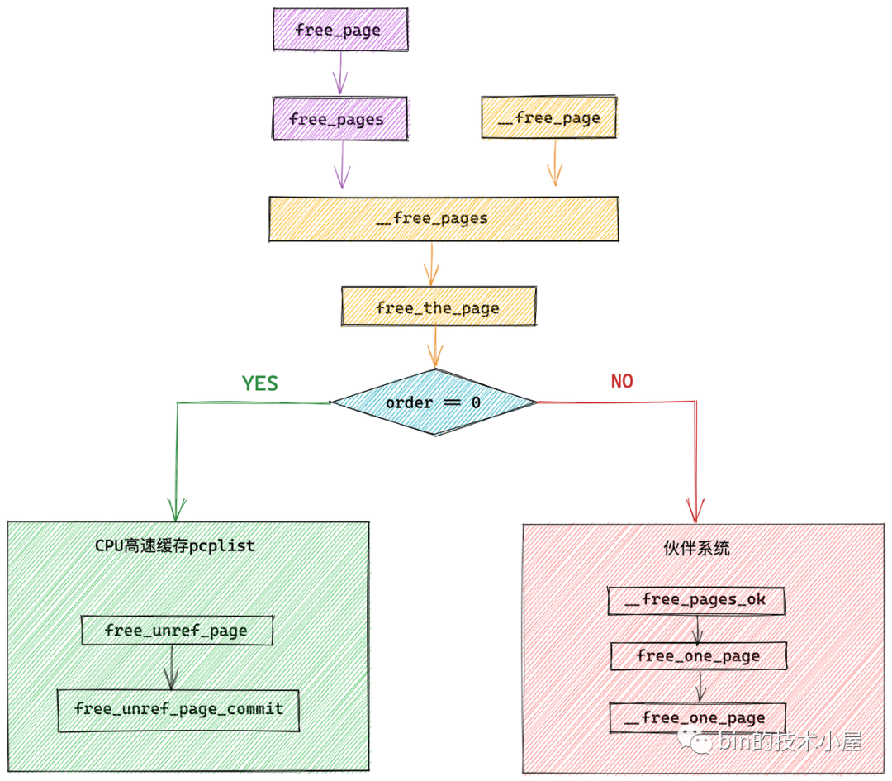

```c
void free_pages(unsigned long addr, unsigned int order)
{
    if (addr != 0) {
        // 校验虚拟内存地址 addr 的有效性
        VM_BUG_ON(!virt_addr_valid((void *)addr));
        // 将虚拟内存地址 addr 转换为 page，最终还是调用 __free_pages
        __free_pages(virt_to_page((void *)addr), order);
    }
}

void __free_pages(struct page *page, unsigned int order)
{
	if (put_page_testzero(page))
		free_the_page(page, order);
}

static inline void free_the_page(struct page *page, unsigned int order)
{
    if (order == 0)     
        // 如果释放一页的话，则直接释放到 CPU 高速缓存列表 pcplist 中
        free_unref_page(page);
    else
        // 如果释放多页的话，则进入伙伴系统回收这部分内存
        __free_pages_ok(page, order);
}

/*
 * Free a 0-order page
 */
void free_unref_page(struct page *page)
{
    unsigned long flags;
    // 获取要释放的物理内存页对应的物理页号 pfn
    unsigned long pfn = page_to_pfn(page);

    local_irq_save(flags);
    // 释放物理内存页至 pcplist 中
    free_unref_page_commit(page, pfn);

    local_irq_restore(flags);
}

static void free_unref_page_commit(struct page *page, unsigned long pfn)
{
    // 获取内存页所在物理内存区域 zone
    struct zone *zone = page_zone(page);
    // 运行当前进程的 CPU 高速缓存列表 pcplist
    struct per_cpu_pages *pcp;

    // 页面的迁移类型
    int migratetype;
    migratetype = get_pcppage_migratetype(page);
    
    // 内核这里只会将 UNMOVABLE,MOVABLE,RECLAIMABLE 这三种页面迁移类型放入 pcplist 中，其余的迁移类型均释放回伙伴系统
    if (migratetype >= MIGRATE_PCPTYPES) {
        if (unlikely(is_migrate_isolate(migratetype))) {
            // 释放回伙伴系统
            free_one_page(zone, page, pfn, 0, migratetype);
            return;
        }
        // 内核这里会将 HIGHATOMIC 类型页面当做 MIGRATE_MOVABLE 类型处理
        migratetype = MIGRATE_MOVABLE;
    }
    // 获取运行当前进程的 CPU 高速缓存列表 pcplist
    pcp = &this_cpu_ptr(zone->pageset)->pcp;
    // 将要释放的物理内存页添加到 pcplist 中
    list_add(&page->lru, &pcp->lists[migratetype]);
    // pcplist 页面计数加一
    pcp->count++;
    // 如果 pcp 中的页面总数超过了 high 水位线，则将 pcp 中的 batch 个页面释放回伙伴系统中，这个过程称之为惰性合并。
    if (pcp->count >= pcp->high) {
        unsigned long batch = READ_ONCE(pcp->batch);
        // 释放 batch 个页面回伙伴系统中
        free_pcppages_bulk(zone, batch, pcp);
    }
}

static void __free_pages_ok(struct page *page, unsigned int order)
{
    unsigned long flags;
    int migratetype;
    // 获取释放内存页对应的物理页号 pfn
    unsigned long pfn = page_to_pfn(page);
    // 在将内存页回收至伙伴系统之前，需要将内存页 page 相关的无用属性清理一下
    if (!free_pages_prepare(page, order, true))
        return;
    // 获取页面迁移类型，后续会将内存页释放至伙伴系统中的 free_list[migratetype] 中
    migratetype = get_pfnblock_migratetype(page, pfn);
    
    local_irq_save(flags);
    // 进入伙伴系统，释放内存
    free_one_page(page_zone(page), page, pfn, order, migratetype);
    
    local_irq_restore(flags);
}

static void free_one_page(struct zone *zone,
                struct page *page, unsigned long pfn,
                unsigned int order,
                int migratetype)
{

    spin_lock(&zone->lock);
    // 正式进入伙伴系统回收内存
    __free_one_page(page, pfn, zone, order, migratetype);

    spin_unlock(&zone->lock);
}

/*
 * Freeing function for a buddy system allocator.
 */
static inline void __free_one_page(struct page *page,
        unsigned long pfn,
        struct zone *zone, unsigned int order,
        int migratetype)
{
    // 释放内存块与其伙伴内存块合并之后新内存块的 pfn
    unsigned long combined_pfn;
    // 伙伴内存块的 pfn
    unsigned long buddy_pfn;
    // 伙伴内存块的首页 page 指针
    struct page *buddy;
    // 伙伴系统中的最大分配阶
    unsigned int max_order;
    
continue_merging:
    // 从释放内存块的当前分配阶开始一直向高阶合并内存块，直到不能合并为止
    while (order < max_order - 1) {
        // 在 free_area[order] 中查找伙伴内存块的 pfn
        buddy_pfn = __find_buddy_pfn(pfn, order);
        // 根据偏移 buddy_pfn - pfn 计算伙伴内存块中的首页 page 地址
        buddy = page + (buddy_pfn - pfn);
        // 检查伙伴 pfn 的有效性
        if (!pfn_valid_within(buddy_pfn))
            // 无效停止合并
            goto done_merging;
        // 检查是否为伙伴
        if (!page_is_buddy(page, buddy, order))
            // 不是伙伴停止合并
            goto done_merging;
        // 将伙伴内存块从当前 free_area[order] 列表中摘下
        del_page_from_free_area(buddy, &zone->free_area[order]);
        // 合并后新内存块首页 page 的 pfn
        combined_pfn = buddy_pfn & pfn;
        // 合并后新内存块首页 page 指针
        page = page + (combined_pfn - pfn);
        // 以合并后的新内存块为基础继续向高阶 free_area 合并
        pfn = combined_pfn;
        // 继续向高阶 free_area 合并，直到不能合并为止
        order++;
    }
    
done_merging:
    // 表示在当前伙伴系统 free_area[order] 中没有找到伙伴内存块，停止合并。设置内存块的分配阶 order，存储在第一个 page 结构中的 private 属性中
    set_page_order(page, order);
    // 将最终合并的内存块插入到伙伴系统对应的 free_are[order] 中
    add_to_free_area(page, &zone->free_area[order], migratetype);

}

static inline unsigned long
__find_buddy_pfn(unsigned long page_pfn, unsigned int order)
{
	return page_pfn ^ (1 << order);
}

/* 伙伴系统所管理的内存页必须是可用的，不能处于内存空洞中，通过 page_is_guard 函数判断。
 *
 * 伙伴必须是空闲的内存块，这些内存块必须存在于伙伴系统中，组成内存块的内存页 page 结构中的 flag 标志设置了 PG_buddy 标记。
 * 通过 PageBuddy 判断这些内存页是否在伙伴系统中。
 *
 * 两个互为伙伴的内存块必须拥有相同的分配阶 order，也就是它们之间的大小尺寸必须一致。通过 page_order(buddy) == order 判断
 *
 * 互为伙伴关系的内存块必须处于相同的物理内存区域 zone 中。通过 page_zone_id(page) == page_zone_id(buddy) 判断。 
 */
static inline int page_is_buddy(struct page *page, struct page *buddy,
							unsigned int order)
{
	if (page_is_guard(buddy) && page_order(buddy) == order) {
		if (page_zone_id(page) != page_zone_id(buddy))
			return 0;

		return 1;
	}

	if (PageBuddy(buddy) && page_order(buddy) == order) {
		if (page_zone_id(page) != page_zone_id(buddy))
			return 0;

		return 1;
	}
	return 0;
}
```


### 页表映射

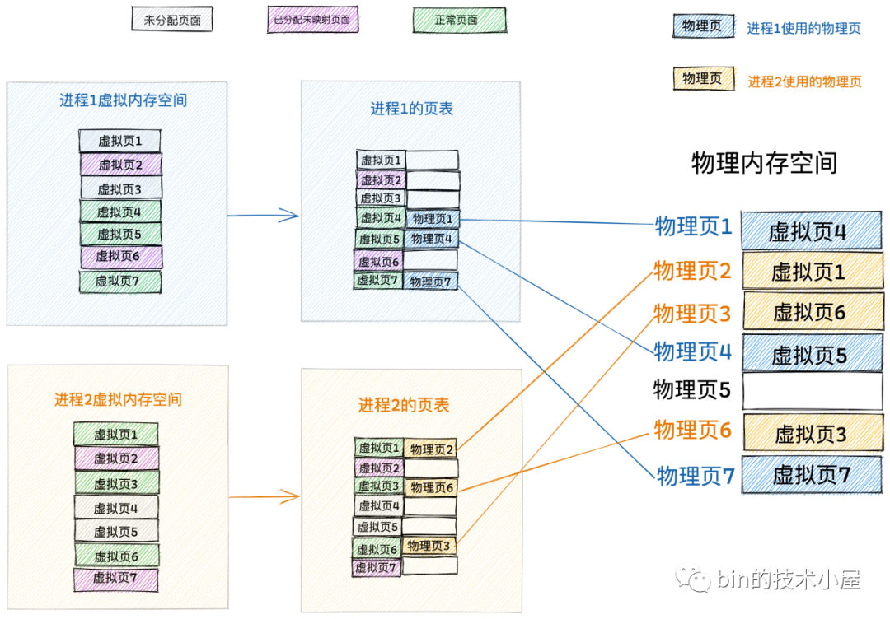

如上图所示，在内存映射的场景中，虚拟内存页的类型总共分为以下三种：

1. 第一种就是图中灰色方框里标注的**未分配页面**，进程的虚拟内存空间是非常庞大的，远远的超过物理内存空间，但这并不意味着进程可以直接随意使用虚拟内存，事实上进程对虚拟内存的使用也是需要向内核申请的。进程虚拟内存空间中的虚拟内存页在未被进程申请之前的状态就是未分配页面。
2. 第二种就是图中紫色方框里标注的**已分配未映射页面**，在进程中可以通过 malloc 接口或者直接通过系统调用 mmap 向内核申请虚拟内存，申请到的虚拟内存页此时就变为了已分配的页面。但此时的虚拟内存页只是虚拟内存，其背后并没有与物理内存映射起来，所以称为已分配未映射页面。
3. 第三种是图中绿色方框里标注的**正常页面**，当进程开始读写这些已分配未映射的虚拟内存页时，在 CPU 中用于地址翻译的硬件 MMU 会产生一个缺页中断，随后内核会为其分配相应的物理内存页面，并将虚拟内存页与物理内存页映射起来。此时这些已分配未映射的虚拟内存页就变为了**正常页面**。从此以后，进程就可以正常读写这些虚拟内存页了。

还能得出以下结论：

1. 每个进程独占全部的虚拟内存空间，比如上图中，进程 1 的虚拟内存空间（蓝色部分）和进程 2 的虚拟内存空间（黄色部分）它们都拥有属于各自的虚拟内存页1 到虚拟内存页 7 这段范围的虚拟内存。也就是说进程1 和进程 2 看到的虚拟内存空间**地址范围**都是一样的。
2. 每个进程的虚拟内存空间都是相互隔离，互不干扰的，进程可以在属于自己的虚拟内存空间里随意折腾。比如上图中，进程 1 里的虚拟内存页 1 是一个未分配页面，而进程 2 里的虚拟内存页 1 却是一个正常页面，被内核映射到物理内存页 2 中。也就是说虽然每个进程拥有的虚拟内存地址空间范围是一样的，但是各自虚拟内存空间中的虚拟页可能映射的物理页不一样，使用的方式和用途也不一样。
3. 进程所看到的连续虚拟内存，在物理内存中有可能是不连续的，比如上图中，进程 1 里的虚拟页 4 和 虚拟页 5，它们在进程 1 的虚拟内存空间中是连续的，但是它们背后映射的物理内存页却是不连续的。虚拟内存页 4 被映射到了物理内存页 1 中，虚拟内存页 5 被映射到了物理内存页 4 中。

内核会从物理内存空间中拿出一个物理内存页来专门存储进程里的这些内存映射关系，而这种物理内存被称之为页表，所以页表的本质其实就是一个物理内存页。页表除了管理虚拟内存与物理内存之间的映射关系之外，还会有一些访问权限的管理，来控制进程对物理内存的访问权限。由于进程是独占虚拟内存空间的，而且不同进程之间的虚拟内存空间是相互隔离的，所以每个进程也都会有属于自己的页表，来专门管理各自虚拟内存空间中的映射关系以及各自访问物理内存的权限。

内核会在页表中划分出来一个个大小相等的小内存块，这些小内存块称之为页表项 PTE（Page Table Entry），正是这个 PTE 保存了进程虚拟内存空间中的虚拟页与物理内存页的映射关系，以及控制物理内存访问的相关权限位。在 32 位系统中页表中的 PTE 占用 4 个字节，64 位系统中页表的 PTE 占用 8 个字节。


进程虚拟内存空间中的每一个字节都有一个虚拟内存地址来表示，格式为：`页表内偏移 + 物理内存页内偏移`

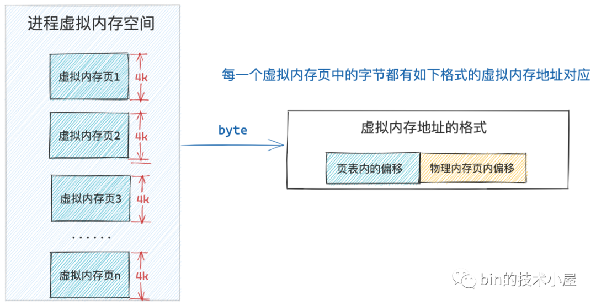

 `页表内偏移` 是专门用来定位虚拟内存页在页表中的 PTE 的，因为页表本质其实还是一个物理内存页，而一个物理内存页里边的内存肯定都是连续的，每个 PTE 的尺寸又是相同的，所以可以把页表看做一个数组，PTE 看做数组里的元素，在一个数组里定位元素，直接通过元素的索引 index 就可以定位了。这个索引 index 就是 `页表内偏移` 。这样一来，给定一个虚拟内存地址，内核会先从这个虚拟内存地址中提取出 `页表内偏移` ，然后根据 `页表起始地址 + 页表内偏移 * sizeof(PTE)` 就能获取到该虚拟内存地址所在虚拟页在页表中对应的 PTE 了。页表的起始地址保存在 `struct mm_struct` 结构中的 pgd 字段中。

```c
_do_fork
    copy_process
    	copy_mm
    		dup_mm
/**
 * Allocates a new mm structure and duplicates the provided @oldmm structure
 * content into it.
 */
static struct mm_struct *dup_mm(struct task_struct *tsk,
    struct mm_struct *oldmm)
{
     // 子进程虚拟内存空间，此时还是空的
     struct mm_struct *mm;
     int err;
     // 为子进程申请 mm_struct 结构
     mm = allocate_mm();
     if (!mm)
        goto fail_nomem;
     // 将父进程 mm_struct 结构里的内容全部拷贝到子进程 mm_struct 结构中
     memcpy(mm, oldmm, sizeof(*mm));
     // 为子进程分配顶级页表起始地址并赋值给 mm_struct->pgd
     if (!mm_init(mm, tsk, mm->user_ns))
        goto fail_nomem;
     // 拷贝父进程的虚拟内存空间中的内容以及页表到子进程中
     err = dup_mmap(mm, oldmm);
     if (err)
        goto free_pt;

     return mm;
}

static struct mm_struct *mm_init(struct mm_struct *mm, struct task_struct *p,
    struct user_namespace *user_ns)
{
    // 初始化子进程的 mm_struct 结构
    ......
    // 为子进程分配顶级页表起始地址 pgd
    if (mm_alloc_pgd(mm))
        goto fail_nopgd;
    ......
}

static inline int mm_alloc_pgd(struct mm_struct *mm)
{
    // 内核为子进程分配好其顶级页表起始地址之后，赋值给子进程 mm_struct 结构中的 pgd 属性
    mm->pgd = pgd_alloc(mm);
    if (unlikely(!mm->pgd))
        return -ENOMEM;
    return 0;
}


/* 虽然已经创建了 pgd ，但现在还只是顶级页表的虚拟内存地址，还无法被 CPU 直接使用。 */

// 将 mm->pgd 写入 ttbr 寄存器中
context_switch
    switch_mm_irqs_off
    	__switch_mm
    		check_and_switch_context
    			cpu_switch_mm
    				cpu_do_switch_mm
```

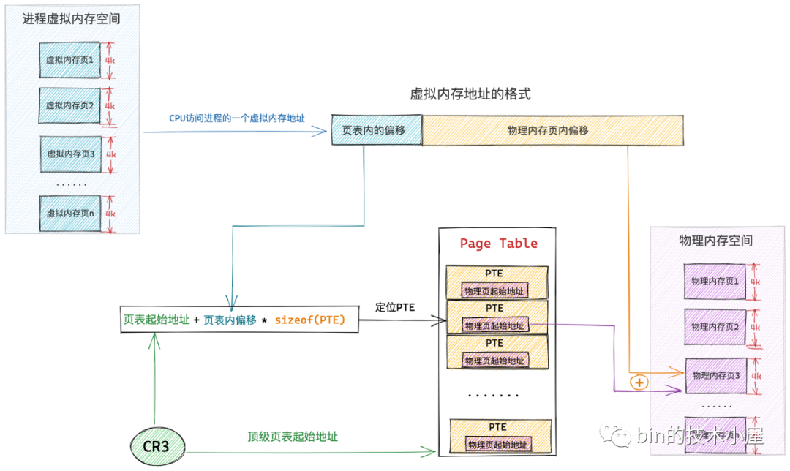

X86 架构下页表基地址保存在 CR3 寄存器中，ARM 架构下保存在 TTBR 寄存器中，但寻址原理是一样的。CPU 访问进程的虚拟地址时，首先会从 CR3/TTBR 寄存器中获取到当前进程的页表基地址，然后从虚拟内存地址中提取出虚拟内存页对应 PTE 在页表内的偏移，通过 `页表起始地址 + 页表内偏移 * sizeof(PTE)` 这个公式定位到虚拟内存页在页表中所对应的 PTE。而虚拟内存页背后所映射的物理内存页的起始地址就保存在该 PTE 中，随后 CPU 继续从虚拟内存地址中提取后半部分——物理内存页内偏移，并通过 `物理内存页起始地址 + 物理内存页内偏移` 就定位到了该物理内存页中一个具体的物理字节上。

当用户进程被 CPU 调度起来，访问进程虚拟内存的时候，虚拟内存地址与物理内存地址转换的过程都是**在用户态进行的**，正常的内存访问无需进入内核态。除非 CPU 访问的虚拟内存页面类型是：

1. 未分配页面。
2. 已分配未映射页面。
3. 已映射，但是由于内存紧张的原因，该虚拟内存页映射的物理内存页被置换到磁盘上了。

以上三种虚拟内存页有一个共同的特征就是它们背后的物理内存页均不在内存中，要么是没有映射，要么是被置换到磁盘上。当 CPU 访问这些虚拟内存页面的时候，就会产生缺页中断，随后进入内核态为其分配物理内存页面，填充物理内存页面中的内容，最后在页表中建立映射关系。之后的内存访问均是在用户态中进行。所以页表也就分为了两个部分：

1. 进程用户态页表：主要负责管理进程用户态虚拟内存空间到物理内存的映射关系。
2. 内核态页表：主要负责管理内核态虚拟内存空间到物理内存的映射关系，这一部分主要供内核使用。

```c
struct mm_struct init_mm = {
	.mm_mt		= MTREE_INIT_EXT(mm_mt, MM_MT_FLAGS, init_mm.mmap_lock),
	.pgd		= swapper_pg_dir,
	.mm_users	= ATOMIC_INIT(2),
	.mm_count	= ATOMIC_INIT(1),
	.write_protect_seq = SEQCNT_ZERO(init_mm.write_protect_seq),
	MMAP_LOCK_INITIALIZER(init_mm)
	.page_table_lock =  __SPIN_LOCK_UNLOCKED(init_mm.page_table_lock),
	.arg_lock	=  __SPIN_LOCK_UNLOCKED(init_mm.arg_lock),
	.mmlist		= LIST_HEAD_INIT(init_mm.mmlist),
#ifdef CONFIG_PER_VMA_LOCK
	.mm_lock_seq	= 0,
#endif
	.user_ns	= &init_user_ns,
	.cpu_bitmap	= CPU_BITS_NONE,
	INIT_MM_CONTEXT(init_mm)
};

SYM_FUNC_START_LOCAL(secondary_startup)
	/*
	 * Common entry point for secondary CPUs.
	 */
	mov	x20, x0				// preserve boot mode

#ifdef CONFIG_ARM64_VA_BITS_52
alternative_if ARM64_HAS_VA52
	bl	__cpu_secondary_check52bitva
alternative_else_nop_endif
#endif

	bl	__cpu_setup			// initialise processor
	adrp	x1, swapper_pg_dir
	adrp	x2, idmap_pg_dir
	bl	__enable_mmu
	ldr	x8, =__secondary_switched
	br	x8
SYM_FUNC_END(secondary_startup)
    
/*
 * Enable the MMU.
 *
 *  x0  = SCTLR_EL1 value for turning on the MMU.
 *  x1  = TTBR1_EL1 value
 *  x2  = ID map root table address
 *
 * Returns to the caller via x30/lr. This requires the caller to be covered
 * by the .idmap.text section.
 *
 * Checks if the selected granule size is supported by the CPU.
 * If it isn't, park the CPU
 */
	.section ".idmap.text","a"
SYM_FUNC_START(__enable_mmu)
	mrs	x3, ID_AA64MMFR0_EL1
	ubfx	x3, x3, #ID_AA64MMFR0_EL1_TGRAN_SHIFT, 4
	cmp     x3, #ID_AA64MMFR0_EL1_TGRAN_SUPPORTED_MIN
	b.lt    __no_granule_support
	cmp     x3, #ID_AA64MMFR0_EL1_TGRAN_SUPPORTED_MAX
	b.gt    __no_granule_support
	phys_to_ttbr x2, x2
	msr	ttbr0_el1, x2			// load TTBR0
	load_ttbr1 x1, x1, x3

	set_sctlr_el1	x0

	ret
SYM_FUNC_END(__enable_mmu)
```

现在内核页表已经被创建和初始化好了，但是对于处于内核态的进程以及内核线程来说并不能直接访问这个内核页表，它们只能访问内核页表的 copy 副本，进程的页表分为两个部分，一个是进程用户态页表，另一个就是内核页表的 copy 部分。用户态进程通过系统调用切入到内核态之后，就会使用内核页表的这部分 copy 副本，来访问内核空间虚拟内存映射的物理内存。当进程页表中内核部分的拷贝副本与主内核页表不同步时，进程在内核态就会发生缺页中断，随后会同步主内核页表到进程页表中，这里又是延时拷贝在内核中的一处应用。

内核线程有一点和用户态进程不同，内核线程只能运行在内核态，而在内核态中，所有进程看到的虚拟内存空间全部都是一样的，所以对于内核线程来说并不需要为其单独的定义 `mm_struct` 结构来描述内核虚拟内存空间，内核线程的 `struct task_struct` 结构中的 mm 属性指向 null，内核线程之间调度是不涉及地址空间切换的，从而避免了无用的 TLB 缓存以及 CPU 高速缓存的刷新。

```c
 struct task_struct {
    // 用户态进程的 mm 都是在 fork 是独立创建出来的
    // 内核线程的 mm 则为 null
    struct mm_struct  *mm;
}
```

但是内核线程依然需要访问内核空间中的虚拟内存，处理的策略是，当一个内核线程被调度时，它会发现自己的虚拟地址空间为 null，虽然它不会访问用户态的内存，但是它会访问内核内存，此时会将调度之前的上一个用户态进程的虚拟内存空间 `mm_struct` 直接赋值给内核线程 `task_struct->active_mm` 中 。因为内核线程不会访问用户空间的内存，它仅仅只会访问内核空间的内存，所以直接复用上一个用户态进程页表的内核部分就可以避免为内核线程分配 mm_struct 和相关页表的开销，以及避免内核线程之间调度时地址空间的切换开销。

```c
 struct task_struct {
    // 用户态进程的 active_mm 指向 null
    // 内核线程的 active_mm 指向前一个进程的地址空间
    struct mm_struct *active_mm;
}
```

#### 单级页表的不足

在进程中虚拟内存与物理内存的映射是以页为单位的，进程虚拟内存空间中的一个虚拟内存页映射物理内存空间的一个物理内存页，这种映射关系以及访存权限都保存在 PTE 中。以 32 位系统为例，页表中的一个 PTE 占用 4B 大小，所以一张页表可以容纳 1024 个 PTE（`4K / 4B = 1024`），一个 PTE 又可以映射 4K 的物理内存，那么一张页表就可以映射 `1024 * 4K = 4M` 大小的物理内存 ，而页表本质上是一个物理内存页（4K大小），所以内核需要用额外的 4K 大小的物理内存去映射 4M 的物理内存。假设系统中有 4G 的物理内存，一张页表能够映射 4M 大小的物理内存，而为了映射这 4G 的物理内存，我们需要 1024 张页表，一张页表占用 4K 物理内存，所以为了映射 4G 的物理内存，需要 4M 的物理内存（1024张页表）来映射。

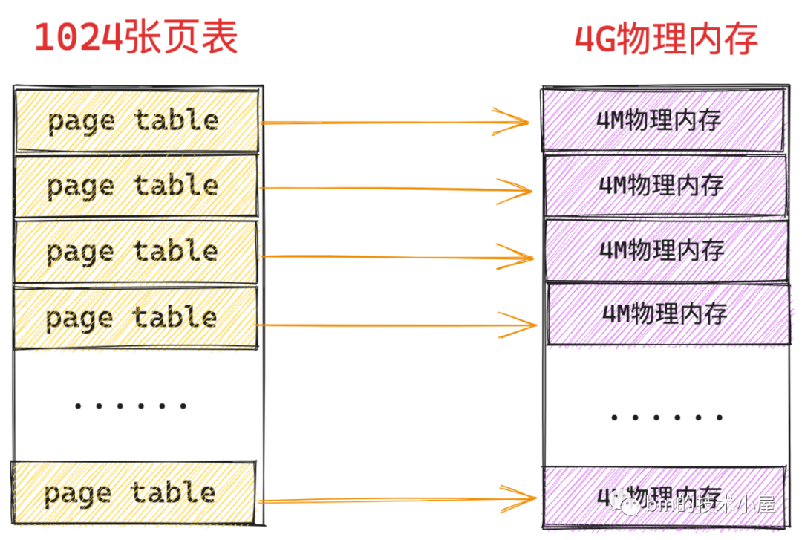

更重要的是这 4M 物理内存（1024张页表）还必须是连续的，因为页表是单级的，而页表相当于是 PTE 的数组，进程虚拟内存空间中的一个虚拟内存页对应一个 PTE，而 PTE 在页表这个数组中的索引 index 就保存在虚拟内存地址中，内核通过页表的起始地址加上这个索引 index 才能定位到虚拟内存页对应的 PTE，近而通过 PTE 定位到映射的物理内存页。

而且 4M 的连续物理内存还只是一个进程所需要的，因为进程的虚拟内存空间都是独立的，页表也是独立的，一个进程就需要额外的 4M 连续物理内存（1024张页表）来支持进程内独立的内存映射关系。假如在系统中跑上 100 个进程，那总共就需要额外的 400M 连续的物理内存。这对于一个只有 4G 物理内存，单级页表的系统来说，无疑是巨大的开销和浪费。

程序局部性原理表现为：时间局部性和空间局部性。时间局部性是指如果程序中的某条指令一旦执行，则不久之后该指令可能再次被执行；如果某块数据被访问，则不久之后该数据可能再次被访问。空间局部性是指一旦程序访问了某个存储单元，则不久之后，其附近的存储单元也将被访问。

####  多级页表的演进

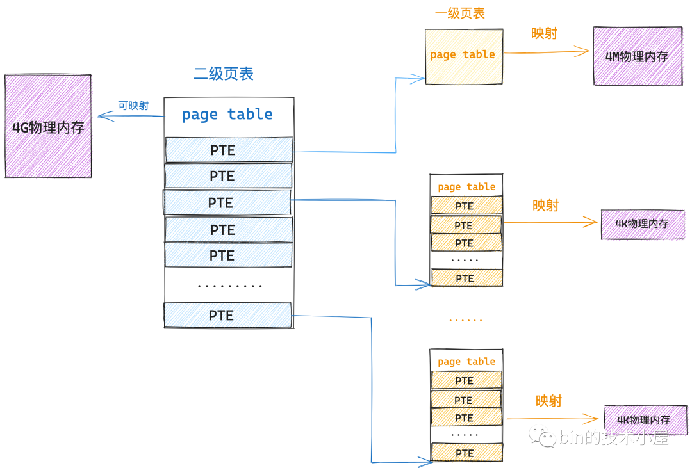

二级页表中的一个 PTE 本质上指向的还是一个物理内存页，只不过这个物理内存页比较特殊，它是一张页表（一级页表），一级页表是用来映射真正的物理内存的，一张一级页表可以映射 4M 物理内存。这也就是说二级页表中的一个 PTE 就可以映射 4M 物理内存，同样的道理，二级页表中也包含了 1024 个 PTE，所以一张二级页表就可以映射 4G 的物理内存。虽说二级页表和一级页表本质上都是一样的，它们都是一个物理内存页，但是习惯上将二级页表叫做页目录表，用来做一级页表的索引，就好像书中的目录一样，二级页表中的 PTE 称为做页目录项 (Page Directory Entry, PDE)。因为一张页目录表就可以映射 4G 的物理内存了，所以在二级页表的情况下，只需要在进程启动的时候额外为它分配 4K 的连续物理内存就可以了，这相比单级页表下，需要为每个进程额外分配 4M 的连续物理内存节省了非常多宝贵的内存资源。

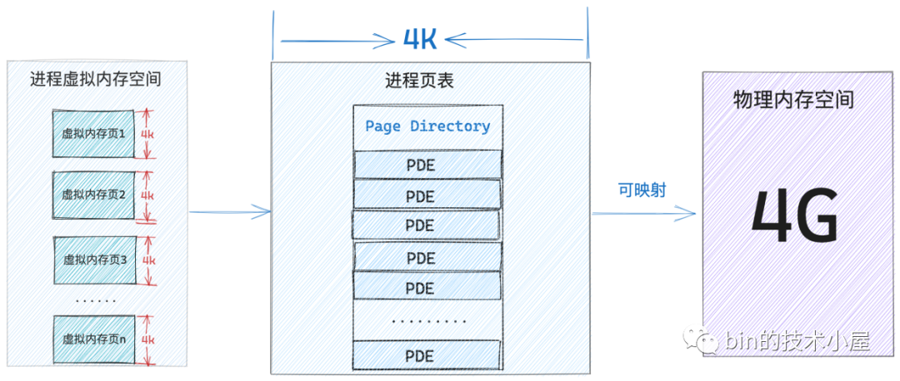

当前系统中，进程只有一张页目录表，页目录表里的 PDE 没有映射任何东西，这时进程需要访问一个物理内存页，而对物理内存页的映射任务主要是在一级页表的 PTE 中，所以现在首要的任务就是建立一张一级页表出来，并用页目录表索引起来。


在二级页表的情况下，内核只需要一张 4K 的页目录表和一张 4K 的一级页表总共 8K 的内存就可以支持进程访问一个 4K 物理页面了，而根据程序的空间局部性原理，在不久的将来，进程只会访问与该物理内存页临近的页面，所以事实上，即使进程访问 4M 的内存，依然只需要一张 4K 的页目录表和一张 4K 的一级页表就可以满足了。

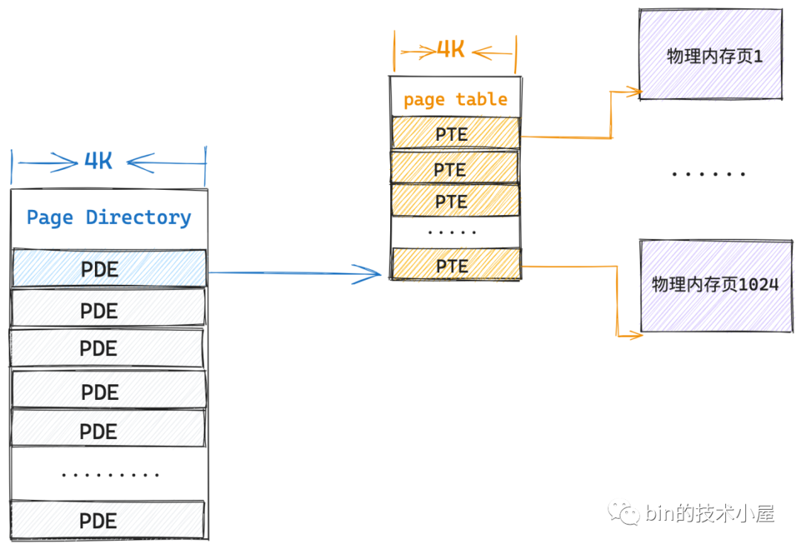

当进程需要访问下一个 4M 的物理内存时，这时候第一个一级页表已经映射满了，那就需要再创建第二张页表用来映射下一个 4M 的物理内存，当然了，第二张页表依然需要索引在页目录表的 PDE 中。这时候内核就需要一张页目录表和两张一级页表共 12K 额外的物理内存来映射，这依然比单级页表的 4M 连续物理内存开销小很多。


同理，随着进程一个 4M 接着一个 4M 物理内存的访问，在极端的情况下整个页目录表都被映射满了，这时候内核就需要 4K（页目录表）+ 4M（1024张一级页表）的额外内存来保存映射关系了，这种情况下看起来会比单级页表下的 4M 内存开销大了那么一点点，但这种属于极端情况，非常少见，极大部分情况下还是比单级页表开销少很多很多的。

而且在二级页表体系下，上面极端情况中的这 1024 张一级页表不需要是连续的，因为只需要保证顶级页表（这里指页目录表）是连续的就可以了，通过页目录表中的 PDE 可以唯一索引到一张一级页表的起始物理内存地址，而页表内肯定是连续的 4K 物理内存，所以依然可以通过数组的方式索引到一级页表中的 PTE，近而找到其映射的物理内存页面。

除此之外二级页表体系还有一个优势，就是当内存紧张的时候，那些不经常使用的一级页表可以被 swap out 到磁盘中，当进程再次访问到该页表映射的物理内存时，内核在将页表从磁盘中 swap in 到内存中。当然了，顶级页表（这里指页目录表）必须是常驻内存的，不允许 swap 。


页表的本质是一个物理内存页，进程经常访问的那些页表也会被缓存到 CPU 高速缓存中加速下一次的访问速度。

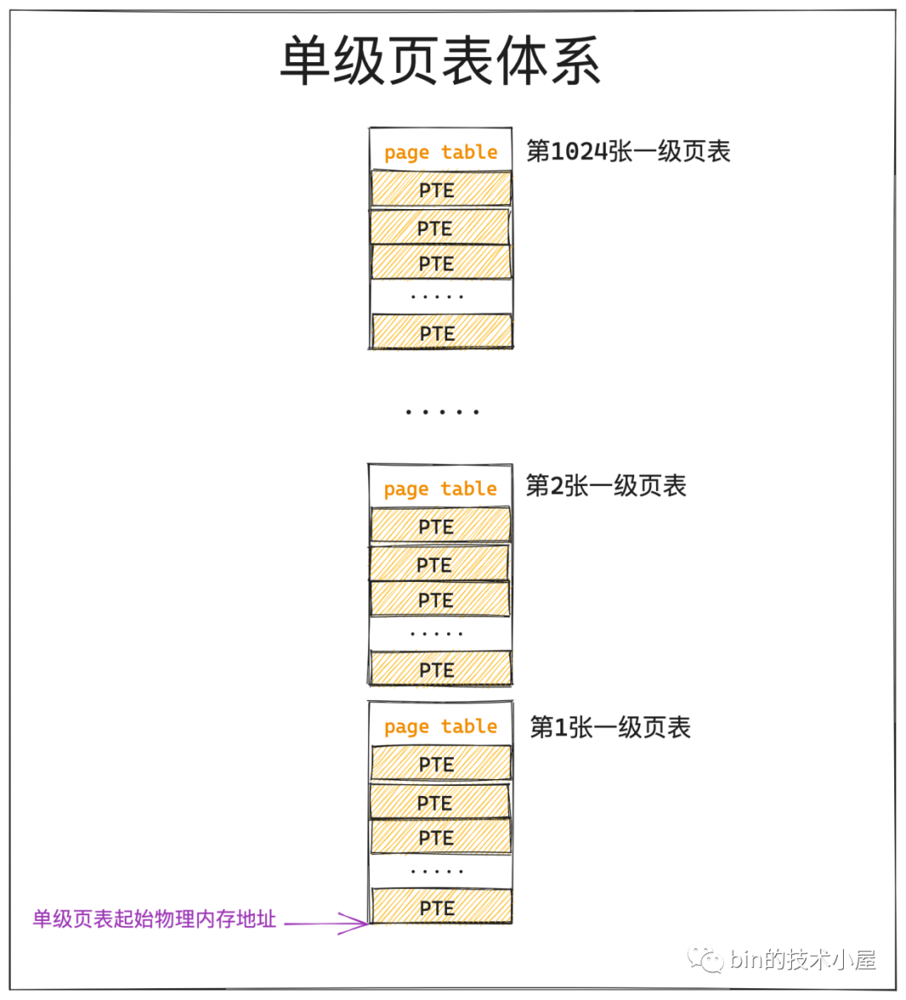


##### 二级页表

从单级页表演进到二级页表之后，虚拟内存寻址的底层逻辑还是一样的，只不过现在的顶级页表变成了页目录表（Page Directory）, CR3/TTBR 寄存器现在存放的是页目录表的起始物理内存地址。


通过虚拟内存地址定位 PTE 的步骤由原来的一步变成了现在的两步，因为多加了一级页目录表，所以现在需要首先定位页目录表中的 PDE，然后通过 PDE 定位到具体的页表，近而找到页表中的 PTE。在二级页表体系下的虚拟内存地址的格式也就发生了变化，单级页表下虚拟内存地址中只需要保存页表中的 PTE 偏移即可，二级页表下虚拟内存地址还需要多保存一份页目录表中 PDE 的偏移。


二级页表应用在 32 位系统中，相应的虚拟内存地址由 32 位 bit 组成，在 32 位系统中页目录表中的 PDE 和页表中的 PTE 均占用 4 个字节。页目录表和页表的本质其实就是一个物理内存页，它们分别占用 4K 大小。因此一张页目录表中有 1024 个 PDE，要寻址这 1024 个 PDE 用 10 个 bit 就可以了，所以在上图中的虚拟内存地址中的 `页目录表中 PDE 偏移` 部分占用 10 个 bit 位。同样的道理，一张页表中有 1024 个 PTE，要寻址这个 1024 个 PTE 也是需要 10 个 bit，虚拟内存地址中的 `一级页表中 PTE 偏移` 部分也需要占用 10 个 bit 位。

这样一来就可以通过虚拟内存地址中的前 10 个 bit 定位到页目录表中的 PDE ，而 PDE 指向的是一级页表的起始物理内存地址，通过接下来的 10 个 bit 就可以定位到页表中的 PTE，而 PTE 指向的是虚拟内存页最终映射的物理内存页的起始地址。找到物理内存页了后，这就需要虚拟内存地址中的最后一部分 `物理内存页内偏移`来确定物理地址，因为一个物理内存页占用 4K 大小，用 12 位 bit 就可以寻址内存页中的任意字节了。这样加起来，刚好可以组成一个 32 位的虚拟内存地址。


1. 当 CPU 访问进程虚拟内存空间中的一个地址时，会先从 CR3/TTBR 寄存器中拿出页目录表的起始物理内存地址，然后从虚拟内存地址中解析出前 10 bit 的内容作为页目录表中 PDE 的偏移，通过公式 `页目录表起始地址 + 页目录表内偏移 * sizeof(PDE)` 就可以定位到该虚拟内存页在页目录表中的 PDE 了。
2. PDE 中保存了其指向的一级页表的起始物理内存地址，再从虚拟内存地址中解析出下一个 10 bit 作为页表中 PTE 的偏移，然后通过公式 `页表起始地址 + 页表内偏移 * sizeof(PTE)` 就能定位到虚拟内存页在一级页表中的 PTE 了。
3. PTE 中保存了最终映射的物理内存页的起始地址，最后从虚拟内存地址中解析出最后 12 个 bit，最终定位到虚拟内存地址对应的物理字节上。

PTE 在内核中是用 `unsigned long` 类型描述的，在 32 位系统中占用 4 个字节：

```c
typedef unsigned long	pteval_t;
typedef struct { pteval_t pte; } pte_t;
```

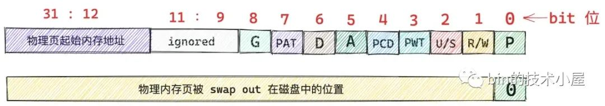

由于内核将整个物理内存划分为一页一页的单位，每个物理内存页大小为 4K，所以物理内存页的起始地址都是按照 4K 对齐的，也就导致物理内存页的起始地址的后 12 位全部是 0，只需要在 PTE 中存储物理内存地址的高 20 位就可以了，剩下的低 12 位可以用来标记一些权限位。下面是 PTE 权限位的含义：

`P(0)` 表示该 PTE 映射的物理内存页是否在内存中，值为 1 表示物理内存页在内存中驻留，值为 0 表示物理内存页不在内存中，可能被 swap 到磁盘上了。当 PTE 中的 P 位为 0 时，上图中的其他权限位将变得没有意义，这种情况下其他 bit 位存放物理内存页在磁盘中的地址。当物理内存页需要被 swap in 的时候，内核会在这里找到物理内存页在磁盘中的位置。通过虚拟内存寻址过程找到其对应的 PTE 之后，首先会检查它的 P 位，如果为 0 直接触发缺页中断（page fault），随后进入内核态，由内核的缺页异常处理程序负责将映射的物理页面换入到内存中。

`R/W(1)` 表示进程对该物理内存页拥有的读，写权限，值为 1 表示进程对该物理页拥有读写权限，值为 0 表示进程对该物理页拥有只读权限，进程对只读页面进行写操作将触发 page fault （写保护中断异常），用于写时复制（Copy On Write， COW）的场景。比如，父进程通过 fork 系统调用创建子进程之后，父子进程的虚拟内存空间完全是一模一样的，包括父子进程的页表内容都是一样的，父子进程页表中的 PTE 均指向同一物理内存页面，此时内核会将父子进程页表中的 PTE 均改为只读的，并将父子进程共同映射的这个物理页面引用计数 + 1。当父进程或者子进程对该页面发生写操作的时候，假设子进程先对页面发生写操作，随后子进程发现自己页表中的 PTE 是只读的，于是产生写保护中断，子进程进入内核态，在内核的缺页中断处理程序中发现，访问的这个物理页面引用计数大于 1，说明此时该物理内存页面存在多进程共享的情况，于是发生写时复制（Copy On Write， COW），内核为子进程重新分配一个新的物理页面，然后将原来物理页中的内容拷贝到新的页面中，最后子进程页表中的 PTE 指向新的物理页面并将 PTE 的 R/W 位设置为 1，原来物理页面的引用计数 - 1。后面父进程在对页面进行写操作的时候，同样也会发现父进程的页表中 PTE 是只读的，也会产生写保护中断，但是在内核的缺页中断处理程序中，发现访问的这个物理页面引用计数为 1 了，那么就只需要将父进程页表中的 PTE 的 R/W 位设置为 1 就可以了。

`U/S(2)` 值为 0 表示该物理内存页面只有内核才可以访问，值为 1 表示用户空间的进程也可以访问。

`PCD(4)` 是 Page Cache Disabled 的缩写，表示 PTE 指向的这个物理内存页中的内容是否可以被缓存再 CPU CACHE 中，值为 1 表示 Disabled，值为 0 表示 Enabled。

`PWT(3)` 同样也是和 CPU CACHE 相关的控制位，Page Write Through 的缩写，值为 1 表示 CPU CACHE 中的数据发生修改之后，采用 Write Through 的方式同步回物理内存页中。值为 0 表示采用 Write Back 的方式同步回物理内存页。当 CPU 修改了高速缓存中的数据之后，这些修改后的缓存内容同步回内存的方式有两种：

1. Write Back：CPU 修改后的缓存数据不会立马同步回内存，只有当 cache line 被替换时，这些修改后的缓存数据才会被同步回内存中，并覆盖掉对应物理内存页中旧的数据。
2. Write Through：CPU 修改高速缓存中的数据之后，会立刻被同步回物理内存页中。

`A(5)` 表示 PTE 指向的这个物理内存页最近是否被访问过，1 表示最近被访问过（读或者写访问都会设置为 1），0 表示没有。该 bit 位被硬件 MMU 设置，由操作系统重置。内核会经常检查该比特位，以确定该物理内存页的活跃程度，不经常使用的内存页，很可能就会被内核 swap out 出去。

`D(6)` 主要针对文件页使用，当 PTE 指向的物理内存页是一个文件页时，进程对这个文件页写入了新的数据，这时文件页就变成了脏页，对应的 PTE 中 D 比特位会被设置为 1，表示文件页中的内容与其背后对应磁盘中的文件内容不同步了。

`PAT(7)` 表示是否支持 PAT(Page Attribute Table) 。

`G(8)` 设置为 1 表示该 PTE 是全局的，该标志位表示 PTE 中保存的映射关系是否是全局的。一般来说进程都有各自独立的虚拟内存空间，进程的页表也是独立的 ，CPU 每次访问进程虚拟内存地址的时候都需要进行地址翻译。为了加速地址翻译的速度，避免每次遍历页表，CPU 会把经常被访问到的 PTE 缓存在一个 TLB 的硬件缓存中，由于 TLB 中缓存的是当前进程相关的 PTE，所以操作系统每次在切换进程的时候，都会重新刷新 TLB 缓存。而有一些 PTE 是所有进程共享的，比如说内核虚拟内存空间中的映射关系，所有进程进入内核态看到的都是一样的。所以会将这些全局共享的 PTE 中的 G 比特位置为 1 ，这样在每次进程切换的时候，就不会 flush 掉 TLB 缓存的那些共享的全局 PTE（比如内核地址的空间中使用的 PTE），从而在很大程度上提升了性能。

PDE 在 32 位系统中也是用 `unsigned long` 类型来描述的，同样也是占用 4 个字节大小。

```c
typedef unsigned long	pgdval_t;
```

PDE 是用来指向一级页表的起始物理内存地址的，而页表的本质是一个物理内存页（4K 大小），因此页表的起始内存地址也是按照 4K 对齐的，后 12 位全部为 0 ，可以继续用 PDE 的低 12 位来标记页目录项的权限位：


和页表中 PTE 的权限位有几点不同：

1. PDE 中的第 6 个比特位脏页标记位没有了，因为 PDE 指向的是一级页表，页表并不是一个文件页，所以脏页标记在这里就没有意义了。
2.  PDE 中的第 8 比特位，Global 全局标记位也没有了，因为 TLB 缓存的 PTE 而不是 PDE，所以不需要设置 Global 标记来防止进程切换导致 TLB flush。
3.  PDE 中的第 7 比特位由 PTE 中的 PAT 标记变为了 PS 标记位。当 PS 标记为 `0` 的时候，PDE 的映射关系确实如本小节第一张图中所示，PDE 指向一级页表的起始内存地址，这种情况下，PDE 的作用确实是我们前边介绍的页目录项的作用。但是当 PS 标记为 `1` 的时候，PDE 就会被内核拿来当做 PTE 使用，不过这个 ”PTE“ 比较特殊，其特殊之处在于该 PDE 会指向一个大页内存，这个物理内存页不是普通的 4K 大小，而是 4M 大小。


在二级页表体系下，页目录表中的一个 PDE 可以映射的物理内存空间是 4M ，既然这样，PDE 也可以直接指向一张 4M 的内存大页。相比普通页表，使用大页也有其优势：

1. 在一些内存敏感的使用场景中，用户往往期望使用一些大页。因为这些大页要比普通的 4K 内存页要大很多，所以遇到缺页中断的情况就会相对减少，由于减少了缺页中断所以性能会更高。
2. 由于大页比普通页要大，所以大页需要的页表项要比普通页要少，页表项里保存了虚拟内存地址与物理内存地址的映射关系，当 CPU 访问内存的时候需要频繁通过 MMU 访问页表项获取物理内存地址，由于要频繁访问，所以页表项一般会缓存在 TLB 中，因为大页需要的页表项较少，所以节约了 TLB 的空间同时降低了 TLB 缓存 MISS 的概率，从而加速了内存访问。
3. 当一个内存占用很大的进程（比如 Redis）通过 fork 系统调用创建子进程的时候，会拷贝父进程的相关资源，其中就包括父进程的页表，由于巨型页使用的页表项少，所以拷贝的时候性能会提升不少。

既然 PS 标记为 1 的情况下，PDE 指向的是一个 4M 的物理大页内存，这种情况下内核就把 PDE 当做一个特殊的 ”PTE“ 使用了，所以 PDE 中的比特位布局又发生了变化，不过大部分还是和 PTE 一样的。


 `31:13`  比特位的作用，粗略的从总体来讲这个范围的比特位确实是用来保存 4M 大页的起始内存地址的。但是进一步细分来说，其实 4M 内存大页的起始地址都是按照 4M 对齐的，也就是说 4M 大页的起始内存地址的后 22 位全部为 0 ，只需要用 10 个比特位就可以标记了，事实上，4M 大页的起始内存地址在内核中就是使用 `31:22` 范围内的比特标记的，剩下的比特用来做内存地址的扩展使用。

##### 四级页表

64 位系统中的四级页表相比 32 位系统中的二级页表来说，多引入了两个层级的页目录，分别是四级页表和三级页表，四级页表体系完整的映射关系如下图所示：


内核中称四级页表为全局页目录 PGD（Page Global Directory），PGD 中的页目录项叫做 pgd_t，PGD 是四级页表体系下的顶级页表，保存在进程 `struct mm_struct` 结构中的 pgd 字段中。三级页表在内核中称之为上层页目录 PUD（Page Upper Directory），PUD 中的页目录项叫做 pud_t 。二级页表叫做中间页目录 PMD（Page Middle Directory），PMD 中的页目录项叫做 pmd_t，最底层的用来直接映射物理内存页面的一级页表，名字不变还叫做页表（Page Table）由于在四级页表体系下，又多引入了两层页目录（PGD,PUD），所以导致其通过虚拟内存地址定位 PTE 的步骤又增加了两步，首先需要定位顶级页表 PGD 中的页目录项 pgd_t，pgd_t 指向的 PUD 的起始内存地址，然后在定位 PUD 中的页目录项 pud_t，后面的流程就和二级页表一样了。


```c
typedef unsigned long	pteval_t;
typedef unsigned long	pmdval_t;
typedef unsigned long	pudval_t;
typedef unsigned long	pgdval_t;

/* 内核这里使用 struct 结构来包裹 unsigned long 类型的目的是要确保这些页目录项以及页表项只能被专门的辅助函数访问，
 * 不能直接访问。
 */
typedef struct { pteval_t pte; } pte_t;
typedef struct { pmdval_t pmd; } pmd_t;
typedef struct { pudval_t pud; } pud_t;
typedef struct { pgdval_t pgd; } pgd_t;
```

一张页表 4K 大小，页表中的一个 PTE 占用 8 个字节，所以在 64 位系统中一张页表只能包含 512 个 PTE，在内核中使用 `PTRS_PER_PTE` 常量来表示一张页表中可以容纳的 PTE 个数，用 `PAGE_SHIFT` 常量表示一个物理内存页的大小：2^PAGE_SHIFT。

```c
/*
 * entries per page directory level
 */
#define PTRS_PER_PTE	512

/* PAGE_SHIFT determines the page size */
#define PAGE_SHIFT		12
```

要寻址页表中这 512 个 PTE，用 9 个 bit 就可以了，因此虚拟内存地址中的 `一级页表中的 PTE 偏移` 占用 9 个 bit 位。而一个 PTE 可以映射 4K 大小的物理内存（一个物理内存页），所以在 64 位的四级页表体系下，一张一级页表可以映射的物理内存空间大小为 2M 大小。

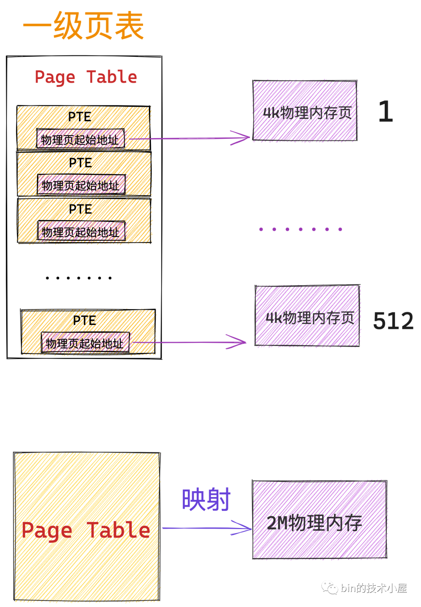

一张中间页目录 PMD 也是 4K 大小，PMD 中的页目录项 pmd_t 也是占用 8 个字节，所以一张 PMD 中只能容纳 512 个 pmd_t，内核中使用 `PTRS_PER_PMD` 常量来表示 PMD 中可以容纳多少个页目录项 pmd_t。因次 64 位虚拟内存地址中的 `PMD中的页目录偏移` 使用 9 个 bit 就可以表示了。

```c
/*
 * PMD_SHIFT determines the size of the area a middle-level
 * page table can map
 */
#define PMD_SHIFT	21
#define PTRS_PER_PMD	512
```

而一个 pmd_t 指向一张一级页表，所以一个 pmd_t 可以映射的物理内存为 2M，内核中使用 `PMD_SHIFT` 常量来表示一个 pmd_t 可以映射的物理内存范围：2^PMD_SHIFT。一张 PMD 可以映射 1G 的物理内存。


一张上层页目录 PUD 中可以容纳 512 个页目录项 pud_t，内核中使用 `PTRS_PER_PUD` 常量来表示 PUD 中可以容纳多少个页目录项 pud_t。 64 位虚拟内存地址中的 `PUD中的页目录偏移` 也是使用 9 个 bit 就可以表示了。

```c
/*
 * 3rd level page
 */
#define PUD_SHIFT	30
#define PTRS_PER_PUD	512
```

内核中使用 `PUD_SHIFT` 常量来表示一个 pud_t 可以映射的物理内存范围：2^PUD_SHIFT，一个 pud_t 指向一张 PMD，因此可以映射 1G 的物理内存。一张 PUD 可以映射 512G 的物理内存。

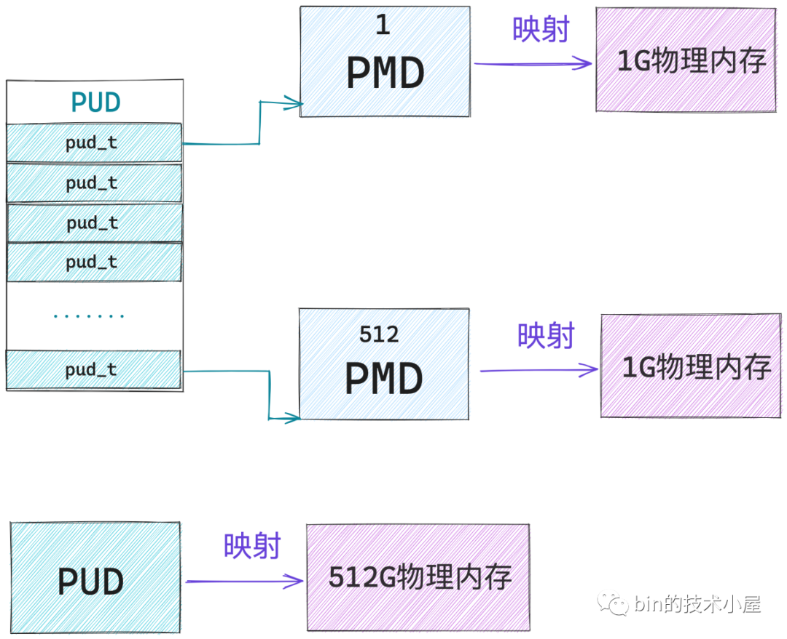

顶级页目录 PGD 中可以容纳的页目录 pgd_t 个数 `PTRS_PER_PGD = 512`， 64 位虚拟内存地址中的 `PGD中的页目录偏移` 也是使用 9 个 bit 就可以表示了，一个 pgd_t 可以映射的物理内存为 2^PGDIR_SHIFT = `512 G`。一张 PGD 可以映射的物理内存为 256 T。

```c
/*
 * 4th level page in 5-level paging case
 */
#define PGDIR_SHIFT		39
#define PTRS_PER_PGD		512
```


- PAGE_SHIFT 用来表示页表中的一个 PTE 可以映射的物理内存大小（4K）。
- PMD_SHIFT 用来表示 PMD 中的一个页目录项 pmd_t 可以映射的物理内存大小（2M）。
- PUD_SHIFT 用来表示 PUD 中的一个页目录项 pud_t 可以映射的物理内存大小（1G）。
- PGD_SHIFT 用来表示 PGD 中的一个页目录项 pgd_t 可以映射的物理内存大小（512G）。

这些 XXX_SHIFT 常量在内核中除了可以表示对应页目录项映射的物理内存大小之外，还可以从一个 64 位虚拟内存地址中获取其在对应页目录中的偏移。比如需要从一个 64 位虚拟内存地址中获取它在 PGD 中的偏移，可以讲虚拟内存地址右移 PGD_SHIFT 位来得到：

```c
#define pgd_index(address) ( address >> PGDIR_SHIFT) 
```

然后可以通过 PGD 的起始内存地址加上 `pgd_index` 就可以得到虚拟内存地址在 PGD 中的页目录项 pgd_t 了。

```c
#define pgd_offset_pgd(pgd, address) (pgd + pgd_index((address)))
```

同样的道理，可以将虚拟内存地址右移 PUD_SHIFT 位，并用掩码 `PTRS_PER_PUD - 1` 掩掉高 9 位 , 只保留低 9 位，就可以得到虚拟内存地址在 PUD 中的偏移了：

```c
// PTRS_PER_PUD - 1 转换为二进制是 9 个 1，用来截取最低的 9 个比特位。
static inline unsigned long pud_index(unsigned long address)
{
	return (address >> PUD_SHIFT) & (PTRS_PER_PUD - 1);
}
```

通过 pgd_t 获取 PUD 的起始内存地址 + `pud_index` 得到虚拟内存地址对应的 pud_t：

```c
/* Find an entry in the third-level page table.. */
static inline pud_t *pud_offset(pgd_t *pgd, unsigned long address)
{
	return (pud_t *)pgd_page_vaddr(*pgd) + pud_index(address);
}
```

根据相同的计算逻辑，可以通过 pmd_offset 函数获取虚拟内存地址在 PMD 中的页目录项 pmd_t：

```c
/* Find an entry in the second-level page table.. */
static inline pmd_t *pmd_offset(pud_t *pud, unsigned long address)
{
	return (pmd_t *)pud_page_vaddr(*pud) + pmd_index(address);
}

static inline unsigned long pmd_index(unsigned long address)
{
	return (address >> PMD_SHIFT) & (PTRS_PER_PMD - 1);
}
```

通过 pte_offset_kernel 函数可以获取虚拟内存地址在一级页表中的 PTE：

```c
static inline pte_t *pte_offset_kernel(pmd_t *pmd, unsigned long address)
{
	return (pte_t *)pmd_page_vaddr(*pmd) + pte_index(address);
}

static inline unsigned long pte_index(unsigned long address)
{
	return (address >> PAGE_SHIFT) & (PTRS_PER_PTE - 1);
}
```


1. 首先 MMU 会从 CR3/TTBR 寄存器中获取顶级页目录 PGD 的起始内存地址，然后通过 pgd_index 从虚拟内存地址中截取 `PGD 中的页目录项偏移`，这样就定位到了具体的一个 pgd_t。
2. pgd_t 中保存的是 PMD 的起始内存地址，通过 pud_index 可以从虚拟内存地址中截取 `PUD 中的页目录项偏移`，从而确定虚拟内存地址在 PUD 中的页目录项 pud_t。
3. 同样的道理，根据 pud_t 中保存的 PMD 其实内存地址，在加上通过 pmd_index 获取到的 `PMD 中的页目录项偏移`，定位到虚拟内存地址在 PMD 中的页目录项 pmd_t。
4. 后面的寻址流程就和二级页表一样了，pmd_t 指向具体页表的起始内存地址，通过 pte_index 截取虚拟内存地址在 `一级页表中的 PTE 偏移`，最终定位到一个具体的 PTE 中，PTE 指向的正是虚拟内存地址映射的物理内存页面，然后通过虚拟内存地址中的低 12 位（物理内存页内偏移），最终确定到一个具体的物理字节上。


以 36 位物理内存地址（最多 52 位）为例进行说明，首先物理内存页的起始内存地址都是按照 4K 对齐的，所以 36 位物理内存地址的低 12 位全部为 0 ，和 32 位的 PTE 一样，内核可以用这低 12 位来描述 PTE 的权限位，其中 0 到 8 之间的比特位，在 32 位 PTE 和 64 位 PTE 中含义都是一样的。

`R(11)` 这里的 R 表示 restart，该比特位主要用于 HLAT paging，当遍历到 R 位是 1 的 PTE 时，MMU 会重新从 CR3/TTBR 寄存器开始遍历页表。

本例中的物理内存地址是 36 位的，由于物理内存页都是 4K 对齐的，低 12 位全都是 0 ，因此只需要在 PTE 中存储物理内存地址的高 24 位即可，这部分存储在 PTE 中的第 12 到 35 比特位。

`Reserved(51:36)` 这些是预留位，全部设置为 0 。

`Protection(62:59)` 这 4 个比特位用于对物理内存页的访问进行控制。

`XD(63)` 该比特位是 64 位 PTE 中新增的，32 位 PTE 中是没有的，值为 1 表示该 PTE 所映射的物理内存页面中的数据是可以被执行的。


当 64 位 PDE 的 `PS(7)` 比特位为 0 时，该 PDE 指向的是其下一级页目录或者页表的起始内存地址。当 64 位 PDE 的 `PS(7)` 比特位为 1 时，该 PDE 指向的就是一个内存大页，对于 PMD 中的页目录项 pmd_t 而言，它指向的是一张 2M 大小的物理内存大页。

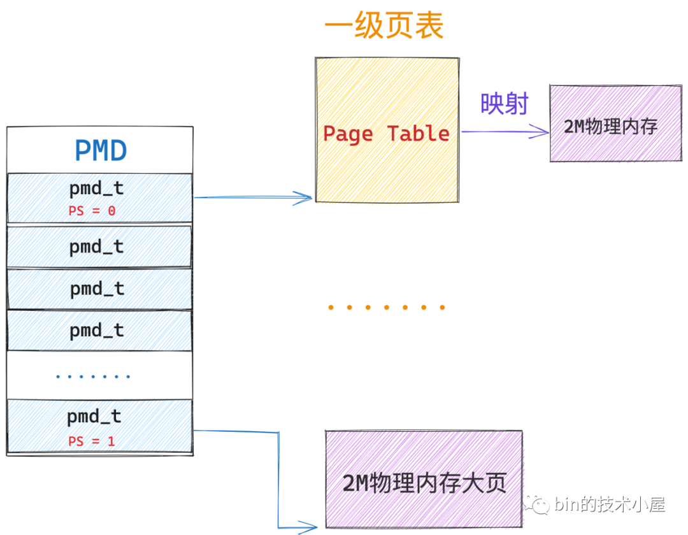

对于 PUD 中的页目录项 pud_t 而言，它指向的是一张 1G 大小的物理内存大页。

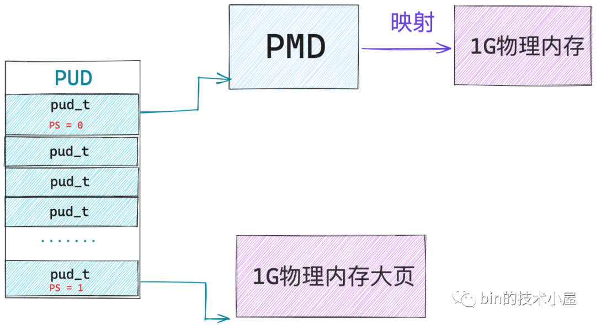

当 64 位 PDE 的 PS(7) 比特位为 1 时，这些页目录项 PDE 就被当做了一个特殊的 ”PTE“ 对待了，因此 PDE 中的比特位布局又就变成了 64 位 PTE 中的样子了。

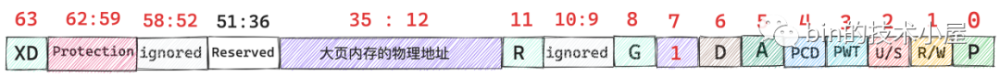

第 12 到 35 比特位直接标注为了存储大页内存的地址，但事实上，大页内存的地址并不需要这么多位来存储，因为大页中的内存容量比较大，所以大页个数相对较少，它们的起始内存地址不会特别高，使用小于 24 位的比特就可以存放了，多出来的比特位被用作其他目的。内核当然也会提供一系列的辅助函数来对页目录进行操作：

- pgd_alloc，pud_alloc，pmd_alloc 负责创建初始化对应的页目录。
- mk_pgd，mk_pud，mk_pmd，mk_pte 用于创建相应页目录项和页表项，并初始化上述比特位。
- 以及提供相关 pgd_xxx，pud_xxx，pmd_xxx 等形式的辅助函数，用于对相关比特位的增删改查操作。

#### CPU 寻址过程

地址翻译的过程需要的步骤还是比较多的，而 CPU 访问内存的操作是非常非常频繁的，如果采用内核这种软件的方式对页表进行遍历，效率会非常的差。而采用一种专门的硬件来对软件进行加速，无疑是一种最简单，最直接有效的优化手段，于是在 CPU 中引入了一个专门对页表进行遍历的地址翻译硬件 MMU（Memory Management Unit），有了 MMU 硬件的加持整个地址翻译的过程就非常的快了。


页目录表和页表中那些经常被 MMU 遍历到的页目录项 PDE，页表项 PTE 均会缓存在 CPU 的 CACHE 中，这样 MMU 就可以直接从 CPU 高速缓存中获取 PDE , PTE 了，近一步加速了整个地址翻译的过程。

当 MMU 拿到一个 CPU 正在访问的虚拟内存地址之后， MMU 首先会从 CR3/TTBR 寄存器中获取顶级页目录表 PGD 的起始内存地址，然后从虚拟内存地址中提取出 pgd_index，从而定位到 PGD 中的一个页目录项 pdg_t，MMU 首先会从 CPU 的高速缓存中去获取这个 pgd_t，如果 pgd_t 经常被访问到，那么此时它已经存在于高速缓存中了，MMU 直接可以进行下一级页目录的地址翻译操作，避免了慢速的内存访问。同样的道理，在 MMU 经过层层的页目录遍历之后，终于定位到了一级页表中的 PTE，MMU 也是先会从 CPU 高速缓存中去获取 PTE，如果 PTE 不在高速缓存中，MMU 才会去内存中去获取。获取到 PTE 之后，MMU 就得到了虚拟内存地址背后映射的物理内存地址了。

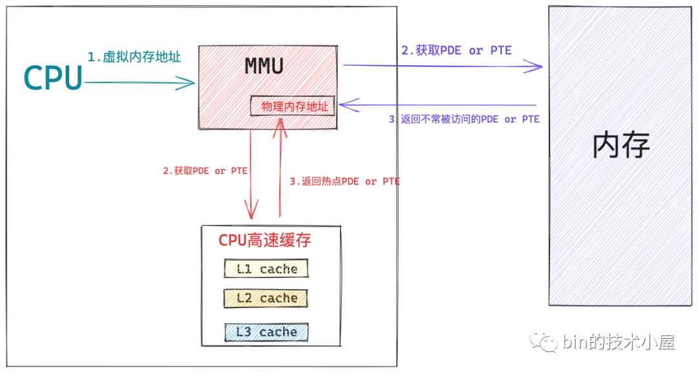

在引入 MMU 之后，虽然加快了整个页表遍历的过程，但是 CPU 每访问一个虚拟内存地址，MMU 还是需要查找一次 PTE，即便是最好的情况，MMU 也还是需要到 CPU 高速缓存中去找一下的，即便这样开销已经很小了，但是还是想近一步降低这个访问 CPU CACHE 的开销，让 CPU 访存性能达到极致。既然 MMU 每次都需要查找一次 PTE，那么能不能在 MMU 中引入一层硬件缓存，这样 MMU 可以把查找到的 PTE 缓存在硬件中，下次再需要的时候直接到硬件缓存中拿现成的 PTE 就可以了，这样一来，CPU 的访存效率又被近一步加快了。这个 MMU 中的硬件缓存就叫做 TLB(Translation Lookaside Buffer)，TLB 是一个非常小的，虚拟寻址的硬件缓存，专门用来缓存被 MMU 翻译之后的热点 PTE。引入 TLB 之后，整个寻址过程就又有了一些新的变化：

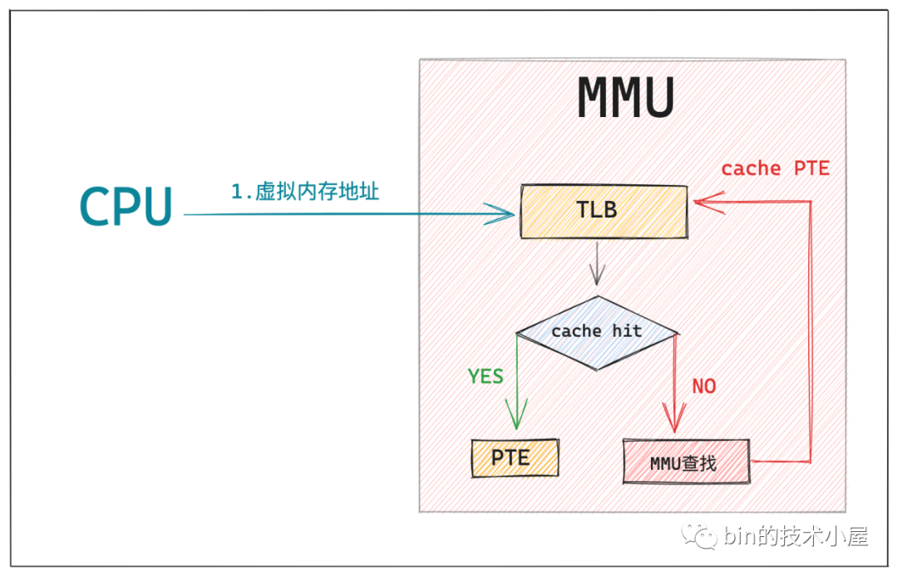

当 CPU 将要访问的虚拟内存地址送到 MMU 中翻译时，MMU 首先会在 TLB 中通过虚拟内存寻址查找其对应的 PTE 是否缓存在 TLB 中，如果 cache hit ，那么 MMU 就可以直接获得现成的 PTE，避免了漫长的地址翻译过程。如果 cache miss，那么 MMU 就需要重新遍历页表，然后获取 PTE 的内存地址，从 CPU 高速缓存或者内存中去查找 PTE，慢速路径下获取到 PTE 之后，MMU 会将 PTE 缓存到 TLB 中，加快下一次获取 PTE 的速度。当 MMU 获取到 PTE 之后，就可以从 PTE 中拿到物理内存页的起始地址了，在加上虚拟内存地址的低 12 位（物理内存页内偏移）这样就获取到了虚拟内存地址映射的物理内存地址了。

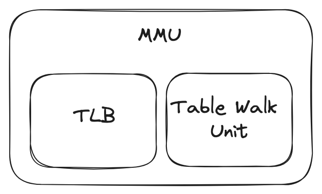

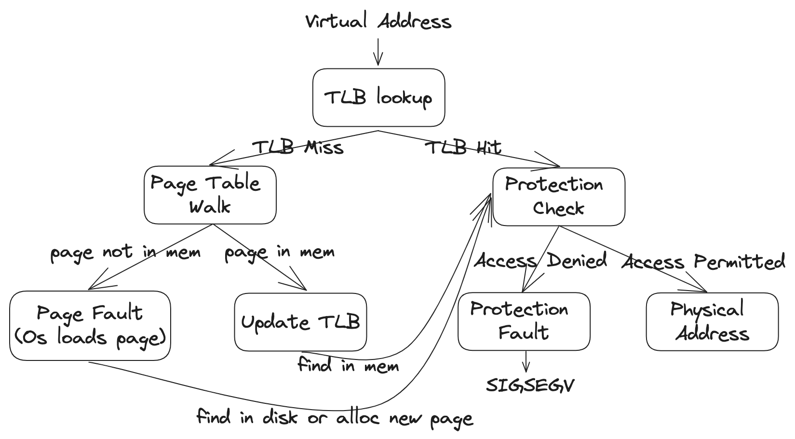

#### Page Table Walk Example

假设当前CPU支持的虚拟地址是14位，物理地址是12位，page size为64字节（这里要说明一下，通常情况下，虚拟地址和物理地址的位数是一样的，但其实并不一定需要一样，因为允许多个虚拟地址指向同一个物理地址）。

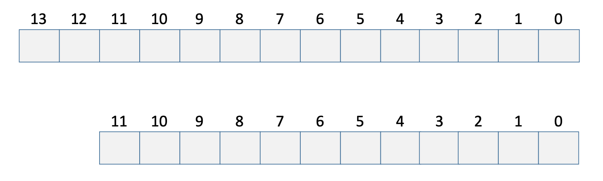

不管是虚拟地址还是物理地址，因为最小管理单位都是page，在转换过程中，代表page内的偏移地址（offset）的低位bits部分是不需要参与的，需要转换的只是代表page唯一性标识的高位bits部分，称作page number。由此产生了4个概念：VPN（virtual page number），PPN（physical page number）or in Linux PFN（page frame number），VPO（virtual page offset）和PPO（physical page offset）
$$
PPO = VPO = log_2pageSize
$$
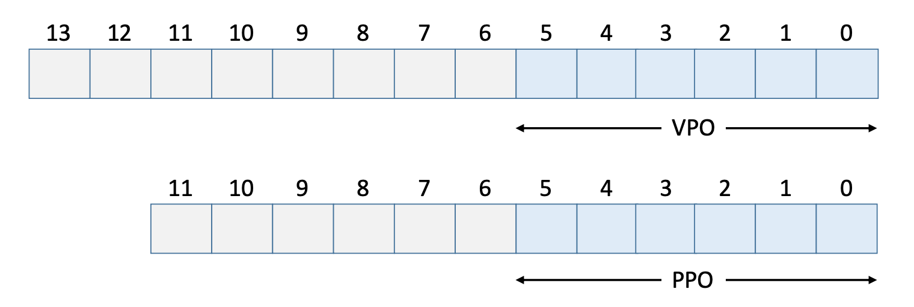

虚拟地址中剩下的bit位就成了VPN，物理地址中剩下的bit位就成了PPN

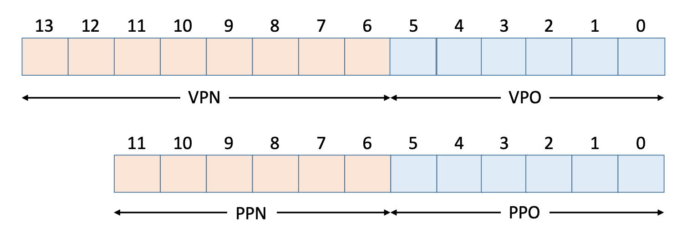

TLB本身就是一个hardware cache, 假设TLB一共有16个entries，是4路组相关（4-way set associative）的，则有16/4=4个sets。TLB Index（以下简称TI）的值为 2，剩下的bit位就成了TLB Tag（以下简称TT）。

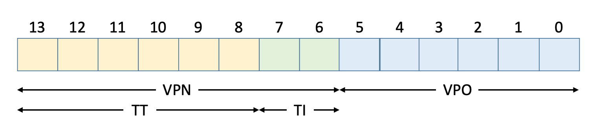

后续使用直接映射，size为64bytes，cache line size为4bytes的cache，结构如下：

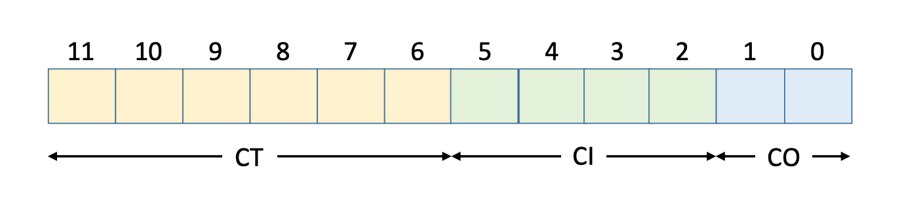

TLB结构如下：


page table 结构如下：

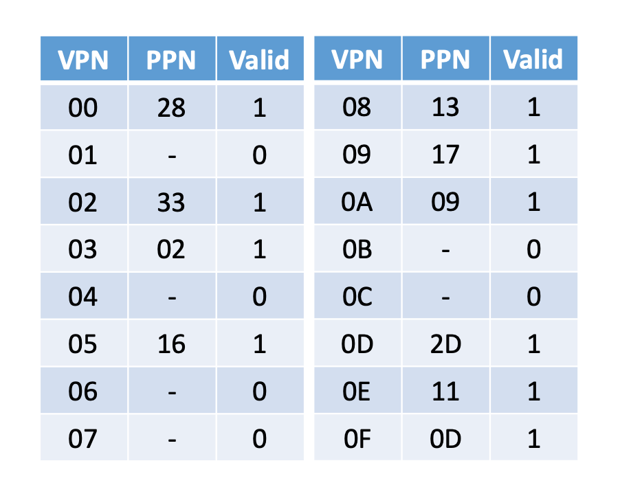

cache 结构如下：

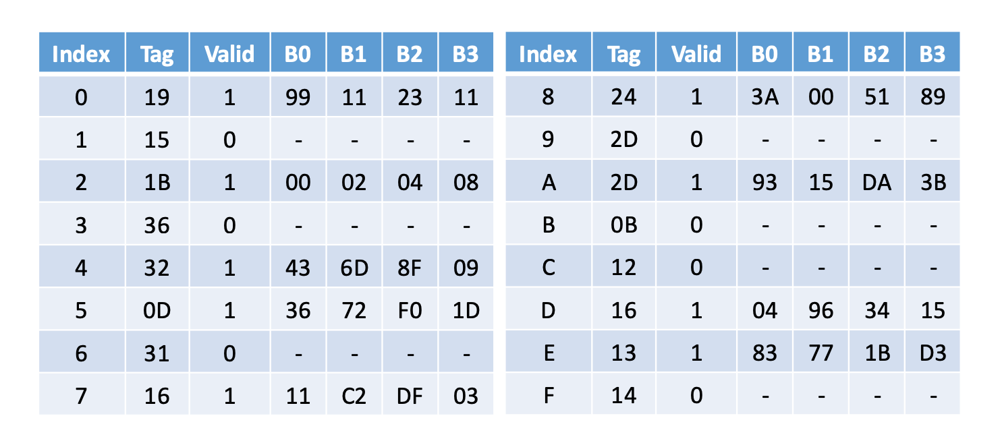

下面读取虚拟地址为0x0334处的内容

1. 将这一地址分割成VPN和VPO

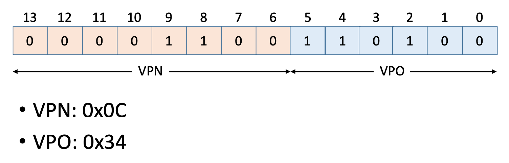

2. 将VPN分割成TT和TI

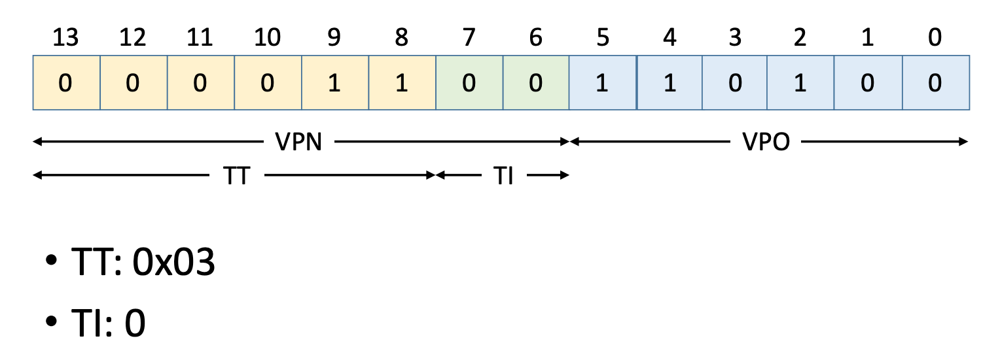

3. 使用TT (0x03) 和TI (0) 在TLB中查找。作为cache，TLB index是用来索引的，不会存储在TLB entry中，TLB entry中存的只有tag, 权限位，有效位和内容（对于TLB来说就是PPN）。一个TLB entry的构成如下：

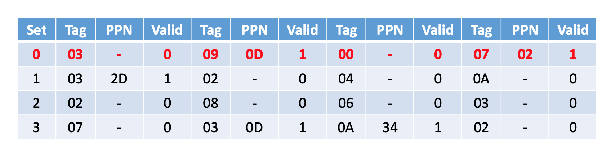

虽然在set/index为0这一行，找到了tag为03的一个entry，但这个entry中PPN是不存在的，整个entry目前是invalid的，也就是说TLB miss了，需要去page table中找。

4. 使用VPN (0x0C) 作为index在page table中查找。index作为索引，也是不会存储于page table entry中的，PTE存的只有权限位，有效位和内容（对于PTE来说也是PPN）。一个只有one level的page table（单级页表）构成如下：

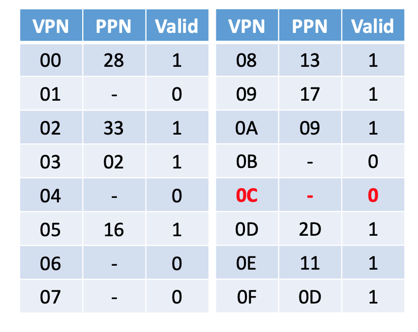

对应的PTE（page table entry）中的PPN不存在，依然是invalid的，这将触发一个page fault。

读取虚拟地址0x0255，先分解VPN和VPO：


分解VPN为TT和TI：

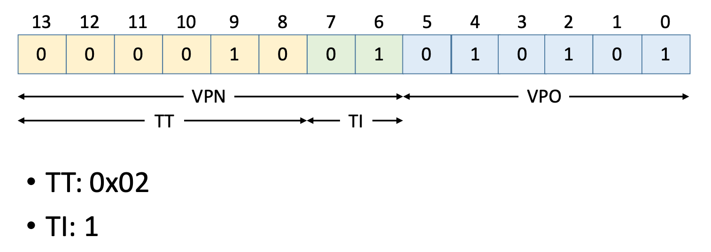

在TLB中查找 TT (0x02) & TI (1) ，没有匹配的entry，TLB miss

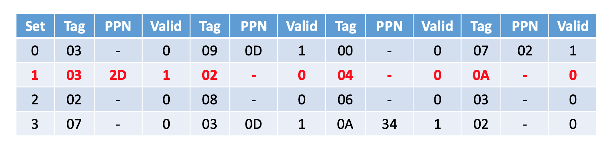

在页表中通过VPN（0x09）找PPN，找到了PPN为0x17

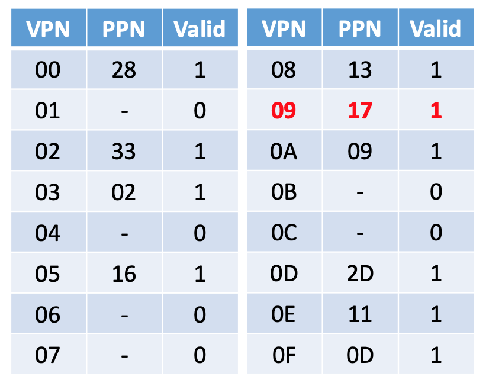

与之前计算出的VPO（0x15）合并，得到物理地址0x5D5

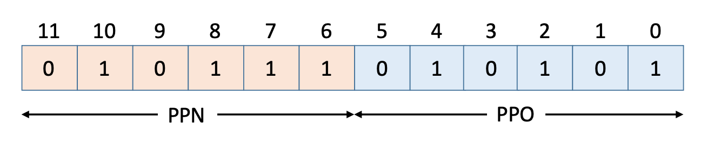

有了物理地址后，在cache中查找，计算得到CT(0x17) CI(5) CO(1)

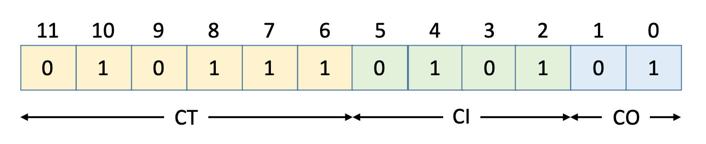

cache中没有匹配的tag，cache miss

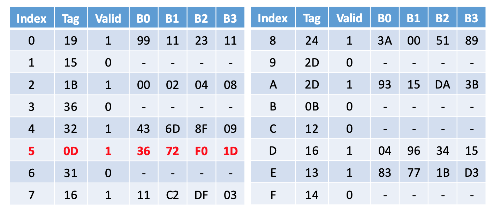

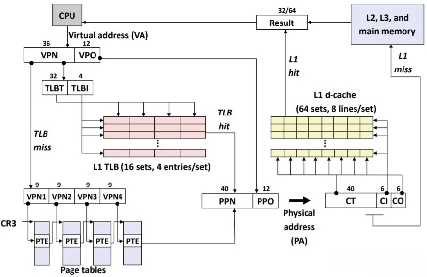

### mmap

```c
#include <sys/mman.h>
void* mmap(void* addr, size_t length, int prot, int flags, int fd, off_t offset);

// arch/arm64/kernel/sys.c
SYSCALL_DEFINE6(mmap, unsigned long, addr, unsigned long, len,
		unsigned long, prot, unsigned long, flags,
		unsigned long, fd, unsigned long, off)
```

mmap 内存映射里所谓的内存其实指的是虚拟内存，在调用 mmap 进行匿名映射的时候（比如进行堆内存的分配），是将进程虚拟内存空间中的某一段虚拟内存区域与物理内存中的匿名内存页进行映射，当调用 mmap 进行文件映射的时候，是将进程虚拟内存空间中的某一段虚拟内存区域与磁盘中某个文件中的某段区域进行映射。

- addr ： 表示要映射的这段虚拟内存区域在进程虚拟内存空间中的起始地址（虚拟内存地址），但是这个参数只是给内核的一个暗示，内核并非一定得从我们指定的 addr 虚拟内存地址上划分虚拟内存区域，内核只不过在划分虚拟内存区域的时候会优先考虑用户指定的 addr，如果这个虚拟地址已经被使用或者是一个无效的地址，那么内核则会自动选取一个合适的地址来划分虚拟内存区域。用户一般会将 addr 设置为 NULL，意思就是完全交由内核来决定虚拟映射区的起始地址。
  - length ：如果是匿名映射，length 参数决定了要映射的匿名物理内存有多大，如果是文件映射，length 参数决定了要映射的文件区域有多大。

addr，length 必须要按照 PAGE_SIZE（4K） 对齐


如果通过 mmap 映射的是磁盘上的一个文件，那么就需要通过参数 fd 来指定要映射文件的描述符（file descriptor），通过参数 offset 来指定文件映射区域在文件中偏移。在内存管理系统中，物理内存是按照内存页为单位组织的，在文件系统中，磁盘中的文件是按照磁盘块为单位组织的，内存页和磁盘块大小一般情况下都是 4K 大小，所以这里的 offset 也必须是按照 4K 对齐的。而在文件映射与匿名映射区中的这一段一段的虚拟映射区，其实本质上也是虚拟内存区域，它们和进程虚拟内存空间中的代码段，数据段，BSS 段，堆，栈没有任何区别，在内核中都是 `struct vm_area_struct` 结构来表示的，进程空间中的这些虚拟内存区域统称为 VMA。

mmap 系统调用的本质是首先要在进程虚拟内存空间里的文件映射与匿名映射区中划分出一段虚拟内存区域 VMA 出来 ，这段 VMA 区域的大小用 vm_start，vm_end 来表示，它们由 mmap 系统调用参数 addr，length 决定。

```c
struct vm_area_struct {
    unsigned long vm_start;     /* Our start address within vm_mm. */
    unsigned long vm_end;       /* The first byte after our end address */
}
```

随后内核会对这段 VMA 进行相关的映射，如果是文件映射的话，内核会将要映射的文件，以及要映射的文件区域在文件中的 offset，与 VMA 结构中的 `vm_file`，`vm_pgoff` 关联映射起来，它们由 mmap 系统调用参数 fd，offset 决定。

```c
struct vm_area_struct {
    struct file * vm_file;      /* File we map to (can be NULL). */
    unsigned long vm_pgoff;     /* Offset (within vm_file) in PAGE_SIZE */
}
```

另外由 mmap 在文件映射与匿名映射区中映射出来的这一段虚拟内存区域同进程虚拟内存空间中的其他虚拟内存区域一样，也都是有权限控制的。

- 进程虚拟内存空间中的代码段，它是与磁盘上 ELF 格式可执行文件中的 .text section（磁盘文件中各个区域的单元组织结构）进行映射的，存放的是程序执行的机器码，所以在可执行文件与进程虚拟内存空间进行文件映射的时候，需要指定代码段这个虚拟内存区域的权限为可读（VM_READ），可执行的（VM_EXEC）。
- 数据段也是通过文件映射进来的，内核会将磁盘上 ELF 格式可执行文件中的 .data section 与数据段映射起来，在映射的时候需要指定数据段这个虚拟内存区域的权限为可读（VM_READ），可写（VM_WRITE）。
- 与代码段和数据段不同的是，BSS段，堆，栈这些虚拟内存区域并不是从磁盘二进制可执行文件中加载的，它们是通过匿名映射的方式映射到进程虚拟内存空间的。BSS 段中存放的是程序未初始化的全局变量，这段虚拟内存区域的权限是可读（VM_READ），可写（VM_WRITE）。
- 堆是用来描述进程在运行期间动态申请的虚拟内存区域的，所以堆也会具有可读（VM_READ），可写（VM_WRITE）权限，在有些情况下，堆也具有可执行（VM_EXEC）的权限，比如 Java 中的字节码存储在堆中，所以需要可执行权限。
- 栈是用来保存进程运行时的命令行参，环境变量，以及函数调用过程中产生的栈帧的，栈一般拥有可读（VM_READ），可写（VM_WRITE）的权限，但是也可以设置可执行（VM_EXEC）权限，不过出于安全的考虑，很少这么设置。

 mmap 系统调用中的参数 prot 来指定其在进程虚拟内存空间中映射出的这段虚拟内存区域 VMA 的访问权限，它的取值有如下四种：

```c
#define PROT_READ	0x1		/* page can be read */
#define PROT_WRITE	0x2		/* page can be written */
#define PROT_EXEC	0x4		/* page can be executed */
#define PROT_NONE	0x0		/* page can not be accessed */
```

- PROT_READ 表示该虚拟内存区域背后映射的物理内存是可读的。
- PROT_WRITE 表示该虚拟内存区域背后映射的物理内存是可写的。
- PROT_EXEC 表示该虚拟内存区域背后映射的物理内存所存储的内容是可以被执行的，该内存区域内往往存储的是执行程序的机器码，比如进程虚拟内存空间中的代码段，以及动态链接库通过文件映射的方式加载进文件映射与匿名映射区里的代码段，这些 VMA 的权限就是 PROT_EXEC 。
- PROT_NONE 表示这段虚拟内存区域是不能被访问的，既不可读写，也不可执行。用于实现防范攻击的 guard page。如果攻击者访问了某个 guard page，就会触发 SIGSEV 段错误。除此之外，指定 PROT_NONE 还可以为进程预先保留这部分虚拟内存区域，虽然不能被访问，但是当后面进程需要的时候，可以通过 mprotect 系统调用修改这部分虚拟内存区域的权限。

mprotect 系统调用可以动态修改进程虚拟内存空间中任意一段虚拟内存区域的权限。

除了要为 mmap 映射出的这段虚拟内存区域 VMA 指定访问权限之外，还需要为这段映射区域 VMA 指定映射方式，VMA 的映射方式由 mmap 系统调用参数 flags 决定，内核为 flags 定义了数量众多的枚举值。

```c
#define MAP_FIXED   0x10        /* Interpret addr exactly */
#define MAP_ANONYMOUS   0x20    /* don't use a file */

#define MAP_SHARED  0x01        /* Share changes */
#define MAP_PRIVATE 0x02        /* Changes are private */
```

mmap 系统调用的 addr 参数，这个参数只是一个暗示并非是强制性的，表示希望内核可以根据指定的虚拟内存地址 addr 处开始创建虚拟内存映射区域 VMA。但如果指定的 addr 是一个非法地址，比如 `[addr , addr + length]` 这段虚拟内存地址已经存在映射关系了，那么内核就会自动选取一个合适的虚拟内存地址开始映射。但是在 mmap 系统调用的参数 flags 中指定了 `MAP_FIXED`, 这时参数 addr 就变成强制要求了，如果 `[addr , addr + length]` 这段虚拟内存地址已经存在映射关系了，那么内核就会将这段映射关系 unmmap 解除掉映射，然后重新根据用户的要求进行映射，如果 addr 是一个非法地址，内核就会报错停止映射。

将 mmap 系统调用参数 flags 指定为 `MAP_ANONYMOUS` 时，表示需要进行匿名映射，既然是匿名映射，fd 和 offset 这两个参数也就没有了意义，fd 参数需要被设置为 -1 。当进行文件映射的时候，只需要指定 fd 和 offset 参数就可以了。

根据 mmap 创建出的这片虚拟内存区域背后所映射的**物理内存**能否在多进程之间共享，又分为了两种内存映射方式：

- `MAP_SHARED` 表示共享映射，通过 mmap 映射出的这片内存区域在多进程之间是共享的，一个进程修改了共享映射的内存区域，其他进程是可以看到的，用于多进程之间的通信。
- `MAP_PRIVATE` 表示私有映射，通过 mmap 映射出的这片内存区域是进程私有的，其他进程是看不到的。如果是私有文件映射，那么多进程针对同一映射文件的修改将不会回写到磁盘文件上

#### 私有匿名映射

`MAP_PRIVATE | MAP_ANONYMOUS` 表示私有匿名映射，通常利用这种映射方式来申请虚拟内存，比如使用 glibc 库里封装的 malloc 函数进行虚拟内存申请时，当申请的内存大于 128K 的时候，malloc 就会调用 mmap 采用私有匿名映射的方式来申请堆内存。因为它是私有的，所以申请到的内存是进程独占的，多进程之间不能共享。mmap 私有匿名映射申请到的只是虚拟内存，内核只是在进程虚拟内存空间中划分一段虚拟内存区域 VMA 出来，并将 VMA 该初始化的属性初始化好，mmap 系统调用就结束了。

当进程开始访问这段虚拟内存区域时，发现这段虚拟内存区域背后没有任何物理内存与其关联，体现在内核中就是这段虚拟内存地址在页表中的 PTE 项是空的。这时 MMU 就会触发缺页异常（page fault），这里的缺页指的就是缺少物理内存页，随后进程就会切换到内核态，在内核缺页中断处理程序中，为这段虚拟内存区域分配对应大小的物理内存页，随后将物理内存页中的内容全部初始化为 0 ，最后在页表中建立虚拟内存与物理内存的映射关系，缺页异常处理结束。当缺页处理程序返回时，CPU 会重新启动引起本次缺页异常的访存指令，这时 MMU 就可以正常翻译出物理内存地址了。

mmap 的私有匿名映射还会应用在 execve 系统调用中，execve 用于在当前进程中加载并执行一个新的二进制执行文件：

```c
#include <unistd.h>

// 参数 filename 指定新的可执行文件的文件名，argv 用于传递新程序的命令行参数，envp 用来传递环境变量。
int execve(const char* filename, const char* argv[], const char* envp[])
```

既然是在当前进程中重新执行一个程序，那么当前进程的用户态虚拟内存空间就没有用了，内核需要根据这个可执行文件重新映射进程的虚拟内存空间。既然现在要重新映射进程虚拟内存空间，内核首先要做的就是删除释放旧的虚拟内存空间，并清空进程页表。然后根据 filename 打开可执行文件，并解析文件头，判断可执行文件的格式，不同的文件格式需要不同的函数进行加载。

linux 中支持多种可执行文件格式，比如，elf 格式，a.out 格式。内核中使用 `struct linux_binfmt` 结构来描述可执行文件，里边定义了用于加载可执行文件的函数指针 `load_binary`，加载动态链接库的函数指针 `load_shlib`，不同文件格式指向不同的加载函数：

```c
static struct linux_binfmt elf_format = {
	.module		= THIS_MODULE,
	.load_binary	= load_elf_binary,
	.load_shlib	= load_elf_library,
	.core_dump	= elf_core_dump,
	.min_coredump	= ELF_EXEC_PAGESIZE,
};

static struct linux_binfmt aout_format = {
	.module		= THIS_MODULE,
	.load_binary	= load_aout_binary,
	.load_shlib	= load_aout_library,
};
```

在 `load_binary` 中会解析对应格式的可执行文件，并根据文件内容重新映射进程的虚拟内存空间。比如，虚拟内存空间中的 BSS 段，堆，栈这些内存区域中的内容不依赖于可执行文件，所以在 `load_binary` 中采用私有匿名映射的方式来创建新的虚拟内存空间中的 BSS 段，堆，栈。BSS 段虽然定义在可执行二进制文件中，不过只是在文件中记录了 BSS 段的长度，并没有相关内容关联，所以 BSS 段也会采用私有匿名映射的方式加载到进程虚拟内存空间中。


#### 私有文件映射

调用 mmap 进行内存文件映射的时候可以通过指定参数 flags 为 `MAP_PRIVATE`，然后将参数 fd 指定为要映射文件的文件描述符（file descriptor）来实现对文件的私有映射。假设现在磁盘上有一个名叫 file-read-write.txt 的磁盘文件，现在多个进程采用私有文件映射的方式，从文件 offset 偏移处开始，映射 length 长度的文件内容到各个进程的虚拟内存空间中，调用完 mmap 之后，相关内存映射内核数据结构关系如下图所示：


当进程打开一个文件的时候，内核会为其创建一个 `struct file` 结构来描述被打开的文件，并在进程文件描述符列表 `fd_array` 数组中找到一个空闲位置分配给它，数组中对应的下标，就是在用户空间用到的文件描述符。

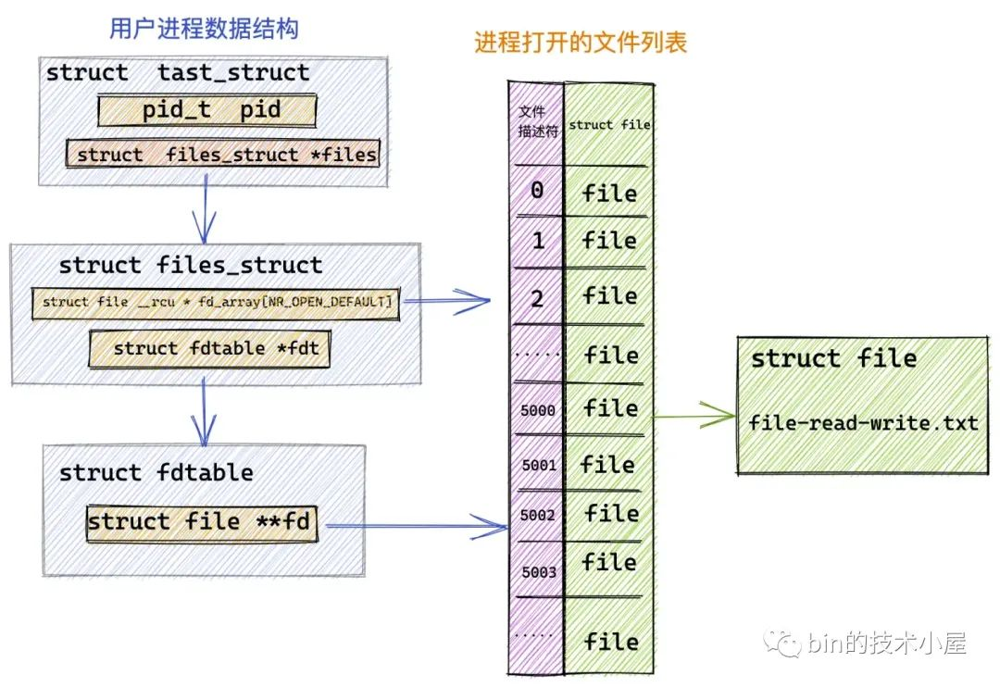

`struct file` 结构是和进程相关的（ fd 的作用域也是和进程相关的），即使多个进程打开同一个文件，那么内核会为每一个进程创建一个 `struct file` 结构，如上图中所示，进程 1 和 进程 2 都打开了同一个 file-read-write.txt 文件，那么内核会为进程 1 创建一个 `struct file` 结构，也会为进程 2 创建一个 `struct file` 结构。每一个磁盘上的文件在内核中都会有一个唯一的 `struct inode` 结构，inode 结构和进程是没有关系的，一个文件在内核中只对应一个 inode，inode 结构用于描述文件的元信息，比如，文件的权限，文件中包含多少个磁盘块，每个磁盘块位于磁盘中的什么位置等等。

```c
// ext4 文件系统中的 inode 结构
struct ext4_inode {
   // 文件权限
  __le16  i_mode;    /* File mode */
  // 文件包含磁盘块的个数
  __le32  i_blocks_lo;  /* Blocks count */
  // 存放文件包含的磁盘块
  __le32  i_block[EXT4_N_BLOCKS];/* Pointers to blocks */
};
```

在文件系统中，Linux 是按照磁盘块为单位对磁盘中的数据进行管理的，它们的大小也是 4K 。如下图所示，磁盘盘面上一圈一圈的同心圆叫做磁道，磁盘上存储的数据就是沿着磁道的轨迹存放着，随着磁盘的旋转，磁头在磁道上读写硬盘中的数据。而在每个磁盘上，会进一步被划分成多个大小相等的圆弧，这个圆弧就叫做扇区，磁盘会以扇区为单位进行数据的读写。每个扇区大小为 512 字节。

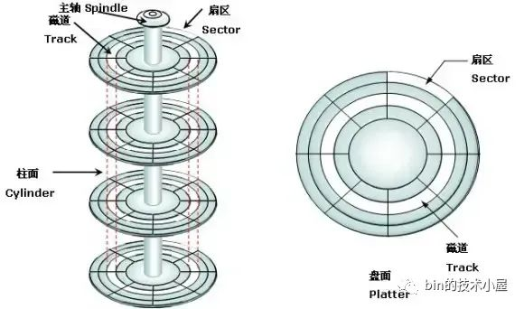

而在 Linux 的文件系统中是按照磁盘块为单位对数据读写的，因为每个扇区大小为 512 字节，能够存储的数据比较小，而且扇区数量众多，这样在寻址的时候比较困难，Linux 文件系统将相邻的扇区组合在一起，形成一个磁盘块，后续针对磁盘块整体进行操作效率更高。只要找到了文件中的磁盘块，就可以寻址到文件在磁盘上的存储内容了，所以使用 mmap 进行内存文件映射的本质就是建立起虚拟内存区域 VMA 到文件磁盘块之间的映射关系 。

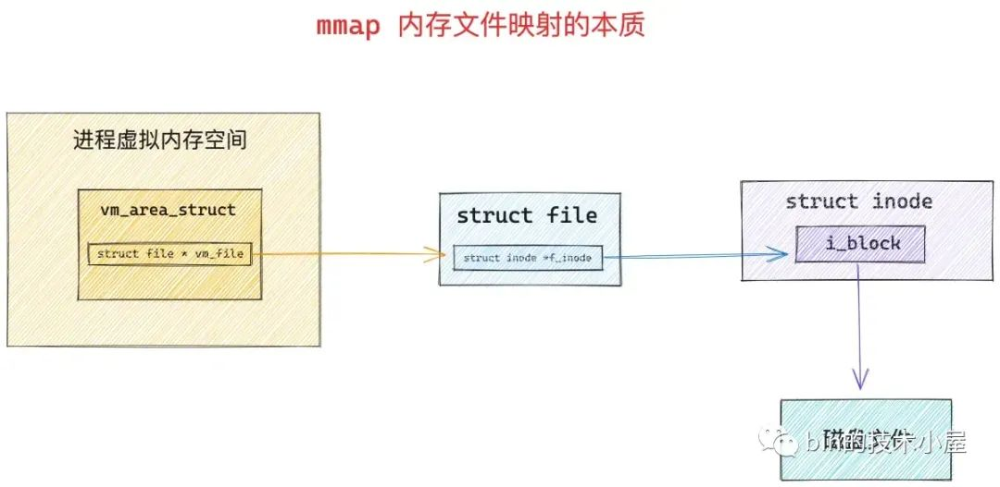

调用 mmap 进行内存文件映射的时候，内核首先会在进程的虚拟内存空间中创建一个新的虚拟内存区域 VMA 用于映射文件，通过 `vm_area_struct->vm_file` 将映射文件的 `struct flle` 结构与虚拟内存映射关联起来。

```c
struct vm_area_struct {
    struct file * vm_file;      /* File we map to (can be NULL). */
    unsigned long vm_pgoff;     /* Offset (within vm_file) in PAGE_SIZE */
}
```

通过 `vm_file->f_inode` 可以关联到映射文件的 `struct inode`，近而关联到映射文件在磁盘中的磁盘块 `i_block`，**这个就是 mmap 内存文件映射最本质的东西**。

站在文件系统的视角，映射文件中的数据是按照磁盘块来存储的，读写文件数据也是按照磁盘块为单位进行的，磁盘块大小为 4K，当进程读取磁盘块的内容到内存之后，站在内存管理系统的视角，磁盘块中的数据被 DMA 拷贝到了物理内存页中，这个物理内存页就是前面提到的文件页。根据程序的时间局部性原理，磁盘文件中的数据一旦被访问，那么它很有可能在短期内被再次访问，所以为了加快进程对文件数据的访问，内核会将已经访问过的磁盘块缓存在文件页中。

一个文件包含多个磁盘块，当它们被读取到内存之后，一个文件也就对应了多个文件页，这些文件页在内存中统一被一个叫做 page cache 的结构所组织。每一个文件在内核中都会有一个唯一的 page cache 与之对应，用于缓存文件中的数据，page cache 是和文件相关的，它和进程是没有关系的，多个进程可以打开同一个文件，每个进程中都有有一个 `struct file` 结构来描述这个文件，但是一个文件在内核中只会对应一个 page cache。文件的 `struct inode` 结构中除了有磁盘块的信息之外，还有指向文件 page cache 的 `i_mapping` 指针。

```c
struct inode {
    struct address_space	*i_mapping;
}

// page cache 在内核中是使用 struct address_space 结构来描述的
struct address_space {
    // 文件页是挂在 radix_tree 的叶子结点上，radix_tree 中的 root 节点和 node 节点是文件页（叶子节点）的索引节点。
    struct radix_tree_root  page_tree; 
}
```

当多个进程调用 mmap 对磁盘上同一个文件进行私有文件映射的时候，内核只是在每个进程的虚拟内存空间中创建出一段虚拟内存区域 VMA 出来，注意，此时内核只是为进程申请了用于映射的虚拟内存，并将虚拟内存与文件映射起来，mmap 系统调用就返回了，全程并没有物理内存的影子出现。文件的 page cache 也是空的，没有包含任何的文件页。当任意一个进程开始访问这段映射的虚拟内存时，CPU 会把虚拟内存地址送到 MMU 中进行地址翻译，因为 mmap 只是为进程分配了虚拟内存，并没有分配物理内存，所以这段映射的虚拟内存在页表中是没有页表项 PTE 的。随后 MMU 就会触发缺页异常（page fault），进程切换到内核态，在内核缺页中断处理程序中会发现引起缺页的这段 VMA 是私有文件映射的，所以内核会首先通过 `vm_area_struct->vm_pgoff` 在文件 page cache 中查找是否有缓存相应的文件页（映射的磁盘块对应的文件页）。

```c
struct vm_area_struct {
    unsigned long vm_pgoff;     /* Offset (within vm_file) in PAGE_SIZE */
}

static inline struct page *find_get_page(struct address_space *mapping,
     pgoff_t offset)
{
	return pagecache_get_page(mapping, offset, 0, 0);
}

static const struct address_space_operations ext4_aops = {
    .readpage       = ext4_readpage
}
```

如果文件页不在 page cache 中，内核则会在物理内存中分配一个内存页，然后将新分配的内存页加入到 page cache 中，并增加页引用计数。随后会通过 `address_space_operations` 重定义的 readpage 激活块设备驱动从磁盘中读取映射的文件内容，然后将读取到的内容填充新分配的内存页。现在文件中映射的内容已经加载进 page cache 了，此时物理内存才正式登场，在缺页中断处理程序的最后一步，内核会为映射的这段虚拟内存在页表中创建 PTE，然后将虚拟内存与 page cache 中的文件页通过 PTE 关联起来，缺页处理就结束了，但是由于指定的私有文件映射，所以 PTE 中文件页的权限是只读的。当内核处理完缺页中断之后，mmap 私有文件映射在内核中的关系图就变成下面这样：


此时进程 1 中的页表已经建立起了虚拟内存与文件页的映射关系，进程 1 再次访问这段虚拟内存的时候，其实就等于直接访问文件的 page cache。整个过程是在用户态进行的，不需要切态。进程 2 和进程 1 一样，都是采用 mmap 私有文件映射的方式映射到了同一个文件中，虽然现在已经有了物理内存了（通过进程 1 的缺页产生），但是目前还和进程 2 没有关系。因为进程 2 的虚拟内存空间中这段映射的虚拟内存区域 VMA，在进程 2 的页表中还没有 PTE，所以当进程 2 访问这段映射虚拟内存时，同样会产生缺页中断，随后进程 2 切换到内核态，进行缺页处理，这里和进程 1 不同的是，此时被映射的文件内容已经加载到 page cache 中了，进程 2 只需要创建 PTE ，并将 page cache 中的文件页与进程 2 映射的这段虚拟内存通过 PTE 关联起来就可以了。同样，因为采用私有文件映射的原因，进程 2 的 PTE 也是只读的。现在进程 1 和进程 2 都可以根据各自虚拟内存空间中映射的这段虚拟内存对文件的 page cache 进行读取了，整个过程都发生在用户态，不需要切态，更不需要拷贝，因为虚拟内存现在已经直接映射到 page cache 了。


虽然是私有文件映射的方式，但是进程 1 和进程 2 如果只是对文件映射部分进行读取的话，文件页其实在多进程之间是共享的，整个内核中只有一份。但是当任意一个进程通过虚拟映射区对文件进行写入操作的时候，情况就发生了变化，虽然通过 mmap 映射的时候指定的这段虚拟内存是可写的，但是由于采用的是私有文件映射的方式，各个进程页表中对应 PTE 却是只读的，当进程对这段虚拟内存进行写入的时候，MMU 会发现 PTE 是只读的，所以会产生一个写保护类型的缺页中断，写入进程，比如是进程 1，此时又会陷入到内核态，在写保护缺页处理中，内核会重新申请一个内存页，然后将 page cache 中的内容拷贝到这个新的内存页中，进程 1 页表中对应的 PTE 会重新关联到这个新的内存页上，此时 PTE 的权限变为可写。


从此以后，进程 1 对这段虚拟内存区域进行读写的时候就不会再发生缺页了，读写操作都会发生在这个新申请的内存页上，但是有一点，进程 1 对这个内存页的任何修改均不会回写到磁盘文件上，这也体现了私有文件映射的特点，进程对映射文件的修改，其他进程是看不到的，并且修改不会同步回磁盘文件中。进程 2 对这段虚拟映射区进行写入的时候，也是一样的道理，同样会触发写保护类型的缺页中断，进程 2 陷入内核态，内核为进程 2 新申请一个物理内存页，并将 page cache 中的内容拷贝到刚为进程 2 申请的这个内存页中，进程 2 页表中对应的 PTE 会重新关联到新的内存页上，PTE 的权限变为可写。


这样一来，进程 1 和进程 2 各自的这段虚拟映射区，就映射到了各自专属的物理内存页上，而且这两个内存页中的内容均是文件中映射的部分，他们已经和 page cache 脱离了。进程 1 和进程 2 对各自虚拟内存区的修改只能反应到各自对应的物理内存页上，而且各自的修改在进程之间是互不可见的，最重要的一点是这些修改均不会回写到磁盘文件中，**这就是私有文件映射的核心特点**。


可以利用 mmap 私有文件映射这个特点来加载二进制可执行文件的 .text , .data section 到进程虚拟内存空间中的代码段和数据段中。因为同一份代码，也就是同一份二进制可执行文件可以运行多个进程，而代码段对于多进程来说是只读的，没有必要为每个进程都保存一份，多进程之间共享这一份代码就可以了，正好私有文件映射的读共享特点可以满足这个需求。对于数据段来说，虽然它是可写的，但是需要的是多进程之间对数据段的修改相互之间是不可见的，而且对数据段的修改不能回写到磁盘上的二进制文件中，在启动一个进程的时候，进程看到的就是数据段初始化未被修改的状态。 mmap 私有文件映射的写时复制（copy on write）以及修改不会回写到映射文件中等特点正好也满足需求。这一点可以在负责加载 elf 格式的二进制可执行文件并映射到进程虚拟内存空间的 `load_elf_binary` 函数，以及负责加载 a.out 格式可执行文件的 `load_aout_binary` 函数中可以看出。

```c
static int load_elf_binary(struct linux_binprm *bprm)
{
    ......
    // 将二进制文件中的 .text .data section 私有映射到虚拟内存空间中代码段和数据段中
    error = elf_map(bprm->file, load_bias + vaddr, elf_ppnt,
        elf_prot, elf_flags, total_size);
    ......
}

static int load_aout_binary(struct linux_binprm * bprm)
{
    ......
    // 将 .text 采用私有文件映射的方式映射到进程虚拟内存空间的代码段
    error = vm_mmap(bprm->file, N_TXTADDR(ex), ex.a_text,
        PROT_READ | PROT_EXEC,
        MAP_FIXED | MAP_PRIVATE | MAP_DENYWRITE | MAP_EXECUTABLE,
        fd_offset);

    // 将 .data 采用私有文件映射的方式映射到进程虚拟内存空间的数据段
    error = vm_mmap(bprm->file, N_DATADDR(ex), ex.a_data,
    	PROT_READ | PROT_WRITE | PROT_EXEC,
        MAP_FIXED | MAP_PRIVATE | MAP_DENYWRITE | MAP_EXECUTABLE,
        fd_offset + ex.a_text);
    ......
}
```

#### 共享文件映射

将 mmap 系统调用中的 flags 参数指定为 `MAP_SHARED` , 参数 fd 指定为要映射文件的文件描述符（file descriptor）来实现对文件的共享映射。共享文件映射其实和私有文件映射前面的映射过程是一样的，唯一不同的点在于私有文件映射是读共享的，写的时候会发生写时复制（copy on write），并且多进程针对同一映射文件的修改不会回写到磁盘文件上。而共享文件映射因为是共享的，多个进程中的虚拟内存映射区最终会通过缺页中断的方式映射到文件的 page cache 中，后续多个进程对各自的这段虚拟内存区域的读写都会直接发生在 page cache 上。因为映射文件的 page cache 在内核中只有一份，所以对于共享文件映射来说，多进程读写都是共享的，由于多进程直接读写的是 page cache ，所以多进程对共享映射区的任何修改，最终都会通过内核回写线程 pdflush 刷新到磁盘文件中。下面这幅是多进程通过 mmap 共享文件映射之后的内核数据结构关系图：


同私有文件映射方式一样，当多个进程调用 mmap 对磁盘上的同一个文件进行共享文件映射的时候，内核中的处理都是一样的，也都只是在每个进程的虚拟内存空间中，创建出一段用于共享映射的虚拟内存区域 VMA 出来，随后内核会将各个进程中的这段虚拟内存映射区与映射文件关联起来，mmap 共享文件映射的逻辑就结束了。唯一不同的是，共享文件映射会在这段用于映射文件的 VMA 中标注是共享映射 —— `MAP_SHARED`。

在 mmap 共享文件映射的过程中，内核同样不涉及任何的物理内存分配，只是分配了一段虚拟内存，在共享映射刚刚建立起来之后，文件对应的 page cache 同样是空的，没有包含任何的文件页。所以在各个进程的页表中，这段用于文件映射的虚拟内存区域对应的页表项 PTE 是空的，当任意进程对这段虚拟内存进行访问的时候（读或者写），MMU 就会产生缺页中断，这里以上图中的进程 1 为例，随后进程 1 切换到内核态，执行内核缺页中断处理程序。同私有文件映射的缺页处理一样，内核会首先通过 `vm_area_struct->vm_pgoff` 在文件 page cache 中查找是否有缓存相应的文件页（映射的磁盘块对应的文件页）。如果文件页不在 page cache 中，内核则会在物理内存中分配一个内存页，然后将新分配的内存页加入到 page cache 中。然后调用 readpage 激活块设备驱动从磁盘中读取映射的文件内容，用读取到的内容填充新分配的内存页，现在物理内存有了，最后一步就是在进程 1 的页表中建立共享映射的这段虚拟内存与 page cache 中缓存的文件页之间的关联。

这里和私有文件映射不同的地方是，私有文件映射由于是私有的，所以在内核创建 PTE 的时候会将 PTE 设置为只读，目的是当进程写入的时候触发写保护类型的缺页中断进行写时复制 （copy on write）。共享文件映射由于是共享的，PTE 被创建出来的时候就是可写的，所以后续进程 1 在对这段虚拟内存区域写入的时候不会触发缺页中断，而是直接写入 page cache 中，整个过程没有切态，没有数据拷贝。


切换到进程 2 的视角中，虽然现在文件中被映射的这部分内容已经加载进物理内存页，并被缓存在文件的 page cache 中了。但是现在进程 2 中这段虚拟映射区在进程 2 页表中对应的 PTE 仍然是空的，当进程 2 访问这段虚拟映射区的时候依然会产生缺页中断。当进程 2 切换到内核态，处理缺页中断的时候，此时进程 2 通过 `vm_area_struct->vm_pgoff` 在 page cache 查找文件页的时候，文件页已经被进程 1 加载进 page cache 了，进程 2 一下就找到了，就不需要再去磁盘中读取映射内容了，内核会直接为进程 2 创建 PTE （由于是共享文件映射，所以这里的 PTE 也是可写的），并插入到进程 2 页表中，随后将进程 2 中的虚拟映射区通过 PTE 与 page cache 中缓存的文件页映射关联起来。


现在进程 1 和进程 2 各自虚拟内存空间中的这段虚拟内存区域 VMA，已经共同映射到了文件的 page cache 中，由于文件的 page cache 在内核中只有一份，它是和进程无关的，page cache 中的内容发生的任何变化，进程 1 和进程 2 都是可以看到的。重要的一点是，多进程对各自虚拟内存映射区 VMA 的写入操作，内核会根据自己的脏页回写策略将修改内容回写到磁盘文件中。内核提供了以下六个系统参数，来供用户配置调整内核脏页回写的行为，这些参数的配置文件存在于 `proc/sys/vm` 目录下：

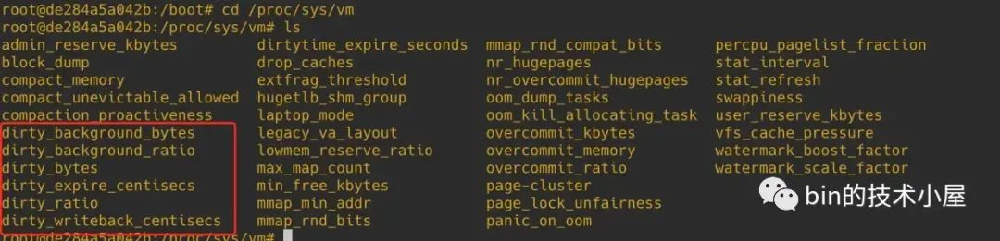

- dirty_writeback_centisecs 内核参数的默认值为 500。单位为 0.01 s。也就是说内核默认会每隔 5s 唤醒一次 flusher 线程来执行相关脏页的回写。
- drity_background_ratio ：当脏页数量在系统的可用内存 available 中占用的比例达到 drity_background_ratio 的配置值时，内核就会唤醒 flusher 线程异步回写脏页。默认值为：10。表示如果 page cache 中的脏页数量达到系统可用内存的 10% 的话，就主动唤醒 flusher 线程去回写脏页到磁盘。
- dirty_background_bytes ：如果 page cache 中脏页占用的内存用量绝对值达到指定的 dirty_background_bytes。内核就会唤醒 flusher 线程异步回写脏页。默认为：0。
- dirty_ratio ： dirty_background_* 相关的内核配置参数均是内核通过唤醒 flusher 线程来异步回写脏页。下面要介绍的 dirty_* 配置参数，均是由用户进程同步回写脏页。表示内存中的脏页太多了，用户进程自己都看不下去了，不用等内核 flusher 线程唤醒，用户进程自己主动去回写脏页到磁盘中。当脏页占用系统可用内存的比例达到 dirty_ratio 配置的值时，用户进程同步回写脏页。默认值为：20 。
- dirty_bytes ：如果 page cache 中脏页占用的内存用量绝对值达到指定的 dirty_bytes。用户进程同步回写脏页。默认值为：0。
- 内核为了避免 page cache 中的脏页在内存中长久的停留，所以会给脏页在内存中的驻留时间设置一定的期限，这个期限可由前边提到的 dirty_expire_centisecs 内核参数配置。默认为：3000。单位为：0.01 s。也就是说在默认配置下，脏页在内存中的驻留时间为 30 s。超过 30 s 之后，flusher 线程将会在下次被唤醒的时候将这些脏页回写到磁盘中。

根据 mmap 共享文件映射多进程之间读写共享（不会发生写时复制）的特点，常用于多进程之间共享内存（page cache），多进程之间的通讯。

#### 共享匿名映射

mmap 系统调用中的 flags 参数指定为 `MAP_SHARED | MAP_ANONYMOUS`，并将 fd 参数指定为 -1 来实现共享匿名映射，这种映射方式常用于**父子进程**之间共享内存，**父子进程**之间的通讯。


共享匿名映射其他几种映射方式一样，mmap 只是负责在各个进程的虚拟内存空间中划分一段用于共享匿名映射的虚拟内存区域而已，这点笔者已经强调过很多遍了，整个映射过程并不涉及到物理内存的分配。当多个进程调用 mmap 进行共享匿名映射之后，内核只不过是为每个进程在各自的虚拟内存空间中分配了一段虚拟内存而已，由于并不涉及物理内存的分配，所以这段用于映射的虚拟内存在各个进程的页表中对应的页表项 PTE 都还是空的，如下图所示：

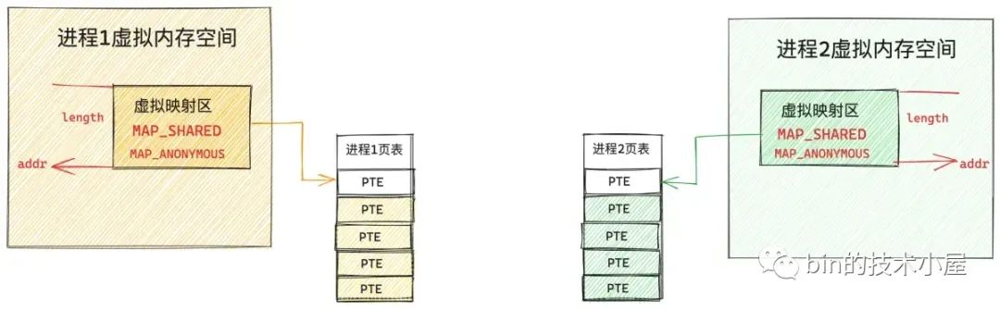

当任一进程，比如上图中的进程 1 开始访问这段虚拟映射区的时候，MMU 会产生缺页中断，进程 1 切换到内核态，开始处理缺页中断逻辑，在缺页中断处理程序中，内核为进程 1 分配一个物理内存页，并创建对应的 PTE 插入到进程 1 的页表中，随后用 PTE 将进程 1 的这段虚拟映射区与物理内存映射关联起来。进程 1 的缺页处理结束，从此以后，进程 1 就可以读写这段共享映射的物理内存了。


当进程 2 访问它自己的这段虚拟映射区的时候，由于进程 2 页表中对应的 PTE 为空，所以进程 2 也会发生缺页中断，随后切换到内核态处理缺页逻辑。当进程 2 开始处理缺页逻辑的时候，就会出现一个问题，因为进程 2 和进程 1 进行的是共享映射，所以进程 2 不能随便找一个物理内存页进行映射，进程 2 必须和 进程 1 映射到同一个物理内存页面，这样才能共享内存。那现在的问题是，进程 2 如何知道进程 1 已经映射了哪个物理内存页。内核在缺页中断处理中只能知道当前正在缺页的进程是谁，以及发生缺页的虚拟内存地址是什么，内核根据这些信息，根本无法知道，此时是否已经有其他进程把共享的物理内存页准备好了。这一点对于共享文件映射来说特别简单，因为有文件的 page cache 存在，进程 2 可以根据映射的文件内容在文件中的偏移 offset，从 page cache 中查找是否已经有其他进程把映射的文件内容加载到文件页中。如果文件页已经存在 page cache 中了，进程 2 直接映射这个文件页就可以了。

由于共享匿名映射并没有对文件映射，所以其他进程想要在内存中查找要进行共享的内存页就非常困难了，解决的办法则是借鉴一下文件映射的方式。共享匿名映射在内核中是通过一个叫做 tmpfs 的虚拟文件系统来实现的，tmpfs 不是传统意义上的文件系统，它是基于内存实现的，挂载在 `dev/zero` 目录下。当多个进程通过 mmap 进行共享匿名映射的时候，内核会在 tmpfs 文件系统中创建一个匿名文件，这个匿名文件并不是真实存在于磁盘上的，它是内核为了共享匿名映射而模拟出来的，匿名文件也有自己的 inode 结构以及 page cache。在 mmap 进行共享匿名映射的时候，内核会把这个匿名文件关联到进程的虚拟映射区 VMA 中。这样一来，当进程虚拟映射区域与 tmpfs 文件系统中的这个匿名文件映射起来之后，后面的流程就和共享文件映射一模一样了。

最后，解释下共享匿名映射为何只适用于**父子进程**之间的通讯。因为当父进程进行 mmap 共享匿名映射的时候，内核会为其创建一个匿名文件，并关联到父进程的虚拟内存空间中 `vm_area_struct->vm_file` 中。但是这时候其他进程并不知道父进程虚拟内存空间中关联的这个匿名文件，因为进程之间的虚拟内存空间都是隔离的。子进程就不一样了，在父进程调用完 mmap 之后，父进程的虚拟内存空间中已经有了一段虚拟映射区 VMA 并关联到匿名文件了。这时父进程进行 fork() 系统调用创建子进程，子进程会拷贝父进程的所有资源，当然也包括父进程的虚拟内存空间以及父进程的页表。当 fork 出子进程的时候，这时子进程的虚拟内存空间和父进程的虚拟内存空间完全是一模一样的，在子进程的虚拟内存空间中自然也有一段虚拟映射区 VMA 并且已经关联到匿名文件中了（继承自父进程）。现在父子进程的页表也是一模一样的，各自的这段虚拟映射区对应的 PTE 都是空的，一旦发生缺页，后面的流程就和共享文件映射一样了。可以把共享匿名映射看作成一种特殊的共享文件映射方式。

```c
#define MAP_LOCKED	    0x2000		/* pages are locked */
#define MAP_POPULATE    0x008000	/* populate (prefault) pagetables */
#define MAP_HUGETLB		0x040000	/* create a huge page mapping */
```

-  `MAP_POPULATE` 表示内核在分配完虚拟内存之后，就会马上分配物理内存，并在进程页表中建立起虚拟内存与物理内存的映射关系，这样进程在调用 mmap 之后就可以直接访问这段映射的虚拟内存地址了，不会发生缺页中断。
- 当系统内存资源紧张的时候，内核依然会将 mmap 背后映射的这块物理内存 swap out 到磁盘中，这样进程在访问的时候仍然会发生缺页中断，为了防止这种现象，可以在调用 mmap 的时候设置 `MAP_LOCKED`。在设置了 `MAP_LOCKED` 之后，mmap 系统调用在为进程分配完虚拟内存之后，内核也会马上为其分配物理内存并在进程页表中建立虚拟内存与物理内存的映射关系，这里内核还会额外做一个动作，就是将映射的这块物理内存锁定在内存中，不允许它 swap，这样一来映射的物理内存将会一直停留在内存中，进程无论何时访问这段映射内存都不会发生缺页中断。
- `MAP_HUGETLB` 则是用于大页内存映射的，在内核中关于物理内存的调度是按照物理内存页为单位进行的，普通物理内存页大小为 4K。但在一些对于内存敏感的使用场景中，往往期望使用一些比普通 4K 更大的页。因为这些大页要比普通的 4K 内存页要大很多，而且这些大页不允许被 swap，所以遇到缺页中断的情况就会相对减少，由于减少了缺页中断所以性能会更高。另外，由于大页比普通页要大，所以大页需要的页表项要比普通页要少，页表项里保存了虚拟内存地址与物理内存地址的映射关系，当 CPU 访问内存的时候需要频繁通过 MMU 访问页表项获取物理内存地址，由于要频繁访问，所以页表项一般会缓存在 TLB 中，因为大页需要的页表项较少，所以节约了 TLB 的空间同时降低了 TLB 缓存 MISS 的概率，从而加速了内存访问。

#### 大页内存映射

要想在应用程序中使用大页，需要在内核编译的时候通过设置 `CONFIG_HUGETLBFS` 和 `CONFIG_HUGETLB_PAGE` 这两个编译选项来让内核支持 HugePage。可以通过 `cat /proc/filesystems` 命令来查看当前内核中是否支持 hugetlbfs 文件系统，这是使用大页的基础。

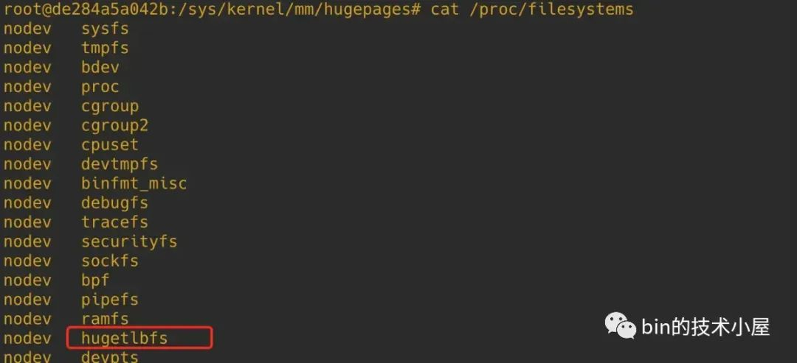

因为大页要求的是一大片连续的物理内存，但是随着系统的长时间运行，内存页被频繁无规则的分配与回收，系统中会产生大量的内存碎片，由于内存碎片的影响，内核很难寻找到大片连续的物理内存，这样一来就很难分配到大页。所以这就要求内核在系统启动的时候预先分配好足够多的大页内存，这些大页内存被内核管理在一个大页内存池中，大页内存池中的内存全部是专用的，专门用于大页的分配，不能用于其他目的，即使系统中没有使用大页，这些大页内存就只能空闲在那里，另外这些大页内存都是被内核锁定在内存中的，即使系统内存资源紧张，**大页内存也不允许被 swap**。而且内核大页池中的这些大页内存使用完了就完了，大页池耗尽之后，应用程序将无法再使用大页。

既然大页内存池在内核启动的时候就需要被预先创建好，而创建大页内存池，内核需要首先知道内存池中究竟包含多少个 HugePage，每个 HugePage 的尺寸是多少 。可以将这些参数在内核启动的时候添加到 kernel command line 中，随后内核在启动的过程中就可以根据 kernel command line 中 HugePage 相关的参数进行大页内存池的创建。下面是一些 HugePage 相关的核心 command line 参数含义：

- hugepagesz ： 用于指定大页内存池中 HugePage 的 size，可以指定 hugepagesz=2M 或者 hugepagesz=1G，具体支持多少种大页尺寸由 CPU 架构决定。
- hugepages：用于指定内核需要预先创建多少个 HugePage 在大页内存池中，可以通过指定 hugepages=256 ，来表示内核需要预先创建 256 个 HugePage 出来。除此之外 hugepages 参数还可以有 NUMA 格式，用于告诉内核需要在每个 NUMA node 上创建多少个 HugePage。可以通过设置 `hugepages=0:1,1:2 ...` 来指定 NUMA node 0 上分配 1 个 HugePage，在 NUMA node 1 上分配 2 个 HugePage

- default_hugepagesz：用于指定 HugePage 默认大小。各种不同类型的 CPU 架构一般都支持多种 size 的 HugePage，比如 x86 CPU 支持 2M，1G 的 HugePage。arm64 支持 64K，2M，32M，1G 的 HugePage。这么多尺寸的 HugePage 需要通过 default_hugepagesz 来指定默认使用的 HugePage 尺寸。

除此之外，还可以在系统刚刚启动之后（run time）来配置大页，因为系统刚刚启动，所以系统内存碎片化程度最小，也是一个配置大页的时机：

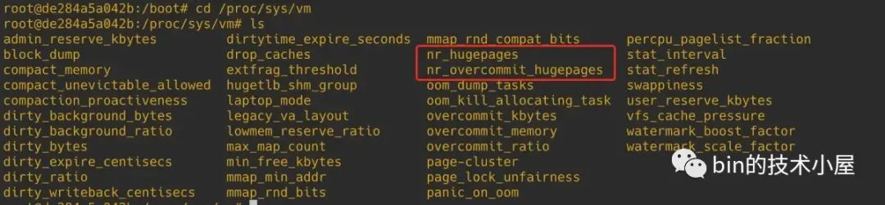

在 `/proc/sys/vm` 路径下有两个系统参数可以在系统 run time 的时候动态调整当前系统中 default size （由 default_hugepagesz 指定）大小的 HugePage 个数。

- nr_hugepages 表示当前系统中 default size 大小的 HugePage 个数，可以通过 `echo HugePageNum > /proc/sys/vm/nr_hugepages` 命令来动态增大或者缩小 HugePage （default size ）个数。
- nr_overcommit_hugepages 表示当系统中的应用程序申请的大页个数超过 nr_hugepages 时，内核允许在额外申请多少个大页。当大页内存池中的大页个数被耗尽时，如果此时继续有进程来申请大页，那么内核则会从当前系统中选取多个连续的普通 4K 大小的内存页，凑出若干个大页来供进程使用，这些被凑出来的大页叫做 surplus_hugepage，surplus_hugepage 的个数不能超过 nr_overcommit_hugepages。当这些 surplus_hugepage 不在被使用时，就会被释放回内核中。nr_hugepages 个数的大页则会一直停留在大页内存池中，不会被释放，也不会被 swap。

以上是修改默认尺寸大小的 HugePage，另外，还可以在系统 run time 的时候动态修改指定尺寸的 HugePage，不同大页尺寸的相关配置文件存放在 `/sys/kernel/mm/hugepages` 路径下的对应目录中：


如上图所示，当前系统中所支持的大页尺寸相关的配置文件，均存放在对应 `hugepages-hugepagesize` 格式的目录中，以 2M 大页为例，进入到 `hugepages-2048kB` 目录下，发现同样也有 nr_hugepages 和 nr_overcommit_hugepages 这两个配置文件，它们的含义和上边介绍的一样，只不过这里的是具体尺寸的 HugePage 相关配置。可以通过如下命令来动态调整系统中 2M 大页的个数：

```bash
echo HugePageNum > /sys/kernel/mm/hugepages/hugepages-2048kB/nr_hugepages
```

同理在 NUMA 架构的系统下，可以在 `/sys/devices/system/node/node_id` 路径下修改对应 numa node 节点中的相应尺寸 的大页个数：

```bash
echo HugePageNum > /sys/devices/system/node/node_id/hugepages/hugepages-2048kB/nr_hugepages
```

现在内核已经支持了大页，并且从内核的 boot time 或者 run time 配置好了大页内存池，可以在应用程序中来使用大页内存了，内核提供了两种方式来使用 HugePage：

- 一种是本文介绍的 mmap 系统调用，需要在 flags 参数中设置 `MAP_HUGETLB`。另外内核提供了额外的两个枚举值来配合 `MAP_HUGETLB` 一起使用，它们分别是 MAP_HUGE_2MB 和 MAP_HUGE_1GB。
  - `MAP_HUGETLB | MAP_HUGE_2MB` 用于指定需要映射的是 2M 的大页。
  - `MAP_HUGETLB | MAP_HUGE_1GB` 用于指定需要映射的是 1G 的大页。
  - `MAP_HUGETLB` 表示按照 default_hugepagesz 指定的默认尺寸来映射大页。
- 另一种是 SYSV 标准的系统调用 shmget 和 shmat。

```c
addr = mmap(addr, length, PROT_READ | PROT_WRITE, MAP_PRIVATE | MAP_ANONYMOUS | MAP_HUGETLB, -1, 0);
```

MAP_HUGETLB 只能支持 MAP_ANONYMOUS 匿名映射的方式使用 HugePage。mmap 设置了 `MAP_HUGETLB` 进行大页内存映射的时候，这个映射过程和普通的匿名映射一样，同样也是首先在进程的虚拟内存空间中划分出一段虚拟映射区 VMA 出来，同样不涉及物理内存的分配，不一样的地方是，内核在分配完虚拟内存之后，会在大页内存池中为映射的这段虚拟内存**预留**好大页内存，相当于是把即将要使用的大页内存先锁定住，不允许其他进程使用。这些被预留好的 HugePage 个数被记录在上图中的 `resv_hugepages` 文件中。当进程在访问这段虚拟内存的时候，同样会发生缺页中断，随后内核会从大页内存池中将这部分已经预留好的 resv_hugepages 分配给进程，并在进程页表中建立好虚拟内存与 HugePage 的映射。当映射的是 HugePage 时，系统调用参数中的 addr，length 需要和大页尺寸进行对齐，在本例中需要和 2M 进行对齐。

如果想使用 mmap 对文件进行大页映射，就用到了前面提到的 hugetlbfs 文件系统：


hugetlbfs 是一个基于内存的文件系统，位于 hugetlbfs 文件系统下的所有文件都是被大页支持的，也就说通过 mmap 对 hugetlbfs 文件系统下的文件进行文件映射，默认都是用 HugePage 进行映射。hugetlbfs 下的文件支持大多数的文件系统操作，比如：open , close , chmod , read 等等，但是不支持 write 系统调用，如果想要对 hugetlbfs 下的文件进行写入操作，那么必须通过文件映射的方式将 hugetlbfs 中的文件通过**大页**映射进内存，然后在映射内存中进行写入操作。所以在使用 mmap 系统调用对 hugetlbfs 下的文件进行大页映射之前，首先需要做的事情就是在系统中挂载 hugetlbfs 文件系统到指定的路径下。

```c
mount -t hugetlbfs -o uid=,gid=,mode=,pagesize=,size=,min_size=,nr_inodes= none /mnt/huge
```

上面的这条命令用于将 hugetlbfs 挂载到 `/mnt/huge` 目录下，从此以后只要是在 `/mnt/huge` 目录下创建的文件，背后都是由大页支持的，也就是说如果通过 mmap 系统调用对 `/mnt/huge` 目录下的文件进行文件映射，缺页的时候，内核分配的就是内存大页。注意：只有在 hugetlbfs 下的文件进行 mmap 文件映射的时候才能使用大页，其他普通文件系统下的文件依然只能映射普通 4K 内存页。

- mount 命令中的 `uid` 和 `gid` 用于指定 hugetlbfs 根目录的 owner 和 group。
- `pagesize` 用于指定 hugetlbfs 支持的大页尺寸，默认单位是字节，可以通过设置 pagesize=2M 或者 pagesize=1G 来指定 hugetlbfs 中的大页尺寸为 2M 或者 1G。
- `size` 用于指定 hugetlbfs 文件系统可以使用的最大内存容量是多少，单位同 pagesize 一样。
- `min_size` 用于指定 hugetlbfs 文件系统可以使用的最小内存容量是多少。
- `nr_inodes` 用于指定 hugetlbfs 文件系统中 inode 的最大个数，决定该文件系统中最大可以创建多少个文件。

当 hugetlbfs 挂载好之后，接下来就可以直接通过 mmap 系统调用对挂载目录 `/mnt/huge` 下的文件进行内存映射了，当缺页的时候，内核会直接分配大页，大页尺寸是 `pagesize`。

```c
fd = open(“/mnt/huge/test.txt”, O_CREAT|O_RDWR);
addr = mmap(0, MAP_LENGTH, PROT_READ|PROT_WRITE, MAP_SHARED, fd, 0);
```

这里需要注意是，通过 mmap 映射 hugetlbfs 中的文件的时候，并不需要指定 `MAP_HUGETLB`。而通过 SYSV 标准的系统调用 shmget 和 shmat 以及前边介绍的 mmap （ flags 参数设置 MAP_HUGETLB）进行大页申请的时候，并不需要挂载 hugetlbfs。

在内核中一共支持两种类型的内存大页，一种是标准大页（hugetlb pages），也就是上面内容所介绍的使用大页的方式，可以通过命令 `grep Huge /proc/meminfo` 来查看标准大页在系统中的使用情况：


标准大页相关的统计参数含义如下：

- `HugePages_Total` 表示标准大页池中大页的个数。
- `HugePages_Free` 表示大页池中还未被使用的大页个数（未被分配）。
- `HugePages_Rsvd` 表示大页池中已经被预留出来的大页，mmap 系统调用只是为进程分配一段虚拟内存而已，并不会分配物理内存，当 mmap 进行大页映射的时候也是一样。不同之处在于，内核为进程分配完虚拟内存之后，还需要为进程在大页池中预留好本次映射所需要的大页个数，注意此时只是预留，还并未分配给进程，大页池中被预留好的大页不能被其他进程使用。这时 `HugePages_Rsvd` 的个数会相应增加，当进程发生缺页的时候，内核会直接从大页池中把这些提前预留好的大页内存映射到进程的虚拟内存空间中。这时 `HugePages_Rsvd` 的个数会相应减少。系统中真正剩余可用的个数其实是 `HugePages_Free - HugePages_Rsvd`。
- `HugePages_Surp` 表示大页池中超额分配的大页个数，nr_overcommit_hugepages 参数表示最多能超额分配多少个大页。当大页池中的大页全部被耗尽的时候，也就是 `/proc/sys/vm/nr_hugepages` 指定的大页个数全部被分配完了，内核还可以超额为进程分配大页，超额分配出的大页个数就统计在 `HugePages_Surp` 中。
- `Hugepagesize` 表示系统中大页的默认 size 大小，单位为 KB。
- `Hugetlb` 表示系统中所有尺寸的大页所占用的物理内存总量。单位为 KB。

内核中另外一种类型的大页是透明大页 THP (Transparent Huge Pages)，这里的透明指的是应用进程在使用 THP 的时候完全是透明的，不需要像使用标准大页那样需要系统管理员对系统进行显示的大页配置，在应用程序中也不需要向标准大页那样需要显示指定 `MAP_HUGETLB`, 或者显示映射到 hugetlbfs 里的文件中。

透明大页的使用对用户完全是透明的，内核会自动做大页的映射，透明大页不需要像标准大页那样需要提前预先分配好大页内存池，透明大页的分配是动态的，由内核线程 khugepaged 负责在背后默默地将普通 4K 内存页整理成内存大页给进程使用。但是如果由于内存碎片的因素，内核无法整理出内存大页，那么就会降级为使用普通 4K 内存页。但是透明大页这里会有一个问题，当碎片化严重的时候，内核会启动 kcompactd 线程去整理碎片，期望获得连续的内存用于大页分配，但是 compact 的过程可能会引起 sys cpu 飙高，应用程序卡顿。透明大页是允许 swap 的，这一点和标准大页不同，在内存紧张需要 swap 的时候，透明大页会被内核默默拆分成普通 4K 内存页，然后 swap out 到磁盘。透明大页只支持 2M 的大页，标准大页可以支持 1G 的大页，透明大页主要应用于匿名内存中，可以在 tmpfs 文件系统中使用。

可以通过修改 `/sys/kernel/mm/transparent_hugepage/enabled` 配置文件来选择开启或者禁用透明大页：


- always 表示系统全局开启透明大页 THP 功能。这意味着每个进程都会去尝试使用透明大页。
- never 表示系统全局关闭透明大页 THP 功能。进程将永远不会使用透明大页。
- madvise 表示进程如果想要使用透明大页，需要通过 madvise 系统调用并设置参数 advice 为 `MADV_HUGEPAGE` 来建议内核，在 addr 到 addr + length 这片虚拟内存区域中，需要使用透明大页来映射。

```c
#include <sys/mman.h>

int madvise(void addr, size_t length, int advice);
```

一般会首先使用 mmap 先映射一段虚拟内存区域，然后通过 madvise 建议内核，将来在缺页的时候，需要为这段虚拟内存映射透明大页。由于背后需要通过内核线程 khugepaged 来不断的扫描整理系统中的普通 4K 内存页，然后将他们拼接成一个大页来给进程使用，其中涉及内存整理和回收等耗时的操作，且这些操作会在内存路径中加锁，而 khugepaged 内核线程可能会在错误的时间启动扫描和转换大页的操作，造成随机不可控的性能下降。

另外一点，透明大页不像标准大页那样是提前预分配好的，透明大页是在系统运行时动态分配的，在内存紧张的时候，透明大页和普通 4K 内存页的分配过程一样，有可能会遇到直接内存回收（direct reclaim)以及直接内存整理（direct compaction），这些操作都是同步的并且非常耗时，会对性能造成非常大的影响。

 `cat /proc/meminfo` 命令中显示的 AnonHugePages 就表示透明大页在系统中的使用情况。另外可以通过 `cat /proc/pid/smaps | grep AnonHugePages` 命令来查看某个进程对透明大页的使用情况。

#### mmap代码分析

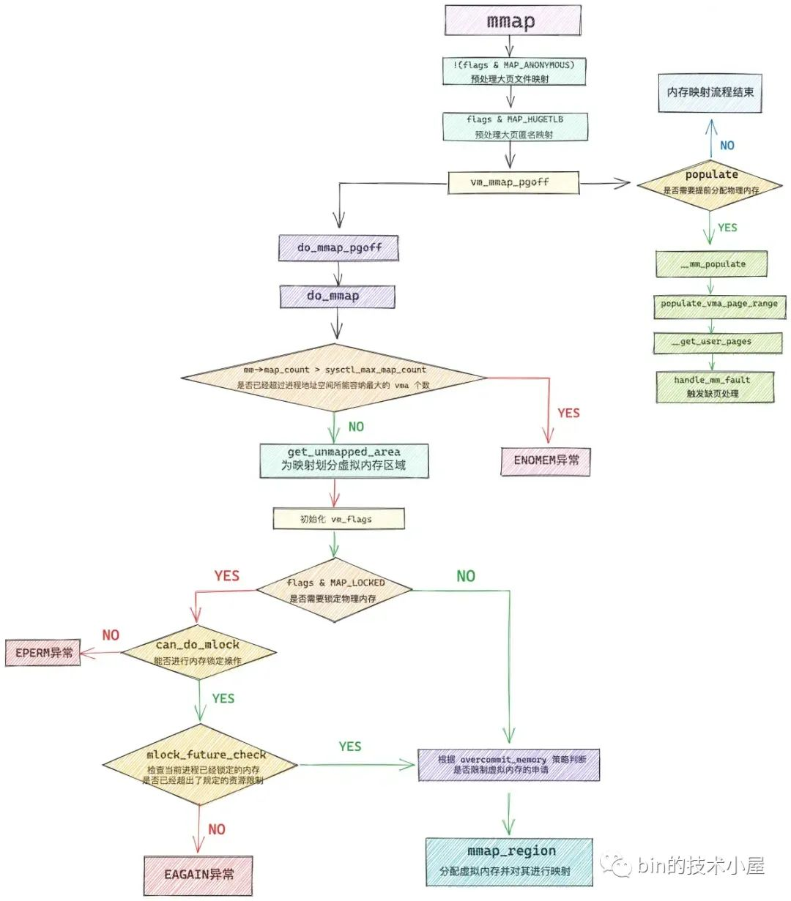

```c
SYSCALL_DEFINE6(mmap, unsigned long, addr, unsigned long, len,
		unsigned long, prot, unsigned long, flags,
		unsigned long, fd, unsigned long, off)
{
	if (offset_in_page(off) != 0)
		return -EINVAL;

	return ksys_mmap_pgoff(addr, len, prot, flags, fd, off >> PAGE_SHIFT);
}

unsigned long ksys_mmap_pgoff(unsigned long addr, unsigned long len,
                  unsigned long prot, unsigned long flags,
                  unsigned long fd, unsigned long pgoff)
{
    struct file *file = NULL;
    unsigned long retval;

    // 预处理文件映射
    if (!(flags & MAP_ANONYMOUS)) {
        // 根据 fd 获取映射文件的 struct file 结构
        audit_mmap_fd(fd, flags);
        file = fget(fd);
        if (!file)
            // 这里可以看出如果是匿名映射的话必须要指定 MAP_ANONYMOUS 否则这里找不到对应的文件就返回错误了
            return -EBADF;
        // 映射文件是否是 hugetlbfs 中的文件，hugetlbfs 中的文件默认由大页支持
        if (is_file_hugepages(file)) {
            // mmap 进行文件大页映射，len 需要和大页尺寸对齐
            len = ALIGN(len, huge_page_size(hstate_file(file)));
        /* 这里可以看出如果想要使用 mmap 对文件进行大页映射，那么映射的文件必须是 hugetlbfs 中的,
         * 这种映射方式必须提前手动挂载 hugetlbfs 文件系统到指定路径下。
         * mmap 文件大页映射并不需要指定 MAP_HUGETLB，并且 mmap 不能对普通文件进行大页映射
         */
        } else if (flags & MAP_HUGETLB) {
        	retval = -EINVAL;
            goto out_fput;
        }
    } else if (flags & MAP_HUGETLB) {
        // 这里可以看出 MAP_HUGETLB 只能支持 MAP_ANONYMOUS 匿名映射的方式使用 HugePage
        struct user_struct *user = NULL;
        // 内核中的大页池（预先创建）
        struct hstate *hs;
        // 选取指定大页尺寸的大页池（内核中存在不同尺寸的大页池）
        hs = hstate_sizelog((flags >> MAP_HUGE_SHIFT) & MAP_HUGE_MASK);
        if (!hs)
            return -EINVAL;
        // 映射长度 len 必须与大页尺寸对齐
        len = ALIGN(len, huge_page_size(hs));
 
        // 在 hugetlbfs 中创建 anon_hugepage 文件，并预留大页内存（禁止其他进程申请）
        file = hugetlb_file_setup(HUGETLB_ANON_FILE, len,
                VM_NORESERVE,
                &user, HUGETLB_ANONHUGE_INODE,
                (flags >> MAP_HUGE_SHIFT) & MAP_HUGE_MASK);
        if (IS_ERR(file))
            return PTR_ERR(file);
    }

    flags &= ~(MAP_EXECUTABLE | MAP_DENYWRITE);
    // 开始内存映射
    retval = vm_mmap_pgoff(file, addr, len, prot, flags, pgoff);
out_fput:
    if (file)
        // file 引用计数减 1
        fput(file);
    return retval;
}

static inline bool is_file_hugepages(struct file *file)
{
    // hugetlbfs 文件系统中的文件默认由大页支持，mmap 通过映射 hugetlbfs 中的文件实现文件大页映射
    if (file->f_op == &hugetlbfs_file_operations)
        return true;

    // 通过 shmat 使用匿名大页
    return is_file_shm_hugepages(file);
}

bool is_file_shm_hugepages(struct file *file)
{
    // SYSV 标准的系统调用 shmget 和 shmat 通过 shm 文件系统来共享内存，通过 shmat 的方式使用大页会设置
    return file->f_op == &shm_file_operations_huge;
}

unsigned long vm_mmap_pgoff(struct file *file, unsigned long addr,
    unsigned long len, unsigned long prot,
    unsigned long flag, unsigned long pgoff)
{
    unsigned long ret;
    // 获取进程虚拟内存空间
    struct mm_struct *mm = current->mm;
    /* 是否需要为映射的 VMA，提前分配物理内存页，避免后续的缺页
     * 取决于 flag 是否设置了 MAP_POPULATE 或者 MAP_LOCKED，这里的 populate 表示需要分配物理内存的大小
     */
    unsigned long populate;

    ret = security_mmap_file(file, prot, flag);
    if (!ret) {
        // 对进程虚拟内存空间加写锁保护，防止多线程并发修改
        if (mmap_write_lock_killable(&mm->mmap_sem))
            return -EINTR;
        // 开始 mmap 内存映射，在进程虚拟内存空间中分配一段 vma，并建立相关映射关系，ret 为映射虚拟内存区域的起始地址
        ret = do_mmap(file, addr, len, prot, flag, pgoff,
                    &populate, &uf);
        mmap_write_unlock(&mm->mmap_sem);
        if (populate)
            // 提前分配物理内存页面，后续访问不会缺页，为 [ret , ret + populate] 这段虚拟内存立即分配物理内存
            mm_populate(ret, populate);
    }
    return ret;
}

int __mm_populate(unsigned long start, unsigned long len, int ignore_errors)
{
    struct mm_struct *mm = current->mm;
    unsigned long end, nstart, nend;
    struct vm_area_struct *vma = NULL;
    long ret = 0;

    end = start + len;

    // 依次遍历进程地址空间中 [start , end] 这段虚拟内存范围的所有 vma
    for (nstart = start; nstart < end; nstart = nend) {

        //省略查找指定地址范围内 vma 的过程

        // 为这段地址范围内的所有 vma 分配物理内存
        ret = populate_vma_page_range(vma, nstart, nend, &locked);
        // 继续为下一个 vma （如果有的话）分配物理内存
        nend = nstart + ret * PAGE_SIZE;
        ret = 0;
    }

    return ret; /* 0 or negative error code */
}

long populate_vma_page_range(struct vm_area_struct *vma,
        unsigned long start, unsigned long end, int *nonblocking)
{
    struct mm_struct *mm = vma->vm_mm;
    // 计算 vma 中包含的虚拟内存页个数，后续会按照 nr_pages 分配物理内存
    unsigned long nr_pages = (end - start) / PAGE_SIZE;
    int gup_flags;

    // 循环遍历 vma 中的每一个虚拟内存页，依次为其分配物理内存页
    return __get_user_pages(current, mm, start, nr_pages, gup_flags,
                NULL, NULL, nonblocking);
}

static long __get_user_pages(struct task_struct *tsk, struct mm_struct *mm,
        unsigned long start, unsigned long nr_pages,
        unsigned int gup_flags, struct page **pages,
        struct vm_area_struct **vmas, int *nonblocking)
{
    long ret = 0, i = 0;
    struct vm_area_struct *vma = NULL;
    struct follow_page_context ctx = { NULL };

    if (!nr_pages)
        return 0;

    start = untagged_addr(start);
    // 循环遍历 vma 中的每一个虚拟内存页
    do {
        struct page *page;
        unsigned int foll_flags = gup_flags;
        unsigned int page_increm;
        // 在进程页表中检查该虚拟内存页背后是否有物理内存页映射
        page = follow_page_mask(vma, start, foll_flags, &ctx);
        if (!page) {
            /* 如果虚拟内存页在页表中并没有物理内存页映射，那么这里调用 faultin_page
             * 底层会调用到 handle_mm_fault 进入缺页处理流程，分配物理内存，在页表中建立好映射关系
             */
            ret = faultin_page(tsk, vma, start, &foll_flags,
                    nonblocking);

    } while (nr_pages);

    return i ? i : ret;
}
    
unsigned long do_mmap(struct file *file, unsigned long addr,
            unsigned long len, unsigned long prot,
            unsigned long flags, vm_flags_t vm_flags,
            unsigned long pgoff, unsigned long *populate,
            struct list_head *uf)
{
    struct mm_struct *mm = current->mm;

    // 省略参数校验
        
    /* 一个进程虚拟内存空间内所能包含的虚拟内存区域 vma 是有数量限制的
     * sysctl_max_map_count 规定了进程虚拟内存空间所能包含 VMA 的最大个数
     * 可以通过 /proc/sys/vm/max_map_count 内核参数调整 sysctl_max_map_count
     * mmap 需要再进程虚拟内存空间中创建映射的 VMA，这里需要检查 VMA 的个数是否超过最大限制
     */
    if (mm->map_count > sysctl_max_map_count)
        return -ENOMEM;

    /* 在进程地址空间中寻找出一段长度为 len，并且还未映射的虚拟内存区域 vma 出来。
     * 返回值 addr 表示这段虚拟内存区域的起始地址，后续将会用于 mmap 内存映射
     */
    addr = get_unmapped_area(file, addr, len, pgoff, flags);

    /* 通过 calc_vm_prot_bits 和 calc_vm_flag_bits 分别将 mmap 参数 prot , flag 中   
     * 设置的访问权限以及映射方式等枚举值转换为统一的 vm_flags，后续一起映射进 VMA 的相应属性中，相应前缀转换为 VM_
     */
    vm_flags |= calc_vm_prot_bits(prot, pkey) | calc_vm_flag_bits(flags) |
            mm->def_flags | VM_MAYREAD | VM_MAYWRITE | VM_MAYEXEC;

    // 设置了 MAP_LOCKED，表示用户期望 mmap 背后映射的物理内存锁定在内存中，不允许 swap
    if (flags & MAP_LOCKED)
        // 这里需要检查是否可以将本次映射的物理内存锁定
        if (!can_do_mlock())
            return -EPERM;
    // 进一步检查锁定的内存页数是否超过了内核限制
    if (mlock_future_check(mm, vm_flags, len))
        return -EAGAIN;

    // 省略设置其他 vm_flags 相关细节      

    /* 通常内核会为 mmap 申请虚拟内存的时候会综合考虑 ram 以及 swap space 的总体大小。
     * 当映射的虚拟内存过大，而没有足够的 swap space 的时候， mmap 就会失败。
     * 设置 MAP_NORESERVE，内核将不会考虑上面的限制因素
     * 这样当通过 mmap 申请大量的虚拟内存，并且当前系统没有足够的 swap space 的时候，mmap 系统调用依然能够成功
     */
    if (flags & MAP_NORESERVE) {
        /* 设置 MAP_NORESERVE 的目的是为了应用可以申请过量的虚拟内存
         * 如果内核本身是禁止 overcommit 的，那么设置 MAP_NORESERVE 是无意义的
         * 如果内核允许过量申请虚拟内存时（overcommit 为 0 或者 1）
         * 无论映射多大的虚拟内存，mmap 将会始终成功，但缺页的时候会容易导致 oom
         * 可以通过内核参数 /proc/sys/vm/overcommit_memory 来调整
         */
        if (sysctl_overcommit_memory != OVERCOMMIT_NEVER)
            // 设置 VM_NORESERVE 表示无论申请多大的虚拟内存，内核总会答应
            vm_flags |= VM_NORESERVE;

        // 大页内存是提前预留出来的，并且本身就不会被 swap，所以不需要像普通内存页那样考虑 swap space 的限制因素
        if (file && is_file_hugepages(file))
            vm_flags |= VM_NORESERVE;
    }
    // 这里就是 mmap 内存映射的核心
    addr = mmap_region(file, addr, len, vm_flags, pgoff, uf);

    /* 当 mmap 设置了 MAP_POPULATE 或者 MAP_LOCKED 标志
     * 那么在映射完之后，需要立马为这块虚拟内存分配物理内存页，后续访问就不会发生缺页了
     */
    if (!IS_ERR_VALUE(addr) &&
        ((vm_flags & VM_LOCKED) ||
         (flags & (MAP_POPULATE | MAP_NONBLOCK)) == MAP_POPULATE))
        // 设置需要分配的物理内存大小
        *populate = len;
    return addr;
}

/* 内核的默认 overcommit 策略。在这种模式下，过量的虚拟内存申请将会被拒绝，
 * 内核会对虚拟内存能够过量申请多少做出一定的限制，这种策略既不激进也不保守，比较中庸。
 */
#define OVERCOMMIT_GUESS		0
/* 最为激进的 overcommit 策略，无论进程申请多大的虚拟内存，只要不超过整个进程虚拟内存空间的大小，内核总会痛快的答应。
 * 但是这种策略下，虚拟内存的申请虽然容易了，但是当进程遇到缺页，内核为其分配物理内存的时候，会非常容易造成 OOM 。
 */
#define OVERCOMMIT_ALWAYS		1
// 最为严格的一种控制虚拟内存 overcommit 的策略，在这种模式下，内核会严格的规定虚拟内存的申请用量。
#define OVERCOMMIT_NEVER		2
    
bool can_do_mlock(void)
{
    /* 内核会限制能够被锁定的内存资源大小，单位为bytes
     * 这里获取 RLIMIT_MEMLOCK 能够锁定的内存资源，如果为 0 ，则不能够锁定内存了。
     * 可以通过修改 /etc/security/limits.conf 文件中的 memlock 相关配置项
     * 来调整能够被锁定的内存资源配额，设置为 unlimited 表示不对锁定内存进行限制
     */
    if (rlimit(RLIMIT_MEMLOCK) != 0)
        return true;
    // 检查内核是否允许 mlock ，mlockall 等内存锁定操作
    if (capable(CAP_IPC_LOCK))
        return true;
    return false;
}
    
struct task_struct {
  struct signal_struct	*signal;
}

struct signal_struct {
  /* 进程相关的资源限制，相关的资源限制以数组的形式组织在 rlim 中
   * RLIMIT_MEMLOCK 下标对应的是进程能够锁定的内存资源，单位为bytes
   */
  struct rlimit rlim[RLIM_NLIMITS];
}

struct rlimit {
	__kernel_ulong_t	rlim_cur;
	__kernel_ulong_t	rlim_max;
};
    
// 定义在文件：/include/linux/sched/signal.h
static inline unsigned long rlimit(unsigned int limit)
{
    // 参数 limit 为相关资源的下标
    return task_rlimit(current, limit);
}

static inline unsigned long task_rlimit(const struct task_struct *task,
        unsigned int limit)
{
    return READ_ONCE(task->signal->rlim[limit].rlim_cur);
}
    
static inline int mlock_future_check(struct mm_struct *mm,
                     unsigned long flags,
                     unsigned long len)
{
    unsigned long locked, lock_limit;

    if (flags & VM_LOCKED) {
        // 需要锁定的内存页数
        locked = len >> PAGE_SHIFT;
        // 更新进程内存空间中已经锁定的内存页数
        locked += mm->locked_vm;
        // 获取内核还能允许锁定的内存页数
        lock_limit = rlimit(RLIMIT_MEMLOCK);        
        lock_limit >>= PAGE_SHIFT;
        // 如果超出允许锁定的内存限额，那么就返回错误
        if (locked > lock_limit && !capable(CAP_IPC_LOCK))
            return -EAGAIN;
    }
    return 0;
}
```

##### 虚拟内存分配流程

###### 文件映射与匿名映射区的布局

文件映射与匿名映射区的布局在 linux 内核中分为两种：一种是经典布局，另一种是新式布局，不同的体系结构可以通过内核参数 `/proc/sys/vm/legacy_va_layout` 来指定具体采用哪种布局。 1 表示采用经典布局， 0 表示采用新式布局。

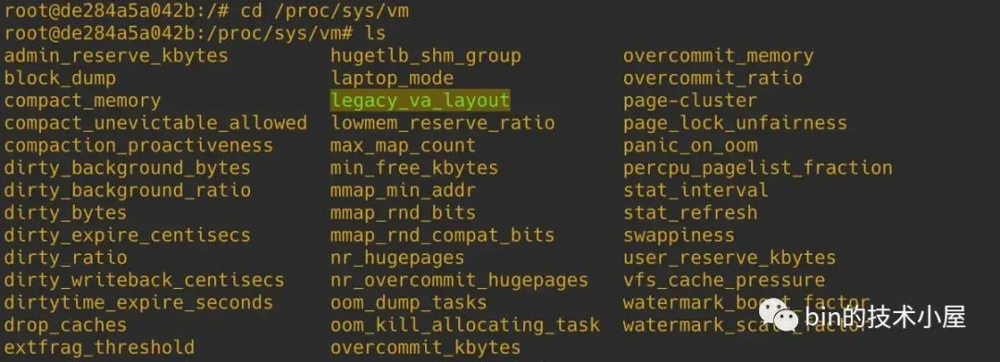

在经典布局下，文件映射与匿名映射区的地址增长方向是从低地址到高地址，也就是说映射区是从下往上增长，这也就导致了 mmap 在分配虚拟内存的时候需要从下往上搜索空闲 vma。


经典布局下，文件映射与匿名映射区的起始地址 `mm_struct->mmap_base` 被设置在 `task_size` 的三分之一处，`task_size` 为进程虚拟内存空间与内核空间的分界线，也就说 `task_size` 是进程虚拟内存空间的末尾，大小为 3G。这表明了文件映射与匿名映射区起始于进程虚拟内存空间开始的 1G 位置处，而映射区恰好位于整个进程虚拟内存空间的中间，其下方就是堆了，由于代码段，数据段的存在，可供堆进行扩展的空间是小于 1G 的，否则就会与映射区冲突了。这种布局对于虚拟内存空间非常大的体系结构，比如 AMD64 , 是合适的而且会工作的非常好，因为虚拟内存空间足够的大（128T），堆与映射区都有足够的空间来扩展，不会发生冲突。但是对于虚拟内存空间比较小的体系结构，比如 IA-32，只能提供 3G 大小的进程虚拟内存空间，就会出现上述冲突问题，于是内核在 2.6.7 版本引入了新式布局。在新式布局下，文件映射与匿名映射区的地址增长方向是从高地址到低地址，也就是说映射区是从上往下增长，这也就导致了 mmap 在分配虚拟内存的时候需要从上往下搜索空闲 vma。


在新式布局中，栈的空间大小会被限制，栈最大空间大小保存在 `task_struct->signal_struct->rlimp[RLIMIT_STACK]` 中，可以通过修改 `/etc/security/limits.conf` 文件中 stack 配置项来调整栈最大空间的限制。由于栈变为有界的了，所以文件映射与匿名映射区可以在栈的下方立即开始，为确保栈与映射区不会冲突，它们中间还设置了 1M 大小的安全间隙 `stack_guard_gap`。这样一来堆在进程地址空间中较低的地址处开始向上增长，而映射区位于进程空间较高的地址处向下增长，因此堆区和映射区在新式布局下都可以较好的扩展，直到耗尽剩余的虚拟内存区域。

进程虚拟内存空间的创建以及初始化是由 `load_elf_binary` 函数负责的，当进程通过 fork() 系统调用创建出子进程之后，子进程可以通过前面介绍的 execve 系统调用加载并执行一个指定的二进制执行文件。execve 函数会调用到 `load_elf_binary`，由 `load_elf_binary` 负责解析指定的 ELF 格式的二进制可执行文件，并将二进制文件中的 .text , .data 映射到新进程的虚拟内存空间中的代码段，数据段，BSS 段中。随后会通过 `setup_new_exec` 创建文件映射与匿名映射区，设置映射区的起始地址 `mm_struct->mmap_base`，通过 `setup_arg_pages` 创建栈，设置 `mm->start_stack` 栈的起始地址（栈底）。这样新进程的虚拟内存空间就被创建了出来。

```c
static int load_elf_binary(struct linux_binprm *bprm)
{
    // 创建文件映射与匿名映射区，设置映射区的起始地址 mm_struct->mmap_base
    setup_new_exec(bprm);
    // 创建栈，设置  mm->start_stack 栈的起始地址（栈底）
    retval = setup_arg_pages(bprm, randomize_stack_top(STACK_TOP),
                 executable_stack);
}

void setup_new_exec(struct linux_binprm * bprm)
{
    // 对文件映射与匿名映射区进行布局
    arch_pick_mmap_layout(current->mm, &bprm->rlim_stack);
}

void arch_pick_mmap_layout(struct mm_struct *mm, struct rlimit *rlim_stack)
{
	unsigned long random_factor = 0UL;

	if (current->flags & PF_RANDOMIZE)
		random_factor = arch_mmap_rnd();

	if (mmap_is_legacy(rlim_stack)) {
        // 经典布局下，映射区分配虚拟内存方法
		mm->mmap_base = TASK_UNMAPPED_BASE + random_factor;
		mm->get_unmapped_area = arch_get_unmapped_area;
	} else {
        // 新式布局下，映射区分配虚拟内存方法
		mm->mmap_base = mmap_base(random_factor, rlim_stack);
		mm->get_unmapped_area = arch_get_unmapped_area_topdown;
	}
}

/* 经典布局（返回 1）新式布局（返回 0）
 * 用户可通过设置 /proc/sys/vm/legacy_va_layout 内核参数来指定 sysctl_legacy_va_layout 变量的值。
 */	
static int mmap_is_legacy(void)
{
    // ADDR_COMPAT_LAYOUT 标志则表示进程虚拟内存空间布局应该采用经典布局
    if (current->personality & ADDR_COMPAT_LAYOUT)
        return 1;

    // 栈大小无限也表示采用经典布局
    if (rlim_stack->rlim_cur == RLIM_INFINITY)
		return 1;

    return sysctl_legacy_va_layout;
}
```

由于在经典布局下，文件映射与匿名映射区的地址增长方向是从低地址到高地址增长，在新布局下，文件映射与匿名映射区的地址增长方向是从高地址到低地址增长。所以当 mmap 在文件映射与匿名映射区中寻找空闲 vma 的时候，会受到不同布局的影响，其寻找方向是相反的，因此不同的体系结构需要设置 `HAVE_ARCH_UNMAPPED_AREA` 预处理符号，并提供 `arch_get_unmapped_area` /  `arch_get_unmapped_area_topdown` 函数的实现。如果文件映射与匿名映射区采用的是经典布局，那么 mmap 就会通过 `arch_get_unmapped_area` 来在映射区查找空闲的 vma。如果文件映射与匿名映射区采用的是新布局，mmap 在则会通过 `arch_get_unmapped_area_topdown` 函数在文件映射与匿名映射区寻找空闲 vma。无论是经典布局下的 `arch_get_unmapped_area`，还是新布局下的 `arch_get_unmapped_area_topdown` 都会设置到 `mm_struct->get_unmapped_area` 这个函数指针中，后续 mmap 会利用这个 `get_unmapped_area` 来在文件映射与匿名映射区中划分虚拟内存区域 vma。

```c
struct mm_struct {
        // 文件映射与匿名映射区的起始地址，无论在经典布局下还是在新布局下，起始地址最终都会设置在这里
        unsigned long mmap_base;    /* base of mmap area */
        // 文件映射与匿名映射区在经典布局下的起始地址
        unsigned long mmap_legacy_base; /* base of mmap area in bottom-up allocations */
        // 进程虚拟内存空间与内核空间的分界线（也是用户空间的结束地址）
        unsigned long task_size;    /* size of task vm space */
        // 用户空间中，栈顶位置
        unsigned long start_stack;
}
```

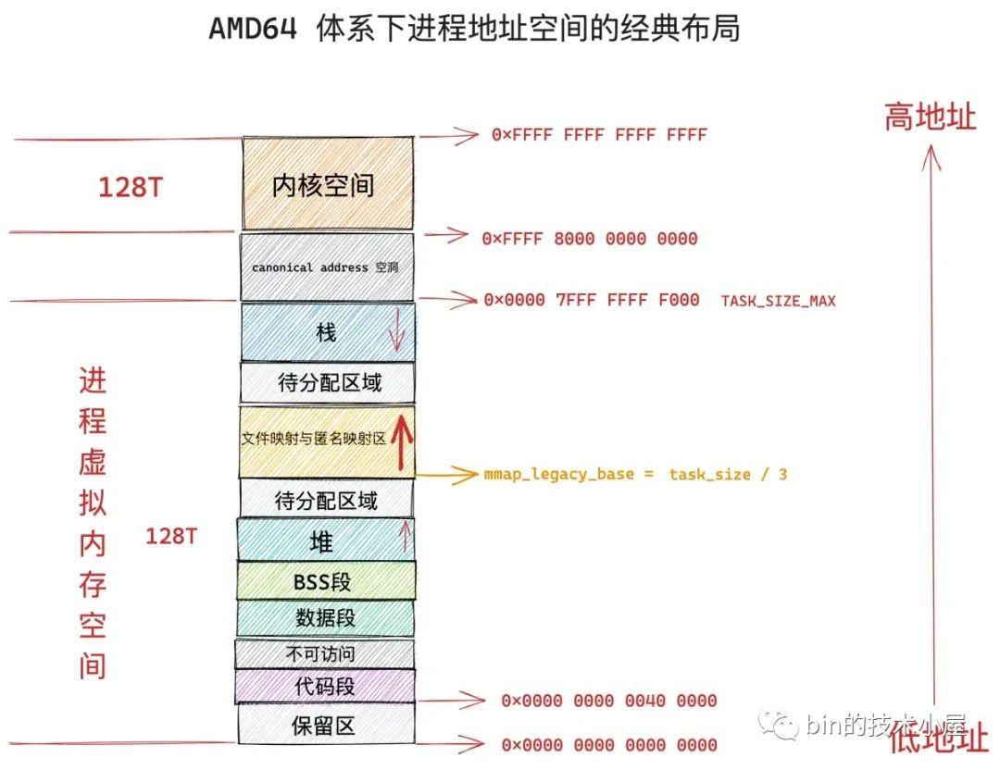

如果开启了进程虚拟内存空间的随机化，全局变量 `randomize_va_space` 就会为 1，进程的 flags 标志将会设置为 `PF_RANDOMIZE`，表示对进程地址空间进行随机化布局。可以通过调整内核参数 `/proc/sys/kernel/randomize_va_space` 的值来开启或者关闭进程虚拟内存空间布局随机化特性。在开启进程地址空间随机化布局之后，进程虚拟内存空间中的文件映射与匿名映射区起始地址会加上一个随机偏移 rnd。事实上，不仅仅文件映射与匿名映射区起始地址会加随机偏移 rnd，虚拟内存空间中的栈顶位置 `STACK_TOP`，堆的起始位置 `start_brk`，BSS 段的起始位置 `elf_bss`，数据段的起始位置 `start_data`，代码段的起始位置 `start_code`，都会加上一个随机偏移。


```c
static int load_elf_binary(struct linux_binprm *bprm)
{
    // 是否开启进程地址空间的随机化布局
    if (!(current->personality & ADDR_NO_RANDOMIZE) && randomize_va_space)
        current->flags |= PF_RANDOMIZE;
    // 创建文件映射与匿名映射区，设置映射区的起始地址 mm_struct->mmap_base
    setup_new_exec(bprm);
    // 创建栈，设置  mm->start_stack 栈的起始地址（栈底）
    retval = setup_arg_pages(bprm, randomize_stack_top(STACK_TOP),
                 executable_stack);
}

// 获取地址随机化偏移量
unsigned long arch_mmap_rnd(void)
{
	unsigned long rnd;

#ifdef CONFIG_HAVE_ARCH_MMAP_RND_COMPAT_BITS
	if (is_compat_task())
		rnd = get_random_long() & ((1UL << mmap_rnd_compat_bits) - 1);
	else
#endif /* CONFIG_HAVE_ARCH_MMAP_RND_COMPAT_BITS */
		rnd = get_random_long() & ((1UL << mmap_rnd_bits) - 1);

	return rnd << PAGE_SHIFT;
}
```

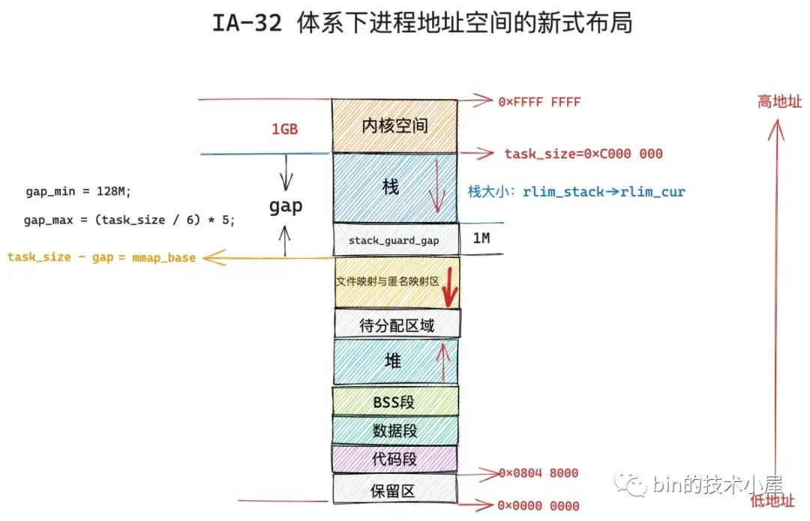

进程虚拟内存空间中栈顶 `STACK_TOP` 的位置一般设置为 `task_size`，也就是说从进程地址空间的末尾开始向下增长，如果开启地址随机化特性，`STACK_TOP` 还需要再加上一个随机偏移 `stack_maxrandom_size`。整个栈空间的最大长度设置在 `rlim_stack->rlim_cur` 中，在栈区和映射区之间，有一个 1M 大小的间隙 `stack_guard_gap`。映射区的起始地址 `mmap_base` 与进程地址空间末尾 `task_size` 的间隔为 gap 大小，`gap = rlim_stack->rlim_cur + stack_guard_gap`。gap 的最小值为 128M，最大值为 (`task_size` / 6) * 5。`task_size` 减去 gap 就是映射区起始地址 `mmap_base` 的位置，如果启用地址随机化特性，还需要在此基础上减去一个随机偏移 rnd。

```c
// 栈区与映射区之间的间隔 1M
unsigned long stack_guard_gap = 256UL<<PAGE_SHIFT;

static unsigned long mmap_base(unsigned long rnd, unsigned long task_size,
                   struct rlimit *rlim_stack)
{
    // 栈空间大小
    unsigned long gap = rlim_stack->rlim_cur;
    // 栈区与映射区之间的间隔为 1M 大小
    unsigned long pad = stack_guard_gap;
    unsigned long gap_min, gap_max;

    // gap 在这里的语义是映射区的起始地址 mmap_base 距离进程地址空间的末尾 task_size 的距离，此处为放溢出校验
    if (gap + pad > gap)
        gap += pad;

	// #define MIN_GAP (SZ_128M)
    if (gap < MIN_GAP)
        gap = MIN_GAP;
    // #define MAX_GAP (STACK_TOP / 6 * 5)
    else if (gap > MAX_GAP)
        gap = MAX_GAP;
    // 映射区在新式布局下的起始地址 mmap_base，如果开启随机化，则需要在减去一个随机偏移 rnd
    return PAGE_ALIGN(STACK_TOP - gap - rnd);
}
```

`get_unmapped_area` 主要的目的就是在具体的映射区布局下，根据布局特点，真正负责划分虚拟内存区域的函数。在经典布局下，`mm->get_unmapped_area` 指向的函数为 `arch_get_unmapped_area`。如果 mmap 进行的是私有匿名映射，那么内核会通过 `mm->get_unmapped_area` 函数进行虚拟内存的分配。如果 mmap 进行的是文件映射，那么内核则采用的是特定于文件系统的 `file->f_op->get_unmapped_area` 函数。比如，通过 mmap 映射的是 ext4 文件系统下的文件，那么 `file->f_op->get_unmapped_area` 指向的是 `thp_get_unmapped_area` 函数，专门为 ext4 文件映射申请虚拟内存。

```c
const struct file_operations ext4_file_operations = {
        .mmap           = ext4_file_mmap
        .get_unmapped_area = thp_get_unmapped_area,
};
```

如果 mmap 进行的是共享匿名映射，由于共享匿名映射的本质其实是基于 tmpfs 的虚拟文件系统中的匿名文件进行的共享文件映射，所以这种情况下 `get_unmapped_area` 函数是需要基于 tmpfs 的虚拟文件系统的，在共享匿名映射的情况下 `get_unmapped_area` 指向 `shmem_get_unmapped_area` 函数。

```c
unsigned long
get_unmapped_area(struct file *file, unsigned long addr, unsigned long len,
        unsigned long pgoff, unsigned long flags)
{
    /* 在进程虚拟空间中寻找还未被映射的 VMA 这段核心逻辑是被内核实现在特定于体系结构的函数中
     * 该函数指针用于指向真正的 get_unmapped_area 函数，在经典布局下，真正的实现函数为 arch_get_unmapped_area
     */
    unsigned long (*get_area)(struct file *, unsigned long,
                  unsigned long, unsigned long, unsigned long);

    // 映射的虚拟内存区域长度不能超过进程的地址空间
    if (len > TASK_SIZE)
        return -ENOMEM;
    // 如果是匿名映射，则采用 mm_struct 中保存的特定于体系结构的 arch_get_unmapped_area 函数
    get_area = current->mm->get_unmapped_area;
    if (file) {
        /* 如果是文件映射话，则需要使用 file->f_op 中的 get_unmapped_area，来为文件映射申请虚拟内存
         * file->f_op 保存的是特定于文件系统中文件的相关操作
         */
        if (file->f_op->get_unmapped_area)
            get_area = file->f_op->get_unmapped_area;
    } else if (flags & MAP_SHARED) {
        // 共享匿名映射是通过在 tmpfs 中创建的匿名文件实现的，所以这里也有其专有的 get_unmapped_area 函数
        pgoff = 0;
        get_area = shmem_get_unmapped_area;
    }
    
    // 在进程虚拟内存空间中，根据指定的 addr，len 查找合适的VMA
    addr = get_area(file, addr, len, pgoff, flags);
    if (IS_ERR_VALUE(addr))
        return addr;
    // VMA 区域不能超过进程地址空间
    if (addr > TASK_SIZE - len)
        return -ENOMEM;
    // addr 需要与 page size 对齐
    if (offset_in_page(addr))
        return -EINVAL;

    return error ? error : addr;
}
```

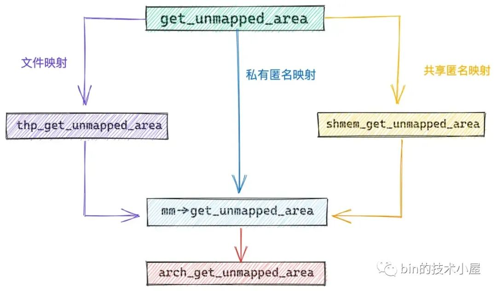

```c
unsigned long __thp_get_unmapped_area(struct file *filp, unsigned long len,
                loff_t off, unsigned long flags, unsigned long size)
{
    ret = current->mm->get_unmapped_area(filp, 0, len_pad,
                                         off >> PAGE_SHIFT, flags);
    return ret;
}

unsigned long shmem_get_unmapped_area(struct file *file,
                      unsigned long uaddr, unsigned long len,
                      unsigned long pgoff, unsigned long flags)
{
    unsigned long (*get_area)(struct file *,
        unsigned long, unsigned long, unsigned long, uns

    get_area = current->mm->get_unmapped_area;
    addr = get_area(file, uaddr, len, pgoff, flags);
    
    return addr;
}
```


如果在 flags 参数中指定了 `MAP_FIXED` 标志，则意味着用户强制要求内核在指定的起始地址 addr 处开始映射 len 长度的虚拟内存区域，无论这段虚拟内存区域 [addr , addr + len] 是否已经存在映射关系，内核都会强行进行映射，如果这块区域已经存在映射关系，那么后续内核会把旧的映射关系覆盖掉。


如果指定了 addr，但是并没有指定 `MAP_FIXED`，则意味着用户只是建议内核优先考虑从指定的 addr 地址处开始映射，但是如果 `[addr , addr+len]` 这段虚拟内存区域已经存在映射关系，内核则不会按照指定的 addr 开始映射，而是会自动查找一段空闲的 len 长度的虚拟内存区域。这一部分的工作由 `vm_unmapped_area` 函数承担。如果通过查找发现， `[addr , addr+len]` 这段虚拟内存地址范围并未存在任何映射关系，那么 addr 就会作为 mmap 映射的起始地址。这里面会分为两种情况：

1. 第一种是指定的 addr 比较大，addr 位于文件映射与匿名映射区中所有映射区域 vma 的最后面，这样一来，`[addr , addr + len]` 这段地址范围当然是空闲的了。
2. 第二种情况是指定的 addr 恰好位于一个 vma 和另一个 vma 中间的地址间隙中，并且这个地址间隙刚好大于或者等于指定的映射长度 len。内核就可以将这个地址间隙映射起来。


```c
// 内核标准实现 
unsigned long
arch_get_unmapped_area(struct file *filp, unsigned long addr,
        unsigned long len, unsigned long pgoff, unsigned long flags)
{
    struct mm_struct *mm = current->mm;
    struct vm_area_struct *vma, *prev;
    struct vm_unmapped_area_info info;
    // 进程虚拟内存空间的末尾 TASK_SIZE
    const unsigned long mmap_end = arch_get_mmap_end(addr);
    // 映射区域长度是否超过进程虚拟内存空间
    if (len > mmap_end - mmap_min_addr)
        return -ENOMEM;
    /* 如果指定了 MAP_FIXED 表示必须要从指定的 addr 开始映射 len 长度的区域，
     * 如果这块区域已经存在映射关系，那么后续内核会把旧的映射关系覆盖掉
     */
    if (flags & MAP_FIXED)
        return addr;

    /* 没有指定 MAP_FIXED，但是指定了 addr
     * 表示希望内核从指定的 addr 地址开始映射，内核这里会检查指定的这块虚拟内存范围是否有效
     */
    if (addr) {
        // addr 先保证与 page size 对齐
        addr = PAGE_ALIGN(addr);
        /* 内核这里需要确认一下指定的 [addr, addr + len] 这段虚拟内存区域是否存在已有的映射关系
         * [addr, addr+len] 地址范围内已经存在映射关系，则不能按照指定的 addr 作为映射起始地址
         * 在进程地址空间中查找第一个符合 addr < vma->vm_end  条件的 VMA
         * 如果不存在这样一个 vma（!vma）, 则表示 [addr, addr + len] 这段范围的虚拟内存是可以使用的，
         * 内核将会从指定的 addr 开始映射
         * 如果存在这样一个 vma ，则表示  [addr, addr + len] 这段范围的虚拟内存区域目前已经存在映射关系了，
         * 不能采用 addr 作为映射起始地址
         * 这里还有一种情况是 addr 落在 prev 和 vma 之间的一块未映射区域
         * 如果这块未映射区域的长度满足 len 大小，那么这段未映射区域可以被本次使用，内核也会从指定的 addr 开始映射
         */
        vma = find_vma_prev(mm, addr, &prev);
        if (mmap_end - len >= addr && addr >= mmap_min_addr &&
            (!vma || addr + len <= vm_start_gap(vma)) &&
            (!prev || addr >= vm_end_gap(prev)))
            return addr;
    }

    /* 如果明确指定 addr 但是指定的虚拟内存范围是一段无效的区域或者已经存在映射关系，
     * 那么内核会自动在地址空间中寻找一段合适的虚拟内存范围出来，这段虚拟内存范围的起始地址就不是指定的 addr 了 
     */
    info.flags = 0;
    // VMA 区域长度
    info.length = len;
    // 这里定义从哪里开始查找 VMA, 这里会从文件映射与匿名映射区开始查找
    info.low_limit = mm->mmap_base;
    // 查找结束位置为进程地址空间的末尾 TASK_SIZE
    info.high_limit = mmap_end;
    info.align_mask = 0;
    return vm_unmapped_area(&info);
}
```

`find_vma_prev` 的作用就是根据指定的映射起始地址 addr，在进程地址空间中查找出符合 `addr < vma->vm_end` 条件的第一个 vma 出来（下图中的蓝色部分）。然后在进程地址空间中的 vma 链表 mmap 中，找出它的前驱节点 pprev （下图中的绿色部分）。


如果不存在这样一个 vma（addr < vma->vm_end），那么内核直接从指定的 addr 地址处开始映射，这时 pprev 指向进程地址空间中最后一个 vma。

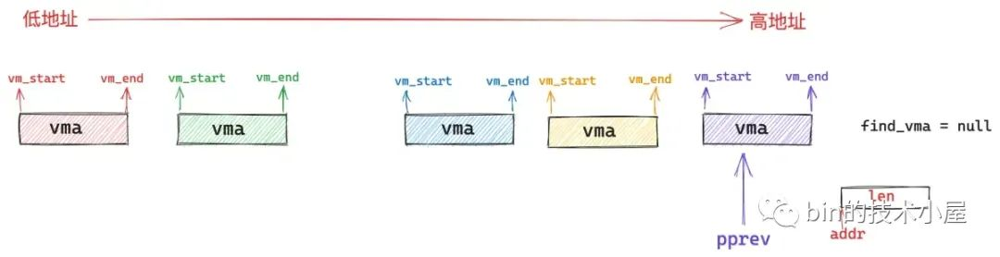

如果存在这样一个 vma，那么内核就会判断，该 vma 与其前驱节点 pprev 之间的地址间隙 gap 是否能容纳下一段 len 长度的映射区间，如果可以，那么内核就映射在这个地址间隙 gap 中。如果不可以，内核就需要在 `vm_unmapped_area` 函数中重新到整个进程地址空间中查找出一个 len 长度的空闲映射区域，这种情况下映射区的起始地址就不是指定的 addr 了。


```c
struct vm_area_struct *
find_vma_prev(struct mm_struct *mm, unsigned long addr,
            struct vm_area_struct **pprev)
{
    struct vm_area_struct *vma;
    // 在进程地址空间 mm 中查找第一个符合 addr < vma->vm_end 的 VMA
    vma = find_vma(mm, addr);

    if (vma) {
        // 恰好包含 addr 的 VMA 的前一个虚拟内存区域 
        *pprev = vma->vm_prev;
    } else {
        // 如果当前进程地址空间中，addr 不属于任何一个 VMA ，那么这里的 pprev 指向进程地址空间中最后一个 VMA
        struct rb_node *rb_node = rb_last(&mm->mm_rb);

        *pprev = rb_node ? rb_entry(rb_node, struct vm_area_struct, vm_rb) : NULL;
    }
    // 返回查找到的 vma，不存在则返回 null（内核后续会创建 VMA）
    return vma;
}

/* 根据指定地址 addr 在进程地址空间中查找第一个符合 addr < vma->vm_end条件 vma 的操作在 find_vma 函数中进行，
 * 内核为了高效地在进程地址空间中查找特定条件的 vma，会按照地址的增长方向将所有的 vma 组织在一颗红黑树 mm_rb 中。
 */
/* Look up the first VMA which satisfies  addr < vm_end,  NULL if none. */
struct vm_area_struct *find_vma(struct mm_struct *mm, unsigned long addr)
{
    struct rb_node *rb_node;
    struct vm_area_struct *vma;

    /* 进程地址空间中缓存了最近访问过的 VMA ，首先从进程地址空间中 VMA 缓存中开始查找，缓存命中率通常大约为 35% ，
     * 查找条件为：vma->vm_start <= addr && vma->vm_end > addr
     */
    vma = vmacache_find(mm, addr);
    if (likely(vma))
        return vma;

    /* 进程地址空间中的所有 VMA 被组织在一颗红黑树中，为了方便内核在进程地址空间中查找特定的 VMA
     * 这里首先需要获取红黑树的根节点，内核会从根节点开始查找
     */
    rb_node = mm->mm_rb.rb_node;

    while (rb_node) {
        struct vm_area_struct *tmp;
        // 获取位于根节点的 VMA
        tmp = rb_entry(rb_node, struct vm_area_struct, vm_rb);

        if (tmp->vm_end > addr) {
            vma = tmp;
            // 判断 addr 是否恰好落在根节点 VMA 中： vm_start <= addr < vm_end
            if (tmp->vm_start <= addr)
                break;
            // 如果不存在，则继续到左子树中查找
            rb_node = rb_node->rb_left;
        } else
            // 如果根节点的 vm_end <= addr，说明 addr 在根节点 vma 的后边，这种情况则到右子树中继续查找
            rb_node = rb_node->rb_right;
    }

    if (vma)
        // 更新 vma 缓存
        vmacache_update(addr, vma);
    // 返回查找到的 vma，如果没有查找到，则返回 Null，表示进程空间中目前还没有这样一个 VMA ,后续需要新建了。
    return vma;
}

/*
 * Search for an unmapped address range.
 *
 * We are looking for a range that:
 * - does not intersect with any VMA;
 * - is contained within the [low_limit, high_limit) interval;
 * - is at least the desired size.
 * - satisfies (begin_addr & align_mask) == (align_offset & align_mask)
 */
static inline unsigned long
vm_unmapped_area(struct vm_unmapped_area_info *info)
{
    // 按照进程虚拟内存空间中文件映射与匿名映射区的地址增长方向，分为两个函数，在进程地址空间中查找未映射的 VMA
    if (info->flags & VM_UNMAPPED_AREA_TOPDOWN)
        // 当文件映射与匿名映射区的地址增长方向是从上到下逆向增长时（新式布局），采用 topdown 后缀的函数查找
        return unmapped_area_topdown(info);
    else
        // 地址增长方向为从下倒上正向增长（经典布局），采用该函数查找
        return unmapped_area(info);
}
```

寻找的 `unmapped_area` 一定是在文件映射与匿名映射区中某个 vma 与其前驱 vma 之间的地址间隙 gap 中产生的。所以这就要求这个 gap 的长度必须大于等于映射 length，这样才能容纳下要映射的长度。gap 的起始地址 `gap_start` 一般从 prev 节点的末尾开始：`gap_start = vma->vm_prev->vm_end` 。gap 的结束地址 `gap_end` 一般从 vma 的起始地址结束：`gap_end = vma->vm_start` 。在此基础之上，gap 还会受到 `low_limit`（`mm->mmap_base`）和 `high_limit`（`TASK_SIZE`）的地址限制。因此这个 gap 的起始地址 `gap_start` 不能高于 `high_limit - length`，否则从 `gap_start` 地址处开始映射长度 length 的区域就会超出 `high_limit` 的限制。gap 的结束地址 `gap_end` 不能低于 `low_limit + length`，否则映射区域的起始地址就会低于 `low_limit` 的限制。

首先内核会从红黑树中的根节点 vma 开始查找，判断根节点的 vma 与其前驱节点 `vma->vm_prev` 之间的地址间隙 gap 是否满足上述条件，如果根节点 vma 的起始地址 `vma->vm_start` 也就是 `gap_end` 低于了 `low_limit + length` 的限制，那就说明根节点 vma 与其前驱节点之间的 gap 不适合用来作为 `unmapped_area`，否则 `unmapped_area` 的起始地址 `gap_start` 就会低于 `low_limit` 的限制。


由于红黑树是按照 vma 的地址增长方向来组织的，左子树中的所有 vma 地址都低于根节点 vma 的地址，右子树的所有 vma 地址均高于根节点 vma 的地址。现在的情况是 `vma->vm_start` 的地址太低了，已经小于了 `low_limit + length` 的限制，所以左子树的 vma 就不用看了，直接从右子树中去查找。如果根节点 vma 的起始地址 `vma->vm_start` 也就是 `gap_end` 高于 `low_limit + length` 的要求，说明 `gap_end` 是符合要求的，但是目前还不能马上对 `gap_start` 的限制要求进行检查，因为需要按照地址从低到高的优先级来查看最合适的 `unmapped_area` 未映射区域，所以需要到左子树中去查找地址更低的 vma。如果在左子树中找到了一个地址最低的 vma，并且这个 vma 与其前驱节点 `vma->vm_prev` 之间的地址间隙 gap 符合上述的三个条件：

1. gap 的长度大于等于映射长度 length ： gap_end - gap_start >= length
2. gap_end >= low_limit + length 。
3. gap_start <= high_limit - length。

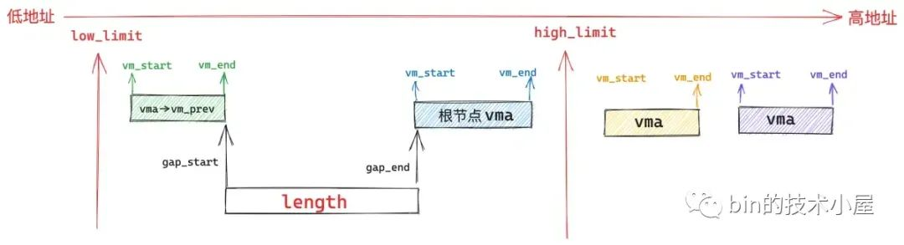

为了避免无效遍历优化性能，内核会将一个 vma 节点以及它所有子树中存在的最大间隙 gap 保存在 `struct vm_area_struct` 结构中的 `rb_subtree_gap` 属性中。当遍历 vma 节点的时候发现：`vma->rb_subtree_gap < length`，那么整棵红黑树都不需要遍历，直接从进程地址空间中最后一个 `vma->vm_end` 处开始映射即可。

```c
struct vm_area_struct {
    unsigned long vm_start;     /* Our start address within vm_mm. */
    unsigned long vm_end;       /* The first byte after our end address within vm_mm. */

    /* linked list of VM areas per task, sorted by address */
    struct vm_area_struct *vm_next, *vm_prev;

    struct rb_node vm_rb;

    /* 在当前 vma 的红黑树左右子树中的所有节点 vma （包括当前 vma）
     * 这个集合中的 vma 与其 vm_prev 之间最大的虚拟内存地址 gap （单位字节）保存在 rb_subtree_gap 字段中
     */
    unsigned long rb_subtree_gap;
}

struct mm_struct {
    // 当前进程虚拟内存空间中，地址最高的一个 VMA 的结束地址位置
    unsigned long highest_vm_end;   /* highest vma end address */
}

unsigned long unmapped_area(struct vm_unmapped_area_info *info)
{
    /*
     * We implement the search by looking for an rbtree node that
     * immediately follows a suitable gap. That is,
     * - gap_start = vma->vm_prev->vm_end <= info->high_limit - length;
     * - gap_end   = vma->vm_start        >= info->low_limit  + length;
     * - gap_end - gap_start >= length
     */

    struct mm_struct *mm = current->mm;
    // 寻找未映射区域的参考 vma (该区域以存在映射关系)
    struct vm_area_struct *vma;
    /* 未映射区域产生在 vma->vm_prev 与 vma 这两个虚拟内存区域中的间隙 gap 中，length 表示本次映射区域的长度，
     * low_limit ，high_limit 表示在进程地址空间中哪段地址范围内查找，
     * 一个地址下限（mm->mmap_base），另一个标识地址上限（TASK_SIZE）
     * gap_start, gap_end 表示 vma->vm_prev 与 vma 之间的 gap 范围，unmapped_area 将会在这里产生
     */
    unsigned long length, low_limit, high_limit, gap_start, gap_end;

    /* gap_start 需要满足的条件：gap_start =  vma->vm_prev->vm_end <= info->high_limit - length
     * 否则 unmapped_area 将会超出 high_limit 的限制
     */
    high_limit = info->high_limit - length;

    /* gap_end 需要满足的条件：gap_end = vma->vm_start >= info->low_limit + length
     * 否则 unmapped_area 将会超出 low_limit 的限制
     */
    low_limit = info->low_limit + length;

    // 首先将 vma 红黑树的根节点作为 gap 的参考 vma
    if (RB_EMPTY_ROOT(&mm->mm_rb))
        // 'empty' nodes are nodes that are known not to be inserted in an rbtree
        goto check_highest;
    // 获取红黑树根节点的 vma
    vma = rb_entry(mm->mm_rb.rb_node, struct vm_area_struct, vm_rb);

    /* rb_subtree_gap 为当前 vma 及其左右子树中所有 vma 与其对应 vm_prev 之间最大的虚拟内存地址 gap
     * 最大的 gap 如果都不能满足映射长度 length 则跳转到 check_highest 处理
     */
    if (vma->rb_subtree_gap < length)
        // 从进程地址空间最后一个 vma->vm_end 地址处开始映射
        goto check_highest;

    while (true) {
        // 获取当前 vma 的 vm_start 起始虚拟内存地址作为 gap_end
        gap_end = vm_start_gap(vma);
        /* gap_end 需要满足：gap_end >= low_limit，否则 unmapped_area 将会超出 low_limit 的限制
         * 如果存在左子树，则需要继续到左子树中去查找，因为需要按照地址从低到高的优先级来查看合适的未映射区域
         */
        if (gap_end >= low_limit && vma->vm_rb.rb_left) {
            struct vm_area_struct *left =
                rb_entry(vma->vm_rb.rb_left,
                     struct vm_area_struct, vm_rb);
            // 如果左子树中存在合适的 gap，则继续左子树的查找，否则查找结束，gap 为当前 vma 与其 vm_prev 之间的间隙    
            if (left->rb_subtree_gap >= length) {
                vma = left;
                continue;
            }
        }
        // 获取当前 vma->vm_prev 的 vm_end 作为 gap_start
        gap_start = vma->vm_prev ? vm_end_gap(vma->vm_prev) : 0;
check_current:
        // gap_start 需要满足：gap_start <= high_limit，否则 unmapped_area 将会超出 high_limit 的限制
        if (gap_start > high_limit)
            return -ENOMEM;

        if (gap_end >= low_limit &&
            gap_end > gap_start && gap_end - gap_start >= length)
            // 找到了合适的 unmapped_area 跳转到 found 处理
            goto found;

        // 当前 vma 与其左子树中的所有 vma 均不存在一个合理的 gap，那么从 vma 的右子树中继续查找
        if (vma->vm_rb.rb_right) {
            struct vm_area_struct *right =
                rb_entry(vma->vm_rb.rb_right,
                     struct vm_area_struct, vm_rb);
            if (right->rb_subtree_gap >= length) {
                vma = right;
                continue;
            }
        }

        /* 如果在当前 vma 以及它的左右子树中均无法找到一个合适的 gap
         * 那么这里会从当前 vma 节点向上回溯整颗红黑树，在它的父节点中尝试查找是否有合适的 gap
         * 因为这时候有可能会有新的 vma 插入到红黑树中，可能会产生新的 gap
         */
        while (true) {
            struct rb_node *prev = &vma->vm_rb;
            if (!rb_parent(prev))
                goto check_highest;
            vma = rb_entry(rb_parent(prev),
                       struct vm_area_struct, vm_rb);
            if (prev == vma->vm_rb.rb_left) {
                gap_start = vm_end_gap(vma->vm_prev);
                gap_end = vm_start_gap(vma);
                goto check_current;
            }
        }
    }

check_highest:
    /* 流程走到这里表示在当前进程虚拟内存空间的所有 VMA 中都无法找到一个合适的 gap 来作为 unmapped_area
     * 那么就从进程地址空间中最后一个 vma->vm_end 开始映射
     * mm->highest_vm_end 表示当前进程虚拟内存空间中，地址最高的一个 VMA 的结束地址位置
     */
    gap_start = mm->highest_vm_end;
    gap_end = ULONG_MAX;  /* Only for VM_BUG_ON below */
    // 这里最后需要检查剩余虚拟内存空间是否满足映射长度
    if (gap_start > high_limit)
        // ENOMEM 表示当前进程虚拟内存空间中虚拟内存不足
        return -ENOMEM;

found:
    /* 流程走到这里表示我们已经找到了一个合适的 gap 来作为 unmapped_area 
     * 直接返回 gap_start （需要与 4K 对齐）作为映射的起始地址
     */
    /* We found a suitable gap. Clip it with the original low_limit. */
    if (gap_start < info->low_limit)
        gap_start = info->low_limit;

    /* Adjust gap address to the desired alignment */
    gap_start += (info->align_offset - gap_start) & info->align_mask;

    VM_BUG_ON(gap_start + info->length > info->high_limit);
    VM_BUG_ON(gap_start + info->length > gap_end);
    return gap_start;
}
```

##### 内存映射的本质

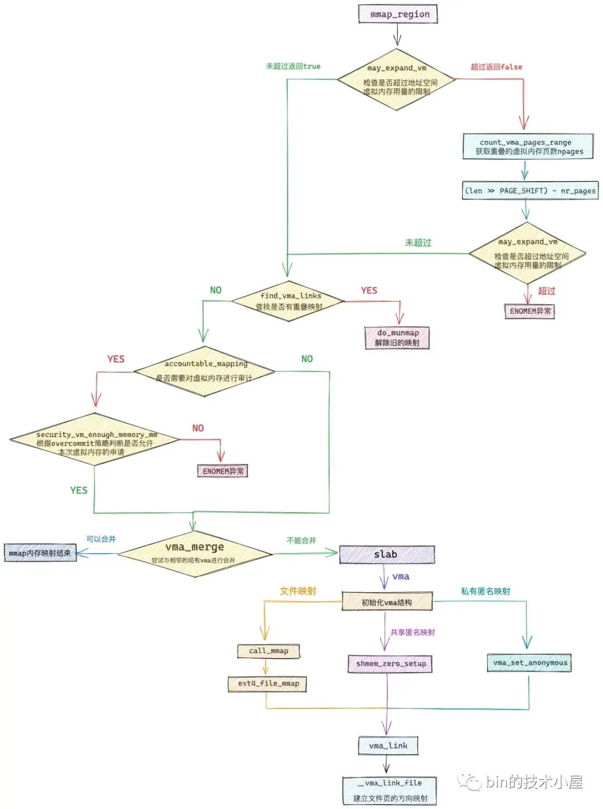

```c
unsigned long mmap_region(struct file *file, unsigned long addr,
        unsigned long len, vm_flags_t vm_flags, unsigned long pgoff,
        struct list_head *uf)
{
    struct mm_struct *mm = current->mm;
    struct vm_area_struct *vma, *prev;
    int error;
    struct rb_node **rb_link, *rb_parent;
    unsigned long charged = 0;

    // 检查本次映射是否超过了进程虚拟内存空间中的虚拟内存容量的限制，超过则返回 false
    if (!may_expand_vm(mm, vm_flags, len >> PAGE_SHIFT)) {
        unsigned long nr_pages;

        /* 如果 mmap 指定了 MAP_FIXED，表示内核必须要按照用户指定的映射区来进行映射
         * 这种情况下就会导致指定的映射区[addr, addr + len] 有一部分可能与现有映射重叠
         * 内核将会覆盖掉这段已有的映射，重新按照用户指定的映射关系进行映射
         * 所以这里需要计算进程地址空间中与指定映射区[addr, addr + len]重叠的虚拟内存页数 nr_pages
         */
        nr_pages = count_vma_pages_range(mm, addr, addr + len);
        /* 由于这里的 nr_pages 表示重叠的虚拟内存部分，将会被覆盖，所以这部分被覆盖的虚拟内存不需要额外申请
         * 这里通过 len >> PAGE_SHIFT 减去这段可以被覆盖的 nr_pages 在重新检查是否超过虚拟内存相关区域的限额
         */
        if (!may_expand_vm(mm, vm_flags,
                    (len >> PAGE_SHIFT) - nr_pages))
            return -ENOMEM;
    }

   /* 如果当前进程地址空间中存在于指定映射区域 [addr, addr + len] 重叠的部分
    * 则调用  do_munmap 将这段重叠的映射部分解除掉，后续会重新映射这部分
    */
    while (find_vma_links(mm, addr, addr + len, &prev, &rb_link,
                  &rb_parent)) {
        if (do_munmap(mm, addr, len, uf))
            return -ENOMEM;
    }
   
    /* 判断将来是否会为这段虚拟内存 vma ，申请新的物理内存，
     * 比如 私有，可写（private writable）的映射方式，内核将来会通过 cow 重新为其分配新的物理内存。
     * 私有，只读（private readonly）的映射方式，内核则会共享原来映射的物理内存，而不会申请新的物理内存。
     * 如果将来需要申请新的物理内存则会根据当前系统的 overcommit 策略以及当前物理内存的使用情况来  
     * 综合判断是否允许本次虚拟内存的申请。如果虚拟内存不足，则返回 ENOMEM，这样的话可以防止缺页的时候发生 OOM
     */
    if (accountable_mapping(file, vm_flags)) {
        charged = len >> PAGE_SHIFT;
        /* 根据内核 overcommit 策略以及当前物理内存的使用情况综合判断，是否能够通过本次虚拟内存的申请
         * 虚拟内存的申请一旦这里通过之后，后续发生缺页，内核将会有足够的物理内存为其分配，不会发生 OOM
         */
        if (security_vm_enough_memory_mm(mm, charged))
            return -ENOMEM;
        /* 凡是设置了 VM_ACCOUNT 的 VMA，表示这段虚拟内存均已经过 vm_enough_memory 的检测
         * 当虚拟内存发生缺页的时候，内核会有足够的物理内存分配，而不会导致 OOM
         * 其虚拟内存的用量都会被统计在 /proc/meminfo 的 Committed_AS  字段中  
         */
        vm_flags |= VM_ACCOUNT;
    }

    /* 为了精细化的控制内存的开销，内核这里首先需要尝试看能不能和地址空间中已有的 vma 进行合并
     * 尝试将当前 vma 合并到已有的 vma 中
     */
    vma = vma_merge(mm, prev, addr, addr + len, vm_flags,
            NULL, file, pgoff, NULL, NULL_VM_UFFD_CTX);
    if (vma)
        // 如果可以合并，则虚拟内存分配过程结束
        goto out;

    // 如果不可以合并，则只能从 slab 中取出一个新的 vma 结构来
    vma = vm_area_alloc(mm);
    if (!vma) {
        error = -ENOMEM;
        goto unacct_error;
    }
    // 根据要映射的虚拟内存区域属性初始化 vma 结构中的相关字段
    vma->vm_start = addr;
    vma->vm_end = addr + len;
    vma->vm_flags = vm_flags;
    vma->vm_page_prot = vm_get_page_prot(vm_flags);
    vma->vm_pgoff = pgoff;

    // 文件映射
    if (file) {
        // 将文件与虚拟内存映射起来
        vma->vm_file = get_file(file);
        /* 这一步中将虚拟内存区域 vma 的操作函数 vm_ops 映射成文件的操作函数（和具体文件系统有关）
         * 比如 ext4 文件系统中的操作函数为 ext4_file_vm_ops
         * 从这一刻开始，读写内存就和读写文件是一样的了
         */
        error = call_mmap(file, vma);
        if (error)
            goto unmap_and_free_vma;

        addr = vma->vm_start;
        vm_flags = vma->vm_flags;
    } else if (vm_flags & VM_SHARED) {
        /* 这里处理共享匿名映射，依赖于 tmpfs 文件系统中的匿名文件，父子进程通过这个匿名文件进行通讯
         * 该函数用于在 tmpfs 中创建匿名文件，并映射进当前共享匿名映射区 vma 中
         */
        error = shmem_zero_setup(vma);
        if (error)
            goto free_vma;
    } else {
        // 这里处理私有匿名映射，将 vma->vm_ops 设置为 null，只有文件映射才需要 vm_ops 这样才能将内存与文件映射起来
        vma_set_anonymous(vma);
    }
    /* 将当前 vma 按照地址的增长方向插入到进程虚拟内存空间的 mm_struct->mmap 链表以及mm_struct->mm_rb 红黑树中
     * 并建立文件与 vma 的反向映射
     */
    vma_link(mm, vma, prev, rb_link, rb_parent);

    file = vma->vm_file;
out:
    // 更新地址空间 mm_struct 中的相关统计变量
    vm_stat_account(mm, vm_flags, len >> PAGE_SHIFT);
    return addr;
}
```


```c
static inline int call_mmap(struct file *file, struct vm_area_struct *vma)
{
    return file->f_op->mmap(file, vma);
}

// 内核将文件相关的操作全部定义在 struct file 结构中的 f_op 属性中
struct file {
    const struct file_operations  *f_op;
}

/* 文件的操作与其所在的文件系统是紧密相关的，
 * 在 ext4 文件系统中，相关文件的 file->f_op 指向 ext4_file_operations 操作集合
 */
const struct file_operations ext4_file_operations = {
	.mmap		= ext4_file_mmap,
};

/* 其中 file->f_op->mmap 函数专门用于文件与内存的映射，在这里内核将 vm_area_struct 的内存操作 vma->vm_ops 
 * 设置为文件系统的操作 ext4_file_vm_ops，当通过 mmap 将内存与文件映射起来之后，读写内存其实就是读写文件系统的本质就在这里。
 */
static int ext4_file_mmap(struct file *file, struct vm_area_struct *vma)
{
      ......
      vma->vm_ops = &ext4_file_vm_ops;
      ......    
}
static const struct vm_operations_struct ext4_file_vm_ops = {
    .fault      = ext4_filemap_fault,
    .map_pages  = filemap_map_pages,
    .page_mkwrite   = ext4_page_mkwrite,
};
```

如果 mmap 进行的是共享匿名映射，父子进程之间需要依赖 tmpfs 文件系统中的匿名文件对共享内存进行访问，当进行共享匿名映射的时候，内核会在 `shmem_zero_setup` 函数中，到 tmpfs 文件系统里为映射创建一个匿名文件（`shmem_kernel_file_setup`），随后将 tmpfs 文件系统中的这个匿名文件与虚拟映射区 vma 中的 `vm_file` 关联映射起来，当然了，`vma->vm_ops` 也需要映射成 `shmem_vm_ops`。当父进程调用 fork 创建子进程的时候，内核会将父进程的虚拟内存空间全部拷贝给子进程，包括这里创建的共享匿名映射区域 vma，这样一来，父子进程就可以通过共同的 `vma->vm_file` 来实现共享内存的通信了。这里可以看出 mmap 的共享匿名映射其实本质上还是共享文件映射，只不过这个文件比较特殊，创建于 `dev/zero` 目录下的 tmpfs 文件系统中。

```c
int shmem_zero_setup(struct vm_area_struct *vma)
{
    struct file *file;
    loff_t size = vma->vm_end - vma->vm_start;
    // tmpfs 中获取一个匿名文件
    file = shmem_kernel_file_setup("dev/zero", size, vma->vm_flags);
    if (IS_ERR(file))
        return PTR_ERR(file);

    if (vma->vm_file)
        // 如果 vma 中已存在其他文件，则解除与其他文件的映射关系
        fput(vma->vm_file);
    
    // 将 tmpfs 中的匿名文件映射进虚拟内存区域 vma 中，后续 fork 子进程的时候，父子进程就可以通过这个匿名文件实现共享匿名映射
    vma->vm_file = file;
    // 对这块共享匿名映射区相关操作这里直接映射成 shmem_vm_ops
    vma->vm_ops = &shmem_vm_ops;

    return 0;
}

static const struct vm_operations_struct shmem_vm_ops = {
	.fault		= shmem_fault,
	.map_pages	= filemap_map_pages,
#ifdef CONFIG_NUMA
	.set_policy     = shmem_set_policy,
	.get_policy     = shmem_get_policy,
#endif
};
```

如果 mmap 这里进行的是私有匿名映射的话，情况就变得简单了，由于私有匿名映射并不涉及到与文件之间的映射，所以只需要简单的将 `vma->vm_ops` 设置为 null 即可。

```c
static inline void vma_set_anonymous(struct vm_area_struct *vma)
{
	vma->vm_ops = NULL;
}
```

`vma_link` 要做的工作就是按照虚拟内存地址的增长方向，将本次映射产生的 vma 结构插入到进程地址空间这两个数据结构中。

```c
static void vma_link(struct mm_struct *mm, struct vm_area_struct *vma,
            struct vm_area_struct *prev, struct rb_node **rb_link,
            struct rb_node *rb_parent)
{
    // 文件 page cache
    struct address_space *mapping = NULL;

    if (vma->vm_file) {
        // 获取映射文件的 page cache
        mapping = vma->vm_file->f_mapping;
        i_mmap_lock_write(mapping);
    }
    // 将 vma 插入到地址空间中的 vma 链表 mm_struct->mmap 以及红黑树 mm_struct->mm_rb 中
    __vma_link(mm, vma, prev, rb_link, rb_parent);
    // 建立文件与 vma 的反向映射
    __vma_link_file(vma);

    if (mapping)
        i_mmap_unlock_write(mapping);

    // map_count 表示进程地址空间中 vma 的个数
    mm->map_count++;
    validate_mm(mm);
}
```

除此之外，`vma_link` 还做了一项重要工作，就是通过 `__vma_link_file` 函数建立文件与虚拟内存区域 vma （所有进程）的反向映射关系。匿名页的反向映射还是相对比较复杂的，文件页的反向映射就很简单了，`struct file` 结构中的 `f_mapping` 属性指向了一个非常重要的数据结构 `struct address_space`。

```c
struct address_space {
    struct inode        *host;      /* owner: inode, block_device */
    // page cache
    struct radix_tree_root  i_pages;    /* cached pages */
    atomic_t        i_mmap_writable;/* count VM_SHARED mappings */
    // 文件与 vma 反向映射的核心数据结构，i_mmap 也是一颗红黑树
    // 在所有进程的地址空间中，只要与该文件发生映射的 vma 均挂在 i_mmap 中
    struct rb_root_cached   i_mmap;     /* tree of private and shared mappings */
}
```

`struct address_space` 结构中有两个非常重要的属性，其中一个是 `i_pages` ，它指向了 page cache。另一个就是 `i_mmap`，它指向的是一颗红黑树，这颗红黑树正是文件页反向映射的核心数据结构，反向映射关系就保存在这里。


一个文件可以被多个进程一起映射，这样一来在每个进程的地址空间 `mm_struct` 结构中都会有一个 vma 结构来与这个文件进行映射，与该文件发生映射关系的所有进程地址空间中的 vma 就挂在 `address_space-> i_mmap` 这颗红黑树中，通过它，可以找到所有与该文件进行映射的进程。`__vma_link_file` 函数建立文件页反向映射的核心其实就是将 mmap 映射出的这个 vma 插入到这颗红黑树中。

```c
static void __vma_link_file(struct vm_area_struct *vma)
{
    struct file *file;

    file = vma->vm_file;
    if (file) {
        struct address_space *mapping = file->f_mapping;
        /* address_space->i_mmap 也是一颗红黑树，上面挂着的是与该文件映射的所有 vma（所有进程地址空间）
         * 这里将 vma 插入到 i_mmap 中，实现文件与 vma 的反向映射
         */
        vma_interval_tree_insert(vma, &mapping->i_mmap);
    }
}
```

进程地址空间中对虚拟内存的用量是有限制的，限制分为两个方面：

1. 对进程地址空间中能够映射的虚拟内存页总数做出限制。
2. 对进程地址空间中数据区的虚拟内存页总数做出限制。

这里的数据区，在内核中定义的是所有私有，可写的虚拟内存区域（栈区除外）：

```c
/*
 * Data area - private, writable, not stack
 */
static inline bool is_data_mapping(vm_flags_t flags)
{
    // 本次需要映射的虚拟内存区域是否是私有，可写的（数据区）
    return (flags & (VM_WRITE | VM_SHARED | VM_STACK)) == VM_WRITE;
}
```

以上两个方面的限制，可以通过修改 `/etc/security/limits.conf` 文件进行调整。

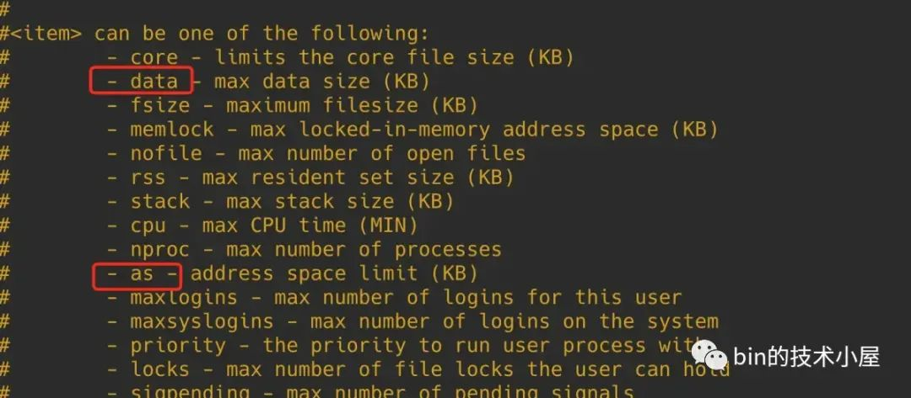

内核对进程地址空间中相关区域的虚拟内存用量限制依然保存在 `task_struct->signal_struct->rlim` 数组中，可以通过 `RLIMIT_AS` 以及 `RLIMIT_DATA` 下标进行访问。

```c
// 进程地址空间中允许映射的虚拟内存总量，单位为字节
# define RLIMIT_AS		9	/* address space limit */
// 进程地址空间中允许用于私有可写（private,writable）的虚拟内存总量，单位字节
# define RLIMIT_DATA	2	/* max data size */

// 检查本次映射是否超过了进程虚拟内存空间中的虚拟内存总量的限制，超过则返回 false
bool may_expand_vm(struct mm_struct *mm, vm_flags_t flags, unsigned long npages)
{
    /* mm->total_vm 表示当前进程地址空间中映射的虚拟内存页总数，npages 表示此次要映射的虚拟内存页个数
     * rlimit(RLIMIT_AS) 表示进程地址空间中允许映射的虚拟内存总量，单位为字节
     */
    if (mm->total_vm + npages > rlimit(RLIMIT_AS) >> PAGE_SHIFT)
        // 如果映射的虚拟内存页总数超出了内核的限制，那么就返回 false 表示虚拟内存不足
        return false;

    /* 检查本次映射是否属于数据区域的映射，这里的数据区域指的是私有，可写的虚拟内存区域（栈区除外）
     * 如果是则需要检查数据区域里的虚拟内存页是否超过了内核的限制
     * rlimit(RLIMIT_DATA) 表示进程地址空间中允许映射的私有，可写的虚拟内存总量，单位为字节
     * 如果超过则返回 false，表示数据区虚拟内存不足
     */
    if (is_data_mapping(flags) &&
        mm->data_vm + npages > rlimit(RLIMIT_DATA) >> PAGE_SHIFT) {
        /* Workaround for Valgrind */
        if (rlimit(RLIMIT_DATA) == 0 &&
            mm->data_vm + npages <= rlimit_max(RLIMIT_DATA) >> PAGE_SHIFT)
            return true;

        pr_warn_once("%s (%d): VmData %lu exceed data ulimit %lu. Update limits%s.\n",
                 current->comm, current->pid,
                 (mm->data_vm + npages) << PAGE_SHIFT,
                 rlimit(RLIMIT_DATA),
                 ignore_rlimit_data ? "" : " or use boot option ignore_rlimit_data");

        if (!ignore_rlimit_data)
            return false;
    }

    return true;
}
```

###### overcommit 策略

内核的 overcommit 策略会影响到进程申请虚拟内存的用量，进程对虚拟内存的申请就好比是向银行贷款，在向银行贷款的时候，银行是需要对贷款者的还款能力进行审计的，抵押的资产越优质，银行贷款给的也会越多。同样的道理，进程再向内核申请虚拟内存的时候，也是需要物理内存作为抵押的，因为虚拟内存说到底最终还是要映射到物理内存上的，背后需要物理内存作为支撑，不能无限制的申请。

所以进程在申请虚拟内存的时候，内核也是需要对申请的虚拟内存用量进行审计的，审计的对象就是那些在未来需要为其分配物理内存的虚拟内存。这也是符合常理的，因为只有在未来需要分配新的物理内存的时候，内核才需要综合物理内存的容量来进行审计，从而决定是否为进程分配这么多的虚拟内存，否则将来可能到处都是 OOM。如果未来不需要为这段虚拟内存分配物理内存，那么内核自然不会对虚拟内存用量进行审计。这取决于 mmap 的映射方式。

比如，这段虚拟内存是私有，可写的，那么在未来，当进程对这段虚拟内存进行写入的时候，内核会通过 cow 的方式为其分配新的物理内存，但是这段虚拟内存是共享的或者是只读的话，内核将不会为这段虚拟内存分配新的物理内存，而是继续共享原来已经映射好的物理内存（内核中只有一份）。如果进程在向内核申请的虚拟内存在未来是需要重新分配物理内存的话，比如：私有，可写。那么这种虚拟内存的使用量就需要被内核审计起来，因为物理内存总是有限的，不可能为所有虚拟内存都分配物理内存。内核需要确保能够为这段虚拟内存未来分配足够的物理内存，防止 oom。**这种虚拟内存称之为 account virtual memory**。而进程向内核申请的虚拟内存并不需要内核为其重新分配物理内存的时候（共享或只读），反正不会增加物理内存的使用负担，这种虚拟内存就不需要被内核审计。

```c
/*
 * We account for memory if it's a private writeable mapping,
 * not hugepages and VM_NORESERVE wasn't set.
 */
static inline int accountable_mapping(struct file *file, vm_flags_t vm_flags)
{
    // hugetlb 类型的大页有其自己的统计方式，不会和普通的虚拟内存统计混合
    if (file && is_file_hugepages(file))
        return 0;
    /* 私有，可写，并且没有设置 VM_NORESERVE 的相关 VMA 是需要被 account 审计起来的。
     * 这样在后续发生缺页的时候，不会导致 OOM
     */
    return (vm_flags & (VM_NORESERVE | VM_SHARED | VM_WRITE)) == VM_WRITE;
}
```

**account virtual memory 特指那些私有，可写（private ，writeable）的虚拟内存区域，并且这些虚拟内存区域的 vm_flags 没有设置 VM_NORESERVE 标志位，以及这部分虚拟内存不能是映射大页的**。这部分 account virtual memory 被记录在 `vm_committed_as` 字段中，表示被审计起来的虚拟内存，这些虚拟内存在未来都是需要映射新的物理内存的，站在物理内存的角度 `vm_committed_as` 可以理解为当前系统中已经分配的物理内存和未来可能需要的物理内存总量。

```c
// 定义在文件：/include/linux/mman.h
extern struct percpu_counter vm_committed_as;

static inline void vm_acct_memory(long pages)
{
	percpu_counter_add_batch(&vm_committed_as, pages, vm_committed_as_batch);
}

static inline void vm_unacct_memory(long pages)
{
	vm_acct_memory(-pages);
}
```

每当有进程向内核申请或者释放虚拟内存（account virtual memory ）的时候，内核都会通过 `vm_acct_memory` 和 `vm_unacct_memory` 函数来更新 `vm_committed_as` 的值。使用 mmap 进行内存映射的时候，如果映射出的虚拟内存区域 vma 为私有，可写的，并且参数 flags 没有设置 `MAP_NORESERVE` 标志，那么这部分虚拟内存就需要被记录在 `vm_committed_as` 字段中。`vm_committed_as` 的值最终会反应在 `/proc/meminfo` 中的 Committed_AS 字段上。用来记录当前系统中，所有进程申请到的 account virtual memory 总量。

```c
static int meminfo_proc_show(struct seq_file *m, void *v)
{
    struct sysinfo i;
    unsigned long committed;

    committed = percpu_counter_read_positive(&vm_committed_as);
  
    show_val_kb(m, "Committed_AS:   ", committed);
}
```


```c
/* 用于检查进程虚拟内存空间中是否有足够的虚拟内存可供本次申请使用（需要结合 overcommit 策略来综合判定）
 * 返回 0 表示有足够的虚拟内存，返回 ENOMEM 表示虚拟内存不足
 */
int __vm_enough_memory(struct mm_struct *mm, long pages, int cap_sys_admin)
{
    // OVERCOMMIT_NEVER 模式下允许进程申请的虚拟内存大小
    long allowed;
    // 虚拟内存审计字段 vm_committed_as 增加 pages
    vm_acct_memory(pages);

    /* 虚拟内存的 overcommit 策略可以通过修改 /proc/sys/vm/overcommit_memory 文件来设置，
     * 它有三个设置选项：
     * OVERCOMMIT_ALWAYS 表示无论应用进程申请多大的虚拟内存，内核总是会答应，分配虚拟内存非常的激进
     */
    if (sysctl_overcommit_memory == OVERCOMMIT_ALWAYS)
        return 0;
    /* OVERCOMMIT_GUESS 则相对 always 策略稍微保守一点，也是内核的默认策略
     * 它会对进程能够申请到的虚拟内存大小做一定的限制，特别激进的申请比如申请非常大的虚拟内存则会被拒绝。
     */
    if (sysctl_overcommit_memory == OVERCOMMIT_GUESS) {
        // guess 默认策略下，进程申请的虚拟内存大小不能超过 物理内存总大小和 swap 交换区的总大小之和
        if (pages > totalram_pages() + total_swap_pages)
            goto error;
        return 0;
    }

    /* OVERCOMMIT_NEVER 是最为严格的一种控制虚拟内存 overcommit 的策略
     * 进程申请的虚拟内存大小不能超过 vm_commit_limit()，该值也会反应在 /proc/meminfo 中的 CommitLimit 字段中。
     * 只有采用 OVERCOMMIT_NEVER 模式，CommitLimit 的限制才会生效
     * allowed =（总物理内存大小 - 大页占用的内存大小） * 50%  + swap 交换区总大小 
     */
    allowed = vm_commit_limit();

    // cap_sys_admin 表示申请内存的进程拥有 root 权限
    if (!cap_sys_admin)
        /* 为 root 进程保存一些内存，这样可以保证 root 相关的操作在任何时候都可以顺利进行
         * 大小为 sysctl_admin_reserve_kbytes，这部分内存普通进程不能申请使用
         * 可通过 /proc/sys/vm/admin_reserve_kbytes 来配置
         */
        allowed -= sysctl_admin_reserve_kbytes >> (PAGE_SHIFT - 10);

    /*
     * Don't let a single process grow so big a user can't recover
     */
    if (mm) {
        /* 可通过 /proc/sys/vm/user_reserve_kbytes 来配置
         * 用于在紧急情况下，用户恢复系统，比如系统卡死，用户主动 kill 资源消耗比较大的进程，
         * 这个动作需要预留一些 user_reserve 内存
         */
        long reserve = sysctl_user_reserve_kbytes >> (PAGE_SHIFT - 10);

        allowed -= min_t(long, mm->total_vm / 32, reserve);
    }
    /* Committed_AS （系统中所有进程已经申请的虚拟内存总量 + 本次 mmap 申请的）不可以超过 CommitLimit（allowed）
     * 所以在 OVERCOMMIT_NEVER 策略下，进程可以申请到的虚拟内存容量需要在 CommitLimit 的基础上再减去
     * sysctl_admin_reserve_kbytes 和 sysctl_user_reserve_kbytes 配置的预留容量。
     */
    if (percpu_counter_read_positive(&vm_committed_as) < allowed)
        return 0;
error:
    vm_unacct_memory(pages);

    return -ENOMEM;
}

/*
 * Committed memory limit enforced when OVERCOMMIT_NEVER policy is used
 */
unsigned long vm_commit_limit(void)
{
    // 允许申请的虚拟内存大小，单位为页
    unsigned long allowed;
    /* 该值可通过 /proc/sys/vm/overcommit_kbytes 来修改
     * sysctl_overcommit_kbytes 设置的是 Committed memory limit 的绝对值
     */
    if (sysctl_overcommit_kbytes)
        // 转换单位为页
        allowed = sysctl_overcommit_kbytes >> (PAGE_SHIFT - 10);
    else
        /* sysctl_overcommit_ratio 该值可通过 /proc/sys/vm/overcommit_ratio 来修改，设置的 commit limit 的比例
         * 默认值为 50，（总物理内存大小 - 大页占用的内存大小） * 50%
         */
        allowed = ((totalram_pages() - hugetlb_total_pages())
               * sysctl_overcommit_ratio / 100);

    // 最后都需要加上 swap 交换区的总大小
    allowed += total_swap_pages;
    // （总物理内存大小 - 大页占用的内存大小） * 50%  + swap 交换区总大小 
    return allowed;
}
```

###### vma 合并

在创建新的 vma 结构之前，内核会在这里尝试看能不能将 area 与现有的 vma 进行合并，这样就可以避免创建新的 vma 结构，节省了内存的开销。内核会本着合并最大化的原则，检查当前映射出来的 area 能否与其前后两个 vma 进行合并，能合并就合并，如果不能合并就只能从 slab 中申请新的 vma 结构了。合并条件如下：

1. area 的 vm_flags 不能设置 VM_SPECIAL 标志，该标志表示 area 区域是不可以被合并的，只能重新创建 vma。
2. area 的起始地址 addr 必须要与其 prev vma 的结束地址重合，这样，area 才能和它的前一个 vma 进行合并，如果不重合，area 则不能和前一个 vma 进行合并。
3. area 的结束地址 end 必须要与其 next vma 的起始地址重合，这样，area 才能和它的后一个 vma 进行合并，如果不重合，area 则不能和后一个 vma 进行合并。如果前后都不能合并，那就只能重新创建 vma 结构了。
4. area 需要与其要合并区域的 vm_flags 必须相同，否则不能合并。
5. 如果两个合并区域都是文件映射区，那么它们映射的文件必须是同一个，并且他们的文件映射偏移 vm_pgoff 必须是连续的。
6. 如果两个合并区域都是匿名映射区，那么两个 vma 映射的匿名页 anon_vma 必须是相同的。
7. 合并区域的 numa policy 必须是相同的。
8. 要合并的 prev 和 next 虚拟内存区域中，不能包含 close 操作，也就是说 vma->vm_ops 不能设置有 close 函数，如果虚拟内存区域操作支持 close，则不能合并，否则会导致现有虚拟内存区域 prev 和 next 的资源无法释放。

通过 mmap 在进程地址空间中映射出的这个 area 一般是在两个 vma 中产生的，内核源码中使用 prev 指向 area 的前一个 vma，使用 next 指向 area 的后一个 vma。


如果在 mmap 系统调用参数 flags 中设置了 MAP_FIXED 标志，表示需要内核进行强制映射，在这种情况下，area 区域有可能会与 prev 区域和 next 区域有部分重合。如果 area 区域的结束地址 end 与 next 区域的结束地址重合，内核会将 next 指针继续向后移动一下，指向 next->vm_next 区域。保证 area 始终处于 prev 和 next 之间的 gap 中。


可以合并 vma 一共有 8 种情况，可以分为两个大的类别：

1. 第一个类别是 area 的前一个 prev vma 的结束地址与 area 的起始地址 addr 重合，判断条件为：`prev->vm_end == addr`。
2. 第二个类别是 area 的后一个 next vma 的起始地址与 area 的结束地址 end 重合，判断条件为：`end == next->vm_start`。


case 1 是在基本布局 1 中，area 的起始地址 addr 与 prev vma 的结束地址重合，同时 area 的结束地址 end 与 next vma 的起始地址重合，内核将会删除 next 区域，扩充 prev 区域，也就是说将这三个区域统一合并到 prev 区域中。case 1 在基本布局 2 下，就演变成了 case 6 的情况，内核会将中间重叠的蓝色区域覆盖掉，然后统一合并到 prev 区域中。


如果只是 area 的起始地址 addr 与 prev vma 的结束地址重合，但是 area 的结束地址 end 不与 next vma 的起始地址重合，就会出现 case 2 , case 5 , case 7 三种情况。其中 case 2 的情况是 area 的结束地址 end 小于 next vma 的起始地址，内核会扩充 prev 区域，将 area 合并进去，next 区域保持不变。


case 5 的情况是 area 的结束地址 end 大于 next vma 的起始地址，内核会扩充 prev 区域，将 area 以及与 next 重叠的部分合并到 prev 区域中，剩下的继续留在 next 区域保持不变。


case 2 在基本布局 2 下又会演变成 case 7 , 这种情况下内核会将下图中的蓝色区域覆盖，并扩充 prev 区域。next 区域保持不变。


如果只是 area 的结束地址 end 与 next vma 的起始地址重合，但是 area 的起始地址 addr 不与 prev vma 的结束地址重合，同样的道理也会分为三种情况，分别是下面介绍的 case 4 , case 3 , case 8。case 4 的情况下，area 的起始地址 addr 小于 prev 区域的结束地址，那么内核会缩小 prev 区域，然后扩充 next 区域，将重叠的部分合并到 next 区域中。


如果 area 的起始地址 addr 大于 prev 区域的结束地址的话，就是 case 3 的情况 ，内核会扩充 next 区域，并将 area 合并到 next 中，prev 区域保持不变。


case 3 在基本布局 2 下就会演变为 case 8 ，内核继续保持 prev 区域不变，然后扩充 next 区域并覆盖下图中蓝色部分，将 area 合并到 next 区域中。


```c
struct vm_area_struct *vma_merge(struct mm_struct *mm,
            struct vm_area_struct *prev, unsigned long addr,
            unsigned long end, unsigned long vm_flags,
            struct anon_vma *anon_vma, struct file *file,
            pgoff_t pgoff, struct mempolicy *policy,
            struct vm_userfaultfd_ctx vm_userfaultfd_ctx)
{
    // 本次需要创建的 VMA 区域大小
    pgoff_t pglen = (end - addr) >> PAGE_SHIFT;
    /* area 表示当前要创建的 VMA，next 表示 area 的下一个 VMA
     * 事实上 area 会在其 prev 前一个 VMA 和 next 后一个 VMA 之间的间隙 gap 中创建产生
     */
    struct vm_area_struct *area, *next;
    int err;

    // 设置了 VM_SPECIAL 表示 area 区域是不可以被合并的，只能重新创建 VMA，直接退出合并流程。
    if (vm_flags & VM_SPECIAL)
        return NULL;
    // 根据 prev vma 是否存在，设置 area 的 next vma，基本布局 1
    if (prev)
        // area 将在 prev vma 和 next vma 的间隙 gap 中产生
        next = prev->vm_next;
    else
        // 如果 prev 不存在，那么 next 就设置为地址空间中的第一个 vma。
        next = mm->mmap;

    area = next;
    /* 新 vma 的 end 与 next->vm_end 相等 ，表示新 vma 与 next vma 是重合的，基本布局 2
     * 那么 next 指向下一个 vma，prev 和 next 这里的语义是始终指向 area 区域的前一个和后一个 vma
     */
    if (area && area->vm_end == end)        /* cases 6, 7, 8 */
        next = next->vm_next;
 
    // 判断 area 是否能够和 prev 进行合并
    if (prev && prev->vm_end == addr &&
            mpol_equal(vma_policy(prev), policy) &&
            can_vma_merge_after(prev, vm_flags,
                        anon_vma, file, pgoff,
                        vm_userfaultfd_ctx)) {

        /* 如何 area 可以和 prev 进行合并，那么这里继续判断 area 能够与 next 进行合并
         * 内核这里需要保证 vma 合并程度的最大化
         */
        if (next && end == next->vm_start &&
                mpol_equal(policy, vma_policy(next)) &&
                can_vma_merge_before(next, vm_flags,
                             anon_vma, file,
                             pgoff+pglen,
                             vm_userfaultfd_ctx) &&
                is_mergeable_anon_vma(prev->anon_vma,
                              next->anon_vma, NULL)) { // cases 1,6
            /* 流程走到这里表示 area 可以和它的 prev ，next 区域进行合并
             * __vma_adjust 是真正执行 vma 合并操作的函数，这里会重新调整已有 vma 的相关属性，比如：
             * vm_start,vm_end,vm_pgoff。以及涉及到相关数据结构的改变
             */
            err = __vma_adjust(prev, prev->vm_start,
                     next->vm_end, prev->vm_pgoff, NULL,
                     prev);
        } else                  /* cases 2, 5, 7 */
            // 流程走到这里表示 area 只能和 prev 进行合并
            err = __vma_adjust(prev, prev->vm_start,
                     end, prev->vm_pgoff, NULL, prev);
        if (err)
            return NULL;
        khugepaged_enter_vma_merge(prev, vm_flags);
        // 返回最终合并好的 vma
        return prev;
    }

    /* 下面这种情况属于，area 的结束地址 end 与 next 的起始地址是重合的
     * 但是 area 的起始地址 start 和 prev 的结束地址不是重合的
     */
    if (next && end == next->vm_start &&
            mpol_equal(policy, vma_policy(next)) &&
            can_vma_merge_before(next, vm_flags,
                         anon_vma, file, pgoff+pglen,
                         vm_userfaultfd_ctx)) {
        // area 区域前半部分和 prev 区域的后半部分重合，那么就缩小 prev 区域，然后将 area 合并到 next 区域
        if (prev && addr < prev->vm_end)    /* case 4 */
            err = __vma_adjust(prev, prev->vm_start,
                     addr, prev->vm_pgoff, NULL, next);
        else {                  /* cases 3, 8 */
            // area 区域前半部分和 prev 区域是有间隙 gap 的，那么这种情况下 prev 不变，area 合并到 next 中
            err = __vma_adjust(area, addr, next->vm_end,
                     next->vm_pgoff - pglen, NULL, next);
            // 合并后的 area
            area = next;
        }
        if (err)
            return NULL;
        khugepaged_enter_vma_merge(area, vm_flags);
        // 返回合并后的 vma
        return area;
    }
    
    /* prev 的结束地址不与 area 的起始地址重合，并且 area 的结束地址不与 next 的起始地址重合
     * 这种情况就不能执行合并，需要为 area 重新创建新的 vma 结构
     */
    return NULL;
}

static int
can_vma_merge_after(struct vm_area_struct *vma, unsigned long vm_flags,
            struct anon_vma *anon_vma, struct file *file,
            pgoff_t vm_pgoff,
            struct vm_userfaultfd_ctx vm_userfaultfd_ctx)
{
    // 判断参数中指定的 vma 能否与其后一个 vma 进行合并
    if (is_mergeable_vma(vma, file, vm_flags, vm_userfaultfd_ctx) &&
        is_mergeable_anon_vma(anon_vma, vma->anon_vma, vma)) {
        pgoff_t vm_pglen;
        // vma 区域的长度
        vm_pglen = vma_pages(vma);
        // 判断 vma 和 next 两个文件映射区域的映射偏移 pgoff 是否是连续的
        if (vma->vm_pgoff + vm_pglen == vm_pgoff)
            return 1;
    }
    return 0;
}

static inline int is_mergeable_vma(struct vm_area_struct *vma,
                struct file *file, unsigned long vm_flags,
                struct vm_userfaultfd_ctx vm_userfaultfd_ctx)
{
    /* 对比 prev 和 area 的 vm_flags 是否相同，这里需要排除 VM_SOFTDIRTY
     * VM_SOFTDIRTY 用于追踪进程写了哪些内存页，如果 prev 被标记了 soft dirty，
     * 那么合并之后的 vma 也应该继续保留 soft dirty 标记
     */
    if ((vma->vm_flags ^ vm_flags) & ~VM_SOFTDIRTY)
        return 0;
    // prev 和 area 如果是文件映射区的话，这里需要检查两者映射的文件是否相同
    if (vma->vm_file != file)
        return 0;
    /* 如果 prev 虚拟内存区域中包含了 close 的操作，后续可能会释放 prev 的资源
     * 所以这种情况下不能和 prev 进行合并，否则就会导致 prev 的资源无法释放
     */
    if (vma->vm_ops && vma->vm_ops->close)
        return 0;
    /* userfaultfd 是用来在用户态实现缺页处理的机制，这里需要保证两者的 userfaultfd 相同
     * 不过在 mmap_region 中传入的 vm_userfaultfd_ctx 为 null，这里我们不需要关注
     */
    if (!is_mergeable_vm_userfaultfd_ctx(vma, vm_userfaultfd_ctx))
        return 0;
    return 1;
}
```

### Page Fault

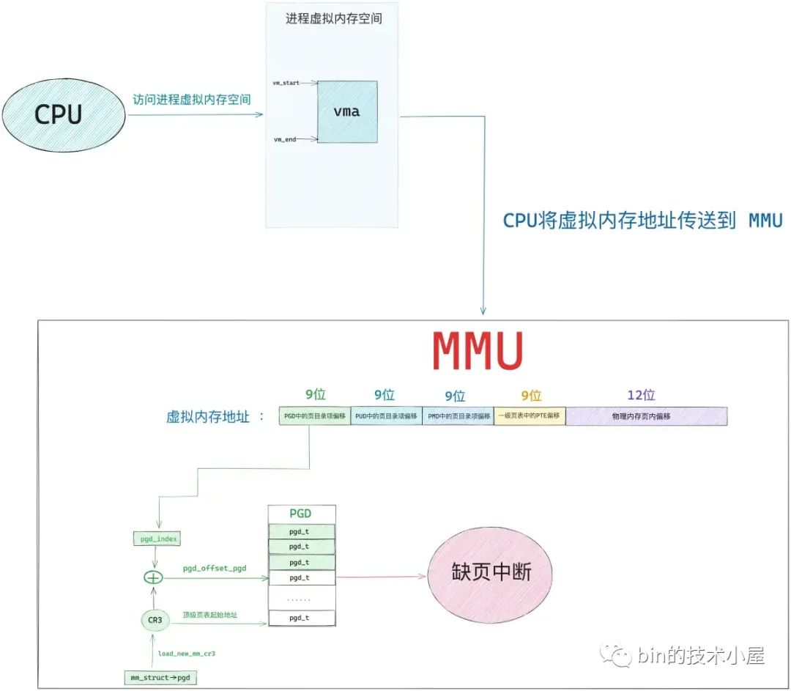

当 mmap 系统调用成功返回之后，内核只是为进程分配了一段 [vm_start , vm_end] 范围内的虚拟内存区域 vma ，由于还未与物理内存发生关联，所以此时进程页表中与 mmap 映射的虚拟内存相关的各级页目录和页表项还都是空的。当 CPU 访问这段由 mmap 映射出来的虚拟内存区域 vma 中的任意虚拟地址时，MMU 在遍历进程页表的时候就会发现，该虚拟内存地址在进程顶级页目录 PGD（Page Global Directory）中对应的页目录项 pgd_t 是空的，该 pgd_t 并没有指向其下一级页目录 PUD（Page Upper Directory）。也就是说，此时进程页表中只有一张顶级页目录表 PGD，而上层页目录 PUD（Page Upper Directory），中间页目录 PMD（Page Middle Directory），一级页表（Page Table）内核都还没有创建。

由于现在被访问到的虚拟内存地址对应的 pgd_t 是空的，进程的四级页表体系还未建立，所以 MMU 会产生一个缺页中断，进程从用户态转入内核态来处理这个缺页异常。此时 CPU 会将发生缺页异常时，进程正在使用的相关寄存器中的值压入内核栈中。比如，x86 架构下引起进程缺页异常的虚拟内存地址会被存放在 CR2 寄存器中，同时 CPU 还会将缺页异常的错误码 error_code 压入内核栈中。arm 架构下虚拟地址作为入参 addr ，异常类型保存在 ESR 寄存器中。随后内核会在 `do_page_fault` 函数中来处理缺页异常，该函数的参数都是内核在处理缺页异常的时候需要用到的基本信息：

```c
// x86
dotraplinkage void do_page_fault(struct pt_regs *regs, unsigned long error_code, unsigned long address)

// arm64
static int __kprobes do_page_fault(unsigned long addr, unsigned int esr, struct pt_regs *regs)
```


`struct pt_regs` 结构中存放的是缺页异常发生时，正在使用中的寄存器值的集合。address 表示触发缺页异常的虚拟内存地址。error_code 是对缺页异常的一个描述，目前内核只使用了 `error_code` 的前六个比特位来描述引起缺页异常的具体原因。

`P(0)` : 如果 error_code 第 0 个比特位置为 0 ，表示该缺页异常是由于 CPU 访问的这个虚拟内存地址 address 背后并没有一个物理内存页与之映射而引起的，站在进程页表的角度来说，就是 CPU 访问的这个虚拟内存地址 address 在进程四级页表体系中对应的各级页目录项或者页表项是空的（页目录项或者页表项中的 P 位为 0 ）。如果 error_code 第 0 个比特位置为 1，表示 CPU 访问的这个虚拟内存地址背后虽然有物理内存页与之映射，但是由于访问权限不够而引起的缺页异常（保护异常），比如，进程尝试对一个只读的物理内存页进行写操作，那么就会引起写保护类型的缺页异常。

`R/W(1)` : 表示引起缺页异常的访问类型。如果 error_code 第 1 个比特位置为 0，表示是由于读访问引起的。置为 1 表示是由于写访问引起的。该标志位只是为了描述是哪种访问类型造成了本次缺页异常，这个和前面提到的访问权限没有关系。比如，进程尝试对一个可写的虚拟内存页进行写入，访问权限没有问题，但是该虚拟内存页背后并未有物理内存与之关联，所以也会导致缺页异常。这种情况下，error_code 的 P 位就会设置为 0，R/W 位就会设置为 1 。

`U/S(2)`：表示缺页异常发生在用户态还是内核态，error_code 第 2 个比特位设置为 0 表示 CPU 访问内核空间的地址引起的缺页异常，设置为 1 表示 CPU 访问用户空间的地址引起的缺页异常。

`RSVD(3)`：这里用于检测页表项中的保留位（Reserved 相关的比特位）是否设置，这些页表项中的保留位都是预留给内核以后的相关功能使用的，所以在缺页的时候需要检查这些保留位是否设置，从而决定近一步的扩展处理。设置为 1 表示页表项中预留的这些比特位被使用了。设置为 0 表示页表项中预留的这些比特位还没有被使用。

`I/D(4)`：设置为 1 ，表示本次缺页异常是在 CPU 获取指令的时候引起的。

`PK(5)`：设置为 1，表示引起缺页异常的虚拟内存地址对应页表项中的 Protection 相关的比特位被设置了。

error_code 比特位的含义定义在文件 `/arch/x86/include/asm/traps.h` 中：

```c
/*
 * Page fault error code bits:
 *
 *   bit 0 ==	 0: no page found	1: protection fault
 *   bit 1 ==	 0: read access		1: write access
 *   bit 2 ==	 0: kernel-mode access	1: user-mode access
 *   bit 3 ==				1: use of reserved bit detected
 *   bit 4 ==				1: fault was an instruction fetch
 *   bit 5 ==				1: protection keys block access
 */
enum x86_pf_error_code {
	X86_PF_PROT	=		1 << 0,
	X86_PF_WRITE	=		1 << 1,
	X86_PF_USER	=		1 << 2,
	X86_PF_RSVD	=		1 << 3,
	X86_PF_INSTR	=		1 << 4,
	X86_PF_PK	=		1 << 5,
};
```

缺页中断产生的根本原因是由于 CPU 访问的这段虚拟内存背后没有物理内存与之映射，表现的具体形式主要有三种：

1. 虚拟内存对应在进程页表体系中的相关各级页目录或者页表是空的，也就是说这段虚拟内存完全没有被映射过。
2. 虚拟内存之前被映射过，其在进程页表的各级页目录以及页表中均有对应的页目录项和页表项，但是其对应的物理内存被内核 swap out 到磁盘上了。
3. 虚拟内存虽然背后映射着物理内存，但是由于对物理内存的访问权限不够而导致的保护类型的缺页中断。比如，尝试去写一个只读的物理内存页。

 p4d 的页目录用于在五级页表体系下表示四级页目录。而在四级页表体系下，这个 p4d 就不起作用了，但为了代码上的统一处理，在四级页表下，前面定位到的顶级页目录项 pgd_t 会赋值给四级页目录项 p4d_t，后续处理都会将 p4d_t 看做是顶级页目录项。

```c
typedef unsigned long	p4dval_t;
typedef struct { p4dval_t p4d; } p4d_t;

static inline p4d_t *p4d_alloc(struct mm_struct *mm, pgd_t *pgd,
		unsigned long address)
{
    // 一般情况下 pgd 不为空，且在四级页表体系下，直接返回 pgd 的地址
	return (unlikely(pgd_none(*pgd)) && __p4d_alloc(mm, pgd, address)) ?
		NULL : p4d_offset(pgd, address);
}
```

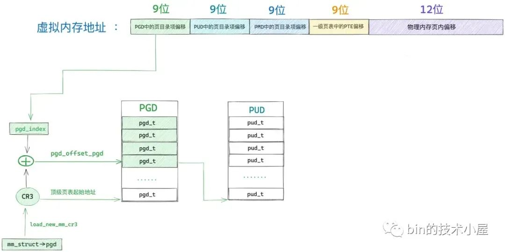

如果通过 p4d_none 函数判断出顶级页目录项 p4d 是空的，那么就需要调用 __pud_alloc 函数分配一个新的上层页目录表 PUD 出来，然后用 PUD 的起始物理内存地址以及页目录项的初始权限位 PUD_TYPE_TABLE 填充 p4d。

```c
static inline pud_t *pud_alloc(struct mm_struct *mm, p4d_t *p4d,
		unsigned long address)
{
	return (unlikely(p4d_none(*p4d)) && __pud_alloc(mm, p4d, address)) ?
		NULL : pud_offset(p4d, address);
}

/*
 * Allocate page upper directory.
 * We've already handled the fast-path in-line.
 */
int __pud_alloc(struct mm_struct *mm, p4d_t *p4d, unsigned long address)
{
    // 调用 get_zeroed_page 申请一个 4k 物理内存页并初始化为 0 值作为新的 PUD ，new 指向新分配的 PUD 起始内存地址
    pud_t *new = pud_alloc_one(mm, address);
    if (!new)
        return -ENOMEM;
    // 操作进程页表需要加锁
    spin_lock(&mm->page_table_lock);
    // 如果顶级页目录项 p4d 中的 P 比特位置为 0 表示 p4d 目前还没有指向其下一级页目录 PUD，下面需要填充 p4d
    if (!p4d_present(*p4d)) {
        /* 更新 mm->pgtables_bytes 计数，该字段用于统计进程页表所占用的字节数
         * 由于这里新增了一张 PUD 目录表，所以计数需要增加 PTRS_PER_PUD * sizeof(pud_t)
         */
        mm_inc_nr_puds(mm);
        // 将 new 指向的新分配出来的 PUD 物理内存地址以及相关属性填充到顶级页目录项 p4d 中
        p4d_populate(mm, p4d, new);
    } else  /* Another has populated it */
        // 释放新创建的 PMD
        pud_free(mm, new);

    // 释放页表锁
    spin_unlock(&mm->page_table_lock);
    return 0;
}

static inline void p4d_populate(struct mm_struct *mm, p4d_t *p4dp, pud_t *pudp)
{
	__p4d_populate(p4dp, __pa(pudp), PUD_TYPE_TABLE);
}

static inline void __p4d_populate(p4d_t *p4dp, phys_addr_t pudp, p4dval_t prot)
{
	set_p4d(p4dp, __p4d(__phys_to_p4d_val(pudp) | prot));
}

static inline void set_p4d(p4d_t *p4dp, p4d_t p4d)
{
    // 内核地址空间
	if (in_swapper_pgdir(p4dp)) {
		set_swapper_pgd((pgd_t *)p4dp, __pgd(p4d_val(p4d)));
		return;
	}

	WRITE_ONCE(*p4dp, p4d);
	dsb(ishst);
	isb();
}

/* Find an entry in the third-level page table.. */
static inline pud_t *pud_offset(p4d_t *p4d, unsigned long address)
{
	return (pud_t *)p4d_page_vaddr(*p4d) + pud_index(address);
}
```

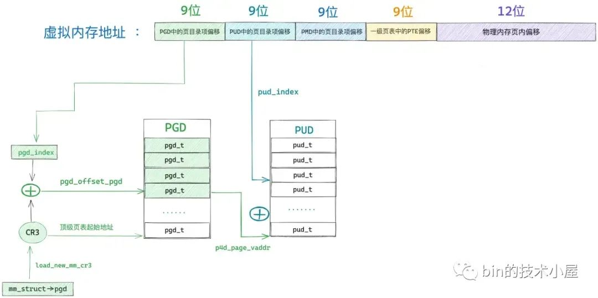

```c
static inline pmd_t *pmd_alloc(struct mm_struct *mm, pud_t *pud, unsigned long address)
{
	return (unlikely(pud_none(*pud)) && __pmd_alloc(mm, pud, address))?
		NULL: pmd_offset(pud, address);
}

/*
 * Allocate page middle directory.
 * We've already handled the fast-path in-line.
 */
int __pmd_alloc(struct mm_struct *mm, pud_t *pud, unsigned long address)
{
    // 调用 alloc_pages 从伙伴系统申请一个 4K 大小的物理内存页，作为新的 PMD
    pmd_t *new = pmd_alloc_one(mm, address);
    if (!new)
        return -ENOMEM;
    // 如果 pud 还未指向其下一级页目录 PMD，则需要初始化填充 pud
    if (!pud_present(*pud)) {
        mm_inc_nr_pmds(mm);
        // 将 new 指向的新分配出来的 PMD 物理内存地址以及相关属性填充到上层页目录项 pud 中
        pud_populate(mm, pud, new);
    } else  /* Another has populated it */
        pmd_free(mm, new);

    return 0;
}

static inline void pud_populate(struct mm_struct *mm, pud_t *pudp, pmd_t *pmdp)
{
	__pud_populate(pudp, __pa(pmdp), PMD_TYPE_TABLE);
}

static inline void __pud_populate(pud_t *pudp, phys_addr_t pmdp, pudval_t prot)
{
	set_pud(pudp, __pud(__phys_to_pud_val(pmdp) | prot));
}

static inline void set_pud(pud_t *pudp, pud_t pud)
{
#ifdef __PAGETABLE_PUD_FOLDED
	if (in_swapper_pgdir(pudp)) {
		set_swapper_pgd((pgd_t *)pudp, __pgd(pud_val(pud)));
		return;
	}
#endif /* __PAGETABLE_PUD_FOLDED */

	WRITE_ONCE(*pudp, pud);

	if (pud_valid(pud)) {
		dsb(ishst);
		isb();
	}
}

static inline pmd_t *pmd_offset(pud_t *pud, unsigned long address)
{
	return (pmd_t *)pud_page_vaddr(*pud) + pmd_index(address);
}
```

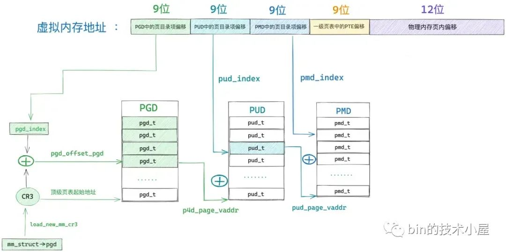

```c
static vm_fault_t __handle_mm_fault(struct vm_area_struct *vma,
        unsigned long address, unsigned int flags)
{
    // vm_fault 结构用于封装后续缺页处理用到的相关参数
    struct vm_fault vmf = {
        // 发生缺页的 vma
        .vma = vma,
        // 引起缺页的虚拟内存地址
        .address = address & PAGE_MASK,
        // 处理缺页的相关标记 FAULT_FLAG_xxx
        .flags = flags,
        // address 在 vma 中的偏移，单位也页
        .pgoff = linear_page_index(vma, address),
        // 后续用于分配物理内存使用的相关掩码 gfp_mask
        .gfp_mask = __get_fault_gfp_mask(vma),
    };
    // 获取进程虚拟内存空间
    struct mm_struct *mm = vma->vm_mm;
    // 进程页表的顶级页表地址
    pgd_t *pgd;
    // 五级页表下会使用，在四级页表下 p4d 与 pgd 的值一样
    p4d_t *p4d;
    vm_fault_t ret;
    // 获取 address 在全局页目录表 PGD 中对应的目录项 pgd
    pgd = pgd_offset(mm, address);
    // 在四级页表下，这里只是将 pgd 赋值给 p4d，后续均已 p4d 作为全局页目录项
    p4d = p4d_alloc(mm, pgd, address);
    if (!p4d)
        return VM_FAULT_OOM;
    /* 首先 p4d_none 判断全局页目录项 p4d 是否是空的
     * 如果 p4d 是空的，则调用 __pud_alloc 分配一个新的上层页目录表 PUD，然后填充 p4d
     * 如果 p4d 不是空的，则调用 pud_offset 获取 address 在上层页目录 PUD 中的目录项 pud
     */
    vmf.pud = pud_alloc(mm, p4d, address);
    if (!vmf.pud)
        return VM_FAULT_OOM;
  
    // 省略 1G 大页缺页处理
    
    /* 首先 pud_none 判断上层页目录项 pud 是不是空的
     * 如果 pud 是空的，则调用 __pmd_alloc 分配一个新的中间页目录表 PMD，然后填充 pud
     * 如果 pud 不是空的，则调用 pmd_offset 获取 address 在中间页目录 PMD 中的目录项 pmd
     */
    vmf.pmd = pmd_alloc(mm, vmf.pud, address);
    if (!vmf.pmd)
        return VM_FAULT_OOM;

    // 省略 2M 大页缺页处理

    // 进行页表的相关处理以及解析具体的缺页原因，后续针对性的进行缺页处理
    return handle_pte_fault(&vmf);
}
```

从总体上来讲引起缺页中断的原因分为两大类，一类是缺页虚拟内存地址背后映射的物理内存页不在内存中，另一类是缺页虚拟内存地址背后映射的物理内存页在内存中。下面先来看第一类，其中分为了三种缺页场景。第一种场景是，缺页虚拟内存地址 address 在进程页表中间页目录对应的页目录项 pmd_t 是空的，可以通过 pmd_none 方法来判断。这种情况表示缺页地址 address 对应的 pmd 目前还没有对应的页表，连页表都还没有，那么自然 pte 也是空的，物理内存页就更不用说了，肯定还没有。

```c
#define pmd_none(pmd)		(!pmd_val(pmd))
#define pmd_val(x)	((x).pmd)
```

第二种场景是，缺页地址 address 对应的 pmd_t 虽然不是空的，页表也存在，但是 address 对应在页表中的 pte 是空的。内核中通过 `pte_offset_map` 定位 address 在页表中的 pte 。这种情况下，虽然页表是存在的，但是 address 在页表中的 pte 是空的，和第一种场景一样，都说明了该 address 之前从来还没有被映射过。

```c
#define pte_offset_map(dir, address) pte_offset_kernel((dir), (address))

static inline pte_t *pte_offset_kernel(pmd_t *pmd, unsigned long address)
{
	return (pte_t *)pmd_page_vaddr(*pmd) + pte_index(address);
}

static inline unsigned long pte_index(unsigned long address)
{
	return (address >> PAGE_SHIFT) & (PTRS_PER_PTE - 1);
}

#define PAGE_SHIFT   12
// 页表可以容纳的页表项 pte_t 的个数
#define PTRS_PER_PTE  512
```


既然之前都没有被映射，那么现在就该把这块内容补齐。内核总共四种内存映射方式，分别为：私有匿名映射，私有文件映射，共享文件映射，共享匿名映射。这四种内存映射方式从总体上来说分为两类：一类是匿名映射，另一类是文件映射。匿名映射在分配 VMA 时，会将 `vma->vm_ops` 置为 `null` ，故可以通过此字段区分匿名映射与文件映射

```c
static inline bool vma_is_anonymous(struct vm_area_struct *vma)
{
	return !vma->vm_ops;
}
```

第三种缺页场景是，虚拟内存地址 address 在进程页表中的页表项 pte 不是空的，但是其背后映射的物理内存页被内核 swap out 到磁盘上了，CPU 访问的时候依然会产生缺页。pte 的 bit 0 用于表示该 pte 映射的物理内存页是否在内存中，值为 1 表示物理内存页在内存中驻留，值为 0 表示物理内存页不在内存中，可能被 swap 到磁盘上了。

```c
#define pte_present(pte)	(!!(pte_val(pte) & (PTE_VALID | PTE_PROT_NONE)))

#define PTE_VALID		(_AT(pteval_t, 1) << 0)
#define PTE_PROT_NONE		(_AT(pteval_t, 1) << 58) /* only when !PTE_VALID */
```


下面来看另一类别，也就是缺页虚拟内存地址背后映射的物理内存页在内存中的情况 ，这里又会近一步分为两种缺页场景。

在 NUMA 架构下，CPU 访问自己的本地内存节点是最快的，但访问其他内存节点就会慢很多，这就导致了 CPU 访问内存的速度不一致。回到缺页处理的场景中就是缺页虚拟内存地址背后映射的物理内存页虽然在内存中，但是它可能是进程所在 CPU 中的本地 NUMA 节点上的内存，也可能是其他 NUMA 节点上的内存。因为 CPU 对不同 NUMA 节点上的内存有访问速度上的差异，所以内核通常倾向于让 CPU 尽量访问本地 NUMA 节点上的内存。NUMA Balancing 机制就是用来解决这个问题的。

通俗来讲，NUMA Balancing 主要干两件事情，一件事是让内存跟着 CPU 走，另一件事是让 CPU 跟着内存走。进程申请到的物理内存页可能在当前 CPU 的本地 NUMA 节点上，也可能在其他 NUMA 节点上。所谓让内存跟着 CPU 走的意思就是，当进程访问的物理内存页不在当前 CPU 的本地 NUMA 节点上时，NUMA Balancing 就会尝试将远程 NUMA 节点上的物理内存页迁移到本地 NUMA 节点上，加快进程访问内存的速度。所谓让 CPU 跟着内存走的意思就是，当进程经常访问的大部分物理内存页均不在当前 CPU 的本地 NUMA 节点上时，NUMA Balancing 干脆就把进程重新调度到这些物理内存页所在的 NUMA 节点上。当然整个 NUMA Balancing 的过程会根据用户设置的 NUMA policy 以及各个 NUMA 节点上缺页的次数来综合考虑是否迁移内存页。

NUMA Balancing 会周期性扫描进程虚拟内存地址空间，如果发现虚拟内存背后映射的物理内存页不在当前 CPU 本地 NUMA 节点的时候，就会把对应的页表项 pte 标记为 PTE_PROT_NONE，也就是将 pte 的第 58 个 比特位置为 1，随后会将 pte 的 Present 位置为 0 。这种情况下调用 `pte_present` 依然很返回 true ，因为当前的物理内存页毕竟是在内存中的，只不过不在当前 CPU 的本地 NUMA 节点上而已。当 pte 被标记为 PTE_PROT_NONE 之后，这意味着该 pte 背后映射的物理内存页进程对其没有读写权限，也没有可执行的权限。进程在访问这段虚拟内存地址的时候就会发生缺页。当进入缺页异常的处理程序之后，内核会在 `handle_pte_fault` 函数中通过 `pte_protnone` 函数判断，缺页的 pte 是否被标记了 PTE_PROT_NONE 标识。

```c
static inline int pte_protnone(pte_t pte)
{
	return (pte_val(pte) & (PTE_VALID | PTE_PROT_NONE)) == PTE_PROT_NONE;
}
```

如果 pte 被标记了 PTE_PROT_NONE，并且对应的虚拟内存区域是一个具有读写，可执行权限的 vma。这就说明该 vma 背后映射的物理内存页不在当前 CPU 的本地 NUMA 节点上。随后就需要调用 `do_numa_page`，将这个远程 NUMA 节点上的物理内存页迁移到当前 CPU 的本地 NUMA 节点上，从而加快进程访问内存的速度。

```c
static inline bool vma_is_accessible(struct vm_area_struct *vma)
{
	return vma->vm_flags & VM_ACCESS_FLAGS;
}

/* VMA basic access permission flags */
#define VM_ACCESS_FLAGS (VM_READ | VM_WRITE | VM_EXEC)
```

NUMA Balancing 机制看起来非常好，但是同时也会为系统引入很多开销，比如，扫描进程地址空间的开销，缺页的开销，更主要的是页面迁移的开销会很大，这也会引起 CPU 有时候莫名其妙的飙到 100 %。因此一般情况下还是将 NUMA Balancing 关闭为好，除非有明确的理由开启。可以将内核参数 `/proc/sys/kernel/numa_balancing` 设置为 0 或者通过 sysctl 命令来关闭 NUMA Balancing。

```c
echo 0 > /proc/sys/kernel/numa_balancing

sysctl -w kernel.numa_balancing=0
```

第二种场景就是写时复制了（Copy On Write， COW），这种场景和 NUMA Balancing 一样，都属于缺页虚拟内存地址背后映射的物理内存页在内存中而引起的缺页中断。

COW 在内核的内存管理子系统中很常见了，比如，父进程通过 fork 系统调用创建子进程之后，父子进程的虚拟内存空间完全是一模一样的，包括父子进程的页表内容都是一样的，父子进程页表中的 PTE 均指向同一物理内存页面，此时内核会将父子进程页表中的 PTE 均改为只读的，并将父子进程共同映射的这个物理页面引用计数 + 1。当父进程或者子进程对该页面发生写操作的时候，现在假设子进程先对页面发生写操作，随后子进程发现自己页表中的 PTE 是只读的，于是产生缺页中断，子进程进入内核态，内核会在本小节介绍的缺页中断处理程序中发现，访问的这个物理页面引用计数大于 1，说明此时该物理内存页面存在多进程共享的情况，于是发生写时复制（Copy On Write， COW），内核为子进程重新分配一个新的物理页面，然后将原来物理页中的内容拷贝到新的页面中，最后子进程页表中的 PTE 指向新的物理页面并将 PTE 的 R/W 位设置为 1，原来物理页面的引用计数 - 1。后面父进程在对页面进行写操作的时候，同样也会发现父进程的页表中 PTE 是只读的，也会产生缺页中断，但是在内核的缺页中断处理程序中，发现访问的这个物理页面引用计数为 1 了，那么就只需要将父进程页表中的 PTE 的 R/W 位设置为 1 就可以了。

私有文件映射，也用到了 COW，当多个进程采用私有文件映射的方式对同一文件的同一部分进行映射的时候，后续产生的 pte 也都是只读的。当任意进程开始对它的私有文件映射区进行写操作时，就会发生写时复制，随后内核会在这里介绍的缺页中断程序中重新申请一个内存页，然后将 page cache 中的内容拷贝到这个新的内存页中，进程页表中对应的 pte 会重新关联到这个新的内存页上，此时 pte 的权限变为可写。

**在以上介绍的两种写时复制应用场景中，他们都有一个共同的特点，就是进程的虚拟内存区域 vma 的权限是可写的，但是其对应在页表中的 pte 却是只读的，而 pte 映射的物理内存页也在内存中**。

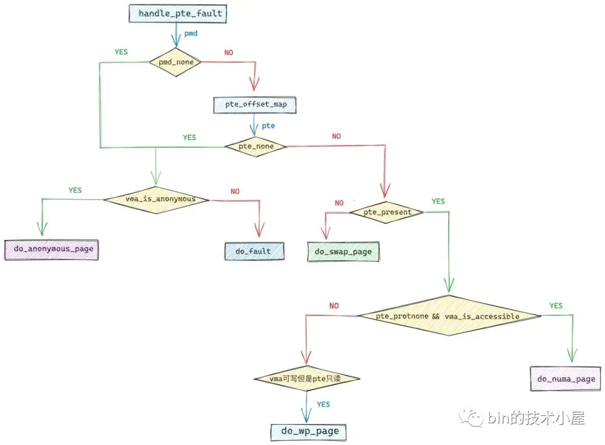

```c
static vm_fault_t handle_pte_fault(struct vm_fault *vmf)
{
    pte_t entry;

    if (unlikely(pmd_none(*vmf->pmd))) {
        // 如果 pmd 是空的，说明现在连页表都没有，页表项 pte 自然是空的
        vmf->pte = NULL;
    } else {
        /* vmf->pte 表示缺页虚拟内存地址在页表中对应的页表项 pte
         * 通过 pte_offset_map 定位到虚拟内存地址 address 对应在页表中的 pte
         * 这里根据 address 获取 pte_index，然后从 pmd 中提取页表起始虚拟内存地址相加获取 pte
         */
        vmf->pte = pte_offset_map(vmf->pmd, vmf->address);
        // vmf->orig_pte 表示发生缺页时，address 对应的 pte 值
        vmf->orig_pte = *vmf->pte;

        // 这里 pmd 不是空的，表示现在是有页表存在的，但缺页虚拟内存地址在页表中的 pte 是空值
        if (pte_none(vmf->orig_pte)) {
            pte_unmap(vmf->pte);
            vmf->pte = NULL;
        }
    }

    // pte 是空的，表示缺页地址 address 还从来没有被映射过，接下来就要处理物理内存的映射
    if (!vmf->pte) {
        // 判断缺页的虚拟内存地址 address 所在的虚拟内存区域 vma 是否是匿名映射区
        if (vma_is_anonymous(vmf->vma))
            // 处理匿名映射区发生的缺页
            return do_anonymous_page(vmf);
        else
            // 处理文件映射区发生的缺页
            return do_fault(vmf);
    }

    // 走到这里表示 pte 不是空的，但是 pte 中的 p 比特位是 0 值，表示之前映射的物理内存页已不在内存中（swap out）
    if (!pte_present(vmf->orig_pte))
        // 将之前映射的物理内存页从磁盘中重新 swap in 到内存中
        return do_swap_page(vmf);

    /* 这里表示 pte 背后映射的物理内存页在内存中，但是 NUMA Balancing 发现该内存页不在当前进程运行的 numa 节点上
     * 所以将该 pte 标记为 PTE_PROT_NONE（无读写，可执行权限）
     * 进程访问该内存页时发生缺页中断，在这里的 do_numa_page 中，内核将该 page 迁移到进程运行的 numa 节点上。
     */
    if (pte_protnone(vmf->orig_pte) && vma_is_accessible(vmf->vma))
        return do_numa_page(vmf);

    entry = vmf->orig_pte;
    // 如果本次缺页中断是由写操作引起的
    if (vmf->flags & FAULT_FLAG_WRITE) {
        // 这里说明 vma 是可写的，但是 pte 被标记为不可写，说明是写保护类型的中断
        if (!pte_write(entry))
            // 进行写时复制处理，cow 就发生在这里
            return do_wp_page(vmf);
        // 如果 pte 是可写的，就将 pte 标记为脏页
        entry = pte_mkdirty(entry);
    }
    // 将 pte 的 access 比特位置 1 ，表示该 page 是活跃的。避免被 swap 出去
    entry = pte_mkyoung(entry);

    /* 经过上面的缺页处理，这里会判断原来的页表项 entry（orig_pte） 值是否发生了变化
     * 如果发生了变化，就把 entry 更新到 vmf->pte 中。
     */
    if (ptep_set_access_flags(vmf->vma, vmf->address, vmf->pte, entry,
                vmf->flags & FAULT_FLAG_WRITE)) {
        // pte 既然变化了，则刷新 mmu （体系结构相关）
        update_mmu_cache(vmf->vma, vmf->address, vmf->pte);
    } else {
        /* 如果 pte 内容本身没有变化，则不需要刷新任何东西
         * 但是有个特殊情况就是写保护类型中断，产生的写时复制，产生了新的映射关系，需要刷新一下 tlb
		 */
		/*
		 * This is needed only for protection faults but the arch code
		 * is not yet telling us if this is a protection fault or not.
		 * This still avoids useless tlb flushes for .text page faults
		 * with threads.
		 */
        if (vmf->flags & FAULT_FLAG_WRITE)
            flush_tlb_fix_spurious_fault(vmf->vma, vmf->address);
    }

    return 0;
}
```

最后一级页表需要调用 `pte_alloc` 继续把页表补齐了。首先通过 `pmd_none` 判断缺页地址 address 在进程页表中间页目录 PMD 中对应的页目录项 pmd 是否是空的，如果 pmd 是空的，说明此时还不存在一级页表，这样一来，就需要调用 `__pte_alloc` 来分配一张页表，然后用 pte 的物理地址和初始权限位 PMD_TYPE_TABLE 来填充 pmd。

```c
#define pte_alloc(mm, pmd) (unlikely(pmd_none(*(pmd))) && __pte_alloc(mm, pmd))

int __pte_alloc(struct mm_struct *mm, pmd_t *pmd)
{
    spinlock_t *ptl;
    // 调用 get_zeroed_page 申请一个 4k 物理内存页并初始化为 0 值作为新的页表，new 指向新分配的 页表 起始内存地址
    pgtable_t new = pte_alloc_one(mm);
    if (!new)
        return -ENOMEM;
    // 锁定中间页目录项 pmd
    ptl = pmd_lock(mm, pmd);
    // 如果 pmd 是空的，说明此时 pmd 并未指向页表，下面就需要用新页表 new 来填充 pmd 
    if (likely(pmd_none(*pmd))) {  
        /* 更新 mm->pgtables_bytes 计数，该字段用于统计进程页表所占用的字节数
         * 由于这里新增了一张页表，所以计数需要增加 PTRS_PER_PTE * sizeof(pte_t)
         */
        mm_inc_nr_ptes(mm);
        // 将 new 指向的新分配出来的页表 page 的 pfn 以及相关初始权限位填充到 pmd 中
        pmd_populate(mm, pmd, new);
        new = NULL;
    }
    spin_unlock(ptl);
    return 0;
}

// 页表可以容纳的页表项 pte_t 的个数
#define PTRS_PER_PTE  512

static inline void
pmd_populate(struct mm_struct *mm, pmd_t *pmdp, pgtable_t ptep)
{
	__pmd_populate(pmdp, page_to_phys(ptep), PMD_TYPE_TABLE);
}

static inline void __pmd_populate(pmd_t *pmdp, phys_addr_t ptep,
				  pmdval_t prot)
{
	set_pmd(pmdp, __pmd(__phys_to_pmd_val(ptep) | prot));
}
```

#### 匿名页缺页


```c
#define mk_pte(page, pgprot)   pfn_pte(page_to_pfn(page), (pgprot))

static vm_fault_t do_anonymous_page(struct vm_fault *vmf)
{
    // 缺页地址 address 所在的虚拟内存区域 vma
    struct vm_area_struct *vma = vmf->vma;
    // 指向分配的物理内存页，后面与虚拟内存进行映射
    struct page *page;
    vm_fault_t ret = 0;
    // 临时的 pte 用于构建 pte 中的值，后续会赋值给 address 在页表中对应的真正 pte
    pte_t entry;

    // 如果 pmd 是空的，表示现在还没有一级页表。pte_alloc 这里会创建一级页表，并填充 pmd 中的内容 
    if (pte_alloc(vma->vm_mm, vmf->pmd))
        return VM_FAULT_OOM;
  
    // 页表创建好之后，这里从伙伴系统中分配一个 4K 物理内存页出来
    page = alloc_zeroed_user_highpage_movable(vma, vmf->address);
    if (!page)
        goto oom;
    // 将 page 的 pfn 以及相关权限标记位 vm_page_prot 初始化一个临时 pte 出来 
    entry = mk_pte(page, vma->vm_page_prot);
    // 如果 vma 是可写的，则将 pte 标记为可写，脏页。
    if (vma->vm_flags & VM_WRITE)
        entry = pte_mkwrite(pte_mkdirty(entry));
    // 锁定一级页表，并获取 address 在页表中对应的真实 pte
    vmf->pte = pte_offset_map_lock(vma->vm_mm, vmf->pmd, vmf->address,
            &vmf->ptl);
    // 是否有其他线程在并发处理缺页
    if (!pte_none(*vmf->pte))
        goto release;
    // 增加 进程 rss 相关计数，匿名内存页计数 + 1
    inc_mm_counter_fast(vma->vm_mm, MM_ANONPAGES);
    // 建立匿名页反向映射关系
    page_add_new_anon_rmap(page, vma, vmf->address, false);
    // 将匿名页添加到 LRU 链表中
    lru_cache_add_active_or_unevictable(page, vma);
setpte:
    // 将 entry 赋值给真正的 pte，这里 pte 就算被填充好了，进程页表体系也就补齐了
    set_pte_at(vma->vm_mm, vmf->address, vmf->pte, entry);
    // 刷新 mmu 
    update_mmu_cache(vma, vmf->address, vmf->pte);
unlock:
    // 解除 pte 的映射
    pte_unmap_unlock(vmf->pte, vmf->ptl);
    return ret;
release:
    // 释放 page 
    put_page(page);
    goto unlock;
oom:
    return VM_FAULT_OOM;
}
```

#### 文件页缺页

`vma->vm_ops->fault` 函数就是专门用于处理文件映射区缺页的。mmap 进行文件映射的时候只是单纯地建立了虚拟内存与文件之间的映射关系，此时并没有物理内存分配。当进程对这段文件映射区进行读取操作的时候，会触发缺页，然后分配物理内存（文件页），这一部分逻辑在下面的 `do_read_fault` 函数中完成，它主要处理的是由于对文件映射区的读取操作而引起的缺页情况。mmap 文件映射又分为私有文件映射与共享文件映射两种映射方式，而私有文件映射的核心特点是读共享的，当任意进程对私有文件映射区发生写入操作时候，就会发生写时复制 COW，这一部分逻辑在下面的 `do_cow_fault` 函数中完成。对共享文件映射区进行的写入操作而引起的缺页，内核放在 `do_shared_fault` 函数中进行处理。

```c
static vm_fault_t do_fault(struct vm_fault *vmf)
{
    struct vm_area_struct *vma = vmf->vma;
    struct mm_struct *vm_mm = vma->vm_mm;
    vm_fault_t ret;

    // 处理 vm_ops->fault 为 null 的异常情况
    if (!vma->vm_ops->fault) {
        // 如果中间页目录 pmd 指向的一级页表不在内存中，则返回 SIGBUS 错误
        if (unlikely(!pmd_present(*vmf->pmd)))
            ret = VM_FAULT_SIGBUS;
        else {
            // 获取缺页的页表项 pte
            vmf->pte = pte_offset_map_lock(vmf->vma->vm_mm,
                               vmf->pmd,
                               vmf->address,
                               &vmf->ptl);
            // pte 为空，则返回 SIGBUS 错误
            if (unlikely(pte_none(*vmf->pte)))
                ret = VM_FAULT_SIGBUS;
            else
                // pte 不为空，返回 NOPAGE，即本次缺页处理不会分配物理内存页
                ret = VM_FAULT_NOPAGE;

            pte_unmap_unlock(vmf->pte, vmf->ptl);
        }
    } else if (!(vmf->flags & FAULT_FLAG_WRITE))
        // 缺页如果是读操作引起的，进入 do_read_fault 处理
        ret = do_read_fault(vmf);
    else if (!(vma->vm_flags & VM_SHARED))
        // 缺页是由私有映射区的写入操作引起的，则进入 do_cow_fault 处理写时复制
        ret = do_cow_fault(vmf);
    else
        // 处理共享映射区的写入缺页
        ret = do_shared_fault(vmf);

    return ret;
}
```

当任意进程开始访问其地址空间中的这段虚拟内存区域 vma 时，由于背后没有对应文件页进行映射，所以会发生缺页中断，在缺页中断中内核会首先分配一个物理内存页并加入到 page cache 中，随后将映射的文件内容读取到刚刚创建出来的物理内存页中，然后将这个物理内存页映射到缺页虚拟内存地址 address 对应在进程页表中的 pte 中。

内核还会考虑到进程访问内存的空间局部性，除了会映射本次缺页需要的文件页之外，还会将其相邻的文件页读取到 page cache 中，然后将这些相邻的文件页映射到对应的 pte 中。这一部分预先提前映射的逻辑在 `map_pages` 函数中实现。如果不满足预先提前映射的条件，那么内核就只会专注处理映射本次缺页所需要的文件页。

对于私有文件映射，`do_read_fault` 函数处理就完成后，这个 pte 还是只读的，多进程之间读共享，当任意进程尝试写入的时候，会发生写时复制。

```c
static const struct vm_operations_struct ext4_file_vm_ops = {
    .fault      = ext4_filemap_fault,
    .map_pages  = filemap_map_pages,
    .page_mkwrite   = ext4_page_mkwrite,
};

static unsigned long fault_around_bytes __read_mostly =
	rounddown_pow_of_two(65536);

static vm_fault_t do_read_fault(struct vm_fault *vmf)
{
    struct vm_area_struct *vma = vmf->vma;
    vm_fault_t ret = 0;

    /* map_pages 用于提前预先映射文件页相邻的若干文件页到相关 pte 中，从而减少缺页次数
     * fault_around_bytes 控制预先映射的的字节数默认初始值为 65536（16个物理内存页）
     */
    if (vma->vm_ops->map_pages && fault_around_bytes >> PAGE_SHIFT > 1) {
        /* 这里会尝试使用 map_pages 将缺页地址 address 附近的文件页预读进 page cache
         * 然后填充相关的 pte，目的是减少缺页次数
         */
        ret = do_fault_around(vmf);
        if (ret)
            return ret;
    }

    /* 如果不满足预先映射的条件，则只映射本次需要的文件页
     * 首先会从 page cache 中读取文件页，如果 page cache 中不存在则从磁盘中读取，并预读若干文件页到 page cache 中
     */
    ret = __do_fault(vmf);     // 这里需要负责获取文件页，并不映射
    // 将本次缺页所需要的文件页映射到 pte 中。
    ret |= finish_fault(vmf);
    unlock_page(vmf->page);
    return ret;
}

static vm_fault_t do_cow_fault(struct vm_fault *vmf)
{
    struct vm_area_struct *vma = vmf->vma;
    vm_fault_t ret;
    // 从伙伴系统重新申请一个用于写时复制的物理内存页 cow_page
    vmf->cow_page = alloc_page_vma(GFP_HIGHUSER_MOVABLE, vma, vmf->address);
    // 从 page cache 读取原来的文件页
    ret = __do_fault(vmf);
    // 将原来文件页中的内容拷贝到 cow_page 中完成写时复制
    copy_user_highpage(vmf->cow_page, vmf->page, vmf->address, vma);
    // 将 cow_page 重新映射到缺页地址 address 对应在页表中的 pte 上。
    ret |= finish_fault(vmf);
    unlock_page(vmf->page);
    // 原来的文件页引用计数 - 1
    put_page(vmf->page);
    return ret;
}

/* 进程的这段虚拟文件映射区就映射到了专属的物理内存页 cow_page 上，而且内容和原来文件页 page 中的内容一模一样，
 * 进程对各自虚拟内存区的修改只能反应到各自对应的 cow_page上，而且各自的修改在进程之间是互不可见的。
 * 由于 cow_page 已经脱离了 page cache，所以这些修改也都不会回写到磁盘文件中，这就是私有文件映射的核心特点。 
 */

static vm_fault_t do_shared_fault(struct vm_fault *vmf)
{
    struct vm_area_struct *vma = vmf->vma;
    vm_fault_t ret, tmp;
    // 从 page cache 中读取文件页
    ret = __do_fault(vmf);
   
    if (vma->vm_ops->page_mkwrite) {
        unlock_page(vmf->page);
        // 将文件页变为可写状态，并为后续记录文件日志做一些准备工作
        tmp = do_page_mkwrite(vmf);
    }

    // 将文件页映射到缺页 address 在页表中对应的 pte 上
    ret |= finish_fault(vmf);

    // 将 page 标记为脏页，记录相关文件系统的日志，防止数据丢失。判断是否将脏页回写
    fault_dirty_shared_page(vma, vmf->page);
    return ret;
}

static vm_fault_t __do_fault(struct vm_fault *vmf)
{
    struct vm_area_struct *vma = vmf->vma;
    vm_fault_t ret;
    // ......
    ret = vma->vm_ops->fault(vmf);
    // ......
    return ret;
}

vm_fault_t ext4_filemap_fault(struct vm_fault *vmf)
{
    ret = filemap_fault(vmf);
    return ret;
}

static const struct address_space_operations ext4_aops = {
    .readpage       = ext4_readpage
}

vm_fault_t filemap_fault(struct vm_fault *vmf)
{
    int error;
    // 获取映射文件
    struct file *file = vmf->vma->vm_file;
    // 获取 page cache
    struct address_space *mapping = file->f_mapping;    
    // 获取映射文件的 inode
    struct inode *inode = mapping->host;
    // 获取映射文件内容在文件中的偏移
    pgoff_t offset = vmf->pgoff;
    // 从 page cache 读取到的文件页，存放在 vmf->page 中返回
    struct page *page;
    vm_fault_t ret = 0;

    // 根据文件偏移 offset，到 page cache 中查找对应的文件页
    page = find_get_page(mapping, offset);
    if (likely(page) && !(vmf->flags & FAULT_FLAG_TRIED)) {
        // 如果文件页在 page cache 中，则启动异步预读，预读后面的若干文件页到 page cache 中
        fpin = do_async_mmap_readahead(vmf, page);
    } else if (!page) {
        /* 如果文件页不在 page cache，那么就需要启动 io 从文件中读取内容到 page cahe
         * 由于涉及到了磁盘 io ，所以本次缺页类型为 VM_FAULT_MAJOR
         */
        count_vm_event(PGMAJFAULT);
        count_memcg_event_mm(vmf->vma->vm_mm, PGMAJFAULT);
        ret = VM_FAULT_MAJOR;
        /* 启动同步预读，通过 address_space_operations 中定义的 readpage 激活块设备驱动从磁盘中读取映射的文件内容
         * 将所需的文件数据读取进 page cache 中并同步预读若干相邻的文件数据到 page cache 
         */
        fpin = do_sync_mmap_readahead(vmf);
retry_find:
        // 尝试到 page cache 中重新读取文件页，这一次就可以读到了
        page = pagecache_get_page(mapping, offset,
                      FGP_CREAT|FGP_FOR_MMAP,
                      vmf->gfp_mask);
        }
    }

    // ......
	vmf->page = page;
	// ......
}
EXPORT_SYMBOL(filemap_fault);

vm_fault_t finish_fault(struct vm_fault *vmf)
{
    // 为本次缺页准备好的物理内存页，即后续需要用 pte 映射的内存页
    struct page *page;
    vm_fault_t ret = 0;

    if ((vmf->flags & FAULT_FLAG_WRITE) &&
        !(vmf->vma->vm_flags & VM_SHARED))
        // 如果是写时复制场景，那么 pte 要映射的是这个 cow 复制过来的内存页
        page = vmf->cow_page;
    else
        // 在 filemap_fault 函数中读取到的文件页，后面需要将文件页映射到 pte 中
        page = vmf->page;

    /* 对于私有映射来说，这里需要检查进程地址空间是否被标记了 MMF_UNSTABLE
     * 如果是，那么 oom 后续会回收这块地址空间，这会导致私有映射的文件页丢失
     * 所以在为私有映射建立 pte 映射之前，需要检查一下
     */
    if (!(vmf->vma->vm_flags & VM_SHARED))
        // 地址空间没有被标记 MMF_UNSTABLE 则会返回 o
        ret = check_stable_address_space(vmf->vma->vm_mm);
    if (!ret)
        // 将创建出来的物理内存页映射到 address 对应在页表中的 pte 中
        ret = alloc_set_pte(vmf, vmf->memcg, page);
    if (vmf->pte)
        // 释放页表锁
        pte_unmap_unlock(vmf->pte, vmf->ptl);
    return ret;
}

vm_fault_t alloc_set_pte(struct vm_fault *vmf, struct mem_cgroup *memcg,
        struct page *page)
{
    struct vm_area_struct *vma = vmf->vma;
    // 判断本次缺页是否是写时复制
    bool write = vmf->flags & FAULT_FLAG_WRITE;
    pte_t entry;
    vm_fault_t ret;
    // 如果页表还不存在，需要先创建一个页表出来
    if (!vmf->pte) {
        /* 如果 pmd 为空，则创建一个页表出来，并填充 pmd
         * 如果页表存在，则获取 address 在页表中对应的 pte 保存在 vmf->pte 中
         */
        ret = pte_alloc_one_map(vmf);
        if (ret)
            return ret;
    }
    /* 根据之前分配出来的内存页 pfn 以及相关页属性 vma->vm_page_prot 构造一个 pte 出来
     * 对于私有文件映射来说，这里的 pte 是只读的
     */
    entry = mk_pte(page, vma->vm_page_prot);
    // 如果是写时复制，这里才会将 pte 改为可写的
    if (write) 
        entry = maybe_mkwrite(pte_mkdirty(entry), vma);
    /* 将构造出来的 pte （entry）赋值给 address 在页表中真正对应的 vmf->pte
     * 现在进程页表体系就全部被构建出来了，文件页缺页处理到此结束
     */
    set_pte_at(vma->vm_mm, vmf->address, vmf->pte, entry);
    // 刷新 mmu
    update_mmu_cache(vma, vmf->address, vmf->pte);

    return 0;
}
```

#### 写时复制

`do_wp_page` 函数和 `do_cow_fault` 函数都是用于处理写时复制的，其最为核心的逻辑都是差不多的，只是在触发场景上会略有不同。

- `do_cow_fault` 函数主要处理的写时复制场景是，mmap 进行私有文件映射完之后，此时进程的页表或者相关页表项 pte 还是空的，就立即进行写入操作。

- `do_wp_page` 函数主要处理的写时复制场景是，访问的这块虚拟内存背后是有物理内存页映射的，对应的 pte 不为空，只不过相关 pte 的权限是只读的，而虚拟内存区域 vma 是有写权限的，在这种类型的虚拟内存进行写入操作的时候，触发的写时复制就在 `do_wp_page` 函数中处理。

  - 比如，使用 mmap 进行私有文件映射之后，此时只是分配了虚拟内存，进程页表或者相关 pte 还是空的，这时对这块映射的虚拟内存进行访问的时候就会触发缺页中断，最后在 `do_read_fault` 函数中将映射的文件内容加载到 page cache 中，pte 指向 page cache 中的文件页。但此时的 pte 是只读的，如果我们对这块映射的虚拟内存进行写入操作，就会发生写时复制，由于现在 pte 不为空，背后也映射着文件页，所以会在 `do_wp_page` 函数中进行处理。

  - 除了私有映射的文件页之外，`do_wp_page` 还会对匿名页相关的写时复制进行处理。比如，通过 fork 系统调用创建子进程的时候，内核会拷贝父进程占用的所有资源到子进程中，其中也包括了父进程的地址空间以及父进程的页表。一个进程中申请的物理内存页既会有文件页也会有匿名页，而这些文件页和匿名页既可以是私有的也可以是共享的，当内核在拷贝父进程的页表时，如果遇到私有的匿名页或者文件页，就会将其对应在父子进程页表中的 pte 设置为只读，进行写保护。并将父子进程共同引用的匿名页或者文件页的引用计数加 1。现在父子进程拥有了一模一样的地址空间，页表是一样的，页表中的 pte 均指向同一个物理内存页面，对于私有的物理内存页来说，父子进程的相关 pte 此时均变为了只读的，私有物理内存页的引用计数为 2 。而对于共享的物理内存页来说，内核就只是简单的将父进程的 pte 拷贝到子进程页表中即可，然后将子进程 pte 中的脏页标记清除，其他的不做改变。当父进程或者子进程对该页面发生写操作的时候，假设子进程先对页面发生写操作，随后子进程发现自己页表中的 pte 是只读的，于是就会产生写保护类型的缺页中断，由于子进程页表中的 pte 不为空，所以会进入到 `do_wp_page` 函数中处理。

```c
static vm_fault_t do_wp_page(struct vm_fault *vmf)
    __releases(vmf->ptl)
{
    struct vm_area_struct *vma = vmf->vma;
    // 获取 pte 映射的物理内存页
    vmf->page = vm_normal_page(vma, vmf->address, vmf->orig_pte);

    // ...... 省略处理特殊映射相关逻辑 ....
    // 物理内存页为匿名页的情况
    if (PageAnon(vmf->page)) {

        // ...... 省略处理 ksm page 相关逻辑 ....
        // reuse_swap_page 判断匿名页的引用计数是否为 1
        if (reuse_swap_page(vmf->page, &total_map_swapcount)) {
            /* 如果当前物理内存页的引用计数为 1 ，并且只有当前进程在引用该物理内存页
             * 则不做写时复制处理，而是复用当前物理内存页，只是将 pte 改为可写即可 
             */
            wp_page_reuse(vmf);
            return VM_FAULT_WRITE;
        }
        unlock_page(vmf->page);
    } else if (unlikely((vma->vm_flags & (VM_WRITE|VM_SHARED)) ==
                    (VM_WRITE|VM_SHARED))) {
        /* 处理共享可写的内存页，由于大家都可写，所以这里也只是调用 wp_page_reuse 复用当前内存页即可，不做写时复制处理
         * 由于是共享的，对于文件页来说是可以回写到磁盘上的，
         * 所以会额外调用一次 fault_dirty_shared_page 判断是否进行脏页的回写
         */
        return wp_page_shared(vmf);
    }
copy:
    /* 走到这里表示当前物理内存页的引用计数大于 1 被多个进程引用
     * 对于私有可写的虚拟内存区域来说，就要发生写时复制
     * 而对于私有文件页的情况来说，不必判断内存页的引用计数
     * 因为是私有文件页，不管文件页的引用计数是不是 1 ，都要进行写时复制
     */
    return wp_page_copy(vmf);
}

static vm_fault_t wp_page_copy(struct vm_fault *vmf)
{
    // 缺页地址 address 所在 vma
    struct vm_area_struct *vma = vmf->vma;
    // 当前进程地址空间
    struct mm_struct *mm = vma->vm_mm;
    // 原来映射的物理内存页，pte 为只读
    struct page *old_page = vmf->page;
    // 用于写时复制的新内存页
    struct page *new_page = NULL;
    // 写时复制之后，需要修改原来的 pte，这里是临时构造的一个 pte 值
    pte_t entry;
    // 是否发生写时复制
    int page_copied = 0;

    // 如果 pte 原来映射的是一个零页
    if (is_zero_pfn(pte_pfn(vmf->orig_pte))) {
        // 新申请一个零页出来，内存页中的内容被零初始化
        new_page = alloc_zeroed_user_highpage_movable(vma,
                                  vmf->address);
        if (!new_page)
            goto oom;
    } else {
        // 新申请一个物理内存页
        new_page = alloc_page_vma(GFP_HIGHUSER_MOVABLE, vma,
                vmf->address);
        if (!new_page)
            goto oom;
        // 将原来内存页 old page 中的内容拷贝到新内存页 new page 中
        cow_user_page(new_page, old_page, vmf->address, vma);
    }

    // 给页表加锁，并重新获取 address 在页表中对应的 pte
    vmf->pte = pte_offset_map_lock(mm, vmf->pmd, vmf->address, &vmf->ptl);
    // 判断加锁前的 pte （orig_pte）与加锁后的 pte （vmf->pte）是否相同，目的是判断此时是否有其他线程正在并发修改 pte 
    if (likely(pte_same(*vmf->pte, vmf->orig_pte))) {
        if (old_page) {
            // 更新进程常驻内存信息 rss_state
            if (!PageAnon(old_page)) {
                // 减少 MM_FILEPAGES 计数
                dec_mm_counter_fast(mm,
                        mm_counter_file(old_page));
                // 由于发生写时复制，这里匿名页个数加 1 
                inc_mm_counter_fast(mm, MM_ANONPAGES);
            }
        } else {
            inc_mm_counter_fast(mm, MM_ANONPAGES);
        }
        // 将旧的 tlb 缓存刷出
        flush_cache_page(vma, vmf->address, pte_pfn(vmf->orig_pte));
        // 创建一个临时的 pte 映射到新内存页 new page 上
        entry = mk_pte(new_page, vma->vm_page_prot);
        // 设置 entry 为可写的，正是这里, pte 的权限由只读变为了可写
        entry = maybe_mkwrite(pte_mkdirty(entry), vma);
        // 为新的内存页建立反向映射关系
        page_add_new_anon_rmap(new_page, vma, vmf->address, false);
        // 将新的内存页加入到 LRU active 链表中
        lru_cache_add_active_or_unevictable(new_page, vma);
        // 将 entry 值重新设置到子进程页表 pte 中
        set_pte_at_notify(mm, vmf->address, vmf->pte, entry);
        // 更新 mmu
        update_mmu_cache(vma, vmf->address, vmf->pte);
        if (old_page) {
            // 将原来的内存页从当前进程的反向映射关系中解除
            page_remove_rmap(old_page, false);
        }

        /* Free the old page.. */
        new_page = old_page;
        page_copied = 1;
    } else {
        mem_cgroup_cancel_charge(new_page, memcg, false);
    }
    // 释放页表锁
    pte_unmap_unlock(vmf->pte, vmf->ptl);

    if (old_page) {
        // 旧内存页的引用计数减 1
        put_page(old_page);
    }
    return page_copied ? VM_FAULT_WRITE : 0;
}

static inline void wp_page_reuse(struct vm_fault *vmf)
    __releases(vmf->ptl)
{
    struct vm_area_struct *vma = vmf->vma;
    struct page *page = vmf->page;
    pte_t entry;
    // 先将 tlb cache 中缓存的 address 对应的 pte 刷出缓存
    flush_cache_page(vma, vmf->address, pte_pfn(vmf->orig_pte));
    // 将原来 pte 的 access 位置 1 ，表示该 pte 映射的物理内存页是活跃的
    entry = pte_mkyoung(vmf->orig_pte);
    // 将原来只读的 pte 改为可写的，并标记为脏页
    entry = maybe_mkwrite(pte_mkdirty(entry), vma);
    // 将更新后的 entry 值设置到页表 pte 中
    if (ptep_set_access_flags(vma, vmf->address, vmf->pte, entry, 1))
        // 更新 mmu 
        update_mmu_cache(vma, vmf->address, vmf->pte);
    pte_unmap_unlock(vmf->pte, vmf->ptl);
}
```

#### swap 缺页

如果在遍历进程页表的时候发现，虚拟内存地址 address 对应的页表项 pte 不为空，但是 pte 中第 0 个比特位置为 0 ，则表示该 pte 之前是被物理内存映射过的，只不过后来被内核 swap out 出去了。当物理内存页不在内存中反而在磁盘中，就需要将物理内存页从磁盘中 swap in 进来。但在 swap in 之前内核需要知道该物理内存页的内容被保存在磁盘的什么位置上。内核会将物理内存页在磁盘上的位置保存在 pte 中。为了区别 swap 的场景，使用了一个新的结构体 `swp_entry_t` 来包装。

```c
typedef struct {
	unsigned long val;
} swp_entry_t;
```

swap in 的首要任务就是先要从进程页表中将这个 `swp_entry_t` 读取出来，然后从 `swp_entry_t` 中解析出内存页在 swap 交换区中的位置，根据磁盘位置信息将内存页的内容读取到内存中。由于产生了新的物理内存页，所以就要创建新的 pte 来映射这个物理内存页，然后将新的 pte 设置到页表中，替换原来的 `swp_entry_t`。


swap 交换区共有两种类型，一种是 swap 分区（swap partition），另一种是 swap 文件（swap file）。

- swap partition 可以认为是一个没有文件系统的裸磁盘分区，分区中的磁盘块在磁盘中是连续分布的。
- swap file 可以认为是在某个现有的文件系统上，创建的一个定长的普通文件，专门用于保存匿名页被 swap 出来的内容。背后的磁盘块是不连续的。

Linux 系统中可以允许多个这样的 swap 交换区存在，用户可以同时使用多个交换区，也可以为这些交换区指定优先级，优先级高的会被内核优先使用。这些交换区都可以被灵活地添加，删除，而不需要重启系统。多个交换区可以分散在不同的磁盘设备上，这样可以实现硬件的并行访问。在使用交换区之前，可以通过 `mkswap` 首先创建一个交换区出来，如果创建的是 swap partition，则在 `mkswap` 命令后面直接指定分区的设备文件名称即可。

```c
mkswap /dev/sdb7
```

如果创建的是 swap file，则需要额外先使用 `dd` 命令在现有文件系统中创建出一个定长的文件出来。比如下面通过 `dd` 命令从 `/dev/zero` 中拷贝创建一个 `/swapfile` 文件，大小为 4G。

```c
dd if=/dev/zero of=/swapfile bs=1M count=4096
```

然后使用 `mkswap` 命令创建 swap file ：

```c
mkswap /swapfile
```

当 swap partition 或者 swap file 创建好之后，通过 `swapon` 命令来初始化并激活这个交换区。

```c
swapon /swapfile
```

当前系统中各个交换区的情况，可以通过 `cat /proc/swaps` 或者 `swapon -s` 命令产看：


交换区在内核中使用 `struct swap_info_struct` 结构体来表示，系统中众多的交换区被组织在一个叫做 `swap_info` 的数组中，数组中的最大长度为 `MAX_SWAPFILES`，`MAX_SWAPFILES` 在内核中是一个常量，一般指定为 32，也就是说，系统中最大允许 32 个交换区存在。

```c
struct swap_info_struct *swap_info[MAX_SWAPFILES];
```

由于交换区是有优先级的，所以内核又会按照优先级高低，将交换区组织在一个叫做 `swap_avail_heads` 的双向链表中。

```c
static struct plist_head *swap_avail_heads;
```

`swap_info_struct` 结构用于描述单个交换区中的各种信息：

```c
/*
 * The in-memory structure used to track swap areas.
 */
struct swap_info_struct {
    // 用于表示该交换区的状态，比如 SWP_USED 表示正在使用状态，SWP_WRITEOK 表示交换区是可写的状态
    unsigned long   flags;      /* SWP_USED etc: see above */
    // 交换区的优先级
    signed short    prio;       /* swap priority of this type */
    // 指向该交换区在 swap_avail_heads 链表中的位置
    struct plist_node list;     /* entry in swap_active_head */
    // 该交换区在 swap_info 数组中的索引
    signed char type;       /* strange name for an index */
    // 该交换区可以容纳 swap 的匿名页总数
    unsigned int pages;     /* total of usable pages of swap */
    // 已经 swap 到该交换区的匿名页总数
    unsigned int inuse_pages;   /* number of those currently in use */
    /* 如果该交换区是 swap partition 则指向该磁盘分区的块设备结构 block_device
     * 如果该交换区是 swap file 则指向文件底层依赖的块设备结构 block_device
     */
    struct block_device *bdev;  /* swap device or bdev of swap file */
    // 指向 swap file 的 file 结构
    struct file *swap_file;     /* seldom referenced */
};
```

而在每个交换区 swap area 内部又会分为很多连续的 slot (槽)，每个 slot 的大小刚好和一个物理内存页的大小相同都是 4K，物理内存页在被 swap out 到交换区时，就会存放在 slot 中。交换区中的这些 slot 会被组织在一个叫做 `swap_map` 的数组中，数组中的索引就是 slot 在交换区中的 offset （这个位置信息很重要），数组中的值表示该 slot 总共被多少个进程同时引用。比如现在系统中一共有三个进程同时共享一个物理内存页（内存中的概念），当这个物理内存页被 swap out 到交换区上时，就变成了 slot （内存页在交换区中的概念），现在物理内存页没了，这三个共享进程就只能在各自的页表中指向这个 slot，因此该 slot 的引用计数就是 3，对应在数组 `swap_map` 中的值也是 3 。

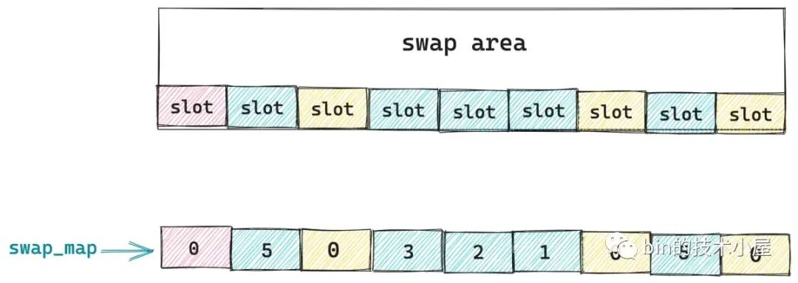

交换区中的第一个 slot 用于存储交换区的元信息，比如交换区对应底层各个磁盘块的坏块列表。因此将其标注了红色，表示不能使用。`swap_map` 数组中的值表示的就是对应 slot 被多少个进程同时引用，值为 0 表示该 slot 是空闲的，下次 swap out 的时候首先查找的就是空闲 slot 。 查找范围就是 `lowest_bit` 到 `highest_bit` 之间的 slot。当查找到空闲 slot 之后，就会将整个物理内存页回写到这个 slot 中。

```c
struct swap_info_struct {
	unsigned char *swap_map;	/* vmalloc'ed array of usage counts */
	unsigned int lowest_bit;	/* index of first free in swap_map */
	unsigned int highest_bit;	/* index of last free in swap_map */
```

但是这里会有一个问题就是交换区面向的是整个系统，而系统中会有很多进程，如果多个进程并发进行 swap 的时候，`swap_map` 数组就会面临并发操作的问题，这样一来就不得不需要一个全局锁来保护，但是这也导致了多个 CPU 只能串行访问，大大降低了并发度。优化策略是分段锁，内核会将 `swap_map` 数组中的这些 slot，按照常量 `SWAPFILE_CLUSTER` 指定的个数，256 个 slot 分为一个 cluster。

```c
#define SWAPFILE_CLUSTER	256
```

每个 cluster 中包含一把 `spinlock_t` 锁，如果 cluster 是空闲的，那么 `swap_cluster_info` 结构中的 data 指向下一个空闲的 cluster，如果 cluster 不是空闲的，那么 data 保存的是该 cluster 中已经分配的 slot 个数。

```c
struct swap_cluster_info {
    spinlock_t lock;    /*
                 * Protect swap_cluster_info fields
                 * and swap_info_struct->swap_map
                 * elements correspond to the swap
                 * cluster
                 */
    unsigned int data:24;
    unsigned int flags:8;
};
#define CLUSTER_FLAG_FREE 1 /* This cluster is free */
#define CLUSTER_FLAG_NEXT_NULL 2 /* This cluster has no next cluster */
#define CLUSTER_FLAG_HUGE 4 /* This cluster is backing a transparent huge page */
```

这样一来 `swap_map` 数组中的这些独立的 slot，就被按照以 cluster 为单位重新组织了起来，这些 cluster 被串联在 `cluster_info` 链表中。为了进一步利用 cpu cache，以及实现无锁化查找 slot，内核会给每个 cpu 分配一个 cluster —— `percpu_cluster`，cpu 直接从自己的 cluster 中查找空闲 slot，近一步提高了 swap out 的吞吐。当 cpu 自己的 `percpu_cluster` 用尽之后，内核则会调用 `swap_alloc_cluster` 函数从 `free_clusters` 中获取一个新的 cluster。

```c
struct swap_info_struct {
    struct swap_cluster_info *cluster_info; /* cluster info. Only for SSD */
    struct swap_cluster_list free_clusters; /* free clusters list */

    struct percpu_cluster __percpu *percpu_cluster; /* per cpu's swap location */
}
```

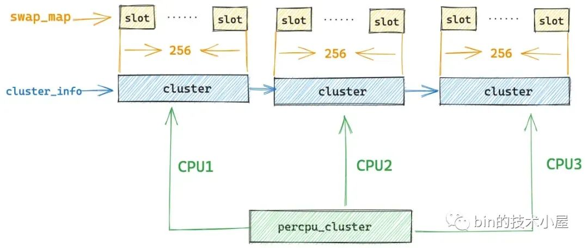

可以把交换区 `swap_info_struct` 与进程的内存空间 `mm_struct` 放到一起一对比。swap out 出来的数据要保存在真实的磁盘中，而交换区中是按照 slot 为单位进行组织管理的，磁盘中是按照磁盘块来组织管理的，大小都是 4K 。交换区中的 slot 就好比于虚拟内存空间中的虚拟内存，都是虚拟的概念，物理内存页与磁盘块才是真实本质的东西。虚拟内存是连续的，但其背后映射的物理内存可能是不连续，交换区中的 slot 也都是连续的，但磁盘中磁盘块的扇区地址却不一定是连续的。页表可以将不连续的物理内存映射到连续的虚拟内存上，内核也需要一种机制，将不连续的磁盘块映射到连续的 slot 中。当使用 `swapon` 命令来初始化激活交换区时，内核会扫描交换区中各个磁盘块的扇区地址，以确定磁盘块与扇区的对应关系，然后搜集扇区地址连续的磁盘块，将这些连续的磁盘块组成一个块组，slot 就会一个一个的映射到这些块组上，块组之间的扇区地址是不连续的，但是 slot 是连续的。slot 与连续的磁盘块组的映射关系保存在 `swap_extent` 结构中：

```c
/*
 * A swap extent maps a range of a swapfile's PAGE_SIZE pages onto a range of
 * disk blocks.  A list of swap extents maps the entire swapfile.  (Where the
 * term `swapfile' refers to either a blockdevice or an IS_REG file.  Apart
 * from setup, they're handled identically.
 *
 * We always assume that blocks are of size PAGE_SIZE.
 */
struct swap_extent {
    // 红黑树节点
    struct rb_node rb_node;
    // 块组内，第一个映射的 slot 编号
    pgoff_t start_page;
    // 映射的 slot 个数
    pgoff_t nr_pages;
    // 块组内第一个磁盘块
    sector_t start_block;
};
```

由于一个块组内的磁盘块都是连续的，slot 本来又是连续的，所以 `swap_extent` 结构中只需要保存映射到该块组内第一个 slot 的编号 `start_page`，块组内第一个磁盘块在磁盘上的块号，以及磁盘块个数就可以了。虚拟内存页类比 slot，物理内存页类比磁盘块，这里的 `swap_extent` 可以看做是虚拟内存区域 vma，进程的虚拟内存空间正是由一段一段的 vma 组成，这些 vma 被组织在一颗红黑树上。交换区也是一样，它是由一段一段的 `swap_extent` 组成，同样也会被组织在一颗红黑树上。可以通过 slot 在交换区中的 offset，在这颗红黑树中快速查找出 slot 背后对应的磁盘块。

```c
struct swap_info_struct {
	struct rb_root swap_extent_root;/* root of the swap extent rbtree */
}
```

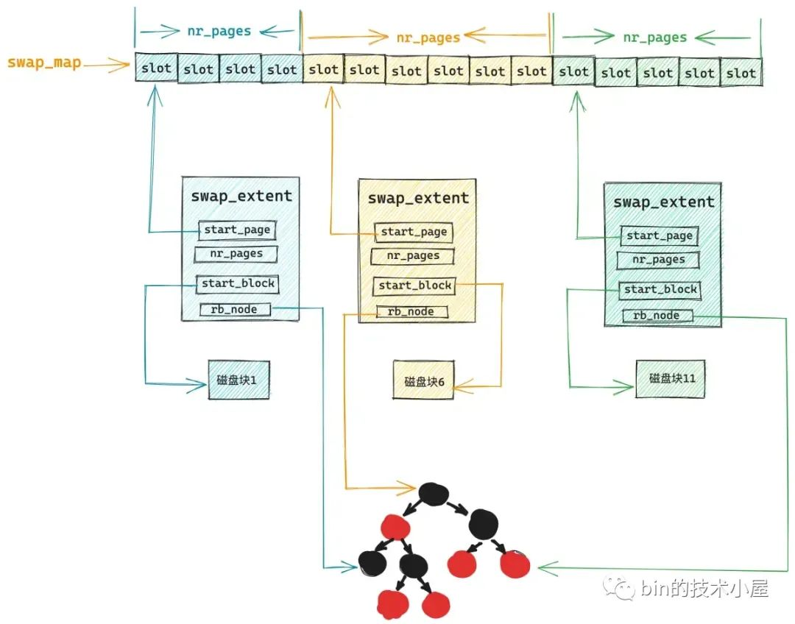

总结下来 `swp_entry_t` 中需要包含以下三种信息：

1. `swp_entry_t` 需要标识该页表项是一个 pte 还是 `swp_entry_t`，因为它俩本质上是一样的，都是 `unsigned long` 类型的无符号整数，是可以相互转换的。第 0 个比特位置 1 表示是一个 pte，背后映射的物理内存页存在于内存中。如果第 0 个比特位置 0 则表示该 pte 背后映射的物理内存页已经被 swap out 出去了，那么它就是一个 `swp_entry_t`，指向内存页在交换区中的位置。

   ```c
   #define __pte_to_swp_entry(pte)	((swp_entry_t) { pte_val(pte) })
   #define __swp_entry_to_pte(swp)	((pte_t) { (swp).val })
   ```

2. 第二，`swp_entry_t` 需要包含被 swap 出去的匿名页所在交换区的索引 type，第 2 个比特位到第 7 个比特位，总共使用 6 个比特来表示匿名页所在交换区的索引。

3. 第三，`swp_entry_t` 需要包含匿名页所在 slot 的位置 offset，第 8 个比特位到第 57 个比特位，总共 50 个比特来表示匿名页对应的 slot 在交换区的 offset 。

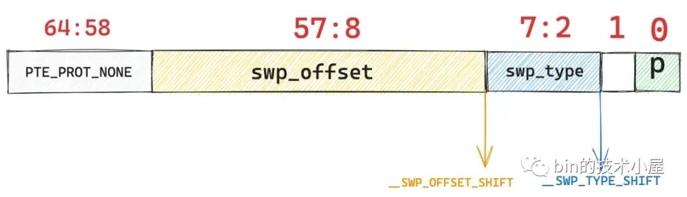

```c
/*
 * Encode and decode a swap entry:
 *	bits 0-1:	present (must be zero)
 *	bits 2-7:	swap type
 *	bits 8-57:	swap offset
 *	bit  58:	PTE_PROT_NONE (must be zero)
 */
#define __SWP_TYPE_SHIFT	2
#define __SWP_TYPE_BITS		6
#define __SWP_OFFSET_BITS	50
#define __SWP_OFFSET_SHIFT	(__SWP_TYPE_BITS + __SWP_TYPE_SHIFT)
```

内核提供了宏 `__swp_type` 用于从 `swp_entry_t` 中将匿名页所在交换区编号提取出来，还提供了宏 `__swp_offset` 用于从 `swp_entry_t` 中将匿名页所在 slot 的 offset 提取出来。

```c
#define __swp_type(x)		(((x).val >> __SWP_TYPE_SHIFT) & __SWP_TYPE_MASK)
#define __swp_offset(x)		(((x).val >> __SWP_OFFSET_SHIFT) & __SWP_OFFSET_MASK)

#define __SWP_TYPE_MASK		((1 << __SWP_TYPE_BITS) - 1)
#define __SWP_OFFSET_MASK	((1UL << __SWP_OFFSET_BITS) - 1)
```

有了这两个宏之后，就可以根据 `swp_entry_t` 轻松地定位到匿名页在交换区中的位置了。内核首先会通过 `swp_type` 从 `swp_entry_t`提取出匿名页所在的交换区索引 type，根据 type 就可以从 `swap_info` 数组中定位到交换区数据结构 `swap_info_struct` 。内核将定位交换区 `swap_info_struct` 结构的逻辑封装在 `swp_swap_info` 函数中：

```c
struct swap_info_struct *swp_swap_info(swp_entry_t entry)
{
	return swap_type_to_swap_info(swp_type(entry));
}

static struct swap_info_struct *swap_type_to_swap_info(int type)
{
	return READ_ONCE(swap_info[type]);
}
```

最后通过 `swp_offset` 定位匿名页所在 slot 在交换区中的 offset， 然后利用 offset 在红黑树 `swap_extent_root` 中查找其对应的 swap_extent。

```c
static sector_t map_swap_entry(swp_entry_t entry, struct block_device **bdev)
{
    struct swap_info_struct *sis;
    struct swap_extent *se;
    pgoff_t offset;
    // 通过 swap_info[swp_type(entry)]  获取交换区 swap_info_struct 结构
    sis = swp_swap_info(entry);
    // 获取交换区所在磁盘分区块设备
    *bdev = sis->bdev;
    // 获取匿名页在交换区的偏移 
    offset = swp_offset(entry);
    // 通过 offset 到红黑树 swap_extent_root 中查找对应的 swap_extent
    se = offset_to_swap_extent(sis, offset);
    // 获取 slot 对应的磁盘块
    return se->start_block + (offset - se->start_page);
}
```

而 swap partition 是一个没有文件系统的裸磁盘分区，其背后的磁盘块都是连续分布的，所以对于 swap partition 来说，slot 与磁盘块是直接映射的，获取到 slot 的 offset 之后，在乘以一个固定的偏移 `2 ^ PAGE_SHIFT - 9` 跳过用于存储交换区元信息的 swap header ，就可以直接获得磁盘块了。这里与内核虚拟内存空间中的直接映射区相似，虚拟内存与物理内存都是直接映射的，通过虚拟内存地址减去一个固定的偏移直接就可以获得物理内存地址了。

```c
static sector_t swap_page_sector(struct page *page)
{
    return (sector_t)__page_file_index(page) << (PAGE_SHIFT - 9);
}

pgoff_t __page_file_index(struct page *page)
{
    // 在 swap 场景中，swp_entry_t 的值会设置到 page 结构中的 private 字段中
    swp_entry_t swap = { .val = page_private(page) };
    return swp_offset(swap);
}
```

以上是内核在 swap file 和 swap partition 场景下，如何获取 slot 对应的磁盘块 `sector_t` 的逻辑与实现。有了 `sector_t`，内核接着就会利用 `bdev_read_page` 函数将 slot 对应在 sector 中的内容读取到物理内存页 page 中，这就是整个 swap in 的过程。

```c
/**
 * bdev_read_page() - Start reading a page from a block device
 * @bdev: The device to read the page from
 * @sector: The offset on the device to read the page to (need not be aligned)
 * @page: The page to read
 */
int bdev_read_page(struct block_device *bdev, sector_t sector,
			struct page *page)

int swap_readpage(struct page *page, bool synchronous)
{
    struct bio *bio;
    int ret = 0;
    struct swap_info_struct *sis = page_swap_info(page);
    blk_qc_t qc;
    struct gendisk *disk;
    // 处理交换区是 swap file 的情况
    if (sis->flags & SWP_FS) {
        // 从交换区中获取交换文件 swap_file
        struct file *swap_file = sis->swap_file;
        // swap_file 本质上还是文件系统中的一个文件，所以它也会有 page cache
        struct address_space *mapping = swap_file->f_mapping;
        /* 利用 page cache 中的 readpage 方法，从 swap_file 所在的文件系统中读取匿名页内容到 page 中。
         * 注意这里只是利用 page cache 的 readpage 方法从文件系统中读取数据，内核并不会把 page 加入到 page cache 中
         * 这里 swap_file 和普通文件的读取过程是不一样的，page cache 不缓存内存页。
         * 对于 swap out 的场景来说，内核也只是利用 page cache 的 writepage 方法将匿名页的内容写入到 swap_file 中。
         */
        ret = mapping->a_ops->readpage(swap_file, page);
        if (!ret)
            count_vm_event(PSWPIN);
        return ret;
    }

    /* 如果交换区是 swap partition，则直接从磁盘块中读取
     * 对于 swap out 的场景，内核调用 bdev_write_page，直接将匿名页的内容写入到磁盘块中
     */
    ret = bdev_read_page(sis->bdev, swap_page_sector(page), page);

out:
    return ret;
}
```

`swap_readpage` 是内核 swap 机制的最底层实现，直接和磁盘打交道，负责搭建磁盘与内存之间的桥梁。虽然直接调用 `swap_readpage` 可以基本完成 swap in 的目的，但在某些特殊情况下会导致 swap 的性能非常糟糕。比如下图所示，假设当前系统中存在三个进程，它们共享引用了同一个物理内存页 page。


当这个被共享的 page 被内核 swap out 到交换区之后，三个共享进程的页表会发生如下变化：

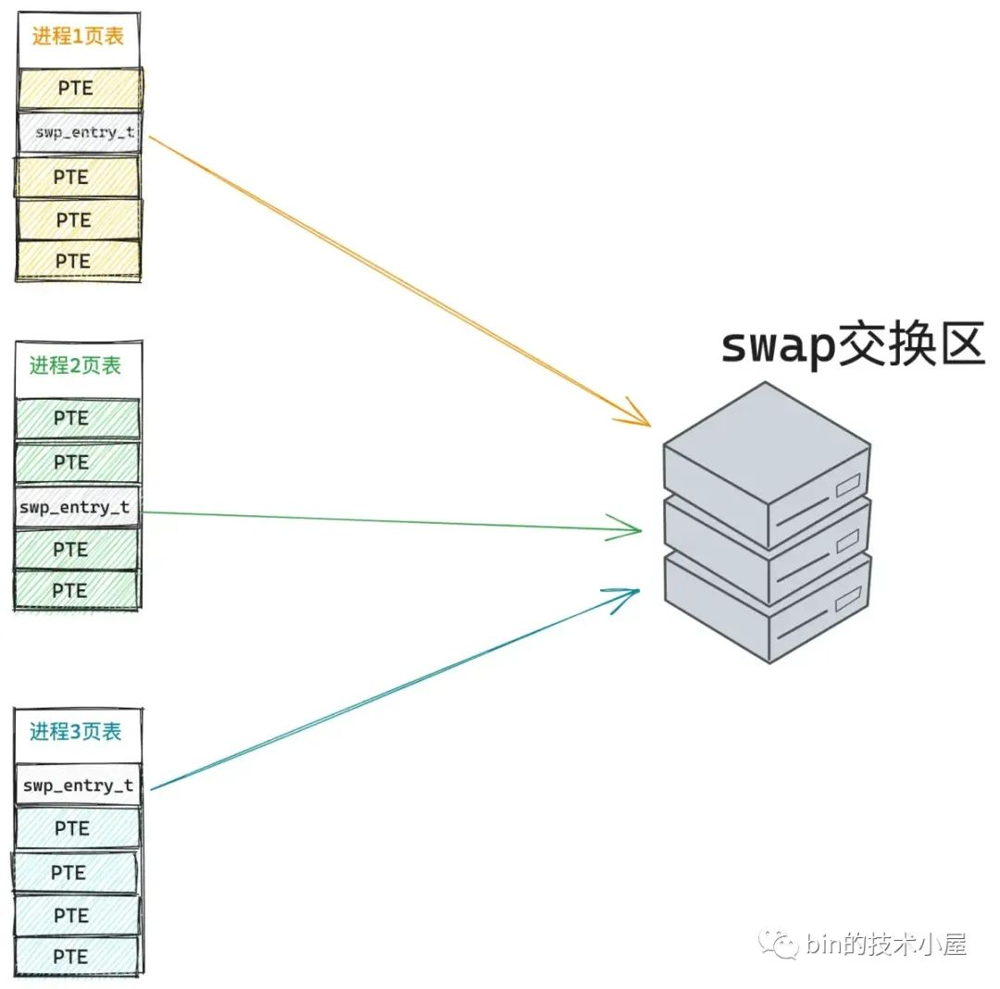

当 进程1 开始读取这个共享 page 的时候，由于 page 已经 swap out 到交换区了，所以会发生 swap 缺页异常，进入内核通过 `swap_readpage` 将共享 page 的内容从磁盘中读取进内存，此时三个进程的页表结构变为下图所示：

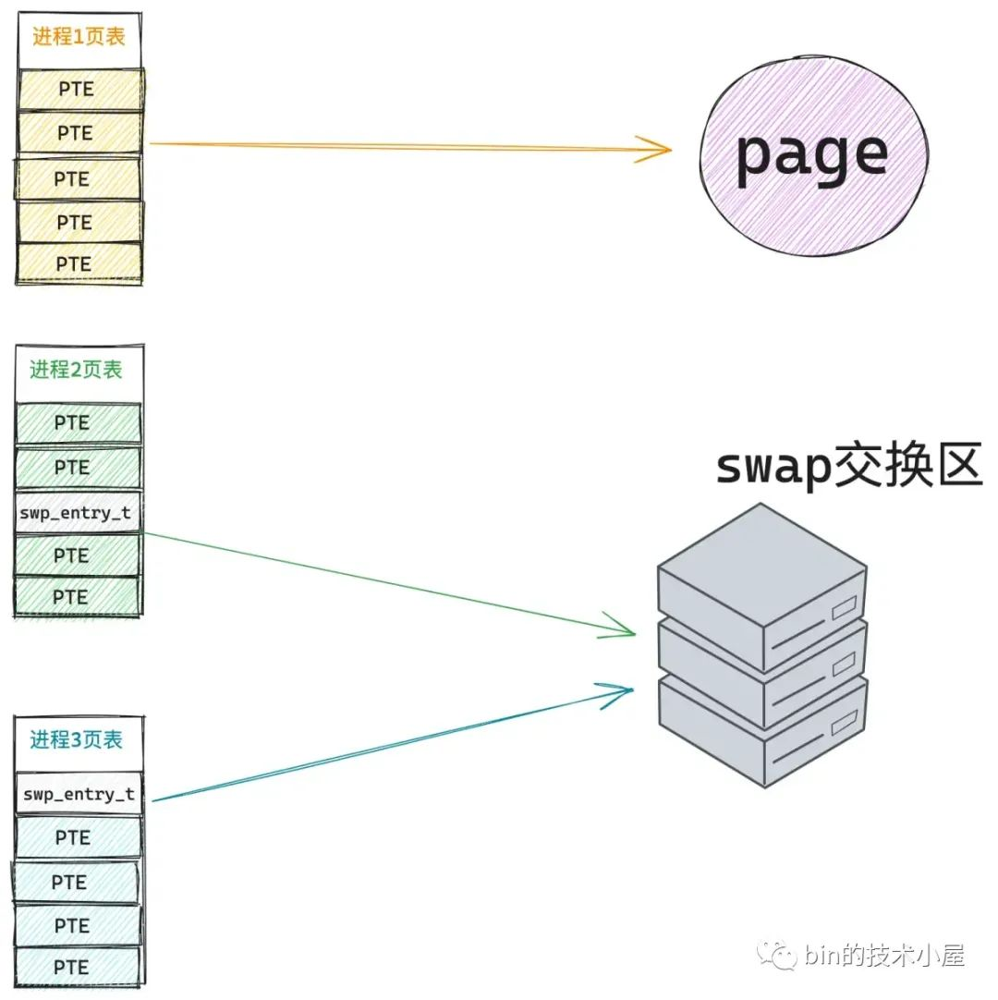

现在共享 page 已经被 进程1 swap in 进来了，但是 进程2 和 进程 3 是不知道的，它们的页表中还储存的是 `swp_entry_t`，依然指向 page 所在交换区的位置。按照之前的逻辑，当 进程2 以及 进程3 开始读取这个共享 page 的时候，其实 page 已经在内存了，但是它们此刻感知不到，因为 进程2 和 进程3 的页表中存储的依然是 `swp_entry_t`，还是会产生 swap 缺页中断，重新通过 `swap_readpage` 读取交换区中的内容，这样一来就产生了额外重复的磁盘 IO。除此之外，更加严重的是，由于 进程2 和 进程3 的 swap 缺页，又会产生两个新的内存页用来存放从 `swap_readpage` 中读取进来的交换区数据。产生了重复的磁盘 IO 不说，还产生了额外的内存消耗，并且这样一来，三个进程对内存页就不是共享的了。

还有一种极端场景是一个进程试图读取一个正在被 swap out 的 page ，由于 page 正在被内核 swap out，此时进程页表指向该 page 的 pte 已经变成了 `swp_entry_t`。进程在这个时候访问 page 的时候，还是会产生 swap 缺页异常，进程试图 swap in 这个正在被内核 swap out 的 page，但是此时 page 仍然还在内存中，只不过是正在被内核刷盘。而按照之前的 swap in 逻辑，进程这里会调用 `swap_readpage` 从磁盘中读取，产生额外的磁盘 IO 以及内存消耗不说，关键是此刻 swap_readpage 出来的数据都不是完整的，这肯定是个大问题。

内核为了解决上面提到的这些问题，因此引入了一个新的结构 —— swap cache 。有了 swap cache 之后，情况就会变得大不相同，回过头来看第一个问题 —— 多进程共享内存页。进程1 在 swap in 的时候首先会到 swap cache 中去查找，看看是否有其他进程已经把内存页 swap in 进来了，如果 swap cache 中没有才会调用 `swap_readpage` 从磁盘中去读取。当内核通过 `swap_readpage` 将内存页中的内容从磁盘中读取进内存之后，内核会把这个匿名页先放入 swap cache 中。进程 1 的页表将原来的 `swp_entry_t` 填充为 pte 并指向 swap cache 中的这个内存页。

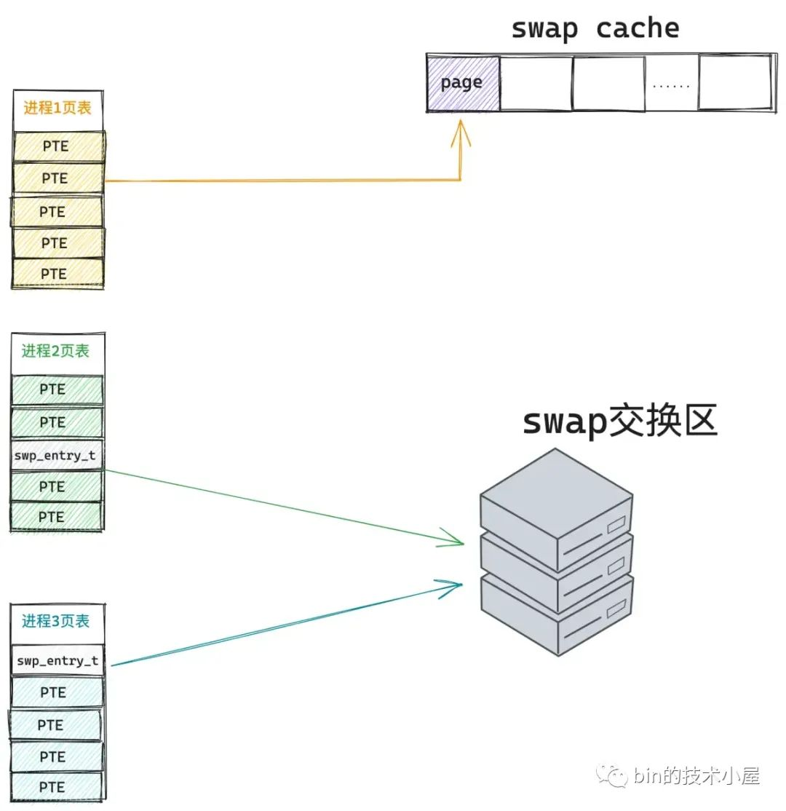

由于进程1 页表中对应的页表项现在已经从 `swp_entry_t` 变为 pte 了，指向的是 swap cache 中的内存页而不是 swap 交换区，所以对应 slot 的引用计数就要减 1 。即 slot 在 `swap_map` 数组中保存的引用计数从 3 变成了 2 。表示还有两个进程也就是 进程2 和 进程3 仍在继续引用这个 slot 。当进程2 发生 swap 缺页中断的时候进入内核之后，也是首先会到 swap cache 中查找是否现在已经有其他进程把共享的内存页 swap in 进来了，内存页 page 在 swap cache 的索引就是页表中的 `swp_entry_t`。由于这三个进程共享的同一个内存页，所以三个进程页表中的 `swp_entry_t` 都是相同的，都是指向交换区的同一位置。由于共享内存页现在已经被 进程1 swap in 进来了，并存放在 swap cache 中，所以 进程2 通过 `swp_entry_t` 一下就在 swap cache 中找到了，同理，进程 2 的页表也会将原来的 `swp_entry_t` 填充为 pte 并指向 swap cache 中的这个内存页。slot 的引用计数减 1。

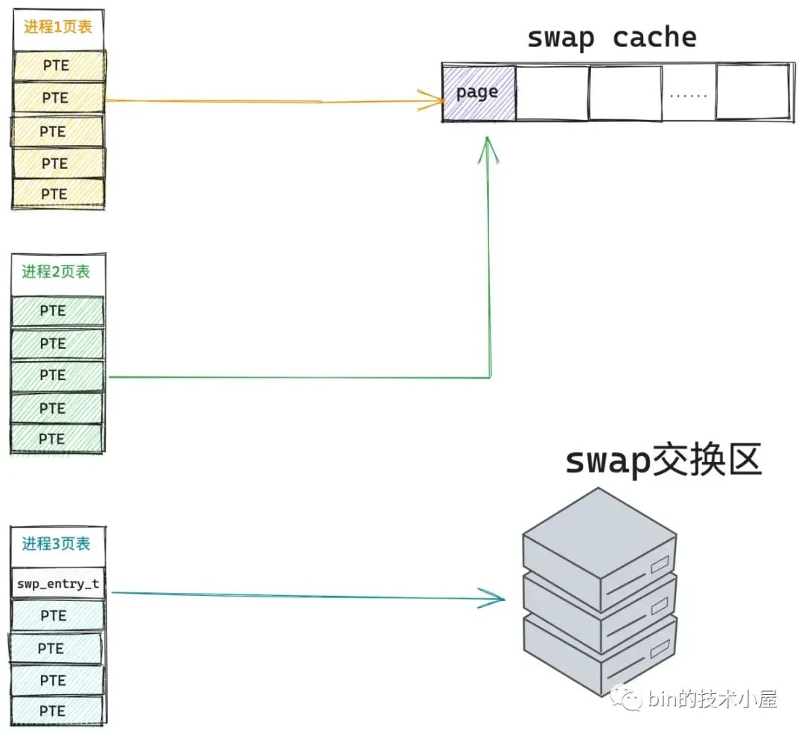

现在这个 slot 在 `swap_map` 数组中保存的引用计数从 2 变成了 1 。表示只有 进程3 在引用这个 slot 了。当 进程3 发生 swap 缺页中断的之后，内核还是先通过 `swp_entry_t` 到 swap cache 中去查找，找到之后，将 进程 3 页表原来的 `swp_entry_t` 填充为 pte 并指向 swap cache 中的这个内存页，slot 的引用计数减 1。现在 slot 的引用计数已经变为 0 了，这意味着所有共享该内存页的进程已经全部知道了新内存页的地址，它们的 pte 已经全部指向了新内存页，不在指向 slot 了，此时内核便将这个内存页从 swap cache 中移除。

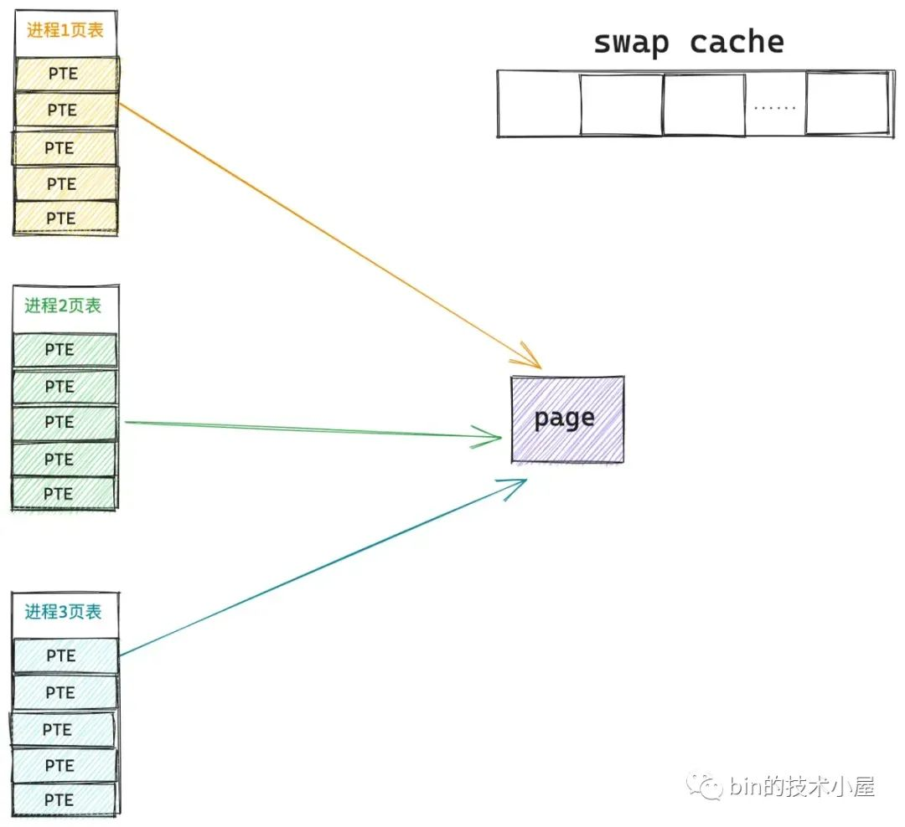

针对第二个问题 —— 进程试图 swap in 这个正在被内核 swap out 的 page，内核的处理方法也是一样，内核在 swap out 的时候首先会在交换区中为这个 page 分配 slot 确定其在交换区的位置，然后通过匿名页反向映射机制找到所有引用该内存页的进程，将它们页表中的 pte 修改为指向 slot 的 `swp_entry_t`。然后将匿名页 page 先是放入到 swap cache 中，慢慢地通过 `swap_writepage` 回写。当匿名页被完全回写到交换区中时，内核才会将 page 从 swap cache 中移除。如果当内核正在回写的过程中，不巧有一个进程又要访问该内存页，同样也会发生 swap 缺页中断，但是由于此时没有回写完成，内存页还保存在 swap cache 中，内核通过进程页表中的 `swp_entry_t` 一下就在 swap cache 中找到了，避免了再次发生磁盘 IO，后面的过程就和第一个问题一样了。

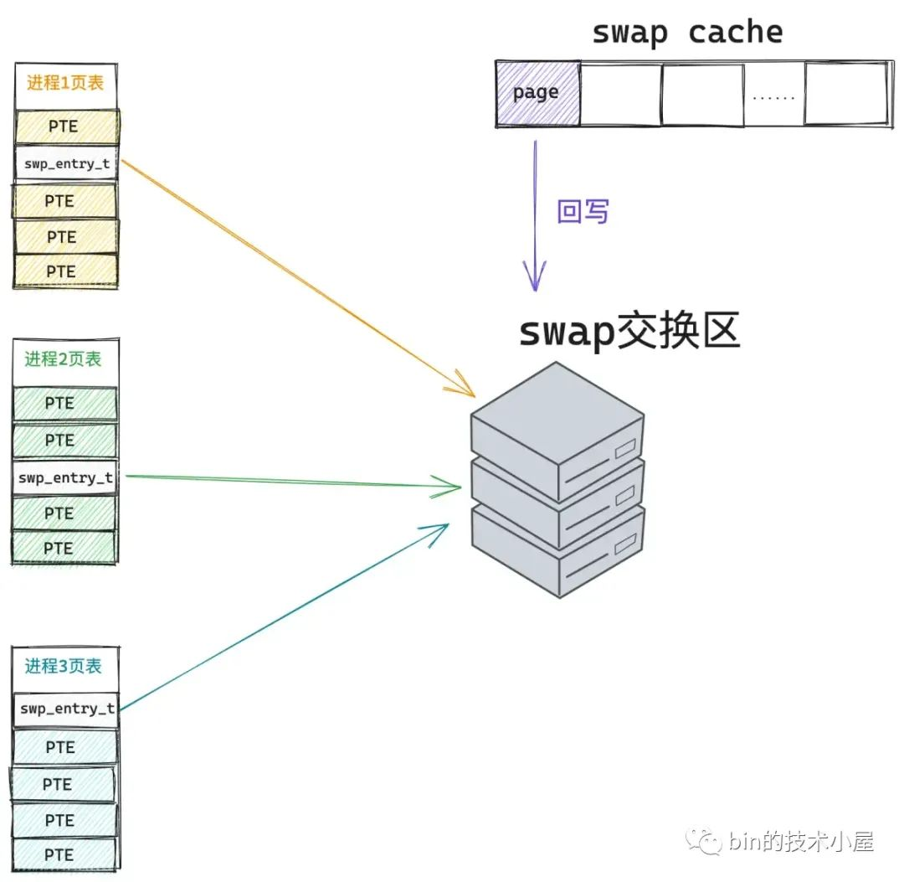

上述查找 swap cache 的过程。内核封装在 `__read_swap_cache_async` 函数里，在 swap in 的过程中，内核会首先调用这里查看 swap cache 是否已经缓存了内存页，如果没有，则新分配一个内存页并加入到 swap cache 中，最后才会调用 `swap_readpage` 从磁盘中将所需内容读取到新内存页中。

```c
struct page *__read_swap_cache_async(swp_entry_t entry, gfp_t gfp_mask,
            struct vm_area_struct *vma, unsigned long addr,
            bool *new_page_allocated)
{
    struct page *found_page = NULL, *new_page = NULL;
    struct swap_info_struct *si;
    int err;
    // 是否分配新的内存页，如果内存页已经在 swap cache 中则无需分配
    *new_page_allocated = false;

    do {
        // 获取交换区结构 swap_info_struct
        si = get_swap_device(entry);
        // 首先根据 swp_entry_t 到 swap cache 中查找，内存页是否已经被其他进程 swap in 进来了
        found_page = find_get_page(swap_address_space(entry),
                       swp_offset(entry));
        // swap cache 已经缓存了，就直接返回，不必启动磁盘 IO
        if (found_page)
            break;
        // 如果 swap cache 中没有，则需要新分配一个内存页用来存储从交换区中 swap in 进来的内容
        if (!new_page) {
            new_page = alloc_page_vma(gfp_mask, vma, addr);
            if (!new_page)
                break;      /* Out of memory */
        }
        // swap 没有完成时，内存页需要加锁，禁止访问
        __SetPageLocked(new_page);
        __SetPageSwapBacked(new_page);
        // 将新的内存页先放入 swap cache 中，在这里会将 swp_entry_t 设置到 page 结构的 private 属性中
        err = add_to_swap_cache(new_page, entry, gfp_mask & GFP_KERNEL);
    } while (err != -ENOMEM);

    return found_page;
}
```

内核会为系统中每一个交换区分配一个 swap cache，被内核组织在一个叫做 `swapper_spaces` 的数组中。交换区的 swap cache 在 `swapper_spaces` 数组中的索引也是 `swp_entry_t` 中存储的 type 信息，通过 `swp_type` 来提取。

```c
// 一个交换区对应一个 swap cache，与 swap_info 是一一对应关系
struct address_space *swapper_spaces[MAX_SWAPFILES] __read_mostly;
```

交换区的 swap cache 和文件的 page cache 一样，都是 `address_space` 结构来描述的，而对于 swap file 来说，因为它本质上是文件系统里的一个文件，所以 swap file 既有 swap cache 也有 page cache 。这里要区分 swap file 的 swap cache 和 page cache，swap file 的 page cache 在 swap 的场景中是不会缓存内存页的，内核只是利用 page cache 相关的操作函数  `address_space->a_ops` ，从 swap file 所在的文件系统中读取或者写入匿名页，匿名页是不会加入到 page cache 中的。而交换区是针对整个系统来说的，系统中会存在很多进程，当发生 swap 的时候，系统中的这些进程会对同一个 swap cache 进行争抢，所以为了近一步提高 swap 的并行度，内核会将一个交换区中的 swap cache 分裂多个出来，将竞争的压力分散开来。这样一来，一个交换就演变出多个 swap cache 出来，`swapper_spaces` 数组其实是一个 `address_space` 结构的二维数组。每个 swap cache 能够管理的匿名页个数为 `2^SWAP_ADDRESS_SPACE_SHIFT` 个，涉及到的内存大小为 `4K * SWAP_ADDRESS_SPACE_PAGES` — 64M。

```c
/* One swap address space for each 64M swap space */
#define SWAP_ADDRESS_SPACE_SHIFT	14
#define SWAP_ADDRESS_SPACE_PAGES	(1 << SWAP_ADDRESS_SPACE_SHIFT)
```

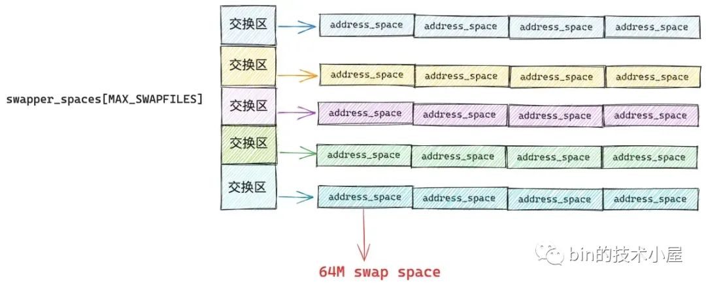

通过一个给定的 `swp_entry_t` 查找对应的 swap cache 的逻辑，内核定义在 `swap_address_space` 宏中。

1. 首先内核通过 `swp_type` 提取交换区在 `swapper_spaces` 数组中的索引（一维索引）。
2. 通过 `swp_offset >> SWAP_ADDRESS_SPACE_SHIFT`（二维索引），定位 slot 具体归哪一个 swap cache 管理。

```c
#define swap_address_space(entry)			    \
	(&swapper_spaces[swp_type(entry)][swp_offset(entry) \
		>> SWAP_ADDRESS_SPACE_SHIFT])

struct page * lookup_swap_cache(swp_entry_t entry)  
{          
    struct swap_info_struct *si = get_swap_device(entry);
    // 通过 swp_entry_t 定位 swap cache，根据 swp_offset 在 swap cache 中查找内存页
    page = find_get_page(swap_address_space(entry), swp_offset(entry));        
    return page;  
}
```

当通过 `swapon` 命令来初始化并激活一个交换区的时候，内核会在 `init_swap_address_space` 函数中为交换区初始化 swap cache。

```c
int init_swap_address_space(unsigned int type, unsigned long nr_pages)
{
    struct address_space *spaces, *space;
    unsigned int i, nr;
    // 计算交换区包含的 swap cache 个数
    nr = DIV_ROUND_UP(nr_pages, SWAP_ADDRESS_SPACE_PAGES);
    // 为交换区分配 address_space 数组，用于存放多个 swap cache
    spaces = kvcalloc(nr, sizeof(struct address_space), GFP_KERNEL);
    // 挨个初始化交换区中的 swap cache
    for (i = 0; i < nr; i++) {
        space = spaces + i;
        // 将 a_ops 指定为 swap_aops
        space->a_ops = &swap_aops;
        /* swap cache doesn't use writeback related tags */
        // swap cache 不会回写
        mapping_set_no_writeback_tags(space);
    }
    // 保存交换区中的 swap cache 个数
    nr_swapper_spaces[type] = nr;
    // 将初始化好的 address_space 数组放入 swapper_spaces 数组中（二维数组）
    swapper_spaces[type] = spaces;

    return 0;
}

// 交换区中的 swap cache 个数
static unsigned int nr_swapper_spaces[MAX_SWAPFILES] __read_mostly;

struct address_space *swapper_spaces[MAX_SWAPFILES] __read_mostly;

// 对于 swap cache 来说，内核会将 address_space-> a_ops 初始化为 swap_aops。
static const struct address_space_operations swap_aops = {
	.writepage	= swap_writepage,
	.set_page_dirty	= swap_set_page_dirty,
#ifdef CONFIG_MIGRATION
	.migratepage	= migrate_page,
#endif
};
```

完整的 swap 流程还需要考虑内存访问的空间局部性原理。当进程访问某一段内存的时候，在不久之后，其附近的内存地址也将被访问。即当进程地址空间中的某一个虚拟内存地址 address 被访问之后，那么其周围的虚拟内存地址在不久之后，也会被进程访问。而那些相邻的虚拟内存地址，在进程页表中对应的页表项也都是相邻的，当处理完了缺页地址 address 的 swap 缺页异常之后，如果其相邻的页表项均是 `swp_entry_t`，那么这些相邻的 `swp_entry_t` 所指向交换区的内容也需要被内核预读进内存中。这样一来，当 address 附近的虚拟内存地址发生 swap 缺页的时候，内核就可以直接从 swap cache 中读到了，避免了磁盘 IO，使得 swap in 可以快速完成，这里和文件的预读机制有点类似。swap 预读在 Linux 内核中由 `swapin_readahead` 函数负责，它有两种实现方式：

- 第一种是根据缺页地址 address 周围的虚拟内存地址进行预读，但前提是它们必须属于同一个 vma，这个逻辑在 `swap_vma_readahead` 函数中完成。
- 第二种是根据内存页在交换区中周围的磁盘地址进行预读，但前提是它们必须属于同一个交换区，这个逻辑在 `swap_cluster_readahead` 函数中完成。

```c
struct page *swapin_readahead(swp_entry_t entry, gfp_t gfp_mask,
                struct vm_fault *vmf)
{
    return swap_use_vma_readahead() ?
            swap_vma_readahead(entry, gfp_mask, vmf) :
            swap_cluster_readahead(entry, gfp_mask, vmf);
}
```

在函数 `swap_vma_readahead` 的开始，内核首先调用 `swap_ra_info` 方法来计算本次需要预读的页表项集合。预读的最大页表项个数由 `page_cluster` 决定，但最大不能超过 `2 ^ SWAP_RA_ORDER_CEILING`。`page_cluster` 的值可以通过内核参数 `/proc/sys/vm/page-cluster` 来调整，默认值为 3，可以通过设置 `page_cluster = 0`来禁止 swap 预读。

```c
#ifdef CONFIG_64BIT
#define SWAP_RA_ORDER_CEILING	5
// 最大预读窗口
max_win = 1 << min_t(unsigned int, READ_ONCE(page_cluster),
			     SWAP_RA_ORDER_CEILING);
```

当要 swap in 的内存页在交换区的位置已经接近末尾了，则需要减少预读页的个数，防止预读超出交换区的边界。如果预读的页表项不是 `swp_entry_t`，则说明该页表项是一个空的还没有进行过映射或者页表项指向的内存页还在内存中，这种情况下则跳过，继续预读后面的 `swp_entry_t`。

```c
/**
 * swap_vma_readahead - swap in pages in hope we need them soon
 * @entry: swap entry of this memory
 * @gfp_mask: memory allocation flags
 * @vmf: fault information
 *
 * Returns the struct page for entry and addr, after queueing swapin.
 *
 * Primitive swap readahead code. We simply read in a few pages whoes
 * virtual addresses are around the fault address in the same vma.
 *
 * Caller must hold read mmap_sem if vmf->vma is not NULL.
 *
 */
static struct page *swap_vma_readahead(swp_entry_t fentry, gfp_t gfp_mask,
                       struct vm_fault *vmf)
{
    struct vm_area_struct *vma = vmf->vma;
    struct vma_swap_readahead ra_info = {0,};
    // 获取本次要进行预读的页表项
    swap_ra_info(vmf, &ra_info);
    // 遍历预读窗口 ra_info 中的页表项，挨个进行预读
    for (i = 0, pte = ra_info.ptes; i < ra_info.nr_pte;
         i++, pte++) {
        // 获取要进行预读的页表项
        pentry = *pte;
        // 页表项为空，表示还未进行内存映射，直接跳过
        if (pte_none(pentry))
            continue;
        // 页表项指向的内存页仍然在内存中，跳过
        if (pte_present(pentry))
            continue;
        // 将 pte 转换为 swp_entry_t
        entry = pte_to_swp_entry(pentry);
        if (unlikely(non_swap_entry(entry)))
            continue;
        /* 利用 swp_entry_t 先到 swap cache 中去查找
         * 如果没有，则新分配一个内存页并添加到 swap cache 中，这种情况下 page_allocated = true
         * 如果有，则直接从swap cache 中获取内存页，也就不需要预读了，page_allocated = false
         */
        page = __read_swap_cache_async(entry, gfp_mask, vma,
                           vmf->address, &page_allocated);

        if (page_allocated) {
            // 发生磁盘 IO，从交换区中读取内存页的内容到新分配的 page 中
            swap_readpage(page, false);
        }
    }
}
```

这样一来，经过 `swap_vma_readahead` 预读之后，缺页内存地址 address 周围的页表项所指向的内存页就全部被加载到 swap cache 中了。当进程下次访问 address 周围的内存地址时，虽然也会发生 swap 缺页异常，但是内核直接从 swap cache 中就可以读取到了，避免了磁盘 IO。

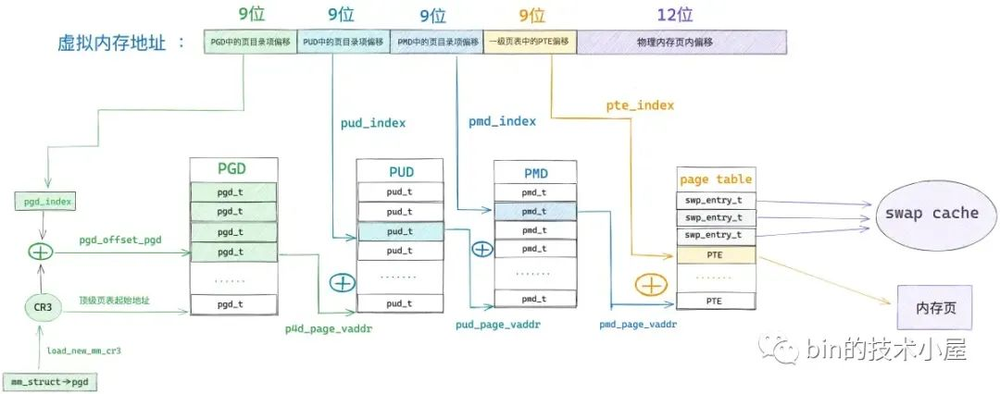

完整的 swap in 过程：

1. 首先内核会通过 `pte_to_swp_entry` 将进程页表中的 pte 转换为 `swp_entry_t`
2. 通过 `lookup_swap_cache` 根据 `swp_entry_t` 到 swap cache 中查找是否已经有其他进程将内存页 swap 进来了。
3. 如果 swap cache 没有对应的内存页，则调用 `swapin_readahead` 启动预读，在这个过程中，内核会重新分配物理内存页，并将这个物理内存页加入到 swap cache 中，随后通过 `swap_readpage` 将交换区的内容读取到这个内存页中。
4. 现在需要的内存页已经 swap in 到内存中了，后面的流程就和普通的缺页处理一样了，根据 swap in 进来的内存页地址重新创建初始化一个新的 pte，然后用这个新的 pte，将进程页表中原来的 `swp_entry_t` 替换掉。
5. 为新的内存页建立反向映射关系，加入 lru active list 中，最后 `swap_free` 释放交换区中的资源。

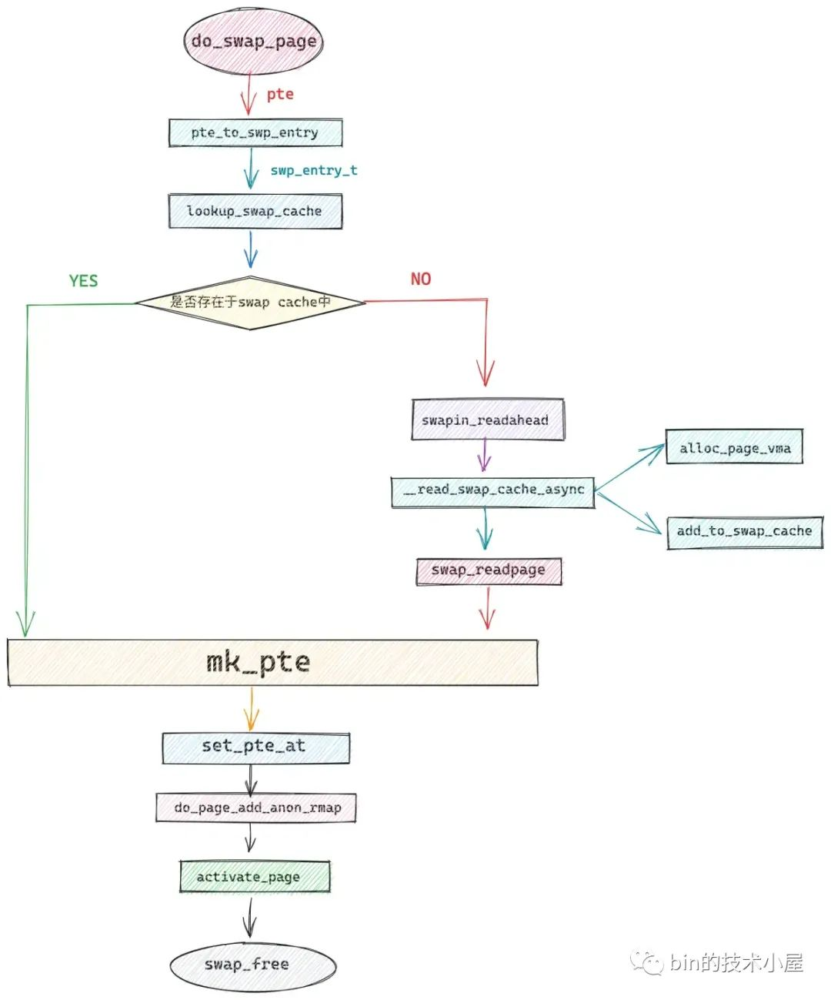

```c
vm_fault_t do_swap_page(struct vm_fault *vmf)
{
    // 将缺页内存地址 address 对应的 pte 转换为 swp_entry_t
    entry = pte_to_swp_entry(vmf->orig_pte);  
    // 首先利用 swp_entry_t 到 swap cache 查找，看内存页已经其他进程被 swap in 进来
    page = lookup_swap_cache(entry, vma, vmf->address);
    swapcache = page;
    // 处理匿名页不在 swap cache 的情况
    if (!page) {
        // 通过 swp_entry_t 获取对应的交换区结构
        struct swap_info_struct *si = swp_swap_info(entry);
        // 针对 fast swap storage 比如 zram 等 swap 的性能优化，跳过 swap cache
        if (si->flags & SWP_SYNCHRONOUS_IO &&
                __swap_count(entry) == 1) {
            /* skip swapcache */
            /* 当只有单进程引用这个匿名页的时候，直接跳过 swap cache
             * 从伙伴系统中申请内存页 page，注意这里的 page 并不会加入到 swap cache 中
             */
            page = alloc_page_vma(GFP_HIGHUSER_MOVABLE, vma,
                            vmf->address);
            if (page) {
                __SetPageLocked(page);
                __SetPageSwapBacked(page);
                set_page_private(page, entry.val);
                // 加入 lru 链表
                lru_cache_add_anon(page);
                // 直接从 fast storage device 中读取被换出的内容到 page 中
                swap_readpage(page, true);
            }
        } else {
            // 启动 swap 预读
            page = swapin_readahead(entry, GFP_HIGHUSER_MOVABLE,
                        vmf);
            swapcache = page;
        }

        // 因为涉及到了磁盘 IO，所以本次缺页异常属于 FAULT_MAJOR 类型
        ret = VM_FAULT_MAJOR;
        count_vm_event(PGMAJFAULT);
        count_memcg_event_mm(vma->vm_mm, PGMAJFAULT);
    } 

    // 现在之前被换出的内存页已经被内核重新 swap in 到内存中了。下面就是重新设置 pte，将原来页表中的 swp_entry_t 替换掉
    vmf->pte = pte_offset_map_lock(vma->vm_mm, vmf->pmd, vmf->address,
            &vmf->ptl);
    // 增加匿名页的统计计数
    inc_mm_counter_fast(vma->vm_mm, MM_ANONPAGES);
    // 减少 swap entries 计数
    dec_mm_counter_fast(vma->vm_mm, MM_SWAPENTS);
    // 根据被 swap in 进来的新内存页重新创建 pte
    pte = mk_pte(page, vma->vm_page_prot);
    // 用新的 pte 替换掉页表中的 swp_entry_t
    set_pte_at(vma->vm_mm, vmf->address, vmf->pte, pte);
    vmf->orig_pte = pte;

    // 建立新内存页的反向映射关系
    do_page_add_anon_rmap(page, vma, vmf->address, exclusive);
    // 将内存页添加到 lru 的 active list 中
    activate_page(page);
    // 释放交换区中的资源
    swap_free(entry);
    // 刷新 mmu cache
    update_mmu_cache(vma, vmf->address, vmf->pte);
    return ret;
}
```


### slab

#### slab 存在的意义

伙伴系统管理物理内存的最小单位是物理内存页 page。也就是说向伙伴系统申请内存时，至少要申请一个物理内存页。而从内核实际运行过程中来看，无论是从内核态还是从用户态的角度来说，对于内存的需求量往往是以字节为单位，通常是几十字节到几百字节不等，远远小于一个页面的大小。如果仅仅为了这几十字节的内存需求，而专门为其分配一整个内存页面，这无疑是对宝贵内存资源的一种巨大浪费。于是在内核中，这种专门针对小内存的分配需求就应运而生了。

slab 首先会向伙伴系统一次性申请一个或者多个物理内存页面，正是这些物理内存页组成了 slab 内存池。随后 slab 内存池会将这些连续的物理内存页面划分成多个大小相同的小内存块出来，同一种 slab 内存池下，划分出来的小内存块尺寸是一样的。内核会针对不同尺寸的小内存分配需求，预先创建出多个 slab 内存池出来。这种小内存在内核中的使用场景非常之多，比如，内核中那些经常使用，需要频繁申请释放的一些核心数据结构对象：task_struct 对象，mm_struct 对象，struct page 对象，struct file 对象，socket 对象等。而创建这些内核核心数据结构对象以及为这些核心对象分配内存，销毁这些内核对象以及释放相关的内存是需要性能开销的。而buddy分配器整个内存分配链路还是比较长的，如果遇到内存不足，还会涉及到内存的 swap 和 compact ，从而进一步产生更大的性能开销。

既然 slab 专门是用于小内存块分配与回收的，那么内核很自然的就会想到，分别为每一个需要被内核频繁创建和释放的核心对象创建一个专属的 slab 对象池，这些内核对象专属的 slab 对象池会根据其所管理的具体内核对象所占用内存的大小 size，将一个或者多个完整的物理内存页按照这个 size 划分出多个大小相同的小内存块出来，每个小内存块用于存储预先创建好的内核对象。这样一来，当内核需要频繁分配和释放内核对象时，就可以直接从相应的 slab 对象池中申请和释放内核对象，避免了链路比较长的内存分配与释放过程，极大地提升了性能。这是一种池化思想的应用。将内核中的核心数据结构对象，池化在 slab 对象池中，除了可以避免内核对象频繁反复初始化和相关内存分配，频繁反复销毁对象和相关内存释放的性能开销之外，其实还有很多好处，比如：

1. 利用 CPU 高速缓存提高访问速度。当一个对象被直接释放回 slab 对象池中的时候，这个内核对象还是“热的”，仍然会驻留在 CPU 高速缓存中。如果这时，内核继续向 slab 对象池申请对象，slab 对象池会优先把这个刚刚释放 “热的” 对象分配给内核使用，因为对象很大概率仍然驻留在 CPU 高速缓存中，所以内核访问起来速度会更快。
2. 伙伴系统只能分配 2 的次幂个完整的物理内存页，这会引起占用高速缓存以及 TLB 的空间较大，导致一些不重要的数据驻留在 CPU 高速缓存中占用宝贵的缓存空间，而重要的数据却被置换到内存中。 slab 对象池针对小内存分配场景，可以有效的避免这一点。
3. 调用伙伴系统的操作会对 CPU 高速缓存 L1Cache 中的 Instruction Cache（指令高速缓存）和 Data Cache （数据高速缓存）有污染，因为对伙伴系统的长链路调用，相关的一些指令和数据必然会填充到 Instruction Cache 和 Data Cache 中，从而将频繁使用的一些指令和数据挤压出去，造成缓存污染。而在内核空间中越浪费这些缓存资源，那么在用户空间中的进程就会越少的得到这些缓存资源，造成性能的下降。 slab 对象池极大的减少了对伙伴系统的调用，防止了不必要的 L1Cache 污染。
4. 使用 slab 对象池可以充分利用 CPU 高速缓存，避免多个对象对同一 cache line 的争用。如果对象直接存储排列在伙伴系统提供的内存页中的话（不受 slab 管理），那么位于不同内存页中具有相同偏移的对象很可能会被放入同一个 cache line 中，即使其他 cache line 还是空的。


#### slab/slub/slob

slab 的实现，最早是由 Sun 公司的 Jeff Bonwick 在 Solaris 2.4 系统中设计并实现的，由于 Jeff Bonwick 公开了 slab 的实现方法，因此被 Linux 所借鉴并于 1996 年在 Linux 2.0 版本中引入了 slab，用于 Linux 内核早期的小内存分配场景。由于 slab 的实现非常复杂，slab 中拥有多种存储对象的队列，队列管理开销比较大，slab 元数据比较臃肿，对 NUMA 架构的支持臃肿繁杂（slab 引入时内核还没支持 NUMA），这样导致 slab 内部为了维护这些自身元数据管理结构就得花费大量的内存空间，这在配置有超大容量内存的服务器上，内存的浪费是非常可观的。

针对以上 slab 的不足，内核 Christoph Lameter 在 2.6.22 版本（2007 年发布）中引入了新的 slub 实现。slub 简化了 slab 一些复杂的设计，同时保留了 slab 的基本思想，摒弃了 slab 众多管理队列的概念，并针对多处理器，NUMA 架构进行优化，放弃了效果不太明显的 slab 着色机制。slub 与 slab 相比，提高了性能，吞吐量，并降低了内存的浪费。成为现在内核中常用的 slab 实现。

而 slob 的实现是在内核 2.6.16 版本（2006 年发布）引入的，它是专门为嵌入式小型机器小内存的场景设计的，所以实现上很精简，能在小型机器上提供很不错的性能。

而内核中关于内存池（小内存分配器）的相关 API 接口函数均是以 slab 命名的，但是可以通过配置的方式来平滑切换以上三种 slab 的实现。

#### slab 设计理念

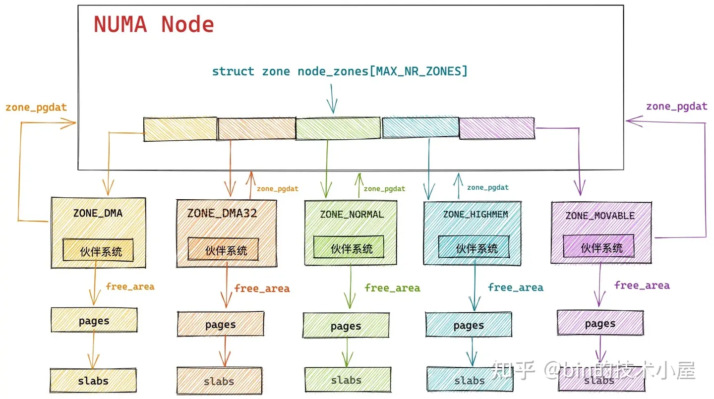

如上图所示，slab 对象池在内存管理系统中的架构层次是基于伙伴系统之上构建的，slab 对象池会一次性向伙伴系统申请一个或者多个完整的物理内存页，在这些完整的内存页内在逐步划分出一小块一小块的内存块出来，而这些小内存块的尺寸就是 slab 对象池所管理的内核核心对象占用的内存大小。

如果要设计一个对象池，首先最直观最简单的办法就是先向伙伴系统申请一个内存页（也可以多个页），然后按照需要被池化对象的尺寸 object size，把内存页划分为一个一个的内存块，每个内存块尺寸就是 object size。

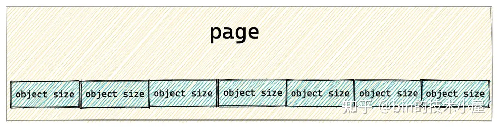

但是在一个工业级的对象池设计中，不能这么简单粗暴的搞，因为对象的 object size 可以是任意的，并不是内存对齐的，CPU 访问一块没有进行对齐的内存比访问对齐的内存速度要慢一倍。因为 CPU 向内存读取数据的单位是根据 word size 来的，在 64 位处理器中 word size = 8 字节，所以 CPU 向内存读写数据的单位为 8 字节。CPU 只能一次性向内存访问按照 word size ( 8 字节) 对齐的内存地址，如果 CPU 访问一个未进行 word size 对齐的内存地址，就会经历两次访存操作。

比如访问 0x0007 - 0x0014 这样一段没有对 word size 进行对齐的内存，CPU 只能先从 0x0000 - 0x0007 读取 8 个字节出来先放入结果寄存器中并左移 7 个字节（目的是只获取 0x0007 ），然后 CPU 在从 0x0008 - 0x0015 读取 8 个字节出来放入临时寄存器中并右移1个字节（目的是获取 0x0008 - 0x0014 ）最后与结果寄存器或运算。最终得到 0x0007 - 0x0014 地址段上的 8 个字节。

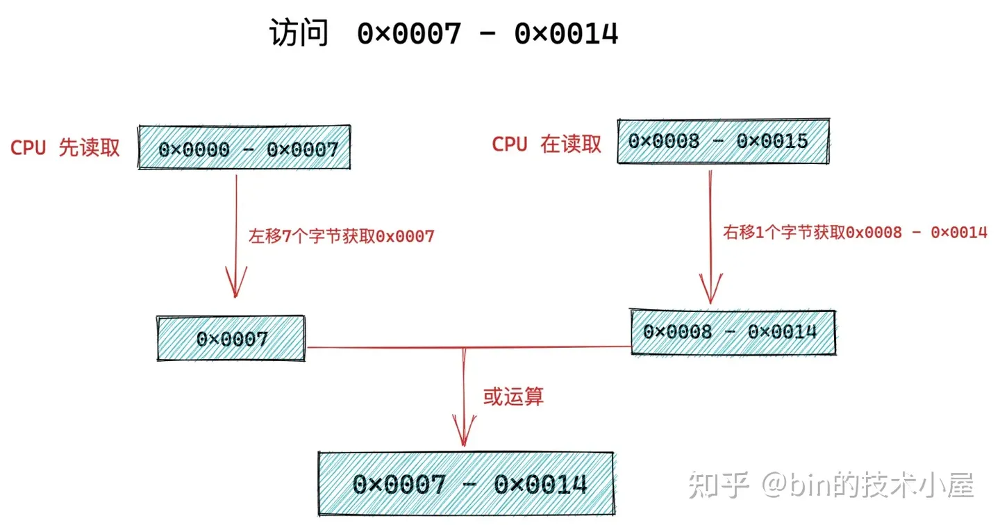

从上面过程可以看出，CPU 访问一段未进行 word size 对齐的内存，需要两次访存操作。内存对齐的好处还有很多，比如，CPU 访问对齐的内存都是原子性的，对齐内存中的数据会独占 cache line ，不会与其他数据共享 cache line，避免 false sharing。

基于以上原因，不能简单的按照对象尺寸 object size 来划分内存块，而是需要考虑到对象内存地址要按照 word size 进行对齐。于是上面的 slab 对象池的内存布局又有了新的变化。如果被池化对象的尺寸 object size 本来就是和 word size 对齐的，那么不需要做任何事情，但是如果 object size 没有和 word size 对齐，就需要填充一些字节，目的是要让对象的 object size 按照 word size 进行对齐，提高 CPU 访问对象的速度。

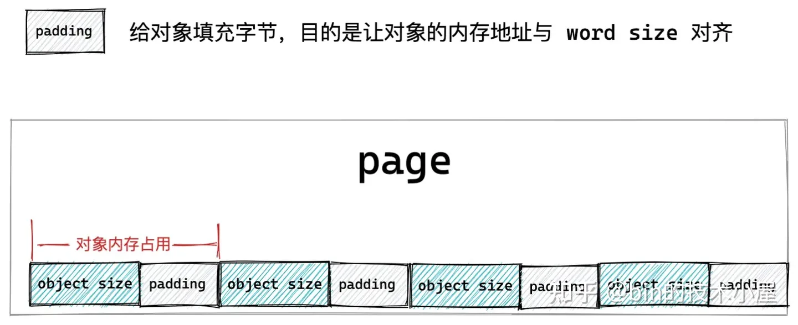

但是上面的这些工作对于一个工业级的对象池来说还远远不够，工业级的对象池需要应对很多复杂的诡异场景，比如，偶尔在复杂生产环境中会遇到的内存读写访问越界的情况，这会导致很多莫名其妙的异常。内核为了应对内存读写越界的场景，于是在对象内存的周围插入了一段不可访问的内存区域，这些内存区域用特定的字节 0xbb 填充，当进程访问的到内存是 0xbb 时，表示已经越界访问了。这段内存区域在 slab 中的术语为 red zone，大家可以理解为红色警戒区域。插入 red zone 之后，slab 对象池的内存布局近一步演进为下图所示的布局：

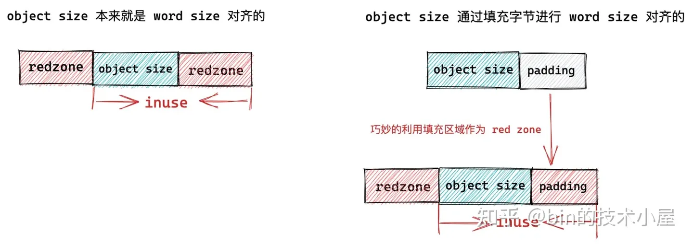

- 如果对象尺寸 object size 本身就是 word size 对齐的，那么就需要在对象左右两侧填充两段 red zone 区域，red zone 区域的长度一般就是 word size 大小。
- 如果对象尺寸 object size 是通过填充 padding 之后，才与 word size 对齐。内核会巧妙的利用对象右边的这段 padding 填充区域作为 red zone。只需要额外的在对象内存区域的左侧填充一段 red zone 即可。

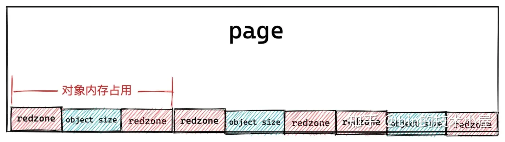

从 slab 对象池获取到一个空闲对象之后，需要知道它的下一个空闲对象在哪里，这样方便下次获取对象。即该如何将内存页 page 中的这些空闲对象串联起来。最简单的想法是，用一个链表把这些空闲对象串联起来。不过内核巧妙的地方在于不需要为串联对象所用到的 next 指针额外的分配内存空间。因为对象在 slab 中没有被分配出去使用的时候，其实对象所占的内存中存放什么，用户根本不会关心的。既然这样，内核干脆就把指向下一个空闲对象的 freepointer 指针直接存放在对象所占内存（object size）中，这样避免了为 freepointer 指针单独再分配内存空间。巧妙的利用了对象所在的内存空间（object size）。 slab 对象池中各个对象的状态，比如是否处于空闲状态，和 freepointer 的处理方式一样。

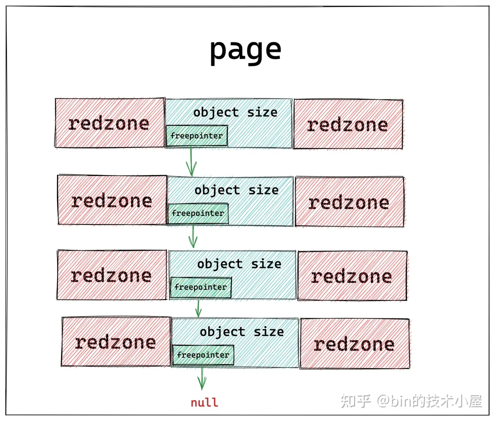

当 slab 刚刚从伙伴系统中申请出来，并初始化划分物理内存页中的对象内存空间时，内核会将对象的 object size 内存区域用特殊字节 0x6b 填充，并用 0xa5 填充对象 object size 内存区域的最后一个字节表示填充完毕。或者当对象被释放回 slab 对象池中的时候，也会用这些字节填充对象的内存区域。


这种通过在对象内存区域填充特定字节表示对象的特殊状态的行为，在 slab 中有一个专门的术语叫做 SLAB_POISON （SLAB 中毒）。POISON 这个术语起的真的是只可意会不可言传，其实就是表示 slab 对象的一种状态。是否毒化 slab 对象是可以设置的，当 slab 对象被 POISON 之后，那么会有一个问题，即存放在对象内存区域 object size 里的 freepointer 就被会特殊字节 0x6b 覆盖掉。这种情况下，内核就只能为 freepointer 在额外分配一个 word size 大小的内存空间了。


slab 对象的内存布局信息除了以上内容之外，有时候=还需要去跟踪一下对象的分配和释放相关信息，而这些信息也需要在 slab 对象中存储，内核中使用一个 `struct track` 结构体来存储跟踪信息。这样一来，slab 对象的内存区域中就需要在开辟出两个 `sizeof(struct track)` 大小的区域出来，用来分别存储 slab 对象的分配和释放信息。

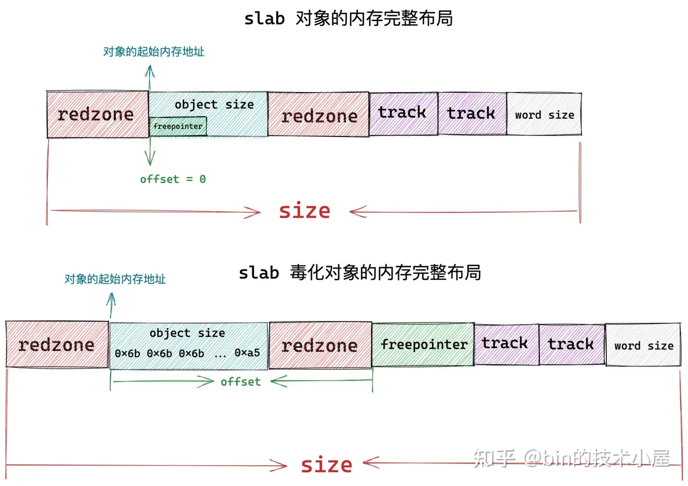

上图展示的就是 slab 对象在内存中的完整布局，其中 object size 为对象真正所需要的内存区域大小，而对象在 slab 中真实的内存占用大小 size 除了 object size 之外，还包括填充的 red zone 区域，以及用于跟踪对象分配和释放信息的 track 结构，另外，如果 slab 设置了 red zone，还需要再 slab 对象内存区域的左侧填充一段 red_left_pad 大小的内存区域作为左侧 red zone，并且内核会在对象末尾增加一段 word size 大小的填充 padding 区域。当 slab 向伙伴系统申请若干内存页之后，内核会按照这个 size 将内存页划分成一个一个的内存块，内存块大小为 size 。

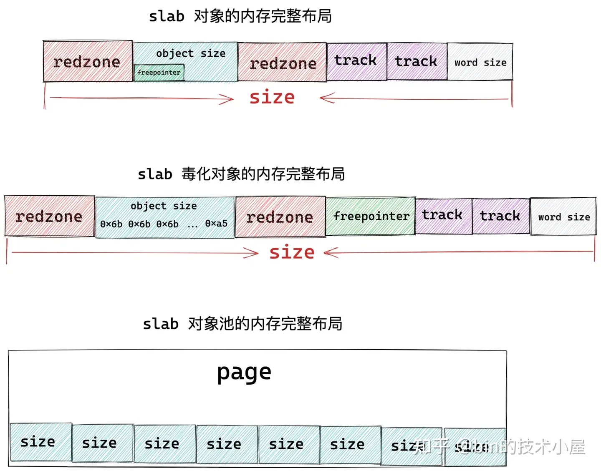

**其实 slab 的本质就是一个或者多个物理内存页 page**，内核会根据上图展示的 slab 对象的内存布局，计算出对象的真实内存占用 size。最后根据这个 size 在 slab 背后依赖的这一个或者多个物理内存页 page 中划分出多个大小相同的内存块出来。所以在内核中，都是用 `struct page` 结构来表示 slab，如果 slab 背后依赖的是多个物理内存页，那就使用 `compound_page` 来表示。

```c
/* slab 的具体信息也是在 struct page 中存储。考虑到 struct page 结构已经非常庞大且复杂，
 * 为了减少 struct page 的内存占用以及提高可读性，内核在 5.17 版本中专门为 slab 引入了一个管理结构 struct slab，
 * 将原有 struct page 中 slab 相关的字段全部删除，转移到了 struct slab 结构中。
 */
struct page {

        struct {    /*  slub 相关字段 */
            union {
                // slab 所在的管理链表
                struct list_head slab_list;
                struct {    /* Partial pages */
                    // 用 next 指针在相应管理链表中串联起 slab
                    struct page *next;
#ifdef CONFIG_64BIT
                    // slab 所在管理链表中的包含的 slab 总数
                    int pages;  
                    // slab 所在管理链表中包含的对象总数
                    int pobjects; 
#else
                    short int pages;
                    short int pobjects;
#endif
                };
            };
            /* 指向 slab cache，slab cache 就是真正的对象池结构，里边管理了多个 slab
             * 这多个 slab 被 slab cache 管理在了不同的链表上
             */
            struct kmem_cache *slab_cache;
            // 指向 slab 中第一个空闲对象
            void *freelist;     /* first free object */
            union {
                struct {            /* SLUB */
                    // slab 中已经分配出去的对象
                    unsigned inuse:16;
                    // slab 中包含的对象总数
                    unsigned objects:15;
                    // 该 slab 是否在对应 slab cache 的本地 CPU 缓存中，frozen = 1 表示缓存再本地 cpu 缓存中
                    unsigned frozen:1;
                };
            };
        };

}
```

#### slab 总体架构

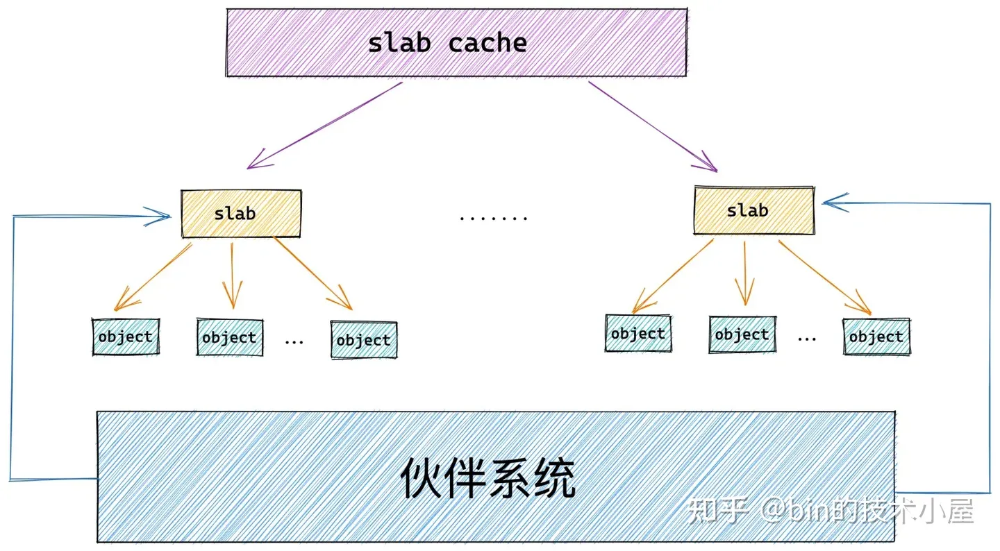

如果一个 slab 中的对象全部分配出去了，slab cache 就会将其视为一个 full slab，表示这个 slab 此刻已经满了，无法在分配对象了。slab cache 就会到伙伴系统中重新申请一个 slab 出来，供后续的内存分配使用。

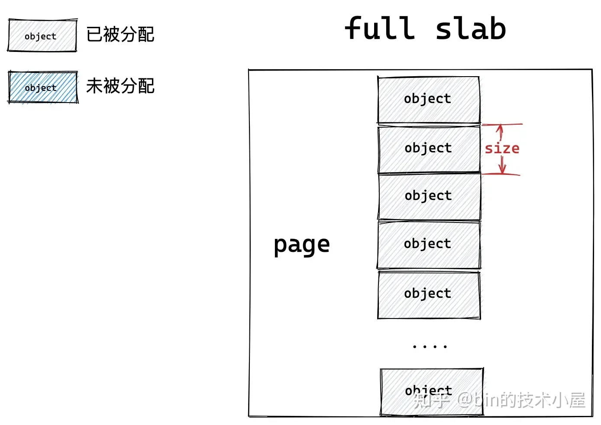

当内核将对象释放回其所属的 slab 之后，如果 slab 中的对象全部归位，slab cache 就会将其视为一个 empty slab，表示 slab 此刻变为了一个完全空闲的 slab。如果超过了 slab cache 中规定的 empty slab 的阈值，slab cache 就会将这些空闲的 empty slab 重新释放回伙伴系统中。

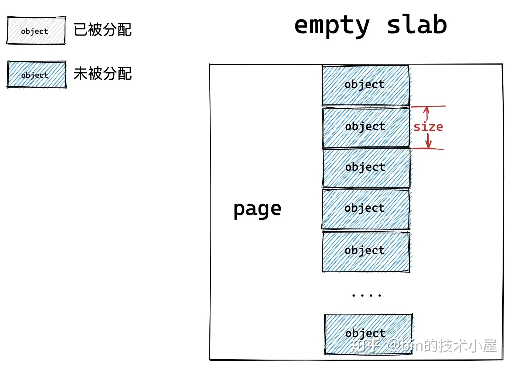

如果一个 slab 中的对象部分被分配出去使用，部分却未被分配仍然在 slab 中缓存，那么内核就会将该 slab 视为一个 partial slab。

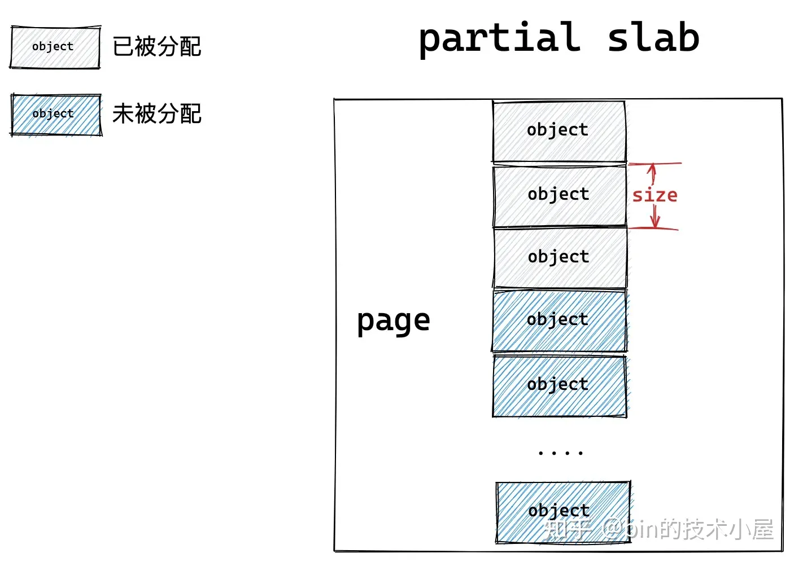

这些不同状态的 slab，会在 slab cache 中被不同的链表所管理，同时 slab cache 会控制管理链表中 slab 的个数以及链表中所缓存的空闲对象个数，防止它们无限制的增长。

slab cache 中除了需要管理众多的 slab 之外，还包括了很多 slab 的基础信息。比如：

- slab 对象内存布局相关的信息
- slab 中的对象需要按照什么方式进行内存对齐，比如，按照 CPU 硬件高速缓存行 cache line (64 字节) 进行对齐，slab 对象是否需要进行毒化 POISON，是否需要在 slab 对象内存周围插入 red zone，是否需要追踪 slab 对象的分配与回收信息，等等。
- 一个 slab 具体到底需要多少个物理内存页 page，一个 slab 中具体能够容纳多少个 object （内存块）。

##### slab 的基础信息管理

```c
/*
 * Slab cache management.
 */
struct kmem_cache {
    /* slab cache 的管理标志位，用于设置 slab 的一些特性
     * 比如：slab 中的对象按照什么方式对齐，对象是否需要 POISON 毒化，
     * 是否插入 red zone 在对象内存周围，是否追踪对象的分配和释放信息 等等
     */
    slab_flags_t flags;
    // slab 对象在内存中的真实占用，包括为了内存对齐填充的字节数，red zone 等等
    unsigned int size;  /* The size of an object including metadata */
    // slab 中对象的实际大小，不包含填充的字节数
    unsigned int object_size;/* The size of an object without metadata */
    /* slab 对象池中的对象在没有被分配之前，我们是不关心对象里边存储的内容的。
     * 内核巧妙的利用对象占用的内存空间存储下一个空闲对象的地址。
     * offset 表示用于存储下一个空闲对象指针的位置距离对象首地址的偏移
     */
    unsigned int offset;    /* Free pointer offset */
    /* 表示 cache 中的 slab 大小，包括 slab 所需要申请的页面个数，以及所包含的对象个数
     * 其中低 16 位表示一个 slab 中所包含的对象总数，高 16 位表示一个 slab 所占有的内存页个数。
     */
    struct kmem_cache_order_objects oo;
    // slab 中所能包含对象以及内存页个数的最大值，内核在初始化 slab 的时候，会将 max 的值设置为 oo。	
    struct kmem_cache_order_objects max;
    // 当按照 oo 的尺寸为 slab 申请内存时，如果内存紧张，会采用 min 的尺寸为 slab 申请内存，可以容纳一个对象即可。
    struct kmem_cache_order_objects min;
    // 向伙伴系统申请内存时使用的内存分配标识
    gfp_t allocflags; 
    // slab cache 的引用计数，为 0 时就可以销毁并释放内存回伙伴系统重
    int refcount;   
    // 池化对象的构造函数，用于创建 slab 对象池中的对象
    void (*ctor)(void *);
    // 对象的 object_size 按照 word 字长对齐之后的大小
    unsigned int inuse;  
    /* 在创建 slab cache 的时候，可以向内核指定 slab 中的对象按照 align 的值进行对齐，内核会综合 word size ,
     * cache line ，align 计算出一个合理的对齐尺寸。
     */
    unsigned int align; 
    // slab cache 的名称， 也就是在 slabinfo 命令中 name 那一列
    const char *name;  
};
```

`slab_flags_t flags` 是 slab cache 的管理标志位，用于设置 slab 的一些特性，比如：

- 当 flags 设置了 SLAB_HWCACHE_ALIGN 时，表示 slab 中的对象需要按照 CPU 硬件高速缓存行 cache line (64 字节) 进行对齐。

- 当 flags 设置了 SLAB_POISON 时，表示需要在 slab 对象内存中填充特殊字节 0x6b 和 0xa5，表示对象的特定状态。
- 当 flags 设置了 SLAB_RED_ZONE 时，表示需要在 slab 对象内存周围插入 red zone，防止内存的读写越界。
- 当 flags 设置了 SLAB_CACHE_DMA 或者 SLAB_CACHE_DMA32 时，表示指定 slab 中的内存来自于哪个内存区域，DMA or DMA32 区域 ？如果没有特殊指定，slab 中的内存一般来自于 NORMAL 直接映射区域。
- 当 flags 设置了 SLAB_STORE_USER 时，表示需要追踪对象的分配和释放相关信息，这样会在 slab 对象内存区域中额外增加两个 `sizeof(struct track)` 大小的区域出来，用于存储 slab 对象的分配和释放信息。

相关 slab cache 的标志位 flag，定义在内核文件 `/include/linux/slab.h` 中：

```c
/* DEBUG: Red zone objs in a cache */
#define SLAB_RED_ZONE  ((slab_flags_t __force)0x00000400U)
/* DEBUG: Poison objects */
#define SLAB_POISON  ((slab_flags_t __force)0x00000800U)
/* Align objs on cache lines */
#define SLAB_HWCACHE_ALIGN ((slab_flags_t __force)0x00002000U)
/* Use GFP_DMA memory */
#define SLAB_CACHE_DMA  ((slab_flags_t __force)0x00004000U)
/* Use GFP_DMA32 memory */
#define SLAB_CACHE_DMA32 ((slab_flags_t __force)0x00008000U)
/* DEBUG: Store the last owner for bug hunting */
#define SLAB_STORE_USER 
```

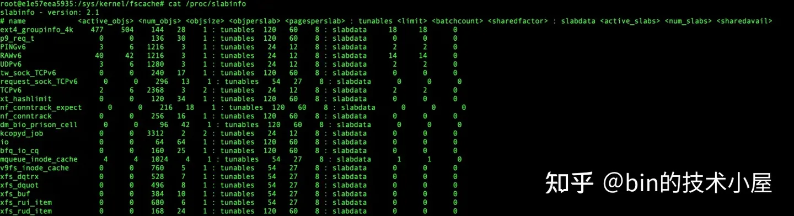

`cat /proc/slabinfo` 命令的显示结构主要由三部分组成：

- statistics 部分显示的是 slab cache 的基本统计信息，这部分是最常用的，下面是每一列的含义：
  - active_objs 表示 slab cache 中已经被分配出去的对象个数
  - num_objs 表示 slab cache 中容纳的对象总数
  - objsize 表示 slab 中对象的 object size ，单位为字节
  - objperslab 表示 slab 中可以容纳的对象个数
  - pagesperslab 表示 slab 所需要的物理内存页个数
- tunables 部分显示的 slab cache 的动态可调节参数，如果采用的 slub 实现，那么 tunables 部分全是 0 ，`/proc/slabinfo` 文件不可写，无法动态修改相关参数。如果使用的 slab 实现的话，可以通过 `# echo 'name limit batchcount sharedfactor' > /proc/slabinfo` 命令动态修改相关参数。命令中指定的 name 就是 kmem_cache 结构中的 name 属性。
  - limit 表示在 slab 的实现中，slab cache 的 cpu 本地缓存 array_cache 最大可以容纳的对象个数
  - batchcount 表示当 array_cache 中缓存的对象不够时，需要一次性填充的空闲对象个数。
- slabdata 部分显示的 slab cache 的总体信息，其中 active_slabs 一列展示的 slab cache 中活跃的 slab 个数。nums_slabs 一列展示的是 slab cache 中管理的 slab 总数

在 `cat /proc/slabinfo` 命令显示的这些系统中所有的 slab cache，内核会将这些 slab cache 用一个双向链表统一串联起来。链表的头结点指针保存在 struct kmem_cache 结构的 list 中。

```c
struct kmem_cache {
    // 用于组织串联系统中所有类型的 slab cache
    struct list_head list;  /* List of slab caches */
}
```

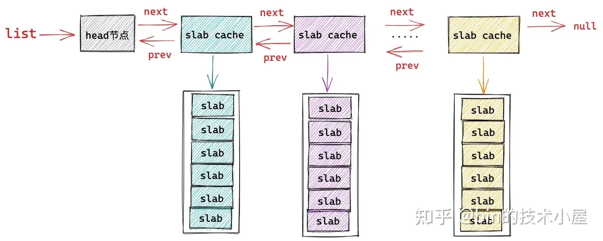

系统中所有的这些 slab cache 占用的内存总量，可以通过 `cat /proc/meminfo` 命令查看：

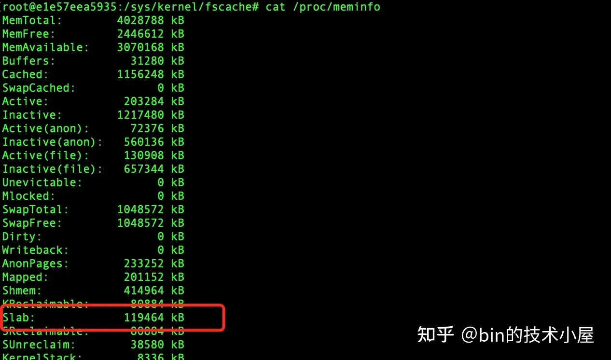

除此之外，还可以通过 `slabtop` 命令来动态查看系统中占用内存最高的 slab cache，当内存紧张的时候，如果通过 `cat /proc/meminfo` 命令发现 slab 的内存占用较高的话，那么可以快速通过 `slabtop` 迅速定位到究竟是哪一类的 object 分配过多导致内存占用飙升。


##### slab 的组织架构

slab cache 其实就是内核中的一个对象池，充分考虑了多进程并发访问 slab cache 所带来的同步性能开销，内核在 slab cache 的设计中为每个 CPU 引入了 `struct kmem_cache_cpu` 结构的 percpu 变量，作为 slab cache 在每个 CPU 中的本地缓存。这样一来，当进程需要向 slab cache 申请对应的内存块（object）时，首先会直接来到 `kmem_cache_cpu` 中查看 CPU 本地缓存的 slab，如果本地缓存的 slab 中有空闲对象，那么就直接返回了，整个过程完全没有加锁。而且访问路径特别短，防止了对 CPU 硬件高速缓存 L1Cache 中的 Instruction Cache（指令高速缓存）污染。下面来看一下 slab cache 它的 cpu 本地缓存 `kmem_cache_cpu` 结构的详细设计细节：

```c
struct kmem_cache_cpu {
    // 指向被 CPU 本地缓存的 slab 中第一个空闲的对象
    void **freelist;    /* Pointer to next available object */
    // 保证进程在 slab cache 中获取到的 cpu 本地缓存 kmem_cache_cpu 与当前执行进程的 cpu 是一致的。
    unsigned long tid;  /* Globally unique transaction id */
    // slab cache 中 CPU 本地所缓存的 slab，由于 slab 底层的存储结构是内存页 page，所以这里直接用内存页 page 表示 slab
    struct page *page;  /* The slab from which we are allocating */
#ifdef CONFIG_SLUB_CPU_PARTIAL
    /* cpu cache 缓存的备用 slab 列表，同样也是用 page 表示
     * 当被本地 cpu 缓存的 slab 中没有空闲对象时，内核会从 partial 列表中的 slab 中查找空闲对象
     */
    struct page *partial;   /* Partially allocated frozen slabs */
#endif
#ifdef CONFIG_SLUB_STATS
    // 记录 slab 分配对象的一些状态信息
    unsigned stat[NR_SLUB_STAT_ITEMS];
#endif
};
```

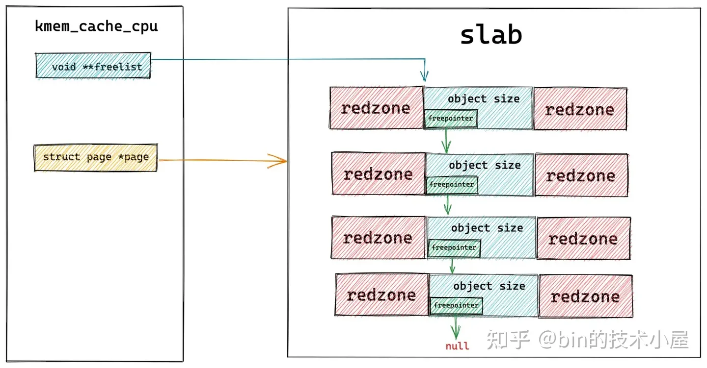

事实上，在 `struct page` 结构中也有一个 freelist 指针，用于指向该内存页中第一个空闲对象。当 slab 被缓存进 `kmem_cache_cpu` 中之后，page 结构中的 freelist 会赋值给 `kmem_cache_cpu->freelist`，然后 `page->freelist` 会置空。page 的 frozen 状态设置为1，表示 slab 在本地 cpu 中缓存。

```c
struct page {
           // 指向内存页中第一个空闲对象
           void *freelist;     /* first free object */
           // 该 slab 是否在对应 slab cache 的本地 CPU 缓存中，frozen = 1 表示缓存再本地 cpu 缓存中
           unsigned frozen:1;
}
```

`kmem_cache_cpu` 结构中的 tid 是内核为 slab cache 的 cpu 本地缓存结构设置的一个全局唯一的 transaction id ，这个 tid 在 slab cache 分配内存块的时候主要有两个作用：

1. 内核会将 slab cache 每一次分配内存块或者释放内存块的过程视为一个事物，所以在每次向 slab cache 申请内存块或者将内存块释放回 slab cache 之后，内核都会改变这里的 tid。
2. tid 也可以简单看做是 cpu 的一个编号，每个 cpu 的 tid 都不相同，可以用来标识区分不同 cpu 的本地缓存 `kmem_cache_cpu` 结构。

其中 tid 的第二个作用是最主要的，因为进程可能在执行的过程中被更高优先级的进程抢占 cpu （开启 `CONFIG_PREEMPT` 允许内核抢占）或者被中断，随后进程可能会被内核重新调度到其他 cpu 上执行，这样一来，进程在被抢占之前获取到的 `kmem_cache_cpu` 就与当前执行进程 cpu 的 `kmem_cache_cpu` 不一致了。

所以在内核中，我们经常会看到如下的代码片段，目的就是为了保证进程在 slab cache 中获取到的 cpu 本地缓存 `kmem_cache_cpu` 与当前执行进程的 cpu 是一致的。

```c
    do {
        // 获取执行当前进程的 cpu 中的 tid 字段
        tid = this_cpu_read(s->cpu_slab->tid);
        // 获取 cpu 本地缓存 cpu_slab
        c = raw_cpu_ptr(s->cpu_slab);
        // 如果两者的 tid 字段不一致，说明进程已经被调度到其他 cpu 上了，需要再次获取正确的 cpu 本地缓存
    } while (IS_ENABLED(CONFIG_PREEMPT) &&
         unlikely(tid != READ_ONCE(c->tid)));
```

如果开启了 `CONFIG_SLUB_CPU_PARTIAL` 配置项，那么在 slab cache 的 cpu 本地缓存 `kmem_cache_cpu` 结构中就会多出一个 partial 列表，partial 列表中存放的都是 partial slub，相当于是 cpu 缓存的备用选择。当 `kmem_cache_cpu->page` （被本地 cpu 所缓存的 slab）中的对象已经全部分配出去之后，内核会到 partial 列表中查找一个 partial slab 出来，并从这个 partial slab 中分配一个对象出来，最后将 `kmem_cache_cpu->page` 指向这个 partial slab，作为新的 cpu 本地缓存 slab。这样一来，下次分配对象的时候，就可以直接从 cpu 本地缓存中获取了。

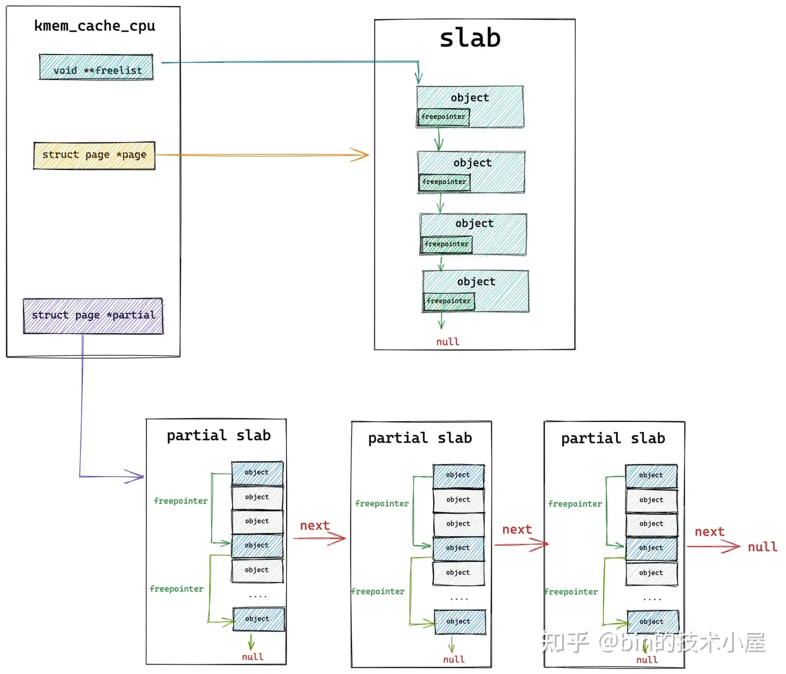

如果开启了 `CONFIG_SLUB_STATS` 配置项，内核就会记录一些关于 slab cache 的相关状态信息，这些信息同样也会在 `cat /proc/slabinfo` 命令中显示。

slab cache 的架构涉及三种内核数据结构，分别是：

- slab cache 在内核中的数据结构 `struct kmem_cache`
- slab cache 的本地 cpu 缓存结构 `struct kmem_cache_cpu`
- slab 在内核中的数据结构 `struct page`

把这种三种数据结构结合起来，得到下面这副 slab cache 的架构图：

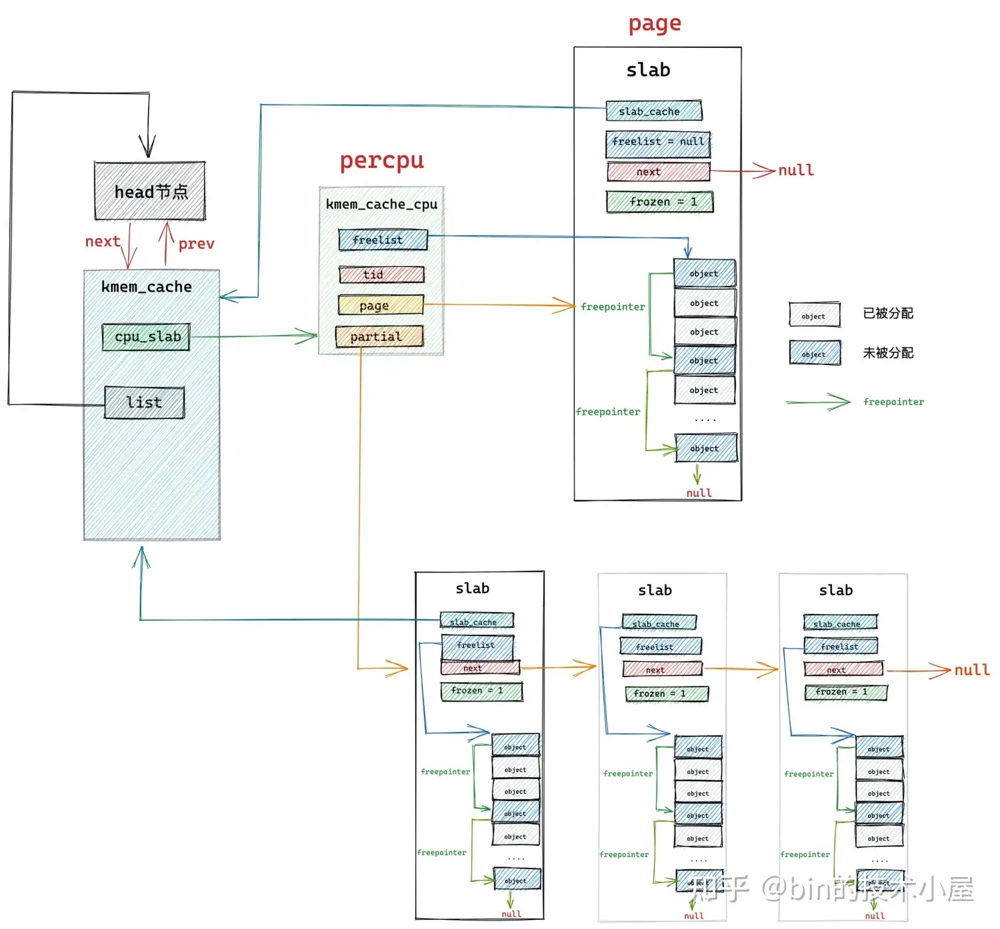

但这还不是 slab cache 的最终架构，假如把 slab cache 比作一个大型超市，超市里摆放了一排一排的商品货架，毫无疑问，顾客进入超市直接从货架上选取自己想要的商品速度是最快的。 `kmem_cache` 结构就好比是超市，slab cache 的本地 cpu 缓存结构 `kmem_cache_cpu` 就好比超市的营业厅，营业厅内摆满了一排一排的货架，这些货架就是上图中的 slab，货架上的商品就是 slab 中划分出来的一个一个的内存块。那么如果货架上的商品卖完了，该怎么办呢？这时，超市的经理就会到超市的仓库中重新拿取商品填充货架，那么 slab cache 的仓库到底在哪里呢？

slab cache 的仓库就在 NUMA 节点中，而且在每一个 NUMA 节点中都有一个仓库，当 slab cache 本地 cpu 缓存 `kmem_cache_cpu` 中没有足够的内存块可供分配时，内核就会来到 NUMA 节点的仓库中拿出 slab 填充到 `kmem_cache_cpu` 中。那么 slab cache 在 NUMA 节点的仓库中也没有足够的货物了，那该怎么办呢？这时，内核就会到伙伴系统中重新批量申请一批 slabs，填充到本地 cpu 缓存 `kmem_cache_cpu` 结构中。伙伴系统就好比上面那个超市例子中的进货商，当超市经理发现仓库中也没有商品之后，就会联系进货商，从进货商那里批发商品，重新填充货架。slab cache 的仓库在内核中采用 `struct kmem_cache_node` 结构来表示：

```c
struct kmem_cache {
    // slab cache 中 numa node 中的缓存，每个 node 一个
    struct kmem_cache_node *node[MAX_NUMNODES];
}
/*
 * The slab lists for all objects.
 */
struct kmem_cache_node {
    spinlock_t list_lock;

    // 省略 slab 相关字段

#ifdef CONFIG_SLUB
    // 该 node 节点中缓存的 slab 个数
    unsigned long nr_partial;
    // 该链表用于组织串联 node 节点中缓存的 slabs，partial 链表中缓存的 slab 为部分空闲的（slab 中的对象部分被分配出去）
    struct list_head partial;
#ifdef CONFIG_SLUB_DEBUG // 开启 slab_debug 之后会用到的字段
    // slab 的个数
    atomic_long_t nr_slabs;
    // 该 node 节点中缓存的所有 slab 中包含的对象总和
    atomic_long_t total_objects;
    // full 链表中包含的 slab 全部是已经被分配完毕的 full slab
    struct list_head full;
#endif
#endif
};
```

如果配置了 `CONFIG_SLUB_DEBUG` 选项，那么 `kmem_cache_node` 结构中就会多出一些字段来存储更加丰富的信息。`nr_slabs` 表示 NUMA 节点缓存中 slabs 的总数，这里会包含 partial slub 和 full slab，这时，`nr_partial` 表示的是 partial slab 的个数，其中 full slab 会被串联在 full 列表上。`total_objects` 表示该 NUMA 节点缓存中缓存的对象的总数。

slab cache 的架构全貌：

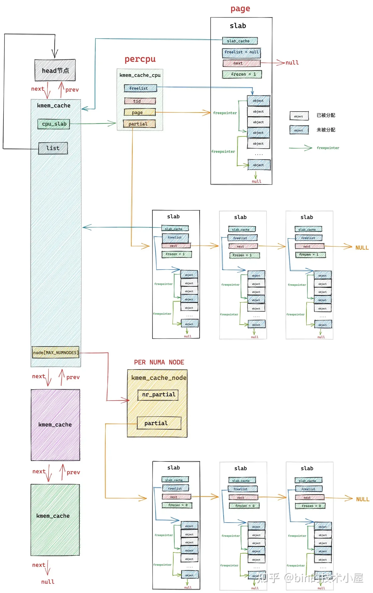

slab cache 本地 cpu 缓存 `kmem_cache_cpu` 中的 partial 列表以及 NUMA 节点缓存 `kmem_cache_node` 结构中的 partial 列表并不是无限制增长的，它们的容量收到下面两个参数的限制：

```c
/*
 * Slab cache management.
 */
struct kmem_cache {

    // slab cache 在 numa node 中缓存的 slab 个数上限，slab 个数超过该值，空闲的 empty slab 则会被回收至伙伴系统
    unsigned long min_partial;

#ifdef CONFIG_SLUB_CPU_PARTIAL
    /* 限定 slab cache 在每个 cpu 本地缓存 partial 链表中所有 slab 中空闲对象的总数,
     * cpu 本地缓存 partial 链表中空闲对象的数量超过该值，
     * 则会将 cpu 本地缓存 partial 链表中的所有 slab 转移到 numa node 缓存中。
     */
    unsigned int cpu_partial;
#endif
};
```

#### slab 内存分配原理

##### 从本地 cpu 缓存中直接分配

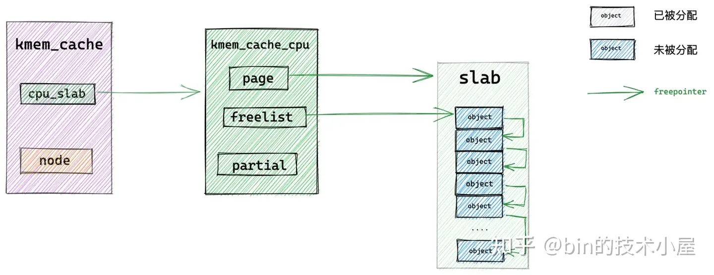

假设现在 slab cache 中的容量情况如上如图所示，slab cache 的本地 cpu 缓存中有一个 slab，slab 中有很多的空闲对象，`kmem_cache_cpu->page` 指向缓存的 slab，`kmem_cache_cpu->freelist` 指向缓存的 slab 中第一个空闲对象。当内核向该 slab cache 申请对象的时候，首先会进入快速分配路径 fastpath，通过 `kmem_cache_cpu->freelist` 直接查看本地 cpu 缓存 `kmem_cache_cpu->page` 中是否有空闲对象可供分配。如果有，则将 `kmem_cache_cpu->freelist` 指向的第一个空闲对象拿出来分配，随后调整 `kmem_cache_cpu->freelist` 指向下一个空闲对象。

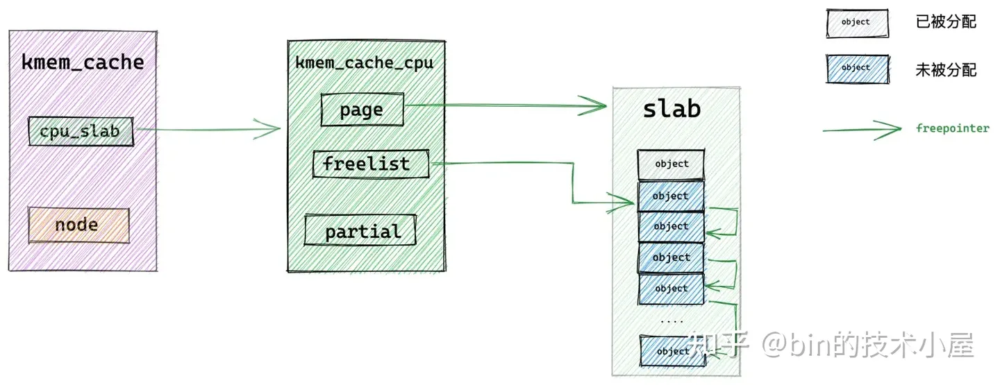

##### 从本地 cpu 缓存 partial 列表中分配

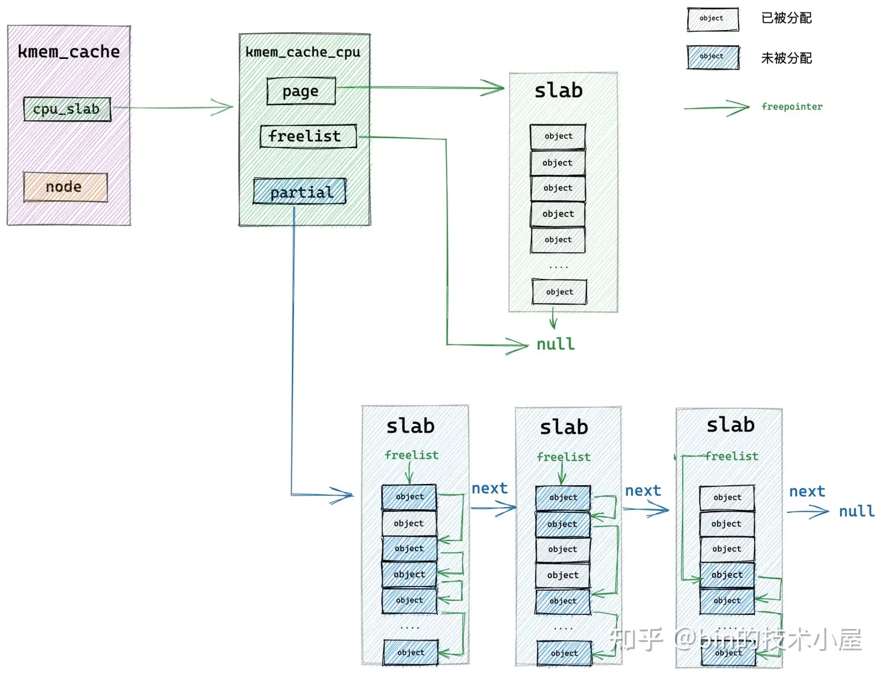

当 slab cache 本地 cpu 缓存的 slab (`kmem_cache_cpu->page`) 中没有任何空闲的对象时（全部被分配出去了），那么 slab cache 的内存分配就会进入慢速路径 slowpath。内核会到本地 cpu 缓存的 partial 列表中去查看是否有一个 slab 可以分配对象。这里内核会从 partial 列表中的头结点开始遍历直到找到一个可以满足分配的 slab 出来。随后内核会将该 slab 从 partial 列表中摘下，直接提升为新的本地 cpu 缓存。

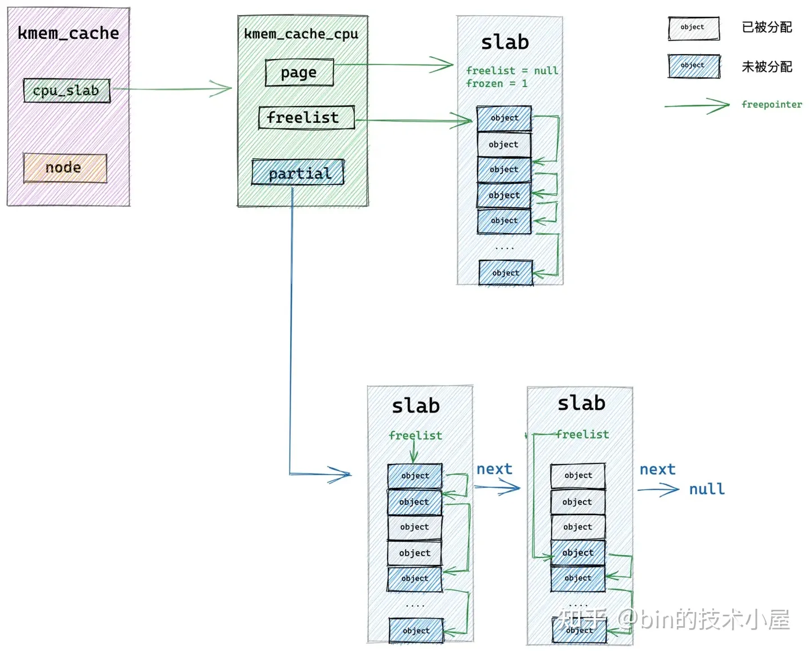

这样一来 slab cache 的本地 cpu 缓存就被更新了，内核通过 `kmem_cache_cpu->freelist` 指针将缓存 slab 中的第一个空闲对象分配出去，随后更新 `kmem_cache_cpu->freelist` 指向 slab 中的下一个空闲对象。

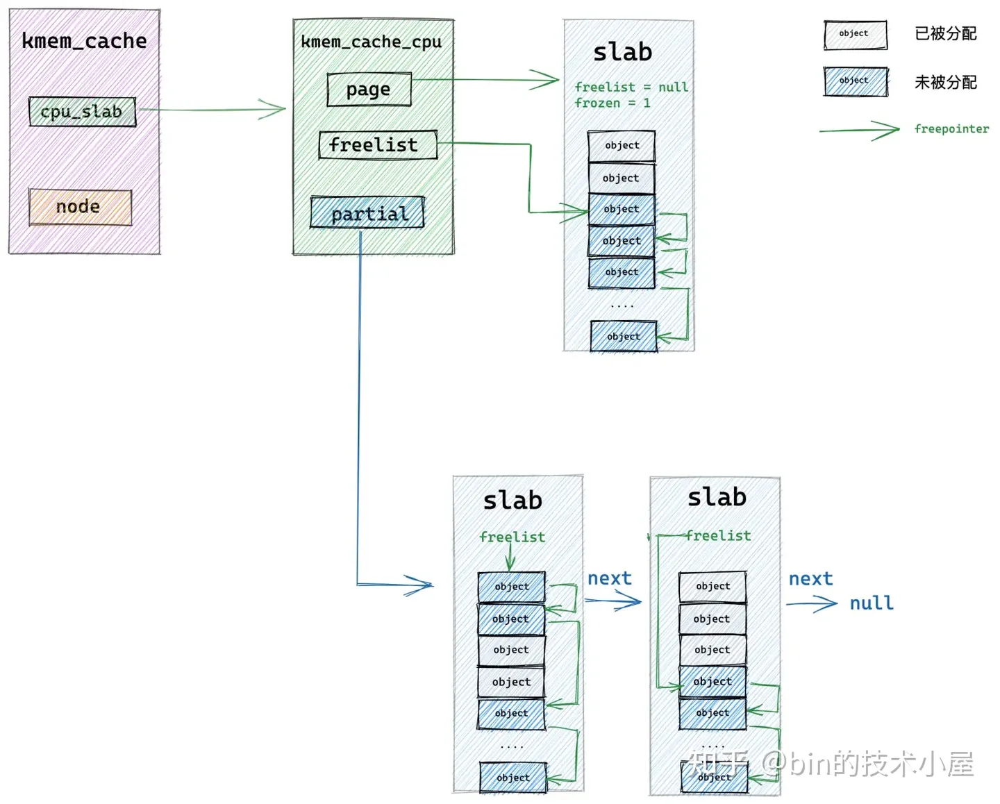

##### 从 NUMA 节点缓存中分配

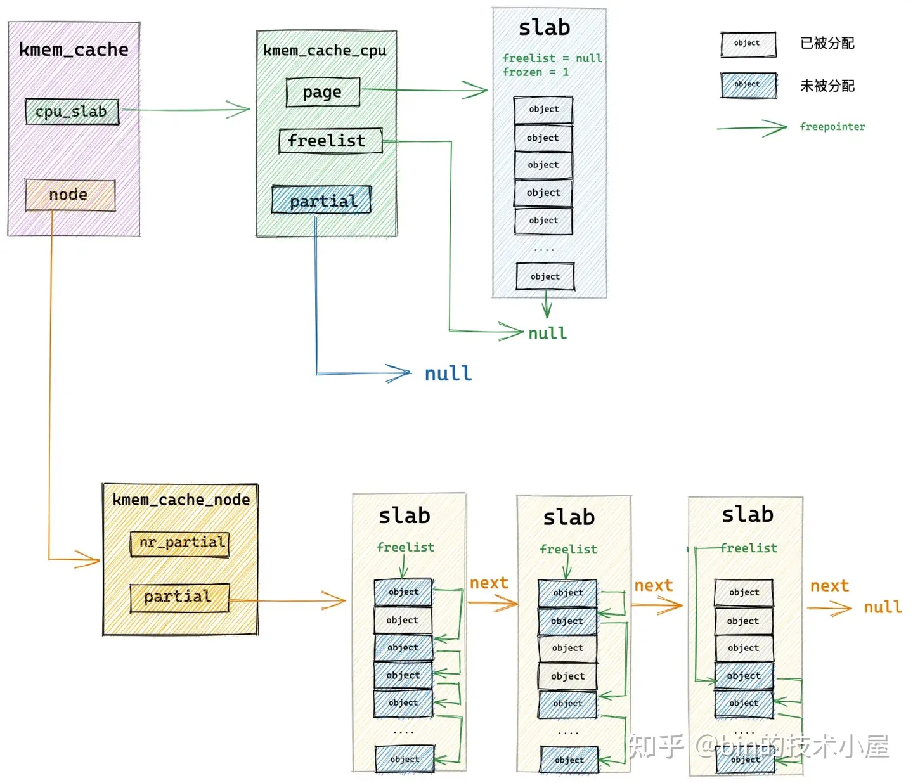

随着时间的推移， slab cache 本地 cpu 缓存的 slab 中的对象被一个一个的分配出去，变成了一个 full slab，于此同时本地 cpu 缓存 partial 链表中的 slab 也被全部摘除完毕，此时是一个空的链表。那么在这种情况下，slab cache 如何分配内存呢？此时 slab cache 就该从仓库中拿 slab 了，这个仓库就是上图中的 `kmem_cache_node` 结构中的 partial 链表。内核会从 `kmem_cache_node->partial` 链表的头结点开始遍历，将遍历到的第一个 slab 从链表中摘下，直接提升为新的本地 cpu 缓存 `kmem_cache_cpu->page`， `kmem_cache_cpu->freelist` 指针重新指向该 slab 中第一个空闲独享。

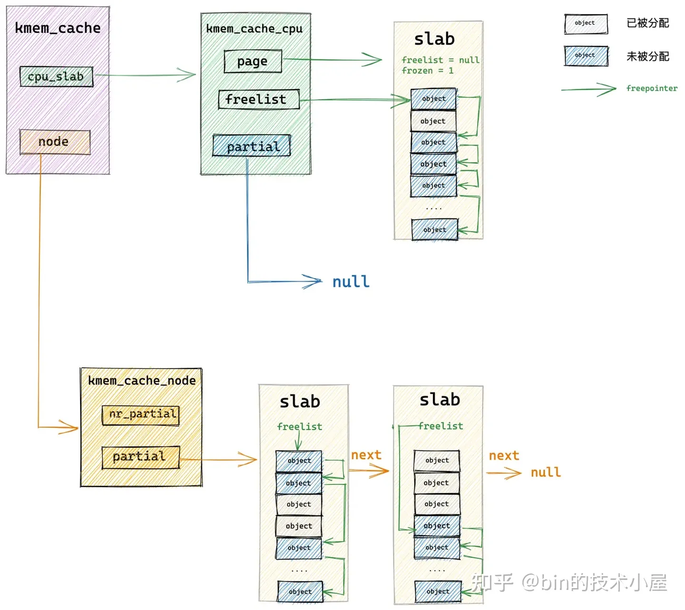

随后内核会接着遍历 `kmem_cache_node->partial` 链表，将链表中的 slab 挨个摘下填充到本地 cpu 缓存 partial 链表中。最多只能填充 `cpu_partial / 2` 个 slab。

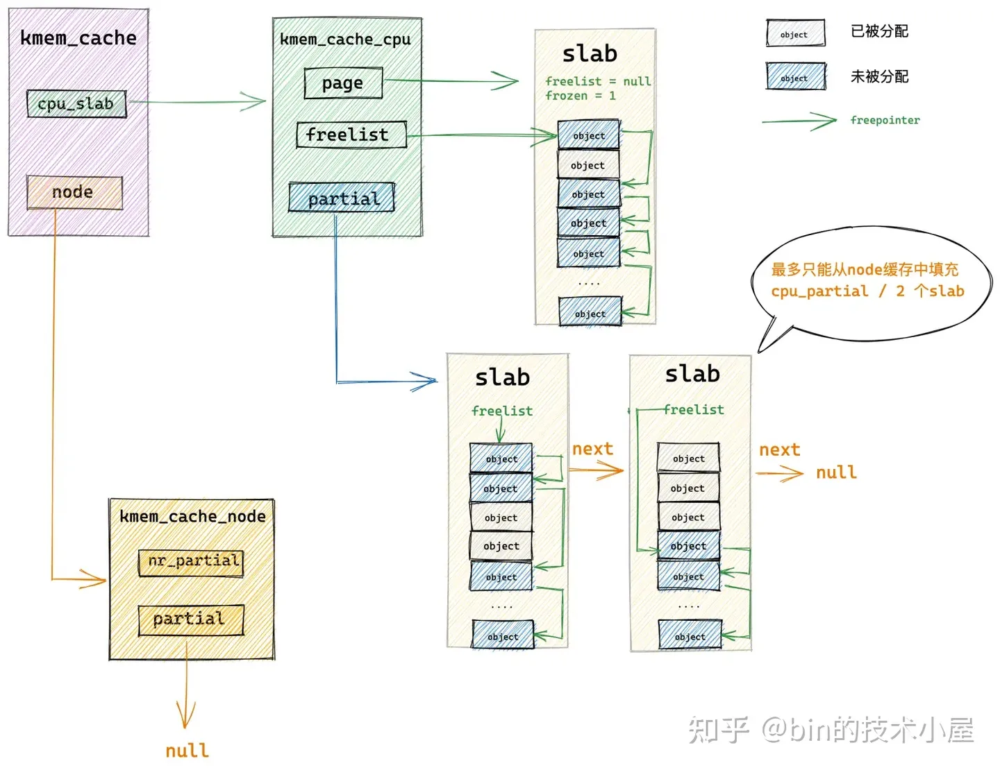

这样一来，slab cache 就从仓库 `kmem_cache_node->partial` 链表中重新填充了本地 cpu 缓存 `kmem_cache_cpu->page` 以及 `kmem_cache_cpu->partial` 链表。随后内核直接从本地 cpu 缓存中，通过 `kmem_cache_cpu->freelist` 指针将缓存 slab 中的第一个空闲对象分配出去，随后更新 `kmem_cache_cpu->freelist` 指向 slab 中的下一个空闲对象。

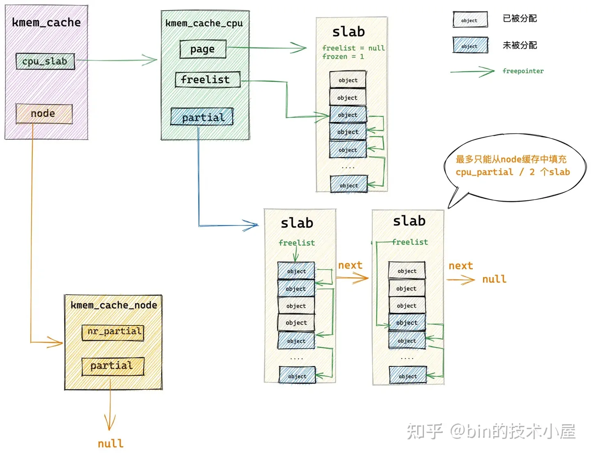

##### 从伙伴系统中重新申请 slab

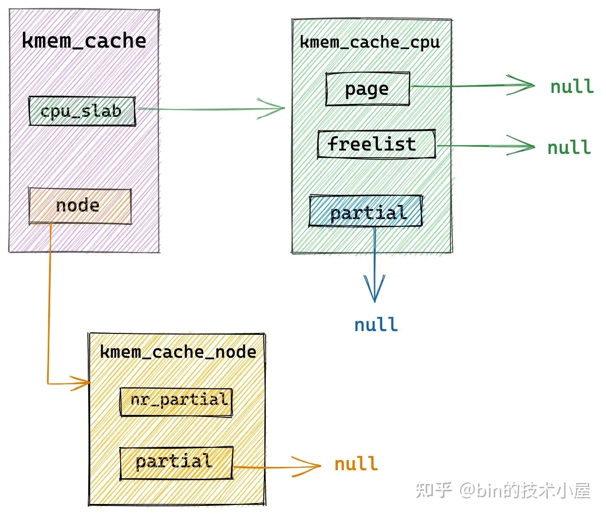

当 slab cache 的本地 cpu 缓存 `kmem_cache_cpu->page` 是空的，`kmem_cache_cpu->partial` 链表中也是空，NUMA 节点缓存 `kmem_cache_node->partial` 链表中也是空的时候，比如，slab cache 在刚刚被创建出来时，就是上图中的架构，完全是一个空的 slab cache。这时，内核就需要到伙伴系统中重新申请一个 slab 出来，具体向伙伴系统申请多少内存页是由 `struct kmem_cache` 结构中的 `oo` 来决定的，它的高 16 位表示一个 slab 所需要的内存页个数，低 16 位表示 slab 中所包含的对象总数。当系统中空闲内存不足时，无法获得 `oo` 指定的内存页个数，那么内核会降级采用 `min` 指定的内存页个数，重新到伙伴系统中去申请。当内核从伙伴系统中申请出指定的内存页个数之后，初始化 slab ，最后将初始化好的 slab 直接提升为本地 cpu 缓存 `kmem_cache_cpu->page` 。

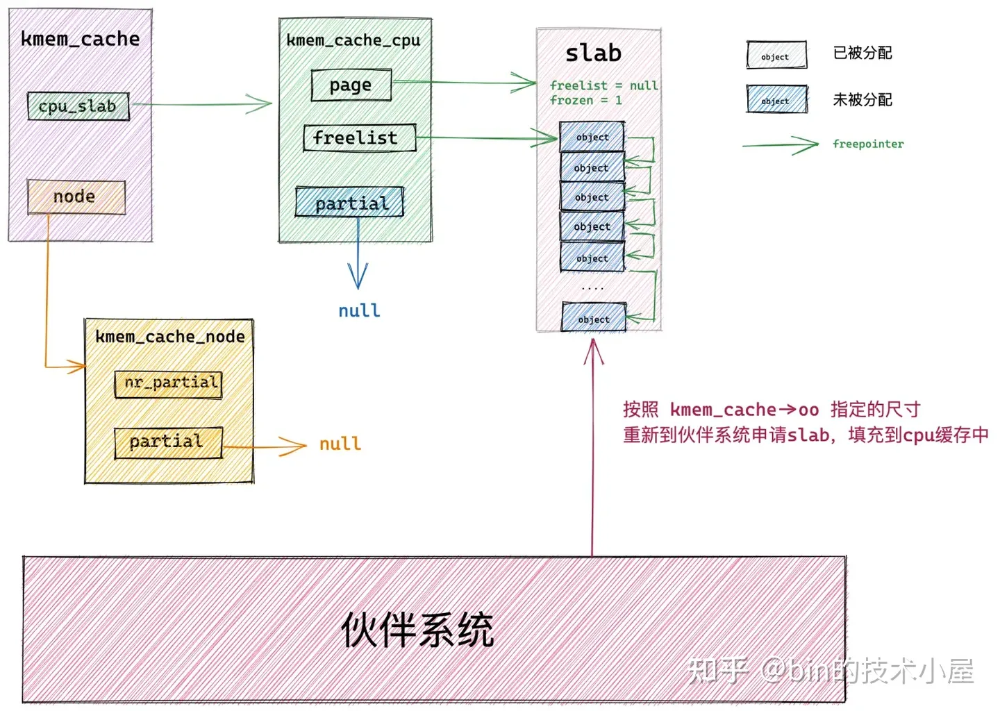

现在 slab cache 的本地 cpu 缓存被重新填充了，内核直接从本地 cpu 缓存中，通过 `kmem_cache_cpu->freelist` 指针将缓存 slab 中的第一个空闲对象分配出去，随后更新 `kmem_cache_cpu->freelist` 指向 slab 中的下一个空闲对象。

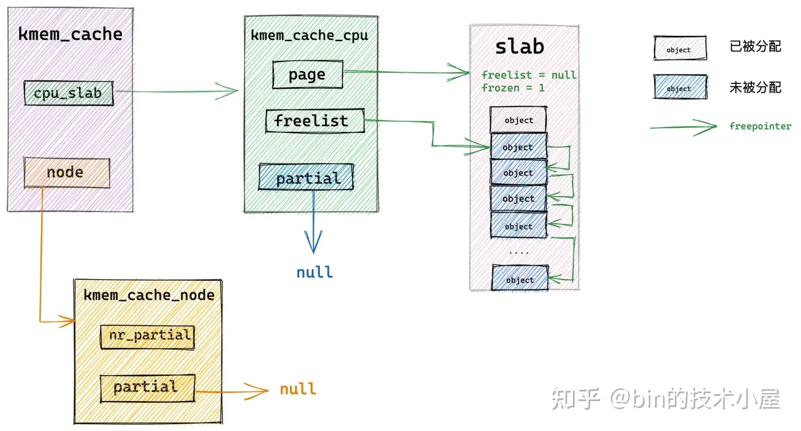

#### slab 内存释放原理

##### 释放对象所属 slab 在 cpu 本地缓存中

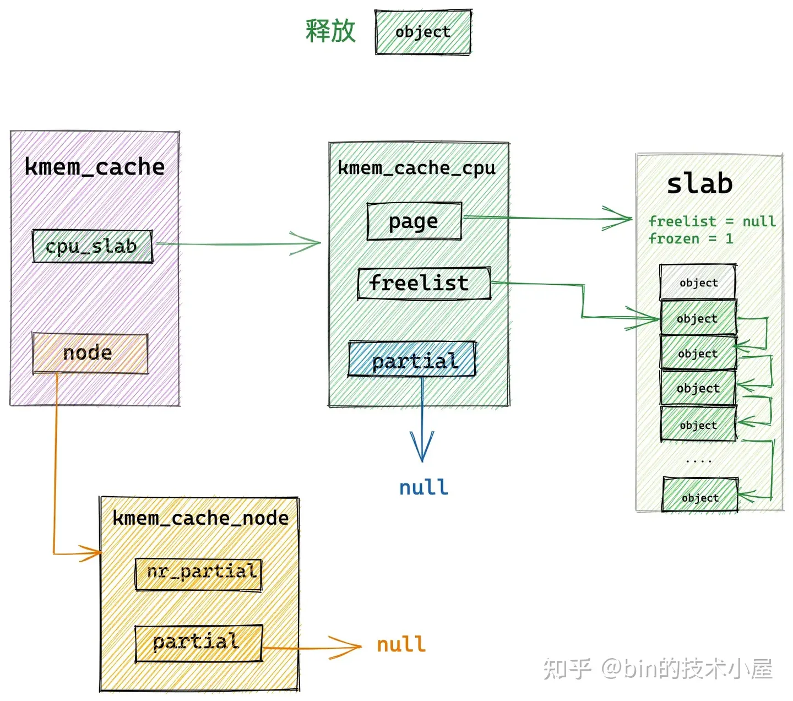

如果将要释放回 slab cache 的对象所在的 slab 刚好是本地 cpu 缓存中缓存的 slab，那么内核直接会把对象释放回缓存的 slab 中，这个就是 slab cache 的快速内存释放路径 fastpath。随后修正 `kmem_cache_cpu->freelist` 指针使其指向刚刚被释放的对象，释放对象的 freepointer 指针指向原来 `kmem_cache_cpu->freelist` 指向的对象。

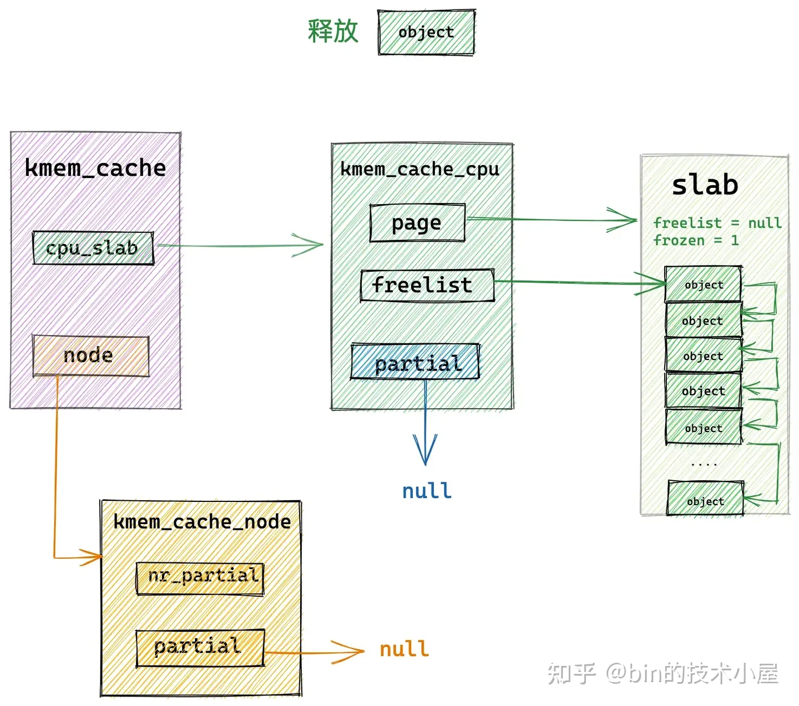

##### 释放对象所属 slab 在 cpu 本地缓存 partial 列表中

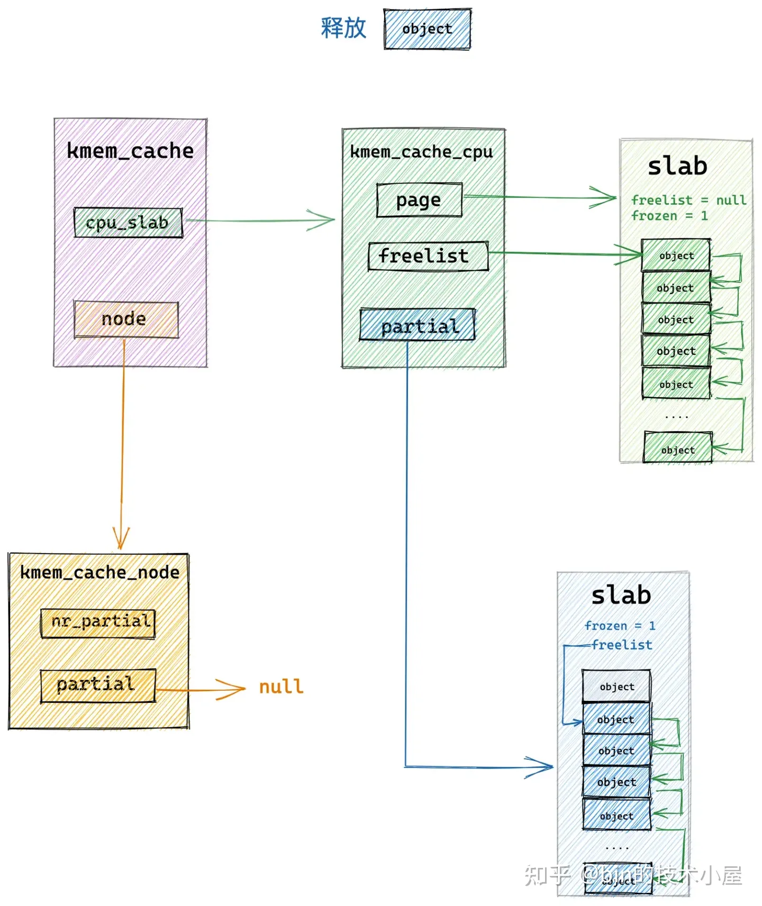

当释放的对象所属的 slab 在 cpu 本地缓存 `kmem_cache_cpu->partial` 链表中时，内核也是直接将对象释放回 slab 中，然后修改 slab （`struct page`）中的 freelist 指针指向刚刚被释放的对象。释放对象的 freepointer 指向其下一个空闲对象。

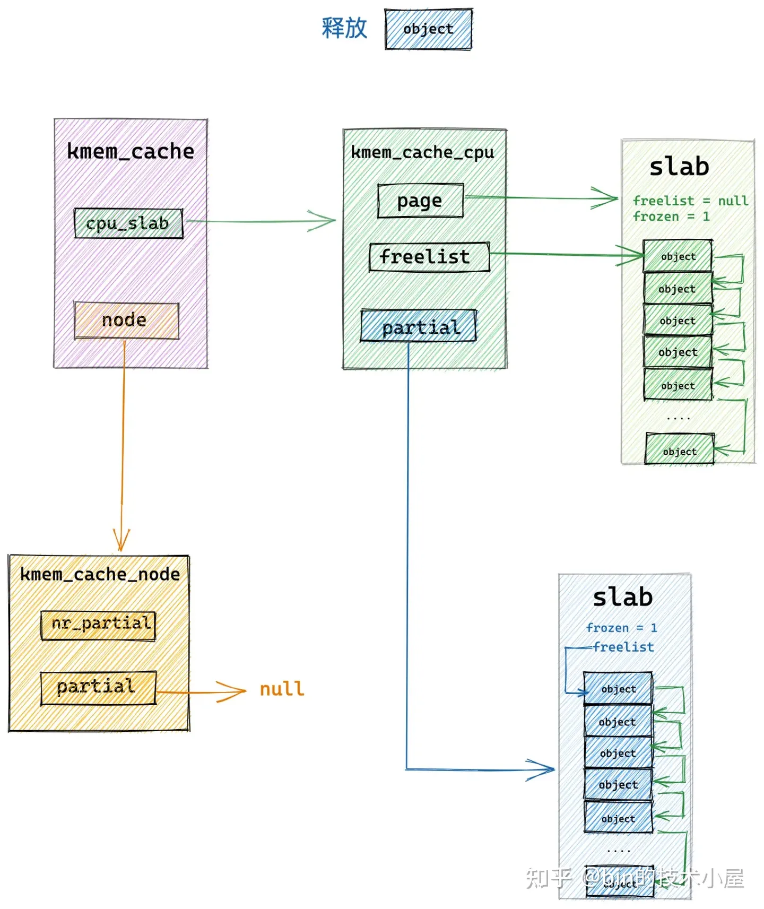

##### 释放对象所属 slab 从 full slab 变为了 partial slab

当前释放对象所在的 slab 原来是一个 full slab，由于对象的释放刚好变成了一个 partial slab，并且该 slab 原来并不在 slab cache 的本地 cpu 缓存中。

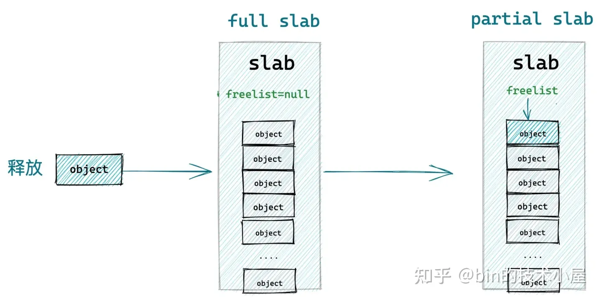

这种情况下，当对象释放回 slab 之后，内核为了利用局部性的优势需要把该 slab 在插入到 slab cache 的本地 cpu 缓存 `kmem_cache_cpu->partial` 链表中。因为 slab 之前之所以是一个 full slab，恰恰证明了该 slab 是一个非常活跃的 slab，常常供不应求导致变成了一个 full slab，当对象释放之后，刚好变成 partial slab，这时需要将这个被频繁访问的 slab 放入 cpu 缓存中，加快下次分配对象的速度。

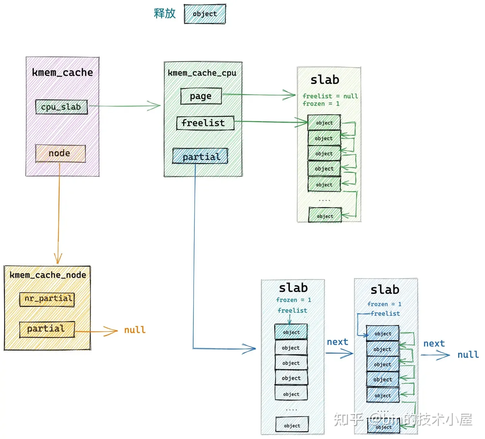

以上只是 slab 被释放回 `kmem_cache_cpu->partial` 链表的正常流程，slab cache 的本地 cpu 缓存 `kmem_cache_cpu->partial` 链表中的容量不可能是无限制增长的，它受到 `kmem_cache` 结构中 `cpu_partial` 属性的限制


当每次向 `kmem_cache_cpu->partial` 链表中填充 slab 的时候，内核都需要首先检查当前 `kmem_cache_cpu->partial` 链表中所有 slabs 所包含的空闲对象总数是否超过了 `cpu_partial` 的限制。如果没有超过限制，则将 slab 插入到 `kmem_cache_cpu->partial` 链表的头部，如果超过了限制，则需要首先将当前 `kmem_cache_cpu->partial` 链表中的所有 slab 转移至对应的 NUMA 节点缓存 `kmem_cache_node->partial` 链表的尾部，然后才能将释放对象所在的 slab 插入到 `kmem_cache_cpu->partial` 链表中。

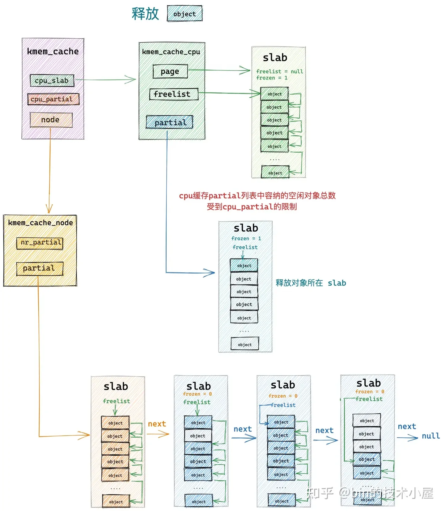

内核这里为什么要把 `kmem_cache_cpu->partial` 链表中的 slab 一次性全部移动到 `kmem_cache_node->partial` 链表中呢？这样一来如果在 slab cache 的本地 cpu 缓存不够的情况下，不是还要从 `kmem_cache_node->partial` 链表中再次转移 slab 填充 `kmem_cache_cpu` 吗？其实做任何设计都是要考虑当前场景的，当 slab cache 演进到如上图所示的架构时，说明内核当前所处的场景是一个内存释放频繁的场景，由于内存频繁的释放，所以导致 `kmem_cache_cpu->partial` 链表中的空闲对象都快被填满了，已经超过了 `cpu_partial` 的限制。所以在内存频繁释放的场景下，`kmem_cache_cpu->partial` 链表太满了，而内存分配的请求又不是很多，`kmem_cache_cpu` 中缓存的 slab 并不会频繁的消耗。这样一来，就需要将链表中的所有 slab 一次性转移到 NUMA 节点缓存 partial 链表中备用。否则的话，就得频繁的转移 slab，这样性能消耗更大。但是当前释放对象所在的 slab 仍然会被添加到 `kmem_cache_cpu->partial` 表中，用以应对不那么频繁的内存分配需求。

##### 释放对象所属 slab 从 partial slab 变为了 empty slab

如果释放对象所属的 slab 原来是一个 partial slab，在对象释放之后变成了一个 empty slab，在这种情况下，内核将会把该 slab 插入到 slab cache 的备用仓库 NUMA 节点缓存中。因为 slab 之所以会变成 empty slab，表明该 slab 并不是一个活跃的 slab，内核已经好久没有从该 slab 中分配对象了，所以只能把它释放回 `kmem_cache_node->partial` 链表中作为本地 cpu 缓存的后备选项。

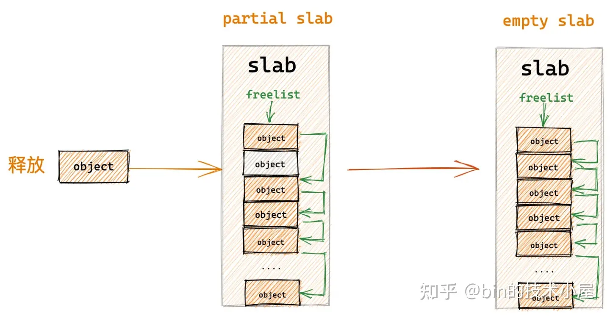

但是 `kmem_cache_node->partial` 链表中的 slab 不可能是无限增长的，链表中缓存的 slab 个数受到 `kmem_cache` 结构中 `min_partial` 属性的限制。所以内核在将 slab 插入到 `kmem_cache_node->partial` 链表之前，需要检查当前 `kmem_cache_node->partial` 链表中缓存的 slab 个数 `nr_partial` 是否已经超过了 `min_partial` 的限制。如果超过了限制，则直接将 slab 释放回伙伴系统中，如果没有超过限制，才会将 slab 插入到 `kmem_cache_node->partial` 链表中。

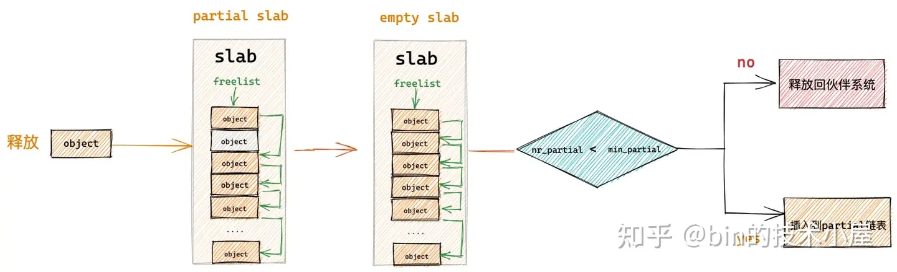

还有一种直接释放回 `kmem_cache_node->partial` 链表的情形是，释放对象所属的 slab 本来就在 `kmem_cache_node->partial` 链表中，这种情况下就是直接释放对象回 slab 中，无需改变 slab 的位置。

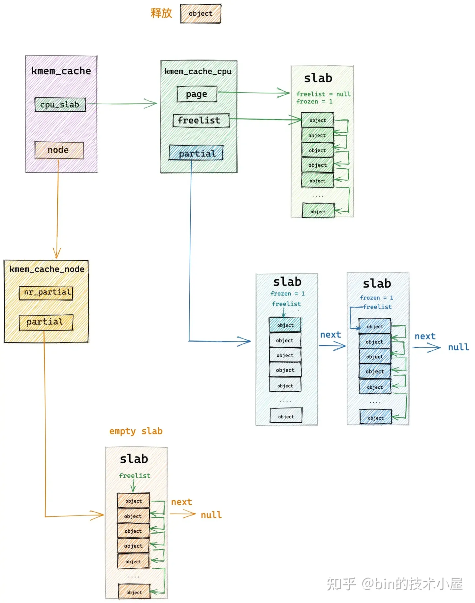

#### kmem_cache_create


```c
struct kmem_cache *
kmem_cache_create(const char *name, unsigned int size, unsigned int align,
        slab_flags_t flags, void (*ctor)(void *))
{
    return kmem_cache_create_usercopy(name, size, align, flags, 0, 0,
                      ctor);
}
```

内核提供 `kmem_cache_create_usercopy` 函数的目的其实是为了防止 slab cache 中管理的内核核心对象被泄露，通过 useroffset 和 usersize 两个变量来指定内核对象内存布局区域中 useroffset 到 usersize 的这段内存区域可以被复制到用户空间中，其他区域则不可以。在 Linux 内核初始化的过程中会提前为内核核心对象创建好对应的 slab cache，比如：在内核初始化函数 `start_kernel` 中调用 `fork_init` 函数为 `struct task_struct` 创建其所属的 slab cache —— `task_struct_cachep`。在 `fork_init` 中就调用了 `kmem_cache_create_usercopy` 函数来创建 `task_struct_cachep`，同时指定 `task_struct` 对象中 useroffset 到 usersize 这段内存区域可以被复制到用户空间。例如：通过 ptrace 系统调用访问进程的 task_struct 结构时，只能访问 task_struct 对象 useroffset 到 usersize 的这段区域。

```c
void __init fork_init(void)
{
    ......
    unsigned long useroffset, usersize;

    /* create a slab on which task_structs can be allocated */
    task_struct_whitelist(&useroffset, &usersize);
    task_struct_cachep = kmem_cache_create_usercopy("task_struct",
            arch_task_struct_size, align,
            SLAB_PANIC|SLAB_ACCOUNT,
            useroffset, usersize, NULL);
            
    ......
}

struct kmem_cache *
kmem_cache_create_usercopy(const char *name,
          unsigned int size, unsigned int align,
          slab_flags_t flags,
          unsigned int useroffset, unsigned int usersize,
          void (*ctor)(void *))
{
    struct kmem_cache *s = NULL;
    const char *cache_name;
    int err;

    // 获取 cpu_hotplug_lock，防止 cpu 热插拔改变 online cpu map
    get_online_cpus();
    // 获取 mem_hotplug_lock，防止访问内存的时候进行内存热插拔
    get_online_mems();
    // memory cgroup 相关，获取 memcg_cache_ids_sem 读写信号量，防止 memcg_nr_cache_ids （caches array 大小）被修改
    memcg_get_cache_ids();
    // 获取 slab cache 链表的全局互斥锁
    mutex_lock(&slab_mutex);

    // 入参检查，校验 name 和 size 的有效性，防止创建过程在中断上下文中进行
    err = kmem_cache_sanity_check(name, size);
    if (err) {
        goto out_unlock;
    }

    // 检查有效的 slab flags 标记位，如果传入的 flag 是无效的，则拒绝本次创建请求
    if (flags & ~SLAB_FLAGS_PERMITTED) {
        err = -EINVAL;
        goto out_unlock;
    }

    // 设置创建 slab  cache 时用到的一些标志位
    flags &= CACHE_CREATE_MASK;

    // 校验 useroffset 和 usersize 的有效性
    if (WARN_ON(!usersize && useroffset) ||
        WARN_ON(size < usersize || size - usersize < useroffset))
        usersize = useroffset = 0;

    if (!usersize)
        /* 在全局 slab cache 链表中查找与当前创建参数相匹配的 kmem_cache
         * 如果有，就不需要创建新的了，直接和已有的 slab cache 合并
         * 并且在 sys 文件系统中使用指定的 name 作为已有  slab cache  的别名
         */
        s = __kmem_cache_alias(name, size, align, flags, ctor);
    if (s)
        goto out_unlock;
    /* 在内核中为指定的 name 生成字符串常量并分配内存
     * 这里的 cache_name 就是将要创建的 slab cache 名称，用于在 /proc/slabinfo 中显示
     */
    cache_name = kstrdup_const(name, GFP_KERNEL);
    if (!cache_name) {
        err = -ENOMEM;
        goto out_unlock;
    }
    // 按照指定的参数，创建新的 slab cache
    s = create_cache(cache_name, size,
             calculate_alignment(flags, align, size),
             flags, useroffset, usersize, ctor, NULL, NULL);
    if (IS_ERR(s)) {
        err = PTR_ERR(s);
        kfree_const(cache_name);
    }

out_unlock:
    // 走到这里表示创建 slab cache 失败，释放相关的自旋锁和信号量
    mutex_unlock(&slab_mutex);
    memcg_put_cache_ids();
    put_online_mems();
    put_online_cpus();

    if (err) {
        if (flags & SLAB_PANIC)
            panic("kmem_cache_create: Failed to create slab '%s'. Error %d\n",
                name, err);
        else {
            pr_warn("kmem_cache_create(%s) failed with error %d\n",
                name, err);
            dump_stack();
        }
        return NULL;
    }
    return s;
}
```

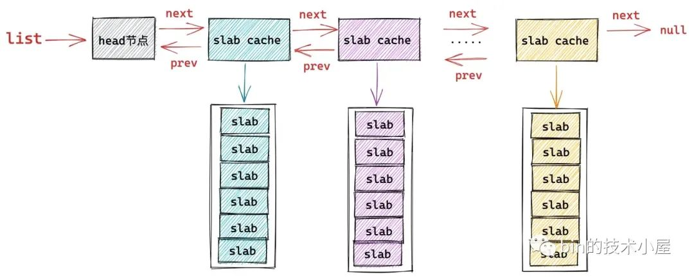

##### __kmem_cache_alias

`__kmem_cache_alias` 函数的核心是在 `find_mergeable` 方法中，内核在 `find_mergeable` 方法里边会遍历 slab cache 的全局链表 list，查找与当前创建参数贴近可以被复用的 slab cache。

一个可以被复用的 slab cache 需要满足以下四个条件：

1. 指定的 slab_flags_t 相同。
2. 指定对象的 object size 要小于等于已有 slab cache 中的对象 size （`kmem_cache->size`）。
3. 如果指定对象的 object size 与已有 `kmem_cache->size` 不相同，那么它们之间的差值需要再一个 word size 之内。
4. 已有 slab cache 中的 slab 对象对齐 align （`kmem_cache->align`）要大于等于指定的 align 并且可以整除 align 。

```c
struct kmem_cache *
__kmem_cache_alias(const char *name, unsigned int size, unsigned int align,
           slab_flags_t flags, void (*ctor)(void *))
{
    struct kmem_cache *s, *c;
    /* 在全局 slab cache 链表中查找与当前创建参数相匹配的 slab cache
     * 如果在全局查找到一个 slab cache，它的核心参数和指定的创建参数很贴近
     * 那么就没必要再创建新的 slab cache了，复用已有的 slab cache
     */
    s = find_mergeable(size, align, flags, name, ctor);
    if (s) {
        // 如果存在可复用的 kmem_cache，则将它的引用计数 + 1
        s->refcount++;
        // 采用较大的值，更新已有的 kmem_cache 相关的元数据
        s->object_size = max(s->object_size, size);
        s->inuse = max(s->inuse, ALIGN(size, sizeof(void *)));
        // 遍历 mem cgroup 中的 cache array，更新对应的元数据
        for_each_memcg_cache(c, s) {
            c->object_size = s->object_size;
            c->inuse = max(c->inuse, ALIGN(size, sizeof(void *)));
        }
        /* 由于这里会复用已有的 kmem_cache 并不会创建新的，而且指定的 kmem_cache 名称是 name。
         * 为了看起来像是创建了一个名称为 name 的新 kmem_cache，所以要给被复用的 kmem_cache 起一个别名，
         * 这个别名就是指定的 name。在 sys 文件系统中使用指定的 name 为被复用 kmem_cache 创建别名
         * 这样一来就会在 sys 文件系统中出现一个这样的目录 /sys/kernel/slab/name ，
         * 该目录下的文件包含了对应 slab cache 运行时的详细信息
         */
        if (sysfs_slab_alias(s, name)) {
            s->refcount--;
            s = NULL;
        }
    }

    return s;
}
```

如果通过 `find_mergeable` 在现有系统中所有 slab cache 中找到了一个可以复用的 slab cache，那么就不需要在创建新的了，直接返回已有的 slab cache 就可以了。

系统中的所有 slab cache 都会在 sys 文件系统中有一个专门的目录：`/sys/kernel/slab/<cachename>`，该目录下的所有文件都是 read only 的，每一个文件代表 slab cache 的一项运行时信息，比如：

- `/sys/kernel/slab/<cachename>/align` 文件标识该 slab cache 中的 slab 对象的对齐 align
- `/sys/kernel/slab/<cachename>/alloc_fastpath` 文件记录该 slab cache 在快速路径下分配的对象个数
- `/sys/kernel/slab/<cachename>/alloc_from_partial` 文件记录该 slab cache 从本地 cpu 缓存 partial 链表中分配的对象次数
- `/sys/kernel/slab/<cachename>/alloc_slab` 文件记录该 slab cache 从伙伴系统中申请新 slab 的次数
- `/sys/kernel/slab/<cachename>/cpu_slabs` 文件记录该 slab cache 的本地 cpu 缓存中缓存的 slab 个数
- `/sys/kernel/slab/<cachename>/partial` 文件记录该 slab cache 在每个 NUMA 节点缓存 partial 链表中的 slab 个数
- `/sys/kernel/slab/<cachename>/objs_per_slab` 文件记录该 slab cache 中管理的 slab 可以容纳多少个对象。

该目录下还有很多文件笔者就不一一列举了， `/sys/kernel/slab/<cachename>` 目录下的文件描述了对应 slab cache 非常详细的运行信息。由于并没有真正创建一个新的 slab cache，而是复用系统中已有的 slab cache，但是内核需要让用户感觉上已经按照指定的创建参数创建了一个新的 slab cache，所以需要为创建的 slab cache 也单独在 sys 文件系统中创建一个 `/sys/kernel/slab/name` 目录，但是该目录下的文件需要**软链接**到原有 slab cache 在 sys 文件系统对应目录下的文件。这就相当于给原有 slab cache 起了一个别名，这个别名就是指定的 name，但是 `/sys/kernel/slab/name` 目录下的文件还是用的原有 slab cache 的。可以通过 `/sys/kernel/slab/<cachename>/aliases` 文件查看该 slab cache 的所有别名个数，也就是说有多少个 slab cache 复用了该 slab cache 。

```objectivec
struct kmem_cache *find_mergeable(unsigned int size, unsigned int align,
        slab_flags_t flags, const char *name, void (*ctor)(void *))
{
    struct kmem_cache *s;
    // 与 word size 进行对齐
    size = ALIGN(size, sizeof(void *));
    // 根据指定的对齐参数 align 并结合 CPU cache line 大小，计算出一个合适的对齐参数
    align = calculate_alignment(flags, align, size);
    // 对象 size 重新按照 align 进行对齐
    size = ALIGN(size, align);

    // 如果 flag 设置的是不允许合并，则停止
    if (flags & SLAB_NEVER_MERGE)
        return NULL;

    // 开始遍历内核中已有的 slab cache，寻找可以合并的 slab cache
    list_for_each_entry_reverse(s, &slab_root_caches, root_caches_node) {
        if (slab_unmergeable(s))
            continue;
        // 指定对象 size 不能超过已有 slab cache 中的对象 size
        if (size > s->size)
            continue;
        // 校验指定的 flag 是否与已有 slab cache 中的 flag 一致
        if ((flags & SLAB_MERGE_SAME) != (s->flags & SLAB_MERGE_SAME))
            continue;
        // 两者的 size 相差在一个 word size 之内 
        if (s->size - size >= sizeof(void *))
            continue;
        // 已有 slab cache 中对象的对齐 align 要大于等于指定的 align 并且可以整除 align。
        if (IS_ENABLED(CONFIG_SLAB) && align &&
            (align > s->align || s->align % align))
            continue;
        // 查找到可以合并的已有 slab cache，不需要再创建新的 slab cache 了
        return s;
    }
    return NULL;
}

static unsigned int calculate_alignment(slab_flags_t flags,
        unsigned int align, unsigned int size)
{
    // SLAB_HWCACHE_ALIGN 表示需要按照硬件 cache line 对齐
    if (flags & SLAB_HWCACHE_ALIGN) {
        unsigned int ralign;
        // 获取 cache line 大小 通常为 64 字节
        ralign = cache_line_size();
        // 根据指定对齐参数 align ，对象 object size 以及 cache line 大小，综合计算出一个合适的对齐参数 ralign 出来
        while (size <= ralign / 2)
            ralign /= 2;
        align = max(align, ralign);
    }

    // ARCH_SLAB_MINALIGN 为 slab 设置的最小对齐参数， 8 字节大小，align 不能小于该值
    if (align < ARCH_SLAB_MINALIGN)
        align = ARCH_SLAB_MINALIGN;
    // 与 word size 进行对齐
    return ALIGN(align, sizeof(void *));
}
```

##### create_cache

```c
static struct kmem_cache *create_cache(const char *name,
        unsigned int object_size, unsigned int align,
        slab_flags_t flags, unsigned int useroffset,
        unsigned int usersize, void (*ctor)(void *),
        struct mem_cgroup *memcg, struct kmem_cache *root_cache)
{
    struct kmem_cache *s;
    /* 为将要创建的 slab cache 分配 kmem_cache 结构
     * kmem_cache 也是内核的一个核心数据结构，同样也会被它对应的 slab cache 所管理
     * 这里就是从 kmem_cache 所属的 slab cache 中拿出一个 kmem_cache 对象出来
     */
    s = kmem_cache_zalloc(kmem_cache, GFP_KERNEL);

    // 利用指定的创建参数初始化 kmem_cache 结构
    s->name = name;
    s->size = s->object_size = object_size;
    s->align = align;
    s->ctor = ctor;
    s->useroffset = useroffset;
    s->usersize = usersize;
    /* 创建 slab cache 的核心函数，这里会初始化 kmem_cache 结构中的其他重要属性
     * 包括创建初始化 kmem_cache_cpu 和 kmem_cache_node 结构
     */
    err = __kmem_cache_create(s, flags);
    if (err)
        goto out_free_cache;
    // slab cache 初始状态下，引用计数为 1
    s->refcount = 1;
    // 将刚刚创建出来的 slab cache 加入到 slab cache 在内核中的全局链表管理
    list_add(&s->list, &slab_caches);

out:
    if (err)
        return ERR_PTR(err);
    return s;

out_free_cache:
    // 创建过程出现错误之后，释放 kmem_cache 对象
    kmem_cache_free(kmem_cache, s);
    goto out;
}
```

slab cache 的数据结构 `struct kmem_cache` 属于内核的核心数据结构，有其专属的 slab cache 来专门管理 `kmem_cache` 对象的分配与释放。内核在启动阶段，会专门为 `struct kmem_cache` 创建其专属的 slab cache，保存在全局变量 `kmem_cache` 中。

```c
// 全局变量，用于专门管理 kmem_cache 对象的 slab cache，定义在文件：/mm/slab_common.c
struct kmem_cache *kmem_cache;
```

同理，slab cache 的 NUMA 节点缓存 `kmem_cache_node` 结构也是如此，内核也会为其创建一个专属的 slab cache，保存在全局变量 `kmem_cache_node` 中。

```c
// 全局变量，用于专门管理 kmem_cache_node 对象的 slab cache，定义在文件：/mm/slub.c
static struct kmem_cache *kmem_cache_node;
```

```c
int __kmem_cache_create(struct kmem_cache *s, slab_flags_t flags)
{
    int err;
    // 核心函数，在这里会初始化 kmem_cache 的其他重要属性
    err = kmem_cache_open(s, flags);
    if (err)
        return err;

    /* 检查内核中 slab 分配器的整体体系是否已经初始化完毕，只有状态是 FULL 的时候才是初始化完毕，其他的状态表示未初始化完毕。
     * 在 slab  allocator 体系初始化的时候在 slab_sysfs_init 函数中将 slab_state 设置为 FULL
     */
    if (slab_state <= UP)
        return 0;
    // 在 sys 文件系统中创建 /sys/kernel/slab/name 节点，该目录下的文件包含了对应 slab cache 运行时的详细信息
    err = sysfs_slab_add(s);
    if (err)
        // 出现错误则释放 kmem_cache 结构
        __kmem_cache_release(s);

    return err;
}

// slab allocator 整个体系的状态 slab_state。
enum slab_state {
    DOWN,           /* No slab functionality yet */
    PARTIAL,        /* SLUB: kmem_cache_node available */
    UP,             /* Slab caches usable but not all extras yet */
    FULL            /* Everything is working */
};

__initcall(slab_sysfs_init);

static int __init slab_sysfs_init(void)
{
    struct kmem_cache *s;
    int err;

    mutex_lock(&slab_mutex);

    slab_kset = kset_create_and_add("slab", &slab_uevent_ops, kernel_kobj);
    if (!slab_kset) {
        mutex_unlock(&slab_mutex);
        pr_err("Cannot register slab subsystem.\n");
        return -ENOSYS;
    }

    slab_state = FULL;
    
    .......

}
```

##### kmem_cache_open

```c
static int kmem_cache_open(struct kmem_cache *s, slab_flags_t flags)
{
    /* 计算 slab 中对象的整体内存布局所需要的 size，slab 所需最合适的内存页面大小 order，slab 中所能容纳的对象个数
     * 初始化 slab cache 中的核心参数 oo , min , max 的值
     */
    if (!calculate_sizes(s, -1))
        goto error;

    /* 设置 slab cache 在 node 缓存 kmem_cache_node 中的 partial 列表中 slab 的最小个数 min_partial
     * slab 个数超过该值，空闲的 empty slab 则会被回收至伙伴系统
     */
    set_min_partial(s, ilog2(s->size) / 2);
    /* 设置 slab cache 在 cpu 本地缓存的 partial 列表中所能容纳的最大空闲对象个数
     * cpu 本地缓存 partial 链表中空闲对象的数量超过该值，则会将 cpu 本地缓存 partial 链表中的所有 slab 转移到 numa node 缓存中。
     */
    set_cpu_partial(s);

    // 为 slab cache 创建并初始化 node cache 数组
    if (!init_kmem_cache_nodes(s))
        goto error;
    // 为 slab cache 创建并初始化 cpu 本地缓存列表
    if (alloc_kmem_cache_cpus(s))
        return 0;
}
```

##### calculate_sizes

```c
static int calculate_sizes(struct kmem_cache *s, int forced_order)
{
    slab_flags_t flags = s->flags;
    unsigned int size = s->object_size;
    unsigned int order;

    // 为了提高 cpu 访问对象的速度，slab 对象的 object size 首先需要与 word size 进行对齐
    size = ALIGN(size, sizeof(void *));

#ifdef CONFIG_SLUB_DEBUG
    /* SLAB_POISON：对象中毒标识，是 slab 中的一个术语，用于将对象所占内存填充某些特定的值，表示这块对象不同的使用状态，防止非法越界访问。
     * 比如：在将对象分配出去之前，会将对象所占内存用 0x6b 填充，并用 0xa5 填充 object size 区域的最后一个字节。
     * SLAB_TYPESAFE_BY_RCU：启用 RCU 锁释放 slab
     */
    if ((flags & SLAB_POISON) && !(flags & SLAB_TYPESAFE_BY_RCU) &&
            !s->ctor)
        s->flags |= __OBJECT_POISON;
    else
        s->flags &= ~__OBJECT_POISON;

    /* SLAB_RED_ZONE：表示在空闲对象前后插入 red zone 红色区域（填充特定字节 0xbb），防止对象溢出越界
     * size == s->object_size 表示对象 object size 与 word size 本来就是对齐的，并没有填充任何字节
     * 这时就需要在对象 object size 内存区域的后面插入一段 word size 大小的 red zone。
     * 如果对象 object size 与 word size 不是对齐的，填充了字节，那么这段填充的字节恰好可以作为右侧 red zone，而不需要额外分配 red zone 空间
     */
    if ((flags & SLAB_RED_ZONE) && size == s->object_size)
        size += sizeof(void *);
#endif

    /* inuse 表示 slab 中的对象实际使用的内存区域大小
     * 该值是经过与 word size 对齐之后的大小，如果设置了 SLAB_RED_ZONE，则也包括红色区域大小
     */
    s->inuse = size;

    if (((flags & (SLAB_TYPESAFE_BY_RCU | SLAB_POISON)) ||
        s->ctor)) {
        /* 如果开启了 RCU 保护或者设置了对象 poison或者设置了对象的构造函数，这些都会占用对象中的内存空间。
         * 这种情况下，需要额外增加一个 word size 大小的空间来存放 free pointer，否则 free pointer 存储在对象的起始位置
         * offset 为 free pointer 与对象起始地址的偏移
         */
        s->offset = size;
        size += sizeof(void *);
    }

#ifdef CONFIG_SLUB_DEBUG
    if (flags & SLAB_STORE_USER)
        // SLAB_STORE_USER 表示需要跟踪对象的分配和释放信息，需要再对象的末尾增加两个 struct track 结构，存储分配和释放的信息
        size += 2 * sizeof(struct track);

#ifdef CONFIG_SLUB_DEBUG
    if (flags & SLAB_RED_ZONE) {
        // 在对象内存区域的左侧增加 red zone，大小为 red_left_pad，防止对这块对象内存的写越界
        size += sizeof(void *);
        s->red_left_pad = sizeof(void *);
        s->red_left_pad = ALIGN(s->red_left_pad, s->align);
        size += s->red_left_pad;
    }
#endif

    // slab 从它所申请的内存页 offset 0 开始，一个接一个的存储对象，调整对象的 size 保证对象之间按照指定的对齐方式 align 进行对齐
    size = ALIGN(size, s->align);
    s->size = size;
    // 这里 forced_order 传入的是 -1
    if (forced_order >= 0)
        order = forced_order;
    else
        // 计算 slab 所需要申请的内存页数（2 ^ order 个内存页）
        order = calculate_order(size);

    if ((int)order < 0)
        return 0;
    // 根据 slab 的 flag 设置，设置向伙伴系统申请内存时使用的 allocflags
    s->allocflags = 0;
    if (order)
        // slab 所需要的内存页多于 1 页时，则向伙伴系统申请复合页。
        s->allocflags |= __GFP_COMP;

    // 从 DMA 区域中获取适用于 DMA 的内存页
    if (s->flags & SLAB_CACHE_DMA)
        s->allocflags |= GFP_DMA;
    // 从 DMA32 区域中获取适用于 DMA 的内存页
    if (s->flags & SLAB_CACHE_DMA32)
        s->allocflags |= GFP_DMA32;
    // 申请可回收的内存页
    if (s->flags & SLAB_RECLAIM_ACCOUNT)
        s->allocflags |= __GFP_RECLAIMABLE;

    /* 计算 slab cache 中的 oo，min，max 值，一个 slab 到底需要多少个内存页，能够存储多少个对象
     * 低 16 为存储 slab 所能包含的对象总数，高 16 为存储 slab 所需的内存页个数
     */
    s->oo = oo_make(order, size);
    // get_order 函数计算出的 order 为容纳一个 size 大小的对象至少需要的内存页个数
    s->min = oo_make(get_order(size), size);
    if (oo_objects(s->oo) > oo_objects(s->max))
        // 初始时 max 和 oo 相等
        s->max = s->oo;
    // 返回 slab 中所能容纳的对象个数
    return !!oo_objects(s->oo);
}

#define OO_SHIFT    16

struct kmem_cache_order_objects {
     // 高 16 为存储 slab 所需的内存页个数，低 16 为存储 slab 所能包含的对象总数
    unsigned int x;
};

static inline struct kmem_cache_order_objects oo_make(unsigned int order,
        unsigned int size)
{
    struct kmem_cache_order_objects x = {
        // 高 16 为存储 slab 所需的内存页个数，低 16 为存储 slab 所能包含的对象总数
        (order << OO_SHIFT) + order_objects(order, size)
    };

    return x;
}

static inline unsigned int order_objects(unsigned int order, unsigned int size)
{
    // 根据 slab 中包含的物理内存页个数以及对象的 size，计算 slab 可容纳的对象个数
    return ((unsigned int)PAGE_SIZE << order) / size;
}

static inline unsigned int oo_order(struct kmem_cache_order_objects x)
{
    // 获取高 16 位，slab 中所需要的内存页 order
    return x.x >> OO_SHIFT;
}

// 十进制为：65535，二进制为：16 个 1，用于截取低 16 位
#define OO_MASK     ((1 << OO_SHIFT) - 1) 

static inline unsigned int oo_objects(struct kmem_cache_order_objects x)
{
    // 获取低 16 位，slab 中能容纳的对象个数
    return x.x & OO_MASK;
}
```

##### calculate_order

```c
static unsigned int slub_min_order;
static unsigned int slub_max_order = PAGE_ALLOC_COSTLY_ORDER;// 3
static unsigned int slub_min_objects;

static inline int calculate_order(unsigned int size)
{
    unsigned int order;
    unsigned int min_objects;
    unsigned int max_objects;

    // 计算 slab 中可以容纳的最小对象个数
    min_objects = slub_min_objects;
    if (!min_objects)
        /* nr_cpu_ids 表示当前系统中的 cpu 个数
         * fls 可以获取参数的最高有效 bit 的位数，比如 fls(0)=0，fls(1)=1，fls(4) = 3
         * 如果当前系统中有4个cpu，那么 min_object 的初始值为 4*(3+1) = 16 
         */
        min_objects = 4 * (fls(nr_cpu_ids) + 1);
    // slab 最大内存页 order 初始为 3，也就是 slab 最多只能向伙伴系统中申请 8 个内存页。计算 slab 最大可容纳的对象个数
    max_objects = order_objects(slub_max_order, size);
    min_objects = min(min_objects, max_objects);

    while (min_objects > 1) {
        // slab 中的碎片控制系数，碎片大小不能超过 (slab 所占内存大小 / fraction)，fraction 值越大，slab 中所能容忍的碎片就越小
        unsigned int fraction;

        fraction = 16;
        while (fraction >= 4) {
            // 根据当前 fraction 计算 order，需要查找出能够使 slab 产生碎片最小化的 order 值出来
            order = slab_order(size, min_objects,
                    slub_max_order, fraction);
             // order 不能超过 max_order，否则需要降低 fraction，放宽对碎片的要求限制，重新循环计算
            if (order <= slub_max_order)
                return order;
            fraction /= 2;
        }
        // 进一步放宽对 min_object 的要求，slab 会尝试少放一些对象
        min_objects--;
    }

    /* 经过前边 while 循环的计算，无法在这一个 slab 中放置多个 size 大小的对象，因为 min_object = 1 的时候就退出循环了。
     * 那么下面就会尝试看能不能只放入一个对象
     */
    order = slab_order(size, 1, slub_max_order, 1);
    if (order <= slub_max_order)
        return order;
    // 流程到这里表示，要池化的对象 size 太大了，slub_max_order 都放不下，现在只能放宽对 max_order 的限制到 MAX_ORDER = 11
    order = slab_order(size, 1, MAX_ORDER, 1);
    if (order < MAX_ORDER)
        return order;
    return -ENOSYS;
}

// 一个 page 最多允许存放 32767 个对象
#define MAX_OBJS_PER_PAGE	32767

static inline unsigned int slab_order(unsigned int size,
        unsigned int min_objects, unsigned int max_order,
        unsigned int fract_leftover)
{
    unsigned int min_order = slub_min_order;
    unsigned int order;

    // 如果 2 ^ min_order 个内存页可以存放的对象个数超过 32767 限制，那么返回 size * MAX_OBJS_PER_PAGE 所需要的 order 减 1
    if (order_objects(min_order, size) > MAX_OBJS_PER_PAGE)
        return get_order(size * MAX_OBJS_PER_PAGE) - 1;

    // 从 slab 所需要的最小 order 到最大 order 之间开始遍历，查找能够使 slab 碎片最小的 order 值
    for (order = max(min_order, (unsigned int)get_order(min_objects * size));
            order <= max_order; order++) {
        // slab 在当前 order 下，所占用的内存大小
        unsigned int slab_size = (unsigned int)PAGE_SIZE << order;
        unsigned int rem;
        // slab 的碎片大小：分配完 object 之后，所产生的碎片大小
        rem = slab_size % size;
        // 碎片大小 rem 不能超过 slab_size / fract_leftover 即符合要求
        if (rem <= slab_size / fract_leftover)
            break;
    }

    return order;
}

// 根据给定的 size 计算出所需最小的 order，size 在 [2^(n-1) * PAGE_SIZE + 1， 2^n * PAGE_SIZE] 之间， order = n
static inline __attribute_const__ int get_order(unsigned long size)
{
    if (__builtin_constant_p(size)) {
        if (!size)
            return BITS_PER_LONG - PAGE_SHIFT;

        if (size < (1UL << PAGE_SHIFT))
            return 0;

        return ilog2((size) - 1) - PAGE_SHIFT + 1;
    }

    size--;
    size >>= PAGE_SHIFT;
#if BITS_PER_LONG == 32
    return fls(size);
#else
    return fls64(size);
#endif
}
```

##### set_min_partial

```c
#define MIN_PARTIAL 5
#define MAX_PARTIAL 10

/* 计算 slab cache 在 node 中缓存的个数，kmem_cache_node 中 partial 列表中 slab 个数的上限 min_partial
 * 超过该值，空闲的 slab 就会被回收，初始 min = ilog2(s->size) / 2，必须保证 min_partial 的值 在 [MIN_PARTIAL,MAX_PARTIAL] 之间
 */
static void set_min_partial(struct kmem_cache *s, unsigned long min)
{
    if (min < MIN_PARTIAL)
        min = MIN_PARTIAL;
    else if (min > MAX_PARTIAL)
        min = MAX_PARTIAL;
    s->min_partial = min;
}
```

##### set_cpu_partial

```c
/* 设置 kmem_cache 结构的 cpu_partial 属性，该值限制了 slab cache 在 cpu 本地缓存的 partial 列表中所能容纳的最大空闲对象个数。
 * 同时该值也决定了当 kmem_cache_cpu->partial 链表为空时，
 * 内核会从 kmem_cache_node->partial 链表填充 cpu_partial / 2 个 slab 到 kmem_cache_cpu->partial 链表中。
 */
static void set_cpu_partial(struct kmem_cache *s)
{
// 当配置了 CONFIG_SLUB_CPU_PARTIAL，则 slab cache 的 cpu 本地缓存 kmem_cache_cpu 中包含 partial 列表
#ifdef CONFIG_SLUB_CPU_PARTIAL
    // 判断 kmem_cache_cpu 是否包含有 partial 列表
    if (!kmem_cache_has_cpu_partial(s))
        s->cpu_partial = 0;
    else if (s->size >= PAGE_SIZE)
        s->cpu_partial = 2;
    else if (s->size >= 1024)
        s->cpu_partial = 6;
    else if (s->size >= 256)
        s->cpu_partial = 13;
    else
        s->cpu_partial = 30;
#endif
}
```

##### init_kmem_cache_nodes

```c
static int init_kmem_cache_nodes(struct kmem_cache *s)
{
    int node;
    // 遍历所有的 numa 节点，为 slab cache 创建 node cache
    for_each_node_state(node, N_NORMAL_MEMORY) {
        struct kmem_cache_node *n;
		/* 当 slub 在系统启动阶段初始化时，创建 kmem_cache_node cache 的时候，此时 slab_state == DOWN
         * 由于此时 kmem_cache_node cache 正在创建，所以无法利用 kmem_cache_node 所属的 slub cache 动态的分配 kmem_cache_node 对象
         * 这里会通过 early_kmem_cache_node_alloc 函数静态的分配 kmem_cache_node 对象，并初始化。
         */
        if (slab_state == DOWN) {
            // 创建 boot_kmem_cache_node 时会走到这个分支
            early_kmem_cache_node_alloc(node);
            continue;
        }
        /* 为 node cache 分配对应的 kmem_cache_node 对象，kmem_cache_node 对象也由它对应的 slab cache 管理
         * 而当 slab 体系在初始化 boot_kmem_cache 时，这时 slab_state 为 PARTIAL，流程就会走到这里。
         * 表示此时 boot_kmem_cache_node 已经初始化，可以利用它动态的分配 kmem_cache_node 对象了
         * 这里的 kmem_cache_node 就是 boot_kmem_cache_node
         */
        n = kmem_cache_alloc_node(kmem_cache_node,
                        GFP_KERNEL, node);
        // 初始化 node cache
        init_kmem_cache_node(n);
        // 初始化 slab cache 结构 kmem_cache 中的 node 数组
        s->node[node] = n;
    }
    return 1;
}

static void
init_kmem_cache_node(struct kmem_cache_node *n)
{
    n->nr_partial = 0;
    spin_lock_init(&n->list_lock);
    INIT_LIST_HEAD(&n->partial);
#ifdef CONFIG_SLUB_DEBUG
    atomic_long_set(&n->nr_slabs, 0);
    atomic_long_set(&n->total_objects, 0);
    INIT_LIST_HEAD(&n->full);
#endif
}
```

##### alloc_kmem_cache_cpus

```c
static inline int alloc_kmem_cache_cpus(struct kmem_cache *s)
{
    /* 为 slab cache 分配 cpu 本地缓存结构 kmem_cache_cpu
     * __alloc_percpu 函数在内核中专门用于分配 percpu 类型的结构体（the percpu allocator）
     * kmem_cache_cpu 结构也是 percpu 类型的，这里通过 __alloc_percpu 直接分配
     */
    s->cpu_slab = __alloc_percpu(sizeof(struct kmem_cache_cpu),
                     2 * sizeof(void *));
    // 初始化 cpu 本地缓存结构 kmem_cache_cpu
    init_kmem_cache_cpus(s);
    return 1;
}
static void init_kmem_cache_cpus(struct kmem_cache *s)
{
    int cpu;
    /* 遍历所有CPU，通过 per_cpu_ptr 将前面分配的 kmem_cache_cpu 结构与对应的 CPU 关联对应起来
     * 同时初始化 kmem_cache_cpu 变量里面的 tid 为其所关联 cpu 的编号
     */
    for_each_possible_cpu(cpu)
        per_cpu_ptr(s->cpu_slab, cpu)->tid = init_tid(cpu);
}
```

##### first slab cache

在 slab cache 创建的过程中需要创建两个特殊的数据结构：

- 一个是 slab cache 自身的管理结构 `struct kmem_cache`。
- 另一个是 slab cache 在 NUMA 节点中的缓存结构 `struct kmem_cache_node`。

而 `struct kmem_cache` 和 `struct kmem_cache_node` 同样也都是内核的核心数据结构，他俩各自也有一个专属的 slab cache 来管理 `kmem_cache` 对象和 `kmem_cache_node` 对象的分配与释放。

```c
// 全局变量，用于专门管理 kmem_cache 对象的 slab cache，定义在文件：/mm/slab_common.c
struct kmem_cache *kmem_cache;

// 全局变量，用于专门管理 kmem_cache_node 对象的 slab cache，定义在文件：/mm/slub.c
static struct kmem_cache *kmem_cache_node;
```

slab cache 的 cpu 本地缓存结构 `struct kmem_cache_cpu` 是一个 percpu 类型的变量，由 `__alloc_percpu`直接创建，并不需要一个专门的 slab cache 来管理。在 slab cache 的创建过程中，内核首先需要向 `struct kmem_cache` 结构专属的 slab cache 申请一个 `kmem_cache` 对象。当 `kmem_cache` 对象初始化完成之后，内核需要向 `struct kmem_cache_node` 结构专属的 slab cache 申请一个 `kmem_cache_node` 对象，作为 slab cache 在 NUMA 节点中的缓存结构。

那么问题来了，`kmem_cache` 和 `kmem_cache_node` 这两个 slab cache 是怎么来的？因为他俩本质上是一个 slab cache，而 slab cache 的创建又需要 `kmem_cache` （slab cache）和 `kmem_cache_node` （slab cache），当系统中第一个 slab cache 被创建的时候，此时并没有 `kmem_cache` （slab cache），也没有 `kmem_cache_node` （slab cache），这就变成死锁了，是一个先有鸡还是先有蛋的问题。

```c
void __init kmem_cache_init(void)
{
    /* slab allocator 体系结构中最核心的就是 kmem_cache 结构和 kmem_cache_node 结构，而这两个结构同时又被各自的 slab cache 所管理
     * 而现在 slab allocator 体系还未创建，所以需要利用两个静态的结构来创建 kmem_cache，kmem_cache_node 对象
     * 这里就是定义两个 kmem_cache 类型的静态局部变量（静态结构）：内核启动的时候被加载进 BSS 段中，随后会为其分配内存。
     * boot_kmem_cache 用于临时创建 kmem_cache 结构。
     * boot_kmem_cache_node 用于临时创建 kmem_cache_node 结构
     * boot_kmem_cache 和 boot_kmem_cache_node 现在只是两个空的结构，需要静态的进行初始化。
     */
    static __initdata struct kmem_cache boot_kmem_cache,
        boot_kmem_cache_node;

    // 暂时先将这两个静态结构赋值给对应的全局变量，后面会初始化这两个全局变量
    kmem_cache_node = &boot_kmem_cache_node;
    kmem_cache = &boot_kmem_cache;

    // 静态地初始化 boot_kmem_cache_node，从这里可以看出 slab 体系，建立的第一个 slab cache 就是 kmem_cache_node(slab cache)
    create_boot_cache(kmem_cache_node, "kmem_cache_node",
        sizeof(struct kmem_cache_node), SLAB_HWCACHE_ALIGN, 0, 0);

    /* 当 kmem_cache_node （slab cache）被创建初始化之后，slab_state 变为 PARTIAL
     * 这个状态表示目前 kmem_cache_node cache 已经创建完毕，可以利用它动态分配 kmem_cache_node 对象了。
     */
    slab_state = PARTIAL;

    // 静态地初始化 boot_kmem_cache，从这里可以看出 slab 体系，建立的第二个 slab cache 就是 kmem_cache(slab cache)
    create_boot_cache(kmem_cache, "kmem_cache",
            offsetof(struct kmem_cache, node) +
                nr_node_ids * sizeof(struct kmem_cache_node *),
               SLAB_HWCACHE_ALIGN, 0, 0);

    /* 流程到这里，两个静态的 kmem_cache 结构：boot_kmem_cache，boot_kmem_cache_node 就已经初始化完毕了。
     * 但是这两个静态结构只是临时的，目的是为了在 slab 体系初始化阶段静态的创建 kmem_cache 对象和 kmem_cache_node 对象。
     * 在 bootstrap 中会将 boot_kmem_cache，boot_kmem_cache_node 中的内容深拷贝到最终的 kmem_cache（slab cache），
     * kmem_cache_node（slab cache）中。后面就可以利用这两个最终的核心结构来动态的进行 slab 创建。
     */
    kmem_cache = bootstrap(&boot_kmem_cache);
    kmem_cache_node = bootstrap(&boot_kmem_cache_node);

    ......
}

/* Create a cache during boot when no slab services are available yet */
void __init create_boot_cache(struct kmem_cache *s, const char *name,
        unsigned int size, slab_flags_t flags,
        unsigned int useroffset, unsigned int usersize)
{
    int err;
    unsigned int align = ARCH_KMALLOC_MINALIGN;

    // 下面就是静态初始化 kmem_cache 结构的逻辑，挨个对 kmem_cache 结构的核心属性进行静态赋值
    s->name = name;
    s->size = s->object_size = size;

    if (is_power_of_2(size))
        align = max(align, size);
    // 根据指定的对齐参数 align 以及 CPU Cache line 的大小计算出一个合适的 align 出来
    s->align = calculate_alignment(flags, align, size);

    s->useroffset = useroffset;
    s->usersize = usersize;
    /* 这里又来到了之前介绍的创建 slab cache 的创建流程
     * 该函数是创建 slab cache 的核心函数，这里会初始化 kmem_cache 结构中的其他重要属性
     * 以及创建初始化 slab cache 中的 cpu 本地缓存 和 node 节点缓存结构
     */
    err = __kmem_cache_create(s, flags);
    // 暂时不需要合并 merge，引用计数设置为 -1
    s->refcount = -1; 
}

static void early_kmem_cache_node_alloc(int node)
{
    /* slab 的本质就是一个或者多个物理内存页 page，这里用于指向 slab 所属的 page。
     * 如果 slab 是由多个物理页 page 组成（复合页），这里指向复合页的首页
     */
    struct page *page;
    // 这里主要为 boot_kmem_cache_node 初始化它的 node cache 数组，这里会静态创建指定 node 节点对应的 kmem_cache_node 结构
    struct kmem_cache_node *n;

    /* 此时 boot_kmem_cache_node 这个 kmem_cache 结构已经初始化好了。
     * 根据 kmem_cache 结构中的 kmem_cache_order_objects oo 属性向指定 node 节点所属的伙伴系统申请 2^order 个内存页 page
     * 这里返回复合页的首页，目的是为 kmem_cache_node 结构分配 slab，后续该 slab 会挂在 kmem_cache_node 结构中的 partial 列表中
     */
    page = new_slab(kmem_cache_node, GFP_NOWAIT, node);

    // struct page 结构中的 freelist 指向 slab 中第一个空闲的对象，这里的对象就是 struct kmem_cache_node 结构
    n = page->freelist;
#ifdef CONFIG_SLUB_DEBUG
    // 根据 slab cache 中的 flag 初始化 kmem_cache_node 对象
    init_object(kmem_cache_node, n, SLUB_RED_ACTIVE);
#endif
    // 重新设置 slab 中的下一个空闲对象。这里是获取对象 n 中的 free_pointer 指针,指向 n 的下一个空闲对象
    page->freelist = get_freepointer(kmem_cache_node, n);
    // 表示 slab 中已经有一个对象被使用了
    page->inuse = 1;
    /* 这里可以看出 boot_kmem_cache_node 的 NUMA 节点缓存在这里初始化的时候
     * 内核会为每个 NUMA 节点申请一个 slab，并缓存在它的 partial 链表中
     * 并不是缓存在 boot_kmem_cache_node 的本地 cpu 缓存中
     */
    page->frozen = 0;
    // 这里的 kmem_cache_node 指的是 boot_kmem_cache_node，初始化 boot_kmem_cache_node 中的 node cache 数组
    kmem_cache_node->node[node] = n;
    // 初始化 node 节点对应的 kmem_cache_node 结构
    init_kmem_cache_node(n);
    // kmem_cache_node 结构中的 nr_slabs 计数加1，total_objects 加 page->objects
    inc_slabs_node(kmem_cache_node, node, page->objects);
    // 将新创建出来的 slab （page表示），添加到对象 n （kmem_cache_node结构）中的 partial 列表头部
    __add_partial(n, page, DEACTIVATE_TO_HEAD);
}
```

当 boot_kmem_cache_node 被初始化之后，它的整个结构如下图所示：

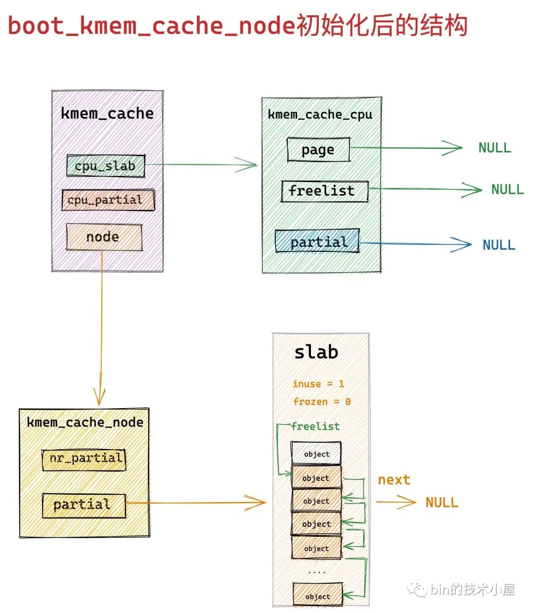

`boot_kmem_cache` 和 `boot_kmem_cache_node` 只是临时的 `kmem_cache 结构`，目的是在 slab allocator 体系初始化的时候用于静态创建 `kmem_cache` （slab cache）， `kmem_cache_node` （slab cache）。最后需要将这两个静态临时结构深拷贝到最终的全局 `kmem_cache` 结构中。

```c
static struct kmem_cache * __init bootstrap(struct kmem_cache *static_cache)
{
    int node;
    // kmem_cache 指向专门管理 kmem_cache 对象的 slab cache，该 slab cache 现在已经全部初始化完毕，可以利用它动态的分配最终的 kmem_cache 对象
    struct kmem_cache *s = kmem_cache_zalloc(kmem_cache, GFP_NOWAIT);
    struct kmem_cache_node *n;
    // 将静态的 kmem_cache 对象，比如：boot_kmem_cache，boot_kmem_cache_node 深拷贝到最终的 kmem_cache 对象 s 中
    memcpy(s, static_cache, kmem_cache->object_size);

    // 释放本地 cpu 缓存的 slab
    __flush_cpu_slab(s, smp_processor_id());
    /* 遍历 node cache 数组，修正 kmem_cache_node 结构中 partial 链表中包含的 slab（ page 表示）对应 page 结构的 slab_cache 指针
     * 使其指向最终的 kmem_cache 结构，之前在 create_boot_cache 中指向的静态 kmem_cache 结构，这里需要修正
     */
    for_each_kmem_cache_node(s, node, n) {
        struct page *p;

        list_for_each_entry(p, &n->partial, slab_list)
            p->slab_cache = s;
    }
    // 将最终的 kmem_cache 结构加入到全局 slab cache 链表中
    list_add(&s->list, &slab_caches);
    return s;
}
```

优先创建 `kmem_cache_node` 是为了在创建 `kmem_cache->kmem_cache_node` 可以直接动态创建，而非再走静态分配流程。

#### slab cache 分配内存

内核中通过 `kmem_cache_alloc_node` 函数要求 slab cache 从指定的 NUMA 节点中分配对象。

```c
// 定义在文件：/mm/slub.c
void *kmem_cache_alloc_node(struct kmem_cache *s, gfp_t gfpflags, int node)
{
    void *ret = slab_alloc_node(s, gfpflags, node, _RET_IP_);
    return ret;
}
```

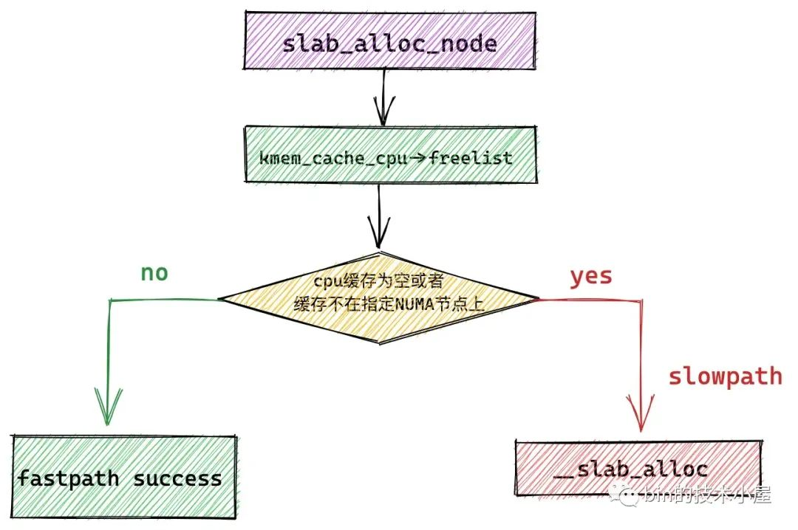

```c
static __always_inline void *slab_alloc_node(struct kmem_cache *s,
        gfp_t gfpflags, int node, unsigned long addr)
{
    // 用于指向分配成功的对象
    void *object;
    // slab cache 在当前 cpu 下的本地 cpu 缓存
    struct kmem_cache_cpu *c;
    // object 所在的内存页
    struct page *page;
    // 当前 cpu 编号
    unsigned long tid;

redo:
    /* slab cache 首先尝试从当前 cpu 本地缓存 kmem_cache_cpu 中获取空闲对象
     * 这里的 do..while 循环是要保证获取到的 cpu 本地缓存 c 是属于执行进程的当前 cpu
     * 因为进程可能由于抢占或者中断的原因被调度到其他 cpu 上执行，所需需要确保两者的 tid 是否一致
     */
    do {
        // 获取执行当前进程的 cpu 中的 tid 字段
        tid = this_cpu_read(s->cpu_slab->tid);
        // 获取 cpu 本地缓存 cpu_slab
        c = raw_cpu_ptr(s->cpu_slab);
        /* 如果开启了 CONFIG_PREEMPT 表示允许优先级更高的进程抢占当前 cpu
         * 如果发生抢占，当前进程可能被重新调度到其他 cpu 上运行，所以需要检查此时运行当前进程的 cpu tid 是否与刚才获取的 cpu 本地缓存一致
         * 如果两者的 tid 字段不一致，说明进程已经被调度到其他 cpu 上了， 需要再次获取正确的 cpu 本地缓存
         */
    } while (IS_ENABLED(CONFIG_PREEMPT) &&
         unlikely(tid != READ_ONCE(c->tid)));

    /* 从 slab cache 的 cpu 本地缓存 kmem_cache_cpu 中获取缓存的 slub 空闲对象列表
     * 这里的 freelist 指向本地 cpu 缓存的 slub 中第一个空闲对象
     */
    object = c->freelist;
    // 获取本地 cpu 缓存的 slub，这里用 page 表示，如果是复合页，这里指向复合页的首页 head page
    page = c->page;
    if (unlikely(!object || !node_match(page, node))) {
        /* 如果 slab cache 的 cpu 本地缓存中已经没有空闲对象了
         * 或者 cpu 本地缓存中的 slub 并不属于指定的 NUMA 节点
         * 那么就需要进入慢速路径中分配对象:
         * 1. 检查 kmem_cache_cpu 的 partial 列表中是否有空闲的 slub
         * 2. 检查 kmem_cache_node 的 partial 列表中是否有空闲的 slub
         * 3. 如果都没有，则只能重新到伙伴系统中去申请内存页
         */
        object = __slab_alloc(s, gfpflags, node, addr, c);
        // 统计 slab cache 的状态信息，记录本次分配走的是慢速路径 slow path
        stat(s, ALLOC_SLOWPATH);
    } else {
        /* 走到该分支表示，slab cache 的 cpu 本地缓存中还有空闲对象，直接分配
         * 快速路径 fast path 下分配成功，从当前空闲对象中获取下一个空闲对象指针 next_object        
         */
        void *next_object = get_freepointer_safe(s, object);
        // 更新 kmem_cache_cpu 结构中的 freelist 指向 next_object
        if (unlikely(!this_cpu_cmpxchg_double(
                s->cpu_slab->freelist, s->cpu_slab->tid,
                object, tid,
                next_object, next_tid(tid)))) {

            note_cmpxchg_failure("slab_alloc", s, tid);
            goto redo;
        }
        // cpu 预取 next_object 的 freepointer 到 cpu 高速缓存，加快下一次分配对象的速度
        prefetch_freepointer(s, next_object);
        stat(s, ALLOC_FASTPATH);
    }

    // 如果 gfpflags 掩码中设置了  __GFP_ZERO，则需要将对象所占的内存初始化为零值
    if (unlikely(slab_want_init_on_alloc(gfpflags, s)) && object)
        memset(object, 0, s->object_size);
    // 返回分配好的对象
    return object;
}
```

##### fastpath

```c
static inline void *get_freepointer_safe(struct kmem_cache *s, void *object)
{
    // freepointer 在 object 内存区域的起始地址
    unsigned long freepointer_addr;
    // 指向下一个空闲对象的 free_pontier
    void *p;
    // free_pointer 位于 object 起始地址的 offset 偏移处
    freepointer_addr = (unsigned long)object + s->offset;
    // 获取 free_pointer 指向的地址（下一个空闲对象）
    probe_kernel_read(&p, (void **)freepointer_addr, sizeof(p));
    // 返回下一个空闲对象地址
    return freelist_ptr(s, p, freepointer_addr);
}
```

##### slowpath

```c
static void *__slab_alloc(struct kmem_cache *s, gfp_t gfpflags, int node,
              unsigned long addr, struct kmem_cache_cpu *c)
{
    void *p;
    unsigned long flags;
    // 关闭 cpu 中断，防止并发访问
    local_irq_save(flags);
#ifdef CONFIG_PREEMPT
    /* 当开启了 CONFIG_PREEMPT，表示允许其他进程抢占当前 cpu
     * 运行进程的当前 cpu 可能会被其他优先级更高的进程抢占，当前进程可能会被调度到其他 cpu 上
     * 所以这里需要重新获取 slab cache 的 cpu 本地缓存
     */
    c = this_cpu_ptr(s->cpu_slab);
#endif
    // 进入 slab cache 的慢速分配路径
    p = ___slab_alloc(s, gfpflags, node, addr, c);
    // 恢复 cpu 中断
    local_irq_restore(flags);
    return p;
}
```

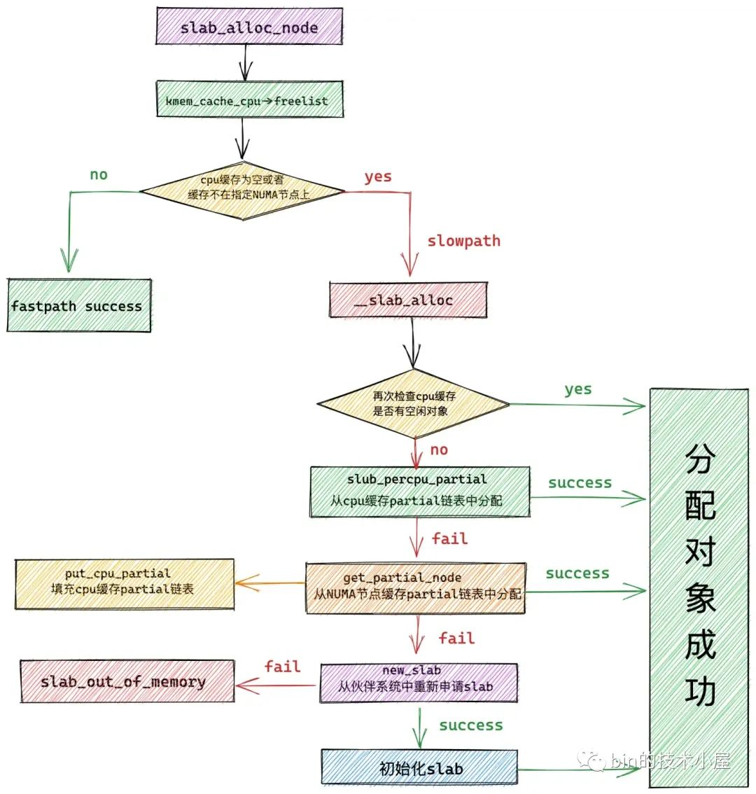

```c
static void *___slab_alloc(struct kmem_cache *s, gfp_t gfpflags, int node,
              unsigned long addr, struct kmem_cache_cpu *c)
{
    // 指向 slub 中可供分配的第一个空闲对象
    void *freelist;
    // 空闲对象所在的 slub （用 page 表示）
    struct page *page;
    // 从 slab cache 的本地 cpu 缓存中获取缓存的 slub
    page = c->page;
    if (!page)
        // 如果缓存的 slub 中的对象已经被全部分配出去，没有空闲对象了，那么就会跳转到 new_slab 分支进行降级处理走慢速分配路径
        goto new_slab;
redo:

    /* 这里需要再次检查 slab cache 本地 cpu 缓存中的 freelist 是否有空闲对象
     * 因为当前进程可能被中断，当重新调度之后，其他进程可能已经释放了一些对象到缓存 slab 中
     * freelist 可能此时就不为空了，所以需要再次尝试一下
     */
    freelist = c->freelist;
    if (freelist)
        // 从 cpu 本地缓存中的 slub 中直接分配对象
        goto load_freelist;

    /* 本地 cpu 缓存的 slub 用 page 结构来表示，这里是检查 page 结构的 freelist 是否还有空闲对象
     * c->freelist 表示的是本地 cpu 缓存的空闲对象列表，刚刚已经检查过了
     * 现在检查的 page->freelist ，它表示由其他 cpu 所释放的空闲对象列表
     * 因为此时有可能其他 cpu 又释放了一些对象到 slub 中这时 slub 对应的 page->freelist 不为空，可以直接分配
     */
    freelist = get_freelist(s, page);
    // 注意这里的 freelist 已经变为 page->freelist ，并不是 c->freelist;
    if (!freelist) {
        // 此时 cpu 本地缓存的 slub 里的空闲对象已经全部耗尽，slub 从 cpu 本地缓存中脱离，进入 new_slab 分支走慢速分配路径
        c->page = NULL;
        stat(s, DEACTIVATE_BYPASS);
        goto new_slab;
    }

    stat(s, ALLOC_REFILL);

load_freelist:
    // 被 slab cache 的 cpu 本地缓存的 slub 所属的 page 必须是 frozen 冻结状态，只允许本地 cpu 从中分配对象
    VM_BUG_ON(!c->page->frozen);
    /* kmem_cache_cpu 中的 freelist 指向被 cpu 缓存 slub 中第一个空闲对象
     * 由于第一个空闲对象马上要被分配出去，所以这里需要获取下一个空闲对象更新 freelist
     */
    c->freelist = get_freepointer(s, freelist);
    // 更新 slab cache 的 cpu 本地缓存分配对象时的全局 transaction id，每当分配完一次对象，kmem_cache_cpu 中的 tid 都需要改变
    c->tid = next_tid(c->tid);
    // 返回第一个空闲对象
    return freelist;

new_slab:
    // 查看 kmem_cache_cpu->partial 链表中是否有 slab 可供分配对象
    if (slub_percpu_partial(c)) {
        /* 获取 cpu 本地缓存 kmem_cache_cpu 的 partial 列表中的第一个 slub （用 page 表示）
         * 并将这个 slub 提升为 cpu 本地缓存中的 slub，赋值给 c->page
         */
        page = c->page = slub_percpu_partial(c);
        // 将 partial 列表中第一个 slub （c->page）从 partial 列表中摘下，并将列表中的下一个 slub 更新为 partial 列表的头结点
        slub_set_percpu_partial(c, page);
        // 更新状态信息，记录本次分配是从 kmem_cache_cpu 的 partial 列表中分配
        stat(s, CPU_PARTIAL_ALLOC);
        /* 重新回到 redo 分支，这下就可以从 page->freelist 中获取对象了
         * 并且在 load_freelist 分支中将  page->freelist 更新到 c->freelist 中，page->freelist 设置为 null
         * 此时 slab cache 中的 cpu 本地缓存 kmem_cache_cpu 的 freelist 以及 page 就变为了 partial 列表中的 slub
         */
        goto redo;
    }

    /* 流程走到这里表示 slab cache 中的 cpu 本地缓存 partial 列表中也没有 slub 了
     * 需要近一步降级到 numa node cache —— kmem_cache_node 中的 partial 列表去查找
     * 如果还是没有，就只能去伙伴系统中申请新的 slub，然后分配对象
     * 该函数为 slab cache 在慢速路径下分配对象的核心逻辑
     */
    freelist = new_slab_objects(s, gfpflags, node, &c);

    if (unlikely(!freelist)) {
        // 如果伙伴系统中无法分配 slub 所需的 page，那么就提示内存不足，分配失败，返回 null
        slab_out_of_memory(s, gfpflags, node);
        return NULL;
    }

    page = c->page;
    if (likely(!kmem_cache_debug(s) && pfmemalloc_match(page, gfpflags)))
        /* 此时从 kmem_cache_node->partial 列表中获取的 slub 
         * 或者从伙伴系统中重新申请的 slub 已经被提升为本地 cpu 缓存了 kmem_cache_cpu->page
         * 这里需要跳转到 load_freelist 分支，从本地 cpu 缓存 slub 中获取第一个对象返回
         */
        goto load_freelist;
 
}

// 定义在文件 /include/linux/slub_def.h 中
#ifdef CONFIG_SLUB_CPU_PARTIAL
// 获取 slab cache 本地 cpu 缓存的 partial 列表
#define slub_percpu_partial(c)      ((c)->partial)
// 将 partial 列表中第一个 slub 摘下，提升为 cpu 本地缓存，用于后续快速分配对象
#define slub_set_percpu_partial(c, p)       \
({                      \
    slub_percpu_partial(c) = (p)->next; \
})
```

在 slab cache 的整个架构体系中的确存在两个 freelist：

- 一个是 `page->freelist`，因为 slab 在内核中是使用 `struct page` 结构来表示的，所以 `page->freelist` 只是单纯的站在 slab 的视角来表示 slab 中的空闲对象列表，这里不考虑 slab 在 slab cache 架构中的位置。
- 另一个是 `kmem_cache_cpu->freelist`，特指 slab 被 slab cache 的本地 cpu 缓存之后，slab 中的空闲对象链表。这里可以理解为 slab 中被 cpu 缓存的空闲对象。当 slab 被提升为 cpu 缓存之后，`page->freeelist` 直接赋值给 `kmem_cache_cpu->freelist`，然后 `page->freeelist` 置空。`slab->frozen` 设置为 1，表示 slab 被冻结在当前 cpu 的本地缓存中。

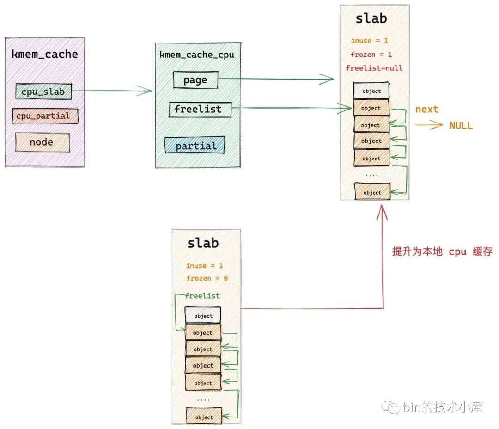

而 slab 一旦被当前 cpu 缓存，它的状态就变为了冻结状态（`slab->frozen` = 1），处于冻结状态下的 slab，当前 cpu 可以从该 slab 中分配或者释放对象，**但是其他 cpu 只能释放对象到该 slab 中，不能从该 slab 中分配对象**。

- 如果一个 slab 被一个 cpu 缓存之后，那么这个 cpu 在该 slab 看来就是本地 cpu，当本地 cpu 释放对象回这个 slab 的时候会释放回 `kmem_cache_cpu->freelist` 链表中
- 如果其他 cpu 想要释放对象回该 slab 时，其他 cpu 只能将对象释放回该 slab 的 `page->freelist` 中。

如下图所示，cpu1 在本地缓存了 slab1，cpu2 在本地缓存了 slab2，进程先从 slab1 中获取了一个对象，正常情况下如果进程一直在 cpu1 上运行的话，当进程释放该对象回 slab1 中时，会直接释放回 `kmem_cache_cpu1->freelist` 链表中。但如果进程在 slab1 中获取完对象之后，被调度到了 cpu2 上运行，这时进程想要释放对象回 slab1 中时，就不能走快速路径了，因为 cpu2 本地缓存的是 slab2，所以 cpu2 只能将对象释放至 slab1->freelist 中。

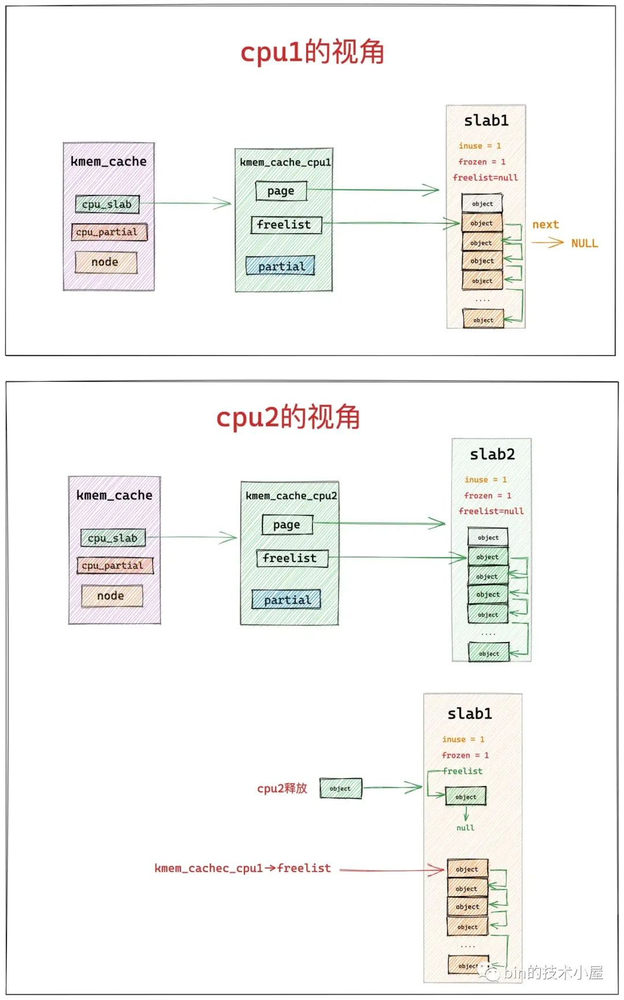

这种情况下，在 slab1 的内部视角里，就有了两个 freelist 链表，它们的共同之处都是用于组织 slab1 中的空闲对象，但是 `kmem_cache_cpu1->freelist` 链表中组织的是缓存在 cpu1 本地的空闲对象，slab1->freelist 链表组织的是由其他 cpu 释放的空闲对象。

再次回到 `___slab_alloc` 函数的开始处，首先内核会在 slab cache 的本地 cpu 缓存 `kmem_cache_cpu->freelist` 中查找是否有空闲对象，如果这里没有，内核会继续到 `page->freelist` 中查看是否有其他 cpu 释放的空闲对象。如果两个 freelist 链表都没有空闲对象了，那就证明 slab cache 在当前 cpu 本地缓存中的 slab 已经为空了，将该 slab 从当前 cpu 本地缓存中脱离解冻，程序跳转到 `new_slab` 分支进入慢速分配路径。

```c
// 查看 page->freelist 中是否有其他 cpu 释放的空闲对象
static inline void *get_freelist(struct kmem_cache *s, struct page *page)
{
    // 用于存放要更新的 page 属性值
    struct page new;
    unsigned long counters;
    void *freelist;

    do {
        /* 获取 page 结构的 freelist，当其他 cpu 向 page 释放对象时 freelist 指向被释放的空闲对象
         * 当 page 被 slab cache 的 cpu 本地缓存时，freelist 置为 null
         */
        freelist = page->freelist;
        counters = page->counters;

        new.counters = counters;
        VM_BUG_ON(!new.frozen);
        // 更新 inuse 字段，表示 page 中的对象 objects 全部被分配出去了
        new.inuse = page->objects;
        /* 如果 freelist != null，表示其他 cpu 又释放了一些对象到 page 中 （slub）。
         * 则 page->frozen = 1 , slub 依然冻结在 cpu 本地缓存中
         * 如果 freelist == null,则 page->frozen = 0， slub 从 cpu 本地缓存中脱离解冻
         */
        new.frozen = freelist != NULL;
        /* 最后 cas 原子更新 page 结构中的相应属性
         * 这里需要注意的是，当 page 被 slab cache 本地 cpu 缓存时，page->freelist 需要置空。
         * 因为在本地 cpu 缓存场景下 page->freelist 指向其他 cpu 释放的空闲对象列表
         * kmem_cache_cpu->freelist 指向的是被本地 cpu 缓存的空闲对象列表
         * 这两个列表中的空闲对象共同组成了 slub 中的空闲对象
         */
    } while (!__cmpxchg_double_slab(s, page,
        freelist, counters,
        NULL, new.counters,
        "get_freelist"));

    return freelist;
}

// slab cache 慢速路径下分配对象核心逻辑
static inline void *new_slab_objects(struct kmem_cache *s, gfp_t flags,
            int node, struct kmem_cache_cpu **pc)
{
    // 从 numa node cache 中获取到的空闲对象列表
    void *freelist;
    // slab cache 本地 cpu 缓存
    struct kmem_cache_cpu *c = *pc;
    // 分配对象所在的内存页
    struct page *page;
    /* 尝试从指定的 node 节点缓存 kmem_cache_node 中的 partial 列表获取可以分配空闲对象的 slub
     * 如果指定 numa 节点的内存不足，则会根据 cpu 访问距离的远近，进行跨 numa 节点分配
     */
    freelist = get_partial(s, flags, node, c);

    if (freelist)
        // 返回 numa cache 中缓存的空闲对象列表
        return freelist;
    /* 流程走到这里说明 numa cache 里缓存的 slub 也用尽了，无法找到可以分配对象的 slub 了
     * 只能向底层伙伴系统重新申请内存页（slub），然后从新的 slub 中分配对象
     */
    page = new_slab(s, flags, node);
    // 将新申请的内存页 page （slub），缓存到 slab cache 的本地 cpu 缓存中
    if (page) {
        // 获取 slab cache 的本地 cpu 缓存
        c = raw_cpu_ptr(s->cpu_slab);
        // 刷新本地 cpu 缓存，将旧的 slub 缓存与 cpu 本地缓存解绑
        if (c->page)
            flush_slab(s, c);

        // 将新申请的 slub 与 cpu 本地缓存绑定，page->freelist 赋值给 kmem_cache_cpu->freelist
        freelist = page->freelist;
        // 绑定之后  page->freelist 置空，现在新的 slub 中的空闲对象就已经缓存再了 slab cache 的本地 cpu 缓存中，后续就直接从这里分配了
        page->freelist = NULL;

        stat(s, ALLOC_SLAB);
        // 将新申请的 slub 对应的 page 赋值给 kmem_cache_cpu->page
        c->page = page;
        *pc = c;
    }
    // 返回空闲对象列表
    return freelist;
}

/* 选取合适的 NUMA 节点缓存，优先使用指定的 NUMA 节点，如果指定的 NUMA 节点中没有足够的内存，
 * 内核就会跨 NUMA 节点按照访问距离的远近，选取一个合适的 NUMA 节点。
 */
static void *get_partial(struct kmem_cache *s, gfp_t flags, int node,
        struct kmem_cache_cpu *c)
{
    // 从指定 node 的 kmem_cache_node 缓存中的 partial 列表中获取到的对象
    void *object;
    // 即将要所搜索的 kmem_cache_node 缓存对应 numa node
    int searchnode = node;
    // 如果指定的 numa node 已经没有空闲内存了，则选取访问距离最近的 numa node 进行跨节点内存分配
    if (node == NUMA_NO_NODE)
        searchnode = numa_mem_id();
    else if (!node_present_pages(node))
        searchnode = node_to_mem_node(node);

    // 从 searchnode 的 kmem_cache_node 缓存中的 partial 列表中获取对象
    object = get_partial_node(s, get_node(s, searchnode), c, flags);
    if (object || node != NUMA_NO_NODE)
        return object;
    /* 如果 searchnode 对象的 kmem_cache_node 缓存中的 partial 列表是空的，没有任何可供分配的 slub
     * 那么继续按照访问距离，遍历 searchnode 之后的 numa node，进行跨节点内存分配
     */
    return get_any_partial(s, flags, c);
}

/*
 * Try to allocate a partial slab from a specific node.
 */
static void *get_partial_node(struct kmem_cache *s, struct kmem_cache_node *n,
                struct kmem_cache_cpu *c, gfp_t flags)
{
    // 接下来就会挨个遍历 kmem_cache_node 的 partial 列表中的 slub，这两个变量用于临时存储遍历的 slub
    struct page *page, *page2;
    // 用于指向从 partial 列表 slub 中申请到的对象
    void *object = NULL;
    // 用于记录 slab cache 本地 cpu 缓存 kmem_cache_cpu 中所缓存的空闲对象总数（包括 partial 列表），后续会向 kmem_cache_cpu 中填充 slub
    unsigned int available = 0;
    // 临时记录遍历到的 slub 中包含的剩余空闲对象个数
    int objects;

    spin_lock(&n->list_lock);
    // 开始挨个遍历 kmem_cache_node 的 partial 列表，获取 slub 用于分配对象以及填充 kmem_cache_cpu
    list_for_each_entry_safe(page, page2, &n->partial, slab_list) {
        void *t;
        // page 表示当前遍历到的 slub，这里会从该 slub 中获取空闲对象赋值给 t，并将 slub 从 kmem_cache_node 的 partial 列表上摘下
        t = acquire_slab(s, n, page, object == NULL, &objects);
        // 如果 t 是空的，说明 partial 列表上已经没有可供分配对象的 slub 了，slub 都满了，退出循环，进入伙伴系统重新申请 slub
        if (!t)            
            break;
        /* objects 表示当前 slub 中包含的剩余空闲对象个数
         * available 用于统计目前遍历的 slub 中所有空闲对象个数
         * 后面会根据 available 的值来判断是否继续填充 kmem_cache_cpu
         */
        available += objects;
        if (!object) {
            // 第一次循环会走到这里，第一次循环主要是满足当前对象分配的需求，将 partial 列表中第一个 slub 缓存进 kmem_cache_cpu->page 中
            c->page = page;
            stat(s, ALLOC_FROM_PARTIAL);
            object = t;
        } else {
            /* 第二次以及后面的循环就会走到这里，目的是从 kmem_cache_node 的 partial 列表中摘下 slub，
             * 然后填充进 kmem_cache_cpu->partial 列表里
             */
            put_cpu_partial(s, page, 0);
            stat(s, CPU_PARTIAL_NODE);
        }
        /* 这里是用于判断是否继续填充 kmem_cache_cpu 中的 partial 列表
         * kmem_cache_has_cpu_partial 用于判断 slab cache 是否配置了 cpu 缓存的 partial 列表
         * 配置了 CONFIG_SLUB_CPU_PARTIAL 选项意味着开启 kmem_cache_cpu 中的 partial 列表，没有配置的话，cpu 缓存中就不会有 partial 列表
         * kmem_cache_cpu 中缓存被填充之后的空闲对象个数（包括 partial 列表）不能超过 ( kmem_cache 结构中 cpu_partial 指定的个数 / 2 )
         */
        if (!kmem_cache_has_cpu_partial(s)
            || available > slub_cpu_partial(s) / 2)
            // kmem_cache_cpu 已经填充满了，就退出循环，停止填充
            break;

    }
  
    spin_unlock(&n->list_lock);
    return object;
}

/* 从 kmem_cache_node 的 partial 列表中摘下一个 slub 分配对象
 * 随后将摘下的 slub 放入 cpu 本地缓存 kmem_cache_cpu 中缓存，后续分配对象直接就会 cpu 缓存中分配
 */
static inline void *acquire_slab(struct kmem_cache *s,
        struct kmem_cache_node *n, struct page *page,
        int mode, int *objects)
{
    void *freelist;
    unsigned long counters;
    struct page new;

    lockdep_assert_held(&n->list_lock);
    // page 表示即将从 kmem_cache_node 的 partial 列表摘下的 slub，获取 slub 中的空闲对象列表 freelist
    freelist = page->freelist;
    counters = page->counters;
    new.counters = counters;
    // objects 存放该 slub 中还剩多少空闲对象
    *objects = new.objects - new.inuse;
    /* mode = true 表示将 slub 摘下之后填充到 kmem_cache_cpu 缓存中
     * mode = false 表示将 slub 摘下之后填充到 kmem_cache_cpu 缓存的 partial 列表中
     */
    if (mode) {
        new.inuse = page->objects;
        new.freelist = NULL;
    } else {
        new.freelist = freelist;
    }
    // slub 放入 kmem_cache_cpu 之后需要冻结，其他 cpu 不能从这里分配对象，只能释放对象
    new.frozen = 1;
    // 更新 slub （page表示）中的 freelist 和 counters
    if (!__cmpxchg_double_slab(s, page,
            freelist, counters,
            new.freelist, new.counters,
            "acquire_slab"))
        return NULL;
    // 将 slub （page表示）从 kmem_cache_node 的 partial 列表上摘下
    remove_partial(n, page);
    // 返回 slub 中的空闲对象列表
    return freelist;
}

static struct page *new_slab(struct kmem_cache *s, gfp_t flags, int node)
{
    return allocate_slab(s,
        flags & (GFP_RECLAIM_MASK | GFP_CONSTRAINT_MASK), node);
}

static struct page *allocate_slab(struct kmem_cache *s, gfp_t flags, int node)
{
    // 用于指向从伙伴系统中申请到的内存页
    struct page *page;
    /* kmem_cache 结构的中的 kmem_cache_order_objects oo，表示该 slub 需要多少个内存页，以及能够容纳多少个对象
     * kmem_cache_order_objects 的高 16 位表示需要的内存页个数，低 16 位表示能够容纳的对象个数
     */
    struct kmem_cache_order_objects oo = s->oo;
    // 控制向伙伴系统申请内存的行为规范掩码
    gfp_t alloc_gfp;
    void *start, *p, *next;
    int idx;
    bool shuffle;
    // 向伙伴系统申请 oo 中规定的内存页
    page = alloc_slab_page(s, alloc_gfp, node, oo);
    if (unlikely(!page)) {
        /* 如果伙伴系统无法满足正常情况下 oo 指定的内存页个数
         * 那么这里再次尝试用 min 中指定的内存页个数向伙伴系统申请内存页
         * min 表示当内存不足或者内存碎片的原因无法满足内存分配时，至少要保证容纳一个对象所使用内存页个数
         */
        oo = s->min;
        alloc_gfp = flags;
        // 再次向伙伴系统申请容纳一个对象所需要的内存页（降级）
        page = alloc_slab_page(s, alloc_gfp, node, oo);
        if (unlikely(!page))
            // 如果内存还是不足，则走到 out 分支直接返回 null
            goto out;
        stat(s, ORDER_FALLBACK);
    }
    // 初始化 slub 对应的 struct page 结构中的属性，获取 slub 可以容纳的对象个数
    page->objects = oo_objects(oo);
    // 将 slub cache 与 page 结构关联
    page->slab_cache = s;
    // 将 PG_slab 标识设置到 struct page 的 flag 属性中，表示该内存页 page 被 slub 所管理
    __SetPageSlab(page);
    // 用 0xFC 填充 slub 中的内存，用于内核对内存访问越界检查
    kasan_poison_slab(page);
    // 获取内存页对应的虚拟内存地址
    start = page_address(page);
    /* 在配置了 CONFIG_SLAB_FREELIST_RANDOM 选项的情况下
     * 会在 slub 的空闲对象中以随机的顺序初始化 freelist 列表
     * 返回值 shuffle = true 表示随机初始化 freelist，shuffle = false 表示按照正常的顺序初始化 freelist    
     */
    shuffle = shuffle_freelist(s, page);
    // shuffle = false 则按照正常的顺序来初始化 freelist
    if (!shuffle) {
        /* 获取 slub 第一个空闲对象的真正起始地址
         * slub 可能配置了 SLAB_RED_ZONE，这样会在 slub 对象内存空间两侧填充 red zone，防止内存访问越界
         * 这里需要跳过 red zone 获取真正存放对象的内存地址
         */
        start = fixup_red_left(s, start);
        // 填充对象的内存区域以及初始化空闲对象
        start = setup_object(s, page, start);
        // 用 slub 中的第一个空闲对象作为 freelist 的头结点，而不是随机的一个空闲对象
        page->freelist = start;
        // 从 slub 中的第一个空闲对象开始，按照正常的顺序通过对象的 freepointer 串联起 freelist
        for (idx = 0, p = start; idx < page->objects - 1; idx++) {
            // 获取下一个对象的内存地址
            next = p + s->size;
            // 填充下一个对象的内存区域以及初始化
            next = setup_object(s, page, next);
            // 通过 p 的 freepointer 指针指向 next，设置 p 的下一个空闲对象为 next
            set_freepointer(s, p, next);
            // 通过循环遍历，就把 slub 中的空闲对象按照正常顺序串联在 freelist 中了
            p = next;
        }
        // freelist 中的尾结点的 freepointer 设置为 null
        set_freepointer(s, p, NULL);
    }
    // slub 的初始状态 inuse 的值为所有空闲对象个数
    page->inuse = page->objects;
    // slub 被创建出来之后，需要放入 cpu 本地缓存 kmem_cache_cpu 中
    page->frozen = 1;

out:
    if (!page)
        return NULL;
    /* 更新 page 所在 numa 节点在 slab cache 中的缓存 kmem_cache_node 结构中的相关计数
     * kmem_cache_node 中包含的 slub 个数加 1，包含的总对象个数加 page->objects
     */
    inc_slabs_node(s, page_to_nid(page), page->objects);
    return page;
}

static inline struct page *alloc_slab_page(struct kmem_cache *s,
        gfp_t flags, int node, struct kmem_cache_order_objects oo)
{
    struct page *page;
    unsigned int order = oo_order(oo);

    if (node == NUMA_NO_NODE)
        page = alloc_pages(flags, order);
    else
        page = __alloc_pages_node(node, flags, order);

    return page;
}

void *fixup_red_left(struct kmem_cache *s, void *p)
{
    /* 如果 slub 配置了 SLAB_RED_ZONE，则意味着需要再 slub 对象内存空间两侧填充 red zone，防止内存访问越界
     * 这里需要跳过填充的 red zone 获取真正的空闲对象起始地址
     */
    if (kmem_cache_debug(s) && s->flags & SLAB_RED_ZONE)
        p += s->red_left_pad;
    // 如果没有配置 red zone，则直接返回对象的起始地址
    return p;
}

// 定义在文件：/mm/kasan/kasan.h
#define KASAN_KMALLOC_REDZONE   0xFC  /* redzone inside slub object */

// 定义在文件：/mm/kasan/common.c
void kasan_poison_slab(struct page *page)
{
    unsigned long i;
    /* slub 可能包含多个内存页 page，挨个遍历这些 page
     * 清除这些 page->flag 中的内存越界检查标记
     * 表示当访问到这些内存页的时候临时禁止内存越界检查
     */
    for (i = 0; i < compound_nr(page); i++)
        page_kasan_tag_reset(page + i);
    // 用 0xFC 填充这些内存页的内存，用于内存访问越界检查
    kasan_poison_shadow(page_address(page), page_size(page),
            KASAN_KMALLOC_REDZONE);
}

static inline void inc_slabs_node(struct kmem_cache *s, int node, int objects)
{
    // 获取 page 所在 numa node 再 slab cache 中的缓存
    struct kmem_cache_node *n = get_node(s, node);

    if (likely(n)) {
        // kmem_cache_node 中的 slab 计数加1
        atomic_long_inc(&n->nr_slabs);
        // kmem_cache_node 中包含的总对象计数加 objects
        atomic_long_add(objects, &n->total_objects);
    }
}
```

##### slab freelist 初始化

内核在对 slab 中的 freelist 链表初始化的时候，会有两种方式，一种是按照内存地址的顺序，一个一个的通过对象 freepointer 指针顺序串联所有空闲对象。另外一种则是通过随机的方式，随机获取空闲对象，然后通过对象的 freepointer 指针将 slab 中的空闲对象按照随机的顺序串联起来。

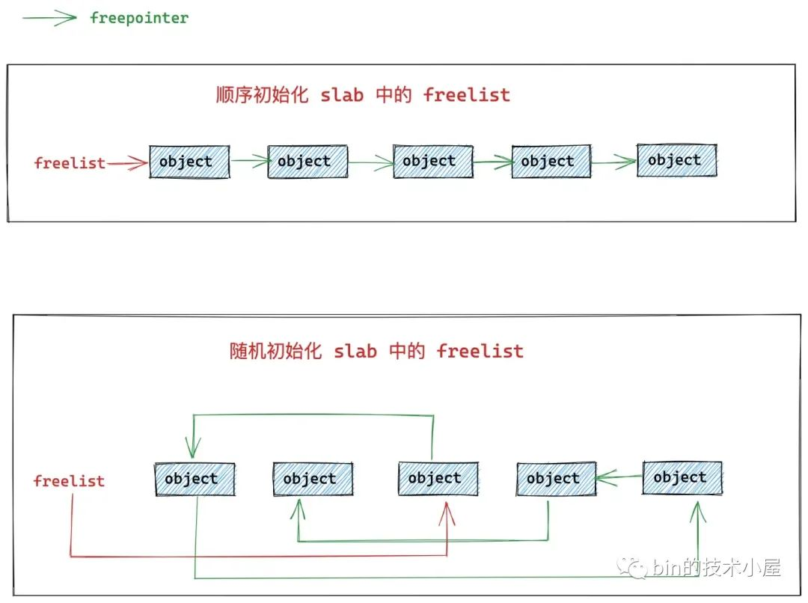

```c
// 返回值为 true 表示随机的初始化 freelist，false 表示采用第一个空闲对象初始化 freelist
static bool shuffle_freelist(struct kmem_cache *s, struct page *page)
{
    // 指向第一个空闲对象
    void *start;
    void *cur;
    void *next;
    unsigned long idx, pos, page_limit, freelist_count;
    // 如果没有配置 CONFIG_SLAB_FREELIST_RANDOM 选项或者 slub 容纳的对象个数小于 2，则无需对 freelist 进行随机初始化
    if (page->objects < 2 || !s->random_seq)
        return false;
    // 获取 slub 中可以容纳的对象个数
    freelist_count = oo_objects(s->oo);
    // 获取用于随机初始化 freelist 的随机位置
    pos = get_random_int() % freelist_count;
    page_limit = page->objects * s->size;
    /* 获取 slub 第一个空闲对象的真正起始地址
     * slub 可能配置了 SLAB_RED_ZONE，这样会在 slub 中对象内存空间两侧填充 red zone，防止内存访问越界
     * 这里需要跳过 red zone 获取真正存放对象的内存地址
     */
    start = fixup_red_left(s, page_address(page));

    // 根据随机位置 pos 获取第一个随机对象的距离 start 的偏移 idx，返回第一个随机对象的内存地址 cur = start + idx
    cur = next_freelist_entry(s, page, &pos, start, page_limit,
                freelist_count);
    // 填充对象的内存区域以及初始化空闲对象
    cur = setup_object(s, page, cur);
    // 第一个随机对象作为 freelist 的头结点
    page->freelist = cur;
    // 以 cur 为头结点随机初始化 freelist（每一个空闲对象都是随机的）
    for (idx = 1; idx < page->objects; idx++) {
        // 随机获取下一个空闲对象
        next = next_freelist_entry(s, page, &pos, start, page_limit,
            freelist_count);
        // 填充对象的内存区域以及初始化空闲对象
        next = setup_object(s, page, next);
        // 设置 cur 的下一个空闲对象为 next，next 对象的指针就是 freepointer，存放于 cur 对象的 s->offset 偏移处
        set_freepointer(s, cur, next);
        // 通过循环遍历，就把 slub 中的空闲对象随机的串联在 freelist 中了
        cur = next;
    }
    // freelist 中的尾结点的 freepointer 设置为 null
    set_freepointer(s, cur, NULL);
    // 表示随机初始化 freelist
    return true;
}
```

##### slab 对象的初始化

```c
static void *setup_object(struct kmem_cache *s, struct page *page,
                void *object)
{
    // 初始化对象的内存区域，填充相关的字节，比如填充 red zone，以及 poison 对象
    setup_object_debug(s, page, object);
    object = kasan_init_slab_obj(s, object);
    // 如果 kmem_cache 中设置了对象的构造函数 ctor，则用构造函数初始化对象
    if (unlikely(s->ctor)) {
        kasan_unpoison_object_data(s, object);
        // 使用用户指定的构造函数初始化对象
        s->ctor(object);
        // 在对象内存区域的开头用 0xFC 填充一段 KASAN_SHADOW_SCALE_SIZE 大小的区域，用于对内存访问越界的检查
        kasan_poison_object_data(s, object);
    }
    return object;
}

// 定义在文件：/mm/kasan/kasan.h
#define KASAN_KMALLOC_REDZONE   0xFC  /* redzone inside slub object */
#define KASAN_SHADOW_SCALE_SIZE (1UL << KASAN_SHADOW_SCALE_SHIFT)

void kasan_poison_object_data(struct kmem_cache *cache, void *object)
{
    kasan_poison_shadow(object,
            round_up(cache->object_size, KASAN_SHADOW_SCALE_SIZE),
            KASAN_KMALLOC_REDZONE);
}

// 定义在文件：/include/linux/poison.h
#define SLUB_RED_INACTIVE	0xbb

static void setup_object_debug(struct kmem_cache *s, struct page *page,
                                void *object)
{
    /* SLAB_STORE_USER：存储最近访问该对象的 owner 信息，方便 bug 追踪
     * SLAB_RED_ZONE：在 slub 中对象内存区域的前后填充分别填充一段 red zone 区域，防止内存访问越界
     * __OBJECT_POISON：在对象内存区域中填充一些特定的字符，表示对象特定的状态。比如：未被分配状态
     */
    if (!(s->flags & (SLAB_STORE_USER|SLAB_RED_ZONE|__OBJECT_POISON)))
        return;
    // 初始化对象内存，比如填充 red zone，以及 poison
    init_object(s, object, SLUB_RED_INACTIVE);
    // 设置 SLAB_STORE_USER 起作用，初始化访问对象的所有者相关信息
    init_tracking(s, object);
}

// 定义在文件：/include/linux/poison.h
#define SLUB_RED_INACTIVE   0xbb

// 定义在文件：/include/linux/poison.h
#define POISON_FREE	0x6b	/* for use-after-free poisoning */
#define	POISON_END	0xa5	/* end-byte of poisoning */

static void init_object(struct kmem_cache *s, void *object, u8 val)
{
    // p 为真正存储对象的内存区域起始地址(不包含填充的 red zone)
    u8 *p = object;
    // red zone 位于真正存储对象内存区域 object size 的左右两侧，分别有一段 red zone
    if (s->flags & SLAB_RED_ZONE)
        // 首先使用 0xbb 填充对象左侧的 red zone，左侧 red zone 区域为对象的起始地址到 s->red_left_pad 的长度
        memset(p - s->red_left_pad, val, s->red_left_pad);

    if (s->flags & __OBJECT_POISON) {
        // 将对象的内容用 0x6b 填充，表示该对象在 slub 中还未被使用
        memset(p, POISON_FREE, s->object_size - 1);
        // 对象的最后一个字节用 0xa5 填充，表示 POISON 的末尾
        p[s->object_size - 1] = POISON_END;
    }

    /* 在对象内存区域 object size 的右侧继续用 0xbb 填充右侧 red zone
     * 右侧 red zone 的位置为：对象真实内存区域的末尾开始一个字长的区域
     * s->object_size 表示对象本身的内存占用，s->inuse 表示对象在 slub 管理体系下的真实内存占用（包含填充字节数）
     * 通常会在对象内存区域末尾处填充一个字长大小的 red zone 区域
     * 对象右侧 red zone 区域后面紧跟着的就是 freepointer
     */
    if (s->flags & SLAB_RED_ZONE)
        memset(p + s->object_size, val, s->inuse - s->object_size);
}
```

#### slab cache 内存回收及销毁

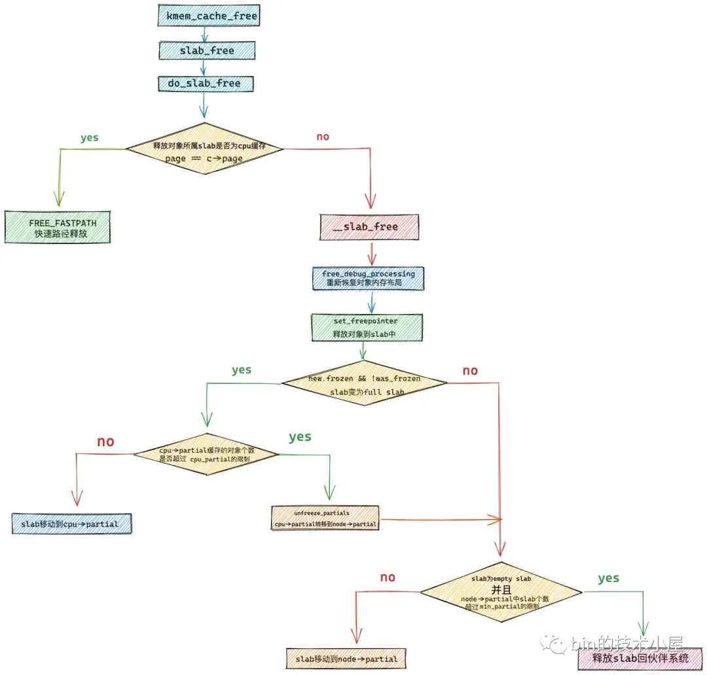

```c
void kmem_cache_free(struct kmem_cache *s, void *x)
{
    // 确保指定的是 slab cache : s 为对象真正所属的 slab cache
    s = cache_from_obj(s, x);
    if (!s)
        return;
    // 将对象释放会 slab cache 中
    slab_free(s, virt_to_head_page(x), x, NULL, 1, _RET_IP_);
}

static inline struct kmem_cache *cache_from_obj(struct kmem_cache *s, void *x)
{
    struct kmem_cache *cachep;
    // 通过对象的虚拟内存地址 x 找到对象所属的 slab cache
    cachep = virt_to_cache(x);
    // 校验指定的 slab cache : s 是否是对象真正所属的 slab cache : cachep
    WARN_ONCE(cachep && !slab_equal_or_root(cachep, s),
          "%s: Wrong slab cache. %s but object is from %s\n",
          __func__, s->name, cachep->name);
    return cachep;
}

static inline struct kmem_cache *virt_to_cache(const void *obj)
{
    struct page *page;
    // 根据对象的虚拟内存地址 *obj 找到其所在的内存页 page，如果 slub 背后是多个内存页（复合页），则返回复合页的首页 head page
    page = virt_to_head_page(obj);
    if (WARN_ONCE(!PageSlab(page), "%s: Object is not a Slab page!\n",
                    __func__))
        return NULL;
    // 通过 page 结构中的 slab_cache 属性找到其所属的 slub
    return page->slab_cache;
}
```

##### fastpath

```c
static __always_inline void slab_free(struct kmem_cache *s, struct page *page,
                      void *head, void *tail, int cnt,
                      unsigned long addr)
{
    if (slab_free_freelist_hook(s, &head, &tail))
        do_slab_free(s, page, head, tail, cnt, addr);
}

static __always_inline void do_slab_free(struct kmem_cache *s,
                struct page *page, void *head, void *tail,
                int cnt, unsigned long addr)
{
    void *tail_obj = tail ? : head;
    struct kmem_cache_cpu *c;
    // slub 中对象分配与释放流程的全局事务 id，既可以用来标识同一个分配或者释放的事务流程，也可以用来标识区分所属 cpu 本地缓存
    unsigned long tid;
redo:
    /* 接下来需要获取 slab cache 的 cpu 本地缓存
     * 这里的 do..while 循环是要保证获取到的 cpu 本地缓存 c 是属于执行进程的当前 cpu
     * 因为进程可能由于抢占或者中断的原因被调度到其他 cpu 上执行，所以需要确保两者的 tid 是否一致
     */
    do {
        // 获取执行当前进程的 cpu 中的 tid 字段
        tid = this_cpu_read(s->cpu_slab->tid);
        // 获取 cpu 本地缓存 cpu_slab
        c = raw_cpu_ptr(s->cpu_slab);
        // 如果两者的 tid 字段不一致，说明进程已经被调度到其他 cpu 上了，需要再次获取正确的 cpu 本地缓存
    } while (IS_ENABLED(CONFIG_PREEMPT) &&
         unlikely(tid != READ_ONCE(c->tid)));

    /* 如果释放对象所属的 slub （page 表示）正好是 cpu 本地缓存的 slub
     * 那么直接将对象释放到 cpu 缓存的 slub 中即可，这里就是快速释放路径 fastpath
     */
    if (likely(page == c->page)) {
        // 将对象释放至 cpu 本地缓存 freelist 中的头结点处，释放对象中的 freepointer 指向原来的 c->freelist
        set_freepointer(s, tail_obj, c->freelist);
        // cas 更新 cpu 本地缓存 s->cpu_slab 中的 freelist，以及 tid
        if (unlikely(!this_cpu_cmpxchg_double(
                s->cpu_slab->freelist, s->cpu_slab->tid,
                c->freelist, tid,
                head, next_tid(tid)))) {

            note_cmpxchg_failure("slab_free", s, tid);
            goto redo;
        }
        stat(s, FREE_FASTPATH);
    } else
        // 如果当前释放对象并不在 cpu 本地缓存中，那么就进入慢速释放路径 slowpath
        __slab_free(s, page, head, tail_obj, cnt, addr);

}
```

##### slowpath

在将对象释放回对应的 slab 中之前，内核需要首先清理一下对象所占的内存，重新填充对象的内存布局恢复到初始未使用状态。因为对象所占的内存此时包含了很多已经被使用过的无用信息。这项工作内核在 `free_debug_processing` 函数中完成。在将对象所在内存恢复到初始状态之后，内核首先会将对象直接释放回其所属的 slab 中，并调整 slab 结构 page 的相关属性。接下来就到复杂的处理部分了，内核会在这里处理多种场景，并改变 slab 在 slab cache 架构中的位置。

1. 如果 slab 本来就在 slab cache 本地 cpu 缓存 `kmem_cache_cpu->partial` 链表中，那么对象在释放之后，slab 的位置不做任何改变。
2. 如果 slab 不在 `kmem_cache_cpu->partial` 链表中，并且该 slab 由于对象的释放刚好由一个 full slab 变为了一个 partial slab，为了利用局部性的优势，内核需要将该 slab 插入到 `kmem_cache_cpu->partial` 链表中。
3. 如果 slab 不在 `kmem_cache_cpu->partial` 链表中，并且该 slab 由于对象的释放刚好由一个 partial slab 变为了一个 empty slab，说明该 slab 并不是很活跃，内核会将该 slab 放入对应 NUMA 节点缓存 `kmem_cache_node->partial` 链表中。
4. 如果不符合第 2, 3 种场景，但是 slab 本来就在对应的 NUMA 节点缓存 `kmem_cache_node->partial` 链表中，那么对象在释放之后，slab 的位置不做任何改变。

```c
static void __slab_free(struct kmem_cache *s, struct page *page,
            void *head, void *tail, int cnt,
            unsigned long addr)

{
    // 用于指向对象释放回 slub 之前，slub 的 freelist
    void *prior;
    // 对象所属的 slub 之前是否在本地 cpu 缓存 partial 链表中
    int was_frozen;
    // 后续会对 slub 对应的 page 结构相关属性进行修改，修改后的属性会临时保存在 new 中，后面通过 cas 替换
    struct page new;
    unsigned long counters;
    struct kmem_cache_node *n = NULL;
    stat(s, FREE_SLOWPATH);

    // free_debug_processing 中会调用 init_object，清理对象内存无用信息，重新恢复对象内存布局到初始状态
    if (kmem_cache_debug(s) &&
     !free_debug_processing(s, page, head, tail, cnt, addr))
        return;

    do {
        // 获取 slub 中的空闲对象列表，prior = null 表示此时 slub 是一个 full slub，意思就是该 slub 中的对象已经全部被分配出去了
        prior = page->freelist;
        counters = page->counters;
        // 将释放的对象插入到 freelist 的头部，将对象释放回 slub，将 tail 对象的 freepointer 设置为 prior
        set_freepointer(s, tail, prior);
        /* 将原有 slab 的相应属性赋值给 new page。由于page 结构中的 counters 是和 inuse，frozen 共用同一块内存的，
         * 将原有 slab 的 counters 属性赋值给 new.counters 的一瞬间，counters 所在的内存块也就赋值到 new page 的 union 结构中了。
         * 而 inuse，frozen 属性的值也在这个内存块中，所以原有 slab 中的 inuse，frozen 属性也就跟着一起赋值到 new page 的对应属性中了。
         */ 
        new.counters = counters;
        // 获取原来 slub 中的 frozen 状态，是否在 cpu 缓存 partial 链表中
        was_frozen = new.frozen;
        // inuse 表示 slub 已经分配出去的对象个数，这里是释放 cnt 个对象，所以 inuse 要减去 cnt
        new.inuse -= cnt;
        /* !new.inuse 表示此时 slub 变为了一个 empty slub，意思就是该 slub 中的对象还没有分配出去，全部在 slub 中
         * !prior 表示由于本次对象的释放，slub 刚刚从一个 full slub 变成了一个 partial slub
         * (意思就是该 slub 中的对象部分分配出去了，部分没有分配出去)，!was_frozen 表示该 slub 不在 cpu 本地缓存中
         */
        if ((!new.inuse || !prior) && !was_frozen) {
            /* 注意：进入该分支的 slub 之前都不在 cpu 本地缓存中，如果配置了 CONFIG_SLUB_CPU_PARTIAL 选项，
             * 那么表示 cpu 本地缓存 kmem_cache_cpu 结构中包含 partial 列表，用于 cpu 缓存部分分配的 slub
             */
            if (kmem_cache_has_cpu_partial(s) && !prior) {
                /* 如果 kmem_cache_cpu 包含 partial 列表并且该 slub 刚刚由 full slub 变为 partial slub
                 * 冻结该 slub，后续会将该 slub 插入到 kmem_cache_cpu 的 partial 列表中
                 */
                new.frozen = 1;

            } else { 
                /* 如果 kmem_cache_cpu 中没有配置 partial 列表，那么直接释放至 kmem_cache_node 中
                 * 或者该 slub 由一个 partial slub 变为了 empty slub，调整 slub 的位置到 kmem_cache_node->partial 链表中
                 */
                n = get_node(s, page_to_nid(page));
                // 后续会操作 kmem_cache_node 中的 partial 列表，所以这里需要获取 list_lock
                spin_lock_irqsave(&n->list_lock, flags);

            }
        }
    /* cas 更新 slub 中的 freelist 以及 counters。page->counters 的作用只是为了指向 inuse，frozen 所在的内存，
     * 方便在 cmpxchg_double_slab 中同时原子地更新这两个属性。
     */
    } while (!cmpxchg_double_slab(s, page,
        prior, counters,
        head, new.counters,
        "__slab_free"));

    /* 该分支要处理的场景是：
     * 1: 该 slub 原来不在 cpu 本地缓存的 partial 列表中（!was_frozen），但是该 slub 刚刚从 full slub 变为了 partial slub，
     * 需要放入 cpu->partial 列表中
     * 2: 该 slub 原来就在 cpu 本地缓存的 partial 列表中，直接将对象释放回 slub 即可
     */
    if (likely(!n)) {
        // 处理场景 1
        if (new.frozen && !was_frozen) {
            // 将 slub 插入到 kmem_cache_cpu 中的 partial 列表中
            put_cpu_partial(s, page, 1);
            stat(s, CPU_PARTIAL_FREE);
        }
        
        // 处理场景2，因为之前已经通过 set_freepointer 将对象释放回 slub 了，这里只需要记录 slub 状态即可
        if (was_frozen)
            stat(s, FREE_FROZEN);
        return;
    }
    
    /* 后续的逻辑就是处理需要将 slub 放入 kmem_cache_node 中的 partial 列表的情形
     * 在将 slub 放入 node 缓存之前，需要判断 node 缓存的 nr_partial 是否超过了指定阈值 min_partial（位于 kmem_cache 结构）
     * nr_partial 表示 kmem_cache_node 中 partial 列表中缓存的 slub 个数
     * min_partial 表示 slab cache 规定 kmem_cache_node 中 partial 列表可以容纳的 slub 最大个数
     * 如果 nr_partial 超过了最大阈值 min_partial，则不能放入 kmem_cache_node 里
     */
    if (unlikely(!new.inuse && n->nr_partial >= s->min_partial))
        // 如果 slub 变为了一个 empty slub 并且 nr_partial 超过了最大阈值 min_partial，跳转到 slab_empty 分支，将 slub 释放回伙伴系统中
        goto slab_empty;

    // 如果 cpu 本地缓存中没有配置 partial 列表并且 slub 刚刚从 full slub 变为 partial slub，则将 slub 插入到 kmem_cache_node 中
    if (!kmem_cache_has_cpu_partial(s) && unlikely(!prior)) {
        remove_full(s, n, page);
        add_partial(n, page, DEACTIVATE_TO_TAIL);
        stat(s, FREE_ADD_PARTIAL);
    }
    spin_unlock_irqrestore(&n->list_lock, flags);
    // 剩下的情况均属于 slub 原来就在 kmem_cache_node 中的 partial 列表中直接将对象释放回 slub 即可，无需改变 slub 的位置，直接返回
    return;

slab_empty:
    // 该分支处理的场景是： slub 太多了，将 empty slub 释放会伙伴系统，首先将 slub 从对应的管理链表上删除
    if (prior) {
        /* Slab on the partial list */
        remove_partial(n, page);
        stat(s, FREE_REMOVE_PARTIAL);
    } else {
        /* Slab must be on the full list */
        remove_full(s, n, page);
    }
    spin_unlock_irqrestore(&n->list_lock, flags);
    stat(s, FREE_SLAB);
    // 释放 slub 回伙伴系统，底层调用 __free_pages 将 slub 所管理的所有 page 释放回伙伴系统
    discard_slab(s, page);
}

static void put_cpu_partial(struct kmem_cache *s, struct page *page, int drain)
{
// 只有配置了 CONFIG_SLUB_CPU_PARTIAL 选项，kmem_cache_cpu 中才有会 partial 列表
#ifdef CONFIG_SLUB_CPU_PARTIAL
    // 指向原有 kmem_cache_cpu 中的 partial 列表
    struct page *oldpage;
    // slub 所在管理列表中的 slub 个数，这里的列表是指 partial 列表
    int pages;
    // slub 所在管理列表中的包含的空闲对象总数，这里的列表是指 partial 列表，内核会将列表总体的信息存放在列表首页 page 的相关字段中
    int pobjects;
    // 禁止抢占
    preempt_disable();
    do {
        pages = 0;
        pobjects = 0;
        // 获取 slab cache 中原有的 cpu 本地缓存 partial 列表首页
        oldpage = this_cpu_read(s->cpu_slab->partial);
        /* 如果 partial 列表不为空，则需要判断 partial 列表中所有 slub 包含的空闲对象总数是否超过了 s->cpu_partial 规定的阈值
         * 超过 s->cpu_partial 则需要将 kmem_cache_cpu->partial 列表中原有的所有 slub 转移到 kmem_cache_node->partial 列表中
         * 转移之后，再把当前 slub 插入到 kmem_cache_cpu->partial 列表中
         * 如果没有超过 s->cpu_partial ，则无需转移直接插入
         */
        if (oldpage) {
            // 从 partial 列表首页中获取列表中包含的空闲对象总数
            pobjects = oldpage->pobjects;
            // 从 partial 列表首页中获取列表中包含的 slub 总数
            pages = oldpage->pages;

            if (drain && pobjects > s->cpu_partial) {
                unsigned long flags;
                // 关闭中断，防止并发访问
                local_irq_save(flags);
                /* partial 列表中所包含的空闲对象总数 pobjects 超过了 s->cpu_partial 规定的阈值
                 * 则需要将现有 partial 列表中的所有 slub 转移到相应的 kmem_cache_node->partial 列表中
                 */
                unfreeze_partials(s, this_cpu_ptr(s->cpu_slab));
                // 恢复中断
                local_irq_restore(flags);
                // 重置 partial 列表
                oldpage = NULL;
                pobjects = 0;
                pages = 0;
                stat(s, CPU_PARTIAL_DRAIN);
            }
        }
        // 无论 kmem_cache_cpu->partial 列表中的 slub 是否需要转移，释放对象所在的 slub 都需要填加到 kmem_cache_cpu->partial 列表中
        pages++;
        pobjects += page->objects - page->inuse;

        page->pages = pages;
        page->pobjects = pobjects;
        page->next = oldpage;
        // 通过 cas 将 slub 插入到 partial 列表的头部
    } while (this_cpu_cmpxchg(s->cpu_slab->partial, oldpage, page)
                                != oldpage);

    // s->cpu_partial = 0 表示 kmem_cache_cpu->partial 列表不能存放 slub，将释放对象所在的 slub 转移到 kmem_cache_node->partial 列表中
    if (unlikely(!s->cpu_partial)) {
        unsigned long flags;
        local_irq_save(flags);
        unfreeze_partials(s, this_cpu_ptr(s->cpu_slab));
        local_irq_restore(flags);
    }
    preempt_enable();
#endif  /* CONFIG_SLUB_CPU_PARTIAL */
}
```

如何知道 `kmem_cache_cpu->partial` 链表所包含的空闲对象总数到底是多少呢？这就用到了 struct page 结构中的两个重要属性：

```c
struct page {
      // slab 所在链表中的包含的 slab 总数
      int pages;  
      // slab 所在链表中包含的对象总数
      int pobjects; 
}
```

slab 在内核中的数据结构用 `struct page` 中的相关结构体表示，slab 在 slab cache 架构中一般是由 `kmem_cache_cpu->partial` 链表和 `kmem_cache_node->partial` 链表来组织管理。如何知道 partial 链表中包含多少个 slab ？包含多少个空闲对象呢？答案是内核会将 partial 链表中的这些总体统计信息存储在链表首个 slab 结构中，也就是说存储在首个 page 结构中的 pages 属性和 pobjects 属性中。

```c
// 将 kmem_cache_cpu->partial 列表中包含的 slub unfreeze，并转移到对应的 kmem_cache_node->partial 列表中
static void unfreeze_partials(struct kmem_cache *s,
        struct kmem_cache_cpu *c)
{
#ifdef CONFIG_SLUB_CPU_PARTIAL
    struct kmem_cache_node *n = NULL, *n2 = NULL;
    struct page *page, *discard_page = NULL;
    // 挨个遍历 kmem_cache_cpu->partial 列表，将列表中的 slub 转移到对应 kmem_cache_node->partial 列表中
    while ((page = c->partial)) {
        struct page new;
        struct page old;
        // 将当前遍历到的 slub 从 kmem_cache_cpu->partial 列表摘下
        c->partial = page->next;
        // 获取当前 slub 所在的 numa 节点对应的 kmem_cache_node 缓存
        n2 = get_node(s, page_to_nid(page));
        // 如果和上一个转移的 slub 所在的 numa 节点不一样，则需要释放上一个 numa 节点的 list_lock，并对当前 numa 节点的 list_lock 加锁
        if (n != n2) {
            if (n)
                spin_unlock(&n->list_lock);

            n = n2;
            spin_lock(&n->list_lock);
        }

        do {

            old.freelist = page->freelist;
            old.counters = page->counters;
            VM_BUG_ON(!old.frozen);

            new.counters = old.counters;
            new.freelist = old.freelist;
            // unfrozen 当前 slub，因为即将被转移到对应的 kmem_cache_node->partial 列表
            new.frozen = 0;
            // cas 更新当前 slub 的 freelist，frozen 属性
        } while (!__cmpxchg_double_slab(s, page,
                old.freelist, old.counters,
                new.freelist, new.counters,
                "unfreezing slab"));
        /* 因为 kmem_cache_node->partial 列表中所包含的 slub 个数是受 s->min_partial 阈值限制的
         * 所以这里还需要检查 nr_partial 是否超过了 min_partial
         * 如果当前被转移的 slub 是一个 empty slub 并且 nr_partial 超过了 min_partial 的限制，则需要将 slub 释放回伙伴系统中
         * 但仍会存在 partial slub 数量依然超过 min_partial 的情况
         */
        if (unlikely(!new.inuse && n->nr_partial >= s->min_partial)) {
            // discard_page 用于将需要释放回伙伴系统的 slub 串联起来，后续统一将 discard_page 链表中的 slub 释放回伙伴系统
            page->next = discard_page;
            discard_page = page;
        } else {
            /* 其他情况，只要 slub 不为 empty ，不管 nr_partial 是否超过了 min_partial
             * 都需要将 slub 转移到对应 kmem_cache_node->partial 列表的末尾
             */
            add_partial(n, page, DEACTIVATE_TO_TAIL);
            stat(s, FREE_ADD_PARTIAL);
        }
    }

    if (n)
        spin_unlock(&n->list_lock);
    // 将 discard_page 链表中的 slub 统一释放回伙伴系统
    while (discard_page) {
        page = discard_page;
        discard_page = discard_page->next;

        stat(s, DEACTIVATE_EMPTY);
        // 底层调用 __free_pages 将 slub 所管理的所有 page 释放回伙伴系统
        discard_slab(s, page);
        stat(s, FREE_SLAB);
    }
#endif  /* CONFIG_SLUB_CPU_PARTIAL */
}
```

##### slab cache 的销毁

slab cache 销毁的核心步骤如下：

1. 首先需要释放 slab cache 在所有 cpu 中的缓存 `kmem_cache_cpu` 中占用的资源，包括被 cpu 缓存的 slab (`kmem_cache_cpu->page`)，以及 `kmem_cache_cpu->partial` 链表中缓存的所有 slab，将它们统统归还到伙伴系统中。
2. 释放 slab cache 在所有 NUMA 节点中的缓存 `kmem_cache_node` 占用的资源，也就是将 `kmem_cache_node->partial` 链表中缓存的所有 slab ，统统释放回伙伴系统中。
3. 在 sys 文件系统中移除 `/sys/kernel/slab/<cacchename>` 节点相关信息。
4. 从 slab cache 的全局列表中删除该 slab cache。
5. 释放 `kmem_cache_cpu` 结构，`kmem_cache_node` 结构，`kmem_cache` 结构。

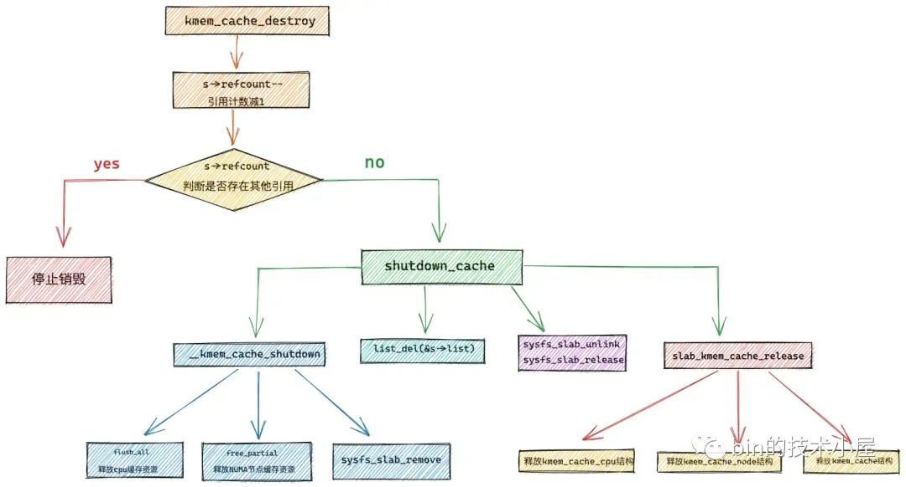

```c
void kmem_cache_destroy(struct kmem_cache *s)
{
    int err;

    if (unlikely(!s))
        return;

    // 获取 cpu_hotplug_lock，防止 cpu 热插拔改变 online cpu map
    get_online_cpus();
    // 获取 mem_hotplug_lock，防止访问内存的时候进行内存热插拔
    get_online_mems();
    // 获取 slab cache 链表的全局互斥锁
    mutex_lock(&slab_mutex);
    // 将 slab cache 的引用技术减 1
    s->refcount--;
    // 判断 slab cache 是否还存在其他地方的引用
    if (s->refcount)
        // 如果该 slab cache 还存在引用，则不能销毁，跳转到 out_unlock 分支
        goto out_unlock;
    // 销毁 memory cgroup 相关的 cache
    err = shutdown_memcg_caches(s);
    if (!err)
        // slab cache 销毁的核心函数，销毁逻辑就封装在这里
        err = shutdown_cache(s);

    if (err) {
        pr_err("kmem_cache_destroy %s: Slab cache still has objects\n",
               s->name);
        dump_stack();
    }
out_unlock:
    // 释放相关的自旋锁和信号量
    mutex_unlock(&slab_mutex);

    put_online_mems();
    put_online_cpus();
}

static int shutdown_cache(struct kmem_cache *s)
{
    // 这里会释放 slab cache 占用的所有资源
    if (__kmem_cache_shutdown(s) != 0)
        return -EBUSY;
    // 从 slab cache 的全局列表中删除该 slab cache
    list_del(&s->list);
    // 释放 sys 文件系统中移除 /sys/kernel/slab/name 节点的相关资源
    sysfs_slab_unlink(s);
    sysfs_slab_release(s);
    // 释放 kmem_cache_cpu 结构，kmem_cache_node 结构，释放 kmem_cache 结构
    slab_kmem_cache_release(s);

    }

    return 0;
}

/*
 * Release all resources used by a slab cache.
 */
int __kmem_cache_shutdown(struct kmem_cache *s)
{
    int node;
    struct kmem_cache_node *n;
    // 释放 slab cache 本地 cpu 缓存 kmem_cache_cpu 中缓存的 slub 以及 partial 列表中的 slub，统统归还给伙伴系统
    flush_all(s);

    // 释放 slab cache 中 numa 节点缓存 kmem_cache_node 中 partial 列表上的所有 slub
    for_each_kmem_cache_node(s, node, n) {
        free_partial(s, n);
        if (n->nr_partial || slabs_node(s, node))
            return 1;
    }
    // 在 sys 文件系统中移除 /sys/kernel/slab/name 节点相关信息
    sysfs_slab_remove(s);
    return 0;
}

// 释放 kmem_cache_cpu 中占用的所有内存资源
static void flush_all(struct kmem_cache *s)
{
    /* 遍历每个 cpu，通过 has_cpu_slab 函数检查 cpu 上是否还有 slab cache 的相关缓存资源
     * 如果有，则调用 flush_cpu_slab 进行资源的释放
     */
    on_each_cpu_cond(has_cpu_slab, flush_cpu_slab, s, 1, GFP_ATOMIC);
}

static bool has_cpu_slab(int cpu, void *info)
{
    struct kmem_cache *s = info;
    // 获取 cpu 在 slab cache 上的本地缓存
    struct kmem_cache_cpu *c = per_cpu_ptr(s->cpu_slab, cpu);
    // 判断 cpu 本地缓存中是否还有缓存的 slub
    return c->page || slub_percpu_partial(c);
}

static void flush_cpu_slab(void *d)
{
    struct kmem_cache *s = d;
    // 释放 slab cache 在 cpu 上的本地缓存资源
    __flush_cpu_slab(s, smp_processor_id());
}

static inline void __flush_cpu_slab(struct kmem_cache *s, int cpu)
{
    struct kmem_cache_cpu *c = per_cpu_ptr(s->cpu_slab, cpu);

    if (c->page)
        // 释放 cpu 本地缓存的 slub 到伙伴系统
        flush_slab(s, c);
    // 将 cpu 本地缓存中的 partial 列表里的 slub 全部释放回伙伴系统
    unfreeze_partials(s, c);
}

void slab_kmem_cache_release(struct kmem_cache *s)
{
    // 释放 slab cache 中的 kmem_cache_cpu 结构以及 kmem_cache_node 结构
    __kmem_cache_release(s);
    // 最后释放 slab cache 的核心数据结构 kmem_cache
    kmem_cache_free(kmem_cache, s);
}
```

### kmalloc

kmalloc 内存池体系的底层基石是基于 slab alloactor 体系构建的，其本质其实就是各种不同尺寸的通用 slab cache。

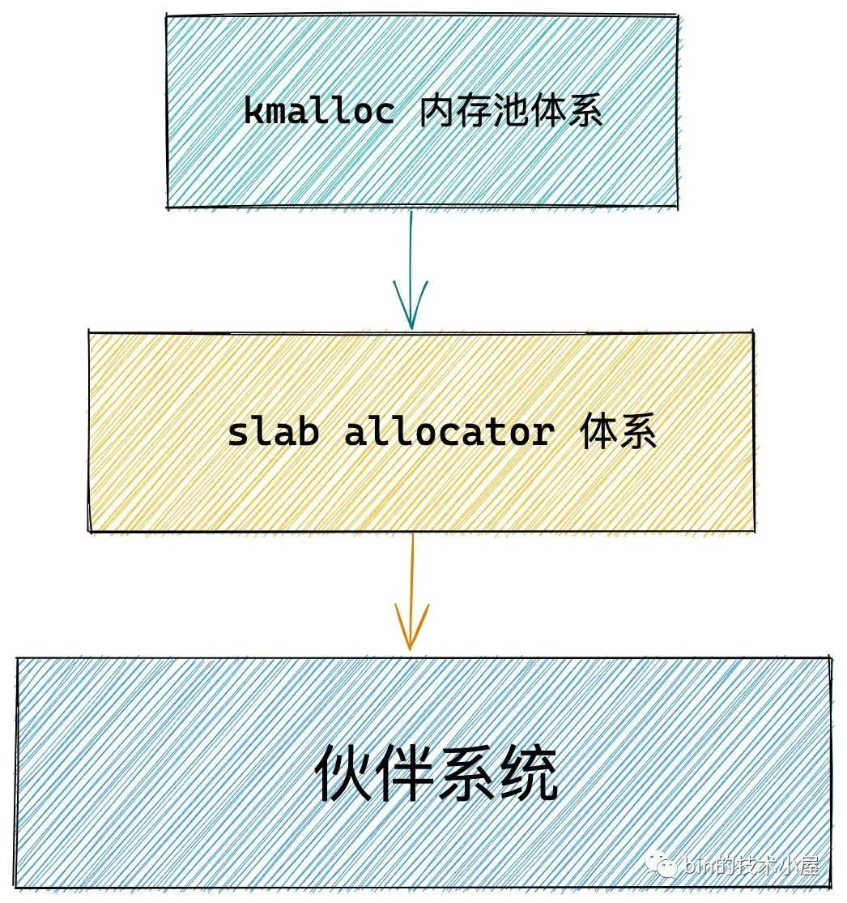

可以通过 `cat /proc/slabinfo` 命令来查看系统中不同尺寸的通用 slab cache：

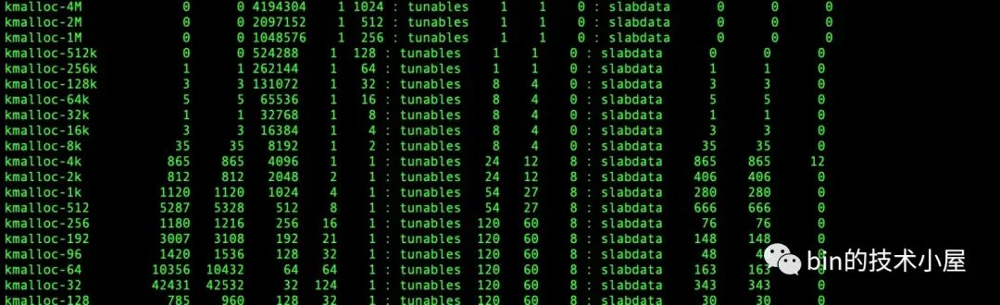

`kmalloc-32` 是专门为 32 字节的内存块定制的 slab cache，用于应对 32 字节小内存块的分配与释放。`kmalloc-64` 是专门为 64 字节的内存块定制的 slab cache，`kmalloc-1k` 是专门为 1K 大小的内存块定制的 slab cache 等等。

#### kmalloc 通用内存池

内核将这些不同尺寸的 slab cache 分类信息定义在 `kmalloc_info[]` 数组中，数组中的元素类型为 `kmalloc_info_struct` 结构，里边定义了对应尺寸通用内存池的相关信息。

```c
const struct kmalloc_info_struct kmalloc_info[];

/* A table of kmalloc cache names and sizes */
extern const struct kmalloc_info_struct {
    // slab cache 的名字
    const char *name;
    // slab cache 提供的内存块大小，单位为字节
    unsigned int size;
} kmalloc_info[];

const struct kmalloc_info_struct kmalloc_info[] __initconst = {
    {NULL,                      0},     {"kmalloc-96",             96},
    {"kmalloc-192",           192},     {"kmalloc-8",               8},
    {"kmalloc-16",             16},     {"kmalloc-32",             32},
    {"kmalloc-64",             64},     {"kmalloc-128",           128},
    {"kmalloc-256",           256},     {"kmalloc-512",           512},
    {"kmalloc-1k",           1024},     {"kmalloc-2k",           2048},
    {"kmalloc-4k",           4096},     {"kmalloc-8k",           8192},
    {"kmalloc-16k",         16384},     {"kmalloc-32k",         32768},
    {"kmalloc-64k",         65536},     {"kmalloc-128k",       131072},
    {"kmalloc-256k",       262144},     {"kmalloc-512k",       524288},
    {"kmalloc-1M",        1048576},     {"kmalloc-2M",        2097152},
    {"kmalloc-4M",        4194304},     {"kmalloc-8M",        8388608},
    {"kmalloc-16M",      16777216},     {"kmalloc-32M",      33554432},
    {"kmalloc-64M",      67108864}
};
```

从 kmalloc_info[] 数组中可以看出，kmalloc 内存池体系理论上最大可以支持 64M 尺寸大小的通用内存池。**kmalloc_info[] 数组中的 index 有一个特点**，从 index = 3 开始一直到数组的最后一个 index，这其中的每一个 index 都表示其对应的 kmalloc_info[index] 指向的通用 slab cache 尺寸，也就是说 kmalloc 内存池体系中的每个通用 slab cache 中内存块的尺寸由其所在的 kmalloc_info[] 数组 index 决定，对应内存块大小为：`2^index` 字节，比如：

- kmalloc_info[3] 对应的通用 slab cache 中所管理的内存块尺寸为 8 字节。
- kmalloc_info[5] 对应的通用 slab cache 中所管理的内存块尺寸为 32 字节。
- kmalloc_info[9] 对应的通用 slab cache 中所管理的内存块尺寸为 512 字节。
- kmalloc_info[index] 对应的通用 slab cache 中所管理的内存块尺寸为 2^index 字节。

但是这里的 index = 1 和 index = 2 是个例外，内核单独支持了 kmalloc-96 和 kmalloc-192 这两个通用 slab cache。它们分别管理了 96 字节大小和 192 字节大小的通用内存块。这些内存块的大小都不是 2 的次幂。那么内核为什么会单独支持这两个尺寸而不是其他尺寸的通用 slab cache 呢？因为在内核中，对于内存块的申请需求大部分情况下都在 96 字节或者 192 字节附近，如果内核不单独支持这两个尺寸的通用 slab cache。那么当内核申请一个尺寸在 64 字节到 96 字节之间的内存块时，内核会直接从 kmalloc-128 中分配一个 128 字节大小的内存块，这样就导致了内存块内部碎片比较大，浪费宝贵的内存资源。同理，当内核申请一个尺寸在 128 字节到 192 字节之间的内存块时，内核会直接从 kmalloc-256 中分配一个 256 字节大小的内存块。当内核申请超过 256 字节的内存块时，一般都是会按照 2 的次幂来申请的，所以这里只需要单独支持 kmalloc-96 和 kmalloc-192 即可。

#### kmalloc 内存池选取规则

既然 kmalloc 体系中通用内存块的尺寸分布信息可以通过一个数组 kmalloc_info[] 来定义，那么同理，最佳内存块尺寸的选取规则也可以被定义在一个数组中。内核通过定义一个 `size_index[24]` 数组来存放申请**内存块大小在 192 字节以下**的 kmalloc 内存池选取规则。其中 `size_index[24]` 数组中每个元素后面跟的注释部分为内核要申请的字节数，`size_index[24]` 数组中每个元素表示最佳合适尺寸的通用 slab cache 在 kmalloc_info[] 数组中的索引。

```c
static u8 size_index[24] __ro_after_init = {
    3,  /* 8 */
    4,  /* 16 */
    5,  /* 24 */
    5,  /* 32 */
    6,  /* 40 */
    6,  /* 48 */
    6,  /* 56 */
    6,  /* 64 */
    1,  /* 72 */
    1,  /* 80 */
    1,  /* 88 */
    1,  /* 96 */
    7,  /* 104 */
    7,  /* 112 */
    7,  /* 120 */
    7,  /* 128 */
    2,  /* 136 */
    2,  /* 144 */
    2,  /* 152 */
    2,  /* 160 */
    2,  /* 168 */
    2,  /* 176 */
    2,  /* 184 */
    2   /* 192 */
};
```

- size_index[0] 存储的信息表示，如果内核申请的内存块低于 8 字节时，那么 kmalloc 将会到 kmalloc_info[3] 所指定的通用 slab cache —— kmalloc-8 中分配一个 8 字节大小的内存块。
- size_index[16] 存储的信息表示，如果内核申请的内存块在 128 字节到 136 字节之间时，那么 kmalloc 将会到 kmalloc_info[2] 所指定的通用 slab cache —— kmalloc-192 中分配一个 192 字节大小的内存块。
- 同样的道理，申请 144，152，160 ..... 192 等字节尺寸的内存块对应的最佳 slab cache 选取规则也是如此，都是通过 size_index 数组中的值找到 kmalloc_info 数组的索引，然后通过 kmalloc_info[index] 指定的 slab cache，分配对应尺寸的内存块。

**size_index 数组只是定义申请内存块在 192 字节以下的 kmalloc 内存池选取规则**，当申请内存块的尺寸超过 192 字节时，内核会通过 fls 函数来计算 kmalloc_info 数组中的通用 slab cache 索引。

#### kmalloc 内存池的整体架构

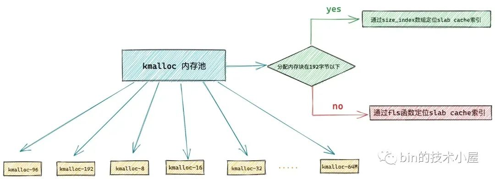

kmalloc 体系所能支持的内存块尺寸范围由 KMALLOC_SHIFT_LOW 和 KMALLOC_SHIFT_HIGH 决定，它们被定义在 `/include/linux/slab.h` 文件中：

```c
#ifdef CONFIG_SLUB
// slub 最大支持分配 2页 大小的对象，对应的 kmalloc 内存池中内存块尺寸最大就是 2页
// 超过 2页 大小的内存块直接向伙伴系统申请
#define KMALLOC_SHIFT_HIGH  (PAGE_SHIFT + 1)
#define KMALLOC_SHIFT_LOW   3

#define PAGE_SHIFT      12
```

其中 kmalloc 支持的最小内存块尺寸为：`2^KMALLOC_SHIFT_LOW`，在 slub 实现中 KMALLOC_SHIFT_LOW = 3，kmalloc 支持的最小内存块尺寸为 8 字节大小。kmalloc 支持的最大内存块尺寸为：`2^KMALLOC_SHIFT_HIGH`，在 slub 实现中 KMALLOC_SHIFT_HIGH = 13，kmalloc 支持的最大内存块尺寸为 8K ，也就是两个内存页大小。所以，实际上，在内核的 slub 实现中，kmalloc 所能支持的内存块大小在 8 字节到 8K 之间。

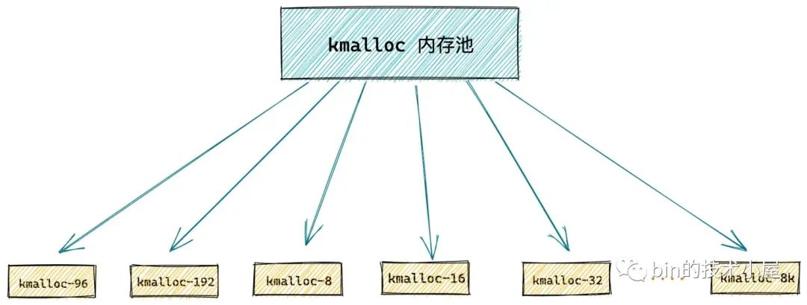

**kmalloc 内存池中的内存来自于 ZONE_DMA 和 ZONE_NORMAL 物理内存区域**，也就是内核虚拟内存空间中的直接映射区域。kmalloc 内存池中的内存来源类型定义在 `/include/linux/slab.h` 文件中：

```c
enum kmalloc_cache_type {
    // 规定 kmalloc 内存池的内存需要在 ZONE_NORMAL 直接映射区分配
    KMALLOC_NORMAL = 0,
    /* 规定 kmalloc 内存池中的内存是可以回收的，RECLAIM 类型的内存页，不能移动，但是可以直接回收，比如文件缓存页，它们就可以直接被回收掉，
     * 当再次需要的时候可以从磁盘中读取生成。或者一些生命周期比较短的内存页，比如 DMA 缓存区中的内存页也是可以被直接回收掉。
     */
    KMALLOC_RECLAIM,
#ifdef CONFIG_ZONE_DMA
    // kmalloc 内存池中的内存用于 DMA，需要在 ZONE_DMA 区域分配
    KMALLOC_DMA,
#endif
    NR_KMALLOC_TYPES
};
```


上图中所展示的 kmalloc 内存池整体架构体系，内核将其定义在一个 `kmalloc_caches` 二维数组中，位于文件：`/include/linux/slab.h` 中。

```c
struct kmem_cache *
kmalloc_caches[NR_KMALLOC_TYPES][KMALLOC_SHIFT_HIGH + 1]；
```

- 第一维数组用于表示 kmalloc 内存池中的内存来源于哪些物理内存区域中，即 `enum kmalloc_cache_type`。
- 第二维数组中的元素一共 KMALLOC_SHIFT_HIGH 个，用于存储每种内存块尺寸对应的 slab cache。在 slub 实现中，kmalloc 内存池中的内存块尺寸在 8字节到 8K 之间，其中还包括了两个特殊的尺寸分别为 96 字节 和 192 字节。第二维数组中的 index 表示的含义和 kmalloc_info[] 数组中的 index 含义一模一样，均是表示对应 slab cache 中内存块尺寸的分配阶（2 的次幂）。96 和 192 这两个内存块尺寸除外，它们的 index 分别是 1 和 2，单独特殊指定。

#### kmalloc 内存池的创建

```c
void __init kmem_cache_init(void)
{
	......
    /* Now we can use the kmem_cache to allocate kmalloc slabs */
    // 初始化 size_index 数组
    setup_kmalloc_cache_index_table();
    // 创建 kmalloc_info 数组中保存的各个内存块大小对应的 slab cache，最终将这些不同尺寸的 slab cache 缓存在 kmalloc_caches 中
    create_kmalloc_caches(0);
}

#define PAGE_SHIFT          12
#define KMALLOC_SHIFT_HIGH  (PAGE_SHIFT + 1)
#define KMALLOC_SHIFT_LOW   3

void __init create_kmalloc_caches(slab_flags_t flags)
{
    int i, type;
    /* 初始化二维数组 kmalloc_caches，
     * 为每一个 kmalloc_cache_type 类型创建内存块尺寸从 KMALLOC_SHIFT_LOW 到 KMALLOC_SHIFT_HIGH 大小的 kmalloc 内存池
     */
    for (type = KMALLOC_NORMAL; type <= KMALLOC_RECLAIM; type++) {
        // 这里会从 8B 尺寸的内存池开始创建，一直到创建完 8K 尺寸的内存池
        for (i = KMALLOC_SHIFT_LOW; i <= KMALLOC_SHIFT_HIGH; i++) {
            if (!kmalloc_caches[type][i])
                // 创建对应尺寸的 kmalloc 内存池，其中内存块大小为 2^i 字节
                new_kmalloc_cache(i, type, flags);

            /* 创建 kmalloc-96 内存池管理 96B 尺寸的内存块
             * 专门特意创建一个 96 字节尺寸的内存池的目的是为了，应对 64B 到 128B 之间的内存分配需求，要不然超过 64B 就分配一个 128B 的内存块有点浪费
             */
            if (KMALLOC_MIN_SIZE <= 32 && i == 6 &&
                    !kmalloc_caches[type][1])
                new_kmalloc_cache(1, type, flags);
            /* 创建 kmalloc-192 内存池管理 192B 尺寸的内存块
             * 这里专门创建一个 192 字节尺寸的内存池，是为了分配 128B 到 192B 之间的内存分配需求
             * 要不然超过 128B 直接分配一个 256B 的内存块太浪费了
             */
            if (KMALLOC_MIN_SIZE <= 64 && i == 7 &&
                    !kmalloc_caches[type][2])
                new_kmalloc_cache(2, type, flags);
        }
    }

    // 当 kmalloc 体系全部创建完毕之后，slab 体系的状态就变为 up 状态了
    slab_state = UP;

#ifdef CONFIG_ZONE_DMA
    // 如果配置了 DMA 内存区域，则需要为该区域也创建对应尺寸的内存池
    for (i = 0; i <= KMALLOC_SHIFT_HIGH; i++) {
        struct kmem_cache *s = kmalloc_caches[KMALLOC_NORMAL][i];

        if (s) {
            unsigned int size = kmalloc_size(i);
            const char *n = kmalloc_cache_name("dma-kmalloc", size);

            BUG_ON(!n);
            kmalloc_caches[KMALLOC_DMA][i] = create_kmalloc_cache(
                n, size, SLAB_CACHE_DMA | flags, 0, 0);
        }
    }
#endif
}
```

在第一个 for 循环体内的二重循环里，当 `i = 6` 时，表示现在准备要创建 `2^6 = 64` 字节尺寸的 slab cache —— kmalloc-64，当创建完 kmalloc-64 时，需要紧接着特殊创建 kmalloc-96，而 kmalloc-96 在 kmalloc_info 数组和 kmalloc_caches 二维数组中的索引均是 1，所以调用 new_kmalloc_cache 创建具体尺寸的 slab cache 时候，第一个参数指的是 slab cache 在 kmalloc_caches 数组中的 index，这里传入的是 1。同样的道理，在 当 `i = 7` 时，表示现在准备要创建 `2^7 = 128` 字节尺寸的 slab cache —— kmalloc-128，然后紧接着就需要特殊创建 kmalloc-192，而 kmalloc-192 在 kmalloc_caches 二维数组中的索引是 2，所以 new_kmalloc_cache 第一个参数传入的是 2。

```c
static void __init
new_kmalloc_cache(int idx, int type, slab_flags_t flags)
{
    // 参数 idx，即为 kmalloc_info 数组中的下标，根据 kmalloc_info 数组中的信息创建对应的 kmalloc 内存池
    const char *name;
    // 为 slab cache 创建名称
    if (type == KMALLOC_RECLAIM) {
        flags |= SLAB_RECLAIM_ACCOUNT;
        // kmalloc_cache_name 就是做简单的字符串拼接
        name = kmalloc_cache_name("kmalloc-rcl",
                        kmalloc_info[idx].size);
        BUG_ON(!name);
    } else {
        name = kmalloc_info[idx].name;
    }
    
    // 底层调用 __kmem_cache_create 创建 kmalloc_info[idx].size 尺寸的 slab cache
    kmalloc_caches[type][idx] = create_kmalloc_cache(name,
                    kmalloc_info[idx].size, flags, 0,
                    kmalloc_info[idx].size);
}
```

#### kmalloc 内存的分配与回收

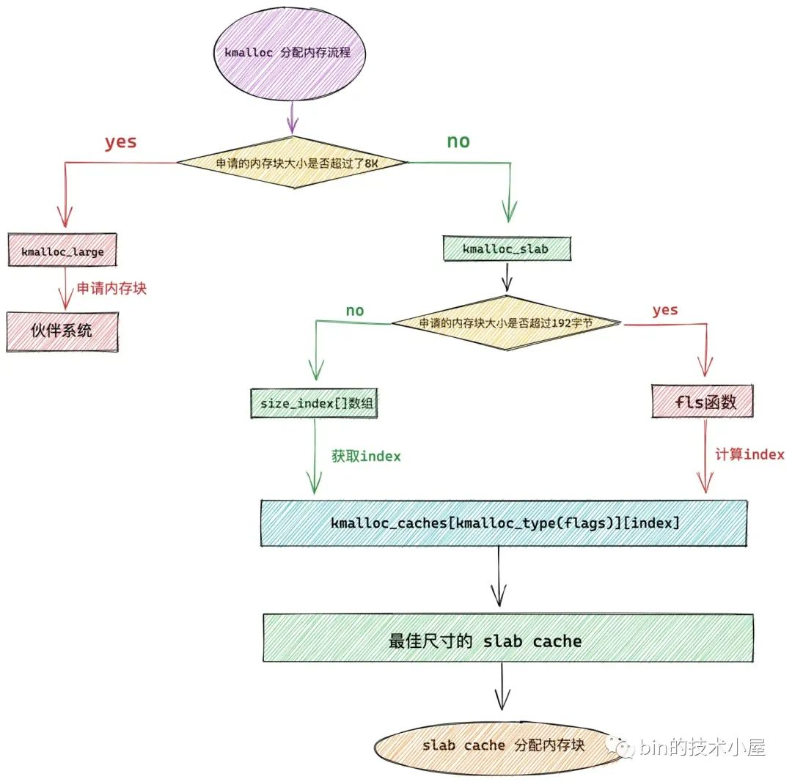

```c
static __always_inline void *kmalloc(size_t size, gfp_t flags)
{
    return __kmalloc(size, flags);
}

#define KMALLOC_MAX_CACHE_SIZE	(1UL << KMALLOC_SHIFT_HIGH)
#define PAGE_SHIFT      12
#define KMALLOC_SHIFT_HIGH  (PAGE_SHIFT + 1)

void *__kmalloc(size_t size, gfp_t flags)
{
    struct kmem_cache *s;
    void *ret;
    /* KMALLOC_MAX_CACHE_SIZE 规定 kmalloc 内存池所能管理的内存块最大尺寸，在 slub 实现中是 2页 大小，即 8k
     * 如果使用 kmalloc 申请超过 2页 大小的内存，则直接走伙伴系统
     */
    if (unlikely(size > KMALLOC_MAX_CACHE_SIZE))
        // 底层调用 alloc_pages 向伙伴系统申请超过 2页 的内存块
        return kmalloc_large(size, flags);
    // 根据申请内存块的尺寸 size，在 kmalloc_caches 缓存中选择合适尺寸的内存池
    s = kmalloc_slab(size, flags);
    // 向选取的 slab cache 申请内存块
    ret = slab_alloc(s, flags, _RET_IP_);
    return ret;
}

struct kmem_cache *kmalloc_slab(size_t size, gfp_t flags)
{
    unsigned int index;
    /* 如果申请的内存块 size 在 192 字节以下，则通过 size_index 数组定位 kmalloc_caches 缓存索引
     * 从而获取到最佳合适尺寸的内存池 slab cache
     */
    if (size <= 192) {
        if (!size)
            return ZERO_SIZE_PTR;
        // 根据申请的内存块 size，定义 size_index 数组索引，从而获取 kmalloc_caches 缓存的 index
        index = size_index[size_index_elem(size)];
    } else {
         /* 如果申请的内存块 size 超过 192 字节，则通过 fls 定位 kmalloc_caches 缓存的 index
          * fls 可以获取参数的最高有效 bit 的位数，比如 fls(0)=0，fls(1)=1，fls(4) = 3
          */
        index = fls(size - 1);
    }
    // 根据 kmalloc_type 以及 index 获取最佳尺寸的内存池 slab cache
    return kmalloc_caches[kmalloc_type(flags)][index];
}

static inline unsigned int size_index_elem(unsigned int bytes)
{
    // sizeindex
    return (bytes - 1) / 8;
}
```

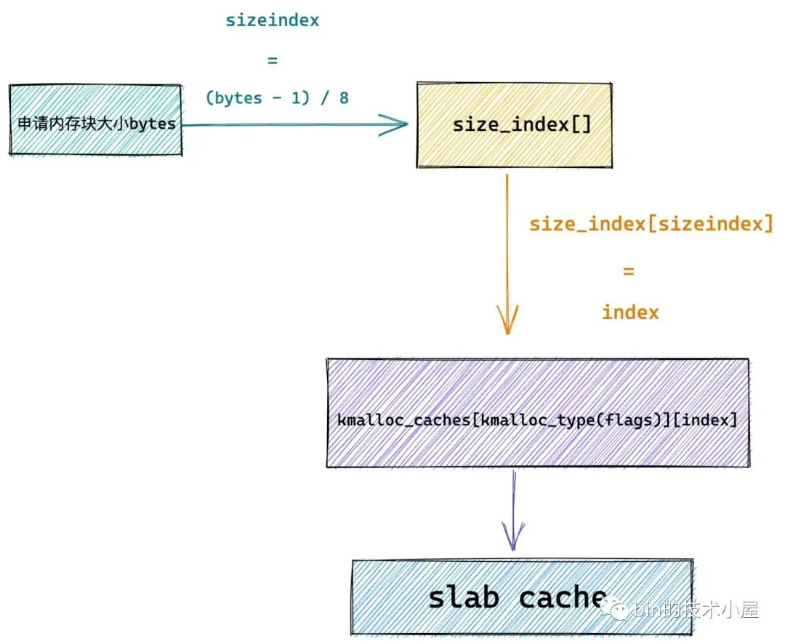

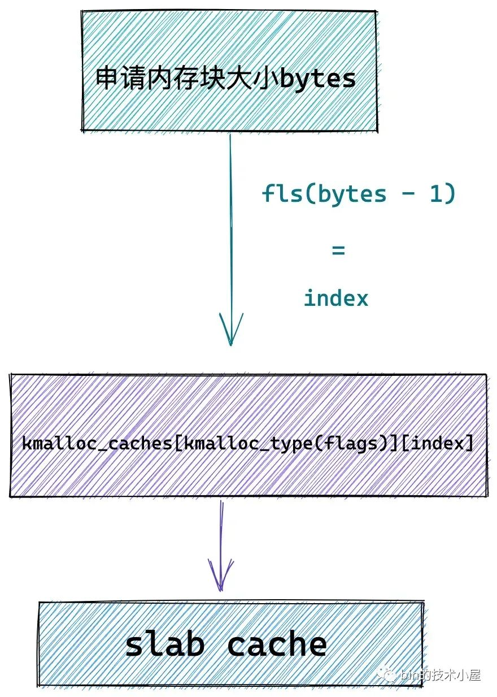

```c
static __always_inline enum kmalloc_cache_type kmalloc_type(gfp_t flags)
{
#ifdef CONFIG_ZONE_DMA

    // 通常情况下 kmalloc 内存池中的内存都来源于 NORMAL 直接映射区，如果没有特殊设定，则从 NORMAL 直接映射区里分配
    if (likely((flags & (__GFP_DMA | __GFP_RECLAIMABLE)) == 0))
        return KMALLOC_NORMAL;

    // DMA 区域中的内存是非常宝贵的，如果明确指定需要从 DMA 区域中分配内存，则选取 DMA 区域中的 kmalloc 内存池
    return flags & __GFP_DMA ? KMALLOC_DMA : KMALLOC_RECLAIM;
#else
    // 明确指定了从 RECLAIMABLE 区域中获取内存，则选取 RECLAIMABLE 区域中 kmalloc 内存池，该区域中的内存页是可以被回收的，比如：文件页缓存
    return flags & __GFP_RECLAIMABLE ? KMALLOC_RECLAIM : KMALLOC_NORMAL;
#endif
}

void kfree(const void *x)
{
    struct page *page;
    // x 为要释放的内存块的虚拟内存地址
    void *object = (void *)x;
    // 通过虚拟内存地址找到内存块所在的 page
    page = virt_to_head_page(x);
    // 如果 page 不在 slab cache 的管理体系中，则直接释放回伙伴系统
    if (unlikely(!PageSlab(page))) {
        __free_pages(page, order);
        return;
    }
    // 将内存块释放回其所在的 slub 中
    slab_free(page->slab_cache, page, object, NULL, 1, _RET_IP_);
}
```


### vmalloc

vmalloc 内存分配接口在 vmalloc 映射区申请内存的时候，首先也会在 32T 大小的 vmalloc 映射区中划分出一段未被使用的虚拟内存区域出来，暂且叫这段虚拟内存区域为 vmalloc 区，和 mmap 非常相似。只不过 mmap 工作在用户空间的文件与匿名映射区，vmalloc 工作在内核空间的 vmalloc 映射区。内核空间中的 vmalloc 映射区就是由这样一段一段的 vmalloc 区组成的，每调用一次 vmalloc 内存分配接口，就会在 vmalloc 映射区中映射出一段 vmalloc 虚拟内存区域，而且每个 vmalloc 区之间隔着一个 4K 大小的 guard page（虚拟内存），用于防止内存越界，将这些非连续的物理内存区域隔离起来。和 mmap 不同的是，vmalloc 在分配完虚拟内存之后，会马上为这段虚拟内存分配物理内存，内核会首先计算出由 vmalloc 内存分配接口映射出的这一段虚拟内存区域 vmalloc 区中包含的虚拟内存页数，然后调用伙伴系统依次为这些虚拟内存页分配物理内存页。

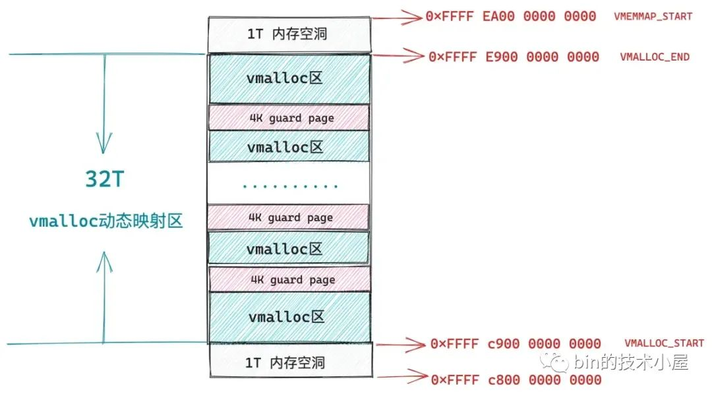

```c
/**
 * vmalloc - allocate virtually contiguous memory
 * @size:    allocation size
 *
 * Allocate enough pages to cover @size from the page level
 * allocator and map them into contiguous kernel virtual space.
 *
 * For tight control over page level allocator and protection flags
 * use __vmalloc() instead.
 *
 * Return: pointer to the allocated memory or %NULL on error
 */
void *vmalloc(unsigned long size)
{
	return __vmalloc_node(size, 1, GFP_KERNEL, NUMA_NO_NODE,
				__builtin_return_address(0));
}
EXPORT_SYMBOL(vmalloc);

/**
 * __vmalloc_node - allocate virtually contiguous memory
 * @size:	    allocation size
 * @align:	    desired alignment
 * @gfp_mask:	    flags for the page level allocator
 * @node:	    node to use for allocation or NUMA_NO_NODE
 * @caller:	    caller's return address
 *
 * Allocate enough pages to cover @size from the page level allocator with
 * @gfp_mask flags.  Map them into contiguous kernel virtual space.
 *
 * Reclaim modifiers in @gfp_mask - __GFP_NORETRY, __GFP_RETRY_MAYFAIL
 * and __GFP_NOFAIL are not supported
 *
 * Any use of gfp flags outside of GFP_KERNEL should be consulted
 * with mm people.
 *
 * Return: pointer to the allocated memory or %NULL on error
 */
void *__vmalloc_node(unsigned long size, unsigned long align,
			    gfp_t gfp_mask, int node, const void *caller)
{
	return __vmalloc_node_range(size, align, VMALLOC_START, VMALLOC_END,
				gfp_mask, PAGE_KERNEL, 0, node, caller);
}

/**
 * __vmalloc_node_range - allocate virtually contiguous memory
 * Allocate enough pages to cover @size from the page level
 * allocator with @gfp_mask flags.  Map them into contiguous
 * kernel virtual space, using a pagetable protection of @prot.
 *
 * Return: the address of the area or %NULL on failure
 */
void *__vmalloc_node_range(unsigned long size, unsigned long align,
            unsigned long start, unsigned long end, gfp_t gfp_mask,
            pgprot_t prot, unsigned long vm_flags, int node,
            const void *caller)
{
    // 用于描述 vmalloc 虚拟内存区域的数据结构，同 mmap 中的 vma 结构很相似
    struct vm_struct *area;
    // vmalloc 虚拟内存区域的起始地址
    void *addr;
    unsigned long real_size = size;
    // size 为要申请的 vmalloc 虚拟内存区域大小，这里需要按页对齐
    size = PAGE_ALIGN(size);
    // 因为在分配完 vmalloc 区之后，马上就会为其分配物理内存，所以这里需要检查 size 大小不能超过当前系统中的空闲物理内存
    if (!size || (size >> PAGE_SHIFT) > totalram_pages())
        goto fail;

    // 在内核空间的 vmalloc 动态映射区中，划分出一段空闲的虚拟内存区域 vmalloc 区出来
    area = __get_vm_area_node(size, align, VM_ALLOC | VM_UNINITIALIZED |
                vm_flags, start, end, node, gfp_mask, caller);
    if (!area)
        goto fail;
    // 为 vmalloc 虚拟内存区域中的每一个虚拟内存页分配物理内存页，并在内核页表中将 vmalloc 区与物理内存映射起来
    addr = __vmalloc_area_node(area, gfp_mask, prot, node);
    if (!addr)
        return NULL;

    return addr;
}

// 用来描述 vmalloc 区
struct vm_struct {
    // vmalloc 动态映射区中的所有虚拟内存区域也都是被一个单向链表所串联
    struct vm_struct    *next;
    // vmalloc 区的起始内存地址
    void            *addr;
    // vmalloc 区的大小
    unsigned long       size;
    /* vmalloc 区的相关标记
     * VM_ALLOC 表示该区域是由 vmalloc 函数映射出来的
     * VM_MAP 表示该区域是由 vmap 函数映射出来的
     * VM_IOREMAP 表示该区域是由 ioremap 函数将硬件设备的内存映射过来的
     */
    unsigned long       flags;
    // struct page 结构的数组指针，数组中的每一项指向该虚拟内存区域背后映射的物理内存页。
    struct page     **pages;
    // 该虚拟内存区域包含的物理内存页个数
    unsigned int        nr_pages;
    // ioremap 映射硬件设备物理内存的时候填充
    phys_addr_t     phys_addr;
    // 调用者的返回地址（这里可忽略）
    const void      *caller;
};
```


在内核中所有的这些 vm_struct 均是被一个单链表串联组织的，在早期的内核版本中就是通过遍历这个单向链表来在 vmalloc 动态映射区中寻找空闲的虚拟内存区域的，后来为了提高查找效率引入了红黑树以及双向链表来重新组织这些 vmalloc 区域，于是专门引入了一个 `vmap_area` 结构来描述 vmalloc 区域的组织形式。

```c
struct vmap_area {
    // vmalloc 区的起始内存地址
    unsigned long va_start;
    // vmalloc 区的结束内存地址
    unsigned long va_end;
    // vmalloc 区所在红黑树中的节点
    struct rb_node rb_node;         /* address sorted rbtree */
    // vmalloc 区所在双向链表中的节点
    struct list_head list;          /* address sorted list */
    // 用于关联 vm_struct 结构
    struct vm_struct *vm;          
};
```

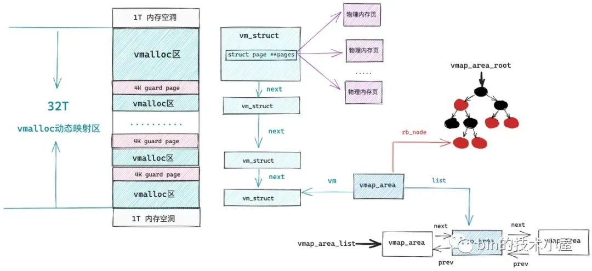

```c
static void *__vmalloc_area_node(struct vm_struct *area, gfp_t gfp_mask,
                 pgprot_t prot, int node)
{
    // 指向即将为 vmalloc 区分配的物理内存页
    struct page **pages;
    unsigned int nr_pages, array_size, i;

    // 计算 vmalloc 区所需要的虚拟内存页个数
    nr_pages = get_vm_area_size(area) >> PAGE_SHIFT;
    // vm_struct 结构中的 pages 数组大小，用于存放指向每个物理内存页的指针
    array_size = (nr_pages * sizeof(struct page *));

    // 首先要为 pages 数组分配内存
    if (array_size > PAGE_SIZE) {
        // array_size 超过 PAGE_SIZE 大小则递归调用 vmalloc 分配数组所需内存
        pages = __vmalloc_node(array_size, 1, nested_gfp|highmem_mask,
                PAGE_KERNEL, node, area->caller);
    } else {
        // 直接调用 kmalloc 分配数组所需内存
        pages = kmalloc_node(array_size, nested_gfp, node);
    }

    // 初始化 vm_struct
    area->pages = pages;
    area->nr_pages = nr_pages;

    // 依次为 vmalloc 区中包含的所有虚拟内存页分配物理内存
    for (i = 0; i < area->nr_pages; i++) {
        struct page *page;

        if (node == NUMA_NO_NODE)
            // 如果没有特殊指定 numa node，则从当前 numa node 中分配物理内存页
            page = alloc_page(alloc_mask|highmem_mask);
        else
            // 否则就从指定的 numa node 中分配物理内存页
            page = alloc_pages_node(node, alloc_mask|highmem_mask, 0);
        // 将分配的物理内存页依次存放到 vm_struct 结构中的 pages 数组中
        area->pages[i] = page;
    }
    
    atomic_long_add(area->nr_pages, &nr_vmalloc_pages);
    // 修改内核主页表，将刚刚分配出来的所有物理内存页与 vmalloc 虚拟内存区域进行映射
    if (map_vm_area(area, prot, pages))
        goto fail;
    // 返回 vmalloc 虚拟内存区域起始地址
    return area->addr;
}
```

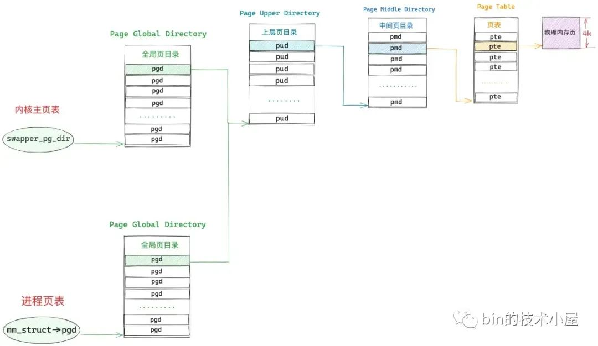

当内核通过 vmalloc 内存分配接口修改完内核主页表之后，主页表中的相关页目录项以及页表项的内容就发生了改变，但进程无法感知，进程页表中的内核部分相关的页目录项以及页表项还都是空的。当进程陷入内核态访问这部分页表的的时候，会发现相关页目录或者页表项是空的，就会进入缺页中断的内核处理部分。如果发现缺页的虚拟地址在内核主页表顶级全局页目录表中对应的页目录项 pgd 存在，而缺页地址在进程页表内核部分对应的 pgd 不存在，那么内核就会把内核主页表中 pgd 页目录项里的内容复制给进程页表内核部分中对应的 pgd。事实上，同步内核主页表的工作只需要将缺页地址对应在内核主页表中的顶级全局页目录项 pgd 同步到进程页表内核部分对应的 pgd 地址处就可以了，后面只要与该 pgd 相关的页目录表以及页表发生任何变化，由于是引用的关系，这些改变都会立刻自动反应到进程页表的内核部分中，后面就不需要同步了。

既然已经有了内核主页表，而且内核地址空间包括内核页表又是所有进程共享的，那进程为什么不能直接访问内核主页表而是要访问主页表的拷贝部分呢 ？ 这样还能省去拷贝内核主页表（fork 时候）以及同步内核主页表（缺页时候）这些个开销。之所以这样设计一方面有硬件限制的原因，毕竟每个 CPU 核心只会有一个 CR3/TTBR 寄存器来存放进程页表的顶级页目录起始物理内存地址，没办法同时存放进程页表和内核主页表。另一方面的原因则是操作页表都是需要对其进行加锁的，无论是操作进程页表还是内核主页表。而且在操作页表的过程中可能会涉及到物理内存的分配，这也会引起进程的阻塞。而进程本身可能处于中断上下文以及竞态区中，不能加锁，也不能被阻塞，如果直接对内核主页表加锁的话，那么系统中的其他进程就只能阻塞等待了。所以只能而且必须是操作主内核页表的拷贝，不能直接操作内核主页表。

```c
static vm_fault_t __do_page_fault(struct mm_struct *mm, unsigned long addr,
				  unsigned int mm_flags, unsigned long vm_flags,
				  struct pt_regs *regs)
{
    // 在进程虚拟地址空间查找第一个符合条件：address < vma->vm_end 的虚拟内存区域 vma
	struct vm_area_struct *vma = find_vma(mm, addr);
	// 如果该缺页地址 address 后面没有 vma 返回 VM_FAULT_BADMAP
	if (unlikely(!vma))
		return VM_FAULT_BADMAP;

	/*
	 * Ok, we have a good vm_area for this memory access, so we can handle
	 * it.
	 */
	if (unlikely(vma->vm_start > addr)) {
        // vma 不是栈区，返回 VM_FAULT_BADMAP
		if (!(vma->vm_flags & VM_GROWSDOWN))
			return VM_FAULT_BADMAP;
        // vma 是栈区，尝试扩展栈区到 address 地址处
		if (expand_stack(vma, addr))
			return VM_FAULT_BADMAP;
	}

	/*
	 * Check that the permissions on the VMA allow for the fault which
	 * occurred.
	 */
	if (!(vma->vm_flags & vm_flags))
		return VM_FAULT_BADACCESS;
	return handle_mm_fault(vma, addr & PAGE_MASK, mm_flags, regs);
}

/**
 * Page fault handlers return a bitmask of %VM_FAULT values.
 */
// 通过这个位图可以简要描述一下在整个缺页异常处理的过程中究竟发生了哪些状况，方便内核对各种状况进行针对性处理。
typedef __bitwise unsigned int vm_fault_t;

/**
 * enum vm_fault_reason - Page fault handlers return a bitmask of
 * these values to tell the core VM what happened when handling the
 * fault. Used to decide whether a process gets delivered SIGBUS or
 * just gets major/minor fault counters bumped up.
 *
 * @VM_FAULT_OOM:		Out Of Memory
 * @VM_FAULT_SIGBUS:		Bad access
 * @VM_FAULT_MAJOR:		Page read from storage
 * @VM_FAULT_WRITE:		Special case for get_user_pages
 * @VM_FAULT_HWPOISON:		Hit poisoned small page
 * @VM_FAULT_HWPOISON_LARGE:	Hit poisoned large page. Index encoded
 *				in upper bits
 * @VM_FAULT_SIGSEGV:		segmentation fault
 * @VM_FAULT_NOPAGE:		->fault installed the pte, not return page
 * @VM_FAULT_LOCKED:		->fault locked the returned page
 * @VM_FAULT_RETRY:		->fault blocked, must retry
 * @VM_FAULT_FALLBACK:		huge page fault failed, fall back to small
 * @VM_FAULT_DONE_COW:		->fault has fully handled COW
 * @VM_FAULT_NEEDDSYNC:		->fault did not modify page tables and needs
 *				fsync() to complete (for synchronous page faults
 *				in DAX)
 * @VM_FAULT_HINDEX_MASK:	mask HINDEX value
 *
 */
enum vm_fault_reason {
	VM_FAULT_OOM            = (__force vm_fault_t)0x000001,
	VM_FAULT_SIGBUS         = (__force vm_fault_t)0x000002,
	VM_FAULT_MAJOR          = (__force vm_fault_t)0x000004,
	VM_FAULT_WRITE          = (__force vm_fault_t)0x000008,
	VM_FAULT_HWPOISON       = (__force vm_fault_t)0x000010,
	VM_FAULT_HWPOISON_LARGE = (__force vm_fault_t)0x000020,
	VM_FAULT_SIGSEGV        = (__force vm_fault_t)0x000040,
	VM_FAULT_NOPAGE         = (__force vm_fault_t)0x000100,
	VM_FAULT_LOCKED         = (__force vm_fault_t)0x000200,
	VM_FAULT_RETRY          = (__force vm_fault_t)0x000400,
	VM_FAULT_FALLBACK       = (__force vm_fault_t)0x000800,
	VM_FAULT_DONE_COW       = (__force vm_fault_t)0x001000,
	VM_FAULT_NEEDDSYNC      = (__force vm_fault_t)0x002000,
	VM_FAULT_HINDEX_MASK    = (__force vm_fault_t)0x0f0000,
};

/* 比如，位图 vm_fault_t 的第三个比特位置为 1 表示 VM_FAULT_MAJOR，置为 0 表示 VM_FAULT_MINOR。
 * VM_FAULT_MAJOR 的意思是本次缺页所需要的物理内存页还不在内存中，需要重新分配以及需要启动磁盘 IO，从磁盘中 swap in 进来。
 * VM_FAULT_MINOR 的意思是本次缺页所需要的物理内存页已经加载进内存中了，缺页处理只需要修改页表重新映射一下就可以了。
 */

struct task_struct {
    // 进程总共发生的 VM_FAULT_MINOR 次数
    unsigned long           min_flt;
     // 进程总共发生的 VM_FAULT_MAJOR 次数
    unsigned long           maj_flt;
}
```

可以在 ps 命令上增加 -o 选项，添加 `maj_flt` ，`min_flt` 数据列来查看各个进程的 `VM_FAULT_MAJOR` 次数和 `VM_FAULT_MINOR` 次数。

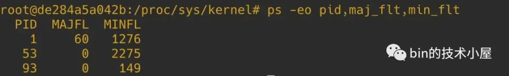


### KASAN

Kernel Address SANitizer（KASAN）是一个动态检测内存错误的工具。它为找到 use-after-free 和 out-of-bounds 问题提供了一个快速和全面的解决方案。KASAN 使用编译时检测每个内存访问，因此需要 GCC 4.9.2 或更高版本。检测堆栈或全局变量的越界访问需要 GCC 5.0 或更高版本。目前 KASAN 仅支持 x86_64 和 arm64 架构（linux 4.4版本合入）。

使用 KASAN 工具是比较简单的，只需要添加 Kernel 以下配置项。

```c
CONFIG_SLUB_DEBUG=y
CONFIG_KASAN=y
```


为什么这里必须打开 SLUB_DEBUG 呢？是因为有段时间 KASAN 是依赖 SLUBU_DEBUG 的，在 Kconfig 中使用了 depends on。不过最新的代码已经不需要依赖了。但是还是建议打开该选项，因为 log 可以输出更多有用的信息。重新编译 Kernel 即可，编译之后会发现boot.img（Android环境）大小大了一倍左右。所以说，影响效率不是没有道理的。不过可以作为产品发布前的最后检查，也可以排查越界访问等问题。可以查看内核日志内容是否包含 KASAN 检查出的 bug 信息。

#### 实现原理

KASAN 的原理是利用额外的内存标记可用内存的状态。这部分额外的内存被称作 shadow memory（影子区）。KASAN 将 1/8 的内存用作 shadow memory。使用特殊的 magic num 填充 shadow memory，在每一次 load/store（load/store 检查指令由编译器插入）内存的时候检测对应的 shadow memory 确定操作是否 valid。连续 8 bytes 内存（8 bytes align）使用 1 byte shadow memory 标记。如果 8 bytes 内存都可以访问，则 shadow memory 的值为 0；如果连续 N(1 =< N <= 7) bytes 可以访问，则 shadow memory 的值为 N；如果 8 bytes 内存访问都是 invalid，则 shadow memory 的值为负数。

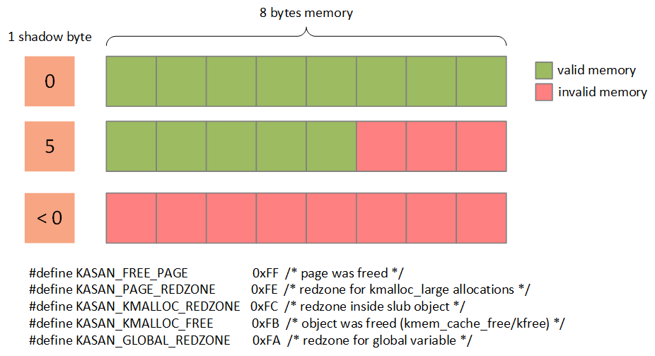

在代码运行时，每一次 memory access 都会检测对应的 shawdow memory 的值是否 valid。这就需要编译器做些工作。编译的时候，在每一次 memory access 前编译器会插入 `__asan_load##size()` 或者 `__asan_store##size()` 函数调用（size 是访问内存字节的数量）。这也是要求更新版本 gcc 的原因，只有更新的版本才支持自动插入。

```assembly
mov x0, #0x5678
movk x0, #0x1234, lsl #16
movk x0, #0x8000, lsl #32
movk x0, #0xffff, lsl #48
mov w1, #0x5
bl __asan_store1
strb w1, [x0]
```

上面一段汇编指令是往 0xffff800012345678 地址写 5。在 KASAN 打开的情况下，编译器会自动插入 `bl __asan_store1` 指令，`__asan_store1` 函数就是检测一个地址对应的 shadow memory 的值是否允许写 1 byte。strb 就是真正的内存访问。因此 KASAN 可以在 out-of-bounds 的时候及时检测。`__asan_load##size()` 和 `__asan_store##size()` 的代码在 mm/kasan/kasan.c 文件实现。

##### 根据 shadow memory 的值判断内存访问操作是否合法

shadow memory 检测原理的实现主要就是 `__asan_load##size()` 和 `__asan_store##size()` 函数的实现。那么 KASAN 是如何根据访问的 address 以及对应的 shadow memory 的状态值来判断访问是否合法呢？首先看一种最简单的情况。访问 8 bytes 内存。

```c
long *addr = (long *)0xffff800012345678;
*addr = 0;
```

检测原理如下：

```c
long *addr = (long *)0xffff800012345678;

char *shadow = (char *)(((unsigned long)addr >> 3) + KASAN_SHADOW_OFFSET);
if (*shadow)
    report_bug();

*addr = 0;
```

中间的代码就是编译器插入的指令。既然是访问 8 bytes，必须要保证对应的 shadow mempry 的值必须是0，否则肯定是有问题。那么如果访问的是 1,2 or 4 bytes 该如何检查呢？也很简单，只需要修改一下 if 判断条件即可。修改如下：

```c
if (*shadow && *shadow < ((unsigned long)addr & 7) + N); // N = 1,2,4
```

如果 *shadow 的值为 0 代表 8 bytes 均可以访问，自然就不需要 report bug。addr & 7 是计算访问地址相对于 8 字节对齐地址的偏移。还是使用下图来说明关系吧。假设内存是从地址 8~15 一共 8 bytes。对应的 shadow memory 值为 5，现在访问 11 地址。那么这里的 N 只要大于 2 就是 invalid。

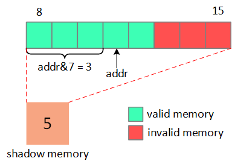

##### shadow memory 内存分配

在 ARM64 中，假设 VA_BITS 配置成 48。那么 kernel space 空间大小是 256TB，因此 shadow memory 的内存需要 32TB。在虚拟地址空间为 KASAN shadow memory 分配地址空间。所以有必要了解一下 	ARM64 memory layout。

基于 Linux-4.15.0-rc3 的代码分析，绘制如下 memory layout（VA_BITS = 48）。kernel space 起始虚拟地址是 0xffff_0000_0000_0000，kernel space 被分成几个部分，分别是 KASAN、MODULE、VMALLOC、FIXMAP、PCI_IO、VMEMMAP 以及 linear mapping。其中 KASAN 的大小是 32TB，正好是 kernel space 大小的 1/8。KERNEL 的位置相对以前有所不一样。KERNEL 位于linear mapping 区域，这里怎么变成了 VMALLOC 区域 ？这里是 Ard Biesheuvel 提交的修改。主要是为了迎接 ARM64 世界的 KASLR（which allows the kernel image to be located anywhere in the vmalloc area）的到来。

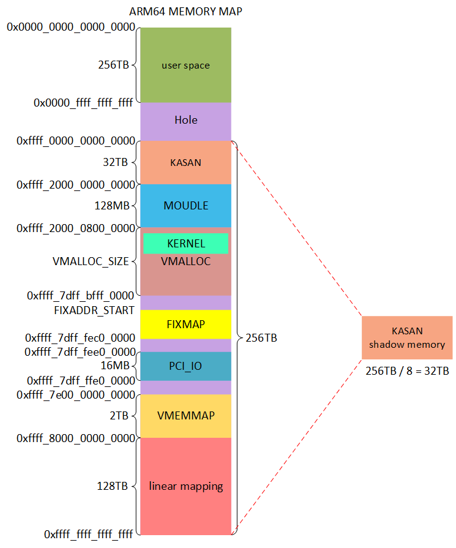

##### 建立 shadow memory 的映射关系

当打开 KASAN 的时候，KASAN 区域位于 kernel space 首地址处，从 0xffff_0000_0000_0000 地址开始，大小是 32TB。shadow memory 和 kernel address 转换关系是：`shadow_addr = (kaddr >> 3) + KASAN_SHADOW_OFFSE`。为了将 [0xffff_0000_0000_0000, 0xffff_ffff_ffff_ffff] 和 [0xffff_0000_0000_0000, 0xffff_1fff_ffff_ffff] 对应起来，因此计算 KASAN_SHADOW_OFFSE 的值为 0xdfff_2000_0000_0000。将KASAN区域放大，如下图所示。

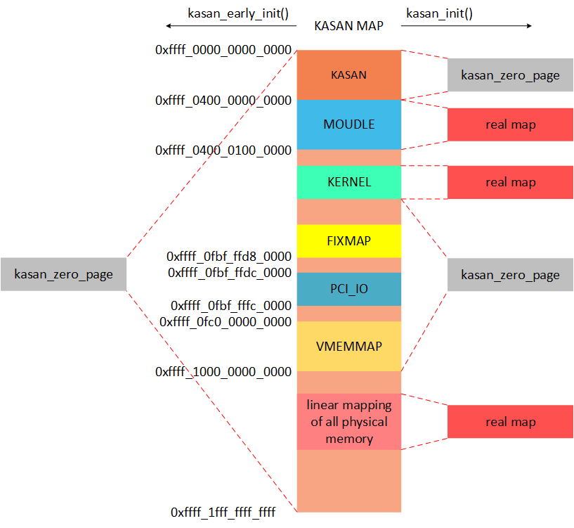

KASAN 区域仅仅是分配的虚拟地址，在访问的时候必须建立和物理地址的映射才可以访问。上图就是 KASAN 建立的映射布局。左边是系统启动初期建立的映射。在 `kasan_early_init()` 函数中，将所有的 KASAN 区域映射到 `kasan_zero_page` 物理页面。因此系统启动初期，KASAN 并不能工作。右侧是在 `kasan_init()` 函数中建立的映射关系，`kasan_init()` 函数执行结束就预示着 KASAN 的正常工作。不需要 address sanitizer 功能的区域同样还是映射到 `kasan_zero_page` 物理页面，并且是 readonly。主要是检测 kernel 和物理内存是否存在 UAF 或者 OOB 问题。所以建立 KERNEL 和 linear mapping（仅仅是所有的物理地址建立的映射区域）区域对应的 shadow memory 建立真实的映射关系。MOUDLE 区域对应的 shadow memory 的映射关系也是需要创建的，但是映射关系建立是动态的，在 module 加载的时候才会去创建映射关系。

##### 伙伴系统分配的内存的 shadow memory 值如何填充

既然 shadow memory 已经建立映射，接下来的事情就是探究各种内存分配器向 shadow memory 填充什么数据了。首先看一下伙伴系统 allocate page(s) 函数填充 shadow memory 情况。

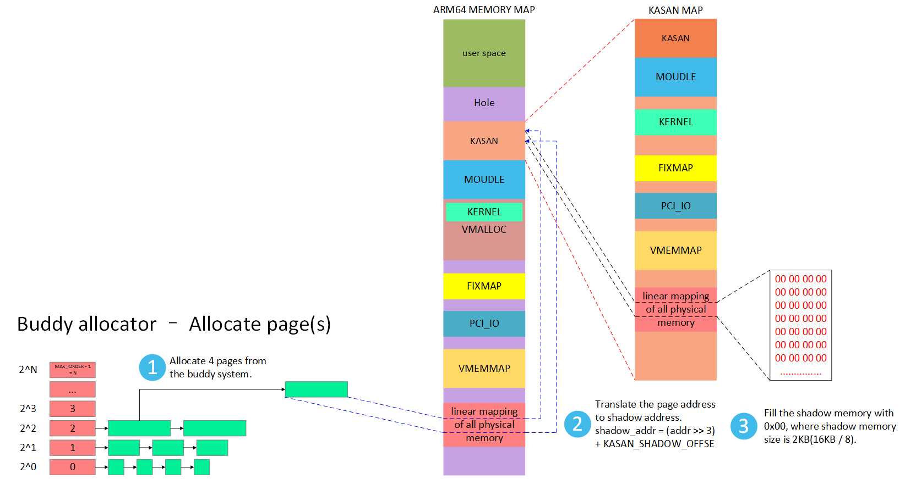

假设从 buddy system 分配 4 pages。系统首先从 order=2 的链表中摘下一块内存，然后根据 shadow memory address 和 memory address 之间的对应的关系找对应的 shadow memory。这里 shadow memory 的大小将会是 2KB，系统会全部填充 0 代表内存可以访问。对分配的内存的任意地址内存进行访问的时候，首先都会找到对应的 shadow memory，然后根据 shadow memory value 判断访问内存操作是否 valid。

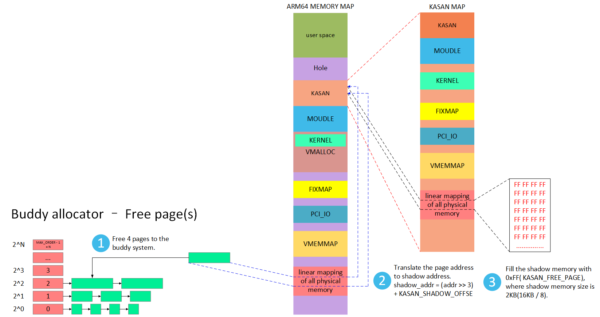

同样的，当释放 pages 的时候，会填充 shadow memory 的值为 0xFF。如果释放之后，依然访问内存的话，此时 KASAN 根据 shadow memory 的值是 0xFF 就可以断，这是一个 use-after-free 问题。

##### SLUB 分配对象的内存的 shadow memory 值如何填充

打开 KASAN 的时候，SLUB Allocator 管理的 object layout 将会放生一定的变化。如下图所示。

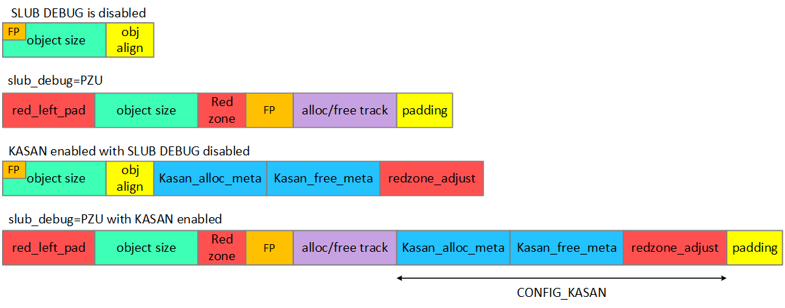

在打开 SLUB_DEBUG 的时候，object 就增加很多内存，KASAN 打开之后，在此基础上又加了一截。第一次创建 slab 缓存池的时候，系统会调用 `kasan_poison_slab()` 函数初始化 shadow memory 为下图的模样。整个 slab 对应的 shadow memory 都填充 0xFC。

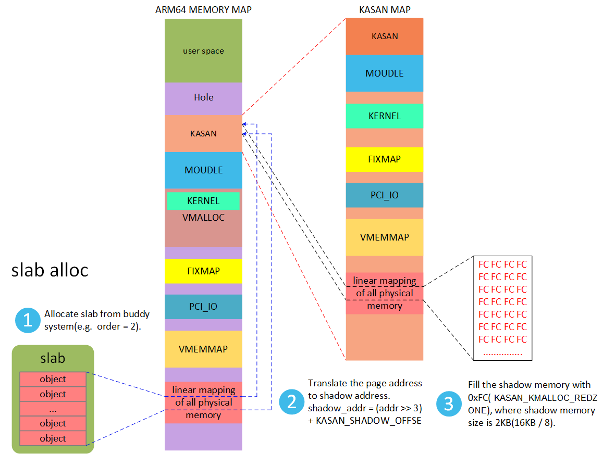

上述步骤虽然填充了 0xFC，但是接下来初始化 object 的时候，会改变一些 shadow memory 的值。先看一下 `kmalloc(20)` 的情况。`kmalloc()` 就是基于 SLUB Allocator 实现的，所以会从 kmalloc-32 的 kmem_cache 中分配一个 32 bytes object。

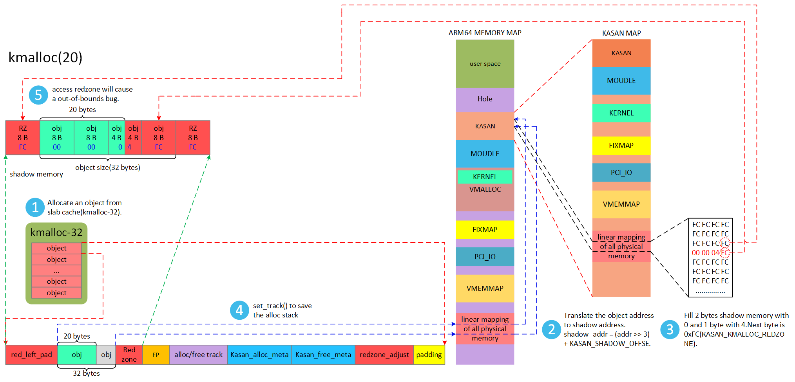

首先调用 `kmalloc(20)` 函数会匹配到 kmalloc-32 的 kmem_cache，因此实际分配的 object 大小是 32 bytes。KASAN 同样会标记剩下的 12 bytes 的 shadow memory 为不可访问状态。根据 object 的地址，计算 shadow memory 的地址，并开始填充数值。由于 `kmalloc()` 返回的 object 的 size 是 32 bytes，而 `kmalloc(20)` 只申请了 20 bytes，剩下的 12 bytes 不能使用。KASAN 必须标记 shadow memory 这种情况。object 对应的 4 bytes shadow memory 分别填充 00 00 04 FC。00 代表 8 个连续的字节可以访问。04 代表前 4 个字节可以访问。作为越界访问的检测的方法。总共加在一起是正好是 20 bytes 可访问。0xFC 是 redzone 标记。如果访问了 redzone 区域 KASAN 就会检测 out-of-bounds 的发生。

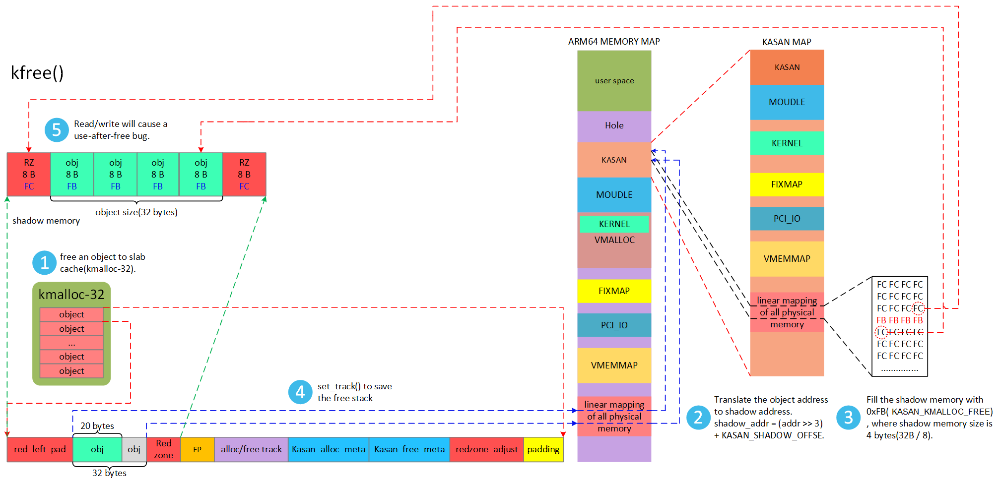

`kfree()` 释放时，根据 object 首地址找到对应的 shadow memory，32 bytes object 对应 4 bytes 的 shadow memory，现在填充 0xFB 标记内存是释放的状态。此时如果继续访问 object，那么根据 shadow memory 的状态值既可以确定是 use-after-free 问题。

##### 全局变量的 shadow memory 值如何填充

前面的分析都是基于内存分配器的，redzone 都会随着内存分配器一起分配。那么 global variables 如何检测呢？global variable 的 redzone 在哪里呢？这就需要编译器下手了。编译器会填充 redzone 区域。例如定义一个全局变量 a，编译器会填充成下面的样子：

```c
struct {
    char original[4];
    char redzone[60];
} a; // 32 bytes aligned
```

这是验证结果，填充 60 bytes 原因可能编译器相关。可能的原理是这样的。全局变量实际占用内存总数 S（以 byte 为单位）按照每块 32 bytes 平均分成 N 块。假设最后一块内存距离目标 32 bytes 还差 y bytes（if S % 32 == 0，y = 0），那么 redzone 填充的大小就是 (y + 32) bytes。画图示意如下（S % 32 != 0）。因此总结的规律是：redzone = 63 – (S - 1) % 32。

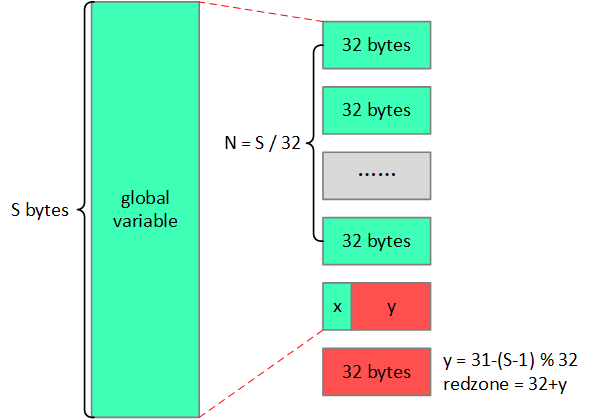

编译器会为每一个全局变量创建一个函数，函数名称是：`_GLOBAL__sub_I_65535_1_##global_variable_name`。这个函数中通过调用 `__asan_register_globals()` 函数完成 shadow memory 标记。并且将自动生成的这个函数的首地址放在 .init_array 段。在 Kernel 启动阶段，通过以下代调用关系最终调用所有全局变量的构造函数。`kernel_init_freeable()->do_basic_setup()->do_ctors()`。`do_ctors()` 代码实现如下：

```c
static void __init do_ctors(void)
{
    ctor_fn_t *fn = (ctor_fn_t *) __ctors_start;
    for (; fn < (ctor_fn_t *) __ctors_end; fn++)
        (*fn)();
}
```

遍历 `__ctors_start` 和 `__ctors_end` 之间的所有数据，作为函数地址进行调用，即完成了所有的 global variables 的 shadow memory 初始化。可以从链接脚本中知道 `__ctors_start` 和 `__ctors_end` 的意思。

```c
#define KERNEL_CTORS()  . = ALIGN(8);              \
            VMLINUX_SYMBOL(__ctors_start) = .; \
            KEEP(*(.ctors))            \
            KEEP(*(SORT(.init_array.*)))       \
            KEEP(*(.init_array))           \
            VMLINUX_SYMBOL(__ctors_end) = .;
```

以一个具体的实例说明，定义 3 个全局变量如下：

```c
12 volatile char smc_num1[4];
13 volatile char smc_num2[31];
14 volatile char smc_num3[7];
```

编译 Kernel，看看 System.map 文件中，3 个全局变量分配的地址。

```c
ffff200009f540e0 B smc_num1
ffff200009f54120 B smc_num2
ffff200009f54160 B smc_num3
```

反汇编 vmlinux 看下 `_GLOBAL__sub_I_65535_1_smc_num1` 函数的实现

```assembly
ffff200009381df0 <_GLOBAL__sub_I_65535_1_smc_num1>:
ffff200009381df0:   a9bf7bfd    stp x29, x30, [sp,#-16]!
ffff200009381df4:   b0001800    adrp    x0, ffff200009682000
ffff200009381df8:   91308000    add x0, x0, #0xc20
ffff200009381dfc:   d2800061    mov x1, #0x3                    // #3
ffff200009381e00:   910003fd    mov x29, sp
ffff200009381e04:   9100c000    add x0, x0, #0x30
ffff200009381e08:   97c09fb8    bl  ffff2000083a9ce8 <__asan_register_globals>
ffff200009381e0c:   a8c17bfd    ldp x29, x30, [sp],#16
ffff200009381e10:   d65f03c0    ret
```

通过上面的汇编计算一下，x0=0xffff200009682c50，x1=3。然后调用 `__asan_register_globals() `函数，x0 和 x1 就是传递的参数。看一下 `__asan_register_globals()` 函数实现。

```c
void __asan_register_globals(struct kasan_global *globals, size_t size)
{
    int i;
    for (i = 0; i < size; i++)
        register_global(&globals[i]);
}
```

size 是 3 就是要初始化全局变量的个数，所以这里只需要一个构造函数即可。一次性将 3 个全局变量全部搞定。可能是以文件为单位编译器创建一个构造函数即可，将本文件全局变量一次性全部打包初始化。第一个参数 globals 是 0xffff200009682c50，继续从 vmlinux.txt中查看该地址处的数据。`struct kasan_global` 是编译器自动创建的结构体，每一个全局变量对应一个 `struct kasan_global` 结构体。`struct kasan_global` 结构体存放的位置是 .data 段，因此可以从 .data 段查找当前地址对应的数据。数据如下：

```c
ffff200009682c50 6041f509 0020ffff 07000000 00000000
ffff200009682c60 40000000 00000000 d0d62b09 0020ffff
ffff200009682c70 b8d62b09 0020ffff 00000000 00000000
ffff200009682c80 202c6809 0020ffff 2041f509 0020ffff
ffff200009682c90 1f000000 00000000 40000000 00000000
ffff200009682ca0 e0d62b09 0020ffff b8d62b09 0020ffff
ffff200009682cb0 00000000 00000000 302c6809 0020ffff
ffff200009682cc0 e040f509 0020ffff 04000000 00000000
ffff200009682cd0 40000000 00000000 f0d62b09 0020ffff
ffff200009682ce0 b8d62b09 0020ffff 00000000 00000000
```

首先 ffff200009682c50 对应的第一个数据 6041f509 0020ffff，这个是个地址数据，得反过来看。这个地址其实是 ffff200009f54160，正是 smc_num3 的地址。解析这段数据之前需要了解一下 `struct kasan_global` 结构体。

```c
/* The layout of struct dictated by compiler */
struct kasan_global {
    const void *beg;        /* Address of the beginning of the global variable. */
    size_t size;            /* Size of the global variable. */
    size_t size_with_redzone;   /* Size of the variable + size of the red zone. 32 bytes aligned */
    const void *name;
    const void *module_name;    /* Name of the module where the global variable is declared. */
    unsigned long has_dynamic_init; /* This needed for C++ */
#if KASAN_ABI_VERSION >= 4
    struct kasan_source_location *location;
#endif
};
```

第一个成员 beg 就是全局变量的首地址。跟上面的分析一致。第二个成员 size 从上面数据看出是7，正好对应定义的 smc_num3[7]，正好 7 bytes。size_with_redzone 的值是 0x40，正好是 64。根据上面猜测 redzone = 63 - (7 - 1) % 32 = 57。加上 size 正好是 64。name 成员对应的地址是 ffff2000092bd6d0。看下 ffff2000092bd6d0 存储的是什么。

```c
ffff2000092bd6d0 736d635f 6e756d33 00000000 00000000  smc_num3........
```

所以 name 就是全局变量的名称转换成字符串。同样的方式得到 module_name 的地址是 ffff2000092bd6b8。继续看看这段地址存储的数据。

```c
ffff2000092bd6b0 65000000 00000000 64726976 6572732f  e.......drivers/
ffff2000092bd6c0 696e7075 742f736d 632e6300 00000000  input/smc.c.....
```

module_name 是文件的路径。has_dynamic_init 的值就是 0，这是 C++ 需要的。实验用的 GCC 版本是 5.0 左右，所以这里的 KASAN_ABI_VERSION=4。这里 location 成员的地址是 ffff200009682c20，继续追踪该地址的数据。

```c
ffff200009682c20 b8d62b09 0020ffff 0e000000 0f000000
```

解析这段数据之前要先了解 `struct kasan_source_location` 结构体。

```c
/* The layout of struct dictated by compiler */
struct kasan_source_location {
    const char *filename;
    int line_no;
    int column_no;
};
```

第一个成员 filename 地址是 ffff2000092bd6b8 和 module_name 一样的数据。剩下两个数据分别是 14 和 15，分别代表全局变量定义地方的行号和列号，和定义里一致。剩下的 `struct kasan_global` 数据就是 smc_num1 和 smc_num2 的数据同理。`_GLOBAL__sub_I_65535_1_smc_num1 `函数会被自动调用，该地址数据填充在 `__ctors_start` 和 `__ctors_end` 之间。现在也证明一下观点。先从 System.map 得到符号的地址数据。

```c
ffff2000093ac5d8 T __ctors_start
ffff2000093ae860 T __ctors_end
```

然后搜索一下 `_GLOBAL__sub_I_65535_1_smc_num1` 的地址 ffff200009381df0 被存储在什么位置。

```c
ffff2000093ae0c0 f01d3809 0020ffff 181e3809 0020ffff
```

可以看出 ffff2000093ae0c0 地址处存储着 `_GLOBAL__sub_I_65535_1_smc_num1` 函数地址。这个地址不是正好位于 `__ctors_start` 和 `__ctors_end` 之间。

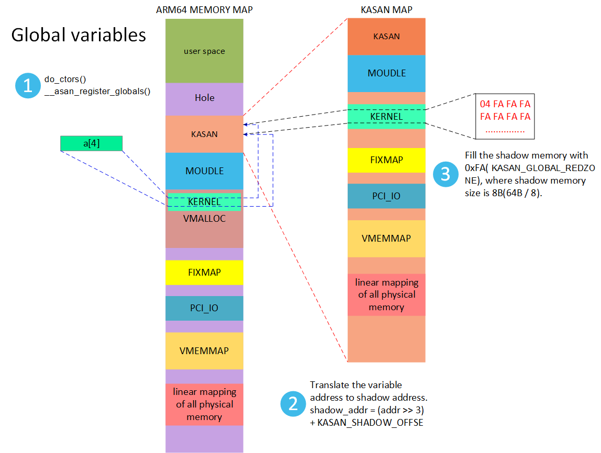

以 char a[4] 为例，a[4] 只有 4 bytes 可以访问，所以对应的 shadow memory 的第一个 byte 值是 4，后面的 redzone 就填充 0xFA 作为越界检测。因为这里是全局变量，因此分配的内存区域位于 Kernel 区域。

##### 栈分配变量的 readzone 是如何分配的

从栈中分配的变量同样和全局变量一样需要填充一些内存作为 redzone 区域。下面继续举个例子说明编译器怎么填充。首先来一段正常的代码，没有编译器的插手。

```c
void foo()
{
    char a[328];
}
```

再来看看编译器插了哪些东西进去

```c
void foo()
{
    char rz1[32];
    char a[328];
    char rz2[56];
    int *shadow = （&rz1 >> 3）+ KASAN_SHADOW_OFFSE;
    shadow[0] = 0xffffffff;
    shadow[11] = 0xffffff00;
    shadow[12] = 0xffffffff;

    shadow[0] = shadow[11] = shadow[12] = 0;
}
```

rz2 是编译器填充内存，大小是56，可以根据上一节全局变量的公式套用计算得到。但是这里在变量前面还有 32 bytes 的 rz1。这个是和全局变量的不同，可能为了检测栈变量左边界越界问题。后面的代码也是编译器填充，初始化 shadow memory。
