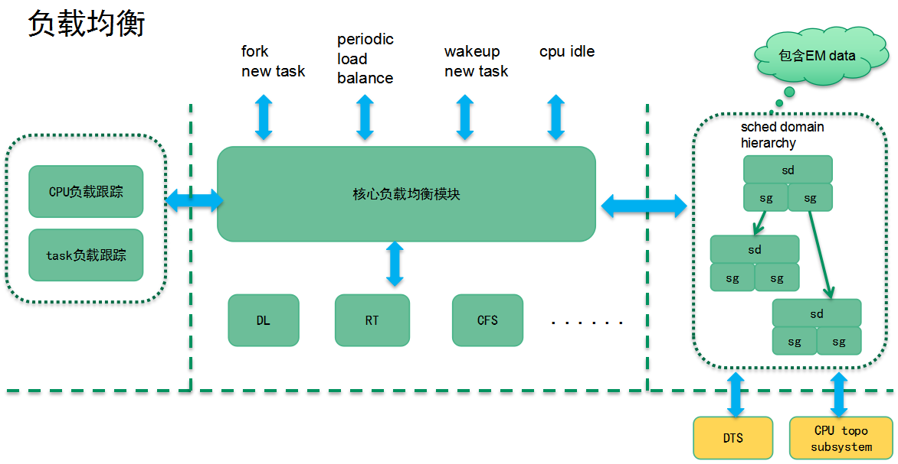
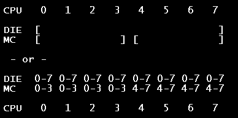
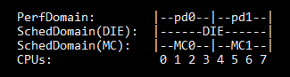
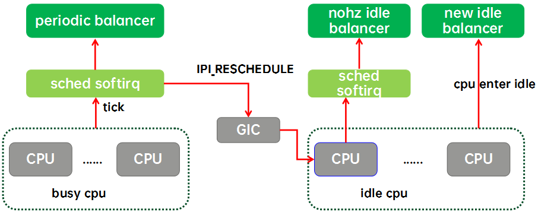
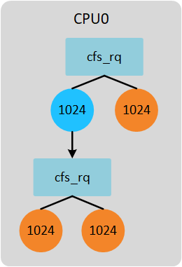
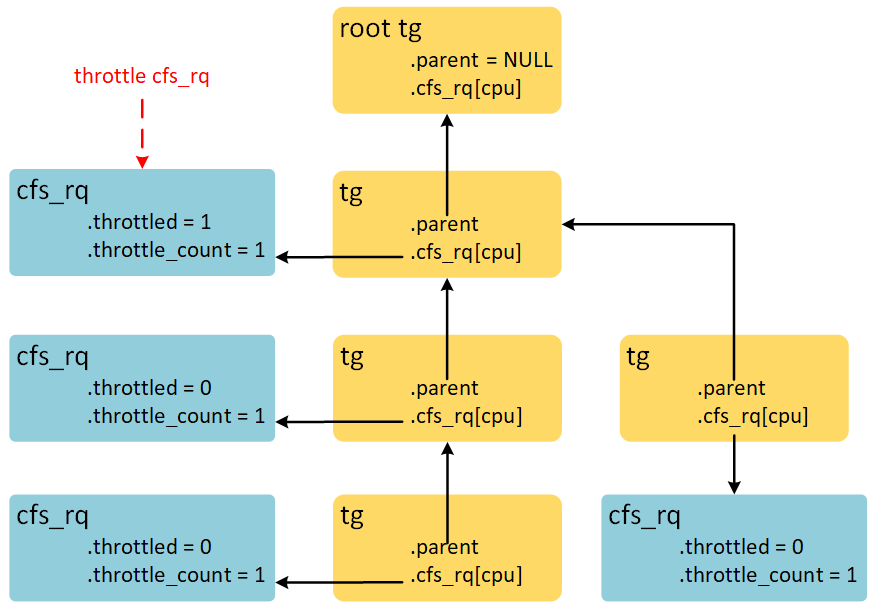
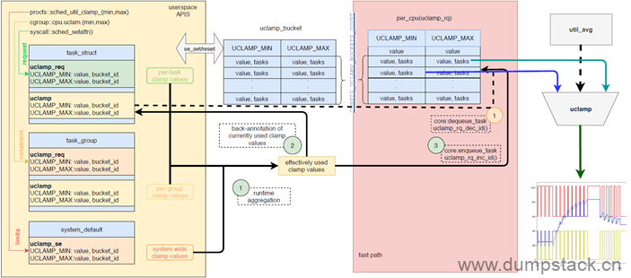
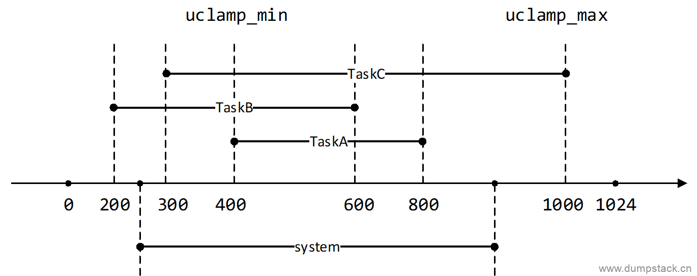
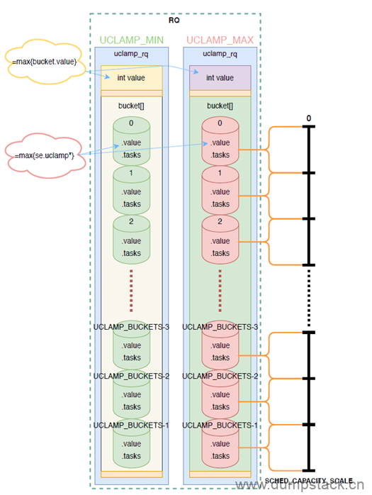
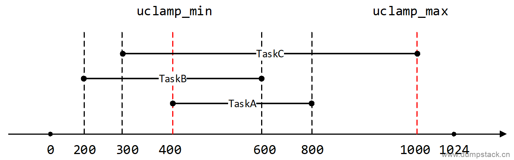

# Scheduler

## Priority

### Priority Overview


### User Space View

在用户空间，进程优先级分两类：nice value 和 scheduling priority。对于普通进程而言，进程优先级就是 nice value，从 -20（优先级最高）～ 19（优先级最低），通过修改 nice value 可以改变普通进程获取 CPU 资源的比例。随着实时需求的提出，进程又被赋予了另外一种属性 scheduling priority，而这些进程被称为实时进程。实时进程的优先级的范围可以通过 sched_get_priority_min 和 sched_get_priority_max，对于 Linux 而言，实时进程的 scheduling priority 的范围是 1（优先级最低）～ 99（优先级最高）。当然，普通进程也有 scheduling priority，被设定为 0。

### Kernel Space implementation

```c
struct task_struct {
......
    int prio, static_prio, normal_prio;
    unsigned int rt_priority;
......
    unsigned int policy;
......
}
```

#### Static Priority

task_struct 中的 static_prio 字段，被称之为静态优先级，其特点如下：

1）值越小，进程优先级越高

2）0 – 99 用于 real-time processes（没有实际的意义），100 – 139 用于普通进程

3）缺省值是 120

4）用户空间可以通过 `nice` 或者 `setpriority` 对该值进行修改。通过 `getpriority` 可以获取该值。

5）新创建的进程会继承父进程的 static priority。

静态优先级是所有相关优先级的计算的起点，要么继承自父进程，要么用户空间自行设定。一旦修改了静态优先级，那么 normalized priority 和动态优先级都需要重新计算。

#### Real-Time Priority

task_struct 中的 rt_priority 成员表示该线程的实时优先级，也就是从用户空间的视角来看的 scheduling priority。0 是普通进程，1～99 是实时进程，99 的优先级最高。注：内核 rt_priority 和用户态设置的是直接映射关系。

#### Normalized Priority

task_struct 中的 normal_prio 成员。称之归一化优先级（normalized priority），它是根据静态优先级、scheduling priority 和调度策略来计算得到，代码如下：

```c
static inline int __normal_prio(struct task_struct *p)
{
    return p->static_prio;
}

static inline int normal_prio(struct task_struct *p)
{
    int prio;

    if (task_has_dl_policy(p))
        prio = MAX_DL_PRIO - 1;
    else if (task_has_rt_policy(p))
        prio = MAX_RT_PRIO - 1 - p->rt_priority;
    else
        prio = __normal_prio(p);
    return prio;
}
```

对于内核的优先级，调度器需要综合考虑各种因素，例如调度策略，nice value、scheduling priority 等，把这些 factor 全部考虑进来，归一化成一个数轴上的 number，以此来表示其优先级，这就是 normalized priority。对于一个线程，其 normalized priority 的 number 越小，其优先级越大。

调度策略是 deadline 的进程比 RT 进程和 normal 进程的优先级还要高，因此它的归一化优先级是负数：-1。如果采用实时调度策略，那么该线程的 normalized priority 和 rt_priority 相关。task struct 中的 rt_priority 成员是用户空间视角的实时优先级（scheduling priority），MAX_RT_PRIO - 1 是 99，MAX_RT_PRIO - 1 - p->rt_priority 则翻转了实时进程的 scheduling priority，最高优先级是 0，最低是 98。**顺便说一句，normalized priority 是 99 的情况是没有意义的。对于普通进程，normalized priority 就是其静态优先级。**

#### Effective Priority

task_struct 中的 prio 成员表示了该线程的动态优先级，也就是调度器在进行调度时候使用的那个优先级。动态优先级在运行时可以被修改，例如在处理优先级翻转问题的时候，系统可能会临时调升一个普通进程的优先级。一般设定动态优先级的代码是这样的：p->prio = effective_prio(p)，具体计算动态优先级的代码如下：

```c
static inline int rt_prio(int prio)
{
    if (unlikely(prio < MAX_RT_PRIO))
        return 1;
    return 0;
}

static int effective_prio(struct task_struct *p)
{
    p->normal_prio = normal_prio(p);
    if (!rt_prio(p->prio))
        return p->normal_prio;
    return p->prio;
}
```

`rt_prio()` 是一个根据当前优先级来确定是否是实时进程的函数，包括两种情况，一种情况是该进程是实时进程，调度策略是 SCHED_FIFO 或者 SCHED_RR。另外一种情况是人为的将该进程提升到 RT priority 的区域（例如在使用优先级继承的方法解决系统中优先级翻转问题的时候）。在这两种情况下，都不改变其动态优先级，即 effective_prio 返回当前动态优先级 p->prio。其他情况，进程的动态优先级跟随归一化的优先级。

### Code Review

```c
void set_user_nice(struct task_struct *p, long nice)
{
    bool queued, running;
    int old_prio;
    struct rq_flags rf;
    struct rq *rq;

    if (task_nice(p) == nice || nice < MIN_NICE || nice > MAX_NICE)
            return;
    /*
     * We have to be careful, if called from sys_setpriority(),
     * the task might be in the middle of scheduling on another CPU.
     */
    rq = task_rq_lock(p, &rf);
    update_rq_clock(rq);

    /*
     * The RT priorities are set via sched_setscheduler(), but we still
     * allow the 'normal' nice value to be set - but as expected
     * it wont have any effect on scheduling until the task is
     * SCHED_DEADLINE, SCHED_FIFO or SCHED_RR:
     */
    if (task_has_dl_policy(p) || task_has_rt_policy(p)) {
        p->static_prio = NICE_TO_PRIO(nice);
        goto out_unlock;
    }
    queued = task_on_rq_queued(p);
    running = task_current(rq, p);
    if (queued)
        dequeue_task(rq, p, DEQUEUE_SAVE | DEQUEUE_NOCLOCK); /* nice 调整后，需要重新组织红黑树 */
    if (running)
        put_prev_task(rq, p);

    p->static_prio = NICE_TO_PRIO(nice);
    set_load_weight(p, true); /* nice 调整后，load 需要重新计算 */
    old_prio = p->prio;
    p->prio = effective_prio(p);

    if (queued)
        enqueue_task(rq, p, ENQUEUE_RESTORE | ENQUEUE_NOCLOCK);
    if (running)
        set_next_task(rq, p);

    /*
     * If the task increased its priority or is running and
     * lowered its priority, then reschedule its CPU:
     */
    p->sched_class->prio_changed(rq, p, old_prio);

 out_unlock:
    task_rq_unlock(rq, p, &rf);
}
```

``` c
int sched_fork(unsigned long clone_flags, struct task_struct *p)
{
……
    p->prio = current->normal_prio; /* 子进程的 prio 继承父进程的 normal_prio */

    if (unlikely(p->sched_reset_on_fork)) {
        /* 缺省的调度策略是 SCHED_NORMAL，静态优先级等于 120（nice value 等于 0），rt priority 等于 0（普通进程） */
        if (task_has_dl_policy(p) || task_has_rt_policy(p)) { 
            p->policy = SCHED_NORMAL;
            p->static_prio = NICE_TO_PRIO(0);
            p->rt_priority = 0;
        } else if (PRIO_TO_NICE(p->static_prio) < 0)
            p->static_prio = NICE_TO_PRIO(0);

        /* 既然调度策略和静态优先级已经修改了，那么也需要更新动态优先级和归一化优先级。此外，load weight 也需要更新。
         * 随后 sched_reset_on_fork 这个 flag 可以 clear 掉了。
         */
        p->prio = p->normal_prio = __normal_prio(p);
        set_load_weight(p); 
        p->sched_reset_on_fork = 0;
    }
……
}
```

## History of Scheduler Evolution

调度器的评价标准：

1、对于 time-sharing 的进程，调度器必须是公平的

2、快速的进程响应时间

3、系统的 throughput 要高

4、功耗要小

#### Linux 2.4.18 O(n)Scheduler

##### 1. process description


```c
struct task_struct {
        volatile long need_resched; /* e.g. 时间片用完置位，等待下一个调度点切出 */
        long counter; /* counter = NICE_TO_TICKS(nice)，每个 tick 到来减一 */
        long nice; /* 普通线程的静态优先级 */
        unsigned long policy; /* SCHED_OTHER/SCHED_RR/SCHED_FIFO/SCHED_YIELD（处理 sched_yield 系统调用） */
        int processor; /* 正在执行（或者上次执行）的逻辑 CPU 号 */
        unsigned long cpus_runnable; /* 如果该进程没有被任何 CPU 执行，那么所有的 bit 被设定为 1，如果进程正在被某个 CPU 执行，那么正在执行的 CPU bit 设定为 1，其他设定为 0 */
        unsigned long cpus_allowed; /* task 允许在那些 CPU 上执行的掩码 */
        struct list_head run_list; /* run_list 成员是链接入各种链表的节点 */
        unsigned long rt_priority; /* 实时线程的静态优先级 */
        ......
};
```

##### 2. scheduler management

调度器模块定义了一个 runqueue_head 的链表头变量，无论进程是普通进程还是实时进程，只要进程状态变成可运行状态的时候，它会被挂入这个全局 runqueue 链表中。随着系统的运行，runqueue 链表中的进程会不断的插入或者移除。由于整个系统中的所有 CPU 共享一个 runqueue，为了解决同步问题，调度器模块定义了一个自旋锁来保护对这个全局 runqueue 的并发访问。除了这个 runqueue 队列，系统还有一个囊括所有 task（不管其进程状态为何）的链表，链表头定义为 init_task，在一个调度周期结束后，重新为 task 赋初始时间片值的时候会用到该链表。此外，进入 sleep 状态的进程分别挂入了不同的等待队列中。

##### 3. dynamic priority

```c
/* rt task */
weight = 1000 + p->rt_priority; 

/* fair task */
weight = p->counter;
if (!weight)
        goto out;
weight += 20 - p->nice;
```

## Load Balance

### Concept

#### Load

CPU load 是一个很容易和 CPU usage 混淆的概念。CPU usage 是 CPU 忙闲的比例，例如在一个周期为 1000ms 的窗口中观察 CPU 的情况，如果 500ms 的时间在执行任务，500ms 的时间处于 idle 状态，那么在这个窗口中 CPU 的 usage 是 50%。CPU usage 是一个直观的概念，所见即所得，然而它不能用来对比。例如一个任务在小核 300MHz 频率下执行 1000ms，看到 CPU usage 是 100%，同样的任务，在大核 3GHz 下的执行 50ms，CPU usage 是 5%。这种场景下，同样的任务，load 是一样的，但是 CPU usage 差别很大。CPU 利用率（utility）是另外一个容易混淆的概念。utility 和 usage 的共同点都是考虑了 running time，区别是 utility 进行了归一化，即把running time 归一化到了系统中最大算力（超大核最高频率）上的执行时间。为了能和 CPU capacity 进行运算，utility 还归一化到了 1024。

CPU load 和 utility一样，都进行了归一化，但是概念还是不同的。utility 是一个和 busy time（运行时间）相关的量，在 CPU 利用率没有达到 100% 的时候，利用率基本上等于负载，利用率高的时候负载也大，一旦当 CPU 利用率达到了 100% 的时候，利用率其实是无法给出 CPU 负载的状况，因为大家的利用率都是 100%，利用率相等，但是并不意味着 CPUs 的负载也是相等的，因为这时候不同 CPU 上runqueue 中等待执行的任务数目不同，直觉上 runqueue 上挂着 10 个任务的 CPU 承压比挂着 5 个任务的 CPU 的负载要更重一些。因此，早期的 CPU 负载是使用 runqueue 深度来描述的。

显然，仅仅使用 runqueue 深度来表示 CPU 负载是一个很粗略的概念，可以举一个简单的例子：当前 CPUA 和 CPUB 上都挂了 1 个任务，但是 A 上挂的任务是一个重载任务，而 B 上挂的是一个经常 sleep 的轻载任务，那么仅仅从 runqueue 深度来描述 CPU 负载就有失偏颇了。因此，现代调度器往往使用 CPU runqueue 上 task load 之和来表示 CPU load。这样，对 CPU 负载的跟踪就变成了对任务负载的跟踪。

3.8 版本的 Linux 内核引入了 PELT 算法来跟踪每一个 sched entity 的负载，把负载跟踪的算法从 per-CPU 进化到 per-entity。PELT 算法不但能知道 CPU 的负载，而且知道负载来自哪一个调度实体，从而可以更精准的进行负载均衡。

#### Balance

对于负载均衡而言，并不是把整个系统的负载平均的分配到系统中的各个 CPU 上。实际上，还是要考虑系统中各个 CPU 的算力，让 CPU 获得和其算力匹配的负载。例如在一个 6 个小核 + 2 个大核的系统中，整个系统如果有 800 的负载，那么每个CPU上分配 100 的负载其实是不均衡的，因为大核 CPU 可以提供更强的算力。

什么是 CPU 算力（capacity），所谓算力就是描述 CPU 的能够提供的计算能力。在同样的频率下，一个微架构是 A77 的 CPU 显然算力要大于 A57 的 CPU。如果 CPU 的微架构都是一样的，那么一个最大频率是 2.2GHz 的 CPU 算力肯定是大于最大频率是 1.1GHz 的 CPU。因此，确定了微架构和最大频率，一个 CPU 的算力就基本确定了。`struct rq` 数据结构中有两个和算力相关的成员：

```c
struct rq {
    unsigned long cpu_capacity; // 可以用于 CFS 任务的算力
    unsigned long cpu_capacity_orig; // 该 CPU 的原始算力，和微架构及其最大频率相关
};
```

cpufreq 系统会根据当前的 CPU util 来调节 CPU 当前的运行频率，也许触发温控，限制了该 CPU 的最大频率，但这并不能改变`cpu_capacity_orig`。本文主要描述 CFS 任务的均衡（RT 的均衡不考虑负载，是在另外的维度），因此均衡需要考虑的 CPU 算力是`cpu_capacity`，这个算力需要把 CPU 用于执行 rt、dl、irq 的算力以及温控损失的算力去掉，即该 CPU 可用于 CFS 任务的算力。因此，CFS 任务均衡中使用的 CPU 算力（`cpu_capacity` ）其实一个不断变化的值，需要经常更新（参考 `update_cpu_capacity` 函数）。为了让 CPU 算力和 utility 可以对比，内核采用了归一化的方式，即系统中处理能力最强的 CPU 运行在最高频率的算力是 1024，其他的 CPU 算力根据微架构和最大运行频率相应的进行调整。

有了各个任务负载，将 runqueue 中的任务负载累加起来就可以得到 CPU 负载，配合系统中各个 CPU 的算力，就可以完成负载均衡的工作。然而事情没有那么简单，当负载不均衡的时候，任务需要在 CPU 之间迁移，不同形态的迁移会有不同的开销。例如一个任务在小核 cluster 上的 CPU 之间的迁移所带来的性能开销一定是小于任务从小核 cluster 的 CPU 迁移到大核 cluster 的开销。因此，为了更好的执行负载均衡，需要构建和 CPU 拓扑相关的数据结构，也就是调度域和调度组的概念。

#### 调度域（sched domain）和调度组（sched group）

负载均衡的复杂性主要和复杂的系统拓扑有关。由于当前 CPU 很忙，把之前运行在该 CPU 上的一个任务迁移到新的 CPU 上的时候，如果迁移到新的 CPU 是和原来的 CPU 在不同的 cluster 中，性能会受影响（因为会 cache 会变冷）。但是对于超线程架构，CPU 共享cache，这时候超线程之间的任务迁移将不会有特别明显的性能影响。NUMA 上任务迁移的影响又不同，应该尽量避免不同 NUMA node之间的任务迁移，除非 NUMA node 之间的均衡达到非常严重的程度。总之，一个好的负载均衡算法必须适配各种 CPU 拓扑结构。为了解决这些问题，Linux 内核引入了 sched domain 的概念。

内核中 `struct sched_domain` 来描述调度域，其主要的成员如下：

```c
struct sched_domain {
    /* These fields must be setup */
    /* sched domain 会形成层级结构，parent 和 child 建立了不同层级结构的父子关系。对于 base domain 而言，其 child 等于
     * NULL，对于 top domain 而言，其 parent 等于 NULL。
     */
    struct sched_domain __rcu *parent;    /* top domain must be null terminated */
    struct sched_domain __rcu *child;    /* bottom domain must be null terminated */
    // 一个调度域中有若干个调度组，这些调度组形成一个环形链表，groups 成员就是链表头。
    struct sched_group *groups;    /* the balancing groups of the domain */
    // 做均衡也是需要开销的，不可能时刻去检查调度域的均衡状态，这两个参数定义了检查该 sched domain 均衡状态的时间间隔范围
    unsigned long min_interval;    /* Minimum balance interval ms */
    unsigned long max_interval;    /* Maximum balance interval ms */
    /* 正常情况下，balance_interval 定义了均衡的时间间隔，如果 CPU 繁忙，那么均衡要时间间隔长一些，即时间间隔定义为
     * busy_factor x balance_interval
     */
    unsigned int busy_factor;    /* less balancing by factor if busy */
    // 调度域内的不均衡状态达到了一定的程度之后就开始进行负载均衡的操作。imbalance_pct 这个成员定义了判定不均衡的门限
    unsigned int imbalance_pct;    /* No balance until over watermark */
    /* 和 nr_balance_failed 配合控制负载均衡过程的迁移力度。当 nr_balance_failed 大于 cache_nice_tries 的时候，负载均
     * 衡会变得更加激进。
     */
    unsigned int cache_nice_tries;    /* Leave cache hot tasks for # tries */
    /* 每个 CPU 都有其对应的 LLC sched domain，而 LLC SD 记录对应 CPU 的 idle 状态（是否 tick 被停掉），进一步得到该 
     * domain 中 busy CPU 的个数，体现在（sd->shared->nr_busy_cpus）
     */
    int nohz_idle;            /* NOHZ IDLE status */
    // 调度域标志
    int flags;            /* See SD_* */
    // 该 sched domain 在整个调度域层级结构中的 level。base sched domain 的 level 等于 0，向上依次加 1。
    int level;

    /* Runtime fields. */
    /* 上次进行 balance 的时间点。通过基础均衡时间间隔（balance_interval）和当前 sd 的状态可以计算最终的均衡间隔时间
     *（get_sd_balance_interval），last_balance 加上这个计算得到的均衡时间间隔就是下一次均衡的时间点。
     */
    unsigned long last_balance;    /* init to jiffies. units in jiffies */
    // 定义了该 sched domain 均衡的基础时间间隔
    unsigned int balance_interval;    /* initialise to 1. units in ms. */
    /* 本 sched domain 中进行负载均衡失败的次数。当失败次数大于 cache_nice_tries 的时候，考虑迁移 cache hot 的任务，进行
     * 更激进的均衡操作。
     */
    unsigned int nr_balance_failed; /* initialise to 0 */

    /* idle_balance() stats */
    /* 在该 domain 上进行 newidle balance 的最大时间长度（即 newidle balance 的开销）。最小值是 
     * sysctl_sched_migration_cost
     */
    u64 max_newidle_lb_cost;
    /* max_newidle_lb_cost 会记录最近在该 sched domain 上进行 newidle balance 的最大时间长度，这个 max cost 不是一成
     * 不变的，它有一个衰减过程，每秒衰减 1%，这个成员就是用来控制衰减的。
     */
    unsigned long next_decay_max_lb_cost;
    // 平均扫描成本
    u64 avg_scan_cost;        /* select_idle_sibling */

#ifdef CONFIG_SCHEDSTATS
    /* load_balance() stats */
    unsigned int lb_count[CPU_MAX_IDLE_TYPES];
    unsigned int lb_failed[CPU_MAX_IDLE_TYPES];
    unsigned int lb_balanced[CPU_MAX_IDLE_TYPES];
    unsigned int lb_imbalance[CPU_MAX_IDLE_TYPES];
    unsigned int lb_gained[CPU_MAX_IDLE_TYPES];
    unsigned int lb_hot_gained[CPU_MAX_IDLE_TYPES];
    unsigned int lb_nobusyg[CPU_MAX_IDLE_TYPES];
    unsigned int lb_nobusyq[CPU_MAX_IDLE_TYPES];

    /* Active load balancing */
    unsigned int alb_count;
    unsigned int alb_failed;
    unsigned int alb_pushed;

    /* SD_BALANCE_EXEC stats */
    unsigned int sbe_count;
    unsigned int sbe_balanced;
    unsigned int sbe_pushed;

    /* SD_BALANCE_FORK stats */
    unsigned int sbf_count;
    unsigned int sbf_balanced;
    unsigned int sbf_pushed;

    /* try_to_wake_up() stats */
    unsigned int ttwu_wake_remote;
    unsigned int ttwu_move_affine;
    unsigned int ttwu_move_balance;
#endif
#ifdef CONFIG_SCHED_DEBUG
    char *name;
#endif
    union {
        void *private;        /* used during construction */
        struct rcu_head rcu;    /* used during destruction */
    };
    /* 为了降低锁竞争，sched domain 是 per-CPU 的，然而有一些信息是需要在 per-CPU 的 sched domain 之间共享的，不能在每个
     * sched domain 上构建。这些共享信息是：
     * 1. 该 sched domain 中的 busy CPU 的个数；
     * 2. 该 sched domain 中是否有 idle 的 CPU
     */
    struct sched_domain_shared *shared;
    // span_weight 说明该 sched domain 中 CPU 的个数。
    unsigned int span_weight;
    /*
     * Span of all CPUs in this domain.
     *
     * NOTE: this field is variable length. (Allocated dynamically
     * by attaching extra space to the end of the structure,
     * depending on how many CPUs the kernel has booted up with)
     */
    // 该调度域的跨度，在手机场景下，span 等于该 sched domain 中所有 CPU core 形成的 CPU mask。
    unsigned long span[];
};
```

关于调度域标记解释如下：

```c
// 标记 domain 是否支持 newidle balance。
SD_BALANCE_NEWIDLE
/* 在 exec、fork、wakeup 的时候，该 domain 是否支持指定类型的负载均衡。这些标记符号主要用来在确定 exec、fork 和 wakeup 场
 * 景下选核的范围。
 */
SD_BALANCE_EXEC
SD_BALANCE_FORK
SD_BALANCE_WAKE
// 是否在该 domain 上考虑进行 wake affine，即满足一定条件下，让 waker 和 wakee 尽量靠近
SD_WAKE_AFFINE
// 该 domain 上的 CPU 上是否具有一样的 capacity；MC domain 上的 CPU 算力一样，但是 DIE domain 上会设置该 flag     
SD_ASYM_CPUCAPACITY
/* 该 domain 上的 CPU 上是否共享计算单元；例如 SMT 下，两个硬件线程被看做两个 CPU core，但是它们之间不是完全独立的，会竞争一
 * 些硬件的计算单元。手机上未使用该 flag
 */
SD_SHARE_CPUCAPACITY
// domain 中的 CPU 是否共享 SOC 上的资源（例如 cache）。手机平台上，MC domain 会设定该 flag。
SD_SHARE_PKG_RESOURCES
```

调度域并不是一个平层结构，而是根据 CPU 拓扑形成层级结构。相对应的，负载均衡也不是一蹴而就的，而是会在多个 sched domain 中展开（例如从 base domain 开始，一直到顶层 sched domain，逐个 domain 进行均衡）。具体如何进行均衡（自底向上还是自顶向下，在哪些 domain 中进行均衡）是和均衡类型和各个 sched domain 设置的 flag 相关。在指定调度域内进行均衡的时候不考虑系统中其他调度域的 CPU 负载情况，只考虑该调度域内的 sched group 之间的负载是否均衡。对于 base domain，其所属的 sched group 中只有一个 CPU，对于更高 level 的 sched domain，其所属的 sched group 中可能会有多个 CPU core。内核中 `struct sched_group` 来描述调度组，其主要的成员如下：

```c
struct sched_group {
    // sched domain 中的所有 sched group 会形成环形链表，next 指向 groups 链表中的下一个节点。
    struct sched_group    *next;            /* Must be a circular list */
    // 该 sched group 的引用计数
    atomic_t        ref;
    // 该调度组中有多少个 CPU
    unsigned int        group_weight;
    // 该调度组的算力信息
    struct sched_group_capacity *sgc;
    int            asym_prefer_cpu;    /* CPU of highest priority in group */

    /*
     * The CPUs this group covers.
     *
     * NOTE: this field is variable length. (Allocated dynamically
     * by attaching extra space to the end of the structure,
     * depending on how many CPUs the kernel has booted up with)
     */
    unsigned long        cpumask[];
};
```

### 负载均衡的软件架构



负载均衡模块主要分两个软件层次：核心负载均衡模块和 class-specific 均衡模块。内核对不同的类型的任务有不同的均衡策略，普通的CFS 任务和 RT、deadline 任务处理方式是不同的。为了更好的进行 CFS 任务的均衡，系统需要跟踪 CFS 任务负载、各个 sched group 的负载及其 CPU 算力（可用于 CFS 任务运算的 CPU 算力）。跟踪任务负载是主要有两个原因：

（1）判断该任务是否适合当前 CPU 算力

（2）如果判定需要均衡，那么需要在 CPU 之间迁移多少的任务才能达到平衡？有了任务负载跟踪模块，这个问题就比较好回答了。

为了更好的进行高效的均衡，还需要构建调度域的层级结构（sched domain hierarchy），图中显示的是二级结构（这里给的是逻辑结构，实际内核中的各个 level 的 sched domain 是 per-CPU 的）。手机场景多半是二级结构，支持 NUMA 的服务器场景可能会形成更复杂的结构。通过 DTS 和 CPU topo 子系统，可以构建 sched domain 层级结构，用于具体的均衡算法。在手机平台上，负载均衡会进行两个 level：MC domain 的均衡和 DIE domain 的均衡。在 MC domain 上，会对跟踪每个 CPU 负载状态（sched group 只有一个 CPU）并及时更新其算力，使得每个 CPU 上有其匹配的负载。在 DIE domain 上，会跟踪 cluster 上所有负载（每个 cluster 对应一个sched group）以及 cluster 的总算力，然后计算 cluster 之间负载的不均衡状况，通过 inter-cluster 迁移让整个 DIE domain 进入负载均衡状态。

有了上面描述的基础设施，那么什么时候进行负载均衡呢？这主要和调度事件相关，当发生任务唤醒、任务创建、tick 到来等调度事件的时候，可以检查当前系统的不均衡情况，并酌情进行任务迁移，以便让系统负载处于平衡状态。

### 如何负载均衡

#### CPU拓扑示例

以一个 4 小核 + 4 大核的处理器来描述 CPU 的 domain 和 group：



在上面的结构中，sched domain 是分成两个 level，base domain 称为 MC domain（Multi-Core Cache domain），顶层的 domain 称为 DIE domain。顶层的 DIE domain 覆盖了系统中所有的 CPU，小核 cluster 的 MC domain 包括所有小核 cluster 中的 CPU，同理，大核 cluster 的 MC domain 包括所有大核 cluster 中的 CPU。

对于小核 MC domain 而言，其所属的 sched group 有四个，CPU0、1、2、3 分别形成一个 sched group，形成了 MC domain 的 sched group 环形链表。不同 CPU 的 MC domain 的环形链表首元素（即 sched domain 中的 groups 成员指向的那个 sched group）是不同的，对于 CPU0 的 MC domain，其 groups 环形链表的顺序是 0-1-2-3，对于 CPU1 的 MC domain，其 groups 环形链表的顺序是1-2-3-0，以此类推。大核 MC domain 也是类似。

对于非 base domain 而言，其 sched group 有多个 CPU，覆盖其 child domain 的所有 CPU。例如上面图例中的 DIE domain，它有两个 child domain，分别是大核 domain 和小核 domain，因此，DIE domain 的 groups 环形链表有两个元素，分别是小核 group 和大核 group。不同 CPU 的 DIE domain 的环形链表首元素（即链表头）是不同的，对于 CPU0 的 DIE domain，其 groups 环形链表的顺序是（0,1,2,3）--（4,5,6,7），对于 CPU6 的 MC domain，其 groups 环形链表的顺序是（4,5,6,7）--（0,1,2,3），以此类推。

为了减少锁的竞争，每一个 CPU 都有自己的 MC domain 和 DIE domain，并且形成了 sched domain 之间的层级结构。在 MC domain，其所属 CPU 形成 sched group 的环形链表结构，各个 CPU 对应的 MC domain 的 groups 成员指向环形链表中的自己的 CPU group。在 DIE domain，cluster 形成 sched group 的环形链表结构，各个 CPU 对应的 DIE domain 的 groups 成员指向环形链表中的自己的 cluster group。

#### 负载均衡的基本过程

负载均衡不是一个全局 CPU 之间的均衡，实际上那样做也不现实，当系统的 CPU 数量较大的时候，很难一次性的完成所有 CPU 之间的均衡，这也是提出 sched domain 的原因之一。以周期性均衡为例来描述负载均衡的基本过程。当一个 CPU 上进行周期性负载均衡的时候，总是从 base domain 开始（对于上面的例子，base domain 就是 MC domain），检查其所属 sched group 之间（即各个 CPU 之间）的负载均衡情况，如果有不均衡情况，那么会在该 CPU 所属 cluster 之间进行迁移，以便维护 cluster 内各个 CPU core 的任务负载均衡。有了各个 CPU 上的负载统计以及 CPU 的算力信息，很容易知道 MC domain 上的不均衡情况。为了让算法更加简单，Linux 内核的负载均衡算法只允许 CPU 拉任务，这样，MC domain 的均衡大致需要下面几个步骤：

1. 找到 MC domain 中最繁忙的 sched group
2. 找到最繁忙 sched group 中最繁忙的 CPU（对于 MC domain 而言，这一步不存在，毕竟其 sched group 只有一个 CPU）
3. 从选中的那个繁忙的 CPU 上拉取任务，具体拉取多少的任务到本 CPU runqueue 上是和不均衡的程度相关，越是不均衡，拉取的任务越多。

完成 MC domain 均衡之后，继续沿着 sched domain 层级结构向上检查，进入 DIE domain，在这个 level 的 domain 上，仍然检查其所属 sched group 之间（即各个 cluster 之间）的负载均衡情况，如果有不均衡的情况，那么会进行 inter-cluster 的任务迁移。基本方法和 MC domain 类似，只不过在计算均衡的时候，DIE domain 不再考虑单个 CPU 的负载和算力，它考虑的是：

1. 该 sched group 的负载，即 sched group 中所有 CPU 负载之和
2. 该 sched group 的算力，即 sched group 中所有 CPU 算力之和

#### 其他需要考虑的事项

之所以要进行负载均衡主要是为了系统整体的 throughput，避免出现一核有难，七核围观的状况。然而，进行负载均衡本身需要额外的算力开销，为了降低开销，为不同 level 的 sched domain 定义了时间间隔，不能太密集的进行负载均衡。之外，还定义了不均衡的门限值，也就是说 domain 的 group 之间如果有较小的不均衡，也是可以允许的，超过了门限值才发起负载均衡的操作。很显然，越高 level 的 sched domain 其不均衡的 threshold 越高，越高 level 的均衡会带来更大的性能开销。

在引入异构计算系统之后，任务在 placement 的时候可以有所选择。如果负载比较轻，或者该任务对延迟要求不高，可以放置在小核 CPU 执行，如果负载比较重或者该任务和用户体验相关，那么倾向于让它在算力更高的 CPU 上执行。为了应对这种状况，内核引入了 misfit task 的概念。一旦任务被标记了 misfit task，那么负载均衡算法要考虑及时的将该任务进行 up migration，从而让重载任务尽快完成，或者提升该任务的执行速度，从而提升用户体验。

除了性能，负载均衡也会带来功耗的收益。例如系统有 4 个 CPU，共计 8 个进入执行态的任务（负载相同）。这些任务在 4 个 CPU 上的排布有两种选择：

1. 全部放到一个 CPU 上
2. 每个 CPU runqueue 挂 2 个任务

负载均衡算法会让任务均布，从而带来功耗的收益。虽然方案一中有三个 CPU 是处于 idle 状态的，但是那个繁忙 CPU 运行在更高的频率上。而方案二中，由于任务均布，CPU 处于较低的频率运行，功耗会比方案一更低。

#### 负载均衡场景分析

##### 整体的场景描述

在 Linux 内核中，为了让任务均衡的分布在系统的所有 CPU 上，主要考虑下面三个场景：

1. 负载均衡（load balance）。通过搬移 CPU runqueue 上的任务，让各个 CPU 上的负载匹配 CPU 算力。
2. 任务放置（task placement）。当阻塞的任务被唤醒的时候，确定该任务应该放置在那个 CPU 上执行
3. 主动均衡（active up migration）。当一个低算力 CPU 的 runqueue 中出现 misfit task 的时候，如果该任务持续执行，那么负载均衡无能为力，因为它只负责迁移 runnable 状态的任务。这种场景下，active up migration 可以把当前正在运行的 misfit task 向上迁移到算力更高的 CPU 上去。

##### task placement

任务放置主要发生在：

1. 进程通过 fork 创建子进程
2. 进程通过 sched_exec 开始执行
3. 阻塞的进程被唤醒

在上面的三个场景中都会调用 `select_task_rq` 来为 task 选择一个适合的 CPU core。

##### load balance

load balance主要有三种：

1. 在 tick 中触发 load balance。称之 tick load balance 或者 periodic load balance。具体的代码执行路径是：

   

2. 调度器在 pick next 的时候，当前 CFS runqueue 中没有 runnable task，只能执行 idle 线程，让 CPU 进入 idle 状态。称之 newidle load balance。具体的代码执行路径是：

   

3. 其他的 CPU 已经进入 idle，本 CPU 任务太重，需要通过 IPI 将其 idle 的 CPU 唤醒来进行负载均衡。称之 nohz idle load balance，具体的代码执行路径是：

   

如果没有 dynamic tick 特性，那么其实不需要进行 nohz idle load balance，因为 tick 会唤醒处于 idle 的 CPU，从而周期性 tick 就可以覆盖这个场景。

##### active up migration

主动迁移是 load balance 的一种特殊场景。在负载均衡中，只要运用适当的同步机制（持有一个或者多个 rq lock），runnable 的任务可以在各个 CPU runqueue 之间移动，然而 running 的任务是例外，它不挂在 CPU runqueue 中，load balance 无法覆盖。为了能够迁移 running 状态的任务，内核提供了 active up migration的方法（利用 stop machine 调度类）。

### Task Placement

#### 代码框架

Linux 内核的调度框架是高度抽象、模块化的，所有的线程都拥有各自所属的调度类（sched class），比如 RT 线程属于rt_sched_class，CFS 线程属于 fair_sched_class，不同的调度类采用不同的调度策略。上面提到的 task placement 的三种场景，最终的函数入口都是 `core.c` 中定义的 `select_task_rq()` 方法，之后会跳转至调度类自己的具体实现。

```plantuml
skin rose
(*) --> "wake_up_new_task"
--> [SD_BALANCE_FORK] "select_task_rq"
(*) --> "sched_exec"
--> [SD_BALANCE_EXEC] "select_task_rq"
(*) --> "try_to_wake_up"
--> [SD_BALANCE_WAKE] "select_task_rq"
"select_task_rq" --> [dl_sched_class] "select_task_rq_dl"
"select_task_rq" --> [fair_sched_class] "select_task_rq_fair"
"select_task_rq" --> [idle_sched_class] "select_task_rq_idle"
"select_task_rq" --> [rt_sched_class] "select_task_rq_rt"
```

```c
static int select_task_rq_fair(struct task_struct *p, int prev_cpu, int sd_flag, int wake_flags)
```

- sd_flag：传入 sched domain 标识位，目前一共有三种：SD_BALANCE_WAKE、SD_BALANCE_FORK、SD_BALANCE_EXEC，分别对应 task placement 的三种情形。调度器只会在设置有相应标识位的 sched domain 中进行 CPU 的选择。

- wake_flags：特地为 SD_BALANCE_WAKE 提供的唤醒标识位：

```c
/*
 * wake flags
 */
#define WF_SYNC            0x01        /* Waker goes to sleep after wakeup */
#define WF_FORK            0x02        /* Child wakeup after fork */
#define WF_MIGRATED        0x04        /* Internal use, task got migrated */
#define WF_ON_CPU          0x08        /* Wakee is on_cpu */
```

`select_task_rq_fair()` 内仅对 WF_SYNC 进行处理，若传入该标识位，说明唤醒线程 waker 在被唤醒线程 wakee 唤醒后，将进入阻塞状态，调度器会倾向于将 wakee 放置到 waker 所在的 CPU。这种场景使用相当频繁，比如用户空间两个进程进行非异步 binder 通信，server 端唤醒一个 binder 线程处理事务时，调用的接口如下：

```plantuml
skin rose
(*) --> "binder_wakeup_thread_ilocked"
--> "wake_up_interruptible_sync"
--> "__wake_up_sync"
--> "__wake_up_sync_key(set WF_SYNC)"
--> "......"
--> "try_to_wake_up"
```

`select_task_rq_fair()` 中涉及到三个重要的选核函数：`find_energy_efficient_cpu()`，`find_idlest_cpu()`，`select_idle_sibling()`，它们分别代表任务放置过程中的三条路径。task placement 的各个场景，根据不同条件，最终都会进入其中某一条路径，得到任务放置 CPU 并结束此次的 task placement 过程。

1. EAS 选核路径 `find_energy_efficient_cpu()`。当传入参数 `sd_flag` 为 SD_BALANCE_WAKE，并且系统配置 key 值 sched_energy_present（即考虑性能和功耗的均衡），调度器就会进入 EAS 选核路径进行 CPU 的查找。EAS 路径在保证任务能正常运行的前提下，为任务选取使系统整体能耗最小的 CPU。通常情况下，EAS 总是能如愿找到符合要求的 CPU，但如果当前平台不是异构系统，或者系统中存在超载（overutilized）的 CPU，EAS 就直接返回 -1，不能在这次调度中大展拳脚。

2. 当 EAS 不能在这次调度中发挥作用时，分支的走向取决于该任务是否为 wake affine 类型的任务。用户场景有时会出现一个主任务（waker）唤醒多个子任务（wakee）的情况，如果将其作为 wake affine 类型处理，将 wakee 打包在临近的 CPU上（如唤醒 CPU、上次执行的 CPU、共享 cache 的 CPU），即可以提高 cache 命中率，改善性能，又能避免唤醒其它可能正处于 idle 状态的 CPU，节省功耗。看起来这样的处理似乎非常完美，可惜的是，往往有些 wakee 对调度延迟非常敏感，如果将它们打包在一块，CPU 上的任务就变得拥挤，调度延迟就会急剧上升，这样的场景下，所谓的 cache 命中率、功耗，一切的诱惑都变得索然无味。对于 wake affine 类型的判断，内核主要通过 `wake_wide()` 来实现，从 wakee 的数量以及临近 CPU 算力是否满足任务需求这两个维度进行考量。

3. 慢速路径 `find_idlest_cpu()`。有两种常见的情况会进入慢速路径：传入参数 `sd_flag` 为 SD_BALANCE_WAKE，且 EAS 没有使能或者返回 -1 时，如果该任务不是 wake affine 类型，就会进入慢速路径；传入参数 `sd_flag` 为 SD_BALANCE_FORK、SD_BALANCE_EXEC 时，由于此时的任务负载是不可信任的，无法预测其对系统能耗的影响，也会进入慢速路径。慢速路径使用 `find_idlest_cpu()` 方法找到系统中最空闲的 CPU，作为放置任务的 CPU 并返回。基本的搜索流程是：

   首先确定放置的 target domain（从 waker 的 base domain 向上，找到最底层配置相应 `sd_flag` 的 domain），然后从 target domain 中找到负载最小的调度组，进而在调度组中找到负载最小的 CPU。

   这种选核方式对于刚创建的任务来说，算是一种相对稳妥的做法。或许可以将新创建的任务放置到特殊类型的 CPU 上，或者通过它的父进程来推断它的负载走向，但这些启发式的方法也有可能在一些使用场景下造成其他问题。

4. 快速路径 `select_idle_sibling()`。传入参数 `sd_flag` 为 SD_BALANCE_WAKE，但 EAS 又无法发挥作用时，若该任务为 wake affine 类型任务，调度器就会进入快速路径来选取放置的 CPU，该路径在 CPU 的选择上，主要考虑共享 cache 且 idle 的 CPU。在满足条件的情况下，优先选择任务上一次运行的CPU（`prev_cpu`），hot cache 的 CPU 是 wake affine 类型任务所青睐的。其次是唤醒任务的 CPU（wake CPU），即 waker 所在的 CPU。当该次唤醒为 sync 唤醒时（传入参数 wake_flags 为 WF_SYNC），对 wake CPU 的 idle 状态判定将会放宽，比如 waker 为 wake CPU 唯一的任务，由于 sync 唤醒下的 waker 很快就进入阻塞状态，也可当做 idle 处理。如果 `prev_cpu` 或者 wake CPU 无法满足条件，那么调度器会尝试从它们的 LLC domain（Last Level Cache Domain）中去搜索 idle 的 CPU。

#### Energy Aware Scheduling（EAS)

##### EAS concept

异构 CPU 拓扑架构（比如 Arm big. LITTLE 架构），存在高性能的 cluster 和低功耗的 cluster。它们的算力（capacity）之间存在差异，这让调度器在唤醒场景下进行 task placement 变得更加复杂。系统设计的目标是在不影响整体系统吞吐量的同时，尽可能地节省能量。因此，EAS 应运而生。它的设计令调度器在做 CPU 选择时，增加能量评估的维度，它的运作依赖于 Energy Model（EM）。

EAS 对能量（energy）和功率（power）的定义与传统意义并无差别，energy 是类似电源设备上的电池这样的资源，单位是焦耳，power 则是每秒的能量损耗值，单位是瓦特。

EAS 在非异构系统下，或者系统中存在超载 CPU 时不会使能，调度器对于 CPU 超载的判定是比较严格的，当 root domain 中存在 CPU 负载达到该 CPU 算力的 80% 以上时，就认为是超载。

##### Energy Model（EM）

在嵌入式平台上，为了控制功耗，很多硬件模块被设计成可以运行在多种频率下工作（配合对应的电压，形成不同的 performance level），这种硬件的驱动模块可以感知到在不同 performance level 下的能耗。系统中的某些模块可能会希望能感知到硬件能耗从而做出不同的判决。能量模型框架（Energy Model (EM) framework）是一个通用的接口模块，该接口连接了支持不同 perf level 的驱动模块和系统中的其他想要感知能量消耗的模块。

一个典型的例子就是 CPU 调度器和 CPU 驱动模块，调度器希望能够感知底层 CPU 能量的消耗，从而做出更优的选核策略。对于 CPU 设备，各个 cluster 有各自独立的调频机制，cluster 内的 CPU 统一工作在一个频率下。因此每个 cluster 就会形成一个性能域（performance domain）。调度器通过 EM framework 接口可以获取 CPU 在各个 performance level 的能量消耗。了解能量模型的基本概念之后，来看看和调度器相关的 EM 数据结构。

###### struct root_domain

最初引入 root domain 的概念是因为 rt 调度的问题。对于 CFS task，只要保证每一个 CPU runqueue 上的公平就 OK 了（load balancer也会尽量 CPU 之间的公平），不需要严格保证全局公平。但是对于 rt task 就不行了，必须保证从全局范围看，优先级最高的任务最优先得到调度。然而这样会引入扩展性问题：随着 CPU core 数据增大，维持全局的 rt 调度策略有些困难，这样的情况下，把 CPU 分成一个个的区域，每一个区域对应一个 root domain。对于 rt 调度，不需要维持全局，只要保证一个 root domain 中，最高优先级的 rt 任务最优先得到调度即可。当然，后来更多的成员增加到这个数据结构中（例如 performance domain），丰富了它的含义。在手机平台上，只有一个 root domain，有点类似整个系统的味道了。

```c
/*
 * We add the notion of a root-domain which will be used to define per-domain
 * variables. Each exclusive cpuset essentially defines an island domain by
 * fully partitioning the member CPUs from any other cpuset. Whenever a new
 * exclusive cpuset is created, we also create and attach a new root-domain
 * object.
 *
 */
struct root_domain {
    ......
    /*
     * Indicate pullable load on at least one CPU, e.g:
     * - More than one runnable task
     * - Running task is misfit
     */
    // 该 root domain 是否处于 overload 状态
    int            overload;

    /* Indicate one or more cpus over-utilized (tipping point) */
    // 该 root domain 是否处于 overutilized 状态
    int            overutilized;
    ......
    // 该 root domain 内 CPU 的最大算力
    unsigned long        max_cpu_capacity;

    /*
     * NULL-terminated list of performance domains intersecting with the
     * CPUs of the rd. Protected by RCU.
     */
    /* 该 root domain 的 perf domain 链表。通过 CPU 的 runqueue 可以获取该 CPU 对应的 root domain，从而可以获取到整个
     * root domain 的性能域链表。
     */
    struct perf_domain __rcu *pd;
};
```

澄清一下 overload 和 overutilized 这两个概念，对于一个 CPU 而言，其处于 overload 状态则说明其 runqueue 上有大于等于 2 个任务，或者虽然只有 1 个任务，但是是 misfit task。对于一个 CPU 而言，其处于 overutilized 状态说明：该 CPU 的 utility 超过其 capacity （缺省预留 20% 的算力，另外，这里的 capacity 是用于 CFS 任务的算力）。在单个 CPU overload/overutilized 基础上，定义 root domain（即整个系统）的 overload 和 overutilized。对于 root domain，overload 表示至少有一个 CPU 处于 overload 状态。overutilized 表示至少有一个 CPU 处于 overutilized 状态。overutilized 状态非常重要，它决定了调度器是否启用 EAS，只有在系统没有 overutilized 的情况下，EAS 才会生效。overload 和 newidle balance 的频次控制相关，当系统在 overload 的情况下，newidle balance才会启动进行均衡。

在 CPU 拓扑初始化的时候，通过 `build_perf_domains` 函数创建各个 perf domain，形成 root domain 的 perf domain 链表。

###### `struct perf_domain`

perf domain 表示一个 CPU 性能域，perf domain 和 cpufreq policy 是一一对应的，对于一个 4+3+1 结构的平台，每一个性能域都是由perf domain 抽象，因此系统共计 3 个 perf domain，形成链表，链表头在 root domain。`struct perf_domain` 的各个成员如下：

```c
struct perf_domain {
    struct em_perf_domain *em_pd; // EM performance domain
    struct perf_domain *next; // 系统中的 perf domain 会形成链表，这里指向下一个 perf domain
    struct rcu_head rcu; // 保护 perf domain list 的 rcu
};
```

###### `struct em_perf_domain`

在 EM framework 中，使用 `em_perf_domain` 来抽象一个 performance domain：

```c
/**
 * em_perf_domain - Performance domain
 * @table:        List of performance states, in ascending order
 * @nr_perf_states:    Number of performance states
 * @cpus:        Cpumask covering the CPUs of the domain. It's here
 *            for performance reasons to avoid potential cache
 *            misses during energy calculations in the scheduler
 *            and simplifies allocating/freeing that memory region.
 *
 * In case of CPU device, a "performance domain" represents a group of CPUs
 * whose performance is scaled together. All CPUs of a performance domain
 * must have the same micro-architecture. Performance domains often have
 * a 1-to-1 mapping with CPUFreq policies. In case of other devices the @cpus
 * field is unused.
 */
struct em_perf_domain {
    struct em_perf_state *table; // perf states 表，记录了各个 performance level 的频率、能耗信息。
    int nr_perf_states; // 该 perf domain 支持多少个 perf states，即上面 perf states 表格的条目数
    unsigned long cpus[]; // 保存当前 pd 的所有 CPU core
};
```

###### `struct em_perf_state`

每个性能域都有若干个 perf level，每一个 perf level 对应能耗是不同的，用 `struct em_perf_state` 来表示一个 perf level 下的能耗信息：

```c
/**
 * em_perf_state - Performance state of a performance domain
 * @frequency:    The frequency in KHz, for consistency with CPUFreq
 * @power:    The power consumed at this level, in milli-watts (by 1 CPU or
        by a registered device). It can be a total power: static and
        dynamic.
 * @cost:    The cost coefficient associated with this level, used during
 *        energy calculation. Equal to: power * max_frequency / frequency
 */
struct em_perf_state {
    unsigned long frequency; // 该 perf level 对应的运行频率，单位是 KHz
    unsigned long power; // 该 perf level 对应的功率
    unsigned long cost; // 为了方便能量运算的一个中间参数，等于 power * max_frequency / frequency
};
```

4 大核 + 4 小核的 CPU 拓扑信息如下：



little cluster 的 4 个 CPU core 组成一个 perf domain，big cluster 则组成另外一个。相同 perf domain 内的所有 CPU core 一起进行调频，保持着相同的频率。CPU 使用的频点是分级的，各级别的频点与 capacity 值、power 值是一一映射的关系，例如：小核的 4 个 CPU，最大 capacity 都是 512，与之对应的最高频点为 1G Hz，那么 500M Hz 的频点对应的 capacity 就是 256。这些信息在上述的结构体 `struct em_perf_domain` 和 `struct em_perf_state` 中可以获取。

##### EM 计算 energy

```c
/*
 * freq_scale = (cur_freq << SCHED_CAPACITY_SHIFT) / policy->cpuinfo.max_freq
 * cpu_scale = (raw_capacity(DMIPS) << SCHED_CAPACITY_SHIFT) / max_raw_capacity(DMIPS)
 * DMIPS = Dhrystone Million Instructions Per Second
 * cpu_capacity_orig = cpu_scale
 * cpu_capacity(for cfs) = cpu_capacity_orig - util_irq - util_dl - util_rt - util_thermal
 */
```

基本的能量计算公式：
$$
能量 = 功率 \times 时间
$$
对于CPU而言，要计算其能量需要进一步细化公式（省略了 CPU 处于 idle 状态的能耗）：
$$
CPU 的能量消耗 = CPU 运行频率对应的功率 \times CPU 在该频点运行时间
$$
在内核中，EM 中记录了 CPU 各个频点的功率，而运行时间是通过 CPU utility 来呈现的。有一个不太方便的地方就是 CPU utility 是归一化到 1024 的一个值，失去了在某个频点的运行时间长度的信息，不过没有关系，可以转换：
$$
CPU在该频点运行时间 = \frac{cpu\ utility}{cpu\ current\ capacity}
$$
CPU 在某个 perf state 的算力如下：
$$
ps\rightarrow cap=\frac{ps\rightarrow freq \times scale\_cpu}{cpu\_max\_freq}\tag{1}
$$
不考虑 idle state 的功耗，CPUC 在某个 perf state 的能量估计如下：
$$
cpu\_nrg=\frac{ps\rightarrow power \times cpu\_util}{ps\rightarrow cap}\tag{2}
$$
把公式（1）带入公式（2）可以得到：
$$
cpu\_nrg=\frac{ps\rightarrow power \times cpu\_max\_freq}{ps\rightarrow freq} \times \frac{cpu\_util}{scale\_cpu}\tag{3}
$$
上面公式的第一项是一个常量，保存在 `em_perf_state` 的 cost 成员中。由于每个 perf domain 中的微架构都是一样的，因此 `scale_cpu` 是一样的，那么 cost 也是一样的，通过提取公因式可以得到整个 perf domain 的能耗公式：
$$
pd\_nrg=\frac{ps\rightarrow cost \times \sum cpu\_util}{scale\_cpu}\tag{4}
$$
内核中某个 perf domain 的 energy 可以通过 `em_cpu_energy()` 获得，它实际上是通过假定将任务放置到某个 CPU 上，引起 perf domain 各个 CPU 负载变化，来估算整体 energy 数值。

```c
/**
 * em_cpu_energy() - Estimates the energy consumed by the CPUs of a
        performance domain
 * @pd        : performance domain for which energy has to be estimated
 * @max_util    : highest utilization among CPUs of the domain
 * @sum_util    : sum of the utilization of all CPUs in the domain
 *
 * This function must be used only for CPU devices. There is no validation,
 * i.e. if the EM is a CPU type and has cpumask allocated. It is called from
 * the scheduler code quite frequently and that is why there is not checks.
 *
 * Return: the sum of the energy consumed by the CPUs of the domain assuming
 * a capacity state satisfying the max utilization of the domain.
 */
static inline unsigned long em_cpu_energy(struct em_perf_domain *pd,
                unsigned long max_util, unsigned long sum_util)
{
    unsigned long freq, scale_cpu;
    struct em_perf_state *ps;
    int i, cpu;

    /*
     * In order to predict the performance state, map the utilization of
     * the most utilized CPU of the performance domain to a requested
     * frequency, like schedutil.
     */
    cpu = cpumask_first(to_cpumask(pd->cpus));
    scale_cpu = arch_scale_cpu_capacity(cpu);
    ps = &pd->table[pd->nr_perf_states - 1];
    freq = map_util_freq(max_util, ps->frequency, scale_cpu);

    /*
     * Find the lowest performance state of the Energy Model above the
     * requested frequency.
     */
    for (i = 0; i < pd->nr_perf_states; i++) {
        ps = &pd->table[i];
        if (ps->frequency >= freq)
            break;
    }

    /*
     * The capacity of a CPU in the domain at the performance state (ps)
     * can be computed as:
     *
     *             ps->freq * scale_cpu
     *   ps->cap = --------------------                          (1)
     *                 cpu_max_freq
     *
     * So, ignoring the costs of idle states (which are not available in
     * the EM), the energy consumed by this CPU at that performance state
     * is estimated as:
     *
     *             ps->power * cpu_util
     *   cpu_nrg = --------------------                          (2)
     *                   ps->cap
     *
     * since 'cpu_util / ps->cap' represents its percentage of busy time.
     *
     *   NOTE: Although the result of this computation actually is in
     *         units of power, it can be manipulated as an energy value
     *         over a scheduling period, since it is assumed to be
     *         constant during that interval.
     *
     * By injecting (1) in (2), 'cpu_nrg' can be re-expressed as a product
     * of two terms:
     *
     *             ps->power * cpu_max_freq   cpu_util
     *   cpu_nrg = ------------------------ * ---------          (3)
     *                    ps->freq            scale_cpu
     *
     * The first term is static, and is stored in the em_perf_state struct
     * as 'ps->cost'.
     *
     * Since all CPUs of the domain have the same micro-architecture, they
     * share the same 'ps->cost', and the same CPU capacity. Hence, the
     * total energy of the domain (which is the simple sum of the energy of
     * all of its CPUs) can be factorized as:
     *
     *            ps->cost * \Sum cpu_util
     *   pd_nrg = ------------------------                       (4)
     *                  scale_cpu
     */
    return ps->cost * sum_util / scale_cpu;
}
```

- max_util：perf domain 各个 CPU 中的最高负载。
- sum_util：perf domain 中所有 CPU 的总负载。

前面提到过，同个 perf domain 下的所有 CPU 使用相同的频点，因此，cluster 选择哪个频点，取决于拥有最大负载的 CPU。EM 首先会获取当前 perf domain 的最高频点和最大算力，并将 max_util 映射到对应的频率上，找到超过该频率的最低频点及相应的算力 capacity，毕竟要确保任务能够正常执行。

尽管 EAS 可以很轻易的获得该频点的功率 power 值，并且无论是 capacity 还是 power，domain 下所有 CPU 都是相同的，但是要获得各个 CPU 的 energy，还需要一个跟各个 CPU 运行时间相关的信息。由于 CPU 不是超载的（超载情况下 EAS 不会使能），它不会一直运行任务，需要忽略掉 idle 的部分，这一点可以通过 CPU 负载与算力的比值进行估算。这是由于，负载体现了 CPU 执行任务的窗口时间，当整个窗口时间都在运行任务时，CPU 的负载就达到其算力上限。好了，现在需要的信息都齐全，只要将所有 CPU 的 energy 累加起来，就能得到整个 perf domain 的估计能量值。

##### EM example for task placement

考虑一个（虚构的）平台，它有两个独立的性能域，每个域由两个 CPU 组成。CPU0 和 CPU1 是小核 CPU；CPU2 和 CPU3 是大核 CPU。调度器必须决定将 util_avg = 200 且 `prev_cpu` = 0 的任务 P 放置在哪里。CPU 的当前利用率情况如下图所示。CPU0-3 的 util_avg 分别为 400、100、600 和 500。每个性能域有三个操作性能点（OPP）。与每个 OPP 相关的 CPU 容量和功耗成本列在能耗模型表中。P 的 util_avg 在下图中显示为“PP”。

```
CPU util.
 1024                 - - - - - - -              Energy Model
                                          +-----------+-------------+
                                          |  Little   |     Big     |
  768                 =============       +-----+-----+------+------+
                                          | Cap | Pwr | Cap  | Pwr  |
                                          +-----+-----+------+------+
  512  ===========    - ##- - - - -       | 170 | 50  | 512  | 400  |
                        ##     ##         | 341 | 150 | 768  | 800  |
  341  -PP - - - -      ##     ##         | 512 | 300 | 1024 | 1700 |
        PP              ##     ##         +-----+-----+------+------+
  170  -## - - - -      ##     ##
        ##     ##       ##     ##
      ------------    -------------
       CPU0   CPU1     CPU2   CPU3

 Current OPP: =====       Other OPP: - - -     util_avg (100 each): ##
```

`find_energy_efficient_cpu()` 将首先在两个性能域中寻找备用容量最大的 CPU。在本例中是 CPU1 和 CPU3。然后它将估算如果 P 放置在其中任一 CPU 上，系统的能耗，并检查这是否比将 P 留在 CPU0 上更能节省能耗。EAS 假设 OPP 遵循利用率（这与 schedutil cpufreq governor 的行为一致）。

**情况 1. P 迁移到 CPU1**:

```
1024                 - - - - - - -

                                      Energy calculation:
 768                 =============     * CPU0: 200 / 341 * 150 = 88
                                       * CPU1: 300 / 341 * 150 = 131
                                       * CPU2: 600 / 768 * 800 = 625
 512  - - - - - -    - ##- - - - -     * CPU3: 500 / 768 * 800 = 520
                       ##     ##          => total_energy = 1364
 341  ===========      ##     ##
              PP       ##     ##
 170  -## - - PP-      ##     ##
       ##     ##       ##     ##
     ------------    -------------
      CPU0   CPU1     CPU2   CPU3
```

**情况 2. P 迁移到 CPU3**:

```
1024                 - - - - - - -

                                      Energy calculation:
 768                 =============     * CPU0: 200 / 341 * 150 = 88
                                       * CPU1: 100 / 341 * 150 = 43
                              PP       * CPU2: 600 / 768 * 800 = 625
 512  - - - - - -    - ##- - -PP -     * CPU3: 700 / 768 * 800 = 729
                       ##     ##          => total_energy = 1485
 341  ===========      ##     ##
                       ##     ##
 170  -## - - - -      ##     ##
       ##     ##       ##     ##
     ------------    -------------
      CPU0   CPU1     CPU2   CPU3
```

**情况 3. P 留在 prev_cpu / CPU0 上**:

```
1024                 - - - - - - -

                                      Energy calculation:
 768                 =============     * CPU0: 400 / 512 * 300 = 234
                                       * CPU1: 100 / 512 * 300 = 58
                                       * CPU2: 600 / 768 * 800 = 625
 512  ===========    - ##- - - - -     * CPU3: 500 / 768 * 800 = 520
                       ##     ##          => total_energy = 1437
 341  -PP - - - -      ##     ##
       PP              ##     ##
 170  -## - - - -      ##     ##
       ##     ##       ##     ##
     ------------    -------------
      CPU0   CPU1     CPU2   CPU3
```

从这些计算来看，情况 1 的总能耗最低。因此，从能效角度来看，CPU1 是最佳候选。

##### task placement 概述

###### 唤醒场景的 task placement

一个线程进入阻塞状态后，异步事件或者其他线程会调用 `try_to_wake_up` 函数唤醒该线程，这时候会引发一次唤醒场景的 task placement，在手机平台上任务放置大概的选核思路如下：

1. 如果使能了 EAS，那么优先采用 EAS 选核。当然，只有在轻载（系统没有 overutilized）才会启用 EAS，重载下（只要有一个 CPU 处于 overutilized 状态）还是使用传统内核算法
2. wake affine 场景下的 non-EAS 选核。所谓 wake affine 就是选择靠近 waker 所在的 CPU（具体靠近的含义是 waker 所在 CPU 的 LLC domain 范围），当然也有可能靠近 `prev_cpu`。在 `this_cpu` 和 `prev_cpu` 中选定一个目标 CPU 之后，走快速路径，在目标 CPU 的 LLC domain 选择一个空闲的 CPU。
3. non-wake affine 场景下的 non-EAS 选核。走快速路径，在 `prev_cpu` 的 LLC domain 选择一个空闲的 CPU。

一般而言 non-wake affine 场景下的 non-EAS 选核是要走慢速路径的，但是在手机平台，所有的各个 level 的 sched domain 都没有设定 SD_BALANCE_WAKE 的标记，因此无法确定 wakeup 均衡的范围，因此走快速路径。

###### fork 和 exec 场景的 task placement

对 fork 后新任务的唤醒，内核不是用 `try_to_wake_up` 来处理，而是用了 `wake_up_new_task`。这个函数会调用 fork 类型的选核函数完成任务放置。当新任务调用 exec 类函数开启自己新的旅程之后，内核会调用 `sched_exec` 启动一次 exec 类型的 placement。这两种类型的 placement 选核思路类似：

1. 对于 fork 场景，找到最高 level 且支持 SD_BALANCE_FORK 的 sched domain（即找到 fork 均衡的范围），走慢速路径来进行选核
2. 对于 exec 场景，找到最高 level 且支持 SD_BALANCE_EXEC 的 sched domain（即找到 exec 均衡的范围），走慢速路径来进行选核

##### `select_task_rq_fair`

无论哪种类型的 task placement，最终都是调用 `select_task_rq_fair` 函数完成逻辑，只是传递参数不同。该函数的逻辑分成三个段落：第一段是 EAS 的 bypass 路径，第二段是选择 sched domain 的逻辑（快速路径的 sched domain 不需要选择，固定为为 LLC domain），第三段是 CPU 的选择

```c
/*
 * select_task_rq_fair: Select target runqueue for the waking task in domains
 * that have the 'sd_flag' flag set. In practice, this is SD_BALANCE_WAKE,
 * SD_BALANCE_FORK, or SD_BALANCE_EXEC.
 *
 * Balances load by selecting the idlest CPU in the idlest group, or under
 * certain conditions an idle sibling CPU if the domain has SD_WAKE_AFFINE set.
 *
 * Returns the target CPU number.
 *
 * preempt must be disabled.
 */
static int
select_task_rq_fair(struct task_struct *p, int prev_cpu, int sd_flag, int wake_flags)
{
    struct sched_domain *tmp, *sd = NULL;
    int cpu = smp_processor_id();
    int new_cpu = prev_cpu;
    int want_affine = 0;
    int sync = (wake_flags & WF_SYNC) && !(current->flags & PF_EXITING);

    /* 对唤醒路径（通过 try_to_wake_up 进入该函数）进行特别的处理，主要包括两部分内容，一是对 wake affine 的处理，
     * 另外一个是 EAS 的选核。由此可见，EAS 只用于 wakeup，fork 和 exec 均衡固定走传统选核算法。
     */
    if (sd_flag & SD_BALANCE_WAKE) {
        record_wakee(p); // 更新 current task（waker）的 wakee 信息

        if (sched_energy_enabled()) {
            new_cpu = find_energy_efficient_cpu(p, prev_cpu); // EAS 选核路径
            // EAS 选中了适合的 CPU 就直接返回。如果 EAS 选核不成功，那么恢复缺省 CPU 为 prev_cpu，走传统选核路径。
            if (new_cpu >= 0)
                return new_cpu;
            new_cpu = prev_cpu;
        }
        // 判断本次唤醒是否想要 wake affine（即 wakee task 靠近 waker 所在的 CPU）。
        want_affine = !wake_wide(p) && cpumask_test_cpu(cpu, p->cpus_ptr);
    }

    rcu_read_lock();
    /* 从当前 CPU（waker 所在的 CPU）所在的 base sched domain，自下而上，寻找合适的 sched domain，
     * 从而确定任务放置的范围。
     */
    for_each_domain(cpu, tmp) {
        /*
         * If both 'cpu' and 'prev_cpu' are part of this domain,
         * cpu is a valid SD_WAKE_AFFINE target.
         */
        /* 对于 wake affine 场景，需要自下而上遍历 sd 找到一个符合要求的 sched domain，它必须要满足：
         *（1）该 sched domain 支持 wake affine
         *（2）该 sched domain 包括了 prev_cpu 和当前 CPU（即 waker 所在的 CPU）
         * 找到这样的 sched domain 之后，需要调用 wake_affine 快速的在当前 CPU 和 prev_cpu 中选中其一
         * （如果当前 CPU 就是 prev_cpu，那么不需要通过 wake_affine 选择了，直接 prev_cpu 即可），
         * 作为后续选核快速路径的输入（ sd == NULL 确保走快速路径）。 
         */
        if (want_affine && (tmp->flags & SD_WAKE_AFFINE) &&
            cpumask_test_cpu(prev_cpu, sched_domain_span(tmp))) {
            if (cpu != prev_cpu)
                new_cpu = wake_affine(tmp, p, cpu, prev_cpu, sync);

            sd = NULL; /* Prefer wake_affine over balance flags */
            break;
        }

        /* 对于 non wake affine 场景，也是需要自下而上遍历 sd 找到最顶层且支持该 sd flag 的 sched domain。
         * 目前手机平台上，DIE domain 和 MC domain 都没有设定 SD_BALANCE_WAKE，因此在唤醒场景，无法找到 sched domain，
         * 从而走入快速路径。对于 SD_BALANCE_FORK 和 SD_BALANCE_EXEC 场景，DIE domain 和 MC domain 都设置了对应的
         * flag，因此遍历搜索到了 DIE domain，后续会走入慢速路径。
         */
        if (tmp->flags & sd_flag)
            sd = tmp;
        else if (!want_affine)
            break;
    /* 至此，应该选中了一个 sched domain，给后续的 placement 定义了一个范围。当然，也有可能 sd == NULL，表示是快速路径，
     * 直接从 LLC doamin 选核。
     */
    }

    /* 慢速选核路径，需要在选定的 sched domain 中寻找最空闲的 group，然后在最空闲的 group 中选择最空闲的 CPU。
     * 然后继续在下层 sched domain 重复上面的过程，最终选择一个空闲 CPU 并把任务 p 放置在这个最空闲的 CPU 上。
     */
    if (unlikely(sd)) {
        /* Slow path */
        new_cpu = find_idlest_cpu(sd, p, cpu, prev_cpu, sd_flag);
    } else if (sd_flag & SD_BALANCE_WAKE) { /* XXX always ? */
        /* Fast path */
        /* 快速选核路径，主要是在 LLC domain 中选择距离 new_cpu 比较近的空闲 CPU。对于 wake affine，这里的 new_cpu 就是
         * wake_affine 选定的 target CPU，对于其他场景 new_cpu 就是 prev_cpu。
         */
        new_cpu = select_idle_sibling(p, prev_cpu, new_cpu);

        if (want_affine)
            current->recent_used_cpu = cpu;
    }
    rcu_read_unlock();

    return new_cpu;
}
```

##### `find_energy_efficient_cpu`

EAS 在任务唤醒时，通过函数 `find_energy_efficient_cpu()` 为任务选择合适的放置 CPU，它的实现逻辑大致如下：

1. 通过 `em_cpu_energy()` 计算取得各个 perf domian 未放置任务的基础能量值；
2. 遍历各个 perf domain，找到该 domain 下拥有最大空余算力的 CPU 以及 prev_cpu，作为备选放置 CPU；
3. 通过 `em_cpu_energy()` 计算取得将任务放置到备选 CPU 引起的 perf domain 的 energy 变化值；
4. 通过比较得到令 energy 变化最小的备选 CPU，即将任务放置到该 CPU 上，能得到最小的 domain energy，如果相对于将任务放置到 prev_cpu，此次的选择能节省 6% 以上的能量，则该 CPU 为目标 CPU。

选择 perf domain 中拥有最大空余算力的 CPU 作为备选 CPU，会让 schedutil governor 请求较低的 CPU 频率，从而消耗较低的能量。可以避免某个 CPU 负载特别高，导致整个 cluster 的频点往上提。从能量的角度看，把小任务挤压到一个 CPU core 上可以有助于让其他 CPU core 进入更深的 idle 状态，但是这样会让 cluster 进入 idle 的机会大大降低。因此，实际上从能量模型上，并不能说明这样的小任务挤压的策略是好的还是坏的。因此，`find_energy_efficient_cpu` 函数还是选择把任务挤压在一个 cluster 内，然后在选中的 cluster 之中，尽量把任务散布到各个 CPU 上。这样的策略对延迟而言肯定是好事情。这种策略也和“只有异构系统中的 EAS 才能带来的能量节省”是一致的。这也是为什么只在 SD_ASYM_CPUCAPACITY 的系统中打开 EAS 的原因。并且顾及到 hot cache 的 prev_cpu 有利于提高任务运行效率，EAS 对于 prev_cpu 还是难以割舍的，除非节能可以达到 6% 以上。

另外，从上面的逻辑中也可以看出为何超载情况下 EAS 是不使能的。假定 little cluster 中 CPU3 存在超载的情况，那么无论将任务放置到哪个 CPU 上，little cluster 总是维持最高频点，对于同个 perf domain 下拥有最大空余算力的 CPU 来说，这样预估的 energy 是不公平的，与 EAS 的设计相违背，EAS 希望能通过放置任务改变 cluster 的频点来降低功耗。

在 fork 场景，被 fork 出来的任务到底放置在哪个 CPU 并不采用 EAS 算法，因为它不知道自己的 util 数据，也不太能够预测出能量的消耗。因此，对 fork 出来的任务仍然使用慢速路径（`find_idlest_cpu`函数）找到最空闲的 group/CPU 并将其放置在该 CPU 上执行，在有些用户场景下，这种方法可能是恰好命中能效比最高的 CPU，但未必总是如此。另一种可能的方法是先将新 fork 出来的任务放置在特定类型的 CPU（例如小核），或者尝试从父任务推断它们的 util_avg，但是这种 placement 策略也可能损害其他用户场景。在没有找到其他更好的方法之前，仍然采用传统的慢速路径的方式来选核。exec 场景和 fork 场景类似，不再赘述。

```c
/*
 * find_energy_efficient_cpu(): Find most energy-efficient target CPU for the
 * waking task. find_energy_efficient_cpu() looks for the CPU with maximum
 * spare capacity in each performance domain and uses it as a potential
 * candidate to execute the task. Then, it uses the Energy Model to figure
 * out which of the CPU candidates is the most energy-efficient.
 *
 * The rationale for this heuristic is as follows. In a performance domain,
 * all the most energy efficient CPU candidates (according to the Energy
 * Model) are those for which we'll request a low frequency. When there are
 * several CPUs for which the frequency request will be the same, we don't
 * have enough data to break the tie between them, because the Energy Model
 * only includes active power costs. With this model, if we assume that
 * frequency requests follow utilization (e.g. using schedutil), the CPU with
 * the maximum spare capacity in a performance domain is guaranteed to be among
 * the best candidates of the performance domain.
 *
 * In practice, it could be preferable from an energy standpoint to pack
 * small tasks on a CPU in order to let other CPUs go in deeper idle states,
 * but that could also hurt our chances to go cluster idle, and we have no
 * ways to tell with the current Energy Model if this is actually a good
 * idea or not. So, find_energy_efficient_cpu() basically favors
 * cluster-packing, and spreading inside a cluster. That should at least be
 * a good thing for latency, and this is consistent with the idea that most
 * of the energy savings of EAS come from the asymmetry of the system, and
 * not so much from breaking the tie between identical CPUs. That's also the
 * reason why EAS is enabled in the topology code only for systems where
 * SD_ASYM_CPUCAPACITY is set.
 *
 * NOTE: Forkees are not accepted in the energy-aware wake-up path because
 * they don't have any useful utilization data yet and it's not possible to
 * forecast their impact on energy consumption. Consequently, they will be
 * placed by find_idlest_cpu() on the least loaded CPU, which might turn out
 * to be energy-inefficient in some use-cases. The alternative would be to
 * bias new tasks towards specific types of CPUs first, or to try to infer
 * their util_avg from the parent task, but those heuristics could hurt
 * other use-cases too. So, until someone finds a better way to solve this,
 * let's keep things simple by re-using the existing slow path.
 */
static int find_energy_efficient_cpu(struct task_struct *p, int prev_cpu)
{
    unsigned long prev_delta = ULONG_MAX, best_delta = ULONG_MAX;
    struct root_domain *rd = cpu_rq(smp_processor_id())->rd;
    unsigned long cpu_cap, util, base_energy = 0;
    int cpu, best_energy_cpu = prev_cpu;
    struct sched_domain *sd;
    struct perf_domain *pd;

    rcu_read_lock();
    pd = rcu_dereference(rd->pd);
    /* Overutilized 主要用来切换 EAS 调度器还是传统调度器。如果系统处于 overutilized 的状态，
     * 那么不再执行 EAS 的 task placement 的逻辑
     */
    if (!pd || READ_ONCE(rd->overutilized))
        goto fail;

    /*
     * Energy-aware wake-up happens on the lowest sched_domain starting
     * from sd_asym_cpucapacity spanning over this_cpu and prev_cpu.
     */
    // EAS 的选核逻辑是先确定一个 sched domain，然后从 sched domain 中选择一个能效比高的 CPU
    sd = rcu_dereference(*this_cpu_ptr(&sd_asym_cpucapacity));
    /* 从最低 level 的，并且包括不同算力 CPU 的 domain 开始向上搜索，直到该 domain 覆盖了 this_cpu 和 prev_cpu 为止。
     * 对于手机平台一般找到的就是 Die domain。之所以要求包括异构 CPU 的 domain 是因为同构的 CPU 不需要 EAS，
     * 不会有功耗的节省。
     */
    while (sd && !cpumask_test_cpu(prev_cpu, sched_domain_span(sd)))
        sd = sd->parent;
    if (!sd)
        goto fail;
    /* 因为后面需要任务 p 的 utility 参与计算（估计调频点和能耗），而该任务在被唤醒之前应该已经阻塞了一段时间，它的 utility
     * 还停留在阻塞前那一点，因此这里需要进行负载更新。sync_entity_load_avg 函数用来更新该任务的 sched avg，由于任务 p 从
     * 睡眠中被唤醒，因此同步也就是衰减其负载。具体是衰减到其挂入的 cfs rq 的最近的负载更新时间点（而不是当前时间点）。注意：这
     * 里的 cfs rq 是任务 p 阻塞之前挂入的队列。如果任务的 utility 等于 0 那么通过能量模型对其进行运算是没有意义的，
     * 所以直接退出。
     */
    sync_entity_load_avg(&p->se);
    if (!task_util_est(p))
        goto unlock;

    for (; pd; pd = pd->next) {
        unsigned long cur_delta, spare_cap, max_spare_cap = 0;
        unsigned long base_energy_pd;
        int max_spare_cap_cpu = -1;

        /* Compute the 'base' energy of the pd, without @p */
        /* 计算本 performance domain 的基础能量消耗，即未放置任务 p 的能耗（base_energy_pd）。
         * 同时这里会累计各个 pd 的能耗（base_energy），也就是整个 CPU 系统消耗的能量。
         */
        base_energy_pd = compute_energy(p, -1, pd);
        base_energy += base_energy_pd;

        for_each_cpu_and(cpu, perf_domain_span(pd), sched_domain_span(sd)) {
            if (!cpumask_test_cpu(cpu, p->cpus_ptr))
                continue;
            
            /* 遍历该 pd 的各个 CPU，计算各个 CPU 的剩余算力。这里的剩余算力是这样计算的：获取该 CPU 用于 cfs task 的算力
             *（即原始算力去掉 rt irq 等消耗的算力），减去该 CPU 的 util（即 cfs task 的总的 utility）。
             * 这里的 CPU util 是把任务 p 放置在该 CPU 的预估 utility（cpu_util_next）。
             */
            util = cpu_util_next(cpu, p, cpu);
            cpu_cap = capacity_of(cpu);
            spare_cap = cpu_cap;
            lsub_positive(&spare_cap, util);

            /*
             * Skip CPUs that cannot satisfy the capacity request.
             * IOW, placing the task there would make the CPU
             * overutilized. Take uclamp into account to see how
             * much capacity we can get out of the CPU; this is
             * aligned with schedutil_cpu_util().
             */
            util = uclamp_rq_util_with(cpu_rq(cpu), util, p);
            /* 本身 EAS 就是在系统没有 overutilized 的情况下才启用的，如果任务 p 放置该 CPU 导致该 cpu 进入
             * overutilized，那么就跳过该 CPU。当然，这里的 cpu util 是经过 uclamp 修正之后的 util。上面是估计 CPU 的
             * 空闲算力，需要真实的 util，所以没有经过 uclamp 修正。
             */
            if (!fits_capacity(util, cpu_cap))
                continue;

            /* Always use prev_cpu as a candidate. */
            // prev_cpu 永远是备选对象，因此这里计算任务 p 放置在 prev_cpu 上带来的能耗增量，并且参与到能耗最优的对比中。
            if (cpu == prev_cpu) {
                prev_delta = compute_energy(p, prev_cpu, pd);
                prev_delta -= base_energy_pd;
                best_delta = min(best_delta, prev_delta);
            }

            /*
             * Find the CPU with the maximum spare capacity in
             * the performance domain
             */
            // 寻找该 perf domain 中，空闲算力最大的那个 CPU，这个 CPU 也是备选对象之一。
            if (spare_cap > max_spare_cap) {
                max_spare_cap = spare_cap;
                max_spare_cap_cpu = cpu;
            }
        }

        /* Evaluate the energy impact of using this CPU. */
        // 对比各个 perf domain 中选择的最佳 CPU（剩余空闲算力最大）的能耗，选择一个最小的 CPU，赋值给 best_energy_cpu。
        if (max_spare_cap_cpu >= 0 && max_spare_cap_cpu != prev_cpu) {
            cur_delta = compute_energy(p, max_spare_cap_cpu, pd);
            cur_delta -= base_energy_pd;
            if (cur_delta < best_delta) {
                best_delta = cur_delta;
                best_energy_cpu = max_spare_cap_cpu;
            }
        }
    }
unlock:
    rcu_read_unlock();

    /*
     * Pick the best CPU if prev_cpu cannot be used, or if it saves at
     * least 6% of the energy used by prev_cpu.
     */
    /* 选出的 best_energy_cpu 还要和 prev_cpu 进行PK，毕竟 prev_cpu 有可能带来潜在的性能收益（提高 cache 命中率），
     * 只有当 best_energy_cpu 相对 prev_cpu 能耗收益大于 CPU 总耗能的 1/16，才选择 best_energy_cpu，
     * 否则还是运行在 prev_cpu 上。
     */
    if (prev_delta == ULONG_MAX)
        return best_energy_cpu;

    if ((prev_delta - best_delta) > ((prev_delta + base_energy) >> 4))
        return best_energy_cpu;

    return prev_cpu;

fail:
    rcu_read_unlock();

    return -1;
}
```

##### `compute_energy`

该函数主要用来计算当任务 p 放置到 dst_cpu 的时候，pd 所在的 perf domain 会消耗多少能量。任务 p 放置到 dst_cpu 的时候，这会影响 pd 所在的 perf domain 中各个 CPU 的 utility，进而会驱动 cpufreq 进行频率调整。计算能量的时候，必须预测可能的调频，并通过这些 utility 可以估计该 perf domain 的能耗（任务放置在 dst_cpu 之后）。整个能量计算分成两个部分，首先遍历 perf domain 上的 CPU，累计整个 perf domain 中的 cpu_utility 总和。此外，还要记录最大 cpu_utility（推测运行频率）。完成 sum_util 和 max_util 之后调用 `em_cpu_energy` 即可。

```c
/*
 * compute_energy(): Estimates the energy that @pd would consume if @p was
 * migrated to @dst_cpu. compute_energy() predicts what will be the utilization
 * landscape of @pd's CPUs after the task migration, and uses the Energy Model
 * to compute what would be the energy if we decided to actually migrate that
 * task.
 */
static long
compute_energy(struct task_struct *p, int dst_cpu, struct perf_domain *pd)
{
    struct cpumask *pd_mask = perf_domain_span(pd);
    unsigned long cpu_cap = arch_scale_cpu_capacity(cpumask_first(pd_mask));
    unsigned long max_util = 0, sum_util = 0;
    int cpu;

    /*
     * The capacity state of CPUs of the current rd can be driven by CPUs
     * of another rd if they belong to the same pd. So, account for the
     * utilization of these CPUs too by masking pd with cpu_online_mask
     * instead of the rd span.
     *
     * If an entire pd is outside of the current rd, it will not appear in
     * its pd list and will not be accounted by compute_energy().
     */
    for_each_cpu_and(cpu, pd_mask, cpu_online_mask) {
        /* 遍历 perf domain 上的 CPU，通过 cpu_util_next 计算任务 p 放置在 dst_cpu 之后，
         * 各个 CPU 上的 cfs 任务的utility
         */
        unsigned long cpu_util, util_cfs = cpu_util_next(cpu, p, dst_cpu);
        struct task_struct *tsk = cpu == dst_cpu ? p : NULL;

        /*
         * Busy time computation: utilization clamping is not
         * required since the ratio (sum_util / cpu_capacity)
         * is already enough to scale the EM reported power
         * consumption at the (eventually clamped) cpu_capacity.
         */
        /* 通过 schedutil_cpu_util 得到该 CPU 的 utility（累计 rt、dl、irq 等的 util）并累计起来。
         * 这里的 util 是用来计算能量的，因此返回的 util 要等于真实 CPU busy time，不需要 uclamp 的处理。
         * 遍历 perf domain 上的所有 CPU 就得到其上的 util 总和，用于能量计算。
         */
        sum_util += schedutil_cpu_util(cpu, util_cfs, cpu_cap,
                           ENERGY_UTIL, NULL);

        /*
         * Performance domain frequency: utilization clamping
         * must be considered since it affects the selection
         * of the performance domain frequency.
         * NOTE: in case RT tasks are running, by default the
         * FREQUENCY_UTIL's utilization can be max OPP.
         */
        // 计算该 CPU 的调频 util。这里是调频需要的 util，需要进行 utility clamp 处理。
        cpu_util = schedutil_cpu_util(cpu, util_cfs, cpu_cap,
                          FREQUENCY_UTIL, tsk);
        // 找到该 perf domain 中最大的 cpu util。
        max_util = max(max_util, cpu_util);
    }
    /* 调用 em_cpu_energy 函数进行该 perf domain 的耗能估计。max_util 用来估计该 perf domain 潜在运行的频点，
     * sum_util 表示该 perf domain 的总运行时间。
     */
    return em_cpu_energy(pd->em_pd, max_util, sum_util);
}
```

##### `wake_affine`

task_struct 中有三个成员用来记录被唤醒线程（wakee）的信息，如下：
```c
struct task_struct {
    ...
    // 该线程唤醒不同 wakee 的次数。wakee_flips 数值较大，则说明该该线程唤醒多个不同的任务。并且数值越大，说明唤醒的频率越快
    unsigned int            wakee_flips;
    //  wakee_flips 会随时间衰减，这里定义了上次进行衰减的时间点
    unsigned long           wakee_flip_decay_ts;
    // 该线程上次唤醒的线
    struct task_struct      *last_wakee;
    ...
}

static void record_wakee(struct task_struct *p)
{
    /*
     * Only decay a single time; tasks that have less then 1 wakeup per
     * jiffy will not have built up many flips.
     */
    /* 每隔一秒对 wakee_flips 进行衰减。如果一个线程能够经常的唤醒不同的其他线程，那么该线程的 wakee_flips 会保持在一个较高
     * 的值。相反，如果仅仅是偶尔唤醒一次其他线程，和某个固定的线程有唤醒关系，那么这里的 wakee_flips 应该会趋向 0
     */
    if (time_after(jiffies, current->wakee_flip_decay_ts + HZ)) {
        current->wakee_flips >>= 1;
        current->wakee_flip_decay_ts = jiffies;
    }

    if (current->last_wakee != p) { // 如果上次唤醒的不是 p，那么要切换 wakee，并累加 wakee 翻转次数
        current->last_wakee = p;
        current->wakee_flips++;
    }
}
```

waker 唤醒 wakee 的场景中，有两种 placement 思路：一种是聚合的思路，即让 waker 和 wakee 尽量的 close，从而提高 cache hit。另外一种思考是分散，即让 load 尽量平均分配在多个 CPU 上。不同的唤醒模型使用不同的放置策略。两种简单的唤醒模型如下：

1. 在1：N模型中，一个server会不断的唤醒多个不同的client
2. 1：1模型，线程 A 和线程 B 不断的唤醒对方

在 1：N 模型中，如果 N 是一个较大的数值，那么让 waker 和 wakee 尽量的 close 会导致负荷的极度不平均，这会让 waker 所在的 sched domain 会承担太多的 task，从而引起性能下降。在1：1模型中，让 waker 和 wakee 尽量的 close 不存在这样的问题，同时还能提高性能。但是，实际的程序中，唤醒关系可能没有那么简单，一个 wakee 可能是另外一个关系中的 waker，交互可能是 M：N 的形式。考虑这样一个场景：waker 把 wakee 拉近，而 wakee 自身的 wakee flips 比较大，那么更多的线程也会拉近 waker 所在的 sched domain，从而进一步加剧 CPU 资源的竞争。因此 waker 和 wakee 的 wakee flips 的数值都不能太大，太大的时候应该禁止 wake affine。内核中通过 wake_wide 来判断是否使能 wake affine：

```c
/*
 * Detect M:N waker/wakee relationships via a switching-frequency heuristic.
 *
 * A waker of many should wake a different task than the one last awakened
 * at a frequency roughly N times higher than one of its wakees.
 *
 * In order to determine whether we should let the load spread vs consolidating
 * to shared cache, we look for a minimum 'flip' frequency of llc_size in one
 * partner, and a factor of lls_size higher frequency in the other.
 *
 * With both conditions met, we can be relatively sure that the relationship is
 * non-monogamous, with partner count exceeding socket size.
 *
 * Waker/wakee being client/server, worker/dispatcher, interrupt source or
 * whatever is irrelevant, spread criteria is apparent partner count exceeds
 * socket size.
 */
static int wake_wide(struct task_struct *p)
{
    /* 这里的场景是 current task 唤醒任务 p 的场景，master 是 current 唤醒不同线程的次数，
     * slave 是被唤醒的任务 p 唤醒不同线程的次数。
     */
    unsigned int master = current->wakee_flips;
    unsigned int slave = p->wakee_flips;
    /* wake affine 场景下任务放置要走快速路径，即在 LLC 上选择空闲的 CPU。sd_llc_size 是 LLC domain 上 CPU 的个数。
     * Wake affine 本质上是把 wakee 线程们拉到 waker 所在的 LLC domain，如果超过了 LLC domain 的 CPU 个数，
     * 那么必然有任务需要等待，这也就失去了 wake affine 提升性能的初衷。对于手机平台，LLC domain 是 MC domain。
     */
    int factor = __this_cpu_read(sd_llc_size);
    /* 一般而言，执行更多唤醒动作（并且唤醒不同 task）的任务是 master，因此这里根据翻转次数来交换 master 和 slave，
     * 确保 master 的翻转次数大于 slave。
     */
    if (master < slave)
        swap(master, slave);
       /* slave 和 master 的 wakee_flips 如果比较小，那么启动 wake affine，否则 disable wake affine，走正常选核逻辑。
        * 这里的 or 逻辑是存疑的，因为 master 和 slave 其一的 wakee_flips 比较小就会 wake affine，这会使得任务太容易在
        * LLC domain 堆积了。在 1：N 模型中（例如手机转屏的时候，一个线程会唤醒非常非常多的线程来处理 configChange 消息），
        * master 的 wakee_flips 巨大无比，slave 的 wakee_flips 非常小，如果仍然 wake affine 是不合理的。
        */
    if (slave < factor || master < slave * factor)
        return 0;
    return 1;
}
```

如果判断需要进行 wake affine，那么需要在 waking CPU 和该任务的 prev_cpu 中选择一个 CPU，后续在该 CPU 的 LLC domain 上进行 wake affine。选择 waking CPU 还是 prev_cpu 的逻辑是在 wake_affine 中实现：

```c
static int wake_affine(struct sched_domain *sd, struct task_struct *p,
               int this_cpu, int prev_cpu, int sync)
{
    int target = nr_cpumask_bits;
    /* 这里根据 this_cpu（即 waking CPU）和 prev_cpu 的 idle 状态来选择，哪个 CPU 处于 idle 状态，那么就选择那个 CPU。
     * 如果都 idle，那么优先 prev_cpu。this_cpu 有一个特殊情况：在 sync wakeup 的场景下，this_cpu 上如果有唯一的
     * running task（也就是 waker 了），那么优先 this_cpu，毕竟 waker 很快就阻塞了。另外，当 this_cpu 处于 idle 状态的
     * 时候（中断唤醒），也不能盲目选择它，毕竟在中断大量下发的情况下，有些平台会把硬件中断信号只送到 this_cpu 所在的节点，这会
     * 导致 this_cpu 所在的节点非常繁忙。
     */
    if (sched_feat(WA_IDLE))
        target = wake_affine_idle(this_cpu, prev_cpu, sync);

    /* 当根据 idle 状态无法完成选核的时候，会比拼 this_cpu 和 prev_cpu 上的负载。当然，在计算 this_cpu 和 prev_cpu 负载
     * 的时候要考虑任务 p 的迁移。当 this_cpu 的负载小于 prev_cpu 的负载的时候选择 this_cpu。否则，选择 prev_cpu。 
     */
    if (sched_feat(WA_WEIGHT) && target == nr_cpumask_bits)
        target = wake_affine_weight(sd, p, this_cpu, prev_cpu, sync);

    schedstat_inc(p->se.statistics.nr_wakeups_affine_attempts);
    if (target == nr_cpumask_bits)
        return prev_cpu;

    schedstat_inc(sd->ttwu_move_affine);
    schedstat_inc(p->se.statistics.nr_wakeups_affine);
    return target;
}
```

##### `select_idle_sibling`

快速选核路径的入口是 `select_idle_sibling` 函数，在这个函数的开始是一些快速选择 CPU 的逻辑，即不需要扫描整个 LLC domain 的 CPU，找 idle 的 CPU，而是直接选择某个具体的 CPU。

```c
/*
 * Try and locate an idle core/thread in the LLC cache domain.
 */
static int select_idle_sibling(struct task_struct *p, int prev, int target)
{
    struct sched_domain *sd;
    unsigned long task_util;
    int i, recent_used_cpu;

    /*
     * On asymmetric system, update task utilization because we will check
     * that the task fits with cpu's capacity.
     */
    /* 在异构系统中，后面的代码逻辑需要使用该任务的 utility，看看是否能够适合 CPU 的算力，因此，这里需要进行一个负载更新动作，
     * 主要是衰减阻塞这段时间的负载。
     */
    if (static_branch_unlikely(&sched_asym_cpucapacity)) {
        sync_entity_load_avg(&p->se);
        task_util = uclamp_task_util(p);
    }

    /* 如果之前选定的 target CPU（waker 所在的 CPU 或者任务 prev_cpu）是 idle CPU 或者虽然没有 idle，但是 runqueue 中
     * 都是 SCHED_IDLE 的任务，而且该 CPU 的算力能够承载该被唤醒的任务，这时候，直接返回 target CPU 即可。wake affine 的
     * 场景下，target CPU 是通过 wake_affine 函数寻找的 target CPU，其他场景下，target CPU 其实等于 prev_cpu。
     */
    if ((available_idle_cpu(target) || sched_idle_cpu(target)) &&
        asym_fits_capacity(task_util, target))
        return target;

    /*
     * If the previous CPU is cache affine and idle, don't be stupid:
     */
    /* 如果 prev_cpu 是 idle 状态（包括 runqueue 上仅 SCHED_IDLE 的任务），并且 prev_cpu 算力能承接该任务的 util，
     * 同时 prev 和 target CPU 在一个 LLC domain，那么优选 prev_cpu
     */
    if (prev != target && cpus_share_cache(prev, target) &&
        (available_idle_cpu(prev) || sched_idle_cpu(prev)) &&
        asym_fits_capacity(task_util, prev))
        return prev;

    /*
     * Allow a per-cpu kthread to stack with the wakee if the
     * kworker thread and the tasks previous CPUs are the same.
     * The assumption is that the wakee queued work for the
     * per-cpu kthread that is now complete and the wakeup is
     * essentially a sync wakeup. An obvious example of this
     * pattern is IO completions.
     */
    /* 当 waker 是一个 per CPU 的 kthread 线程的时候，在 wakee 的 prev_cpu 也是 this_cpu 的时候，允许把 wakee 拉到
     * waker 所在的 CPU，这是为了解决 XFS 性能问题而引入的提交。这时候 kthread 很快就会阻塞（类似 sync wakeup），wakee 
     * 也不会在 runqueue 上等太久。
     */
    if (is_per_cpu_kthread(current) &&
        prev == smp_processor_id() &&
        this_rq()->nr_running <= 1) {
        return prev;
    }

    /* Check a recently used CPU as a potential idle candidate: */
    /* 假设有这样的一个场景，任务 A 和任务 B 互相唤醒，如果没有这段代码，选核如下：
     *（1）任务 A（在 CPU0 上）唤醒任务 B 并将其放置在 CPU1
     *（2）任务 B（在 CPU1 上）唤醒任务 A 并将其放置在 CPU2
     *（3）任务 A（在 CPU2 上）唤醒任务 B 并将其放置在 CPU3
     *（4）......
     * 这样的选核让任务 A 和任务 B 相互拉扯，均匀的使用 LLC domain 中的各个 CPU。这会导致任务的 util 平均散布在各个 CPU
     * 上，从而导致 CPU util 比较小，处于比较低的频率，影响性能。有了上面的这段代码逻辑，任务 A 和任务 B 的唤醒过程如下：
     *（1）任务 A（在 CPU0 上）唤醒任务 B 并将其放置在 CPU1
     *（2）任务 B（在 CPU1 上）唤醒任务 A 并将其放置在 CPU0
     *（3）......
     */
    recent_used_cpu = p->recent_used_cpu;
    if (recent_used_cpu != prev &&
        recent_used_cpu != target &&
        cpus_share_cache(recent_used_cpu, target) &&
        (available_idle_cpu(recent_used_cpu) || sched_idle_cpu(recent_used_cpu)) &&
        cpumask_test_cpu(p->recent_used_cpu, p->cpus_ptr) &&
        asym_fits_capacity(task_util, recent_used_cpu)) {
        /*
         * Replace recent_used_cpu with prev as it is a potential
         * candidate for the next wake:
         */
        p->recent_used_cpu = prev;
        return recent_used_cpu;
    }

    /*
     * For asymmetric CPU capacity systems, our domain of interest is
     * sd_asym_cpucapacity rather than sd_llc.
     */
    // 对于异构平台（例如手机），更喜欢 idle CPU，这时候扩大搜寻范围，从 LLC 扩大到 sd_asym_cpucapacity（DIE domain）
    if (static_branch_unlikely(&sched_asym_cpucapacity)) {
        sd = rcu_dereference(per_cpu(sd_asym_cpucapacity, target));
        /*
         * On an asymmetric CPU capacity system where an exclusive
         * cpuset defines a symmetric island (i.e. one unique
         * capacity_orig value through the cpuset), the key will be set
         * but the CPUs within that cpuset will not have a domain with
         * SD_ASYM_CPUCAPACITY. These should follow the usual symmetric
         * capacity path.
         */
        if (sd) {
            /* 在 DIE domain 寻找第一个能够承载该任务的 idle CPU，如果虽然找到 idle CPU，但是 CPU capacity 不足，
             * 这种情况下，返回算力最大的 CPU 即可。如果找不到 idle CPU，那么选择之前选择的 target CPU。
             */
            i = select_idle_capacity(p, sd, target);
            return ((unsigned)i < nr_cpumask_bits) ? i : target;
        }
    }
    // 对于同构平台，需要通过扫描 LLC domain 寻找最空闲 CPU
    sd = rcu_dereference(per_cpu(sd_llc, target));
    if (!sd)
        return target;

    i = select_idle_core(p, sd, target);
    if ((unsigned)i < nr_cpumask_bits)
        return i;
    /* 从 LLC domain 中找到第一个 idle 的 CPU。为了防止不必要的 scan 开销，在扫描之前需要对比该 CPU rq 的平均 idle 时间
     * 和扫描开销，如果扫描开销相对于平均 idle 时间太大，那么就不再进行扫描。
     */
    i = select_idle_cpu(p, sd, target);
    if ((unsigned)i < nr_cpumask_bits)
        return i;

    i = select_idle_smt(p, sd, target);
    if ((unsigned)i < nr_cpumask_bits)
        return i;

    return target;
}
```

##### `find_idlest_cpu`

和快速路径不同，慢速路径在一个指定的 sched domain 开始，层层递进，不断搜索最空闲的 group，然后在这个 group 中搜索最不忙的 CPU，直到 base domain。这样的结果就是在各个 level 的 sched domain 上都达到了均衡的效果。慢速路径的入口是 `find_idlest_cpu`

```c
/* @struct sched_domain *sd : 扫描范围，即从这个 sched domain 覆盖的 CPU 中选择任务放置的目标 CPU
 * @struct task_struct *p   : 需要选择目标 CPU 的那个任务
 * @int cpu                 : 当前 CPU，即唤醒任务 p 的 CPU
 * @int prev_cpu            : 任务 p 上次运行的 CPU
 * @int sd_flag             : 标示任务 p 的唤醒场景
 * @return                  : 找到的最适合任务放置的 CPU
 */
static inline int find_idlest_cpu(struct sched_domain *sd, struct task_struct *p,
                  int cpu, int prev_cpu, int sd_flag)
{
    int new_cpu = cpu;
    // 如果任务 p 由于 affinity 的原因无法在指定的 sched domain 中运行，那么直接选择 prev_cpu
    if (!cpumask_intersects(sched_domain_span(sd), p->cpus_ptr))
        return prev_cpu;

    /*
     * We need task's util for cpu_util_without, sync it up to
     * prev_cpu's last_update_time.
     */
    if (!(sd_flag & SD_BALANCE_FORK))
        /* 后续需要进行 cpu util 的比拼，不同的选核会导致任务 p util 从一个 CPU 移动到另外的 CPU，因此需要调用
         * sync_entity_load_avg 来更新任务 p 的负载。当然，新 fork 出来的任务没有必要更新，使用初始负载即可
         */
        sync_entity_load_avg(&p->se);

    /* task placement 也是均衡中的一个环节，而均衡是一个层层递进的过程：从指定的 sched domain 为起点，
     * 遍历其 child sched domain，直到 base domain
     */
    while (sd) {
        struct sched_group *group;
        struct sched_domain *tmp;
        int weight;

        if (!(sd->flags & sd_flag)) {
            sd = sd->child;
            continue;
        }
        /* 首先在参数 sd 中指定的 domain 中调用 find_idlest_group 函数找到最空闲的 sched group，
         * 如果 local group 最闲，那么直接进入下一级的 child domain 继续搜寻。
         */
        group = find_idlest_group(sd, p, cpu);
        if (!group) {
            sd = sd->child;
            continue;
        }
        /* 在找到的最空闲的 sched group 中调用 find_idlest_group_cpu 函数寻找最空闲的 CPU，如果不需要切换 CPU，
         * 那么进入下一级的 child domain 继续搜寻。
         */
        new_cpu = find_idlest_group_cpu(group, p, cpu);
        if (new_cpu == cpu) {
            /* Now try balancing at a lower domain level of 'cpu': */
            sd = sd->child;
            continue;
        }

        /* Now try balancing at a lower domain level of 'new_cpu': */
        cpu = new_cpu;
        weight = sd->span_weight;
        sd = NULL;
        // 如果需要切换 CPU，那么寻找该 CPU 对应的下一级 child domain，继续进行搜寻，直到 base domain。
        for_each_domain(cpu, tmp) {
            if (weight <= tmp->span_weight)
                break;
            if (tmp->flags & sd_flag)
                sd = tmp;
        }
    }

    return new_cpu;
}

/*
 * find_idlest_group() finds and returns the least busy CPU group within the
 * domain.
 *
 * Assumes p is allowed on at least one CPU in sd.
 */
/* 更新各个 group 上的负载并记录 non-local 中最空闲的 group 和 local group（总是备选）。
 * idlest group 和 local group 的比拼。
 */
static struct sched_group *
find_idlest_group(struct sched_domain *sd, struct task_struct *p, int this_cpu)
{
    struct sched_group *idlest = NULL, *local = NULL, *group = sd->groups;
    struct sg_lb_stats local_sgs, tmp_sgs;
    struct sg_lb_stats *sgs;
    unsigned long imbalance;
    struct sg_lb_stats idlest_sgs = {
            .avg_load = UINT_MAX,
            .group_type = group_overloaded,
    };

    imbalance = scale_load_down(NICE_0_LOAD) *
                (sd->imbalance_pct-100) / 100;

    do {
        int local_group;

        /* Skip over this group if it has no CPUs allowed */
        if (!cpumask_intersects(sched_group_span(group),
                    p->cpus_ptr))
            continue;
        // 区别对待 local group 和 non-local group，对于 non-local group 要找到最空闲的 group。
        local_group = cpumask_test_cpu(this_cpu,
                           sched_group_span(group));

        if (local_group) {
            sgs = &local_sgs;
            local = group;
        } else {
            sgs = &tmp_sgs;
        }
        // 更新该 group 上的负载信息。这里和 load_balance 中更新 group 负载的概念是一样的。
        update_sg_wakeup_stats(sd, group, sgs, p);
        // 寻找最空闲的 idlest group
        if (!local_group && update_pick_idlest(idlest, &idlest_sgs, group, sgs)) {
            idlest = group;
            idlest_sgs = *sgs;
        }

    } while (group = group->next, group != sd->groups);


    /* There is no idlest group to push tasks to */
    if (!idlest)
        return NULL;

    /* The local group has been skipped because of CPU affinity */
    if (!local)
        return idlest;

    /*
     * If the local group is idler than the selected idlest group
     * don't try and push the task.
     */
    if (local_sgs.group_type < idlest_sgs.group_type)
        return NULL;

    /*
     * If the local group is busier than the selected idlest group
     * try and push the task.
     */
    if (local_sgs.group_type > idlest_sgs.group_type)
        return idlest;

    switch (local_sgs.group_type) {
    // group_overloaded 或者 group_fully_busy 的情况下，对比 group 的平均负载，选择平均负载轻的
    case group_overloaded:
    case group_fully_busy:
        /*
         * When comparing groups across NUMA domains, it's possible for
         * the local domain to be very lightly loaded relative to the
         * remote domains but "imbalance" skews the comparison making
         * remote CPUs look much more favourable. When considering
         * cross-domain, add imbalance to the load on the remote node
         * and consider staying local.
         */

        if ((sd->flags & SD_NUMA) &&
            ((idlest_sgs.avg_load + imbalance) >= local_sgs.avg_load))
            return NULL;

        /*
         * If the local group is less loaded than the selected
         * idlest group don't try and push any tasks.
         */
        if (idlest_sgs.avg_load >= (local_sgs.avg_load + imbalance))
            return NULL;

        if (100 * local_sgs.avg_load <= sd->imbalance_pct * idlest_sgs.avg_load)
            return NULL;
        break;

    case group_imbalanced:
    case group_asym_packing:
        /* Those type are not used in the slow wakeup path */
        return NULL;
    // group_misfit_task 情况下，选择算力大的 group
    case group_misfit_task:
        /* Select group with the highest max capacity */
        if (local->sgc->max_capacity >= idlest->sgc->max_capacity)
            return NULL;
        break;
    // group_has_spare 情况下，看哪个 group 中的 idle cpu 数量多
    case group_has_spare:
        if (sd->flags & SD_NUMA) {
#ifdef CONFIG_NUMA_BALANCING
            int idlest_cpu;
            /*
             * If there is spare capacity at NUMA, try to select
             * the preferred node
             */
            if (cpu_to_node(this_cpu) == p->numa_preferred_nid)
                return NULL;

            idlest_cpu = cpumask_first(sched_group_span(idlest));
            if (cpu_to_node(idlest_cpu) == p->numa_preferred_nid)
                return idlest;
#endif
            /*
             * Otherwise, keep the task on this node to stay close
             * its wakeup source and improve locality. If there is
             * a real need of migration, periodic load balance will
             * take care of it.
             */
            if (local_sgs.idle_cpus)
                return NULL;
        }

        /*
         * Select group with highest number of idle CPUs. We could also
         * compare the utilization which is more stable but it can end
         * up that the group has less spare capacity but finally more
         * idle CPUs which means more opportunity to run task.
         */
        if (local_sgs.idle_cpus >= idlest_sgs.idle_cpus)
            return NULL;
        break;
    }

    return idlest;
}

/*
 * find_idlest_group_cpu - find the idlest CPU among the CPUs in the group.
 */
static int
find_idlest_group_cpu(struct sched_group *group, struct task_struct *p, int this_cpu)
{
    unsigned long load, min_load = ULONG_MAX;
    unsigned int min_exit_latency = UINT_MAX;
    u64 latest_idle_timestamp = 0;
    int least_loaded_cpu = this_cpu;
    int shallowest_idle_cpu = -1;
    int i;

    /* Check if we have any choice: */
    if (group->group_weight == 1) // 如果 group 内只有一个 CPU（base domain），那么直接返回该 CPU
        return cpumask_first(sched_group_span(group));

    /* Traverse only the allowed CPUs */
    for_each_cpu_and(i, sched_group_span(group), p->cpus_ptr) {
        if (sched_idle_cpu(i)) // 如果一个 CPU 上只有 SCHED_IDLE 类型的任务，那么直接返回该 CPU。
            return i;

        if (available_idle_cpu(i)) {
            struct rq *rq = cpu_rq(i);
            struct cpuidle_state *idle = idle_get_state(rq);
            // 如果有处于 idle 状态的 CPU，那么选择退出延时最小的那个 idle CPU（即睡眠最浅的）。
            if (idle && idle->exit_latency < min_exit_latency) {
                /*
                 * We give priority to a CPU whose idle state
                 * has the smallest exit latency irrespective
                 * of any idle timestamp.
                 */
                min_exit_latency = idle->exit_latency;
                latest_idle_timestamp = rq->idle_stamp;
                shallowest_idle_cpu = i;
            // 如果有多个 CPU 处于同等深度的 idle 状态，那么选择最近那个进入 idle 的 CPU（cache 的状态会好一些）
            } else if ((!idle || idle->exit_latency == min_exit_latency) &&
                   rq->idle_stamp > latest_idle_timestamp) {
                /*
                 * If equal or no active idle state, then
                 * the most recently idled CPU might have
                 * a warmer cache.
                 */
                latest_idle_timestamp = rq->idle_stamp;
                shallowest_idle_cpu = i;
            }
        // 如果所有的 CPU 都忙碌中，那么选择 CPU load 最小的那个
        } else if (shallowest_idle_cpu == -1) {
            load = cpu_load(cpu_rq(i));
            if (load < min_load) {
                min_load = load;
                least_loaded_cpu = i;
            }
        }
    }

    return shallowest_idle_cpu != -1 ? shallowest_idle_cpu : least_loaded_cpu;
}
```

### Load Balancer

整个 Linux 的负载均衡器有下面的几个类型：



实际上内核的负载均衡器（本文都是特指 CFS 任务的）有两种，一种是为繁忙 CPU 们准备的 periodic balancer，用于 CFS 任务在 busy CPU 上的均衡。还有一种是为 idle CPU 们准备的 idle balancer，用于把繁忙 CPU 上的任务均衡到 idle CPU 上来。idle balancer 有两种，一种是 nohz idle balancer，另外一种是 new idle balancer。

周期性负载均衡（periodic load balance 或者 tick load balance）是指在 tick 中，周期性的检测系统的负载均衡状况。周期性负载均衡是一个自底向上的均衡过程。即从该 CPU 对应的 base sched domain 开始，向上直到顶层 sched domain，在各个 level 的 domain 上进行负载均衡。具体在某个特定的 domain 上进行负载均衡是比较简单，找到 domain 中负载最重的 group 和 CPU，将其上的 runnable 任务拉到本 CPU 以便让该 domain 上各个 group 的负载处于均衡的状态。由于 Linux 上的负载均衡仅支持任务拉取，周期性负载均衡只能在 busy CPU 之间均衡，不能把任务 push 到其他空闲 CPU 上，要想让系统中的 idle CPU “燥起来” 就需要借助 idle load balance。

nohz load balance 是指其他的 CPU 已经进入 idle（错过 new idle balance），本 CPU 任务太重，需要通过 IPI 将其他 idle 的 CPUs 唤醒来进行负载均衡。为什么叫 nohz load balance 呢？那是因为这个 balancer 只有在内核配置了 nohz （即 tickless mode）下才会生效。如果 CPU 进入 idle 之后仍然有周期性的 tick，那么通过 tick load balance 就能完成负载均衡了，不需要 IPI 来唤醒 idle 的 CPU。和周期性均衡一样，nohz idle load balance 也是通过 busy CPU 上 tick 驱动的，如果需要 kick idle load balancer，那么就会通过 GIC 发送一个 IPI 中断给选中的 idle CPU，让它代表系统所有的 idle CPU 们进行负载均衡。nohz load balance 具体均衡的方式和 tick balance 类似，也是自底向上，在整个 sched domain hierarchy 进行均衡的过程，不同的是 nohz load balance 会在多个 CPU 上执行这个均衡过程。

new idle load balance 比较好理解，就是在 CPU 上没有任务执行，马上要进入 idle 状态的时候，看看其他 CPU 是否需要帮忙，如果有需要便从 busy CPU 上拉任务，让整个系统的负载处于均衡状态。nohz load balance 涉及系统中所有的 idle CPU，但 new idle load balance 只是和即将进入 idle 的本 CPU 相关。

#### periodic balancer

当 tick 到来的时候，在 `scheduler_tick` 函数中会调用 `trigger_load_balance` 来触发周期性负载均衡

```c
/*
 * Trigger the SCHED_SOFTIRQ if it is time to do periodic load balancing.
 */
void trigger_load_balance(struct rq *rq)
{
    /* Don't need to rebalance while attached to NULL domain */
    if (unlikely(on_null_domain(rq)))
        return;

    if (time_after_eq(jiffies, rq->next_balance))
        raise_softirq(SCHED_SOFTIRQ); // periodic balancer

    nohz_balancer_kick(rq); // nohz idle balancer
}
```

其实 nohz idle balance 本质上也是另外一种意义上的周期性负载均衡，只是因为 CPU 进入 idle，无法产生 tick，因此让能产生 tick 的 busy CPU 来帮忙触发 tick balance。而实际上 tick balance 和 nohz idle balance 都是通过 SCHED_SOFTIRQ 的软中断来处理，最后都是执行 `run_rebalance_domains` 这个函数，也就是说着两种均衡本质都是一样的。

周期性均衡的触发是受控的，并非在每次 tick 中都会触发周期性均衡。在均衡过程中，会跟踪各个层级上 sched domain 的下次均衡时间点，并用 `rq->next_balance` 记录最近的均衡时间点，从而控制了周期性均衡的频次。nohz idle balance 也会控制均衡的触发次数。

```c
/*
 * run_rebalance_domains is triggered when needed from the scheduler tick.
 * Also triggered for nohz idle balancing (with nohz_balancing_kick set).
 */
static __latent_entropy void run_rebalance_domains(struct softirq_action *h)
{
    struct rq *this_rq = this_rq();
    enum cpu_idle_type idle = this_rq->idle_balance ?
                        CPU_IDLE : CPU_NOT_IDLE;

    /*
     * If this CPU has a pending nohz_balance_kick, then do the
     * balancing on behalf of the other idle CPUs whose ticks are
     * stopped. Do nohz_idle_balance *before* rebalance_domains to
     * give the idle CPUs a chance to load balance. Else we may
     * load balance only within the local sched_domain hierarchy
     * and abort nohz_idle_balance altogether if we pull some load.
     */
    if (nohz_idle_balance(this_rq, idle)) // nohz idle balancer
        return;

    /* normal load balance */
    update_blocked_averages(this_rq->cpu);
    rebalance_domains(this_rq, idle); // periodic balancer
}
```

调度器优先处理 nohz idle balance，毕竟 nohz idle balance 是一个全局的事情（代表系统所有 idle CPU 做均衡），而 periodic load balance 只是均衡自己的各阶 sched domain。如果先执行 this CPU 的均衡，那么在执行 rebalance_domains 有可能拉取负载到 this CPU ，这会导致在执行 nohz_idle_balance 的时候会忽略其他 idle CPU 而直接退出（nohz idle balance 要求选中的 CPU 是 idle 的）。如果成功进行了 nohz idle balance，那么就没有必要进行周期性均衡了。

```c
/*
 * It checks each scheduling domain to see if it is due to be balanced,
 * and initiates a balancing operation if so.
 *
 * Balancing parameters are set up in init_sched_domains.
 */
static void rebalance_domains(struct rq *rq, enum cpu_idle_type idle)
{
    int continue_balancing = 1;
    int cpu = rq->cpu;
    int busy = idle != CPU_IDLE && !sched_idle_cpu(cpu);
    unsigned long interval;
    struct sched_domain *sd;
    /* Earliest time when we have to do rebalance again */
    unsigned long next_balance = jiffies + 60*HZ;
    int update_next_balance = 0;
    int need_serialize, need_decay = 0;
    u64 max_cost = 0;

    rcu_read_lock();
    for_each_domain(cpu, sd) {
        /*
         * Decay the newidle max times here because this is a regular
         * visit to all the domains. Decay ~1% per second.
         */
        /* max_newidle_lb_cost 是 sched domain 上的最大 newidle load balance 的开销。这个开销会随着时间进行衰减，
         * 每 1 秒衰减 1%。此外，这里还汇聚了各个 sched domain 上的 max_newidle_lb_cost，赋值给
         * rq->max_idle_balance_cost，用来控制 new idle balance 的深度。
         */
        if (time_after(jiffies, sd->next_decay_max_lb_cost)) {
            sd->max_newidle_lb_cost =
                (sd->max_newidle_lb_cost * 253) / 256;
            sd->next_decay_max_lb_cost = jiffies + HZ;
            need_decay = 1;
        }
        max_cost += sd->max_newidle_lb_cost;

        /*
         * Stop the load balance at this level. There is another
         * CPU in our sched group which is doing load balancing more
         * actively.
         */
        /* 这里的循环控制是从 base domain 直到顶层 domain，但是实际上，越是上层的 sched domain，其覆盖的 CPU 就越多，
         * 如果每一个 CPU 的周期性负载均衡都对高层 domain 进行均衡，那么高层 domain 被遍历次数也太多了，所以这里通过
         * continue_balancing 控制均衡的 level。这里还有一个特殊场景：需要更新 runqueue 的 max_idle_balance_cost
         *（need_decay 等于 true）的时候，这个场景仍然需要遍历各个 domain，但是仅仅是更新 new idle balance 开销
         *（把各个层级衰减的 max_newidle_lb_cost 体现到 rq 的 max_idle_balance_cost）。
         */
        if (!continue_balancing) {
            if (need_decay)
                continue;
            break;
        }

        interval = get_sd_balance_interval(sd, busy);

        need_serialize = sd->flags & SD_SERIALIZE;
        if (need_serialize) {
            if (!spin_trylock(&balancing))
                goto out;
        }

        /* 在满足该 sched domain 负载均衡间隔的情况下，调用 load_balance 在指定的 domain 进行负载均衡。如果
         * load_balance 的确完成了某些任务搬移，那么需要更新 this_cpu 的 busy 状态。这里并不能直接确定 this_cpu 的繁忙状
         * 态，因为 load_balance 可能会修改 dst_cpu，从而导致任务搬移并非总是拉任务到本 CPU。CPU 繁忙状态的变更也导致
         * 需要重新调用 get_sd_balance_interval 获取
         */
        if (time_after_eq(jiffies, sd->last_balance + interval)) {
            if (load_balance(cpu, rq, sd, idle, &continue_balancing)) {
                /*
                 * The LBF_DST_PINNED logic could have changed
                 * env->dst_cpu, so we can't know our idle
                 * state even if we migrated tasks. Update it.
                 */
                idle = idle_cpu(cpu) ? CPU_IDLE : CPU_NOT_IDLE;
                busy = idle != CPU_IDLE && !sched_idle_cpu(cpu);
            }
            sd->last_balance = jiffies;
            interval = get_sd_balance_interval(sd, busy);
        }
        if (need_serialize)
            spin_unlock(&balancing);
out:
        /* 每个 level 的 sched domain 都会计算下一次均衡的时间点，这里记录最近的那个均衡时间点（倾向性能，尽快进行均衡），
         * 并在后面赋值给 rq->next_balance。这样，在下次 tick 中，通过 rq->next_balance 来判断是否需要触发周期性负载均衡
         * （trigger_load_balance），从而降低均衡次数，避免不必要均衡带来的开销。nohz idle balance 稍微复杂一些，
         * 因此还要考虑更新 blocked load 的场景
         */
        if (time_after(next_balance, sd->last_balance + interval)) {
            next_balance = sd->last_balance + interval;
            update_next_balance = 1;
        }
    }
    /* 如果该 CPU 的任何一个 level 的 domain 衰减了 idle balance cost，那么就需要更新到 rq->max_idle_balance_cost，
     * 该值是汇聚了各个 level 的 domain 的 new idle balance 的最大开销。
     */
    if (need_decay) {
        /*
         * Ensure the rq-wide value also decays but keep it at a
         * reasonable floor to avoid funnies with rq->avg_idle.
         */
        rq->max_idle_balance_cost =
            max((u64)sysctl_sched_migration_cost, max_cost);
    }
    rcu_read_unlock();

    /*
     * next_balance will be updated only when there is a need.
     * When the cpu is attached to null domain for ex, it will not be
     * updated.
     */
    // rq->next_balance 是综合考虑各个 level 上 domain 的下次均衡点最近的那个时间点，在这里完成更新。
    if (likely(update_next_balance)) {
        rq->next_balance = next_balance;

#ifdef CONFIG_NO_HZ_COMMON
        /*
         * If this CPU has been elected to perform the nohz idle
         * balance. Other idle CPUs have already rebalanced with
         * nohz_idle_balance() and nohz.next_balance has been
         * updated accordingly. This CPU is now running the idle load
         * balance for itself and we need to update the
         * nohz.next_balance accordingly.
         */
        /* 如果本 CPU 处于 idle 状态，那么有可能还需要更新到 nohz.next_balance，用于触发 nohz idle balance，
         * 是否更新主要是看是否该 CPU 下次均衡时间点距离当前时间点更近。
         */
        if ((idle == CPU_IDLE) && time_after(nohz.next_balance, rq->next_balance))
            nohz.next_balance = rq->next_balance;
#endif
    }
}
```

#### sched domain 均衡间隔控制

负载均衡执行的频次其实是在延迟和开销之间进行平衡。不同 level 的 sched domain 上负载均衡带来的开销是不一样的。在手机平台上，MC domain 在 inter-cluster 之内进行均衡，对性能的影响小一点。但是 DIE domain 上的均衡需要在 cluster 之间迁移任务，对性能和功耗的影响都比较大一些（例如 cache 命中率，或者一个任务迁移到原来深度睡眠的大核 CPU）。因此执行均衡的时间间隔应该是和 domain 的层级相关的。此外，负载状况也会影响均衡的时间间隔，在各个 CPU 负载比较重的时候，均衡的时间间隔可以拉大。

`struct sched_domain` 中和均衡间隔控制相关的数据成员包括：

| 成员                      | 描述                                                         |
| ------------------------- | ------------------------------------------------------------ |
| last_balance              | 最近在该 sched domain 上执行均衡操作的时间点。判断 sched domain 是否需要进行均衡的标准是对比当前 jiffies 值和 last_balance + interval 这里的 interval 是 get_sd_balance_interval 实时获取的 |
| min_interval/max_interval | 做均衡也是需要开销的，不能时刻去检查调度域的均衡状态，这两个参数定义了检查该 sched domain 均衡状态的时间间隔的范围。min_interval 缺省设定为 sd_weight，即 sched domain 内 CPU 的个数。max_interval 等于 2 倍的 min_interval。 |
| balance_interval          | 定义了该 sched domain 均衡的基础时间间隔，一方面，该值和 sched domain 所处的层级有关，层级越高，覆盖的 CPU 越多，balance_interval 越大。另外一方面，在调用 load_balance 的时候，会根据实际的均衡情况对其进行加倍或者保持原值。 |
| busy_factor               | 正常情况下，balance_interval 定义了均衡的时间间隔，如果 CPU 繁忙，那么均衡要时间间隔长一些，即时间间隔定义为 busy_factor * balance_interval，缺省值是 16。 |

```c
static inline unsigned long
get_sd_balance_interval(struct sched_domain *sd, int cpu_busy)
{
    /* sd->balance_interval 是均衡间隔的基础值。balance_interval 是一个不断跟随 sched domain 的不均衡程度而变化的值。
     * 初值一般从 min_interval 开始，如果 sched domain 仍然处于不均衡状态，那么 sd->balance_interval 保持 
     * min_interval，随着不均衡的状况在变好，无任务可以搬移，需要通过主动迁移来完成均衡，这时候 balance_interval 会逐渐变
     * 大，从而让均衡的间隔变大，直到 max_interval。对于一个 4 + 4 的手机平台，在 MC domain 上，小核和大核 cluster 的
     * min_interval 都是 4ms，而 max_interval 等于 8ms。而在 DIE domain 层级上，由于 CPU 个数是 8，其 min_interval 
     * 是 8ms，而 max_interval 等于 16ms。
     */
    unsigned long interval = sd->balance_interval;

    if (cpu_busy)
        interval *= sd->busy_factor;

    /* scale ms to jiffies */
    interval = msecs_to_jiffies(interval);

    /*
     * Reduce likelihood of busy balancing at higher domains racing with
     * balancing at lower domains by preventing their balancing periods
     * from being multiples of each other.
     */
    /* 由于各个 CPU 上的 tick 大约是同步到来，因此自下而上的周期性均衡在各个 CPU 上几乎是同时触发。如果 sched domain 覆盖更
     * 多的 CPU，那么它的均衡由于要收集更多的信息而会稍稍慢一些。这样就会产生这样的一种现象：低阶的 sched domain 刚刚完成迁移
     * 的任务就会被高阶的 sched domain 选中被拉到其他 CPU 上去。为了降低这种低阶和高阶 domain 的均衡同步效应，调频间隔减去 
     * 1，使得高阶 sched domain 和低阶 sched domain 的 interval 不是整数倍数的关系。此外，调频间隔最大也不能超过 100ms。
     */
    if (cpu_busy)
        interval -= 1;

    interval = clamp(interval, 1UL, max_load_balance_interval);

    return interval;
}
```

上述描述适用于 periodic balance 和 nohz idle balance，new idle balance 不需要考虑

#### nohz idle balancer

```c
static struct {
    // 系统中哪些 CPU 进入了 idle 状态
    cpumask_var_t idle_cpus_mask;
    // 多少个 CPU 进入了 idle 状态
    atomic_t nr_cpus;
    // 这些 idle CPUs 是否需要更新 blocked load
    int has_blocked;              /* Idle CPUS has blocked load */
    // 下一次触发 nohz idle balance 的时间
    unsigned long next_balance;   /* in jiffy units */
    // 下一次更新 blocked load 的时间点
    unsigned long next_blocked;      /* Next update of blocked load in jiffies */
} nohz ____cacheline_aligned;

void nohz_balance_exit_idle(struct rq *rq)
{
    SCHED_WARN_ON(rq != this_rq());

    if (likely(!rq->nohz_tick_stopped))
        return;

    rq->nohz_tick_stopped = 0;
    // 更新 idle_cpus_mask
    cpumask_clear_cpu(rq->cpu, nohz.idle_cpus_mask);
    // 更新 nr_cpus
    atomic_dec(&nohz.nr_cpus);

    set_cpu_sd_state_busy(rq->cpu);
}

/*
 * Current decision point for kicking the idle load balancer in the presence
 * of idle CPUs in the system.
 */
// scheduler_tick -> trigger_load_balance -> nohz_balancer_kick
static void nohz_balancer_kick(struct rq *rq) 
{
    unsigned long now = jiffies;
    struct sched_domain_shared *sds;
    struct sched_domain *sd;
    int nr_busy, i, cpu = rq->cpu;
    unsigned int flags = 0;

    // nohz idle balance 是本 CPU 繁忙，需求其他 idle CPU 来协助，这里如果本 CPU 也是空闲的，那么也就没有必要触发了。
    if (unlikely(rq->idle_balance))
        return;

    /*
     * We may be recently in ticked or tickless idle mode. At the first
     * busy tick after returning from idle, we will update the busy stats.
     */
    /* 当 CPU 从 idle 状态醒来，第一个 tick 会更新全局变量 nohz 的状态以及 sched domain 的 cpu busy 状态。虽然
     * nohz idle balance 本质上是 tick balance，但是它会发 IPI，会唤醒 idle 的 CPU，带来额外的开销，所以还是要控制触发
     * nohz idle balance 的频次。
     */
    nohz_balance_exit_idle(rq);

    /*
     * None are in tickless mode and hence no need for NOHZ idle load
     * balancing.
     */
    /* nr_cpus 和 idle_cpus_mask 这两个成员可以让调度器了解当前系统 idle CPU 的情况，从而选择合适的 CPU 来执行
     * nohz idle balance。如果系统中根本没有 idle CPU，那么也就没有必要触发 nohz idle load balance 了。
     */
    if (likely(!atomic_read(&nohz.nr_cpus)))
        return;

    /* nohz idle balance 有两部分的功能：
     * 1）更新 idle CPU 上的 blocked load
     * 2）负载均衡
     * 可以只更新 blocked load，但是负载均衡必须要包括更新 blocked load 功能。如果当前 idle 的 CPU 上有需要衰减的负载，
     * 那么标记之。
     */
    if (READ_ONCE(nohz.has_blocked) &&
        time_after(now, READ_ONCE(nohz.next_blocked)))
        flags = NOHZ_STATS_KICK;

    /* next_balance 是用来控制触发 nohz idle balance 的时间点，这个时间点应该是和系统中所有 idle CPU 的
     * rq->next_balance 相关的，也就是说，如果系统中所有 idle CPU 都还没有到达均衡时间点，那么根本也就没有必要触发
     * nohz idle balance。在执行 nohz idle balance 的时候，调度器实际上会遍历 idle CPU 找到 rq->next_balance 最小的
     *（即最近需要均衡的）赋值给 nohz.next_balance，这个值作为触发 nohz idle balance 的时间点。
     */
    if (time_before(now, nohz.next_balance))
        goto out;

    /* 要触发 nohz idle balance 之前，需要保证自己有可以被拉取的任务。本 CPU runqueue 上如果有大于等于 2 个以上的任务，
     * 那么就基本确定可以发起 nohz idle balance 了
     */
    if (rq->nr_running >= 2) {
        flags = NOHZ_KICK_MASK;
        goto out;
    }

    rcu_read_lock();

    /* 虽然本 CPU runqueue 上只有 1 个 cfs 任务，但是这个 CPU 用于 cfs 任务的算力已经已经衰减到一定程度了
     *（由于 rt 任务或者 irq 等的影响），这时候也需要发起 nohz idle balance
     */
    sd = rcu_dereference(rq->sd);
    if (sd) {
        /*
         * If there's a CFS task and the current CPU has reduced
         * capacity; kick the ILB to see if there's a better CPU to run
         * on.
         */
        if (rq->cfs.h_nr_running >= 1 && check_cpu_capacity(rq, sd)) {
            flags = NOHZ_KICK_MASK;
            goto unlock;
        }
    }

    sd = rcu_dereference(per_cpu(sd_asym_packing, cpu));
    if (sd) {
        /*
         * When ASYM_PACKING; see if there's a more preferred CPU
         * currently idle; in which case, kick the ILB to move tasks
         * around.
         */
        for_each_cpu_and(i, sched_domain_span(sd), nohz.idle_cpus_mask) {
            if (sched_asym_prefer(i, cpu)) {
                flags = NOHZ_KICK_MASK;
                goto unlock;
            }
        }
    }

    sd = rcu_dereference(per_cpu(sd_asym_cpucapacity, cpu));
    if (sd) {
        /*
         * When ASYM_CPUCAPACITY; see if there's a higher capacity CPU
         * to run the misfit task on.
         */
        /* 在异构系统中，还需要考虑 misfit task。当本 CPU 上有 misfit task，
         * 即便只有一个任务也是需要发起 nohz idle balance
         */
        if (check_misfit_status(rq, sd)) {
            flags = NOHZ_KICK_MASK;
            goto unlock;
        }

        /*
         * For asymmetric systems, we do not want to nicely balance
         * cache use, instead we want to embrace asymmetry and only
         * ensure tasks have enough CPU capacity.
         *
         * Skip the LLC logic because it's not relevant in that case.
         */
        /* 对于异构系统，忽略了 LLC check，这是因为功耗的考量。小核 cluster 有 busy 的 CPU 并不说明需要进行均衡，只要小核 
         * CPU 有足够的算力能够容纳当前运行的任务，那么没有必要发起 nohz idle balance 把大核给搞起来，增加额外的功耗。
         */
        goto unlock;
    }

    sds = rcu_dereference(per_cpu(sd_llc_shared, cpu));
    if (sds) {
        /*
         * If there is an imbalance between LLC domains (IOW we could
         * increase the overall cache use), we need some less-loaded LLC
         * domain to pull some load. Likewise, we may need to spread
         * load within the current LLC domain (e.g. packed SMT cores but
         * other CPUs are idle). We can't really know from here how busy
         * the others are - so just get a nohz balance going if it looks
         * like this LLC domain has tasks we could move.
         */
        /* 在同构系统中，还是期望负载能够在各个 LLC domain 上进行均衡（毕竟可以增加整个系统的 cache 使用率），同时，也希望在
         * LLC domain 内部的 CPU 上能够任务均布。不过也不知道其他 LLC domain 的情况，因此只要有 2 个及以上的 CPU 处于
         * busy，那么就发起 nohz idle balance。
         */
        nr_busy = atomic_read(&sds->nr_busy_cpus);
        if (nr_busy > 1) {
            flags = NOHZ_KICK_MASK;
            goto unlock;
        }
    }
unlock:
    rcu_read_unlock();
out:
    if (flags)
        kick_ilb(flags);
}

/*
 * Kick a CPU to do the nohz balancing, if it is time for it. We pick any
 * idle CPU in the HK_FLAG_MISC housekeeping set (if there is one).
 */
static void kick_ilb(unsigned int flags)
{
    int ilb_cpu;

    /*
     * Increase nohz.next_balance only when if full ilb is triggered but
     * not if we only update stats.
     */
    /* 如果是需要做均衡（而不是仅仅更新负载），那么需要更新 nohz.next_balance 到下一个 jiffies。更新之后，其他的 CPU 的
     * tick（同一个 jiffies）将不会再触发 nohz balance 的检查。如果 nohz idle balance 顺利完成，那么 
     * nohz.next_balance 会响应的进行更新，如果 nohz idle balance 被中断，那么这里可以确保在下一个 tick 可以继续完成之前
     * 未完的 nohz idle balance。
     */
    if (flags & NOHZ_BALANCE_KICK)
        nohz.next_balance = jiffies+1;

    /* 如果不考虑功耗，那么从所有的 idle CPU 中选择一个就 OK 了，然而，在异构系统中（例如手机环境），要考虑更多。例如：如果大
     * 核 CPU 和小核 CPU 都处于 idle 状态，那么选择唤醒大核 CPU 还是小核 CPU？大核 CPU 虽然算力强，但是功耗高。如果选择小
     * 核，虽然能省功耗，但是提供的算力是否足够。此外，发起 idle balance 请求的 CPU 在那个 cluster？是否首选同一个 cluster
     * 的 CPU 来执行 nohz idle balance？还有 CPU idle 的深度如何？标准内核选择的最简单的算法：选择 nohz 全局变量
     * idle_cpus_mask 中的第一个。
     */
    ilb_cpu = find_new_ilb();

    if (ilb_cpu >= nr_cpu_ids)
        return;

    /*
     * Access to rq::nohz_csd is serialized by NOHZ_KICK_MASK; he who sets
     * the first flag owns it; cleared by nohz_csd_func().
     */
    /* 确保选择的 CPU 没有正在进行 nohz idle load balance，如果有 pending 的请求，那么不需要重复发生 IPI，
     * 触发 nohz idle balance。
     */
    flags = atomic_fetch_or(flags, nohz_flags(ilb_cpu));
    if (flags & NOHZ_KICK_MASK)
        return;

    /*
     * This way we generate an IPI on the target CPU which
     * is idle. And the softirq performing nohz idle load balance
     * will be run before returning from the IPI.
     */
    smp_call_function_single_async(ilb_cpu, &cpu_rq(ilb_cpu)->nohz_csd);
}
```

定义发起 nohz idle balance 的 CPU 叫做 kicker；接收请求来执行均衡操作的 CPU 叫做 kickee。kicker 和 kickee 之间的交互是这样的：

1. kicker 通知 kickee 已经被选中执行 nohz idle balance，具体是通过设定 kickee CPU runqueue 的 nohz_flags 成员来完成的。
2. send IPI 把 kickee 唤醒
3. kickee 被中断唤醒，执行 scheduler_ipi 来处理这个 IPI 中断。当发现其 runqueue 的 nohz_flags 成员被设定了，那么知道自己被选中，后续的流程其实和周期性均衡一样的，都是触发一次 SCHED_SOFTIRQ 类型的软中断。

再强调一下：被 kick 的那个 idle CPU 并不是负责拉其他繁忙 CPU 上的任务到本 CPU 上就完事了，kickee 是为了重新均衡所有 idle CPU（tick被停掉）的负载，也就是说被选中的 idle CPU 仅仅是一个系统所有 idle CPU 的代表，它被唤醒是要把系统中繁忙 CPU 的任务均衡到系统中所有的 idle CPU 上。

```c
/*
 * Internal function that runs load balance for all idle cpus. The load balance
 * can be a simple update of blocked load or a complete load balance with
 * tasks movement depending of flags.
 * The function returns false if the loop has stopped before running
 * through all idle CPUs.
 */
static bool _nohz_idle_balance(struct rq *this_rq, unsigned int flags,
                   enum cpu_idle_type idle)
{
    /* Earliest time when we have to do rebalance again */
    unsigned long now = jiffies;
    unsigned long next_balance = now + 60*HZ;
    bool has_blocked_load = false;
    int update_next_balance = 0;
    int this_cpu = this_rq->cpu;
    int balance_cpu;
    int ret = false;
    struct rq *rq;

    SCHED_WARN_ON((flags & NOHZ_KICK_MASK) == NOHZ_BALANCE_KICK);

    /*
     * We assume there will be no idle load after this update and clear
     * the has_blocked flag. If a cpu enters idle in the mean time, it will
     * set the has_blocked flag and trig another update of idle load.
     * Because a cpu that becomes idle, is added to idle_cpus_mask before
     * setting the flag, we are sure to not clear the state and not
     * check the load of an idle cpu.
     */
    WRITE_ONCE(nohz.has_blocked, 0); // #

    /*
     * Ensures that if we miss the CPU, we must see the has_blocked
     * store from nohz_balance_enter_idle().
     */
    smp_mb();

    for_each_cpu(balance_cpu, nohz.idle_cpus_mask) {
        /* 暂时略过本 CPU 的均衡处理，完成其他 idle CPU 遍历后会立刻对当前 CPU 进行均衡。此外，如果 CPU 已经不处于 idle 状
         * 态了，那么也就没有必要进行均衡了。
         */
        if (balance_cpu == this_cpu || !idle_cpu(balance_cpu))
            continue;

        /*
         * If this CPU gets work to do, stop the load balancing
         * work being done for other CPUs. Next load
         * balancing owner will pick it up.
         */
        /* 如果本 CPU 已经有了任务要做，那么需要放弃本次负载均衡，尽快执行自己队列上的任务，否则其队列上的任务会有较长的调度时
         * 延，毕竟也许后面有若干个 idle CPU 的各个 level 的 sched domain 需要进行均衡，都是比较耗时的操作。由于终止了
         * nohz idle balance，那么有些 idle CPU 的 blocked load 没有更新，在遍历之前就已经假设会完成所有的均衡，因此设定
         * 了系统没有 blocked load 需要更新（代码#处）。在 nohz idle balance 半途而废，只能重新标记系统仍然有 blocked 
         * load 要更新。
         */
        if (need_resched()) {
            has_blocked_load = true;
            goto abort;
        }

        rq = cpu_rq(balance_cpu);

        has_blocked_load |= update_nohz_stats(rq, true); // 对该 idle CPU 进行 blocked load 的更新

        /*
         * If time for next balance is due,
         * do the balance.
         */
        // 如果达到均衡的时间间隔的要求，那么调用 rebalance_domains 进行具体的负载均衡
        if (time_after_eq(jiffies, rq->next_balance)) {
            struct rq_flags rf;

            rq_lock_irqsave(rq, &rf);
            update_rq_clock(rq);
            rq_unlock_irqrestore(rq, &rf);

            if (flags & NOHZ_BALANCE_KICK)
                rebalance_domains(rq, CPU_IDLE);
        }

        /* rebalance_domains 中会根据情况修改 rq->next_balance，因此这里需要跟踪各个 idle CPU 上最近时间点的那个
         * next_balance，后面会更新到 nohz.next_balance，以便控制系统触发 nohz idle balance 的频次。
         */
        if (time_after(next_balance, rq->next_balance)) {
            next_balance = rq->next_balance;
            update_next_balance = 1;
        }
    }

    /*
     * next_balance will be updated only when there is a need.
     * When the CPU is attached to null domain for ex, it will not be
     * updated.
     */
    if (likely(update_next_balance))
        nohz.next_balance = next_balance;

    /* Newly idle CPU doesn't need an update */
    if (idle != CPU_NEWLY_IDLE) {
        update_blocked_averages(this_cpu);
        has_blocked_load |= this_rq->has_blocked_load;
    }

    if (flags & NOHZ_BALANCE_KICK)
        rebalance_domains(this_rq, CPU_IDLE);

    WRITE_ONCE(nohz.next_blocked,
        now + msecs_to_jiffies(LOAD_AVG_PERIOD));

    /* The full idle balance loop has been done */
    ret = true;

abort:
    /* There is still blocked load, enable periodic update */
    if (has_blocked_load)
        WRITE_ONCE(nohz.has_blocked, 1);

    return ret;
}
```

#### newidle load balancer

```c
/*
 * idle_balance is called by schedule() if this_cpu is about to become
 * idle. Attempts to pull tasks from other CPUs.
 *
 * Returns:
 *   < 0 - we released the lock and there are !fair tasks present
 *     0 - failed, no new tasks
 *   > 0 - success, new (fair) tasks present
 */
static int newidle_balance(struct rq *this_rq, struct rq_flags *rf)
{
    unsigned long next_balance = jiffies + HZ;
    int this_cpu = this_rq->cpu;
    struct sched_domain *sd;
    int pulled_task = 0;
    u64 curr_cost = 0;

    update_misfit_status(NULL, this_rq);
    /*
     * We must set idle_stamp _before_ calling idle_balance(), such that we
     * measure the duration of idle_balance() as idle time.
     */
    this_rq->idle_stamp = rq_clock(this_rq);

    /*
     * Do not pull tasks towards !active CPUs...
     */
    if (!cpu_active(this_cpu))
        return 0;

    /*
     * This is OK, because current is on_cpu, which avoids it being picked
     * for load-balance and preemption/IRQs are still disabled avoiding
     * further scheduler activity on it and we're being very careful to
     * re-start the picking loop.
     */
    rq_unpin_lock(this_rq, rf);

    /* 当 CPU 马上进入 idle 状态的时候是否要做 newidle load balance 主要考虑两个因素：一个是当前 CPU 的 cache 状态，另外
     * 一个就是当前的整机负载情况。如果该 CPU 平均 idle 时间非常短，那么当 CPU 重新回来执行的任务的时候，CPU cache 还是热
     * 的，如果从其他 CPU 上拉取任务，那么这些新的任务会破坏 CPU 之前任务的 cache，当之前那些任务回到 CPU 执行的时候性能会下
     * 降，同时也有功耗的增加。整机负载的 overload 状态记录在 root domain 中的 overload 成员中。一个 CPU 处 于overload
     * 状态就是指满足下面的条件：
     * 1) 大于 1 个 runnable task，即该 CPU 上有等待执行的任务
     * 2) 只有一个正在运行的任务，但是是 misfit task
     * 满足上面的条件称这个 CPU 是 overload 状态的，如果系统中至少有一个 CPU 是 overload 状态，那么认为系统是 overload 状
     * 态。如果系统没有 overload，那么也就没有需要拉取的任务，也就必要做 newidle load balance 了。
     */
    if (this_rq->avg_idle < sysctl_sched_migration_cost ||
        !READ_ONCE(this_rq->rd->overload)) {

        rcu_read_lock();
        sd = rcu_dereference_check_sched_domain(this_rq->sd);
        if (sd)
            /* 由于不适合进行 new idle balance（仅做阻塞负载更新），本 CPU 即将进入 idle 状态，即 CPU 忙闲状态发生变化，
             * 对应 base domain 的均衡间隔也需要进行相应的更新
             */
            update_next_balance(sd, &next_balance);
        rcu_read_unlock();

        /* 和 nohz idle balance 一样，newidle balance 不仅仅要处理负载均衡，同时也要负责处理 blocked load 的更新。如果
         * 条件不满足，该 CPU 不需要进行均衡，那么在进入 idle 状态之前，还需要看看系统中的哪些 idle CPUs 的 blocked load
         * 是否需要更新了，如果需要，那么该 CPU 就会执行 blocked load 的负载更新。其背后的逻辑是：与其在
         * nohz idle balance 过程中遍历选择一个 idle CPU 来做负载更新，还不如就让这个即将进入 idle 的 CPU 来处理。
         * （注意：5.10 的代码仍然使用 kick_ilb 选择一个 CPU 发起仅负载更新的均衡，最新代码已经修复这个 issue）
         */
        nohz_newidle_balance(this_rq);

        goto out;
    }

    raw_spin_unlock(&this_rq->lock);
    // 这段代码主要的功能是遍历这个即将进入 idle 状态 CPU 的各个 level 的 sched domain，进行均衡。在均衡之前，首先更新负载
    update_blocked_averages(this_cpu);
    rcu_read_lock();
    for_each_domain(this_cpu, sd) {
        int continue_balancing = 1;
        u64 t0, domain_cost;

        /* 调度器也从 sched domain 的角度进行检查，进一步避免了 newidle balance 发生的深度。首先要明确一点：做 newidle 
         * load balance 是有开销的，辛辛苦苦找到了繁忙的 CPU，从它的 runqueue 中拉了任务来，然而如果自己其实也没有那么闲，
         * 可能很快就有任务放置到自己的 runqueue 上来，这样，那些用于均衡的 CPU 时间其实都白白浪费了。怎么避免这个尴尬状况？
         * 需要两个数据：一个是当前 CPU 的平均 idle 时间，另外一个是在 newidle load balance 引入的开销
         * （max_newidle_lb_cost）。如果 CPU 的平均 idle 时间小于 max_newidle_lb_cost + 本次均衡的开销，
         * 那么就不启动均衡。
         */
        if (this_rq->avg_idle < curr_cost + sd->max_newidle_lb_cost) {
            update_next_balance(sd, &next_balance);
            break;
        }

        if (sd->flags & SD_BALANCE_NEWIDLE) {
            t0 = sched_clock_cpu(this_cpu);

            // 如果该 sched domain 支持 newidle balance，那么调用 load_balance 启动均衡
            pulled_task = load_balance(this_cpu, this_rq,
                           sd, CPU_NEWLY_IDLE,
                           &continue_balancing);

            domain_cost = sched_clock_cpu(this_cpu) - t0;
            if (domain_cost > sd->max_newidle_lb_cost)
                // 如果需要，更新该 sched domain 上的最大 newidle balance 开销
                sd->max_newidle_lb_cost = domain_cost;
            // 累计各个层级 sched domain 上的开销，用于控制 newidle balance 的层级深度
            curr_cost += domain_cost;
        }

        update_next_balance(sd, &next_balance);

        /*
         * Stop searching for tasks to pull if there are
         * now runnable tasks on this rq.
         */
        /* 在任何一个层级的 sched domain 上通过均衡拉取了任务，那么 newidle balance 都会终止，不会进一步去更高层级上进行
         * sched domain 的均衡。同样的，这也是为了控制 newidle balance 的开销。
         */
        if (pulled_task || this_rq->nr_running > 0)
            break;
    }
    rcu_read_unlock();

    raw_spin_lock(&this_rq->lock);

    if (curr_cost > this_rq->max_idle_balance_cost)
        this_rq->max_idle_balance_cost = curr_cost;

out:
    /*
     * While browsing the domains, we released the rq lock, a task could
     * have been enqueued in the meantime. Since we're not going idle,
     * pretend we pulled a task.
     */
    if (this_rq->cfs.h_nr_running && !pulled_task)
        pulled_task = 1;

    /* Move the next balance forward */
    if (time_after(this_rq->next_balance, next_balance))
        this_rq->next_balance = next_balance;

    /* Is there a task of a high priority class? */
    if (this_rq->nr_running != this_rq->cfs.h_nr_running)
        pulled_task = -1;

    if (pulled_task)
        this_rq->idle_stamp = 0;

    rq_repin_lock(this_rq, rf);

    return pulled_task;
}
```

由于其他的均衡方式都是基于 tick 触发的，因此均衡次数都比较容易控制住。newidle balance 不一样，每次 CPU进入 idle 就会触发，因此需要谨慎对待。目前内核中使用两个参数来控制 newidle balance 的频次：CPU 的平均 idle 时间和 newidle balance 的最大开销。`struct sched_domain` 数据结构中有下面的成员记录 newidle balance 的开销：

| 成员                                 | 描述                                                         |
| ------------------------------------ | ------------------------------------------------------------ |
| u64 max_newidle_lb_cost              | 在该 domain 上进行 newidle balance 的最大时间长度（即 newidle balance 的开销）。每次在该 domain 上进行 newidle balance 的时候都会记录时长，然后把最大值记录在这个成员中。这个值会随着时间衰减，防止一次极值会造成永久的影响。 |
| unsigned long next_decay_max_lb_cost | max_newidle_lb_cost 会记录最近在该 sched domain 上进行 newidle balance 的最大时间长度，这个 max cost 不是一成不变的，它有一个衰减过程，每秒衰减1%，这个成员就是用来控制衰减的。 |

为了控制 CPU 无效进入 newidle load balance，`struct rq` 数据结构中有下面的成员：

| 成员                  | 描述                                                         |
| --------------------- | ------------------------------------------------------------ |
| idle_stamp            | 记录 CPU 进入 idle 状态的时间点，用于计算 avg_idle。在该 CPU 执行任务期间，该值等于 0 |
| avg_idle              | 记录 CPU 的平均 idle 时间                                    |
| max_idle_balance_cost | 该 CPU 进行 newidle balance 的最大开销。                     |

CPU 在进行 newidle balance 的时候需要在各个层级上执行，rq 的 max_idle_balance_cost 成员就是汇聚了各个 level 上 sched domain 进行 newidle balance 的最大时间开销之和，但是限制其最小值 `sysctl_sched_migration_cost`。

avg_idle 的算法非常简单，首先在 `newidle_balance` 的时候记录 idle_stamp，第一调用 `ttwu_do_wakeup` 的时候会计算这之间的时间，得到本次的 CPU 处于 idle 状态的时间，然后通过下面的公式计算平均 idle time：

```c
// 当前的 avg_idle = 上次 avg_idle + （本次 idle time - 上次 avg_idle）/ 8
/*
 * Mark the task runnable and perform wakeup-preemption.
 */
static void ttwu_do_wakeup(struct rq *rq, struct task_struct *p, int wake_flags,
               struct rq_flags *rf)
{
    check_preempt_curr(rq, p, wake_flags);
    p->state = TASK_RUNNING;
    trace_sched_wakeup(p);

#ifdef CONFIG_SMP
    if (p->sched_class->task_woken) {
        /*
         * Our task @p is fully woken up and running; so its safe to
         * drop the rq->lock, hereafter rq is only used for statistics.
         */
        rq_unpin_lock(rq, rf);
        p->sched_class->task_woken(rq, p);
        rq_repin_lock(rq, rf);
    }

    if (rq->idle_stamp) {
        u64 delta = rq_clock(rq) - rq->idle_stamp;
        u64 max = 2*rq->max_idle_balance_cost;

        update_avg(&rq->avg_idle, delta);
        
        /* 为了防止 CPU 一次 idle 太久时间带来的影响，限制了 avg_idle 的最大值，即计算出来 avg_idle 的值不能大于 2 倍的
         * max_idle_balance_cost 值。
         */
        if (rq->avg_idle > max)
            rq->avg_idle = max;

        rq->idle_stamp = 0;
    }
#endif
}

static inline void update_avg(u64 *avg, u64 sample)
{
    s64 diff = sample - *avg;
    *avg += diff / 8;
}
```

#### Data Structure

##### `struct lb_env`

在负载均衡的时候，通过 `lb_env` 数据结构来表示本次负载均衡的上下文：

```c
struct lb_env {
    struct sched_domain    *sd; // 要进行负载均衡的 sched domain

    /* 本次均衡的目标 CPU。均衡操作试图从该 sched domain 的 busiest CPU 的 runqueue 拉取任务到 dst_cpu rq，从而完成本
     * 次 sched domain 的均衡动作。第一轮均衡的 dst_cpu 和 dst_rq 一般设置为发起均衡的 CPU 及其 runqueue，后续如果需要，
     * 可以重新设定为 local group 中的其他 CPU
     */
    struct rq        *src_rq;
    int            src_cpu;

    // 该 sched domain 中最繁忙的那个 CPU 及其 runqueue，均衡的目标就是从该 CPU 的 runqueue 拉取任务出来
     */
    int            dst_cpu;
    struct rq        *dst_rq;
    // dst_cpu 所在 sched group 的 CPU mask，即本次均衡 dst_cpu 所在的范围。
    struct cpumask        *dst_grpmask;
    /* 一般而言，均衡的 dst_cpu 是发起均衡的 CPU，但是，如果因为 affinity 的原因，src 上有任务无法迁移到 dst_cpu，从而不能
     * 完成均衡操作的时候，会选择一个新的（仍然在 local group 内）CPU 作为 dst_cpu，发起第二轮均衡。
     */
    int            new_dst_cpu;
    // 在进行均衡的时候，dst_cpu 的 idle 状态，这个状态会影响均衡的走向
    enum cpu_idle_type    idle;
    /* 对这个成员的解释需要结合 migration_type：
     * migrate_load   表示要迁移的负载量
     * migrate_util   表示要迁移的 utility
     * migrate_task   表示要迁移的任务个数
     * migrate_misfit 设定为 1
     */
    long            imbalance;
    /* The set of CPUs under consideration for load-balancing */
    /* load_balance 的过程中会有多轮的均衡操作，不同轮次的均衡会涉及不同的 CPUs，这个成员指明了本次均衡有哪些 CPUs 参与。
     */
    struct cpumask        *cpus;
    /* 标记负载均衡的标志。LBF_NOHZ_STATS 和 LBF_NOHZ_AGAIN 主要用于负载均衡过程中更新 nohz 状态使用。当选中的 busiest 
     * CPU 上的所有任务都因为 affinity 无法进行迁移，这时会设置 LBF_ALL_PINNED，负载均衡会寻找次忙 CPU 进行下一轮的均衡。
     * LBF_NEED_BREAK 主要用来减少均衡过程中关中断时间的。其他的 flag 的含义可以参考下面对代码的具体解释。
     */
    unsigned int        flags;
    /* 如果确定需要通过迁移任务来保持负载均衡，那么 load_balance 函数会通过循环遍历 src rq 上的 cfs task 链表来确定迁移的
     * 任务数量。loop 会跟踪循环的次数，其值不能大于 loop_max。
     */
    unsigned int        loop;
    // 如果一次迁移任务数量比较多，那么每迁移 sched_nr_migrate_break 个任务就休息一下，让关中断的临界区小一点。
    unsigned int        loop_break;
    // 扫描 dst_cpu 运行队列的最大次数。
    unsigned int        loop_max;

    enum fbq_type        fbq_type;
    /* 为了达到 sched domain 负载均衡的目标，本次迁移的类型为何？有四种迁移类型：
     * migrate_load   迁移一定量的负载
     * migrate_util   迁移一定量的 utility
     * migrate_task   迁移一定数量的任务
     * migrate_misfit 迁移 misfit task
     */
    enum migration_type    migration_type;
    // 需要进行迁移的任务链表
    struct list_head    tasks;
};
```

##### `struct sd_lb_stats`

在负载均衡的时候，通过 `sd_lb_stats` 数据结构来表示 sched domain 的负载统计信息：

```c
/*
 * sd_lb_stats - Structure to store the statistics of a sched_domain
 *         during load balancing.
 */
struct sd_lb_stats {
    // 该 sched domain 中，最繁忙的那个 sched group（非 local group）
    struct sched_group *busiest;    /* Busiest group in this sd */
    // 在该 sched domain 上进行均衡的时候，标记该 sd 中哪一个 group 是 local group，即 dst_cpu 所在的 group
    struct sched_group *local;    /* Local group in this sd */
    // 该 sched domain 中所有 sched group 的负载之和。如果没有特别说明，负载都是指 cfs 任务的负载。
    unsigned long total_load;    /* Total load of all groups in sd */
    // 该 sched domain 中所有 sched group 的 CPU 算力之和（可以用于 cfs task 的算力）
    unsigned long total_capacity;    /* Total capacity of all groups in sd */
    // 该 sched domain 中 sched groups 的平均负载
    unsigned long avg_load;    /* Average load across all groups in sd */
    unsigned int prefer_sibling; /* tasks should go to sibling first */

    // 本 sched domain 中最忙的那个 sched group 的负载统计信息
    struct sg_lb_stats busiest_stat;/* Statistics of the busiest group */
    // dst_cpu 所在的本地 sched group 的负载统计
    struct sg_lb_stats local_stat;    /* Statistics of the local group */
};
```

##### `struct sg_lb_stats`

在负载均衡的时候，通过 `sg_lb_stats` 数据结构来表示 sched group 的负载统计信息：

```c
/*
 * sg_lb_stats - stats of a sched_group required for load_balancing
 */
struct sg_lb_stats {
    /* 该 sched group 上每个 CPU 的平均负载。仅在 sched group 处于 group_overloaded 状态下才计算该值，
     * 方便计算迁移负载量。
     */
    unsigned long avg_load; /*Avg load across the CPUs of the group */
    // 该 sched group 上所有 CPU 的负载之和
    unsigned long group_load; /* Total load over the CPUs of the group */
    // 该 sched group 的所有 CPU 算力之和。这里的 CPU 算力是指可以用于 cfs 任务的算力。
    unsigned long group_capacity;
    // 该 sched group 上所有 CPU 利用率之和
    unsigned long group_util; /* Total utilization over the CPUs of the group */
    // 该 sched group 上所有 CPU 的运行负载之和。
    unsigned long group_runnable; /* Total runnable time over the CPUs of the group */
    // 该 sched group 上所有任务的数量，包括 rt、dl 任务
    unsigned int sum_nr_running; /* Nr of tasks running in the group */
    // 该 sched group 上所有 cfs 任务的数量
    unsigned int sum_h_nr_running; /* Nr of CFS tasks running in the group */
    // 该 sched group 中 idle CPU 的数量
    unsigned int idle_cpus;
    // 该 sched group 中 CPU 的数量
    unsigned int group_weight;
    // 该 sched group 在负载均衡时候所处的状态
    enum group_type group_type;
    unsigned int group_asym_packing; /* Tasks should be moved to preferred CPU */
    // 该组内至少有一个 CPU 上有 misfit task，这里记录了该组所有 CPU 中，misfit task load 最大的值。
    unsigned long group_misfit_task_load; /* A CPU has a task too big for its capacity */
#ifdef CONFIG_NUMA_BALANCING
    unsigned int nr_numa_running;
    unsigned int nr_preferred_running;
#endif
};
```

##### `struct sched_group_capacity`

数据结构 `sched_group_capacity` 用来描述 sched group 的算力信息：

```c
struct sched_group_capacity {
    // 有可能多个 sched group 会共享 sched_group_capacity，因此需要一个引用计数。
    atomic_t        ref;
    /*
     * CPU capacity of this group, SCHED_CAPACITY_SCALE being max capacity
     * for a single CPU.
     */
    // 该 sched group 中可以用于 cfs 任务的总算力（各个 CPU 算力之和）
    unsigned long        capacity;
    // 该 sched group 中最小的可用于 cfs 任务的 capacity（对单个CPU而言）
    unsigned long        min_capacity;        /* Min per-CPU capacity in group */
    // 该 sched group 中最大的可用于 cfs 任务的 capacity（对单个 CPU 而言）
    unsigned long        max_capacity;        /* Max per-CPU capacity in group */
    // 下一次更新算力的时间点
    unsigned long        next_update;
    // 该 sched group 中是否有由于 affinity 原因产生的不均衡问题
    int            imbalance;        /* XXX unrelated to capacity but shared group state */

#ifdef CONFIG_SCHED_DEBUG
    int            id;
#endif

    unsigned long        cpumask[];        /* Balance mask */
};
```

#### `load_balance`

```c
/*
 * Check this_cpu to ensure it is balanced within domain. Attempt to move
 * tasks if there is an imbalance.
 */
/* this_cpu：本次要进行负载均衡的 CPU。需要注意的是：对于 newidle balance 和 tick balance 而言，this_cpu 等于 current 
 * CPU，在 nohz idle balance 场景中，this_cpu 未必等于 current CPU。
 *
 * this_rq：本次负载均衡 CPU 对应的 runqueue
 *
 * sd：本次均衡的范围，即本次均衡要保证该 sched domain 上各个 group 处于负载平衡状态
 *
 * idle：this_cpu 在发起均衡的时候所处的状态，通过这个状态可以识别 newidle load balance 和 tick balance。
 *
 * continue_balancing：负载均衡是从发起 CPU 的 base domain 开始，不断向上，直到顶层的 sched domain。
 * continue_balancing 是用来控制是否继续进行上层 sched domain 的均衡
 *
 * return：本次负载均衡迁移的任务总数
 */
static int load_balance(int this_cpu, struct rq *this_rq,
            struct sched_domain *sd, enum cpu_idle_type idle,
            int *continue_balancing)
{
    int ld_moved, cur_ld_moved, active_balance = 0;
    struct sched_domain *sd_parent = sd->parent;
    struct sched_group *group;
    struct rq *busiest;
    struct rq_flags rf;
    struct cpumask *cpus = this_cpu_cpumask_var_ptr(load_balance_mask);

    struct lb_env env = {
        .sd        = sd,
        .dst_cpu    = this_cpu,
        .dst_rq        = this_rq,
        .dst_grpmask    = sched_group_span(sd->groups),
        .idle        = idle,
        .loop_break    = sched_nr_migrate_break,
        .cpus        = cpus,
        .fbq_type    = all,
        .tasks        = LIST_HEAD_INIT(env.tasks),
    };
    /* 确定本轮负载均衡涉及的 CPU，因为是第一轮均衡，所以所有的 sched domain 中的 CPU 都参与均衡（cpu_active_mask 用来剔
     * 除无法参与均衡的 CPU）。后续如果发现一些异常状况（例如由于 affinity 原因无法完成任务迁移），那么会清除选定的 busiest 
     * CPU，跳转到 redo 进行全新一轮的均衡。
     */
    cpumask_and(cpus, sched_domain_span(sd), cpu_active_mask);

    schedstat_inc(sd->lb_count[idle]);

redo:
    /* 判断 env->dst_cpu 这个 CPU 是否适合做指定 sched domain 的均衡。如果被认定不适合发起 balance，那么后续更高层 
     * level 的均衡也不必进行了（设置 continue_balancing 等于 0）。在 base domain，每个 group 都只有一个 CPU，因此所有
     * 的 CPU 都可以发起均衡。在 non-base domain，每个 group 有多个 CPU，如果每一个 CPU 都可以进行均衡，那么均衡就太密集
     * 了，白白消耗 CPU 资源，所以限制只有第一个 idle 的 CPU 可以发起均衡，如果没有 idle 的 CPU，那么 group 中的第一个 
     * CPU 可以发起均衡。当然，对于 newidle balance 没有这样的限制，所以的 CPU 都可以发起均衡。
     */
    if (!should_we_balance(&env)) {
        *continue_balancing = 0;
        goto out_balanced;
    }
    // 在该 sched domain 中寻找最繁忙的 sched group。如果没有找到 busiest group，那么退出本 level 的均衡
    group = find_busiest_group(&env);
    if (!group) {
        schedstat_inc(sd->lb_nobusyg[idle]);
        goto out_balanced;
    }
    // 在最繁忙的 sched group 寻找最繁忙的 CPU。如果没有找到 busiest CPU，那么退出本 level 的均衡
    busiest = find_busiest_queue(&env, group);
    if (!busiest) {
        schedstat_inc(sd->lb_nobusyq[idle]);
        goto out_balanced;
    }

    BUG_ON(busiest == env.dst_rq);

    schedstat_add(sd->lb_imbalance[idle], env.imbalance);

    env.src_cpu = busiest->cpu;
    env.src_rq = busiest;

    ld_moved = 0;
    // 如果要从 busiest CPU 迁移任务到 this CPU，那么至少要有可以拉取的任务。
    if (busiest->nr_running > 1) {
        /*
         * Attempt to move tasks. If find_busiest_group has found
         * an imbalance but busiest->nr_running <= 1, the group is
         * still unbalanced. ld_moved simply stays zero, so it is
         * correctly treated as an imbalance.
         */
        // 在拉取任务之前，先设定 all pinned 标志。当然后续如果发现不是 all pinned 的状况就会清除这个标志。
        env.flags |= LBF_ALL_PINNED;
        /* 为了达到 sched domain 的负载均衡，需要进行任务的迁移，因此这里需要遍历 busiest rq 上的任务，看看哪些任务最适合被
         * 迁移到 this CPU rq。loop_max 就是扫描 src rq 上 runnable 任务的次数。一般而言，任务迁移上限就是 busiest 
         * runqueue 上的任务个数，确保了每一个任务都被扫描到，但是一次均衡操作不适合迁移太多的任务（关中断区间太长），因此，即
         * 便 busiest runqueue 上的任务个数非常多，一次任务迁移不能大于 sysctl_sched_nr_migrate 个（目前设定是 32 个）
         */
        env.loop_max  = min(sysctl_sched_nr_migrate, busiest->nr_running);

        /* 和 redo 不同，跳转到 more_balance 的新一轮迁移不需要寻找 busiest CPU，只是继续扫描 busiest rq 上的任务列表，
         * 寻找适合迁移的任务。之所以这么做主要是为了降低关中断的时长。
         */
more_balance:
        rq_lock_irqsave(busiest, &rf);
        update_rq_clock(busiest);

        /*
         * cur_ld_moved - load moved in current iteration
         * ld_moved     - cumulative load moved across iterations
         */
        /* detach_tasks 函数用来从 busiest CPU 的 rq 中摘取适合的任务。由于关中断时长的问题，detach_tasks 函数也不会一
         * 次性把所有任务迁移到 dst CPU 上。
         */
        cur_ld_moved = detach_tasks(&env);

        /*
         * We've detached some tasks from busiest_rq. Every
         * task is masked "TASK_ON_RQ_MIGRATING", so we can safely
         * unlock busiest->lock, and we are able to be sure
         * that nobody can manipulate the tasks in parallel.
         * See task_rq_lock() family for the details.
         */

        rq_unlock(busiest, &rf);

        /* 将 detach_tasks 函数摘下的任务挂入到 src rq 上去。由于 detach_tasks、attach_tasks 会进行多轮，ld_moved 记
         * 录了总共迁移的任务数量，cur_ld_moved 是本轮迁移的任务数
         */
        if (cur_ld_moved) {
            attach_tasks(&env);
            ld_moved += cur_ld_moved;
        }

        local_irq_restore(rf.flags);
        // 在任务迁移过程中，src CPU 的中断是关闭的，为了降低这个关中断时间，迁移大量任务的时候需要 break 一下。
        if (env.flags & LBF_NEED_BREAK) {
            env.flags &= ~LBF_NEED_BREAK;
            goto more_balance;
        }

        /*
         * Revisit (affine) tasks on src_cpu that couldn't be moved to
         * us and move them to an alternate dst_cpu in our sched_group
         * where they can run. The upper limit on how many times we
         * iterate on same src_cpu is dependent on number of CPUs in our
         * sched_group.
         *
         * This changes load balance semantics a bit on who can move
         * load to a given_cpu. In addition to the given_cpu itself
         * (or a ilb_cpu acting on its behalf where given_cpu is
         * nohz-idle), we now have balance_cpu in a position to move
         * load to given_cpu. In rare situations, this may cause
         * conflicts (balance_cpu and given_cpu/ilb_cpu deciding
         * _independently_ and at _same_ time to move some load to
         * given_cpu) causing exceess load to be moved to given_cpu.
         * This however should not happen so much in practice and
         * moreover subsequent load balance cycles should correct the
         * excess load moved.
         */
        /* 如果 sched domain 仍然未达均衡均衡状态，并且在之前的均衡过程中，有因为 affinity 的原因导致任务无法迁移到 dst 
         * CPU，这时候要继续在 src rq 上搜索任务，迁移到备选的 dst CPU，因此，这里再次发起均衡操作。这里的均衡上下文的 dst
         * CPU 设定为备选的 CPU，loop 也被清零，重新开始扫描。
         */
        if ((env.flags & LBF_DST_PINNED) && env.imbalance > 0) {

            /* Prevent to re-select dst_cpu via env's CPUs */
            __cpumask_clear_cpu(env.dst_cpu, env.cpus);

            env.dst_rq     = cpu_rq(env.new_dst_cpu);
            env.dst_cpu     = env.new_dst_cpu;
            env.flags    &= ~LBF_DST_PINNED;
            env.loop     = 0;
            env.loop_break     = sched_nr_migrate_break;

            /*
             * Go back to "more_balance" rather than "redo" since we
             * need to continue with same src_cpu.
             */
            goto more_balance;
        }

        /*
         * We failed to reach balance because of affinity.
         */
        /* 本层次的 sched domain 因为 affinity 而无法达到均衡状态，需要把这个状态标记到上层 sched domain 的 group 中
         * 去，在上层 sched domain 进行均衡的时候，该 group 会被判定为 group_imbalanced，从而有更大的机会选定为 busiest
         * group，从而解决该 sched domain 的均衡问题。
         */
        if (sd_parent) {
            int *group_imbalance = &sd_parent->groups->sgc->imbalance;

            if ((env.flags & LBF_SOME_PINNED) && env.imbalance > 0)
                *group_imbalance = 1;
        }

        /* All tasks on this runqueue were pinned by CPU affinity */
        /* 如果选中的 busiest CPU 上的任务全部都是通过 affinity 锁定在了该 CPU 上，那么清除该 CPU（为了确保下轮均衡不考虑
         * 该 CPU），再次发起均衡。这种情况下，需要重新搜索 source CPU，因此跳转到 redo。
         */
        if (unlikely(env.flags & LBF_ALL_PINNED)) {
            __cpumask_clear_cpu(cpu_of(busiest), cpus);
            /*
             * Attempting to continue load balancing at the current
             * sched_domain level only makes sense if there are
             * active CPUs remaining as possible busiest CPUs to
             * pull load from which are not contained within the
             * destination group that is receiving any migrated
             * load.
             */
            if (!cpumask_subset(cpus, env.dst_grpmask)) {
                env.loop = 0;
                env.loop_break = sched_nr_migrate_break;
                goto redo;
            }
            goto out_all_pinned;
        }
    }

    if (!ld_moved) {
        schedstat_inc(sd->lb_failed[idle]);
        /*
         * Increment the failure counter only on periodic balance.
         * We do not want newidle balance, which can be very
         * frequent, pollute the failure counter causing
         * excessive cache_hot migrations and active balances.
         */
        /* 经过上面的一系列操作，没有完成任何任务的迁移，那么就需要累计 sched domain 的均衡失败次数。这个失败次数会导致后续进
         * 行更激进的均衡，例如迁移 cache hot 的任务、启动 active balance。此外，这里过滤掉了 newidle balance 的失败，
         * 仅统计周期性均衡失败的次数，这是因为系统中 newidle balance 次数太多，累计其失败次数会导致 nr_balance_failed 过
         * 大，容易触发后续激进的均衡。
         */
        if (idle != CPU_NEWLY_IDLE)
            sd->nr_balance_failed++;
        /* 判断是否要启动 active balance。所谓 active balance 就是把当前正在运行的任务迁移到 dst CPU 上。也就是说经过前
         * 面一番折腾，runnable 的任务都无法迁移到 dst CPU，从而达到均衡，那么就考虑当前正在运行的任务。
         */
        if (need_active_balance(&env)) {
            unsigned long flags;

            raw_spin_lock_irqsave(&busiest->lock, flags);

            /*
             * Don't kick the active_load_balance_cpu_stop,
             * if the curr task on busiest CPU can't be
             * moved to this_cpu:
             */
            /* 在启动 active balance 之前，先看看 busiest CPU 上当前正在运行的任务是否可以运行在 dst CPU 上。如果不可以
             * 的话，那么不再试图执行均衡操作，跳转到 out_one_pinned
             */
            if (!cpumask_test_cpu(this_cpu, busiest->curr->cpus_ptr)) {
                raw_spin_unlock_irqrestore(&busiest->lock,
                                flags);
                env.flags |= LBF_ALL_PINNED;
                goto out_one_pinned;
            }

            /*
             * ->active_balance synchronizes accesses to
             * ->active_balance_work.  Once set, it's cleared
             * only after active load balance is finished.
             */
            // busiest CPU runqueue 上设置 active balance 的标记
            if (!busiest->active_balance) {
                busiest->active_balance = 1;
                busiest->push_cpu = this_cpu;
                active_balance = 1;
            }
            raw_spin_unlock_irqrestore(&busiest->lock, flags);
            // 发起主动迁移
            if (active_balance) {
                stop_one_cpu_nowait(cpu_of(busiest),
                    active_load_balance_cpu_stop, busiest,
                    &busiest->active_balance_work);
            }

            /* We've kicked active balancing, force task migration. */
            sd->nr_balance_failed = sd->cache_nice_tries+1;
        }
    } else
        // 完成了至少一个任务迁移，重置均衡失败计数
        sd->nr_balance_failed = 0;

    if (likely(!active_balance) || voluntary_active_balance(&env)) {
        /* We were unbalanced, so reset the balancing interval */
        sd->balance_interval = sd->min_interval;
    } else {
        /*
         * If we've begun active balancing, start to back off. This
         * case may not be covered by the all_pinned logic if there
         * is only 1 task on the busy runqueue (because we don't call
         * detach_tasks).
         */
        if (sd->balance_interval < sd->max_interval)
            sd->balance_interval *= 2;
    }

    goto out;

out_balanced:
    /*
     * We reach balance although we may have faced some affinity
     * constraints. Clear the imbalance flag only if other tasks got
     * a chance to move and fix the imbalance.
     */
    if (sd_parent && !(env.flags & LBF_ALL_PINNED)) {
        int *group_imbalance = &sd_parent->groups->sgc->imbalance;

        if (*group_imbalance)
            *group_imbalance = 0;
    }

out_all_pinned:
    /*
     * We reach balance because all tasks are pinned at this level so
     * we can't migrate them. Let the imbalance flag set so parent level
     * can try to migrate them.
     */
    schedstat_inc(sd->lb_balanced[idle]);

    sd->nr_balance_failed = 0;

out_one_pinned:
    ld_moved = 0;

    /*
     * newidle_balance() disregards balance intervals, so we could
     * repeatedly reach this code, which would lead to balance_interval
     * skyrocketting in a short amount of time. Skip the balance_interval
     * increase logic to avoid that.
     */
    if (env.idle == CPU_NEWLY_IDLE)
        goto out;

    /* tune up the balancing interval */
    if ((env.flags & LBF_ALL_PINNED &&
         sd->balance_interval < MAX_PINNED_INTERVAL) ||
        sd->balance_interval < sd->max_interval)
        sd->balance_interval *= 2;
out:
    return ld_moved;
}
```

##### `find_busiest_group`

```c
/*
 * 'group_type' describes the group of CPUs at the moment of load balancing.
 *
 * The enum is ordered by pulling priority, with the group with lowest priority
 * first so the group_type can simply be compared when selecting the busiest
 * group. See update_sd_pick_busiest().
 */
enum group_type {
    /* The group has spare capacity that can be used to run more tasks.  */
    group_has_spare = 0,
    /*
     * The group is fully used and the tasks don't compete for more CPU
     * cycles. Nevertheless, some tasks might wait before running.
     */
    group_fully_busy,
    /*
     * SD_ASYM_CPUCAPACITY only: One task doesn't fit with CPU's capacity
     * and must be migrated to a more powerful CPU.
     */
    group_misfit_task,
    /*
     * SD_ASYM_PACKING only: One local CPU with higher capacity is available,
     * and the task should be migrated to it instead of running on the
     * current CPU.
     */
    group_asym_packing,
    /*
     * The tasks' affinity constraints previously prevented the scheduler
     * from balancing the load across the system.
     */
    group_imbalanced,
    /*
     * The CPU is overloaded and can't provide expected CPU cycles to all
     * tasks.
     */
    group_overloaded
};

/**
 * find_busiest_group - Returns the busiest group within the sched_domain
 * if there is an imbalance.
 *
 * Also calculates the amount of runnable load which should be moved
 * to restore balance.
 *
 * @env: The load balancing environment.
 *
 * Return:    - The busiest group if imbalance exists.
 */
static struct sched_group *find_busiest_group(struct lb_env *env)
{
    struct sg_lb_stats *local, *busiest;
    struct sd_lb_stats sds;

    init_sd_lb_stats(&sds);

    /*
     * Compute the various statistics relevant for load balancing at
     * this level.
     */
    /* 负载信息都是不断的在变化，在寻找最繁忙 group 的时候，首先要更新 sched domain 负载均衡信息，以便可以根据最新的负载情况
     * 来搜寻。update_sd_lb_stats 会更新该 sched domain 上各个 sched group 的负载和算力，得到 local group 以及非
     * local group 最忙的那个 group 的均衡信息，以便后续给出最适合的均衡决策。
     */
    update_sd_lb_stats(env, &sds);

    if (sched_energy_enabled()) {
        struct root_domain *rd = env->dst_rq->rd;
        /* 在系统没有进入 overutilized 状态之前，EAS 起作用。如果 EAS 起作用，那么负载可能是不均衡的（考虑功耗），因此，这
         * 时候不进行负载均衡，依赖 task placement 的结果。
         */
        if (rcu_dereference(rd->pd) && !READ_ONCE(rd->overutilized))
            goto out_balanced;
    }

    local = &sds.local_stat;
    busiest = &sds.busiest_stat;

    /* There is no busy sibling group to pull tasks from */
    /* 如果没有找到最忙的那个 group，说明当前 sched domain 中，其他的非 local 的最繁忙的 group（后文称之 busiest 
     * group）没有可以拉取到 local group 的任务，不需要均衡处理。
     */
    if (!sds.busiest)
        goto out_balanced;

    /* Misfit tasks should be dealt with regardless of the avg load */
    // busiest group 中有 misfit task，那么必须要进行均衡，把 misfit task 拉取到 local group 中
    if (busiest->group_type == group_misfit_task)
        goto force_balance;

    /* ASYM feature bypasses nice load balance check */
    // 如果 busiest group 在 sched domain 中优先级不如 local group，则需要均衡
    if (busiest->group_type == group_asym_packing)
        goto force_balance;

    /*
     * If the busiest group is imbalanced the below checks don't
     * work because they assume all things are equal, which typically
     * isn't true due to cpus_ptr constraints and the like.
     */
    /* busiest group 是一个由于 CPU affinity 导致的不均衡，这个不均衡在底层 sched domain 无法处理，需要在本层 domain 进
     * 行均衡。
     */
    if (busiest->group_type == group_imbalanced)
        goto force_balance;

    /*
     * If the local group is busier than the selected busiest group
     * don't try and pull any tasks.
     */
    // 如果 local group 比 busiest group 还要忙，那么不需要进行均衡（目前的均衡只能从其他 group 拉任务到 local group）
    if (local->group_type > busiest->group_type)
        goto out_balanced;

    /*
     * When groups are overloaded, use the avg_load to ensure fairness
     * between tasks.
     */
    // 如果 local group 和 busiest group 都比较繁忙（group_overloaded），那么需要通过 avg_load 的比拼来做均衡决策
    if (local->group_type == group_overloaded) {
        /*
         * If the local group is more loaded than the selected
         * busiest group don't try to pull any tasks.
         */
        // 如果 local group 的平均负载比 busiest group 还要高，那么不需要进行均衡
        if (local->avg_load >= busiest->avg_load)
            goto out_balanced;

        /* XXX broken for overlapping NUMA groups */
        sds.avg_load = (sds.total_load * SCHED_CAPACITY_SCALE) /
                sds.total_capacity;

        /*
         * Don't pull any tasks if this group is already above the
         * domain average load.
         */
        // 如果 local group 的平均负载高于 sched domain 的平均负载，那么不需要进行均衡
        if (local->avg_load >= sds.avg_load)
            goto out_balanced;

        /*
         * If the busiest group is more loaded, use imbalance_pct to be
         * conservative.
         */
        /* 虽然 busiest group 的平均负载高于 local group，但是高的不多，那也不需要进行均衡，毕竟均衡需要额外的开销。具体的
         * 门限是有 sched domain 的 imbalance_pct 确定的。
         */
        if (100 * busiest->avg_load <=
                env->sd->imbalance_pct * local->avg_load)
            goto out_balanced;
    }

    /* Try to move all excess tasks to child's sibling domain */
    if (sds.prefer_sibling && local->group_type == group_has_spare &&
        busiest->sum_nr_running > local->sum_nr_running + 1)
        goto force_balance;
    /* 这里处理 busiest group 没有 overload 的场景，这时候说明该 sched domain 中其他的 group 的算力都是 cover 当前的任
     * 务负载，是否要进行均衡，主要看 idle CPU 的情况。
     */
    if (busiest->group_type != group_overloaded) {
        /* 反正 busiest group 当前算力能处理其 runqueue 上的任务，那么在本 CPU 处于 active 的情况下没有必要进行均衡，因
         * 为这时候关注的是 idle CPU，即让更多的 idle CPU 参与运算，因此，如果本 CPU 不是 idle CPU，那么判断 sched 
         * domain 处于均衡状态。
         */
        if (env->idle == CPU_NOT_IDLE)
            /*
             * If the busiest group is not overloaded (and as a
             * result the local one too) but this CPU is already
             * busy, let another idle CPU try to pull task.
             */
            goto out_balanced;
        // 如果 busiest group 中有更多的 idle CPU，那么也没有必要进行均衡
        if (busiest->group_weight > 1 &&
            local->idle_cpus <= (busiest->idle_cpus + 1))
            /*
             * If the busiest group is not overloaded
             * and there is no imbalance between this and busiest
             * group wrt idle CPUs, it is balanced. The imbalance
             * becomes significant if the diff is greater than 1
             * otherwise we might end up to just move the imbalance
             * on another group. Of course this applies only if
             * there is more than 1 CPU per group.
             */
            goto out_balanced;
        // 如果 busiest group 中只有一个 cfs 任务，那么也没有必要进行均衡
        if (busiest->sum_h_nr_running == 1)
            /*
             * busiest doesn't have any tasks waiting to run
             */
            goto out_balanced;
    }

force_balance:
    /* Looks like there is an imbalance. Compute it */
    // 所有其他情况都是需要进行均衡。calculate_imbalance 用来计算 sched domain 中不均衡的状态是怎样的
    calculate_imbalance(env, &sds);
    return env->imbalance ? sds.busiest : NULL;

out_balanced:
    env->imbalance = 0;
    return NULL;
}
```

##### `update_sd_lb_stats`

```c
/**
 * update_sd_lb_stats - Update sched_domain's statistics for load balancing.
 * @env: The load balancing environment.
 * @sds: variable to hold the statistics for this sched_domain.
 */

static inline void update_sd_lb_stats(struct lb_env *env, struct sd_lb_stats *sds)
{
    struct sched_domain *child = env->sd->child;
    struct sched_group *sg = env->sd->groups;
    struct sg_lb_stats *local = &sds->local_stat;
    struct sg_lb_stats tmp_sgs;
    int sg_status = 0;

#ifdef CONFIG_NO_HZ_COMMON
    if (env->idle == CPU_NEWLY_IDLE && READ_ONCE(nohz.has_blocked))
        env->flags |= LBF_NOHZ_STATS;
#endif

    do {
        struct sg_lb_stats *sgs = &tmp_sgs;
        int local_group;

        local_group = cpumask_test_cpu(env->dst_cpu, sched_group_span(sg));
        /* 更新 sched group 的算力。在 base domain（在手机平台上就是 MC domain）上，会更新发起均衡所在 CPU 的算力。注
         * 意：这里说的 CPU 算力指的是该 CPU 可以用于 cfs 任务的算力，即需要去掉由于 thermal pressure 而损失的算力，去掉
         * RT/DL/IRQ 消耗的算力。具体请参考 update_cpu_capacity 函数。在其他 non-base domain（在手机平台上就是 DIE 
         * domain）上，需要对本地 sched group（包括发起均衡的 CPU 所在的 group）进行算力更新。这个比较简单，就是把 child 
         * domain（即 MC domain）的所有 sched group 的算力加起来。更新后的算力保存在 sched group 中的 sgc 成员中。另
         * 外，更新算力没有必要更新的太频繁，这里做了两个限制：其一是只有 local group 才进行算力更新，其二是通过时间间隔来减
         * 少 newidle 频繁的更新算力。
         */
        if (local_group) {
            sds->local = sg;
            sgs = local;

            if (env->idle != CPU_NEWLY_IDLE ||
                time_after_eq(jiffies, sg->sgc->next_update))
                update_group_capacity(env->sd, env->dst_cpu);
        }
        // 更新该 sched group 的负载统计
        update_sg_lb_stats(env, sg, sgs, &sg_status);
        /* 在 sched domain 的各个 group 遍历中，需要两个 group 信息，一个是 local group，另外一个就是 non local group
         * 中的最忙的那个 group。显然，如果是 local group，不需要下面的比拼最忙的过程。
         */
        if (local_group)
            goto next_group;

        // 找到 non local group 中的最忙的那个 group。
        if (update_sd_pick_busiest(env, sds, sg, sgs)) {
            sds->busiest = sg;
            sds->busiest_stat = *sgs;
        }

next_group:
        /* Now, start updating sd_lb_stats */
        // 更新 sched domain 上各个 sched group 总的负载和算力
        sds->total_load += sgs->group_load;
        sds->total_capacity += sgs->group_capacity;

        sg = sg->next;
    } while (sg != env->sd->groups);

    /* Tag domain that child domain prefers tasks go to siblings first */
    sds->prefer_sibling = child && child->flags & SD_PREFER_SIBLING;

#ifdef CONFIG_NO_HZ_COMMON
    if ((env->flags & LBF_NOHZ_AGAIN) &&
        cpumask_subset(nohz.idle_cpus_mask, sched_domain_span(env->sd))) {

        WRITE_ONCE(nohz.next_blocked,
               jiffies + msecs_to_jiffies(LOAD_AVG_PERIOD));
    }
#endif

    if (env->sd->flags & SD_NUMA)
        env->fbq_type = fbq_classify_group(&sds->busiest_stat);
    /* 更新 root domain 的 overload 和 overutil 状态。对于顶层的 sched domain，需要把各个 sched group 的 overload 
     * 和 overutil 状态体现到 root domain 中。
    */
    if (!env->sd->parent) {
        struct root_domain *rd = env->dst_rq->rd;

        /* update overload indicator if we are at root domain */
        WRITE_ONCE(rd->overload, sg_status & SG_OVERLOAD);

        /* Update over-utilization (tipping point, U >= 0) indicator */
        WRITE_ONCE(rd->overutilized, sg_status & SG_OVERUTILIZED);
        trace_sched_overutilized_tp(rd, sg_status & SG_OVERUTILIZED);
    } else if (sg_status & SG_OVERUTILIZED) {
        struct root_domain *rd = env->dst_rq->rd;

        WRITE_ONCE(rd->overutilized, SG_OVERUTILIZED);
        trace_sched_overutilized_tp(rd, SG_OVERUTILIZED);
    }
}
```

##### `update_sg_lb_stats`

```c
/**
 * update_sg_lb_stats - Update sched_group's statistics for load balancing.
 * @env: The load balancing environment.
 * @group: sched_group whose statistics are to be updated.
 * @sgs: variable to hold the statistics for this group.
 * @sg_status: Holds flag indicating the status of the sched_group
 */
static inline void update_sg_lb_stats(struct lb_env *env,
                      struct sched_group *group,
                      struct sg_lb_stats *sgs,
                      int *sg_status)
{
    int i, nr_running, local_group;

    memset(sgs, 0, sizeof(*sgs));

    local_group = cpumask_test_cpu(env->dst_cpu, sched_group_span(group));

    for_each_cpu_and(i, sched_group_span(group), env->cpus) {
        struct rq *rq = cpu_rq(i);

        if ((env->flags & LBF_NOHZ_STATS) && update_nohz_stats(rq, false))
            env->flags |= LBF_NOHZ_AGAIN;

        sgs->group_load += cpu_load(rq);
        sgs->group_util += cpu_util(i);
        sgs->group_runnable += cpu_runnable(rq);
        sgs->sum_h_nr_running += rq->cfs.h_nr_running;
        /* sched group 负载有三种，load、runnable load 和 util，把所有 CPU 上 load、runnable load 和 util 累计起来
         * 就是 sched group 的负载。除了 PELT 跟踪的 load avg 信息，还统计了 sched group 中的 cfs 任务和总任务数量。
         */
        nr_running = rq->nr_running;
        sgs->sum_nr_running += nr_running;
        // 只要该 sched group 上有一个 CPU 上有 1 个以上的任务，那么就标记该 sched group 为 overload 状态。
        if (nr_running > 1)
            *sg_status |= SG_OVERLOAD;
        /* 只要该 sched group 上有一个 CPU 处于 overutilized（该 CPU 利用率已经达到 CPU 算力的 80%），那么就标记该
         * sched group 为 overutilized 状态。
         */
        if (cpu_overutilized(i))
            *sg_status |= SG_OVERUTILIZED;

#ifdef CONFIG_NUMA_BALANCING
        sgs->nr_numa_running += rq->nr_numa_running;
        sgs->nr_preferred_running += rq->nr_preferred_running;
#endif
        /*
         * No need to call idle_cpu() if nr_running is not 0
         */
        // 统计该 sched group 中的 idle CPU 的个数
        if (!nr_running && idle_cpu(i)) {
            sgs->idle_cpus++;
            /* Idle cpu can't have misfit task */
            continue;
        }
        /* 当 sched domain 包括了算力不同的 CPU（例如 DIE domain），那么即便 CPU 上只有一个任务，但是如果该任务是 misfit 
         * task 那么也标记 sched group 为 overload 状态，并记录 sched group 中最大的 misfit task load。需要注意的
         * 是：idle CPU 不需要检测 misfit task，此外，对于 local group，也没有必要检测 misfit task，毕竟同一个 group，
         * 算力相同，不可能拉取 misfit task 到本 CPU 上。
         */
        if (local_group)
            continue;

        /* Check for a misfit task on the cpu */
        if (env->sd->flags & SD_ASYM_CPUCAPACITY &&
            sgs->group_misfit_task_load < rq->misfit_task_load) {
            sgs->group_misfit_task_load = rq->misfit_task_load;
            *sg_status |= SG_OVERLOAD;
        }
    }

    /* Check if dst CPU is idle and preferred to this group */
    if (env->sd->flags & SD_ASYM_PACKING &&
        env->idle != CPU_NOT_IDLE &&
        sgs->sum_h_nr_running &&
        sched_asym_prefer(env->dst_cpu, group->asym_prefer_cpu)) {
        sgs->group_asym_packing = 1;
    }
    // 更新 sched group 的总算力和 CPU 个数。再次强调一下，这里的 capacity 是指 CPU 可以用于 cfs 任务的算力
    sgs->group_capacity = group->sgc->capacity;

    sgs->group_weight = group->group_weight;
    // 判定 sched group 当前的负载状态
    sgs->group_type = group_classify(env->sd->imbalance_pct, group, sgs);

    /* Computing avg_load makes sense only when group is overloaded */
    /* 计算 sched group 平均负载（仅在 group overloaded 状态才计算）。在 overload 的情况下，通过 sched group 平均负载
     * 可以识别更繁忙的 group。
     */
    if (sgs->group_type == group_overloaded)
        sgs->avg_load = (sgs->group_load * SCHED_CAPACITY_SCALE) /
                sgs->group_capacity;
}
```

sched group 负载状态如下（按照负载从重到轻排列），括号中的数字是该 group type 的值，数值越大，载荷越重：

| group_type             | 描述                                                         |
| ---------------------- | ------------------------------------------------------------ |
| group_overloaded（5）  | 这个状态说明该 group 已经过载，无法为其他任务提供算力。overloaded 的 sched group 需要同时满足下面的条件：1、group 上总的任务数（不仅仅是 CFS 任务）大于 group 中 CPU 的个数，即至少有一个任务处于 runnable 状态。2、group 上总的 util 或者 runnable load 大于 group 上 CPU 总算力。当然，判断过载需要考虑 margin，不能等到 util/runnable 大于 capacity 才处理。具体 margin 和 sched domain 的 imbalance_pct 参数相关）注意：正常运行起来之后，任务的 runnable load 总是大于 util 的。runnable load 是记录 running + runnable，而 util 仅计算 running time。因此这里 util 采用了对 capacity 的 margin，而对 runnable load 采用了对 runnable load 的 margin。 |
| group_imbalanced（4）  | 由于 task affinity 的原因导致该 group 处于不均衡状态。当前 sched domain 处理不了，会传递给 parent domain |
| group_asym_packing（3）| 本地 CPU 是空闲态（idle或即将进入idle）且 CPU 优先级更高（默认cpuid更小的优先级更高） |
| group_misfit_task（2） | 该 group 中有 misfit task 需要迁移到算力更强的 CPU 上去      |
| group_fully_busy（1）  | 该 group 没有空闲算力，有两个条件：1、group 上的总任务数大于 group 大于等于 CPU 数；2、group 上总的 util 或者 runnable load 大于等于 group 上 CPU 总算力。相比 group_overloaded，不要求必须有 runnable task |
| group_has_spare（0）   | 该 group 还有空闲算力，可以承载其他 group 的任务。当 sched group 满足下面条件之一就处于这种状态：1、group 中总任务量小于 group 的 CPU 个数，即至少有一个 CPU 处于 idle 状态。2、group 总算力可以承载当前的 group 中的任务量注意：这里的“任务量”需要考虑 group util 和 group runnable load |

判断 sched group 繁忙程度的函数是 `group_classify`。在对比 sched group 繁忙程度的时候，主要是对比 group_type 的值，大的值更忙，小的值比较闲，在相等的时候的判断规则如下：

| group_type         | group_type 等值时候的判断条件 |
| ------------------ | --------------------------- |
| group_overloaded   | 比较 avg_load，负载高的更忙 |
| group_imbalanced   | 第一个找到的 group 最忙 |
| group_asym_packing | cpuid 大的更忙 |
| group_misfit_task  | 比较 misfit task load，大的更忙 |
| group_fully_busy   | 比较 avg_load，负载高的更忙 |
| group_has_spare    | idle CPU 个数少的更忙，如果 idle CPU 数目相等，看 group 上的任务数 |

##### `calculate_imbalance`

一旦通过 local group 和 busiest group 的信息确定 sched domain 处于不均衡状态，就可以调用 `calculate_imbalance` 函数来计算通过什么方式（migrate task 还是 migrate load/util）来恢复 sched domain 的负载均衡状态，也就是设定均衡上下文的 migration_type 和 imbalance 成员。`calculate_imbalance` 如何进行均衡决策可以参考下面的表格（第一行是 local group 状态，第一列是 busiest group 的状态）：

|              | has spare | fully busy | misfit | asym packing | imbalanced | overloaded |
| ------------ | --------- | ---------- | ------ | ------------ | ---------- | ---------- |
| has spare    | nr idle   | balanced   | N/A    | N/A          | balanced   | balanced   |
| fully busy   | nr idle   | nr idle    | N/A    | N/A          | balanced   | balanced   |
| misfit       | force     | N/A        | N/A    | N/A          | force      | force      |
| asym packing | force     | force      | N/A    | N/A          | force      | force      |
| imbalanced   | force     | force      | N/A    | N/A          | force      | force      |
| overloaded   | force     | force      | N/A    | N/A          | force      | avg load   |

- balanced：该 sched domain 处于均衡状态，不需要均衡。
- force：该 sched domain 处于不均衡状态，通过 `calculate_imbalance` 计算不均衡指数，并有可能通过任务迁移让系统进入均衡状态。
- avg load：通过 sched group 的平均负载来判断是否需要均衡。尽量不均衡，除非非常的不均衡（通过 sched domain 的 imbalance_pct 参数来设定）
- nr idle：dst CPU 处于 idle 状态，并且 local group 的 idle CPU 个数大于 busiest group 的 idle CPU 个数，只有在这种情况下才进行均衡。

```c
/**
 * calculate_imbalance - Calculate the amount of imbalance present within the
 *             groups of a given sched_domain during load balance.
 * @env: load balance environment
 * @sds: statistics of the sched_domain whose imbalance is to be calculated.
 */
static inline void calculate_imbalance(struct lb_env *env, struct sd_lb_stats *sds)
{
    struct sg_lb_stats *local, *busiest;

    local = &sds->local_stat;
    busiest = &sds->busiest_stat;
    // 如果 busiest group 上有 misfit task，那么优先对其进行 misfit 任务迁移，并且一次迁移一个 misfit task。
    if (busiest->group_type == group_misfit_task) {
        /* Set imbalance to allow misfit tasks to be balanced. */
        env->migration_type = migrate_misfit;
        env->imbalance = 1;
        return;
    }

    if (busiest->group_type == group_asym_packing) {
        /*
         * In case of asym capacity, we will try to migrate all load to
         * the preferred CPU.
         */
        env->migration_type = migrate_task;
        env->imbalance = busiest->sum_h_nr_running;
        return;
    }
    // 如果 busiest group 是因为 cpu affinity 而导致的不均衡，那么通过迁移任务来达到平衡，并且一次迁移一个任务。
    if (busiest->group_type == group_imbalanced) {
        /*
         * In the group_imb case we cannot rely on group-wide averages
         * to ensure CPU-load equilibrium, try to move any task to fix
         * the imbalance. The next load balance will take care of
         * balancing back the system.
         */
        env->migration_type = migrate_task;
        env->imbalance = 1;
        return;
    }

    /*
     * Try to use spare capacity of local group without overloading it or
     * emptying busiest.
     */
    /* 如果 local group 有一些空闲算力，那么还是争取把它利用起来，只要迁移的负载量既不 overload local group，也不会让
     * busiest group 变得无事可做。
     */
    if (local->group_type == group_has_spare) {
        /* 如果 sched domain 标记了 SD_SHARE_PKG_RESOURCES（MC domain），那么其在 task placement 的时候会尽量选择
         * idle CPU。这里 load balance 路径需要和 placement 对齐：不使用 spare capacity 而是使用 nr_running 来进行均
         * 衡。如果没有设置 SD_SHARE_PKG_RESOURCES 那么考虑使用 migrate_util 方式来达到均衡。
         */
        if ((busiest->group_type > group_fully_busy) &&
            !(env->sd->flags & SD_SHARE_PKG_RESOURCES)) {
            /*
             * If busiest is overloaded, try to fill spare
             * capacity. This might end up creating spare capacity
             * in busiest or busiest still being overloaded but
             * there is no simple way to directly compute the
             * amount of load to migrate in order to balance the
             * system.
             */
            /* 如果 local group 有一些空闲算力，busiest group 又处于繁忙状态（大于 full busy），同时满足未设定
             * SD_SHARE_PKG_RESOURCES（对于手机场景就是 DIE domain，MC domain 需要使用 nr_running 而不是 util 来进
             * 行均衡）。这种状态下，采用 util 来指导均衡，具体迁的 utility 设定为 local group 当前空闲的算力。
             */
            env->migration_type = migrate_util;
            env->imbalance = max(local->group_capacity, local->group_util) -
                     local->group_util;

            /*
             * In some cases, the group's utilization is max or even
             * higher than capacity because of migrations but the
             * local CPU is (newly) idle. There is at least one
             * waiting task in this overloaded busiest group. Let's
             * try to pull it.
             */
            /* 有些场景下，local group 的 util 大于其 group capacity，imbalance 等于 0（意味着不需要均衡）。在这种场景
             * 下，如果 local CPU 处于 idle 状态，那么需要从 busiest group 迁移过来一个 runnable task，从而确保了性能
             */
            if (env->idle != CPU_NOT_IDLE && env->imbalance == 0) {
                env->migration_type = migrate_task;
                env->imbalance = 1;
            }

            return;
        }
        /* 代码逻辑走到这里，说明 busiest group 也有空闲算力（local group 也一样），这时候主要考虑的是任务的迁移，让 
         * sched domain 中的 idle CPU 尽量的均衡。还有一种可能就是 busiest group 的状态是繁忙（大于 fully busy），但是
         * 是在 MC domain 中进行均衡（设定 SD_SHARE_PKG_RESOURCES），这时候均衡的逻辑也是一样的看 idle CPU。
         * 对于 base domain（group 只有一个 CPU）情况，还是希望任务散布在各个 sched group（CPU）上。因此，这时候需要从
         * busiest group 中迁移任务，保证迁移之后，local group 和 busiest group 中的任务数量相等。
         */
        if (busiest->group_weight == 1 || sds->prefer_sibling) {
            unsigned int nr_diff = busiest->sum_nr_running;
            /*
             * When prefer sibling, evenly spread running tasks on
             * groups.
             */
            env->migration_type = migrate_task;
            lsub_positive(&nr_diff, local->sum_nr_running);
            env->imbalance = nr_diff >> 1;
        } else {

            /*
             * If there is no overload, we just want to even the number of
             * idle cpus.
             */
            // 如果 group 中有多个 CPU，那么目标就是让 local group 和 busiest group 中的 idle CPU 的数量相等
            env->migration_type = migrate_task;
            env->imbalance = max_t(long, 0, (local->idle_cpus -
                         busiest->idle_cpus) >> 1);
        }

        /* Consider allowing a small imbalance between NUMA groups */
        if (env->sd->flags & SD_NUMA)
            env->imbalance = adjust_numa_imbalance(env->imbalance,
                        busiest->sum_nr_running);

        return;
    }

    /*
     * Local is fully busy but has to take more load to relieve the
     * busiest group
     */
    /* 如果 local group 没有空闲算力，但是也没有 overloaded，可以从 busiest group 迁移一些负载过来，但是这也许会导致
     * local group 进入 overloaded 状态。因此这里使用了 avg_load 来进一步确认是否进行负载迁移。具体的判断方法是 local 
     * group 的平均负载是否大于 sched domain 的平均负载。
     */
    if (local->group_type < group_overloaded) {
        /*
         * Local will become overloaded so the avg_load metrics are
         * finally needed.
         */

        local->avg_load = (local->group_load * SCHED_CAPACITY_SCALE) /
                  local->group_capacity;

        sds->avg_load = (sds->total_load * SCHED_CAPACITY_SCALE) /
                sds->total_capacity;
        /*
         * If the local group is more loaded than the selected
         * busiest group don't try to pull any tasks.
         */
        if (local->avg_load >= busiest->avg_load) {
            env->imbalance = 0;
            return;
        }
    }

    /*
     * Both group are or will become overloaded and we're trying to get all
     * the CPUs to the average_load, so we don't want to push ourselves
     * above the average load, nor do we wish to reduce the max loaded CPU
     * below the average load. At the same time, we also don't want to
     * reduce the group load below the group capacity. Thus we look for
     * the minimum possible imbalance.
     */
    /* 如果 local group 和 busiest group 都 overloaded 并且走入 calculate_imbalance，那么早就确认了 busiest group
     * 的平均负载大于 local group 的平均负载。当 local group 或者 busiest group 都进入（或者即将进入）overloaded 状
     * 态，这时候采用迁移负载的方式进行均衡。具体迁移的负载量是综合考虑l ocal group、busiest group 和 sched domain 的平均
     * 负载情况，确保迁移负载之后，local group、busiest group 向 sched domain 的平均负载靠拢。
     */
    env->migration_type = migrate_load;
    env->imbalance = min(
        (busiest->avg_load - sds->avg_load) * busiest->group_capacity,
        (sds->avg_load - local->avg_load) * local->group_capacity
    ) / SCHED_CAPACITY_SCALE;
}
```

##### `find_busiest_queue`

用来寻找 busiest group 中最繁忙的 CPU。和 busiest group 在上面判断的 migrate type 相关，不同的 type 使用不同的方法来寻找 busiest CPU：

```c
/*
 * find_busiest_queue - find the busiest runqueue among the CPUs in the group.
 */
static struct rq *find_busiest_queue(struct lb_env *env,
                     struct sched_group *group)
{
    struct rq *busiest = NULL, *rq;
    unsigned long busiest_util = 0, busiest_load = 0, busiest_capacity = 1;
    unsigned int busiest_nr = 0;
    int i;

    for_each_cpu_and(i, sched_group_span(group), env->cpus) {
        unsigned long capacity, load, util;
        unsigned int nr_running;
        enum fbq_type rt;

        rq = cpu_rq(i);
        rt = fbq_classify_rq(rq);

        /*
         * We classify groups/runqueues into three groups:
         *  - regular: there are !numa tasks
         *  - remote:  there are numa tasks that run on the 'wrong' node
         *  - all:     there is no distinction
         *
         * In order to avoid migrating ideally placed numa tasks,
         * ignore those when there's better options.
         *
         * If we ignore the actual busiest queue to migrate another
         * task, the next balance pass can still reduce the busiest
         * queue by moving tasks around inside the node.
         *
         * If we cannot move enough load due to this classification
         * the next pass will adjust the group classification and
         * allow migration of more tasks.
         *
         * Both cases only affect the total convergence complexity.
         */
        if (rt > env->fbq_type)
            continue;

        capacity = capacity_of(i);
        nr_running = rq->cfs.h_nr_running;

        /*
         * For ASYM_CPUCAPACITY domains, don't pick a CPU that could
         * eventually lead to active_balancing high->low capacity.
         * Higher per-CPU capacity is considered better than balancing
         * average load.
         */
        // 异构算力 sd 中，排除算力高于 dst_cpu 且 cfs task 仅有 1 个 的 CPU
        if (env->sd->flags & SD_ASYM_CPUCAPACITY &&
            capacity_of(env->dst_cpu) < capacity &&
            nr_running == 1)
            continue;

        switch (env->migration_type) {
        case migrate_load:
            /*
             * When comparing with load imbalance, use cpu_load()
             * which is not scaled with the CPU capacity.
             */
            load = cpu_load(rq);

            if (nr_running == 1 && load > env->imbalance &&
                !check_cpu_capacity(rq, env->sd))
                break;

            /*
             * For the load comparisons with the other CPUs,
             * consider the cpu_load() scaled with the CPU
             * capacity, so that the load can be moved away
             * from the CPU that is potentially running at a
             * lower capacity.
             *
             * Thus we're looking for max(load_i / capacity_i),
             * crosswise multiplication to rid ourselves of the
             * division works out to:
             * load_i * capacity_j > load_j * capacity_i;
             * where j is our previous maximum.
             */
            // 最忙 CPU 是（cpu load/cpu capacity）最大的那个 CPU
            if (load * busiest_capacity > busiest_load * capacity) {
                busiest_load = load;
                busiest_capacity = capacity;
                busiest = rq;
            }
            break;

        case migrate_util:
            util = cpu_util(cpu_of(rq));

            /*
             * Don't try to pull utilization from a CPU with one
             * running task. Whatever its utilization, we will fail
             * detach the task.
             */
            if (nr_running <= 1)
                continue;
            // 最忙 CPU 是 utility 最大的那个 CPU
            if (busiest_util < util) {
                busiest_util = util;
                busiest = rq;
            }
            break;

        case migrate_task:
            // 最忙 CPU 是任务最多的那个 CPU
            if (busiest_nr < nr_running) {
                busiest_nr = nr_running;
                busiest = rq;
            }
            break;

        case migrate_misfit:
            /*
             * For ASYM_CPUCAPACITY domains with misfit tasks we
             * simply seek the "biggest" misfit task.
             */
            // 最忙 CPU 是 misfit task load 最重的那个 CPU
            if (rq->misfit_task_load > busiest_load) {
                busiest_load = rq->misfit_task_load;
                busiest = rq;
            }

            break;

        }
    }

    return busiest;
}
```

##### `detach_tasks`

```c
/*
 * detach_tasks() -- tries to detach up to imbalance load/util/tasks from
 * busiest_rq, as part of a balancing operation within domain "sd".
 *
 * Returns number of detached tasks if successful and 0 otherwise.
 */
static int detach_tasks(struct lb_env *env)
{
    struct list_head *tasks = &env->src_rq->cfs_tasks;
    unsigned long util, load;
    struct task_struct *p;
    int detached = 0;

    lockdep_assert_held(&env->src_rq->lock);

    if (env->imbalance <= 0)
        return 0;
    /* src rq 的 cfs_tasks 链表就是该队列上的全部 cfs 任务，detach_tasks 函数的主要逻辑就是遍历这个 cfs_tasks 链表，找
     * 到最适合迁移到目标 CPU rq 的任务，并挂入 lb_env->tasks 链表
     */
    while (!list_empty(tasks)) {
        /*
         * We don't want to steal all, otherwise we may be treated likewise,
         * which could at worst lead to a livelock crash.
         */
        // 在 idle balance 的时候，没有必要把 src 上的唯一的 task 拉取到本 CPU 上，否则任务可能会在两个 CPU 上来回拉扯
        if (env->idle != CPU_NOT_IDLE && env->src_rq->nr_running <= 1)
            break;
        // 从 cfs_tasks 链表队尾摘下一个任务。这个链表的头部是最近访问的任务。从尾部摘任务可以保证任务是 cache cold 的。
        p = list_last_entry(tasks, struct task_struct, se.group_node);

        env->loop++;
        /* We've more or less seen every task there is, call it quits */
        // 当把 dst rq 上的任务都遍历过之后，或者当达到循环上限（sysctl_sched_nr_migrate）的时候退出循环。
        if (env->loop > env->loop_max)
            break;

        /* take a breather every nr_migrate tasks */
        /* 当 dst rq 上的任务数比较多的时候，并且需要迁移大量的任务才能完成均衡，为了减少关中断的区间，迁移需要分段进行（每
         * sched_nr_migrate_break 暂停一下），把大的临界区分成几个小的临界区，确保系统的延迟性能。
         */
        if (env->loop > env->loop_break) {
            env->loop_break += sched_nr_migrate_break;
            env->flags |= LBF_NEED_BREAK;
            break;
        }
        // 如果该任务不适合迁移，那么将其移到 cfs_tasks 链表头部。
        if (!can_migrate_task(p, env))
            goto next;

        switch (env->migration_type) {
        case migrate_load:
            /*
             * Depending of the number of CPUs and tasks and the
             * cgroup hierarchy, task_h_load() can return a null
             * value. Make sure that env->imbalance decreases
             * otherwise detach_tasks() will stop only after
             * detaching up to loop_max tasks.
             */
            // 计算该任务的负载。这里设定任务的最小负载是 1
            load = max_t(unsigned long, task_h_load(p), 1);
            /* LB_MIN 特性限制迁移小任务，如果 LB_MIN 等于 true，那么 task load 小于 16 的任务将不参与负载均衡。目前
             * LB_MIN 系统缺省设置为 false。
             */
            if (sched_feat(LB_MIN) &&
                load < 16 && !env->sd->nr_balance_failed)
                goto next;

            /*
             * Make sure that we don't migrate too much load.
             * Nevertheless, let relax the constraint if
             * scheduler fails to find a good waiting task to
             * migrate.
             */
            // 不要迁移过多的 load，确保迁移的 load 不大于 env->imbalance。随着迁移错误次增加，这个限制可以适当放宽一些。
            if ((load >> env->sd->nr_balance_failed) > env->imbalance)
                goto next;
            
            env->imbalance -= load;
            break;

        case migrate_util:
            util = task_util_est(p);
            /* 对于 migrate_util 类型的迁移，通过任务的 util 和 env->imbalance 来判断是否迁移了足够的 utility。需要注
             * 意的是这里使用了任务的 estimation utilization。
             */
            if (util > env->imbalance)
                goto next;

            env->imbalance -= util;
            break;

        case migrate_task:
            // migrate_task 类型的迁移不关注 load 或者 utility，只关心迁移的任务数
            env->imbalance--;
            break;

        case migrate_misfit:
            /* This is not a misfit task */
            if (task_fits_capacity(p, capacity_of(env->src_cpu)))
                goto next;
            // 找到 misfit task 即完成迁移
            env->imbalance = 0;
            break;
        }
        /* 程序执行至此，说明任务 P 需要被迁移（不能迁移的都跳转到 next 符号了），因此需要从 src rq 上摘下，挂入
         * env->tasks 链表
         */
        detach_task(p, env);
        list_add(&p->se.group_node, &env->tasks);

        detached++;

#ifdef CONFIG_PREEMPTION
        /*
         * NEWIDLE balancing is a source of latency, so preemptible
         * kernels will stop after the first task is detached to minimize
         * the critical section.
         */
        // newidle balance 是调度延迟的主要来源，所有对于这种 balance，一次只迁移一个任务
        if (env->idle == CPU_NEWLY_IDLE)
            break;
#endif

        /*
         * We only want to steal up to the prescribed amount of
         * load/util/tasks.
         */
        // 如果完成迁移，那么就退出遍历 src rq 的 cfs task 链表。
        if (env->imbalance <= 0)
            break;

        continue;
next:
        list_move(&p->se.group_node, tasks);
    }

    /*
     * Right now, this is one of only two places we collect this stat
     * so we can safely collect detach_one_task() stats here rather
     * than inside detach_one_task().
     */
    schedstat_add(env->sd->lb_gained[env->idle], detached);

    return detached;
}
```

##### `can_migrate_task`

```c
/*
 * can_migrate_task - may task p from runqueue rq be migrated to this_cpu?
 */
static
int can_migrate_task(struct task_struct *p, struct lb_env *env)
{
    int tsk_cache_hot;

    lockdep_assert_held(&env->src_rq->lock);

    /*
     * We do not migrate tasks that are:
     * 1) throttled_lb_pair, or
     * 2) cannot be migrated to this CPU due to cpus_ptr, or
     * 3) running (obviously), or
     * 4) are cache-hot on their current CPU.
     */
    // 如果任务 p 所在的 task group 在 src 或者 dst CPU 上被限流了，那么不能迁移该任务，否者限流的逻辑会有问题
    if (throttled_lb_pair(task_group(p), env->src_cpu, env->dst_cpu))
        return 0;

    if (!cpumask_test_cpu(env->dst_cpu, p->cpus_ptr)) {
        int cpu;

        schedstat_inc(p->se.statistics.nr_failed_migrations_affine);
        /* 任务由于 affinity 的原因不能在 dst CPU 上运行，因此这里设置上 LBF_SOME_PINNED 标志，表示至少有一个任务由于
         * affinity无法迁移
         */
        env->flags |= LBF_SOME_PINNED;

        /*
         * Remember if this task can be migrated to any other CPU in
         * our sched_group. We may want to revisit it if we couldn't
         * meet load balance goals by pulling other tasks on src_cpu.
         *
         * Avoid computing new_dst_cpu for NEWLY_IDLE or if we have
         * already computed one in current iteration.
         */
        /* 如果是已经设定好了备选 CPU 那么直接返回，如果是 newidle balance 那么也不需要备选 CPU，它的主要目标就是迁移一个任
         * 务到本 idle 的 CPU。
         */
        if (env->idle == CPU_NEWLY_IDLE || (env->flags & LBF_DST_PINNED))
            return 0;

        /* Prevent to re-select dst_cpu via env's CPUs: */
        for_each_cpu_and(cpu, env->dst_grpmask, env->cpus) {
            // 设定备选 CPU，以便后续第二轮的均衡可以把任务迁移到备选 CPU 上
            if (cpumask_test_cpu(cpu, p->cpus_ptr)) {
                env->flags |= LBF_DST_PINNED;
                env->new_dst_cpu = cpu;
                break;
            }
        }

        return 0;
    }

    /* Record that we found atleast one task that could run on dst_cpu */
    // 至少有一个任务是可以运行在 dst CPU 上（从 affinity 角度），因此清除 LBF_ALL_PINNED 标记
    env->flags &= ~LBF_ALL_PINNED;
    // 正处于运行状态的任务不参与迁移，迁移 running task 是后续 active migration 的逻辑。
    if (task_running(env->src_rq, p)) {
        schedstat_inc(p->se.statistics.nr_failed_migrations_running);
        return 0;
    }

    /*
     * Aggressive migration if:
     * 1) destination numa is preferred
     * 2) task is cache cold, or
     * 3) too many balance attempts have failed.
     */
    tsk_cache_hot = migrate_degrades_locality(p, env);
    /* 判断该任务是否是 cache-hot 的，这主要从近期在 src CPU 上的执行时间点来判断，如果上次任务在 src CPU 上开始执行的时间
     * 比较久远（sysctl_sched_migration_cost 是门限，目前设定 0.5ms），那么其在 cache 中的内容大概率是被刷掉了，可以认为
     * 是 cache-cold 的。此外如果任务 p 是 src CPU 上的 next buddy 或者 last buddy，那么任务是 cache-hot 的。
     */
    if (tsk_cache_hot == -1)
        tsk_cache_hot = task_hot(p, env);
    // 一般而言，只迁移 cache-cold 的任务。但是如果进行了太多轮的尝试仍然未能让负载达到均衡，那么 cache-hot 的任务也一样迁移
    if (tsk_cache_hot <= 0 ||
        env->sd->nr_balance_failed > env->sd->cache_nice_tries) {
        if (tsk_cache_hot == 1) {
            schedstat_inc(env->sd->lb_hot_gained[env->idle]);
            schedstat_inc(p->se.statistics.nr_forced_migrations);
        }
        return 1;
    }

    schedstat_inc(p->se.statistics.nr_failed_migrations_hot);
    return 0;
}
```

## CFS 调度器

CFS(Completely Fair Scheduler) 设计理念是分配 CPU 使用时间的比例。例如：2 个相同优先级的进程在一个 CPU 上运行，那么每个进程都将会分配 50% 的 CPU 运行时间。这就是要实现的公平。以上举例是基于同等优先级的情况下。但是现实却并非如此，有些任务优先级就是比较高。那么 CFS 调度器的优先级是如何实现的呢？首先，引入权重的概念，权重代表着进程的优先级。各个进程之间按照权重的比例分配 CPU 时间。例如：2 个进程 A 和 B。A 的权重是 1024，B 的权重是 2048。那么 A 获得 CPU 的时间比例是 $\frac{1024}{1024+2048} = 33\%$。B 进程获得的 CPU 时间比例是 $\frac{2048}{1024+2048} = 66.7\%$。可以看出，权重越大分配的时间比例越大，相当于优先级越高。在引入权重之后，分配给进程的时间计算公式如下：

$$
分配给进程的时间 = \frac{总的\ CPU\ 时间 \times 进程的权重}{就绪队列（runqueue）所有进程权重之和}
$$

CFS 调度器针对优先级又提出了 nice 值的概念，其实和权重是一一对应的关系。nice 值就是一个具体的数字，取值范围是 [-20, 19]。数值越小代表优先级越大，同时也意味着权重值越大，nice 值和权重之间可以互相转换。内核提供了一个表格转换 nice 值和权重。

```c
const int sched_prio_to_weight[40] = {
 /* -20 */     88761,     71755,     56483,     46273,     36291,
 /* -15 */     29154,     23254,     18705,     14949,     11916,
 /* -10 */     9548,      7620,      6100,      4904,      3906,
 /*  -5 */     3121,      2501,      1991,      1586,      1277,
 /*   0 */     1024,      820,       655,       526,       423,
 /*   5 */     335,       272,       215,       172,       137,
 /*  10 */     110,       87,        70,        56,        45,
 /*  15 */     36,        29,        23,        18,        15,
};
```

数组的值可以看作是公式：$weight = 1024 / 1.25^{nice}$ 计算得到。公式中的 1.25 取值依据是：进程每降低一个 nice 值，将多获得 10% CPU 的时间。公式中以 1024 权重为基准值计算得来，1024 权重对应 nice 值为 0，其权重被称为 `NICE_0_LOAD`。默认情况下，大部分进程的权重基本都是 `NICE_0_LOAD`。

### Code Review

#### 调度延迟
什么是调度延迟？调度延迟就是保证每一个可运行进程都至少运行一次的时间间隔。例如，每个进程都运行 10ms，系统中总共有 2 个进程，那么调度延迟就是 20ms。如果有 5 个进程，那么调度延迟就是 50ms。如果现在保证调度延迟不变，固定是 6ms，那么系统中如果有 2 个进程，那么每个进程运行 3ms。如果有 6 个进程，那么每个进程运行 1ms。如果有 100 个进程，那么每个进程分配到的时间就是 0.06ms。随着进程的增加，每个进程分配的时间在减少，进程调度过于频繁，上下文切换时间开销就会变大。因此，CFS 调度器的调度延迟时间的设定并不是固定的。当系统处于就绪态的进程少于一个定值（默认值 8）的时候，调度延迟也是固定一个值不变（默认值 6ms）。当系统就绪态进程个数超过这个值时，保证每个进程至少运行一定的时间才让出 CPU。这个“至少一定的时间”被称为最小粒度时间。在 CFS 默认设置中，最小粒度时间是 0.75ms。用变量 `sysctl_sched_min_granularity` 记录。因此，调度周期是一个动态变化的值。调度周期计算函数是 `__sched_period()`。

```c
/*
 * The idea is to set a period in which each task runs once.
 *
 * When there are too many tasks (sched_nr_latency) we have to stretch
 * this period because otherwise the slices get too small.
 *
 * p = (nr <= nl) ? l : l*nr/nl
 */
static u64 __sched_period(unsigned long nr_running)
{
    if (unlikely(nr_running > sched_nr_latency))
        return nr_running * sysctl_sched_min_granularity;
    else
        return sysctl_sched_latency;
}
```

nr_running 是系统中就绪进程数量，当超过 sched_nr_latency(8) 时，无法保证调度延迟，因此转为保证调度最小粒度。如果 nr_running 并没有超过 sched_nr_latency，那么调度周期就等于调度延迟 sysctl_sched_latency（6ms）。

#### 虚拟时间（virtual time）

例如，调度周期是 6ms，系统一共 2 个相同优先级的进程 A 和 B，那么每个进程都将在 6ms 周期时间内内各运行 3ms。如果进程 A 和 B，他们的权重分别是 1024 和 820（nice 值分别是 0 和 1）。进程 A 获得的运行时间是 $\frac{6 \times 1024}{1024+820}=3.3ms$，进程 B 获得的执行时间是 $\frac{6 \times 820}{1024+820}=2.7ms$。进程 A 的 CPU 使用比例是 $\frac{3.3}{6} \times 100\% = 55\%$，进程 B 的 CPU 使用比例是 $\frac{2.7}{6} \times 100\% = 45\%$。计算结果也符合上面说的“进程每降低一个 nice 值，将多获得 10% CPU的时间”。很明显，2 个进程的实际执行时间是不相等的，但是 CFS 想保证每个进程运行时间相等。因此引入了虚拟时间的概念，也就是说上面的 2.7ms 和 3.3ms 经过一个公式的转换可以得到一样的值，这个转换后的值称作虚拟时间。这样的话，CFS 只需要保证每个进程运行的虚拟时间是相等的即可。虚拟时间 virtual runtime 和实际时间 wall time 转换公式如下：
$$
virtual\_runtime = wall\_time \times \frac{NICE\_0\_LOAD}{weight}
$$

进程 A 的虚拟时间 $\frac{3.3 \times 1024}{1024}=3.3ms$，可以看出 nice 值为 0 的进程的虚拟时间和实际时间是相等的。进程 B 的虚拟时间是 $\frac{2.7 \times 1024}{1024}=3.3ms$。可以看出尽管 A 和 B 进程的权重值不一样，但是计算得到的虚拟时间是一样的。因此 CFS 主要保证每一个进程获得执行的虚拟时间一致即可。在选择下一个即将运行的进程的时候，只需要找到虚拟时间最小的进程即可。为了避免浮点数运算，采用先放大再缩小的方法以保证计算精度。内核又对公式做了如下转换:

$$
\begin{aligned}
virtual\_runtime &= wall\_time \times \frac{NICE\_0\_LOAD}{weight} \\
&= wall\_time \times \frac{NICE\_0\_LOAD \times 2^{32}}{weight} >> 32 \\
&= (wall\_time \times NICE\_0\_LOAD \times inv\_weight) >> 32\ \ (inv\_weight = \frac{2^{32}}{weight})
\end{aligned}
$$

权重的值已经计算保存到 `sched_prio_to_weight` 数组中，根据这个数组可以很容易计算 `inv_weight` 的值。内核中使用 `sched_prio_to_wmult` 数组保存 `inv_weight` 的值。计算公式是：$sched\_prio\_to\_wmult[i] = \frac{2^{32}}{sched\_prio\_to\_weight[i]}$。

```c
const u32 sched_prio_to_wmult[40] = {
 /* -20 */     48388,     59856,     76040,     92818,    118348,
 /* -15 */    147320,    184698,    229616,    287308,    360437,
 /* -10 */    449829,    563644,    704093,    875809,   1099582,
 /*  -5 */   1376151,   1717300,   2157191,   2708050,   3363326,
 /*   0 */   4194304,   5237765,   6557202,   8165337,  10153587,
 /*   5 */  12820798,  15790321,  19976592,  24970740,  31350126,
 /*  10 */  39045157,  49367440,  61356676,  76695844,  95443717,
 /*  15 */ 119304647, 148102320, 186737708, 238609294, 286331153,
}; 
```

系统中使用 `struct load_weight` 结构体描述进程的权重信息。`weight` 代表进程的权重，`inv_weight` 等于 $\frac{2^{32}}{weight}$。

```c
struct load_weight {
    unsigned long        weight;
    u32            inv_weight;
};
```

将实际时间转换成虚拟时间的实现函数是 `calc_delta_fair()`。`calc_delta_fair()` 调用 `__calc_delta()` 函数，`__calc_delta()` 主要功能是实现如下公式的计算。

$$
\begin{aligned}
\_\_cal\_delta()&=(delta\_exec \times weight \times lw \rightarrow inv\_weight)>>32 \\
&=delta\_exec \times \frac{weight}{lw \rightarrow weight}\ (lw \rightarrow inv\_weight = \frac{2^{32}}{lw \rightarrow weight})
\end{aligned}
$$

和上面计算虚拟时间计算公式对比发现。如果需要计算进程的虚拟时间，这里的 `weight` 只需要传递参数 `NICE_0_LOAD`，`lw` 参数是进程对应的 `struct load_weight` 结构体。

```c
/*
 * delta_exec * weight / lw.weight
 *   OR
 * (delta_exec * (weight * lw->inv_weight)) >> WMULT_SHIFT
 *
 * Either weight := NICE_0_LOAD and lw \e sched_prio_to_wmult[], in which case
 * we're guaranteed shift stays positive because inv_weight is guaranteed to
 * fit 32 bits, and NICE_0_LOAD gives another 10 bits; therefore shift >= 22.
 *
 * Or, weight =< lw.weight (because lw.weight is the runqueue weight), thus
 * weight/lw.weight <= 1, and therefore our shift will also be positive.
 */
static u64 __calc_delta(u64 delta_exec, unsigned long weight, struct load_weight *lw)
{
    u64 fact = scale_load_down(weight);
    int shift = WMULT_SHIFT;

    __update_inv_weight(lw);

    if (unlikely(fact >> 32)) {
        while (fact >> 32) {
            fact >>= 1;
            shift--;
        }
    }

    fact = mul_u32_u32(fact, lw->inv_weight);

    while (fact >> 32) {
        fact >>= 1;
        shift--;
    }

    return mul_u64_u32_shr(delta_exec, fact, shift);
}
```

按照上面说的理论，`calc_delta_fair()` 函数调用 `__calc_delta()` 的时候传递的 `weight` 参数是 `NICE_0_LOAD`，`lw` 参数是进程对应的 `struct load_weight` 结构体。

```c
/*
 * delta /= w
 */
static inline u64 calc_delta_fair(u64 delta, struct sched_entity *se)
{
    // nice 值为 0（权重是 NICE_0_LOAD）的进程的虚拟时间和实际时间是相等的。因此进程对应的虚拟时间就不用计算。
    if (unlikely(se->load.weight != NICE_0_LOAD))
        delta = __calc_delta(delta, NICE_0_LOAD, &se->load);

    return delta;
}
```

Linux 通过 `struct task_struct` 结构体描述每一个进程。但是调度类管理和调度的单位是调度实体，并不是 `task_struct`。在支持组调度的时候，一个组也会抽象成一个调度实体，它并不是一个 task。所以，在 `struct task_struct`结构体中可以找到以下不同调度类的调度实体。`se`、`rt`、`dl` 分别对应 CFS 调度器、RT 调度器、Deadline 调度器的调度实体。

```c
struct task_struct {
    ...
    struct sched_entity           se;
    struct sched_rt_entity        rt;
    struct sched_dl_entity        dl;
    ...
} 
```
`struct sched_entity` 结构体描述调度实体，包括 `struct load_weight` 用来记录权重信息。除此之外还有时间信息，肯定也要一起记录。`struct sched_entity` 结构体简化后如下：

```c
struct sched_entity {
    /* For load-balancing: */
    // 权重信息，在计算虚拟时间的时候会用到 inv_weight 成员。
    struct load_weight        load;
    // CFS 调度器的每个就绪队列维护了一颗红黑树，上面挂满了就绪等待执行的 task，run_node 就是挂载点。
    struct rb_node            run_node;
    struct list_head        group_node;
    // 调度实体 se 加入就绪队列后，on_rq 置 1。从就绪队列删除后，on_rq 置 0。
    unsigned int            on_rq;

    u64                exec_start;
    // 调度实体已经运行实际时间总合。
    u64                sum_exec_runtime;
    // 调度实体已经运行的虚拟时间总合。
    u64                vruntime;
    u64                prev_sum_exec_runtime;

    u64                nr_migrations;

    struct sched_statistics        statistics;

#ifdef CONFIG_FAIR_GROUP_SCHED
    int                depth;
    struct sched_entity        *parent;
    /* rq on which this entity is (to be) queued: */
    struct cfs_rq            *cfs_rq;
    /* rq "owned" by this entity/group: */
    struct cfs_rq            *my_q;
    /* cached value of my_q->h_nr_running */
    unsigned long            runnable_weight;
#endif

#ifdef CONFIG_SMP
    /*
     * Per entity load average tracking.
     *
     * Put into separate cache line so it does not
     * collide with read-mostly values above.
     */
    struct sched_avg        avg;
#endif
};
```

#### 就绪队列（runqueue）

系统中每个 CPU 都会有一个全局的就绪队列（cpu runqueue），使用 `struct rq` 结构体描述，它是 per-cpu 类型，即每个 CPU 上都会有一个 `struct rq` 结构体。每一个调度类也有属于自己管理的就绪队列。例如，`struct cfs_rq`是 CFS 调度类的就绪队列，管理就绪态的 `struct sched_entity` 调度实体，后续通过 `pick_next_task` 接口从就绪队列中选择最适合运行的调度实体（虚拟时间最小的调度实体）。`struct rt_rq` 是实时调度器就绪队列。`struct dl_rq` 是 Deadline 调度器就绪队列。

```c
struct rq {
    struct cfs_rq cfs;
    struct rt_rq rt;
    struct dl_rq dl;
};
 
struct rb_root_cached {
    struct rb_root rb_root;
    struct rb_node *rb_leftmost;
};
 
struct cfs_rq {
    // 就绪队列权重，就绪队列管理的所有调度实体权重之和。
    struct load_weight load;
    // 就绪队列上调度实体的个数。
    unsigned int nr_running;
    // 跟踪就绪队列上所有调度实体的最小虚拟时间。
    u64 min_vruntime;
    // 用于跟踪调度实体按虚拟时间大小排序的红黑树的信息（包含红黑树的根以及红黑树中最左边节点）。
    struct rb_root_cached tasks_timeline;
}; 
```

CFS 维护了一个按照虚拟时间排序的红黑树，所有可运行的调度实体按照 `p->se.vruntime` 排序插入红黑树。如下图所示。


CFS 选择红黑树最左边的进程运行。随着系统时间的推移，原来左边运行过的进程慢慢的会移动到红黑树的右边，原来右边的进程也会最终跑到最左边。因此红黑树中的每个进程都有机会运行。

总结一下。Linux 中所有的进程使用 `task_struct` 描述。`task_struct` 包含很多进程相关的信息（例如，优先级、进程状态以及调度实体等）。但是，每一个调度类并不是直接管理 `task_struct`，而是引入调度实体的概念。CFS 调度器使用 `sched_entity` 跟踪调度信息。CFS 调度器使用 `cfs_rq` 跟踪就绪队列信息以及管理就绪态调度实体，并维护一棵按照虚拟时间排序的红黑树。`tasks_timeline->rb_root` 是红黑树的根，`tasks_timeline->rb_leftmost` 指向红黑树中最左边的调度实体，即虚拟时间最小的调度实体（为了更快的选择最适合运行的调度实体，因此`rb_leftmost` 相当于一个缓存）。每个就绪态的调度实体 `sched_entity` 包含插入红黑树中使用的节点 `rb_node`，同时 `vruntime` 成员记录已经运行的虚拟时间。将这几个数据结构简单梳理，如下图所示。


#### 进程创建
进程的创建是通过 `do_fork()` 函数完成。新进程的诞生，调度核心层会通知调度类，调用特别的接口函数初始化。

```plantuml
skin rose

start
:do_fork;
:_do_fork;
:copy_process;
:sched_fork;
end
```

```c
/*
 * fork()/clone()-time setup:
 */
int sched_fork(unsigned long clone_flags, struct task_struct *p)
{
    unsigned long flags;

    __sched_fork(clone_flags, p);
    /*
     * We mark the process as NEW here. This guarantees that
     * nobody will actually run it, and a signal or other external
     * event cannot wake it up and insert it on the runqueue either.
     */
    p->state = TASK_NEW;

    /*
     * Make sure we do not leak PI boosting priority to the child.
     */
    p->prio = current->normal_prio;

    uclamp_fork(p);

    /*
     * Revert to default priority/policy on fork if requested.
     */
    if (unlikely(p->sched_reset_on_fork)) {
        if (task_has_dl_policy(p) || task_has_rt_policy(p)) {
            p->policy = SCHED_NORMAL;
            p->static_prio = NICE_TO_PRIO(0);
            p->rt_priority = 0;
        } else if (PRIO_TO_NICE(p->static_prio) < 0)
            p->static_prio = NICE_TO_PRIO(0);

        p->prio = p->normal_prio = __normal_prio(p);
        set_load_weight(p, false);

        /*
         * We don't need the reset flag anymore after the fork. It has
         * fulfilled its duty:
         */
        p->sched_reset_on_fork = 0;
    }

    if (dl_prio(p->prio))
        return -EAGAIN;
    else if (rt_prio(p->prio))
        p->sched_class = &rt_sched_class;
    else
        p->sched_class = &fair_sched_class;

    init_entity_runnable_average(&p->se);

    /*
     * The child is not yet in the pid-hash so no cgroup attach races,
     * and the cgroup is pinned to this child due to cgroup_fork()
     * is ran before sched_fork().
     *
     * Silence PROVE_RCU.
     */
    raw_spin_lock_irqsave(&p->pi_lock, flags);
    rseq_migrate(p);
    /*
     * We're setting the CPU for the first time, we don't migrate,
     * so use __set_task_cpu().
     */
    __set_task_cpu(p, smp_processor_id());
    if (p->sched_class->task_fork)
        p->sched_class->task_fork(p);
    raw_spin_unlock_irqrestore(&p->pi_lock, flags);

#ifdef CONFIG_SCHED_INFO
    if (likely(sched_info_on()))
        memset(&p->sched_info, 0, sizeof(p->sched_info));
#endif
#if defined(CONFIG_SMP)
    p->on_cpu = 0;
#endif
    init_task_preempt_count(p);
#ifdef CONFIG_SMP
    plist_node_init(&p->pushable_tasks, MAX_PRIO);
    RB_CLEAR_NODE(&p->pushable_dl_tasks);
#endif
    return 0;
}
```

CFS 调度类 `fair_sched_class` 方法如下：

```c
/*
 * All the scheduling class methods:
 */
const struct sched_class fair_sched_class
    __section("__fair_sched_class") = {
    .enqueue_task       = enqueue_task_fair,
    .dequeue_task       = dequeue_task_fair,
    .yield_task         = yield_task_fair,
    .yield_to_task      = yield_to_task_fair,
    .check_preempt_curr = check_preempt_wakeup,
    .pick_next_task     = __pick_next_task_fair,
    .put_prev_task      = put_prev_task_fair,
    .set_next_tas       = set_next_task_fair,

#ifdef CONFIG_SMP
    .balance            = balance_fair,
    .select_task_rq     = select_task_rq_fair,
    .migrate_task_rq    = migrate_task_rq_fair,
    .rq_online          = rq_online_fair,
    .rq_offline         = rq_offline_fair,
    .task_dead          = task_dead_fair,
    .set_cpus_allowed   = set_cpus_allowed_common,
#endif
 
    .task_tick          = task_tick_fair,
    .task_fork          = task_fork_fair,
    .prio_changed       = prio_changed_fair,
    .switched_from      = switched_from_fair,
    .switched_to        = switched_to_fair,
    .get_rr_interval    = get_rr_interval_fair,
    .update_curr        = update_curr_fair,

#ifdef CONFIG_FAIR_GROUP_SCHED
    .task_change_group  = task_change_group_fair,
#endif

#ifdef CONFIG_UCLAMP_TASK
    .uclamp_enabled     = 1,
#endif
};
```

`task_fork_fair` 实现如下：

```c
/*
 * called on fork with the child task as argument from the parent's context
 *  - child not yet on the tasklist
 *  - preemption disabled
 */
static void task_fork_fair(struct task_struct *p)
{
    struct cfs_rq *cfs_rq;
    struct sched_entity *se = &p->se, *curr;
    struct rq *rq = this_rq();
    struct rq_flags rf;

    rq_lock(rq, &rf);
    update_rq_clock(rq);

    cfs_rq = task_cfs_rq(current);
    // cfs_rq 是 CFS 调度器就绪队列，curr 指向当前正在 CPU 上运行的 task 的调度实体。
    curr = cfs_rq->curr;
    if (curr) {
        // update_curr() 用于更新当前正在运行的调度实体的运行时间信息。
        update_curr(cfs_rq);
        // 初始化当前创建的新进程的虚拟时间。
        se->vruntime = curr->vruntime;
    }
    /* 在进程创建以及唤醒的时候都会调用，创建进程的时候传递参数 initial=1。主要目的是更新调度实体得到虚拟时间
     *（se->vruntime）。要和 cfs_rq->min_vruntime 的值保持差别不大，如果非常小的话，会疯狂占用 CPU 运行。
     */
    place_entity(cfs_rq, se, 1);

    if (sysctl_sched_child_runs_first && curr && entity_before(curr, se)) {
        /*
         * Upon rescheduling, sched_class::put_prev_task() will place
         * 'current' within the tree based on its new key value.
         */
        swap(curr->vruntime, se->vruntime);
        resched_curr(rq);
    }
    /* 这里减去 cfs_rq->min_vruntime, 是因为现在计算进程的 vruntime 是基于当前 CPU 上的 cfs_rq，并且现在
     * 还没有加入当前 cfs_rq 的就绪队列上。等到当前进程创建完毕开始唤醒的时候，加入的就绪队列就不一定是现在计
     * 算基于的 CPU。所以，在加入就绪队列的函数中会根据情况加上唤醒时就绪队列 cfs_rq->min_vruntime。
     * 假设 CPU0 上的 cfs 就绪队列的最小虚拟时间 min_vruntime 的值是 1000000，此时创建进程的时候赋予当前进程
     * 虚拟时间是 1000500。但是，唤醒此进程加入的就绪队列却是 CPU1 上 CFS 就绪队列，CPU1 上的 cfs 就绪队列的
     * 最小虚拟时间 min_vruntime 的值如果是 9000000。如果不采用“先减后加”的方法，那么该进程在 CPU1 上运行肯
     * 定会疯狂运行。而引入“先加后减”计算得到的调度实体的虚拟时间是 1000500 - 1000000 + 9000000 = 9000500，
     * 符合调度器的预期。
     */
    se->vruntime -= cfs_rq->min_vruntime;
    rq_unlock(rq, &rf);
}

/*
 * Update the current task's runtime statistics.
 */
static void update_curr(struct cfs_rq *cfs_rq)
{
    struct sched_entity *curr = cfs_rq->curr;
    u64 now = rq_clock_task(rq_of(cfs_rq));
    u64 delta_exec;

    if (unlikely(!curr))
        return;

    // delta_exec 计算本次更新虚拟时间距离上次更新虚拟时间的差值。
    delta_exec = now - curr->exec_start;
    if (unlikely((s64)delta_exec <= 0))
        return;

    curr->exec_start = now;

    schedstat_set(curr->statistics.exec_max,
              max(delta_exec, curr->statistics.exec_max));

    curr->sum_exec_runtime += delta_exec;
    schedstat_add(cfs_rq->exec_clock, delta_exec);
    // 更新当前调度实体虚拟时间
    curr->vruntime += calc_delta_fair(delta_exec, curr);
    /* 更新 CFS 就绪队列的最小虚拟时间 min_vruntime。min_vruntime 也是不断更新的，主要就是跟踪就绪队列中
     * 所有调度实体的最小虚拟时间。如果 min_vruntime 一直不更新的话，由于 min_vruntime 太小，导致后面
     * 创建的新进程根据这个值来初始化新进程的虚拟时间，那么有可能长时间占用 CPU。
     */
    update_min_vruntime(cfs_rq);

    if (entity_is_task(curr)) {
        struct task_struct *curtask = task_of(curr);

        trace_sched_stat_runtime(curtask, delta_exec, curr->vruntime);
        cgroup_account_cputime(curtask, delta_exec);
        account_group_exec_runtime(curtask, delta_exec);
    }

    account_cfs_rq_runtime(cfs_rq, delta_exec);
}

/* 更新就绪队列最小虚拟时间 min_vruntime，可能来自三处
 * 1）rq 本身的 cfs_rq->min_vruntime 成员
 * 2）当前正在运行的进程的 vruntime，因为 CFS 调度器选择的是维护的红黑树中虚拟时间最小的进程。
 * 3）如果在当前进程运行的过程中，有进程加入 rq，那么红黑树最左边的进程的虚拟时间同样也有可能是最小的虚拟时间。
 * 因此，update_min_vruntime() 函数根据以上种种可能判断，并且保证就绪队列的最小虚拟时间 min_vruntime
 * 单调递增的特性，更新最小虚拟时间。
 */
static void update_min_vruntime(struct cfs_rq *cfs_rq)
{
    struct sched_entity *curr = cfs_rq->curr;
    struct rb_node *leftmost = rb_first_cached(&cfs_rq->tasks_timeline);

    u64 vruntime = cfs_rq->min_vruntime;

    if (curr) {
        if (curr->on_rq)
            vruntime = curr->vruntime;
        else
            curr = NULL;
    }

    if (leftmost) { /* non-empty tree */
        struct sched_entity *se;
        se = rb_entry(leftmost, struct sched_entity, run_node);

        if (!curr)
            vruntime = se->vruntime;
        else
            vruntime = min_vruntime(vruntime, se->vruntime);
    }

    /* ensure we never gain time by being placed backwards. */
    cfs_rq->min_vruntime = max_vruntime(cfs_rq->min_vruntime, vruntime);
#ifndef CONFIG_64BIT
    smp_wmb();
    cfs_rq->min_vruntime_copy = cfs_rq->min_vruntime;
#endif
}

static void
place_entity(struct cfs_rq *cfs_rq, struct sched_entity *se, int initial)
{
    u64 vruntime = cfs_rq->min_vruntime;

    /*
     * The 'current' period is already promised to the current tasks,
     * however the extra weight of the new task will slow them down a
     * little, place the new task so that it fits in the slot that
     * stays open at the end.
     */
    /* 如果是创建进程调用该函数的话，参数 initial 参数是 1。因此这里是处理创建的进程，针对刚创建的进程会进行一定
     * 的惩罚，将虚拟时间加上一个值就是惩罚，毕竟虚拟时间越小越容易被调度执行。惩罚的时间由 sched_vslice() 计算。
     */
    if (initial && sched_feat(START_DEBIT))
        vruntime += sched_vslice(cfs_rq, se);

    /* sleeps up to a single latency don't count. */
    if (!initial) {
        unsigned long thresh = sysctl_sched_latency;

        /*
         * Halve their sleep time's effect, to allow
         * for a gentler effect of sleepers:
         */
        if (sched_feat(GENTLE_FAIR_SLEEPERS))
            thresh >>= 1;
        // 这里主要是针对唤醒的进程，睡眠很久的进程，期望它很快得到调度执行。所以这里减去一定的虚拟时间作为补偿。
        vruntime -= thresh;
    }

    /* ensure we never gain time by being placed backwards. */
    /* 保证调度实体的虚拟时间不能倒退。如果一个进程刚睡眠 1ms，然后醒来后却要奖励 3ms（虚拟时间减去 3ms），
     * 相当于赚了 2ms，并不合理。睡眠100ms，奖励你3ms，是没问题的。
     */
    se->vruntime = max_vruntime(se->vruntime, vruntime);
}

/*
 * We calculate the vruntime slice of a to-be-inserted task.
 *
 * vs = s/w
 */
// 新创建的进程惩罚的时间
static u64 sched_vslice(struct cfs_rq *cfs_rq, struct sched_entity *se)
{
    return calc_delta_fair(sched_slice(cfs_rq, se), se);
}

/*
 * We calculate the wall-time slice from the period by taking a part
 * proportional to the weight.
 *
 * s = p*P[w/rw]
 */
static u64 sched_slice(struct cfs_rq *cfs_rq, struct sched_entity *se)
{
    // 根据 rq 上的调度实体个数计算调度周期
    u64 slice = __sched_period(cfs_rq->nr_running + !se->on_rq);
    // 没有使能组调度的情况下，for_each_sched_entity(se) 就是 for (; se; se = NULL)，循环 1 次
    for_each_sched_entity(se) {
        struct load_weight *load;
        struct load_weight lw;

        cfs_rq = cfs_rq_of(se);
        // 得到 rq 的权重，也就是 rq 上所有调度实体权重之和
        load = &cfs_rq->load;

        if (unlikely(!se->on_rq)) {
            lw = cfs_rq->load;

            update_load_add(&lw, se->load.weight);
            load = &lw;
        }
        /* __calc_delta() 除了计算进程运行时间转换成虚拟时间以外，还有一个功能：计算调度实体 se 的权重占
         * 整个 rq 权重的比例，然后乘以调度周期，即可得到当前调度实体应该运行的时间（参数 weight 传递调度
         * 实体 se 权重，参数 lw 传递就绪队列权重 cfs_rq->load）。例如，rq 权重是 3072，当前调度实体
         * se 权重是 1024，调度周期是 6ms，那么调度实体应该得到的时间是 6 * 1024 / 3072 = 2ms。
         */
        slice = __calc_delta(slice, se->load.weight, load);
    }
    return slice;
}
```

#### 新进程加入 rq
```plantuml
skin rose

start
:do_fork;
:_do_fork;
:wake_up_new_task;
split
    :activate_task;
    :enqueue_task;
    :enqueue_task_fair;
split again
    :check_preempt_curr;
    :check_preempt_wakeup;
end split
end
```

```c
/*
 * wake_up_new_task - wake up a newly created task for the first time.
 *
 * This function will do some initial scheduler statistics housekeeping
 * that must be done for every newly created context, then puts the task
 * on the runqueue and wakes it.
 */
void wake_up_new_task(struct task_struct *p)
{
    struct rq_flags rf;
    struct rq *rq;

    raw_spin_lock_irqsave(&p->pi_lock, rf.flags);
    p->state = TASK_RUNNING;
#ifdef CONFIG_SMP
    /*
     * Fork balancing, do it here and not earlier because:
     *  - cpus_ptr can change in the fork path
     *  - any previously selected CPU might disappear through hotplug
     *
     * Use __set_task_cpu() to avoid calling sched_class::migrate_task_rq,
     * as we're not fully set-up yet.
     */
    p->recent_used_cpu = task_cpu(p);
    rseq_migrate(p);
    __set_task_cpu(p, select_task_rq(p, task_cpu(p), SD_BALANCE_FORK, 0));
#endif
    rq = __task_rq_lock(p, &rf);
    update_rq_clock(rq);
    post_init_entity_util_avg(p);

    activate_task(rq, p, ENQUEUE_NOCLOCK);
    trace_sched_wakeup_new(p);
    // 检查新进程是否满足抢占当前正在运行进程的条件，如果满足抢占条件需要设置 TIF_NEED_RESCHED 标志位
    check_preempt_curr(rq, p, WF_FORK);
#ifdef CONFIG_SMP
    if (p->sched_class->task_woken) {
        /*
         * Nothing relies on rq->lock after this, so its fine to
         * drop it.
         */
        rq_unpin_lock(rq, &rf);
        p->sched_class->task_woken(rq, p);
        rq_repin_lock(rq, &rf);
    }
#endif
    task_rq_unlock(rq, p, &rf);
}

/*
 * The enqueue_task method is called before nr_running is
 * increased. Here we update the fair scheduling stats and
 * then put the task into the rbtree:
 */
static void
enqueue_task_fair(struct rq *rq, struct task_struct *p, int flags)
{
    struct cfs_rq *cfs_rq;
    struct sched_entity *se = &p->se;
    int idle_h_nr_running = task_has_idle_policy(p);
    int task_new = !(flags & ENQUEUE_WAKEUP);

    /*
     * The code below (indirectly) updates schedutil which looks at
     * the cfs_rq utilization to select a frequency.
     * Let's add the task's estimated utilization to the cfs_rq's
     * estimated utilization, before we update schedutil.
     */
    util_est_enqueue(&rq->cfs, p);

    /*
     * If in_iowait is set, the code below may not trigger any cpufreq
     * utilization updates, so do it here explicitly with the IOWAIT flag
     * passed.
     */
    if (p->in_iowait)
        cpufreq_update_util(rq, SCHED_CPUFREQ_IOWAIT);
    // 组调度关闭的时候，这里就是循环 1 次
    for_each_sched_entity(se) {
        if (se->on_rq)
            break;
        cfs_rq = cfs_rq_of(se);
        // 将调度实体加入 rq
        enqueue_entity(cfs_rq, se, flags);

        cfs_rq->h_nr_running++;
        cfs_rq->idle_h_nr_running += idle_h_nr_running;

        /* end evaluation on encountering a throttled cfs_rq */
        if (cfs_rq_throttled(cfs_rq))
            goto enqueue_throttle;

        flags = ENQUEUE_WAKEUP;
    }

    for_each_sched_entity(se) {
        cfs_rq = cfs_rq_of(se);

        update_load_avg(cfs_rq, se, UPDATE_TG);
        se_update_runnable(se);
        update_cfs_group(se);

        cfs_rq->h_nr_running++;
        cfs_rq->idle_h_nr_running += idle_h_nr_running;

        /* end evaluation on encountering a throttled cfs_rq */
        if (cfs_rq_throttled(cfs_rq))
            goto enqueue_throttle;

               /*
                * One parent has been throttled and cfs_rq removed from the
                * list. Add it back to not break the leaf list.
                */
               if (throttled_hierarchy(cfs_rq))
                       list_add_leaf_cfs_rq(cfs_rq);
    }

    /* At this point se is NULL and we are at root level*/
    add_nr_running(rq, 1);

    /*
     * Since new tasks are assigned an initial util_avg equal to
     * half of the spare capacity of their CPU, tiny tasks have the
     * ability to cross the overutilized threshold, which will
     * result in the load balancer ruining all the task placement
     * done by EAS. As a way to mitigate that effect, do not account
     * for the first enqueue operation of new tasks during the
     * overutilized flag detection.
     *
     * A better way of solving this problem would be to wait for
     * the PELT signals of tasks to converge before taking them
     * into account, but that is not straightforward to implement,
     * and the following generally works well enough in practice.
     */
    if (!task_new)
        update_overutilized_status(rq);

enqueue_throttle:
    if (cfs_bandwidth_used()) {
        /*
         * When bandwidth control is enabled; the cfs_rq_throttled()
         * breaks in the above iteration can result in incomplete
         * leaf list maintenance, resulting in triggering the assertion
         * below.
         */
        for_each_sched_entity(se) {
            cfs_rq = cfs_rq_of(se);

            if (list_add_leaf_cfs_rq(cfs_rq))
                break;
        }
    }

    assert_list_leaf_cfs_rq(rq);

    hrtick_update(rq);
}

/*
 * MIGRATION
 *
 *    dequeue
 *      update_curr()
 *        update_min_vruntime()
 *      vruntime -= min_vruntime
 *
 *    enqueue
 *      update_curr()
 *        update_min_vruntime()
 *      vruntime += min_vruntime
 *
 * this way the vruntime transition between RQs is done when both
 * min_vruntime are up-to-date.
 *
 * WAKEUP (remote)
 *
 *    ->migrate_task_rq_fair() (p->state == TASK_WAKING)
 *      vruntime -= min_vruntime
 *
 *    enqueue
 *      update_curr()
 *        update_min_vruntime()
 *      vruntime += min_vruntime
 *
 * this way we don't have the most up-to-date min_vruntime on the originating
 * CPU and an up-to-date min_vruntime on the destination CPU.
 */

static void
enqueue_entity(struct cfs_rq *cfs_rq, struct sched_entity *se, int flags)
{
    bool renorm = !(flags & ENQUEUE_WAKEUP) || (flags & ENQUEUE_MIGRATED);
    bool curr = cfs_rq->curr == se;

    /*
     * If we're the current task, we must renormalise before calling
     * update_curr().
     */
    if (renorm && curr)
        se->vruntime += cfs_rq->min_vruntime;
    // 更新当前运行调度实体的虚拟时间信息
    update_curr(cfs_rq);

    /*
     * Otherwise, renormalise after, such that we're placed at the current
     * moment in time, instead of some random moment in the past. Being
     * placed in the past could significantly boost this task to the
     * fairness detriment of existing tasks.
     */
    // 在 task_fork_fair() 最后减去的 min_vruntime，在这里加回来
    if (renorm && !curr)
        se->vruntime += cfs_rq->min_vruntime;

    /*
     * When enqueuing a sched_entity, we must:
     *   - Update loads to have both entity and cfs_rq synced with now.
     *   - Add its load to cfs_rq->runnable_avg
     *   - For group_entity, update its weight to reflect the new share of
     *     its group cfs_rq
     *   - Add its new weight to cfs_rq->load.weight
     */
    update_load_avg(cfs_rq, se, UPDATE_TG | DO_ATTACH);
    se_update_runnable(se);
    update_cfs_group(se);
    // 更新 rq 相关信息，例如权重
    account_entity_enqueue(cfs_rq, se);
    // 针对唤醒的进程（flag 有 ENQUEUE_WAKEUP 标识），需要根据情况给予一定的补偿
    if (flags & ENQUEUE_WAKEUP)
        place_entity(cfs_rq, se, 0);

    check_schedstat_required();
    update_stats_enqueue(cfs_rq, se, flags);
    check_spread(cfs_rq, se);
    // 将 se 加入 rq 维护的红黑树中，所有的 se 以 vruntime 为 key
    if (!curr)
        __enqueue_entity(cfs_rq, se);
    se->on_rq = 1;

    /*
     * When bandwidth control is enabled, cfs might have been removed
     * because of a parent been throttled but cfs->nr_running > 1. Try to
     * add it unconditionnally.
     */
    if (cfs_rq->nr_running == 1 || cfs_bandwidth_used())
        list_add_leaf_cfs_rq(cfs_rq);

    if (cfs_rq->nr_running == 1)
        check_enqueue_throttle(cfs_rq);
}

static void
account_entity_enqueue(struct cfs_rq *cfs_rq, struct sched_entity *se)
{
    // 更新 rq 权重，将 se 权重加在 rq 权重上面
    update_load_add(&cfs_rq->load, se->load.weight);
#ifdef CONFIG_SMP
    if (entity_is_task(se)) {
        struct rq *rq = rq_of(cfs_rq);

        account_numa_enqueue(rq, task_of(se));
        // 将调度实体 se 加入链表
        list_add(&se->group_node, &rq->cfs_tasks);
    }
#endif
    cfs_rq->nr_running++;
}

/*
 * Enqueue an entity into the rb-tree:
 */
static void __enqueue_entity(struct cfs_rq *cfs_rq, struct sched_entity *se)
{
    struct rb_node **link = &cfs_rq->tasks_timeline.rb_root.rb_node;
    struct rb_node *parent = NULL;
    struct sched_entity *entry;
    bool leftmost = true;

    /*
     * Find the right place in the rbtree:
     */
    while (*link) {
        parent = *link;
        entry = rb_entry(parent, struct sched_entity, run_node);
        /*
         * We dont care about collisions. Nodes with
         * the same key stay together.
         */
        if (entity_before(se, entry)) {
            link = &parent->rb_left;
        } else {
            link = &parent->rb_right;
            leftmost = false;
        }
    }

    rb_link_node(&se->run_node, parent, link);
    rb_insert_color_cached(&se->run_node,
                   &cfs_rq->tasks_timeline, leftmost);
}

static inline int entity_before(struct sched_entity *a,
                struct sched_entity *b)
{
    return (s64)(a->vruntime - b->vruntime) < 0;
}
```

#### 抢占

当唤醒一个新进程的时候，此时也是一个检测抢占的机会。因为唤醒的进程有可能具有更高的优先级或者更小的虚拟时间。紧接上节唤醒新进程后调用 `check_preempt_curr()` 函数检查是否满足抢占条件。

```c
void check_preempt_curr(struct rq *rq, struct task_struct *p, int flags)
{
    // 唤醒的进程和当前的进程同属于一个调度类，直接调用调度类的 check_preempt_curr 方法检查抢占条件
    if (p->sched_class == rq->curr->sched_class)
        rq->curr->sched_class->check_preempt_curr(rq, p, flags);
    // 唤醒的进程的调度类优先级比当前进程高，则直接触发抢占流程
    else if (p->sched_class > rq->curr->sched_class)
        resched_curr(rq);

    /*
     * A queue event has occurred, and we're going to schedule.  In
     * this case, we can save a useless back to back clock update.
     */
    if (task_on_rq_queued(rq->curr) && test_tsk_need_resched(rq->curr))
        rq_clock_skip_update(rq);
}
```

现在考虑唤醒的进程和当前的进程同属于一个 CFS 调度类的情况。调用的就是 `check_preempt_wakeup()` 函数。

```c
/*
 * Preempt the current task with a newly woken task if needed:
 */
static void check_preempt_wakeup(struct rq *rq, struct task_struct *p, int wake_flags)
{
    struct task_struct *curr = rq->curr;
    struct sched_entity *se = &curr->se, *pse = &p->se;
    struct cfs_rq *cfs_rq = task_cfs_rq(curr);
    int scale = cfs_rq->nr_running >= sched_nr_latency;
    int next_buddy_marked = 0;

    if (unlikely(se == pse))
        return;

    /*
     * This is possible from callers such as attach_tasks(), in which we
     * unconditionally check_prempt_curr() after an enqueue (which may have
     * lead to a throttle).  This both saves work and prevents false
     * next-buddy nomination below.
     */
    if (unlikely(throttled_hierarchy(cfs_rq_of(pse))))
        return;

    if (sched_feat(NEXT_BUDDY) && scale && !(wake_flags & WF_FORK)) {
        set_next_buddy(pse);
        next_buddy_marked = 1;
    }

    /*
     * We can come here with TIF_NEED_RESCHED already set from new task
     * wake up path.
     *
     * Note: this also catches the edge-case of curr being in a throttled
     * group (e.g. via set_curr_task), since update_curr() (in the
     * enqueue of curr) will have resulted in resched being set.  This
     * prevents us from potentially nominating it as a false LAST_BUDDY
     * below.
     */
    if (test_tsk_need_resched(curr))
        return;

    /* Idle tasks are by definition preempted by non-idle tasks. */
    if (unlikely(task_has_idle_policy(curr)) &&
        likely(!task_has_idle_policy(p)))
        goto preempt;

    /*
     * Batch and idle tasks do not preempt non-idle tasks (their preemption
     * is driven by the tick):
     */
    if (unlikely(p->policy != SCHED_NORMAL) || !sched_feat(WAKEUP_PREEMPTION))
        return;

    find_matching_se(&se, &pse);
    update_curr(cfs_rq_of(se));
    BUG_ON(!pse);
    // 检查唤醒的进程是否满足抢占当前进程的条件
    if (wakeup_preempt_entity(se, pse) == 1) {
        /*
         * Bias pick_next to pick the sched entity that is
         * triggering this preemption.
         */
        if (!next_buddy_marked)
            set_next_buddy(pse);
        goto preempt;
    }

    return;

preempt:
    // 如果可以抢占当前进程，设置 TIF_NEED_RESCHED flag
    resched_curr(rq);
    /*
     * Only set the backward buddy when the current task is still
     * on the rq. This can happen when a wakeup gets interleaved
     * with schedule on the ->pre_schedule() or idle_balance()
     * point, either of which can * drop the rq lock.
     *
     * Also, during early boot the idle thread is in the fair class,
     * for obvious reasons its a bad idea to schedule back to it.
     */
    if (unlikely(!se->on_rq || curr == rq->idle))
        return;

    if (sched_feat(LAST_BUDDY) && scale && entity_is_task(se))
        set_last_buddy(se);
}

/*
 * Should 'se' preempt 'curr'.
 *
 *             |s1
 *        |s2
 *   |s3
 *         g
 *      |<--->|c
 *
 *  w(c, s1) = -1
 *  w(c, s2) =  0
 *  w(c, s3) =  1
 *
 */
static int
wakeup_preempt_entity(struct sched_entity *curr, struct sched_entity *se)
{
    s64 gran, vdiff = curr->vruntime - se->vruntime;

    if (vdiff <= 0)
        return -1;

    gran = wakeup_gran(se);
    if (vdiff > gran)
        return 1;

    return 0;
}

 se3             se2    curr         se1
------|---------------|------|-----------|--------> vruntime
          |<------gran------>|
                         
 
     wakeup_preempt_entity(curr, se1) = -1
     wakeup_preempt_entity(curr, se2) =  0
     wakeup_preempt_entity(curr, se3) =  1
```

`wakeup_preempt_entity()` 函数可以返回 3 种结果。se1、se2、se3 及 curr 调度实体的虚拟时间如上图所示。如果 curr 虚拟时间比 se 小，返回 -1；如果 curr 虚拟时间比 se 大，并且两者差值小于 gran，返回 0；否则返回 1。默认情况下，`wakeup_gran()` 函数返回的值是 1ms 根据调度实体 se 的权重计算的虚拟时间。因此，满足抢占的条件就是，唤醒的进程的虚拟时间首先要比正在运行进程的虚拟时间小，并且差值还要大于一定的值才行（这个值是 `sysctl_sched_wakeup_granularity`，称作唤醒抢占粒度）。这样做的目的是避免抢占过于频繁，导致大量上下文切换影响系统性能。

#### 周期性调度

周期性调度是指 Linux 定时周期性地检查当前任务是否耗尽当前进程的时间片，并检查是否应该抢占当前进程。一般会在定时器的中断函数中，通过一层层函数调用最终到 `scheduler_tick()` 函数。

```c
/*
 * This function gets called by the timer code, with HZ frequency.
 * We call it with interrupts disabled.
 */
void scheduler_tick(void)
{
    int cpu = smp_processor_id();
    struct rq *rq = cpu_rq(cpu);
    struct task_struct *curr = rq->curr;
    struct rq_flags rf;
    unsigned long thermal_pressure;

    arch_scale_freq_tick();
    sched_clock_tick();

    rq_lock(rq, &rf);

    update_rq_clock(rq);
    thermal_pressure = arch_scale_thermal_pressure(cpu_of(rq));
    update_thermal_load_avg(rq_clock_thermal(rq), rq, thermal_pressure);
    // 调用调度类对应的 task_tick 方法，针对 CFS 调度类该函数是 task_tick_fair
    curr->sched_class->task_tick(rq, curr, 0);
    calc_global_load_tick(rq);
    psi_task_tick(rq);

    rq_unlock(rq, &rf);

    perf_event_task_tick();

#ifdef CONFIG_SMP
    rq->idle_balance = idle_cpu(cpu);
    // 触发负载均衡
    trigger_load_balance(rq);
#endif
}

/*
 * scheduler tick hitting a task of our scheduling class.
 *
 * NOTE: This function can be called remotely by the tick offload that
 * goes along full dynticks. Therefore no local assumption can be made
 * and everything must be accessed through the @rq and @curr passed in
 * parameters.
 */
static void task_tick_fair(struct rq *rq, struct task_struct *curr, int queued)
{
    struct cfs_rq *cfs_rq;
    struct sched_entity *se = &curr->se;

    for_each_sched_entity(se) {
        cfs_rq = cfs_rq_of(se);
        entity_tick(cfs_rq, se, queued);
    }

    if (static_branch_unlikely(&sched_numa_balancing))
        task_tick_numa(rq, curr);

    update_misfit_status(curr, rq);
    update_overutilized_status(task_rq(curr));
}

static void
entity_tick(struct cfs_rq *cfs_rq, struct sched_entity *curr, int queued)
{
    /*
     * Update run-time statistics of the 'current'.
     */
    // 更新当前运行的调度实体的虚拟时间等信息
    update_curr(cfs_rq);

    /*
     * Ensure that runnable average is periodically updated.
     */
    update_load_avg(cfs_rq, curr, UPDATE_TG);
    update_cfs_group(curr);

#ifdef CONFIG_SCHED_HRTICK
    /*
     * queued ticks are scheduled to match the slice, so don't bother
     * validating it and just reschedule.
     */
    if (queued) {
        resched_curr(rq_of(cfs_rq));
        return;
    }
    /*
     * don't let the period tick interfere with the hrtick preemption
     */
    if (!sched_feat(DOUBLE_TICK) &&
            hrtimer_active(&rq_of(cfs_rq)->hrtick_timer))
        return;
#endif
    // 如果 rq 的调度实体个数大于 1 需要检查是否满足抢占条件，如果可以抢占就设置 TIF_NEED_RESCHED flag
    if (cfs_rq->nr_running > 1)
        check_preempt_tick(cfs_rq, curr);
}

/*
 * Preempt the current task with a newly woken task if needed:
 */
static void
check_preempt_tick(struct cfs_rq *cfs_rq, struct sched_entity *curr)
{
    unsigned long ideal_runtime, delta_exec;
    struct sched_entity *se;
    s64 delta;
    // 计算 curr 进程在本次调度周期中应该分配的时间片，时间片用完就应该被抢占
    ideal_runtime = sched_slice(cfs_rq, curr);
    // delta_exec 是当前进程已经运行的实际时间
    delta_exec = curr->sum_exec_runtime - curr->prev_sum_exec_runtime;
    // 如果实际运行时间已经超过分配给进程的时间片，自然就需要抢占当前进程。设置 TIF_NEED_RESCHED flag
    if (delta_exec > ideal_runtime) {
        resched_curr(rq_of(cfs_rq));
        /*
         * The current task ran long enough, ensure it doesn't get
         * re-elected due to buddy favours.
         */
        clear_buddies(cfs_rq, curr);
        return;
    }

    /*
     * Ensure that a task that missed wakeup preemption by a
     * narrow margin doesn't have to wait for a full slice.
     * This also mitigates buddy induced latencies under load.
     */
    /* 为了防止频繁过度抢占，应该保证每个进程运行时间不应该小于最小粒度时间 sysctl_sched_min_granularity。
     * 因此如果运行时间小于最小粒度时间，不应该抢占
     */
    if (delta_exec < sysctl_sched_min_granularity)
        return;
    // 从红黑树中找到虚拟时间最小的调度实体
    se = __pick_first_entity(cfs_rq);
    delta = curr->vruntime - se->vruntime;
    // 如果当前进程的虚拟时间仍然比红黑树中最左边调度实体虚拟时间小，也不应该发生调度
    if (delta < 0)
        return;
    // 虚拟时间和实际时间比较，是希望权重小的任务更容易被抢占
    if (delta > ideal_runtime)
        resched_curr(rq_of(cfs_rq));
}
```

#### 选择下一个合适进程运行

当进程被设置 TIF_NEED_RESCHED flag 后会在某一时刻触发系统发生调度或者进程调用 `schedule()` 函数主动放弃 CPU 使用权，触发系统调度。

```c
asmlinkage __visible void __sched schedule(void)
{
    struct task_struct *tsk = current;

    sched_submit_work(tsk);
    do {
        preempt_disable();
        __schedule(false);
        sched_preempt_enable_no_resched();
    } while (need_resched());
    sched_update_worker(tsk);
}
EXPORT_SYMBOL(schedule);

/*
 * __schedule() is the main scheduler function.
 *
 * The main means of driving the scheduler and thus entering this function are:
 *
 *   1. Explicit blocking: mutex, semaphore, waitqueue, etc.
 *
 *   2. TIF_NEED_RESCHED flag is checked on interrupt and userspace return
 *      paths. For example, see arch/x86/entry_64.S.
 *
 *      To drive preemption between tasks, the scheduler sets the flag in timer
 *      interrupt handler scheduler_tick().
 *
 *   3. Wakeups don't really cause entry into schedule(). They add a
 *      task to the run-queue and that's it.
 *
 *      Now, if the new task added to the run-queue preempts the current
 *      task, then the wakeup sets TIF_NEED_RESCHED and schedule() gets
 *      called on the nearest possible occasion:
 *
 *       - If the kernel is preemptible (CONFIG_PREEMPTION=y):
 *
 *         - in syscall or exception context, at the next outmost
 *           preempt_enable(). (this might be as soon as the wake_up()'s
 *           spin_unlock()!)
 *
 *         - in IRQ context, return from interrupt-handler to
 *           preemptible context
 *
 *       - If the kernel is not preemptible (CONFIG_PREEMPTION is not set)
 *         then at the next:
 *
 *          - cond_resched() call
 *          - explicit schedule() call
 *          - return from syscall or exception to user-space
 *          - return from interrupt-handler to user-space
 *
 * WARNING: must be called with preemption disabled!
 */
static void __sched notrace __schedule(bool preempt)
{
    struct task_struct *prev, *next;
    unsigned long *switch_count;
    unsigned long prev_state;
    struct rq_flags rf;
    struct rq *rq;
    int cpu;

    cpu = smp_processor_id();
    rq = cpu_rq(cpu);
    prev = rq->curr;

    schedule_debug(prev, preempt);

    if (sched_feat(HRTICK))
        hrtick_clear(rq);

    local_irq_disable();
    rcu_note_context_switch(preempt);

    /*
     * Make sure that signal_pending_state()->signal_pending() below
     * can't be reordered with __set_current_state(TASK_INTERRUPTIBLE)
     * done by the caller to avoid the race with signal_wake_up():
     *
     * __set_current_state(@state)        signal_wake_up()
     * schedule()                  set_tsk_thread_flag(p, TIF_SIGPENDING)
     *                      wake_up_state(p, state)
     *   LOCK rq->lock                LOCK p->pi_state
     *   smp_mb__after_spinlock()            smp_mb__after_spinlock()
     *     if (signal_pending_state())        if (p->state & @state)
     *
     * Also, the membarrier system call requires a full memory barrier
     * after coming from user-space, before storing to rq->curr.
     */
    rq_lock(rq, &rf);
    smp_mb__after_spinlock();

    /* Promote REQ to ACT */
    rq->clock_update_flags <<= 1;
    update_rq_clock(rq);

    switch_count = &prev->nivcsw;

    /*
     * We must load prev->state once (task_struct::state is volatile), such
     * that:
     *
     *  - we form a control dependency vs deactivate_task() below.
     *  - ptrace_{,un}freeze_traced() can change ->state underneath us.
     */
    prev_state = prev->state;
    if (!preempt && prev_state) {
        if (signal_pending_state(prev_state, prev)) {
            prev->state = TASK_RUNNING;
        } else {
            prev->sched_contributes_to_load =
                (prev_state & TASK_UNINTERRUPTIBLE) &&
                !(prev_state & TASK_NOLOAD) &&
                !(prev->flags & PF_FROZEN);

            if (prev->sched_contributes_to_load)
                rq->nr_uninterruptible++;

            /*
             * __schedule()            ttwu()
             *   prev_state = prev->state;    if (p->on_rq && ...)
             *   if (prev_state)            goto out;
             *     p->on_rq = 0;          smp_acquire__after_ctrl_dep();
             *                  p->state = TASK_WAKING
             *
             * Where __schedule() and ttwu() have matching control dependencies.
             *
             * After this, schedule() must not care about p->state any more.
             */
            // 针对主动放弃 CPU 进入睡眠的进程，需要从对应的 rq 上删除该进程
            deactivate_task(rq, prev, DEQUEUE_SLEEP | DEQUEUE_NOCLOCK);

            if (prev->in_iowait) {
                atomic_inc(&rq->nr_iowait);
                delayacct_blkio_start();
            }
        }
        switch_count = &prev->nvcsw;
    }
    // 选择下个合适的进程开始运行
    next = pick_next_task(rq, prev, &rf);
    // 清除 TIF_NEED_RESCHED flag
    clear_tsk_need_resched(prev);
    clear_preempt_need_resched();

    if (likely(prev != next)) {
        rq->nr_switches++;
        /*
         * RCU users of rcu_dereference(rq->curr) may not see
         * changes to task_struct made by pick_next_task().
         */
        RCU_INIT_POINTER(rq->curr, next);
        /*
         * The membarrier system call requires each architecture
         * to have a full memory barrier after updating
         * rq->curr, before returning to user-space.
         *
         * Here are the schemes providing that barrier on the
         * various architectures:
         * - mm ? switch_mm() : mmdrop() for x86, s390, sparc, PowerPC.
         *   switch_mm() rely on membarrier_arch_switch_mm() on PowerPC.
         * - finish_lock_switch() for weakly-ordered
         *   architectures where spin_unlock is a full barrier,
         * - switch_to() for arm64 (weakly-ordered, spin_unlock
         *   is a RELEASE barrier),
         */
        ++*switch_count;

        psi_sched_switch(prev, next, !task_on_rq_queued(prev));

        trace_sched_switch(preempt, prev, next);

        /* Also unlocks the rq: */
        // 上下文切换，从 prev 进程切换到 next 进程
        rq = context_switch(rq, prev, next, &rf);
    } else {
        rq->clock_update_flags &= ~(RQCF_ACT_SKIP|RQCF_REQ_SKIP);
        rq_unlock_irq(rq, &rf);
    }

    balance_callback(rq);
}

struct task_struct *
pick_next_task_fair(struct rq *rq, struct task_struct *prev, struct rq_flags *rf)
{
    struct cfs_rq *cfs_rq = &rq->cfs;
    struct sched_entity *se;
    struct task_struct *p;
    int new_tasks;

again:
    if (!sched_fair_runnable(rq))
        goto idle;

#ifdef CONFIG_FAIR_GROUP_SCHED
    if (!prev || prev->sched_class != &fair_sched_class)
        goto simple;

    /*
     * Because of the set_next_buddy() in dequeue_task_fair() it is rather
     * likely that a next task is from the same cgroup as the current.
     *
     * Therefore attempt to avoid putting and setting the entire cgroup
     * hierarchy, only change the part that actually changes.
     */

    do {
        struct sched_entity *curr = cfs_rq->curr;

        /*
         * Since we got here without doing put_prev_entity() we also
         * have to consider cfs_rq->curr. If it is still a runnable
         * entity, update_curr() will update its vruntime, otherwise
         * forget we've ever seen it.
         */
        if (curr) {
            if (curr->on_rq)
                update_curr(cfs_rq);
            else
                curr = NULL;

            /*
             * This call to check_cfs_rq_runtime() will do the
             * throttle and dequeue its entity in the parent(s).
             * Therefore the nr_running test will indeed
             * be correct.
             */
            if (unlikely(check_cfs_rq_runtime(cfs_rq))) {
                cfs_rq = &rq->cfs;

                if (!cfs_rq->nr_running)
                    goto idle;

                goto simple;
            }
        }

        se = pick_next_entity(cfs_rq, curr);
        cfs_rq = group_cfs_rq(se);
    } while (cfs_rq);

    p = task_of(se);

    /*
     * Since we haven't yet done put_prev_entity and if the selected task
     * is a different task than we started out with, try and touch the
     * least amount of cfs_rqs.
     */
    if (prev != p) {
        struct sched_entity *pse = &prev->se;

        while (!(cfs_rq = is_same_group(se, pse))) {
            int se_depth = se->depth;
            int pse_depth = pse->depth;

            if (se_depth <= pse_depth) {
                put_prev_entity(cfs_rq_of(pse), pse);
                pse = parent_entity(pse);
            }
            if (se_depth >= pse_depth) {
                set_next_entity(cfs_rq_of(se), se);
                se = parent_entity(se);
            }
        }

        put_prev_entity(cfs_rq, pse);
        set_next_entity(cfs_rq, se);
    }

    goto done;
simple:
#endif
    if (prev)
        put_prev_task(rq, prev);

    do {
        se = pick_next_entity(cfs_rq, NULL);
        set_next_entity(cfs_rq, se);
        cfs_rq = group_cfs_rq(se);
    } while (cfs_rq);

    p = task_of(se);

done: __maybe_unused;
#ifdef CONFIG_SMP
    /*
     * Move the next running task to the front of
     * the list, so our cfs_tasks list becomes MRU
     * one.
     */
    list_move(&p->se.group_node, &rq->cfs_tasks);
#endif

    if (hrtick_enabled(rq))
        hrtick_start_fair(rq, p);

    update_misfit_status(p, rq);

    return p;

idle:
    if (!rf)
        return NULL;

    new_tasks = newidle_balance(rq, rf);

    /*
     * Because newidle_balance() releases (and re-acquires) rq->lock, it is
     * possible for any higher priority task to appear. In that case we
     * must re-start the pick_next_entity() loop.
     */
    if (new_tasks < 0)
        return RETRY_TASK;

    if (new_tasks > 0)
        goto again;

    /*
     * rq is about to be idle, check if we need to update the
     * lost_idle_time of clock_pelt
     */
    update_idle_rq_clock_pelt(rq);

    return NULL;
}

/*
 * Account for a descheduled task:
 */
static void put_prev_task_fair(struct rq *rq, struct task_struct *prev)
{
    struct sched_entity *se = &prev->se;
    struct cfs_rq *cfs_rq;

    for_each_sched_entity(se) {
        cfs_rq = cfs_rq_of(se);
        put_prev_entity(cfs_rq, se);
    }
}

static void put_prev_entity(struct cfs_rq *cfs_rq, struct sched_entity *prev)
{
    /*
     * If still on the runqueue then deactivate_task()
     * was not called and update_curr() has to be done:
     */
    /* 如果 prev 依然在 rq 上，极有可能是 prev 被强占的情况。在让出 CPU 之前需要更新进程虚拟时间等信息。
     * 如果 prev 不在 rq 上，这里可以直接跳过更新。因为，prev 在 deactivate_task() 中已经调用了 update_curr()
     */
    if (prev->on_rq)
        update_curr(cfs_rq);

    /* throttle cfs_rqs exceeding runtime */
    check_cfs_rq_runtime(cfs_rq);

    check_spread(cfs_rq, prev);

    if (prev->on_rq) {
        update_stats_wait_start(cfs_rq, prev);
        /* Put 'current' back into the tree. */
        // 如果 prev 依然在 rq 上，需要重新将 prev 插入红黑树等待调度
        __enqueue_entity(cfs_rq, prev);
        /* in !on_rq case, update occurred at dequeue */
        // 更新 prev 进程的负载信息
        update_load_avg(cfs_rq, prev, 0);
    }
    // rq 的 curr 指针指向 NULL，代表当前 rq 上没有正在运行的进程
    cfs_rq->curr = NULL;
}

static void
set_next_entity(struct cfs_rq *cfs_rq, struct sched_entity *se)
{
    /* 'current' is not kept within the tree. */
    if (se->on_rq) {
        /*
         * Any task has to be enqueued before it get to execute on
         * a CPU. So account for the time it spent waiting on the
         * runqueue.
         */
        update_stats_wait_end(cfs_rq, se);
        /* 将调度实体从红黑树中删除，针对即将运行的进程，都会从红黑树中删除当前进程。当进程被强占后，
         * 调用 put_prev_entity() 函数会重新插入红黑树
         */
        __dequeue_entity(cfs_rq, se);
        // 更新进程的负载信息
        update_load_avg(cfs_rq, se, UPDATE_TG);
    }
    // 更新调度实体 exec_start 成员，为 update_curr() 函数统计时间做准备
    update_stats_curr_start(cfs_rq, se);
    // 更新就绪队列 curr 成员
    cfs_rq->curr = se;

    /*
     * Track our maximum slice length, if the CPU's load is at
     * least twice that of our own weight (i.e. dont track it
     * when there are only lesser-weight tasks around):
     */
    if (schedstat_enabled() &&
        rq_of(cfs_rq)->cfs.load.weight >= 2*se->load.weight) {
        schedstat_set(se->statistics.slice_max,
            max((u64)schedstat_val(se->statistics.slice_max),
                se->sum_exec_runtime - se->prev_sum_exec_runtime));
    }
    // 统计当前进程已经运行的时间，以此判断是否能够被其他进程抢占
    se->prev_sum_exec_runtime = se->sum_exec_runtime;
}
```

#### 进程的睡眠

在 `__schedule()` 函数中，如果 prev 主动睡眠。那么会调用 `deactivate_task()` 函数。`deactivate_task()` 函数最终会调用调度类 `dequeue_task` 方法。CFS 调度类对应的函数是`dequeue_task_fair()`，该函数是 `enqueue_task_fair()` 函数反操作。

```c
/*
 * The dequeue_task method is called before nr_running is
 * decreased. We remove the task from the rbtree and
 * update the fair scheduling stats:
 */
static void dequeue_task_fair(struct rq *rq, struct task_struct *p, int flags)
{
    struct cfs_rq *cfs_rq;
    struct sched_entity *se = &p->se;
    int task_sleep = flags & DEQUEUE_SLEEP;
    int idle_h_nr_running = task_has_idle_policy(p);
    bool was_sched_idle = sched_idle_rq(rq);

    for_each_sched_entity(se) {
        cfs_rq = cfs_rq_of(se);
        // 将调度实体 se 从对应的就绪队列 cfs_rq 上删除
        dequeue_entity(cfs_rq, se, flags);

        cfs_rq->h_nr_running--;
        cfs_rq->idle_h_nr_running -= idle_h_nr_running;

        /* end evaluation on encountering a throttled cfs_rq */
        if (cfs_rq_throttled(cfs_rq))
            goto dequeue_throttle;

        /* Don't dequeue parent if it has other entities besides us */
        if (cfs_rq->load.weight) {
            /* Avoid re-evaluating load for this entity: */
            se = parent_entity(se);
            /*
             * Bias pick_next to pick a task from this cfs_rq, as
             * p is sleeping when it is within its sched_slice.
             */
            if (task_sleep && se && !throttled_hierarchy(cfs_rq))
                set_next_buddy(se);
            break;
        }
        flags |= DEQUEUE_SLEEP;
    }

    for_each_sched_entity(se) {
        cfs_rq = cfs_rq_of(se);

        update_load_avg(cfs_rq, se, UPDATE_TG);
        se_update_runnable(se);
        update_cfs_group(se);

        cfs_rq->h_nr_running--;
        cfs_rq->idle_h_nr_running -= idle_h_nr_running;

        /* end evaluation on encountering a throttled cfs_rq */
        if (cfs_rq_throttled(cfs_rq))
            goto dequeue_throttle;

    }

    /* At this point se is NULL and we are at root level*/
    sub_nr_running(rq, 1);

    /* balance early to pull high priority tasks */
    if (unlikely(!was_sched_idle && sched_idle_rq(rq)))
        rq->next_balance = jiffies;

dequeue_throttle:
    util_est_dequeue(&rq->cfs, p, task_sleep);
    hrtick_update(rq);
}

static void
dequeue_entity(struct cfs_rq *cfs_rq, struct sched_entity *se, int flags)
{
    /*
     * Update run-time statistics of the 'current'.
     */
    // 更新当前正在运行进程的虚拟时间信息
    update_curr(cfs_rq);

    /*
     * When dequeuing a sched_entity, we must:
     *   - Update loads to have both entity and cfs_rq synced with now.
     *   - Subtract its load from the cfs_rq->runnable_avg.
     *   - Subtract its previous weight from cfs_rq->load.weight.
     *   - For group entity, update its weight to reflect the new share
     *     of its group cfs_rq.
     */
    update_load_avg(cfs_rq, se, UPDATE_TG);
    se_update_runnable(se);

    update_stats_dequeue(cfs_rq, se, flags);

    clear_buddies(cfs_rq, se);
    /* 针对当前正在运行的进程来说，其对应的调度实体已经不在红黑树上了，因此不用在调用 __dequeue_entity()
     * 函数从红黑树上删除对应的节点
     */
    if (se != cfs_rq->curr)
        __dequeue_entity(cfs_rq, se);
    // 调度实体已经从 rq 的红黑树上删除，因此更新 on_rq 成员
    se->on_rq = 0;
    account_entity_dequeue(cfs_rq, se);

    /*
     * Normalize after update_curr(); which will also have moved
     * min_vruntime if @se is the one holding it back. But before doing
     * update_min_vruntime() again, which will discount @se's position and
     * can move min_vruntime forward still more.
     */
    /* 如果进程不是睡眠（例如从一个 CPU 迁移到另一个 CPU），进程最小虚拟时间需要减去当前 rq 对应的最小虚拟时间，
     * 迁移之后会在 enqueue 的时候加上对应的 CFS rq 最小虚拟时间
     */
    if (!(flags & DEQUEUE_SLEEP))
        se->vruntime -= cfs_rq->min_vruntime;

    /* return excess runtime on last dequeue */
    return_cfs_rq_runtime(cfs_rq);

    update_cfs_group(se);

    /*
     * Now advance min_vruntime if @se was the entity holding it back,
     * except when: DEQUEUE_SAVE && !DEQUEUE_MOVE, in this case we'll be
     * put back on, and if we advance min_vruntime, we'll be placed back
     * further than we started -- ie. we'll be penalized.
     */
    if ((flags & (DEQUEUE_SAVE | DEQUEUE_MOVE)) != DEQUEUE_SAVE)
        update_min_vruntime(cfs_rq);
}

static void
account_entity_dequeue(struct cfs_rq *cfs_rq, struct sched_entity *se)
{
    // 从 rq 权重总和中减去当前 dequeue 调度实体的权重
    update_load_sub(&cfs_rq->load, se->load.weight);
#ifdef CONFIG_SMP
    if (entity_is_task(se)) {
        account_numa_dequeue(rq_of(cfs_rq), task_of(se));
        // 从链表中删除调度实体 se
        list_del_init(&se->group_node);
    }
#endif
    // rq 中可运行调度实体计数减 1
    cfs_rq->nr_running--;
}
```

### 组调度

现在的计算机基本都支持多用户登陆。如果一台计算机被两个用户 A 和 B 使用。假设用户 A 运行 9 个进程，用户 B 只运行 1 个进程。遵循普通 CFS 调度器的策略，认为用户 A 获得 90% CPU 时间，用户 B 只获得 10% CPU 时间。随着用户 A 不停的增加运行进程，用户 B 可使用的 CPU 时间越来越少。这显然是不公平的。因此，引入组调度（Group Scheduling）的概念。以用户组作为调度的单位，这样用户 A 和用户 B 各获得 50% CPU 时间。用户 A 中的每个进程分别获得 5.5%（50% / 9）CPU 时间。而用户 B 的进程获取 50% CPU 时间。

CFS 调度器主要管理的是调度实体。每一个进程通过 `task_struct` 描述，`task_struct` 包含调度实体 `sched_entity` 参与调度，称之为 task se。引入组调度的概念后，使用 `task_group` 描述一个组。在这个组中管理组内的所有进程。因为 CFS 就绪队列管理的单位是调度实体，因此，`task_group` 也脱离不了 `sched_entity`，所以在 `task_group` 结构体也包含调度实体 `sched_entity`，称这种调度实体为 group se。这也是调度的单位是 sched_entity 而非 task_struct 的原因。

#### group sched entity

```c
/* Task group related information */
struct task_group {
    struct cgroup_subsys_state css;

#ifdef CONFIG_FAIR_GROUP_SCHED
    /* schedulable entities of this group on each CPU */
    /* 指针数组，数组大小等于 CPU 数量。现在假设只有一个 CPU 的系统。将一个用户组也用一个调度实体代替，
     * 插入对应的红黑树。例如，上面用户组 A 和用户组 B 就是两个调度实体 se，挂在顶层的就绪队列 cfs_rq 中。
     * 用户组 A 管理 9 个可运行的进程，这 9 个调度实体 se 作为用户组 A 调度实体的 child。通过 se->parent
     * 成员建立关系。用户组 A 也维护一个就绪队列 cfs_rq，暂且称之为 group cfs_rq，管理的 9 个进程的调度实体
     * 挂在 group cfs_rq 上。当选择进程运行的时候，首先从根就绪队列 cfs_rq 上选择用户组 A，再从用户组 A 的
     * group cfs_rq 上选择其中一个进程运行。现在考虑多核 CPU 的情况，用户组中的进程可以在多个 CPU 上运行。
     * 因此，需要 CPU 个数的调度实体 se，分别挂在每个 CPU 的根 cfs_rq 上。
     */
    struct sched_entity    **se;
    /* runqueue "owned" by this group on each CPU */
    // group cfs_rq 同样是指针数组，大小是 CPU 的数量。因为每一个 CPU 上都可以运行进程
    struct cfs_rq        **cfs_rq;
    // 调度实体以权重的比例分配 CPU 时间。用户组的 share 就是 task_group 的权重
    unsigned long        shares;

#ifdef    CONFIG_SMP
    /*
     * load_avg can be heavily contended at clock tick time, so put
     * it in its own cacheline separated from the fields above which
     * will also be accessed at each tick.
     */
    // 整个用户组的负载贡献总和
    atomic_long_t        load_avg ____cacheline_aligned;
#endif
#endif

#ifdef CONFIG_RT_GROUP_SCHED
    struct sched_rt_entity    **rt_se;
    struct rt_rq        **rt_rq;

    struct rt_bandwidth    rt_bandwidth;
#endif

    struct rcu_head        rcu;
    struct list_head    list;

    struct task_group    *parent;
    struct list_head    siblings;
    struct list_head    children;

#ifdef CONFIG_SCHED_AUTOGROUP
    struct autogroup    *autogroup;
#endif

    struct cfs_bandwidth    cfs_bandwidth;

#ifdef CONFIG_UCLAMP_TASK_GROUP
    /* The two decimal precision [%] value requested from user-space */
    unsigned int        uclamp_pct[UCLAMP_CNT];
    /* Clamp values requested for a task group */
    struct uclamp_se    uclamp_req[UCLAMP_CNT];
    /* Effective clamp values used for a task group */
    struct uclamp_se    uclamp[UCLAMP_CNT];
#endif

};
```
如果 CPU 数量等于 2，并且只有一个用户组，那么系统中组调度示意图如下:


系统中一共运行 8 个进程。CPU0 上运行 3 个进程，CPU1 上运行 5 个进程。其中包含一个用户组 A，用户组 A 中包含 5 个进程。CPU0 上 group se 获得的 CPU 时间为 group se 对应的 group cfs_rq 管理的所有进程获得 CPU 时间之和。系统启动后默认有一个 root_task_group，管理系统中最顶层 CFS 就绪队列 cfs_rq。在 2 个 CPU 的系统上，task_group 结构体 se 和 cfs_rq 成员数组长度是 2，每个 group se 都对应一个 group cfs_rq。

#### Data Structures

假设系统包含 4 个 CPU，组调度的打开的情况下，各种结构体之间的关系如下图


在每个 CPU 上都有一个全局的就绪队列 struct rq，在 4 个 CPU 的系统上会有 4 个全局就绪队列，如图中紫色结构体。系统默认只有一个根 task_group 叫做 root_task_group。rq->cfs_rq 指向系统根 CFS 就绪队列。根 CFS 就绪队列维护一棵红黑树，红黑树上一共 10 个就绪态调度实体，其中 9 个是 task se，1 个 group se（图上蓝色 se）。group se 的 my_q 成员指向自己的就绪队列。该就绪队列的红黑树上共 9 个 task se。其中 parent 成员指向 group se。每个 group se 对应一个 group cfs_rq。4 个 CPU 会对应 4 个 group se 和 group cfs_rq，分别存储在 task_group 结构体 se 和 cfs_rq 成员。se->depth 成员记录 se 嵌套深度。最顶层 CFS 就绪队列下的 se 的深度为 0，group se 往下一层层递增。cfs_rq->nr_runing 成员记录 CFS 就绪队列所有调度实体个数，不包含子就绪队列。cfs_rq->h_nr_running 成员记录就绪队列层级上所有调度实体的个数，包含 group se 对应 group cfs_rq 上的调度实体。例如，图中上半部，nr_runing 和 h_nr_running 的值分别等于 10 和 19，多出的 9 是 group cfs_rq 的 h_nr_running。group cfs_rq 由于没有 group se，因此 nr_runing 和 h_nr_running 的值都等于 9。

#### 组进程调度

通过根 CFS 就绪队列一层层往下便利选择合适进程。例如，先从根就绪队列选择适合运行的 group se，然后找到对应的 group cfs_rq，再从 group cfs_rq 上选择 task se。

```c
struct task_struct *
pick_next_task_fair(struct rq *rq, struct task_struct *prev, struct rq_flags *rf)
{
    // 从根 CFS 就绪队列开始遍历
    struct cfs_rq *cfs_rq = &rq->cfs;
    struct sched_entity *se;
    struct task_struct *p;
    int new_tasks;

again:
    if (!sched_fair_runnable(rq))
        goto idle;

#ifdef CONFIG_FAIR_GROUP_SCHED
    if (!prev || prev->sched_class != &fair_sched_class)
        goto simple;

    /*
     * Because of the set_next_buddy() in dequeue_task_fair() it is rather
     * likely that a next task is from the same cgroup as the current.
     *
     * Therefore attempt to avoid putting and setting the entire cgroup
     * hierarchy, only change the part that actually changes.
     */

    do {
        struct sched_entity *curr = cfs_rq->curr;

        /*
         * Since we got here without doing put_prev_entity() we also
         * have to consider cfs_rq->curr. If it is still a runnable
         * entity, update_curr() will update its vruntime, otherwise
         * forget we've ever seen it.
         */
        if (curr) {
            if (curr->on_rq)
                update_curr(cfs_rq);
            else
                curr = NULL;

            /*
             * This call to check_cfs_rq_runtime() will do the
             * throttle and dequeue its entity in the parent(s).
             * Therefore the nr_running test will indeed
             * be correct.
             */
            if (unlikely(check_cfs_rq_runtime(cfs_rq))) {
                cfs_rq = &rq->cfs;

                if (!cfs_rq->nr_running)
                    goto idle;

                goto simple;
            }
        }

        se = pick_next_entity(cfs_rq, curr);
        cfs_rq = group_cfs_rq(se);
    } while (cfs_rq);

    p = task_of(se);

    /*
     * Since we haven't yet done put_prev_entity and if the selected task
     * is a different task than we started out with, try and touch the
     * least amount of cfs_rqs.
     */
    if (prev != p) {
        struct sched_entity *pse = &prev->se;

        while (!(cfs_rq = is_same_group(se, pse))) {
            int se_depth = se->depth;
            int pse_depth = pse->depth;

            if (se_depth <= pse_depth) {
                put_prev_entity(cfs_rq_of(pse), pse);
                pse = parent_entity(pse);
            }
            if (se_depth >= pse_depth) {
                set_next_entity(cfs_rq_of(se), se);
                se = parent_entity(se);
            }
        }

        put_prev_entity(cfs_rq, pse);
        set_next_entity(cfs_rq, se);
    }

    goto done;
simple:
#endif
    if (prev)
        put_prev_task(rq, prev);

    do {
        // 从就绪队列 cfs_rq 的红黑树中选择虚拟时间最小的 se
        se = pick_next_entity(cfs_rq, NULL);
        set_next_entity(cfs_rq, se);
        /*
         * group_cfs_rq() 返回 se->my_q。如果是 task se，那么返回 NULL。如果是 group se，那么返回 group se 对应的
         * group cfs_rq。
         */
        cfs_rq = group_cfs_rq(se);
        // 如果是 group se，需要从 group cfs_rq 上的红黑树选择下一个虚拟时间最小的 se，以此循环直到最底层的 task se。
    } while (cfs_rq);

    p = task_of(se);

done: __maybe_unused;
#ifdef CONFIG_SMP
    /*
     * Move the next running task to the front of
     * the list, so our cfs_tasks list becomes MRU
     * one.
     */
    list_move(&p->se.group_node, &rq->cfs_tasks);
#endif

    if (hrtick_enabled(rq))
        hrtick_start_fair(rq, p);

    update_misfit_status(p, rq);

    return p;

idle:
    if (!rf)
        return NULL;

    new_tasks = newidle_balance(rq, rf);

    /*
     * Because newidle_balance() releases (and re-acquires) rq->lock, it is
     * possible for any higher priority task to appear. In that case we
     * must re-start the pick_next_entity() loop.
     */
    if (new_tasks < 0)
        return RETRY_TASK;

    if (new_tasks > 0)
        goto again;

    /*
     * rq is about to be idle, check if we need to update the
     * lost_idle_time of clock_pelt
     */
    update_idle_rq_clock_pelt(rq);

    return NULL;
}
```

#### 组进程抢占

```c
/*
 * scheduler tick hitting a task of our scheduling class.
 *
 * NOTE: This function can be called remotely by the tick offload that
 * goes along full dynticks. Therefore no local assumption can be made
 * and everything must be accessed through the @rq and @curr passed in
 * parameters.
 */
static void task_tick_fair(struct rq *rq, struct task_struct *curr, int queued)
{
    struct cfs_rq *cfs_rq;
    struct sched_entity *se = &curr->se;
    // 顺着 se 的 parent 链表往上走
    for_each_sched_entity(se) {
        cfs_rq = cfs_rq_of(se);
        /* 调用 check_preempt_tick，会根据满足抢占当前进程的条件下设置 TIF_NEED_RESCHED 标志位。满足抢占条件是，只要顺
         * 着 se->parent 这条链表遍历下去，如果有一个 se 运行时间超过分配限额时间就需要重新调度。
         */
        entity_tick(cfs_rq, se, queued);
    }

    if (static_branch_unlikely(&sched_numa_balancing))
        task_tick_numa(rq, curr);

    update_misfit_status(curr, rq);
    update_overutilized_status(task_rq(curr));
}

#define for_each_sched_entity(se) \
        for (; se; se = se->parent)
```

#### 用户组的权重

每一个进程都会有一个权重，CFS 调度器依据权重的大小分配 CPU 时间。同样 task_group 也不例外，前面已经提到使用 share 成员记录。按照前面的举例，系统有 2 个 CPU，task_group 中势必包含两个 group se 和与之对应的 group cfs_rq。这 2 个 group se 的权重按照比例分配 task_group 权重。如下图所示：


 CPU0 上 group se 下有 2 个 task se，权重和是 3072。CPU1 上 group se 下有 3 个 task se，权重和是 4096。task_group 权重是 1024。因此，CPU0 上 group se 权重是 439 ($1024\ \times\ \frac{3072}{3072\ +\ 4096}$)，CPU1 上 group se 权重是 585 ($1024\ -\ 439$)。当然这里的计算 group se 权重的方法是最简单的方式，代码中实际计算公式是考虑每个 group cfs_rq 的负载贡献比例，而不是简单的考虑权重比例。

#### 用户组时间限额分配

分配给每个进程时间计算函数是 `sched_slice()`，之前的分析都是基于不考虑组调度的情况下。现在考虑组调度的情况下进程应该分配的时间如何调整呢？先举个简单不考虑组调度的例子，在一个单核系统上 2 个进程，权重都是 1024。在不考虑组调度的情况下，调度实体 se 分配的时间限额计算公式如下：

$$
time = sched\_period \times \frac{se\rightarrow load.weight}{cfs\_rq\rightarrow load.weight}
$$

还需要计算 se 的权重占整个 CFS 就绪队列权重的比例乘以调度周期时间即可。2 个进程调度周期是 6ms，那么每个进程分配的时间是 $6ms\ \times \frac{1024}{1024\ +\ 1024}=3ms$。

现在考虑组调度的情况。系统依然是单核，存在一个 task_group，所有的进程权重是 1024。task_group 权重也是 1024（即 share 值）。如下图所示：



group cfs_rq 下的进程分配时间计算公式如下（gse := group se; gcfs_rq := group cfs_rq）：

$$
time = sched\_period \times \frac{se\rightarrow load.weight}{gcfs\_rq\rightarrow load.weight} \times \frac{gse\rightarrow load.weight}{cfs\_rq\rightarrow load.weight}
$$

根据公式，计算 group cfs_rq 下进程的配时间如下：

$$
time = 6ms \times \frac{1024}{1024+1024} \times \frac{1024}{1024+1024} = 1.5ms
$$

依据上面的 2 个计算公式，可以计算上面例子中每个进程分配的时间如下图所示：


如果 task_group 下面继续包含 task_group，那么上面的计算公式就要再往上计算一层比例。实现该计算公式的函数是 `sched_slice()`。

```c
/*
 * We calculate the wall-time slice from the period by taking a part
 * proportional to the weight.
 *
 * s = p*P[w/rw]
 */
static u64 sched_slice(struct cfs_rq *cfs_rq, struct sched_entity *se)
{
    u64 slice = __sched_period(cfs_rq->nr_running + !se->on_rq);

    for_each_sched_entity(se) {
        struct load_weight *load;
        struct load_weight lw;

        cfs_rq = cfs_rq_of(se);
        // 获得 se 依附的 cfs_rq 的负载信息
        load = &cfs_rq->load;

        if (unlikely(!se->on_rq)) {
            lw = cfs_rq->load;

            update_load_add(&lw, se->load.weight);
            load = &lw;
        }
        // 计算 slice = slice * se->load.weight / cfs_rq->load.weight 的值
        slice = __calc_delta(slice, se->load.weight, load);
    }
    return slice;
}
```

#### group se 权重计算

上面举例说到 group se 的权重计算是根据权重比例计算。但是，实际的代码并不是。dequeue task/enqueue task/task tick 的时候会通过 `update_cfs_group()` 函数更新 group se 的权重信息。

```c
/*
 * Recomputes the group entity based on the current state of its group
 * runqueue.
 */
static void update_cfs_group(struct sched_entity *se)
{
    // 获得 group se 对应的 group cfs_rq
    struct cfs_rq *gcfs_rq = group_cfs_rq(se);
    long shares;

    if (!gcfs_rq)
        return;

    if (throttled_hierarchy(gcfs_rq))
        return;

#ifndef CONFIG_SMP
    shares = READ_ONCE(gcfs_rq->tg->shares);

    if (likely(se->load.weight == shares))
        return;
#else
    // 计算新的权重值
    shares   = calc_group_shares(gcfs_rq);
#endif
    // 更新 group se 的权重值为 shares
    reweight_entity(cfs_rq_of(se), se, shares);
}

/*
 * All this does is approximate the hierarchical proportion which includes that
 * global sum we all love to hate.
 *
 * That is, the weight of a group entity, is the proportional share of the
 * group weight based on the group runqueue weights. That is:
 *
 *                     tg->weight * grq->load.weight
 *   ge->load.weight = -----------------------------               (1)
 *              \Sum grq->load.weight
 *
 * Now, because computing that sum is prohibitively expensive to compute (been
 * there, done that) we approximate it with this average stuff. The average
 * moves slower and therefore the approximation is cheaper and more stable.
 *
 * So instead of the above, we substitute:
 *
 *   grq->load.weight -> grq->avg.load_avg                         (2)
 *
 * which yields the following:
 *
 *                     tg->weight * grq->avg.load_avg
 *   ge->load.weight = ------------------------------              (3)
 *                tg->load_avg
 *
 * Where: tg->load_avg ~= \Sum grq->avg.load_avg
 *
 * That is shares_avg, and it is right (given the approximation (2)).
 *
 * The problem with it is that because the average is slow -- it was designed
 * to be exactly that of course -- this leads to transients in boundary
 * conditions. In specific, the case where the group was idle and we start the
 * one task. It takes time for our CPU's grq->avg.load_avg to build up,
 * yielding bad latency etc..
 *
 * Now, in that special case (1) reduces to:
 *
 *                     tg->weight * grq->load.weight
 *   ge->load.weight = ----------------------------- = tg->weight   (4)
 *                grp->load.weight
 *
 * That is, the sum collapses because all other CPUs are idle; the UP scenario.
 *
 * So what we do is modify our approximation (3) to approach (4) in the (near)
 * UP case, like:
 *
 *   ge->load.weight =
 *
 *              tg->weight * grq->load.weight
 *     ---------------------------------------------------         (5)
 *     tg->load_avg - grq->avg.load_avg + grq->load.weight
 *
 * But because grq->load.weight can drop to 0, resulting in a divide by zero,
 * we need to use grq->avg.load_avg as its lower bound, which then gives:
 *
 *
 *                     tg->weight * grq->load.weight
 *   ge->load.weight = -----------------------------           (6)
 *                tg_load_avg'
 *
 * Where:
 *
 *   tg_load_avg' = tg->load_avg - grq->avg.load_avg +
 *                  max(grq->load.weight, grq->avg.load_avg)
 *
 * And that is shares_weight and is icky. In the (near) UP case it approaches
 * (4) while in the normal case it approaches (3). It consistently
 * overestimates the ge->load.weight and therefore:
 *
 *   \Sum ge->load.weight >= tg->weight
 *
 * hence icky!
 */
static long calc_group_shares(struct cfs_rq *cfs_rq)
{
    long tg_weight, tg_shares, load, shares;
    struct task_group *tg = cfs_rq->tg;

    tg_shares = READ_ONCE(tg->shares);

    load = max(scale_load_down(cfs_rq->load.weight), cfs_rq->avg.load_avg);

    tg_weight = atomic_long_read(&tg->load_avg);

    /* Ensure tg_weight >= load */
    tg_weight -= cfs_rq->tg_load_avg_contrib;
    tg_weight += load;

    shares = (tg_shares * load);
    if (tg_weight)
        shares /= tg_weight;

    /*
     * MIN_SHARES has to be unscaled here to support per-CPU partitioning
     * of a group with small tg->shares value. It is a floor value which is
     * assigned as a minimum load.weight to the sched_entity representing
     * the group on a CPU.
     *
     * E.g. on 64-bit for a group with tg->shares of scale_load(15)=15*1024
     * on an 8-core system with 8 tasks each runnable on one CPU shares has
     * to be 15*1024*1/8=1920 instead of scale_load(MIN_SHARES)=2*1024. In
     * case no task is runnable on a CPU MIN_SHARES=2 should be returned
     * instead of 0.
     */
    return clamp_t(long, shares, MIN_SHARES, tg_shares);
}
```

根据 `calc_group_shares()` 函数，可以得到权重计算公式如下（grq := group cfs_rq）：

$$
\begin{align}
ge\rightarrow load.weight &= \frac{tg\rightarrow shares \times load}{tg\rightarrow load\_avg - grq\rightarrow tg\_load\_avg\_contrib + load} \\
load &= max(grq\rightarrow load.weight, grq\rightarrow avg.load\_avg)
\end{align}
$$

`tg->load_avg` 指所有的 group cfs_rq 负载贡献和。`grq->tg_load_avg_contrib` 是指该 group cfs_rq 已经向 `tg->load_avg` 贡献的负载。因为 tg 是一个全局共享变量，多个 CPU 可能同时访问，为了避免严重的资源抢占。group cfs_rq 负载贡献更新的值并不会立刻加到 `tg->load_avg` 上，而是等到负载贡献大于 `tg_load_avg_contrib` 一定差值后，再加到 `tg->load_avg` 上。例如，2 个 CPU 的系统。CPU0 上 group cfs_rq 初始值 `tg_load_avg_contrib` 为 0，当 group cfs_rq 每次定时器更新负载的时候并不会访问 tg 变量，而是等到 group cfs_rq 的负载 `grp->avg.load_avg` 大于 `tg_load_avg_contrib` 很多的时候，这个差值达到一个数值（假设是 2000），才会更新 `tg->load_avg` 为 2000。然后，`tg_load_avg_contrib` 的值赋值 2000。又经过很多个周期后，`grp->avg.load_avg` 和 `tg_load_avg_contrib` 的差值又等于 2000，那么再一次更新 `tg->load_avg` 的值为 4000。这样就避免了频繁访问 tg 变量。

##### Deduction

计算 group cfs_rq 的权重占的比例。公式如下：

$$
ge\rightarrow load.weight = \frac{tg\rightarrow shares \times grq\rightarrow load.weight}{\sum {grq\rightarrow load.weight}} \tag{1}
$$

由于计算 $\sum {grq\rightarrow load.weight}$ 这个总和开销太大（原因可能是 CPU 数量比较大的系统，访问其他 CPU group cfs_rq 造成数据访问竞争激烈）。因此使用平均负载来近似处理，平均负载值变化缓慢，因此近似后的值更容易计算且更稳定。近似处理条件如下，将权重和平均负载近似处理。

$$
grq\rightarrow load.weight\ \rightarrow \ grq\rightarrow avg.load\_avg \tag{2}
$$

经过近似处理后的公式 (1) 变换如下：

$$
ge\rightarrow load.weight = \frac{tg\rightarrow shares \times grq\rightarrow load.weight}{tg\rightarrow load\_avg} \tag{3}
$$

$$
where: tg\rightarrow load\_avg \approx \sum grq\rightarrow avg.load\_avg
$$

公式 (3) 问题在于，因为平均负载值变化很慢 (它的设计正是如此) ，会导致在边界条件的时候的瞬变。 具体而言，当空闲 group 开始运行一个进程的时候。 CPU 的 `grq->avg.load_avg` 需要花费时间来慢慢变化，产生不良的延迟。在这种特殊情况下（单核 CPU 也是这种情况），公式 (1) 计算如下：

$$
ge\rightarrow load.weight = \frac{tg\rightarrow shares \times grq\rightarrow load.weight}{grq\rightarrow load.weight} = tg\rightarrow shares \tag{4}
$$

目标就是将近似公式 (3) 在 UP 情景时修改成公式 (4) 的情况：

$$
ge\rightarrow load.weight = \frac{tg\rightarrow shares \times grq\rightarrow load.weight}{tg\rightarrow load\_avg - grq\rightarrow avg.load\_avg + grq\rightarrow load.weight} \tag{5}
$$

但是因为 `grq->load.weight` 可以降到 0，导致除数是 0。因此需要使用 `grq->avg.load_avg` 作为其下限，然后给出：

$$
ge\rightarrow load.weight = \frac{tg\rightarrow shares \times grq\rightarrow load.weight}{tg\_load\_avg'} \tag{6}
$$

$$
where: tg\_load\_avg' = tg\rightarrow load\_avg - grq\rightarrow avg.load\_avg + max(grq\rightarrow load.weight, grq\rightarrow avg.load\_avg)
$$

在 UP 系统上，公式 (6) 和公式 (4) 相似。在正常情况下，公式 (6) 和公式 (3) 相似。

### Bandwidth

简而言之就是控制一个用户组在给定周期时间内可以消耗 CPU 的时间，如果在给定的周期内消耗 CPU 时间超额，就限制该用户组内任务调度，直到下一个周期。限制某个进程的最大 CPU 使用率是否真的有必要呢？如果一个系统中仅存在一个进程，限制该进程使用 CPU 使用率最大 50%，当进程使用率达到 50% 的时候，就限制该进程运行，CPU 进入 idle 状态。看起来好像没有任何意义。但是，有时候，这正是系统管理员可能想要做的事情。如果这些进程属于仅支付了一定 CPU 时间的客户或者需要提供严格资源的情况，则限制进程（或进程组）可能消耗的 CPU 时间的最大份额是很有必要的。毕竟付多少钱享受多少服务。

#### Fundamentals of Design

如果使用 CPU bandwith control，需要配置 CONFIG_FAIR_GROUP_SCHED 和 CONFIG_CFS_BANDWIDTH 选项。该功能是限制一个组的最大使用 CPU 带宽。通过设置两个变量 quota 和 period，period 是指一段周期时间，quota 是指在 period 周期时间内，一个组可以使用的 CPU 时间限额。当一个组的进程运行时间超过 quota 后，就会被限制运行，这个动作被称作 throttle。直到下一个 period 周期开始，这个组会被重新调度，这个过程称作 unthrottle。

在多核系统中，一个用户组使用 task_group 描述，用户组中包含 CPU 数量的调度实体，以及调度实体对应的 group cfs_rq。如何限制一个用户组中的进程呢？可以简单的将用户组管理的调度实体从对应的就绪队列上删除即可，然后标记调度实体对应的 group cfs_rq 的标志位。quota 和 period 的值存储在 cfs_bandwidth 结构体中，该结构体嵌在 task_group 中，cfs_bandwidth 结构体还包含 runtime 成员记录剩余限额时间。每当用户组中的进程运行一段时间时，对应的 runtime 时间也在减少。系统会启动一个高精度定时器，周期时间是 period，在定时器时间到达后重置剩余限额时间 runtime 为 quota，开始下一个轮时间跟踪。所有的用户组进程运行的时间累加在一起，保证总的运行时间小于 quota。每个用户组会管理 CPU 个数的就绪队列 group cfs_rq。每个 group cfs_rq 中也有限额时间，该限额时间是从全局用户组 quota 中申请。例如，周期 period 值 100ms，限额 quota 值 50ms，2 个 CPU 系统。CPU0 上 group cfs_rq 首先从全局限额时间中申请 5ms 时间（此实 runtime 值为 45），然后运行进程。当 5ms 时间消耗完时，继续从全局时间限额 quota 中申请 5ms（此实 runtime 值为 40）。CPU1 上的情况也同样如此，先以就绪队列 cfs_rq 的身份从 quota 中申请一个时间片，然后供进程运行消耗。当全局 quota 剩余时间不足以满足 CPU0 或者 CPU1 申请时，就需要 throttle 对应的 cfs_rq。在定时器时间到达后，unthrottle 所有已经 throttle 的 cfs_rq。

总结一下就是，cfs_bandwidth 就像是一个全局时间池（时间池管理时间，类比内存池管理内存）。每个 group cfs_rq 如果想让其管理的红黑树上的调度实体调度，必须首先向全局时间池中申请固定的时间片，然后供其进程消耗。当时间片消耗完，继续从全局时间池中申请时间片。终有一刻，时间池中已经没有时间可供申请。此时就是 throttle cfs_rq 的大好时机。

#### Data Structures

```c
struct cfs_bandwidth {
#ifdef CONFIG_CFS_BANDWIDTH
    raw_spinlock_t        lock;
    // 设定的定时器周期时间
    ktime_t            period;
    // 限额时间
    u64            quota;
    // 剩余可运行时间，在每次定时器回调函数中更新值为 quota
    u64            runtime;
    s64            hierarchical_quota;

    u8            idle;
    u8            period_active;
    u8            slack_started;
    // 高精度定时器
    struct hrtimer        period_timer;
    struct hrtimer        slack_timer;
    // 所有被 throttle 的 cfs_rq 挂入此链表，在定时器的回调函数中遍历链表执行 unthrottle cfs_rq 操作
    struct list_head    throttled_cfs_rq;

    /* Statistics: */
    int            nr_periods;
    int            nr_throttled;
    u64            throttled_time;
#endif
};

/* CFS-related fields in a runqueue */
struct cfs_rq {
    ...
#ifdef CONFIG_FAIR_GROUP_SCHED
    // cfs_rq依附的cpu runqueue，每个CPU有且仅有一个rq运行队列
    struct rq        *rq;    /* CPU runqueue to which this cfs_rq is attached */

    /*
     * leaf cfs_rqs are those that hold tasks (lowest schedulable entity in
     * a hierarchy). Non-leaf lrqs hold other higher schedulable entities
     * (like users, containers etc.)
     *
     * leaf_cfs_rq_list ties together list of leaf cfs_rq's in a CPU.
     * This list is used during load balance.
     */
    int            on_list;
    struct list_head    leaf_cfs_rq_list;
    // cfs_rq 所属的 task_group
    struct task_group    *tg;    /* group that "owns" this runqueue */

#ifdef CONFIG_CFS_BANDWIDTH
    // 该就绪队列是否已经开启带宽限制，默认带宽限制是关闭的，如果带宽限制使能，runtime_enabled 的值为 1
    int            runtime_enabled;
    // cfs_rq 从全局时间池申请的时间片剩余时间，当剩余时间小于等于 0 的时候，就需要重新申请时间片
    s64            runtime_remaining;
    // 当 cfs_rq 被 throttle 的时候，方便统计被 throttle 的时间，需要记录 throttle 开始的时间
    u64            throttled_clock;
    u64            throttled_clock_task;
    u64            throttled_clock_task_time;
    // 如果 cfs_rq 被 throttle 后，throttled 变量置 1，unthrottle 的时候，throttled 变量置 0
    int            throttled;
    /*
     * 由于 task_group 支持嵌套，当 parent task_group 的 cfs_rq 被 throttle 的时候，其 child task_group 对应的
     * cfs_rq 的 throttle_count 成员计数增加
     */
    int            throttle_count;
    // 被 throttle 的 cfs_rq 挂入 cfs_bandwidth->throttled_cfs_rq 链表
    struct list_head    throttled_list;
#endif /* CONFIG_CFS_BANDWIDTH */
#endif /* CONFIG_FAIR_GROUP_SCHED */
};
```

#### bandwidth 贡献

周期性调度中会调用 `update_curr()` 函数更新当前正在运行进程的虚拟时间。该进程 bandwidth 贡献也在此时累计。从进程依附的 cfs_rq 的可用时间中减去进程运行的时间，如果时间不够，就从全局时间池中申请一定时间片。在 `update_curr()` 函数中调用 `account_cfs_rq_runtime()` 函数统计 cfs_rq 剩余可运行时间。

```c
static __always_inline
void account_cfs_rq_runtime(struct cfs_rq *cfs_rq, u64 delta_exec)
{
    if (!cfs_bandwidth_used() || !cfs_rq->runtime_enabled)
        return;

    __account_cfs_rq_runtime(cfs_rq, delta_exec);
}

static void __account_cfs_rq_runtime(struct cfs_rq *cfs_rq, u64 delta_exec)
{
    /* dock delta_exec before expiring quota (as it could span periods) */
    // 进程已经运行 delta_exec 时间，因此 cfs_rq 剩余可运行时间减少
    cfs_rq->runtime_remaining -= delta_exec;

    // 如果 cfs_rq 剩余运行时间还有，那么没必要向全局时间池申请时间片
    if (likely(cfs_rq->runtime_remaining > 0))
        return;

    if (cfs_rq->throttled)
        return;
    /*
     * if we're unable to extend our runtime we resched so that the active
     * hierarchy can be throttled
     */
    /*
     * 如果 cfs_rq 可运行时间不足，assign_cfs_rq_runtime() 负责从全局时间池中申请时间片
     * 如果全局时间片时间不够，就需要 throttle 当前 cfs_rq。当然这里是设置 TIF_NEED_RESCHED flag。在后面 throttle
     */
    if (!assign_cfs_rq_runtime(cfs_rq) && likely(cfs_rq->curr))
        resched_curr(rq_of(cfs_rq));
}

/* returns 0 on failure to allocate runtime */
static int assign_cfs_rq_runtime(struct cfs_rq *cfs_rq)
{
    struct cfs_bandwidth *cfs_b = tg_cfs_bandwidth(cfs_rq->tg);
    int ret;

    raw_spin_lock(&cfs_b->lock);
    ret = __assign_cfs_rq_runtime(cfs_b, cfs_rq, sched_cfs_bandwidth_slice());
    raw_spin_unlock(&cfs_b->lock);

    return ret;
}

/* returns 0 on failure to allocate runtime */
static int __assign_cfs_rq_runtime(struct cfs_bandwidth *cfs_b,
                   struct cfs_rq *cfs_rq, u64 target_runtime)
{
    u64 min_amount, amount = 0;

    lockdep_assert_held(&cfs_b->lock);

    /* note: this is a positive sum as runtime_remaining <= 0 */
    // 从全局时间池申请的时间片默认是 5ms
    min_amount = target_runtime - cfs_rq->runtime_remaining;
    /*
     * 如果该 cfs_rq 不限制带宽，那么 quota 的值为 RUNTIME_INF，既然不限制带宽，自然时间池的时间是取之不尽用之不竭的，
     * 所以申请时间片一定成功
     */
    if (cfs_b->quota == RUNTIME_INF)
        amount = min_amount;
    else {
        // 确保定时器是打开的，如果关闭状态，就打开定时器。该定时器会在定时时间到期后，重置全局时间池可用剩余时间
        start_cfs_bandwidth(cfs_b);

        if (cfs_b->runtime > 0) {
            amount = min(cfs_b->runtime, min_amount);
            // 申请时间片成功，全局时间池剩余可用时间更新
            cfs_b->runtime -= amount;
            cfs_b->idle = 0;
        }
    }
    // cfs_rq 剩余可用时间增加
    cfs_rq->runtime_remaining += amount;
    // 如果 cfs_rq 向全局时间池申请不到时间片，那么该函数返回 0，否则返回 1，代表申请时间片成功，不需要 throttle
    return cfs_rq->runtime_remaining > 0;
}
```

#### 如何 throttle cfs_rq

`assign_cfs_rq_runtime()` 函数返回 0，意味着申请时间失败。cfs_rq 需要被 throttle。函数返回后，会设置 TIF_NEED_RESCHED flag，意味着调度即将开始。调度器核心层通过 `pick_next_task()` 函数挑选出下一个应该运行的进程。CFS 调度器的 `pick_next_task` 接口函数是 `pick_next_task_fair()`。CFS 调度器挑选进程前会先 `put_prev_task()`。在该函数中会调用接口函数 `put_prev_task_fair()`，函数如下：

```c
/*
 * Account for a descheduled task:
 */
static void put_prev_task_fair(struct rq *rq, struct task_struct *prev)
{
    struct sched_entity *se = &prev->se;
    struct cfs_rq *cfs_rq;

    for_each_sched_entity(se) {
        cfs_rq = cfs_rq_of(se);
        put_prev_entity(cfs_rq, se);
    }
}

static void put_prev_entity(struct cfs_rq *cfs_rq, struct sched_entity *prev)
{
    /*
     * If still on the runqueue then deactivate_task()
     * was not called and update_curr() has to be done:
     */
    if (prev->on_rq)
        update_curr(cfs_rq);

    /* throttle cfs_rqs exceeding runtime */
    check_cfs_rq_runtime(cfs_rq);

    check_spread(cfs_rq, prev);

    if (prev->on_rq) {
        update_stats_wait_start(cfs_rq, prev);
        /* Put 'current' back into the tree. */
        __enqueue_entity(cfs_rq, prev);
        /* in !on_rq case, update occurred at dequeue */
        update_load_avg(cfs_rq, prev, 0);
    }
    cfs_rq->curr = NULL;
}

/* conditionally throttle active cfs_rq's from put_prev_entity() */
static bool check_cfs_rq_runtime(struct cfs_rq *cfs_rq)
{
    if (!cfs_bandwidth_used())
        return false;

    // 检查 cfs_rq 是否满足被 throttle 的条件，可用运行时间小于 0
    if (likely(!cfs_rq->runtime_enabled || cfs_rq->runtime_remaining > 0))
        return false;

    /*
     * it's possible for a throttled entity to be forced into a running
     * state (e.g. set_curr_task), in this case we're finished.
     */
    // 如果该 cfs_rq 已经被 throttle，不需要重复操作
    if (cfs_rq_throttled(cfs_rq))
        return true;

    return throttle_cfs_rq(cfs_rq);
}

static bool throttle_cfs_rq(struct cfs_rq *cfs_rq)
{
    struct rq *rq = rq_of(cfs_rq);
    struct cfs_bandwidth *cfs_b = tg_cfs_bandwidth(cfs_rq->tg);
    struct sched_entity *se;
    long task_delta, idle_task_delta, dequeue = 1;

    raw_spin_lock(&cfs_b->lock);
    /* This will start the period timer if necessary */
    if (__assign_cfs_rq_runtime(cfs_b, cfs_rq, 1)) {
        /*
         * We have raced with bandwidth becoming available, and if we
         * actually throttled the timer might not unthrottle us for an
         * entire period. We additionally needed to make sure that any
         * subsequent check_cfs_rq_runtime calls agree not to throttle
         * us, as we may commit to do cfs put_prev+pick_next, so we ask
         * for 1ns of runtime rather than just check cfs_b.
         */
        dequeue = 0;
    } else {
        // 被 throttle 的 cfs_rq 加入 cfs_b 链表中，方便后续 unthrottle 操作可以找到这些已经被 throttle 的 cfs_rq
        list_add_tail_rcu(&cfs_rq->throttled_list,
                  &cfs_b->throttled_cfs_rq);
    }
    raw_spin_unlock(&cfs_b->lock);

    if (!dequeue)
        return false;  /* Throttle no longer required. */

    /*
     * throttle 对应的 cfs_rq 可以将对应的 group se 从其就绪队列的红黑树上删除，这样在 pick_next_task 的时候，顺着根
     * cfs_rq 的红黑树往下遍历，就不会找到已经 throttle 的 se，也就是没有机会运行
     */
    se = cfs_rq->tg->se[cpu_of(rq_of(cfs_rq))];

    /* freeze hierarchy runnable averages while throttled */
    rcu_read_lock();
    /*
     * task_group 可以父子关系嵌套。walk_tg_tree_from() 函数功能是顺着 cfs_rq->tg 往下遍历每一个 child task_group，
     * 并且对每个 task_group 调用 tg_throttle_down() 函数。tg_throttle_down() 负责增加 cfs_rq->throttle_count 计数
     */
    walk_tg_tree_from(cfs_rq->tg, tg_throttle_down, tg_nop, (void *)rq);
    rcu_read_unlock();

    task_delta = cfs_rq->h_nr_running;
    idle_task_delta = cfs_rq->idle_h_nr_running;
    for_each_sched_entity(se) {
        struct cfs_rq *qcfs_rq = cfs_rq_of(se);
        /* throttled entity or throttle-on-deactivate */
        if (!se->on_rq)
            break;

        if (dequeue) {
            // 从依附的 cfs_rq 的红黑树上删除
            dequeue_entity(qcfs_rq, se, DEQUEUE_SLEEP);
        } else {
            update_load_avg(qcfs_rq, se, 0);
            se_update_runnable(se);
        }

        qcfs_rq->h_nr_running -= task_delta;
        qcfs_rq->idle_h_nr_running -= idle_task_delta;

        /*
         * 如果 qcfs_rq 运行的进程只有即将被 dequeue 的 se 一个的话，那么 parent se 也需要 dequeue。如果
         * qcfs_rq->load.weight 不为 0，说明 qcfs_rq 就绪队列上运行的进程不止 se 一个，那么 parent se 理所应当不能被
         * dequeue
         */
        if (qcfs_rq->load.weight)
            dequeue = 0;
    }

    if (!se)
        sub_nr_running(rq, task_delta);

    /*
     * Note: distribution will already see us throttled via the
     * throttled-list.  rq->lock protects completion.
     */
    // 设置 throttle 标志位
    cfs_rq->throttled = 1;
    // 记录 throttle 时刻
    cfs_rq->throttled_clock = rq_clock(rq);
    return true;
}

static int tg_throttle_down(struct task_group *tg, void *data)
{
    struct rq *rq = data;
    struct cfs_rq *cfs_rq = tg->cfs_rq[cpu_of(rq)];

    /* group is entering throttled state, stop time */
    if (!cfs_rq->throttle_count) {
        cfs_rq->throttled_clock_task = rq_clock_task(rq);
        list_del_leaf_cfs_rq(cfs_rq);
    }
    cfs_rq->throttle_count++;

    return 0;
}
```

顺着被 throttle cfs_rq 依附的 task_group 的 children 链表，找到所有的 task_group，并增加对应 CPU 的 cfs_rq->throttle_count 成员。



#### 如何 unthrottle cfs_rq

```c
void unthrottle_cfs_rq(struct cfs_rq *cfs_rq)
{
    struct rq *rq = rq_of(cfs_rq);
    struct cfs_bandwidth *cfs_b = tg_cfs_bandwidth(cfs_rq->tg);
    struct sched_entity *se;
    long task_delta, idle_task_delta;

    // unthrottle 操作的做 cfs_rq 对应的调度实体，调度实体在 parent cfs_rq 上才有机会运行
    se = cfs_rq->tg->se[cpu_of(rq)];
    // throttled 标志位清零
    cfs_rq->throttled = 0;

    update_rq_clock(rq);

    raw_spin_lock(&cfs_b->lock);
    /*
     * throttled_time 记录 cfs_rq 被 throttle 的总时间，throttled_clock 在 throttle_cfs_rq() 函数中记录开始
     * throttle 时刻
     */
    cfs_b->throttled_time += rq_clock(rq) - cfs_rq->throttled_clock;
    // 从链表上删除
    list_del_rcu(&cfs_rq->throttled_list);
    raw_spin_unlock(&cfs_b->lock);

    /* update hierarchical throttle state */
    // tg_unthrottle_up() 函数是 tg_throttle_down() 函数的反操作，递减 cfs_rq->throttle_count 计数
    walk_tg_tree_from(cfs_rq->tg, tg_nop, tg_unthrottle_up, (void *)rq);
    /* 
     * 如果 unthrottle 的 cfs_rq 上没有进程，那么无需进行 enqueue 操作。cfs_rq->load.weight 为 0 就代表就绪队列上没有
     * 可运行的进程
     */
    if (!cfs_rq->load.weight)
        return;

    task_delta = cfs_rq->h_nr_running;
    idle_task_delta = cfs_rq->idle_h_nr_running;
    for_each_sched_entity(se) {
        if (se->on_rq)
            break;
        cfs_rq = cfs_rq_of(se);
        // 将调度实体入队，这里的 for 循环操作和 throttle_cfs_rq() 函数的 dequeue 操作对应
        enqueue_entity(cfs_rq, se, ENQUEUE_WAKEUP);

        cfs_rq->h_nr_running += task_delta;
        cfs_rq->idle_h_nr_running += idle_task_delta;

        /* end evaluation on encountering a throttled cfs_rq */
        if (cfs_rq_throttled(cfs_rq))
            goto unthrottle_throttle;
    }

    for_each_sched_entity(se) {
        cfs_rq = cfs_rq_of(se);

        update_load_avg(cfs_rq, se, UPDATE_TG);
        se_update_runnable(se);

        cfs_rq->h_nr_running += task_delta;
        cfs_rq->idle_h_nr_running += idle_task_delta;


        /* end evaluation on encountering a throttled cfs_rq */
        if (cfs_rq_throttled(cfs_rq))
            goto unthrottle_throttle;

        /*
         * One parent has been throttled and cfs_rq removed from the
         * list. Add it back to not break the leaf list.
         */
        if (throttled_hierarchy(cfs_rq))
            list_add_leaf_cfs_rq(cfs_rq);
    }

    /* At this point se is NULL and we are at root level*/
    add_nr_running(rq, task_delta);

unthrottle_throttle:
    /*
     * The cfs_rq_throttled() breaks in the above iteration can result in
     * incomplete leaf list maintenance, resulting in triggering the
     * assertion below.
     */
    for_each_sched_entity(se) {
        cfs_rq = cfs_rq_of(se);

        if (list_add_leaf_cfs_rq(cfs_rq))
            break;
    }

    assert_list_leaf_cfs_rq(rq);

    /* Determine whether we need to wake up potentially idle CPU: */
    if (rq->curr == rq->idle && rq->cfs.nr_running)
        resched_curr(rq);
}

static int tg_unthrottle_up(struct task_group *tg, void *data)
{
    struct rq *rq = data;
    struct cfs_rq *cfs_rq = tg->cfs_rq[cpu_of(rq)];

    cfs_rq->throttle_count--;
    if (!cfs_rq->throttle_count) {
        cfs_rq->throttled_clock_task_time += rq_clock_task(rq) -
                         cfs_rq->throttled_clock_task;

        /* Add cfs_rq with already running entity in the list */
        if (cfs_rq->nr_running >= 1)
            list_add_leaf_cfs_rq(cfs_rq);
    }

    return 0;
}
```

除了递减 `cfs_rq->throttle_count` 计数外，还计算了 `throttled_clock_task_time` 时间。和 `throttled_time` 不同的是，`throttled_clock_task_time` 时间还包括由于 parent cfs_rq 被 throttle 的时间。虽然自己是 unthrottle 状态，但是 parent cfs_rq 是 throttle 状态，自己也是没办法运行的。所以 `throttled_clock_task_time` 统计的是 `cfs_rq->throttle_count` 从非零变成 0 经历的时间总和。

##### 周期更新 quota

带宽的限制是以 task_group 为单位，每一个 task_group 内嵌 cfs_bandwidth 结构体。周期性的更新 quota 利用的是高精度定时器，周期是 period。struct hrtimer period_timer 嵌在 cfs_bandwidth 结构体就是为了这个目的。定时器的初始化函数是 `init_cfs_bandwidth()`

```c
void init_cfs_bandwidth(struct cfs_bandwidth *cfs_b)
{
    raw_spin_lock_init(&cfs_b->lock);
    cfs_b->runtime = 0;
    cfs_b->quota = RUNTIME_INF;
    cfs_b->period = ns_to_ktime(default_cfs_period());

    INIT_LIST_HEAD(&cfs_b->throttled_cfs_rq);
    hrtimer_init(&cfs_b->period_timer, CLOCK_MONOTONIC, HRTIMER_MODE_ABS_PINNED);
    cfs_b->period_timer.function = sched_cfs_period_timer;
    hrtimer_init(&cfs_b->slack_timer, CLOCK_MONOTONIC, HRTIMER_MODE_REL);
    cfs_b->slack_timer.function = sched_cfs_slack_timer;
    cfs_b->slack_started = false;
}
```

初始化两个 hrtimer，分别是 `period_timer` 和 `slack_timer`。`period_timer` 的回调函数是 `sched_cfs_period_timer()`。回调函数中刷新 quota，并调用 `distribute_cfs_runtime()` 函数 unthrottle cfs_rq。`distribute_cfs_runtime()` 函数如下：

```c
static void distribute_cfs_runtime(struct cfs_bandwidth *cfs_b)
{
    struct cfs_rq *cfs_rq;
    u64 runtime, remaining = 1;

    rcu_read_lock();
    // 循环遍历所有已经 throttle cfs_rq，函数参数 remaining 是全局时间池剩余可运行时间
    list_for_each_entry_rcu(cfs_rq, &cfs_b->throttled_cfs_rq,
                throttled_list) {
        struct rq *rq = rq_of(cfs_rq);
        struct rq_flags rf;

        rq_lock_irqsave(rq, &rf);
        if (!cfs_rq_throttled(cfs_rq))
            goto next;

        /* By the above check, this should never be true */
        SCHED_WARN_ON(cfs_rq->runtime_remaining > 0);

        raw_spin_lock(&cfs_b->lock);
        runtime = -cfs_rq->runtime_remaining + 1;
        if (runtime > cfs_b->runtime)
            runtime = cfs_b->runtime;
        // remaining 是全局时间池剩余时间，这里借给 cfs_rq 的时间是 runtime
        cfs_b->runtime -= runtime;
        remaining = cfs_b->runtime;
        raw_spin_unlock(&cfs_b->lock);

        cfs_rq->runtime_remaining += runtime;

        /* we check whether we're throttled above */
        if (cfs_rq->runtime_remaining > 0)
            // 如果从全局时间池借到的时间保证 cfs_rq->runtime_remaining 的值应该大于 0，执行 unthrottle 操作
            unthrottle_cfs_rq(cfs_rq);

next:
        rq_unlock_irqrestore(rq, &rf);

        if (!remaining)
            break;
    }
    rcu_read_unlock();
}
```

另外一个 `slack_timer` 的作用是什么呢？如果 cfs_rq 从全局时间池申请 5ms 时间片，该 cfs_rq 上只有一个进程，该进程运行 0.5ms 后就睡眠了，按照 CFS 的代码逻辑，整个 cfs_rq 对应的 group se 都会被 dequeue。那么剩余的 4.5ms 是否应该归返给全局时间池呢？如果不归返，可能这个进程失眠很久，而其他 CPU 的 cfs_rq 很有可能申请不到 5ms 时间片（全局时间池时间剩余 4ms）导致 throttle，实际上可用时间是 8.5ms。因此，针对这种情况会归返部分时间，可以用在其他 CPU 上消耗。这步处理的函数调用流程是 `dequeue_entity()->return_cfs_rq_runtime()->__return_cfs_rq_runtime()`。

```c
/* we know any runtime found here is valid as update_curr() precedes return */
static void __return_cfs_rq_runtime(struct cfs_rq *cfs_rq)
{
    struct cfs_bandwidth *cfs_b = tg_cfs_bandwidth(cfs_rq->tg);
    /*
     * min_cfs_rq_runtime 的值是 1ms，选择至少保留 min_cfs_rq_runtime 时间给自己，剩下的时间归返全局时间池。全部归返的
     * 做法也是不明智的，有可能该 cfs_rq上很快就会有进程运行。如果全部归返，进程运行的时候需要立刻去全局时间池申请，效率低
     */
    s64 slack_runtime = cfs_rq->runtime_remaining - min_cfs_rq_runtime;

    if (slack_runtime <= 0)
        return;

    raw_spin_lock(&cfs_b->lock);
    if (cfs_b->quota != RUNTIME_INF) {
        // 归返全局时间池 slack_runtime 时间
        cfs_b->runtime += slack_runtime;

        /* we are under rq->lock, defer unthrottling using a timer */
        if (cfs_b->runtime > sched_cfs_bandwidth_slice() &&
            !list_empty(&cfs_b->throttled_cfs_rq))
            /*
             * 开启 slack_timer 定时器条件有 2 个（使用定时器的原因是当前持有 rq->lock 锁）。
             * 全局时间池的时间大于 5ms，这样才有可能供其他 cfs_rq 申请时间片（最小申请时间片大小是 5ms）
             * 已经存在 throttle 的 cfs_rq，现在开启 slack_timer，在回调函数中尝试分配时间片，并 unthrottle cfs_rq
             */
            start_cfs_slack_bandwidth(cfs_b);
    }
    raw_spin_unlock(&cfs_b->lock);

    /* even if it's not valid for return we don't want to try again */
    // cfs_rq 剩余可用时间减少
    cfs_rq->runtime_remaining -= slack_runtime;
}
```

`slack_timer` 定时器的回调函数是 `sched_cfs_slack_timer()`。`sched_cfs_slack_timer()` 调用 `do_sched_cfs_slack_timer()` 处理主要逻辑。

```c
/*
 * This is done with a timer (instead of inline with bandwidth return) since
 * it's necessary to juggle rq->locks to unthrottle their respective cfs_rqs.
 */
static void do_sched_cfs_slack_timer(struct cfs_bandwidth *cfs_b)
{
    u64 runtime = 0, slice = sched_cfs_bandwidth_slice();
    unsigned long flags;

    /* confirm we're still not at a refresh boundary */
    raw_spin_lock_irqsave(&cfs_b->lock, flags);
    cfs_b->slack_started = false;
    /*
     * 检查 period_timer 定是时间是否即将到来，如果 period_timer 时间到了会刷新全局时间池。因此借助于 period_timer 即可
     * unthrottle cfs_rq。如果 period_timer 定是时间还有一段时间，那么此时此刻需要借助当前函数 unthrottle cfs_rq
     */
    if (runtime_refresh_within(cfs_b, min_bandwidth_expiration)) {
        raw_spin_unlock_irqrestore(&cfs_b->lock, flags);
        return;
    }
    // 全局时间池剩余可运行时间必须大于 slice（默认 5ms），因为 cfs_rq 申请时间片的单位是 5ms
    if (cfs_b->quota != RUNTIME_INF && cfs_b->runtime > slice)
        runtime = cfs_b->runtime;

    raw_spin_unlock_irqrestore(&cfs_b->lock, flags);

    if (!runtime)
        return;
    // 根据传递的参数 runtime 计算可以 unthrottle 多少个 cfs_rq，尽力而为
    distribute_cfs_runtime(cfs_b);

    raw_spin_lock_irqsave(&cfs_b->lock, flags);
    raw_spin_unlock_irqrestore(&cfs_b->lock, flags);
}
```

#### 用户空间如何使用

CFS bandwidth control 提供的接口是以 cgroupfs 的形式呈现。提供以下三个文件。

- cpu.cfs_quota_us: 一个周期内限额时间，即 quota
- cpu.cfs_period_us: 一个周期时间，即 period
- cpu.stat: 带宽限制状态信息

默认情况下 cpu.cfs_quota_us = -1，cpu.cfs_period_us = 100ms。quota 的值为 -1，代表不限制带宽。如果想限制带宽，可以往这两个文件写入合法值。quota 和 period 合法值范围是 1ms ~ 1000ms。除此之外还需要考虑层级关系。写入 cpu.cfs_quota_us 负值将不限制带宽。cfs_rq 向全局时间池申请时间片固定大小默认是 5ms，当然该值也是可以更改的。文件路径如下：

```c
/proc/sys/kernel/sched_cfs_bandwidth_slice_us 
```

cpu.stat 文件会输出以下 3 点信息：

- nr_periods: 目前已经经历时间周期数
- nr_throttled: 用户组发生带宽限制次数
- throttled_time: 用户组中调度实体总的限制时间和

##### 用户组层级限制

cpu.cfs_quota_us 和 cpu.cfs_period_us 接口可以将一个 task_group 带宽控制在：$max(c_i) \leq C$(这里 $C$ 代表 parent task_group 带宽，$c_i$ 代表它的 children task_group)。所有的 children task_group 中最大带宽不能超过 parent task_group 带宽。但是，允许所有的 children task_group 带宽总额大于 parent task_group 带宽。即：$\sum (c_i) \geq C$。所以，task_group 被 throttle 有两种可能原因：

- task_group 在一个周期时间内消耗完自己的 quota
- parent task_group 在一个周期时间内消耗完自己的 quota

第2种情况下，虽然 child task_group 仍然剩余 quota 没有消耗，但是 child task_group 也必须等到 parent task_group 下个周期时间到来。

##### example

###### 设置 task_group 带宽 100%

period 和 quota 都设置 250ms，相当于提供 task_group 1 个 CPU 的带宽资源，总的 CPU 使用率是 100%
```c
echo 250000 > cpu.cfs_quota_us  /* quota = 250ms */
echo 250000 > cpu.cfs_period_us /* period = 250ms */ 
```

###### 设置 task_group 带宽 200%（多核系统）

500ms period 和 1000ms quota 设置相当于提供 task_group 2 个 CPU 的带宽资源，总的 CPU 使用率是 200%

```c
echo 1000000 > cpu.cfs_quota_us /* quota = 1000ms */
echo 500000 > cpu.cfs_period_us /* period = 500ms */
```

更大的 period 时间，可以增加 task_group 吞吐量。

###### 设置 task_group 带宽 20%

以下配置可以使用 20% CPU 带宽资源

```c
echo 10000 > cpu.cfs_quota_us  /* quota = 10ms */
echo 50000 > cpu.cfs_period_us /* period = 50ms */ 
```

在使用更小的 period 的情况下，周期越短相应延迟越小。

## PELT

### Abstract

对于 Linux 内核而言，做一款好的进程调度器是一项非常具有挑战性的任务，主要原因是在进行 CPU 资源分配的时候必须满足如下的需求：

- 它必须是公平的
- 快速响应
- 系统的 throughput 要高
- 功耗要小

所谓调度实体（scheduling entity）其实就是一个进程或者 control group 中的一组进程。为了做到 per-entity load tracking，时间（物理时间，不是虚拟时间）被分成了 1024us 的序列，在每一个 1024us 的周期中，一个 entity 对系统负载的贡献可以根据该实体处于 runnable 状态（正在 CPU 上运行或者等待 CPU 调度运行）的时间进行计算。如果在该周期内，runnable 的时间是 x，那么对系统负载的贡献就是（x/1024）。当然，一个实体在一个计算周期内的负载可能会超过 1024us，这是因为会累积在过去周期中的负载，当然，对于过去的负载在计算的时候需要乘一个衰减因子。如果让 $L_i$ 表示在周期 $p_i$ 中该调度实体的对系统负载贡献，那么一个调度实体对系统负荷的总贡献可以表示为：

$$
L = L_0 + L_1\times y + L_2\times y^2 + L_3\times y^3 + ...
$$

其中 y 是衰减因子。通过上面的公式可以看出：

- 调度实体对系统负荷的贡献值是一个序列之和组成
- 最近的负荷值拥有最大的权重
- 过去的负荷也会被累计，但是是以递减的方式来影响负载计算。

$y^{32} = 0.5$。这样选定的 y 值，一个调度实体的负荷贡献经过 32 个周期（1024us）后，对当前时间的的符合贡献值会衰减一半。

一旦有了计算 runnable 调度实体负荷贡献值的方法，那么这个负荷值可以向上传递，通过累加 control group 中的每一个调度实体负荷值可以得到该 control group 对应的调度实体的负荷值。这样的算法不断的向上推进，可以得到整个系统的负荷。当然，计算负荷不是那么简单。因为调度器本身就会定期的观察记录调度实体的信息，计算 runnable 调度实体的负荷贡献是容易的。但没有处于 runnable 状态的调度实体就对系统负荷没有贡献了吗？当“密码破解”进程由于 page fault 而阻塞，它其实仍然会给 “系统列车”增加“负荷”。因此需要有一种计算进入阻塞状态的进程对系统负载贡献的方法，当前不是调度器需要关注的。

另外一个比较繁琐的地方是对节流进程（throttled processes）负载的计算。所谓节流进程是指那些在“CFS 带宽控制器”（CFS bandwidth controller）下控制运行的进程。当这些进程用完了本周期内的 CPU 时间，即使它们仍然在运行状态，即使 CPU 空闲，调度器并不会把 CPU 资源分配给它们。因此节流进程不会对系统造成负荷。正因为如此，当进程处于被节流状态的时候，它们对系统负荷的贡献值不应该按照 runnable 进程计算。在等待下一个周期到来之前，throttled processes 不能获取 CPU 资源，因此它们的负荷贡献值会衰减。

#### Advantages

可以通过跟踪的per entity负载值做一些有用的事情。最明显的使用场景可能是用于负载均衡：即把 runnable 进程平均分配到系统的 CPU 上，使每个 CPU 承载大致相同的负载。如果内核知道每个进程对系统负载有多大贡献，它可以很容易地计算迁移到另一个 CPU 的效果。这样进程迁移的结果应该更准确，从而使得负载平衡不易出错。

将“小”进程收集到系统中的部分 CPU 上，从而允许系统中的其他处理器进入低功耗模式。在这种情况下，显然需要一种方法来计算得出哪些进程是“小”的进程。利用 per-entity load tracking，内核可以轻松的进行识别。

CPU频率调节器（CPU frequency governor）和功率调节器（CPU power governor）可以利用 per entity 负载值来猜测在不久的将来，系统需要提供多少的 CPU 计算能力。

### PELT 计算

举个例子，如何计算一个 se 的负载贡献。如果有一个 task，从第一次加入 rq 后开始一直运行 4096us 后一直睡眠，那么在 1023us、2047us、3071us、4095us、5119us、6143us、7167us 和 8191us 时间的每一个时刻负载贡献分别是多少呢？

$$
\begin{align}
1023us: L_0 &= 1023 \\
2047us: L_1 &= 1023 + 1024 * y &= 1023 + (L_0 + 1) * y &= 2025 \\
3071us: L_2 &= 1023 + 1024 * y + 1024 * y^2 &= 1023 + (L_1 + 1) * y &= 3005 \\
4095us: L_3 &= 1023 + 1024 * y + 1024 * y^2 + 1024 * y^3 &= 1023 + (L_2 + 1) * y &= 3963 \\
5119us: L_4 &= 0 + 1024 * y + 1024 * y^2 + 1024 * y^3 + 1024 * y^4 &= 0 + (L_3 + 1) * y &= 3877 \\
6143us: L_5 &= 0 + 0 + 1024 * y^2 + 1024 * y^3 + 1024 * y^4 + 1024 * y^5 &= 0 + L_4 * y &= 3792 \\
7167us: L_6 &= 0    + L_5 * y = L_4 * y^2 = 3709 \\
8191us: L_7 &= 0    + L_6 * y = L_5 * y^2 = L_4 * y^3 = 3627
\end{align}
$$

不难发现一个规律，计算当前时间的负载只需要上个周期负载贡献总和乘以衰减系数 y，并加上当前时间点的负载即可。从上面的计算公式也可以看出，经常需要计算 $val\times y^n$ 的值，因此内核提供 `decay_load()` 函数用于计算第 n 个周期的衰减值。为了避免浮点数运算，采用移位和乘法运算提高计算速度。$decay\_load(val, n) = val\times y^n\times 2^{32}>>32$。将 $y^n\times 2^{32}$ 的值提前计算出来保存在数组 `runnable_avg_yN_inv`中。

$$
\begin{align}
runnable\_avg\_yN\_inv[n] &= y^n\times 2^{32}, 0 < n < 32 \\
y^{32} &= 0.5 \\
runnable\_avg\_yN\_inv[i] &= ((1UL \ll 32) - 1) * pow(0.97857206, i), 0 \le i < 32 \\
\end{align}
$$

```c
/*
 * Approximate:
 *   val * y^n,    where y^32 ~= 0.5 (~1 scheduling period)
 */
static u64 decay_load(u64 val, u64 n)
{
    unsigned int local_n;
    // LOAD_AVG_PERIOD 的值为 32，认为当时间经过 2016 个周期后，衰减后的值为 0
    if (unlikely(n > LOAD_AVG_PERIOD * 63))
        return 0;

    /* after bounds checking we can collapse to 32-bit */
    local_n = n;

    /*
     * As y^PERIOD = 1/2, we can combine
     *    y^n = 1/2^(n/PERIOD) * y^(n%PERIOD)
     * With a look-up table which covers y^n (n<PERIOD)
     *
     * To achieve constant time decay_load.
     */
    if (unlikely(local_n >= LOAD_AVG_PERIOD)) {
        val >>= local_n / LOAD_AVG_PERIOD;
        local_n %= LOAD_AVG_PERIOD;
    }

    val = mul_u64_u32_shr(val, runnable_avg_yN_inv[local_n], 32);
    return val;
}
```

针对上述例子，可以得到一个更通用情况下的计算公式。假设上一时刻负载贡献是 $u$，经历 $d$ 时间后的负载贡献如何计算呢？可以把时间 $d$ 分成 3 个部分：$d_1$ 是离当前时间最远（不完整的）period 的剩余部分，$d_2$ 是完整 period 时间，而 $d_3$ 是（不完整的）当前 period 的剩余部分。假设时间 $d$ 是经过 $p$ 个周期（$d=d_1+d_2+d_3$, $p=1+\frac{d2}{1024}$）。$d_1$，$d_2$，$d_3$ 的示意图如下：

```c
      d1          d2           d3
      ^           ^            ^
      |           |            |
    |<->|<----------------->|<--->|
|---x---|------| ... |------|-----x (now)
```

$$
u^{'} = (u + d_1)y^{p} + 1024 \sum_{n=1}^{p-1}{y^{n}} + d_3y^{0}
$$

### Data Structures

```c
struct sched_avg {
    // 上一次负载更新时间，用于计算时间间隔
    u64                      last_update_time;
    // 基于可运行（runnable）时间的负载贡献总和
    u64                      load_sum;
    // 基于正在运行（running）时间的负载贡献总和
    u64                      runnable_load_sum;
    u32                      util_sum;
    u32                      period_contrib;
    // 基于可运行（runnable）时间的平均负载贡献
    unsigned long            load_avg;
    // 基于正在运行（running）时间的平均负载贡献
    unsigned long            runnable_load_avg;
    unsigned long            util_avg;
};
```

一个调度实体 se 可能属于 task，也有可能属于 group（Linux 支持组调度，需要配置 CONFIG_FAIR_GROUP_SCHED）。调度实体 se 的初始化针对 task se 和 group se 也就有所区别。调度实体使用 `struct sched_entity` 描述如下：

```c
struct sched_entity {
    struct load_weight       load;
    unsigned long            runnable_weight;
#ifdef CONFIG_SMP
    struct sched_avg         avg;
#endif
};
```

调度实体 se 初始化函数是 `init_entity_runnable_average()`，代码如下：

```c
void init_entity_runnable_average(struct sched_entity *se)
{
    struct sched_avg *sa = &se->avg;
 
    memset(sa, 0, sizeof(*sa));
 
    /*
     * Tasks are intialized with full load to be seen as heavy tasks until
     * they get a chance to stabilize to their real load level.
     * Group entities are intialized with zero load to reflect the fact that
     * nothing has been attached to the task group yet.
     */
    if (entity_is_task(se))
        sa->runnable_load_avg = sa->load_avg = scale_load_down(se->load.weight);
 
    se->runnable_weight = se->load.weight;
 
    /* when this task enqueue'ed, it will contribute to its cfs_rq's load_avg */
}
```

针对 task se 初始化，runnable_load_avg 和 load_avg 的值是和 se 的权重（se->load.weight）相等。而且根据注释其实也可以知道，runnable_load_avg 和 load_avg 在后续的负载计算中累加的最大值其实就是 se 的权重值。也就意味着，runnable_load_avg 和 load_avg 的值可以间接的表明 task 的繁重程度。runnable_weight 成员主要是针对 group se 提出的。对于 task se 来说，runnable_weight 就是 se 的 weight，二者的值完全一样。

针对 group se，runnable_load_avg 和 load_avg 的值初始化为 0。这也意味着当前 task group 中没有任何 task 需要调度。runnable_weight 虽然现在初始化为 se 的权重值，但是在后续的代码中会不断的更新 runnable_weight 的值。runnable_weight 是实体权重的一部分，表示组 runqueue 的可运行部分。

```c
/*
 * Accumulate the three separate parts of the sum; d1 the remainder
 * of the last (incomplete) period, d2 the span of full periods and d3
 * the remainder of the (incomplete) current period.
 *
 *           d1          d2           d3
 *           ^           ^            ^
 *           |           |            |
 *         |<->|<----------------->|<--->|
 * ... |---x---|------| ... |------|-----x (now)
 *
 *                           p-1
 * u' = (u + d1) y^p + 1024 \Sum y^n + d3 y^0
 *                           n=1
 *
 *    = u y^p +                    (Step 1)
 *
 *                     p-1
 *      d1 y^p + 1024 \Sum y^n + d3 y^0        (Step 2)
 *                     n=1
 */
static __always_inline u32
accumulate_sum(u64 delta, struct sched_avg *sa,
           unsigned long load, unsigned long runnable, int running)
{
    u32 contrib = (u32)delta; /* p == 0 -> delta < 1024 */
    u64 periods;

    /*
     * period_contrib 记录的是上次更新负载不足 1024us 周期的时间。delta 是经过的时间，为了计算经过的周期个
     * 数需要加上 period_contrib，然后整除 1024
     */
    delta += sa->period_contrib;
    // 计算周期个数
    periods = delta / 1024; /* A period is 1024us (~1ms) */

    /*
     * Step 1: decay old *_sum if we crossed period boundaries.
     */
    if (periods) {
        // 计算公式中的 step1
        sa->load_sum = decay_load(sa->load_sum, periods);
        sa->runnable_sum =
            decay_load(sa->runnable_sum, periods);
        sa->util_sum = decay_load((u64)(sa->util_sum), periods);

        /*
         * Step 2
         */
        delta %= 1024;
        if (load) {
            /*
             * This relies on the:
             *
             * if (!load)
             *    runnable = running = 0;
             *
             * clause from ___update_load_sum(); this results in
             * the below usage of @contrib to dissapear entirely,
             * so no point in calculating it.
             */
            // 计算公式 step2
            contrib = __accumulate_pelt_segments(periods,
                    1024 - sa->period_contrib, delta);
        }
    }
    // 更新 period_contrib 为本次不足 1024us 部分
    sa->period_contrib = delta;

    if (load)
        sa->load_sum += load * contrib;
    if (runnable)
        sa->runnable_sum += runnable * contrib << SCHED_CAPACITY_SHIFT;
    if (running)
        sa->util_sum += contrib << SCHED_CAPACITY_SHIFT;

    return periods;
}

static u32 __accumulate_pelt_segments(u64 periods, u32 d1, u32 d3)
{
    u32 c1, c2, c3 = d3; /* y^0 == 1 */

    /*
     * c1 = d1 y^p
     */
    c1 = decay_load((u64)d1, periods);

    /*
     *            p-1
     * c2 = 1024 \Sum y^n
     *            n=1
     *
     *              inf        inf
     *    = 1024 ( \Sum y^n - \Sum y^n - y^0 )
     *              n=0        n=p
     */
    c2 = LOAD_AVG_MAX - decay_load(LOAD_AVG_MAX, periods) - 1024;

    return c1 + c2 + c3;
}
```

$$
\begin{align}
c_2 &= 1024 \sum_{n=1}^{p-1}{y^n} \\
In\ terms\ of\ our\ maximum\ value: \\
max &= 1024 \sum_{n=1}^{\infty}{y^n} = 1024 (\sum_{n=p}^{\infty}{y^n} + \sum_{n=1}^{p-1}{y^n} + y^0) \\
Further\ note\ that: \\
(\sum_{n=0}^{\infty}{y^n})y^p &= \sum_{n=0}^{\infty}{y^{n+p}} = \sum_{n=p}^{\infty}{y^n} \\
Combined\ that\ gives\ us: \\
c_2 &= 1024 \sum_{n=1}^{p-1}{y^n} \\
&= 1024(\sum_{n=0}^{\infty}{y^n} - \sum_{n=p}^{\infty}{y^n} - y^0) \\
&= max - (max\times y^p) -1024
\end{align}
$$

`LOAD_AVG_MAX` 就是 $1024(1 + y + y^2 + ... + y^n)$的最大值，等比数列求和公式，$n$ 趋向于正无穷即可。最终 `LOAD_AVG_MAX` 的值是 47742。和使用数学方法计算的数值可能和这个值有点误差，并不是完全相等。那是因为 47742 这个值是通过代码计算得到的，计算机计算的过程中涉及浮点数运算及取整操作，有误差。LOAD_AVG_MAX 的计算代码如下：

```c
int n = -1;
/* first period */
long max = 1024;

void calc_converged_max(void)
{
    long last = 0, y_inv = ((1UL<<32)-1)*y;

    for (; ; n++) {
        if (n > -1)
            max = ((max*y_inv)>>SHIFT) + 1024;
            /*
             * This is the same as:
             * max = max*y + 1024;
             */

        if (last == max)
            break;

        last = max;
    }
    n--;
    printf("#define LOAD_AVG_PERIOD %d\n", HALFLIFE);
    printf("#define LOAD_AVG_MAX %ld\n", max);
    printf("#define LOAD_AVG_MAX_N %d\n\n", n);
}
```

### Computation of load of sched entity

更新调度实体负载的函数是 `update_load_avg()`，该函数会在以下情况调用：
- enqueue_entity
- dequeue_entity
- scheduler_tick，周期性调用更新负载信息。

```c
/* Update task and its cfs_rq load average */
static inline void update_load_avg(struct cfs_rq *cfs_rq, struct sched_entity *se, int flags)
{
    u64 now = cfs_rq_clock_pelt(cfs_rq);
    int decayed;

    /*
     * Track task load average for carrying it to new CPU after migrated, and
     * track group sched_entity load average for task_h_load calc in migration
     */
    if (se->avg.last_update_time && !(flags & SKIP_AGE_LOAD))
        // 更新调度实体 se 的负载信息
        __update_load_avg_se(now, cfs_rq, se);

    /*
     * 在更新se负载后，顺便更新 se attach 的 cfs 就绪队列的负载信息。runqueue 的负载就是该
     * runqueue 下所有的 se 负载总和
     */
    decayed  = update_cfs_rq_load_avg(now, cfs_rq);
    decayed |= propagate_entity_load_avg(se);

    if (!se->avg.last_update_time && (flags & DO_ATTACH)) {

        /*
         * DO_ATTACH means we're here from enqueue_entity().
         * !last_update_time means we've passed through
         * migrate_task_rq_fair() indicating we migrated.
         *
         * IOW we're enqueueing a task on a new CPU.
         */
        attach_entity_load_avg(cfs_rq, se);
        update_tg_load_avg(cfs_rq);

    } else if (decayed) {
        cfs_rq_util_change(cfs_rq, 0);

        if (flags & UPDATE_TG)
            update_tg_load_avg(cfs_rq);
    }
}

int __update_load_avg_se(u64 now, struct cfs_rq *cfs_rq, struct sched_entity *se)
{
    // 计算调度实体 se 的负载总和信息
    if (___update_load_sum(now, &se->avg, !!se->on_rq, se_runnable(se),
                cfs_rq->curr == se)) {

        // 更新平均负载信息，例如 se->load_avg 成员
        ___update_load_avg(&se->avg, se_weight(se));
        cfs_se_util_change(&se->avg);
        trace_pelt_se_tp(se);
        return 1;
    }

    return 0;
}

static inline long se_runnable(struct sched_entity *se)
{
    if (entity_is_task(se))
        return !!se->on_rq;
    else
        // runnable_weight 是 cfs_rq 上的 task 数量
        return se->runnable_weight;
}

/*
 * XXX we want to get rid of these helpers and use the full load resolution.
 */
static inline long se_weight(struct sched_entity *se)
{
    return scale_load_down(se->load.weight);
}

/*
 * We can represent the historical contribution to runnable average as the
 * coefficients of a geometric series.  To do this we sub-divide our runnable
 * history into segments of approximately 1ms (1024us); label the segment that
 * occurred N-ms ago p_N, with p_0 corresponding to the current period, e.g.
 *
 * [<- 1024us ->|<- 1024us ->|<- 1024us ->| ...
 *      p0            p1           p2
 *     (now)       (~1ms ago)  (~2ms ago)
 *
 * Let u_i denote the fraction of p_i that the entity was runnable.
 *
 * We then designate the fractions u_i as our co-efficients, yielding the
 * following representation of historical load:
 *   u_0 + u_1*y + u_2*y^2 + u_3*y^3 + ...
 *
 * We choose y based on the with of a reasonably scheduling period, fixing:
 *   y^32 = 0.5
 *
 * This means that the contribution to load ~32ms ago (u_32) will be weighted
 * approximately half as much as the contribution to load within the last ms
 * (u_0).
 *
 * When a period "rolls over" and we have new u_0`, multiplying the previous
 * sum again by y is sufficient to update:
 *   load_avg = u_0` + y*(u_0 + u_1*y + u_2*y^2 + ... )
 *            = u_0 + u_1*y + u_2*y^2 + ... [re-labeling u_i --> u_{i+1}]
 */
static __always_inline int
___update_load_sum(u64 now, struct sched_avg *sa,
          unsigned long load, unsigned long runnable, int running)
{
    u64 delta;

    delta = now - sa->last_update_time;
    /*
     * This should only happen when time goes backwards, which it
     * unfortunately does during sched clock init when we swap over to TSC.
     */
    if ((s64)delta < 0) {
        sa->last_update_time = now;
        return 0;
    }

    /*
     * Use 1024ns as the unit of measurement since it's a reasonable
     * approximation of 1us and fast to compute.
     */
    /*
     * delta 是两次负载更新之间时间差，单位是 ns。整除 1024 是将 ns 转换成 us 单位。PELT 算
     * 法最小时间计量单位时 us，如果时间差连 1us 都不到，就没必要衰减计算，直接返回即可。
     */
    delta >>= 10;
    if (!delta)
        return 0;
    // 更新 last_update_time，方便下次更新负载信息，计算时间差
    sa->last_update_time += delta << 10;

    /*
     * running is a subset of runnable (weight) so running can't be set if
     * runnable is clear. But there are some corner cases where the current
     * se has been already dequeued but cfs_rq->curr still points to it.
     * This means that weight will be 0 but not running for a sched_entity
     * but also for a cfs_rq if the latter becomes idle. As an example,
     * this happens during idle_balance() which calls
     * update_blocked_averages().
     *
     * Also see the comment in accumulate_sum().
     */
    if (!load)
        runnable = running = 0;

    /*
     * Now we know we crossed measurement unit boundaries. The *_avg
     * accrues by two steps:
     *
     * Step 1: accumulate *_sum since last_update_time. If we haven't
     * crossed period boundaries, finish.
     */
    /*
     * 负载计算，由上面调用地方可知，这里的参数 load、runnable 及 running 非 0 即 1。
     * 因此，在负载计算中可知，se->load_sum 和 se->runnable_load_sum 最大值就是
     * LOAD_AVG_MAX - 1024 + se->period_contrib。并且，se->load_sum 的值
     * 和 se->runnable_load_sum 相等
     */
    if (!accumulate_sum(delta, sa, load, runnable, running))
        return 0;

    return 1;
}

/*
 * When syncing *_avg with *_sum, we must take into account the current
 * position in the PELT segment otherwise the remaining part of the segment
 * will be considered as idle time whereas it's not yet elapsed and this will
 * generate unwanted oscillation in the range [1002..1024[.
 *
 * The max value of *_sum varies with the position in the time segment and is
 * equals to :
 *
 *   LOAD_AVG_MAX*y + sa->period_contrib
 *
 * which can be simplified into:
 *
 *   LOAD_AVG_MAX - 1024 + sa->period_contrib
 *
 * because LOAD_AVG_MAX*y == LOAD_AVG_MAX-1024
 *
 * The same care must be taken when a sched entity is added, updated or
 * removed from a cfs_rq and we need to update sched_avg. Scheduler entities
 * and the cfs rq, to which they are attached, have the same position in the
 * time segment because they use the same clock. This means that we can use
 * the period_contrib of cfs_rq when updating the sched_avg of a sched_entity
 * if it's more convenient.
 */
static __always_inline void
___update_load_avg(struct sched_avg *sa, unsigned long load)
{
    u32 divider = get_pelt_divider(sa);

    /*
     * Step 2: update *_avg.
     */
    sa->load_avg = div_u64(load * sa->load_sum, divider);
    sa->runnable_avg = div_u64(sa->runnable_sum, divider);
    WRITE_ONCE(sa->util_avg, sa->util_sum / divider);
}
```

load 是调度实体 se 的权重 weight，runnable 是调度实体 se 的 runnable_weight。因此平均负载计算公式如下。针对 task se 来说，se->load_avg 和 se->runnable_avg 的值是相等的（因为，se->load_sum 和 se->runnable_sum 相等，并且 se->load.weight 和 se->runnable_weight 相等），并且其值是小于等于 se->load.weight。

$$
\begin{align}
se\rightarrow load\_avg &= \frac{se\rightarrow load\_sum}{LOAD\_AVG\_MAX - 1024 + sa\rightarrow period\_contrib} \times se\rightarrow load\_weight \\
se\rightarrow runnable\_avg &= \frac{se\rightarrow runnable\_sum}{LOAD\_AVG\_MAX - 1024 + sa\rightarrow period\_contrib} \times se\rightarrow runnable\_weight
\end{align}
$$

针对频繁运行的进程，load_avg 的值会越来越接近权重 weight。例如，权重 1024 的进程长时间运行，其负载贡献曲线如下。上面的表格是进程运行的时间，下表是负载贡献曲线。


从某一时刻进程开始运行，负载贡献就开始一直增加。现在如果是一个周期运行的进程（每次运行 1ms，睡眠 9ms），那么负载贡献曲线图如何呢？


负载贡献的值基本维持在最小值和最大值两个峰值之间。这也符合预期，因为负载贡献就是反应进程运行的频繁程度。因此，基于 PELT 算法，在负载均衡的时候，可以更清楚的计算一个进程迁移到其他 CPU 的影响。

### load of runqueue

```c
/**
 * update_cfs_rq_load_avg - update the cfs_rq's load/util averages
 * @now: current time, as per cfs_rq_clock_pelt()
 * @cfs_rq: cfs_rq to update
 *
 * The cfs_rq avg is the direct sum of all its entities (blocked and runnable)
 * avg. The immediate corollary is that all (fair) tasks must be attached, see
 * post_init_entity_util_avg().
 *
 * cfs_rq->avg is used for task_h_load() and update_cfs_share() for example.
 *
 * Returns true if the load decayed or we removed load.
 *
 * Since both these conditions indicate a changed cfs_rq->avg.load we should
 * call update_tg_load_avg() when this function returns true.
 */
static inline int
update_cfs_rq_load_avg(u64 now, struct cfs_rq *cfs_rq)
{
    unsigned long removed_load = 0, removed_util = 0, removed_runnable = 0;
    struct sched_avg *sa = &cfs_rq->avg;
    int decayed = 0;

    if (cfs_rq->removed.nr) {
        unsigned long r;
        u32 divider = get_pelt_divider(&cfs_rq->avg);

        raw_spin_lock(&cfs_rq->removed.lock);
        swap(cfs_rq->removed.util_avg, removed_util);
        swap(cfs_rq->removed.load_avg, removed_load);
        swap(cfs_rq->removed.runnable_avg, removed_runnable);
        cfs_rq->removed.nr = 0;
        raw_spin_unlock(&cfs_rq->removed.lock);

        r = removed_load;
        sub_positive(&sa->load_avg, r);
        sub_positive(&sa->load_sum, r * divider);

        r = removed_util;
        sub_positive(&sa->util_avg, r);
        sub_positive(&sa->util_sum, r * divider);

        r = removed_runnable;
        sub_positive(&sa->runnable_avg, r);
        sub_positive(&sa->runnable_sum, r * divider);

        /*
         * removed_runnable is the unweighted version of removed_load so we
         * can use it to estimate removed_load_sum.
         */
        add_tg_cfs_propagate(cfs_rq,
            -(long)(removed_runnable * divider) >> SCHED_CAPACITY_SHIFT);

        decayed = 1;
    }

    decayed |= __update_load_avg_cfs_rq(now, cfs_rq);

#ifndef CONFIG_64BIT
    smp_wmb();
    cfs_rq->load_last_update_time_copy = sa->last_update_time;
#endif

    return decayed;
}

int __update_load_avg_cfs_rq(u64 now, struct cfs_rq *cfs_rq)
{
    if (___update_load_sum(now, &cfs_rq->avg,
                scale_load_down(cfs_rq->load.weight),
                cfs_rq->h_nr_running,
                cfs_rq->curr != NULL)) {

        ___update_load_avg(&cfs_rq->avg, 1);
        trace_pelt_cfs_tp(cfs_rq);
        return 1;
    }

    return 0;
}
```

`struct cfs_rq` 结构体内嵌 `struct sched_avg` 结构体，用于跟踪就绪队列负载信息。`___update_load_sum()` 函数上面已经分析过，这里和更新调度实体 se 负载的区别是传递的参数不一样。load 和 runnable 分别传递的是 CFS 就绪队列的权重以及可运行权重。CFS 就绪队列的权重是指 CFS 就绪队列上所有就绪态调度实体权重之和。CFS 就绪队列平均负载贡献是指所有调度实体平均负载之和。在每次更新调度实体负载信息时也会同步更新 se 依附的 CFS 就绪队列负载信息。

### runnable_avg 和 load_avg 区别

`struct sched_avg` 结构体会被内嵌在调度实体 `struct sched_entity` 和就绪队列 `struct cfs_rq` 中，分别用来跟踪调度实体和就绪队列的负载信息。针对 task se，runnable_avg 和 load_avg 的值是没有差别的。但是对于就绪队列负载来说，二者就有不一样的意义。load_avg 代表就绪队列平均负载，其包含睡眠进程的负载贡献。runnable_avg 只包含就绪队列上所有可运行进程的负载贡献。

## Utilization Clamping

uclamp共有3个维度：

- system 维度：任何 task 的 uclamp 值，不管是 uclamp_min 还是 uclamp_max，都不得大于 system 维度指定的 uclamp 值（实现参见 uclamp_eff_get）。system 维度的 uclamp 值可通过 procfs 中的节点设置
- cgroup 维度：任何 task 的 uclamp 值，不管是 uclamp_min 还是 uclamp_max，都必须落在所属 group 指定的 uclamp_min ~ uclamp_max 之间（和 system 有差异，具体实现参见 uclamp_tg_restrict），group 维度的 uclamp 信息可通过 cgroup 中的节点设置
- task 维度：task 的 util 值不会超过 uclamp 的范围（具体参见 uclamp_task_util 实现），可通过 sched_setattr 系统调用设置



### 为什么要引入 uclamp

随着 linux 调度技术的不断演进，目前内核中存在多个调度类（stop、deadline、rt、cfs、idle）以满足不同性质的 task 的调度需求。对于用户空间来说，CFS 和 RT 调度器是绝大多数任务所使用的，但是基于 POSIX Priority 接口（通过这些接口可以完成对任务的调度类和优先级的设定）不足以支撑关于选核和调频的调度器特性。而 task 的性质、性能、功耗等需求用户空间自己是最清楚的，若用户空间能够将这些信息传递给调度器，则能够更好的帮调度器进行任务的调度。uclamp（Utilization Clamping）便是这样一种机制

util 存在 cpu util 和 task util 两个维度，cpu util 标记 CPU 的繁忙程度，调度器使用此信号驱动 CPU 的调频；task util 用于指示一个 task 对 CPU 的使用量，表明一个 task 是"大"还是"小"，此信号可以辅助内核调度器进行选核操作。task util 值大就有可能选上大核，cpu util 值越大就有可能调到更高的频率。

但是用 PELT 负载跟踪算法得到的 task util 与用户空间的期望有时候会出现分歧，比如对于控制线程或 UI 线程，PELT 计算出的 util 可能较小，认为是"小" task，而用户空间则希望调度器将控制线程或 UI 线程看作"大" task，以便被调度到高性能核运行在高频点上使任务更快更及时的完成处理。同样地，对于某些长时间运行的后台 task，比如日志记录的线程，PELT 计算出的 task util 可能很大，认为是"大" task，但是对于用户空间来说，此类 task 对于完成时间要求并不高，并不希望被当作"大" task，以利于节省系统功耗和缓解发热。

uclamp 提供了一种机制，通过该机制，用户空间可以将指定的 task util 限制在 [util_min, util_max] 范围内，而 cpu util 则是由其 rq 上的所有 task 的 uclamp 的最大值决定（不管是 min 还是 max，都是取最大值，详见 uclamp_rq_inc_id 中对 rq->uclamp[clamp_id] 的设置）。通过将 util_min 设置为一个较大值，使得一个 task 看起来像一个"大" task，使 CPU 运行在高性能状态，加速任务的处理，提升系统的性能表现；对于一些后台任务，通过将 util_max 设置为较小值，使其看起来像一个"小" task，使 CPU 运行在高能效状态，以节省系统的功耗。

The Linux scheduler tracks a "utilization" signal for each scheduling entity (SE), e.g. tasks, to know how much CPU time they use. This signal allows the scheduler to know how "big" a task is and, in principle, it can support advanced task placement strategies by selecting the best CPU to run a task. Some of these strategies are represented by the Energy Aware Scheduler.

When the schedutil cpufreq governor is in use, the utilization signal allows the Linux scheduler also to drive frequency selection. The CPU utilization signal, which represents the aggregated utilization of tasks scheduled on that CPU, is used to select the frequency which best fits the workload generated by the tasks.

However, the current translation of utilization values into a frequency selection is pretty simple: we just go to max for RT tasks or to the minimum frequency which can accommodate the utilization of DL+FAIR tasks. Instead, utilization is of limited usage for tasks placement since its value alone is not enough to properly describe what the expected power/performance behaviors of each task really is from a userspace standpoint.

In general, for both RT and FAIR tasks we can aim at better tasks placement and frequency selection policies if we take hints coming from user-space into consideration.

Utilization clamping is a mechanism which allows to "clamp" (i.e. filter) the utilization generated by RT and FAIR tasks within a range defined from user-space. The clamped utilization value can then be used, for example, to enforce a minimum and/or maximum frequency depending on which tasks are currently active on a CPU.

The main use-cases for utilization clamping are:

- boosting: better interactive response for small tasks which are affecting the user experience.

Consider for example the case of a small control thread for an external accelerator (e.g. GPU, DSP, other devices). In this case, from the task utilization the scheduler does not have a complete view of what the task requirements are and, if it's a small utilization task, it keep selecting a more energy efficient CPU, with smaller capacity and lower frequency, thus affecting the overall time required to complete task activations.

- capping: increase energy efficiency for background tasks not directly affecting the user experience.

Since running on a lower capacity CPU at a lower frequency is in general more energy efficient, when the completion time is not a main goal, then capping the utilization considered for certain (maybe big) tasks can have positive effects, both on energy consumption and thermal headroom. 
Moreover, this feature allows also to make RT tasks more energy friendly on mobile systems, where running them on high capacity CPUs and at the maximum frequency is not strictly required.

From these two use-cases, it's worth to notice that frequency selection biasing, introduced by patches 9 and 10 of this series, is just one possible usage of utilization clamping. Another compelling extension of utilization clamping is in helping the scheduler on tasks placement decisions.

Utilization is (also) a task specific property which is used by the scheduler to know how much CPU bandwidth a task requires, at least as long as there is idle time.Thus, the utilization clamp values, defined either per-task or per-taskgroup, can be used to represent tasks to the scheduler as being bigger (or smaller) than what they really are.

Utilization clamping thus ultimately enables interesting additional optimizations, especially on asymmetric capacity systems like Arm big.LITTLE and DynamIQ CPUs, where:

- boosting: small/foreground tasks are preferably scheduled on higher-capacity CPUs where, despite being less energy efficient, they are expected to complete faster.

- capping: big/background tasks are preferably scheduled on low-capacity CPUs where, being more energy efficient, they can still run but save power and thermal headroom for more important tasks.

This additional usage of utilization clamping is not presented in this series but it's an integral part of the EAS feature set. A solution similar to utilization clamping, namely SchedTune, is already used on Android kernels to bias both 'frequency selection' and 'task placement'.

This series provides the foundation bits to add similar features to mainline while focusing, for the time being, just on schedutil integration.

### system 维度的 uclamp 信息

system 维度的 uclamp 有下面两个含义：

- uclamp_max: 系统中所有 task 的 uclamp_max 值，都必须小于这个值
- uclamp_min: 系统中所有 task 的 uclamp_min 值，都必须小于这个值
 
system 维度的 uclamp 信息可通过 procfs 中的节点 /proc/sys/kernel/sched_util_clamp_* 设置，控制系统中所有 task 的 uclamp 值，不管是 uclamp_min 还是 uclamp_max，都小于 system 维度的 uclamp_min 和 uclamp_max，（详见 uclamp_eff_get 实现）。system 维度的 uclamp_min 和 uclamp_max 的默认值均为 1024，表示没有任何限制。

TaskA 的 uclamp 为[400, 800]

TaskB 的 uclamp 为[200, 600]

TaskC 的 uclamp 为[300, 1000]

system 维度的 uclamp 为[250, 900]

则最终的 uclamp 为

TaskA 的 uclamp 为[250, 800]

TaskB 的 uclamp 为[200, 600]

TaskC 的 uclamp 为[250, 900]



#### /proc/sys/kernel/sched_util_clamp_*

用户空间的节点如下，取值范围 [0, SCHED_CAPACITY_SCALE]，默认三个文件都是 1024，前两个表示没有任何限制，第三个控制 rt 任务的最小 util
```c
/*
 * 1）设置 uclamp_default[]，这是 system 维度的 uclamp 值，所有 uclamp 值必须小于该值
 * 2）设置根组的 root_task_group->uclamp_req[] 值
 */
/proc/sys/kernel/sched_util_clamp_min
/proc/sys/kernel/sched_util_clamp_max

// 设置到系统中所有 rt 线程的 p->uclamp_req[UCLAMP_MIN]
/proc/sys/kernel/sched_util_clamp_min_rt_default

// kernel/sysctl.c
#ifdef CONFIG_UCLAMP_TASK
    {
        .procname    = "sched_util_clamp_min",
        .data        = &sysctl_sched_uclamp_util_min,
        .maxlen      = sizeof(unsigned int),
        .mode        = 0644,
        .proc_handler    = sysctl_sched_uclamp_handler,
    },
    {
        .procname    = "sched_util_clamp_max",
        .data        = &sysctl_sched_uclamp_util_max,
        .maxlen      = sizeof(unsigned int),
        .mode        = 0644,
        .proc_handler    = sysctl_sched_uclamp_handler,
    },
    {
        .procname    = "sched_util_clamp_min_rt_default",
        .data        = &sysctl_sched_uclamp_util_min_rt_default,
        .maxlen      = sizeof(unsigned int),
        .mode        = 0644,
        .proc_handler    = sysctl_sched_uclamp_handler,
    },
#endif

/* Max allowed minimum utilization */
unsigned int sysctl_sched_uclamp_util_min = SCHED_CAPACITY_SCALE;

/* Max allowed maximum utilization */
unsigned int sysctl_sched_uclamp_util_max = SCHED_CAPACITY_SCALE;

/*
* By default RT tasks run at the maximum performance point/capacity of the
* system. Uclamp enforces this by always setting UCLAMP_MIN of RT tasks to
* SCHED_CAPACITY_SCALE.
*
* This knob allows admins to change the default behavior when uclamp is being
* used. In battery powered devices, particularly, running at the maximum
* capacity and frequency will increase energy consumption and shorten the
* battery life.
*
* This knob only affects RT tasks that their uclamp_se->user_defined == false.
*
* This knob will not override the system default sched_util_clamp_min defined
* above.
*/

// 控制系统中所有 rt 任务的最小 uclamp 值
unsigned int sysctl_sched_uclamp_util_min_rt_default = SCHED_CAPACITY_SCALE;

/* All clamps are required to be less or equal than these values */
// system 维度的 uclamp 值，所有 uclamp，不管是 uclamp_min 还是 uclamp_max，都必须小于该值
static struct uclamp_se uclamp_default[UCLAMP_CNT];
```

#### sysctl_sched_uclamp_handler

- 通过 sched_util_clamp_[min|max] 文件设置的值会设置到全局变量 uclamp_default[] 中，同时还会设置到全局变量 root_task_group::uclamp_req[] 中

- 通过 sched_util_clamp_min_rt_default 文件设置的值会设置到所有 RT 任务的 p->uclamp_req[UCLAMP_MIN] 中，它会在RT任务选核中起作用

```c
int sysctl_sched_uclamp_handler(struct ctl_table *table, int write,
                void *buffer, size_t *lenp, loff_t *ppos)
{
    bool update_root_tg = false;
    int old_min, old_max, old_min_rt;
    int result;

    mutex_lock(&uclamp_mutex);
    // 先记录旧值
    old_min = sysctl_sched_uclamp_util_min;
    old_max = sysctl_sched_uclamp_util_max;
    old_min_rt = sysctl_sched_uclamp_util_min_rt_default;

    // 将三个 sysctl 全局变量赋值为用户配置的值
    result = proc_dointvec(table, write, buffer, lenp, ppos);
    if (result)
        goto undo;
    if (!write)
        goto done;

    // 校验入参合法性
    if (sysctl_sched_uclamp_util_min > sysctl_sched_uclamp_util_max ||
        sysctl_sched_uclamp_util_max > SCHED_CAPACITY_SCALE    ||
        sysctl_sched_uclamp_util_min_rt_default > SCHED_CAPACITY_SCALE) {

        result = -EINVAL;
        goto undo;
    }

    /*
     * sysctl_sched_uclamp_util_[min|max] 分别设置到全局数组 uclamp_default[UCLAMP_MIN|MAX] 中去，false 标记 uclamp
     * 值并不是来源于用户空间的系统调用（sched_setattr）
     */
    if (old_min != sysctl_sched_uclamp_util_min) {
        uclamp_se_set(&uclamp_default[UCLAMP_MIN],
                  sysctl_sched_uclamp_util_min, false);
        update_root_tg = true;
    }
    if (old_max != sysctl_sched_uclamp_util_max) {
        uclamp_se_set(&uclamp_default[UCLAMP_MAX],
                  sysctl_sched_uclamp_util_max, false);
        update_root_tg = true;
    }

    if (update_root_tg) {
        // 在 enqueue/dequeue 时用于计算 CPU 的 clamp 值时进行判断
        static_branch_enable(&sched_uclamp_used);
        // 设置到 root_task_group
        uclamp_update_root_tg();
    }

    if (old_min_rt != sysctl_sched_uclamp_util_min_rt_default) {
        static_branch_enable(&sched_uclamp_used);
        // 设置到系统中所有 rt 线程的 p->uclamp_req[UCLAMP_MIN]
        uclamp_sync_util_min_rt_default();
    }

    /*
     * We update all RUNNABLE tasks only when task groups are in use.
     * Otherwise, keep it simple and do just a lazy update at each next
     * task enqueue time.
     */

    goto done;

undo:
    sysctl_sched_uclamp_util_min = old_min;
    sysctl_sched_uclamp_util_max = old_max;
    sysctl_sched_uclamp_util_min_rt_default = old_min_rt;
done:
    mutex_unlock(&uclamp_mutex);

    return result;
}

static void uclamp_update_root_tg(void)
{
    struct task_group *tg = &root_task_group;

    // 根组的 uclamp 信息和 system 维度的 uclamp 信息相等
    uclamp_se_set(&tg->uclamp_req[UCLAMP_MIN],
              sysctl_sched_uclamp_util_min, false);
    uclamp_se_set(&tg->uclamp_req[UCLAMP_MAX],
              sysctl_sched_uclamp_util_max, false);

    /*
     * 一个 group 的 uclamp 信息发生了变化，需要完成下面三个工作：
     * 1) 更新这个 group下的子 group 的 uclamp 信息
     * 2) 更新这个 group 下的 task 的 uclamp 信息，包括子 group 中的 task
     * 3) 更新这些 task 所属的 rq 的 uclamp 信息，即 rq->uclamp[clamp_id]
     */
    rcu_read_lock();
    cpu_util_update_eff(&root_task_group.css);
    rcu_read_unlock();
}
```

### cgroup 维度的 uclamp 信息

cgroup 维度的 uclamp 信息可通过节点 /dev/cpuctl//cpu.uclamp.* 设置，取值范围 0.00 - 100.00，格式为两位小数精度的百分比值。cgroup 维度的 uclamp 有下面两个含义：

- uclamp_min:
    - 所有子 group 的 uclamp_min 值，都不得大于这个父 group 的 uclamp_min 值
    - 这个 group 下的所有 task 的 uclamp_min 值，都不得大于这个父 group 的 uclamp_min 值

- uclamp_max:
    - 所有子 group 的 uclamp_max 值都不得大于这个父 group 的 uclamp_max 值
    - 这个 group 下的所有 task 的 uclamp_max 值，都不得大于这个父 group 的 uclamp_max 值

#### Data Structures

```c
struct task_group {
    ...
#ifdef CONFIG_UCLAMP_TASK_GROUP
    /* The two decimal precision [%] value requested from user-space */
    // 用户空间通过 /dev/cpuctl//cpu.uclamp.[min|max] 节点设置的值对应的百分比
    unsigned int        uclamp_pct[UCLAMP_CNT];
    /* Clamp values requested for a task group */
    // 用户空间通过 /dev/cpuctl//cpu.uclamp.[min|max] 节点设置的值对应的 util 值
    struct uclamp_se    uclamp_req[UCLAMP_CNT];
    /* Effective clamp values used for a task group */
    // 有效的 uclamp 值
    struct uclamp_se    uclamp[UCLAMP_CNT];
    /* Latency-sensitive flag used for a task group */
    // 时延敏感，有限找 idle CPU 唤醒（AOSP 内核）
    unsigned int latency_sensitive;
#endif
    ...
};

/*
 * Integer 10^N with a given N exponent by casting to integer the literal "1eN"
 * C expression. Since there is no way to convert a macro argument (N) into a
 * character constant, use two levels of macros.
 */
#define _POW10(exp) ((unsigned int)1e##exp)
#define POW10(exp) _POW10(exp)

struct uclamp_request {
    // 2 表示两位小数
#define UCLAMP_PERCENT_SHIFT    2
#define UCLAMP_PERCENT_SCALE    (100 * POW10(UCLAMP_PERCENT_SHIFT))
    // 用户空间的百分比，例如 87.95%，该值就是 8795
    s64 percent;
    // 百分比对应的 util 值大小
    u64 util;
    int ret;
};
```

#### /dev/cpuctl/top-app/cpu.uclamp.*

该值会限制 group 内所有 task 的 uclamp 值，cpu.uclamp.[min|max] 取值范围 0.00~100.00，格式为两位小数精度的百分比值，还可以直接向 cpu.uclamp.max 中 echo max，表示直接将值设置为 100.00，cpu.uclamp.latency_sensitive 只能设置 0 或 1。注意根目录 /dev/cpuctl/ 下是没有 uclamp 相关文件的，也就是说根组的 uclamp 不是在这里控制的，实际上是放在 system 维度的 profs 文件接口给设置，详见 sysctl_sched_uclamp_handler 实现

```c
// 更新 task_group 中的 uclamp_req[] 和 uclamp_pct[]
/dev/cpuctl/<group>/cpu.uclamp.min
/dev/cpuctl/<group>/cpu.uclamp.max

// 更新 task_group 中的 latency_sensitive
/dev/cpuctl/<group>/cpu.uclamp.latency_sensitive

// kernel/sched/core.c
static struct cftype cpu_legacy_files[] = {
    ...
#ifdef CONFIG_UCLAMP_TASK_GROUP
    {
        .name = "uclamp.min",
        .flags = CFTYPE_NOT_ON_ROOT,
        .seq_show = cpu_uclamp_min_show,
        .write = cpu_uclamp_min_write,
    },
    {
        .name = "uclamp.max",
        .flags = CFTYPE_NOT_ON_ROOT,
        .seq_show = cpu_uclamp_max_show,
        .write = cpu_uclamp_max_write,
    },
    {
        .name = "uclamp.latency_sensitive",
        .flags = CFTYPE_NOT_ON_ROOT,
        .read_u64 = cpu_uclamp_ls_read_u64,
        .write_u64 = cpu_uclamp_ls_write_u64,
    },
#endif
    ...
};

static ssize_t cpu_uclamp_min_write(struct kernfs_open_file *of,
                    char *buf, size_t nbytes,
                    loff_t off)
{
    return cpu_uclamp_write(of, buf, nbytes, off, UCLAMP_MIN);
}

static ssize_t cpu_uclamp_max_write(struct kernfs_open_file *of,
                    char *buf, size_t nbytes,
                    loff_t off)
{
    return cpu_uclamp_write(of, buf, nbytes, off, UCLAMP_MAX);
}

static ssize_t cpu_uclamp_write(struct kernfs_open_file *of, char *buf,
                size_t nbytes, loff_t off,
                enum uclamp_id clamp_id)
{
    struct uclamp_request req;
    struct task_group *tg;

    // 解析用户空间的输入得到百分比，并计算得到对应的 util 值
    req = capacity_from_percent(buf);
    if (req.ret)
        return req.ret;

    static_branch_enable(&sched_uclamp_used);

    mutex_lock(&uclamp_mutex);
    rcu_read_lock();

    // 得到是从哪个组的节点下写下来的
    tg = css_tg(of_css(of));
    // 更新 task_group->uclamp_req 值，注意，这里传入的参数为 false
    if (tg->uclamp_req[clamp_id].value != req.util)
        uclamp_se_set(&tg->uclamp_req[clamp_id], req.util, false);

    /*
     * Because of not recoverable conversion rounding we keep track of the
     * exact requested value
     */
    // 更新 task_group 中记录的 uclamp_pct 值
    tg->uclamp_pct[clamp_id] = req.percent;

    /* Update effective clamps to track the most restrictive value */
    // 更新这个 group 的有效 uclamp 值
    cpu_util_update_eff(of_css(of));

    rcu_read_unlock();
    mutex_unlock(&uclamp_mutex);

    return nbytes;
}

static inline struct uclamp_request
capacity_from_percent(char *buf)
{
    // 100% 对应 1024，下面的值也是用户空间输入"max"时对应的值
    struct uclamp_request req = {
        .percent = UCLAMP_PERCENT_SCALE, // 10000，表示 100%
        .util = SCHED_CAPACITY_SCALE,    // 1024
        .ret = 0,
    };
    // 去除空格
    buf = strim(buf);
    // 如果输入的不是字符串 max，则进入该分支，解析用户空间输入的小数
    if (strcmp(buf, "max")) {
        // 将输入的字符串转化为整形值保存在 percent 里面
        req.ret = cgroup_parse_float(buf, UCLAMP_PERCENT_SHIFT,
                         &req.percent);
        if (req.ret)
            return req;
        // 对用户空间的输入的百分比进行有效性检查
        if ((u64)req.percent > UCLAMP_PERCENT_SCALE) {
            req.ret = -ERANGE;
            return req;
        }
        // 计算得到百分比对应的 util 值
        req.util = req.percent << SCHED_CAPACITY_SHIFT;
        req.util = DIV_ROUND_CLOSEST_ULL(req.util, UCLAMP_PERCENT_SCALE);
    }

    return req;
}

static void cpu_util_update_eff(struct cgroup_subsys_state *css)
{
    struct cgroup_subsys_state *top_css = css;
    struct uclamp_se *uc_parent = NULL;
    struct uclamp_se *uc_se = NULL;
    unsigned int eff[UCLAMP_CNT];
    enum uclamp_id clamp_id;
    unsigned int clamps;

    // 遍历这个 cgroup 及以下的所有子 group
    css_for_each_descendant_pre(css, top_css) {
        // 计算子 group 受父 group 钳位后的 uclamp 值
        uc_parent = css_tg(css)->parent
            ? css_tg(css)->parent->uclamp : NULL;

        // 不管是 uclamp_min 还是 uclamp_max，子 group 的有效 uclamp 值一定小于父 group 的 uclamp 值
        for_each_clamp_id(clamp_id) {
            /* Assume effective clamps matches requested clamps */
            eff[clamp_id] = css_tg(css)->uclamp_req[clamp_id].value;
            /* Cap effective clamps with parent's effective clamps */
            if (uc_parent &&
                eff[clamp_id] > uc_parent[clamp_id].value) {
                eff[clamp_id] = uc_parent[clamp_id].value;
            }
        }
        /* Ensure protection is always capped by limit */
        eff[UCLAMP_MIN] = min(eff[UCLAMP_MIN], eff[UCLAMP_MAX]);

        /* Propagate most restrictive effective clamps */
        // 将受父 group 钳位后的新的 uclamp 值更新进这个 group->uclamp 里
        clamps = 0x0;
        uc_se = css_tg(css)->uclamp;
        for_each_clamp_id(clamp_id) {
            if (eff[clamp_id] == uc_se[clamp_id].value)
                continue;
            uc_se[clamp_id].value = eff[clamp_id];
            uc_se[clamp_id].bucket_id = uclamp_bucket_id(eff[clamp_id]);
            clamps |= (0x1 << clamp_id);
        }
        if (!clamps) {
            css = css_rightmost_descendant(css);
            continue;
        }

        /* Immediately update descendants RUNNABLE tasks */
        /*
         * 遍历这个 cgroup 下的所有 task，完成下面工作：
         * 1) 更新 task 的有效 uclamp 信息，即 task->uclamp[]
         * 2) 更新这些 task 所属的 rq 的 uclamp 信息，即 rq->uclamp[clamp_id]
         */
        uclamp_update_active_tasks(css, clamps);
    }
}

static inline void
uclamp_update_active_tasks(struct cgroup_subsys_state *css,
               unsigned int clamps)
{
    enum uclamp_id clamp_id;
    struct css_task_iter it;
    struct task_struct *p;

    css_task_iter_start(css, 0, &it);
    while ((p = css_task_iter_next(&it))) {
        for_each_clamp_id(clamp_id) {
            if ((0x1 << clamp_id) & clamps)
                uclamp_update_active(p, clamp_id);
        }
    }
    css_task_iter_end(&it);
}

static inline void
uclamp_update_active(struct task_struct *p, enum uclamp_id clamp_id)
{
    struct rq_flags rf;
    struct rq *rq;

    /*
     * Lock the task and the rq where the task is (or was) queued.
     *
     * We might lock the (previous) rq of a !RUNNABLE task, but that's the
     * price to pay to safely serialize util_{min,max} updates with
     * enqueues, dequeues and migration operations.
     * This is the same locking schema used by __set_cpus_allowed_ptr().
     */
    rq = task_rq_lock(p, &rf);

    /*
     * Setting the clamp bucket is serialized by task_rq_lock().
     * If the task is not yet RUNNABLE and its task_struct is not
     * affecting a valid clamp bucket, the next time it's enqueued,
     * it will already see the updated clamp bucket value.
     */
    /*
     * 如果这个 task 已经在 rq 链表上，则手动执行 dec 和 inc 操作，使 uclamp 信息立刻生效，如果不在链表上（active 为
     * false），则不需要执行，更新工作留到这个 task 下一次 enqueue 时完成
     */
    if (p->uclamp[clamp_id].active) {
        uclamp_rq_dec_id(rq, p, clamp_id);
        uclamp_rq_inc_id(rq, p, clamp_id);
    }

    task_rq_unlock(rq, p, &rf);
}
```

### task 维度的 uclamp 信息

task 维度的 uclamp 信息通过 sched_setattr 系统调用设置下来，用于控制 task 的 util 值不会超过 uclamp 的范围，以满足自身的性能/功耗需求，取值范围 [0, SCHED_CAPACITY_SCALE]。但是这个值会同时受 system 和 cgroup 两个维度的限制。通过下面节点，可以查看线程的 uclamp 值和 effective uclamp 值
```c
/proc/<pid>/task/<tid>/sched
```
- uclamp.[min|max]：取自 p->uclamp_req[clamp_id].value，来源于用户空间的系统调用
- effective uclamp.[min|max]：task 真正有效的 uclamp 值，是 uclamp_eff_value 返回的值，是 p->uclamp_req[clamp_id].value 受 system 和 cgroup 限制后的值

#### Data Structures

```c
struct task_struct {
    ...
#ifdef CONFIG_UCLAMP_TASK
    /*
     * Clamp values requested for a scheduling entity.
     * Must be updated with task_rq_lock() held.
     */
    // 用户空间请求的 clamp 值，通过 sched_setattr 系统调用设置
    struct uclamp_se        uclamp_req[UCLAMP_CNT];
    /*
     * Effective clamp values used for a scheduling entity.
     * Must be updated with task_rq_lock() held.
     */
    // task 最终生效的 uclamp 信息，受 system 和 cgroup 两个维度共同钳制后的值，在 enqueue 的时候更新
    struct uclamp_se        uclamp[UCLAMP_CNT];
#endif
    ...
}

/* Number of utilization clamp buckets (shorter alias) */
#define UCLAMP_BUCKETS CONFIG_UCLAMP_BUCKETS_COUNT // 20

/*
 * Utilization clamp for a scheduling entity
 * @value:        clamp value "assigned" to a se
 * @bucket_id:        bucket index corresponding to the "assigned" value
 * @active:        the se is currently refcounted in a rq's bucket
 * @user_defined:    the requested clamp value comes from user-space
 *
 * The bucket_id is the index of the clamp bucket matching the clamp value
 * which is pre-computed and stored to avoid expensive integer divisions from
 * the fast path.
 *
 * The active bit is set whenever a task has got an "effective" value assigned,
 * which can be different from the clamp value "requested" from user-space.
 * This allows to know a task is refcounted in the rq's bucket corresponding
 * to the "effective" bucket_id.
 *
 * The user_defined bit is set whenever a task has got a task-specific clamp
 * value requested from userspace, i.e. the system defaults apply to this task
 * just as a restriction. This allows to relax default clamps when a less
 * restrictive task-specific value has been requested, thus allowing to
 * implement a "nice" semantic. For example, a task running with a 20%
 * default boost can still drop its own boosting to 0%.
 */
struct uclamp_se {
    // 记录 task 的 uclamp_[min|max] 值，最大值为 1024，占 11 个 bit
    unsigned int value        : bits_per(SCHED_CAPACITY_SCALE);
    // 标记 task 的 uclamp_[min|max] 值落在 rq 的哪个 bucket 里面
    unsigned int bucket_id        : bits_per(UCLAMP_BUCKETS);
    // 标记 task 对应的 uclamp_se 是否已经被规划进 rq 的 bucket 中。enqueue task = 1，dequeue task = 0，fork = 0
    unsigned int active        : 1;
    /*
     * 标记 task 的 clamp 值是否是来源于用户空间的系统调用。如果是来源于 system 和 cgroup 维度，设置为 0；如果是来源于
     * 用户空间的系统调用，设置为 1
     */
    unsigned int user_defined    : 1;
};

#define SCHED_ATTR_SIZE_VER0    48    /* sizeof first published struct */
#define SCHED_ATTR_SIZE_VER1    56    /* add: util_{min,max} */

/*
 * Extended scheduling parameters data structure.
 *
 * This is needed because the original struct sched_param can not be
 * altered without introducing ABI issues with legacy applications
 * (e.g., in sched_getparam()).
 *
 * However, the possibility of specifying more than just a priority for
 * the tasks may be useful for a wide variety of application fields, e.g.,
 * multimedia, streaming, automation and control, and many others.
 *
 * This variant (sched_attr) allows to define additional attributes to
 * improve the scheduler knowledge about task requirements.
 *
 * Scheduling Class Attributes
 * ===========================
 *
 * A subset of sched_attr attributes specifies the
 * scheduling policy and relative POSIX attributes:
 *
 *  @size        size of the structure, for fwd/bwd compat.
 *
 *  @sched_policy    task's scheduling policy
 *  @sched_nice        task's nice value      (SCHED_NORMAL/BATCH)
 *  @sched_priority    task's static priority (SCHED_FIFO/RR)
 *
 * Certain more advanced scheduling features can be controlled by a
 * predefined set of flags via the attribute:
 *
 *  @sched_flags    for customizing the scheduler behaviour
 *
 * Sporadic Time-Constrained Task Attributes
 * =========================================
 *
 * A subset of sched_attr attributes allows to describe a so-called
 * sporadic time-constrained task.
 *
 * In such a model a task is specified by:
 *  - the activation period or minimum instance inter-arrival time;
 *  - the maximum (or average, depending on the actual scheduling
 *    discipline) computation time of all instances, a.k.a. runtime;
 *  - the deadline (relative to the actual activation time) of each
 *    instance.
 * Very briefly, a periodic (sporadic) task asks for the execution of
 * some specific computation --which is typically called an instance--
 * (at most) every period. Moreover, each instance typically lasts no more
 * than the runtime and must be completed by time instant t equal to
 * the instance activation time + the deadline.
 *
 * This is reflected by the following fields of the sched_attr structure:
 *
 *  @sched_deadline    representative of the task's deadline
 *  @sched_runtime    representative of the task's runtime
 *  @sched_period    representative of the task's period
 *
 * Given this task model, there are a multiplicity of scheduling algorithms
 * and policies, that can be used to ensure all the tasks will make their
 * timing constraints.
 *
 * As of now, the SCHED_DEADLINE policy (sched_dl scheduling class) is the
 * only user of this new interface. More information about the algorithm
 * available in the scheduling class file or in Documentation/.
 *
 * Task Utilization Attributes
 * ===========================
 *
 * A subset of sched_attr attributes allows to specify the utilization
 * expected for a task. These attributes allow to inform the scheduler about
 * the utilization boundaries within which it should schedule the task. These
 * boundaries are valuable hints to support scheduler decisions on both task
 * placement and frequency selection.
 *
 *  @sched_util_min    represents the minimum utilization
 *  @sched_util_max    represents the maximum utilization
 *
 * Utilization is a value in the range [0..SCHED_CAPACITY_SCALE]. It
 * represents the percentage of CPU time used by a task when running at the
 * maximum frequency on the highest capacity CPU of the system. For example, a
 * 20% utilization task is a task running for 2ms every 10ms at maximum
 * frequency.
 *
 * A task with a min utilization value bigger than 0 is more likely scheduled
 * on a CPU with a capacity big enough to fit the specified value.
 * A task with a max utilization value smaller than 1024 is more likely
 * scheduled on a CPU with no more capacity than the specified value.
 */
struct sched_attr {
    // 数据结构的大小
    __u32 size;

    /*
     * 指定调度策略，可取值为：
     * #define SCHED_NORMAL        0
     * #define SCHED_FIFO          1
     * #define SCHED_RR            2
     * #define SCHED_BATCH         3
     * #define SCHED_IDLE          5
     * #define SCHED_DEADLINE      6
     */
    __u32 sched_policy;
    /*
     * 调度器使用的 flag，可取值如下
     * #define SCHED_FLAG_RESET_ON_FORK     0x01
     * #define SCHED_FLAG_RECLAIM           0x02
     * #define SCHED_FLAG_DL_OVERRUN        0x04
     * #define SCHED_FLAG_KEEP_POLICY       0x08
     * #define SCHED_FLAG_KEEP_PARAMS       0x10
     * #define SCHED_FLAG_UTIL_CLAMP_MIN    0x20
     * #define SCHED_FLAG_UTIL_CLAMP_MAX    0x40
     */
    __u64 sched_flags;

    /* SCHED_NORMAL, SCHED_BATCH */
    __s32 sched_nice;

    /* SCHED_FIFO, SCHED_RR */
    __u32 sched_priority;

    /* SCHED_DEADLINE */
    __u64 sched_runtime;
    __u64 sched_deadline;
    __u64 sched_period;

    /* Utilization hints */
    __u32 sched_util_min;
    __u32 sched_util_max;

};
```

#### sched_setattr 系统调用实现

```c
/**
 * sys_sched_setattr - same as above, but with extended sched_attr
 * @pid: the pid in question.
 * @uattr: structure containing the extended parameters.
 * @flags: for future extension.
 */
SYSCALL_DEFINE3(sched_setattr, pid_t, pid, struct sched_attr __user *, uattr,
                      unsigned int, flags)
{
    struct sched_attr attr;
    struct task_struct *p;
    int retval;

    if (!uattr || pid < 0 || flags)
        return -EINVAL;

    retval = sched_copy_attr(uattr, &attr);
    if (retval)
        return retval;

    if ((int)attr.sched_policy < 0)
        return -EINVAL;
    if (attr.sched_flags & SCHED_FLAG_KEEP_POLICY)
        attr.sched_policy = SETPARAM_POLICY;

    rcu_read_lock();
    retval = -ESRCH;
    p = find_process_by_pid(pid);
    if (likely(p))
        get_task_struct(p);
    rcu_read_unlock();

    if (likely(p)) {
        retval = sched_setattr(p, &attr);
        put_task_struct(p);
    }

    return retval;
}

int sched_setattr(struct task_struct *p, const struct sched_attr *attr)
{
    return __sched_setscheduler(p, attr, true, true);
}

// 节选 uclamp 相关代码
static int __sched_setscheduler(struct task_struct *p,
                    const struct sched_attr *attr,
                    bool user, bool pi)
{
    ...
     /* Update task specific "requested" clamps */
     if (attr->sched_flags & SCHED_FLAG_UTIL_CLAMP) {
          retval = uclamp_validate(p, attr);
          if (retval)
               return retval;
     }
    ...
     /*
      * If not changing anything there's no need to proceed further,
      * but store a possible modification of reset_on_fork.
      */
     if (unlikely(policy == p->policy)) {
        ···
        if (attr->sched_flags & SCHED_FLAG_UTIL_CLAMP)
            goto change;
        ...
     }
change:
    ...
    __setscheduler_uclamp(p, attr);
    ...
}

static int uclamp_validate(struct task_struct *p,
                  const struct sched_attr *attr)
{
    // 读取 task 的旧的 uclamp 值
    unsigned int lower_bound = p->uclamp_req[UCLAMP_MIN].value;
    unsigned int upper_bound = p->uclamp_req[UCLAMP_MAX].value;

    // 从用户空间获取新的值
    if (attr->sched_flags & SCHED_FLAG_UTIL_CLAMP_MIN)
        lower_bound = attr->sched_util_min;
    if (attr->sched_flags & SCHED_FLAG_UTIL_CLAMP_MAX)
        upper_bound = attr->sched_util_max;

    // 合法性校验
    if (lower_bound > upper_bound)
        return -EINVAL;
    if (upper_bound > SCHED_CAPACITY_SCALE)
        return -EINVAL;

     /*
      * We have valid uclamp attributes; make sure uclamp is enabled.
      *
      * We need to do that here, because enabling static branches is a
      * blocking operation which obviously cannot be done while holding
      * scheduler locks.
      */
    static_branch_enable(&sched_uclamp_used);

    return 0;
}

static void __setscheduler_uclamp(struct task_struct *p,
                  const struct sched_attr *attr)
{
    enum uclamp_id clamp_id;

    /*
     * On scheduling class change, reset to default clamps for tasks
     * without a task-specific value.
     */
    /*
     * 如果 task 的 uclamp 信息是用户空间通过系统调用主动设置则保留。否则，将 task 的 uclamp 信息恢复成默认值，
     * 即 uclamp_min = 0，uclamp_max = 1024
     */
    for_each_clamp_id(clamp_id) {
        struct uclamp_se *uc_se = &p->uclamp_req[clamp_id];

        /* Keep using defined clamps across class changes */
        if (uc_se->user_defined)
            continue;

        /*
         * RT by default have a 100% boost value that could be modified
         * at runtime.
         */
        // rt 线程的 UCLAMP_MIN 值需要拉满，为了 rt 运行时能够获得更高的性能
        if (unlikely(rt_task(p) && clamp_id == UCLAMP_MIN))
            __uclamp_update_util_min_rt_default(p);
        else
            // uclamp_none 表示没有钳位时的 uclamp 值，min = 0，max = 1024
            uclamp_se_set(uc_se, uclamp_none(clamp_id), false);
    }
    // 如果没有设置该标记位，则表示用户空间并没有通过 sched_setattr 系统调用设置 task 的 uclamp 值，则直接退出
    if (likely(!(attr->sched_flags & SCHED_FLAG_UTIL_CLAMP)))
        return;
    /*
     * 下面根据用户空间指定的 flag，设置线程的 uclamp_req 值
     * 注意：
     * 1) 这里并不是更新 task 的有效 uclamp，而是 task->uclamp_req。 task 的有效 uclamp 在 enqueue 的时候更新
     * 2) user_defined 参数为 true，表示 uclamp 是来源于用户空间的系统调用
     */
    if (attr->sched_flags & SCHED_FLAG_UTIL_CLAMP_MIN) {
        uclamp_se_set(&p->uclamp_req[UCLAMP_MIN],
                  attr->sched_util_min, true);
    }

    if (attr->sched_flags & SCHED_FLAG_UTIL_CLAMP_MAX) {
        uclamp_se_set(&p->uclamp_req[UCLAMP_MAX],
                  attr->sched_util_max, true);
    }
}

static inline void uclamp_se_set(struct uclamp_se *uc_se,
                 unsigned int value, bool user_defined)
{
    // 设置 uclamp 值
    uc_se->value = value;
    // 计算 bucket id
    uc_se->bucket_id = uclamp_bucket_id(value);
    // 标记 uclamp 值是否来源于用户空间，只有 task 维度的 uclamp 信息才是通过用户空间系统调用设置下来的
    uc_se->user_defined = user_defined;
}
```
#### 计算 task util

```c
static inline unsigned long uclamp_task_util(struct task_struct *p)
{
    return clamp(task_util_est(p),
             uclamp_eff_value(p, UCLAMP_MIN),
             uclamp_eff_value(p, UCLAMP_MAX));
}

unsigned long uclamp_eff_value(struct task_struct *p, enum uclamp_id clamp_id)
{
    struct uclamp_se uc_eff;

    /* Task currently refcounted: use back-annotated (effective) value */
    // active = true 表示 task 已经被 enqueue 到 rq 的某个桶中，即 task->uclamp 中记录的就是有效的 uclamp 信息
    if (p->uclamp[clamp_id].active)
        return (unsigned long)p->uclamp[clamp_id].value;

    // 计算 task 的有效 uclamp
    uc_eff = uclamp_eff_get(p, clamp_id);

    return (unsigned long)uc_eff.value;
}
```

task 的有效 uclamp 最终由下面几个维度共同决定，按优先级从低到高依次为：
- 用户空间通过系统调用的方式为 task 设置下来的 uclamp 值
- task 所属 cgroup 的 uclamp 值，（对于在根组或 autogroup 中的 task 不受影响）
- system 维度的 uclamp 值

system 和 cgroup 维度的 uclamp 对 task 的 uclamp 的影响如下：

- system 维度：任何 task 的 uclamp 值，不管是 uclamp_min 还是 uclamp_max，都不得大于 system 维度指定的 uclamp 值。system 维度的 uclamp 值可通过 procfs 中的节点设置
- cgroup 维度：任何 task 的 uclamp 值，不管是 uclamp_min 还是 uclamp_max，都必须落在所属 group 指定的 uclamp_min ~ uclamp_max 之间，cgroup 维度的 uclamp 信息可通过 cgroup 中的节点设置

```c
/*
 * The effective clamp bucket index of a task depends on, by increasing
 * priority:
 * - the task specific clamp value, when explicitly requested from userspace
 * - the task group effective clamp value, for tasks not either in the root
 *   group or in an autogroup
 * - the system default clamp value, defined by the sysadmin
 */
static inline struct uclamp_se
uclamp_eff_get(struct task_struct *p, enum uclamp_id clamp_id)
{
    // 获取 task 的 uclamp 受 cgroup 的 uclamp 钳位后的值
    struct uclamp_se uc_req = uclamp_tg_restrict(p, clamp_id);
    // 获取 system 维度的 uclamp 信息
    struct uclamp_se uc_max = uclamp_default[clamp_id];

    /* System default restrictions always apply */
    // 计算 system 维度的钳位值时，task 的 uclamp_min/uclamp_max，都不会超过 system 维度的 uclamp_min/uclamp_max
    if (unlikely(uc_req.value > uc_max.value))
        return uc_max;

    return uc_req;
}

static inline struct uclamp_se
uclamp_tg_restrict(struct task_struct *p, enum uclamp_id clamp_id)
{
    // 获取 task 的 uclamp_req 值，uclamp_req 来源于用户空间的系统调用
    struct uclamp_se uc_req = p->uclamp_req[clamp_id];
#ifdef CONFIG_UCLAMP_TASK_GROUP
    struct uclamp_se uc_max;

    /*
     * Tasks in autogroups or root task group will be
     * restricted by system defaults.
     */
    // 如果 task 位于 autogroup 或者在根组，则 task 的 uclamp 值只受 system 层约束，因此就直接返回
    if (task_group_is_autogroup(task_group(p)))
        return uc_req;
    if (task_group(p) == &root_task_group)
        return uc_req;

    // 获取 task 所在 cgroup 的钳位值
    tg_min = task_group(p)->uclamp[UCLAMP_MIN].value;
    tg_max = task_group(p)->uclamp[UCLAMP_MAX].value;
    // task 的 uclamp 值（不管是 min 还是 max），都不能超出其所在 cgroup 限定的 uclamp 范围
    value = uc_req.value;
    value = clamp(value, tg_min, tg_max);
    // 返回的 uclamp 是 task 和 cgroup 维度共同影响的 uclamp。此时只是记录在局部变量中，还没有设置进 task 的 uclamp 里
    uclamp_se_set(&uc_req, value, false);
#endif

    return uc_req;
}

// 对系统中的每一个 rt 线程设置 uclamp
static void uclamp_sync_util_min_rt_default(void)
{
    struct task_struct *g, *p;

    /*
     * copy_process()            sysctl_uclamp
     *                      uclamp_min_rt = X;
     *   write_lock(&tasklist_lock)          read_lock(&tasklist_lock)
     *   // link thread              smp_mb__after_spinlock()
     *   write_unlock(&tasklist_lock)      read_unlock(&tasklist_lock);
     *   sched_post_fork()              for_each_process_thread()
     *     __uclamp_sync_rt()            __uclamp_sync_rt()
     *
     * Ensures that either sched_post_fork() will observe the new
     * uclamp_min_rt or for_each_process_thread() will observe the new
     * task.
     */
    read_lock(&tasklist_lock);
    smp_mb__after_spinlock();
    read_unlock(&tasklist_lock);

    rcu_read_lock();
    // 遍历系统中的每一个进程的每一个线程
    for_each_process_thread(g, p)
        uclamp_update_util_min_rt_default(p);
    rcu_read_unlock();
}

static void uclamp_update_util_min_rt_default(struct task_struct *p)
{
    struct rq_flags rf;
    struct rq *rq;

    if (!rt_task(p))
        return;

    /* Protect updates to p->uclamp_* */
    rq = task_rq_lock(p, &rf);
    __uclamp_update_util_min_rt_default(p);
    task_rq_unlock(rq, p, &rf);
}

static void __uclamp_update_util_min_rt_default(struct task_struct *p)
{
    unsigned int default_util_min;
    struct uclamp_se *uc_se;

    lockdep_assert_held(&p->pi_lock);

    // 设置的是 uclamp_req，不是有效的 uclamp，有效 uclamp 在 enqueue 的时候更新
    uc_se = &p->uclamp_req[UCLAMP_MIN];

    /* Only sync if user didn't override the default */
    // 如果 rt 线程的 uclamp 值是用户通过系统调用设置下来的，则跳过。即用户空间系统调用设置下来的比 system 维度的权限更高
    if (uc_se->user_defined)
        return;

    // 更新 rt 线程的 uclamp_min 值。默认是 1024，主要是处于对性能的考虑，高 util 可以将频率拉满，并且选核时可能上大核
    default_util_min = sysctl_sched_uclamp_util_min_rt_default;
    uclamp_se_set(uc_se, default_util_min, false);
}
```

### CPU 维度的 uclamp 信息

对于一个 CPU 来说，其运行队列 rq 上可能存多个task（处于 running/runnable 状态），那么如何计算 CPU 的 util_min 和 util_max 则非常关键，uclmap 使用桶化算法实现这种计算。先看下面原理图：



如上图所示，桶算法管理 uclamp 有下面特点：

- 在 rq 中通过嵌入两组 uclamp_rq 实现对 CPU 的 util 进行 clamp（一组表示 uclamp_min，另一组表示 uclamp_max）。每组 uclamp_rq 中的 value 表示 rq 当前生效的 clamp 值，取值范围 [0, SCHED_CAPACITY_SCALE]，每组 uclamp_rq 默认划分为 20 个 buckets，bucket 的个数可以通过 CONFIG_UCLAMP_BUCKETS_COUNT 配置

- 每个 bucket 表示一定范围的 util 值，以系统默认的 5 个 buckets 为例，每个 bucket 的范围是 CPU 最大 capacity 的 20%（SCHED_CAPACITY_SCALE/UCLAMP_BUCKETS_COUNT，即 1024/5）

- 多个任务位于同一个桶内，桶的值按最大值聚合原则，即不管是 UCLAMP_MIN 还是 UCLAMP_MAX 桶，都取这个桶内所有 task 的 uclamp 的最大值作为桶的 value 值。桶与桶之间同样按最大值聚合原则，即 CPU 的 uclamp 值由 value 值最大的桶决定。这样可以保证高性能任务其性能需求始终能够得到满足，也就是说不会因为某些任务的 uclamp 值很低，导致 CPU 的 uclamp 值很低，也就不会造成性能问题了。但是这个最大聚合的原则导致 uclamp 小的 task 将受益于桶内 uclamp 大的 task，这可能会引入功耗问题。

- rq 上的 task 会根据他的 ucalmp 值将其规划到对应的 bucket 中。比如 taskA 在 CPU0 上运行，要求 25% 的 util 值，会被规划到 bucket[1] 中，则 bucket[1]::value = 25%，tasks 计数加 1，表示规划到当前 bucket 中 task 又多了一个。如果同时要求 35% util 值的 taskB 被调度到 CPU0 上，则此时 bucket[1]::value = 35%，tasks 计数加 1。此时 taskA 将受益于 taskB 35% 的 util值，直到 taskA 退出 rq，需要注意的是，即使 taskB 先退出，taskA 仍将继续受益于曾经 taskB 的高 uclamp，被继续 boost，详见后面对 uclamp_rq_dec_id 的分析。

- 如果系统对 taskA 受益 taskB 更高的 boot util 不能接受（10%），比如对功耗和续航带来恶化，可以增加 bucket 数量，这样就减少了每个 bucket 对应的 util 范围，提高了 bucket util 的统计精度，代价是使用更多的 memory 分配 buckets。当 bucket 中没有 task 时，value 被设置成默认的 bucket 范围的最小值，bucket[1] 中没有 task 时，bucket[1]::value = %20。

```c
/* Integer rounded range for each bucket */
#define UCLAMP_BUCKET_DELTA DIV_ROUND_CLOSEST(SCHED_CAPACITY_SCALE, UCLAMP_BUCKETS)

static inline unsigned int uclamp_bucket_id(unsigned int clamp_value)
{
    // 默认分 20 个桶，将 1024 均分到 [0, 19]，两个宏分别为 51, 20
    return min_t(unsigned int, clamp_value / UCLAMP_BUCKET_DELTA, UCLAMP_BUCKETS - 1);
}

/* Number of utilization clamp buckets (shorter alias) */
#define UCLAMP_BUCKETS CONFIG_UCLAMP_BUCKETS_COUNT
```

#### Data Structures

```c
struct rq {
    ...
#ifdef CONFIG_UCLAMP_TASK
    /* Utilization clamp values based on CPU's RUNNABLE tasks */
    struct uclamp_rq    uclamp[UCLAMP_CNT] ____cacheline_aligned;
    // 目前只有 UCLAMP_FLAG_IDLE 这一个标记，用于标记当前 CPU 是不是 idle 状态
    unsigned int        uclamp_flags;
#define UCLAMP_FLAG_IDLE 0x01
#endif
    ...
}
```

CPU 的 uclamp，不管是 uclamp_min 还是 uclamp_max，都是取最大值，详见 uclamp_rq_inc_id 实现。

CPU 的 uclamp_min，是这个 CPU 上所有 runnable 状态的 task 中 uclamp_min 的最大值。如果不是最大值的话，则在计算 CPU 的 util 时，则很可能出现 CPU 的 util 值比某个 task 的 uclamp_min 的值还要小，那么拿这个值去调频的话，必然会造成这个 task 性能不足。举个例子，下图各个 task 的 uclamp 范围依次为：TaskA[400, 800], TaskB[200, 600], TaskC[300, 1000]，则这个 CPU 的 uclamp_min 为 400 而不是 200。那么假设这个 CPU 的 uclamp_min 为 200 会发生什么呢？在计算 CPU 的 util 时可能为 250，这个值显然是小于 TaskA 和 TaskC 的 util 值的，那么用这个值去调频的话，可能会造成 TaskA 和 TaskC 的性能不足

CPU 的 uclamp_max，是这个 CPU 上所有 runnable 状态的 task 中 uclamp_max 的最大值。同样是下面这个例子，CPU 的 uclamp_max 值应该是 1000 而不是 600。同样假设是 600，CPU 在调频的时候计算出来的 CPU 的 util 值不能超过 600，导致频率拉不起来，TaskA 和 TaskC 的性能得不到满足。



```c
/*
 * struct uclamp_rq - rq's utilization clamp
 * @value: currently active clamp values for a rq
 * @bucket: utilization clamp buckets affecting a rq
 *
 * Keep track of RUNNABLE tasks on a rq to aggregate their clamp values.
 * A clamp value is affecting a rq when there is at least one task RUNNABLE
 * (or actually running) with that value.
 *
 * There are up to UCLAMP_CNT possible different clamp values, currently there
 * are only two: minimum utilization and maximum utilization.
 *
 * All utilization clamping values are MAX aggregated, since:
 * - for util_min: we want to run the CPU at least at the max of the minimum
 *   utilization required by its currently RUNNABLE tasks.
 * - for util_max: we want to allow the CPU to run up to the max of the
 *   maximum utilization allowed by its currently RUNNABLE tasks.
 *
 * Since on each system we expect only a limited number of different
 * utilization clamp values (UCLAMP_BUCKETS), use a simple array to track
 * the metrics required to compute all the per-rq utilization clamp values.
 */
struct uclamp_rq {
    // 当前 rq 生效的 clamp 值
    unsigned int value;
    // 每个 CPU 上有两个桶，分别是 min 和 max
    struct uclamp_bucket bucket[UCLAMP_BUCKETS];
};

/*
 * struct uclamp_bucket - Utilization clamp bucket
 * @value: utilization clamp value for tasks on this clamp bucket
 * @tasks: number of RUNNABLE tasks on this clamp bucket
 *
 * Keep track of how many tasks are RUNNABLE for a given utilization
 * clamp value.
 */
struct uclamp_bucket {
    // value 表示此 bucket 中所有 task 生效 clamp 的最大值。包含所有 enqueue 到 rq 上的线程，也就是 runnable 的线程
    unsigned long value : bits_per(SCHED_CAPACITY_SCALE);
    // 记录当前 bucket 内有多少个 task
    unsigned long tasks : BITS_PER_LONG - bits_per(SCHED_CAPACITY_SCALE);
};

struct sched_class {
#ifdef CONFIG_UCLAMP_TASK
    // 标记这个调度类是否使能了 uclamp 机制，cfs 和 rt 调度类默认是使能的
    int uclamp_enabled;
#endif
    ...
}
```

关于cpu的uclamp值，需要注意下面两点：

- 一个 bucket 的 value，是这个 bucket 中所有 task 的 uclamp 值的最大值（不管是 uclamp_min 还是 uclamp_max 都是最大值），故 uclamp 小的 task 将会受益于 uclamp 大的 task

- CPU 的 rq->uclamp[clamp_id].value 值始终记录着这个 CPU 上所有 task 中 uclamp 的最大值（不管是 uclamp_min 还是 uclamp_max 都是取最大值），在 uclamp_rq_util_with 中计算 CPU 的 util 的时候，CPU 上所有 uclamp 较低的 task，都将受益于 uclamp 最高的 task，例如 CPU 上有一个任务的 uclamp_min 值设置为 1024，那么在获取 CPU 的 util 值的时候会得到 1024，拿去调频将会把 CPU 的频率拉满，这可能会对功耗造成影响，但是这个 boost 的时间并不会持续太长，并且是有必要的。之所以说这个 boost 时间不会太长，是因为当 rq->uclamp[clamp_id].value 对应的桶中所有 task 都 dequeue 时，会重新从 rq 的桶中重新找一个新的最大值，这个最大值一定会比前一个要小一点，详见 uclamp_rq_dec_id。之所以说这个 boost 过程很有必要，是因为当存在一个 uclamp 值较大的 task 在 rq 上时，说明这个 rq 上有一个很急迫的任务，如果 CPU 的频率拉不起来的话，会导致调度延迟很大，所以拉高频率可以确保这个很急迫的线程很快得到运行。

```c
// enqueue_task -> uclamp_rq_inc
static inline void uclamp_rq_inc(struct rq *rq, struct task_struct *p)
{
    enum uclamp_id clamp_id;

    /*
     * Avoid any overhead until uclamp is actually used by the userspace.
     *
     * The condition is constructed such that a NOP is generated when
     * sched_uclamp_used is disabled.
     */
    if (!static_branch_unlikely(&sched_uclamp_used))
        return;

    if (unlikely(!p->sched_class->uclamp_enabled))
        return;

    for_each_clamp_id(clamp_id)
        uclamp_rq_inc_id(rq, p, clamp_id);

    /* Reset clamp idle holding when there is one RUNNABLE task */
    if (rq->uclamp_flags & UCLAMP_FLAG_IDLE)
        rq->uclamp_flags &= ~UCLAMP_FLAG_IDLE;
}

/*
 * When a task is enqueued on a rq, the clamp bucket currently defined by the
 * task's uclamp::bucket_id is refcounted on that rq. This also immediately
 * updates the rq's clamp value if required.
 *
 * Tasks can have a task-specific value requested from user-space, track
 * within each bucket the maximum value for tasks refcounted in it.
 * This "local max aggregation" allows to track the exact "requested" value
 * for each bucket when all its RUNNABLE tasks require the same clamp.
 */
static inline void uclamp_rq_inc_id(struct rq *rq, struct task_struct *p,
                    enum uclamp_id clamp_id)
{
    struct uclamp_rq *uc_rq = &rq->uclamp[clamp_id];
    struct uclamp_se *uc_se = &p->uclamp[clamp_id];
    struct uclamp_bucket *bucket;

    lockdep_assert_held(&rq->lock);

    /* Update task effective clamp */
    // 计算 task 的有效 uclamp，受 system/cgroup 共同钳制后的值
    p->uclamp[clamp_id] = uclamp_eff_get(p, clamp_id);
    // 根据 task 最终有效的 uclamp 信息，将 task 规划进 rq 对应的桶中
    bucket = &uc_rq->bucket[uc_se->bucket_id];
    bucket->tasks++;
    uc_se->active = true;

    /*
     * 通过 UCLAMP_FLAG_IDLE 标记，判断 rq 是否是刚从 idle 中退出，如果刚刚退出 idle，说明 rq 上当前只有这一个 task，则
     * 设置 rq->uclamp[clamp_id].value 为这个刚 enqueue 进来的 task 的有效 uclamp 值，即 p->uclamp[clamp_id]
     */
    uclamp_idle_reset(rq, clamp_id, uc_se->value);

    /*
     * Local max aggregation: rq buckets always track the max
     * "requested" clamp value of its RUNNABLE tasks.
     */
    // 一个 bucket 的 value，是这个 bucket 中所有 task 的 uclamp 值的最大值（uclamp_min/uclamp_max 都是最大值）
    if (bucket->tasks == 1 || uc_se->value > bucket->value)
        bucket->value = uc_se->value;

    // 一个 rq 的 value，是这个 rq 中所有 task 的 uclamp 值的最大值（uclamp_min/uclamp_max 都是最大值）
    if (uc_se->value > READ_ONCE(uc_rq->value))
        WRITE_ONCE(uc_rq->value, uc_se->value);
}

static inline void uclamp_idle_reset(struct rq *rq, enum uclamp_id clamp_id,
                     unsigned int clamp_value)
{
    /* Reset max-clamp retention only on idle exit */
    if (!(rq->uclamp_flags & UCLAMP_FLAG_IDLE))
        return;

    WRITE_ONCE(rq->uclamp[clamp_id].value, clamp_value);
}

// dequeue_task -> uclamp_rq_dec
static inline void uclamp_rq_dec(struct rq *rq, struct task_struct *p)
{
    enum uclamp_id clamp_id;

    /*
     * Avoid any overhead until uclamp is actually used by the userspace.
     *
     * The condition is constructed such that a NOP is generated when
     * sched_uclamp_used is disabled.
     */
    if (!static_branch_unlikely(&sched_uclamp_used))
        return;

    if (unlikely(!p->sched_class->uclamp_enabled))
        return;

    for_each_clamp_id(clamp_id)
        uclamp_rq_dec_id(rq, p, clamp_id);
}

/*
 * When a task is dequeued from a rq, the clamp bucket refcounted by the task
 * is released. If this is the last task reference counting the rq's max
 * active clamp value, then the rq's clamp value is updated.
 *
 * Both refcounted tasks and rq's cached clamp values are expected to be
 * always valid. If it's detected they are not, as defensive programming,
 * enforce the expected state and warn.
 */
static inline void uclamp_rq_dec_id(struct rq *rq, struct task_struct *p,
                    enum uclamp_id clamp_id)
{
    struct uclamp_rq *uc_rq = &rq->uclamp[clamp_id];
    struct uclamp_se *uc_se = &p->uclamp[clamp_id];
    struct uclamp_bucket *bucket;
    unsigned int bkt_clamp;
    unsigned int rq_clamp;

    lockdep_assert_held(&rq->lock);

    /*
     * If sched_uclamp_used was enabled after task @p was enqueued,
     * we could end up with unbalanced call to uclamp_rq_dec_id().
     *
     * In this case the uc_se->active flag should be false since no uclamp
     * accounting was performed at enqueue time and we can just return
     * here.
     *
     * Need to be careful of the following enqeueue/dequeue ordering
     * problem too
     *
     *    enqueue(taskA)
     *    // sched_uclamp_used gets enabled
     *    enqueue(taskB)
     *    dequeue(taskA)
     *    // Must not decrement bukcet->tasks here
     *    dequeue(taskB)
     *
     * where we could end up with stale data in uc_se and
     * bucket[uc_se->bucket_id].
     *
     * The following check here eliminates the possibility of such race.
     */
    if (unlikely(!uc_se->active))
        return;

    bucket = &uc_rq->bucket[uc_se->bucket_id];

    SCHED_WARN_ON(!bucket->tasks);
    if (likely(bucket->tasks))
        bucket->tasks--;

    uc_se->active = false;

    /*
     * Keep "local max aggregation" simple and accept to (possibly)
     * overboost some RUNNABLE tasks in the same bucket.
     * The rq clamp bucket value is reset to its base value whenever
     * there are no more RUNNABLE tasks refcounting it.
     */
    /*
     * 如果从 bucket 中去掉 target task 后，bucket 中还有其它 task，直接返回需要注意的是，这里直接退出时并没有更新
     * bucket->value 和 rq->uclamp[clamp_id].value 理论上确实应该更新这两个值。这里是为了简化代码逻辑，即使是一个
     * 较大的 uclamp 值从 rq 的中移除也不会更新这两个值，造成的影响是这个已经被移除的大 uclamp 值将会继续影响着这个
     * CPU 上 RUNNABLE 状态的 task，也就是继续 overboost，但是这个 overboost 过程不会持续太久，当这个 rq 上没有任何
     * 任务即将进入 idle 时，会更新 bucket->value 和 rq->uclamp[clamp_id].value。
     */
    if (likely(bucket->tasks))
        return;

    rq_clamp = READ_ONCE(uc_rq->value);
    /*
     * Defensive programming: this should never happen. If it happens,
     * e.g. due to future modification, warn and fixup the expected value.
     */
    SCHED_WARN_ON(bucket->value > rq_clamp);
    /*
     * 当 uclamp 值最大对应的那个 bucket 中的所有 task 全部出队会出现等于的情况，此时需要从 rq 的其他的 bucket
     *（其他 bucket 中可能还有 task）中重新选出一个 uclamp 最大值，并将其赋值给 rq->uclamp[clamp_id]。如果这个
     * rq 上的所有的 task 全部 dequeue 了，这个 rq 即将进入 idle 状态，此时会将 rq 的 uclamp_min 设置为 0，
     * uclamp_max 设置为最后退出 rq 的 task 对应的 uclamp_max
     */
    if (bucket->value >= rq_clamp) {
        bkt_clamp = uclamp_rq_max_value(rq, clamp_id, uc_se->value);
        WRITE_ONCE(uc_rq->value, bkt_clamp);
    }
}

static inline
unsigned int uclamp_rq_max_value(struct rq *rq, enum uclamp_id clamp_id,
                   unsigned int clamp_value)
{
    struct uclamp_bucket *bucket = rq->uclamp[clamp_id].bucket;
    int bucket_id = UCLAMP_BUCKETS - 1;

    /*
     * Since both min and max clamps are max aggregated, find the
     * top most bucket with tasks in.
     */
    // 反向遍历 rq 上所有 bucket，直到找到一个有 task 的 bucket，这个 bucket 中记录的 uclamp 值就是这个 rq 上的最大值
    for ( ; bucket_id >= 0; bucket_id--) {
        if (!bucket[bucket_id].tasks)
            continue;
        return bucket[bucket_id].value;
    }

    /* No tasks -- default clamp values */
    return uclamp_idle_value(rq, clamp_id, clamp_value);
}

static inline unsigned int
uclamp_idle_value(struct rq *rq, enum uclamp_id clamp_id,
          unsigned int clamp_value)
{
    /*
     * Avoid blocked utilization pushing up the frequency when we go
     * idle (which drops the max-clamp) by retaining the last known
     * max-clamp.
     */
    /*
     * 执行到这表示这个 task 是 rq 上最后一个 task，被 dequeue 后这个 rq 即将进入 idle 状态。此时对应 uclamp_min 设置为
     * 0，对于 uclamp_max 做如下处理：
     * 1) 打上 UCLAMP_FLAG_IDLE 标签
     * 2) 这个最后 dequeue 的 task 的 uclamp_max 作为 rq->uclamp[UCLAMP_MAX].value
     */
    if (clamp_id == UCLAMP_MAX) {
        rq->uclamp_flags |= UCLAMP_FLAG_IDLE;
        return clamp_value;
    }
    // 对 uclamp_min 恢复默认值 0
    return uclamp_none(UCLAMP_MIN);
}

static inline unsigned int uclamp_none(enum uclamp_id clamp_id)
{
    if (clamp_id == UCLAMP_MIN)
        return 0;
    return SCHED_CAPACITY_SCALE;
}
```

#### 计算 CPU 的 util

CPU 的 util 值主要有两个用途，为了保证这个 CPU 上所有 runnable 状态的 task 的性能，CPU 的 uclamp_min 和 uclamp_max 值均取最大值

- 调频：在调频点在计算 CPU 的 util 的时候，需要保证 CPU 的 util 值落在 uclamp_min ~ uclamp_max 之间，详见 sugov_get_util -> schedutil_cpu_util -> uclamp_rq_util_with

- 选核：当一个新的任务 p 即将放到这个 CPU 上来时，会先判断如果将这个 task 的 util 累加到 CPU 上，会不会导致 CPU 的 util 溢出（预留 20% 的余量，详见 find_energy_efficient_cpu -> uclamp_rq_util_with 实现）

```c
// sugov_next_freq_shared -> sugov_get_util -> schedutil_cpu_util -> uclamp_rq_util_with
/*
 * This function computes an effective utilization for the given CPU, to be
 * used for frequency selection given the linear relation: f = u * f_max.
 *
 * The scheduler tracks the following metrics:
 *
 *   cpu_util_{cfs,rt,dl,irq}()
 *   cpu_bw_dl()
 *
 * Where the cfs,rt and dl util numbers are tracked with the same metric and
 * synchronized windows and are thus directly comparable.
 *
 * The cfs,rt,dl utilization are the running times measured with rq->clock_task
 * which excludes things like IRQ and steal-time. These latter are then accrued
 * in the irq utilization.
 *
 * The DL bandwidth number otoh is not a measured metric but a value computed
 * based on the task model parameters and gives the minimal utilization
 * required to meet deadlines.
 */
unsigned long schedutil_cpu_util(int cpu, unsigned long util_cfs,
                 unsigned long max, enum schedutil_type type,
                 struct task_struct *p)
{
    unsigned long dl_util, util, irq;
    struct rq *rq = cpu_rq(cpu);

    // 如果不需要进行 uclamp 操作，则在调频的时候，只要有 rt 任务，就将频率拉满
    if (!uclamp_is_used() &&
        type == FREQUENCY_UTIL && rt_rq_is_runnable(&rq->rt)) {
        return max;
    }

    /*
     * Early check to see if IRQ/steal time saturates the CPU, can be
     * because of inaccuracies in how we track these -- see
     * update_irq_load_avg().
     */
    irq = cpu_util_irq(rq);
    if (unlikely(irq >= max))
        return max;

    /*
     * Because the time spend on RT/DL tasks is visible as 'lost' time to
     * CFS tasks and we use the same metric to track the effective
     * utilization (PELT windows are synchronized) we can directly add them
     * to obtain the CPU's actual utilization.
     *
     * CFS and RT utilization can be boosted or capped, depending on
     * utilization clamp constraints requested by currently RUNNABLE
     * tasks.
     * When there are no CFS RUNNABLE tasks, clamps are released and
     * frequency will be gracefully reduced with the utilization decay.
     */
    // CPU 的 util 值为这个 CPU 上所有 cfs 和 rt 任务的 util 值之和
    util = util_cfs + cpu_util_rt(rq);
    // 进行 clamp 操作，在为 p 选核时，这个 p 还没有被放到这个 CPU 上，所以计算出来的 util 值还没有包括这个 p 的 util 值
    if (type == FREQUENCY_UTIL)
        util = uclamp_rq_util_with(rq, util, p);

    dl_util = cpu_util_dl(rq);

    /*
     * For frequency selection we do not make cpu_util_dl() a permanent part
     * of this sum because we want to use cpu_bw_dl() later on, but we need
     * to check if the CFS+RT+DL sum is saturated (ie. no idle time) such
     * that we select f_max when there is no idle time.
     *
     * NOTE: numerical errors or stop class might cause us to not quite hit
     * saturation when we should -- something for later.
     */
    if (util + dl_util >= max)
        return max;

    /*
     * OTOH, for energy computation we need the estimated running time, so
     * include util_dl and ignore dl_bw.
     */
    if (type == ENERGY_UTIL)
        util += dl_util;

    /*
     * There is still idle time; further improve the number by using the
     * irq metric. Because IRQ/steal time is hidden from the task clock we
     * need to scale the task numbers:
     *
     *              max - irq
     *   U' = irq + --------- * U
     *                 max
     */
    util = scale_irq_capacity(util, irq, max);
    util += irq;

    /*
     * Bandwidth required by DEADLINE must always be granted while, for
     * FAIR and RT, we use blocked utilization of IDLE CPUs as a mechanism
     * to gracefully reduce the frequency when no tasks show up for longer
     * periods of time.
     *
     * Ideally we would like to set bw_dl as min/guaranteed freq and util +
     * bw_dl as requested freq. However, cpufreq is not yet ready for such
     * an interface. So, we only do the latter for now.
     */
    if (type == FREQUENCY_UTIL)
        util += cpu_bw_dl(rq);

    return min(max, util);
}

/**
 * uclamp_rq_util_with - clamp @util with @rq and @p effective uclamp values.
 * @rq:        The rq to clamp against. Must not be NULL.
 * @util:    The util value to clamp.
 * @p:        The task to clamp against. Can be NULL if you want to clamp
 *        against @rq only.
 *
 * Clamps the passed @util to the max(@rq, @p) effective uclamp values.
 *
 * If sched_uclamp_used static key is disabled, then just return the util
 * without any clamping since uclamp aggregation at the rq level in the fast
 * path is disabled, rendering this operation a NOP.
 *
 * Use uclamp_eff_value() if you don't care about uclamp values at rq level. It
 * will return the correct effective uclamp value of the task even if the
 * static key is disabled.
 */
static __always_inline
unsigned long uclamp_rq_util_with(struct rq *rq, unsigned long util,
                  struct task_struct *p)
{
    unsigned long min_util = 0;
    unsigned long max_util = 0;

    if (!static_branch_likely(&sched_uclamp_used))
        return util;

    // 计算出即将 enqueue 的 task 的有效 uclamp 信息。调频时传入的 p 为 NULL，选核时传入的 p 不为 NULL
    if (p) {
        // 计算 task 有效 uclamp，即 cgroup, system 共同作用的 uclamp 范围
        min_util = uclamp_eff_value(p, UCLAMP_MIN);
        max_util = uclamp_eff_value(p, UCLAMP_MAX);

        /*
         * Ignore last runnable task's max clamp, as this task will
         * reset it. Similarly, no need to read the rq's min clamp.
         */
        /* 表示为 p 选核时选到了一个 idle CPU，此时 task 的 uclamp 也就是这个 rq 的 uclamp，直接使用这个 task 的有效
         * uclamp 即可。另一方面，idle CPU 的 rq->uclamp[UCLAMP_MAX].value 中记录的是上一次最后一个退出 rq 的 task 对
         * 应的 uclamp_max 值，这个值是没有意义的
         */
        if (rq->uclamp_flags & UCLAMP_FLAG_IDLE)
            goto out;
    }

    /* 
     * 得到 rq 的 uclamp 信息。调频时传入的 p 为 NULL 时，得到的就是 rq 的 uclamp_min 和 uclamp_max。
     * 选核时传入的 p 不为 NULL 时，得到 uclamp 表示：将这个 p 添加进 rq 之后，rq 的 uclamp_min 和 uclamp_max
     */
    min_util = max_t(unsigned long, min_util, READ_ONCE(rq->uclamp[UCLAMP_MIN].value));
    max_util = max_t(unsigned long, max_util, READ_ONCE(rq->uclamp[UCLAMP_MAX].value));
out:
    /*
     * Since CPU's {min,max}_util clamps are MAX aggregated considering
     * RUNNABLE tasks with _different_ clamps, we can end up with an
     * inversion. Fix it now when the clamps are applied.
     */
    // CPU 维度的 uclamp_min 和 uclamp_max 是取最大值，所以这里有可能会出现 uclamp_min 大于uclamp_max 的情况，需要调整
    if (unlikely(min_util >= max_util))
        return min_util;

    // 使用最终的 uclamp 范围计算 util
    return clamp(util, min_util, max_util);
}
```