# 	Virtualization

虚拟化的含义很广泛，将任何一种形式的资源抽象成另一种形式的技术都是虚拟化技术，比如进程的虚拟地址空间，就是把物理内存虚拟成多个内存空间。相对于进程级的虚拟化，虚拟机是另外一个层面的虚拟化，它所抽象的是整个物理机，包括CPU、内存和I/O设备。在一台物理机上可以模拟出多台虚拟机（Virtual Machine，简称VM），每个虚拟机中都可以运行一个操作系统（OS）。提供虚拟化的平台被称为 **VMM**(Virtual Machine Monitor)，在其上运行的虚拟机被称为**Guest VM**（客户机）。

##### Type 1 Hypervisor

在 Hypervisor 模型中，VMM 是一个完备的操作系统，它除了具备传统操作系统的功能，还具备虚拟化功能。包括 CPU、内存和 I/O 设备在内的所有物理资源都归 VMM 所有，因此 VMM 不仅要负责虚拟机环境的创建和管理，还承担着管理物理资源的责任。这种方式是比较高效的，然而 I/O 设备种类繁多，管理所有设备就意味着大量的驱动开发工作。在实际的产品中，厂商会根据产品定位，有选择的支持一些 I/O 设备，而不是对所有的 I/O 设备都提供支持。


##### Type 2 Hypervisor

在 Host 模型（宿主机）中，物理资源由 host OS 管理，host OS 是传统操作系统（比如Linux），这些传统操作系统并不是为虚拟化而设计的，因此本身并不具备虚拟化功能，实际的虚拟化功能由 VMM 来提供。VMM 作为 host OS 中一个独立的内核模块，通过调用 host OS 的服务来获得资源，实现 CPU、内存和 I/O 设备的虚拟化。VMM 创建出虚拟机之后，通常将虚拟机作为 host OS 的一个进程参与调度。Host 模型最大的优点就是可以充分利用现有操作系统的设备驱动程序，VMM 不需要为各种 I/O 设备重新实现驱动，可以专注于物理资源的虚拟化；缺点在于，由于 VMM 是借助 host OS 的服务来操作硬件，而不是直接操作硬件，因此受限于 host OS 服务的支持，可能导致硬件利用的不充分。


在开源社区常见的 Hypervisor, Xen (Type 1) 和 KVM (Type 2) 就分属这两种不同的类型。

##### 完全虚拟化(pure virtualization)

如果一个基于硬件运行（native）的 OS 不需要修改任何代码就可以直接跑在 VMM 上，也就是 Guest OS 根本感知不到自己运行在一个虚拟化环境中（可以说VMM 是骗术高明的），这种就被称为 **完全虚拟化**。在这种模式下，VMM需要正确处理 Guest 所有可能的指令。

最简单直接的方法就是，VMM 对 Guest 运行过程中的每一条指令都进行解释和执行，模拟出这条指令执行的效果，这种方法既适用于和 VMM 相同体系结构的 Guest，也能用于模拟和 VMM 不同体系结构的 Guest（比如物理 CPU 是 x86 的，而 Guest 是基于 ARM 的），其缺点也很明显，就是性能太差。

有一些指令是要操作特权资源的，比如修改虚拟机的运行模式或者下面物理机的状态，读写时钟或者中断寄存器，这些指令被称为敏感指令，确实不适合由 Guest直接来控制。然而其他的一些非敏感指令，是完全可以在物理 CPU 上直接执行并返回结果给 Guest 的，VMM 只需要截获并模拟 Guest 对敏感指令的执行和对特权资源的访问就可以了，以 intel 的 VT-x 和 AMD 的 AMD-V 为代表的硬件辅助虚拟化技术，就可以帮助 VMM 高效地识别和截获这些敏感指令。

##### **半虚拟化**(para virtualization)

像 x86 这种 CISC 架构的系统，指令繁杂，其中一些指令是难以虚拟化的，如果使用完全虚拟化，就需要通过二进制代码翻译（binary translation），扫描并修改Guest 的二进制代码，将难以虚拟化的指令转换成支持虚拟化的指令（ABI级），就像打补丁一样。

如果能直接修改 Guest 的操作系统内核代码（API级），就可以使得内核避免产生这些难以虚拟化的指令，这就是 **半虚拟化**。半虚拟化技术需要修改直接基于native 运行的 OS 代码，以便和 VMM 更好的配合，其好处就是 Guest 的运行性能可以接近物理机的性能。

##### CPU虚拟化

在虚拟化的平台上，虚拟机（Guest VM）所使用的多个虚拟 CPU（以下称 **vCPU**）可能是共享同一个物理 CPU（以下称**pCPU**）的。VMM 负责 vCPU 的调度，当一个 vCPU 被调度到获得 pCPU 的使用权后，基于该 vCPU 运行的 Guest OS 又可以调度 OS 中的各个线程/进程了。也就是说，Guest OS 中的各个线程/进程分时复用了 vCPU，而各个 vCPU 又分时复用了 pCPU。


ARM 体系结构定义了处理单元（Processing Element, PE）一词，现代 CPU 可能包含多个内核或线程，PE 用来指代单一的执行单元。同样的这里的 vCPU 严格来说应该是 vPE。


##### AArch64虚拟化

对于ARMv8, Hypervisor 运行在 EL2 异常级别。只有运行在 EL2 或更高异常级别的软件才可以访问并配置各项虚拟化功能。


##### Stage2 转换

Stage 2 转换允许 Hypervisor 控制虚拟机的内存视图。具体来说，其可以控制虚拟机是否可以访问特定的某一块物理内存，以及该内存块出现在虚拟机内存空间的位置。这种能力对于虚拟机的隔离和沙箱功能来说至关重要。这使得虚拟机只能看到分配给它自己的物理内存。为了支持 Stage 2 转换， 需要增加一个页表，称之为 Stage 2 页表。操作系统控制的页表转换称之为 Stage 1 转换，负责将虚拟机视角的虚拟地址转换为虚拟机视角的物理地址。而 Stage 2 页表由 Hypervisor 控制，负责将虚拟机视角的物理地址转换为真实的物理地址。虚拟机视角的物理地址在 Armv8 中有特定的词描述，叫中间物理地址(Intermediate Physical Address, IPA)。Stage 2转换表的格式和 Stage 1的类似，但也有些属性的处理不太一样，例如,判断内存类型是 normal 还是 device 的信息被直接编码进了表里，而不是通过查询 MAIR_ELx 寄存器。


每一个虚拟机都被分配一个 ID 号，称之为 **VMID**。这个 ID 号用于标记某个特定的 TLB 项属于哪一个 VM。VMID 使得不同的 VM 可以共享同一块 TLB 缓存。VMID 存储在寄存器 VTTBR_EL2 中，可以是8或16bit，由 VTCR_EL2.vs 比特位控制，其中16bit的 VMID 支持是在armv8.1-A中扩展的，是可选的。需注意，EL2 和 EL3 的地址转换不需要 VMID 标记，因为它们不需要 Stage 2 转换。

TLB 项也可以用 **ASID**(Address Space Identifier)标记，每个进程都被操作系统分配有一个 ASID，所有属于同一个进程的 TLB 项都有相同的 ASID。这使得不同进程可以共享同一块 TLB 缓存。每一个 VM 有它自己的 ASID 空间。例如两个不同的 VMs 同时使用 ASID 5，但指的是不同的东西。对于虚拟机而言，通常 VMID 会结合 ASID 同时使用。


Stage 1 和 Stage 2 映射都包含属性，例如存储类型，访问权限等。内存管理单元（MMU）会将两个阶段的属性整合成一个最终属性，整合的原则是选择更有限制的属性。在上面的例子中，Device 属性比起 Normal 属性更具限制性，因此最终结果是 Device 属性。同样的原理，如果将顺序调换一下也不会改变最终的属性。属性整合在大多数情况下都可以工作。但有些时候，例如在 VM 的早期启动阶段，Hypervisor 希望改变默认的行为，则可以通过如下寄存器比特来实现。

- HCR_EL2.CD: 控制所有 Stage 1属性为 Non-cacheable。
- HCR_EL2.DC：强制所有 Stage 1属性为 Normal，Write-Back Cacheable。
- HCR_EL2.FWB (Armv8.4-A引入)：使用 Stage 2 属性覆盖 Stage 1 属性，而不是使用默认的限制性整合原则。

##### 模拟MMIO

与物理机器的物理地址空间类似，VM 的 IPA 地址空间包含了内存与外围设备两种区域。如下图所示


VM 使用外围设备区域来访问其看到的物理外围设备，这其中包含了直通设备和虚拟外围设备。虚拟设备完全由 Hypervisor 模拟，如下图所示


一个直通设备被直接分配给 VM 并映射到 IPA 地址空间，这使得 VM 中的软件可用直接访问真实的物理硬件。一个虚拟的外围设备由 Hypervisor 模拟，其 Stage 2 的转换项被标记为 fault。虽然 VM 中的软件看来其是直接与物理设备交互，但实际上这一访问会导致 Stage 2 转换 fault，从而进入相应的异常处理程序由Hypervisor 模拟。为了模拟一个外围设备，Hypervisor 需要知道哪一个外围设备被访问，外围设备的哪一个寄存器被访问，是读访问还是写访问，访问长度是多少，以及使用哪些寄存器来传送数据。当处理 Stage 1 faults时，FAR_ELx 寄存器包含了触发异常的虚拟地址。但虚拟地址不是给 Hypervisor 用的，Hypervisor 通常不会知道 Guest OS 如何配置虚拟地址空间的映射。对于 Stage 2 faults，有一个专门的寄存器 HPFAR_EL2，该寄存器会报告发生错误的 IPA 地址。IPA 地址空间由 Hypervisor 控制，因此可用利用此寄存器里的信息来进行必要的模拟。

ESR_ELx 寄存器用于报告发生异常的相关信息。当 loads 或 stores 一个通用寄存器触发 Stage 2 fault 时，相关异常信息由这些寄存器提供。这些信息包含了，访问的长度，访问的原地址或目的地址。Hypervisor 可以以此来判断对虚拟外围设备访问的权限。下图展示了一个 **陷入(trapping) – 模拟(emulating)** 的访问过程。


1. VM 里的软件尝试访问虚拟外围设备，这个例子当中是虚拟 UART 的接收 FIFO。

2. 该访问被 Stage 2 转换 block 住，导致一个 abort 异常被路由到 EL2。

   异常处理程序查询 ESR_EL2 关于异常的信息，如访问长度，目的寄存器，是 load 还是 store 操作。

   异常处理程序查询 HPFAR_EL2，取得发生 abort 的 IPA 地址。

3. Hypervisor 通过 ESR_EL2 和 HPFAR_EL2 里的相关信息对相关虚拟外围设备作模拟，模拟完成后通过 ERET 指令返回 vCPU，并从发生异常的下一条指令继续执行。

##### 系统内存管理单元(System Memory Management Units, SMMUs)

其他主设备如 DMA 控制器发起的访问。需要一种方法来扩展 Stage 2 映射以保护这些主设备的地址空间。如果一个 DMA 控制器没有使用虚拟化，那它看起来应该如下图所示


DMA 控制器通常由内核驱动编程控制。内核驱动会确保不违背操作系统层面的内存保护原则，即一个进程不能使用 DMA 访问其没有权限访问的其他进程的内存。


在这个系统中，Hyperviosr 通过 Stage 2 映射来隔离不同 VMs 的地址空间。这是基于 Hypervisor 控制的 Stage 2 映射表实现的。而驱动则直接与 DMA 控制器交互，这会产生两个问题：

- **隔离**：DMA 控制器访问在虚拟机之间没有了隔离，这破坏了虚拟机的沙箱功能。
- **地址空间**： 利用两级映射转换，使内核看到的 PAs 实际上是 IPAs。但 DMA 控制器看到的仍然是 PAs。因此 DMA 控制器和内核看到的是不同的地址空间，为了解决这个问题，每当 VM 与 DMA 控制器交互时就需要陷入到 Hypervisor 中做必要的转换。这种处理方式是极其没有效率的，且容易出错。

解决的办法是将 Stage 2 的机制推广到 DMA 控制器。这么做的话，这些主设备控制器也需要一个 MMU，Armv8 称之为 SMMU（通常也称为 IOMMU）。Hypervisor 负责配置 SMMU，以使 DMA 控制器看到的物理地址空间与 kenrel 看到的物理地址空间相同。这样就能解决上述两个问题。


##### 指令的陷入与模拟

有时 Hypervisor 需要模拟一些操作，例如 VM 里运行的软件试图配置处理器的一些属性，如电源管理或是缓存一致性时。通常你不会允许 VM 直接配置这些属性，因为这会打破隔离性，从而影响其他 VMs。这就需要通过以陷入的方式产生异常，在异常处理程序中做相应的模拟。Armv8 包含一些陷入控制来帮助实现 **陷入(trapping) – 模拟(emulating)**。如果对相应操作配置了陷入，则这种操作发生时会陷入到更高的异常级别，便于 Hypervisor 模拟。

举个例子，执行等待中断指令 **WFI** 通过会使CPU进入低功耗状态。然而，当配置 HCR_EL2.TWI==1 时，如果在 EL0/EL1 执行 **WFI **则会导致 EL2 的异常。 （**注**：陷入不是为虚拟化而设计的，有陷入到 EL3 和 EL1 的异常，但异常对虚拟化实现至关重要。）**WFI **的例子里， Guest OS 通过在一个 idle loop 里执行 **WFI** 指令，但虚拟机中的操作系统执行该指令时，会陷入到 Hypervisor 里模拟，这时 Hypervisor 通常会调度另一个 vCPU 执行。


##### 寄存器的访问

**陷入 – 模拟**的另一个用途是用来呈现虚拟寄存器的值。例如寄存器 ID_AA64MMFR0_EL1 是用来报告处理器内存相关特性的，Guest OS 可能会读取该寄存器来决定在内核中开启或关闭某些特性。Hypervisor 可能会给 VM 呈现一个与实际物理寄存器不同的值。这是怎么实现的呢？首先 Hypervisor 需要开启对该寄存器读操作的陷入。然后，在陷入的异常处理中判断异常相关的信息并进行模拟。在如下例子中，就是设置一个虚拟的值，然后 ERET 返回。


**陷入 – 模拟** 的开销是很大的。这种操作需要先陷入到 EL2，然后由 Hypervisor 做相应模拟再返回 Guest OS。对于某些寄存器如 **ID_AA64MMFR0_EL1**，操作系统并不经常访问，**陷入 – 模拟**的开销还是可以接受的。但对于某些经常访问的寄存器以及性能敏感的代码，陷入太频繁会对系统性能造成很大影响。对于这些情况，我们需要尽可能地优化 **陷入**。

- **MIDR_EL1**: 存有处理器类型信息
- **MPIDR_EL1**：亲和性配置

Hypervisor 可能希望在访问上述两个寄存器时不要总是陷入。对这些寄存器，Armv8 提供了与其对应的不需要陷入的版本。Hypervisor 可以在进入 VM 时先配置好这些寄存器的值。当 VM 中读到 MIDR_EL1 / MPIDR_EL1 时会自动返回 VPIDR_EL2 / VMPIDR_EL2 的值而不发生陷入。

- **VPIDR_EL2**：读取 **MIDR_EL1 **返回 **VPIDR_EL2 **的值避免陷入
- **VMPIDR_EL2**：读取 **MPIDR_EL1 **返回 **VMPIDR_EL2 **的值避免陷入

注意：VPIDR_EL2 / VMPIDR_EL2 在硬件 reset 后没有初始化的值，它们必须由软件启动代码初始化一个合理的值。

##### 异常虚拟化

中断是硬件通知软件的机制，在一个使用虚拟化的系统中，中断处理会变得更为复杂。有些中断会由 Hypervisor 直接处理，有些中断被分配给 了VM，需要由 VM中的处理程序处理，并且还有可能在接收到这个中断时，对应的 VM 并没有被调度运行。这意味着我们不仅需要支持在 EL2 中直接处理中断，还需要一种机制能将收到的中断转发给相应 VM 的 vCPU。Armv8 提供了 vIRQs, vFIQs, 和 vSErrors 来支持虚拟中断。这些中断的行为和物理中断（IRQs, FIQs, 和 SErrors）类似，只不过只有当系统运行在 EL0/1 是才会收到，运行在 EL2/3 是收不到虚拟中断的。

###### 开启虚拟中断

虚拟中断也是根据中断类型控制的。为了发送虚拟中断到 EL0/1，Hypervisor 需要设置 **HCR_EL2 **中相应的中断路由比特位。例如，开启 vIRQ，需要设置 **HCR_EL2.IMO**， 这意味着物理 IRQ 中断将被发送到 EL2，同时虚拟中断将被发送到 EL1。理论上，Armv8 可以配置成 VM 直接接收物理 FIQs 和虚拟 IRQs。但在实际应用中，通常配置 VM 只接收虚拟中断。

###### 产生虚拟中断

有两种方式产生虚拟中断

1. 配置 HCR_EL2，由内部 CPU 核产生
2. 使用 GICv2 及以上版本的外部中断控制器

第一种方式 HCR_EL2 中有如下的控制比特位

- **VI**: 配置 vIRQ
- **VF**: 配置 vFIQ
- **VSE**: 配置 vSError
  设置上述比特位等同于中断控制器向 vCPU 发送中断信号。和常规物理中断一样，虚拟中断受 PSTATE 控制。这种机制简单易用，但有个明显的缺点，需要由Hypervisor 来模拟中断控制器的相关操作，一系列的 **陷入 – 模拟**将带来性能上的开销。

第二种方式是使用 Arm 的通用中断控制器(Generic Interrupt Controller, GIC)来产生虚拟中断。从 GICv2 版本开始，GIC 可以通过物理 CPU interface 和 虚拟 CPU interface 发送物理中断和虚拟中断。这两个 CPU interface 是等同的，区别是一个发送物理中断信号，另一个发送虚拟中断信号。Hypervisor 可以将虚拟CPU interface 映射给 VM，以便 VM 可以直接和 GIC 通信。这种方式的好处是 Hypervisor 只需建立映射，不需要做任何模拟，从而提升了性能。（**PS：虚拟化性能提升的关键就在优化陷入，减少次数，优化流程**）


###### 中断转发给vCPU的例子

一个中断转发给 vCPU 的例子。考虑一个物理外围设备，该设备被分配给了某个 VM，如下图所示：


1. 物理外围设备发送中断信号给 GIC。
2. GIC 产生物理中断异常，可能是 IRQ 或 FIQ。由于配置了 HCR_EL2.IMO/FMO，这些异常会被路由到 EL2。Hyperviosr 发现该设备已被分配给了某个 VM，于是检查需要将该中断信号转发给哪个 vCPU。
3. Hypervisor 配置了 GIC 将该物理中断以虚拟中断的形式转给某个 vCPU。GIC 于是发送 vIRQ/vFIQ 信号，如果此时还运行在 EL2，这些信号会被忽略。
4. Hypervisor 将控制权返还给 vCPU。
5. 处理器运行在 EL0 或 EL1，来自 GIC 的虚拟中断被接收（受 PSTATE 控制）。

上面的例子展示了如何将一个物理中断以虚拟中断的形式转发给 VM。如果是一个没有物理中断对应的纯虚拟中断，Hypervisor 可以直接注入虚拟中断。

###### 中断屏蔽

中断屏蔽比特位 PSTATE.I，PSTATE.F，PSTATE.A 分别对应 IRQs，FIQs 和 SErrors。如果运行在虚拟化环境中，这些比特位的工作方式有些许不同。

例如，对于 IRQs，设置 HCR_EL2.IMO 意味着

- 物理 IRQ 路由至 EL2
- 对 EL0/EL1 开启 vIRQs

这同时也改变了 PSTATE.I 屏蔽的含义， 当运行在 EL0/EL1 是，如果 HCR_E2.IMO==1, PSTATE.I 针对的是虚拟的 vIRQs 而非物理的 pIRQs。

#### 时钟虚拟化

Arm 体系结构中，每个处理器上都有一组通用时钟。通用时钟由一组比较器组成，用来与系统计数器比较。当比较器的值小于等于系统计数器时便会产生时钟中断。在下图中，可以看到系统中通用时钟由黄色框部分组成。


下图展示了虚拟化系统中运行两个vCPU的时序。


物理世界的时间（墙上时间）4ms 里，每个 vCPU 各运行了 2ms。如果我们设置 vCPU0 的比较器在 T=0 之后的 3ms 产生一个中断，那么你希望实际在哪个墙上时间点产生中断呢？是 vCPU0 的虚拟时间的 2ms，也就是墙上时间 3ms 那个点还是 vCPU0 虚拟时间 3ms 的那个点？

实际上，Arm体系结构同时支持上述两种设置，这取决于使用何种虚拟化方案。运行在vCPU上的软件可以访问如下两种时钟

- EL1 物理时钟
- EL1 虚拟时钟

EL1 物理时钟会与系统计数器模块直接比较，使用的是绝对的墙上时间。而 EL1 虚拟时钟与虚拟计数器比较。虚拟计数器是在物理计数器的基础上减去一个偏移。Hypervisor 负责为当前调度运行的 vCPU 指定对应的偏移寄存器。这种方式使得虚拟时间只会覆盖 vCPU 实际运行的那部分时间。


下图展示了虚拟时间运作的原理，在一个 6ms 的时段里，每个 vCPU 分别运行了 3ms。Hypervisor 可以使用偏移寄存器来将 vCPU 的时间调整为其实际运行的时间。


#### 虚拟化主机扩展（Virtualization Host Extensions, VHE)

Type 1 类型的虚拟化系统的软件栈与异常级别的对应关系，Hypervisor 部分运行在 EL2，VMs 运行在 EL0/1。


Type 2 类型的系统，其软件栈与异常级别的对应关系


通常，寄主操作系统的内核部分运行在 EL1，控制虚拟化的部分运行在 EL2。然而，这种设计有一个明显的问题。VHE 之前的 Hypervisor 通常需要设计成 high-visor 和 low-visor 两部分，前者运行在 EL1，后者运行在 EL2。分层设计在系统运行时会造成很多不必要的上下文切换，带来不少设计上的复杂性和性能开销。为了解决这个问题，虚拟化主机扩展 （Virtualization Host Extensions, VHE）应运而生。该特性由 Armv8.1-A 引入，可以让寄主操作系统的内核部分直接运行在 EL2 上。

VHE由系统寄存器 **HCR_EL2 **中的两个比特位控制

- **E2H**：VHE 使能位
- **TGE**：当 VHE 使能时，控制 EL0 是 Guest 还是 Host

```c
/* 当发生异常从 VM 退出到 Hypervisor 时，TGE 将会初始化为0，软件需要先设置这一比特，再继续运行 host kernel 的主代码 */
|         Running in        | E2H | TGE |
|---------------------------|-----|-----|
|Guest kernel (EL1)         |  1  |  0  |
|Guest application (EL0)    |  1  |  0  | 
|Host kernel (EL2)          |  1  |  1* |
|Host application (EL0)     |  1  |  1  |
```


##### 虚拟地址空间

在 VHE 引入之前，EL0/1 的虚拟地址空间看起来如下。EL0/1 分两块区域，上面是内核空间，下面是用户空间。EL2 只有一个空间，Hypervisor 通常不需要运行应用，因此没有必要划分内核与用户空间。同理，EL0/1 虚拟地址空间支持 ASID，但 EL2 不需要支持。


当 VHE 引入之后，EL2 可以直接运行操作系统代码。因此需要将地址空间划分和 ASID 的支持添加进来。同样，通过设置 **HCR_EL2.E2H **来解决。


当运行在 EL0 时，HCR_EL2.TGE 控制使用 EL1 还是 EL2 空间，当进程运行在 Guest OS (TGE==0) 为前者，运行在 Host OS（TGE==1）为后者。

##### 重定向寄存器访问

除了会使用不同的地址空间映射，VHE 还有一个问题需要解决，那就寄存器访问。运行在 EL2 的内核仍然会尝试访问 *_EL1 的寄存器。为了运行无需修改的内核，需要将 EL1 的寄存器重定向到 EL2。当设置 E2H 后，这一切就会由硬件实现。


但是，重定向又会带来一个新的问题，那就是 Hypervisor 完全可能在某些情况下，例如当执行任务切换时， 访问真正 EL1 的寄存器。为了解决这个问题，Arm 架构引入了一种新的别名机制，以 _EL12 或 _EL02 结尾。如下例，就可以在 ECH==1 的 EL2 访问 TTBR0_EL1。


##### 异常

通常系统寄存器 **HCR_EL2.IMO/FMO/AMO **的这几个比特位可以用来控制物理异常被路由至 EL1 或 EL2。当运行在 EL0 且 TGE==1 时，HCR_EL2 路由比特将会被忽略，所有物理异常（除了那些由 SCR_EL3 控制的会被路由至 EL3）全部路由到 EL2。这是因为 Host OS 里运行的应用是 Host OS 的一部分，而 Host OS 运行在EL2。

#### 嵌套虚拟化

Hypervisor 可以运行在 VM 中，这称之为嵌套虚拟化。第一个 Hypervisor 称为 Host Hypervisor，VM 中运行的 Hypervisor 称为 Guest Hypervisor。


在 Armv8.3-A 之前，Guest Hypervisor 可以运行在 EL0。但这种设计需要大量软件模拟，不仅软件开发困难，性能也很差。Armv8.3-A 增加了一些新的特性，可以让 Guest Hypervisor 运行在 EL1。而 Armv8.4-A 引入的一些新特性，使得这一过程更有效率，虽然仍然需要 Host Hypervisor 参与做一些额外的工作。

##### Guest Hypervisor访问虚拟化控制接口

Guest Hypervisor 不能直接访问虚拟化控制接口，因为这么做会破坏 VM 的沙箱机制，使得虚拟机能够看到 Host 平台的信息。当 Guest Hypervisor 运行在 EL1，并访问虚拟化控制接口时，**HCR_EL2** 中新的控制比特位可以使这些操作陷入到 Host Hypervisor(EL2) 以便模拟。

- **HCR_EL2.NV**：开启硬件辅助嵌套虚拟化
- **HCR_EL2.NV1**：开启额外需要陷入的操作
- **HCR_EL2.NV2**：开启重定向到内存
- **VNCR_EL2**：当 NV2==1 时，指向一个内存中的结构体

Armv8.3-A 添加了 NV 和 NV1 控制比特。在此之前，从 EL1 访问 *_EL2 寄存器时的行为是未定义的，通常是会产生一个 EL1 的异常。而控制比特 NV 和 NV1 使得这种访问可以被陷入到 EL2。这就使得 Guest Hypervisor 可以运行在 EL1，同时由运行在 EL2 的 Host Hypervisor 来模拟这些操作。NV 还会导致 EL1 运行 ERET陷入到 EL2。下图展示了 Guest Hypervisor 如何创建并启动虚拟机：


1. 从 EL1 访问 *_EL2 寄存器将导致 Guest Hypervisor 陷入到 EL2。Host Hypervisor 记录 Guest Hypervisor 创建的相关配置。
2. Guest Hypervisor 尝试进入其创建的虚拟机，此时 ERET 指令会陷入到 EL2。
3. Host Hypervisor 根据 Guest Hypervisor 的配置，设置相关寄存器以便启动 VM，清理掉 NV 比特位，最后进入 Guest Hypervisor 创建的 Guest 运行。

按上述的方法， 在 Guest Hypervisor 访问任何一个 EL2 寄存器时都会发生陷入。切换操作如 任务切换，vCPU 切换，VMs 切换都会访问大量寄存器，每次陷入都会导致异常的进入与返回，从而带来严重的 **陷入 – 模拟 **性能问题。（回忆前面的内容， **虚拟化性能提升的关键就在优化陷入，减少次数，优化流程**）。Armv8.4-A 提供了一个更好的方案，当 NV2 被设置时，从 EL1 访问 EL2 寄存器将会被重定向到一块内存区域。Guest Hypervisor 可以多次读写这块寄存器区域而不发生陷入。只有当最后运行 ERET 时，才会陷入到 EL2。而后，Host Hypervisor 可以从该内存区域中提取相关配置并代 Guest Hypervisor 执行相关操作。


1. 从 EL1 访问 *_EL2 寄存器将会被重定向到一块内存区域，该内存区域的地址由 Host Hypervisor 在 **VNCR_EL2 **中指定。
2. Guest Hypervisor 尝试进入其创建的虚拟机，此时 ERET 指令会陷入到 EL2。
3. Host Hypervisor 从内存中提取配置信息，设置相关寄存器，以便启动 VM，清理掉 NV 比特位，最后进入 Guest Hyperviso r创建的 Guest 运行。

这个改进方法相比之前的方法会减少陷入到 Host Hypervisor 的次数，从而提升了性能。

#### 安全世界虚拟化

虚拟化扩展最早是在 Armv7-A 引入的。在 Armv7-A 中的 Hyp 模式等同于 AArch32 中的 EL2，仅仅在非安全世界才存在。作为一个可选特性，Armv8.4-A 增加了安全世界下 EL2 的支持。支持安全世界 EL2 的处理器，需配置 EL3 下的 SCR_EL3.EEL2 比特位来开启这一特性。设置了这一比特位，才允许使用安全状态下的虚拟化功能。在安全世界虚拟化之前，EL3 通常用于运行安全状态切换软件和平台固件。然而从设计上来说，我们希望 EL3 中运行的软件越少越好，因为越简单才会更安全。安全状态虚拟化使得我们可以将平台固件移到 EL1 中运行，由虚拟化来隔离平台固件和可信操作系统内核。下图展示了这一理念


##### 安全EL2与两个IPA空间

Arm 体系结构定义了安全世界和非安全世界两个物理地址空间。在非安全状态下，Stage 1 转换的的输出总是非安全的，因此只需要一个 IPA 空间来给 Stage 2 使用。然而，对于安全世界，Stage 1 的输出可能是安全的也能是非安全的。Stage 1 转换表中的 NS 比特位控制使用安全地址还是非安全地址。这意味着在安全世界，需要两个 IPA 地址空间。


与 Stage 1表不同，Stage 2 转换表中没有NS比特位。因为对于一个特定的 IPA 空间，要么全都是安全地址，要么全都是非安全的，因此只需要由一个寄存器比特位来确定 IPA 空间。通常来说，非安全地址经过 Stage 2 转换仍然是非安全地址，安全地址经过 Stage 2 转换仍然是安全地址。

#### 虚拟化的损耗

虚拟化的损耗主要在于虚拟机和 Hypervisor 切换需要保存和恢复寄存器。Armv8 系统中，最少需要对如下寄存器做处理

- 31 x 64-bit通用寄存器(x0…x30)
- 32 x 128-bit浮点/SIMD寄存器(V0…V31)
- 两个栈寄存器(SP_EL0, SP_EL1)

使用 LDP 和 STP 指令，Hypervisor 需要运行33条指令来存储和恢复这些寄存器。虚拟化最终的损耗不仅取决于硬件还取决于 Hypervisor 的设计。


### SMMU

SMMU（System Memory Management Unit）的作用和 MMU 类似，MMU 作用是替 CPU 翻译页表将进程的虚拟地址转换成 CPU 可以识别的物理地址。同理，SMMU 的作用就是替设备将 DMA 请求的地址，翻译成设备真正能用的物理地址，但是当 SMMU bypass 的时候，设备也可以直接使用物理地址来进行 DMA 。

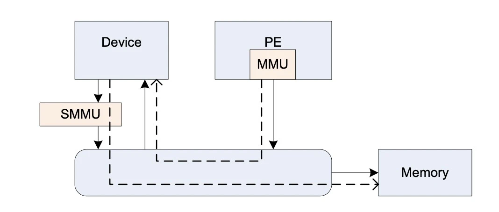

SMMU 地址翻译的数据结构都是放在内存中的，由SMMU的寄存器保存着这些表在内存中的基地址，即Stream Table Entry(STE)。 STE 既包含 stage1 的翻译结构也包含 stage2 的翻译结构，所谓 stage1 负责 VA 到 PA 的转换，stage2 负责 IPA(Intermediate Physical Address) 到 PA 的转换。在 ARM 体系结构中，如果没有虚拟机参与的话，无论是 CPU 还是 SMMU 地址翻译都是从 VA->PA/IOVA->PA，被称之为 stage1，也就是不涉及虚拟，只是一阶段翻译而已。

相比MMU仅为一个 CPU 服务，一个 SMMU 可以为很多个设备服务。故为了区分，SMMU 给其所管理的每个设备一个唯一的 StreamID，通过 StreamID 可以查到 STE。 对于设备比较少的情况下，STE 只需要是 1 维数组就可以了，如下图：

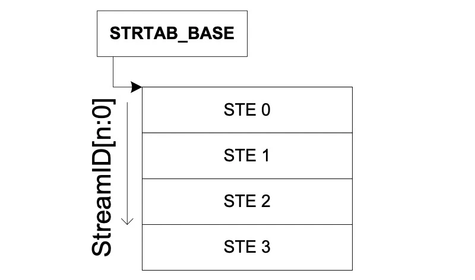

STE 采用线性表并不是真是由设备的数量来决定的，而是写在 SMMU 的 ID0 寄存器中的，也就是配置好了的。对于设备数量较多的情况下，可以采用两层 STE 的结构，如下图：

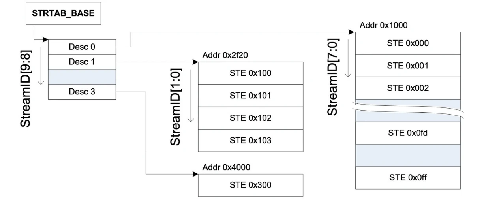

ARM SMMU v3 第一层的目录 desc 的目录结构，大小采用 8（STRTAB_SPLIT）位，也就是 SteamID 的高 8 位，SteamID  剩下的低位全部用来寻址第二层真正的 STE。

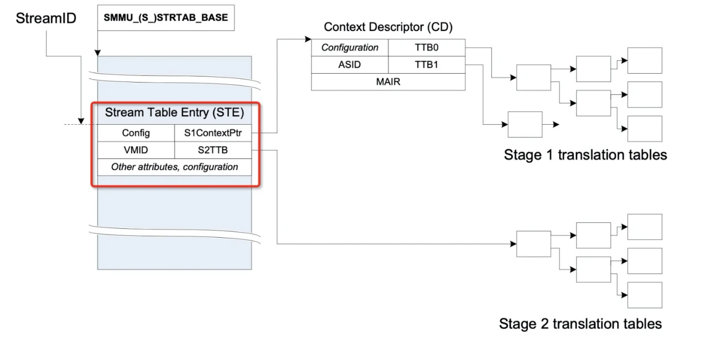

如上如所示，红框中就是 SMMU 中一个 STE 的全貌。一个 STE 同时管理了 stage1 和 stage2 的数据结构，其中 Config 是表示 STE 有关的配置项，VMID 是指虚拟机 ID，S1ContextPtr 指向一个 Context Descriptor 的目录结构。使用 SMMU 的设备上可以跑多个任务，这些任务可以使用不同的 page table，而 SMMU 采用了 CD 来管理每个 page table，并新增一个 SubstreamID(pasid)，用于查找 CD。CD 在 SMMU 中也是可以是线性的或者两级的，可以在 SMMU 寄存器中配置，由 SMMU 驱动来读去，进行按对应的位进行分级，和 STE 表一样的原理。

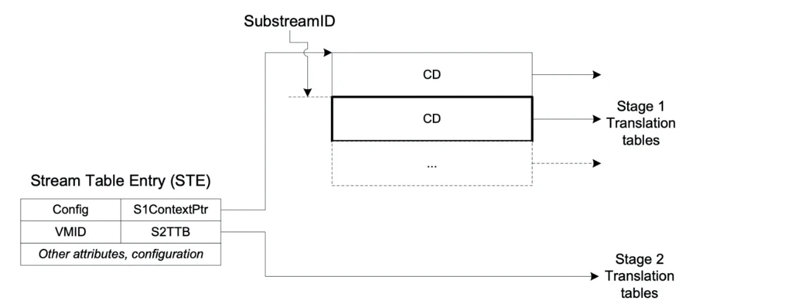

在虚拟机的 Guest 中启用 SMMU 的时候，是需要同时开启 stage1 和 stage2 的，当然了，SMMU 也是可以进行 bypass 的，如下图所示：

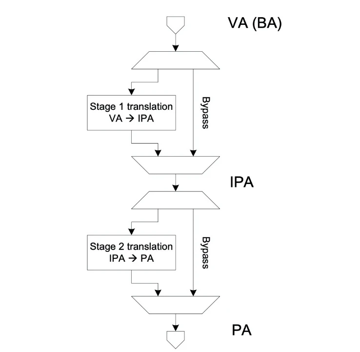

下图是一个外设请求 SMMU 的地址翻译的基本流程，当一个外设需要 DMA 的物理地址的时候，开始请求 SMMU 的地址翻译。这时候外设给 SMMU 3 个比较重要的信息，分别是：StreamID：协助 SMMU 找到管理外设的 STE，SubsreamID：当找到 STE 后，协助 SMMU 找到对应的 CD，通过这两个 ID SMMU 就可以找到对应的 io page table 了。SMMU  找到 page table 后结合外设提交过来的最后一个信息 iova，即可开始进行地址翻译； SMMU 也有 tlb 的缓存，SMMU 首先会根据当前 CD 中存放的 ASID 来查查 tlb 缓存中有没有对应 page table 的缓存，其实和 mmu 找页表的原理是一样的。

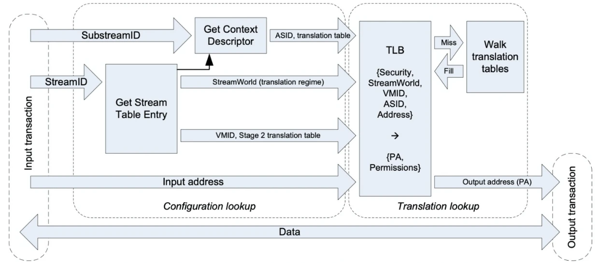

#### SMMU 驱动代码分析

```c
static int arm_smmu_device_probe(struct platform_device *pdev)
{
	int irq, ret;
	struct resource *res;
	resource_size_t ioaddr;
	struct arm_smmu_device *smmu; /* 内核中每个 smmu 都有一个结构体 struct arm_smmu_device 来管理，实际上初始化的流程就是在填充着个结构。 */
	struct device *dev = &pdev->dev;
	bool bypass;

	smmu = devm_kzalloc(dev, sizeof(*smmu), GFP_KERNEL); /* 从 slub/slab 中分配一个对象空间 */
	if (!smmu) {
		dev_err(dev, "failed to allocate arm_smmu_device\n");
		return -ENOMEM;
	}
	smmu->dev = dev;

	if (dev->of_node) {
		ret = arm_smmu_device_dt_probe(pdev, smmu); /* 从 dts 中的 smmu 节点中读取一些 smmu 中断等属性 */
	} else {
		ret = arm_smmu_device_acpi_probe(pdev, smmu); /* 从 acpi 的 smmu 配置表中读取一些 smmu 中断等属性 */
		if (ret == -ENODEV)
			return ret;
	}

	/* Set bypass mode according to firmware probing result */
	bypass = !!ret;

	/* Base address */
	res = platform_get_resource(pdev, IORESOURCE_MEM, 0); /* 从 dts 或者 apci 表中读取 smmu 的寄存器的基地址 */
	if (resource_size(res) < arm_smmu_resource_size(smmu)) {
		dev_err(dev, "MMIO region too small (%pr)\n", res);
		return -EINVAL;
	}
	ioaddr = res->start;
    
	/*
	 * Don't map the IMPLEMENTATION DEFINED regions, since they may contain
	 * the PMCG registers which are reserved by the PMU driver.
	 */
    /* smmu 寄存器映射 */
	smmu->base = arm_smmu_ioremap(dev, ioaddr, ARM_SMMU_REG_SZ);
	if (IS_ERR(smmu->base))
		return PTR_ERR(smmu->base);

	if (arm_smmu_resource_size(smmu) > SZ_64K) {
		smmu->page1 = arm_smmu_ioremap(dev, ioaddr + SZ_64K,
					       ARM_SMMU_REG_SZ);
		if (IS_ERR(smmu->page1))
			return PTR_ERR(smmu->page1);
	} else {
		smmu->page1 = smmu->base;
	}

	/* Interrupt lines */
    /* 读取 smmu 的几个中断号，smmu 硬件给软件消息有队列 buffer，smmu 硬件通过中断的方式让 smmu 驱动从队列 buffer 中取消息。 */
	irq = platform_get_irq_byname_optional(pdev, "combined");
	if (irq > 0)
		smmu->combined_irq = irq;
	else {
    /* smmu 的一个队列叫 event 队列，这个队列是给挂在 smmu 上的 platform 设备用的，当 platform 设备使用 smmu 翻译 dma 的 iova 的时候，
     * 如果发生了异常 smmu 会首先将异常的消息填到 event 队列中，随后上报一个 eventq 的中断给 smmu 驱动，smmu 驱动接到这个中断后，
     * 开始执行中断处理程序，从 event 队列中将异常的消息读出来，显示异常。
     */
		irq = platform_get_irq_byname_optional(pdev, "eventq");
		if (irq > 0)
			smmu->evtq.q.irq = irq;
    /* priq 中断时给 pri 队列用的，这个队列是专门给挂在 smmu 上的 pcie 类型的设备用的，具体的流程其实是和 event 队列是一样的。 */
		irq = platform_get_irq_byname_optional(pdev, "priq");
		if (irq > 0)
			smmu->priq.q.irq = irq;
    /* 如果 smmu 在执行过程中，发生了不可恢复的严重错误，smmu 会报告一个 gerror 中断给 smmu 驱动 */
		irq = platform_get_irq_byname_optional(pdev, "gerror");
		if (irq > 0)
			smmu->gerr_irq = irq;
	}
    
    /* Probe the h/w */
    /* 读取提前写死在 smmu 硬件寄存器中的各种配置，将配置 bit 位读取出来放到 struct arm_smm_device 的数据结构中。
     * 信息包括 smmu 支持二级 ste 还是一级的 ste，二级的 cd 还有 一 级的 cd，smmu 支持的物理也大小，iova 和 pa 的地址位数等等
     */
	ret = arm_smmu_device_hw_probe(smmu);
	if (ret)
		return ret;

	/* Initialise in-memory data structures */
    /* 初始化两种数据结构，一个 strtab(stream table 的简写)，根据硬件寄存器读出来的信息，决定初始化一级或者二级 ste，
     * 对于二级 ste 仅仅只会初始化第一级的 ste 目录项，分配的大小是 STRTAB_SPLIT，这个宏目前在 smmu 驱动中是 8 位，也就是预先会分配 2^8 个目录项，
     * 每个目录项的大小是固定的。另外一个种是队列(cmdq，evtq，priq)的内存分配和初始化。
     */
	ret = arm_smmu_init_structures(smmu);
	if (ret)
		return ret;

	/* Record our private device structure */
	platform_set_drvdata(pdev, smmu);

	/* Reset the device */
    /* 将先前初始化好的队列和 stream table 的目录项的基地址设置 smmu 的控制寄存器中 */
	ret = arm_smmu_device_reset(smmu, bypass);
	if (ret)
		return ret;

	/* And we're up. Go go go! */
	ret = iommu_device_sysfs_add(&smmu->iommu, dev, NULL,
				     "smmu3.%pa", &ioaddr);
	if (ret)
		return ret;

	iommu_device_set_ops(&smmu->iommu, &arm_smmu_ops);
	iommu_device_set_fwnode(&smmu->iommu, dev->fwnode);

    /* 将 smmu 的基本数据结构注册到上层的 iommu 抽象框架里，简单说明下此框架：能够有能力完成设备 iova 到 pa 转换的有很多，
     * 例如有 intel iommu, amd 的 iommu ,arm 的 smmu 等等。这些不同的硬件架构不会都作为一个独立的子系统，
     * 所以，在 linux 内核中 抽象了一层 iommu 层，由 iommu 层给各个外部设备驱动提供结构，隐藏底层的不同的架构
     */
	ret = iommu_device_register(&smmu->iommu);
	if (ret) {
		dev_err(dev, "Failed to register iommu\n");
		return ret;
	}
    /* 根据 smmu 所挂载的是 pcie 外设，还是 platform 外设，将 smmu 绑定到不同的总线类型上 */
	return arm_smmu_set_bus_ops(&arm_smmu_ops);
}
```


### DMA

DMA 是 Direct Memory Access 的缩写，顾名思义，就是绕开 CPU 直接访问 memory 的意思。在计算机中，相比 CPU，memory 和外设的速度是非常慢的，因而在 memory 和 memory（或者 memory 和设备）之间搬运数据，非常浪费 CPU 的时间，造成 CPU 无法及时处理一些实时事件。DMA 控制器是被设计专门用来搬运数据的器件，协助CPU进行数据搬运，如下图所示：

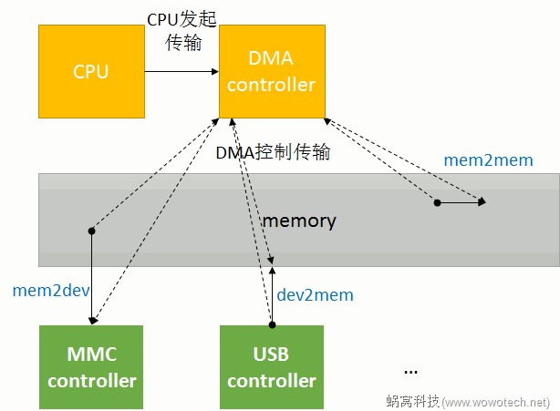

思路很简单，因而大多数的 DMA controller 都有类似的设计原则。得益于类似的设计原则，Linux kernel才有机会使用一套 framework 去抽象 DMA engine 有关的功能。下文的两个概念在此解释：Provider（DMA controller 驱动）和 Consumer（其它驱动怎么使用DMA传输数据）。

##### DMA channels

一个 DMA controller 可以“同时”进行的 DMA 传输的个数是有限的，这称作 DMA channels。当然，这里的 channel，只是一个逻辑概念，因为：鉴于总线访问的冲突，以及内存一致性的考量，从物理的角度看，不大可能会同时进行两个（及以上）的 DMA 传输。因而 DMA channel 不太可能是物理上独立的通道；很多时候，DMA channels 是 DMA controller 为了方便，抽象出来的概念，让 consumer 以为独占了一个 channel，实际上所有 channel 的 DMA 传输请求都会在 DMA controller 中进行仲裁，进而串行传输；因此，软件也可以基于 controller 提供的 channel（称为“物理”channel），自行抽象更多的“逻辑” channel，软件会管理这些逻辑 channel 上的传输请求。实际上很多平台都这样做了，在DMA Engine framework中，不会区分这两种 channel（本质上没区别）。

##### DMA request lines

DMA 传输是由 CPU 发起的：CPU 会告诉 DMA 控制器，帮忙将xxx地方的数据搬到xxx地方。CPU 发完指令之后，就当甩手掌柜了。而 DMA 控制器，除了负责怎么搬之外，还要决定一件非常重要的事情（特别是有外部设备参与的数据传输）：**何时可以开始数据搬运**

因为，CPU 发起 DMA 传输的时候，并不知道当前是否具备传输条件，例如 source 设备是否有数据、dest 设备的 FIFO 是否空闲等等。那谁知道是否可以传输呢？设备！因此，需要 DMA 传输的设备和 DMA 控制器之间，会有几条物理的连接线（称作DMA request，DRQ），用于通知 DMA 控制器可以开始传输了。

这就是 DMA request lines 的由来，通常来说，每一个数据收发的节点（称作endpoint），和 DMA controller 之间，就有一条 DMA request line（memory 设备除外）。

最后总结：DMA channel 是 Provider（提供传输服务），DMA request line 是 Consumer（消费传输服务）。在一个系统中 DMA request line 的数量通常比DMA channel 的数量多，因为并不是每个 request line 在每一时刻都需要传输。

##### 传输参数

在最简单的 DMA 传输中，只需为 DMA controller 提供一个参数 **transfer size**，它就可以欢快的工作了：在每一个时钟周期，DMA controller 将 1byte 的数据从一个 buffer 搬到另一个 buffer，直到搬完 transfer size 个 bytes 即可停止。

不过这在现实世界中往往不能满足需求，因为有些设备可能需要在一个时钟周期中，传输指定 bit 的数据，例如：memory 之间传输数据的时候，希望能以总线的最大宽度为单位（32-bit、64-bit等），以提升数据传输的效率；而在音频设备中，需要每次写入精确的16-bit或者24-bit的数据；等等。因此，为了满足这些多样的需求，需要为 DMA controller 提供一个额外的参数 **transfer width**。

另外，当传输的源或者目的地是 memory 的时候，为了提高效率，DMA controller 不愿意每一次传输都访问 memory，而是在内部开一个 buffer，将数据缓存在自己 buffer 中：memory 是源的时候，一次从 memory 读出一批数据，保存在自己的buffer中，然后再一点点（以时钟为节拍），传输到目的地；memory 是目的地的时候，先将源的数据传输到自己的 buffer 中，当累计一定量的数据之后，再一次性的写入 memory。这种场景下，DMA 控制器内部可缓存的数据量的大小，称作 **burst size**。

##### scatter-gather

一般情况下，DMA 传输一般只能处理在物理上连续的 buffer。但在有些场景下，我们需要将一些非连续的 buffer 拷贝到一个连续 buffer 中（这样的操作称作scatter gather）。对于这种非连续的传输，大多时候都是通过软件，将传输分成多个连续的小块（chunk）。但为了提高传输效率（特别是在图像、视频等场景中），有些DMA controller从硬件上支持了这种操作，具体实现与硬件相关。

##### Slave-DMA API和Async TX API

DMA 传输可以分为4类：memory 到 memory、memory 到 device、device 到 memory 以及 device 到 device。Linux kernel 作为 CPU 的代理人，从它的视角看，外设都是 slave，因此称这些有 device 参与的传输（MEM2DEV、DEV2MEM、DEV2DEV）为 Slave-DMA 传输。而另一种 memory 到 memory 的传输，被称为 Async TX。（Slave-DMA 中的 slave，指的是参与 DMA 传输的设备。而对应的，master 就是指 DMA controller 自身。）

为什么强调这种差别呢？因为Linux为了方便基于 DMA 的 memcpy、memset 等操作，在 dma engine 之上，封装了一层更为简洁的 API（如下面图所示），这种 API 就是 Async TX API（以 async_ 开头，例如 async_memcpy、async_memset、async_xor 等）。

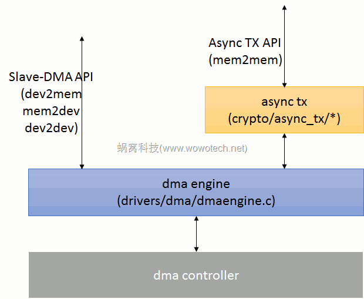

最后，因为 memory 到 memory 的 DMA 传输有了比较简洁的 API，没必要直接使用 dma engine 提供的 API，最后就导致 dma engine 所提供的 API 就特指为 Slave-DMA API（把 mem2mem 剔除了）。

##### dma engine的使用步骤

对设备驱动的编写者来说，要基于dma engine提供的Slave-DMA API进行DMA传输的话，需要如下的操作步骤：

1. 申请一个DMA channel。
2. 根据设备（slave）的特性，配置 DMA channel 的参数。
3. 要进行 DMA 传输的时候，获取一个用于识别本次传输（transaction）的描述符（descriptor）。
4. 将本次传输（transaction）提交给dma engine并启动传输。
5. 等待传输（transaction）结束。
6. 然后，重复3~5即可。

##### 申请DMA channel

任何 consumer 在开始 DMA 传输之前，都要申请一个 DMA channel。DMA channel（在kernel中由 `struct dma_chan`  数据结构表示）由 provider（或者是DMA controller）提供，被 consumer 使用。consumer可以通过如下的API申请DMA channel：

```c
/* 该接口会返回绑定在指定设备（dev）上名称为 name 的 dma channel。
 * dma engine 的 provider 和 consumer 可以使用 device tree、ACPI 或者 struct dma_slave_map 类型的 match table 提供这种绑定关系
 */
struct dma_chan *dma_request_chan(struct device *dev, const char *name);

/* 申请得到的dma channel可以在不需要使用的时候通过下面的API释放掉 */
void dma_release_channel(struct dma_chan *chan);
```

##### 配置DMA channel的参数

driver 申请到一个为自己使用的 DMA channel 之后，需要根据自身的实际情况，以及 DMA controller 的能力，对该 channel 进行一些配置。可配置的内容由`struct dma_slave_config` 数据结构表示。driver 将它们填充到一个 `struct dma_slave_config` 变量中后，可以调用如下 API 将这些信息告诉给 DMA controller：

```c
/* include/linux/dmaengine.h */
int dmaengine_slave_config(struct dma_chan *chan, struct dma_slave_config *config);

/* 包含了完成一次DMA传输所需要的所有可能的参数 */
struct dma_slave_config {
	/* 指明传输的方向，包括（具体可参考enum dma_transfer_direction的定义和注释）：
     * DMA_MEM_TO_MEM，memory 到 memory 的传输；
     * DMA_MEM_TO_DEV，memory 到设备的传输；
     * DMA_DEV_TO_MEM，设备到 memory 的传输；
     * DMA_DEV_TO_DEV，设备到设备的传输。
     * controller不一定支持所有的 DMA 传输方向，具体要看 provider 的实现。
     * MEM to MEM 的传输，一般不会直接使用 dma engine 提供的API。
     */
	enum dma_transfer_direction direction;
    /* 传输方向是 dev2mem 或者 dev2dev 时，读取数据的位置（通常是固定的FIFO地址）。
     * 对 mem2dev 类型的 channel，不需配置该参数（每次传输的时候会指定）。
     */
	phys_addr_t src_addr;
    /* 传输方向是 mem2dev 或者 dev2dev 时，写入数据的位置（通常是固定的 FIFO 地址）。
     * 对 dev2mem 类型的 channel，不需配置该参数（每次传输的时候会指定）。
     */
	phys_addr_t dst_addr;
    /* src地址的宽度，包括1、2、3、4、8、16、32、64（bytes）等（具体可参考enum dma_slave_buswidth 的定义）。 */
    enum dma_slave_buswidth src_addr_width;
    /* dst地址的宽度，包括1、2、3、4、8、16、32、64（bytes）等（具体可参考enum dma_slave_buswidth 的定义）。 */
    enum dma_slave_buswidth dst_addr_width;
    /* src 最大可传输的 burst size，单位是 src_addr_width（注意，不是byte）。 */
    u32 src_maxburst;
    /* dst 最大可传输的 burst size，单位是 dst_addr_width（注意，不是byte）。 */
    u32 dst_maxburst;
    /* 当外设是 Flow Controller（流控制器）的时候，需要将该字段设置为 true。CPU 中有关 DMA 和外部设备之间连接方式的设计中，
     * 决定 DMA 传输是否结束的模块，称作 flow controller，DMA controller 或者外部设备，都可以作为 flow controller，
     * 具体要看外设和 DMA controller 的设计原理、信号连接方式等。
     */
    bool device_fc;
    /* 外部设备通过 slave_id 告诉 dma controller 自己是谁（一般和某个 request line 对应）。很多 dma controller 并不区分 slave，
     * 只要给它 src、dst、len 等信息，它就可以进行传输，因此 slave_id 可以忽略。而有些 controller，必须清晰地知道此次传输的对象是哪个外设，
     * 就必须要提供 slave_id了（至于怎么提供，可dma controller的硬件以及驱动有关，要具体场景具体对待）。
     */
    unsigned int slave_id;
};
```

##### 获取传输描述（tx descriptor）

DMA 传输属于异步传输，在启动传输之前，slave driver 需要将此次传输的一些信息（例如 src/dst 的 buffer、传输的方向等）提交给 dma engine（本质上是dma controller driver），dma engine 确认 okay 后，返回一个描述符（由 `struct dma_async_tx_descriptor` 抽象）。此后，slave driver 就可以以该描述符为单位，控制并跟踪此次传输。根据传输模式的不同，slave driver 可以使用下面三个 API 获取传输描述符：

```c
/* 用于在“scatter gather buffers”列表和总线设备之间进行DMA传输
 * chan，本次传输所使用的 dma channel。
 * sgl，要传输的“scatter gather buffers”数组的地址；
 * sg_len，“scatter gather buffers”数组的长度。
 * direction，数据传输的方向，具体可参考 enum dma_data_direction （include/linux/dma-direction.h）的定义。
 * flags，可用于向 dma controller driver 传递一些额外的信息，包括（具体可参考enum dma_ctrl_flags中以DMA_PREP_开头的定义）：
 * DMA_PREP_INTERRUPT，告诉 DMA controller driver，本次传输完成后，产生一个中断，并调用 client 提供的回调函数（可在该函数返回后，
 * 通过设置 struct dma_async_tx_descriptor 指针中的相关字段，提供回调函数）；
 * DMA_PREP_FENCE，告诉 DMA controller driver，后续的传输，依赖本次传输的结果（这样 controller driver 就会小心的组织多个 dma 传输之间的顺序）；
 * DMA_PREP_PQ_DISABLE_P、DMA_PREP_PQ_DISABLE_Q、DMA_PREP_CONTINUE，PQ有关的操作。
 */
struct dma_async_tx_descriptor *dmaengine_prep_slave_sg(struct dma_chan *chan, struct scatterlist *sgl,
        												unsigned int sg_len, enum dma_data_direction direction,
        												unsigned long flags);

/* 常用于音频等场景中，在进行一定长度的dma传输（buf_addr&buf_len）的过程中，每传输一定的 byte（period_len），就会调用一次传输完成的回调函数
 * chan，本次传输所使用的 dma channel。
 * buf_addr、buf_len，传输的 buffer 地址和长度。
 * period_len，每隔多久（单位为byte）调用一次回调函数。需要注意的是，buf_len 应该是 period_len 的整数倍。
 * direction，数据传输的方向。
 */
struct dma_async_tx_descriptor *dmaengine_prep_dma_cyclic(struct dma_chan *chan, dma_addr_t buf_addr, size_t buf_len,
        												  size_t period_len, enum dma_data_direction direction);


/* 可进行不连续的、交叉的DMA传输，通常用在图像处理、显示等场景中 */
struct dma_async_tx_descriptor *dmaengine_prep_interleaved_dma(struct dma_chan *chan, struct dma_interleaved_template *xt,
        													   unsigned long flags);

/* 传输描述符用于描述一次DMA传输（类似于一个文件句柄）。client driver 将自己的传输请求提交给 dma controller driver 后，
 * controller driver 会返回给 client driver 一个描述符。client driver 获取描述符后，可以以它为单位，
 * 进行后续的操作（启动传输、等待传输完成、等等）。也可以将自己的回调函数通过描述符提供给 controller driver。
 */
struct dma_async_tx_descriptor {
    /* 一个整型数，用于追踪本次传输。一般情况下，dma controller driver 会在内部维护一个递增的 number，
     * 每当client获取传输描述的时候，都会将该number赋予cookie，然后加一。
     */
	dma_cookie_t cookie;
    /* flags， DMA_CTRL_开头的标记，包括：
	 * DMA_CTRL_REUSE，表明这个描述符可以被重复使用，直到它被清除或者释放；
	 * DMA_CTRL_ACK，如果该 flag 为0，表明暂时不能被重复使用。
	 */
    enum dma_ctrl_flags flags; /* not a 'long' to pack with cookie */
    /* 该描述符的物理地址 */
    dma_addr_t phys;
    /* 对应的dma channel */
    struct dma_chan *chan;
    /* controller driver 提供的回调函数，用于把改描述符提交到待传输列表。通常由 dma engine 调用，client driver 不会直接和该接口打交道。 */
    dma_cookie_t (*tx_submit)(struct dma_async_tx_descriptor *tx);
    /* 用于释放该描述符的回调函数，由 controller driver 提供，dma engine 调用，client driver 不会直接和该接口打交道。 */
    int (*desc_free)(struct dma_async_tx_descriptor *tx);
    /* 传输完成的回调函数，由 client driver 提供。 */
    dma_async_tx_callback callback;
    /* 传输完成的回调函数参数，由 client driver 提供。 */
    void *callback_param;
    struct dmaengine_unmap_data *unmap;
#ifdef CONFIG_ASYNC_TX_ENABLE_CHANNEL_SWITCH
    struct dma_async_tx_descriptor *next;
    struct dma_async_tx_descriptor *parent;
    spinlock_t lock;
#endif
};
```

##### 启动传输

client driver 可以通过 `dmaengine_submit` 接口将该描述符放到传输队列上，然后调用 `dma_async_issue_pending` 接口，启动传输。kernel dma engine 鼓励client driver 一次提交多个传输，然后由 kernel（或者dma controller driver）统一完成这些传输。

```c
/* 参数为传输描述符指针，返回一个唯一识别该描述符的 cookie，用于后续的跟踪、监控。 */
dma_cookie_t dmaengine_submit(struct dma_async_tx_descriptor *desc);

/* 参数为dma channel,无返回值 */
void dma_async_issue_pending(struct dma_chan *chan);
```

##### 等待传输结束

传输请求被提交之后，client driver 可以通过回调函数获取传输完成的消息，当然，也可以通过 `dma_async_is_tx_complete` 等 API，测试传输是否完成。最后，如果等不及了，也可以使用 `dmaengine_pause`、`dmaengine_resume`、`dmaengine_terminate_xxx` 等 API，暂停、终止传输。

##### dma controller驱动的软件框架

设备驱动的本质是描述并抽象硬件，然后为 consumer 提供操作硬件的友好接口。dma controller 驱动也不例外，它要做的事情无外乎是：

1. 抽象并控制 DMA 控制器。
2. 管理 DMA channel（可以是物理channel，也可以是虚拟channel），并向 client driver 提供友好、易用的接口。
3. 以 DMA channel 为操作对象，响应 client driver（consumer）的传输请求，并控制 DMA controller，执行传输。

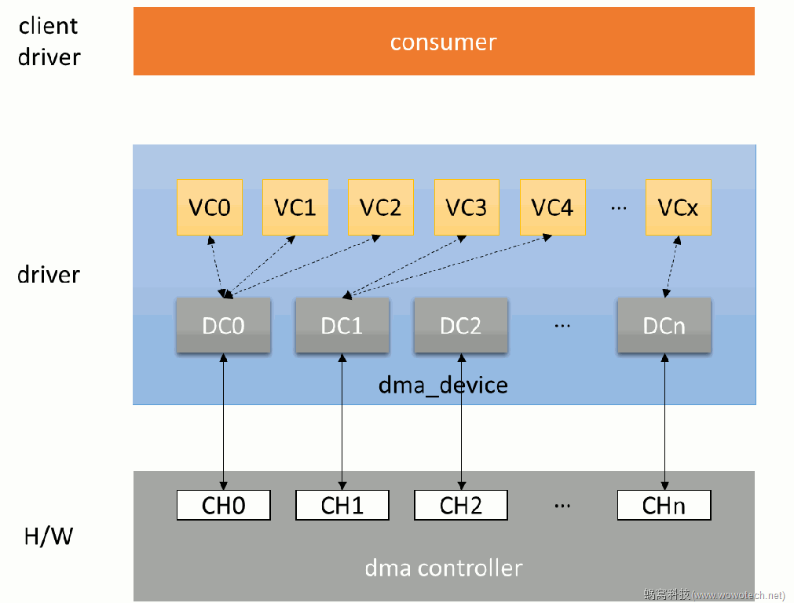

为了统一提供给 consumer 的 API，并减少 DMA controller driver 的开发难度，dmaengine framework 提供了一套 controller driver 的开发框架：

1. 使用 `struct dma_device` 抽象 DMA controller，controller driver 只要填充该结构中必要的字段，就可以完成 dma controller 的驱动开发。
2. 使用 `struct dma_chan`（上图中的DCn）抽象物理的 DMA channel（上图中的CHn），物理 channel 和 controller 所能提供的通道数一一对应。
3. 基于物理的 DMA channel，使用 `struct virt_dma_chan` 抽象出虚拟的 dma channel（上图中的VCx）。多个虚拟 channel 可以共享一个物理 channel，并在这个物理 channel 上进行分时传输。
4. 基于这些数据结构，提供一些便于 controller driver 开发的API，供 driver 使用。

```c
/* 用于抽象 dma controller */
struct dma_device {
	...
    /* 一个链表头，用于保存该 controller 支持的所有 dma channel（struct dma_chan）。
     * 在初始化的时候，dma controller driver 首先要调用 INIT_LIST_HEAD 初始化它，然后调用 list_add_tail 将所有的 channel 添加到该链表头中。
     */
	struct list_head channels;
    /* cap_mask，一个bitmap，用于指示该dma controller所具备的能力（可以进行什么样的DMA传输），例如：
     * DMA_MEMCPY，可进行memory copy；
     * DMA_MEMSET，可进行memory set；
     * DMA_SG，可进行 scatter list 传输；
     * DMA_CYCLIC，可进行 cyclic 的传输；
     * DMA_INTERLEAVE，可进行交叉传输；
     * 另外，该bitmap的定义，需要和后面 device_prep_dma_xxx 形式的回调函数对应（bitmap中支持某个传输类型，就必须提供该类型对应的回调函数）。
	*/
	dma_cap_mask_t  cap_mask;
    ...
    /* 一个bitmap，表示该 controller 支持哪些宽度的 src 类型，包括1、2、3、4、8、16、32、64（bytes）等
     *（具体可参考enum dma_slave_buswidth 的定义）。
     */
	u32 src_addr_widths;
    /* 一个bitmap，表示该 controller 支持哪些宽度的 dst 类型，包括1、2、3、4、8、16、32、64（bytes）等
     *（具体可参考enum dma_slave_buswidth 的定义）。
     */
	u32 dst_addr_widths;
    /* 一个bitmap，表示该c ontroller 支持哪些传输方向，包括 DMA_MEM_TO_MEM、DMA_MEM_TO_DEV、DMA_DEV_TO_MEM、DMA_DEV_TO_DEV，
     * 具体可参考 enum dma_transfer_direction 的定义和注释。
     */
	u32 directions;
	...
    /* 支持的最大的burst传输的size。 */
	u32 max_burst;
	...
    /* 指示该 controller 的传输描述符是否可重复使用（client driver 可只获取一次传输描述符，然后进行多次传输）。 */
	bool descriptor_reuse;
	...
    /* client driver 申请/释放 dma channel 的时候，dmaengine 会调用 dma controller driver 相应的 alloc/free 回调函数，以准备相应的资源。
     * 具体要准备哪些资源，则需要 dma controller driver 根据硬件的实际情况，自行决定。 */
	int (*device_alloc_chan_resources)(struct dma_chan *chan);
	void (*device_free_chan_resources)(struct dma_chan *chan);
    /* client driver 通过 dmaengine_prep_xxx API 获取传输描述符的时候，
     * damengine 则会直接回调 dma controller driver 相应的device_prep_dma_xxx 接口。
     * 至于要在这些回调函数中做什么事情，dma controller driver自己决定。 */
	struct dma_async_tx_descriptor *(*device_prep_dma_memcpy)(
		struct dma_chan *chan, dma_addr_t dst, dma_addr_t src,
		size_t len, unsigned long flags);
	struct dma_async_tx_descriptor *(*device_prep_dma_xor)(
		struct dma_chan *chan, dma_addr_t dst, dma_addr_t *src,
		unsigned int src_cnt, size_t len, unsigned long flags);
	struct dma_async_tx_descriptor *(*device_prep_dma_xor_val)(
		struct dma_chan *chan, dma_addr_t *src,	unsigned int src_cnt,
		size_t len, enum sum_check_flags *result, unsigned long flags);
	struct dma_async_tx_descriptor *(*device_prep_dma_pq)(
		struct dma_chan *chan, dma_addr_t *dst, dma_addr_t *src,
		unsigned int src_cnt, const unsigned char *scf,
		size_t len, unsigned long flags);
	struct dma_async_tx_descriptor *(*device_prep_dma_pq_val)(
		struct dma_chan *chan, dma_addr_t *pq, dma_addr_t *src,
		unsigned int src_cnt, const unsigned char *scf, size_t len,
		enum sum_check_flags *pqres, unsigned long flags);
	struct dma_async_tx_descriptor *(*device_prep_dma_memset)(
		struct dma_chan *chan, dma_addr_t dest, int value, size_t len,
		unsigned long flags);
	struct dma_async_tx_descriptor *(*device_prep_dma_memset_sg)(
		struct dma_chan *chan, struct scatterlist *sg,
		unsigned int nents, int value, unsigned long flags);
	struct dma_async_tx_descriptor *(*device_prep_dma_interrupt)(
		struct dma_chan *chan, unsigned long flags);
	struct dma_async_tx_descriptor *(*device_prep_slave_sg)(
		struct dma_chan *chan, struct scatterlist *sgl,
		unsigned int sg_len, enum dma_transfer_direction direction,
		unsigned long flags, void *context);
	struct dma_async_tx_descriptor *(*device_prep_dma_cyclic)(
		struct dma_chan *chan, dma_addr_t buf_addr, size_t buf_len,
		size_t period_len, enum dma_transfer_direction direction,
		unsigned long flags);
	struct dma_async_tx_descriptor *(*device_prep_interleaved_dma)(
		struct dma_chan *chan, struct dma_interleaved_template *xt,
		unsigned long flags);
	struct dma_async_tx_descriptor *(*device_prep_dma_imm_data)(
		struct dma_chan *chan, dma_addr_t dst, u64 data,
		unsigned long flags);

	...
    /* client driver 调用 dmaengine_slave_config 配置 dma channel 的时候，
     * dmaengine 会调用该回调函数，交给 dma controller driver 处理。
     */
	int (*device_config)(struct dma_chan *chan,
			     struct dma_slave_config *config);
    /* client driver 调用 dmaengine_pause 的时候，dmaengine 会调用相应的回调函数。 */
	int (*device_pause)(struct dma_chan *chan);
    /* client driver 调用 dmaengine_resume 的时候，dmaengine 会调用相应的回调函数。 */
	int (*device_resume)(struct dma_chan *chan);
    /* client driver 调用 dmaengine_terminate_xxx 的时候，dmaengine 会调用相应的回调函数。 */
	int (*device_terminate_all)(struct dma_chan *chan);
 	...
    /* client driver调用 dma_async_issue_pending 启动传输的时候，会调用调用该回调函数。 */
	void (*device_issue_pending)(struct dma_chan *chan);
	...
};

/* 用于抽象 dma channel */
struct dma_chan {
    /* 指向该 channel 所在的 dma controller。 */
	struct dma_device *device;
    /* client driver 以该 channel 为操作对象获取传输描述符时，dma controller driver 返回给 client 的最后一个cookie。 */
    dma_cookie_t cookie;
    /* 在这个 channel 上最后一次完成的传输的 cookie。
     * dma controller driver 可以在传输完成时调用辅助函数 dma_cookie_complete 设置它的 value。
     */
    dma_cookie_t completed_cookie;
	...
	/* 用于将该 channel 添加到 dma_device 的 channel 列表中。 */
    struct list_head device_node;
    ...
};

/* 用于抽象一个虚拟的 dma channel，多个虚拟channel可以共用一个物理channel，
 * 并由软件调度多个传输请求，将多个虚拟channel的传输串行地在物理channel上完成。
 */
struct virt_dma_chan {
    /* 用于和 client driver 打交道（屏蔽物理 channel 和虚拟 channel 的差异）。 */
    struct dma_chan chan;
    /* 用于等待该虚拟 channel 上传输的完成（由于是虚拟channel，传输完成与否只能由软件判断）。 */
    struct tasklet_struct task;
    ....
    /* 四个链表头，用于保存不同状态的虚拟channel描述符（struct virt_dma_desc，仅仅对 struct dma_async_tx_descriptor做了一个简单的封装）。 */
    struct list_head desc_allocated;
    struct list_head desc_submitted;
    struct list_head desc_issued;
    struct list_head desc_completed;
	....
};

struct virt_dma_desc {
    struct dma_async_tx_descriptor tx;
    /* protected by vc.lock */
    struct list_head node;
};

/* dma controller driver 准备好 struct dma_device 变量后，可以调用 dma_async_device_register 将它（controller）注册到 kernel 中。
 * 该接口会对 device 指针进行一系列的检查，然后对其做进一步的初始化，最后会放在一个名称为 dma_device_list 的全局链表上，以便后面使用。
 */
int dma_async_device_register(struct dma_device *device);
/* dma_async_device_unregister，注销接口。 */
void dma_async_device_unregister(struct dma_device *device);

/* 初始化dma channel中的cookie、completed_cookie字段。 */
static inline void dma_cookie_init(struct dma_chan *chan);
/* 为指针的传输描述（tx）分配一个cookie。 */
static inline dma_cookie_t dma_cookie_assign(struct dma_async_tx_descriptor *tx);
/* 当某一个传输（tx）完成的时候，可以调用该接口，更新该传输所对应 channel 的 completed_cookie 字段。 */
static inline void dma_cookie_complete(struct dma_async_tx_descriptor *tx);
/* 获取指定 channel（chan）上指定cookie的传输状态。 */
static inline enum dma_status dma_cookie_status(struct dma_chan *chan, dma_cookie_t cookie, struct dma_tx_state *state);

/* client 可以同时提交多个具有依赖关系的 dma 传输。因此当某个传输结束的时候，dma controller driver 需要检查是否有依赖该传输的传输，
 * 如果有，则传输之。这个检查并传输的过程，可以借助该接口进行（dma controller driver只需调用即可，省很多事）。
 */
void dma_run_dependencies(struct dma_async_tx_descriptor *tx);

/* 用于将client device node 中有关 dma 的字段解析出来，并获取对应的 dma channel。 */
extern struct dma_chan *of_dma_simple_xlate(struct of_phandle_args *dma_spec, struct of_dma *ofdma);
extern struct dma_chan *of_dma_xlate_by_chan_id(struct of_phandle_args *dma_spec, struct of_dma *ofdma);
```

##### 编写一个dma controller driver的方法和步骤

1. 定义一个 `struct dma_device` 变量，并根据实际的硬件情况，填充其中的关键字段。
2. 根据 controller 支持的 channel 个数，为每个channel定义一个 `struct dma_chan` 变量，进行必要的初始化后，将每个 channel 都添加到 `struct dma_device` 变量的 channels 链表中。
3. 根据硬件特性，实现 `struct dma_device` 变量中必要的回调函数（`device_alloc_chan_resources`/`device_free_chan_resources`、`device_prep_dma_xxx`、`device_config`、`device_issue_pending` 等等）。
4. 调用 `dma_async_device_register` 将 `struct dma_device` 变量注册到 kernel 中。
5. 当 client driver 申请 dma channel 时（例如通过 device tree 中的 dma 节点获取），dmaengine 会调用 dma controller driver 的`device_alloc_chan_resources` 函数，controller driver 需要在这个接口中将该 channel 的资源准备好。
6. 当 client driver 配置某个 dma channel 时，dmaengine 会调用 dma controller driver 的 `device_config` 函数，controller driver 需要在这个函数中将 client 想配置的内容准备好，以便进行后续的传输。
7. client driver 开始一个传输之前，会把传输的信息通过 `dmaengine_prep_slave_xxx` 接口交给 controller driver，controller driver 需要在对应的`device_prep_dma_xxx` 回调中，将这些要传输的内容准备好，并返回给 client driver 一个传输描述符。
8. 然后，client driver 会调用 `dmaengine_submit` 将该传输提交给 controller driver，此时 dmaengine 会调用 controller driver 为每个传输描述符所提供的`tx_submit` 回调函数，controller driver 需要在这个函数中将描述符挂到该 channel 对应的传输队列中。
9. client driver 开始传输时，会调用 `dma_async_issue_pending`，controller driver 需要在对应的回调函数（`device_issue_pending`）中，依次将队列上所有的传输请求提交给硬件。
10. 等待dma传输完成。

##### PMIO

PMIO(Port-Mapped I/O)，CPU使用专门的I/O指令对设备进行访问，并把设备的地址称作端口号。在执行其中的一条指令时，CPU使用地址总线选择所请求的I/O端口，使用数据总线在CPU寄存器和端口之间传送数据。系统设计者的主要目的是提供对I/O编程的统一方法，但又不牺牲性能。为了达到这个目的，每个设备的I/O 端口都被组织成一组专用寄存器。CPU把要发给设备的命令写入控制寄存器（control register），并从状态寄存器（status register）中读出表示设备内部状态的值。CPU还可以通过读取输入寄存器（input register）的内容从设备取得数据，也可以通过向输出寄存器（output register）中写入字节而把数据输出到设备。

##### MMIO

MMIO(Memory-Mapped I/O)，即将 I/O 设备中的内部存储和寄存器都映射到统一的存储地址空间（Memory Address Space）中。内存映射I/O这种编址方式非常巧妙，它是通过不同的物理内存地址给设备编址。这种编址方式将一部分物理内存的访问"重定向"到I/O地址空间中，CPU 尝试访问这部分物理内存的时候，实际上最终是访问了相应的I/O设备，CPU却浑然不知。这样以后, CPU就可以通过普通的访存指令来访问设备。这也是内存映射I/O得天独厚的好处：物理内存的地址空间和 CPU 的位宽都会不断增长，内存映射 I/O 从来不需要担心 I/O 地址空间耗尽的问题。从原理上来说，内存映射I/O唯一的缺点就是，CPU无法通过正常渠道直接访问那些被映射到I/O地址空间的物理内存了。但随着计算机的发展，内存映射I/O的唯一缺点已经越来越不明显了：现代计算机都已经是64位计算机，物理地址线都有48根，这意味着物理地址空间有256TB这么大，从里面划出3MB的地址空间给I/O设备，根本就是不痛不痒。

##### DMA Mapping

对于一个硬件设备上的寄存器等设备资源，内核是按照物理地址来管理的。通过 `/proc/iomem` ，你可以看到这些和设备 IO 相关的物理地址。当然，驱动并不能直接使用这些物理地址，必须首先通过 `ioremap()` 接口将这些物理地址映射到内核虚拟地址空间上去。

I/O设备使用第三种地址：**总线地址**。如果设备在 MMIO 地址空间中有若干的寄存器，或者该设备足够的智能，它可以通过 DMA 执行读写系统内存的操作，这些情况下，设备使用的地址就是总线地址。在某些系统中，总线地址与 CPU 物理地址相同，但一般来说它们不是。IOMMU 和 host bridge 可以在物理地址和总线地址之间进行映射。

从设备的角度来看，DMA 控制器使用总线地址空间，不过可能仅限于总线空间的一个子集。例如：即便是一个系统支持64位地址内存和64 位地址的PCI bar，但是DMA可以不使用全部的64 bit地址，通过 IOMMU 的映射，PCI 设备上的 DMA 可以只使用32位 DMA 地址。


在 PCI 设备枚举（初始化）过程中，内核了解了所有的 IO device 及其对应的 MMIO 地址空间（MMIO 是物理地址空间的子集），并且也了解了是 PCI 主桥设备将这些 PCI device 和系统连接在一起。PCI 设备会有 BAR（base address register），表示自己在 PCI 总线上的地址，CPU 并不能通过总线地址 A（位于BAR范围内）直接访问总线上的 PCI 设备，PCI host bridge 会在 MMIO（即物理地址）和总线地址之间进行 mapping。因此，对于 CPU，它实际上是可以通过 B 地址（位于 MMIO 地址空间）访问 PCI 设备（反正 PCI host bridge 会进行翻译）。地址 B 的信息保存在 `struct resource` 变量中，并可以通过 `/proc/iomem` 开放给用户空间。对于驱动程序，它往往是通过 `ioremap()` 把物理地址 B 映射成虚拟地址 C，这时候，驱动程序就可以通过 `ioread32(C)` 来访问 PCI 总线上的地址 A了。

如果 PCI 设备支持 DMA，那么在驱动中我们可以通过 `kmalloc` 或者其他类似接口分配一个 DMA buffer，并且返回了虚拟地址 X，MMU 将 X 地址映射成了物理地址 Y，从而定位了 DMA buffer 在系统内存中的位置。因此，驱动可以通过访问地址 X 来操作 DMA buffer，但是 PCI 设备并不能通过 X 地址来访问 DMA buffer，因为 MMU 对设备不可见，而且系统内存所在的系统总线和 PCI 总线属于不同的地址空间。

在一些简单的系统中，设备可以通过 DMA 直接访问物理地址 Y，但是在大多数的系统中，有一个 IOMMU 的硬件用来将 DMA 可访问的总线地址翻译成物理地址，也就是把上图中的地址 Z 翻译成 Y 。理解了这些底层硬件，你也就知道类似 `dma_map_single` 这样的 DMA API 是在做什么了。驱动在调用 `dma_map_single` 这样的接口函数的时候会传递一个虚拟地址 X，在这个函数中会设定 IOMMU 的页表，将地址 X 映射到 Z，并且将返回 Z 这个总线地址。驱动可以把 Z 这个总线地址设定到设备上的 DMA 相关的寄存器中。这样，当设备发起对地址 Z 开始的 DMA 操作的时候，IOMMU 可以进行地址映射，并将 DMA 操作定位到 Y 地址开始的 DMA buffer。

根据上面的描述可以得出这样的结论：Linux 可以使用动态 DMA 映射（dynamic DMA mapping）的方法，当然，这需要一些来自驱动的协助。所谓动态 DMA 映射是指只有在使用的时候，才建立 DMA buffer 虚拟地址到总线地址的映射，一旦 DMA 传输完毕，就将之前建立的映射关系销毁。

DMA API 适用于各种 CPU arch，各种总线类型，DMA mapping framework 已经屏蔽了底层硬件的细节。对于驱动工程师而言，应该使用通用的 DMA API（例如 `dma_map()` 接口函数），而不是和特定总线相关的 API（例如 `pci_map()` 接口函数）。

##### 可被DMA控制器访问到的系统内存

可访问的内存：

- 伙伴系统的接口（例如 `__get_free_page*()`）或者类似 `kmalloc()` or `kmem_cache_alloc()` 
- 在驱动中定义的全局变量。如果编译到内核，那么全局变量位于内核的数据段或者bss段。在内核初始化的时候，会建立 kernel image mapping，因此全局变量所占据的内存都是连续的，并且 VA 和 PA 是有固定偏移的线性关系，因此可以用于 DMA 操作。不过，在定义这些全局变量的 DMA buffer 的时候，要进行cacheline 的对齐，并且要处理 CPU 和 DMA controller 之间的操作同步，以避免 cache coherence 问题。
- 块设备I/O子系统和网络子系统在分配 buffer 的时候会确保可以使用 DMA 访问。

不可访问或不建议使用的内存：

- `vmalloc()` 分配的DMA buffer。`vmalloc` 分配的 page frame 是不连续的，如果底层硬件需要物理内存连续，那么 `vmalloc` 分配的内存不能满足硬件要求。即便是底层 DMA 硬件支持 scatter-gather，`vmalloc` 分配出来的内存虚拟地址和对应的物理地址没有线性关系（`kmalloc` 或者 `__get_free_page*` 这样的接口，其返回的虚拟地址和物理地址有一个固定偏移的关系），而在做 DMA mapping 的时候，需要知道物理地址，有线性关系的虚拟地址很容易可以获取其物理地址，但是对于 `vmalloc` 分配的虚拟地址，需要遍历页表才可以找到其物理地址。
- 驱动编译成模块。驱动中的全局定义的 DMA buffer 不在内核的线性映射区域，其虚拟地址是在模块加载的时候，通过vmalloc分配。因此这时候如果 DMA buffer 如果大于一个 page frame，那么也是无法保证其底层物理地址的连续性，也无法保证 VA 和 PA 的线性关系，这一点和编译到内核是不同的。
- `kmap()` 接口返回的内存。其原理类似vmalloc。

##### DMA寻址限制

不同的硬件平台有不同的配置方式，有的平台没有限制，外设可以访问系统内存的每一个 Byte，有些则不可以。例如：系统总线有32个bit，设备通过DMA只能驱动低24位地址，在这种情况下，外设在发起 DMA 操作的时候，只能访问16M以下的系统内存。如果设备有 DMA 寻址的限制，那么驱动需要将这个限制通知到内核。如果驱动不通知内核，那么内核缺省情况下认为外设的 DMA 可以访问所有的系统总线的32 bit地址线。64 bit平台同理。是否有DMA寻址限制是和硬件设计相关，有时候标准总线协议也会规定这一点。例如：PCI-X 规范规定，所有的 PCI-X 设备必须要支持64 bit的寻址。如果有寻址限制，那么在该外设驱动的 probe 函数中，驱动需要询问内核，看看是否有 DMA controller 可以支持这个外设的寻址限制。虽然有缺省的寻址限制的设定，不过最好还是在 probe 函数中进行相关处理。

```c
int dma_set_mask_and_coherent(struct device *dev, u64 mask);
```

DMA 操作有两种：一种是 streaming，DMA buffer 是一次性的，用完就算。这种 DMA buffer 需要自己考虑 cache 一致性。另外一种是 DMA buffer 是 cache coherent 的，软件实现上比较简单，更重要的是这种 DMA buffer 往往是静态的、长时间存在的。不同类型的 DMA 操作可能有有不同的寻址限制，也可能相同。如果相同，可以用上面这个接口设定 streaming 和 coherent 两种DMA 操作的地址掩码。如果不同，可以下面的接口进行设定：

```c
/* 设定streaming类型的DMA地址掩码 */
int dma_set_mask(struct device *dev, u64 mask);
/* 设定coherent类型的DMA地址掩码 */
int dma_set_coherent_mask(struct device *dev, u64 mask);
```

`dev` 指向该设备的 `struct device` 对象，一般来说，这个 `struct device` 对象应该是嵌入在 bus-specific 的实例中。例如对于PCI设备，有一个 `struct pci_dev` 的实例与之对应，而在这里需要传入的 `dev` 参数则可以通过 `&pdev->dev` 得到（`pdev` 指向 `struct pci_dev` 的实例）。`mask` 表示设备支持的地址线信息。如果调用这些接口返回0，则说明一切OK，从该设备到指定 mask 的内存的 DMA 操作是可以被系统支持的（包括 DMA controller、bus layer 等）。如果返回值非0，那么说明这样的 DMA 寻址是不能正确完成的，如果强行这么做将会产生不可预知的后果。驱动必须检测返回值，如果不行，那么建议修改 mask 或者不使用 DMA。也就是说，对上面接口调用失败后，有三个选择：

1. 用另外的mask
2. 不使用DMA模式，采用普通I/O模式
3. 忽略这个设备的存在，不对其进行初始化

```c
/* 一个可以寻址32 bit的设备，其初始化的示例代码如下 */
if (dma_set_mask_and_coherent(dev, DMA_BIT_MASK(32))) {
    dev_warn(dev, "mydev: No suitable DMA available\n");
    goto ignore_this_device;
}
```

另一个常见的场景是有64位寻址能力的设备。一般来说会首先尝试设定64位的地址掩码，但是这时候有可能会失败，从而将掩码降低为32位。内核之所以会在设定64位掩码的时候失败，这并不是因为平台不能进行64位寻址，而仅仅是因为32位寻址比64位寻址效率更高。例如，SPARC64 平台上，PCI SAC寻址比DAC寻址性能更好。

```c
int using_dac;

if (!dma_set_mask(dev, DMA_BIT_MASK(64))) {
    using_dac = 1;
} else if (!dma_set_mask(dev, DMA_BIT_MASK(32))) {
    using_dac = 0;
} else {
    dev_warn(dev, "mydev: No suitable DMA available\n");
    goto ignore_this_device;
}
```

设定 coherent 类型的DMA地址掩码也是类似的。需要说明的是：coherent 地址掩码总是等于或者小于 streaming 地址掩码，因此，一般来说，只要设定了streaming 地址掩码成功了，那么使用同样的掩码或者小一些的掩码来设定 coherent 地址掩码总是会成功，因此这时候一般就不检查 `dma_set_coherent_mask `的返回值了，当然，有些设备很奇怪，只能使用 coherent DMA，那么这种情况下，驱动需要检查 `dma_set_coherent_mask` 的返回值。

##### DMA操作方向

```c
DMA_BIDIRECTIONAL
DMA_TO_DEVICE
DMA_FROM_DEVICE
DMA_NONE
```

DMA_TO_DEVICE 表示“从内存（dma buffer）到设备”，而 DMA_FROM_DEVICE 表示“从设备到内存（dma buffer）”，上面的这些字符定义了数据在 DMA 操作中的移动方向。然而，如果不知道具体的操作方向，那么设定为DMA_BIDIRECTIONAL也是可以的，表示DMA操作可以执行任何一个方向的的数据搬移。平台需要保证这一点可以让 DMA 正常工作，当然，这也有可能会引入一些性能上的额外开销。DMA_NONE 主要是用于调试。在驱动知道精确的 DMA 方向之前，可以把它保存在 DMA 控制数据结构中，在 DMA 方向设定有问题的时候，你可以跟踪 DMA 方向的设置情况，以便定位问题所在。

除了潜在的平台相关的性能优化之外，精确地指定 DMA 操作方向还有另外一个优点就是方便调试。有些平台实际上在创建 DMA mapping 的时候，页表（指将bus 地址映射到物理地址的页表）中有一个写权限布尔值，这个值非常类似于用户程序地址空间中的页保护。当 DMA 控制器硬件检测到违反权限设置时（这时候dma buffer 设定的是 DMA_TO_DEVICE 类型，实际上 DMA controller 只能是读 dma buffer），这样的平台可以将错误写入内核日志，从而方便了debug。

只有 streaming mappings 才会指明 DMA 操作方向，一致性 DMA 映射隐含的 DMA 操作方向是 DMA_BIDIRECTIONAL。举一个 streaming mappings 的例子：在网卡驱动中，如果要发送数据，那么在 map/umap 的时候需要指明 DMA_TO_DEVICE 的操作方向，而在接受数据包的时候，map/umap 需要指明 DMA 操作方向是 DMA_FROM_DEVICE。

##### 一致性DMA映射（Consistent DMA mappings ）

Consistent DMA mapping 有下面两种特点：

1. 持续使用该 DMA buffer（不是一次性的），因此 Consistent DMA 总是在初始化的时候进行 map，在 shutdown 的时候 unmap。
2. CPU 和 DMA controller 在发起对 DMA buffer 的并行访问的时候不需要考虑 cache 的影响，也就是说不需要软件进行 cache 操作，CPU 和 DMA controller都可以看到对方对 DMA buffer 的更新。实际上一致性 DMA 映射中的那个 Consistent 实际上可以称为 coherent，即 cache coherent。

缺省情况下，coherent mask 被设定为低 32 bit（0xFFFFFFFF），即便缺省值是OK了，也建议通过接口在驱动中设定 coherent mask。

一般使用 Consistent DMA mapping 的场景包括：

1. 网卡驱动和网卡 DMA 控制器往往是通过一些内存中的描述符（形成环或者链）进行交互，这些保存描述符的 memory 一般采用 Consistent DMA mapping。
2. SCSI(Small Computer System Interface) 硬件适配器上的 DMA 可以主存中的一些数据结构（mailbox command）进行交互，这些保存 mailbox command 的 memory 一般采用 Consistent DMA mapping。
3. 有些外设有能力执行主存上的固件代码（microcode），这些保存 microcode 的主存一般采用 Consistent DMA mapping。

上面的这些例子有同样的特性：CPU 对 memory 的修改可以立刻被 device 感知到，反之亦然。一致性映射可以保证这一点。

需要注意的是：一致性的 DMA 映射并不意味着不需要 memory barrier 这样的工具来保证 memory order，CPU 有可能为了性能而重排对 consistent memory 上内存访问指令。例如：如果在 DMA consistent memory 上有两个 word，分别是 word0 和 word1，对于 device 一侧，必须保证 word0 先更新，然后才有对 word1 的更新，那么你需要这样写代码才能保证在所有的平台上，给设备驱动可以正常的工作：

```c
desc->word0 = address;
wmb();
desc->word1 = DESC_VALID;
```

此外，在有些平台上，修改了 DMA Consistent buffer 后，驱动可能需要 flush write buffer，以便让 device 侧感知到 memory 的变化。这个动作类似在 PCI 桥中的 flush write buffer 的动作。

```c
/* 分配并映射dma buffer */
dma_addr_t dma_handle;
cpu_addr = dma_alloc_coherent(dev, size, &dma_handle, gfp);
```

DMA 操作总是会涉及具体设备上的 DMA controller，而 `dev` 参数就是执行该设备的 `struct device` 对象的。`size` 参数指明了你想要分配的 DMA Buffer 的大小，byte 为单位。`dma_alloc_coherent` 这个接口也可以在中断上下文调用，当然，`gfp` 参数要传递 `GFP_ATOMIC` 标记。`gfp` 是内存分配的 flag，`dma_alloc_coherent` 仅仅是透传该flag到内存管理模块。

需要注意的是 `dma_alloc_coherent` 分配的内存的起始地址和 size 都是对齐在 page 上（类似 `__get_free_pages` 的感觉，当然 `__get_free_pages` 接受的size 参数是 page order），如果不需要那么大的 DMA buffer，那么可以选择 `dma_pool` 接口。

如果传入非空的 `dev` 参数，即使驱动调用了掩码设置接口函数设定了 DMA mask，说明该设备可以访问大于32-bit地址空间的地址，一致性 DMA 映射的接口函数也一般会默认的返回一个32-bit可寻址的 DMA buffer 地址。要知道 dma mask 和 coherent dma mask 是不同的，除非驱动显示的调用`dma_set_coherent_mask()` 接口来修改 coherent dma mask，例如大小大于32-bit地址，`dma_alloc_coherent` 接口函数才会返回大于32-bit地址空间的地址。`dma pool` 接口也是如此。

`dma_alloc_coherent` 函数返回两个值，一个是从 CPU 角度访问 DMA buffer 的虚拟地址，另外一个是从设备（DMA controller）角度看到的 bus address：dma_handle，驱动可以将这个 bus address 传递给硬件。

即便是请求的 DMA buffer 的大小小于 PAGE_SIZE，`dma_alloc_coherent` 返回的 CPU 虚拟地址和 DMA 总线地址都保证对齐在最小的 PAGE_SIZE 上，这个特性确保了分配的 DMA buffer 有这样的特性：如果 PAGE_SIZE  是64K，即便是驱动分配一个小于或者等于64K的 dma buffer，那么 DMA buffer 不会越过64K的边界。

```c
/* umap并释放dma buffer */
dma_free_coherent(dev, size, cpu_addr, dma_handle);
```

`dev`、`size`与分配接口相同，而 `cpu_addr` 和 `dma_handle` 这两个参数就是 `dma_alloc_coherent()` 接口的那两个地址返回值。需要强调的一点就是：和`dma_alloc_coherent` 不同，`dma_free_coherent` 不能在中断上下文中调用。（因为在有些平台上，free DMA的操作会引发TLB维护的操作（从而引发cpu core之间的通信），如果关闭了IRQ会锁死在SMP IPI 的代码中）。

如果驱动需要非常多的小的 dma buffer，那么 `dma_pool` 是最适合你的机制。这个概念类似 `kmem_cache`，`__get_free_pages` 往往获取的是连续的 page frame，而 `kmem_cache` 是批发了一大批 page frame，然后自己“零售”。`dma_pool` 就是通过 `dma_alloc_coherent` 接口获取大块一致性的 DMA 内存，然后驱动可以调用 `dma_pool_alloc` 从那个大块 DMA 内存中分一个小块的 dma buffer 供自己使用。

##### 流式DMA映射（streaming DMA mapping） 

流式 DMA 映射是一次性的，一般是需要进行 DMA 传输的时候才进行 mapping，一旦 DMA 传输完成，就立刻 ummap（除非使用 `dma_sync_*` 的接口）。并且硬件可以为顺序化访问进行优化，设计 streaming DMA mapping 这样的接口是为了充分优化硬件的性能。这里的 streaming 可以被认为是 asynchronous，或者是不属于 coherent memory 范围的。

一般使用streaming DMA mapping的场景包括：

1. 网卡进行数据传输使用的 DMA buffer
2. 文件系统中的各种数据 buffer，这些 buffer 中的数据最终到读写到 SCSI 设备上去，一般而言，驱动会接受这些 buffer，然后进行 streaming DMA mapping，之后和 SCSI 设备上的 DMA 进行交互。

无论哪种类型的 DMA 映射都有对齐的限制，这些限制来自底层的总线，当然也有可能是某些总线上的设备有这样的限制。此外，如果系统中的 cache 并不是 DMA coherent 的，而且底层的 DMA buffer 不合其他数据共享 cacheline，这样的系统将工作的更好。

```c
/* map单个的dma buffer */
struct device *dev = &my_dev->dev;
dma_addr_t dma_handle;
void *addr = buffer->ptr;
size_t size = buffer->len;

dma_handle = dma_map_single(dev, addr, size, direction);
if (dma_mapping_error(dev, dma_handle)) {
    goto map_error_handling;
}

/* umap单个的dma buffer */
dma_unmap_single(dev, dma_handle, size, direction);
```

当调用 `dma_map_single()` 返回错误的时候，应当调用 `dma_mapping_error()` 来处理错误。虽然并不是所有的 DMA mapping 实现都支持 `dma_mapping_error` 这个接口（调用 `dma_mapping_error` 函数实际上会调用底层 `dma_map_ops` 操作函数集中的 `mapping_error` 成员函数），但是调用它来进行出错处理仍然是一个好的做法。这样做的好处是可以确保 DMA mapping 代码在所有 DMA 实现中都能正常工作，而不需要依赖底层实现的细节。没有检查错误就使用返回的地址可能会导致程序失败，可能会产生 kernel panic 或者悄悄的损坏有用的数据。上述同样适用于`dma_map_page()`。

当 DMA 传输完成的时候，程序应该调用 `dma_unmap_single()` 函数 umap dma buffer。例如：在 DMA 完成传输后会通过中断通知 CPU，而在 interrupt handler 中可以调用 `dma_unmap_single()` 函数。`dma_map_single` 函数在进行 DMA mapping 的时候使用的是 CPU 指针（虚拟地址），这样就导致该函数有一个弊端：不能使用 HIGHMEM memory 进行mapping。鉴于此，map/unmap 接口提供了另外一个类似的接口，这个接口不使用 CPU 指针，而是使用 page 和 page offset 来进行 DMA mapping：

```c
struct device *dev = &my_dev->dev;
dma_addr_t dma_handle;
struct page *page = buffer->page;
unsigned long offset = buffer->offset;
size_t size = buffer->len;

dma_handle = dma_map_page(dev, page, offset, size, direction);
if (dma_mapping_error(dev, dma_handle)) {
    goto map_error_handling;
}
...
dma_unmap_page(dev, dma_handle, size, direction);
```

在上面的代码中，`offset` 表示一个指定 page 内的页内偏移（以 Byte 为单位）。和 `dma_map_single` 接口函数一样，调用 `dma_map_page()` 返回错误后需要调用 `dma_mapping_error()` 来进行错误处理。当 DMA 传输完成的时候，程序应该调用 `dma_unmap_page()` 函数 umap dma buffer。例如：在 DMA 完成传输后会通过中断通知 CPU，而在 interrupt handler 中可以调用 `dma_unmap_page()` 函数。

```c
/* 在 scatterlist 的情况下，映射的对象是分散的若干段 DMA buffer */
int i, count = dma_map_sg(dev, sglist, nents, direction);
struct scatterlist *sg;

for_each_sg(sglist, sg, count, i) {
    hw_address[i] = sg_dma_address(sg);
    hw_len[i] = sg_dma_len(sg);
}
```

`nents` 说明了 `sglist` 中条目的数量（即 map 多少段 dma buffer）。具体 DMA 映射的实现是自由的，它可以把 scatterlist 中的若干段连续的 DMA buffer 映射成一个大块的，连续的 bus address region。例如：如果 DMA mapping 是以 PAGE_SIZE 为粒度进行映射，那么那些分散的一块块的 dma buffer 可以被映射到一个对齐在 PAGE_SIZE，然后各个 dma buffer 依次首尾相接的一个大的总线地址区域上。这样做的好处就是对于那些不支持（或者支持有限）scatter-gather 的 DMA controller，仍然可以通过 mapping 来实现。`dma_map_sg` 调用识别的时候返回0，当调用成功的时候，返回成功 mapping 的数目。一旦调用成功，你需要调用 `for_each_sg` 来遍历所有成功映射的 mappings（这个数目可能会小于 nents）并且使用 `sg_dma_address()` 和 `sg_dma_len()` 这两个宏来得到mapping 后的 dma 地址和长度。

```c
/* umap 多个形成 scatterlist 的 dma buffer */
dma_unmap_sg(dev, sglist, nents, direction);
```

调用 `dma_unmap_sg` 的时候要确保 DMA 操作已经完成。另外，传递给 `dma_unmap_sg`  的 `nents` 参数需要等于传递给 `dma_map_sg` 的 `nents` 参数，而不是该函数返回的count。由于 DMA 地址空间是共享资源，每一次 `dma_map_{single,sg}()` 的调用都需要有其对应的 `dma_unmap_{single,sg}()`，如果你总是分配 dma 地址资源而不回收，那么系统将会由于 DMA address 被用尽而陷入不可用的状态。

如果需要多次访问同一个 streaming DMA buffer，并且在 DMA 传输之间读写 DMA Buffer 上的数据，要小心进行 DMA buffer 的 sync 操作，以便 CPU 和设备（DMA controller）可以看到最新的、正确的数据。

```c
/* dma_map_{single,sg}()映射完，在完成DMA传输之后，用以下接口来完成sync的操作，以便CPU可以看到最新的数据 */
dma_sync_single_for_cpu(dev, dma_handle, size, direction);
dma_sync_sg_for_cpu(dev, sglist, nents, direction);
```

如果 CPU 操作了 DMA buffer 的数据，又想把控制权交给设备上的 DMA 控制器，让 DMA controller 访问 DMA buffer，这时候，在真正让 HW（指 DMA 控制器）去访问 DMA buffer 之前，需要调用以下接口，以便device（也就是设备上的 DMA 控制器）可以看到 CPU 更新后的数据。

```c
dma_sync_single_for_device(dev, dma_handle, size, direction);
dma_sync_sg_for_device(dev, sglist, nents, direction);
```

需要强调的是：传递给 `dma_sync_sg_for_cpu()` 和 `dma_sync_sg_for_device()` 的 `nents` 参数需要等于传递给 `dma_map_sg` 的 `nents` 参数，而不是该函数返回的 `count`。在完成最后一次 DMA 传输之后，需要调用 DMA unmap 函数 `dma_unmap_{single,sg}()`。如果在第一次 `dma_map_*()` 调用和 `dma_unmap_*()` 之间， `DMA buffer` 中的数据没有修改，则不需要调用 `dma_sync_*()` 这样的 sync 操作。

##### DMA_ZONE

DMA ZONE 产生的本质原因是：不一定所有的 DMA 都可以访问到所有的内存，这本质上是硬件的设计限制。在32位X86计算机的条件下，ISA实际只可以访问16MB以下的内存。那么ISA上面假设有个网卡，要 DMA，超过16MB以上的内存，它根本就访问不到。所以 Linux 内核干脆简单一点，把16MB砍一刀，这一刀以下的内存单独管理。如果ISA的驱动要申请DMA buffer，带一个GFP_DMA标记来表明想从这个区域申请，Linux 内核保证申请的内存是可以访问的。所以DMA_ZONE的大小，以及DMA_ZONE要不要存在，都取决于实际的硬件是什么。

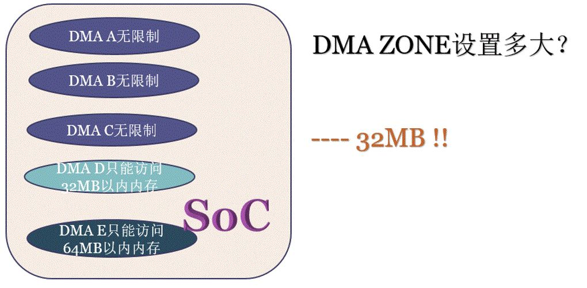

DMA_ZONE的内存做什么都可以。DMA_ZONE的作用是让有缺陷的 DMA 对应的外设驱动申请 DMA buffer 的时候从这个区域申请而已，但是它不是专有的。其他所有人的内存（包括应用程序和内核）也可以来自这个区域。

```c
static void *__dma_alloc(struct device *dev, size_t size, dma_addr_t *handle,
			 			 gfp_t gfp, pgprot_t prot, bool is_coherent,
			 			 unsigned long attrs, const void *caller)
{
	u64 mask = min_not_zero(dev->coherent_dma_mask, dev->bus_dma_limit);
	...
    /* mask < 4G，内存会从 DAM_ZONE 里分配 */
	if (mask < 0xffffffffULL)
		gfp |= GFP_DMA;
	...
}
```

缺省情况下，`dma_alloc_coherent()` 申请的内存缺省是进行 uncache 配置的。但是现代 SoC 特别强，这样有一些 SoC 里面可以用硬件做 CPU 和外设的 cache coherence，如下图中的 cache coherent interconnect。这些 SoC 的厂商就可以把内核的通用实现 overwrite 掉，变成 `dma_alloc_coherent()` 申请的内存也是可以带 cache 的。

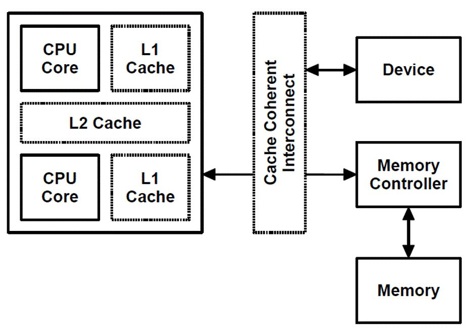

绝大多数的 SoC 目前都支持和使用 CMA 技术，并且多数情况下，DMA coherent APIs 以 CMA 区域为申请的后端，这个时候，`dma_alloc_coherent()` 本质上用 `__alloc_from_contiguous()` 从 CMA 区域获取内存，申请出来的内存显然是物理连续的。但是，如果 IOMMU 存在（ARM里面叫SMMU）的话，DMA 完全可以访问非连续的内存，并且把物理上不连续的内存，用 IOMMU 进行重新映射为 I/O virtual address (IOVA)：

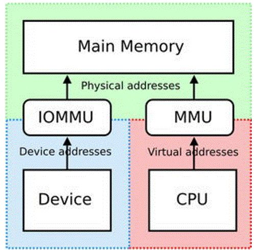

在支持 SVA（Shared Virtual Addressing）的场景下，外设可以和 CPU 共享相同的虚拟地址，这样外设就可以直接共享进程的地址空间，即可以直接在进程的虚拟地址空间进行 DMA 操作。


### DMA_BUF

DMA_BUF 可以实现 buffer 在多个设备的共享，应用可以把一片底层驱动 A 的 buffer 导出到用户空间成为一个 fd，也可以把 fd 导入到底层驱动 B。当然，如果进行 `mmap()` 得到虚拟地址，CPU 也是可以在用户空间访问到已经获得用户空间虚拟地址的底层 buffer 的。


上图中，进程 A 访问设备 A 并获得其使用的 buffer 的 fd，之后通过 socket 把 fd 发送给进程 B，而后进程 B 导入 fd 到设备 B，B 获得对设备 A 中的 buffer 的共享访问。如果 CPU 也需要在用户态访问这片 buffer，则进行了 `mmap()` 动作。

为什么要共享DMA buffer？想象一个场景：当前有一个诉求需要把屏幕 framebuffer 的内容透过 gstreamer 多媒体组件的服务，变成 h264 的视频码流，广播到网络上面，变成流媒体播放。在这个场景中，为了提升性能，想尽一切可能的避免**内存拷贝**。

管理 framebuffer 的驱动可以把这片 buffer 在底层实现为 dma_buf，然后 graphics compositor 给这片 buffer 映射出来一个 fd1，之后透过 socket 发送 fd1 把这块内存交给 gstreamer 相关的进程，如果 gstreamer 相关的 "color space 硬件转换组件"、"H264编码硬件组件"可以透过收到的 fd1 还原出这些 dma_buf 的地址，则可以进行直接的加速操作了。比如 color space 透过接收到的 fd1 还原出 framebuffer 的地址，然后把转化的结果放到另外一片 dma_buf，之后 fd2 对应这片 YUV buffer 被共享给 h264 编码器，h264 编码器又透过 fd2 还原出 YUV buffer 的地址。


这里面的核心点就是 fd 只是充当了一个"句柄"，用户进程和设备驱动透过 fd 最终寻找到底层的 dma_buf，实现 buffer 在进程和硬件加速组件之间的 zero-copy，这里面唯一进行了 exchange 的就是fd。

再比如，如果把方向反过来，gstreamer 从网络上收到了视频流，把它透过一系列动作转换为一片 RGB 的 buffer，那么这片 RGB 的 buffer 最终还要在 graphics compositor 里面渲染到屏幕上，我们也需要透过 dma_buf 实现内存在 video 的 decoder 相关组件与 GPU 组件的共享。


通常，将分配 buffer 的模块成为 exporter，将使用该 buffer 的模块称为 importer 或 user。

- exporter 驱动申请或者引用导入的待共享访问的内存。
- exporter 驱动调用 `dma_buf_export()` 创建 dma_buf 对象，同时将自定义的 `struct dma_buf_ops` 方法集和步骤1中的内存挂载到 dma_buf 对象中。
- exporter 驱动调用 `dma_buf_fd()` 将步骤2中创建的 dma_buf 对象关联到全局可见的文件描述符fd，同时通过 ioctl 方法将 fd 传递给应用层。
- 用户程序将 fd 传递给 importer 驱动程序。
- importer 驱动通过调用 `dma_buf_get(fd)` 获取 dma_buf 对象。
- importer 驱动调用 `dma_buf_attach()` 和 `dma_buf_map_attachment()` 获取共享缓存的信息。

##### sg_table

sg_table 本质上是由一块块单个物理连续的 buffer 所组成的链表，但是这个链表整体上看却是离散的，因此它可以很好的描述从高端内存上分配出的离散 buffer。当然，它同样可以用来描述从低端内存理连续 buffer。


sg_table 代表着整个链表，而它的每一个链表项则由 scatterlist 来表示。因此，1个 scatterlist 也就对应着一块物理连续的 buffer。可以通过如下接口来获取一个 scatterlist 对应 buffer 的物理地址和长度：

```c
sg_dma_address(sgl)
sg_dma_len(sgl)
```

有了 buffer 的物理地址和长度，就可以将这两个参数配置到 DMA 硬件寄存器中，从而实现 DMA 硬件对这一小块 buffer 的访问。在没有 IOMMU 的情况下，访问整块离散 buffer 需要用 for 循环，不断的解析 scatterlist，不断的配置 DMA 硬件寄存器，且每次配置完 DMA 硬件寄存器后，都需要等待本次 DMA 传输完毕，效率很低。而 IOMMU 就是用来解析 sg_table 的，它会将 sg_table 内部一个个离散的小 buffer 映射到自己内部的设备地址空间，使得这整块 buffer 在自己内部的设备地址空间上是连续的。这样，在访问离散 buffer 的时候，只需要将 IOMMU 映射后的设备地址（与 MMU 映射后的 CPU 虚拟地址不是同一概念）和整块 buffer 的 size 配置到 DMA 硬件寄存器中即可，中途无需再多次配置，便完成了 DMA 硬件对整块离散 buffer 的访问，大大的提高了软件的效率。

##### Attach与物理内存分配

同一个 dma_buf 可能会被多个 DMA 硬件访问，而每个 DMA 硬件可能会因为自身硬件能力的限制，对这块 buffer 有自己特殊的要求。比如硬件 A 的寻址能力只有 0x0 ~ 0x10000000，而硬件 B 的寻址能力为 0x0 ~ 0x80000000，那么在分配 dma_buf 的物理内存时，就必须以硬件 A 的能力为标准进行分配，这样硬件 A 和 B 都可以访问这段内存。否则，如果只满足 B 的需求，那么 A 可能就无法访问超出 0x10000000 地址以外的内存空间，道理其实类似于木桶理论。
因此，attach 操作可以让 exporter 驱动根据不同的 device 硬件能力，来分配最合适的物理内存。通过设置 `device->dma_parms` 参数，来告知 exporter 驱动该 DMA 硬件的能力限制。

但如果dma_buf 的物理内存都是在 dma_buf_export() 的时候就分配好了的，而 attach 操作只能在 export 之后才能执行，如何确保已经分配好的内存是符合硬件能力要求的呢？其实内存既可以在 export 阶段分配，也可以在 map attachment 阶段分配，甚至可以在两个阶段都分配，这通常由 DMA 硬件能力来决定。

通常的策略如下（假设只有 A、B 两个硬件需要访问 dma_buf ）：

- 如果硬件 A 和 B 的寻址空间有交集，则在 export 阶段进行内存分配，分配时以 A / B 的交集为准；
- 如果硬件 A 和 B 的寻址空间没有交集，则只能在 map attachment 阶段分配内存。

对于第二种策略，因为 A 和 B 的寻址空间没有交集（即完全独立），所以它们实际上是无法实现内存共享的。此时的解决办法是： A 和 B 在 map attachment 阶段，都分配各自的物理内存，然后通过 CPU 或 通用DMA 硬件，将 A 的 buffer 内容拷贝到 B 的 buffer 中去，以此来间接的实现 buffer “共享”。

另外还有一种策略，先在 export 阶段分配好内存，然后在首次 map attachment 阶段通过 `dma_buf->attachments` 链表，与所有 device 的能力进行一一比对，如果满足条件则直接返回 sg_table；如果不满足条件，则重新分配符合所有 device 要求的物理内存，再返回新的 sg_table。


##### Cache一致性

CPU 在访问内存时是要经过 Cache 的，而 DMA 外设则是直接和 DDR 打交道，因此这就存在 Cache 一致性的问题了，即 Cache 里面的数据是否和 DDR 里面的数据保持一致。比如 DMA 外设早已将 DDR 中的数据改写了，而 CPU 却浑然不知，仍然在访问 Cache 里面暂存的旧数据。所以 Cache 一致性问题，只有在 CPU 参与访问的情况下才会发生。如果一个 dma_buf 自始自终都只被一个硬件访问（要么CPU，要么DMA），那么 Cache 一致性问题就不会存在。当然，如果一个 dma_buf 所对应的物理内存本身就是 Uncache 的（也叫一致性内存），或者说该 buffer 在被分配时是以 coherent 方式分配的，那么这种情况下，CPU 是不经过 cache 而直接访问 DDR 的，自然 Cache 一致性问题也就不存在了。

`dma_buf_map_attachment()` 函数的一个重要功能，那就是同步 Cache 操作。但是该函数通常使用的是 `dma_map_{single,sg}` 这种流式 DMA 映射接口来实现 Cache 同步操作，这类接口的特点就是 Cache 同步只是一次性的，即在 dma map 的时候执行一次 Cache Flush 操作，在 dma unmap 的时候执行一次 Cache Invalidate 操作，而这中间的过程是不保证 Cache 和 DDR 上数据的一致性的。因此如果 CPU 在 dma map 和 unmap 之间又去访问了这块内存，那么有可能 CPU 访问到的数据就只是暂存在 Cache 中的旧数据，这就带来了问题。

举个实际的例子：网卡驱动首先通过 `dma_map_single()` 将接收缓冲区映射给了网卡 DMA 硬件，此后便发起了 DMA 传输请求，等待网卡接收数据完成。当网卡接收完数据后，会触发中断，此时网卡驱动需要在中断里检查本次传输数据的有效性。如果是有效数据，则调用 `dma_unmap_single()` 结束本次 DMA 映射；如果不是，则丢弃本次数据，继续等待下一次 DMA 接收的数据。在这个过程中，检查数据有效性是通过 CPU 读取接收缓冲区中的包头来实现的，也只有在数据检查完成后，才能决定是否执行 `dma_unmap_single()` 操作。因此这里出现了 dma map 和 unmap 期间 CPU 要访问这段内存的需求。

针对这种情况，就需要在 CPU 访问内存前，先将 DDR 数据同步到 Cache 中（Invalidate）；在 CPU 访问结束后，将 Cache 中的数据回写到 DDR 上（Flush），以便 DMA 能获取到 CPU 更新后的数据。这也就是 dma-buf 给我们预留 `{begin,end}_cpu_access` 的原因。

dma_buf 为我们提供了如下内核 API，用来在 dma map 期间发起 CPU 访问操作：

- `dma_buf_begin_cpu_access()`
- `dma_buf_end_cpu_access()`

它们分别对应 dma_buf_ops 中的 begin_cpu_access 和 end_cpu_access 回调接口。

通常在驱动设计时， begin_cpu_access / end_cpu_access 使用如下流式 DMA 接口来实现 Cache 同步：

- `dma_sync_single_for_cpu() / dma_sync_single_for_device()`
- `dma_sync_sg_for_cpu() / dma_sync_sg_for_device()`

CPU 访问内存之前，通过调用 `dma_sync_{single,sg}_for_cpu()` 来 Invalidate Cache，这样 CPU 在后续访问时才能重新从 DDR 上加载最新的数据到 Cache 上。
CPU 访问内存结束之后，通过调用 `dma_sync_{single,sg}_for_device()` 来 Flush Cache，将 Cache 中的数据全部回写到 DDR 上，这样后续 DMA 才能访问到正确的有效数据。

##### 驱动代码示例

```c
/* exporter */
#include <linux/device.h>
#include <linux/dma-buf.h>
#include <linux/module.h>
#include <linux/slab.h>
#include <linux/miscdevice.h>
#include <linux/uaccess.h>

static struct dma_buf *dmabuf_exported;

static int exporter_attach(struct dma_buf *dmabuf, struct device *dev, struct dma_buf_attachment *attachment)
{
	pr_info("dmabuf attach device: %s\n", dev_name(dev));
	return 0;
}

static void exporter_detach(struct dma_buf *dmabuf, struct dma_buf_attachment *attachment)
{
	pr_info("dmabuf detach device: %s\n", dev_name(attachment->dev));
}

static struct sg_table *exporter_map_dma_buf(struct dma_buf_attachment *attachment, enum dma_data_direction dir)
{
	void *vaddr = attachment->dmabuf->priv;
	struct sg_table *table;

	table = kmalloc(sizeof(*table), GFP_KERNEL);

	sg_alloc_table(table, 1, GFP_KERNEL);
	sg_dma_len(table->sgl) = PAGE_SIZE;
    /* kzalloc */
	sg_dma_address(table->sgl) = dma_map_single(NULL, vaddr, PAGE_SIZE, dir);
    
    /* alloc_page */
    sg_dma_address(table->sgl) = dma_map_page(NULL, page, 0, PAGE_SIZE, dir);
    
	return table;
}

static void exporter_unmap_dma_buf(struct dma_buf_attachment *attachment, struct sg_table *table, enum dma_data_direction dir)
{
    /* kzalloc */
    dma_unmap_single(NULL, sg_dma_address(table->sgl), PAGE_SIZE, dir);
    
    /* alloc_page */
    dma_unmap_page(NULL, sg_dma_address(table->sgl), PAGE_SIZE, dir);
	sg_free_table(table);
	kfree(table);
}

static void exporter_release(struct dma_buf *dmabuf)
{
    /* kzalloc */
    kfree(dmabuf->priv);
    
    /* alloc_page */
    struct page *page = dma_buf->priv;
	put_page(page)
}

static void *exporter_vmap(struct dma_buf *dmabuf)
{
    /* kzalloc */
	return dmabuf->priv;
    
	/* alloc_page */
    struct page *page = dma_buf->priv;
	return vmap(&page, 1, 0, PAGE_KERNEL);
}

static void exporter_vunmap(struct dma_buf *dmabuf, void *vaddr)
{
    /* alloc_page */
    vunmap(vaddr);
}

static int exporter_mmap(struct dma_buf *dmabuf, struct vm_area_struct *vma)
{
    /* kzalloc */
	void *vaddr = dmabuf->priv;

	return remap_pfn_range(vma, vma->vm_start, virt_to_pfn(vaddr), PAGE_SIZE, vma->vm_page_prot);
    
    /* alloc_page */
    struct page *page = dma_buf->priv;

	return remap_pfn_range(vma, vma->vm_start, page_to_pfn(page), PAGE_SIZE, vma->vm_page_prot);
}

static int exporter_begin_cpu_access(struct dma_buf *dmabuf, enum dma_data_direction dir)
{
    /* kzalloc */
	dma_addr_t dma_addr = virt_to_phys(dmabuf->priv);

	dma_sync_single_for_cpu(NULL, dma_addr, PAGE_SIZE, dir);
    
    /* alloc_page */
	struct dma_buf_attachment *attachment;
	struct sg_table *table;

	if (list_empty(&dmabuf->attachments))
		return 0;

	attachment = list_first_entry(&dmabuf->attachments, struct dma_buf_attachment, node);
	table = attachment->priv;
	dma_sync_sg_for_cpu(NULL, table->sgl, 1, dir);

	return 0;
}

static int exporter_end_cpu_access(struct dma_buf *dmabuf, enum dma_data_direction dir)
{
    /* kzalloc */
	dma_addr_t dma_addr = virt_to_phys(dmabuf->priv);

	dma_sync_single_for_device(NULL, dma_addr, PAGE_SIZE, dir);
    
    /* alloc_page */
    struct dma_buf_attachment *attachment;
	struct sg_table *table;

	if (list_empty(&dmabuf->attachments))
		return 0;

	attachment = list_first_entry(&dmabuf->attachments, struct dma_buf_attachment, node);
	table = attachment->priv;
	dma_sync_sg_for_device(NULL, table->sgl, 1, dir);

	return 0;
}

static const struct dma_buf_ops exp_dmabuf_ops = {
	.attach = exporter_attach,
	.detach = exporter_detach,
	.map_dma_buf = exporter_map_dma_buf,
	.unmap_dma_buf = exporter_unmap_dma_buf,
	.release = exporter_release,
	.vmap = exporter_vmap,
	.vunmap = exporter_vunmap,
    .mmap = exporter_mmap,
	.begin_cpu_access = exporter_begin_cpu_access,
	.end_cpu_access = exporter_end_cpu_access,
};

static struct dma_buf *exporter_alloc_page(void)
{
	DEFINE_DMA_BUF_EXPORT_INFO(exp_info);
	struct dma_buf *dmabuf;
	void *vaddr;
    struct page *page;

    /* kzalloc */
	vaddr = kzalloc(PAGE_SIZE, GFP_KERNEL);
    /* alloc_page */
    page = alloc_page(GFP_KERNEL);

	exp_info.ops = &exp_dmabuf_ops;
	exp_info.size = PAGE_SIZE;
	exp_info.flags = O_CLOEXEC;
    /* kzalloc */
	exp_info.priv = vaddr;
    /* alloc_page */
    exp_info.priv = page;

	dmabuf = dma_buf_export(&exp_info);

    /* kzalloc */
	sprintf(vaddr, "hello world!");
    /* alloc_page */
    sprintf(page_address(page), "hello world!");

	return dmabuf;
}

static int exporter_misc_mmap(struct file *file, struct vm_area_struct *vma)
{
	return dma_buf_mmap(dmabuf_exported, vma, 0);
}

static long exporter_ioctl(struct file *filp, unsigned int cmd, unsigned long arg)
{
	int fd = dma_buf_fd(dmabuf_exported, O_CLOEXEC);
	copy_to_user((int __user *)arg, &fd, sizeof(fd));

	return 0;
}
 
static struct file_operations exporter_fops = {
	.owner		    = THIS_MODULE,
	.unlocked_ioctl	= exporter_ioctl,
    .mmap	        = exporter_misc_mmap,
};
 
static struct miscdevice mdev = {
	.minor = MISC_DYNAMIC_MINOR,
	.name  = "exporter",
	.fops  = &exporter_fops,
};
 
static int __init exporter_init(void)
{
	dmabuf_exported = exporter_alloc_page();
	return misc_register(&mdev);
}

static void __exit exporter_exit(void)
{
	misc_deregister(&mdev);
}

module_init(exporter_init);
module_exit(exporter_exit);

/* importer */
#include <linux/device.h>
#include <linux/dma-buf.h>
#include <linux/module.h>
#include <linux/slab.h>
#include <linux/miscdevice.h>
#include <linux/uaccess.h>

extern struct dma_buf *dmabuf_exported;

static int importer_test(struct dma_buf *dmabuf)
{   
    void *vaddr;
    /* 将 vmap 操作放到了 begin / end 操作中间，以确保读取数据的正确性，仅为示例，实际不需要 */
    dma_buf_begin_cpu_access(dmabuf, DMA_FROM_DEVICE);

    /* 把实际的物理内存，映射到 kernel 空间，并转化成 CPU 可以连续访问的虚拟地址，方便后续软件直接读写这块物理内存。
     * 因此，无论这块 buffer 在物理上是否连续，在经过 vmap 映射后的虚拟地址一定是连续的。
     * 该函数对应 dma_buf_ops 中的 vmap 回调接口
     */
	vaddr = dma_buf_vmap(dmabuf);
	pr_info("read from dmabuf vmap: %s\n", (char *)vaddr);
	dma_buf_vunmap(dmabuf, vaddr);
    
    dma_buf_end_cpu_access(dmabuf, DMA_FROM_DEVICE);

	struct dma_buf_attachment *attachment;
	struct sg_table *table;
	struct device *dev;
	unsigned int reg_addr, reg_size;
    
	dev = kzalloc(sizeof(*dev), GFP_KERNEL);
	dev_set_name(dev, "importer");

    /* 该函数实际是 “dma-buf attach device” 的缩写，用于建立一个 dma_buf 与 device 的连接关系，
     * 这个连接关系被存放在新创建的 dma_buf_attachment 对象中，供后续调用 dma_buf_map_attachment() 使用。
     * 该函数对应 dma_buf_ops 中的 attach 回调接口，如果 device 对后续的 map attachment 操作没有什么特殊要求，可以不实现。
     */
	attachment = dma_buf_attach(dmabuf, dev);
    /* 该函数实际是 “dma-buf map attachment into sg_table” 的缩写，主要完成2件事情：1) 生成 sg_table; 2) 同步 Cache
     * 选择返回 sg_table 而不是物理地址，是为了兼容所有 DMA 硬件（带或不带 IOMMU），因为 sg_table 既可以表示连续物理内存，也可以表示非连续物理内存。
     * 同步 Cache 是为了防止该 buffer 事先被 CPU 填充过，数据暂存在 Cache 中而非 DDR 上，导致 DMA 访问的不是最新的有效数据。
     * 通过将 Cache 中的数据回写到 DDR 上可以避免此类问题的发生。同样的，在 DMA 访问内存结束后，需要将 Cache 设置为无效，
     * 以便后续 CPU 直接从 DDR 上（而非 Cache 中）读取该内存数据。通常我们使用如下流式 DMA 映射接口来完成 Cache 的同步：
     * dma_map_single() / dma_unmap_single()
	 * dma_map_page() / dma_unmap_page()
	 * dma_map_sg() / dma_unmap_sg()
     * dma_buf_map_attachment() 对应 dma_buf_ops 中的 map_dma_buf 回调接口
	 */
	table = dma_buf_map_attachment(attachment, DMA_BIDIRECTIONAL);

	reg_addr = sg_dma_address(table->sgl);
	reg_size = sg_dma_len(table->sgl);
	pr_info("reg_addr = 0x%08x, reg_size = 0x%08x\n", reg_addr, reg_size);

	dma_buf_unmap_attachment(attachment, table, DMA_BIDIRECTIONAL);
	dma_buf_detach(dmabuf, attachment);

	return 0;
}

static long importer_ioctl(struct file *filp, unsigned int cmd, unsigned long arg)
{
	int fd;
	struct dma_buf *dmabuf;

	copy_from_user(&fd, (void __user *)arg, sizeof(int));

	dmabuf = dma_buf_get(fd);
	importer_test(dmabuf);
	dma_buf_put(dmabuf);

	return 0;
}
 
static struct file_operations importer_fops = {
	.owner	= THIS_MODULE,
	.unlocked_ioctl	= importer_ioctl,
};
 
static struct miscdevice mdev = {
	.minor = MISC_DYNAMIC_MINOR,
	.name = "importer",
	.fops = &importer_fops,
};
 
static int __init importer_init(void)
{
	return misc_register(&mdev);
}

static void __exit importer_exit(void)
{
	misc_deregister(&mdev);
}

module_init(importer_init);
module_exit(importer_exit);

/* userspace */
int main(int argc, char *argv[])
{
	int fd;
	int dmabuf_fd = 0;
    struct dma_buf_sync sync = { 0 };
    /* 首先通过 exporter 驱动的 ioctl() 获取到 dma_buf 的 fd，然后直接使用该 fd 做 mmap() 映射，
     * 最后使用 printf() 来输出映射后的 buffer 内容。
     */
	fd = open("/dev/exporter", O_RDONLY);
	ioctl(fd, 0, &dmabuf_fd);
	close(fd);
    
    /* 将 mmap() 操作放到了 ioctl SYNC_START / SYNC_END 之间，以确保读取数据的正确性，仅为示例，实际不需要 */
	sync.flags = DMA_BUF_SYNC_READ | DMA_BUF_SYNC_START;
	ioctl(dmabuf_fd, DMA_BUF_IOCTL_SYNC, &sync);

	char *str = mmap(NULL, 4096, PROT_READ, MAP_SHARED, dmabuf_fd, 0);
	printf("read from dmabuf mmap: %s\n", str);
    
    sync.flags = DMA_BUF_SYNC_READ | DMA_BUF_SYNC_END;
	ioctl(dmabuf_fd, DMA_BUF_IOCTL_SYNC, &sync);
    
	/* 不再通过 ioctl() 方式获取 dma-buf 的 fd，而是直接使用 exporter misc device 的 fd 进行 mmap() 操作，
	 * 此时执行的则是 misc driver 的 mmap 文件操作接口。
	 */
	fd = open("/dev/exporter", O_RDONLY);

	char *str = mmap(NULL, 4096, PROT_READ, MAP_SHARED, fd, 0);
	printf("read from /dev/exporter mmap: %s\n", str);

	close(fd);
    
    /* 将 dma-buf 的 fd 从 exporter 传递给 importer 驱动 */
	fd = open("/dev/exporter", O_RDONLY);
	ioctl(fd, 0, &dmabuf_fd);
	close(fd);

	fd = open("/dev/importer", O_RDONLY);
	ioctl(fd, 0, &dmabuf_fd);
	close(fd);

	return 0;
}
```

