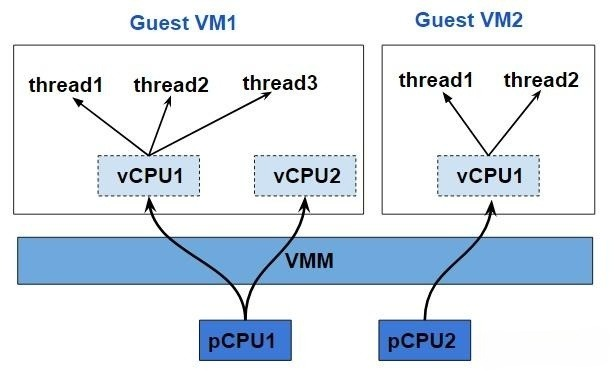
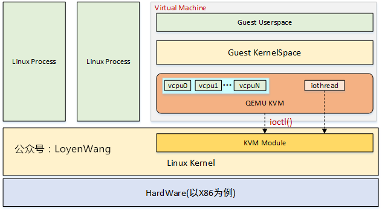
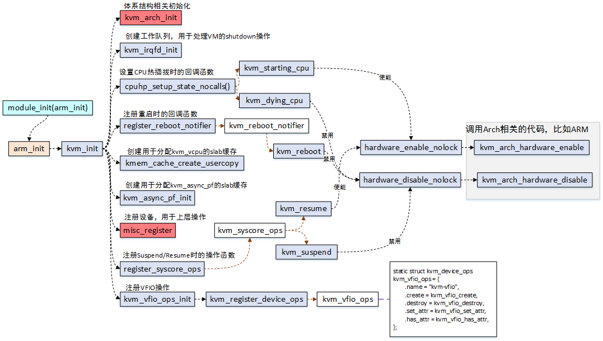
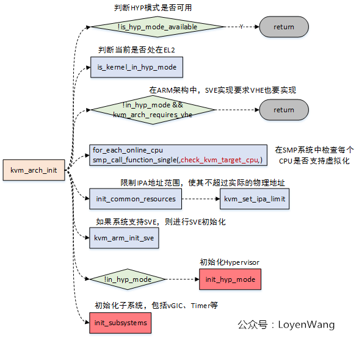
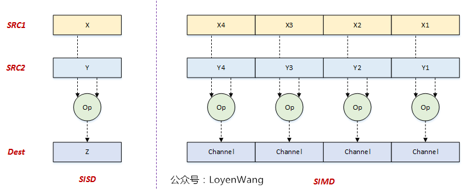
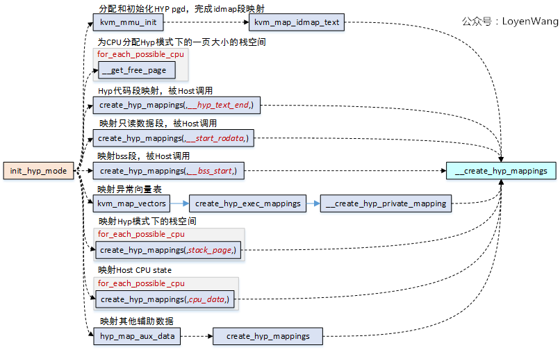

# 	Virtualization

### 基本概念

虚拟化的含义很广泛，将任何一种形式的资源抽象成另一种形式的技术都是虚拟化技术，比如进程的虚拟地址空间，就是把物理内存虚拟成多个内存空间。相对于进程级的虚拟化，虚拟机是另外一个层面的虚拟化，它所抽象的是整个物理机，包括CPU、内存和I/O设备。在一台物理机上可以模拟出多台虚拟机（Virtual Machine，简称VM），每个虚拟机中都可以运行一个操作系统（OS）。提供虚拟化的平台被称为 **VMM**(Virtual Machine Monitor)，在其上运行的虚拟机被称为 **Guest VM**（客户机）。

#### Type 1 Hypervisor

在 Hypervisor 模型中，VMM 是一个完备的操作系统，它除了具备传统操作系统的功能，还具备虚拟化功能。包括 CPU、内存和 I/O 设备在内的所有物理资源都归 VMM 所有，因此 VMM 不仅要负责虚拟机环境的创建和管理，还承担着管理物理资源的责任。这种方式是比较高效的，然而 I/O 设备种类繁多，管理所有设备就意味着大量的驱动开发工作。在实际的产品中，厂商会根据产品定位，有选择的支持一些 I/O 设备，而不是对所有的 I/O 设备都提供支持。


#### Type 2 Hypervisor

在 Host 模型（宿主机）中，物理资源由 host OS 管理，host OS 是传统操作系统（比如 Linux），这些传统操作系统并不是为虚拟化而设计的，因此本身并不具备虚拟化功能，实际的虚拟化功能由 VMM 来提供。VMM 作为 host OS 中一个独立的内核模块，通过调用 host OS 的服务来获得资源，实现 CPU、内存和 I/O 设备的虚拟化。VMM 创建出虚拟机之后，通常将虚拟机作为 host OS 的一个进程参与调度。Host 模型最大的优点就是可以充分利用现有操作系统的设备驱动程序，VMM 不需要为各种 I/O 设备重新实现驱动，可以专注于物理资源的虚拟化；缺点在于，由于 VMM 是借助 host OS 的服务来操作硬件，而不是直接操作硬件，因此受限于 host OS 服务的支持，可能导致硬件利用的不充分。


在开源社区常见的 Hypervisor, Xen (Type 1) 和 KVM (Type 2) 就分属这两种不同的类型。

#### 完全虚拟化(Full Virtualization)

如果一个基于硬件运行（native）的 OS 不需要修改任何代码就可以直接跑在 VMM 上，也就是 Guest OS 根本感知不到自己运行在一个虚拟化环境中（可以说 VMM 是骗术高明的），这种就被称为 **完全虚拟化**。在这种模式下，VMM 需要正确处理 Guest 所有可能的指令。最简单直接的方法就是，VMM 对 Guest 运行过程中的每一条指令都进行解释和执行，模拟出这条指令执行的效果，这种方法既适用于和 VMM 相同体系结构的 Guest，也能用于模拟和 VMM 不同体系结构的 Guest（比如物理 CPU 是 x86 的，而 Guest 是基于 ARM 的），其缺点也很明显，就是性能太差。有一些指令是要操作特权资源的，比如修改虚拟机的运行模式或者下面物理机的状态，读写时钟或者中断寄存器，这些指令被称为敏感指令，确实不适合由 Guest 直接来控制。然而其他的一些非敏感指令，是完全可以在物理 CPU 上直接执行并返回结果给 Guest 的，VMM 只需要截获并模拟 Guest 对敏感指令的执行和对特权资源的访问就可以了，以 intel 的 VT-x 和 AMD 的 AMD-V 为代表的硬件辅助虚拟化技术，就可以帮助 VMM 高效地识别和截获这些敏感指令。

#### **半虚拟化**(Para Virtualization)

像 x86 这种 CISC 架构的系统，指令繁杂，其中一些指令是难以虚拟化的，如果使用完全虚拟化，就需要通过二进制代码翻译（binary translation），扫描并修改 Guest 的二进制代码，将难以虚拟化的指令转换成支持虚拟化的指令（ABI级），就像打补丁一样。如果能直接修改 Guest 的操作系统内核代码（API级），就可以使得内核避免产生这些难以虚拟化的指令，这就是 **半虚拟化**。半虚拟化技术需要修改直接基于 native 运行的 OS 代码，以便和 VMM 更好的配合，其好处就是 Guest 的运行性能可以接近物理机的性能。典型的半虚拟化技术 virtio，需要宿主机/Hypervisor 和客户机都安装对应的驱动。

### CPU 虚拟化

在虚拟化的平台上，虚拟机（Guest VM）所使用的多个虚拟 CPU（以下称 **vCPU**）可能是共享同一个物理 CPU（以下称**pCPU**）的。VMM 负责 vCPU 的调度，当一个 vCPU 被调度到获得 pCPU 的使用权后，基于该 vCPU 运行的 Guest OS 又可以调度 OS 中的各个线程/进程了。也就是说，Guest OS 中的各个线程/进程分时复用了 vCPU，而各个 vCPU 又分时复用了 pCPU。



ARM 体系结构定义了处理单元（Processing Element, PE）一词，现代 CPU 可能包含多个内核或线程，PE 用来指代单一的执行单元。同样的这里的 vCPU 严格来说应该是 vPE。


### AArch64 虚拟化

对于ARMv8, Hypervisor 运行在 EL2 异常级别。只有运行在 EL2 或更高异常级别的软件才可以访问并配置各项虚拟化功能。


#### Stage2 转换

Stage 2 转换允许 Hypervisor 控制虚拟机的内存视图。具体来说，其可以控制虚拟机是否可以访问特定的某一块物理内存，以及该内存块出现在虚拟机内存空间的位置。这种能力对于虚拟机的隔离和沙箱功能来说至关重要。这使得虚拟机只能看到分配给它自己的物理内存。为了支持 Stage 2 转换， 需要增加一个页表，称之为 Stage 2 页表。操作系统控制的页表转换称之为 Stage 1 转换，负责将虚拟机视角的虚拟地址转换为虚拟机视角的物理地址。而 Stage 2 页表由 Hypervisor 控制，负责将虚拟机视角的物理地址转换为真实的物理地址。虚拟机视角的物理地址在 ARMv8 中有特定的词描述，叫中间物理地址(Intermediate Physical Address, IPA)。Stage 2 转换表的格式和 Stage 1 的类似，但也有些属性的处理不太一样，例如，判断内存类型是 normal 还是 device 的信息被直接编码进了表里，而不是通过查询 MAIR_ELx 寄存器。


每一个虚拟机都被分配一个 ID 号，称之为 **VMID**。这个 ID 号用于标记某个特定的 TLB 项属于哪一个 VM。VMID 使得不同的 VM 可以共享同一块 TLB 缓存。VMID 存储在寄存器 VTTBR_EL2 中，可以是 8 或 16 bit，由 VTCR_EL2.vs 比特位控制，其中 16 bit 的 VMID 支持是在 ARMv8.1-A 中扩展的，是可选的。需注意，EL2 和 EL3 的地址转换不需要 VMID 标记，因为它们不需要 Stage 2 转换。

TLB 项也可以用 **ASID**(Address Space Identifier)标记，每个进程都被操作系统分配有一个 ASID，所有属于同一个进程的 TLB 项都有相同的 ASID。这使得不同进程可以共享同一块 TLB 缓存。每一个 VM 有它自己的 ASID 空间。例如两个不同的 VMs 同时使用 ASID 5，但指的是不同的东西。对于虚拟机而言，通常 VMID 会结合 ASID 同时使用。


Stage 1 和 Stage 2 映射都包含属性，例如存储类型，访问权限等。内存管理单元（MMU）会将两个阶段的属性整合成一个最终属性，整合的原则是选择更有限制的属性。在上面的例子中，Device 属性比起 Normal 属性更具限制性，因此最终结果是 Device 属性。同样的原理，如果将顺序调换一下也不会改变最终的属性。属性整合在大多数情况下都可以工作。但有些时候，例如在 VM 的早期启动阶段，Hypervisor 希望改变默认的行为，则可以通过如下寄存器比特来实现。

- HCR_EL2.CD：控制所有 Stage 1 属性为 Non-cacheable。
- HCR_EL2.DC：强制所有 Stage 1 属性为 Normal，Write-Back Cacheable。
- HCR_EL2.FWB (ARMv8.4-A引入)：使用 Stage 2 属性覆盖 Stage 1 属性，而不是使用默认的限制性整合原则。

#### 模拟 MMIO

与物理机器的物理地址空间类似，VM 的 IPA 地址空间包含了内存与外围设备两种区域。如下图所示


VM 使用外围设备区域来访问其看到的物理外围设备，这其中包含了直通设备和虚拟外围设备。虚拟设备完全由 Hypervisor 模拟，如下图所示


一个直通设备被直接分配给 VM 并映射到 IPA 地址空间，这使得 VM 中的软件可用直接访问真实的物理硬件。一个虚拟的外围设备由 Hypervisor 模拟，其 Stage 2 的转换项被标记为 fault。虽然 VM 中的软件看来其是直接与物理设备交互，但实际上这一访问会导致 Stage 2 转换 fault，从而进入相应的异常处理程序由 Hypervisor 模拟。为了模拟一个外围设备，Hypervisor 需要知道哪一个外围设备被访问，外围设备的哪一个寄存器被访问，是读访问还是写访问，访问长度是多少，以及使用哪些寄存器来传送数据。当处理 Stage 1 faults 时，FAR_ELx 寄存器包含了触发异常的虚拟地址。但虚拟地址不是给 Hypervisor 用的，Hypervisor 通常不会知道 Guest OS 如何配置虚拟地址空间的映射。对于 Stage 2 faults，有一个专门的寄存器 HPFAR_EL2，该寄存器会报告发生错误的 IPA 地址。IPA 地址空间由 Hypervisor 控制，因此可用利用此寄存器里的信息来进行必要的模拟。

ESR_ELx 寄存器用于报告发生异常的相关信息。当 loads 或 stores 一个通用寄存器触发 Stage 2 fault 时，相关异常信息由这些寄存器提供。这些信息包含了，访问的长度，访问的原地址或目的地址。Hypervisor 可以以此来判断对虚拟外围设备访问的权限。下图展示了一个 **陷入(trapping) – 模拟(emulating)** 的访问过程。


1. VM 里的软件尝试访问虚拟外围设备，这个例子当中是虚拟 UART 的接收 FIFO。

2. 该访问被 Stage 2 转换 block 住，导致一个 abort 异常被路由到 EL2。

   异常处理程序查询 ESR_EL2 关于异常的信息，如访问长度，目的寄存器，是 load 还是 store 操作。

   异常处理程序查询 HPFAR_EL2，取得发生 abort 的 IPA 地址。

3. Hypervisor 通过 ESR_EL2 和 HPFAR_EL2 里的相关信息对相关虚拟外围设备作模拟，模拟完成后通过 ERET 指令返回 vCPU，并从发生异常的下一条指令继续执行。

#### 系统内存管理单元(System Memory Management Units, SMMUs)

其他主设备如 DMA 控制器发起的访问。需要一种方法来扩展 Stage 2 映射以保护这些主设备的地址空间。如果一个 DMA 控制器没有使用虚拟化，那它看起来应该如下图所示


DMA 控制器通常由内核驱动编程控制。内核驱动会确保不违背操作系统层面的内存保护原则，即一个进程不能使用 DMA 访问其没有权限访问的其他进程的内存。


在这个系统中，Hypervisor 通过 Stage 2 映射来隔离不同 VMs 的地址空间。这是基于 Hypervisor 控制的 Stage 2 映射表实现的。而驱动则直接与 DMA 控制器交互，这会产生两个问题：

- **隔离**：DMA 控制器访问在虚拟机之间没有了隔离，这破坏了虚拟机的沙箱功能。
- **地址空间**： 利用两级映射转换，使内核看到的 PAs 实际上是 IPAs。但 DMA 控制器看到的仍然是 PAs。因此 DMA 控制器和内核看到的是不同的地址空间，为了解决这个问题，每当 VM 与 DMA 控制器交互时就需要陷入到 Hypervisor 中做必要的转换。这种处理方式是极其没有效率的，且容易出错。

解决的办法是将 Stage 2 的机制推广到 DMA 控制器。这么做的话，这些主设备控制器也需要一个 MMU，ARMv8 称之为 SMMU（通常也称为 IOMMU）。Hypervisor 负责配置 SMMU，以使 DMA 控制器看到的物理地址空间与 kernel 看到的物理地址空间相同。这样就能解决上述两个问题。


#### 指令的陷入与模拟

有时 Hypervisor 需要模拟一些操作，例如 VM 里运行的软件试图配置处理器的一些属性，如电源管理或是缓存一致性时。通常不会允许 VM 直接配置这些属性，因为这会打破隔离性，从而影响其他 VMs。这就需要通过以陷入的方式产生异常，在异常处理程序中做相应的模拟。ARMv8 包含一些陷入控制来帮助实现 **陷入(trapping) – 模拟(emulating)**。如果对相应操作配置了陷入，则这种操作发生时会陷入到更高的异常级别，便于 Hypervisor 模拟。

举个例子，执行等待中断指令 **WFI** 通过会使 CPU 进入低功耗状态。然而，当配置 HCR_EL2.TWI==1 时，如果在 EL0/EL1 执行 **WFI **则会导致 EL2 的异常。 （**注**：陷入不是为虚拟化而设计的，有陷入到 EL3 和 EL1 的异常，但异常对虚拟化实现至关重要。）**WFI **的例子里， Guest OS 通过在一个 idle loop 里执行 **WFI** 指令，但虚拟机中的操作系统执行该指令时，会陷入到 Hypervisor 里模拟，这时 Hypervisor 通常会调度另一个 vCPU 执行。


#### 寄存器的访问

**陷入 – 模拟**的另一个用途是用来呈现虚拟寄存器的值。例如寄存器 ID_AA64MMFR0_EL1 是用来报告处理器内存相关特性的，Guest OS 可能会读取该寄存器来决定在内核中开启或关闭某些特性。Hypervisor 可能会给 VM 呈现一个与实际物理寄存器不同的值。这是怎么实现的呢？首先 Hypervisor 需要开启对该寄存器读操作的陷入。然后，在陷入的异常处理中判断异常相关的信息并进行模拟。在如下例子中，就是设置一个虚拟的值，然后 ERET 返回。


**陷入 – 模拟**的开销是很大的。这种操作需要先陷入到 EL2，然后由 Hypervisor 做相应模拟再返回 Guest OS。对于某些寄存器如 **ID_AA64MMFR0_EL1**，操作系统并不经常访问，**陷入 – 模拟**的开销还是可以接受的。但对于某些经常访问的寄存器以及性能敏感的代码，陷入太频繁会对系统性能造成很大影响。对于这些情况，我们需要尽可能地优化**陷入**。

- **MIDR_EL1**：存有处理器类型信息
- **MPIDR_EL1**：亲和性配置

Hypervisor 可能希望在访问上述两个寄存器时不要总是陷入。对这些寄存器，ARMv8 提供了与其对应的不需要陷入的版本。Hypervisor 可以在进入 VM 时先配置好这些寄存器的值。当 VM 中读到 MIDR_EL1/MPIDR_EL1 时会自动返回 VPIDR_EL2/VMPIDR_EL2 的值而不发生陷入。

- **VPIDR_EL2**：读取 **MIDR_EL1 **返回 **VPIDR_EL2 **的值避免陷入
- **VMPIDR_EL2**：读取 **MPIDR_EL1 **返回 **VMPIDR_EL2 **的值避免陷入

注意：VPIDR_EL2/VMPIDR_EL2 在硬件 reset 后没有初始化的值，它们必须由软件启动代码初始化一个合理的值。

### 异常虚拟化

中断是硬件通知软件的机制，在一个使用虚拟化的系统中，中断处理会变得更为复杂。有些中断会由 Hypervisor 直接处理，有些中断被分配给了 VM，需要由 VM 中的处理程序处理，并且还有可能在接收到这个中断时，对应的 VM 并没有被调度运行。这意味着不仅需要支持在 EL2 中直接处理中断，还需要一种机制能将收到的中断转发给相应 VM 的 vCPU。ARMv8 提供了 vIRQs, vFIQs, 和 vSErrors 来支持虚拟中断。这些中断的行为和物理中断（IRQs, FIQs, 和 SErrors）类似，只不过只有当系统运行在 EL0/EL1 是才会收到，运行在 EL2/EL3 是收不到虚拟中断的。

#### 开启虚拟中断

虚拟中断也是根据中断类型控制的。为了发送虚拟中断到 EL0/EL1，Hypervisor 需要设置 **HCR_EL2 **中相应的中断路由比特位。例如，开启 vIRQ，需要设置 **HCR_EL2.IMO**， 这意味着物理 IRQ 中断将被发送到 EL2，同时虚拟中断将被发送到 EL1。理论上，ARMv8 可以配置成 VM 直接接收物理 FIQs 和虚拟 IRQs。但在实际应用中，通常配置 VM 只接收虚拟中断。

#### 产生虚拟中断

有两种方式产生虚拟中断

1. 配置 HCR_EL2，由内部 CPU 核产生
2. 使用 GICv2 及以上版本的外部中断控制器

第一种方式 HCR_EL2 中有如下的控制比特位

- **VI**: 配置 vIRQ
- **VF**: 配置 vFIQ
- **VSE**: 配置 vSError
  设置上述比特位等同于中断控制器向 vCPU 发送中断信号。和常规物理中断一样，虚拟中断受 PSTATE 控制。这种机制简单易用，但有个明显的缺点，需要由 Hypervisor 来模拟中断控制器的相关操作，一系列的**陷入 – 模拟**将带来性能上的开销。

第二种方式是使用 ARM 的通用中断控制器(Generic Interrupt Controller, GIC)来产生虚拟中断。从 GICv2 版本开始，GIC 可以通过物理 CPU interface 和虚拟 CPU interface 发送物理中断和虚拟中断。这两个 CPU interface 是等同的，区别是一个发送物理中断信号，另一个发送虚拟中断信号。Hypervisor 可以将虚拟 CPU interface 映射给 VM，以便 VM 可以直接和 GIC 通信。这种方式的好处是 Hypervisor 只需建立映射，不需要做任何模拟，从而提升了性能。（**PS：虚拟化性能提升的关键就在优化陷入，减少次数，优化流程**）


#### 中断转发给 vCPU 的例子

一个中断转发给 vCPU 的例子。考虑一个物理外围设备，该设备被分配给了某个 VM，如下图所示：


1. 物理外围设备发送中断信号给 GIC。
2. GIC 产生物理中断异常，可能是 IRQ 或 FIQ。由于配置了 HCR_EL2.IMO/FMO，这些异常会被路由到 EL2。Hyperviosr 发现该设备已被分配给了某个 VM，于是检查需要将该中断信号转发给哪个 vCPU。
3. Hypervisor 配置了 GIC 将该物理中断以虚拟中断的形式转给某个 vCPU。GIC 于是发送 vIRQ/vFIQ 信号，如果此时还运行在 EL2，这些信号会被忽略。
4. Hypervisor 将控制权返还给 vCPU。
5. 处理器运行在 EL0 或 EL1，来自 GIC 的虚拟中断被接收（受 PSTATE 控制）。

上面的例子展示了如何将一个物理中断以虚拟中断的形式转发给 VM。如果是一个没有物理中断对应的纯虚拟中断，Hypervisor 可以直接注入虚拟中断。

#### 中断屏蔽

中断屏蔽比特位 PSTATE.I，PSTATE.F，PSTATE.A 分别对应 IRQs，FIQs 和 SErrors。如果运行在虚拟化环境中，这些比特位的工作方式有些许不同。

例如，对于 IRQs，设置 HCR_EL2.IMO 意味着

- 物理 IRQ 路由至 EL2
- 对 EL0/EL1 开启 vIRQs

这同时也改变了 PSTATE.I 屏蔽的含义， 当运行在 EL0/EL1 是，如果 HCR_E2.IMO==1, PSTATE.I 针对的是虚拟的 vIRQs 而非物理的 pIRQs。

### 时钟虚拟化

ARM 体系结构中，每个处理器上都有一组通用时钟。通用时钟由一组比较器组成，用来与系统计数器比较。当比较器的值小于等于系统计数器时便会产生时钟中断。在下图中，可以看到系统中通用时钟由黄色框部分组成。


下图展示了虚拟化系统中运行两个vCPU的时序。


物理世界的时间（墙上时间）4ms 里，每个 vCPU 各运行了 2ms。如果设置 vCPU0 的比较器在 T=0 之后的 3ms 产生一个中断，那么希望实际在哪个墙上时间点产生中断呢？是 vCPU0 的虚拟时间的 2ms，也就是墙上时间 3ms 那个点还是 vCPU0 虚拟时间 3ms 的那个点？

实际上，ARM 体系结构同时支持上述两种设置，这取决于使用何种虚拟化方案。运行在 vCPU 上的软件可以访问如下两种时钟

- EL1 物理时钟
- EL1 虚拟时钟

EL1 物理时钟会与系统计数器模块直接比较，使用的是绝对的墙上时间。而 EL1 虚拟时钟与虚拟计数器比较。虚拟计数器是在物理计数器的基础上减去一个偏移。Hypervisor 负责为当前调度运行的 vCPU 指定对应的偏移寄存器。这种方式使得虚拟时间只会覆盖 vCPU 实际运行的那部分时间。


下图展示了虚拟时间运作的原理，在一个 6ms 的时段里，每个 vCPU 分别运行了 3ms。Hypervisor 可以使用偏移寄存器来将 vCPU 的时间调整为其实际运行的时间。


### 虚拟化主机扩展（Virtualization Host Extensions, VHE)

Type 1 类型的虚拟化系统的软件栈与异常级别的对应关系，Hypervisor 部分运行在 EL2，VMs 运行在 EL0/1。


Type 2 类型的系统，其软件栈与异常级别的对应关系


通常，寄主操作系统的内核部分运行在 EL1，控制虚拟化的部分运行在 EL2。然而，这种设计有一个明显的问题。VHE 之前的 Hypervisor 通常需要设计成 high-visor 和 low-visor 两部分，前者运行在 EL1，后者运行在 EL2。分层设计在系统运行时会造成很多不必要的上下文切换，带来不少设计上的复杂性和性能开销。为了解决这个问题，虚拟化主机扩展 （Virtualization Host Extensions, VHE）应运而生。该特性由 ARMv8.1-A 引入，可以让寄主操作系统的内核部分直接运行在 EL2 上。

VHE 由系统寄存器 **HCR_EL2 **中的两个比特位控制

- **E2H**：VHE 使能位
- **TGE**：当 VHE 使能时，控制 EL0 是 Guest 还是 Host

```c
/* 当发生异常从 VM 退出到 Hypervisor 时，TGE 将会初始化为 0，软件需要先设置这一比特，再继续运行 host kernel 的主代码 */
|         Running in        | E2H | TGE |
|---------------------------|-----|-----|
|Guest kernel (EL1)         |  1  |  0  |
|Guest application (EL0)    |  1  |  0  | 
|Host kernel (EL2)          |  1  |  1* |
|Host application (EL0)     |  1  |  1  |
```


#### 虚拟地址空间

在 VHE 引入之前，EL0/EL1 的虚拟地址空间看起来如下。EL0/EL1 分两块区域，上面是内核空间，下面是用户空间。EL2 只有一个空间，Hypervisor 通常不需要运行应用，因此没有必要划分内核与用户空间。同理，EL0/EL1 虚拟地址空间支持 ASID，但 EL2 不需要支持。


当 VHE 引入之后，EL2 可以直接运行操作系统代码。因此需要将地址空间划分和 ASID 的支持添加进来。同样，通过设置 **HCR_EL2.E2H **来解决。


当运行在 EL0 时，HCR_EL2.TGE 控制使用 EL1 还是 EL2 空间，当进程运行在 Guest OS (TGE==0) 为前者，运行在 Host OS（TGE==1）为后者。

#### 重定向寄存器访问

除了会使用不同的地址空间映射，VHE 还有一个问题需要解决，那就寄存器访问。运行在 EL2 的内核仍然会尝试访问 *_EL1 的寄存器。为了运行无需修改的内核，需要将 EL1 的寄存器重定向到 EL2。当设置 E2H 后，这一切就会由硬件实现。


但是，重定向又会带来一个新的问题，那就是 Hypervisor 完全可能在某些情况下，例如当执行任务切换时，访问真正 EL1 的寄存器。为了解决这个问题，ARM 架构引入了一种新的别名机制，以 _EL12 或 _EL02 结尾。如下例，就可以在 ECH==1 的 EL2 访问 TTBR0_EL1。


#### 异常

通常系统寄存器 **HCR_EL2.IMO/FMO/AMO **的这几个比特位可以用来控制物理异常被路由至 EL1 或 EL2。当运行在 EL0 且 TGE==1 时，HCR_EL2 路由比特将会被忽略，所有物理异常（除了那些由 SCR_EL3 控制的会被路由至 EL3）全部路由到 EL2。这是因为 Host OS 里运行的应用是 Host OS 的一部分，而 Host OS 运行在 EL2。

### 嵌套虚拟化

Hypervisor 可以运行在 VM 中，这称之为嵌套虚拟化。第一个 Hypervisor 称为 Host Hypervisor，VM 中运行的 Hypervisor 称为 Guest Hypervisor。


在 ARMv8.3-A 之前，Guest Hypervisor 可以运行在 EL0。但这种设计需要大量软件模拟，不仅软件开发困难，性能也很差。ARMv8.3-A 增加了一些新的特性，可以让 Guest Hypervisor 运行在 EL1。而 ARMv8.4-A 引入的一些新特性，使得这一过程更有效率，虽然仍然需要 Host Hypervisor 参与做一些额外的工作。

#### Guest Hypervisor 访问虚拟化控制接口

Guest Hypervisor 不能直接访问虚拟化控制接口，因为这么做会破坏 VM 的沙箱机制，使得虚拟机能够看到 Host 平台的信息。当 Guest Hypervisor 运行在 EL1，并访问虚拟化控制接口时，**HCR_EL2** 中新的控制比特位可以使这些操作陷入到 Host Hypervisor(EL2) 以便模拟。

- **HCR_EL2.NV**：开启硬件辅助嵌套虚拟化
- **HCR_EL2.NV1**：开启额外需要陷入的操作
- **HCR_EL2.NV2**：开启重定向到内存
- **VNCR_EL2**：当 NV2==1 时，指向一个内存中的结构体

ARMv8.3-A 添加了 NV 和 NV1 控制比特。在此之前，从 EL1 访问 *_EL2 寄存器时的行为是未定义的，通常是会产生一个 EL1 的异常。而控制比特 NV 和 NV1 使得这种访问可以被陷入到 EL2。这就使得 Guest Hypervisor 可以运行在 EL1，同时由运行在 EL2 的 Host Hypervisor 来模拟这些操作。NV 还会导致 EL1 运行 ERET 陷入到 EL2。下图展示了 Guest Hypervisor 如何创建并启动虚拟机：


1. 从 EL1 访问 *_EL2 寄存器将导致 Guest Hypervisor 陷入到 EL2。Host Hypervisor 记录 Guest Hypervisor 创建的相关配置。
2. Guest Hypervisor 尝试进入其创建的虚拟机，此时 ERET 指令会陷入到 EL2。
3. Host Hypervisor 根据 Guest Hypervisor 的配置，设置相关寄存器以便启动 VM，清理掉 NV 比特位，最后进入 Guest Hypervisor 创建的 Guest 运行。

按上述的方法， 在 Guest Hypervisor 访问任何一个 EL2 寄存器时都会发生陷入。切换操作如任务切换，vCPU 切换，VMs 切换都会访问大量寄存器，每次陷入都会导致异常的进入与返回，从而带来严重的 **陷入 – 模拟 **性能问题。（回忆前面的内容， **虚拟化性能提升的关键就在优化陷入，减少次数，优化流程**）。ARMv8.4-A 提供了一个更好的方案，当 NV2 被设置时，从 EL1 访问 EL2 寄存器将会被重定向到一块内存区域。Guest Hypervisor 可以多次读写这块寄存器区域而不发生陷入。只有当最后运行 ERET 时，才会陷入到 EL2。而后，Host Hypervisor 可以从该内存区域中提取相关配置并代 Guest Hypervisor 执行相关操作。


1. 从 EL1 访问 *_EL2 寄存器将会被重定向到一块内存区域，该内存区域的地址由 Host Hypervisor 在 **VNCR_EL2 **中指定。
2. Guest Hypervisor 尝试进入其创建的虚拟机，此时 ERET 指令会陷入到 EL2。
3. Host Hypervisor 从内存中提取配置信息，设置相关寄存器，以便启动 VM，清理掉 NV 比特位，最后进入 Guest Hyperviso r创建的 Guest 运行。

这个改进方法相比之前的方法会减少陷入到 Host Hypervisor 的次数，从而提升了性能。

### 安全世界虚拟化

虚拟化扩展最早是在 ARMv7-A 引入的。在 ARMv7-A 中的 Hyp 模式等同于 AArch32 中的 EL2，仅仅在非安全世界才存在。作为一个可选特性，ARMv8.4-A 增加了安全世界下 EL2 的支持。支持安全世界 EL2 的处理器，需配置 EL3 下的 SCR_EL3.EEL2 比特位来开启这一特性。设置了这一比特位，才允许使用安全状态下的虚拟化功能。在安全世界虚拟化之前，EL3 通常用于运行安全状态切换软件和平台固件。然而从设计上来说，希望 EL3 中运行的软件越少越好，因为越简单才会更安全。安全状态虚拟化使得可以将平台固件移到 EL1 中运行，由虚拟化来隔离平台固件和可信操作系统内核。下图展示了这一理念


#### 安全 EL2 与两个 IPA 空间

ARM 体系结构定义了安全世界和非安全世界两个物理地址空间。在非安全状态下，Stage 1 转换的的输出总是非安全的，因此只需要一个 IPA 空间来给 Stage 2 使用。然而，对于安全世界，Stage 1 的输出可能是安全的也能是非安全的。Stage 1 转换表中的 NS 比特位控制使用安全地址还是非安全地址。这意味着在安全世界，需要两个 IPA 地址空间。


与 Stage 1表不同，Stage 2 转换表中没有 NS 比特位。因为对于一个特定的 IPA 空间，要么全都是安全地址，要么全都是非安全的，因此只需要由一个寄存器比特位来确定 IPA 空间。通常来说，非安全地址经过 Stage 2 转换仍然是非安全地址，安全地址经过 Stage 2 转换仍然是安全地址。

### 虚拟化的损耗

虚拟化的损耗主要在于虚拟机和 Hypervisor 切换需要保存和恢复寄存器。ARMv8 系统中，最少需要对如下寄存器做处理

- 31 x 64-bit 通用寄存器(x0…x30)
- 32 x 128-bit 浮点/SIMD 寄存器(V0…V31)
- 两个栈寄存器(SP_EL0, SP_EL1)

使用 LDP 和 STP 指令，Hypervisor 需要运行 33 条指令来存储和恢复这些寄存器。虚拟化最终的损耗不仅取决于硬件还取决于 Hypervisor 的设计。

### KVM-Qemu 框架



- Qemu (Quick Emulator)：是虚拟化方案的用户态组成部分，它有两种模式：
  1. Emulator，模拟器，模拟各种硬件，使用的是二进制翻译技术；
  2. Virtualizer，虚拟机，通过 ioctl 与 KVM 内核模块进行交互，完成虚拟化功能；
- Qemu 为每个 VM 创建一个进程，针对每个 vCPU 创建一个线程，Guest 的系统和应用运行在 vCPU 之上；
- Qemu 能模拟 I/O 功能，而这部分功能 KVM 可能并不是全部支持，执行流程如下：虚拟机 VM 中的程序执行 I/O 操作，VM 退出进入 KVM，KVM 进行判断处理并将控制权交给 Qemu，由 Qemu 来模拟 I/O 设备来响应程序的 I/O 请求；
- KVM 内核模块，依赖于底层硬件的虚拟化支持，主要的功能是初始化 CPU 硬件，打开虚拟化模式，将虚拟化客户机运行在虚拟机模式下，并对虚拟化客户机的运行提供一定的支持；实现 CPU 的虚拟化、内存的虚拟化等，而外设 I/O 的虚拟化，通常不由 KVM 模块负责，只有对性能要求很高的虚拟设备才需要由 KVM 内核模块来负责，因此也就有 KVM + Qemu 的组合方案了；

#### KVM 初始化





- `is_hyp_mode_available` 用于判断 ARMv8 的 `Hyp` 模式是否可用，实际是通过判断 `__boot_cpu_mode` 的值来完成，该值是在 `arch/arm64/kernel/head.S` 中定义，在启动阶段会设置该值：

  ```assembly
  /*
   * Sets the __boot_cpu_mode flag depending on the CPU boot mode passed
   * in w0. See arch/arm64/include/asm/virt.h for more info.
   */
  SYM_FUNC_START_LOCAL(set_cpu_boot_mode_flag)
  	adr_l	x1, __boot_cpu_mode
  	cmp	w0, #BOOT_CPU_MODE_EL2
  	b.ne	1f
  	add	x1, x1, #4
  1:	str	w0, [x1]			// This CPU has booted in EL1
  	dmb	sy
  	dc	ivac, x1			// Invalidate potentially stale cache line
  	ret
  SYM_FUNC_END(set_cpu_boot_mode_flag)
  
  /*
   * These values are written with the MMU off, but read with the MMU on.
   * Writers will invalidate the corresponding address, discarding up to a
   * 'Cache Writeback Granule' (CWG) worth of data. The linker script ensures
   * sufficient alignment that the CWG doesn't overlap another section.
   */
  	.pushsection ".mmuoff.data.write", "aw"
  /*
   * We need to find out the CPU boot mode long after boot, so we need to
   * store it in a writable variable.
   *
   * This is not in .bss, because we set it sufficiently early that the boot-time
   * zeroing of .bss would clobber it.
   */
  SYM_DATA_START(__boot_cpu_mode)
  	.long	BOOT_CPU_MODE_EL2
  	.long	BOOT_CPU_MODE_EL1
  SYM_DATA_END(__boot_cpu_mode)
  ```

- `is_kernel_in_hyp_mode`，通过读取 ARMv8 的 `CurrentEL`，判断是否为 `CurrentEL_EL2`

- ARM架构中，`SVE` 的实现要求 `VHE` 也要实现，这个可以从 `arch/arm64/Kconfig` 中看到，`SVE` 的模块编译：`depends on !KVM || ARM64_VHE`。`SVE（scalable vector extension）`，是 `AArch64` 下一代的 `SIMD（single instruction multiple data）` 指令集，用于加速高性能计算。其中 `SIMD` 如下：

  

- `init_common_resources`，用于设置 `IPA` 的地址范围，将其限制在系统能支持的物理地址范围之内。`stage 2` 页表依赖于 `stage 1 `页表代码，需要遵循一个条件：`Stage 1` 的页表级数 >= `Stage 2` 的页表级数；



- ARMv8 架构的 AArch64 执行态中，每种 EL 都有 16 个 entry，分为四类：`Synchronous，IRQ，FIQ，SError`。以系统启动时设置 hypervisor 的异常向量表 `__hyp_stub_vectors` 为例：

  ```assembly
  SYM_CODE_START(__hyp_stub_vectors)
  	ventry	el2_sync_invalid		// Synchronous EL2t
  	ventry	el2_irq_invalid			// IRQ EL2t
  	ventry	el2_fiq_invalid			// FIQ EL2t
  	ventry	el2_error_invalid		// Error EL2t
  
  	ventry	el2_sync_invalid		// Synchronous EL2h
  	ventry	el2_irq_invalid			// IRQ EL2h
  	ventry	el2_fiq_invalid			// FIQ EL2h
  	ventry	el2_error_invalid		// Error EL2h
  
  	ventry	el1_sync			// Synchronous 64-bit EL1
  	ventry	el1_irq_invalid			// IRQ 64-bit EL1
  	ventry	el1_fiq_invalid			// FIQ 64-bit EL1
  	ventry	el1_error_invalid		// Error 64-bit EL1
  
  	ventry	el1_sync_invalid		// Synchronous 32-bit EL1
  	ventry	el1_irq_invalid			// IRQ 32-bit EL1
  	ventry	el1_fiq_invalid			// FIQ 32-bit EL1
  	ventry	el1_error_invalid		// Error 32-bit EL1
  SYM_CODE_END(__hyp_stub_vectors)
  ```

- 当从不同的 `Exception Level` 触发异常时，根据执行状态，去选择对应的 `handler` 处理，比如上图中只有 `el1_sync` 有效，也就是在 `EL1` 状态触发 `EL2` 时跳转到该函数；

- 在 `init_hyp_mode `函数中，完成各种段的映射，段的定义放置在 `vmlinux.lds.S` 中，比如 `hyp.idmap.text`：

  ```assembly
  #define HYPERVISOR_TEXT					\
  	/*						\
  	 * Align to 4 KB so that			\
  	 * a) the HYP vector table is at its minimum	\
  	 *    alignment of 2048 bytes			\
  	 * b) the HYP init code will not cross a page	\
  	 *    boundary if its size does not exceed	\
  	 *    4 KB (see related ASSERT() below)		\
  	 */						\
  	. = ALIGN(SZ_4K);				\
  	__hyp_idmap_text_start = .;			\
  	*(.hyp.idmap.text)				\
  	__hyp_idmap_text_end = .;			\
  	__hyp_text_start = .;				\
  	*(.hyp.text)					\
  	HYPERVISOR_EXTABLE				\
  	__hyp_text_end = .;
  ```

  
